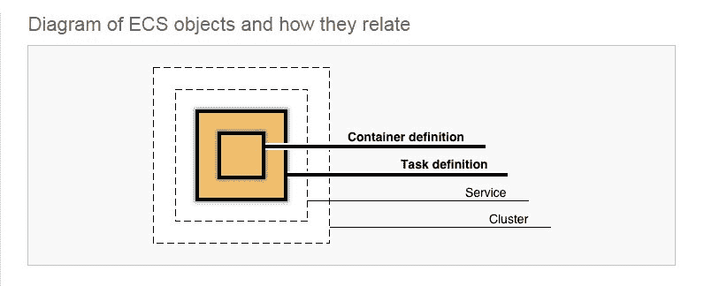
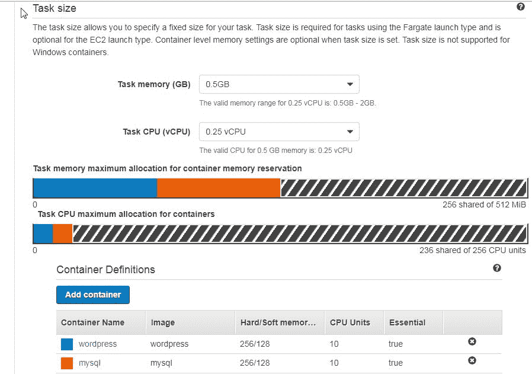

# 第一章：入门 Amazon ECS 和 Amazon Fargate

Docker 可以安装在最常用的操作系统平台上。CoreOS 预安装 Docker，并且专为运行 Docker 容器而设计。Docker for AWS 提供了一个开箱即用的 Docker swarm 模式，在这个模式中，一个节点集群（称为 swarm）提供分布式平台以运行 Docker 容器应用程序。

**问题：** 所有上述 Docker 平台仅是不同类型的 Docker 安装，并且需要在命令行中运行并管理 Docker 容器。

**解决方案：** Amazon **ECS**（**弹性容器服务**）是一个为 Docker 容器提供的托管服务，内置支持扩展、负载均衡、网络、存储、日志记录和其他 Docker 容器管理任务。Amazon ECS 支持两种启动类型：EC2 和 Fargate。

在 EC2 启动类型下，会启动 EC2 实例来运行 Docker 容器。Fargate 启动类型（于 2017 年 11 月推出）则托管封装 Docker 容器的任务。任务通过 **弹性网络接口**（**ENI**）直接向用户提供。Fargate 提供的 EC2 实例不会暴露给用户，也无法直接访问。

本章内容包括以下内容：

+   什么是 Amazon Fargate

+   Fargate 的好处

+   Amazon ECS 对象

+   Amazon ECS Fargate 中的计算资源

+   Amazon Fargate 启动类型模式中的新变化是什么？

# 什么是 Amazon Fargate

**Amazon Fargate** 是 Amazon ECS 和 Amazon **EKS**（**弹性 Kubernetes 服务**）管理的用于 AWS 上 Docker 容器编排服务的全新启动类型。在 Fargate 启动类型下，基础设施完全由 Fargate 提供。它是无服务器的，且没有 EC2 实例暴露给用户。Docker 容器在任务定义中作为容器定义进行定义。服务实现任务定义来运行一个或多个任务。每个任务与一个 ENI 关联。如果启用了任务级别的公共 IP 自动分配，则会自动将外部客户端可访问任务的公共 IP 分配给任务。任务之间通过私有 IP 进行通信。

# Fargate 的好处

ECS 的好处如下：

+   一个为容器化应用程序提供的托管服务，无需用户过多操作即可运行 Docker 应用程序

+   由多个应用程序组成的微服务在隔离的容器中运行

+   根据应用程序负载自动扩展任务

+   与其他 AWS 服务集成，包括 IAM、CloudWatch 日志、弹性负载均衡、CloudFormation 模板、EBS 卷、批处理、ECR 和 CloudTrail 日志

+   一个 **虚拟私有云**（**VPC**），没有与其他用户共享的资源

+   提供对使用 ECS 作为部署平台的 CodePipeline 的支持

+   支持最新的 Docker 版本 17.0

Fargate 提供以下额外的好处：

+   使用 Fargate 启动类型时，用户无需创建或管理任何 EC2 实例，因为集群中不会暴露任何实例。

+   任务通过 ENI 直接暴露给用户。

+   基础设施由 Fargate 提供，不需要使用 Fargate 启动类型来管理 EC2 实例。

+   CodePipeline 支持将 Fargate 作为部署平台。

+   基于任务定义中封装的容器定义的微服务是显式链接的，不需要与任何额外的选项（如链接）进行关联。

+   CloudWatch Logs 可能会自动配置。

# Amazon ECS 对象

使用 Fargate 的 Amazon ECS 对象与 EC2 启动类型相同。ECS 集群是最外层的封装，它由一个或多个服务组成。一个集群可以分布在多个可用区。服务是任务定义的实现，并运行一个或多个任务。任务定义可能有一个或多个任务版本。任务版本是一个独特的任务定义，包含一组任务，并与一个服务关联。一个 Fargate 实例与服务中的一组任务关联。任务定义由零个或多个容器定义组成。通常，一个任务定义会与一个或多个容器定义关联，且没有容器定义的任务定义将不会运行任何任务容器。ECS 对象的示意图如下：

任务定义是一个应用程序模板，描述了一个或多个容器。虽然某些属性或设置在任务级别配置，但大多数属性在容器级别配置。任务定义可能关联多个版本。

服务实现了一个任务定义，并为任务定义定义了期望的任务运行数量。服务中配置了如自动扩展和负载均衡等可选功能。

ECS 服务中的集群是一个或多个容器服务的组合。集群名称在一个账户内必须唯一。默认会提供一个名为 default 的集群。

# Amazon ECS Fargate 的计算资源

任务大小由任务内存（GB）和任务 CPU（vCPU）组成。在 EC2 启动类型中，任务大小是可选的，但在 Fargate 启动类型中，任务大小是必需的。可以选择性地定义 Docker 容器级别的内存和 CPU 设置，但这些设置会被任务定义级别的设置覆盖。只有特定的任务内存和任务 CPU 组合是受支持的，ECS 向导会通过消息指示所选值的支持值（或值范围）。例如，1GB 内存的有效 CPU 范围是 0.25 vCPU 到 0.5 vCPU。在容器级别配置的总资源（内存或 CPU）不得超过任务级别的资源设置。例如，如果一个任务定义包含两个容器（MySQL 和 WordPress），每个容器的内存限制为 128MB，则任务级别的内存必须至少为 256MB。同时，容器级别的内存总和不得超过 256MB。CPU 的配置同理。容器级别可以定义两个内存限制：软限制和硬限制。软限制对应于任务级别的`memoryReservation`属性，硬限制对应于任务级别的`memory`属性。容器的内存保留总和（软限制）不得超过任务内存。每个容器的硬限制不得超过任务级别配置的内存。容器默认必须指定最小 4GB 的内存。

以下截图展示了一个示例任务大小，其中任务内存（`memory`属性）设置为 0.5GB（512MB），任务 CPU 设置为 0.25 vCPU。在容器级别，根据两个容器定义，内存保留为每个容器 128MB，这使得任务级别分配的 512MB 内存足以容纳总共 256MB 的内存保留。无论是否使用，任务大小都会分配给任务。同样，每个容器配置的 CPU 单元数为 10，这使得容器内的 CPU 单元总数为 20，而任务级别分配的 CPU 单元数为 25。参考以下截图：

容器的任务大小配置和分配

# 亚马逊 Fargate 启动类型模式有什么新变化？

除了前面讨论的 Fargate 的优势外，Fargate 还支持以下新功能：

+   网络模式`awsvpc`是唯一受支持的模式

+   Fargate 启动类型的网络模式（`awsvpc`）不支持主机端口映射，应用程序暴露的主机端口与容器端口相同

+   为 Fargate 启动类型新增了`ecsTaskExecutionRole`，以允许拉取 Docker 镜像并将日志发送到 CloudWatch Logs

+   仅支持`awslogs`日志配置和`awslogs`日志驱动程序与 CloudWatch Logs。

+   不支持任务放置，因为没有 ECS 实例来定义放置约束

+   仅支持来自 Docker Hub 和 Amazon ECR 的 Docker 镜像。

+   Fargate 启动类型不支持特权 Windows 容器

+   主机设备不能暴露给容器

+   Fargate 启动类型不支持 `host` 和 `sourcePath` 参数用于卷

# 总结

在本章简介中，我们讨论了使用 Fargate 启动类型的好处，计算资源如何在 Fargate 启动类型下分配和配置，使用 Fargate 的 ECS 对象与 EC2 启动类型的相同之处，以及 Fargate 中的新特性。在下一章，我们将讨论与 Fargate 配合使用的网络配置。
