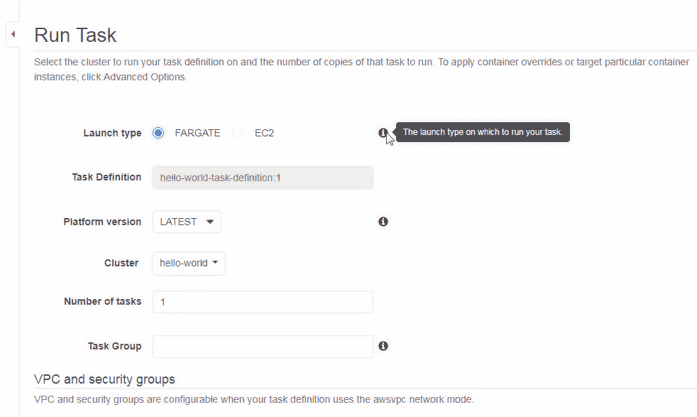
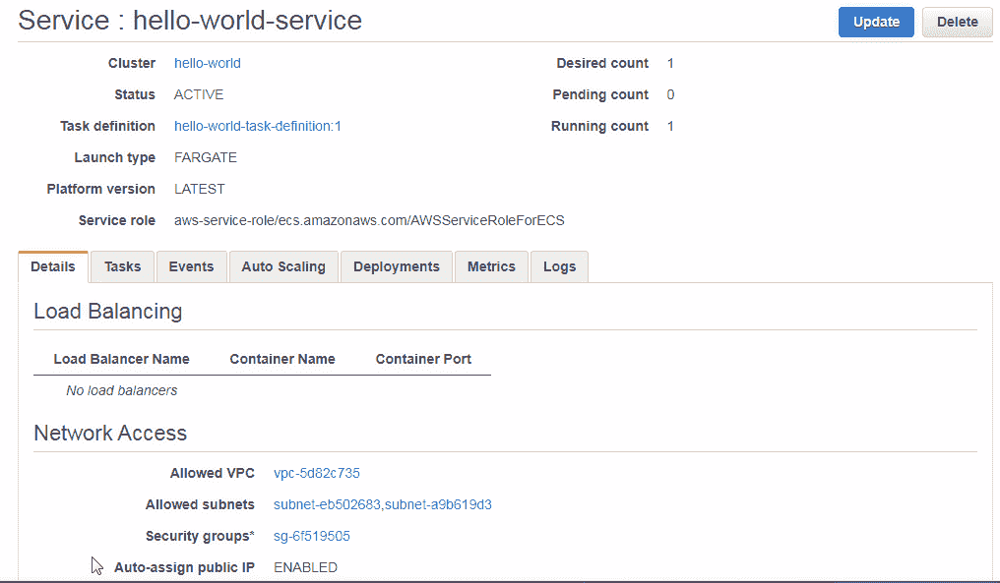

# 网络配置

Amazon ECS 是一种用于容器化应用程序的托管服务，基于 Docker 容器。托管服务意味着 ECS 管理所有容器编排方面的工作，包括启动虚拟机集群（EC2 实例）、在虚拟机上创建和调度容器以及扩展虚拟机集群。

**问题：** Amazon ECS 在虚拟机（EC2 实例）上运行 Docker 容器。EC2 启动类型会增加启动和管理虚拟机集群（EC2 实例）的开销。作为 ECS 的入门，任务定义定义了一组容器（容器定义）。容器定义包括名称、Docker 镜像、端口映射、入口点和命令。资源（CPU 和内存）在任务和容器级别进行定义。服务定义定义了一个服务，并由任务定义、启动类型、负载均衡器、网络配置、部署配置和部署组成。使用 EC2 启动类型的 ECS 集群如下所示：

使用 EC2 启动类型的 ECS 集群

**解决方案：** Amazon Fargate 引入了无服务器 ECS，并且不运行虚拟机（VM）。Fargate 的基础架构是 Fargate 平台。用户不需要管理底层实例，这使得 Fargate 成为一种**基础设施即服务**（**IaaS**）。Fargate 的主要好处是用户不需要管理任何服务器。用户无需配置、管理和扩展虚拟机集群。使用 Fargate，用户不需要创建或管理任何 EC2 实例，也不需要管理集群的容量和调度。用户只需要定义容器和任务的 CPU 和内存资源需求，Fargate 会在需求波动时进行自动扩展。使用 Fargate 启动类型时，ECS 仍然可以与所有相同的 AWS 服务集成，包括 IAM、VPC 和 CloudWatch，就像 EC2 启动类型一样。EC2 启动类型选项仍然可用。下图展示了使用 Fargate 启动类型的 ECS 集群。Fargate 启动类型唯一支持的网络模式是 `awsvpc`，并且为任务在 VPC 中创建弹性网络接口以提供任务访问。ECS 集群可以由多个可用区中的 Fargate 管理任务组成，以实现高可用性：

使用 Fargate 启动类型的 ECS 集群

随着 Fargate 启动类型的引入，任务定义、容器定义和服务定义中的一些设置与 EC2 启动类型有所不同。Fargate 相关的配置参数将在后续章节中讨论。

在本章中，我们将学习以下内容：

+   创建 ECS 集群

+   配置容器定义

+   配置任务定义

+   配置服务

+   配置和创建集群

+   运行额外的任务

+   访问服务

+   删除集群

唯一的前提条件是一个 AWS 账户，可以在[`aws.amazon.com/resources/create-account/`](https://aws.amazon.com/resources/create-account/)创建。

# 创建 ECS 集群和服务

选择 Amazon ECS 并点击“开始使用”以开始创建 ECS 集群和服务。首先，配置容器定义和任务定义，然后配置服务和集群，创建 ECS 对象——集群、服务、任务定义和容器定义。我们将在以下小节中讨论如何配置这些。

# 配置容器定义

亚马逊 ECS 向导开始启动。ECS 对象的示意图将显示，如第一章所示，*开始使用 Amazon ECS 和 Amazon Fargate*。默认情况下，使用 Fargate 启动类型。首先，需要定义容器定义，然后是任务定义。

任务定义由一个或多个容器定义组成。大多数属性在容器定义中定义，但有一些在任务级别定义。首先，选择一个容器定义模板，包括图像，从列出的模板中选择，包括 sample-app 和 nginx，或创建自定义容器定义。

+   单击“配置”以创建自定义容器定义，如下截图所示：

+   编辑容器对话框显示。容器的标准配置包括以下表格中讨论的字段：

| **字段** | **描述** |
| --- | --- |
| 容器名称 | 要创建的 Docker 容器的名称。 |
| 镜像 | Docker 镜像。 |
| 端口映射 | 容器端口映射。Fargate 不支持主机端口映射，默认与容器端口映射值相同。 |

+   指定容器名称（`hello-world`）。单击 i 图标以显示容器名称的提示框。容器名称最多可以包含 255 个字符（大小写字母、数字、连字符和下划线）。

+   接下来，指定一个 Docker 镜像（`tutum/hello-world`）。镜像名称最多可以包含 255 个字符（大小写字母、数字、连字符、下划线、冒号、句点、`/`和井号）。Fargate 启动类型仅支持 Amazon ECR 或 Docker Hub 公共仓库中的镜像。

+   接下来，指定内存限制（以 MiB 为单位）。可以指定两个内存限制：软限制和硬限制。可以指定其中一个或两个。指定一个或两个的效果在以下表格中讨论：

| **配置的内存类型** | **描述** |
| --- | --- |
| 软限制 | ECS 为容器保留指定的内存量（`memoryReservation`）。容器可以请求超过软限制的更多内存，最多可达到容器实例上所有可用内存。 |
| 仅硬限制 | 容器请求的内存不能超过硬限制。 |
| 软限制和硬限制 | ECS 为容器保留了指定的内存量（`memoryReservation`）。如果指定了软限制，容器可以请求超出软限制的更多内存，直到达到硬限制，或者容器实例上可用的所有内存，以先到为准。如果两者都指定了，硬限制必须大于或等于软限制。 |

+   内存限制的下拉框列出了硬限制和软限制。软限制的默认值是 128 MiB。要在软限制之外添加硬限制，请点击添加硬限制链接。硬限制被添加。内存限制如下所示。软限制（`128` MiB）小于硬限制（`256` MiB）：

+   接下来，指定端口映射。使用 Fargate 启动类型时，暴露的端口必须指定为容器端口。容器端口`80`如下所示指定。主机端口默认与容器端口相同，且不能使用 Fargate 启动类型所使用的`awsvpc`网络模式设置为不同的值：

+   可选地，指定高级容器配置，包括环境、网络设置、存储和日志、资源限制以及 Docker 标签的配置。虽然在任务定义级别内存和 CPU 配置是必需的，但在容器级别是可选的。唯一的要求是，任务中所有容器的总内存不得超过任务为其配置的内存，所有容器的总 CPU 不得超过任务为其配置的 CPU。容器实例为每个 CPU 核心提供 1,024 个 CPU 单元。如果容器的 Essential 复选框被选中，则容器失败会导致整个任务失败。任务中至少有一个容器必须设置为必需容器，这意味着如果任务只有一个容器，它必须是必需的，如下所示：

+   Fargate 启动类型仅支持`awsvpc`网络模式。Fargate 启动类型仅支持 awslogs 作为日志配置和日志驱动程序。配置完自定义容器后，点击更新，如下所示：

+   hello-world 自定义容器的容器定义被添加如下：

# 配置任务定义

任务定义有一个默认名称，可以进行修改。网络模式为 awsvpc，无法修改。任务执行角色为“Create new”。任务执行角色是 ECS 所假定的 IAM 角色，用于访问任务所需的资源，并包括拉取私有 Docker 镜像和发布任务日志的权限。兼容性（启动类型）为 FARGATE。任务内存默认是 0.5 GB，任务 CPU 默认是 0.25 vCPU。默认的任务定义如下所示：

+   点击“Edit”修改任务设置（如有需要）：

+   将显示配置任务定义窗口，如下图所示。指定任务定义名称（`hello-world-task-definition`），并选择任务执行角色（或保持默认角色）：

+   任务大小是任务使用的总 CPU 和内存。任务内存和任务 CPU 值构成一个内存范围，必须指定该 CPU 支持的内存值。有关某个 CPU 支持的内存范围，请参考[`docs.aws.amazon.com/AmazonECS/latest/developerguide/task_definition_parameters.html`](https://docs.aws.amazon.com/AmazonECS/latest/developerguide/task_definition_parameters.html)中的任务大小表格。如果任务内存不在所选任务 CPU 的支持范围内，将会产生错误。将任务内存设置为 1 GB，任务 CPU 设置为 0.5 vCPU。点击“Save”以保存任务配置，如下所示：

+   配置完容器定义和任务定义后，任务定义摘要将显示在下图中。点击“Next”完成容器和任务定义：

# 配置服务

接下来，配置服务。服务的默认设置会创建一个任务，数量由“Number of desired tasks”指定。创建服务后，可以根据后续章节讨论的方法添加更多任务。系统会自动创建一个新的安全组，安全组字段/标签会显示该信息，并且不会提供创建自定义安全组的选项。创建的安全组允许所有公共流量访问容器端口。网络访问和安全组可以在向导之外进一步配置。默认情况下，负载均衡器类型为“None”，可以选择“Application Load Balancer”。有关使用应用程序负载均衡器的内容，请参阅第六章，《*使用应用程序负载均衡器*》。

如果要添加应用程序负载均衡器，必须在创建 ECS 集群之前创建它。

+   点击“Next”完成服务配置：

# 配置和创建集群

接下来，配置集群：

+   指定集群名称（`hello-world`），默认集群名称为 default。

+   VPC ID 设置指定容器将使用的 VPC 的 ID。默认情况下，会自动创建一个新的 VPC。子网设置指定容器将使用的子网的 ID。子网是 VPC 中的一个 IP 地址范围。默认情况下，新的子网会自动创建。点击“下一步”完成集群配置：

+   审核要创建的 ECS。要修改任务定义、服务或集群，点击相关的“编辑”。要以 Fargate 启动类型创建 Amazon ECS，点击“创建”：

+   使用 Fargate 启动类型的 Amazon Elastic Service 开始创建。显示的启动状态指示资源状态为“已完成”或“待处理”。“已完成”状态表示资源已创建，而“待处理”状态表示资源正在创建过程中。当所有服务资源创建完成后，点击查看服务：

显示服务摘要。除了服务名称，服务摘要还包括集群、状态、任务定义、启动类型、平台版本、服务角色、期望数量、待处理数量和运行数量。默认选中“详细信息”选项卡。由于我们没有添加负载均衡，负载均衡头显示为“没有负载均衡器”。网络访问头列出了“自动分配公共 IP”为“启用”，所有信息如下所示：

若要列出服务中的任务，请选择“任务”选项卡。列出了一个任务，因为我们只配置了一个任务。任务状态为“正在运行”或“已停止”。任务表的列包括任务（名称）、任务定义、最后状态、期望状态、组、启动类型和平台版本：

“事件”选项卡列出了事件。每个事件都关联有事件 ID、事件时间和消息：

“部署”选项卡列出了任务放置策略和约束条件。Fargate 启动类型不支持任务放置约束：

若要显示度量标准，包括 CPU 使用率和内存使用率，请选择“度量标准”选项卡。最小值、最大值和平均值有颜色编码，详见截图中的图例：

若要显示日志，请选择“日志”选项卡：

集群列表中列出了一个 Fargate 启动类型的 hello-world 集群，没有显示 EC2 集群：

为 ECS 集群创建一个 CloudFormation 堆栈，如下图所示的 CloudFormation 仪表板。可以通过 [`us-east-2.console.aws.amazon.com/cloudformation`](https://us-east-2.console.aws.amazon.com/cloudformation) 访问 AWS CloudFormation 仪表板。表格列出了堆栈，包括堆栈名称、创建时间、状态和描述等列。提供了概览、输出、资源、事件、模板、参数、标签、堆栈策略和更改集等标签。事件标签显示已创建资源的 CREATE_COMPLETE 状态：

# 运行附加任务

默认情况下，创建一个任务。在本节中，我们将讨论添加附加任务的过程。集群中的任务选项卡显示与集群相关的任务：

与服务关联的任务列在服务页面上。要显示任务定义的详细信息，请单击服务页面或集群页面中任务定义的链接。任务定义如下图所示：

+   要运行新任务，请选择操作 | 运行任务。新任务将在“运行任务”下创建：

+   提供了两种任务启动类型来运行新任务：Fargate 和 EC2。选择 Fargate 启动类型，如下图所示。

+   任务定义名称**已预先指定**。默认情况下，平台版本为 LATEST。

+   也可以选择集群，如果有多个集群可用，则可以从下拉列表中选择集群。

+   指定要创建的任务数量。

+   可选地，指定一个任务组。任务组是一组相关任务，所有在同一任务组中的任务在执行扩展部署时被视为一个集合。必填字段以星号（*）标记：

+   从下拉菜单中选择一个集群 VPC，如下图所示。

+   在子网下拉菜单中选择子网。选择任务调度器应考虑用于部署的选定 VPC 中的子网。目前仅支持私有子网。

+   选择自动分配公共 IP 为 `ENABLED`。默认情况下，会创建一个安全组，并将端口 `80` 对外开放：

+   高级选项包括任务覆盖和容器覆盖，如下图所示。我们没有设置任何高级选项：

+   点击“运行任务”以运行新任务，如下图所示：

创建一个任务。消息“成功创建任务”将显示。尽管只有一个新任务被创建，消息中仍会包括“任务”一词，因为该消息是标准的任务创建消息，适用于创建一个或多个新任务。新任务将列在任务标签页中，如下截图所示。最后状态列显示任务状态为运行中。最初，最后状态是“正在配置”：

该 hello-world 集群列出了两个正在运行的任务，如下截图所示。待处理任务数列为 0：

# 访问服务

为了能够访问服务，网络访问应配置为启用自动分配公共 IP，如下截图所示：

为了提供网络访问，每个任务都会创建一个 ENI。该 ENI 会关联一个公共 IP，可用于访问运行在任务容器中的应用程序：

+   点击服务 | 任务中的任务链接，如下截图所示：

+   在任务详细页面中，点击 ENI Id 的链接，如下截图所示：

+   从 ENI 控制台复制 IPv4 公共 IP，如下截图所示的 18.219.111.138，不同用户会有不同的 IP：

+   在浏览器中指定 IPv4 公共 IP 来调用 Hello World 应用程序，如下截图所示：

# 删除集群

要删除集群，该集群不能有正在运行的任务：

+   选择所有正在运行的任务，然后点击停止，如下截图所示。或者，选择停止所有，而不选择任何任务：

+   在停止任务确认对话框中，点击停止。任务将停止，屏幕上会显示“任务已成功停止”的信息。

+   点击删除集群以删除该集群：

+   在删除集群确认对话框中，点击删除。hello-world 集群将被删除。如果与集群关联的 CloudFormation 堆栈在集群删除之前超时，则会显示错误消息，如下截图所示，并且集群不会被删除。如果选择删除 ECS 集群时，CloudFormation 堆栈没有自动删除，请点击错误消息中的查看 CloudFormation 堆栈链接：

+   在 CloudFormation | 堆栈仪表盘中，选择 CloudFormation，并点击操作 | 删除堆栈，如下截图所示。在堆栈状态变为 DELETE FAILED 后，可能需要启动删除堆栈操作：

+   在删除堆栈确认对话框中，选择所有要删除的资源，以及 CloudFormation 堆栈，然后点击“是，删除”。CloudFormation 将被删除。在 CloudFormation 堆栈删除后，删除 ECS 集群，ECS 集群也将被删除。

# 总结

在本章中，我们介绍了与 ECS 集群一起使用的 Fargate 启动类型。我们创建了一个集群，包括容器、任务和服务定义，使用了 Hello World Docker 镜像。随后，我们通过与任务关联的弹性网络接口（ENI）的 IPv4 公共 IP 调用了 Hello World 应用程序。与 EC2 启动类型相比，某些容器定义和任务定义参数在 Fargate 启动类型中有所不同，而 EC2 启动类型仍然作为 ECS 的一个可选项存在。在下一章中，我们将讨论将 CloudWatch Logs 服务与 Fargate 集成。
