# 第三章：使用 CloudWatch Logs

Docker 容器生成日志，Docker 支持`docker logs`和`docker service logs`命令来列出日志。Docker 还支持日志驱动，这是获取正在运行的容器和服务生成的日志的机制。

**问题**：没有像 Amazon ECS 这样的托管服务时，必须配置日志驱动才能添加日志机制。

**解决方案**：使用 Fargate 启动类型，日志记录大大简化，唯一支持的日志驱动是`awslogs`。`awslogs`日志驱动将 ECS 任务生成的日志流式传输到 CloudWatch Logs。通过使用`aws-logs-prefix`，可以为`awslogs`驱动程序关联一个标签，以区分由不同任务容器生成的日志流。

本章我们将学习以下内容：

+   CloudWatch Logs 和 aws 日志驱动概述

+   为 MySQL 数据库创建 ECS 服务

+   配置容器定义

+   配置日志记录

+   配置任务定义

+   配置服务

+   配置集群

+   创建 ECS 服务

+   浏览任务日志

+   浏览 CloudWatch 日志

+   浏览 CloudWatch 指标

唯一的前提条件是拥有一个 AWS 账户。

# CloudWatch Logs 和 aws 日志驱动概述

Amazon CloudWatch 是 AWS 的一个服务，用于监控 AWS 资源的日志，包括 Amazon ECS、EC2、EBS 卷、弹性负载均衡器和 RDS。CPU 利用率、内存利用率、延迟和请求计数的指标从这些资源流式传输到 CloudWatch，接近实时。一些 CloudWatch 的术语和概念在下表中讨论：

| **CloudWatch 概念** | **描述** |
| --- | --- |
| 日志事件 | 一个`日志事件`，包括日志消息和时间戳，是记录某个资源或应用程序上的某个事件/活动的记录。 |
| 日志流 | 一个`日志流`是来自同一资源或应用程序的连续日志事件序列。 |
| 日志组 | 一个`日志组`是一个共享相同保留、监控和访问控制设置的日志流的集合。每个日志流都与一个日志组关联，日志组中的日志流不必来自相同的资源或应用程序。通常，日志流来自不同的资源或应用程序，而日志组则聚合类似的监控数据。 |
| 指标过滤器 | 指标过滤器从事件中过滤出指标观察数据，以生成 CloudWatch 指标的数据点。 |
| 保留设置 | 保留设置指示日志事件应保持的时间长度。 |

`awslogs`日志驱动是 Fargate 启动类型支持的唯一日志驱动。`awslogs`日志驱动支持下表讨论的选项。除了下表讨论的选项，`awslogs`日志驱动还支持其他选项，但 ECS 仅支持这些选项：

| **选项** | **描述** | **是否必需** |
| --- | --- | --- |
| `awslogs-region` | 指定 CloudWatch 日志发送的 Amazon 区域。 | 是 |
| `awslogs-group` | 指定日志流发送日志的日志组。 | 是 |
| `awslogs-stream-prefix` | 指定要与日志流关联的前缀。使用 Fargate 启动类型生成的日志流具有以下格式：`prefix-name/container-name/ecs-task-Id`。 | 是，适用于 Fargate 启动类型 |

# 为 MySQL 数据库创建 ECS 服务

在本节中，我们将创建一个用于 MySQL 数据库的 ECS 定义来演示日志记录。可以使用任何 Docker 镜像；选择 MySQL 数据库镜像是因为在初始化、安装和配置 MySQL 数据库时会生成多个日志事件。另一种 Docker 镜像，如`tutum/hello-world`，不会生成很多日志事件。

1.  在浏览器中打开[URL](https://aws.amazon.com/ecs/)，点击“开始使用 Amazon ECS”。ECS 控制台将启动。

1.  点击“开始”以启动向导来创建新的容器和任务定义，以及新的服务。默认情况下，ECS 向导基于 Fargate 启动类型。将显示 ECS 对象的图示。

ECS 对象在第一章中讨论，*《Amazon ECS 和 Amazon Fargate 入门》*。

# 配置容器定义

在本节中，我们将讨论如何为 MySQL 数据库创建容器定义：

1.  点击“配置自定义容器定义”，如以下截图所示。其他一些容器定义可以作为示例：

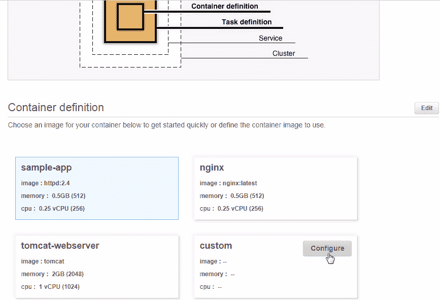

1.  在编辑容器对话框中，指定容器名称（`mysql`），并将镜像指定为`mysql`，如以下截图所示。

1.  为内存指定软限制（`512`）和硬限制（`1024`）。内存的硬限制不得小于软限制：

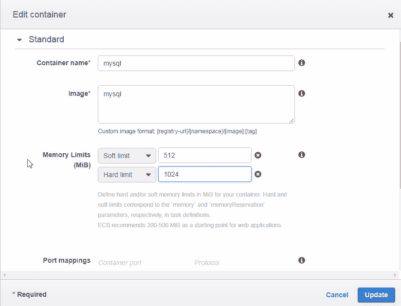

1.  在端口映射中将容器端口指定为`3306`，协议选择 tcp，如以下截图所示。在 Fargate 启动类型下，仅容器端口映射可以配置，主机端口映射无效，并且被设置为与容器端口映射相同的值：

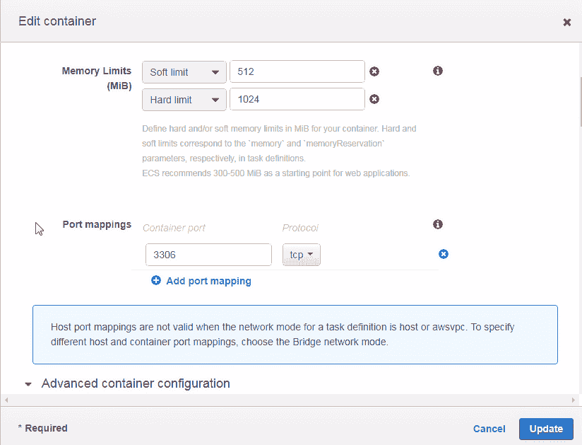

1.  在“高级容器配置”|“环境”部分，指定 mysql Docker 镜像的必需环境变量。必需的环境变量是`MYSQL_ROOT_PASSWORD`，用于设置`root`用户的密码，如以下截图所示。可选地，指定其他环境变量，如`MYSQL_DATABASE`，用于创建数据库。

1.  “必需”复选框表示容器是否对任务的运行至关重要。如果选择了“必需”复选框，则表示容器是必需的，如果容器失败，任务也会失败。任务定义中必须至少有一个容器被设置为必需。由于 mysql 容器是唯一的容器，它必须设置为必需：

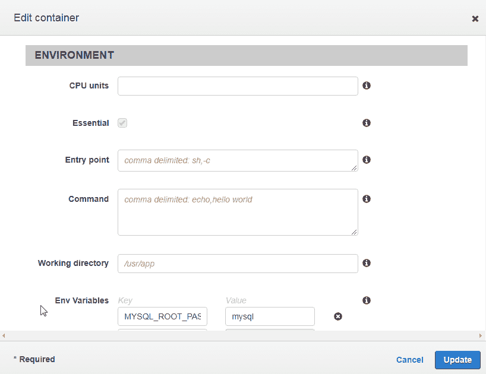

# 配置日志记录

向下滚动到“存储和日志”部分，在编辑容器对话框中，如下所示：

1.  若要自动配置日志记录，勾选“自动配置 CloudWatch Logs”复选框。Fargate 启动类型仅支持`awslogs`日志驱动程序：

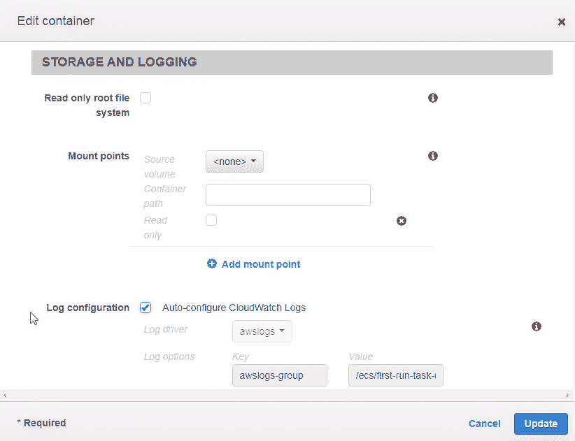

1.  如前表所述的所有日志选项对 Fargate 启动类型是强制性的，每个选项的默认值都会被设置。`awslogs-group`选项设置为`/ecs/<task definition name>`。如果在配置日志记录后修改了任务定义名称，`awslogs-group`也会更新。点击“更新”以完成容器配置：

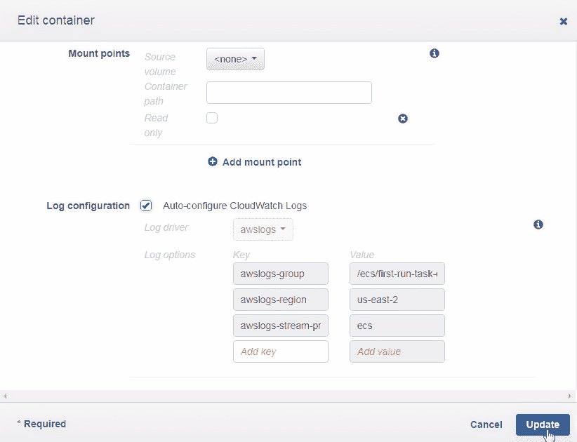

添加的`logConfiguration`参数用于日志配置，如下所示：

```
{
            "containerDefinitions": [{
                        ...
                        "logConfiguration": {
                                    "logDriver": "awslogs",
                                    "options": {
                                                "awslogs-group": "/ecs/mysql-task-definition",
                                                "awslogs-region": "us-east-1",
                                                "awslogs-stream-prefix": "ecs"
                                    }
                        }
                        ...
            }]
}
```

为 MySQL 数据库创建了名为 mysql 的容器定义，如下图所示。

# 配置任务定义

列出了默认的任务定义设置。某些任务定义设置可以修改，某些则不可修改。网络模式不可修改，必须为 awsvpc。兼容性也不可修改，必须设置为 FARGATE。修改任务定义是可选的：

1.  要修改任务定义，请点击任务定义 | 编辑，如下所示：

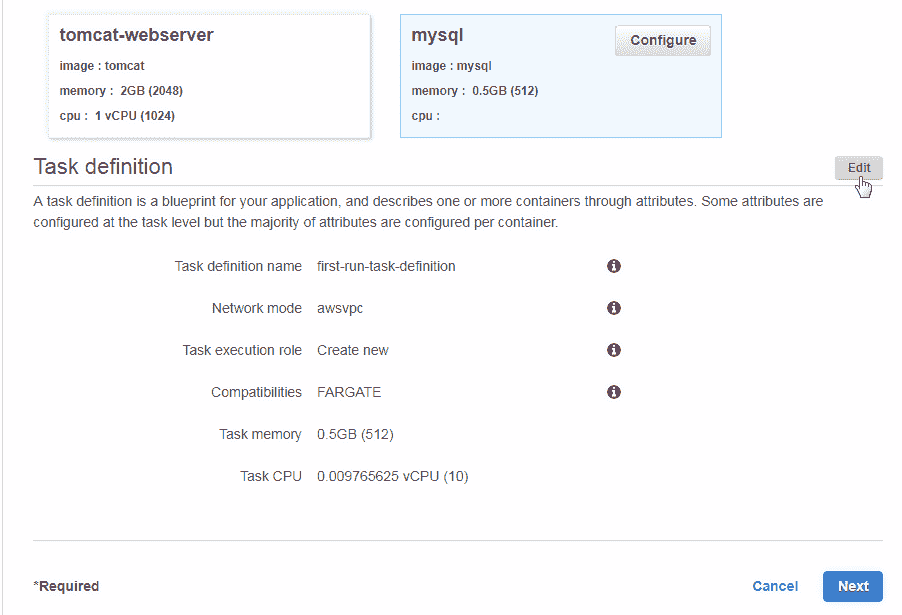

1.  在“配置任务定义”对话框中，设置任务定义名称（`mysql-task-definition`），如下所示：

1.  对于 Fargate 启动类型，网络模式不可修改，必须为 awsvpc。

1.  选择任务执行角色为 ecsTaskExecutionRole。ecsTaskExecutionRole 授予权限以调用 CloudWatch 发送容器日志。

1.  兼容性已预设为 FARGATE，且不可修改。

1.  设置任务大小，它将分配选定的任务内存和 CPU 给任务。只能选择特定的任务内存和任务 CPU 组合。

1.  点击“保存”以完成任务定义配置：

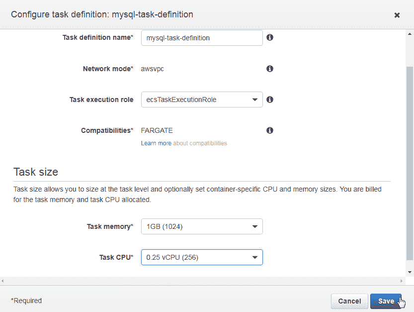

1.  任务配置已保存。`awslogs-group`已更新为`/ecs/mysql-task-definition`。如以下截图所示，点击“下一步”进入开始向导：

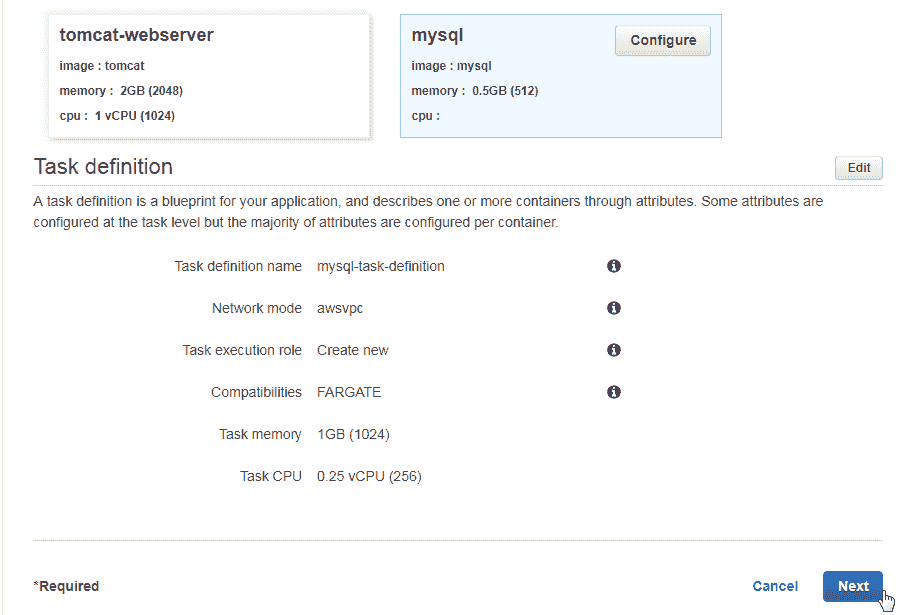

# 配置服务

在配置了容器定义和任务定义之后，接下来配置服务。服务名称（`mysql-service`）、所需任务数量（默认为 1）、安全组（自动创建新安全组）和负载均衡器类型（无）可以根据需要通过“编辑”进行修改。我们将使用服务的默认设置来演示 Fargate 日志记录。点击“下一步”，如下所示：

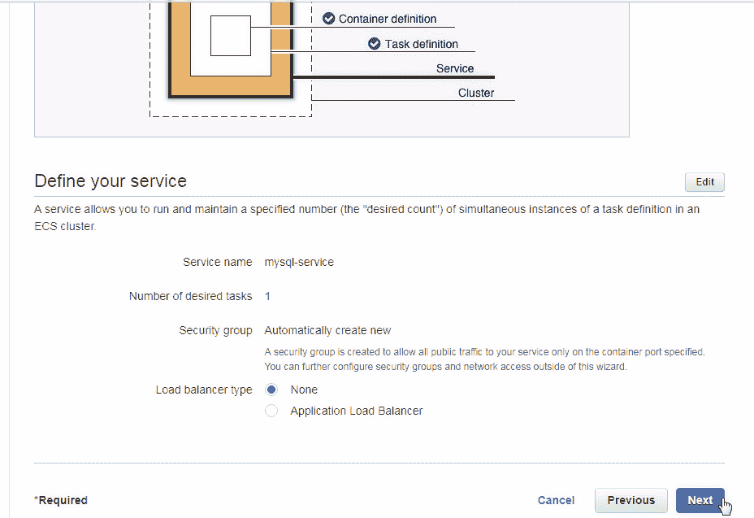

# 配置集群

接下来，配置集群。默认情况下，在“集群名称”中指定了默认集群：

+   指定不同的集群名称（`mysql`）。

+   VPC ID 和子网的默认设置为创建新的。点击“下一步”：

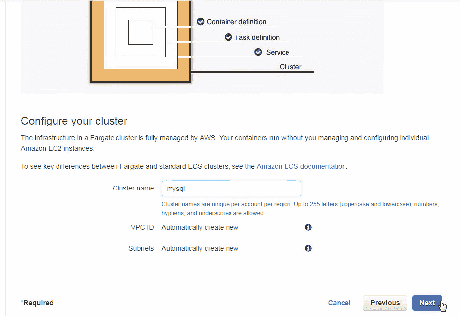

# 创建 ECS 服务

查看容器定义、任务定义和服务的设置。提供了编辑按钮，可以编辑这些 ECS 对象：

1.  要使用 Fargate 启动类型创建 ECS，点击“在审核中创建”，如下图所示：

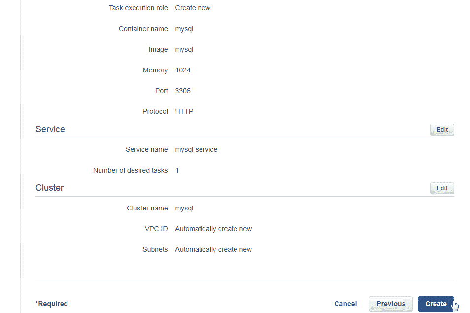

1.  ECS 资源开始创建，如下图中的启动状态所示。部分资源显示为待处理状态，而其他资源显示为已完成状态。当所有 ECS 资源都已创建完毕，状态显示为“完成”时，点击“查看服务”：

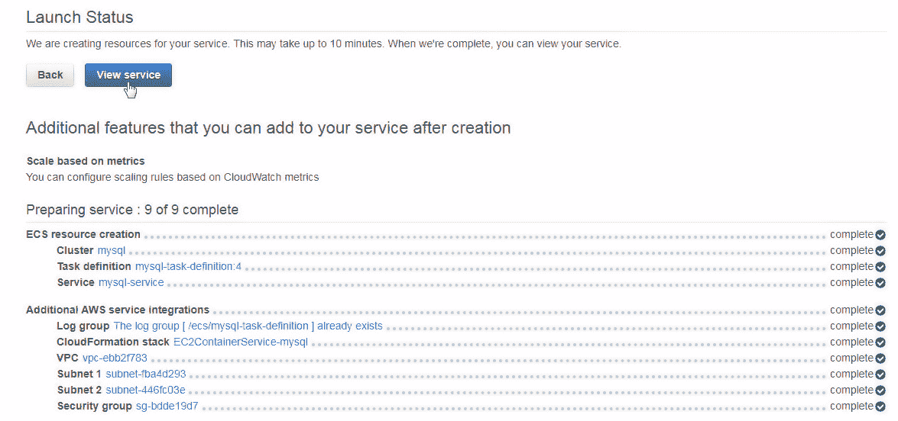

在`mysql`集群中创建了一个 ECS `mysql-service`，如以下截图中的 mysql 集群的服务选项卡所示：

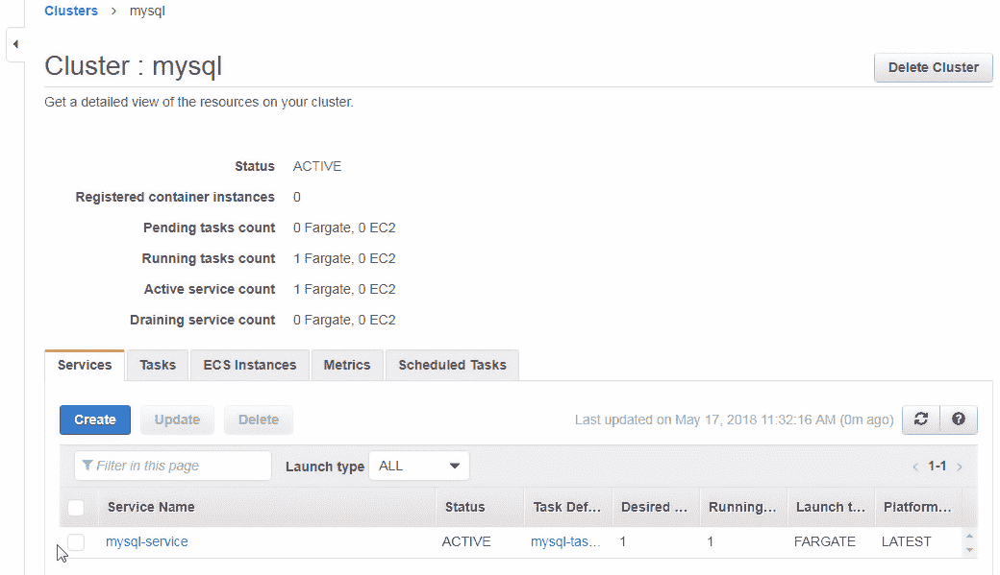

任务选项卡列出了服务中的任务，如下图所示。点击任务链接以列出任务的详细信息：

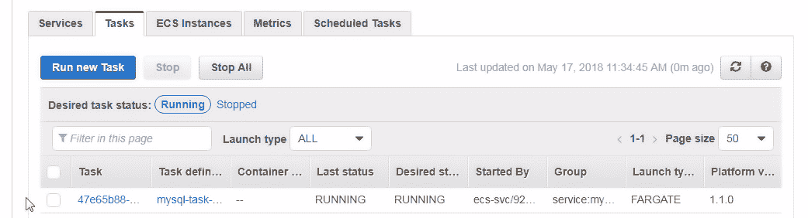

显示任务详细信息，包括截图中显示的 ENI Id 链接，以便获取 ENI 的详细信息。任务定义的公共 IP 和私有 IP 也会列出：

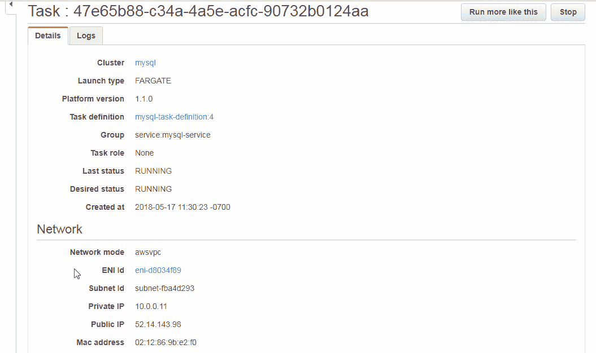

点击边栏导航中的任务定义，列出任务定义，包括修订版本，以任务定义名称：修订格式显示，如下图所示。其他任务定义也可能被列出。任务定义的状态显示为“活动”，表示该任务定义是活动的，可以在服务中用于运行任务：

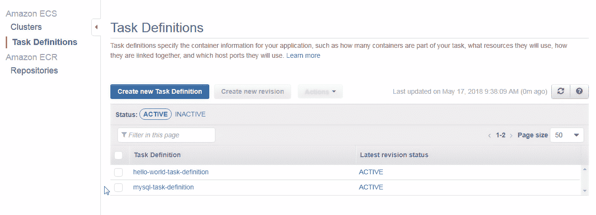

点击任务定义链接，列出任务定义的修订版本，如下图所示：

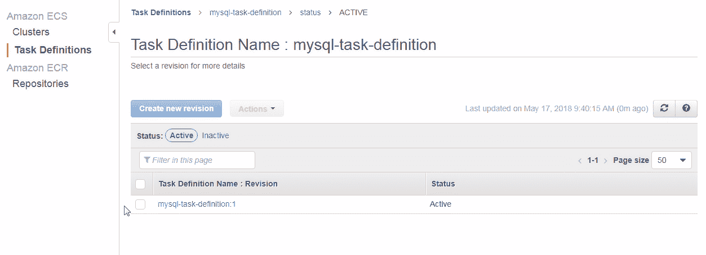

点击任务定义修订链接，显示构建器和 JSON 格式选项卡，如下图所示。要创建任务定义的新修订，点击“创建新修订”。我们没有使用新的修订，但新修订会基于修订后的任务定义创建一组新的任务：

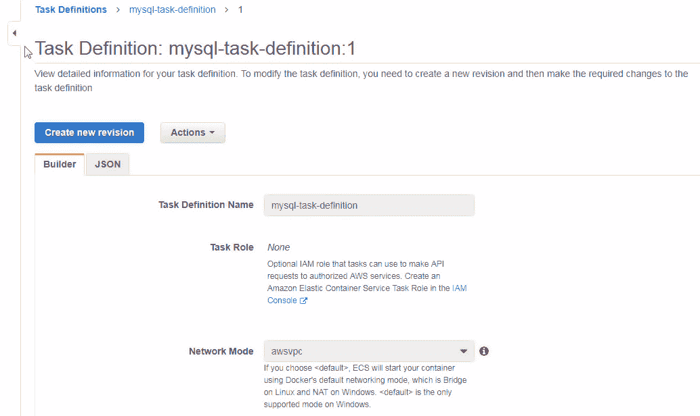

mysql 容器列在容器定义部分。容器定义表列出了容器名称、Docker 镜像、CPU 单元、硬/软内存限制以及容器是否是必需的。点击 mysql 容器以显示其详细信息，包括日志配置，如下图所示。详细配置包括端口映射和环境变量：

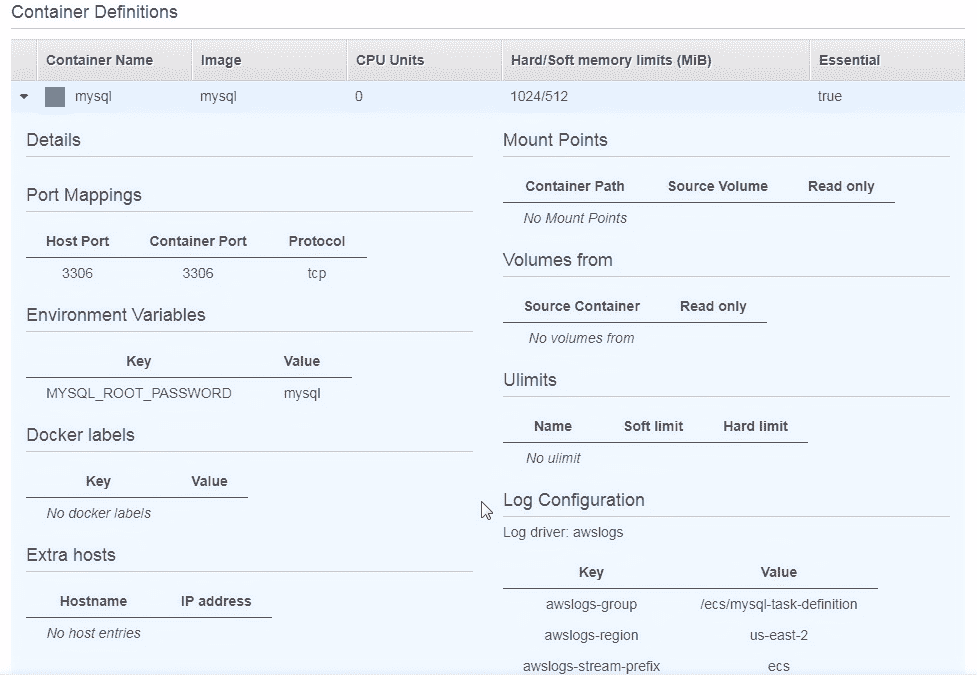

mysql 集群列出了集群，如下图所示。还列出了服务数量、正在运行的任务数量和待处理任务数量。仅 FARGATE 启动类型列出服务和任务，而 EC2 启动类型则不列出：

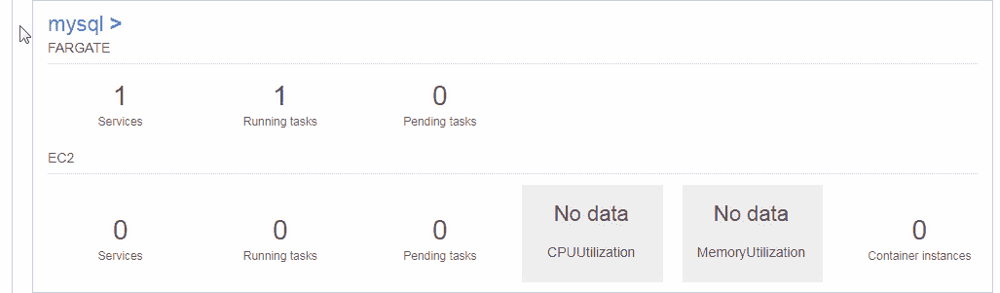

# 探索任务日志

任务日志事件通常用于调试任务或服务，以及查明任务是否无错误启动。任务生成的日志事件通过在任务详情中选择“日志”标签进行显示，如下图所示。每个日志条目包括时间戳和日志消息。调试任务的一个示例是 MySQL 初始化进程失败消息：

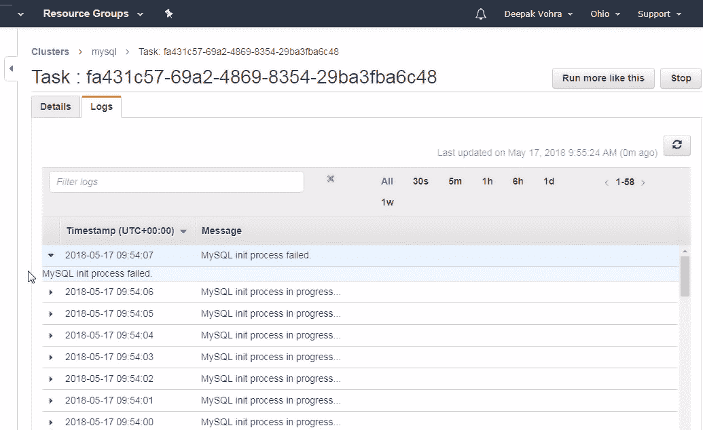

任务可能由于多种原因失败，常见的一些原因包括：

+   任务内存不足

+   强制环境变量尚未设置

+   分配给容器或任务的 CPU 不足

一个示例日志条目，其中显示 MySQL 数据库正在运行并接受连接的消息是 mysqld: ready for connections，如下图所示：

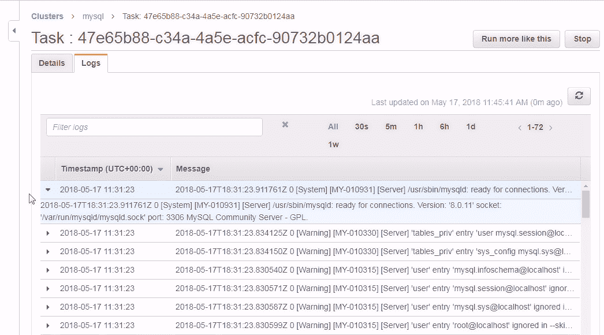

# 探索 CloudWatch 日志

在本节中，我们将查找生成的 CloudWatch 日志的详细信息，并展示生成的日志流：

1.  点击 CloudWatch 控制台中的“日志”，如以下截图所示：

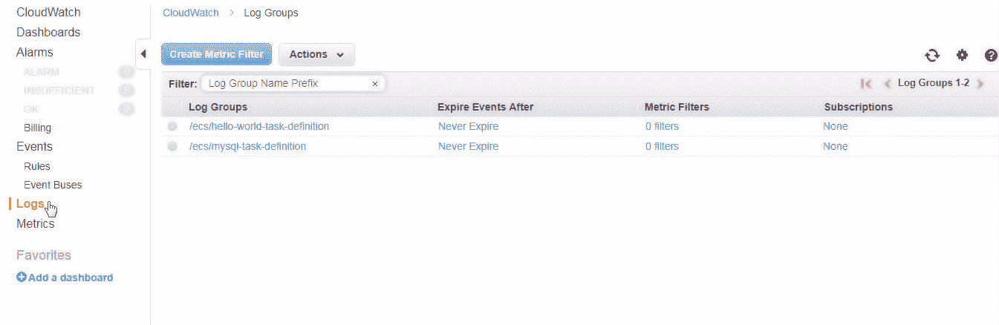

1.  在筛选器中，指定 `/ecs/mysql` 或仅 `/ecs`，这是 `awslogs` 日志驱动程序中 `awslogs-stream-prefix` 选项的值，如在 *配置日志记录* 部分的容器定义中配置。日志组 `/ecs/mysql-task-definition` 会显示，如下图所示：

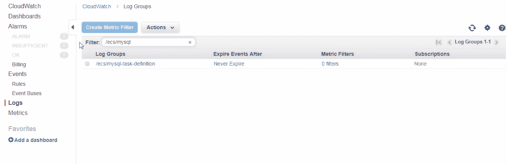

1.  点击日志组以显示日志流，如下图所示：

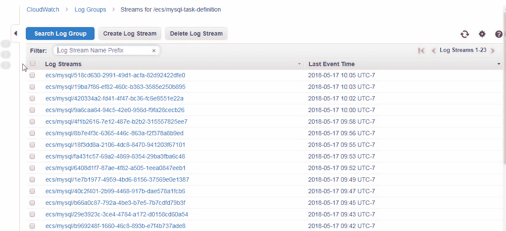

日志流中的日志事件会显示。每个日志事件都与时间戳和日志消息关联。一个示例日志消息是 Initializing database，如下图所示。一些消息带有 [Warning] 标记：

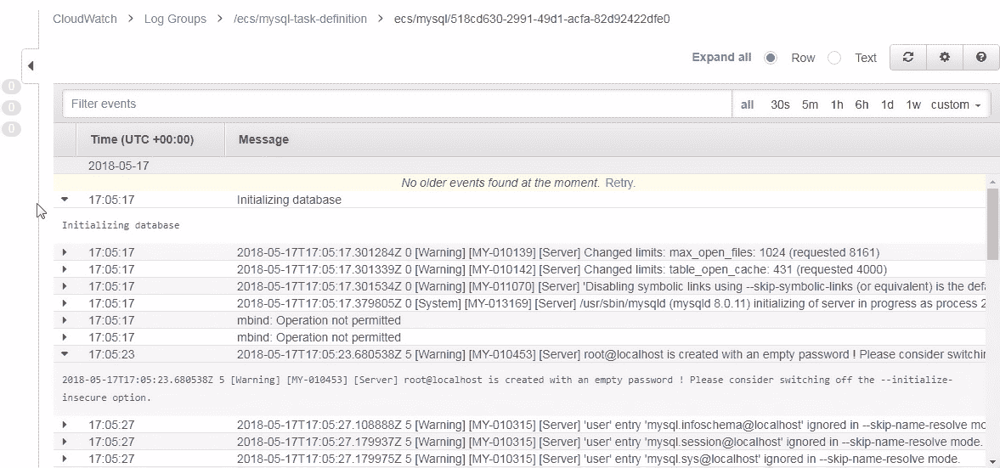

一个 CloudWatch 日志消息，表示 MySQL 数据库正在运行并接受连接的消息是 mysqld: ready for connections，如下图所示：

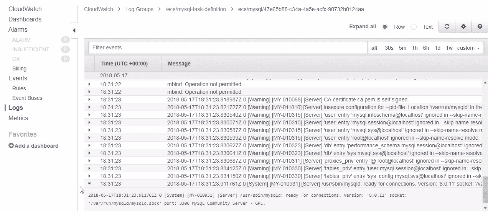

# 探索 CloudWatch 指标

在本节中，我们将展示指标：

1.  点击导航中的“指标”，如以下截图所示。筛选 mysql 服务的指标，选择 All | ECS ClusterName | ServiceName，以显示所有指标，包括 MemoryUtilization 和 CPUUtilization 指标：

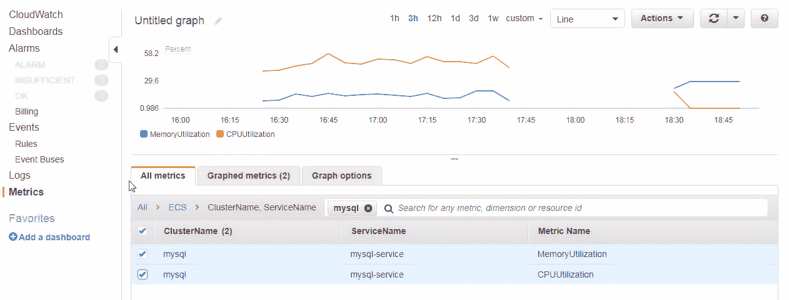

1.  并非所有的度量标准都可以被绘制，尽管任务生成的 MemoryUtilization 和 CPUUtilization 度量标准会被绘制。选择“已绘制的度量标准”选项卡，仅显示已绘制的度量标准：

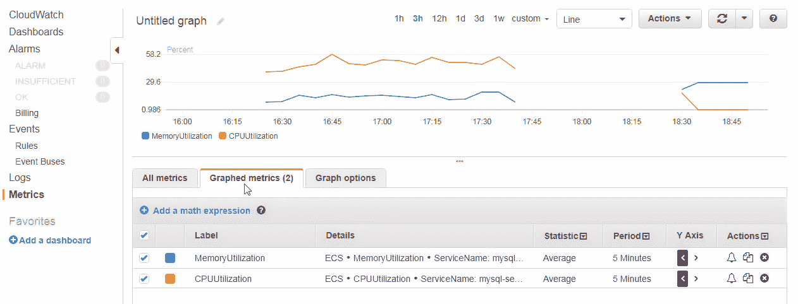

# 摘要

在本章中，我们讨论了为 ECS 容器配置日志记录。我们展示了如何使用 ECS 服务为 MySQL 数据库配置 CloudWatch 日志。Fargate 启动类型唯一支持的日志驱动程序是 awslogs 驱动程序。Fargate 启动类型必须配置三个日志驱动选项：`awslogs-region`、`awslogs-stream-prefix`和`awslogs-group`。在下一章中，我们将讨论使用 Fargate 的自动伸缩。
