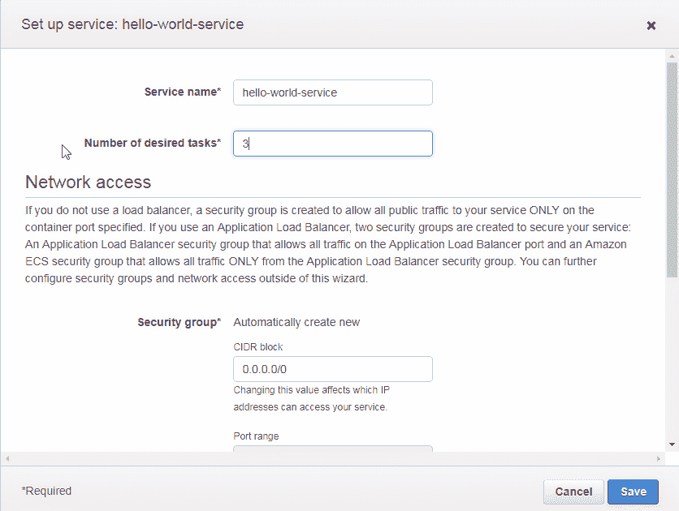
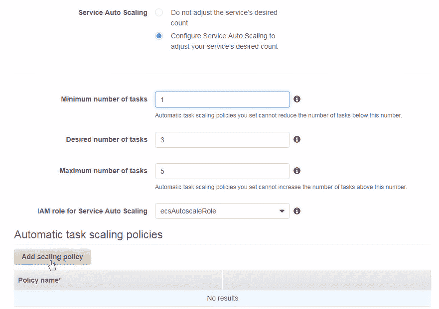

# 使用自动扩展

Amazon ECS 提供内置的内部负载均衡功能，用于在 ECS 服务中的任务之间分配客户端流量。如果所有客户端负载都发送到一个任务上，ECS 服务中的内部负载均衡器将把部分流量引导到其他任务上，以便均匀分配客户端负载。

**问题：** 服务中最初配置的任务数量是固定的。如果预期客户端负载是固定的，则 ECS 服务中的固定任务数量应该足够。但如果客户端负载波动，ECS 服务任务不会自动扩展。如果客户端负载增加，预配置的任务数量可能无法处理客户端流量。

**解决方案：** Amazon ECS 支持使用自动扩展策略，该策略由基于 ECS 服务度量的 CloudWatch 警报组成：`CPUUtilization`或`MemoryUtilization`。必须在执行任何扩展操作之前设置警报阈值；例如，`MemoryUtilization`不能超过指定的特定值，并且该阈值必须在一定数量的连续时段内保持不变，每个时段为 1 分钟、5 分钟、15 分钟或 1 小时。如果超过了警报阈值，则可能执行扩展操作，如增加、设置或移除指定数量或百分比的任务。客户端负载的衡量标准是`CPUUtilization`或`MemoryUtilization`。

任务数量随着负载变化，如下图所示：


在本章中，我们将演示配置和使用自动扩展，并学习以下内容：

1.  为“Hello World”应用程序创建一个 ECS 服务

1.  自动扩展的类型

1.  配置自动扩展策略

1.  演示自动扩展的使用

1.  探索 CloudWatch 指标和日志

1.  更新服务以修改任务数量

# 为“Hello World”应用程序创建一个 ECS 服务

使用`tutum/hello-world` Docker 镜像为“Hello World”应用程序创建 ECS 服务的详细过程，请参见第二章，*网络配置*。在本节中，我们将创建一个`hello-world`集群，其中包含一个`hello-world-service`服务，服务中有三个任务，使用的是`tutum/hello-world` Docker 镜像。创建集群、服务和任务定义的过程与第二章*网络配置*中的过程相同，具体如下：

1.  为`tutum/hello-world` Docker 镜像创建容器定义，`hello-world`

1.  创建任务定义，`hello-world-task-definition`

1.  创建一个服务，`hello-world-service`

1.  创建一个集群，`hello-world`

该过程与第二章中的*网络配置*相同，唯一不同的是定义服务时使用三个任务，而不是默认的一个任务：

+   在“定义你的服务”部分点击编辑，如下截图所示：


+   在“设置服务：hello-world-service”对话框中，将期望任务数设置为`3`，如图所示。点击保存：



+   将期望任务数设置为 3 后，点击“下一步”以定义服务，如图所示：


+   在配置集群中，将集群名称指定为 hello-world，如图所示。其他设置（包括 VPC ID 和子网）是不可修改的。点击下一步：


+   在审核中查看容器定义、任务定义、服务和集群，如图所示。每项内容旁边都提供了“编辑”按钮以进行修改。点击创建以创建 ECS 对象，如图所示：


+   启动状态应指示所有 ECS 资源已创建，并显示“完成”状态，如图所示。点击查看服务：


+   如图所示，服务已创建。服务摘要中列出了服务名称、集群、状态、任务定义、启动类型、平台版本、服务角色、期望任务数、待处理任务数和运行任务数。详细信息标签列出了负载均衡和网络访问：


+   选择“任务”标签以列出任务。“最后状态”列显示任务状态，初始状态可能是 PENDING。定期点击刷新按钮以更新任务状态。当所有任务开始运行时，“最后状态”将变为 RUNNING，如图所示：


# 自动扩展的类型

定义了两种自动扩展策略：

+   目标跟踪扩展策略

+   步骤扩展策略

接下来我们将讨论这两种自动扩展策略，然后再演示如何使用自动扩展。

# 目标跟踪扩展策略

所提到的目标是 CloudWatch 指标监控的特定度量的目标值。CloudWatch 监控的两个 ECS 指标是 CPU 利用率和内存利用率。使用目标跟踪缩放策略时，任务的数量会增加或减少，以便保持指标的目标值。可能无法精确保持某个指标的目标值，因为任务的数量是按 1 的增量/减少来变化的。该指标会保持在配置的目标值或接近目标值。目标跟踪缩放策略本身会根据指标值的波动进行调整，以避免任务数量的快速波动。为了保证应用程序的高可用性，服务扩展速度要快于收缩速度，因为较少的任务会影响应用程序的可用性，而额外的任务则不会。可以同时设置多个目标跟踪缩放策略，服务会根据影响任务容量增量最大的缩放策略进行扩展。如果 CPU 或内存利用率增加，表明应用程序需要更多的任务，如果超过了目标指标，服务会进行扩展。足够的指标数据是缩放策略能生效的前提。如果数据不足，缩放策略不会调整任务数量。如果数据不足时需要进行缩放，应该使用步骤缩放策略，接下来会讨论这一点。

# 步骤缩放策略

在*目标跟踪缩放策略*部分中提到，如果数据不足，可以使用步骤缩放策略。为了详细说明这一点，可以设置 CloudWatch 警报，当某个指标状态为`INSUFFICIENT_DATA`时触发。这样的策略被称为步骤缩放策略。所有的步骤缩放策略都利用了 CloudWatch 警报。CloudWatch 警报可以在特定的 CloudWatch 指标（CPU 利用率或内存利用率）超过或低于设定阈值时触发。例如，在应用程序使用量较高时，这些指标可能会增加，可以设置 CloudWatch 警报以增加任务数。同样，在应用程序负载较低时，这些指标值下降，可以设置 CloudWatch 警报以减少任务数。

服务自动缩放、目标跟踪自动缩放或步骤自动缩放，可以修改服务的期望任务数量。

# 配置自动缩放策略

默认情况下未配置自动缩放：

+   要配置自动缩放，请点击前面截图中显示的更新按钮，选择要进行自动缩放的服务。更新服务向导将启动，如下图所示。

+   在配置服务页面中，除非需要更新所需任务数量（`3`），否则不应修改设置。点击“下一步”。

+   在配置网络中，我们无需进行任何修改。点击“下一步”。

+   在服务自动扩展页面，选择“服务自动扩展”选项，配置服务的所需任务数，如图所示：


接下来，我们将讨论如何配置步进自动扩展策略。配置步进自动扩展涉及以下步骤：

1.  定义集群扩展的任务数范围

1.  添加自动扩展策略

1.  将 CloudWatch 警报定义为触发扩展策略的阈值

1.  如果警报阈值被超过，定义要采取的扩展操作

接下来，我们将讨论如何配置每一项内容。

# 定义任务范围

指定最小任务数（`1`）和最大任务数（`5`），如以下截图所示。示例配置中指定的任务数是任意的，但最大任务数必须等于或大于所需的任务数，最小任务数必须等于或小于所需的任务数：


设置任务数量（最小、所需和最大）本身并不会配置自动扩展；它仅指定任务数在负载波动时可以波动的范围。还需要添加一个自动扩展策略。

# 添加自动扩展策略

要添加扩展策略，请点击“添加扩展策略”，如以下截图所示：



会弹出一个“添加策略”对话框，如前面的截图所示。

接下来，我们将讨论如何配置步进自动扩展策略。

# 添加步进扩展策略

+   在添加策略中，选择扩展策略类型为步进扩展，如以下截图所示。

+   指定一个策略名称（`AutoScaler`）：


+   在“执行策略时”中，选择“创建新警报”，如图所示。如果可以使用现有警报，也提供了“使用现有警报”选项：


# 创建 CloudWatch 警报

在本节中，我们将讨论如何创建一个 CloudWatch 警报：

+   指定一个警报名称，如以下截图所示。

+   对于新警报，使用 ECS 度量指标来创建 CloudWatch 警报。要使用其他度量指标进行自动扩展，请在 CloudWatch 控制台中创建一个警报，并在“添加策略”中选择“使用现有警报”。在“添加策略”中配置新警报时，只能使用两个 ECS 度量指标：CPUUtilization 和 MemoryUtilization。选择 CPUUtilization。

+   警报阈值指定何时应用自动扩展策略。自动扩展的一个示例是在 MemoryUtilization 超过 256 MB 时扩展任务。定义警报阈值的措施有多种，分别为：平均值、最小值、最大值、总和和数据样本。作为示例，选择最大值。

+   因为选择了 ECS 服务度量标准为 CPUUtilization，所以比较操作符（<, <=, >, >=）已应用于 CPUUtilization。以 >= 为例。

+   为比较指定一个值（0.1）。

+   指定在超过警报阈值后应用自动扩展策略的连续期数为 1。一个周期的定义不是固定的，不同的定义周期选项包括 1 分钟、5 分钟、15 分钟和 1 小时。频率值越低，对资源利用波动的响应越快。以 1 分钟为例。点击“保存”，如以下截图所示：


已为自动扩展策略定义了 CloudWatch 警报。

# 配置扩展操作

接下来，为扩展操作配置一个可用的选项，其中包括三种选择：添加、设置为 和 删除：

+   选择“添加”以在超过警报阈值时添加指定数量的任务。超过警报阈值并不总是意味着某个度量值已超出，而是意味着在警报阈值中使用的比较已被超越。比较本身可能是小于（<）的比较。

+   指定要添加的任务数量为 1。或者，通过选择百分比，可以按任务的百分比进行添加。完整的扩展如下所示：

+   可以通过“添加”定义多个扩展操作。

+   指定扩展操作之间的冷却期（默认值为 300）。冷却期在使用多个扩展操作时相关，如果我们没有使用多个扩展操作，则不需要冷却期。点击“保存”：


+   如此处所示，定义了一个自动扩展策略（自动扩展器），包括任务范围。点击“下一步”：


+   在“审核”中，点击“更新服务”，如以下截图所示：


启动状态表示服务已更新，如下图所示：


以下配置将应用：

+   可扩展目标已注册

+   自动扩展策略 `AutoScaler` 被创建

+   为扩展策略创建/更新了 CloudWatch 警报

点击“查看服务”，如以下截图所示：


更新后的服务在此显示。选择自动扩展选项卡以显示已添加的自动扩展策略。自动扩展选项卡列出了最小任务数、最大任务数、自动扩展器、策略类型、CloudWatch 警报和扩展操作：


“事件”选项卡列出了服务的事件，如此处所示。根据事件条目，服务已启动三个任务并达到稳定状态：


已配置了自动扩展策略。选择任务选项卡，三个任务仍在运行，如下所示。任务数量仍然是三个，与添加自动扩展策略之前相同，因为该服务无需进行自动扩展，且三个任务能够处理客户端负载：


# 演示自动扩展的使用

本节中，我们将通过向 Hello world 服务添加额外负载来演示自动扩展的使用。

+   使用其中一个任务的公共 IP 来调用服务；可以从任务详情中获取公共 IP，如下图所示：


+   首先，只在一个浏览器中调用该服务。Hello world 应用程序被调用，服务响应显示在浏览器中，如下图所示：


+   为了增加负载，可以使用 curl 工具多次调用同一个 Hello world 应用程序。在 Windows 命令行中运行以下命令：

```
 curl http://18.191.95.171/?[1-20]
```

+   内部负载均衡器会自动将客户端负载分配到服务中的各个任务，无论哪个任务被客户端调用。外部负载均衡器也可以进行配置，具体内容将在后续章节中讨论。随着 Hello world 服务上客户端负载的增加，如果现有的任务数量无法处理该负载，任务数量也会增加。如图所示，正在运行的任务数量已经增加到四个：


+   使用以下 curl 命令进一步增加服务负载：

```
 curl http://18.191.95.171/?[1-1000]
```

+   如图所示，任务数量已经增加到五个，这是自动扩展器能够扩展到的最大任务数量，具体数量在服务的自动扩展配置中进行了指定：


+   运行的五个任务在服务的任务选项卡中列出，如下所示：


# 探索 CloudWatch 指标和日志

在本节中，我们将探索由 ECS 服务生成的 CloudWatch 指标和日志，并找到 CloudWatch 报警阈值被超出时的日志事件：

+   打开 CloudWatch 控制台，如下所示。`AutoScaleCPUUtilization`的报警摘要将在图表中显示。

+   单击浏览指标以浏览指标：


+   选择边栏中的报警。用作自动扩展阈值的 AutoScaleBasedOnCPUUtilization 报警将列出，如下图所示。当报警阈值被超过时，报警状态为 ALARM。

显示了 AutoScaleBasedOnCPUUtilization 告警的详细信息和图表。图表中 CPU 利用率的两个尖峰表示告警阈值已被超过，这会触发自动扩展，每次超过告警阈值时增加一个任务。图表中的第一个尖峰是负载轻微增加时的情况，第二个尖峰是负载大幅增加时的情况：


+   当 ECS 服务的负载减少时，告警状态变为“正常”。减少客户端负载本身并不会减少运行中的任务数量。作为示例使用的扩展操作仅在客户端负载增加时扩展任务。还需要添加另一个扩展操作来在客户端负载减少时缩减任务。在“历史”标签中，列出了两个自动扩展操作的实例，如下所示：


+   服务的所需数量已更新为 5，并且自动扩展运行数量也增加到五个任务。还可以从自动扩展标签中访问 AutoScaleBasedOnCPUUtilization 告警：


# 更新自动扩展策略

自动扩展策略仅扩展运行中的（所需的）任务数量，并不会修改自动扩展策略，策略仍然设置为 1-5 个任务的范围。服务可能会更新以修改任何或所有的最小任务数量、所需数量、最大任务数量以及自动扩展的扩展操作。在这一部分，我们将讨论更新自动扩展配置：

+   点击与之前相同的“更新”按钮来更新服务。自动扩展执行时，所需的任务数量设置为`5`，如下所示：


+   将所需任务数量减少到`3`，如下所示。

+   要修改扩展策略，请点击 AutoScaler 链接，如下所示：


+   在“编辑策略”中，选择“使用现有策略”并选择 AutoScaleBasedOnCPUUtilization 策略。当告警阈值被突破时不必执行扩展操作。将扩展操作修改为当`0.9<=CPUUtilization`时增加 1 个任务，如下所示。告警阈值为`CPUUtilization> 0.1`持续 60 秒，而扩展操作仅在`CPUUtilization>=0.9`时执行。`AutoScaler`策略每次突破 CloudWatch 告警阈值时运行，但只有在`CPUUtilization>=0.9`时才会执行扩展操作。点击保存：


+   最小和最大任务数量没有修改，仍然是 1 和 5。点击“下一步”，然后点击“更新服务”，如下所示：


+   旧的自动扩展策略被删除，创建了新的自动扩展策略，如下所示。可扩展目标与之前相同：


+   CloudWatch 警报已更新。点击查看服务。服务的运行任务数和目标任务数都为 3，如图所示。扩展操作已更新为当 0.9 <= CPUUtilization 时添加 1 个任务：


+   事件选项卡列出了由 ECS 服务生成的日志事件，如图所示。当客户端负载增加时，运行的任务数增加到五。但是，当客户端负载移除且扩展策略更新时，运行的任务数又变回三。如事件中所列，服务已停止了两个正在运行的任务：


最初，开始了一个任务。当警报阈值首次被突破时，执行扩展操作，将最大任务数的目标数量设置为四，如其中一条日志消息所示。运行的任务数增加到四。当负载进一步增加时，警报阈值第二次被突破，执行扩展操作，将最大任务数的目标数量设置为五。运行的任务数增加到五。当客户端负载移除且服务更新为将目标数修改为三时，两个正在运行的任务被停止，如另一条事件消息所示。

# 总结

本章介绍了 ECS 自动扩展服务，适用于 Fargate 启动类型。配置自动扩展涉及设置任务数范围（最小值和最大值），在该范围内应用自动扩展。配置自动扩展还需要一个自动扩展策略，包括用于运行自动扩展策略的 CloudWatch 警报阈值，以及每次自动扩展策略运行时执行的一个或多个扩展操作。在下一章中，我们将讨论如何使用 IAM 用户与 Fargate 配合使用。
