# 使用 IAM

Amazon ECS 集成并使用了多个其他 AWS 服务，包括弹性负载均衡和 EC2。ECS 使用服务关联角色，这是与某个服务关联的特殊类型角色，用于提供访问所需 AWS 服务的权限，无需额外配置。ECS 使用 `AWSServiceRoleForECS` 角色来访问其他 AWS 服务，以管理 EC2 网络接口、将实例注册/注销到负载均衡器，并注册目标。根用户在使用 Fargate 时无需额外配置即可使用 ECS。

**问题：** 默认情况下，IAM 用户没有权限创建或修改 ECS 资源，也无法调用 ECS API。IAM 用户也没有权限使用 ECS 控制台或 AWS CLI。

**解决方案：** 必须为 IAM 用户授予创建 `AWSServiceRoleForECS` 角色的权限。可以创建一个 IAM 策略并将其与 IAM 用户关联，从而授予使用其他 AWS 服务所需的权限。运行 Amazon ECS 可能需要的一些 AWS 服务包括：

+   调用 Amazon ECR 拉取 Docker 镜像

+   调用 CloudWatch Logs 来存储容器日志

`AmazonECSTaskExecutionRolePolicy` 策略用于授予使用上述 ECS 服务的权限。

`AWSServiceRoleForECS` 角色中不包含部分弹性负载均衡权限，可能需要添加一个 IAM 策略来使用弹性负载均衡。`AmazonEC2ContainerServiceRole` 策略可以用于将容器实例注册/注销到负载均衡器。服务自动扩展 IAM 角色（`ecsAutoscaleRole`）是配置自动扩展所必需的。IAM 用户必须添加 `ecsAutoscaleRole`，其中必须包含 `AmazonEC2ContainerServiceAutoscaleRole` 策略。为了能够为任务使用 IAM 角色，必须添加 Amazon EC2 容器服务任务角色策略。

`AmazonEC2ContainerServiceforEC2Role` 策略在使用 Fargate 启动类型时不是必需的，因为它仅为 EC2 启动类型提供。

本章中，我们将学习以下内容：

+   创建 IAM 用户

+   添加自定义策略以用于弹性负载均衡

+   以 IAM 用户身份登录

唯一的先决条件是拥有一个 AWS 账户。

# 创建 IAM 用户

要创建 IAM 用户，请以根用户身份登录并访问 IAM 控制台：[`console.aws.amazon.com/iam`](https://console.aws.amazon.com/iam)：

+   在左侧菜单中选择用户，然后点击“添加用户”，如下图所示：

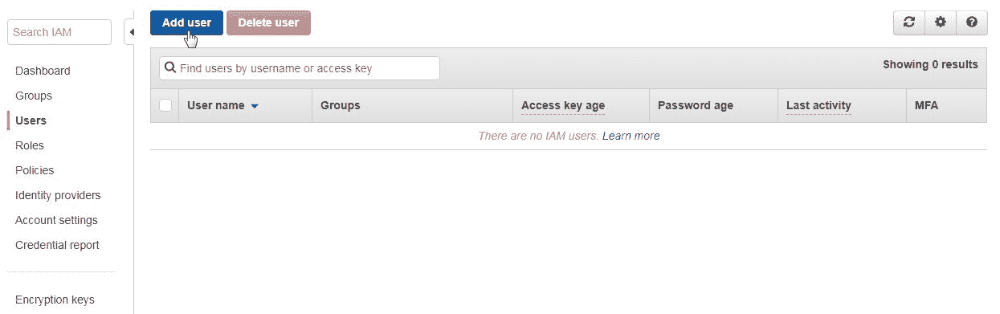

+   添加用户向导将会启动，如下所示。首先，指定用户名（`dvohra`）。

+   选择 AWS 管理控制台访问选项，这将启用一个密码，使得 IAM 用户可以登录到控制台：

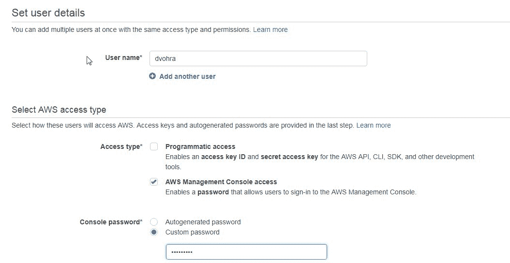

+   对于控制台密码，选择“自定义密码”选项，并在提供的字段中指定一个密码。选择“要求重置密码”选项，这要求用户在下次登录时创建新密码。用户会自动获得`IAMUserChangePassword`策略，允许用户更改密码。点击“下一步”。

+   接下来，配置权限。点击“直接附加现有策略”，如下所示：

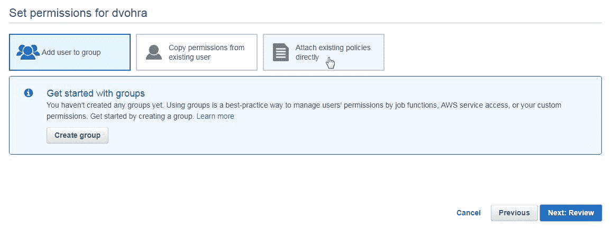

+   在策略类型过滤器中，搜索 ECS 并选择以下列出的两个策略。`AmazonECS_FullAccess`提供对 Amazon ECS 资源的管理员访问权限。`AmazonECSTaskExecutionRole`提供对 ECS 所需的其他 AWS 资源的访问权限：

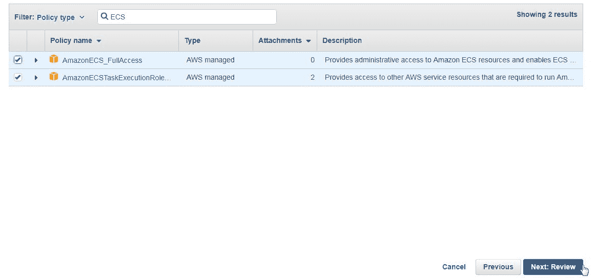

+   在策略类型过滤器中搜索“Config”，并选择以下显示的 AWS Config 策略。点击“下一步”：

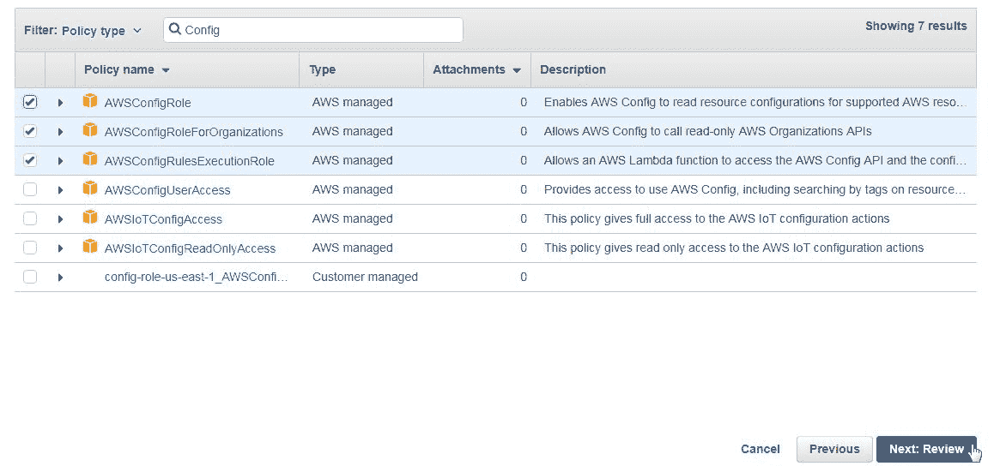

在“审核”中，检查“权限摘要”，并且`IAMUserChangePassword`策略也应该列出。点击“创建用户”。一个 IAM 用户被添加，如“成功”消息所示。此 IAM 用户在用户表中列出，如下所示。我们将在后续章节中使用该 IAM 用户与 Amazon Fargate 一起使用：

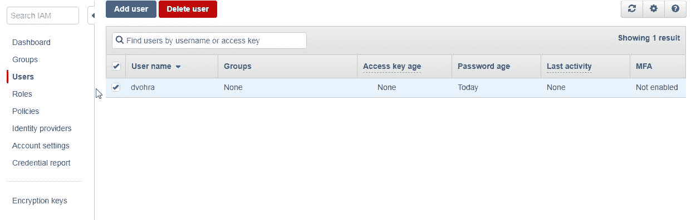

# 添加用于弹性负载均衡的自定义策略

可用且已选择的 ECS 策略不包括在为 ECS 服务创建弹性负载均衡器时所需的一些权限。我们需要为 IAM 用户添加自定义策略，以便该用户能够配置弹性负载均衡器。以下自定义策略添加了所有`elasticloadbalancing`权限：

```
{
  "Version": "2012-10-17",
  "Statement":[{
    "Effect": "Allow",
    "Action": ""elasticloadbalancing:*",
    "Resource": "*"
  }]
}
```

可以通过以下选项之一添加自定义策略：

+   在创建用户之前创建自定义策略

+   在用户创建后添加内联策略

我们将讨论第二个选项：

+   要将自定义策略作为内联策略添加，点击“用户表”中 IAM 用户 dvohra（或其他用户）的链接。将显示 IAM 用户的详细信息。

+   选择权限选项卡后，点击“添加内联策略”，如下图所示：

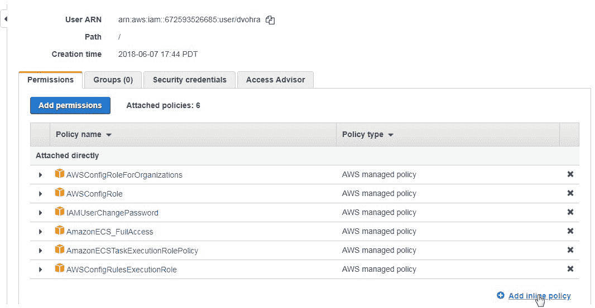

+   创建策略向导开始。选择 JSON 选项卡，并复制粘贴之前列出的自定义策略，如以下截图所示：

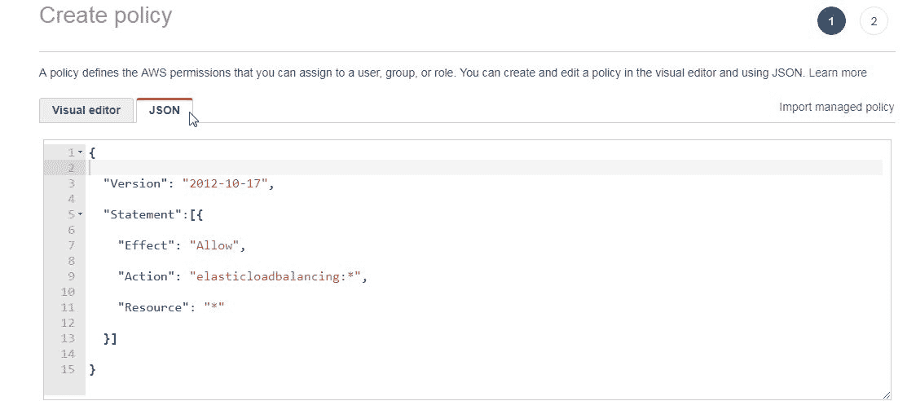

+   点击“审核策略”。指定一个策略名称，如下所示。

+   点击“创建策略”，如以下截图所示：

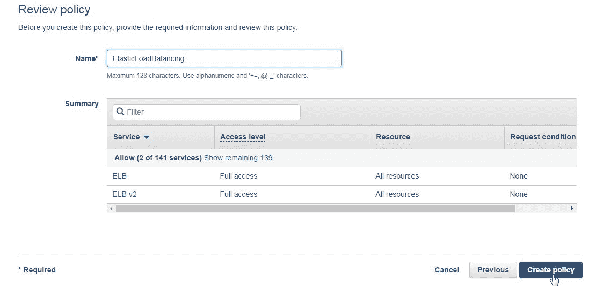

+   自定义策略已添加到 IAM 用户权限中，如以下截图所示：

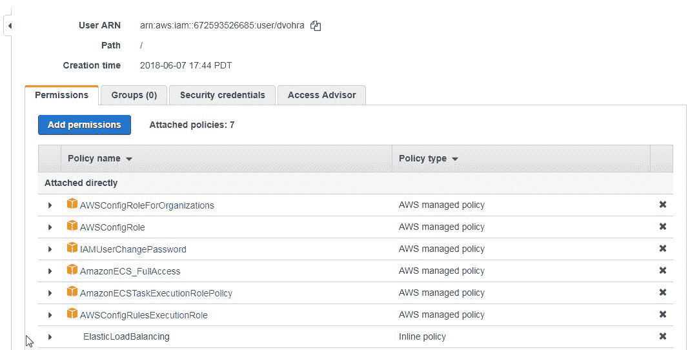

# 以 IAM 用户身份登录

接下来，创建 IAM 用户后，作为 IAM 用户登录以使用 Amazon Fargate：

+   为了能够以刚创建的 IAM 用户身份登录，首先作为根用户退出：

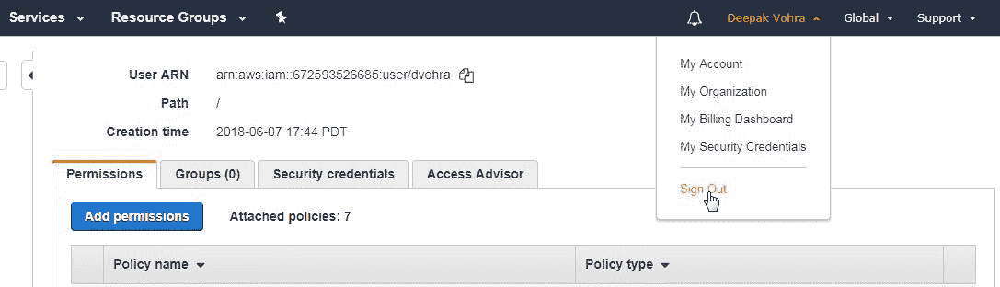

+   要登录到控制台，请复制控制台登录链接 https://123456789.signin.aws.amazon.com/console，该链接对于不同的用户是不同的，如此处所示。列出的链接只是一个示例链接，不能用于登录：

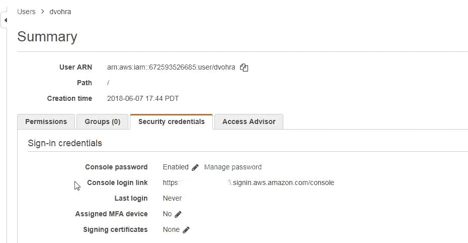

+   使用控制台登录链接打开网页浏览器。账户 ID 会预先在登录表单中指定（下图未显示）。输入 IAM 用户名和密码，然后点击“登录”（Sign In），如下图所示：

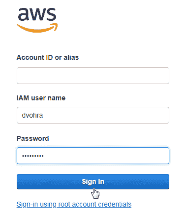

+   接下来，会提供更改密码的表单。由于选择了首次登录时更改密码的选项，IAM 用户必须配置新密码。点击“确认密码更改”。IAM 用户成功登录，如下图所示。

+   选择弹性容器服务以创建 ECS 服务，如下图所示：

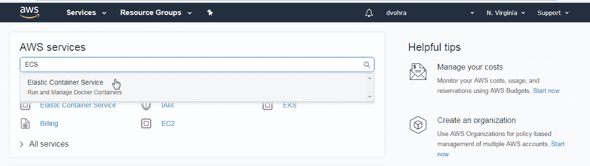

# 总结

在本章中，我们讨论了如何为 ECS 配置 IAM 用户。根用户不需要任何权限配置，且可以访问 ECS 资源、ECS 控制台、ECS API 和所有必要的 AWS 服务。如果要使用 IAM 用户访问 ECS，则必须为该 IAM 用户添加所需的 IAM 策略。要将 ECS 与弹性负载均衡一起使用，还需要添加自定义策略。在下一章中，我们将讨论如何将应用负载均衡器与 Fargate 一起使用。
