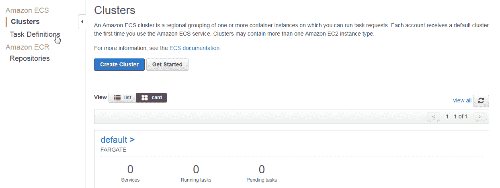

# 第六章：使用应用负载均衡器

虽然一些 Docker 容器接受 TCP 客户端请求，但其他 Docker 容器则通过 HTTP 路径接受客户端请求。如 第二章 *网络* 中所示，可以通过 Hello World 任务公开的公共 IP 地址向 Hello World 应用程序任务发起 HTTP 请求。ECS 服务包括内置的内部负载均衡，能够将客户端流量分配到服务中的各个任务。

**问题：** 每个 ECS 服务中的任务（使用 Fargate 启动时）都会关联一个 ENI 和一个公共 IP 地址。当应用程序扩展以运行多个任务时，会创建多个 ENI，每个任务必须通过其公共 IP 地址进行访问。

尽管提供了内部负载均衡，但没有提供外部负载均衡功能，无法在不同任务的 IP 地址之间平衡客户端流量。单个任务可能会接收到大量客户端请求，而另一个任务可能会接收到相对较少的请求，甚至没有请求，这将导致外部客户端负载的路由不平衡，如下图所示。如果客户端负载被定向到的任务（或任务）失败，应用程序将无法响应任何客户端请求。ECS 托管应用程序的高可用性未得到提供。直接将容器暴露给公众不是最佳的安全做法。

始终建议将它们放置在 ELB 后面，以便在安全性方面进行网络流量控制。

**解决方案：** 对于像 Hello World 应用程序这样的 HTTP 协议应用，可以使用 EC2 应用负载均衡器将 HTTP 客户端请求路由到 ECS 服务中的不同任务。应用负载均衡器是一个外部负载均衡器，它暴露一个公共 DNS，所有客户端请求都会定向到该公共 DNS。应用负载均衡器将客户端负载在应用程序的任务之间进行平衡，从而提供 ECS 托管应用程序的高可用性，如下图所示。即使其中一个任务失败，应用负载均衡器也会将客户端流量定向到仍可用的任务：

在本章中，我们将学习以下内容：

+   创建应用负载均衡器

+   创建任务定义

+   创建服务

+   配置应用负载均衡器

+   调用 Hello World 应用程序

+   停止任务并删除负载均衡器

唯一的前提条件是拥有一个 AWS 账户。

# 创建应用负载均衡器

以下程序用于配置带有应用负载均衡器的 Fargate ECS 服务：

1.  创建应用负载均衡器

1.  创建任务定义

1.  创建服务

1.  配置应用负载均衡器与服务

1.  调用服务

首先，我们将创建一个应用负载均衡器：

1.  在浏览器中打开 EC2 控制台，访问[`console.aws.amazon.com/ec2`](https://console.aws.amazon.com/ec2)，并选择**负载均衡 | 负载均衡器**。

1.  点击“创建负载均衡器”，如以下截图所示：

1.  在选择负载均衡器类型时，点击“创建”以创建应用负载均衡器，如以下截图所示。应用负载均衡器用于 HTTP/HTTPS 请求协议。

1.  在配置负载均衡器时，在**基本配置**中指定负载均衡器名称（`hello-world-lb`），如以下截图所示，并选择**面向互联网**作为方案。负载均衡器名称只能使用 a-z、A-Z、0-9 和连字符。

1.  选择 ipv4 作为**IP 地址类型**。

1.  在监听器部分，配置了一个监听器，使用 HTTP 作为**负载均衡协议**，并将`80`设置为**负载均衡端口**：

1.  向下滚动并选择一个 VPC。选择负载均衡器将要路由流量的可用区。点击“下一步”。

1.  然后将显示配置安全设置页面（适用于 HTTPS 监听器）。如果负载均衡器需要使用 HTTPS 协议监听器，应在上一个屏幕的**监听器部分**进行配置，并且应在配置安全设置页面进行安全设置。由于我们只使用 HTTP 监听器，因此无需配置任何安全设置。点击“下一步”。

1.  配置负载均衡器的**安全组**。选择创建一个新安全组并选择默认的安全组名称，如以下截图所示。

1.  选择**全部流量**作为类型，协议选择**全部**，端口范围为 0-65535，来源选择**自定义**，CIDR 作为 IPv4 和 IPv6 的默认路由（0.0.0.0/0, ::/0）。点击“下一步”：

1.  在配置路由部分，配置一个目标组，负载均衡器将向该目标组路由请求。负载均衡器只会将请求路由到配置的目标组中的目标。选择目标组中的**新建目标组**选项，并指定名称（`hello-world-tg`），如以下截图所示。

1.  选择 HTTP 作为协议，`80` 作为端口。

1.  选择**ip**作为目标类型并点击“下一步”：

1.  选择**ip**作为目标类型，可以添加以下 CIDR 块中的目标：10.0.0.0/8，100.64.0.0/10，172.16.0.0/12 和 192.168.0.0/16。

1.  在注册目标屏幕（如以下截图所示）上，我们不需要注册目标，因为当使用应用负载均衡器创建 ECS 服务时，Fargate 会自动执行此操作。点击“下一步”：

1.  审核应用负载均衡器的配置。点击“创建”，如以下截图所示：

1.  应用程序负载均衡器已创建，创建状态在“负载均衡器创建状态”对话框中显示。点击“关闭”。

1.  `hello-world-lb` 负载均衡器已列在负载均衡器表中，如下图所示。最初，状态（状态）为“正在配置”。点击“刷新”来刷新状态：

1.  当负载均衡器变为可用时，其状态变为激活，如下图所示：

1.  创建了一个目标组，`hello-world-tg`，如下图所示：

1.  选择“目标”标签，此时应没有任何目标列出，因为还未配置目标。

# 创建任务定义

在本节中，我们将为 `hello-world` 应用程序创建一个任务定义，使用 `tutum/hello-world` Docker 镜像。也可以使用其他暴露 HTTP 端口的 Docker 镜像，但并非所有 Docker 镜像都可以使用。以不适用的例子为例，MySQL 数据库 Docker 镜像 `mysql` 不能与应用程序负载均衡器一起使用，因为它暴露的是 TCP 端口 `3306`。对于暴露 TCP 端口的 ECS 任务，应使用网络负载均衡器。

1.  要创建新的任务定义，请在 ECS 控制台中选择任务定义，如下图所示：

1.  在任务定义中，点击“创建新的任务定义”，如下图所示：

1.  在创建新的任务定义中，选择 Fargate 作为启动类型兼容性，如下图所示。向下滚动并点击“下一步”：

1.  在配置任务和容器定义中，指定任务定义名称（hello-world-task-definition），并选择 ecsTaskExecutionRole 作为任务角色，如下图所示。

1.  对于 Fargate，网络模式是 awsvpc，且无法修改，因为它是唯一受支持的模式，如下图所示：

1.  选择 excsTaskExecutionRole 作为任务执行 IAM 角色，如下图所示。此角色用于将容器日志发送到 CloudWatch：

1.  在任务大小中，选择 0.5GB 作为任务内存，如下图所示。选择 0.25 vCPU 作为任务 CPU：

1.  要添加容器定义，请在容器定义中点击“添加容器”，如下图所示：

1.  在添加容器时，指定容器名称（`hello-world`）、镜像（`tutum/hello-world`）和内存限制，如下图所示：

1.  在端口映射中，将容器端口设置为 `80`，如下图所示：

1.  在“高级容器配置” | “环境”中，将 CPU 单元设置为`10`，并勾选“必需”复选框，如下图所示。由于任务中的一个容器必须是必需的，而`hello-world`容器是唯一的容器，因此它必须配置为“必需”：

1.  配置完所有容器定义设置后，点击“添加容器”中的“添加”。容器定义将被添加，如下图所示。

1.  点击“创建”以创建任务定义，其中包括容器定义：

1.  任务定义创建成功，如“启动状态”对话框所示。点击“查看任务定义”，如下图所示：

1.  显示新的任务定义构建器和详细的 JSON 信息，如下图所示。要求的兼容性必须设置为“FARGATE”，如下图所示：

1.  从边栏导航中选择“任务定义”。任务定义将列在“任务定义”表格中，如下图所示：

# 创建服务

服务是任务定义的实现，并运行任务。要创建服务，必须先选择一个集群。

1.  点击默认集群链接，如下图所示：

1.  选择“服务”标签，然后点击“创建”，如下图所示：

1.  在“配置服务”中，选择“FARGATE”作为启动类型，并选择之前创建的任务定义。

1.  选择“LATEST”作为平台版本。默认集群应显示为已选择，因为我们最初选择的是默认集群。

1.  指定服务名称（`hello-world-service`），并将任务数量设置为 3，如下图所示：

1.  保留其他设置为默认值，点击“下一步”。

# 配置应用程序负载均衡器

在此部分，我们将配置应用程序负载均衡器。

1.  首先，选择一个集群 VPC 和两个子网，如下图所示。VPC 应与应用程序负载均衡器所在的 VPC 相同。所创建的安全组列出显示。必须将自动分配公网 IP 设置为“启用”：

1.  在“负载均衡”部分，选择“应用程序负载均衡器”作为负载均衡器类型，如下图所示。选择之前创建的负载均衡器名称（`hello-world-lb`）：

1.  在容器负载均衡中，点击“添加到负载均衡器”，将容器名称：端口设置为`hello-world:80:80`，如下图所示：

1.  显示额外的字段来配置容器负载均衡。选择 80:HTTP 作为侦听端口，如下图所示。

1.  选择目标组名称为 hello-world-tg，这是在创建负载均衡器时创建的目标组，如下图所示。

1.  在服务发现中，取消选中“启用服务发现集成”复选框。

1.  保持其他字段的默认设置，然后点击“下一步”：

1.  在设置自动扩展（如下图所示）时，可以选择配置自动扩展，但不是必须的。使用默认设置“不要调整服务的期望数量”后，点击“下一步”：

1.  在审查中，点击“创建服务”，如下图所示：

1.  如下图所示，启动状态对话框表明服务已创建：

1.  最初，一些任务可能会有“待处理”的状态。点击刷新按钮以刷新状态。一段时间后，所有任务的状态应为“运行中”，如下图所示：

1.  服务详细信息选项卡列出了负载均衡的配置，包括目标组名称、容器名称和容器端口，如下图所示。服务摘要列出了一个部署，其“运行中的任务数量”是 3，目标任务数为 3：

1.  事件显示服务在目标组中注册了 1 个目标，如下图所示：

# 调用 Hello World 应用

要在浏览器中调用`hello-world`服务，我们将使用已注册到服务的应用负载均衡器的公共 DNS。在 EC2 仪表板中，选择目标组 | hello-world-tg 目标组，然后选择“目标”。最初，当目标组创建时，目标选项卡没有列出任何目标。但是，在创建并配置负载均衡器后，目标选项卡列出了 hello-world-tg 服务中三个任务的三个 IP 地址，如下图所示：

其中两个任务位于同一个可用区，第三个任务位于另一个可用区，如下图所示：

1.  从负载均衡器控制台获取应用负载均衡器的 DNS 名称，如下图所示：

1.  在浏览器中打开 DNS 名称以调用 Hello World 应用程序，如下图所示：

调用负载均衡器的 DNS 名称会将请求转发到目标组 hello-world-tg，正如负载均衡器的监听器选项卡中所示，如下图所示：

# 停止任务并删除负载均衡器

停止任务和删除 ECS 资源的过程如下：

1.  更新服务，将任务的期望数量设置为 0

1.  停止任务

1.  删除服务

1.  注销任务定义修订版

要删除应用负载均衡器，请在负载均衡器表中选择应用负载均衡器，然后选择操作 | 删除，如下图所示：

在“删除负载均衡器”确认对话框中，点击“是，删除”。应用负载均衡器被删除，如下图所示：

# 总结

在本章中，我们讨论了如何配置带有应用负载均衡器的 Fargate 启动类型 ECS 服务，以平衡 Hello World 服务的 HTTP 请求。应用负载均衡器专为 HTTP/HTTPS 协议设计，不能与 TCP 协议一起使用。在下一章，我们将讨论如何使用 Amazon ECS 命令行界面（CLI）。
