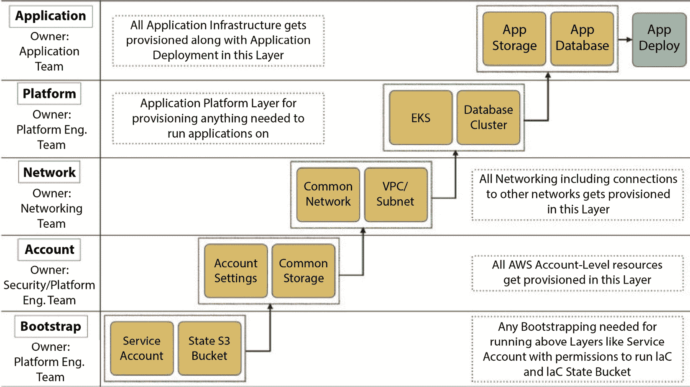

# 第一章：1

# 理解 IaC 和 Terraform 的模式与反模式

在不断发展的数字化环境中，开发与运维的无缝集成已成为组织实现卓越效率和敏捷性的必要条件。本书的开篇章节深入探讨了**基础设施即代码**（**IaC**）和**Terraform**的迷人世界，揭示了支撑这一变革性方法的关键原则、模式和反模式。通过关注幂等性、不可变性以及一系列最佳实践，本章阐明了稳健、安全和合规的基础设施管理之路。在这段引人入胜的旅程中，我们将探索 IaC 项目的复杂性，研究它们所带来的挑战，并挖掘出克服这些挑战的宝贵策略。通过本章的学习，您将拥有扎实的基础，做出关于基础设施生命周期的明智决策，并充分发挥 IaC 和 Terraform 的真正潜力。

本章将涵盖以下主要内容：

+   引入 IAC

+   IaC 的模式和实践

+   如何处理 IaC 项目

+   如何做出关于 IaC 项目的决策

# 引入 IaC

IaC 指的是通过机器可读的定义文件来管理和配置计算基础设施，而不是依赖于交互式配置工具或物理硬件设置的过程。

IaC 利用已在软件系统中经过验证的编码技术，将其应用扩展到基础设施领域。它是实现 DevOps 关键实践之一，使团队能够快速、可靠地大规模交付基础设施和软件。拥有一个快速且可靠的基础设施配置机制对那些希望实现持续交付的组织至关重要。

在 IaC 中，通常使用声明式语言来描述系统的期望状态，以及使系统符合该状态所需的步骤。然后，IaC 工具使用这些描述自动构建和管理必要的步骤，将系统从一种状态过渡到另一种状态。因此，IaC 使组织能够自动化其 IT 基础设施中的资源安装、配置、部署、扩展、更新和删除等过程。

## IaC 的关键原则

IaC 有两个关键原则，我们将在本节中了解它们。

### 幂等性

幂等性是数学、编程语言和计算机科学中某些操作的特性。它指的是多次应用这些操作会产生相同的结果，除了生成相同的副本外，不会改变结果。

在 IaC 的背景下，幂等性意味着无论起始状态如何以及 IaC 执行多少次，最终状态始终保持一致。这简化了基础设施配置过程，并减少了结果不一致的可能性。这个特性为运维带来多个优势，例如能够回滚更改并在失败时重新尝试。

实现幂等性的一种方式是使用有状态工具，如 Terraform。使用 Terraform，您可以指定基础设施的期望最终状态，工具将处理达到该状态的过程。

### 不可变性

配置变更管理是基础设施配置中的一个重要话题。为了成功，我们需要一个强大的变更管理记录系统，记录所有对基础设施所做的更改，并包括更改的原因、责任人、实施时间等详细信息。

配置漂移可能对基础设施管理构成重大挑战。它出现在对基础设施进行修改而没有适当文档记录时，导致不同环境出现难以复制的差异。这个问题在那些运行时间较长的可变基础设施中尤为普遍。

配置漂移的后果可能是严重的，导致性能不一致、稳定性差以及基础设施中的安全问题。由于很难重现导致漂移的确切条件，排查这些问题可能既费时又容易出错。

不可变基础设施是一种以可靠、可重复和可预见的方式构建和管理基础设施的技术。这种方法相比传统的 IT 环境管理方法具有几个优势。与其改变现有基础设施，不如通过替换它来实现不可变基础设施。通过每次配置新的基础设施，这种方法确保了基础设施保持可复制，并且随着时间推移不会出现配置漂移。

不可变基础设施还为在云环境中配置基础设施提供了可扩展性。

现在我们已经知道了 IaC 是什么及其关键原则，让我们来看看 IaC 的模式。

# IaC 的模式与实践

深入了解基础设施即代码（IaC）的世界，揭示构成高效可靠实现的模式和实践是至关重要的。在本节中，我们将探索对 IaC 成功至关重要的基本构建块，确保全面理解其最佳实践，并为您的 IaC 之旅奠定坚实的基础。

## 源代码管理和版本控制系统（VCS）

确保将基础设施的所有方面，包括最小的脚本和管道配置，保存在源代码管理或**版本控制系统**（**VCSs**）中至关重要。版本控制系统是一种管理和跟踪文档、程序及其他信息集合更改的工具，通常用于软件开发，以保持代码更改的历史记录。

这一做法确保你能够记录下所有对基础设施所做的更改，无论这些更改多么微小。它还简化了追踪所有权和基础设施配置更改历史的过程。

此外，确保所有组织成员都能访问基础设施代码非常重要，包括那些不直接参与 IaC 代码库的成员。这种可见性提供了对基础设施如何配置的更好理解，并能迅速排除出现的任何问题。通过查看代码，用户可以更深入地理解基础设施的运作方式，甚至可以选择参与基础设施的开发。

对运行在你基础设施上的应用程序的可见性和理解对于管理成功的 IT 基础设施至关重要。通过深入了解应用程序的功能，你可以优化它们的性能并确保它们高效运行。通过保持基础设施代码的可访问性，你可以确保整个组织能够贡献于基础设施的维护和改进，最终为你的业务带来更好的成果。

## 模块与版本

在 IaC 工具中创建可重用的模块有助于维护、可读性和所有权。它使得更改更小且可独立部署，从而减少影响范围。

相比于应用程序开发，重构 IaC 更具挑战性，特别是对于像 DNS 记录、网络配置、数据库等关键部分。

在许多组织中，团队结构和职责各不相同，因此将多个基础设施层分开并将治理分配给相应团队会更有意义。在某些情况下，可能需要更多分离的层次，以便跨职能团队同时管理基础设施和应用开发。

下图展示了一个 Amazon EKS 部署的示例，包含每个基础设施层的多个模块及其相应的治理者。需要注意的是，图中展示的模块和层次可能会根据你的具体设置有所不同。

图 1.1 – EKS 部署工作流

为模块进行版本管理非常重要，以便支持多个版本的服务运行，而不破坏现有的生产资源。

## 文档

基础设施即代码（IaC）最大限度地减少了对基础设施文档的需求，因为一切都被编写成代码并作为声明性清单呈现。然而，为了更好的基础设施配置，仍然需要一些文档，以便用户能够理解和改进当前的模块和模板。

文档管理可能很具挑战性，就像代码一样。提供足够的文档以有效传达预期的信息至关重要。然而，更多的文档并不一定意味着更高质量的文档。事实上，过时的文档可能比没有文档更具危害。

IaC 文档必须与代码紧密相连。将文档保持靠近代码，以便每个人都能轻松地更新文档，而不需要不必要的努力和复杂步骤。如果你能构建良好的治理自动化，文档的创建或更新将容易追踪和强制执行。

管理 IaC 文档的有效方法是在与代码相同的仓库中包含一个 `README` 文件，而不是使用 Confluence 或 Wiki 等外部平台。此方法便于在与代码更改相同的提交中更新文档，尤其在拉取请求过程中，它也能作为提醒。

利用自动化工具从代码生成文档或将测试用作文档是理想的做法。通过这种方式，你可以确保文档与代码保持同步，从而减少不一致和过时信息的可能性。这种方法还可以简化文档过程，减少手动编写文档的需求，并加快迭代速度。

## 测试

软件测试是执行程序或应用程序以查找错误的过程。测试可以在不同层级进行，从单元测试到集成测试，再到系统测试和验收测试。

IaC 开发并非易事。开发过程之前、期间和之后有许多不同的方面和考虑因素需要考虑。其中一个考虑因素是如何测试你的 IaC。让我们为你提供有关在开发 IaC 时需要考虑的各种测试层级的基本理解：

+   **静态代码** **及分析**

    尽可能频繁地运行快速测试对于在开发过程中获得及时反馈至关重要。尤其在本地机器上进行此操作时效果尤为显著。有许多可用的集成工具可以自动化此过程，在你保存文件时自动触发测试，无论是在文本编辑器还是 IDE 中。

    要执行静态分析，您可以使用像 Terraform Validate 或 TFLint 这样的专业工具。这些工具使您能够及时发现代码和配置中的问题，从而减少基础设施中的错误和不一致的可能性。通过将快速测试和静态分析纳入开发过程，您可以简化测试过程，提高基础设施的可靠性。

+   **单元测试**

    由于许多 IaC 工具（如 Terraform 和 Ansible）基于声明性模型运行，因此单元测试并非总是必要的。然而，在某些情况下，单元测试是有益的，特别是当涉及到条件语句或循环时。

    尽管 IaC 的单元测试并非总是必需的，但在必要时加入单元测试有助于在开发过程中及早发现潜在问题，提高基础设施的整体质量。

+   **集成测试**

    确保基础设施可靠性的一个关键步骤是进行验证测试。这包括在测试环境中配置资源，并验证是否满足特定要求。特别是在使用声明式代码时，避免为已经由 IaC 工具覆盖的内容编写测试是至关重要的。

    例如，您应该编写自动化测试来确保没有任何 S3 存储桶是公开的，而不是验证 IaC 中指定的策略是否已应用。同样，您可以测试所有 EC2 实例上是否只有特定端口是开放的。为了执行这些测试，您可以配置一个临时环境，之后可以将其销毁。

    根据这些测试的持续时间，您可能希望在每次提交后运行它们，或作为夜间构建的一部分。通过将验证测试融入开发流程，您可以及早发现潜在问题，减少错误风险，并确保基础设施的整体可靠性。

+   **烟雾测试**

    另一种测试方法是配置一个环境，部署一个虚拟应用程序，并进行快速的烟雾测试，以验证应用程序是否正确部署。使用虚拟应用程序可以帮助测试实际应用程序可能遇到的情境，但这些情境并未为生产环境配置。

    例如，如果您的应用程序连接到外部托管的数据库，您应该尝试在虚拟应用程序中连接该数据库。通过这样做，您可以确信您正在配置的基础设施能够支持您打算在其上运行的应用程序。

由于这些测试可能会耗时，建议在配置新环境后以及随后定期运行这些测试。通过利用这种测试方法，您可以确保您的基础设施能够支持应用程序的要求，并最小化在部署过程中出现错误或问题的风险。

## 安全性和合规性

IaC 的定义是为物理基础设施与其上运行的应用程序之间提供一个抽象层。这是通过将硬件与软件分离，并抽象出所有管理硬件所需的任务来实现的。

IaC 可以被公司用于合规性目的，如 HIPAA、SOX、PCI DSS 等。它也可以用于安全目的，例如防止未授权访问数据或防止黑客获取敏感信息。

让我们来看看安全性和合规性的关键细节。

### 身份和访问管理

实施强有力的**身份和访问管理**（**IAM**）策略对于保护你的基础设施即代码（IaC）及其所配置的基础设施至关重要。一种有效的方法是使用**基于角色的访问控制**（**RBAC**）来管理 IaC，这可以显著减少整体的攻击面。

通过利用 RBAC，你可以为 IaC 授予足够的权限，以执行必要的操作，同时防止未授权访问。这种方法有助于最小化错误或恶意活动的风险，从而提高基础设施的整体安全性。

### 秘密管理

在使用 IaC 时，通常需要凭证来配置基础设施。例如，如果你在 AWS 中配置资源，你需要有效的 AWS 凭证来连接。确保使用可靠的秘密管理工具，如 HashiCorp Vault 或 AWS Secrets Manager，来管理这些敏感凭证是至关重要的。

在需要将秘密存储或输出到状态文件中时（尽管建议避免这样做），必须加密它们以防止未授权访问。通过加密存储在状态文件中的秘密，可以在发生安全漏洞或未授权访问时降低曝光风险。

### 安全扫描

在低环境或短暂环境中，进行基础设施配置或更改后进行安全扫描，有助于减轻生产环境中潜在的安全问题。利用 CIS 基准或 Amazon Inspector 等工具，可以有效地识别常见的漏洞或暴露，并确保遵循安全最佳实践。

通过进行安全扫描，你可以在开发过程中及早发现潜在的安全问题，并防止它们被带入生产环境。这种方法有助于最小化安全漏洞的风险，并保护敏感数据和基础设施。

### 合规性

合规性要求是许多组织需要重点考虑的因素，尤其是在医疗或金融等高度监管的行业中。这些行业需要遵守更严格的要求，包括 HIPAA、PCI、GDPR 和 SOX 等。传统上，合规团队通过手动检查和填写文书来确保遵守这些要求。

然而，像 Chef InSpec 或 HashiCorp Sentinel 这样的自动化工具可以帮助简化合规性要求并提高效率。通过自动化合规性检查，您可以更频繁地运行它们，并更快地发现问题。例如，您可以将合规性测试集成到您的 IaC 流水线中，通过配置一个短暂的环境，并在每次修改 IaC 代码时运行测试。这种方法使您能够尽早发现潜在的合规性问题，并在它们影响生产系统之前进行修复。

# 如何处理 IaC 项目

在今天快节奏的数字化环境中，IaC 已成为各类组织必须考虑的重要因素。通过 IaC，开发人员可以轻松创建运行应用所需的机器或资源，从而节省了时间和精力。在您的组织规模扩大时，IaC 可以帮助您的开发人员专注于解决更复杂的问题，而不是陷入手动资源配置的困境。

然而，确保在不同环境中配置相同、无错误、安全且合规的配置可能是一个挑战。这就是 IaC 发挥作用的地方。通过将基础设施定义为代码，您可以通过更新一段代码来进行更改或添加新资源，而 IaC 工具将为您处理配置。

通过采用 IaC，组织可以提高资源配置和管理的敏捷性、速度和一致性。这使得开发人员可以专注于交付高质量的应用程序，而运营团队则可以更轻松、更高效地管理大规模的基础设施。

让我们来看看我们可能面临的挑战。

## IaC 原则

IaC 的核心概念是将基础设施定义为代码。通过使用声明式语法，您定义基础设施的期望最终状态，IaC 工具会负责处理底层的依赖关系解析和资源启动步骤。

为了跟踪对基础设施所做的更改，您可以将这些代码存储在版本控制系统（VCS）中。这不仅为您提供了谁进行更改的审计跟踪，而且还使您在需要时可以恢复到之前的版本。

还可以对您的基础设施运行自动化的质量、合规性和安全性测试，允许您验证其合规性，而无需投入数天或数周的时间。

通过采用 IaC，您的开发人员可以避免手动定义启动和配置资源的步骤或脚本，这些任务既繁琐又容易出错。像 Terraform 和 CloudFormation 这样的工具被广泛使用来实现这些任务，帮助组织在基础设施管理中实现更高的敏捷性、可扩展性和一致性。

## IaC 的版本控制系统

将您的 IaC 存储在与应用代码一起的 VCS 中是非常重要的。这不仅便于开发人员之间的协作，还能清晰地了解整个代码库。

VCS（版本控制系统）还提供了一种简单的方式来跟踪和审计对代码库所做的更改，包括基础设施的更改。通过在 VCS 中使用管道功能，如 GitHub 或 GitLab 中提供的功能，你可以执行政策并确保更改在部署到生产环境之前满足必要的标准。

## 一些常见的 IaC 使用案例

IaC 通常用于跨多个云提供商启动基础设施，并在启动时配置机器。常用的 IaC 配置工具包括 Chef、Ansible 和 Puppet，而 Terraform 和 CloudFormation 则常用于基础设施配置。

IaC 也可以用于部署应用程序，例如通过 Kubernetes，利用 Jenkins 或 Ansible 等工具。在接下来的章节中，我们将深入探讨如何与 Kubernetes 一起使用 IaC。

## IaC 的挑战与最佳实践

IaC 在操作性和可维护性方面提供了很大的好处，但它也带来了需要解决的挑战，以确保基础设施的安全性和稳定性。

### 团队内的采用

将 IaC 集成到你的组织中可能会遇到学习曲线和流程变化。你的团队可能需要熟悉编写 IaC 代码所用的语言，并开发执行代码的管道。如果你的团队习惯于通过云控制台进行更改并以操作为中心，转向 IaC 将对他们来说是一次重大的转变。

你会发现，在学习新技术或实践时，团队可能会产生巨大的抵触情绪。要做好准备，随时为基础设施自动化、安全性和合规性做宣传。

### 配置漂移

在 IaC 实施的初期，开发人员可能并不总是知道配置基础设施所需的更改，因此可能选择通过控制台手动进行更改。这可能导致配置漂移，即部署的基础设施与代码定义不匹配，可能会导致停机或未来更新时出现问题。为了防止这种情况，必须教育团队了解手动更改的后果，并鼓励他们避免使用手动更改。

为了进一步减少配置漂移的风险，你可以建立自动化机制来检测漂移，并确保只有授权人员能在关键环境中进行变更。这有助于确保你的基础设施保持一致且安全。

### 安全性

在你的 IaC 管道中使用开源模块时，确保它们是安全的且没有漏洞非常重要。在使用任何开源项目之前，建议验证它是否安全可用。

为了保持高水平的安全性，建立静态代码分析管道并持续扫描开源模块是至关重要的。通过这种方式，任何漏洞都能被及时发现并解决。

### 人为因素

为了防止错误配置进入生产环境，捕捉在开发者修改时可能引入的验证错误至关重要。使用 Terraform，你可以通过 Terraform plan 功能轻松实现验证步骤。在应用之前，充分理解计划输出非常关键，以确保不会对基础设施做出意外更改。

### 自动化的副作用

在 IaC 中，随着你自动化基础设施创建，很多代码都会被重用。然而，任何小小的配置错误都可能在大范围的资源中迅速传播。因此，在流水线验证阶段捕捉这些错误是至关重要的。

为了防止对现有资源造成意外更改，更新模块时请始终使用版本控制。

### 跟进云服务提供商的最新动态

云服务提供商的 API 和政策变化可能会影响你现有的基础设施，这意味着你需要更新工具和代码。如果你使用的是开源工具，这可能特别困难，因为更新可能不会立即发布。如果更改发布延迟，可能会导致权限错误或在 RBAC API 变化时出现机器访问配置问题。因此，确保将工具和代码与最新的 API 更改和政策保持同步，至关重要，以确保你的基础设施继续正常运行。

### 可维护性和可追溯性

拥有一个明确的流程来推动基础设施更改到生产环境，并分配相应的责任，至关重要，这有助于确保所有更改都经过适当验证。这有助于避免混乱并保持 VCS 方面的可维护性问题。

此外，使用 VCS 的一个附加优势是可追溯性，因为所有更改都会被记录并且可以轻松追踪。例如，Git 提供了 Git log 命令和提交历史记录，可以查看所有对代码的更改。

### RBAC

许多基础设施即代码（IaC）工具，包括 Terraform，缺乏内建的 RBAC 功能，这是管理谁有权限访问、管理和执行特定资源及操作的一个重要元素。在缺乏原生 RBAC 功能的情况下，这些工具依赖于代码所在的底层平台或版本控制系统（VCS）。因此，假定执行代码的人员具备必要的权限，RBAC 的管理和执行责任转移给了 VCS。这可能需要在 VCS 中设置特定的访问控制、权限和限制，确保敏感和关键的基础设施配置只有经过授权的人员可以访问和执行，从而维持安全性和合规性标准。

### 版本控制系统（VCS）和适当的审批流程

在你的 IaC 工作流程中实现版本控制对于保持代码的控制、跟踪更改和方便审计至关重要。同样重要的是建立一个流程，确保在没有适当批准和验证的情况下，无法将更改合并到生产环境中。一个选择是将验证整合到 GitHub 或 GitLab 的**持续集成**（**CI**）过程中。通过像对待其他应用程序代码一样对待你的 IaC 代码，你可以确保你的基础设施是整个系统的一个重要组成部分。

#### 正确处理密钥

你需要在 IaC 流水线中管理两种类型的密钥。第一种密钥用于在云中创建资源，只有仓库的管理员应当拥有访问权限。为此，你可以在 GitHub 或 GitLab 中使用密钥变量。

第二种密钥是在代码执行时生成的，例如 AWS 中 IAM 用户的密码。确保这些密钥不会被记录在任何地方，并且能够安全地传输给用户是至关重要的。

#### 不可变基础设施

如果你需要对基础设施进行更改，考虑应用不可变基础设施的原则。此方法包括创建一台具有所需更改的新机器，并用新机器替换旧机器，而不是修改现有的机器。通过这种方式，你可以确保你的更改与代码一致，并且不会出现雪花服务器状态。不可变基础设施背后的概念是完全通过代码管理机器，且不应进行任何手动更改。

#### 验证和检查

通过在 CI 流水线中实施检查和验证，你可以在流水线的早期发现安全问题和配置错误。这有助于提高开发周期的频率，并维护每个发布的安全性。

#### 基础设施即代码与 Kubernetes

运用与基础设施即代码（IaC）相同的原则，你可以在 Kubernetes 上部署应用程序。Kubernetes 对象是声明性文件，可以在代码仓库中定义并存储。然后，这些文件可以通过控制器应用到 Kubernetes 集群中，来部署你的应用程序。

### 结论

尽管 IaC 有许多优点，但仍然存在一些挑战，必须解决这些问题才能确保实施的成功。这些挑战包括需要适当的验证和检查，以及建立良好的流程以避免安全漏洞，这些漏洞可能导致成本增加和环境被攻破。

幸运的是，将 GitOps 与 IaC 相结合的新兴实践，使得更快速且更安全地推出更改成为可能，从而加快了部署周期并实现了大规模审计。IaC 不仅是管理基础设施、应用程序和工具的现状，也是未来，强烈建议采用它来减少运营成本。

通过使用 IaC 工具，组织可以以更少的人力实现相同的生产力和效率，这使其成为希望优化资源的企业的一个有吸引力的选择。

# 如何做出关于 IaC 项目的决策

IaC 是一组最佳实践，帮助开发人员以可重复的方式记录和配置他们的软件基础设施。

IaC 不仅仅是配置管理和部署；它还提供了通过代码管理基础设施的能力。这些代码可以用于自动化诸如应用程序部署、配置管理和持续交付等活动。

以下是几个值得考虑的优点：

+   开发人员很容易开始使用 IaC，因为文档都集中在一个地方

+   它通过提供一种简便的方式来共享配置文件，使得开发团队之间的协作更加高效。

+   它通过使配置管理更容易重现，从而减少了错误。

让我们来看一下能提高 IaC 项目成熟度的决策点。

## 关于代码存储位置的决策

使用版本控制系统（VCS）存储 IaC 文件对于追踪更改和协作至关重要。虽然任何云存储系统都可以使用，但 Git 已经成为 IaC 版本控制的事实标准。Git 最初是为存储代码设计的，但现在可以用作部署基础设施代码的主要来源。许多解决方案，如 GitHub、GitLab 和 Bitbucket，提供公共仓库的免费 SaaS 服务，而社区版可以自托管。任何希望成功启动 IaC 项目的开发人员、云工程师或 DevOps 工程师都应该掌握 Git 这一基本技能。

### 关于如何构建代码的决策

一旦你选择了存储 IaC 代码的位置，下一步就是决定如何构建它。你选择的结构将取决于你组织和 IT 环境的复杂性。有几种选择，包括为所有 IaC 代码使用单一仓库，为每个使用的工具或语言设置单独的仓库，或者为每个应用服务器或基础设施类型设置仓库。

此外，你还需要确定一个适合团队的分支策略。与团队讨论并达成一致是非常重要的，以确保每个人都在同一页面上。

推荐从简单的结构开始，根据需求逐步演变。或者，你也可以在事前仔细考虑结构，以避免以后可能需要的返工。无论选择哪种结构，都要确保它容易被所有团队成员采纳。创建清晰的文档，说明结构和决策过程，以便新团队成员能够快速理解并开始有效地贡献。

### 关于如何运行代码的决策

为了更好地控制基础设施，建议使用像 Jenkins、GitLab CI 或 GitHub Actions 这样的 CI/CD 工具来运行你的 IaC。使用这些工具，你可以手动触发作业、通过 Webhook 或按计划执行作业，并记录每个已运行的作业。此外，从代理运行的作业可以预先配置必要的工具，从而减少由于不同工具版本导致的错误。选择合适的工具并正确配置它，以确保其有效性是非常重要的。

### 关于如何处理机密的决策

在配置自动化基础设施时，确保安全存储机密（如数据库密码和登录凭证）至关重要。即使仓库仅限于你自己的网络并且启用了多因素认证，也不建议将机密存储在仓库中。

使用 Git 工具时，所有凭证会在你克隆仓库时复制到你的机器和团队成员的机器上，这使得它们容易受到安全漏洞的影响。

更好的解决方案是使用一个保险库系统，该系统可以加密你的机密，并在管道运行时将其作为环境变量注入。这种方式可以实现多层安全，即使某一层被突破，仍然有第二道防线保护你的敏感信息。

### 关于选择一套通用工具的决策

为了有效启动 IaC 项目，团队达成一致使用一致的工具集非常重要。虽然有多种方法可以实现相同的目标，但探索更简单、更快捷或更具成本效益的方法是有益的。使用一套通用工具集使得共享和重用构建模块变得更加容易。重要的是，在给予工程师尝试新工具的自由和标准化使用一套通用工具之间找到平衡。一些工具可以很好地配合使用，而其他工具则不行，支付冗余许可费用通常不是一个好主意。

### 关于管道级别的决策

使用管道运行基础设施即代码（IaC）时，有多种方法可以实现相同的结果。重要的是使用命名规范并提供清晰的描述，以帮助他人理解管道的目的。你可以考虑将管道分为多个阶段，这样就可以根据部署类型灵活地重新运行或跳过某个阶段。接下来，决定是否强制进行审查、要求经理批准，或者在上线时允许开发人员自行部署。

### 关于基础设施生命周期的决策

针对概念验证脚本和为大规模部署开发的代码，所需的测试和验证水平差异显著。稳健的代码需要更多的测试和验证工作，这需要额外的时间和资源。

在这个不断变化的世界中，基础设施也必须适应如安全更新、服务改进和新服务类型等变化。虽然使用 SaaS/PaaS 服务可以减少维护工作量，但这也伴随着一定的成本。此外，即使是这些服务，也会随着时间的发展而演变，需要工程努力来跟进。简化这一过程有多种策略和实践可供选择，每种方法都有其优点和缺点。确定最适合自己特定情况的方法非常重要。

# 摘要

本章关于理解 IaC 和 Terraform 模式的内容涵盖了 IaC 的关键原则，如幂等性和不可变性。本章还讨论了 IaC 的各种模式和实践，包括源代码管理、模块、版本、文档和测试。本章还涉及了安全和合规性问题，如身份与访问管理（IAM）、角色基础访问控制（RBAC）、秘密管理、安全扫描和合规性。

它还提供了关于如何处理基础设施即代码（IaC）项目及启动 IaC 项目中涉及的决策的指导。此外，本章强调了 IaC 的挑战和最佳实践，包括标准化工具集、命名约定和清晰描述的重要性，以及在 CI 流水线中进行审批和验证所需的适当流程。

总的来说，本章提供了关于 IaC 原则和最佳实践的全面概述，并强调了采纳这些实践以提升基础设施管理的敏捷性、效率和安全性的重要性。
