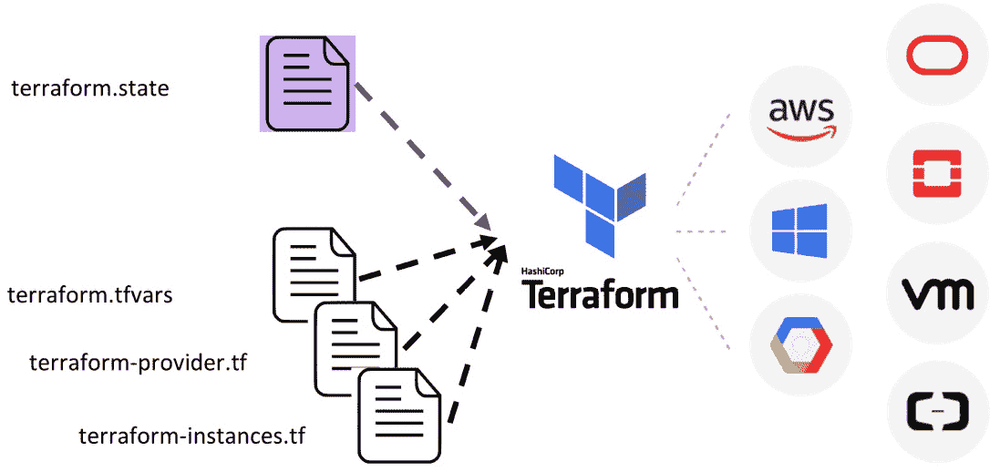
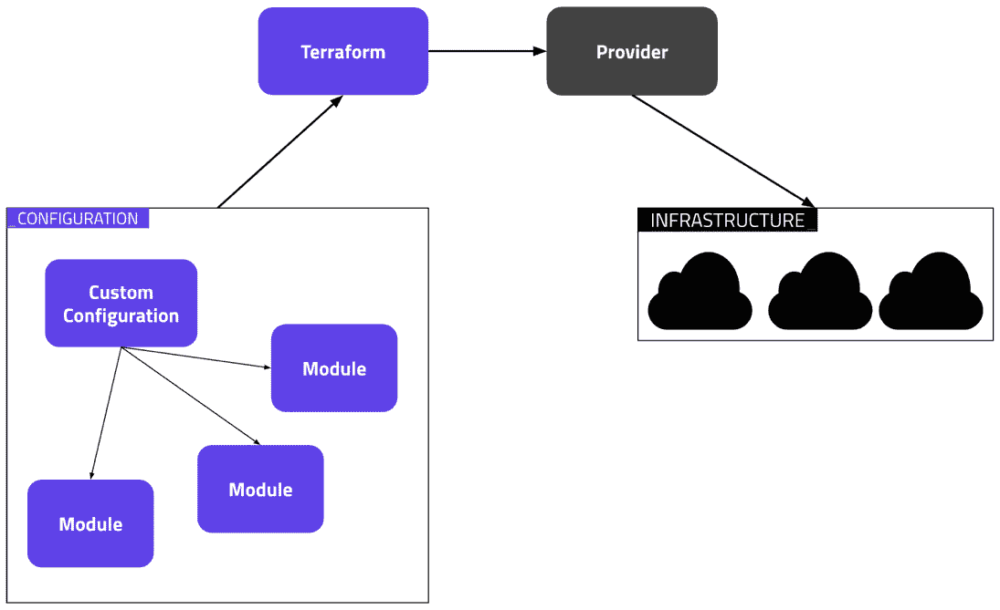
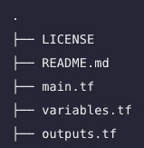
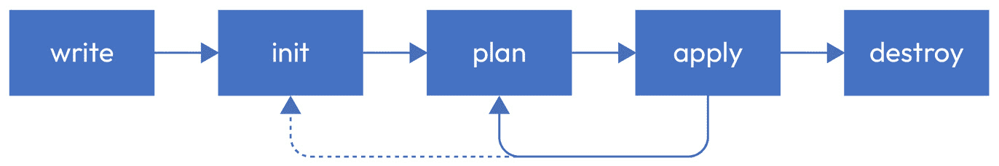
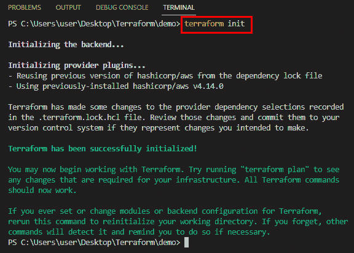
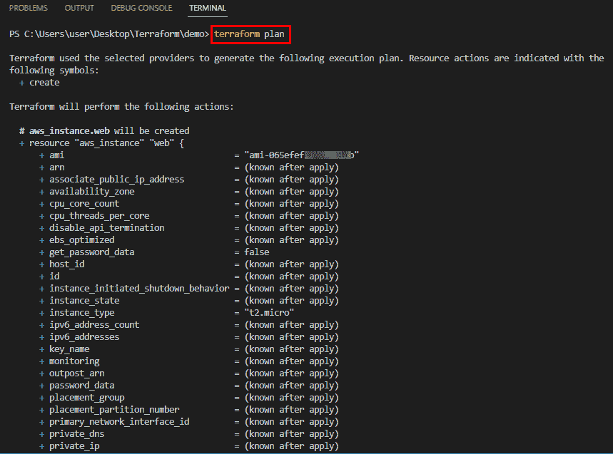
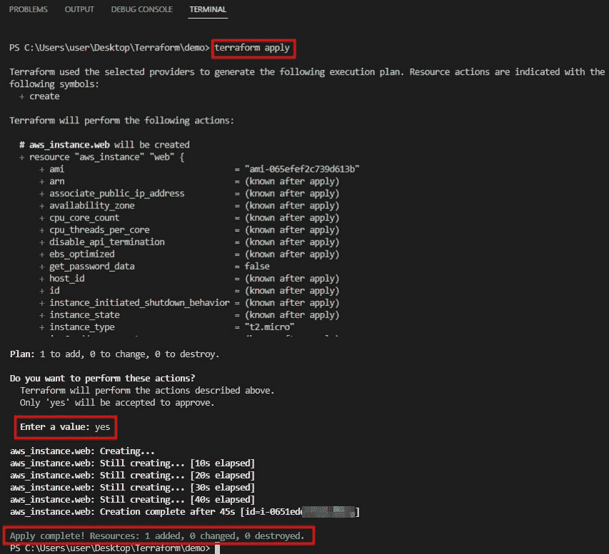
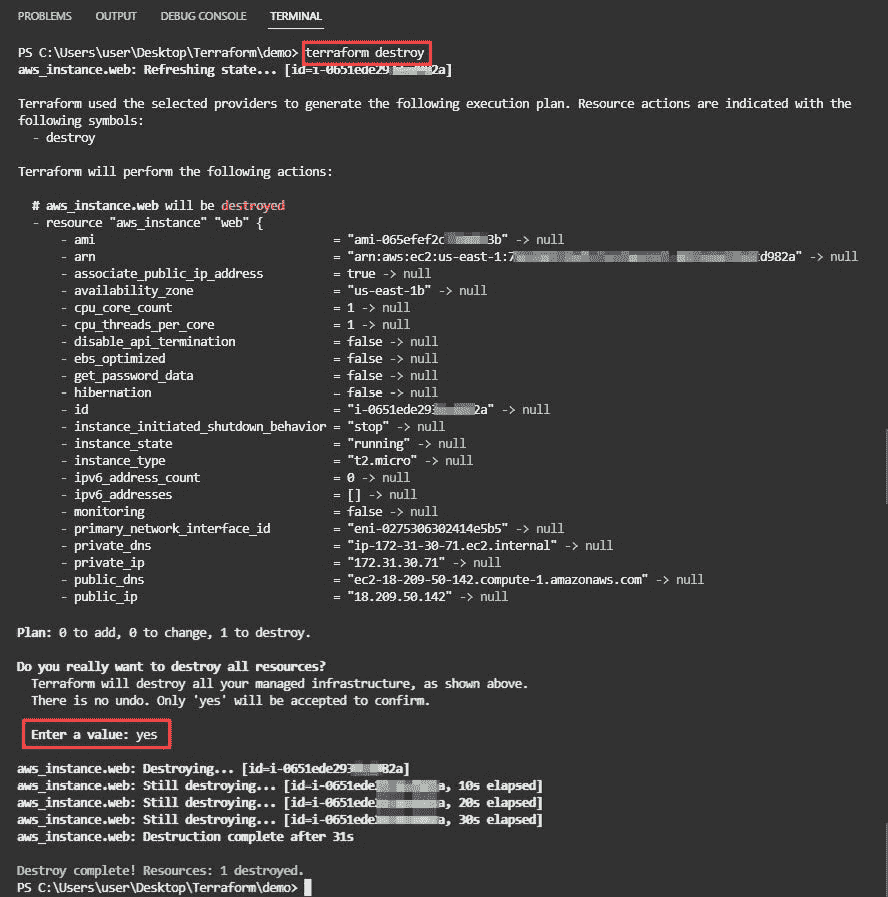
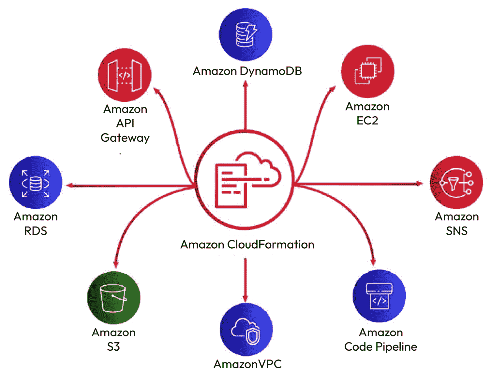

# 2

# 如何不使用 IaC 和 Terraform

**基础设施即代码**（**IaC**）工具如 Terraform 改变了我们管理云基础设施的方式，提供了强大的自动化能力，用于部署和配置复杂的环境。然而，尽管它带来了很多好处，但仍然存在许多情况下 IaC 和 Terraform 被误用或过度使用，导致低效、错误和安全漏洞。

在本章中，我们将探讨一些基本的 Terraform 命令，然后对比 Terraform 和 CloudFormation。

本章将涵盖以下主要内容：

+   Terraform 架构和工作流

+   与其他工具进行比较

# Terraform 架构和工作流

为了充分利用 Terraform 并有效地管理您的云基础设施，了解其架构和工作流非常重要。Terraform 采用声明式的基础设施管理方法，您通过配置文件描述所需的基础设施状态，Terraform 将负责提供和配置必要的资源以实现该状态。

在本章中，我们将探讨 Terraform 架构和工作流的关键组件，并提供一个高层次的概述，帮助您理解 Terraform 如何在 AWS、Azure 和 Google Cloud 等云平台上管理基础设施。理解这些概念将帮助您编写更高效的 Terraform 代码，并更容易地排除故障。

## 架构

Terraform 是一款允许开发者描述基础设施并在任何环境中运行的工具。Terraform 有许多使用场景，例如构建整个数据中心或仅构建单个服务器或资源：

图 2.1 – Terraform – 多云

Terraform 是一款强大的基础设施管理工具，能够安全高效地构建、修改和版本控制基础设施。它能够管理本地和远程基础设施，使其成为分布式团队在不同地理位置上协作项目的理想选择。通过 Terraform，团队可以轻松在复杂的基础设施项目中协作，无论他们身处何地，同时确保基础设施保持一致且始终更新。

Terraform 的架构非常简单，它仅由四个组件组成：

+   提供者

+   模块

+   资源

+   模板

模块用于定义基础设施及其组件。提供者负责如何在不同环境中执行这些模块。资源是我们构建基础设施所需要的，而模板则用于简化它们的描述。下图概述了 Terraform 的技术流程。

图 2.2 – Terraform 技术流程

### 提供者

Terraform 提供程序本质上是 Terraform 安装的插件，用于与远程系统交互，例如 Azure、AWS、Google Cloud、VMware 以及其他许多供应商的设备。

为了与各种云服务提供商、SaaS 提供商以及其他 API 交互，Terraform 依赖于被称为提供程序的插件。这些提供程序充当 Terraform 与目标基础设施之间的接口，允许 Terraform 管理所需的资源。通过利用丰富的提供程序生态系统，Terraform 使用户能够在多个平台上使用统一且一致的语法和工作流程来管理基础设施资源。

Terraform 使用提供程序来配置资源，这些资源描述了一个或多个基础设施对象，例如虚拟网络和计算实例。每个 Terraform 注册表上的提供程序都有文档，详细说明可用资源及其配置选项。

如果你在脚本中没有使用任何 Terraform 提供程序，你将无法管理或创建任何基础设施。你可以在 Terraform 代码中定义多个提供程序。

如果你正在使用 Terraform 模块，则需要在根模块中声明 Terraform 提供程序，而子模块会从根模块继承提供程序配置。Terraform 提供程序遵循自己的发布节奏和版本号语法。

### 模块

在 Terraform 中，模块本质上是位于单个目录中的 Terraform 模板文件集合。即使是最基本的配置，只包含一个目录和一个或多个 `.tf` 文件，也被视为 **模块**。从这种目录直接执行 Terraform 命令时，称其为 **根模块**。通过将基础设施配置组织成模块，用户可以封装相关资源，并在不同的项目中轻松重用。这种模块化使得团队能够创建可扩展和可维护的基础设施代码，从而加快开发速度，并随着时间的推移简化维护。以下是一个示例文件夹结构。

图 2.3 – 示例文件夹结构

在 Terraform 中，命令仅作用于位于特定目录中的模板文件，通常是当前工作目录。然而，通过在模板中使用模块块，你可以调用位于其他目录中的模块。每当 Terraform 遇到一个模块块时，它会处理该模块的配置文件。

当模板调用模块时，该模块被视为该模板的“子模块”。模块可以从本地或远程来源获取。Terraform 支持多种远程来源，例如 Terraform 注册表、各种版本控制系统、HTTP URL 以及 Terraform Cloud 或 Terraform Enterprise 中的私有模块注册表。通过利用远程模块，团队可以更轻松地共享和协作基础设施配置。

在公共 Terraform 注册表中已经发布了超过 10,000 个模块，可以在 [`registry.terraform.io/browse/modules`](https://registry.terraform.io/browse/modules) 直接使用，并且你可以立即开始使用它们来配置基础设施。

让我们来看看使用模块的好处：

+   **组织配置**：Terraform 提供模块作为简化基础设施配置组织和理解的一种方式。这种方法提供了更友好的用户体验，用户不需要学习 Terraform 的所有功能，而是可以专注于他们需要的特定功能。基础设施可能非常复杂，即使是相对简单的部署，也可能需要数百或数千行代码。通过利用模块，你可以将相关的配置元素逻辑地分组为独立的组件，使得随着时间的推移，管理和修改基础设施变得更加容易。

+   **封装配置**：模块还具有将配置封装成独立、逻辑组件的额外优势。通过封装，可以避免意外的后果，比如在试图更改一个组件时不小心修改了其他基础设施，同时也能最小化简单错误的可能性，例如不小心将相同的名称分配给不同的资源。通过将相关的配置元素组织在各自的模块中，用户可以更容易地理解和修改他们的基础设施，以一种受控和系统化的方式，降低意外错误的风险，并使得随着时间的推移，实施变更变得更加简单。

+   **重用配置**：从零开始创建基础设施配置可能是一个耗时且容易出错的过程。然而，通过利用模块，用户可以节省时间，执行治理，并通过重用自己、同事或 Terraform 社区其他成员已经公开的现有配置来减少代价高昂的错误。此外，模块可以在团队内共享或公开发布，用户可以从他人的专业经验中受益，也可以将自己的工作分享给其他可能觉得有用的人。最终，利用模块可以帮助用户更高效、更有效地工作，使得随着时间的推移，更容易实施和维护基础设施配置。

+   **提供一致性并确保最佳实践**：除了促进高效的配置开发外，模块还促进了基础设施配置之间的一致性。一致性对于理解复杂的配置至关重要，并确保最佳实践在所有配置中得到统一应用。例如，云提供商提供了多种选项来配置对象存储服务，如 Amazon S3 桶。不当保护的对象存储已导致多次重大安全事件，由于配置这些服务的复杂性，配置错误很容易发生。

+   **自助服务**：模块简化了其他团队使用您的配置。Terraform 注册表使其他团队能够查找并使用您批准和发布的 Terraform 模块。

+   **利用模块可以增强资源治理**：例如，可以使用模块定义您组织的公共网站桶的配置，以及为服务日志应用程序的私有桶定义单独的模块。此外，模块通过允许您在一个位置修改配置，从而将更新应用于所有使用该模块的实例，简化了资源配置的更新。

### 资源

Terraform 使用资源块来管理各种类型的基础设施，如虚拟网络、计算实例以及更高级的组件，包括 DNS 记录。这些资源块映射到 Terraform 配置中的一个或多个基础设施对象。

通常，每个 Terraform 提供程序都有多个独立的资源，这些资源对应于用于管理特定基础设施类型的相关 API。资源声明可以包括多个高级功能，尽管初始使用时只需要有限的子集。通过高级语法功能，如生成多个相似远程对象的单个资源声明，用户可以熟悉并确认所有资源提供程序文档页面中的功能，这些文档可以在 Terraform 注册表中找到。

### 模板

Terraform 模板提供了一种在目标云提供商或系统上以期望的格式创建资源的方法。

Terraform 模板是一组定义您希望实现的基础设施状态的文件。它们包括不同的配置文件，如变量、资源和模块。您可以根据需要和个人选择，将单个文件或多个文件保存在一个目录下。

现在我们已经介绍了架构的组件，让我们来看看工作流。

## 工作流

Terraform 的工作流包括五个基本步骤：

图 2.4 – Terraform 的工作流

这些步骤包括以下内容：

1.  **编写**：这一步涉及对代码进行修改。

1.  **初始化**：在此阶段，您初始化代码并下载代码中指定的要求，如提供程序。

1.  **计划**：在此步骤中，你回顾并预测更改，决定是否接受这些更改。

1.  **应用**：在此步骤中，你接受更改并在实际基础设施上实施这些更改。

1.  **销毁**：此最终步骤涉及销毁你创建的所有基础设施。

细节和操作因工作流而异。我们将详细查看工作流的所有步骤。

### 写入

首先，像在你喜欢的编辑器中编写代码一样编写 Terraform 配置。即使是个人工作，也建议将工作存储在版本控制的仓库中。

### 初始化

`terraform init` 命令初始化 Terraform 配置文件所在的工作目录。建议在创建新 Terraform 配置或从版本控制中克隆现有配置后，首先执行此命令。

多次执行此命令是安全的。`terraform init` 会执行多个初始化过程，准备当前工作目录以供 Terraform 使用。虽然后续运行可能会产生错误，但此命令不会删除现有的配置或状态。

大多数提供商作为 Terraform 插件提供。当执行命令时，Terraform 会扫描配置文件中的直接和间接提供商引用，并尝试安装相应的插件。程序会自动发现、下载并安装已发布的适当提供商插件，这些插件可以在公共注册表或第三方提供商的注册表中找到。

Terraform 在成功安装后会将所选提供商的信息存储在依赖锁文件中。为了确保 Terraform 在未来执行 `terraform init` 时选择相同的提供商版本，应该将此文件提交到版本控制系统中。

`terraform init` 命令可用于多种目的，如插件安装、子模块安装和后端初始化。

图 2.5 – Terraform 初始化输出

### 计划

`terraform plan` 命令生成一个执行计划，允许你预览 Terraform 打算进行的基础设施修改。一旦生成计划，Terraform 将执行以下操作：

+   读取现有远程对象的当前状态，以验证该状态是否最新

+   将当前状态与之前的状态进行比较，注意任何不一致之处

+   提供一组操作建议，若实施这些操作，应该能确保远程对象与配置一致

`terraform plan` 命令本身不会实施预测的修改。它的用途是在应用或与团队共享更改之前，检查所提议的更改是否符合预期。如果 Terraform 检测到没有资源变更，`terraform plan` 命令会指示实际基础设施不需要进行任何更改。

图 2.6 – terraform plan 输出

### 应用

要执行 Terraform 计划中建议的操作，请使用`terraform apply`命令。最简单的方法是执行`terraform apply`命令而不带任何参数，这将自动生成一个新的执行计划（类似于运行`terraform plan`），并在执行建议的操作之前请求用户确认。

除非明确指示跳过批准，`terraform apply`命令会在对相应的基础设施提供者 API 进行任何更改之前，提示用户进行确认。

如果与当前 Terraform 状态相比，配置文件没有检测到任何更改，则不会对基础设施进行任何修改。由于 Terraform 是声明性语言，`terraform apply`命令可以安全地执行多次。

图 2.7 – terraform apply 命令

### 销毁

你可以使用`terraform destroy`命令轻松销毁由特定 Terraform 配置管理的所有远程对象。在生产环境中，你不应该销毁那些长期存在的对象，但有时 Terraform 会被用于处理用于开发目的的短期基础设施，此时`terraform destroy`可以帮助在你不再需要这些临时对象时将它们全部删除。

`terraform destroy`命令应谨慎使用，这不是一个你会定期执行的命令。然而，它在非生产环境中经常使用，在这些环境中，清理任务对于许多概念验证测试是必需的。

图 2.8 – terraform destroy 命令

总结来说，Terraform 提供了一组命令来方便基础设施资源的创建、修改和删除。`terraform init`命令初始化包含 Terraform 配置文件的工作目录。`terraform plan`生成一个执行计划，用于预览将对基础设施进行的更改，而`terraform apply`在收到用户确认后执行建议的更改。最后，`terraform destroy`销毁由配置管理的所有远程对象。通过这些命令，Terraform 为管理基础设施即代码（IaC）提供了强大、灵活且高效的工具集。让我们将其他 IaC 工具与 Terraform 进行对比。

# 与其他 IaC 工具进行对比

Terraform 对资源和提供者的灵活抽象使其能够表示广泛的基础设施组件，从物理硬件和虚拟机到电子邮件和 DNS 提供商。这种多功能性使得 Terraform 能够解决各种问题。

Terraform 可以管理几乎任何云平台或虚拟环境，包括 AWS、Microsoft Azure 和 Google Cloud Platform 等。

本章重点介绍如何使用 Terraform 来管理 AWS 基础设施，但需要特别注意的是，Terraform 并不仅限于云平台。它可以管理单个应用程序或整个数据中心。

## Terraform 与 CloudFormation

在云资源的 **IaC** 工具方面，最受欢迎的两种选择是 Terraform 和 AWS CloudFormation。虽然这两种工具都旨在提供一种可靠、高效且安全的方式来管理云基础设施，但它们在方法和实现上有所不同。Terraform 是一款开源工具，提供了一种灵活且可扩展的语言来创建和管理基础设施。而 CloudFormation 是一款 **AWS** 专有工具，使用 JSON 或 YAML 模板来定义基础设施资源。本节将对比和分析 Terraform 与 CloudFormation 的功能和能力，帮助你做出更明智的决策，选择最适合你基础设施管理需求的工具。

## 什么是 AWS CloudFormation？

CloudFormation 是由 **AWS** 提供的一项服务，用于简化一组 AWS 资源的管理，包括根据需要进行资源的配置和更新。通过 CloudFormation，你可以根据应用环境的变化来创建、更新和删除堆栈。这个 AWS 托管的服务还提供了一种创建可重用模板的简便方法，帮助你部署具有成本效益的应用程序。

CloudFormation 允许你使用一种称为模板的配置格式，为你的云环境设计和配置 AWS 及第三方资源。这些模板可以使用 JSON 或 YAML 格式编写，允许基础设施的可重用性和可扩展性，使得管理大规模云环境变得更加容易。下图展示了 Amazon CloudFormation 如何作为各种 AWS 服务的中央协调器。

图 2.9 – AWS CloudFormation

## Terraform 与 CloudFormation 之间的比较与差异

**范围**：在覆盖面方面，CloudFormation 非常强大，因为它是由 AWS 直接开发和支持的，但 Terraform 拥有一个强大的社区，始终以快速的步伐工作，确保新资源和功能快速为供应商实现。

**类型**：CloudFormation 是 AWS 提供的托管服务，但 Terraform 拥有一个 CLI 工具，可以从你的工作站、服务器或 CI/CD 系统（如 Jenkins、GitHub Actions 等）或 Terraform Cloud（HashiCorp 提供的 SaaS 自动化解决方案）运行。

**许可证和支持**：CloudFormation 是 AWS 的原生服务，AWS 支持计划也涵盖了它。Terraform 是一款企业产品，也是一个开源项目。HashiCorp 提供 24/7 的支持，同时，庞大的 Terraform 社区和供应商开发者总是乐于提供帮助。

**语法**/**语言**：CloudFormation 支持 JSON 和 YAML 格式。Terraform 使用 **HashiCorp 配置语言**（**HCL**），这种语言既易于人类阅读，也对机器友好。

**架构**：CloudFormation 是 AWS 管理的服务，您可以将模板上传至此进行资源配置；而 Terraform 是一个去中心化的系统，可以从任何工作站或服务器进行基础设施的配置。

**模块化**：在 CloudFormation 中，可以使用嵌套堆栈和跨堆栈引用来实现模块化，而 Terraform 则能够创建可重用和可复制的模块。

**用户体验**/**易用性**：与仅限于 AWS 服务的 CloudFormation 相比，Terraform 跨多个云服务提供商，如 AWS、Azure 和 Google Cloud Platform 等。这种灵活性使得 Terraform 能够提供统一的方式来管理多个云提供商的云基础设施，因此成为使用多个云提供商的组织的热门选择。

**生命周期和状态管理**：CloudFormation 使用堆栈存储和管理状态。Terraform 将状态以 JSON 格式存储在磁盘上，并允许使用远程状态系统，如 AWS S3 存储桶，从而具备版本跟踪功能。

**从现有基础设施导入**：CloudFormation 支持将资源导入，但仅限于少数资源。而 Terraform 可以将所有资源导入到状态中，但在这个过程中不会自动生成配置文件；你需要手动处理。不过，也有第三方工具可以帮助生成配置。

**验证步骤**：CloudFormation 使用变更集来验证所需的变更。Terraform 拥有强大的计划功能，可以识别变更，并允许你在应用之前验证对现有基础设施的变更。

**滚动更新与回滚**：CloudFormation 会自动回滚到上一个工作状态。Terraform 不具备滚动更新或回滚功能，但你可以通过 CI/CD 系统构建回滚机制。

**多云管理**：CloudFormation 仅限于 AWS，而 Terraform 支持多个云服务提供商及更多服务。

**合规性集成**：CloudFormation 由 AWS 构建，因此合规性已得到保障；而对于 Terraform，你需要自行实现第三方工具来实现合规性。

**部署类型**：CloudFormation 内置了 CI/CD 系统，能够处理与部署和回滚相关的所有事务。而 Terraform 可以从任何系统部署，但需要自己构建 CI/CD 工作流，或采用能够填补空白的服务。

**漂移检测**：这两种工具默认都具有漂移检测功能。

**成本**：使用 AWS CloudFormation 不会产生除创建的 AWS 资源（如 Amazon EC2 实例或 Elastic Load Balancing 负载均衡器）以外的额外费用。相比之下，Terraform 是一个开源项目，可以免费使用。然而，要获得如 CI/CD 自动化和状态管理等企业级功能，您可能需要考虑使用 HashiCorp 或第三方服务提供商提供的额外服务和系统。这些额外服务可能会有自己的费用。

## Terraform 还是 CloudFormation——我该选择哪个？

Terraform 和 CloudFormation 之间的辩论仍在继续，最终，选择使用哪个工具将取决于您的个人偏好和需求。两者都提供了独特的优势和功能，因此评估哪个工具最符合您组织的目标和云基础设施需求非常重要。

当您的整个基础设施依赖于 AWS，并且未来没有计划集成多云架构时，CloudFormation 是更合适的选择。对于 AWS 服务的新手，AWS 本身提供的集成支持非常有优势。由于它是由 AWS 开发的，CloudFormation 享有更快的 AWS 相关更新。它支持 JSON 和 YAML，从而避免了与 HCL 相关的潜在学习障碍。

另一方面，当需要使用（甚至是未来可能需要使用）多云资源，并且希望加快操作速度时，Terraform 表现更为出色。它的模块化设计促进了可重复模板的创建，加速了配置过程。此外，Terraform 提供了 CloudFormation 没有的更广泛功能，这对更快的资源供应非常有帮助。

最适合您的工具最终取决于您的需求。您应评估应用程序的基础设施战略、安全性和合规性要求以及云采用战略，以做出最终决策。

# 总结

本章概述了 Terraform 及其架构和工作流程，并对 Terraform 与 CloudFormation 进行了比较。Terraform 是一个流行的 IaC 工具，可在多个云提供商之间安全高效地管理基础设施。它依赖名为“提供者”（providers）的插件与云提供商、SaaS 提供商及其他 API 进行交互。Terraform 使用模块将配置组织并封装成逻辑组件，使得浏览和理解复杂配置变得更加容易。使用模块还可以提供配置的一致性，并使其他团队更容易使用它们。Terraform 使用资源块管理配置中的基础设施对象，大多数提供者都有多个不同的资源，这些资源映射到适当的 API 来管理该类型的基础设施。Terraform 的工作流程包括五个关键步骤：**写（Write）**、**初始化（Init）**、**规划（Plan）**、**应用（Apply）**和**销毁（Destroy）**。

本章还将 Terraform 与 AWS CloudFormation 进行比较，后者仅限于 AWS 服务，而 Terraform 可以跨多个云服务提供商。虽然 CloudFormation 简化了管理 AWS 资源生命周期的过程，并提供了一种创建可重用模板的简单方式，但 Terraform 的灵活性使得能够统一管理多个提供商的云基础设施。

最终，是否使用 Terraform 或 CloudFormation 的决定将取决于个人偏好和需求。这两种工具都提供了独特的优势和功能，能够帮助组织高效管理其云基础设施。

在接下来的章节中，我们将深入探讨使用 Terraform 的各个关键方面。让我们开始编写第一个 Terraform 模板。
