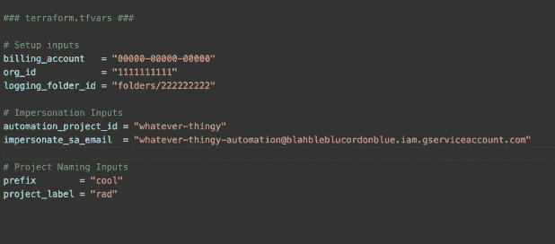

# 第四章：4

# 探索 Terraform IaC 项目的最佳实践

在开始使用 Terraform 时，理解**基础设施即代码**（**IaC**）项目的最佳实践非常重要。在本章中，我们将探讨一些 Terraform 的关键最佳实践，包括如何维护、执行和保护你的 IaC 项目。我们还将探讨如何在 DevOps 或云团队中实施 Terraform。通过遵循这些最佳实践，你将能够使用 Terraform 创建高效且可靠的基础设施部署。

本章将讨论以下主要主题：

+   如何使用 Terraform 维护 IaC 项目

+   如何使用 Terraform 执行 IaC 项目

+   如何使用 Terraform 保护 IaC 项目

+   在 DevOps 或云团队中实施 Terraform

# 如何使用 Terraform 维护 IaC 项目

使用 Terraform 维护 IaC 项目至关重要，能够确保其长期有效性、准确性和安全性。这包括管理状态、更新、变更和基础设施配置的版本等任务。在本章中，我们将讨论使用 Terraform 维护 IaC 项目的最佳实践，涵盖管理状态、使用版本控制、测试等主题。通过采纳明确定义的标准模块结构，你为简化开发、提升协作以及在大规模中掌握资源编排奠定了基础。

## 遵循标准模块结构

Terraform 中的模块提供了一种打包和重用资源配置的方法。它们本质上是将多个一起使用的资源组合在一起的容器。模块由一组`.tf`和/或`.tfvars`文件组成，并保存在一个目录中。通过遵循这些最佳实践，提升你的部署能力，每一个步骤都是实现高效且和谐资源配置的垫脚石：

+   每个模块应以`main.tf`文件开始，默认包含资源。

+   在每个模块中包含一个 Markdown 格式的`README.md`文件。该文件应包含关于模块的基本文档。

+   在每个模块中创建一个`examples/`文件夹，并为每个示例设置一个单独的子目录。每个示例都应包含一个详细的`README.md`文件。

+   使用描述性的资源文件名称，例如`network.tf`、`instances.tf`或`loadbalancer.tf`，以创建资源的逻辑分组。

+   避免为每个资源创建单独的文件。相反，应根据资源的共同目的进行分组。例如，将`google_dns_managed_zone`和`google_dns_record_set`合并到`dns.tf`中。

+   模块的根目录应仅包含 Terraform（`.tf`）文件和仓库元数据文件（如`README.md`和`CHANGELOG.md`）。

+   将额外的文档放在`docs/`子目录中。

## 采用命名规范

在 IaC 中，命名规范对于可持续性和为团队设定统一的命名实践非常重要：

+   使用名词作为资源名称。例如，你可以将它们命名为`aws_instance`或`google_storage_bucket`。

+   资源名称应使用单数形式；例如，使用`aws_instance`而不是`aws_instances`。

+   使用有意义的名称区分相同类型的资源；例如，你可以将两个负载均衡器命名为`primary`和`secondary`。

+   数据源名称应使用名词——例如`aws_availability_zones`和`google_project`。

+   在某些情况下，数据源可以返回列表并且可以使用复数形式。例如，`aws_availability_zones`返回可用区列表。

+   将资源命名为`main`以简化对模块中唯一资源类型的引用。例如，`aws_security_group_rule.main`。

    记住`aws_resource.my_special_resource.id`与`aws_resource.main.id`之间的区别需要额外的脑力。

+   Terraform 配置块中的属性名称应使用全小写字母，并用下划线分隔单词。

+   一致性非常重要，因此所有配置对象，包括资源类型和数据源类型，也应使用下划线分隔多个单词。

    这不是推荐的做法：

    ```
    resource "azurerm_virtual_machine" "main-vm" {
      name = "main-vm"
    }
    ```

    这是推荐的做法：

    ```
    resource "azurerm_virtual_machine" "main_vm" {
      name = "main-vm"
    }
    ```

+   在资源名称中，不要重复资源类型。例如，以下做法不推荐：

    ```
    resource "azurerm_virtual_machines" "main_virtual_machine" { … }
    ```

    然而，推荐的做法是：

    ```
    resource "azurerm_virtual_machine" "main" { ... }
    ```

## 小心使用变量

发现如何明智地使用变量的强大功能，塑造动态环境，并赋予部署适应性和效率：

+   所有变量应在`variables.tf`文件中声明。

+   为变量选择有意义的名称，准确描述它们在 Terraform 配置中的目的或用途：

    +   如果你有输入、局部变量或输出代表数字值，例如磁盘大小或内存大小，请确保在它们的名称中包括适当的单位，例如`ram_size_gb`。

    +   布尔变量应使用正面且有意义的名称，以简化条件逻辑。例如，一个表示是否启用外部访问的变量可以命名为`enable_external_access`。

+   为变量包含描述，以为新开发者提供更多的上下文，而这些上下文是描述性名称可能无法传达的。描述会自动包含在发布模块的自动生成文档中。

+   为定义的变量提供数据类型。

+   如果合适，提供变量的默认值：

    +   为具有环境无关值的变量提供默认值，例如磁盘大小。

    +   对于具有特定环境值的变量（例如`project_id`），建议不要提供默认值。这确保调用模块提供必要的值，避免无意的配置错误。

+   仅当留空变量是一个有效的选择且底层 API 不会拒绝时，才使用空的默认值（例如空字符串或列表）。总是按照以下示例的顺序使用它们：

    ```
    variable "global_settings" {
    description = "Setting read in from a global settings block"
    type = map
    default = {}
    }
    ```

+   仅对每个实例或环境需要不同的值使用变量。在暴露变量之前，请确保有特定的需求需要更改该变量。如果某个变量被使用的可能性很小，最好完全不暴露它。

+   在定义类型为 map 或 list 的变量时，始终使用复数形式的名称，因为可能会读取多个值。

## 暴露输出

在 Terraform 中暴露输出可以帮助其他模块引用有用的值，并减少项目中冗余代码的数量。以下是暴露输出的一些建议：

+   将所有输出组织在 `outputs.tf` 文件中

+   对所有输出使用有意义的描述

+   在 `README.md` 文件中记录输出描述

+   使用诸如 `terraform-docs` 等工具自动生成提交时的输出描述

+   输出所有根模块可能需要引用或共享的有用值

+   对于开源或广泛使用的模块，暴露所有有潜力被使用的输出

+   避免通过输入变量直接传递输出，因为这会阻止它们正确地添加到依赖图中

+   为确保隐式依赖关系得到创建，请确保输出引用资源的属性

+   不要直接引用实例的输入变量，而是像下文示例那样传递属性。

    推荐这样做：

    ```
    output "name" {
      description = "Name of Virtual Machine"
      value       = azurerm_virtual_machine.main.name
    }
    ```

    不推荐这样做：

    ```
    output "name" {
      description = "Name of Virtual Machine"
      value       = var.name
    }
    ```

注意

您可以在 [`cloud.google.com/docs/terraform/best-practices-for-terraform`](https://cloud.google.com/docs/terraform/best-practices-for-terraform) 中找到更多关于 Terraform 最佳实践的详细信息。

## 使用数据源

数据源使 Terraform 能够使用外部定义的数据，例如在另一个 Terraform 配置、独立工具或函数中定义的数据。以下是一些示例：

+   将数据源放置在引用它们的资源旁边

+   考虑将大量数据源移至专用的 `data.tf` 文件

+   使用变量或资源插值来获取相对于当前环境的数据

## 利用 tfvars 文件

对于任何非机密的数据，尽可能使用 `tfvars` 文件处理所有输入，并将其添加到源代码管理中。这样，您可以跟踪值的变化，如果犯错，还可以回滚到以前的提交，并一目了然地查看已部署的内容。这也应该是大多数部署更改发生的地方。

## 根据功能将变量和输入分开

在您的 `variables.tf` 文件和 `terraform.tfvars` 文件中，使用注释根据功能将其分开。这样能使您的代码更具可读性，并在操作时更容易更改。



图 4.1 – 示例 tfvars

## 限制使用自定义脚本

限制在 Terraform 配置中使用脚本，仅在必要时使用。请记住，通过脚本创建的资源状态不由 Terraform 管理，可能会导致未来出现问题。建议尽可能使用 Terraform 内置的资源类型和提供者。以下是一些关键步骤：

+   尽量避免使用自定义脚本。相反，依赖 Terraform 资源来定义基础设施的预期行为。然而，如果 Terraform 资源无法提供所需的功能，可以适度使用自定义脚本。请记住，通过脚本创建的资源不会被 Terraform 记录或管理，因此可能会增加管理基础设施的复杂性。

+   明确记录任何自定义脚本的使用原因，并尽可能制定弃用计划。

+   Terraform 中的 provisioners 可用于调用自定义脚本，包括 `local-exec` provisioner。

+   将 Terraform 调用的自定义脚本组织在 `scripts/` 目录中。

## 将辅助脚本包含在单独的目录中。

将辅助脚本组织在单独的目录中是维护 Terraform IaC 项目的良好实践。为了为你的 IaC 项目奠定良好的基础，考虑以下几点：

+   将不被 Terraform 调用的辅助脚本保存在名为 `helpers/` 的目录中。

+   在 `README.md` 文件中记录所有辅助脚本，提供描述和示例调用。

+   对于接受参数的辅助脚本，提供参数检查和 `--help` 输出，以确保脚本的正确使用。

## 将静态文件放在单独的目录中。

通过采用组织的力量，增强你的 AWS 基础设施编排能力。了解如何通过战略性地将静态文件分离到专用目录中，提高资源管理效率，并提升你的 Terraform 驱动的部署清晰度：

+   创建一个 `files/` 目录，用于存放 Terraform 引用但不执行的静态文件，例如加载到计算引擎实例上的启动脚本。

+   将较长的 HereDocs 放在外部文件中，分离它们的 HCL 代码，并通过 `file()` 函数引用。

+   使用 `.tftpl` 文件扩展名，用于通过 Terraform 的 `templatefile()` 函数读取的文件。

+   将模板放在 `templates/` 目录中。

## 保护有状态资源。

探索保护基础设施核心的关键策略，确保其韧性、合规性和无缝持续性。

确保为如数据库等有状态资源启用删除保护。以下是启用删除保护的示例：

```
resource "azurerm_sql_database" "main" {
  name = "primary-instance"
  settings {
    tier = " "
  }
  lifecycle {
    prevent_destroy = true
  }
}
```

## 使用内置格式化功能。

在 Terraform 代码中保持一致性和可读性非常重要。为了确保这一点，使用 Terraform 的 `fmt` 命令自动格式化所有 Terraform 文件，遵循官方的 Terraform 风格指南。这有助于保持一致性，并使其他人更容易阅读和理解你的代码。

## 限制表达式的复杂度

避免过于复杂的插值表达式；如果一个表达式需要多个函数，考虑将其拆分成更小、更易读的表达式，使用本地值。

每行只使用一个三元运算符，并使用多个本地值，而不是在单一行内构建复杂的逻辑。

## 使用`count`进行条件值

使用`count`元参数有条件地实例化资源。以下是一个示例：

```
variable "readers" {
  description = "..."
  type        = list
  default     = []
}
```

该 Terraform 代码片段声明了一个名为`readers`的变量，其类型为列表，并且默认值为空。该代码片段中未包含该变量的描述：

```
resource "resource_type" "reference_name" {
  // Do not create this resource if the list of readers is empty.
  count = length(var.readers) == 0 ? 0 : 1
  ...
}
```

该代码还定义了一个类型为`resource_type`的资源，并使用`reference_name`作为引用名称。`count`元参数用于根据`readers`列表变量的长度有条件地创建该资源。如果`readers`列表的长度为`0`，则该资源不会被创建（count = `0`）。否则，如果长度大于`0`，则该资源会被创建（count = `1`）。

## 使用`for_each`来处理迭代资源

在根据输入资源创建多个副本时，使用`for_each`元参数。

## 将模块发布到注册中心

将可重用模块发布到模块注册中心，以提高重用性，并使团队更容易使用。

接下来，我们将探索如何使用 Terraform 确保 IaC 项目的安全性。

# 如何使用 Terraform 执行 IaC 项目

每个团队总是从在他们的开发环境或本地计算机上运行 Terraform 开始他们的 Terraform 之旅。

随着团队开始采用更多的 Terraform 和 IaC，你将需要更多的自动化来确保每次运行的一致性，并提供其他重要功能，如与版本控制的集成、代码审查、环境管理等。

Terraform 自动化可以以不同的形式和程度实现。一些团队可能坚持在本地运行 Terraform，使用自定义的包装脚本确保 Terraform 操作时的工作目录一致。而其他团队则完全在像 Jenkins、GitHub Actions、Terraform Cloud 或 Terraform Enterprise 等编排工具内运行 Terraform。

以下是创建 Terraform 自动化执行流水线的步骤：

1.  选择一个版本控制系统，如 GitHub、Git 等。

1.  将所有模板/文件存储在版本控制中。

1.  选择一个自动化流水线。

1.  决定将状态存储在哪里（例如，AWS S3、Terraform Cloud 等）。

1.  在自动化流水线脚本中，执行以下操作：

    1.  验证 Terraform **命令行接口** (**CLI**) 是否存在于自动化流水线中。

    1.  验证与状态位置和云提供商的连接。

    1.  初始化 Terraform 工作目录。

    1.  生成一个计划，改变资源以匹配当前配置。

    1.  让人工操作员审核该计划，以确保其可接受。

    1.  应用计划中描述的更改。

在建立了执行 Terraform IaC 项目的基础方面之后，现在让我们将重点转向一个至关重要的方面：确保这些项目的安全性。通过将强大的安全实践无缝地集成到 Terraform 工作流中，你不仅能够保护你的基础设施，还能加强你的开发管道，确保你的 AWS 环境的全面成功。

# 如何使用 Terraform 确保 IaC 项目的安全

使用 IaC 或 Terraform 来部署和管理资源使得过程更加快捷和简便，避免了单次脚本或手动步骤的需求。通过 Terraform，可以像管理应用程序和服务一样管理基础设施，包括服务器、数据库、网络、Kubernetes 集群和整个应用堆栈。

尽管 IaC 可能不会立即带来风险或攻击面，但考虑到安全性仍然很重要。然而，由于 IaC 通常由工程和 DevOps 团队管理，因此可能会忽视安全措施，而优先关注已投入生产的云资源的监控。

管理大规模基础设施可能会很复杂，而安全和 DevOps 团队可能没有必要的专业知识、访问权限或工具来妥善解决安全问题。这可能导致云资源配置错误，例如工程师和开发人员错过重要的安全措施。以下是一些常见的错误：

+   使用了未针对安全性优化的默认配置。

+   没有启用日志记录，导致故障排除或审计跟踪变得困难。

+   使用未加密的数据库，导致数据易于受到损坏和泄露的风险。

+   部署了不安全的协议（例如，没有使用 HTTPS）

+   缺乏基础的治理和预防系统来应对安全问题或配置错误。

基础设施即代码（IaC）涉及使用代码定义和管理配置，这意味着所有的安全配置也必须在代码中定义。以下是一些确保 Terraform 项目安全的建议：

+   确保你的状态文件存储位置是安全的，并且不公开可访问，同时为团队的操作提供适当的访问权限。

+   将私有模块保存在私有模块注册中心。

+   不要在 Terraform 文件或变量中硬编码敏感信息，如密钥、凭证、密钥或证书。相反，应该在运行时从安全位置获取这些信息。

+   使用 Checkov 等工具扫描你的 Terraform 模板和目录，检查与加密、网络、备份、IAM 以及其他安全和合规政策相关的配置错误。

+   在你的**持续集成/持续部署**（**CI/CD**）管道中自动化 IaC 扫描，以确保一致性，并在 CI 运行过程中提供自动反馈，以防止配置错误的代码。

+   使用版本控制系统，锁定你的主部署分支，并在部署前始终进行自动化检查并获取同行评审和批准。

+   仔细审查`terraform plan`的结果，以避免任何意外的资源销毁。

在为您的 IaC 项目加固了 Terraform 的安全措施之后，下一个重要的步骤是将 Terraform 无缝地整合到您的 DevOps 或云团队中。发现将 Terraform 纳入团队实践的关键步骤，增强协作、效率，并实现一个统一而强大的 AWS 环境。

# 在 DevOps 或云团队中实施 Terraform

在 DevOps 或云团队中实施 Terraform 不仅仅是采用工具。还需要了解流程、团队能力和组织文化。以下是您可以遵循的一些步骤，成功地在您的 DevOps 或云团队中实施 Terraform：

1.  **从试点项目开始**：从一个可以向团队展示 Terraform 价值的小项目开始。可以是一个简单的基础设施部署，如 VPC，或一个更复杂的应用堆栈。

1.  **识别团队的知识空白**：Terraform 需要对云基础设施、编码和最佳实践有所了解。识别团队知识中的任何空白，并制定计划加以解决。

1.  **鼓励协作和知识共享**：Terraform 是一个需要多个团队贡献的协作工具。鼓励您的团队分享他们的知识、经验和最佳实践。

1.  **实施版本控制系统（VCS）**：Terraform 代码是代码，应像任何其他代码一样对待。实施一个 **VCS** 来管理基础设施代码的更改。

1.  **实施 CI/CD 管道**：使用 CI/CD 管道自动化测试、构建和部署 Terraform 代码。这确保基础设施更改在部署之前经过彻底测试。

1.  **实施 IaC 最佳实践**：使用 IaC 开发的最佳实践，如模块化、代码审查和测试。这确保您的基础设施代码可维护、可扩展和安全。

1.  **监控和优化**：实施监控和警报以识别和解决问题。通过审查日志和指标并确定改进的领域来优化您的基础设施。

通过遵循这些步骤，您可以成功地在您的 DevOps 或云团队中实施 Terraform，并获得 IaC 的好处。

# 总结

在本章中，我们介绍了 Terraform IaC 项目的最佳实践，包括组织文件、定义变量、使用数据源和管理状态。我们还讨论了如何使用 Terraform 维护 IaC 项目，包括管理资源、部署更改和使用版本控制。此外，我们探讨了如何使用模块、提供程序和 Terraform Cloud 执行 IaC 项目。

最后，我们讨论了如何使用 Terraform 确保 IaC 项目的安全，包括保护状态、避免硬编码的秘密，以及使用如 Checkov 等工具。通过遵循这些最佳实践，DevOps 和云团队可以有效地利用 Terraform 来管理大规模基础设施，同时保持安全性和合规性。

在下一章中，我们将深入探讨规划 Terraform 基础设施项目的基本原则。我们将从在 AWS 中创建初始 Terraform 模板的指导开始。接着，我们将加深你对 AWS 提供者和 Terraform 模块的理解，这些都是任何 Terraform 项目的核心元素。

# 第二部分：成为 AWS 中 Terraform 的专家

在这一部分中，我们将更深入地探讨在 AWS 上使用 Terraform 的复杂性，引导你通过部署和管理云基础设施的过程，成为专家。我们首先讨论在 AWS 中规划和设计基础设施项目的重要性，确保你的 Terraform 部署有坚实的基础。你将学会如何为你的 AWS Terraform 项目做出明智决策，考虑资源选择、配置和部署策略等因素。接下来，我们将转向 Terraform 在各种项目中的实际应用，包括在 AWS 中部署无服务器应用程序和容器。到本部分结束时，你将全面理解如何熟练地使用 Terraform 在 AWS 上部署和管理复杂的基础设施。

本部分包含以下章节：

+   *第五章**，在 AWS 中规划和设计基础设施项目*

+   *第六章**，在 AWS 中为 Terraform 项目做决策*

+   *第七章**，在项目中实现 Terraform*

+   *第八章**，使用 Terraform 部署无服务器项目*

+   *第九章**，在 AWS 中使用 Terraform 部署容器*
