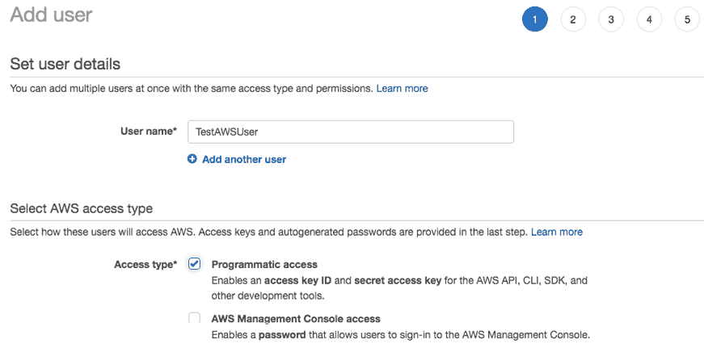
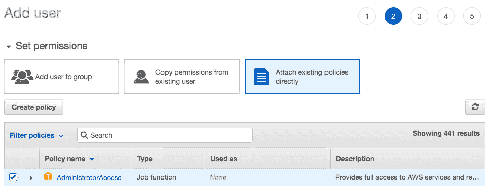
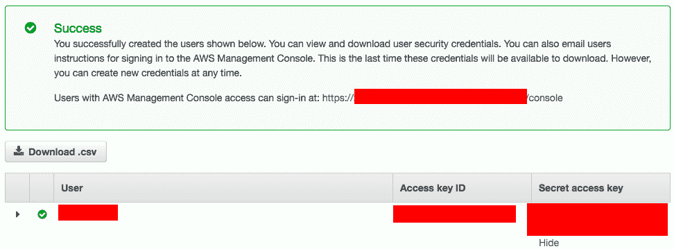
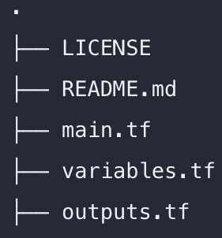
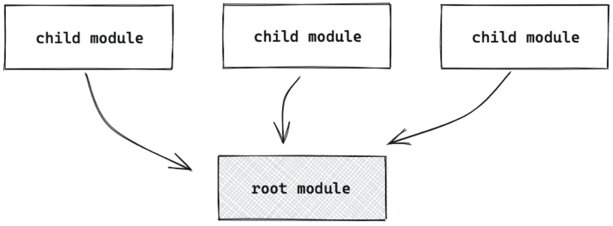
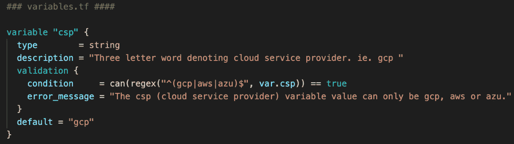

# 5

# 在 AWS 中规划和设计基础设施项目

在云计算的世界中，规划和设计基础设施项目是实现预期结果的关键步骤。随着云计算环境的不断发展，为基础设施制定合适的规划和设计变得越来越重要。借助 Terraform 这一基础设施即代码工具，你可以轻松地在**亚马逊网络服务**（**AWS**）中规划和设计基础设施项目。

本章将为你提供使用 Terraform 在 AWS 中规划和设计基础设施项目所需的基础知识。我们将讨论基础设施项目规划的基本内容、在 AWS 中设计你的第一个 Terraform 模板、理解 AWS 提供者和 Terraform 模块，并实施 Terraform AWS 模块的最佳实践。通过本章的学习，你将为使用 Terraform 在 AWS 中规划和设计基础设施项目打下坚实的基础。

本章将涵盖以下主题：

+   Terraform 基础设施项目规划基础

+   如何在 AWS 中设计你的第一个 Terraform 模板

+   了解 AWS 提供者

+   了解 Terraform 模块

+   如何使用 Terraform AWS 模块实施最佳实践

# Terraform 基础设施项目规划基础

随着技术的发展，越来越多的企业和领导者开始采用**基础设施即代码**（**IaC**）来管理其 IT 基础设施。随着软件开发中对灵活性和安全性的需求日益增加，IaC 提供了一种高水平的代码解决方案，自动化基础设施资源的配置。然而，理解实施 IaC 所带来的潜在好处和挑战也非常重要。在本章中，我们将探讨使用 Terraform 在 AWS 中规划和设计基础设施项目的基础知识，涵盖 AWS 提供者、Terraform 模块和最佳实践等重要主题。

## 速度优势

云计算的采用带来了 IaC，它为部署、修改和移除虚拟基础设施服务提供了显著的速度和敏捷性优势。通过 IaC，团队可以以编程方式与基础设施交互，从而实现生命周期管理的自动化。在某些情况下，自动化解决方案还可以使用 IaC 管理非编程的命令行界面设备。

## 风险管理优势

在组织中实施 IaC 可以带来许多好处。一个主要的优势是消除了在手动基础设施配置和提供过程中经常发生的人为错误。通过使用 IaC，组织可以大大减少与人为错误相关的风险，并增强其基础设施的安全性。

## 安全性、可重用性和治理

为了充分发挥 IaC 技术的潜力，设置 IaC 管道对于组织来说至关重要。正确设置 IaC 管道需要考虑安全性、可重用性和治理等因素。必须实施一个完整的持续集成和持续部署管道，特别是对于需要频繁更新的应用程序，这对于 IaC 来说尤其重要。这种方法可以显著提高组织的市场响应速度，同时降低成本。

## 团队技能集

在过渡到 IaC 平台时，必须考虑现有员工的技能集。IaC 需要一套不同的开发技能，而当前团队可能并不具备这些技能。忽视这一点可能会导致员工的失去动力和参与度，特别是当编码不是他们的技能集或他们不愿意学习时。因此，提供培训和支持，帮助员工适应这种新的工作方式至关重要。

## 自动化的最佳候选任务

确定哪些基础设施应视为代码是一个关键决策。对于那些仅在组织生命周期中部署一次的基础设施，不值得自动化，但对于那些需要定期部署的新应用程序或服务的基础设施，自动化则是值得的。重要的是不要陷入自动化每一项任务的困境，而是要确保你的 IaC 工作能够为传统方法提供更好的投资回报。

## 将要运行的应用程序类型

为应用程序设计 IaC 模板对其成功至关重要。配置应该模块化，并由配置管理系统驱动，设计过程应考虑到将在基础设施上运行的应用程序。例如，如果计划部署数据库，IaC 设计的考虑因素将根据应用程序是事务型的还是用于报告的目的而有所不同。

## 自动化过多任务的成本

在追求提高效率的过程中，一般的指导原则是自动化所有重复性的任务，将人工管理保留为特殊情况使用。这种方法有助于有效地管理内部利益相关者和部门的期望。然而，密切关注**投资回报率**（**ROI**）对于自动化至关重要，因为自动化每一项基础设施任务可能会导致成本超支。

## 代码的关键性

基础设施对任何企业的成功至关重要，因此用于管理基础设施的代码应该受到同等重视。这包括为可能出现的问题设置正确的流程和备份程序。虚拟网络、数据中心和服务器需要像物理基础设施一样，采取有纪律的变更管理和测试方法。

## 对软件专业知识的需求

软件工程师和基础设施工程师之间的协作对于成功实施 IaC 至关重要。虽然基础设施工程师是管理和部署基础设施的专家，但他们可能缺乏软件开发最佳实践的知识。通过将软件工程师嵌入到基础设施团队中，组织可以弥补这一差距，充分利用两个团队的专业知识以优化结果。采用鼓励共享和协作的内部源模型可以进一步支持这一努力。

## 对敏捷性的影响

处于快速增长阶段的初创企业可能无法优先实施 IaC，因为这可能导致敏捷性不足。虽然 IaC 为大企业带来了许多好处，但小公司需要在实施必要的 IaC 和保持工程师创新思维之间找到平衡。作为一家科技公司，保持创新和原创想法非常重要，而过度依赖 IaC 可能会阻碍这一点。

## 与现有基础设施的集成

在采用 IaC 之前，企业必须评估潜在的风险和收益。实施 IaC 可能带来采纳、安全性和可扩展性方面的挑战，例如将新框架与现有基础设施集成。这需要大量的规划、时间，并与其他团队合作，包括负责安全性和合规性的团队。

## 目标和可用资源

将 IaC 引入组织需要仔细规划，并考虑过渡的目标。虽然 IaC 可以带来显著的好处，例如减少人为错误和提高安全性，但也有可能出现采纳、安全性和可扩展性方面的缺口。必须有一个清晰的计划，将新框架与现有基础设施集成，并与其他团队（包括安全和合规团队）进行合作。

此外，必须注意对现有技术和人员资源的影响。将经验不足的工程师推向一个新的方向可能会导致组织不稳定。为了最小化这种风险，基础设施即代码（IaC）应作为现代化努力的一部分进行引入，重点是提升工程师的技能，使其能够处理高级项目。通过这样做，组织可以确保更加顺畅和高效地过渡到 IaC，同时最大化其潜在的好处。

## 长期计划

在实施 IaC 时，必须考虑长期计划。这包括考虑诸如维护、安全性和开发时间等因素。还需要有退出计划，这可能涉及根据不同的情况采取多条路径。通过制定一个坚实的计划，你可以确保对 IaC 的投资获得回报，并能够适应任何可能出现的变化或挑战。

## 质量控制和安全性

在 eDiscovery 领域实施 IaC 需要一种深思熟虑且谨慎的方法，以避免引入意外的漏洞。虽然传统的基础设施部署计划会考虑到安全漏洞，但 IaC 方法提供了许多好处。然而，要充分实现这些好处，必须建立一个全面的程序，其中包括质量控制和安全措施。这将有助于确保基础设施的稳定性和安全性。

# 如何在 AWS 中设计您的第一个 Terraform 模板

如果您是 IaC 新手，设计您的第一个 AWS Terraform 模板可能是一个令人生畏的任务。然而，理解基础知识和最佳实践可以让这一过程更加顺利。在本节中，我们将探讨设计 Terraform 模板的关键组件，包括定义资源、理解 AWS 提供程序以及利用 Terraform 模块。我们还将涵盖使用 Terraform AWS 模块实施最佳实践的技巧，以便您能够自信地在 AWS 中设计和部署可靠且可扩展的基础设施。

## AWS 身份验证

要使用 Terraform 在 AWS 中创建和管理资源，首先需要在 Terraform 和 AWS 之间建立连接。此连接通过编程 API 密钥进行身份验证，API 密钥由访问密钥和秘密密钥组成。这些密钥用于通过 Terraform 访问和管理 AWS 资源。在本节中，我们将探讨一些示例配置，说明如何使用 API 密钥在 AWS 中通过 Terraform 提供第一个基础设施：

```
provider "aws" {
  region     = "us-west-2"
  access_key = "my-access-key"
  secret_key = "my-secret-key"
}
```

首先，我们应该从 AWS 账户中创建这些访问密钥和秘密密钥，用于 Terraform。

## 设置编程访问

登录到 AWS 管理控制台，然后在服务中，进入 IAM，执行以下步骤：

1.  在**用户名**字段中添加新用户和密钥：



图 5.1 – 添加用户

1.  选择**直接附加现有策略**和**AdministratorAccess**：



图 5.2 – 设置权限

点击**下一步**，直到看到以下屏幕。



图 5.3 – 成功屏幕

1.  完成此过程并获取您的密钥。

    在 AWS 控制台生成访问密钥 ID 和秘密访问密钥后，必须安全地存储这些凭据。虽然 Terraform 允许在配置文件中硬编码访问密钥和秘密密钥，但由于安全风险，不推荐这种做法。相反，建议将这些密钥保存为环境变量或 AWS 配置文件。

    +   设置为环境变量：

    要在终端或命令行中使用 AWS 进行身份验证，您需要运行包含您的访问密钥和秘密密钥的特定命令。

    ```
    export AWS_ACCESS_KEY_ID=AK************IEVXQ
    export AWS_SECRET_ACCESS_KEY=gbaIbK*********************iwN0dGfS
    ```

    +   设置为 AWS 配置文件：

    ```
    aws configure
    ```

    完成后，系统会提示您填写从 AWS 控制台下载的以下信息：

    ```
    AWS Access Key ID [None]: downloaded access key id
    Secret Access Key [None]: downloaded secret access key
    Default region name [None]: us-west-2
    Default output format [None]: json
    ```

1.  下载并安装 Terraform CLI

    要开始使用 Terraform，你可以下载单文件二进制文件并直接运行，无需额外的安装。安装过程非常简单，可以按照官方 Terraform 网站提供的说明完成。

    一旦 Terraform 安装完成，你可以开始使用 Terraform CLI 创建你的基础设施即代码（IaC）：

    [`developer.hashicorp.com/terraform/tutorials/aws-get-started/install-cli`](https://developer.hashicorp.com/terraform/tutorials/aws-get-started/install-cli)

1.  Terraform 配置：

    Terraform 需要一个特定的文件，称为 Terraform 配置文件作为输入。该文件的扩展名为 `*.tf`。这个示例假设使用 AWS 配置文件并引用默认配置文件进行身份验证：

    ```
    provider "aws" {
      profile    = "default"
      region     = "us-east-1"
    }
    resource "aws_instance" "example" {
      ami           = "ami-2757f631"
      instance_type = "t2.micro"
    }
    ```

    如果你使用环境变量方法进行身份验证，可以从 Terraform 配置文件中的提供者块中删除配置文件行。

    一个 Terraform 配置文件由多个元素组成，这些元素被称为块，包括提供者、资源等。

    以下是 Terraform 配置文件块语法格式的示例：

    ```
    resource "aws_vpc" "main" {
      cidr_block = var.base_cidr_block
    }
     <BLOCK TYPE> "<BLOCK NAME>" "<BLOCK LABEL>" {
      # Block body
      <IDENTIFIER> = <EXPRESSION> # Argument
    }
    ```

Terraform 提供了多种 `BLOCK_TYPE` 选项，主要的选项是资源。其他块支持构建指定的资源。这些块包括提供者，代表如 AWS、Google 和 Azure 等提供者：

+   `providers`：指定提供者的名称，例如 AWS、Google 和 Azure

+   `resources`：指定提供者中的特定资源，例如 AWS 中的 `aws_instance`

+   `variable`：声明 Terraform 配置的输入变量

+   `output`：声明将在 Terraform 状态文件中存储的输出变量

+   `local`：为表达式分配一个值，这个值可以作为模块中的临时变量使用

+   `module`：用于一起使用的多个资源的容器

+   `data`：从远程提供者收集数据并将其保存为数据源

## 使用 Terraform 创建你的第一个 AWS 基础设施

以下是实际应用 Terraform 并创建 EC2 实例的步骤：

1.  为你的 Terraform 项目创建一个目录，并将以下代码保存为名为 `main.tf` 的文件。

1.  使用 `terraform` `init` 命令初始化目录。

1.  通过运行 `terraform` `plan` 命令来验证提议的更改。

1.  如果你对 Terraform 所计划进行的更改感到满意，执行 `terraform apply` 来提交并配置 AWS 基础设施。

### 步骤 1 – 创建 Terraform AWS 基础设施的模板文件

要在 AWS 上使用 Terraform 创建 EC2 实例，首先需要创建一个目录并生成一个名为 `main.tf` 的 Terraform 配置文件。确保目录中没有其他 `*.tf` 文件，因为 Terraform 会将所有以 `.tf` 扩展名结尾的文件视为配置过程的一部分。

我们可以复制以下内容并将其保存为 `main.tf` 文件：

```
provider "aws" {
  profile    = "default"
  region     = "us-east-2"
}
resource "aws_instance" "example" {
  ami           = "ami-0fb653ca2d3203ac1"
  instance_type = "t2.micro"
}
```

要使用 Terraform 配置 AWS EC2 实例，你需要为 `aws_instance` 资源设置必需的参数。虽然有很多不同的参数可供选择，但在这个例子中，我们只设置两个必需的参数：

+   `ami`：要使用 Terraform 启动 EC2 实例，必须指定 `ami` 参数，该参数设置为 `us-east-2` 区域中一个免费的 Ubuntu 20.04 AMI 的 ID。需要注意的是，AMI ID 在每个 AWS 区域中都是不同的，因此，如果你将区域参数更改为 `us-east-2` 以外的其他区域，你需要手动查找该区域对应的 Ubuntu AMI ID，并将其复制到 `ami` 参数中。

+   `instance_type`：EC2 实例类型决定了可用的 CPU、内存、磁盘空间和网络容量。每种类型提供不同的规格，示例中使用的是 `t2.micro`，它提供一个虚拟 CPU 和 1 GB 的内存，并且包含在 AWS 免费套餐中。

### 第 2 步 – 初始化 Terraform

在将 `main.tf` 文件保存在新创建的目录中后，下一步是初始化 Terraform。这个过程类似于使用 `git` `init` 初始化本地仓库。此步骤的目的是设置 Terraform 环境并下载所需的插件或模块。要初始化 Terraform，请打开终端，导航到保存 `main.tf` 文件的目录，然后运行以下命令：

```
terraform init
```

响应应该类似于以下输出：

```
Initializing the backend...
Initializing provider plugins...
- Checking for available provider plugins...
- Downloading plugin for provider "aws" (hashicorp/aws) 2.44.0...
The following providers do not have any version constraints in configuration, so the latest version was installed.
To prevent automatic upgrades to new major versions that may contain breaking changes, it is recommended to add version = "..." constraints to the corresponding provider blocks in configuration, with the constraint string suggested below.
* provider.aws: version = "~> 2.44"
Terraform has been successfully initialized!
You may now begin working with Terraform. Try running a "terraform plan" to see any changes that are required for your infrastructure. All Terraform commands should now work.
If you ever set or change modules or backend configuration for Terraform rerun this command to reinitialize your working directory. If you forget, other commands will detect it and remind you to do so if necessary.
```

在使用 Terraform 时，像 AWS、Azure 和 GCP 等提供商的代码并不包含在 Terraform 二进制文件中。因此，在开始编写新的 Terraform 代码时，必须运行 `terraform init` 命令来扫描代码、识别正在使用的提供商，并下载相应的代码。默认情况下，这些代码会下载到 `.terraform` 文件夹中，作为 Terraform 的临时目录。此外，Terraform 会将有关已下载提供商代码的信息记录到 `.terraform.lock.hcl` 文件中。需要注意的是，`init` 命令可以安全地多次执行，并且是幂等的。在后续章节中，我们将进一步探讨 `init` 命令和 `.terraform` 文件夹的其他用途。

### 第 3 步 – 预验证/预测更改——试运行

运行 `terraform plan -out tfplan` 命令将提供有关将对你的 AWS 基础设施进行哪些更改的详细信息。`-out` `tfplan` 标志会将 `plan` 输出保存到名为 `tfplan` 的文件中。这确保计划中的更改将不作修改地应用，并且在计划阶段看到的内容将被提交。现在是时候通过运行 `terraform apply` `tfplan` 命令来应用该计划了：

```
terraform plan
```

上一个命令的输出应该显示 Terraform 计划对你的 AWS 基础设施进行的更改。输出应该类似于以下内容：

```
(...)
Terraform will perform the following actions:
  # aws_instance.example will be created
  + resource "aws_instance" "example" {
      + ami                          = "ami-0fb653ca2d3203ac1"
      + arn                          = (known after apply)
      + associate_public_ip_address  = (known after apply)
      + availability_zone            = (known after apply)
      + cpu_core_count               = (known after apply)
      + cpu_threads_per_core         = (known after apply)
      + get_password_data            = false
      + host_id                      = (known after apply)
      + id                           = (known after apply)
      + instance_state               = (known after apply)
      + instance_type                = "t2.micro"
      + ipv6_address_count           = (known after apply)
      + ipv6_addresses               = (known after apply)
      + key_name                     = (known after apply)
      (...)
  }
Plan: 1 to add, 0 to change, 0 to destroy.
```

当你执行 `terraform plan` 命令时，Terraform 会提供一份详细的输出，展示它计划对 AWS 基础设施做出的变更。这是验证将要创建或删除的资源、并检查是否有任何意外情况发生的好方法。

请记住，当对现有资源进行修改时，Terraform 可能需要销毁并重新创建它们。在这种情况下，输出会提到该资源将被销毁。确保仔细查看输出，以避免出现意外结果。

`plan` 命令是一个重要的工具，用于在将 Terraform 代码应用于基础设施之前进行验证。该命令的输出类似于 Unix、Linux 和 Git 中的 `diff` 命令输出。输出中，创建的资源会显示加号（`+`），删除的资源会显示减号（`-`），就地修改的资源会显示波浪号（`~`）。

在上述输出中，Terraform 计划创建一个单独的 EC2 实例，没有其他变更，这正是你想要的。每次运行 `plan` 命令时，一定要监控最后一行输出，确保没有意外结果：

```
Plan: 1 to add, 0 to change, 0 to destroy.
```

### 步骤 4 – 使用 terraform apply 应用计划

现在我们已经使用 `terraform plan` 命令确认了我们的变更，可以继续执行变更，使用 `terraform apply` 命令。与 `terraform plan`（干运行）不同，`terraform apply` 会根据配置文件对我们的 AWS 基础设施进行实际变更。

在输入 `yes` 执行变更前，务必再次检查输出。一旦确认变更，Terraform 就会开始创建基础设施资源：

```
terraform apply
```

输出应如下所示：

```
Terraform will perform the following actions:
  # aws_instance.example will be created
  + resource "aws_instance" "example" {
      + ami                          = "ami-0fb653ca2d3203ac1"
      + arn                          = (known after apply)
      + associate_public_ip_address  = (known after apply)
      + availability_zone            = (known after apply)
      + cpu_core_count               = (known after apply)
      + cpu_threads_per_core         = (known after apply)
      + get_password_data            = false
      + host_id                      = (known after apply)
      + id                           = (known after apply)
      + instance_state               = (known after apply)
      + instance_type                = "t2.micro"
      + ipv6_address_count           = (known after apply)
      + ipv6_addresses               = (known after apply)
      + key_name                     = (known after apply)
      (...)
  }
Plan: 1 to add, 0 to change, 0 to destroy.
Do you want to perform these actions?
  Terraform will perform the actions described above.
  Only 'yes' will be accepted to approve.
  Enter a value:
```

你会发现 `apply` 命令会显示相同的计划输出，并请求你确认是否继续执行该计划。尽管 `plan` 命令可以单独使用，但它主要用于快速评估和代码审查过程中。通常情况下，你会直接执行 `apply` 命令，并查看它所展示的计划输出。

输入 `yes` 并按 *Enter* 键以部署 EC2 实例：

```
Do you want to perform these actions?
  Terraform will perform the actions described above.
  Only 'yes' will be accepted to approve.
  Enter a value: yes
aws_instance.example: Creating...
aws_instance.example: Still creating... [10s elapsed]
aws_instance.example: Still creating... [20s elapsed]
aws_instance.example: Still creating... [30s elapsed]
aws_instance.example: Creation complete after 38s [id=i-07e2a3exxx]
Apply complete! Resources: 1 added, 0 changed, 0 destroyed.
```

恭喜！你已经成功使用 Terraform 在 AWS 账户中部署了 EC2 实例。为了确认这一点，进入 EC2 控制台，检查你的实例是否已被创建。

# 理解 AWS 提供者

在使用 Terraform 来配置 AWS 中的基础设施时，理解 AWS 提供商的概念至关重要。在 Terraform 中，提供商负责理解与特定服务的 API 交互，并暴露可用的资源和数据源。AWS 是最广泛使用的云提供商之一，Terraform 提供了一套丰富的 AWS 提供商资源来管理 AWS 基础设施。在本节中，我们将探讨 AWS 提供商是什么，如何配置和认证它们，以及在 Terraform 中使用 AWS 提供商的最佳实践。

## 什么是 AWS 提供商，为什么它们在 Terraform 中如此重要？

AWS 提供商是允许 Terraform 与 AWS API 交互以管理 AWS 基础设施资源的插件。它们使 Terraform 能够在 AWS 中创建、修改和删除资源，例如 EC2 实例、S3 存储桶和 VPC。提供商是 Terraform 的关键组件，使其能够在多个云平台和本地数据中心之间自动化基础设施的配置。

## 如何在 Terraform 代码中配置 AWS 提供商

在 Terraform 中配置 AWS 提供商是简单直接的。您只需要在 Terraform 代码中指定 AWS 提供商以及您希望使用的区域。您还可以选择将 AWS 的访问密钥和秘密密钥设置为环境变量，或使用 AWS 凭证文件。

这是在您的 Terraform 代码中配置 AWS 提供商的示例：

```
provider "aws" {
  region = "us-west-2"
}
```

在这个示例中，我们使用 `aws` 提供商并将区域设置为 `us-west-2`。这意味着我们使用 Terraform 创建的任何 AWS 资源将位于美国西部（俄勒冈）地区。

一旦在 Terraform 代码中配置了 AWS 提供商，您就可以开始使用 Terraform 创建 AWS 资源。

## 理解不同版本的 AWS 提供商及其与 Terraform 的兼容性

AWS 提供商的版本是与 Terraform 本身分开版本控制的。每个 AWS 提供商的发布都包括新功能、错误修复以及新 AWS 服务和功能的兼容性更新。在升级之前，检查 AWS 提供商与您所使用的 Terraform 版本的兼容性非常重要。

当使用与 AWS 提供商不兼容的 Terraform 版本时，您可能会遇到运行 Terraform 命令时的错误或在部署资源时出现意外行为。

要检查 AWS 提供商与您的 Terraform 版本的兼容性，您可以参考 AWS 提供商的发布说明或 Terraform 文档。通常建议始终使用与您的 Terraform 版本兼容的最新版本的 AWS 提供商，以利用最新的功能和错误修复。

## 在 Terraform 中使用 AWS 提供商的最佳实践

以下是在 Terraform 中使用 AWS 提供商的一些最佳实践：

1.  保持 AWS 提供商版本的最新，以确保与最新功能和错误修复的兼容性。

1.  为每个 Terraform 工作空间使用单独的配置文件，以便为不同的环境使用不同的 AWS 凭证。

1.  使用 AWS IAM 角色和策略来限制对资源的访问，并使用最小权限原则。

1.  使用 Terraform 的 `plan` 和 `apply` 命令在将更改部署到生产环境之前进行测试。

1.  使用模块来封装和重用 Terraform 代码，包括 AWS 提供程序配置。

1.  遵循最小配置原则，避免在 AWS 提供程序块中配置不必要的设置。

1.  使用 Terraform Cloud 或 Terraform Enterprise 来安全地存储和管理 AWS 凭证，并与团队合作进行基础设施更改。

# 理解 Terraform 模块

Terraform 模块是可重用的、封装的 Terraform 代码包，允许你高效地管理和组织基础设施。它们帮助你抽象常见的基础设施模式，减少代码重复，并使基础设施代码的维护、更新和共享变得更加容易。在本节中，我们将深入探讨 Terraform 模块的细节，并学习如何有效地使用它们来管理你的基础设施。

## 什么是 Terraform 模块？

Terraform 模块是强大的功能，允许你将专门用于某一任务的资源组封装到一个标准配置文件集合中，并将其放在专用目录内。这减少了为类似基础设施组件编写的代码量，并使管理和重用配置代码变得更加容易。当你从一个模块目录运行 Terraform 命令时，它被视为根模块。实际上，每个 Terraform 配置都是模块的一部分。以下是一个简单的 Terraform 配置文件集合的示例：



图 5.4 – Terraform 配置文件

如果你从 `minimal-module` 目录中运行 Terraform 命令，该目录的内容将被视为根模块。这意味着该目录中的文件定义了一个单独的模块，可能包含一个或多个资源。

## 使用模块

在使用 Terraform 时，了解如何组织代码以管理复杂性并在不同项目之间重用代码是非常重要的。实现这一目标的一种方式是使用 Terraform 模块。模块本质上是一个包含配置文件的专用目录，封装了一组专门用于某一任务的资源，减少了为类似基础设施组件开发的代码量。这些模块可以通过模块块从其他目录调用，从而使代码在不同项目之间得以重用。在这个背景下，由另一个配置调用的模块被称为子模块。



图 5.5 – 子模块

## 本地模块和远程模块

Terraform 模块可以从本地文件系统或远程源加载。Terraform 支持的远程源包括 Terraform Registry、几种版本控制系统、HTTP URL，以及 Terraform Cloud 或 Terraform Enterprise 中的私有模块注册表。

## 模块最佳实践

使用 Terraform 模块对于创建可重用和可维护的基础设施代码至关重要。它们提供了一种将相关资源封装到单个组件中的方式，并可用于在团队和项目之间共享常见模式和最佳实践。为了充分利用模块，建议遵循以下最佳实践：

1.  在为 Terraform Provider 命名时，遵循命名约定 `terraform-<PROVIDER>-<NAME>` 是很重要的。如果您计划将您的 Provider 发布到 Terraform Cloud 或 Terraform Enterprise 模块注册表中，必须遵循此约定。

1.  在设计和编写 Terraform 配置时，考虑使用模块，即使是对于较小的项目也是如此。即使您是唯一在配置上工作的人，使用模块的好处可以在长期内节省时间和精力。

1.  为了组织您的代码并减轻随着基础设施复杂性增长而维护和更新配置的负担，建议使用本地模块。即使您不使用或发布远程模块，这也是有益的。因此，最好从一开始就使用模块组织您的配置。

1.  利用公共 Terraform Registry 发现有用的模块。这将帮助您更高效和自信地实施您的配置，因为您可以依赖预构建的模块来实现常见的基础设施场景，而不是从头开始构建一切。

1.  协作是基础设施管理的关键方面，而模块使团队能够有效地共同创建和维护基础设施。为了增强协作，您可以向团队发布和共享模块。您可以在 Terraform Registry 上公开发布模块，也可以通过 Terraform Cloud 或 Terraform Enterprise 私下发布。模块用户可以在其根模块中引用已发布的子模块，或通过 Terraform Cloud UI 部署无代码准备的模块。

## Terraform 模块解决了哪些问题？

在使用 Terraform 时，管理庞大和复杂的基础设施可能是一项艰巨的任务。Terraform 模块通过将资源组和配置封装成可重用和可共享的组件，为这个问题提供了解决方案。在本节中，我们将探讨 Terraform 模块解决的各种问题以及它们如何有助于您的基础设施管理工作流程：

+   **代码重复**：随着 Terraform 基础设施的扩大，复制粘贴代码变得低效且耗时。当需要创建多个相同资源的实例时，重复代码不是一个可扩展的解决方案。它会导致代码重复，这不仅浪费时间，还增加了人为错误的可能性。Terraform 模块通过封装专门用于一个任务的资源组来解决这个问题，从而减少了需要编写的重复代码量。

+   **代码不清晰**：复制粘贴代码不仅低效，还会使代码库难以维护和理解。在使用 Terraform 进行大规模基础设施管理时，采用模块化方法有助于解决这个问题。使用专门用于特定任务的模块可以实现更有组织和易读的代码库，从而更容易维护和理解。

+   **合规性缺失**：根据最佳实践创建 Terraform 模块，确保每次重复使用时都遵循相同的模式。无论是加密、冗余还是生命周期策略，模块内配置的实践将得到强制执行，消除手动重复该过程的需要。

+   **人为错误**：从头开始创建资源组或复制粘贴它们可能导致错误，如重命名或覆盖某些内容。Terraform 模块通过允许你创建单个模块、测试它并在多个地方重用它来解决这个问题。这种方法确保了所有元素在基础设施中的正确性和一致性。通过使用单一模块，检查和测试代码变得更加容易。Terraform 模块还提供了其他好处，但重要的是不要过度使用它们。找到合适的平衡并维持它至关重要。

# 如何通过 Terraform AWS 模块实施最佳实践

在处理 AWS 基础设施时，遵循最佳实践对于确保环境的可靠性、可扩展性和安全性至关重要。Terraform AWS 模块提供了一种高效、一致地在不同环境中实施这些最佳实践的方法。在本节中，我们将探讨一些使用 Terraform AWS 模块的最佳实践，以及如何在你的基础设施中实施它们。我们将涵盖模块组织、命名约定、版本管理等主题。

## Terraform 配置文件分离

将所有 Terraform 代码存储在单一文件（如`main.tf`）中会使得代码难以阅读和维护。更好的方法是将代码拆分到多个文件中，每个文件专注于特定的用途或资源。这不仅让代码更加有序，还使得日后更容易进行故障排除和更新：

+   `main.tf`：此文件调用模块、局部变量和数据源来创建所有必要的资源

+   `variables.tf`：此文件包含在`main.tf`中使用的变量声明

+   `outputs.tf`：此文件包含从`main.tf`中创建的资源输出

+   `versions.tf`：此文件指定了 Terraform 和提供程序的版本要求。

+   `terraform.tfvars`：此文件包含变量值，且不应在其他地方使用。

## 遵循标准的模块结构。

必须遵循标准模块结构来创建 Terraform 模块：

+   建议根据资源的共享目的，将资源按文件划分，例如 `vpc.tf`、`instances.tf` 或 `s3.tf`，而不是为每个资源创建单独的文件。

+   确保每个模块都包含一个以 Markdown 格式编写的 `README.md` 文件，其中包含该模块的必要文档。

## 使用有偏好的模块，做到只做你需要的事。

在创建 Terraform 模块时，建议根据你的具体用例将其设定为有明确偏好的模块，除非你打算将其作为开源软件或通用模块发布。你可以利用现有的资源、开源模块，甚至可以创建自己的模块。然而，要小心不要创建过多的模块依赖，因为这可能会使得代码的维护和更新变得困难。

## 利用官方开源模块。

考虑使用由 HashiCorp 和你所使用的平台免费提供的开源模块。这些模块可以作为你创建的模块的原始构件，或者如果它们能满足你的所有需求，也可以直接在部署中使用。你只需要确保调用它们的特定版本，以确保部署的一致性。

我见过很多人主张分叉开源模块并进行调整。我会对采用这种方法持谨慎态度，原因有三：

+   分叉开源仓库并进行修改意味着你现在是该模块的维护者，这会给你和你的团队成员带来更高的工作量。

+   工程师可能熟悉开源模块，但不太熟悉你自定义的版本，因此，如果使用标准模块，新员工的加入速度会更快。

+   开源模块通常太宽泛；你的内部模块应根据你的用例有明确偏好，这样它们会更易于使用和维护。

分叉有时是强制性的；一些公司，如银行，要求你分叉模块并将其保留在内部。但如果这样做，你应该考虑不对其进行任何更改，而是仅跟踪官方版本，并尽可能进行更新。

尽管如此，在某些情况下，导入官方模块并进行修改可能更符合你的需求。在这种情况下，我建议你剥离掉所有不需要的功能，并尽可能简化它。

同时，在这种情况下，如果能找到专为分叉设计的开源模块，考虑使用它们。例如，谷歌云有专门为此目的设计的云基础设施模块。

## 广泛使用“约定优于配置”原则。

你的模块会根据你的需求进行设计，因此你应该尽可能默认设置许多变量，仅要求设置最基本的内容。这将有助于保持你的部署代码简洁，易于理解和修改。理想情况下，你最多只需要五六个变量。如果可以，其他都设置为默认值。

## 通过多个可选输入使模块更加灵活

你应该能够使用最少的输入来运行你的模块，但这并不意味着它们不应该对变化保持灵活。这可以最大限度地减少修改代码的需求，并根据不同的情况提供选择。话虽如此，不要过于纠结于预测所有可能的情况；首先根据你的使用案例尽可能简化事情。

## 按版本引用模块

不要避免指定模块的版本，因为每次对模块进行更改时，它可能会破坏你的部署。考虑使用**语义版本控制**来更新你的模块。

## 如果模块服务于共同目的，考虑将它们捆绑在一起

在项目开始时，你可能会考虑将模块和部署保存在同一个仓库中，并通过路径引用它们。随着产品的成熟，你可能希望将这些模块迁移到独立的仓库中，以便按版本引用并单独维护它们。

每个模块一个仓库在某些情况下非常有用，特别是当你的模块需要由不同团队维护，或者它们是多个项目共享的公共模块时。然而，如果你有一组紧密相关的模块，考虑将它们都保存在一个仓库中，并将其作为子模块使用。

你仍然可以以这种方式进行版本控制，这样管理起来会更加轻松。记住，你总是可以稍后将模块分开放在各自的仓库中，但总是从最简单的设置开始。

## 考虑使用变量和命名验证

Terraform 有一个相对较新的功能，你可以使用**正则表达式**（**regex**）验证名称。这对于在点击**应用**之前避免平台的命名错误非常有用。你还可以通过连接输入项（如标签和前缀）并验证每个输入，强制资源的命名方式，从而保持平台命名的一致性。



图 5.6 – 命名验证

## 正确使用 locals

我见过一些地方使用了 locals，而变量可能会更合适。我发现 locals 在以下情况下非常有用：

+   在输出和/或输入中使用函数

+   通过连接变量来形成资源的名称

+   使用条件表达式

你可以将 locals 保存在独立的文件中，但我一般建议将它们保留在同一个文件中，靠近它们所使用的代码部分。

## 保持模块中代码的逻辑分离

我通常提倡保持文件结构的标准化，以避免混乱。然而，如果你的模块代码超过 200 行（不包括变量），你应该考虑根据文件功能将 `main.tf` 拆分为多个文件，并将所有相关的资源和本地变量保留在该文件中。这样比起在长长的 `main.tf` 文件中进行搜索（即使该文件用注释行进行了分隔），更容易进行修改和阅读。

## 分开必需的和可选的变量

为了提高代码的可读性，将必需的变量放在顶部，可选变量放在底部，并在你的 `variables.tf` 文件中用注释行将它们分开。

## 在你的模块文件夹中始终包含一个示例文件夹

示例文件夹有两个优点：

+   它能让用户了解如何在部署中使用你的模块

+   你可以在为其创建新版本之前使用它来测试你的模块代码

# 总结

你已经成功学习了 Terraform 模块和 AWS 提供程序。这些是帮助你使用 Terraform 在 AWS 中管理和部署基础设施的基本工具。现在你已经了解了如何使用模块和提供程序，下一步是为你的 AWS Terraform 项目做出决策。

在下一章，你将学习如何做出关于项目架构、安全性和可扩展性的决策。你还将探索如何使用最佳实践进行成本优化，并学习如何将基础设施管理为代码。掌握这些技能后，你将能够使用 Terraform 设计和实施强大、高效且具有成本效益的 AWS 项目基础设施。所以，准备好将你的 Terraform 技能提升到新高度，为你的 AWS 项目创建最佳基础设施吧。
