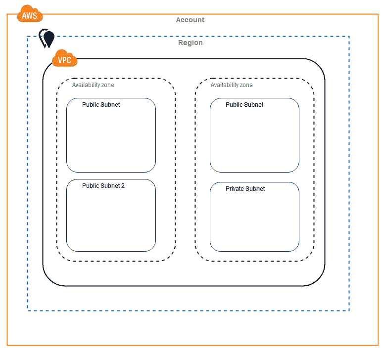
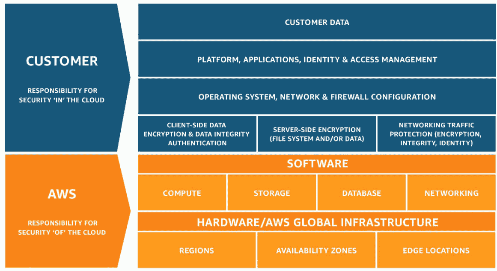

# 6

# 在 AWS 环境中做出 Terraform 项目决策

欢迎来到我们与 AWS Terraform 旅程的下一个章节。到目前为止，您已经了解了 Terraform 模块和 AWS 提供程序的重要性，以及如何为您的 Terraform 代码实施最佳实践。在本章中，我们将更深入地探讨**亚马逊网络服务**（**AWS**）的基础设施、网络和资源的基本概念。通过掌握这些基本技能，您将能够更好地做出有关 AWS Terraform 项目的明智决策。

我们还将探讨在使用模板或模块时的决策过程，以及如何使用 AWS 环境、项目和组件来构建您的项目。通过本章的学习，您将掌握做出合理 AWS Terraform 项目基础设施决策所需的知识和技能。现在，让我们开始吧！

下面是我们将要讨论的主要主题：

+   AWS 基础设施和基本概念

+   AWS 组织和网络基础知识

+   AWS 资源基础知识

+   AWS 环境、项目、工作负载

# AWS 基础设施和基本概念

在使用 Terraform 管理 AWS 上的基础设施时，理解 AWS 基础设施的基本概念至关重要。在本节中，我们将介绍 AWS 基础设施的基本概念以及它们与 Terraform 的关系。我们将探讨 AWS 基础设施的构建模块，包括 AWS 区域、可用区和 VPC，并讨论如何使用 Terraform 设计和规划您的基础设施。通过深入理解 AWS 基础设施，您将在创建和管理 Terraform 基础设施时做出更明智的决策。

## 什么是 AWS 基础设施？

AWS 是一个综合的云计算平台，提供广泛的服务，例如存储、网络、分析、机器学习等。它是一个高度可扩展且可靠的平台，满足各种规模企业的需求。AWS 的基础设施基本概念指的是支持这些服务的基本构建模块和底层技术。这些包括服务器、存储、网络和数据中心。AWS 允许企业和组织按需访问可扩展、可靠且安全的基础设施服务，而无需投资和维护自己的物理基础设施。这可以帮助降低成本并提高灵活性和敏捷性。

### 什么是基础设施即服务？

在**基础设施即服务**（**IaaS**）云计算模型中，虚拟化的计算资源通过互联网提供。像 AWS 这样的服务提供商为组织提供按需访问基础设施服务，如服务器、存储、网络和数据中心。这消除了企业投资和维护自己物理基础设施的需求，使他们能够按需访问可扩展、可靠且安全的基础设施。

### 什么是平台即服务？

在**平台即服务**（**PaaS**）的云计算模型中，像 AWS 这样的提供商为企业和组织提供完整的平台，以开发、测试、部署和管理软件应用程序。PaaS 平台包括操作系统、中间件、数据库和其他服务，解放了企业管理和维护底层基础设施的负担。这使得组织能够专注于构建和改进应用程序，同时依赖 PaaS 提供商来管理平台。

### 什么是软件即服务（SaaS）？

在**软件即服务**（**SaaS**）的云计算模型中，用户可以通过互联网访问由提供商托管和管理的软件应用，而无需自己安装或维护该应用。这使得企业和组织可以专注于使用软件而非管理它，SaaS 提供商通常通过订阅方式向用户收费。由于其可扩展性、灵活性和成本效益，这一模型日益流行。

AWS 提供了一系列 IaaS、PaaS 和 SaaS 产品和服务。以下是其中的一些：

### 一些 AWS IaaS 服务

+   **Amazon 弹性计算云** (**EC2**)：提供灵活且可扩展的云虚拟服务器

+   **Amazon 弹性容器服务** (**ECS**)：在 EC2 实例上启用 Docker 容器管理和编排

+   **Amazon 弹性容器服务 for Kubernetes**：简化了在 AWS 上部署和管理 Kubernetes 集群

+   **Amazon 弹性 Kubernetes 服务** (**EKS**)：允许企业在 AWS 上创建和操作 Kubernetes 集群

+   **Amazon LightSail**：为 Web 开发和小规模应用提供简单的**虚拟私人服务器** (**VPS**)

+   **Amazon 弹性块存储** (**EBS**)：为 EC2 实例提供持久性块存储卷

+   **Amazon 弹性文件系统** (**EFS**)：为 EC2 实例提供可扩展的共享文件存储

+   **Amazon S3**：为数据和文件提供高度可扩展且耐用的对象存储

+   **Amazon Glacier**：提供低成本的数据归档存储，用于数据保留和检索

+   **Amazon CloudFront**：通过快速且安全的**内容分发** **网络** (**CDN**) 全球交付内容

+   **Amazon Route 53**：提供可扩展且可靠的**域名系统** (**DNS**) 服务，用于管理 DNS 记录

+   **Amazon 虚拟私有云** (**VPC**)：允许企业在 AWS 云中创建自己的隔离虚拟网络

+   **AWS Direct Connect**：允许企业在其本地基础设施与 AWS 之间建立专用网络连接

### 一些 AWS PaaS 服务

+   **AWS Elastic Beanstalk**：简化了在 AWS 上部署和管理 Web 应用程序

+   **AWS Lambda**：使开发人员能够运行代码，而无需管理服务器或基础设施

+   **AWS CodePipeline**：自动化构建、测试和部署代码变更

+   **AWS CodeBuild**：提供完全托管的构建服务，用于将源代码编译成可部署的工件

+   **AWS CodeDeploy**：自动化应用程序部署到计算实例、本地服务器或 AWS Lambda

+   **AWS CodeStar**：提供统一界面，用于在 AWS 上管理整个应用开发生命周期

+   **AWS CloudFormation**：允许组织使用模板将 AWS 资源定义为代码并进行管理

+   **AWS CloudTrail**：记录 API 活动并提供日志文件以用于审计和合规目的

+   **AWS X-Ray**：便于跟踪、调试和分析在 AWS 上运行的分布式应用程序。

### 一些 AWS SaaS 服务

+   **Amazon WorkSpaces**：提供基于云的虚拟桌面，供远程和移动工作者访问

+   **Amazon Chime**：提供基于云的平台，用于通过消息、会议和视频会议进行通信与协作

+   **Amazon Connect**：为企业提供基于云的联络中心平台

+   **Amazon AppStream 2.0**：使企业能够通过互联网将桌面应用程序流式传输给用户

+   **Amazon WorkDocs**：为企业提供基于云的内容管理和协作平台

+   **Amazon WorkMail**：为企业提供基于云的电子邮件和日历服务

+   **Amazon Elasticsearch Service**：使企业能够在云中轻松部署、操作和扩展 Elasticsearch 集群

+   **Amazon Kendra**：提供基于机器学习的企业搜索服务

+   **Amazon Managed Blockchain**：使企业能够轻松创建和管理可扩展的区块链网络

+   **Amazon Quantum Ledger Database**（**QLDB**）：为需要中心化、可信的权威来维护完整和可验证的交易记录的应用提供全托管账本数据库

## AWS 的主要产品和服务类别是什么？

AWS 提供多种云计算产品和服务，这些服务按不同的资源类别进行组织。包括以下内容：

+   **Compute**：提供用于运行和管理计算资源（如虚拟机和容器）的服务。示例包括 EC2、Amazon ECS 和 AWS Lambda。

+   **Storage**：提供存储和管理数据（如文件和对象）服务。示例包括 Amazon S3、EBS 和 Amazon EFS。

+   **Database**：提供在云中运行和管理数据库的服务。示例包括 Amazon Aurora、Amazon DynamoDB 和 Amazon Redshift。

+   **Networking**：提供网络、连接和内容交付服务。示例包括 Amazon VPC、Amazon Route 53 和 Amazon CloudFront。

+   **Security and Identity**：提供用于保护和管理对 AWS 资源的访问的服务。示例包括 AWS **身份与访问管理**（**IAM**）、AWS **密钥管理服务**（**KMS**）和 Amazon GuardDuty。

+   **Analytics**：提供收集、处理和分析数据的服务。示例包括 Amazon EMR、Amazon Kinesis 和 Amazon Athena。

+   **机器学习**：提供构建和部署机器学习模型的服务。示例包括 Amazon SageMaker、Amazon Rekognition 和 Amazon Lex。

+   **管理工具**：提供管理和优化 AWS 资源的服务。示例包括 AWS CloudFormation、AWS CloudWatch 和 AWS Trusted Advisor。

这些以及 AWS 提供的其他资源类别可以帮助企业和组织访问广泛的云计算服务，以支持其运营和目标。

## 如何做出决定以开始在 AWS 上启动 Terraform 项目

在决定为 AWS 项目使用 Terraform 时，有一些关键考虑因素需要记住。包括以下内容：

+   **项目的范围和规模**：Terraform 旨在用于基础设施即代码（IaaC），可用于管理大型复杂项目的基础设施。如果你的项目涉及多个 AWS 服务和资源，Terraform 可以帮助你高效、可靠地管理它们。

+   **所需的自动化和集成程度**：Terraform 允许你使用配置文件和声明式语法来自动化 AWS 基础设施的配置和管理。这有助于减少手动错误并提高环境的一致性。Terraform 还与其他 AWS 服务和工具（如 AWS CloudFormation、AWS CodePipeline 和 AWS CodeBuild）集成。

+   **协作和团队规模的程度**：Terraform 支持通过使用版本控制系统（如 Git）进行协作的基础设施管理。这有助于团队更高效、有效地协作，并且还能让你跟踪和回滚基础设施的变更。如果你有一个大型团队在项目中工作，Terraform 可以帮助你管理和协调他们的工作。

+   **可用的支持和文档级别**：Terraform 是一个开源工具，拥有庞大且活跃的社区。这意味着有大量的文档、教程和其他资源可以帮助你高效地学习和使用 Terraform。AWS 还提供了其专门的文档和支持，包括最佳实践以及与其他 AWS 服务的集成。

## 如何开始设计你的第一个 AWS 基础设施

设计 AWS 基础设施时，涉及几个关键步骤，具体如下：

1.  确定并定义你组织基础设施的业务需求和目标。这将帮助你了解你的基础设施需要完成哪些任务，以及它如何支持你组织的业务运营。

1.  决定你需要的 AWS 账户数量和类型。这通常取决于诸如业务规模和复杂性、需要访问 AWS 的团队和用户数量，以及安全性和合规性要求等因素。

1.  根据您的基础设施需求选择适当的 AWS 服务和资源。这可能需要根据您的需求和目标，从计算、存储和网络服务中进行选择。

1.  规划和设计您的基础设施架构。这将包括创建图表和其他可视化内容，展示不同的 AWS 服务和资源如何连接和配置，以支持您的业务需求。

1.  实施和部署您的基础设施。这将包括使用工具和服务，如 AWS CloudFormation、AWS CodePipeline 和 AWS CodeBuild，来自动化 AWS 资源的配置和部署。

1.  监控和维护您的基础设施。这将包括使用工具，如 AWS CloudWatch 和 AWS Trusted Advisor，来监控基础设施的性能和健康状况，解决任何问题或潜在改进，并使用 AWS Organizations、AWS **单点登录**（**SSO**）和 AWS IAM 来管理和监控您的 AWS 账户的安全性、合规性和使用情况。

通过遵循这些步骤，您可以设计出一个经过精心规划、可扩展和可靠的 AWS 基础设施，以满足您业务的需求。

# AWS Organizations 和网络基础知识

+   **AWS Organizations** 是一项服务，允许企业和组织以集中式和可扩展的方式管理和治理其 AWS 账户。AWS Organizations 使您能够创建和管理 AWS 账户的层级结构，并在账户之间应用政策，以帮助确保符合公司标准和最佳实践。这可以帮助您更高效地管理 AWS 基础设施和资源，减少错误和安全漏洞的风险，并提高 AWS 使用的可见性和控制力。AWS Organizations 可以通过 AWS 管理控制台、AWS CLI 或 AWS Organizations API 使用。

+   **AWS 账户** 是一个用户定义的实体，提供对 AWS 提供的服务和资源的访问。AWS 账户是使用 AWS 的起点，用于识别和验证希望访问 AWS 服务和资源的用户。AWS 账户通过 AWS 管理控制台创建和管理，AWS 管理控制台是访问和管理 AWS 服务的基于 Web 的界面。AWS 账户通常与一个电子邮件地址和密码相关联，并可以通过 AWS 管理控制台或 AWS **命令行接口**（**CLI**）进行访问。AWS 账户可以单独使用，也可以作为 AWS Organizations 结构的一部分，用于集中式和可扩展地管理和治理多个 AWS 账户。

+   **AWS 区域**是全球范围内提供 AWS 服务和资源的物理位置。AWS 区域由多个可用区组成，这些可用区是独立的、容错的数据中心，提供低延迟连接到最终用户。AWS 区域旨在具有冗余性和高可用性，用于托管和运行 AWS 提供的各种服务和资源。AWS 客户可以选择最符合其性能、合规性和其他要求的 AWS 区域，并通过 AWS 管理控制台、AWS 命令行界面（**CLI**）或 AWS **应用程序编程接口**（**API**）访问并使用该区域的服务和资源。

+   AWS **可用区**是独立的、容错的数据中心，提供低延迟连接到最终用户。AWS 可用区位于 AWS 区域内，AWS 区域是全球范围内的物理位置，AWS 在这些地点提供服务和资源。每个可用区由一个或多个数据中心组成，设计上具有冗余性和高可用性。这意味着，如果某个可用区内的一个数据中心发生故障，其他数据中心将继续运行，因此用户不会遇到服务中断。AWS 客户可以使用可用区以高可用性和容错性运行其应用程序和工作负载，并可以选择最符合其性能和合规性要求的可用区。

+   **Amazon VPC** 是 AWS 提供的一项云计算服务，允许企业和组织在 AWS 云中创建和配置自己的虚拟私有网络。VPC 使您能够定义和自定义自己的网络设置，包括 IP 地址范围、子网、路由表和网络网关。这使您能够创建一个逻辑上隔离且安全的网络环境，与其他 AWS 云资源分开。VPC 可以用于托管和运行 AWS 服务和资源，例如 Amazon EC2 实例、Amazon EBS 卷和 Amazon S3 存储桶。VPC 还可以通过 AWS Direct Connect 或 VPN 连接与您的本地基础设施连接，从而实现将您的网络无缝扩展到 AWS 云中。

+   **AWS 子网**是 Amazon VPC 中一个特定的 IP 地址范围，并与一个特定的可用区相关联。子网用于在 VPC 内组织和划分网络，可以用来控制不同 AWS 资源组之间的流量。每个子网都有一个关联的路由表，指定子网内及子网与其他网络目的地之间的流量流动。子网可以是公共的或私有的，取决于它们是否具备互联网连接。公共子网通过互联网网关连接到互联网，而私有子网则不直接连接到互联网，只能通过 NAT 网关或 VPN 连接访问互联网。AWS 客户可以使用子网在其 VPC 内设计和实施可扩展且安全的网络架构。

图 6.1 – AWS 子网

# AWS 资源基础

AWS 核心原则指的是指导 AWS 设计和运营的基本价值观和信念。这些原则包括以下内容：

+   **客户至上**：AWS 专注于满足客户需求，并超越客户的期望

+   **创新**：AWS 致力于在其产品和服务中持续创新和改进

+   **全球基础设施**：AWS 运营着一个全球数据中心和区域网络，提供低延迟和高可用性的服务

+   **响应性**：AWS 旨在提供快速且响应迅捷的服务，使客户能够快速、轻松地访问和使用其服务

+   **运营卓越**：AWS 专注于为客户提供高质量、可靠和安全的服务

+   **安全性**：AWS 致力于保护客户数据和资源的安全与隐私

+   **成本效益**：AWS 旨在为客户提供一种具有成本效益和灵活性的方式来访问和使用其服务

通过遵循这些原则，AWS 可以提供广泛的云计算服务，满足客户需求，帮助他们实现目标。在启动新项目时，您应考虑这些相同的原则，以便为您的基础设施提供最佳解决方案。

## AWS 共享责任模型

AWS 共享责任模型是一个框架，定义了 AWS 及其客户在 AWS 资源的安全性和合规性方面的角色和责任。在 AWS 共享责任模型下，AWS 负责云基础设施的安全性，包括其数据中心的物理安全、网络和硬件的安全，以及其服务和功能的安全。另一方面，AWS 客户负责其自身应用程序和数据的安全性，以及 AWS 资源的配置。这意味着客户负责保护自己的数据和应用程序免受威胁和漏洞的影响，并确保其 AWS 资源正确配置并符合自身的安全和合规政策。AWS 共享责任模型帮助客户理解自己的安全和合规责任，并使他们能够设计和实施一个符合业务需求的安全合规的 AWS 环境。

图 6.2 – AWS 共享责任模型

共享责任模型适用于所有三种云计算服务模型：IaaS、PaaS 和 SaaS。在共享责任模型下，云服务提供商（如 AWS）负责基础设施及其组件的安全性，而客户则负责自身应用程序、数据和构建在基础设施之上的其他资源的安全性。

对于 IaaS，云服务提供商负责物理基础设施（如服务器、存储和网络）、虚拟化基础设施（如虚拟机和虚拟化管理程序）以及基础设施服务（如身份和访问管理、网络安全）的安全性。客户负责其在基础设施上运行的应用程序、数据和操作系统的安全性。

对于 PaaS，云服务提供商负责基础设施的安全性，以及作为 PaaS 服务一部分提供的平台组件和服务（如数据库、应用运行时环境和负载均衡器）的安全性。客户负责构建在该平台上的应用程序和数据的安全性。

对于 SaaS，云服务提供商负责基础设施、平台和 SaaS 应用本身的安全性。客户则负责其数据的安全性以及用户对 SaaS 应用程序的访问权限。

在所有情况下，共享责任模型意味着云服务提供商和客户都在确保其 AWS 资源的安全性和合规性方面扮演着重要角色。

## 如何选择 AWS 资源

在选择 AWS 资源时，有几个关键因素需要考虑，包括以下内容：

+   考虑你的项目或工作负载的业务需求和目标。这将帮助你确定所需资源的类型和数量，以及这些资源的性能和可用性要求。

+   AWS 提供了各种各样的服务和功能，每项服务都有其优缺点，你可以根据你的具体需求进行选择。进行充分的研究并比较不同的选项，以确定最适合你的需求的服务至关重要。

+   了解 AWS 提供的各种定价选项和模型是至关重要的。AWS 提供了按需定价、预留实例和竞价实例等不同的定价选项。评估这些定价选项并选择最具成本效益的方案来应对你的工作负载非常重要。

+   你所需资源的 AWS 区域和可用区的可用性。AWS 资源分布在全球多个区域和可用区。你应选择最能满足你性能、合规性及其他要求的区域和可用区。

+   可能会有 AWS 资源限制和配额适用于你希望使用的资源。AWS 对其服务和资源的使用施加了某些限制和配额，以确保 AWS 云对所有客户的性能和可用性。你应当检查适用于你所需资源的限制和配额，并做出相应的规划。

通过考虑这些以及其他因素，你可以为你的项目或工作负载选择合适的 AWS 资源，并有效地使用它们来支持你的业务目标。

# AWS 环境、项目、工作负载

为了有效管理和组织 AWS 上的基础设施，使用 Terraform 进行操作时，理解环境、项目和工作负载的概念非常重要。在本章中，我们将深入探讨这些概念的细节，并探索在 Terraform 代码中实现它们的最佳实践。

## 什么是环境？

环境是指支持软件开发和部署过程的基础设施和工具，在 DevOps 模型中尤为重要。DevOps 是一种软件开发方法，注重协作、自动化以及开发、测试和部署过程中的持续改进。DevOps 环境通常由本地和基于云的资源组合而成，可能包括版本控制系统、**持续集成和交付**（**CI/CD**）工具、测试框架和基础设施自动化工具等。DevOps 环境的设计目的是使团队能够快速且可靠地开发、测试和部署软件，并支持软件的持续迭代和改进。通过使用 DevOps 环境，团队可以提高软件开发和部署过程的速度、质量和可靠性。

## 如何在 AWS 中定义环境或项目

在 AWS 中定义环境或项目有多种方法，这取决于你的具体需求和目标。以下是一些常见的做法：

+   **使用 AWS 账户**：你可以为每个环境或项目创建独立的 AWS 账户，并使用 AWS Organizations 来管理和治理这些账户。这种方法提供了不同环境或项目之间高度的隔离和安全性，并允许你对每个账户应用不同的策略和控制。

+   **使用 VPC**：你可以为每个环境或项目创建独立的 Amazon VPC，并为每个 VPC 配置不同的设置和资源（例如子网、安全组和路由表）。这种方法可以隔离每个环境或项目的网络和安全设置，并在每个 VPC 中使用不同的 AWS 资源。

+   **使用资源名称和标签**：你可以为每个环境或项目中的每个资源使用唯一的名称和标签，并使用 AWS 资源策略和 IAM 策略根据名称和标签来控制资源的访问。此方法使你能够独立管理和访问每个环境或项目中的资源，并为每个环境或项目应用不同的访问控制。

+   **使用部署环境**：你可以使用 AWS CodePipeline 为每个环境或项目（例如开发、预发布和生产）创建和管理独立的部署环境。此方法使你能够自动化应用程序代码和资源的部署与发布，并控制代码和资源在环境之间的推进。

通过使用一种或多种方法，你可以有效地在 AWS 中定义和管理你的环境或项目。

# 总结

在本章中，我们学习了 AWS 基础设施、网络和资源的基本知识，并了解了如何决定何时使用模板或模块。我们还探讨了如何将项目组织为环境、项目和工作负载。到本章结束时，我们掌握了 AWS 基础设施决策、AWS 网络基础和 AWS 资源基础知识，并学习了如何以及何时开发模块和模板。

在下一章中，我们将深入探讨如何在项目中实现 Terraform，届时我们将探讨如何构建 Terraform 代码、管理状态以及使用远程后端。敬请期待！
