# 第二章：管理 AWS 账户

在本章中，我们将介绍以下主题：

+   设置主账户

+   创建会员账户

+   邀请账户

+   管理你的账户

+   添加服务控制策略

# 介绍

我们与许多公司合作，这些公司管理着大量不断增长的 AWS 账户。保持对所有这些账户的控制通常是非常困难的——即使对于经验丰富的 AWS 用户来说也是如此。

随着 AWS Organizations 的发布，你现在可以集中管理 AWS 账户，将它们安排成逻辑分组和层级结构，并对它们进行以前在 AWS 平台上无法实现的控制。

# 设置主账户

所有使用 AWS Organizations 进行计费和控制的账户都必须拥有一个*主账户*。该账户控制组织的成员资格，并支付所有成员的账单（总得有人做这个事情）。

# 如何操作...

要设置主账户，请执行以下步骤：

1.  转到你希望成为主账户的账户的我的组织部分。你必须使用根凭证登录（即你用来创建账户的凭证）：


1.  在 AWS 控制台的 AWS Organizations 部分，点击创建组织，如下图所示：

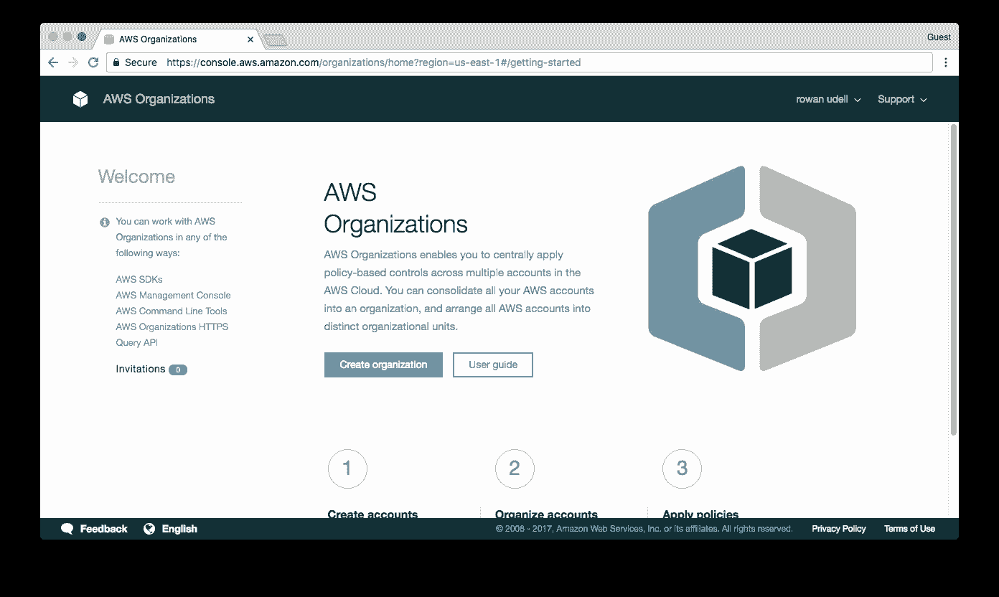

1.  除非有特定需求，否则选择启用所有功能，以便充分利用 AWS Organizations，如下图所示：

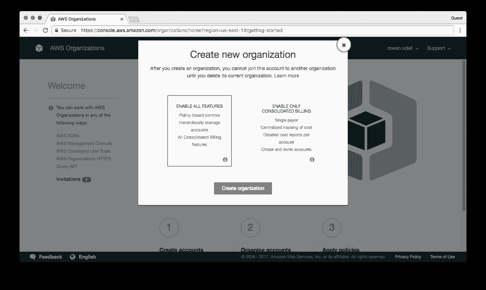

1.  现在你的账户已经转换，你可以返回 AWS Organizations 页面查看所有账户的列表：

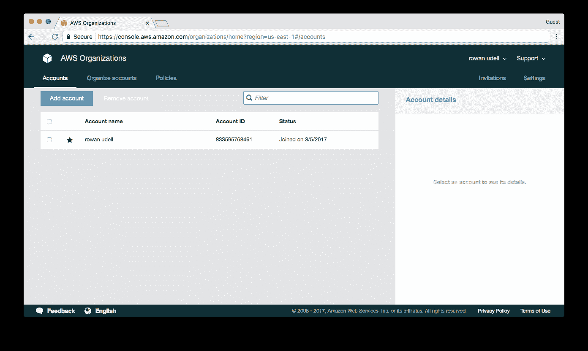

# 工作原理...

虽然这是一个非常简单的流程，但它是你在使用 AWS Organizations 的任何有用功能之前必须做的第一件事。

在这里你可以看到主账户、成员和**组织单位**（**OUs**）之间关系的高层次图示：

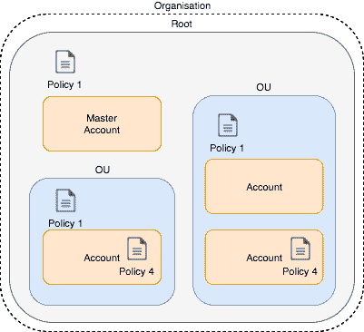

我们故意启用所有组织功能。合并计费选项用于向后兼容——在组织功能之前，合并计费是唯一可以链接账户的选项。

*不要将主账户用于日常任务*。由于主账户非常重要，因此不建议冒险使用它或为其设置访问密钥。如果主账户被不正当地访问，将会影响所有成员账户。最好避免这样做。

主账户的名称旁边将始终有一个星标。

# 还有更多内容…

所有组织功能都通过 API 提供。这意味着你可以使用 AWS SDK 或 CLI 工具执行你在 Web 控制台中执行的相同操作。

# 多因素认证

如在合并账单确认邮件中所提到，建议在控制台上配置**多因素认证**（**MFA**）。为此，请以根用户身份登录（即你首次创建账户时使用的凭证），进入**身份与访问管理**（**IAM**）控制台，并按照激活根账户 MFA 的提示操作。

# 使用 CLI

你可以轻松使用 CLI 工具创建你的主账户。以下命令将使你的账户成为主账户，并启用所有组织功能：

```
aws organizations create-organization

```

# 另见

+   *邀请账户*的操作步骤

+   *创建成员账户*的操作步骤

# 创建成员账户

一旦你的组织启动并运行，最常见的用途就是自动化账户创建过程。组织内创建的账户被称为**成员账户**。

所有由成员账户产生的费用将由主账户进行计费。

# 准备工作

显然，你需要一个组织来执行这个操作步骤。请参阅本章中的其他操作步骤来开始使用。

# 操作步骤...

1.  运行 CLI 工具命令以创建一个新账户，并填写适当的值：

```
 aws organizations create-account \
 --email <member-account-owners@email.com> \
 --account-name <member-account-name> \ 
 --query 'CreateAccountStatus.Id'

```

1.  此命令将返回一个`create account status`请求 ID，你可以用它来检查状态：

```
 aws organizations describe-create-account-status \ 
 --create-account-request-id <your-create-account-status-id>

```

# 工作原理...

在你的组织中创建成员账户的命令非常简单。

使用的电子邮件地址不能与其他 AWS 账户关联。

账户创建过程需要一些时间，因此是*异步*进行的。这意味着你不会立即收到`create-account`命令的状态。相反，本操作步骤中的命令将返回一个请求 ID。

该 ID 会被传递到另一个账户中，用于检查创建的状态。当状态为`CREATED`时，你就可以开始使用新账户了。

# 还有更多...

虽然这个功能确实很有用，但 AWS 组织服务相对较新。这意味着你需要了解一些*功能*。

# 访问成员账户

一旦你创建了成员账户，就可以开始使用它了！

新账户中将存在一个 IAM 角色，默认名称为`OrganizationAccountAccessRole`。这是为了让你能够（从主账户）承担该角色并管理成员账户。虽然这个名称已经足够好，但你也可以在创建账户时传递`--role-name`参数来配置该名称。

为了承担该角色，你需要知道它的**Amazon 资源名称**（**ARN**）。计算 ARN 是一个多步骤过程：

1.  在主账户中运行以下命令以列出你的成员账户：

```
 aws organizations list-accounts

```

1.  找到你创建的账户（根据其名称），并记录下记录中的 ID 值。使用该 ID，按照以下模式生成角色的 ARN：

```
 arn:aws:iam::<your-member-account-
        id>:role/OrganizationAccountAccessRole

```

1.  如果你更改了创建的角色名称，请相应更新 ARN 的最后部分。

请参见第八章中的配方，*安全性与身份*，了解如何最佳地管理多个账户。

# 服务控制策略

**服务控制策略**（**SCPs**）是 AWS Organizations 的另一个主要功能。你可以在多个级别/资源上应用它们，包括账户（成员账户和被邀请账户）。查看本章中的其他配方，获取更多细节。

# 根凭证

一些活动仍然需要账户的根凭证。一个示例活动是关闭（或删除）账户（更多细节请参见下一节）。

为了做到这一点，你需要进行与账户关联的电子邮件的密码恢复过程，尤其是在发送 `create-account` 请求时。

# 删除账户

在撰写本文时，*无法通过 API 删除在你的组织中创建的账户*。我们只能推测，能够通过编程删除组织中创建的成员账户将是一个*高度需求*的功能，并将在不久的将来得到解决。你仍然可以进入成员账户并使用根凭证关闭它，但这些凭证默认并不存在。

虽然你可以通过 API 删除你的*组织*，但如果你在组织中创建了任何成员账户，就无法进行删除（因为你不能删除它们，所以你的组织永远不会为空）。这一点在不久的将来会有所改进，但现在仍然值得注意。

# 另见

+   *设置主账户* 配方

+   *添加服务控制策略* 配方

+   第八章中的*跨账户用户角色* 配方，*安全性与身份*

# 邀请账户

虽然创建新账户进入你的组织是有意义的，但你现在该如何处理所有其他账户呢？

你可以邀请现有账户加入你的组织，这意味着你可以从管理角度将它们视为成员账户。这极大简化了账户的管理工作量，因为*旧*账户和*新*账户没有单独的处理流程。

由于这通常仅针对每个现有账户执行一次，我们将使用控制台。

所有 AWS 组织功能都可以通过 SDK 和 AWS CLI 工具访问。如果你需要自动化此过程，完全可以实现。

# 准备工作

你必须为其中一个账户（主账户）启用了 AWS Organizations，并且有另一个尚未成为组织一部分的账户（你将邀请它）。

# 如何操作...

1.  从主账户的 AWS 控制台中，点击你的用户名，并从下拉菜单中选择“我的组织”：

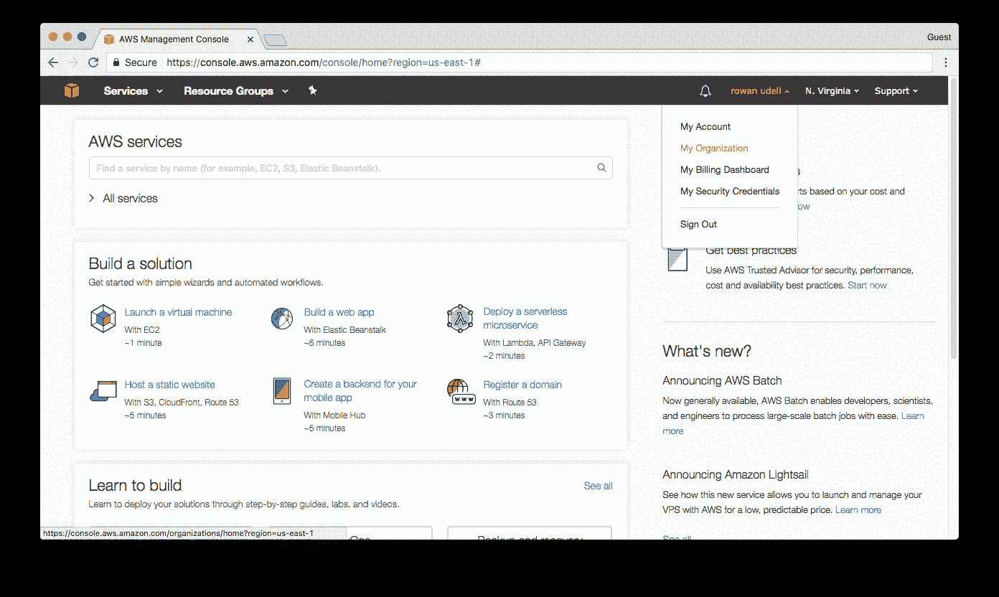

1.  你将被带到 AWS Organizations 控制台，在那里你会看到当前账户：

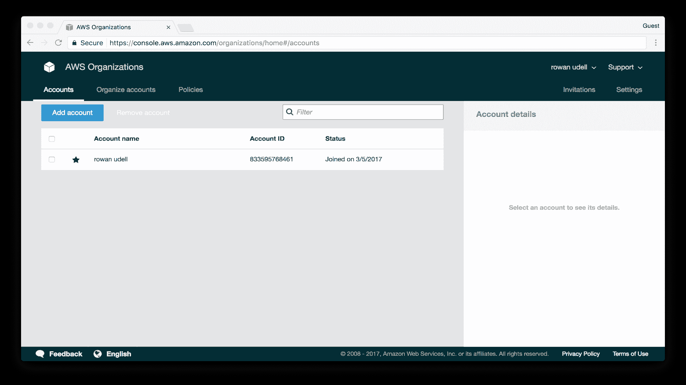

1.  点击控制台右上角的“邀请”标签：

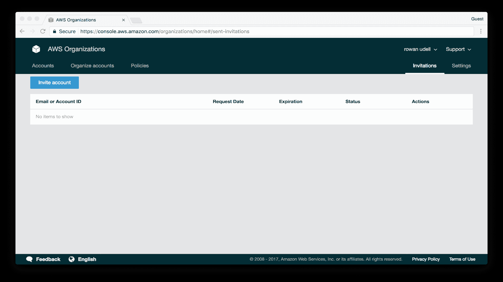

1.  点击“邀请账户”按钮，指定要邀请的账户 ID（或主电子邮件地址）：

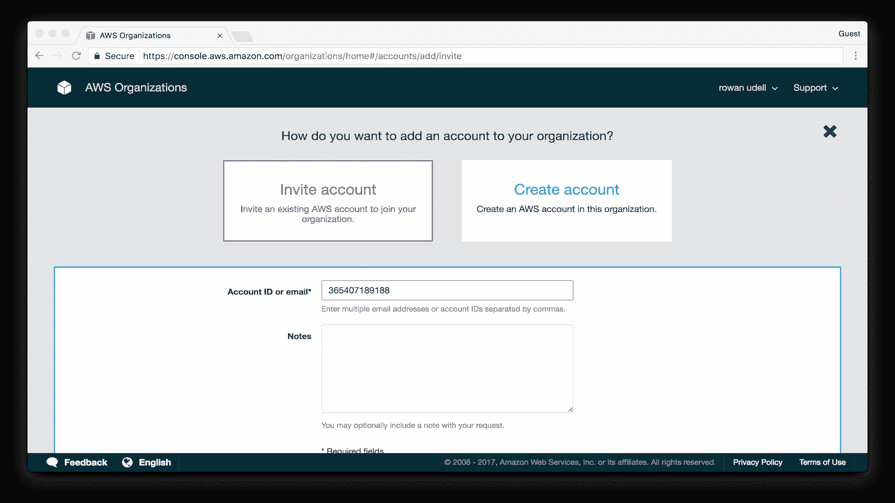

1.  一旦点击“邀请”，你将被带到一个邀请列表页面，在那里可以查看状态：

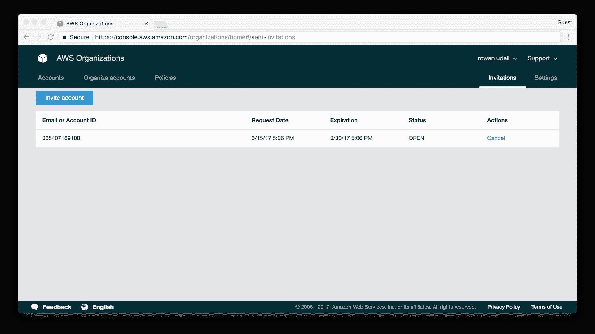

1.  在这个阶段，目标/受邀账户将收到一封通知他们邀请的电子邮件：

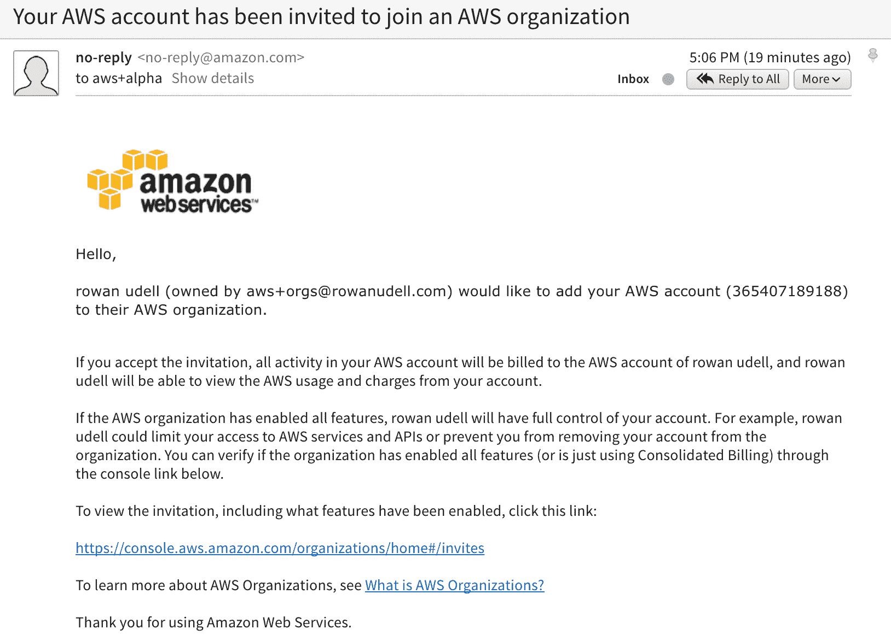

1.  登录受邀账户，并在用户菜单下点击“我的组织”链接：

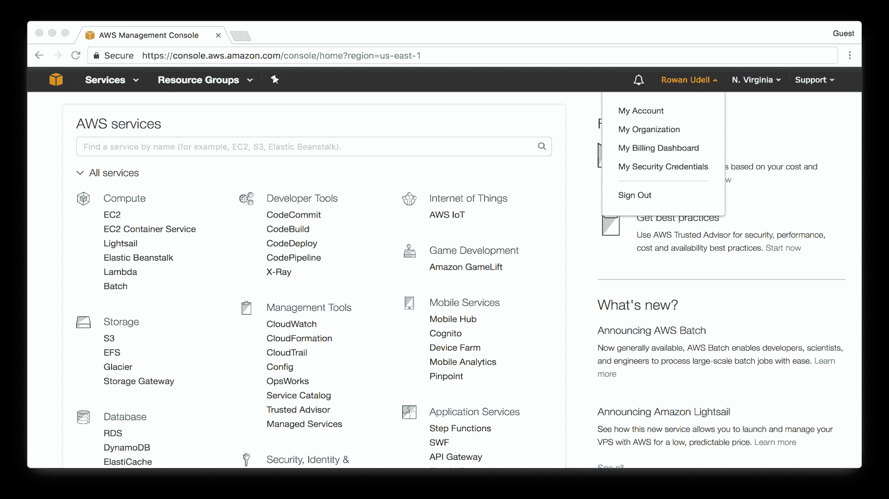

1.  在 AWS Organizations 控制台中，你可以在左侧看到待处理的邀请：

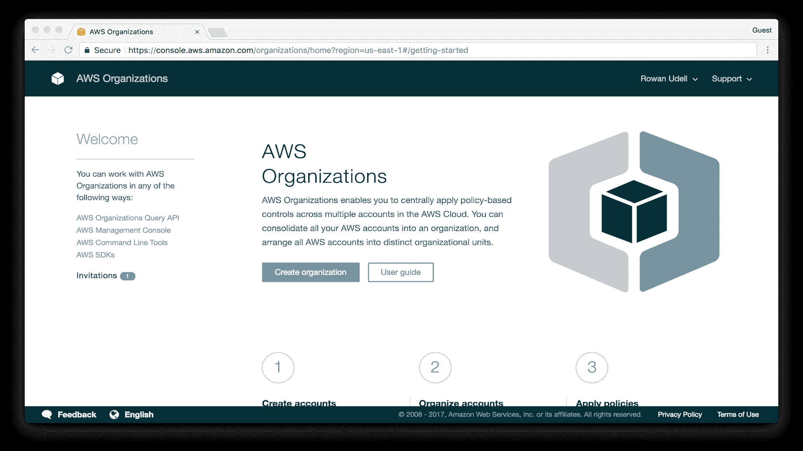

1.  点击邀请，你可以查看其详细信息：

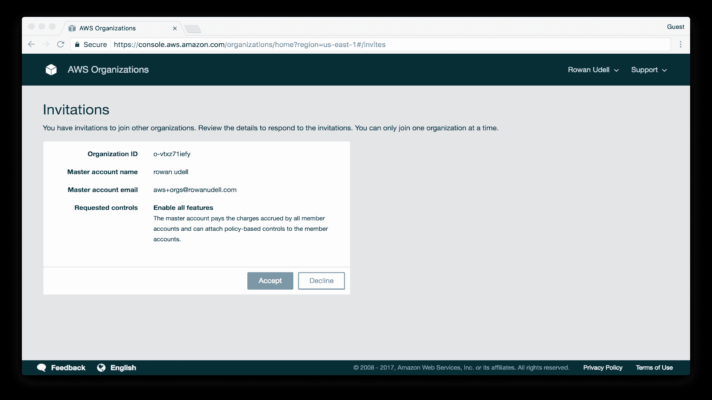

1.  当邀请包含所有功能时，你将被要求确认接受：

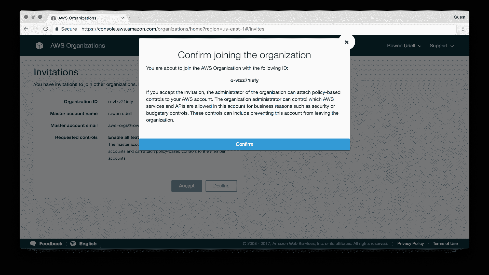

1.  确认后，你现在可以看到你已加入的组织的详细信息：

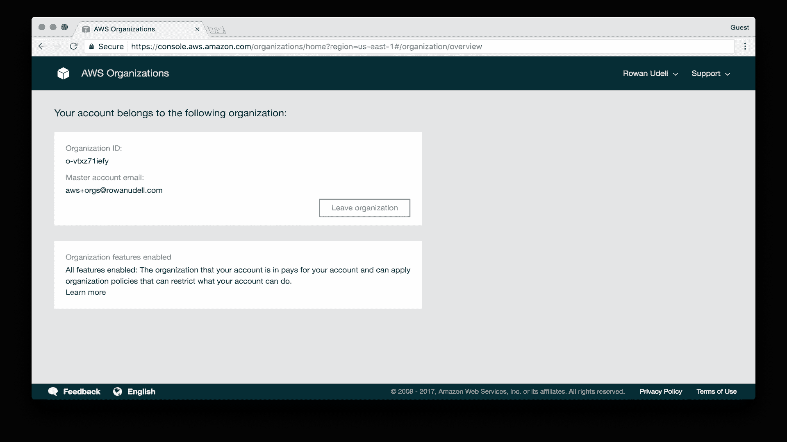

1.  在这个阶段，主账户会收到已接受邀请的通知：

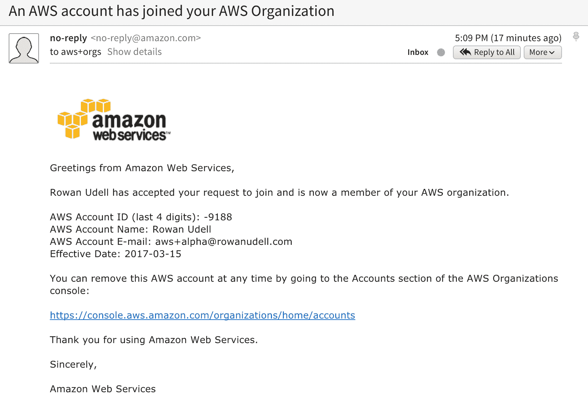

1.  返回主账户，现在你可以看到新账户与主账户一起显示：

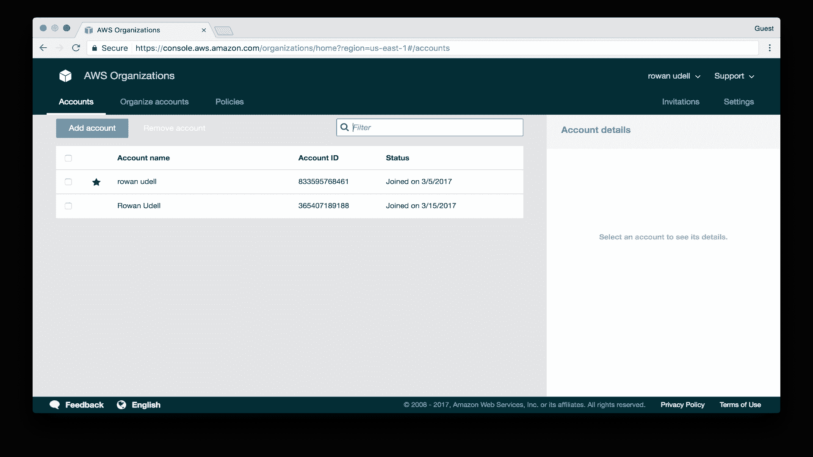

# 它是如何工作的...

虽然有许多步骤，但邀请现有账户的过程是一个相对简单的*握手*过程。这意味着双方必须主动发起/接受邀请，才能成功——邀请无法被强制进行。

在指定目标账户的账户 ID（或电子邮件地址）后，关联的电子邮件地址将收到通知。

作为握手过程的一部分，受邀账户必须明确接受邀请。

需要注意的是，默认的邀请类型（以及我们在此过程中使用的）是使用 AWS Organizations 的完整功能集。如控制台中所述，这意味着如果相关策略已配置，受邀账户*可能会被阻止离开组织*。

确认后，双方将收到一封详细说明会员资格的电子邮件。从此时起，受邀账户的账单将由主账户支付。

# 还有更多...

受邀账户与通过组织功能创建的账户有所不同。

# 移除账户

与*成员账户*（通过 AWS Organizations API 创建的账户）不同，受邀账户可以从组织中移除。

# 合并账单

作为*全功能*邀请的替代方案，可以仅为组织指定*合并账单*模式。在这种模式下，不会有 OU 或策略，仅会在账户之间共享账单关系（即主账户将支付成员账户的账单）。

任何预先配置为使用合并账单的账户将*自动*迁移到 AWS Organizations *合并账单模式*中。

# 参见

+   *创建成员账户*过程

# 管理你的账户

有多种方法可以对 AWS 帐户进行分组和排列。如何做完全取决于您，但以下是一些考虑的示例：

+   **业务单元（BU）或位置**：您可能希望允许每个 BU 在其自己的产品或服务上独立工作，按照自己的时间表进行工作，而不会影响业务的其他部分。

+   **成本中心**：根据成本分组可能有助于您跟踪支出与分配预算的情况。

+   **环境类型**：将开发、测试和生产环境合理地分组，有助于您跨每个环境管理控制。

+   **工作负载类型或数据分类**：您的公司可能希望将工作负载类型相互隔离，或者确保所有包含特定数据类型的帐户应用特定的控制。

在下面的虚构示例中，我们通过将其放入名为**突然谷**的 OU 中，将**Sitwell Enterprises 帐户**与组织的其他部分隔离开来。也许他们在不同的地理位置运营，并且对控制和访问有不同的法规要求。

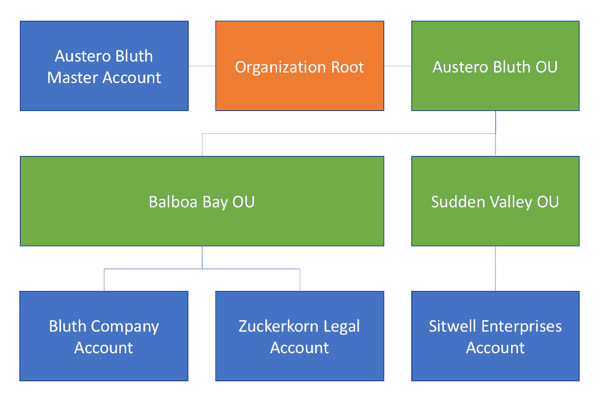

组织层次结构

请注意，虽然我们也可以将主帐户放入 OU 中，但我们避免这样做是为了明确以下事实：

+   它是主帐户，并且对整个组织拥有控制权。

+   我们设置的规则，使用 SCP 来控制组织中的成员帐户，不适用于主帐户（因为它们不能）。

在本章节的*添加服务控制策略*食谱中了解更多关于 SCP 的信息。

# 准备就绪

在继续之前，您应该已经完成了以下工作：

+   设置主 AWS 帐户

+   创建了一个组织

+   在您的组织中创建成员帐户，或者通过邀请手动添加成员帐户

# 如何操作...

现在我们将介绍执行管理 OU 所需的常见任务的单行命令。这些命令只能在您的主帐户中执行。

# 获取组织的根 ID

您可以运行此命令来获取组织的根 ID。当您在主帐户中创建组织时，根会自动为您创建。返回给您的 ID 看起来会像这样：`r-bmdw`。

```
aws organizations list-roots

```

# 创建一个 OU

要创建 OU，请执行以下步骤：

1.  确定您希望此 OU 存在的位置。如果它直接位于根目录下，那么根 ID 将作为父级。或者，如果此 OU 将作为另一个 OU 的子级，使用该 OU 的 ID。显然，如果这是您创建的第一个 OU，则根将作为父级。

1.  使用 CLI 像这样创建您的 OU：

```
aws organizations create-organizational-unit \
 --parent-id <root-id or parent-ou-id> \ --name <desired-ou-name>

```

# 获取 OU 的 ID

如果您需要获取 OU 的 ID，可以使用 CLI 进行操作；请注意，您需要知道 OU 的父级。以下是如何在根或 OU 中获取所有 OU 及其 ID 列表的方法：

```
aws organizations list-organizational-units-for-parent \
  --parent-id <root-id or parent-ou-id>

```

# 将帐户添加到 OU 中

要将账户添加到 OU，执行以下步骤：

1.  当账户首次添加到你的组织时，它将是组织根目录的子账户。要将其添加到你刚刚创建的 OU，你需要使用以下 CLI 命令将其移动：

```
aws organizations move-account \
 --account-id <twelve-digit-account-id> \
 --source-parent-id <root-id> \
 --destination-parent-id <new-parent-ou-id>

```

1.  如果你希望将账户从一个 OU 移动到另一个 OU，只需使用相同的命令，但使用现有父 OU 的 ID，而不是根目录的 ID。

# 从 OU 中移除账户

要从 OU 中移除账户，执行以下步骤：

1.  如果你希望将一个账户从 OU 中移除，你有两个选择。你可以将它移动到另一个 OU，或者将它移回根目录。如果你决定删除一个 OU，你需要首先确保它里面没有账户（我们接下来会展示如何操作）。

1.  运行以下命令将账户移回根目录：

```
 aws organizations move-account \
 --account-id <twelve-digit-account-id> \
 --source-parent-id <existing-parent-ou-id> \
 --destination-parent-id <root-id>

```

# 删除 OU

要删除一个 OU，你首先需要确保它是空的，通过移除它的子账户（如前所述）。然后你可以像下面这样删除 OU：

```
aws organizations delete-organizational-unit \
  --organizational-unit-id <ou-id>

```

# 它是如何工作的...

如果操作得当，使用 OU 将你的账户分组在一起，将帮助你简化管理和操作它们的方式。尽量只使用*刚好够用*的 OU 来完成任务。我们的目标是使用 OU 让你的工作更轻松，而不是更困难。

# 还有更多...

+   **组织控制策略**（**OCPs**）可以附加到你的根目录、OU 或 AWS 账户上。目前，只支持一种 OCP 类型：SCP。

+   账户只能属于一个组织单位（OU）或根目录。

+   同样地，OU 只能属于一个 OU 或根目录。

+   最好避免在主账户中部署资源，因为该账户无法通过 SCP 进行控制。主账户应仅作为审计、控制和计费的管理账户使用。

# 另见

+   *添加服务控制策略*操作步骤

# 添加服务控制策略

在开始之前，我们应该先讲一下 SCP 是什么，它是如何应用到你的组织中的。

SCP 由一个策略文档组成，通过过滤定义了哪些服务和操作可以在 OU 或 AWS 账户内使用和执行。如果你之前配置过 IAM 策略，那么你已经有了足够的背景知识来开始使用 SCP。除了少数几个小例外，它们看起来完全一样。

SCP 可以在组织的不同级别应用。以下是这些级别，从下到上：

+   **AWS 账户级别**：应用于 AWS 账户的 SCP 只会对该账户生效。需要注意的是，SCP 与账户内的 IAM 策略是完全独立的。例如，SCP 可能允许 AWS 账户完全访问 S3，但账户内的 IAM 策略可能会拒绝访问（针对某些角色和/或用户）。

+   **OU 级别**：在 OU 级别应用的 SCP 将适用于该 OU 中的所有 AWS 账户以及任何子 OU（记住，OU 可以是另一个 OU 的成员）。

+   **根级别**：如果在此级别应用 SCP，它将应用于组织内所有 AWS 账户。

当你在多个层次上应用 SCP 时，事情可能会变得非常有趣。在根、OU、账户和 IAM 层次上的策略*交集*将被评估，并决定是否允许 API 调用。例如，即使某人属于具有账户完全管理员访问权限的 IAM 角色，如果任何上层 SCP（账户、OU、根）拒绝 EC2 访问，他们仍然无法调用任何 EC2 API。

在下面的示例中，我们有一个顶级组织单元（OU），Austero Bluth，附加了一个 SCP，该 SCP 允许对其下所有 OU 和账户的所有 AWS 资源访问：

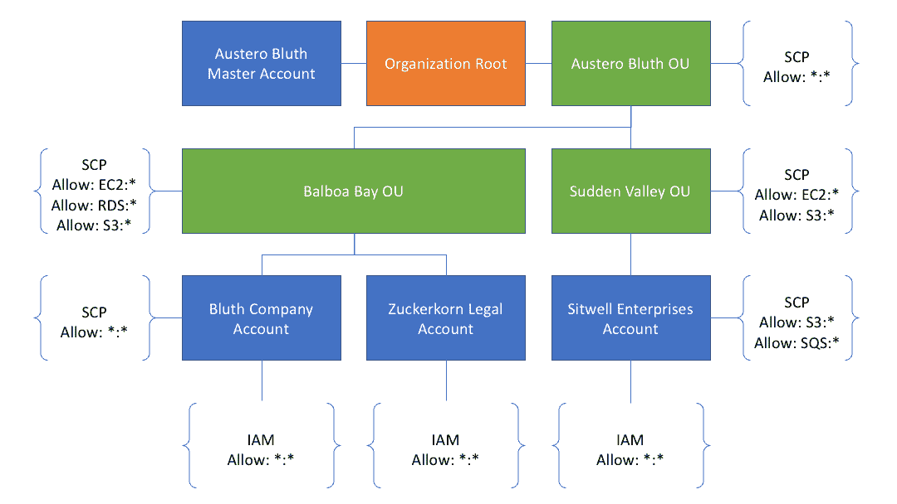

组织层级和策略

Austero Bluth 有两个子 OU；让我们专注于 Sudden Valley。它有一个 SCP，只允许 EC2 和 S3。通过使用白名单方法，除了这两个服务，其他任何服务都会被拒绝访问。记住，SCP 像一个过滤器，任何位于 Sudden Valley OU 下的 OU 或 AWS 账户，最多只能访问 EC2 和 S3。

**Sitwell Enterprises 账户**也附加了一个 SCP。这个特定的 SCP 允许 S3 和 SQS。请注意，由于 Sitwell 账户位于一个不允许 SQS 的 OU 中，SQS 声明在这里不会生效。还要注意，尽管**Sudden Valley OU**允许 EC2，但该账户无法访问 EC2，这是因为附加在账户上的 SCP 中没有明确允许 EC2。

在 IAM 级别，我们在 Sitwell AWS 账户中有一个角色，允许完全的管理员权限。但由于管理此账户的 SCP 交集只允许 S3，因此任何使用该角色的人，如果尝试使用 EC2 或 SQS 等服务，将被拒绝访问。

让我们再看一下**Bluth Company 账户**。附加在该账户上的 SCP 允许完全的 AWS 访问；然而，它位于一个仅允许 EC2、RDS 和 S3 的 OU（Balboa Bay）中。该账户内有一个 IAM 角色，也允许完全的管理员访问，但同样，该账户中的管理员将被限制在 EC2、RDS 和 S3 之内。

# 准备工作

我们将一步步创建一个 SCP 并将其添加到 OU 中。

你需要该 OU 的 ID；你可以从组织的网页控制台获取，或者使用 CLI。它看起来像这样：`ou-bmdw-omzypry7`。

我们还将准备一个策略文档。在这个例子中，我们将向 Sudden Valley OU 添加一个 SCP，允许访问 EC2 和 S3。以下是我们的 SCP 的样子：

```
{ 
    "Version":"2012-10-17", 
    "Statement":[ 
        { 
            "Effect":"Allow", 
            "Action":["EC2:*","S3:*"], 
            "Resource":"*" 
        } 
    ] 
}

```

# 如何操作...

1.  在文本编辑器中打开一个新文件，添加你的 JSON 策略文档，并保存。

1.  像这样运行`create-policy` CLI 命令。我们在这里使用`tr`命令稍微有些技巧：我们用它来移除策略文档中的回车符，因此请特别注意示例中的语法。不幸的是，组织 CLI 不允许我们直接提供策略文档的路径：

```
 aws organizations create-policy \
 --content "$(tr -d '\n' < my-policy-file.json)" \ 
 --description "A policy description goes here" \
 --name "My policy" \
 --type SERVICE_CONTROL_POLICY

```

1.  如果前面的 CLI 命令成功执行，将返回一些 JSON，包含我们刚刚添加的策略 ID。它看起来像这样：`p-o9to04s7`。

1.  现在你可以继续将此策略附加到 OU。使用以下 CLI 命令来执行此操作：

```
 aws organizations attach-policy \
 --target-id <ou-or-aws-account-id> \
 --policy-id <policy-id>

```

1.  不幸的是，前面的命令如果成功执行，则不会输出任何内容。你可以通过 AWS Web 控制台重新检查你的操作，或者使用以下 CLI 命令来验证它是否成功：

```
 aws organizations list-targets-for-policy \
 --policy-id <policy-id>

```

# 它是如何工作的……

再次强调，你添加的策略将在组织结构的每一层充当过滤器。考虑到这一点，可能是时候指出，在将策略应用于整个组织之前，先在单一账户上测试策略将为你节省许多麻烦。对组织顶层的 SCP 进行大范围更改可能会在链条底部的 AWS 账户层面产生意想不到的情况。AWS 账户中的本地管理员无法覆盖 SCP。

# 还有更多……

+   在发布时，你只能在一个组织中拥有一个根（当你创建组织时，它会自动为你创建）。

+   出于显而易见的原因，主账户不会受到附加到它的任何 SCP 的影响。你还可能注意到，技术上是可以将主账户放置到 OU 中的；同样，它也不会受到附加到该 OU 的任何 SCP 的影响。

+   由于主账户不受 SCP 的影响，最好尽可能保持它为空，并且不要在其中创建任何资源。使用子 AWS 账户，这样你可以对其应用细粒度控制。

+   每个组织单元（OU）和账户都需要使用 SCP，但不应将其视为 AWS 账户的唯一访问控制方式。根据需要应用 IAM。

+   创建策略时，我们必须指定`--type`参数。在发布时，AWS 仅支持一种 OCP 变体：`SERVICE_CONTROL_POLICY`。

+   尽可能遵循最小权限原则。你应该只给予 AWS 账户访问它们所需的服务。这有助于减少误操作、编程错误或账户被攻破所带来的损害。

+   从长远来看，你可能会发现不在根级别分配控制更有利。相反，可能更好将*所有*账户添加到一个 OU，并将控制应用于该 OU。

+   你的策略可以采用白名单或黑名单方法。在这个示例中，我们使用了白名单方法，但你也可以选择允许你的组织单元（OU）和账户使用所有服务，除了那些你明确禁止的服务。你应该选择其中一种方法并坚持使用，因为混合这两种方法会在未来造成很多困惑。

+   与 IAM 策略不同，你不能在 SCP 文档中指定条件，并且`Resource`*必须*是`*`。

# 另请参见

+   第八章中的*与 AWS 账户联邦*示例，*安全与身份*章节，涉及一些关于 IAM 角色的讨论。
