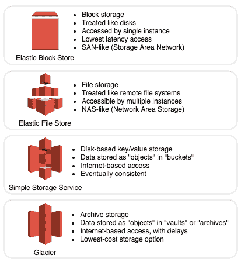
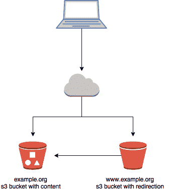
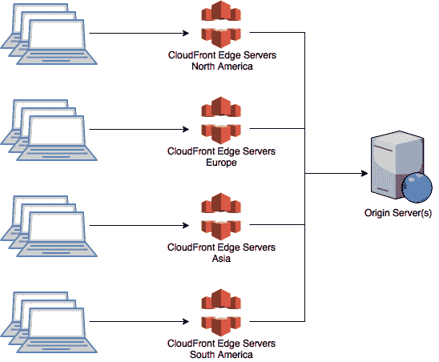
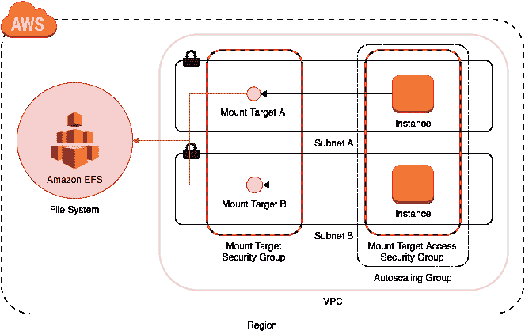

# 存储与内容交付

在本章中，我们将涵盖以下方案：

+   托管静态网站

+   缓存网站

+   使用网络存储

+   用于合规的备份数据

# 介绍

每个这些方案都由 CloudFormation 模板支持，使其可以快速、轻松地复现和修改。

# 存储

存储是任何组织云计算使用的关键部分。正确使用时，服务器是短生命周期且可替换的。这意味着拥有一个耐用、可用的存储服务对于持久化和共享状态至关重要。

下面是 AWS 提供的存储服务的高级概述：



AWS 的存储服务

# 弹性块存储

**弹性块存储**（**EBS**）为 EC2 实例提供块设备存储。它的行为类似于**存储区域网络**（**SAN**），并且提供了各种存储服务中最低延迟的访问。EBS 卷一次只能被一个实例访问。卷的大小必须在创建时指定，并且之后不能更改。

卷托管在特定可用区的冗余硬件上，但它们不提供跨可用区的冗余。

EBS 的一些推荐使用场景：

+   实例启动卷

+   强大的数据处理

+   事务性写入

我们将在第四章中更详细地讨论 EBS，*使用 AWS 计算*，因为它的主要用途是作为 EC2 实例的底层存储。

# 弹性文件系统

**弹性文件系统**（**EFS**）提供一种文件存储服务，多个实例可以同时访问，类似于**网络附加存储**（**NAS**）。虽然它的速度不如 EBS 快，但仍提供低延迟访问。由于可以被多个客户端同时访问，因此它的吞吐量可以远高于 EBS。EFS 文件系统的大小会动态扩展，因此不需要预分配或在使用过程中进行修改。文件系统会在可用区（AZ）之间冗余存储。

EFS 的一些推荐使用场景：

+   主页目录

+   提供共享网站内容

+   内容管理

EFS 的性能会根据文件系统的大小进行扩展。由于文件系统的大小不是预分配的，唯一增加性能的方法是向其中添加更多数据。

# 简单存储服务

**简单存储服务**（**S3**）提供一个基于 Web 的文件托管服务。文件被称为**对象**，并分组在**存储桶**中。对象实际上是一个键值对，类似于文档数据库。键像文件路径一样使用，`/`用作分隔符和分组字符。存储桶可以像网站一样通过自动生成的域名轻松访问。

由于与域名相关联，存储桶名称必须是*全局*唯一的。

S3 的一些推荐使用场景：

+   静态网站资产

+   共享大文件

+   短期（也称为*温暖*）备份

# Glacier

**Glacier** 是 S3 的配套服务，但它是 **冷** 存储选项。冷存储是一种你无法直接访问数据的服务；你必须提出数据恢复请求（恢复到 S3），并在数据准备好时收到通知。冷存储的物理例子可能是存放在安全位置的备份磁带。与 S3 类似，文件被称为 *对象*。文件被分组存储在 **归档** 中。归档可以创建和删除，但不能修改。归档被分组存储到 **金库** 中，金库让你能够控制访问。

最短的恢复时间是 1-5 分钟（有一些限制）。标准恢复时间需要 3-5 小时，还有其他选项可用。

Glacier 的一些推荐用例包括：

+   长期（即 *冷*）备份

+   合规性备份

# 内容交付

内容交付的目标是快速、高效地将内容分发给用户。最佳实践是利用 **内容分发网络**（**CDN**）。亚马逊的 CDN 服务是 **Amazon CloudFront**。

虽然 AWS 目前有 14 个区域，但它还有 68 个额外的边缘位置，可以作为 CloudFront 的一部分使用。这为你提供了一个庞大的全球网络资源，你可以利用这些资源提升用户对你应用的体验。

CloudFront 与 S3 紧密合作，提供静态资源。除此之外，它还可以配置缓存动态内容。这为你提供了一种简单的方式来提升不直接与 CloudFront 配合使用的应用的性能。

CloudFront 网站被称为 **分发**，这突出了它们作为 CDN 的角色。

分发也可以用于为多个不同的内容来源提供共同的前端。

# 托管静态网站

在 AWS 上托管静态网站非常简单。事实证明，它不仅成本低廉、快速、可靠，而且具备大规模扩展能力。

你可以通过将内容存储在 S3 桶中，并配置该桶使其像网站一样运行来实现这一点。

需要注意的是，我们这里只讨论静态内容。此方法不适用于需要服务器端处理或其他后端功能的网站。例如，WordPress 需要 PHP，这意味着你需要一个完全功能的 web 服务器来运行它。S3 无法为你解析 PHP 页面，它只会直接将文件提供给浏览器。

那么，为什么你会想要在 S3 中托管静态网站呢？我们常见的场景有：

+   简单来说，你的网站完全是静态的，而且你不经常更改它。

+   你的公司正在推出一款新产品或服务。你预计在短时间内会有大量客户访问一个迷你网站；流量可能远超你现有的 web 托管环境所能承受的。

+   你需要为故障转移或 *维护中* 页面提供一个托管位置，这个页面应该与现有的 web 托管环境分开。

当 S3 用于提供静态内容时，不支持 HTTPS。



# 如何操作……

这个配方为你提供了创建所需 CloudFormation 配置：

+   一个用于托管内容的 S3 存储桶

+   一个 Route 53 托管区和必要的 DNS 记录

+   从`www`到`root/apex`的重定向，适用于你的域名

在运行完 CloudFormation 后，你当然需要将内容上传到 CloudFormation 为你创建的存储桶中。

# 创建 S3 存储桶并托管内容

在这个例子中，我们将为我们的网站[`www.example.org/`](http://www.example.org/)创建两个 S3 存储桶。它们分别对应以下主机名：

+   `www.example.org`

+   `example.org`

也许现在是时候提醒你，S3 存储桶名称是全局唯一的。你还需要用你拥有的域名替换`example.org`。

1.  我们将把所有内容放在`example.org`存储桶中，并告诉 S3 请求`www.example.org`时应重定向到另一个存储桶。以下是 CloudFormation 的相关部分，展示如何创建这些存储桶（请注意，随着我们继续本配方，我们将扩展这个例子）：

```
      Resources: 
        ApexBucket: 
          Type: AWS::S3::Bucket 
          Properties: 
            BucketName: !Ref DomainName 
        WWWBucket: 
          Type: AWS::S3::Bucket 
          Properties: 
            BucketName: !Sub 
              - www.${Domain} 
              - Domain: !Ref DomainName

```

1.  我们不会将域名硬编码到存储桶名称中。相反，我们将作为参数将域名传递给 CloudFormation 模板，以最大化其可重用性，然后通过`!Ref DomainName`引用它。为了简化这个配方，我们将设置一个单页网站。在现实中，你的网站当然会由多个文件组成，但你需要遵循的过程完全相同。

1.  配置索引文档：

    +   **索引**文档是 S3 在用户在浏览器的地址栏中输入域名时默认提供的文件。这避免了用户需要输入文件的完整路径，即`example.org/index.html`。

    +   通常，你的索引文档会被命名为`index.html`。我们将在本章最后提供该文件的代码片段。

1.  配置错误文档：

    +   **错误**文档是 S3 在出现问题时（如文件丢失、访问禁止、请求错误等）提供的文件。为了保持一致性，我们将其命名为`error.html`。同样，我们将在本章稍后提供该文件的代码片段。

1.  在存储桶上启用网站托管：

    +   如前所述，我们需要告诉 S3 它应该从我们的`example.org`存储桶提供静态网站内容。通常用户会通过 S3 Web 控制台进行此配置，但我们将使用 CloudFormation 来完成此操作。CLI 也提供了一个简便的命令行来完成这个操作。你无需运行这个命令，我们在这里仅作为参考添加它：

```
 aws s3 website s3://example.org/ 
                  --index-document index.html --error-document error.html

```

1.  设置从`www`主机名的重定向：

    +   在手动执行此任务时，你几乎没有选择，只能打开 Web 控制台并将 `www.example.org` 存储桶配置为重定向到 `example.org` 存储桶。没有简便的一行 CLI 命令可以做到这一点。幸运的是，在 CloudFormation 中，这很容易，正如你将在接下来的 CloudFormation 代码片段中看到的那样。

1.  配置权限：

    +   最后一个存储桶设置任务是配置权限。默认情况下，S3 存储桶是私有的，只有存储桶的所有者可以查看其内容。在这种情况下，这对我们没有太大用处，因为我们需要*每个人*都能够看到我们的存储桶内容。毕竟，这是一个公共网站。

1.  如果我们手动配置存储桶，我们会应用类似下面这样的存储桶策略：

```
      { 
        "Version":"2012-10-17", 
        "Statement": [{ 
          "Sid": "Allow Public Access to everything in our bucket", 
          "Effect": "Allow", 
          "Principal": "*", 
          "Action": "s3:GetObject", 
          "Resource": "arn:aws:s3:::example.org/*" 
        } 
       ] 
      }

```

1.  幸运的是，在 CloudFormation 中，这个任务要简单得多。基于之前的示例，我们的 CloudFormation 模板的 `Resources` 部分现在看起来是这样的：

```
        ApexBucket: 
          Type: AWS::S3::Bucket 
          Properties: 
            BucketName: 
              Ref: DomainName 
            AccessControl: PublicRead 
            WebsiteConfiguration: 
              IndexDocument: index.html 
              ErrorDocument: error.html 
        WWWBucket: 
          Type: AWS::S3::Bucket 
          Properties: 
            BucketName: 
              Fn::Join: [ ., [ www, Ref: DomainName ] ]
            AccessControl: BucketOwnerFullControl 
            WebsiteConfiguration: 
              RedirectAllRequestsTo: 
                HostName: 
                  Ref: ApexBucket

```

# 创建托管区域

为了开始添加 DNS 记录，我们首先需要向 Route 53 添加一个托管区域。如以下代码所示，这相对简单。我们将提供的 `Name` 将作为参数传递给我们的 CloudFormation 模板：

```
DNSHostedZone: 
  Type: "AWS::Route53::HostedZone" 
  Properties: 
    Name: 
      Ref: DomainName

```

# 创建 DNS 记录

1.  现在我们有了托管区域，可以继续为它创建 DNS 记录了。为此，我们使用 AWS 资源类型 `AWS::Route53::RecordSetGroup`。

1.  我们将为我们域名的 `root/apex` 项创建一个 A 记录，并且我们会将它设置为别名。这个别名将配置为指向我们选择的区域内 S3 托管网站的 AWS 终端节点。

1.  为了实现模板中的区域可移植性，我们将使用*映射*来提供所有终端节点。这个映射中的值由 AWS 在其 API 终端节点文档中发布。不过，你不需要查找这些值，因为我们的代码示例提供了最新的终端节点（截至写作时）。终端节点通常不会更改，但随着 AWS 增加更多区域，列表显然会增长。

1.  映射看起来是这样的：

```
        us-east-1: 
          S3HostedZoneID: Z3AQBSTGFYJSTF 
          S3AliasTarget: s3-website-us-east-1.amazonaws.com 
        us-east-2: 
          S3HostedZoneID: Z2O1EMRO9K5GLX 
          S3AliasTarget: s3-website.us-east-2.amazonaws.com

```

我们还需要为 `www` 创建一个 `CNAME`，它将指向我们的 `WWWBucket`，以便进行重定向。我们的 DNS 记录的最终资源将如下所示：

```
        DNSRecords: 
          Type: "AWS::Route53::RecordSetGroup" 
          Properties: 
            HostedZoneId: 
              Ref: DNSHostedZone 
            RecordSets: 
              - Name: 
                  Ref: DomainName 
                Type: A 
                AliasTarget: 
                  HostedZoneId: 
                    Fn::FindInMap: [ RegionMap, Ref: "AWS::Region",
                      S3HostedZoneID ]
                  DNSName: 
                    Fn::FindInMap: [ RegionMap, Ref: "AWS::Region",
                      S3AliasTarget ]
              - Name: 
                  Fn::Join: [ ., [ www, Ref: DomainName ] ] 
                Type: CNAME 
                TTL: 300 
                ResourceRecords: 
                  - Fn::GetAtt: WWWBucket.DomainName

```

1.  我们准备好发布了。是时候创建我们的 CloudFormation 堆栈了。你可以使用以下 CLI 命令来完成：

```
 aws cloudformation create-stack \ 
 --stack-name static-website-1 \ 
 --template-body file://03-hosting-a-static-website.yaml \ 
 --parameters \
 ParameterKey=DomainName,ParameterValue=<your-domain-name>

```

# 上传网站内容

现在是时候将一些内容上传到我们的 S3 存储桶了。这里是我们之前承诺给你的代码片段。内容并不复杂。一旦你成功运行了这些示例，你可以尝试将它们替换为你真实的网站内容：

+   `index.html`

```
      <html> 
        <head> 
          <title>Welcome to exmaple.org</title> 
        </head> 
        <body> 
          <h1>example.org</h1> 
          <p>Hello World!</p> 
        </body> 
      </html>

```

+   `error.html`

```
      <html> 
        <head> 
          <title>Error</title> 
        </head> 
        <body> 
          <h1>example.org</h1> 
          <p>Something went wrong!</p> 
        </body> 
      </html>

```

# 它是如何工作的……

就这样！一旦 S3 有了一个 `index.html` 文件来提供服务，你就可以在 S3 上托管一个单页网站了。去试试看吧。提供的 CloudFormation 示例将输出一个 URL，你可以用它来查看你新建的网站。在验证其正常工作后，你可以继续上传你真实的静态网站，享受快速、廉价且无需服务器的托管服务。

# 还有更多……

让我们来看看一些需要考虑的额外事项。

# 将你的域名委托给 AWS

虽然我们已经在 Route 53 中创建了托管区域和一些 DNS 记录，但实际上还没有人能看到它们。为了将你的网站访客引导到新的 S3 静态网站，你需要将域名委托给 Route 53。这部分留给你作为练习；不过，有一些重要事项需要记住：

+   你需要将域名委托给的 DNS 服务器可以在你的托管区域的 NS 记录中找到。

+   如果你的域名已经上线并接近生产环境，你需要确保你的区域 DNS 记录都已经在 Route 53 中重新创建，包括如 MX 记录这类对邮件服务持续性至关重要的内容。

+   在委托给 AWS 之前，你可以考虑减少 DNS 记录的 TTL 值。如果你需要重新委托或更改记录，这将非常有用。一旦你的 DNS 设置稳定，可以增加 TTL 值。

# 跨源资源共享

在这里值得讨论一下**跨源资源共享**（**CORS**），因为你在 S3 上托管更多静态网页内容时，了解 CORS 的可能性会更高，尤其是在涉及网页字体时。

一些浏览器实施了*同源*策略限制。这会阻止浏览器从与当前显示给用户的页面不同的主机名加载某些类型的资源。网页字体就是一个常见的例子，因为如果它们无法正确加载，通常会导致你的网站看起来与预期大相径庭。解决方案是为你的存储桶添加 CORS 配置，允许特定来源或主机名加载其内容。

我们将会把 CORS 配置从完整示例中省略，但如果你需要为存储桶添加一个，下面是如何操作的。更新你的`AllowedOrigins`属性，格式可以参考下面的 CloudFormation，你应该就能设置好：

```
  ApexBucket: 
    Type: AWS::S3::Bucket 
    Properties: 
      BucketName: !Ref DomainName 
      AccessControl: PublicRead 
      WebsiteConfiguration: 
        IndexDocument: index.html 
        ErrorDocument: error.html 
      CorsConfiguration: 
        CorsRules: 
        - AllowedOrigins: 
            - example.net 
            - www.example.net 
            - example.com 
            - www.example.com 
          AllowedMethods: 
            - GET 
          MaxAge: 3000 
          AllowedHeaders: 
            - Content-* 
            - Host

```

# 缓存网站

在这个操作中，我们将向你展示如何使用 AWS CloudFront 来缓存你的网站。

你考虑执行此操作的主要原因如下：

+   你内容的副本将地理上靠近你的终端用户，从而改善他们的体验，并更快地为他们提供内容。

+   内容的提供负担将从你的服务器群上移除。如果你能够关闭一些服务器或减少带宽账单，可能会带来巨大的成本节约。

+   你可能需要保护自己免受大规模且意外的流量激增。

+   虽然这章的重点不是这个，CloudFront 让你能够实现**Web 应用防火墙**（**WAF**），为你提供额外的保护层，防止恶意攻击者。

不同于大多数 AWS 服务是区域特定的，CloudFront 是一个*全球*服务。

# 准备就绪

首先，你需要一个公开可访问的网站。这可以是托管在 S3 上的静态网站，也可以是托管在 EC2 上的动态生成网站。事实上，你的网站甚至不需要托管在 AWS 上也能使用 CloudFront。只要你的网站是公开可访问的，就可以使用 CloudFront。

你还需要能够修改网站的 DNS 记录。我们最终将把它们指向 CloudFront，而不是指向你的 Web 服务器（或 S3 存储桶）。

# 关于动态内容

如果你的网站主要由动态内容组成，你仍然可以通过实施 CloudFront 受益。

首先，CloudFront 将保持与源服务器的持久连接池。这减少了文件传输到用户所需的时间，因为需要执行的三次握手次数减少了。

其次，CloudFront 在 TCP 连接方面实施了一些额外的优化，以提高性能。由于 CloudFront 使用更大的初始 TCP 窗口，因此能够更快地传输更多的数据。

最后，实施像 CloudFront 这样的 CDN *确实*给你提供了审查缓存策略和使用缓存控制头的机会。如果你的首页是动态生成的，通过 CloudFront 服务它你会立刻得到一些好处，但如果你让 CloudFront 缓存几分钟，效果会更好。再次强调，成本、最终用户体验和后台性能都是你需要考虑的因素。

# 配置 CloudFront 分发

分发可以配置多种选项。我们的配置将相对简单，以便你能够尽快上手。但我们会讨论一些更常见的配置选项：

+   源：一个分发需要至少有一个源。正如其名称所示，源是你的网站内容的来源，来自你公开面向用户的网站。你最关心的属性通常是：

    +   源域名：这是你公开面向用户的网站的主机名。我们提供的 CloudFormation 模板将这个主机名作为参数接受。

    +   源路径：可以配置分发从源站的目录或子文件夹获取内容，例如，如果你只使用 CloudFront 缓存图片，可以设置 `/content/images`。在我们的案例中，我们缓存的是整个网站，因此我们根本不指定源路径。

+   +   源 ID：当你使用非默认的缓存行为设置并配置多个源时，这一点尤其重要。你需要为源分配唯一的 ID，以便缓存行为知道要针对哪个源进行操作。稍后会对缓存行为进行更多讨论。

    +   HTTP 端口，HTTPS 端口：如果你的源在非标准端口上监听 HTTP 或 HTTPS，你可以使用这些参数来定义这些端口。

    +   源协议策略：你可以配置分发与源服务器进行通信的方式：

        +   仅支持 HTTP

        +   仅支持 HTTPS

        +   匹配查看者

匹配查看者选项根据用户在浏览器中请求的协议将请求转发到源服务器。由于我们在这个方案中保持简单，所以我们选择了仅支持 HTTP。

+   日志记录：请记住，由于流量减少，访问源服务器的请求也会减少，因此捕获的访问日志也会较少。将这些日志存储在 S3 桶中由 CloudFront 来管理是有意义的。在这个方案中，CloudFormation 模板已经包括了这项内容：

    +   **缓存行为**：在这个方案中，我们将配置一个单一的（默认）缓存行为，它将把所有请求转发到我们的源服务器。

    +   **CloudFront**：它允许你对配置的行为进行非常精细的控制。例如，你可能想要对源服务器上的所有`.js`和`.css`文件应用一个规则。也许你希望将查询字符串转发到源服务器针对这些文件类型。类似地，你可能希望忽略源服务器尝试为图像文件设置的 TTL，而是指示 CloudFront 缓存至少 24 小时。

+   别名：这些是你希望分发为其提供流量的附加主机名。例如，如果你的源域名配置为`loadbalancer.example.org`，你可能希望添加类似以下的别名：

    +   `example.org`

    +   `www.example.org`

本方案提供的 CloudFormation 模板期望至少包含一个或多个

别名应以逗号分隔的字符串列表的形式提供。

+   允许的 HTTP 方法：默认情况下，CloudFront 只会将 GET 和 HEAD 请求转发到源服务器。这个方案没有更改这些默认设置，因此我们没有在提供的模板中声明这个参数。如果你的源服务器提供动态生成的内容，你可能希望声明此参数，并将其值设置为 GET、HEAD、OPTIONS、PUT、POST、PATCH 和 DELETE。

+   TTL（最小/最大/默认）：你可以选择定义对象在 CloudFront 缓存中保留多长时间，直到过期并从源服务器重新获取。由于我们选择保持 CloudFront 的默认值以简化方案，因此在模板中没有包含这个参数。默认值如下：

    +   最小 TTL：0 秒

    +   默认 TTL：1 天

    +   最大 TTL：1 年

+   价格类别：默认情况下，CloudFront 会从所有的边缘位置提供内容，从而提供最佳的性能。我们将使用最低的价格类别 Price Class *100*来部署我们的分发。这对应于美国、加拿大和欧洲的边缘位置。来自澳大利亚的用户可能不会从这个价格类别中受益太多，但你也支付的费用较少。价格类别*200*增加了亚洲地区，价格类别*All*则包括南美洲和澳大利亚。

创建 CloudFront 分发时可以指定的值的详细列表和解释，请参见此链接：[`docs.aws.amazon.com/AmazonCloudFront/latest/DeveloperGuide/distribution-web-values-specify.html`](http://docs.aws.amazon.com/AmazonCloudFront/latest/DeveloperGuide/distribution-web-values-specify.html)。

# 如何操作...

我们需要做的第一件事（也是唯一的事）是按照下图所示配置 CloudFront 分发：



1.  创建一个新的 CloudFormation 模板，并添加以下代码：

```
      AWSTemplateFormatVersion: '2010-09-09'
      Parameters:
        OriginDomainName:
          Description: The hostname of your origin
           (i.e. www.example.org.s3-website-ap-southeast-2.amazonaws.com)
          Type: String
        Aliases:
          Description: Comma delimited list of aliases
           (i.e. example.org,www.example.org)
          Type: CommaDelimitedList
      Resources:
        DistributionALogBucket:
          Type: AWS::S3::Bucket
        DistributionA:
          Type: AWS::CloudFront::Distribution    
          Properties:
            DistributionConfig:
              Origins:
              - DomainName:
                  Ref: OriginDomainName
                Id: OriginA
                CustomOriginConfig:
                  OriginProtocolPolicy: http-only
              Enabled: true
              Logging:
                IncludeCookies: false
                Bucket:
                  Fn::GetAtt: DistributionALogBucket.DomainName
                Prefix: cf-distribution-a
              Aliases:
                Ref: Aliases
              DefaultCacheBehavior:
                TargetOriginId: OriginA
                ForwardedValues:
                  QueryString: false
                ViewerProtocolPolicy: allow-all
              PriceClass: PriceClass_100
      Outputs:
        DistributionDomainName:
          Description: The domain name of the CloudFront Distribution
          Value:
            Fn::GetAtt: DistributionA.DomainName
        LogBucket:
          Description: Bucket where CloudFront logs will be stored
          Value:
            Ref: DistributionALogBucket

```

1.  使用我们上面创建的模板，继续创建 CloudFront 分发。预计需要等待约 20-25 分钟，直到这个堆栈完成创建。由于需要将你的分发配置推送到所有 AWS CloudFront 位置，所以这会花费一些时间：

```
 aws cloudformation create-stack \ 
 --stack-name cloudfont-cache-1 \ 
 --template-body file://03-caching-a-website.yaml \ 
 --parameters \ 
 ParameterKey=OriginDomainName,ParameterValue=<your-domain-name> \ 
 ParameterKey=Aliases,ParameterValue='<alias-1>\,<alias-2>'

```

# 使用网络存储

在这个教程中，我们将使用 Amazon EFS 为实例提供基于网络的存储。

使用 EFS 与其他 AWS 服务相比的一些好处如下：

+   保证分布式客户端之间的写入顺序

+   自动调整大小——无需预分配，也无需缩小

+   你只需为你使用的空间付费（按 GB 计），无需支付传输或额外费用

# 准备工作

这个示例使用的是默认 VPC 和子网，这些在所有 AWS 账户创建时都会自动创建。即使你已经更改了网络配置，本教程所需的仅是一个包含两个或更多不同可用区（AZ）的工作 VPC。

# 如何操作...

1.  打开你喜欢的文本编辑器，通过定义`AWSTemplateFormatVersion`和`Description`来开始一个新的 CloudFormation 模板：

```
        AWSTemplateFormatVersion: "2010-09-09" 
        Description: Create an EFS file system and endpoints.

```

1.  创建一个顶级的`Parameters`部分，并在其中定义必需的参数`VpcId`和`SubnetIds`：

```
        VpcId: 
          Description: VPC ID that contains the subnets that will 
            access the file system 
          Type: AWS::EC2::VPC::Id 
        SubnetIds: 
          Description: Subnet IDs allowed to access the EFS file system 
          Type: List<AWS::EC2::Subnet::Id>

```

1.  创建一个顶级`Resources`属性，用来包含所有定义的资源。

1.  在`Resources`属性下，添加`EFS`文件系统资源：

```
        FileSystem: 
          Type: AWS::EFS::FileSystem 
          Properties: 
            FileSystemTags: 
              - Key: Name 
                Value: 
                  Fn::Sub: "${AWS::StackName} EFS File System" 
            PerformanceMode: generalPurpose

```

1.  添加挂载目标资源，用于连接到你刚刚创建的文件系统：

```
      MountTargetA: 
        Type: AWS::EFS::MountTarget 
        Properties: 
          FileSystemId: 
            Ref: FileSystem 
          SecurityGroups: 
            - Fn::GetAtt: MountTargetSecurityGroup.GroupId 
          SubnetId: 
            Fn::Select: [ 0, Ref: SubnetIds  ] 
      MountTargetB: 
        Type: AWS::EFS::MountTarget 
        Properties: 
          FileSystemId: 
            Ref: FileSystem 
          SecurityGroups: 
            - Fn::GetAtt: MountTargetSecurityGroup.GroupId 
          SubnetId: 
            Fn::Select: [ 1, Ref: SubnetIds  ]           

```

1.  创建一个安全组来控制对挂载目标的访问：

```
      MountTargetSecurityGroup: 
        Type: AWS::EC2::SecurityGroup 
        Properties: 
          GroupDescription: EFS endpoint security group 
          Tags: 
            - Key: Name 
              Value: MountTargetSecurityGroup 
          VpcId: 
            Ref: VpcId

```

1.  创建一个安全组以访问你在上一步创建的挂载目标安全组：

```
      MountTargetAccessSecurityGroup: 
        Type: AWS::EC2::SecurityGroup 
        Properties: 
          GroupDescription: EFS endpoint access security group 
        Tags: 
          - Key: Name 
            Value: MountTargetAccessSecurityGroup 
        VpcId: 
          Ref: VpcId

```

1.  定义挂载目标安全组的入站和出站规则：

```
      MountTargetIngress: 
        Type: AWS::EC2::SecurityGroupIngress 
        Properties: 
          FromPort: 2049 
          GroupId: 
            Fn::GetAtt: MountTargetSecurityGroup.GroupId 
          IpProtocol: tcp 
          SourceSecurityGroupId: 
            Fn::GetAtt: MountTargetAccessSecurityGroup.GroupId 
          ToPort: 2049 
      MountTargetEgress: 
        Type: AWS::EC2::SecurityGroupEgress 
        Properties: 
          DestinationSecurityGroupId: 
            Fn::GetAtt: MountTargetAccessSecurityGroup.GroupId 
          FromPort: 2049 
          GroupId: 
            Fn::GetAtt: MountTargetSecurityGroup.GroupId 
          IpProtocol: tcp 
          ToPort: 2049

```

1.  定义挂载目标访问安全组的入站和出站规则：

```
      MountTargetAccessIngress: 
        Type: AWS::EC2::SecurityGroupIngress 
        Properties: 
          FromPort: 22 
          GroupId: 
            Fn::GetAtt: MountTargetAccessSecurityGroup.GroupId 
          IpProtocol: tcp 
          CidrIp: 0.0.0.0/0 
          ToPort: 22 
      MountTargetAccessEgress: 
        Type: AWS::EC2::SecurityGroupEgress 
        Properties: 
          DestinationSecurityGroupId: 
            Fn::GetAtt: MountTargetSecurityGroup.GroupId 
          FromPort: 2049 
          GroupId: 
            Fn::GetAtt: MountTargetAccessSecurityGroup.GroupId 
          IpProtocol: tcp 
          ToPort: 2049

```

1.  将你的模板保存为`03-working-with-network-storage.yaml`。

1.  使用以下 AWS CLI 命令启动 CloudFormation 堆栈，替换成你自己的 VPC ID 和子网 ID：

```
 aws cloudformation create-stack \
 --stack-name wwns1 \
 --template-body file://03-working-with-network-storage.yaml \
 --parameters \
 ParameterKey=VpcId,ParameterValue=<your-vpc-id> \ 
 ParameterKey=SubnetIds,ParameterValue="<subnet-id-1>\, \
          <subnet-id-2>"

```

# 它是如何工作的...

这是在教程结束时创建的资源的样子：



使用网络存储

我们从第 1 步开始创建标准的 CloudFormation 模板属性。

在第 2 步中，你定义了模板的参数，这些参数将在配置资源时使用。

第 3 步和第 4 步是指定 EFS 资源的地方。它们由一个 EFS 文件系统和在每个可用区（AZ）中的挂载目标组成，这些挂载目标将访问该文件系统。

然后，我们在步骤 5 和 6 中创建安全组：一个用于挂载目标，另一个用于允许连接到挂载目标的实例。

由于这两个安全组之间有双向（或循环）引用，我们必须在步骤 7 和 8 中将它们之间的规则定义为单独的资源。

在步骤 9 中，你将以特定的文件名保存模板，以便在步骤 10 中的命令中引用它来启动堆栈。

# 还有更多...

为了确认你的 EFS 文件系统、挂载目标和安全组是否正常工作，你还可以配置一些客户端实例来连接它们。将以下资源和参数添加到你已经创建的模板中：

1.  将以下参数添加到你的顶层 `Parameters` 部分以配置你的实例：

```
      MountPoint: 
        Description: The path on disk to mount the EFS file system 
        Type: String 
        Default: /mnt/efs 
      KeyName: 
        Description: The SSH key pair allowed to connect to the client 
          instance 
        Type: AWS::EC2::KeyPair::KeyName

```

1.  在 `Resources` 部分添加一个 `AutoScalingGroup`；无论你的服务器被配置到哪个可用区，它们都可以通过本地挂载点访问 `EFS` 文件系统：

```
      AutoScalingGroup: 
        Type: AWS::AutoScaling::AutoScalingGroup 
        DependsOn: MountTargetA 
        Properties: 
          MinSize: 2 
          MaxSize: 2 
          LaunchConfigurationName: 
            Ref: LaunchConfiguration 
          Tags: 
            - Key: Name 
              Value: 
                Fn::Sub: "${AWS::StackName} EFS Client" 
              PropagateAtLaunch: true 
          VPCZoneIdentifier: 
            Ref: SubnetIds

```

1.  仍然在 `Resources` 部分，添加一个启动配置：

```
      LaunchConfiguration: 
        Type: AWS::AutoScaling::LaunchConfiguration 
        DependsOn: FileSystem 
        Properties: 
          ImageId: ami-1e299d7e 
        SecurityGroups: 
          - Ref: MountTargetAccessSecurityGroup 
        InstanceType: t2.micro 
        KeyName: 
          Ref: KeyName 
        UserData: 
          Fn::Base64: 
          Fn::Sub: |
            #!/bin/bash -xe
            mkdir -p ${MountPoint}
            echo 'Waiting for mount target DNS to propagate'
            sleep 90
            echo '${FileSystem}.efs.${AWS::Region}.amazonaws.com:/
            ${MountPoint} nfs4
            nfsvers=4.1,rsize=1048576,wsize=1048576,hard,timeo=600,
            retrans=2 0 0' >> 
            /etc/fstab
            mount -a\nchown ec2-user: ${MountPoint}\n"

```

1.  使用以下 AWS CLI 命令启动 CloudFormation 堆栈，替换为你自己的参数值：

```
 aws cloudformation create-stack \ 
 --stack-name wwns1 \
 --template-body file://03-working-with-network-storage.yaml \
 --parameters \
 ParameterKey=VpcId,ParameterValue=<vpc-id> \
 ParameterKey=SubnetIds,ParameterValue='<subnet-id-1>\, \
          <subnet-id-1>' \ 
 ParameterKey=MountPoint,ParameterValue=<local-path-to-mount-efs> \
 ParameterKey=KeyName,ParameterValue=<existing-key-pair-name>

```

一旦新堆栈准备就绪，你将能够 SSH 连接到你的实例并进行验证。

确保它们已经挂载了 EFS 文件系统。

# 数据备份以符合合规要求

我们与许多公司合作（尤其是在金融行业），这些公司对数据需要保存的最短时间有严格的规定。例如，如果你需要保存客户记录至少 7 年，这可能会变得非常繁琐和昂贵。

使用 S3、Glacier 和生命周期规则，我们可以创建一个灵活的长期备份解决方案，同时自动化备份的归档和清除，降低成本。

我们还将利用 *版本控制* 来减轻由于文件在备份桶中被意外删除或覆盖而造成的损坏。

# 如何操作...

1.  首先，我们需要定义一些参数：

    +   `ExpirationInDays`：这是我们希望将文件保存在备份中的最大时间。我们已将此值的默认设置为 2,555 天（7 年）。

    +   `TransitionToInfrequentAccessInDays`：在备份复制到 S3 后，我们希望将其转移到 *不常访问* 存储类，以减少成本。这不会影响备份的持久性，但会对其可用性产生轻微影响。我们将其设置为 30 天。

    +   `TransitionToGlacierInDays`：在备份保留在不常访问的存储类一段时间后，我们希望将其转移到 Glacier。这样做有助于我们降低成本，但会牺牲检索时间。如果我们需要从 Glacier 恢复备份，等待时间大约为 3-5 小时。我们将默认设置为 60 天。

    +   `PreviousVersionsExpirationInDays`：鉴于我们将在桶中启用版本控制，我们希望确保旧版本的文件不会被永久保留——我们使用此功能仅是为了防止意外。我们将此值设置为 60 天，这样我们就有足够的时间识别并从意外删除或覆盖中恢复。

    +   `PreviousVersionsToInfrequentAccessInDays`：就像我们的其他备份文件一样，我们希望在一段时间后将旧版本移动到不常访问的存储类，以最小化成本。我们将此值设置为 30 天：

```
               AWSTemplateFormatVersion: '2010-09-09'
               Parameters:
                 ExpirationInDays:
                   Description: The maximum amount of time to keep files
                     for
                   Type: Number
                   Default: 2555
                 TransitionToInfrequentAccessInDays:
                   Description: How many days until files are moved to
                     the Infrequent Access class
                   Type: Number
                   Default: 30
                 TransitionToGlacierInDays:
                   Description: How many days until files are moved
                     to Glacier
                   Type: Number
                   Default: 60
                 PreviousVersionsExpirationInDays:
                   Description: The maximum amount of time to keep previous
                     versions of files for
                   Type: Number
                   Default: 60
                 PreviousVersionsToInfrequentAccessInDays:
                   Description: How many days until previous versions
                     of files are moved to the Infrequent Access class
                   Type: Number
                   Default: 30

```

1.  接下来，我们需要创建 S3 桶来存储备份。请注意，我们省略了该桶的 `name` 属性，以避免桶名冲突并最大化区域可移植性。我们还启用了版本控制，并添加了之前 `Parameters` 中的生命周期规则：

```
      Resources: 
        BackupBucket: 
          Type: AWS::S3::Bucket 
          Properties: 
            VersioningConfiguration: 
              Status: Enabled 
            LifecycleConfiguration: 
              Rules: 
                - Status: Enabled 
                  ExpirationInDays: 
                    Ref: ExpirationInDays 
                  Transitions: 
                    - StorageClass: STANDARD_IA 
                      TransitionInDays: 
                        Ref: TransitionToInfrequentAccessInDays 
                    - StorageClass: GLACIER 
                      TransitionInDays: 
                        Ref: TransitionToGlacierInDays 
                    NoncurrentVersionExpirationInDays: 
                      Ref: PreviousVersionsExpirationInDays 
                    NoncurrentVersionTransitions: 
                    - StorageClass: STANDARD_IA 
                      TransitionInDays: 
                        Ref: PreviousVersionsToInfrequentAccessInDays

```

1.  最后，让我们添加一个输出，以便我们知道将备份存储到哪个桶中：

```
      Outputs: 
        BackupBucket: 
          Description: Bucket where backups are stored 
          Value: 
            Ref: BackupBucket

```

# 工作原理...

继续并启动此 CloudFormation 堆栈。如果您对参数的默认值感到满意，则无需在 CLI 命令中提供它们：

```
aws cloudformation create-stack \
 --stack-name backup-s3-glacier-1 \
 --template-body file://03-backing-up-data-for-compliance.yaml

```

一旦堆栈创建完成，您就可以开始将备份复制到 S3 桶中，并且不再需要过多担心备份的生命周期和管理。如果在创建桶之后，您决定需要更改过期或转换时间，可以通过简单地更新堆栈的参数来实现。
