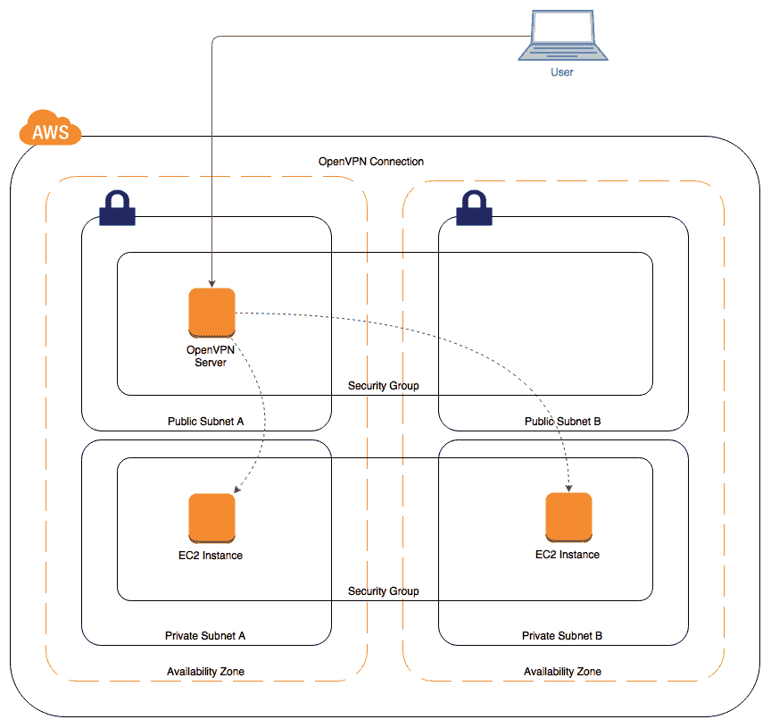
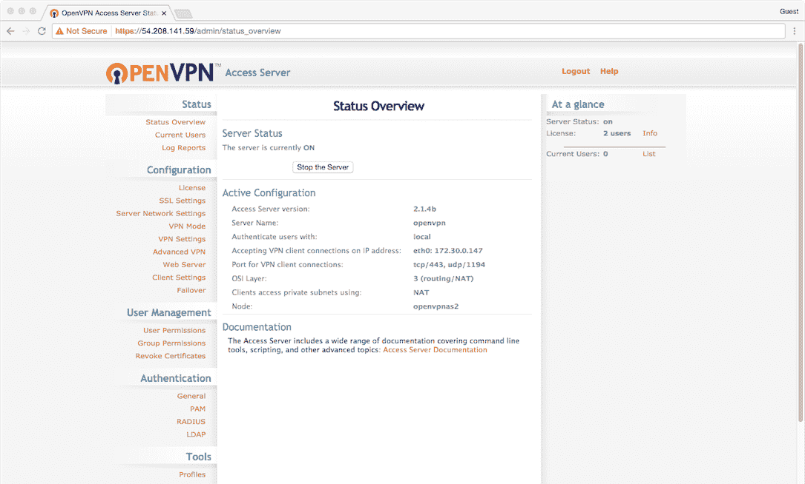
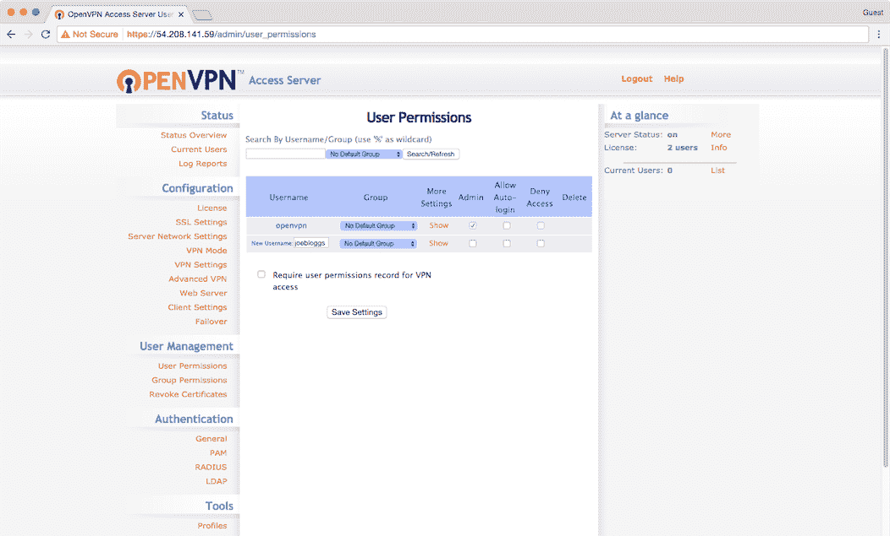
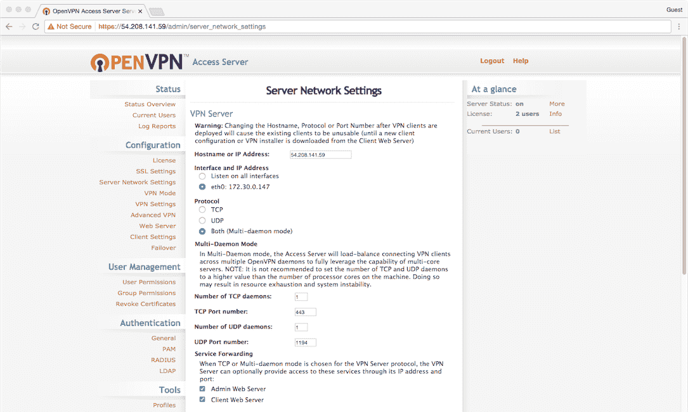
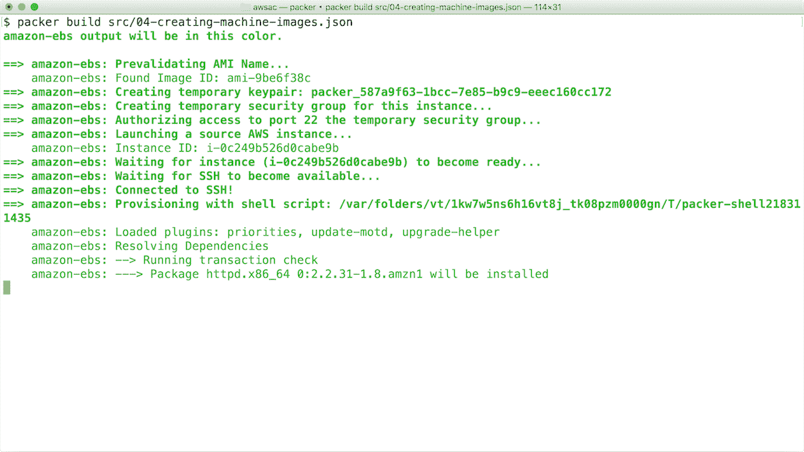
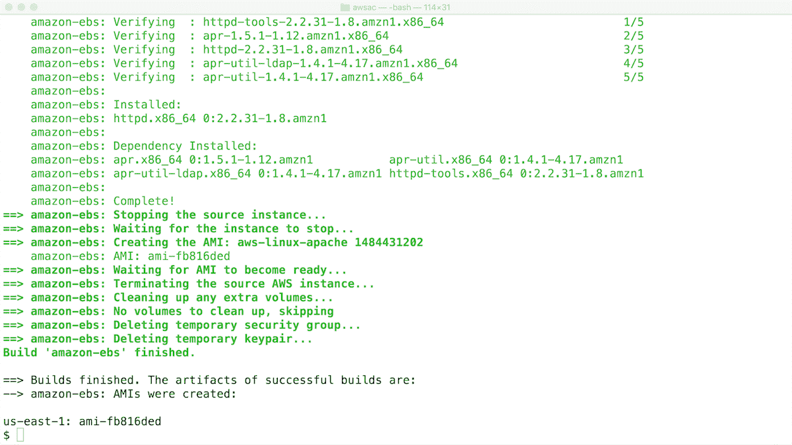

# 第四章：使用 AWS 计算

本章内容包括：

+   创建密钥对

+   启动实例

+   附加存储

+   安全访问私有实例

+   自动扩展应用服务器

+   创建机器映像

+   创建安全组

+   创建负载均衡器

# 介绍

**弹性云计算**（**EC2**）是 AWS 目录中使用最多且最复杂的服务。EC2 不仅仅是*虚拟机*，它提供了一套子服务框架，帮助你以弹性的方式管理和保护实例。

# 创建密钥对

密钥对用于通过 SSH 访问实例。这是访问实例最快且最简单的方式。

# 准备工作

为了执行本食谱，你必须正确配置 AWS CLI 工具。

# 如何操作...

1.  创建密钥对，并将其保存到磁盘：

```
 aws ec2 create-key-pair \
        --key-name MyEC2KeyPair \
        --query 'KeyMaterial' \
        --output text > ec2keypair.pem

```

1.  更改创建文件的权限：

```
        chmod 600 ec2keypair.pem

```

# 它是如何工作的...

该调用请求 EC2 提供一个新的私钥。响应将使用 JMESPath 查询进行解析，私钥（位于`KeyMaterial`属性中）将保存到一个新的 `.pem` 扩展名的密钥文件中。

最后，我们更改密钥文件的权限，确保其他用户无法读取它——这是在 SSH 允许使用该密钥前的必要步骤。

# 启动实例

在某些场景下——通常是在测试和开发基础设施代码时——你可能需要快速访问一个实例。通过 AWS CLI 创建实例是创建临时实例最快且最一致的方式。

本书中有其他需要运行实例的食谱。本食谱将帮助你入门。

# 准备工作

对于本食谱，你必须拥有一个现有的密钥对。

在本食谱中，我们使用位于`us-east-1`区域的 AMI ID 启动一个 AWS Linux 实例。如果你在不同区域工作，需要更新`image-id`参数。

你必须已使用有效的凭证配置 AWS CLI 工具。

# 如何操作...

运行以下 AWS CLI 命令，使用你自己的密钥对名称：

```
 aws ec2 run-instances \
        --image-id ami-9be6f38c \
        --instance-type t2.micro \
        --key-name <your-key-pair-name>

```

# 它是如何工作的...

虽然你可以通过 AWS Web 控制台创建实例，但它涉及许多分散注意力的选项。在开发和测试时，CLI 工具是配置实例的最佳方式。

虽然`key-name`参数是可选的，但除非你事先配置了其他登录方式，否则无法连接到你的实例。

本食谱中使用的`t2.micro`实例类型包含在 AWS 免费套餐中。你可以在使用的前 12 个月内，每月免费运行一个微型实例。更多信息请参见[`aws.amazon.com/free`](https://aws.amazon.com/free)。

由于没有指定 VPC 或安全组，实例将启动在你的账户的默认 VPC 和安全组中。默认安全组允许来自任何地方的所有端口的访问，因此不适合长期运行的实例。你可以在实例启动后修改其安全组，而无需停止实例。

# 还有更多...

如果你已经创建了自己的 AMI，那么你可以更改`image-id`参数来快速启动你的特定 AMI。

你可能还想注意 API 响应中返回的`InstanceId`值，因为你可能需要在未来的命令中使用它。

# 另请参见

+   *创建密钥对* 配方

+   *创建机器映像* 配方

# 附加存储

理想情况下，你应该在前期就通过像 CloudFormation 这样的服务定义所有存储需求作为代码。然而，有时由于应用程序限制或需求变化，这种方式无法实现。

你可以通过附加一个新卷来轻松地为实例添加额外的存储空间，且实例正在运行时也可以进行此操作。

# 准备工作

对于这个配方，你将需要以下内容：

+   正在运行的实例的 ID。它将以`i-`开头，后跟字母数字字符。

+   实例运行所在的可用区（AZ）。这通常看起来像是区域名称后跟一个字母，例如，`us-east-1a`。

在这个配方中，我们使用的是 AWS Linux 实例。如果你使用的是其他操作系统，挂载卷的步骤会有所不同。我们将会在`us-east-1a`这个可用区中运行一个实例。

你必须已经用有效的凭证配置了 AWS CLI 工具。

# 如何操作...

1.  创建一个卷：

```
 aws ec2 create-volume --availability-zone us-east-1a 

```

记下响应中返回的`VolumeId`，它将以`vol-`开头，后跟字母数字字符。

1.  将卷附加到实例，使用上一步中记录的卷 ID 和你最初启动的实例 ID：

```
 aws ec2 attach-volume \
        --volume-id <your-volume-id> \
        --instance-id <your-instance-id> \
        --device /dev/sdf

```

1.  在实例本身上，挂载卷设备：

```
 mount /dev/xvdf /mnt/volume

```

# 它是如何工作的...

在这个配方中，我们从创建卷开始。卷是从快照中创建的。如果你没有指定快照 ID，它将使用一个空白快照，结果得到一个空白卷。

虽然卷是冗余托管的，但它们仅托管在单一的可用区内，因此必须在实例运行所在的相同可用区中进行配置。

`create-volume` 命令返回一个响应，其中包含新创建卷的`VolumeId`。然后我们将在下一步中使用这个 ID。

有时候，卷需要几秒钟才能变为可用状态。如果你正在编写这些命令，可以使用`aws ec2 wait`命令来等待卷变为可用状态。

在第 3 步中，我们将一个卷附加到实例。当将卷附加到实例时，必须指定它将在操作系统中呈现为的设备名称。不幸的是，这并不能保证设备的实际显示名称。在 AWS Linux 的情况下，`/dev/sdf`会变成`/dev/xvdf`。

设备命名是与内核相关的，因此如果你使用的是 AWS Linux 以外的系统，设备名称可能会有所不同。详细信息请参见 [`docs.aws.amazon.com/AWSEC2/latest/UserGuide/device_naming.html`](http://docs.aws.amazon.com/AWSEC2/latest/UserGuide/device_naming.html)。

# 另请参见

+   *启动实例* 配方

+   第三章中的 *使用网络存储* 配方，*存储与内容交付*

# 安全访问私有实例

任何位于 VPC 私有子网中的实例或资源都将无法从互联网访问。从安全角度来看，这样做是有道理的，因为它为你的实例提供了更高的保护级别。

当然，如果它们无法从互联网访问，那么它们就不容易进行管理了。

一个常见的模式是使用 VPN 服务器作为进入你私有网络的单一、严格控制的入口点。这就是我们在本示例中将要展示的内容，如下图所示：



安全访问私有实例

# 准备就绪

我们将在这个示例中使用 OpenVPN。它们在 AWS 市场提供一个免费的 AMI（最多支持两个用户），该 AMI 已预装并配置了 OpenVPN。你需要接受使用该 AMI 的条款和条件。你可以通过访问 AMI 的市场页面[`aws.amazon.com/marketplace/pp/B00MI40CAE/`](https://aws.amazon.com/marketplace/pp/B00MI40CAE/)来接受这些条款。

你需要决定一个密码，这将是你的*临时*管理员密码。我们会将这个密码输入到 CloudFormation 模板中，然后在创建堆栈后再更改它。

你可以使用默认的 VPC 来完成这个示例。

# 如何实现……

1.  创建一个新的 CloudFormation 模板并添加以下`Mappings`。这是每个区域中所有最新`OpenVPN` AMI 的列表。我们添加这些映射是为了最大化模板的区域可移植性——你可以省略那些你不打算使用的区域：

```
      Mappings: 
        AWSRegion2AMI: # Latest OpenVPN AMI at time of publishing: 2.1.4 
          us-east-1: 
            AMI: ami-bc3566ab 
          us-east-2: 
            AMI: ami-10306a75 
          us-west-2: 
            AMI: ami-d3e743b3 
          us-west-1: 
            AMI: ami-4a02492a 
          eu-west-1: 
            AMI: ami-f53d7386 
          eu-central-1: 
            AMI: ami-ad1fe6c2 
          ap-southeast-1: 
            AMI: ami-a859ffcb 
          ap-northeast-1: 
            AMI: ami-e9da7c88 
          ap-southeast-2: 
            AMI: ami-89477aea 
          sa-east-1: 
            AMI: ami-0c069b60

```

1.  我们现在需要定义一些`Parameters`。首先，我们需要知道将 VPN 实例部署到哪个 VPC 和子网。请注意，这里需要指定一个*公共*子网，否则你将无法访问 OpenVPN 服务器：

```
      VpcId: 
        Type: AWS::EC2::VPC::Id 
        Description: VPC where load balancer and instance will launch 
      SubnetId: 
        Type: List<AWS::EC2::Subnet::Id> 
        Description: Subnet where OpenVPN server will launch 
         (pick at least 1)

```

1.  我们还需要定义`InstanceType`和`KeyName`。这分别是用于启动 OpenVPN 服务器的 EC2 实例类型和 SSH 密钥对：

```
      InstanceType: 
        Type: String 
        Description: OpenVPN server instance type 
        Default: m3.medium 
      KeyName: 
        Type: AWS::EC2::KeyPair::KeyName 
        Description: EC2 KeyPair for SSH access

```

1.  我们需要一个`AdminPassword`的参数。这是启动时分配给`openvpn`用户（管理员）的临时密码：

```
      AdminPassword: 
        Type: String 
        Description: Password for 'openvpn' user 
        Default: openvpn 
        NoEcho: true

```

1.  最后一个参数是 CIDR 块，我们希望允许其连接到我们的 VPN 服务器。例如，你可以将其限制为公司网络的公共 IP 范围：

```
      AllowAccessFromCIDR: 
        Type: String 
        Description: IP range/address to allow VPN connections from 
        Default: "0.0.0.0/0"

```

1.  我们需要定义的第一个`Resource`是 OpenVPN 服务器所在的安全组。你还将使用这个安全组来允许访问网络中的其他资源。按如下方式将其添加到模板中：

```
      VPNSecurityGroup: 
        Type: AWS::EC2::SecurityGroup 
        Properties: 
          GroupDescription: Inbound access to OpenVPN server 
          VpcId: !Ref VpcId 
          SecurityGroupIngress: 
          - CidrIp: !Ref AllowAccessFromCIDR 
            FromPort: 443 
            IpProtocol: tcp 
            ToPort: 443 
          - CidrIp: !Ref AllowAccessFromCIDR 
            FromPort: 22 
            IpProtocol: tcp 
            ToPort: 22 
          - CidrIp: !Ref AllowAccessFromCIDR 
            FromPort: 1194 
            IpProtocol: udp 
            ToPort: 1194

```

1.  现在我们可以定义实际的 OpenVPN 实例了。你会注意到我们正在显式配置网络接口。这是必要的，因为我们希望声明这个实例必须获得一个公共 IP 地址（否则你将无法访问它）。在`UserData`中，我们声明了一些变量，当 OpenVPN 软件启动时，它会读取这些变量以进行自我配置：

```
      OpenVPNInstance: 
        Type: AWS::EC2::Instance 
        Properties: 
          ImageId: !FindInMap [ AWSRegion2AMI, !Ref "AWS::Region", AMI ] 
          InstanceType: !Ref InstanceType 
          KeyName: !Ref KeyName 
          NetworkInterfaces: 
            - AssociatePublicIpAddress: true 
              DeviceIndex: "0" 
              GroupSet: 
                - !Ref VPNSecurityGroup 
              SubnetId: !Select [ 0, Ref: SubnetId ] 
          Tags: 
            - Key: Name 
              Value: example-openvpn-server 
          UserData: 
            Fn::Base64: !Sub 
              - | 
                public_hostname=openvpn 
                admin_user=openvpn 
                admin_pw=${admin_pw} 
                reroute_gw=1 
                reroute_dns=1 
              - admin_pw: !Ref AdminPassword

```

1.  最后，我们添加一些有用的`Outputs`：

```
      Outputs: 
        OpenVPNAdministration: 
          Value: 
            Fn::Join: 
              - "" 
              - - https:// 
                - !GetAtt OpenVPNInstance.PublicIp 
                - /admin/ 
          Description: Admin URL for OpenVPN server 
        OpenVPNClientLogin: 
          Value: 
            Fn::Join: 
              - "" 
              - - https:// 
                - !GetAtt OpenVPNInstance.PublicIp 
                - / 
          Description: Client login URL for OpenVPN server 
        OpenVPNServerIPAddress: 
          Value: !GetAtt OpenVPNInstance.PublicIp 
          Description: IP address for OpenVPN server

```

1.  现在，可以通过 CloudFormation 网页控制台或 CLI 使用以下命令启动这个堆栈：

```
 aws cloudformation create-stack \ 
        --template-body file://04-securely-access-private-instances.yaml \ 
        --stack-name example-vpn \ 
        --parameters \ 
        ParameterKey=KeyName,ParameterValue=<key-pair-name> \ 
        ParameterKey=VpcId,ParameterValue=<your-vpc-id> \ 
        ParameterKey=SubnetId,ParameterValue=<your-public-subnet-id> 

```

# 配置

1.  一旦堆栈创建完成，您需要更改`openvpn`用户（管理员）的密码。现在请访问管理员控制面板并执行此操作：`https://<vpn 服务器的 ip 或主机名>/admin`。如果 VPN 服务器运行正常，登录后您将看到一个状态页面，如下图所示：



在那里时，您应该创建一个非管理员用户帐户。这个帐户将用于连接 VPN。在用户权限页面上添加该帐户，如下图所示：



1.  在服务器网络设置中，在主机名或 IP 地址字段中，输入服务器的主机名或 IP 地址。此步骤很重要，下载 OpenVPN 配置文件时（下一步），如果它包含正确的主机名或 IP 地址，会让您的操作变得更加简单。以下截图显示了服务器网络设置页面上您可以预期看到的内容：



# 工作原理...

现在您应该能够连接到您的 VPN 服务器了。请转到用户登录页面，并使用您之前为非管理员用户设置的凭证进行登录：

`https://<vpn 服务器的 ip 或主机名>/`

登录后，您将有选项下载特定于您帐户的 OpenVPN 客户端及其配置文件。或者，如果您已经安装了 VPN 客户端，您也可以单独下载配置文件。

# 还有更多...

现在，既然您的 OpenVPN 服务器已经启动并运行，您需要记住几个重要的事项：

+   如果需要通过 SSH 连接到实例，您必须使用用户名`openvpnas`进行连接。

+   要访问其他实例，您需要允许来自本食谱中创建的 VPN 安全组的连接。

# 自动扩展应用服务器

**自动扩展**是云计算中的一个基本组成部分。它不仅能根据应用负载动态扩展和缩减容量，还能通过确保始终有可用的容量提供冗余。即使在极不可能发生的可用区故障情况下，自动扩展组也会确保实例能够运行您的应用程序。

自动扩展还允许您仅为所需的 EC2 容量付费，因为使用不足的服务器可以被自动撤销配置。

# 准备工作

您必须提供两个或更多子网 ID，以便此食谱能够正常工作。

以下示例使用的是`us-east-1`区域的 AWS Linux AMI。如果您在其他区域工作，请根据需要更新参数。

# 如何操作...

1.  首先定义模板版本和描述：

```
      AWSTemplateFormatVersion: "2010-09-09"
      Description: Create an Auto Scaling Group

```

1.  添加一个`Parameters`部分，包含稍后将在模板中使用的必需参数：

```
      Parameters:
        SubnetIds:
          Description: Subnet IDs where instances can be launched
          Type: List<AWS::EC2::Subnet::Id>

```

1.  在`Parameters`部分下，添加可选的实例配置参数：

```
    AmiId: 
        Description: The application server's AMI ID 
        Type: AWS::EC2::Image::Id 
        Default: ami-9be6f38c # AWS Linux in us-east-1 
      InstanceType: 
        Description: The type of instance to launch 
        Type: String 
        Default: t2.micro

```

1.  在`Parameters`部分下，添加可选的自动扩展组配置参数：

```
      MinSize: 
        Description: Minimum number of instances in the group 
        Type: Number 
        Default: 1
      MaxSize: 
        Description: Maximum number of instances in the group 
        Type: Number 
        Default: 4 

      ThresholdCPUHigh: 
        Description: Launch new instances when CPU utilization 
          is over this threshold 
        Type: Number 
        Default: 60 

      ThresholdCPULow: 
        Description: Remove instances when CPU utilization
          is under this threshold 
        Type: Number 
        Default: 40 

      ThresholdMinutes: 
        Description: Launch new instances when over the CPU 
          threshold for this many minutes 
        Type: Number 
        Default: 5

```

1.  添加一个`Resources`部分，定义自动扩展组资源：

```
      Resources: 
        AutoScalingGroup: 
          Type: AWS::AutoScaling::AutoScalingGroup 
          Properties: 
            MinSize: !Ref MinSize 
            MaxSize: !Ref MaxSize 
            LaunchConfigurationName: !Ref LaunchConfiguration 
            Tags: 
              - Key: Name 
                Value: !Sub "${AWS::StackName} server" 
                PropagateAtLaunch: true 
            VPCZoneIdentifier: !Ref SubnetIds

```

1.  仍然在`Resources`部分下，定义自动扩展组使用的启动配置：

```
      LaunchConfiguration: 
        Type: AWS::AutoScaling::LaunchConfiguration 
        Properties: 
          ImageId: !Ref AmiId 
          InstanceType: !Ref InstanceType 
          UserData: 
            Fn::Base64: !Sub | 
              #!/bin/bash -xe 
              # This will be run on startup, launch your application here

```

1.  接下来，定义两个扩展策略资源——一个用于扩展实例数量，另一个用于缩减实例数量：

```
        ScaleUpPolicy: 
          Type: AWS::AutoScaling::ScalingPolicy 
          Properties: 
            AdjustmentType: ChangeInCapacity 
            AutoScalingGroupName: !Ref AutoScalingGroup 
            Cooldown: 60 
            ScalingAdjustment: 1 

        ScaleDownPolicy: 
          Type: AWS::AutoScaling::ScalingPolicy 
          Properties: 
            AdjustmentType: ChangeInCapacity 
            AutoScalingGroupName: !Ref AutoScalingGroup 
            Cooldown: 60 
            ScalingAdjustment: -1

```

1.  定义一个报警，当 CPU 超过`ThresholdCPUHigh`参数时发出警报：

```
      CPUHighAlarm: 
        Type: AWS::CloudWatch::Alarm 
        Properties: 
          ActionsEnabled: true 
          AlarmActions: 
            - !Ref ScaleUpPolicy 
          AlarmDescription: Scale up on CPU load 
          ComparisonOperator: GreaterThanThreshold 
          Dimensions: 
            - Name: AutoScalingGroupName 
              Value: !Ref AutoScalingGroup 
          EvaluationPeriods: !Ref ThresholdMinutes 
          MetricName: CPUUtilization 
          Namespace: AWS/EC2 
          Period: 60 
          Statistic: Average 
          Threshold: !Ref ThresholdCPUHigh

```

1.  最后，定义一个报警，当 CPU 低于`ThresholdCPULow`参数时发出警报：

```
      CPULowAlarm: 
        Type: AWS::CloudWatch::Alarm 
        Properties: 
          ActionsEnabled: true 
          AlarmActions: 
            - !Ref ScaleDownPolicy 
          AlarmDescription: Scale down on CPU load 
          ComparisonOperator: LessThanThreshold 
          Dimensions: 
            - Name: AutoScalingGroupName 
              Value: !Ref AutoScalingGroup 
          EvaluationPeriods: !Ref ThresholdMinutes 
          MetricName: CPUUtilization 
          Namespace: AWS/EC2 
          Period: 60 
          Statistic: Average 
          Threshold: !Ref ThresholdCPULow

```

1.  将模板保存为文件名`04-auto-scaling-an-application-server.yaml`。

1.  使用以下 AWS CLI 命令启动模板，并提供你的子网 ID：

```
     aws cloudformation create-stack \ 
        --stack-name asg \ 
        --template-body file://04-auto-scaling-an-application-server.yaml \ 
        --parameters \ 
        ParameterKey=SubnetIds,ParameterValue='<subnet-id-1>\, \
          <subnet-id-2>' 

```

# 工作原理...

本示例定义了一个自动扩展组及其依赖资源，具体包括以下内容：

+   启动配置，用于启动新实例

+   两个扩展策略，一个用于扩展实例数量，另一个逆向策略用于缩减实例数量

+   当 CPU 跨越某个阈值并持续一定时间时，触发报警

本示例中的自动扩展组和启动配置资源对象大多数使用的是默认值。如果你希望能够连接到实例（例如，通过 SSH），你需要在`LaunchConfiguration`资源配置中指定自己的`SecurityGroups`和`KeyName`参数。

AWS 会自动确保将你的实例均匀分布到你配置的子网中，因此请确保它们位于不同的可用区（AZ）中！当缩减时，最旧的实例会先被删除，再删除较新的实例。

# 扩展策略

扩展策略详细说明了在触发时要创建或删除多少个实例。它还定义了一个`Cooldown`值，帮助防止*反复波动*的服务器——即服务器在启动完成并变得有用之前就被创建和删除。

虽然这个示例中的扩展策略使用了相同的值，但你可能想要调整它们，以便让你的应用程序能够快速*扩展*，并且为了最佳用户体验，*缩减*速度较慢。

# 报警

`CPUHighAlarm`参数将在平均 CPU 利用率超过`ThresholdCPUHigh`参数中设置的值时发出警报。此警报将被发送到`ScaleUpPolicy`资源，启动更多实例，从而降低整个自动扩展组的平均 CPU 利用率。顾名思义，当平均 CPU 利用率低于`ThresholdCPULow`参数时，`CPULowAlarm`参数会执行相反操作。

这意味着新的实例将会被启动，直到自动扩展组中的 CPU 利用率稳定在 40-60%之间（基于默认的参数值），或者实例的`MaxSize`达到上限。

在高低报警阈值之间留有间隙非常重要。如果它们设置得过于接近，报警将无法稳定，你会看到实例几乎不断地被创建和销毁。

实例的最短计费时间是*一小时*，因此在一小时内多次创建和销毁实例可能会导致比预期更高的费用。

# 创建机器镜像

创建或*构建*你自己的**Amazon Machine Images**（**AMIs**）是 AWS 系统管理中的关键部分。拥有一个预构建的镜像可以帮助你比手动配置更快、更容易且更一致地配置服务器。

Packer 是一个事实标准工具，帮助你制作自己的 AMI。通过自动化实例的启动、配置和清理，它确保每次都能得到一个可重复的镜像。

在这个配方中，我们将创建一个预装并配置好的 Apache web 服务器镜像。虽然这是一个简单的例子，但它也是一个非常常见的使用场景。

通过将你的 web 服务器预先配置到镜像中，你可以根据网站的需求动态扩展 web 服务层。预装和配置好的软件意味着你可以获得最快和最可靠的启动体验。

# 准备工作

对于这个配方，你必须在系统中安装 Packer 工具。从项目的官网[`www.packer.io/downloads.html`](https://www.packer.io/downloads.html)下载并安装 Packer。

# 如何操作...

1.  创建一个新的 Packer 模板文件，并首先在`builders`部分定义一个`amazon-ebs`构建器：

```
      "builders": [ 
        { 
          "type": "amazon-ebs", 
          "instance_type": "t2.micro", 
          "region": "us-east-1", 
          "source_ami": "ami-9be6f38c", 
          "ssh_username": "ec2-user", 
          "ami_name": "aws-linux-apache {{timestamp}}" 
        } 
      ],

```

整个模板文件必须是一个有效的 JSON 对象。记得将各个部分用大括号`{ ... }`括起来。

1.  创建一个`provisioners`部分，并包含以下代码片段来安装并激活 Apache：

```
      "provisioners": [ 
        { 
          "type": "shell", 
          "inline": [ 
            "sudo yum install -y httpd", 
            "sudo chkconfig httpd on" 
          ] 
        } 
      ]

```

1.  使用特定的文件名保存文件，例如`04-creating-machine-images.json`。

1.  使用以下`packer validate`命令验证你创建的配置文件：

```
 packer validate 04-creating-machine-images.json

```

1.  当配置有效时，使用以下命令构建 AMI：

```
 packer build 04-creating-machine-images.json

```

1.  等待直到过程完成。在此期间，你将看到类似以下的输出：



1.  记录 Packer 返回的 AMI ID，以便将来启动实例时使用：



# 它是如何工作的...

虽然这是一个非常简单的配方，但背后有许多操作。这也是我们推荐使用 Packer 来创建机器镜像的原因。

# 模板

在模板的`builders`部分，我们定义了构建的详细信息。

我们使用最常见的 AMI 构建器类型：`amazon-ebs`。还有其他类型的 AWS 构建器，例如存储支持的实例类型。

接下来，我们定义在创建镜像时使用的实例类型。

确保你能够通过使用更大的实例类型来缩短构建实例的时间。记住，实例的最短计费时间为一小时。

本配方中的`source_ami`属性是我们指定的`region`中的 AWS Linux AMI ID。`ssh_username`允许你设置用于连接并运行`provisioners`的用户名。这个用户名取决于你的操作系统，在我们的例子中是`ec2-user`。

最后，`ami_name` 字段包含内置的 Packer 变量 `{{timestamp}}`。这确保你创建的 AMI 始终具有唯一的名称。

# 验证模板

`packer validate` 命令是确保模板没有语法错误的一种快速方法，适合在启动任何实例之前使用。

# 构建 AMI

一旦你创建并验证了模板，`packer build` 命令会为你执行以下操作：

+   创建一次性密钥对以便通过 SSH 访问实例

+   创建专用的安全组来控制对实例的访问

+   启动实例

+   等待直到 SSH 准备好接收连接

+   在实例上执行配置步骤

+   停止实例

+   从停止的实例生成 AMI

+   终止实例

查看 Packer 文档以获取更多的提供者和功能，网址为 [`www.packer.io/docs/`](https://www.packer.io/docs/)。

# 还有更多...

虽然 Packer 使得在 AWS 上管理镜像变得更加轻松，但仍然有一些需要注意的地方。

# 调试

显然，既然许多步骤已经为你自动化，还是有很多事情可能出错。Packer 提供了几种不同的方式来调试构建过程中的问题。

使用 Packer 时，最有用的参数之一是 `-debug` 标志。这个标志会强制你在每一步操作*执行之前*手动确认。这样做可以让你很容易地找出命令中哪一步出错，从而通常能够明确需要更改的地方。

另一个有用的做法是在 Packer 命令期间提高日志输出的级别。你可以通过将 `PACKER_LOG` 变量设置为 `true` 来实现。最简单的方式是在 Packer 命令行前面加上 `PACKER_LOG=1`。这将意味着在命令执行期间，你会获得更多的信息打印到控制台（例如，SSH 日志、AWS API 调用等）。你可能还希望在构建过程中正常使用此级别的日志记录，作为审计用途。

# 孤立资源

Packer 在管理和清理它所使用的资源方面做得很好，但它只能在运行期间完成这些工作。

如果你的 Packer 任务因任何原因中止（最可能是网络问题），可能会有一些资源变成**孤立**或**未管理**的状态。最好检查是否有任何 Packer 实例（它们的名称中会包含 *Packer*），如果没有正在运行的 Packer 任务，最好将它们停止。

你可能还需要清理任何剩余的密钥对和安全组，但这不是大问题，因为这些没有费用（不像实例）。

# 注销 AMI

随着创建 AMI 的过程变得越来越简单，你可能会发现自己最终创建了超过需要的数量！

AMI 由 EC2 快照组成，这些快照存储在 S3 中。存储快照是有成本的，因此你需要定期清理它们。鉴于大多数 AMI 的大小（通常为几 GB），它不太可能成为你主要的费用来源。

一个更大的成本是管理过多 AMI 的行政开销。随着镜像的改进和修复（尤其是安全修复）的应用，你可能希望阻止他人使用这些镜像。

要删除 AMI，必须首先 *注销* 它，然后删除其底层快照。

确保不要注销正在使用中的 AMI。例如，引用已注销 AMI 的自动扩展组将无法启动新实例！

你可以通过网页控制台或使用 AWS CLI 工具轻松注销快照。

一旦 AMI 不再注册，你就可以删除关联的快照。Packer 会自动将 AMI ID 添加到快照的描述中。通过搜索快照中的已注销 AMI ID，你可以找到需要删除的快照。

如果 AMI 没有被注销，或者注销过程仍在进行中（可能需要几分钟），你将无法删除快照。

# 其他平台

还值得注意的是，Packer 不仅可以为 AWS 构建镜像。你还可以为 VMWare、Docker 等其他平台构建镜像。

这意味着你可以在本地几乎完全相同地构建机器镜像（例如，使用 Docker），就像在 AWS 中一样。这使得在设置本地开发环境时更加方便。

请查阅 Packer 文档中的 `builders` 部分以获取详细信息。

# 创建安全组

AWS 将安全组描述为 *虚拟防火墙*。虽然这个类比有助于新手理解 EC2 平台的目的和功能，但更准确的描述是将它们看作一种 *防火墙式* 的流量授权方法。它们并不像传统防火墙那样提供所有功能，但这种简化也使得它们非常强大，尤其是与基础设施即代码和现代 SDLC 实践相结合时。

我们将通过一个基本场景来演示，涉及到 Web 服务器和负载均衡器。我们希望负载均衡器能够响应来自任何地方的 HTTP 请求，并且希望将 Web 服务器与除了负载均衡器之外的所有内容隔离。

# 准备工作

在我们开始之前，有一个小清单是你需要准备的：

+   `AmiId` 这是你所在区域的 AMI ID。对于本教程，我们建议使用 AWS Linux AMI，因为我们的实例将尝试在启动时运行一些 `yum` 命令。

+   `VPCID`：这是你希望启动 EC2 服务器的 VPC ID。

+   `SubnetIDs`：这些是我们的 EC2 实例可以启动的子网。

# 如何操作...

1.  打开你的文本编辑器并创建一个新的 CloudFormation 模板。我们将从添加以下几个 `Parameters` 开始：

```
      AWSTemplateFormatVersion: '2010-09-09' 
      Parameters: 
        AmiId: 
          Type: AWS::EC2::AMI::Id 
          Description: AMI ID to launch instances from 
        VPCID: 
          Type: AWS::EC2::VPC::Id 
          Description: VPC where load balancer and instance will launch 
        SubnetIDs: 
          Type: List<AWS::EC2::Subnet::Id> 
          Description: Subnets where load balancer and instance will launch 
            (pick at least 2)

```

1.  让我们来看看我们将应用于公共负载均衡器的安全组：

```
      ExampleELBSecurityGroup: 
        Type: AWS::EC2::SecurityGroup 
        Properties: 
          GroupDescription: Security Group for example ELB 
          SecurityGroupIngress: 
            - IpProtocol: tcp 
              CidrIp: 0.0.0.0/0 
              FromPort: 80 
              ToPort: 80

```

任何位于此安全组中的内容都会允许从任何地方（`0.0.0.0/0`）通过端口 `80` 进行 TCP 连接。请注意，一个安全组可以包含多个规则；我们几乎肯定还需要允许 HTTPS（`443`），但为了简化示例，我们省略了这一部分。

1.  现在，让我们来看一下位于负载均衡器后面的 Web 服务器的安全组：

```
      ExampleEC2InstanceSecurityGroup: 
        Type: AWS::EC2::SecurityGroup 
        Properties: 
          GroupDescription: Security Group for example Instance 
          SecurityGroupIngress: 
            - IpProtocol: tcp 
              SourceSecurityGroupName: 
                Ref: ExampleELBSecurityGroup 
              FromPort: 80 
              ToPort: 80

```

这里你可以看到我们没有指定源 IP 范围。相反，我们指定了一个源安全组，我们将接受来自该安全组的连接。在这种情况下，我们表示希望允许来自我们的 ELB 安全组的任何内容连接到我们的 EC2 实例安全组中的任何内容，端口为 `80`。

由于这是我们指定的唯一规则，我们的 Web 服务器将不会接受来自任何地方的连接，除非是来自我们的负载均衡器，且仅限于端口 `80`。我们的 Web 服务器并没有完全暴露在互联网上，它甚至与 VPC 中的其他实例隔离。

记住，多个实例可以位于同一个安全组中。如果你有多个 Web 服务器连接到这个负载均衡器，给每个 Web 服务器创建一个新的安全组将是不必要的、低效的，甚至有些反模式。由于所有连接到该负载均衡器的 Web 服务器都将承担相同的角色或功能，因此将相同的安全组应用于它们是有意义的。

这就是安全组真正强大的地方。如果一个 EC2 实例担任多个角色——假设你在 VPC 中有一个出站的 HTTP 代理服务器，并且你也希望它充当 SMTP 中继——那么你可以简单地为其应用多个安全组。

1.  接下来，我们需要添加负载均衡器。这可能是你遇到的最基础的负载均衡器配置。以下代码将为你提供一个负载均衡器、一个监听器以及一个包含我们 EC2 实例的目标组。

```
      ExampleLoadBalancer: 
        Type: AWS::ElasticLoadBalancingV2::LoadBalancer 
        Properties: 
          Subnets:  
            - Fn::Select: [ 0, Ref: SubnetIDs ] 
            - Fn::Select: [ 1, Ref: SubnetIDs ] 
          SecurityGroups: 
            - Fn::GetAtt: ExampleELBSecurityGroup.GroupId 
      ExampleListener: 
        Type: AWS::ElasticLoadBalancingV2::Listener 
        Properties: 
          LoadBalancerArn: 
            Ref: ExampleLoadBalancer 
          DefaultActions: 
            - Type: forward 
              TargetGroupArn: 
                Ref: ExampleTargetGroup 
          Port: 80 
          Protocol: HTTP 
      ExampleTargetGroup: 
        Type: AWS::ElasticLoadBalancingV2::TargetGroup 
        Properties:  
          Port: 80 
          Protocol: HTTP 
          VpcId: 
             Ref: VPCID 
          Targets: 
            - Id: 
                Ref: ExampleEC2Instance

```

1.  我们将添加到模板中的最后一个资源是一个 EC2 服务器。当该服务器启动时，它将安装并启动 `nginx`。

```
      ExampleEC2Instance: 
        Type: AWS::EC2::Instance 
        Properties: 
          InstanceType: t2.nano 
          UserData: 
            Fn::Base64: 
              Fn::Sub: | 
                #!/bin/bash -ex 
                yum install -y nginx 
                service nginx start 
                exit 0 
        ImageId: 
          Ref: AmiId 
        SecurityGroupIds: 
          - Fn::GetAtt: ExampleEC2InstanceSecurityGroup.GroupId 
        SubnetId:  
          Fn::Select: [ 0, Ref: SubnetIDs ]

```

1.  最后，我们将向模板中添加一些 `Outputs`，使得在堆栈创建后使用我们的 ELB 和 EC2 实例更为方便。

```
      Outputs: 
        ExampleEC2InstanceHostname: 
          Value: 
            Fn::GetAtt: [ ExampleEC2Instance, PublicDnsName ] 
        ExampleELBURL: 
          Value: 
            Fn::Join: 
              - '' 
              - [ 'http://', { 'Fn::GetAtt': [ ExampleLoadBalancer,
                  DNSName ] }, '/' ]

```

1.  继续使用 CloudFormation Web 控制台或 AWS CLI 启动这个模板。

# 还有更多…

当使用 CloudFormation 配置安全组时，你最终会遇到循环依赖问题。假设你希望我们在 `ExampleEC2InstanceSecurityGroup` 中的所有服务器都能通过端口 `22`（SSH）互相访问。为了实现这一点，你需要将此规则作为单独的资源类型 `AWS::EC2::SecurityGroupIngress` 添加。因为在 CloudFormation 中，一个安全组在尚未创建时不能引用自身。这就是额外资源类型的样子：

```
      ExampleEC2InstanceIngress: 
        Type: AWS::EC2::SecurityGroupIngress 
        Properties: 
          IpProtocol: tcp 
          SourceSecurityGroupName: 
            Ref: ExampleEC2InstanceSecurityGroup 
          GroupName: 
            Ref: ExampleEC2InstanceSecurityGroup 
          FromPort: 22 
          ToPort: 22

```

# 与传统防火墙的区别

+   安全组不能用于显式阻止流量。只能添加允许类型的规则；不支持拒绝风格的规则。本质上，所有入站流量都会被拒绝，除非你明确允许它。

+   你的规则也可能不会涉及源端口；只支持目标端口。

+   当创建安全组时，它们将包含一个允许所有出站连接的规则。如果你删除此规则，新的出站连接将被丢弃。一个常见的做法是保留此规则，并仅通过入站规则来过滤所有流量。

+   如果你替换了默认的出站规则，需要注意的是，只有新的出站连接会被过滤。任何响应入站连接的出站流量仍然会被允许。这是因为安全组是*有状态的*。

+   与安全组不同，网络 ACL 是无状态的，并且支持`DENY`规则。你可以将它们作为 VPC 内部的安全补充层，特别是当你需要控制子网之间的流量时。

# 创建负载均衡器

AWS 提供两种类型的负载均衡器：

+   经典负载均衡器

+   应用负载均衡器

我们将重点讨论应用负载均衡器。它实际上是 ELB 服务的升级版、第二代，并且比经典负载均衡器提供更多功能。例如，它原生支持 HTTP/2 和 WebSocket。每小时的费用也相对便宜。

应用负载均衡器不支持第四层负载均衡。对于这种功能，你需要使用经典负载均衡器。

# 如何做...

1.  打开文本编辑器并创建一个新的 CloudFormation 模板。我们需要一个 VPC ID 和一些子网 ID 作为`Parameters`。像这样将它们添加到模板中：

```
      AWSTemplateFormatVersion: '2010-09-09' 
      Parameters: 
        VPCID: 
          Type: AWS::EC2::VPC::Id 
          Description: VPC where load balancer and instance will launch 
        SubnetIDs: 
          Type: List<AWS::EC2::Subnet::Id> 
          Description: Subnets where load balancer and instance will launch
           (pick at least 2)

```

1.  接下来，我们需要添加一些 ELB 账户 ID 的`Mappings`。这些映射将帮助我们为负载均衡器提供将日志写入 S3 桶的权限。你的映射应该像这样：

你可以在这里找到完整的 ELB 账户 ID 列表：[`docs.aws.amazon.com/elasticloadbalancing/latest/classic/enable-access-logs.html#attach-bucket-policy`](http://docs.aws.amazon.com/elasticloadbalancing/latest/classic/enable-access-logs.html#attach-bucket-policy)。

```
      Mappings: 
        ELBAccountMap: 
          us-east-1: 
        ELBAccountID: 127311923021 
          ap-southeast-2: 
        ELBAccountID: 783225319266

```

1.  我们现在可以开始向模板中添加`Resources`。首先，我们将创建一个 S3 桶和桶策略，用于存储我们的负载均衡器日志。为了使这个模板具有可移植性，我们将省略桶名称，但为了方便起见，我们将在输出中包含桶名称，以便 CloudFormation 将名称回显给我们。

```
      Resources: 
        ExampleLogBucket: 
          Type: AWS::S3::Bucket 
        ExampleBucketPolicy: 
          Type: AWS::S3::BucketPolicy 
          Properties: 
            Bucket: 
              Ref: ExampleLogBucket 
            PolicyDocument: 
              Statement: 
                - 
                  Action: 
                    - "s3:PutObject" 
                  Effect: "Allow" 
                  Resource: 
                    Fn::Join: 
                      - "" 
                      - 
                        - "arn:aws:s3:::" 
                        - Ref: ExampleLogBucket 
                        - "/*" 
                  Principal: 
                    AWS: 
                      Fn::FindInMap: [ ELBAccountMap, Ref: "AWS::Region",
                        ELBAccountID ]                       

```

1.  接下来，我们需要为负载均衡器创建一个安全组。这个安全组将允许对端口`80`（HTTP）的入站连接。为了简化这个过程，我们将省略端口`443`（HTTPS），但我们将在本节稍后简要介绍如何添加此功能。由于我们正在添加一个公共负载均衡器，我们希望允许来自任何地方（`0.0.0.0/0`）的连接。这是我们安全组的配置：

```
      ExampleELBSecurityGroup: 
        Type: AWS::EC2::SecurityGroup 
        Properties: 
          GroupDescription: Security Group for example ELB 
          SecurityGroupIngress: 
            - 
              IpProtocol: tcp 
              CidrIp: 0.0.0.0/0 
              FromPort: 80 
              ToPort: 80

```

1.  现在我们需要定义一个目标组。完成这个配方后，你可以将实例注册到这个目标组，以便 HTTP 请求能够被转发到该组。或者，你也可以将目标组附加到自动扩展组，AWS 将为你处理实例的注册和注销。

1.  目标组是我们指定负载均衡器应执行健康检查的地方。这个健康检查对于确定一个注册的实例是否应接收流量非常重要。此示例中提供的健康检查参数已设置为默认值。你可以根据需要进行调整，或者如果默认设置适合你的情况，也可以选择删除它们。

```
      ExampleTargetGroup: 
        Type: AWS::ElasticLoadBalancingV2::TargetGroup 
        Properties: 
          Port: 80 
          Protocol: HTTP 
          HealthCheckIntervalSeconds: 30 
          HealthCheckProtocol: HTTP 
          HealthCheckPort: 80 
          HealthCheckPath: / 
          HealthCheckTimeoutSeconds: 5 
          HealthyThresholdCount: 5 
          UnhealthyThresholdCount: 2 
          Matcher: 
            HttpCode: '200' 
          VpcId: 
            Ref: VPCID

```

1.  我们需要定义至少一个监听器，添加到我们的负载均衡器中。监听器将*监听*我们为其配置的端口和协议上到达负载均衡器的请求。与端口和协议匹配的请求将被转发到我们的目标组。

我们的监听器配置将相对简单。我们将监听端口`80`上的 HTTP 请求。我们还为此监听器设置了一个默认动作，它将我们的请求转发到我们之前定义的目标组。每个负载均衡器最多可以配置 10 个监听器。

目前，AWS 只支持一个动作：转发。

```
      ExampleListener:
        Type: AWS::ElasticLoadBalancingV2::Listener 
        Properties: 
          LoadBalancerArn: 
            Ref: ExampleLoadBalancer 
          DefaultActions: 
            - Type: forward 
              TargetGroupArn: 
        Ref: ExampleTargetGroup 
          Port: 80 
          Protocol: HTTP

```

1.  最后，既然我们已经准备好了所有需要的`Resources`，我们可以继续设置负载均衡器了。我们需要定义至少两个子网来部署负载均衡器，这些在我们的示例模板中作为`Parameters`提供：

```
      ExampleLoadBalancer: 
        Type: AWS::ElasticLoadBalancingV2::LoadBalancer 
        Properties: 
          LoadBalancerAttributes: 
            - Key: access_logs.s3.enabled 
             Value: true 
            - Key: access_logs.s3.bucket 
             Value: 
               Ref: ExampleLogBucket 
            - Key: idle_timeout.timeout_seconds 
              Value: 60 
          Scheme: internet-facing 
          Subnets: 
            - Fn::Select: [ 0, Ref: SubnetIDs ]               
            - Fn::Select: [ 1, Ref: SubnetIDs ]               
          SecurityGroups: 
            - Fn::GetAtt: ExampleELBSecurityGroup.GroupId

```

1.  最后，我们将向模板中添加一些`Outputs`，以便更方便查看。我们特别关注我们创建的 S3 桶的名称和负载均衡器的 URL。

```
      Outputs: 
        ExampleELBURL: 
          Value: 
            Fn::Join: 
              - '' 
              - [ 'http://', { 'Fn::GetAtt': [ ExampleLoadBalancer,
                  DNSName ] }, '/' ] 
        ExampleLogBucket: 
          Value: 
            Ref: ExampleLogBucket

```

# 它是如何工作的……

如你所见，我们正在应用一个日志配置，指向我们创建的 S3 桶。我们正在将这个负载均衡器配置为面向互联网，并设置了 60 秒的空闲超时（默认值）。

默认情况下，所有负载均衡器都是面向互联网的，因此在我们的示例中，定义`Scheme`并非绝对必要；然而，即使如此，包含它仍然是很有帮助的。如果你的 CloudFormation 模板包含了公共和私有负载均衡器的混合配置，尤其如此。

如果你指定了日志配置，但负载均衡器无法访问 S3 桶，那么你的 CloudFormation 堆栈将无法完成。

私有 ELB 是非面向互联网的，仅对位于你 VPC 内部的资源可用。

就这样！现在你已经配置好了一个可以正常工作的应用程序负载均衡器，并能够将日志传输到 S3 桶。

# 还有更多……

AWS 上的负载均衡器具有高度的可配置性，并且提供许多选项供你选择。以下是一些你常遇到的 ELB 选项：

# HTTPS/SSL

如果你希望接受 HTTPS 请求，你需要配置一个额外的监听器。它看起来大致如下：

```
      ExampleHTTPSListener: 
        Type: AWS::ElasticLoadBalancingV2::Listener 
        Properties: 
          Certificates: 
            - CertificateArn:
               arn:aws:acm:ap-southeast-2:123456789012:
               certificate/12345678-1234-1234-1234-123456789012 
          LoadBalancerArn: 
            Ref: ExampleLoadBalancer 
          DefaultActions: 
            - Type: forward 
              TargetGroupArn: 
                Ref: ExampleTargetGroup 
          Port: 443 
          Protocol: HTTPS

```

监听器需要引用你希望使用的证书的有效**Amazon 资源名称**（**ARN**）。让 AWS 证书管理器为你创建证书非常简单，但它确实需要验证你为其生成证书的域名。当然，你也可以带上自己的证书。如果你愿意，需先将证书导入 AWS 证书管理器，然后才能将其与 ELB（或 CloudFront 分发）一起使用。

除非你对加密套件有特定要求，否则一个不错的起点是不要定义 SSL 策略，而是让 AWS 选择当前的*最佳实践*。

# 基于路径的路由

一旦你对 ELB 配置感到熟悉，就可以开始尝试基于路径的路由。简而言之，它提供了一种检查请求并根据请求的路径将其代理到不同目标的方法。

你可能遇到的一个常见场景是，需要将`/blog`的请求路由到一组运行 WordPress 的服务器，而不是路由到运行 Ruby on Rails 应用程序的主服务器池。
