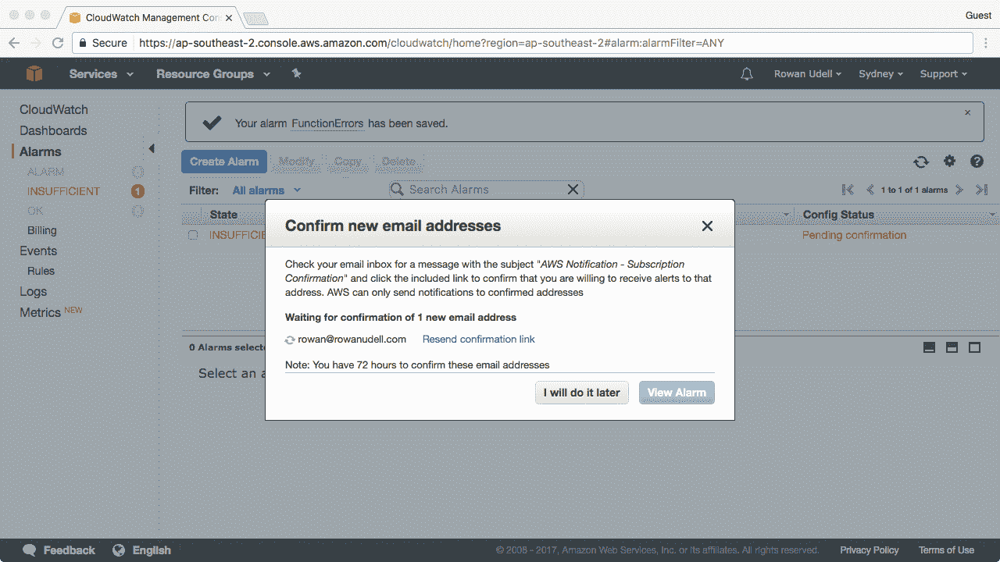
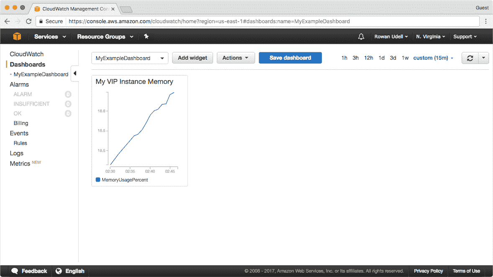

# 管理工具

在本章中，我们将介绍：

+   审计您的 AWS 账户

+   使用受信顾问的建议

+   创建电子邮件告警

+   在 CloudWatch 中发布自定义指标

+   创建监控仪表盘

+   创建预算

+   将日志文件输入到 CloudWatch 日志

# 介绍

和所有管理操作一样，监控和告警是使用基于 AWS 的基础设施时至关重要的一部分。实际上，由于云资源的短暂性，跟踪和衡量使用情况比使用本地系统时更加重要。

# 审计您的 AWS 账户

我们现在将向您展示如何在 AWS 账户中设置 CloudTrail。一旦启用了 CloudTrail，它将开始记录您账户中对 AWS 服务进行的所有 API 调用，并将其作为日志文件传输到 S3 存储桶中。

当我们谈论 API 调用时，我们指的是类似以下内容：

+   在 AWS 控制台中执行的操作。

+   使用 CLI 或 SDK 调用 AWS API。

+   AWS 服务代表您所做的调用。比如 CloudFormation 或自动扩展服务。

日志中的每个条目将包含有用的信息，例如：

+   被调用的服务

+   所请求的操作

+   请求中发送的参数

+   AWS 返回的响应

+   调用者的身份（包括 IP 地址）

+   请求的日期和时间

# 如何操作……

1.  创建一个新的 CloudFormation 模板文件；我们将定义以下 `Resources`：

    +   存储我们 CloudTrail 日志文件的 S3 存储桶

    +   一个允许 CloudTrail 服务写入我们的 S3 存储桶的策略

    +   一个 CloudTrail *轨迹*

1.  如此定义一个 S3 存储桶。我们不需要给它命名；稍后我们会将存储桶名称添加到 `Outputs` 列表中：

```
      ExampleTrailBucket: 
        Type: AWS::S3::Bucket

```

1.  接下来，我们需要为我们的存储桶定义一个策略。本节内容稍微有些冗长，您可以选择从代码示例中获取此内容。该策略基本上允许 CloudTrail 对我们的存储桶执行两项操作：`s3:GetBucketAcl` 和 `s3:PutObject`。

```
      ExampleBucketPolicy: 
        Type: AWS::S3::BucketPolicy 
        Properties: 
          Bucket: !Ref ExampleTrailBucket 
          PolicyDocument: 
            Statement: 
            - Sid: AWSCloudTrailAclCheck20150319 
              Effect: Allow 
              Principal: 
                Service: cloudtrail.amazonaws.com 
                Action: s3:GetBucketAcl 
                Resource: !Join 
                  - "" 
                  - 
                    - "arn:aws:s3:::" 
                    - !Ref ExampleTrailBucket 
            - Sid: AWSCloudTrailWrite20150319 
              Effect: Allow 
              Principal: 
                Service: cloudtrail.amazonaws.com 
              Action: s3:PutObject 
              Resource: !Join 
                - "" 
                - 
                  - "arn:aws:s3:::" 
                  - !Ref ExampleTrailBucket 
                  - "/AWSLogs/" 
                  - !Ref AWS::AccountId 
                  - "/*" 
              Condition: 
                StringEquals: 
                  s3:x-amz-acl: bucket-owner-full-control

```

1.  现在我们可以设置我们的轨迹。

需要注意的是，我们使用 `DependsOn` 来确保 CloudFormation 在创建 S3 存储桶和策略之后再创建这个轨迹。如果不这样做，您在创建堆栈时可能会遇到错误，因为 CloudTrail 无法访问存储桶。

1.  像这样将 `Trail` 添加到您的模板中：

```
      ExampleTrail: 
        Type: AWS::CloudTrail::Trail 
        Properties: 
          EnableLogFileValidation: true 
          IncludeGlobalServiceEvents: true 
          IsLogging: true 
          IsMultiRegionTrail: true 
          S3BucketName: !Ref ExampleTrailBucket 
        DependsOn: 
          - ExampleTrailBucket 
          - ExampleBucketPolicy

```

1.  最后，我们将输出存储我们 CloudTrail 日志的 S3 存储桶名称：

```
      Outputs: 
        ExampleBucketName: 
          Value: !Ref ExampleTrailBucket 
          Description: Bucket where CloudTrail logs will be stored

```

1.  您可以使用以下命令运行您的 CloudFormation 堆栈：

```
 aws cloudformation create-stack \
        --template-body file://05-auditing-your-aws-account.yaml \
        --stack-name example-cloudtrail

```

# 它是如何工作的……

此模板将使用以下配置设置 CloudTrail：

+   CloudTrail 会在你账户的所有地区启用。这是一个合理的起点，因为它让你能够查看你的 AWS 资源是在哪些地区创建的。即使你是唯一使用 AWS 账户的人，知道自己是否错误地调用了其他地区的 API 也很有帮助（这很容易发生）。当你创建一个多地区的 trail 时，当新地区上线时，它们将自动被包含在内，且无需你额外操作。

+   全球服务事件也将被记录。同样，这也是一个合理的默认设置，因为它包括了那些不是特定于某个地区的服务。CloudFront 和 IAM 是 AWS 中两个不受地区限制的服务示例。

+   日志文件验证已启用。启用此功能后，CloudTrail 将每小时提供一个摘要文件，你可以使用该文件来确定你的 CloudTrail 日志是否被篡改。CloudTrail 使用 SHA-256 进行哈希处理并进行签名（RSA）。AWS CLI 可用于执行 CloudTrail 日志的临时验证。

若想快速查看你的 CloudTrail 日志，并使用一些基本的搜索和过滤功能，你可以前往 AWS 网络控制台：


CloudTrail 网络控制台

# 还有更多内容...

+   日志文件使用服务器端加密在 S3 中进行加密。此加密对你是透明的，但如果你愿意，你可以选择使用你自己的**客户主密钥**（**CMK**）来加密这些文件。

+   API 调用会在 15 分钟内被 CloudTrail 记录。

+   日志每五分钟会被发送到你的 S3 存储桶。

+   可以将多个账户的 CloudTrail 事件聚合到一个存储桶中。这是一个常见的模式，通常用于将 AWS 活动日志记录到 *SecOps* 或类似账户中进行审计。

+   除了日志记录外，CloudTrail 会保留你的 API 活动七天。

+   你可以创建多个 trail。你可能会考虑为你的开发人员创建一个与安全团队使用的 trail 分开的 trail。

+   如果 CloudFormation 堆栈创建了一个 S3 存储桶，并且该 S3 存储桶中有对象，当你选择删除堆栈时，删除操作将失败。你可以在 S3 网络控制台中手动删除 S3 存储桶，如果你希望绕过这个问题的话。

# 使用 Trusted Advisor 的建议

Trusted Advisor 涵盖了四个主要领域，旨在为你的云部署提供一些最佳实践的指导。涵盖的领域有：

+   成本优化

+   性能

+   安全性

+   容错

它对所有人开放并且免费使用——但有一个相当大的限制。除非你为 AWS 的商业或企业级支持付费，否则你只能访问四个检查项。在本文发布时，总共有 55 个可能的检查项。

# 它是如何操作的...

好消息是，你无需做任何事情来启用 Trusted Advisor。当你的 AWS 账户创建时，它会自动启用，并将在你的账户的生命周期内持续更新。

继续访问 AWS 网络控制台中的 Trusted Advisor 部分。

# 它是如何工作的...

该服务提供的四个免费检查项是：

+   **不受限制的端口**：这是对安全组中最高风险端口的检查。如果这些端口对所有人开放（`0.0.0.0/0`），它们将被标记。

+   **IAM 使用情况**：这是一个相对基础的检查。如果你的账户中没有至少一个 IAM 用户，这个检查将不通过。通常的好做法是避免使用根账户凭证登录 AWS，而是创建具有最小权限的 IAM 用户。

+   **根账户启用 MFA**：这也是一个相对基础的检查。你需要为根账户启用 MFA 才能通过此检查。显然，启用 IAM 用户的 MFA 也是一个好主意。

+   **服务限制**：这个检查很有用：如果你接近服务限制的 80%，这个检查将不通过。例如，知道你是否快要达到 CloudFormation 堆栈或 EC2 实例的上限，在尝试创建它们之前是很有用的。

即使这里只有四个检查项，这些也是比较有用的，我们鼓励你关注它们。

控制台使用颜色方案来表示每个检查的状态：

+   **红色**：建议你采取措施修复此检查项。

+   **黄色**：此检查需要调查并可能进行整改。

+   **绿色**：此检查通过，无需关注。

如果你希望每周收到电子邮件报告，可以访问 Trusted Advisor 网站控制台中的偏好设置页面。


Trusted Advisor 控制台

# 还有更多内容……

除了开放整个 Trusted Advisor 检查套件外，企业级或商业级支持还可以访问以下内容：

+   **通知**：你可以通过多种方式更频繁地接收通知。由于 Trusted Advisor 是 CloudWatch Events 中的可用源，你将能够创建通知，这些通知可以通过 SNS（电子邮件、推送、短信）处理，甚至可以触发 Lambda 函数。

+   **API 访问**：你将能够使用多个 Trusted Advisor API 方法，如 `DescribeTrustedAdvisorCheckResult` 和 `DescribeTrustedAdvisorCheckSummaries`。你可以使用这些方法将检查结果集成到自己的仪表盘或监控系统中。你还可以使用这些 API 来刷新 Trusted Advisor 检查（例如，在你采取纠正措施后）。

+   **排除**：你可以选择性地静音失败的检查。有时你可能会希望为开发环境中的 RDS 实例（例如没有启用多 AZ 模式或没有启用备份的实例）这样做。

最后，一些我们为企业级支持客户提供的更有用的检查项包括：

+   **预留实例**：如果你有相对静态的工作负载，这是一种很好的成本优化方式。

+   **未关联的弹性 IP**：如果 IP 地址没有与网络接口（例如 EC2 实例）关联，您仍然需要为其付费。此外，如果存在未关联的 IP，这通常意味着它们是手动分配的，而不是通过 CloudFormation 配置的。记住，目标是实现更多的自动化，而不是更少。

+   **空闲负载均衡器**：同样，这些也需要付费，且在低自动化环境中很容易成为孤立资源。

+   **S3 存储桶权限**：如果 S3 存储桶的权限配置错误，通常并不显而易见。此检查帮助您避免不小心泄露数据。

# 创建电子邮件警报

虽然电子邮件警报可能不是所有警报中最具可扩展性的（由于大多数人收到大量电子邮件），但它们是最容易集成的——几乎每个人都有电子邮件地址！

本示例使用了两个 AWS 服务：

+   **CloudWatch**（**CW**）

+   **简单通知服务**（**SNS**）

由于您通常会在通过 CloudWatch 仪表板查看指标后创建警报，因此本例将使用控制台创建警报。

# 如何操作...

1.  在 CloudWatch 控制台中，转到警报部分：


1.  点击创建警报以启动向导：


1.  选择您希望触发警报的指标。在本例中，我们将在 Lambda 指标下选择按函数名称：


1.  选择特定的指标。您可以通过表中的任何值进行过滤。在本例中，我们将选择错误并点击下一步：


1.  定义警报，至少指定一个名称和阈值。在本例中，我们将在出现*任何*错误（例如 `> 0`）时触发警报：


1.  在操作部分，通过输入您希望收到违规通知的电子邮件地址和主题名称（本例中使用 `EmailMe`），然后点击创建警报来创建一个新列表：


1.  您将被要求确认电子邮件地址，且在确认之前不会收到任何通知。



1.  确认电子邮件将如下所示：


1.  一旦您点击电子邮件中的确认订阅链接，您将看到如下确认信息：


1.  回到控制台后，状态会更新，显示您已成功确认订阅：


1.  然后您将在控制台中看到新创建的警报，并可以查看其状态和历史记录：


1.  在 SNS 控制台中，您可以看到为您创建的主题，如下所示：


# 如何工作...

虽然我们通常更倾向于使用 CLI（或 CloudFormation）来创建 AWS 资源，但创建警报的向导为您做了很多工作，所以它是一个很好的起点。一旦您知道自己感兴趣的警报类型，就可以将其自动化。

CloudWatch 控制台是监视您资源性能的好地方。经常在查看指标时，您可能会发现一些需要通知的场景，并迅速创建相应的警报。

虽然电子邮件可能是启动警报的最简单方式，但它的可扩展性并不太好（您真的想要更多电子邮件吗？）。对于非常重要的指标，您可能希望使用 CloudWatch 仪表板，或者选择不同的通知协议/目标。

我们首先选择我们感兴趣的指标；在本例中，这是来自示例 Lambda 函数的错误，但无论您选择哪个指标，此过程都将相同。

您必须为警报定义名称，可以选择创建描述。警报的最重要部分之一是如何定义触发它的阈值。您不仅可以选择使用的值和比较运算符（例如，大于（>），小于（<），大于或等于（>=），等等），还可以选择在触发警报前必须发生的失败数据点数量。这可以防止因指标值的临时*波动*而不必要地触发警报。在这种情况下，我们想知道是否存在*任何*错误，因此我们将值设置为`1`。

在右侧，您可以定义检查周期和使用的统计数据（例如，平均值、最大值、最小值等）。您还可以在右上角查看所选指标的最近历史记录。图表上的红线表示当前定义的阈值，因此您可以快速查看是否会触发警报。

在警报的“操作”部分，您定义触发时将采取的操作。虽然您可以选择现有的 SNS 主题，但我们将通过点击“新建列表”来定义一个新的主题。然后，系统会提示您输入新主题的详细信息；您必须提供名称和要订阅主题的电子邮件地址。

当您点击“创建警报”时，您将看到订阅的状态。收到电子邮件并点击确认链接后，状态将自动更新。在确认订阅之前，您可以从窗口中导航离开，这没有关系。只需记住，如果您不确认订阅，目标电子邮件地址将不会收到任何通知。

查看新创建的警报显示其当前状态和最近的历史记录。警报有三种可能的状态：

+   ALARM：指标高于定义的阈值

+   INSUFFICIENT_DATA：没有足够的数据点来确定指标是在阈值之上还是之下

+   OK：指标低于定义的阈值

您可以通过侧边菜单中的链接按其状态筛选警报，并显示每个状态中有多少警报的更新视图。

在后台，向导已经为你创建了一个 SNS 主题。该主题负责将警报消息转换为电子邮件并发送出去。如果没有 SNS 主题，警报仍然会触发（即改变状态），但没有办法知道，除非查看 CloudWatch 仪表板中的指标。

# 还有更多……

这个食谱展示了 SNS 主题和 CW 警报的最简单有效配置，但这个模式还有更多深度可以探索。

# 现有主题

在向导中，除了选择“新列表”外，你还可以使用“选择列表”功能。然后，你可以提供一个现有 SNS 主题的名称来使用，而不是创建一个新的主题。


这意味着你可以设置一个单独的主题来推送多个警报。除了更简单之外，这还意味着你只需要确认订阅*一次*，而不必为每个警报都进行确认。

# 其他订阅

一个通知电子邮件的 SNS 主题是最常见的订阅方式，但并不是唯一的选择。SNS 主题还可以将通知发送到：

+   HTTP(S)端点

+   Amazon SQS

+   AWS Lambda

+   短信

# 另请参见

+   *创建监控仪表板*食谱

# 在 CloudWatch 中发布自定义指标

一旦你习惯了使用 CloudWatch，很可能你会希望看到更多的 AWS 内置指标以外的内容。

用户在开始运行 EC2 服务器后最常问的一个常见指标是内存使用情况；EC2 实例的内置指标包括 CPU 利用率、网络流量、磁盘读写和状态——默认情况下并不包括内存！

这个食谱将展示如何将 Linux 实例上使用的内存量传送到 CloudWatch，这样你就可以将它们与其他实例指标一起查看。

知道你的实例是否被充分利用（或根本没有利用）是选择适合工作负载的实例类型的关键因素。选择错误可能会让你付出大量的金钱！

# 准备工作

你需要一台运行 Linux 的 EC2 实例，并安装 AWS CLI 工具来执行这个食谱。如果你使用基于 AWS Linux 的实例，AWS CLI 工具将为你预安装。

你用于运行以下命令的实例角色或凭证必须有权限向 CloudWatch 提交指标。这是`CloudWatch:PutMetricData`权限。

# 如何执行……

1.  在实例上，运行以下 AWS CLI 命令：

```
 aws cloudwatch put-metric-data \ 
 --metric-name MemoryUsagePercent \
 --namespace CustomMetrics \
 --dimensions InstanceId=`curl -s \
 http://169.254.169.254/latest/meta-data/instance-id` \
 --unit Percent \
 --value `free | grep Mem | awk '{print $3/$2 * 100.0}'`

```

1.  进入 CloudWatch 控制台，导航到“指标”仪表板。你的指标将出现在命名空间 CustomMetrics 下，显示实例 ID 和实例的唯一 ID，并且指标名称为 MemoryUsagePercent。

自定义指标出现在 CloudWatch 仪表板上可能需要*最多*15 分钟（尽管通常需要的时间较短）。即使是内置的指标，也可能需要一到两分钟才能在控制台中看到该指标数据。

# 工作原理……

在这个食谱中，我们使用内置的`put-metric-data` AWS CLI 命令将我们的指标发送到 CloudWatch。

我们首先定义度量名称和命名空间，值将显示在该命名空间下。这一点很重要，因为它定义了我们在控制台和仪表板中如何看到该度量。名称应该能够标识并描述度量。名称不需要唯一，因为我们添加的维度（dimension）会处理这个问题（稍后会讨论）。命名空间用于将类似的度量分组，就像是一个类别。内置度量会出现在命名空间`AWS/`下。例如，EC2 度量会出现在`AWS/EC2`命名空间下。

然后我们为度量指定一个维度。**维度**是唯一标识相似度量的方式。在这种情况下，我们使用实例的 ID 来标识度量，因为该度量是该实例特有的，但我们可能会有许多`MemoryUsagePercent`度量（在许多 EC2 实例中）。我们通过查询（使用`curl`命令）实例元数据服务来获取实例 ID，该服务通过 HTTP 访问，位于特殊的 IP 地址`169.254.169.254`。

实例元数据中有很多其他有用的信息。有关实例元数据的更多细节，请参阅 AWS 文档：[`docs.aws.amazon.com/AWSEC2/latest/UserGuide/ec2-instance-metadata.html`](http://docs.aws.amazon.com/AWSEC2/latest/UserGuide/ec2-instance-metadata.html)。

接下来我们指定一个百分比，因为我们知道自己处理的是哪种数据。如果你不知道（或不在意），可以省略这个参数，因为 CloudWatch 对此没有特殊含义（尽管其他一些应用程序可能会使用它，例如用于显示）。

最后，我们指定要发送的值。我们通过动态计算`free`命令的输出值，并使用`awk`将其转换为内存使用百分比。

一旦度量被发送到 CloudWatch，我们就可以在控制台中查看它。最简单的方法是选择你的特定度量，并在 CloudWatch 控制台的度量部分查看它。

# 还有更多...

这是一个很好的实际案例，适合开始使用你自己的自定义度量，但你可以用它做的事情远不止这些。

# Cron

单次的度量值通常不会单独有太大用处。真正的价值在于你可以将其绘制并查看其随时间的变化；它们如何变化，变化的速度，变化的范围等等。

在 Linux 上，你可以使用`cron`命令轻松安排任务。通过将 AWS CLI 命令放入脚本中，并通过`cron`定期调度它运行，你可以持续地将度量数据提供给 CloudWatch，而无需在实例上运行专门的代理程序。

# 自动扩展

像内存使用这样的基于实例的度量在从自动扩展组的所有实例收集时变得尤为有用。

通过收集实例甚至应用程序特定的度量（例如：使用的线程数、内部请求持续时间等），你可以在最合适的时间根据工作负载和性能配置，自动调整扩展组的大小。

为了实现这一点，将自动伸缩组名称设置为度量之一的维度（你可以定义多个维度），并将其与度量值一起发送。

# 回填

你可以通过运行相同的命令并提供额外的`--timestamp`参数来回填度量数据。时间戳参数接受 UTC 时间的 ISO 8601 日期和时间戳，例如：`2017-01-01T12:00:00.000Z`

请记住，CloudWatch 只会在一定时间内保留你的度量数据，这段时间由度量数据的粒度决定。保留期为：

+   周期为 60 秒（1 分钟）的数据点可保存 15 天

+   周期为 300 秒（5 分钟）的数据点可保存 63 天

+   周期为 3600 秒（1 小时）的数据点可保存 455 天（15 个月）

虽然你可以发送毫秒精度的度量数据，但 CloudWatch 会以 1 分钟为最小存储单位存储数据。低于 1 分钟的数据，CloudWatch 会将其汇总。当汇总时，你可以看到一些关于你的度量的附加信息；例如样本大小、最小和最大值，以及值的平均值。

# 另见

+   *创建监控仪表板*配方

+   第四章中*启动实例*的配方，*使用 AWS 计算*。

# 创建监控仪表板

收集度量数据的真正价值在于能够发现不同系统之间的趋势和关系（通常是未知或出乎意料的）。有了这种可见性，你可以在问题成为事件之前识别并排除故障。

除了提供一种汇总和查看系统度量数据的方式外，CloudWatch 服务还使得创建监控仪表板变得容易，这样你就可以快速、清晰地查看最重要的度量数据。

本配方使用 AWS 控制台，因为目前你不能通过 CloudFormation 或 AWS CLI 工具创建仪表板。

# 准备工作

你需要在 CloudWatch 中已有一些度量数据，才能创建仪表板。

如果你已经在使用 AWS 服务（例如：EC2、RDS、DDB 等），那么你应该有很多——几乎所有 AWS 服务默认都会在 CloudWatch 中填充度量数据。

# 如何执行…

1.  进入 AWS 控制台的 CloudWatch 部分：


1.  通过左侧菜单中的链接进入控制台的仪表板部分：


1.  点击“创建仪表板”按钮：


1.  选择你想用来显示度量的部件类型。在这个例子中，我们将选择最通用的“折线图”：


1.  浏览“所有度量”标签，找到你想要包含的度量，点击度量详细信息左侧的勾选框进行选择。你将看到该度量的预览以及它的显示方式：


1.  一旦选择了你可以通过“图表指标”选项卡上的设置来修改指标的显示方式。在这种情况下，我们给小部件起了一个名字，并将指标的周期设置为 1 分钟，以反映可用的更高精度（你可以看到由于这个设置，指标线变得*更平滑*了）。


1.  一旦你点击“创建小部件”，你将看到小部件出现在仪表板上。一旦你点击“保存仪表板”，它会出现在左侧菜单的“仪表板”标题下：



1.  在仪表板级别，你可以打开自动刷新并设置刷新频率间隔：


1.  你可以通过拖动小部件来调整大小和重新排列它们。只需记住点击“保存仪表板”以保留任何更改：


# 还有更多……

CloudWatch 仪表板的价值在于，它让你能够轻松简单地公开最重要的指标。

与任何仪表板一样，确保你选择展示的指标是相关且可操作的。如果更改时没有需要采取的行动，那么展示这个指标就没有意义。

# 小部件类型

线形图并不是仪表板上唯一可以显示的小部件类型。还有：

+   堆叠区域

+   数字

+   文本

根据你收集或感兴趣的指标类型，你应该尝试不同类型的小部件来展示它们。并非所有指标都适合用线形图表示。

# 另见

+   *在 CloudWatch 中发布自定义指标* 配方。

# 创建预算

使用 AWS 的主要吸引力之一就是它的按需付费模式。你只需为使用的部分付费，既不多也不少。

不幸的是，这有时会导致所谓的**账单震惊**，即在月底时发生的情况。这通常是当你做了一些你可能不知道是收费服务的事情，或者你不知道它的收费标准，而直到太晚才发现时发生的。特别是在刚开始使用时，用户可能没有充分意识到他们所进行活动的费用。

你也可以通过一些方法来优化 AWS 上的成本，比如降低传输速度、取消外部访问等。这一切意味着你需要关注你的费用义务，并实时管理它们。为此，你可以创建预算，帮助你了解你的使用情况和支出。

虽然你可以通过 AWS CLI 工具创建预算，但了解计费仪表板的工作原理对于管理目的很有用，因此我们将使用 AWS 控制台进行本教程。

# 准备就绪

默认情况下，IAM 用户无法访问 AWS 控制台的计费部分。你必须使用账户的根登录信息执行这些步骤，或者为其他用户启用 IAM 访问权限，这是一次性操作。

虽然在管理 AWS 账户时你通常不应使用根凭证，但创建预算（这种情况应该很少发生）是个例外。

在任何情况下，您*不应该*为根帐户创建访问密钥，这也是为什么我们在此示例中使用控制台（而不是 CLI）的另一个原因。

# 如何做...

1.  使用根凭据登录 AWS 控制台，并通过点击右上角的用户名访问的用户菜单导航到我的计费仪表板：


1.  计费仪表板显示本月的最新使用情况。在左侧菜单中点击“预算”：


1.  当您首次进入预算控制台时，将没有预算可显示。点击“创建预算”按钮开始：


1.  首先填写预算详情，例如`成本`作为测量类型，`每月`作为周期，以及预算金额。选择开始日期（默认为当月的第一天），以及可选的结束日期。将结束日期字段留空以创建每月重置的滚动预算：


1.  接下来输入通知详情。这包括通知阈值，我们将设置为预测使用量的 80%（我们的预算）。对于电子邮件通知，只需输入您想要接收通知的电子邮件地址。完成后点击“创建”：


1.  您将返回到计费仪表板的预算部分，并可以看到您新创建的预算：


1.  您创建的每个预算，都可以选择查看完整详情：


# 工作原理...

计费仪表板与帐户本身紧密相关，这就是为什么它不是控制台中常规服务的一部分。通过用户菜单访问它暗示了它需要特殊访问权限。通常，您会在首次打开新的 AWS 帐户时配置预算，以便在月底不会有任何意外费用。

如果在计费仪表板中收到访问被拒绝的消息，很可能是因为您正在使用 IAM 用户，而 IAM 访问尚未启用。您必须使用根帐户凭据（例如您用来创建帐户的凭据），或者启用 IAM 访问。只有根用户才能启用 IAM 访问。

当您首次进入计费部分时，您将看到您的使用情况和费用的高级摘要。由于我在一个新帐户中执行了此示例，目前没有太多可见的内容。右侧的按服务分类的当月支出图表尤其有用，可以帮助您找出您最常使用的服务是什么。这是在尝试减少或优化 AWS 支出时的绝佳起点。

然后我们进入预算部分并创建一个新预算。大多数细节应该是显而易见的，目的就是为了预算管理。你主要的选择是决定是否要针对使用量或费用发出警报。费用预算是基于你将被收取的美元（或适当的计费货币）金额。使用量预算是基于所选的使用单位，例如 EC2 的实例小时数或数据传输量。一个使用量预算只能跟踪一种使用单位，因此你需要创建多个预算来跟踪可能会被收费的各种单位。这也是我们更倾向于使用费用预算的原因，因为它考虑了多种使用形式。

指定电子邮件地址进行警报通知是发送预算警报的最简单方法。对于更高级的用例，你可以指定一个 SNS 主题来接收通知。例如，如果你想通过短信在手机上接收预算警报，或者将警报自动发送到其他系统（通过 HTTP/JSON），都可以。

完成后，你可以在仪表盘中查看所有预算。你可以重复这个过程来创建多个预算。这意味着你可以为预测使用量和实际使用量创建预算，也可以为不同的时间段创建预算。

# 将日志文件发送到 CloudWatch 日志

**CloudWatch 日志**是 AWS 中一个托管的、高度持久化的日志存储系统。它能够从多个源摄取日志。我们将重点介绍最常见的用例之一，即将日志从 EC2 实例发送到 CloudWatch 日志。

这个功能在高度动态的自动扩展环境中尤为重要。由于 EC2 实例的生命周期可能非常短暂，任何仅写入本地磁盘的日志都会在实例终止时丢失。你不可避免地会发现自己在实例消失后希望能够访问服务器日志。

我们即将展示的以下模式允许你聚合、搜索和筛选来自多个源的日志条目。你可以根据日志活动创建自定义指标并触发报警。非常方便！

在这个方案中，我们将：

+   启动一个 EC2 实例

+   配置它将日志发送到 CloudWatch 日志

+   基于 SSH 登录实例创建一个筛选器

+   在筛选匹配时向自己发送电子邮件警报

这可能是你考虑在堡垒主机上执行的操作，因为它们通常是你环境中 SSH 访问的唯一入口点，并且如果有人登录到生产服务器，制造一些噪音是个好主意。

# 准备工作

我们将在`us-east-1`区域使用 AWS Linux AMI 来完成所有操作。如果你希望在其他区域执行此操作，只需向我们将要创建的模板提供不同的 AMI ID 即可。

让我们开始吧；你将需要以下内容：

+   `us-east-1`区域中默认 VPC 的 VPC ID。你不必使用默认 VPC，只需确保选择一个具有公共子网（已配置为分配公共 IP 地址）的 VPC 即可。

+   公共子网的子网 ID

+   在`us-east-1`中配置的 SSH 密钥对

+   一个我们可以发送警报到的电子邮件地址

# 如何操作...

1.  创建一个新的 CloudFormation 模板。将以下`Parameters`添加到模板中：

```
      AmiId: 
        Type: AWS::EC2::Image::Id 
        Description: AMI ID to launch instances from 
        Default: ami-0b33d91d 
      VpcId: 
        Type: AWS::EC2::VPC::Id 
        Description: VPC where load balancer and instance will launch 
      SubnetIDs: 
        Type: List<AWS::EC2::Subnet::Id> 
        Description: Public subnet where the instance will launch
          (pick at least 1) 
      KeyPair: 
        Type: AWS::EC2::KeyPair::KeyName 
        Description: Key to launch EC2 instance with 
      AlertEmail: 
        Type: String 
        Description: Email Address which alert emails will be sent to

```

1.  现在，对于`Resources`，我们需要为我们的 EC2 实例定义一个`Role`和`InstanceProfile`。这将赋予我们的服务器适当的权限，允许它将日志发送到 CloudWatch。

```
      ExampleRole: 
        Type: AWS::IAM::Role 
        Properties: 
          AssumeRolePolicyDocument: 
            Version: "2012-10-17" 
            Statement: 
              - 
                Effect: Allow 
                Principal: 
                  Service: 
                    - ec2.amazonaws.com 
                Action: 
                  - sts:AssumeRole 
          Path: / 
          Policies: 
            - 
             PolicyName: WriteToCloudWatchLogs 
             PolicyDocument: 
               Version: "2012-10-17" 
               Statement: 
                 - 
                  Effect: Allow 
                    Action: 
                      - logs:CreateLogGroup 
                      - logs:CreateLogStream 
                      - logs:PutLogEvents 
                      - logs:DescribeLogStreams 
                    Resource: "*" 
      ExampleInstanceProfile: 
        Type: AWS::IAM::InstanceProfile 
        Properties: 
          Roles: 
            - !Ref ExampleRole 
          Path: /

```

1.  我们的实例需要位于一个允许 SSH 访问的安全组中，因此我们现在就添加这个安全组：

```
      ExampleEC2InstanceSecurityGroup: 
        Type: AWS::EC2::SecurityGroup 
        Properties: 
          GroupDescription: Security Group for example Instance 
          SecurityGroupIngress: 
            - IpProtocol: tcp 
              CidrIp: "0.0.0.0/0" 
              FromPort: 22 
              ToPort: 22 
          VpcId: !Ref VpcId

```

1.  接下来，我们可以定义我们的实例。我们确保使用我们刚创建的配置文件和安全组，并添加一些用户数据，具体操作如下：

    1.  安装`awslogs`包。

    1.  写入一个配置文件，将`/var/log/secure`发送到 CloudWatch 日志。

    1.  启动`awslogs`服务。

    1.  使`awslogs`服务在启动时自动启动（以应对重启情况）。

```
              ExampleEC2Instance: 
                Type: AWS::EC2::Instance 
                Properties: 
                  IamInstanceProfile: !Ref ExampleInstanceProfile 
                  InstanceType: t2.nano 
                  KeyName: !Ref KeyPair 
                  UserData: 
                    Fn::Base64: 
                      Fn::Sub: | 
                        #!/bin/bash -ex 
                        yum update -y 
                        yum install -y awslogs 
                        cat << EOF >
                        /etc/awslogs/config/var-log-secure.conf 
                        [/var/log/secure] 
                        datetime_format = %b %d %H:%M:%S 
                        file = /var/log/secure 
                        buffer_duration = 5000 
                        log_stream_name = {instance_id} 
                        initial_position = start_of_file 
                        log_group_name = /var/log/secure 
                        EOF 
                        service awslogs start 
                        chkconfig awslogs on 
                  ImageId: !Ref AmiId 
                  SecurityGroupIds: 
                    - Fn::GetAtt: ExampleEC2InstanceSecurityGroup.GroupId 
                  SubnetId: !Select [ 0, Ref: SubnetIDs ]

```

1.  我们现在将添加一个 SNS 主题。这个主题将接收警报并将其转发到我们用于接收警报的电子邮件地址：

```
      ExampleSNSTopic:  
        Type: AWS::SNS::Topic 
        Properties:  
            Subscription:  
              -  
                Endpoint: !Ref AlertEmail 
                Protocol: email

```

1.  接下来，我们需要过滤`/var/log/secure`中的登录日志。`MetricFilter`资源允许我们这样做。如果我们引用了一个尚不存在的日志组，CloudFormation 会抛出错误，因此我们也在这里添加该日志组（通过`DependsOn`引用）：

```
      ExampleLogGroup: 
        Type: AWS::Logs::LogGroup 
        Properties: 
          LogGroupName: /var/log/secure 
          RetentionInDays: 7 
      ExampleLogsMetricFilter: 
        Type: AWS::Logs::MetricFilter 
        Properties:  
          FilterPattern: '"Accepted publickey for ec2-user from"' 
          LogGroupName: /var/log/secure 
          MetricTransformations: 
            -  
              MetricValue: "1" 
              MetricNamespace: SSH/Logins 
              MetricName: LoginCount 
        DependsOn: ExampleLogGroup

```

1.  我们需要的最后一个`资源`是实际的`Alarm`。像这样添加：

```
      ExampleLoginAlarm: 
        Type: AWS::CloudWatch::Alarm 
        Properties: 
          AlarmDescription: SSH Login Alarm 
          AlarmActions: 
          - Ref: ExampleSNSTopic 
          MetricName: LoginCount 
          Namespace: SSH/Logins 
          Statistic: Sum 
          Period: 60 
          EvaluationPeriods: 1 
          Threshold: 0 
          ComparisonOperator: GreaterThanThreshold

```

1.  最后，我们将实例的公共 IP 地址添加到`Outputs`中，这样我们就不需要进入 EC2 web 控制台去查找它：

```
      Outputs: 
        ExampleEC2InstancePublicIp: 
          Value: !GetAtt [ ExampleEC2Instance, PublicIp ]

```

1.  继续并启动这个 CloudFormation 堆栈。你可以通过 AWS CLI 像这样启动：

```
 aws cloudformation create-stack \ 
 --template-body \
        file://05-feed-log-files-in-to-cloudwatch-logs.yaml \ 
 --stack-name example-cloudwatchlogs \ 
 --capabilities CAPABILITY_IAM \ 
 --parameters \ 
 ParameterKey=VpcId,ParameterValue=<your-vpc-id> \ 
 ParameterKey=SubnetIDs,ParameterValue='<your-subnet-id>' \ 
 ParameterKey=KeyPair,ParameterValue=<your-ssh-key-name> \ 
 ParameterKey=AlertEmail,ParameterValue=<your-email-address>

```

1.  在继续之前，你需要检查你的电子邮件并确认你对 SNS 主题的订阅。如果你不这样做，就不会收到来自 CloudWatch 的任何警报：


在以下截图中，展示了确认订阅的示例：


1.  继续并通过 SSH 连接到你的实例。如果登录成功，你将在 CloudWatch web 控制台看到触发的警报：


一封电子邮件将发送到你的收件箱，如以下截图所示：


# 它是如何工作的...

理解日志流和日志组之间的区别非常重要。

**日志流**是来自单一源的日志序列。这可以是一个 EC2 实例、一个应用程序进程，或者 AWS 中的其他源。在我们的案例中，日志流的名称是我们 EC2 实例的 ID。实际上，CloudWatch 日志代理默认会将`log_stream_name`设置为实例 ID。

**日志组**是具有相同属性的日志流的集合。在我们之前的例子中，日志组将对应于`/var/log/secure`。因此，我们最终得到的配置如下：

```
      log_group_name = /var/log/secure 
      log_stream_name = {instance_id}

```

当你安装 CloudWatch 日志代理时，它实际上会以我们刚才描述的相同方式设置`/var/log/messages`：

```
      log_group_name = /var/log/messages 
      log_stream_name = {instance_id}

```

一旦代理启动，它将大约每 5 秒钟将新的日志条目发送到 CloudWatch 日志。

# 还有更多...

+   CloudWatch 日志支持传统文本格式日志条目以及 JSON 格式日志的摄取。

+   日志可以从其他来源摄取，包括 CloudTrail、IAM、Kinesis Streams 和 Lambda。

+   默认情况下，日志会被无限期存储。不过，你可以根据需要自定义这个时间周期。

+   度量过滤器（比如我们之前创建的那个）可以用于在 CloudWatch 控制台中绘制图表和图形。将它们添加到你的仪表板以及警报系统中。

+   CloudWatch 网页控制台允许你在添加度量过滤器之前进行测试。使用此功能可以节省大量在 CloudFormation 中的试错时间。但请不要完全依赖网页控制台：一旦调试正确，你应该将这些度量过滤器迁移到 CloudFormation 中。

+   日志流和日志源之间是 1 对 1 的关系。例如，你不能让多个实例将`/var/log/secure`发送到同一个日志流。

+   我们创建的报警的非警报状态将是 INSUFFICIENT_DATA。这是因为我们的度量过滤器仅在检测到登录时才会输出值。
