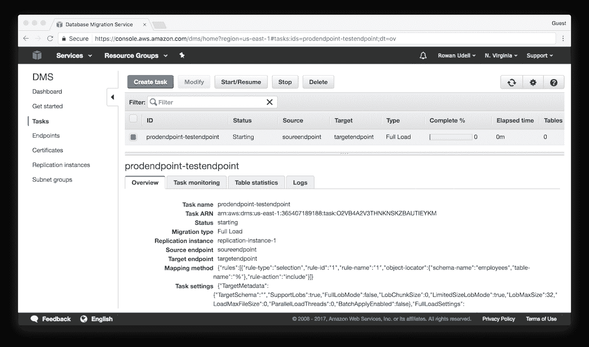

# 第六章：数据库服务

在本章中，我们将涵盖以下内容：

+   创建带自动故障切换的数据库

+   创建 NAT 网关

+   创建数据库只读副本

+   将只读副本提升为主数据库

+   创建一次性数据库备份

+   从快照恢复数据库

+   迁移数据库

+   计算 DynamoDB 性能

# 简介

持久化存储服务是有效使用 AWS 云服务管理系统的关键组成部分。通过确保拥有一个高度可用、容错的存储位置来保存应用状态，你可以不再依赖单个服务器来存储数据。

# 创建带自动故障切换的数据库

在这个食谱中，我们将创建一个配置为多可用区（multi-AZ）模式的 MySQL RDS 数据库实例，以便于自动故障切换。


带自动故障切换的数据库

# 准备工作

默认 VPC 对于本示例而言足够了。一旦你熟悉了创建数据库的操作，你可能会考虑使用包含私有子网的 VPC，将数据库与互联网及其他资源隔离开来（类似三层架构的风格）。无论如何，你需要记下以下信息：

+   VPC 的 ID

+   VPC 的 CIDR 范围

+   至少两个子网的 ID，这些子网需要位于不同的可用区，例如 `us-east-1a` 和 `us-east-1b`

# 如何操作…

创建一个新的 CloudFormation 模板。我们将向其中添加总共 12 个参数：

1.  前三个参数将包含我们在 *准备工作* 部分提到的值：

```
      VPCId: 
        Type: AWS::EC2::VPC::Id 
        Description: VPC where DB will launch 
      SubnetIds: 
        Type: List<AWS::EC2::Subnet::Id> 
        Description: Subnets where the DB will launch (pick at least 2) 
      SecurityGroupAllowCidr: 
        Type: String 
        Description: Allow this CIDR block to access the DB 
        Default: "172.30.0.0/16"

```

1.  我们还将添加数据库凭证作为参数。这是一个好习惯，因为这样意味着我们不会在基础设施源代码中存储任何凭证。请注意，密码包含 `NoEcho` 参数，并将其设置为 `true`。这可以防止 CloudFormation 在显示 CloudFormation 堆栈详情时输出密码：

```
      DBUsername: 
        Type: String 
        Description: Username to access the database 
        MinLength: 1 
        AllowedPattern: "[a-zA-Z][a-zA-Z0-9]*" 
        ConstraintDescription: must start with a letter, must
          be alphanumeric 
      DBPassword: 
        Type: String 
        Description: Password to access the database 
        MinLength: 1 
        AllowedPattern: "[a-zA-Z0-9]*" 
        NoEcho: true 
        ConstraintDescription: must be alphanumeric

```

1.  接下来的参数块涉及到成本和性能，它们应该大多数都是自解释的。如果你希望更改本示例的实例类型，请参考 AWS 文档中的数据库实例类型。我们为存储大小提供默认值 10 GB，并选择一个磁性（`standard`）卷作为存储类型。`gp2` 提供更好的性能，但价格稍高：

```
      DBInstanceClass: 
        Type: String 
        Description: The instance type to use for this database 
        Default: db.t2.micro 
      DBStorageAmount: 
        Type: Number 
        Description: Amount of storage to allocate (in GB) 
Default: 10 
      DBStorageType: 
        Type: String 
        Description: Type of storage volume to use
          (standard [magnetic] or gp2) 
        Default: standard 
        AllowedValues: 
          - standard 
          - gp2

```

1.  我们需要为数据库设置一些附加参数。这些包括 MySQL 引擎版本和端口。请参考 AWS 文档，查看所有可用的版本。我们为此参数设置了一个默认值，使用写作时的最新 MySQL 版本：

```
      DBEngineVersion: 
        Type: String 
        Description: DB engine version 
        Default: "5.7.11" 
      DBPort: 
        Type: Number 
        Description: Port number to allocate 
        Default: 3306 
        MinValue: 1150 
        MaxValue: 65535

```

1.  最后，我们将定义一些与备份和可用性相关的参数。我们希望我们的数据库在 *multi-AZ* 模式下运行，默认将此值设置为 `true`。我们还默认将备份保留期设置为 `1` 天；你可能希望选择一个更长的保留期。如果你将该值设置为 `0`，则备份将被禁用（不推荐！）：

```
      DBMultiAZ: 
        Type: String 
        Description: Should this DB be deployed in Multi-AZ configuration? 
        Default: true 
        AllowedValues: 
          - true 
          - false 
      DBBackupRetentionPeriod: 
        Type: Number 
        Description: How many days to keep backups (0 disables backups) 
        Default: 1 
        MinValue: 0 
        MaxValue: 35

```

1.  我们已经完成了此模板的参数定义，现在可以开始定义我们的 `Resources` 了。首先，我们需要一个安全组来容纳我们的数据库。这个安全组允许从我们定义的 CIDR 范围内访问数据库端口：

```
      ExampleDBSecurityGroup: 
        Type: AWS::EC2::SecurityGroup 
        Properties: 
          GroupDescription: Example security group for inbound access to DB 
          SecurityGroupIngress: 
            - IpProtocol: tcp 
              CidrIp: !Ref SecurityGroupAllowCidr 
              FromPort: !Ref DBPort 
              ToPort: !Ref DBPort 
          VpcId: !Ref VPCId

```

1.  接下来，我们需要定义一个 `DBSubnetGroup` 资源。该资源用于声明我们的数据库将位于哪些子网。我们为此资源定义了两个子网，这样主数据库和备用数据库就会分别位于不同的可用区：

```
      ExampleDBSubnetGroup: 
        Type: AWS::RDS::DBSubnetGroup 
        Properties: 
          DBSubnetGroupDescription: Example subnet group for example DB 
          SubnetIds: 
            - Fn::Select: [ 0, Ref: SubnetIds ] 
            - Fn::Select: [ 1, Ref: SubnetIds ]

```

1.  最后，我们定义我们的 RDS 实例资源。我们指定它为 MySQL 数据库，其他属性则由我们之前定义的参数和资源组成。在这里需要大量使用 `!Ref`：

```
      ExampleDBInstance: 
        Type: AWS::RDS::DBInstance 
        Properties: 
          AllocatedStorage: !Ref DBStorageAmount 
          BackupRetentionPeriod: !Ref DBBackupRetentionPeriod 
          DBInstanceClass: !Ref DBInstanceClass 
          DBSubnetGroupName: !Ref ExampleDBSubnetGroup 
          Engine: mysql 
          EngineVersion: !Ref DBEngineVersion 
          MasterUsername: !Ref DBUsername 
          MasterUserPassword: !Ref DBPassword 
          MultiAZ: !Ref DBMultiAZ 
          StorageType: !Ref DBStorageType 
          VPCSecurityGroups: 
            - !GetAtt ExampleDBSecurityGroup.GroupId

```

1.  为了更精确，我们可以在这个模板中添加一个输出项，用于返回此 RDS 数据库的主机名：

```
      Outputs: 
        ExampleDbHostname: 
          Value: !GetAtt ExampleDBInstance.Endpoint.Address

```

1.  你可以通过 CloudFormation Web 控制台配置数据库，或者像这样使用 CLI 命令：

```
      aws cloudformation create-stack \ 
        --stack-name rds1 \ 
        --template-body \
        file://06-create-database-with-automatic-failover.yaml \ 
        --parameters \ 
        ParameterKey=DBUsername,ParameterValue=<username> \ 
        ParameterKey=DBPassword,ParameterValue=<password>  \
        ParameterKey=SubnetIds,"ParameterValue='<subnet-id-a>, \
        <subnet-id-b>'" \ 
        ParameterKey=VPCId,ParameterValue=<vpc-id>

```

# 它是如何工作的…

在多可用区配置中，AWS 将在一个独立的可用区配置一个备用 MySQL 实例。对你的数据库的更改将以同步方式复制到备用数据库实例。如果主数据库出现问题，AWS 会自动切换到备用实例，将其提升为主数据库，并配置新的备用实例。

你无法直接查询备用数据库。所以，例如，你不能用它来处理所有的读取查询。如果你希望使用额外的数据库实例来增加读取能力，你需要配置一个*只读副本*。我们将在另一个实例中讨论这些内容。

备份将始终从备用实例中获取，这意味着不会中断数据库的可用性。如果你没有选择在多可用区模式下部署数据库，则情况不一样。

部署此示例时，堆栈报告完成大约需要 20 分钟或更长时间。这是因为 RDS 服务需要完成以下过程以便配置一个完全正常工作的多可用区数据库：

+   配置主数据库

+   备份主数据库

+   使用主数据库的备份配置备用数据库

+   配置两个数据库进行同步复制

警告

在开始向 RDS 配置写入数据后，请小心修改 RDS 配置，特别是当使用 CloudFormation 更新时。一些 RDS 配置变更要求重新配置数据库，这可能会导致数据丢失。我们建议使用 CloudFormation 变更集，这样你可以看到哪些更改可能会导致破坏性行为。CloudFormation RDS 文档也提供了相关信息。

# 还有更多内容...

+   你可以为 RDS 实例定义维护窗口。这个时间段是 AWS 执行维护任务（如安全补丁或小版本升级）的时间。如果你没有指定维护窗口（我们在这个示例中没有指定），则会为你选择一个。

# 创建一个 NAT 网关

除非必要，否则你的实例不应公开暴露到互联网。当你的实例处于互联网时，你必须假设它们在某个阶段会遭受攻击。

这意味着大多数工作负载应该运行在私有子网中的实例上。私有子网是指那些没有直接连接到互联网的子网。

为了让你的私有实例可以访问互联网，你需要使用**网络地址转换**（**NAT**）。NAT 网关允许你的实例发起到互联网的连接，而不允许来自互联网的连接。

# 准备工作

对于此示例，你必须拥有以下资源：

+   一个带有**互联网网关**（**IGW**）的 VPC

+   公共子网

+   一个私有子网路由表

你需要公共子网和私有子网路由表的 ID。两者应位于同一个可用区。

# 如何操作...

1.  从通常的 CloudFormation 模板版本和描述开始：

```
      AWSTemplateFormatVersion: "2010-09-09" 
      Description: Create NAT Gateway and associated route.

```

1.  模板必须包含以下必需的参数：

```
      Parameters: 
        PublicSubnetId: 
          Description: Public Subnet ID to add the NAT Gateway to 
          Type: AWS::EC2::Subnet::Id 
        RouteTableId: 
          Description: The private subnet route table to add the NAT
            Gateway route to 
          Type: String

```

1.  在 `Resources` 部分，定义将分配给 NAT 网关的弹性 IP：

```
      Resources: 
        EIP: 
          Type: AWS::EC2::EIP 
          Properties: 
            Domain: vpc

```

1.  创建 NAT 网关资源，并将你在公共子网中定义的 EIP 分配给它：

```
        NatGateway: 
          Type: AWS::EC2::NatGateway 
          Properties: 
            AllocationId: !GetAtt EIP.AllocationId 
            SubnetId: !Ref PublicSubnetId

```

1.  最后，定义到 NAT 网关的路由，并将其与私有子网的路由表关联：

```
      Route: 
        Type: AWS::EC2::Route 
        Properties: 
          RouteTableId: !Ref RouteTableId 
          DestinationCidrBlock: 0.0.0.0/0 
          NatGatewayId: !Ref NatGateway

```

# 它是如何工作的...

该示例所需的参数如下：

+   公共子网 ID

+   一个私有子网路由表 ID

公共子网 ID 用于托管 NAT 网关，因为它必须具有互联网访问权限。私有子网路由表将更新为指向 NAT 网关的路由。

使用 AWS NAT 网关服务意味着 AWS 会为你托管和保护该服务。该服务将冗余地托管在单个可用区中。

你可以多次使用该模板，在每个私有子网中部署 NAT 网关。只需确保公共子网和私有子网位于同一个可用区（AZ）。

为了应对可用区（AZ）停机的极不可能事件（虽然不太可能，但可能发生），你应在每个子网中部署一个 NAT 网关。这意味着，如果一个 NAT 网关下线，另一个可用区中的实例可以继续正常访问互联网。你*确实*在多个可用区中部署了你的应用，对吧？

此示例仅在你已创建自己的私有子网时有效，因为在新 AWS 账户中，默认的子网都是*公共的*。公共子网中的实例可以直接访问互联网（通过 IGW），因此不需要 NAT 网关。

# 另见

+   第七章中的*构建安全网络*示例，*网络*

# 创建数据库只读副本

本示例将展示如何创建一个 RDS 只读副本。你可以使用只读副本，通过将数据库读取任务分配给一个单独的数据库实例来提高应用的性能。每个源数据库最多可以配置五个只读副本。


只读数据库从库

# 准备工作

你需要一个启用了备份保留的 RDS 数据库。我们将基于前面的 *创建具有自动故障转移的数据库* 配方中的数据库进行构建。

你需要以下值：

+   源 RDS 实例的标识符，例如，`eexocwv5k5kv5z`

+   我们将要创建的读取副本的唯一标识符，例如，`read-replica-1`

# 如何操作...

在 AWS CLI 中，输入此命令：

```
aws rds create-db-instance-read-replica \
 --source-db-instance-identifier <source-db-identifier> \
 --db-instance-identifier <unique-identifier-for-replica>

```

# 它是如何工作的...

RDS 现在将为你创建一个新的读取副本。

有些参数是从源实例继承的，创建时无法定义：

+   存储引擎

+   存储大小

+   安全组

CLI 命令接受一些我们本可以定义的参数，但为了简化操作，我们没有定义这些参数。它们将从源数据库继承。主要的两个参数如下：

+   `--db-instance-class`：使用与源实例相同的实例类型

+   `--db-subnet-group-name`：将使用源实例的子网组，并随机选择一个子网（因此，随机选择一个可用区）

# 还有更多...

+   读取副本部署在单一的可用区内；没有备用读取副本。

+   在创建时无法在读取副本上启用备份功能。必须在创建之后进行配置。

+   默认存储类型为 `standard`（磁盘）。通过选择 `gp2` 或使用预置 IOPS，可以提高性能。

+   可以直接向读取副本添加 MySQL 索引，以进一步提高读取性能。这些索引在主数据库上不必存在。

+   将读取副本用于可用性目的更像是一种补充的灾难恢复策略，不能替代多可用区 RDS。多可用区配置为你提供故障检测和自动故障转移的好处。

+   可以将读取副本部署在完全不同的区域。

+   与主数据库和备用数据库之间的同步复制不同，读取副本的复制是异步的。这意味着读取副本可能会落后于主数据库。在向读取副本发送时间敏感的读取查询时，务必记住这一点。

# 将读取副本提升为主实例

我们将向你展示如何将 RDS 读取副本提升为主实例。你可能有几个理由这么做：

+   处理通常会导致大量停机时间的表迁移，尤其是在处理列或索引时

+   因为你需要实现分片

+   如果你选择不在多可用区模式下部署现有的主数据库（不推荐），则可以从故障中恢复

# 准备工作

你将需要唯一标识符，这已经分配给了 RDS 读取副本。如果你按照之前的 *创建具有自动故障转移的数据库* 和 *创建数据库读取副本* 配方操作，那么你应该已经准备好。

在提升之前，最好已经在该只读副本上启用了备份。这样可以缩短提升过程，因为您无需等待备份完成。您需要将备份保留期设置为 `1` 到 `8` 之间的值。

启用只读副本的备份将导致其重启！

为了启用备份，您可以使用以下 CLI 命令：

```
aws rds modify-db-instance \
 --db-instance-identifier <identifier-for-read-replica> \
 --backup-retention-period <days-to-keep-backups-for> \
 --apply-immediately

```

如果您希望等到重启发生在配置的维护窗口期间，您可以省略 `--apply-immediately` 参数。但您仍然需要等到重启完成后再继续进行提升操作。

为了确保在提升前拥有最新的数据，您需要停止当前源主数据库的所有写入流量。最好还要确保您的只读副本的复制延迟为 `0`（您可以在 CloudWatch 中检查此项）。

# 如何操作...

1.  运行以下命令将您的只读副本提升为主数据库实例。此命令将导致您的只读副本重启：

```
 aws rds promote-read-replica \
 --db-instance-identifier <identifier-for-read-replica>

```

1.  如果您希望继续配置新的主 RDS 实例以运行多可用区（multi-AZ）配置，那么您需要运行此额外的命令。预计该操作将需要一段时间才能完成：

```
 aws rds modify-db-instance \
 --db-instance-identifier <identifier-for-new-primary> \
 --multi-az \
 --apply-immediately

```

# 创建一次性数据库备份

现在我们将向您展示如何创建数据库的单次快照。如果您有特定的需求，需要保留数据库的某个时间点的备份，您可以选择执行此操作。您也可能希望创建一个快照，以便为您的数据集创建一个新的工作副本。

# 准备工作

为了继续操作，您将需要以下内容：

+   您希望备份的 RDS 实例的标识符

+   您希望分配给此快照的唯一标识符

快照标识符有一些限制：

+   它必须以字母开头

+   它不能超过 255 个字符

如果您的主数据库没有运行在多可用区配置中，请注意，创建快照将会导致停机。在多可用区配置中，快照是在备用实例上进行的，因此不会发生停机。

# 如何操作...

输入以下 AWS CLI 命令以启动快照的创建。您需要等待几分钟，直到快照完成，才能使用它：

```
aws rds create-db-snapshot \
 --db-instance-identifier <primary-rds-id> \
 --db-snapshot-identifier <unique-id-for-snapshot>

```

# 从快照恢复数据库

我们现在将讲解如何从快照恢复数据库。此过程会创建一个新数据库，该数据库将保留大部分源数据库的配置。

# 准备工作

您将需要以下信息：

+   您希望从中恢复的快照的 ID

+   您希望为我们即将创建的数据库指定的名称或标识符

AWS 不允许您账户中的 RDS 服务共享相同的标识符。如果源数据库仍在线，您需要确保选择一个不同的标识符（或者重命名源数据库）。

# 如何操作...

1.  输入以下命令：

```
 aws rds restore-db-instance-from-db-snapshot \
 --db-snapshot-identifier <name-of-snapshot-to-restore > \
 --db-instance-identifier <name-for-new-db> \
 --db-subnet-group-name <your-db-subnet-group> \
 --multi-az

```

1.  你可能已经注意到，这个命令会在默认安全组中创建一个新数据库。这是因为`restore-db-instance-from-db-snapshot`命令不接受安全组 ID 作为参数。你需要运行第二个命令来为新数据库分配非默认的安全组：

```
 aws rds modify-db-instance \
 --db-instance-identifier <name-of-newly-restored-db> \
 --vpc-security-group-ids <id-of-security-group>

```

除非目标数据库的状态为`available`，否则`modify-db-instance`命令会返回错误。

此外，安全组名称在此命令中无效；你需要使用安全组 ID，例如`sg-7603d50a`。

# 还有更多内容...

上一个命令包含了启用新数据库的多可用区（multi-AZ）选项。如果你希望新数据库仅运行在单可用区模式下，可以简单地去掉这个标志。

# 迁移数据库

在这个教程中，我们将使用**数据库迁移服务**（**DMS**）将外部数据库迁移到**关系型数据库服务**（**RDS**）。

与许多其他教程不同，本教程将通过 Web 控制台手动执行。

大多数数据库迁移都是一次性的，并且涉及许多步骤。我们建议你首先通过控制台手动执行该过程，之后如果需要，可以使用 AWS CLI 工具或 SDK 进行自动化操作。

# 准备中

对于这个教程，你需要以下内容：

+   一个外部数据库

+   一个 RDS 数据库实例

本示例中的源数据库名为**employees**，所以请根据需要替换为自己的数据库名称。

两个数据库必须能够从将要创建的复制实例访问。最简单的方法是允许数据库从互联网访问，但显然这会带来安全隐患。

# 如何操作...

1.  进入 DMS 控制台：


1.  点击“创建迁移”以启动迁移向导：


1.  指定复制实例的详细信息。除非你有特定的 VPC 配置，否则默认设置就足够了：


1.  在等待复制实例准备好时，填写源端点和目标端点的信息，包括服务器主机名、端口以及连接时使用的用户名和密码：


1.  一旦实例准备好，界面会更新，你可以继续操作：


1.  为了确认并创建源端点和目标端点，点击每个数据库的“运行测试”按钮：


1.  在成功测试并创建端点后，定义你的任务。在本教程中，我们将简单地迁移数据（不进行持续复制）：


1.  为简化操作，在目标数据库中删除表（目标数据库应该为空）以确保两数据库之间的一致性：


1.  最后，定义源数据库和目标数据库之间的映射关系。在本教程中，我们将迁移源数据库中所有表（通过使用通配符`%`）：


1.  一旦你点击“添加选择规则”，你将看到规则出现在选择规则列表中：


1.  一旦任务定义完成，你就完成了向导。然后你将看到任务正在创建：


1.  一旦任务的状态为“准备就绪”，你可以选择它并点击“开始/恢复”按钮：



1.  完成后，你将在控制台中看到任务的详细信息已更新：


# 它是如何工作的……

从高层次来看，DMS 架构大致如下所示：


**源**数据库和**目标**数据库都位于**DMS**之外。它们在内部由端点资源表示，端点资源是数据库的引用。如果需要，端点可以在不同任务之间复用。

本教程从定义复制实例的详细信息开始。请记住，当两个数据库之间的迁移/转换保持*内存中*时，DMS 迁移过程效果最佳。这意味着对于较大的任务，你应该分配更强大的实例。如果过程需要暂时将数据写入磁盘（如交换分区），则性能和吞吐量将会大大降低。这可能会产生连锁反应，特别是对于包含持续复制的任务。

接下来，定义这两个端点。通过使用内置的测试功能验证端点配置非常重要，以确保任务在后续过程中不会失败。通常，如果连接性测试失败，可能是以下两个主要问题之一：

+   复制实例与数据库之间的网络连接问题。这对本地部署的数据库尤其重要，因为这些数据库通常会特别限制外部访问。

+   用户权限问题：例如，在 MySQL 的情况下，不能使用 root 用户进行外部数据库连接，因此无法使用该默认用户。

定义任务时需要定义迁移类型。本教程使用了最简单的类型：迁移表。这意味着数据将被复制到两个数据库之间，当数据传播完毕时任务就完成了。我们还可以定义目标数据库上的行为。为了简便起见，我们将任务配置为删除目标数据库中的表，以确保两个数据库尽可能相似，即使表名被更改或表映射发生变化。对于任务表映射，我们使用通配符符号 `%` 来匹配源数据库中的所有表。显然，如果只想匹配部分数据，你也可以更加精确地选择。

一旦定义了复制实例、端点和任务，向导就结束了，你将返回到 DMS 控制台。任务创建完成后，可以启动任务。

由于这是一个*迁移现有数据类型*的任务，当所有数据传播到目标数据库时，它将完成。

# 还有更多……

这显然是 DMS 能做的一个简单示例。还有其他功能和性能方面，您应在更复杂的场景中考虑。

# 数据库引擎

虽然这个例子使用了两个 MySQL 数据库，但也可以从一个数据库引擎迁移到另一个完整的数据库引擎，例如，从 Oracle 到 MySQL。不幸的是，这可能是一个复杂的过程，尽管这个功能非常有用，但超出了本食谱的范围。由于各种引擎之间的差异，您在迁移和转换过程中会遇到一些限制。

请参阅 *AWS Schema Conversion Tool* 文档，了解不同数据库引擎之间可以迁移的内容。

# 持续复制

还有一些关于数据持续传播的限制——只能迁移表数据，索引、用户和权限等无法持续复制。

# 多可用区（Multi-AZ）

对于持续复制任务，您可能希望创建一个多可用区的复制实例，以便将服务中断的影响降到最低。显然，您需要拥有一个配置相似的（如多可用区）RDS 实例作为目标，以充分获得其好处！

为了获得最佳性能，在设置复制实例时，您应确保其与目标 RDS 实例位于 *相同的* 可用区。

# 计算 DynamoDB 性能

**DynamoDB**（**DDB**）是 AWS 提供的托管 NoSQL 数据库服务。

由于 DDB 定价基于已配置的读写容量单位数量，因此能够计算出您用例的需求是很重要的。

本食谱使用书面公式来估算应分配给 DDB 表的 **读取容量单位**（**RCU**）和 **写入容量单位**（**WCU**）。

同样重要的是要记住，虽然新的分区会自动添加到 DDB 表中，但不能自动删除。这意味着过度的分区会对性能产生长期影响，因此您需要对此保持警惕。

# 准备工作

所有这些计算都假设您已经为您的数据选择了一个合适的分区键。一个好的分区键确保以下几点：

+   数据均匀分布在所有可用的分区中

+   读写活动在时间上均匀分布

不幸的是，选择一个好的分区键非常依赖于数据，且超出了本食谱的范围。

假设所有读取操作都是强一致性的。

# 如何操作...

1.  从项目的大小开始，单位为 **千字节**（**KB**）：

*ItemSize = 项目（行）大小，以 KB 为单位*

1.  通过将数字除以 *4* 并向上取整，计算所需的 RCU 数量：

*每项 RCPU = 项目大小 / 4（向上取整）*

1.  定义每秒预期的读取操作次数。这是您用来配置表格的其中一个数字：

*所需 RCPU = 预期读取次数 * 每项 RCPU*

1.  将数字除以 *3,000* 来计算所需的 DDB 分区数量以达到容量：

*读取分区 = 所需 RCPU / 3,000*

1.  接下来，通过将项大小除以*1*并向上取整，计算所需的写入容量：

*每项 WCPU = 项大小 / 1（向上取整）*

1.  定义每秒预期的写入操作数。这是您用于配置表时需要使用的数字之一：

*所需 WCPU = 预期写入数量 * 每项 WCPU*

1.  将数字除以*1,000*以计算所需的 DDB 分区数量以达到容量：

*写入分区 = 所需 WCPU / 1,000*

1.  将这两个值相加，得到所需的容量分区（向上取整到整数）：

*容量分区 = 读取分区 + 写入分区（向上取整）*

1.  根据您计划存储的数据量计算所需的最小分区数：

*大小分区 = 总大小（GB）/ 10（向上取整）*

1.  一旦您确定了针对您的用例的分区需求，请取出您之前计算中的最大值：

*所需分区 = 容量分区与大小分区中的最大值*

1.  由于您的分配容量在各个分区之间平均分配，请将 RCU 和 WCU 值进行除法运算，以获得每个分区的表性能：

*分区读取吞吐量 = 所需 RCPU / 所需分区*

*分区写入吞吐量 = 所需 WCPU / 所需分区*

# 工作原理...

在后台，DDB 吞吐量由分配给您的表的分区数量控制。考虑到您的数据将如何分布在这些分区中非常重要，以确保您获得预期的性能*并支付了相应的费用*。

我们通过计算数据库中项的大小开始此步骤，以便用于吞吐量计算。DDB 有一个最小考虑大小，即使操作使用的大小小于此值，也会按照分配的吞吐量向上取整。最小大小取决于操作类型：

+   读取操作按 4 KB 的块计算

+   写入操作按 1 KB 的块计算

然后，我们根据预期的操作数量计算所需的 RCPU 和 WCPU。这些值可以用于配置 DDB 表，因为它们代表了在最佳条件下所需的最小吞吐量。

一旦您获得了这些值，您可以使用它们来配置您的表。

接下来，我们计算每个分区键的吞吐量。这些计算依赖于了解每个分区的预期性能。数字 3,000（用于 RCU）和 1,000（用于 WCU）代表单个 DDB 分区的容量。通过以分区性能（读取和写入）来表示容量，并将它们加在一起，我们可以得到从容量角度来看所需的最小分区数。

然后，我们对总数据大小进行相同的计算。每个 DDB 分区最多可以处理 10 GB 的数据。超过这个大小的数据需要在多个分区之间拆分。

分区容量（包括读取、写入和大小）的具体数值已经稳定了一段时间，但未来可能会发生变化。请仔细检查当前值是否与此处使用的值相同，以确保完全准确。

一旦我们确定了容量和大小的最小分区数，我们将选择其中的最大值并以此为基础。这可以确保我们满足容量和大小的要求。

最后，我们将配置的容量除以分区数。这将为我们提供每个分区键的吞吐量性能，我们可以用它来与我们的用例进行确认。

# 还有更多...

使用 DDB 时有许多细节需要注意。以下是一些更重要/有影响力的事项。

# 突发容量

对于超出分配容量的表格，提供了一定的突发容量。未使用的读写容量可以保留最多五分钟（例如，300 秒，计算时使用）。依赖这种容量并不是一种好的做法，未来某个阶段无疑会导致问题。

# 指标

DDB 表格会自动将数据发送到 CloudWatch 指标。这是确认计算和配置容量是否满足需求的最快和最简单的方法。它还帮助你监控使用情况，跟踪随着时间推移的吞吐量需求。所有指标都显示在*AWS/DynamoDB*命名空间下。以下是一些用于吞吐量计算的有趣指标：

+   `ConsumedReadCapacityUnits`

+   `ConsumedWriteCapacityUnits`

+   `ReadThrottleEvents`

+   `WriteThrottleEvents`

还有其他可用的指标；有关更多详细信息，请参见*Amazon DynamoDB Metrics and Dimensions*文档。

# 最终一致性读取

使用最终一致性读取（与强一致性读取相对）*将计算所需的 RCU 要求减少一半*。在这个例子中，我们使用了强一致性读取，因为它适用于所有工作负载，但你应该确认你的用例是否真的需要它。如果不需要，使用最终一致性读取。

通过减少所需的读取配置容量，你可以有效降低使用 DDB 的*成本*。
