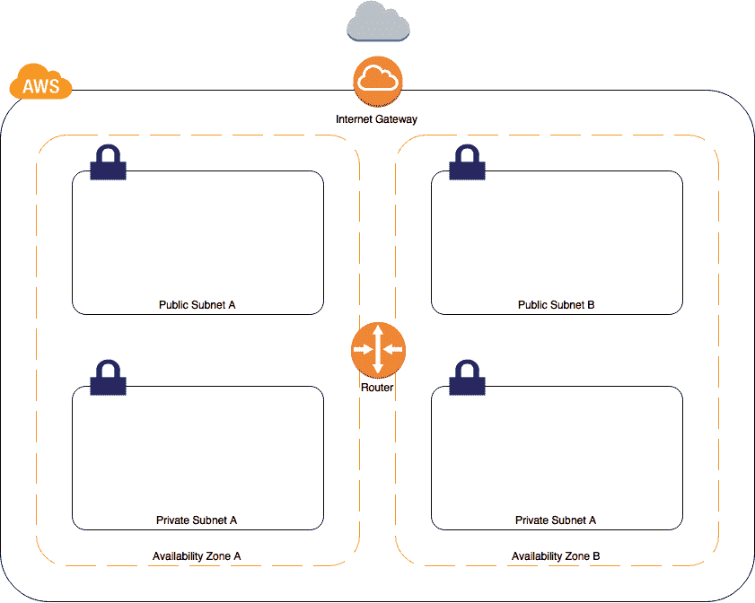
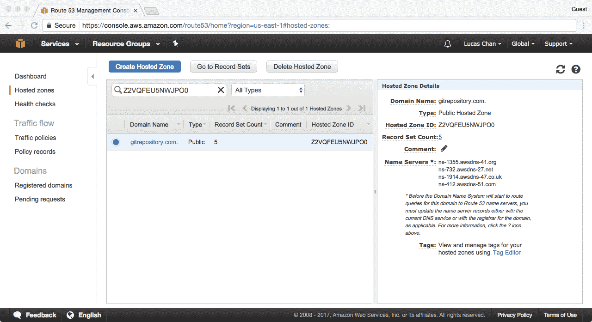
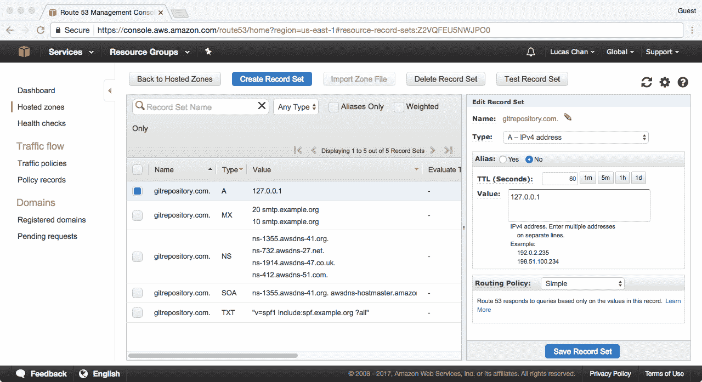
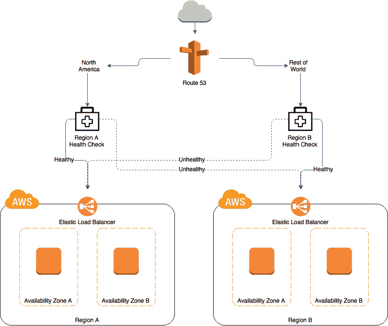
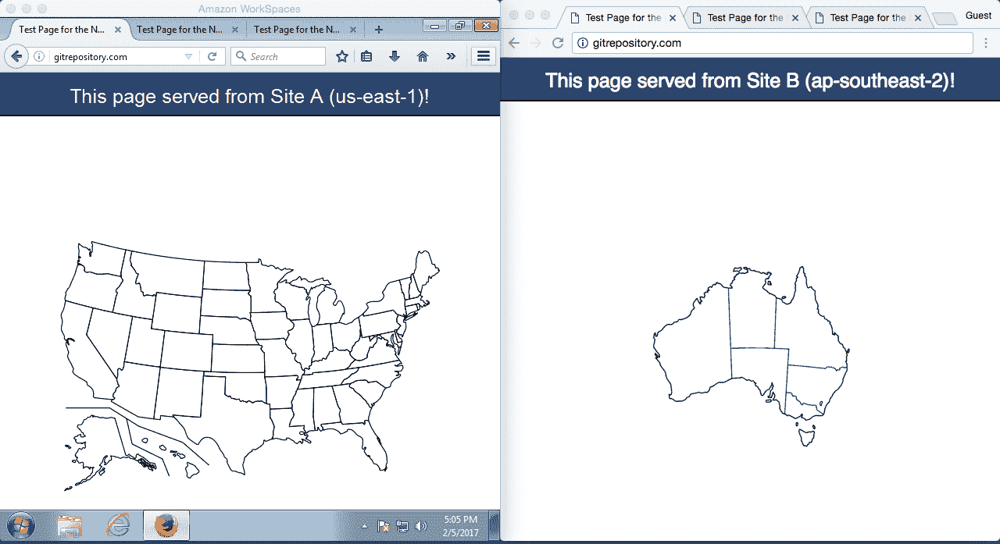
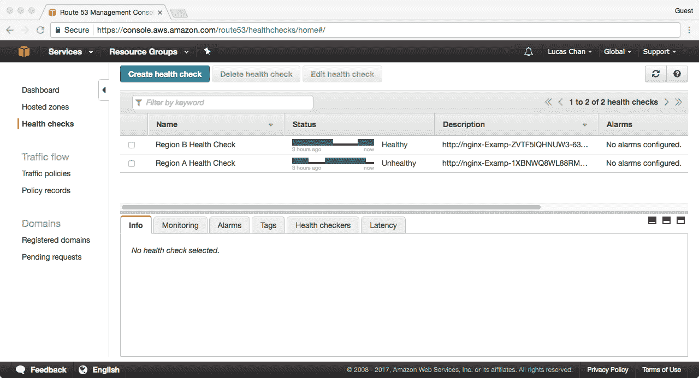
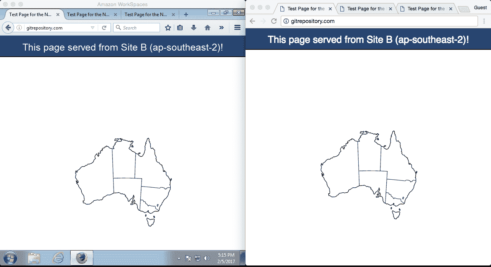
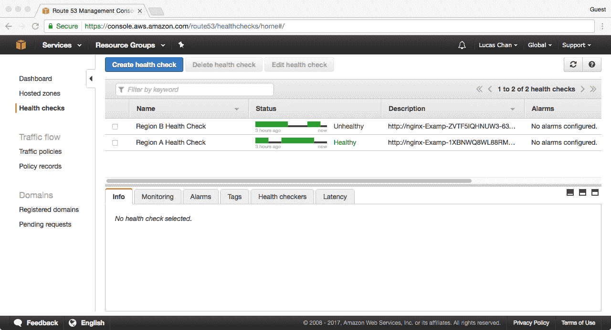
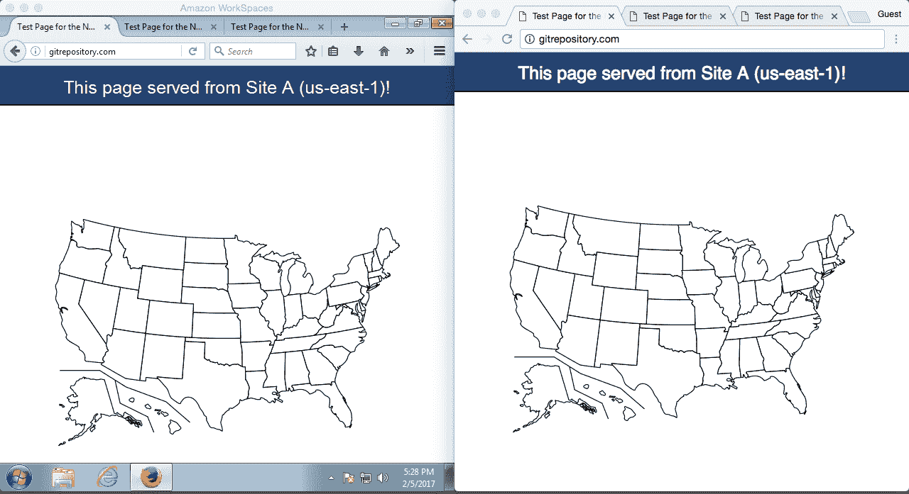

# 网络

在本章中，我们将涵盖以下内容：

+   构建一个安全的网络

+   创建 NAT 网关

+   通过 DNS 进行金丝雀部署

+   托管一个域

+   基于位置的路由与故障转移

+   网络日志记录与故障排除

# 介绍

网络是使用其他 AWS 服务（如 EC2、RDS 等）的基础组件。使用 VPC 和 NAT 网关等构造可以使你有能力并自信地在网络层面保护你的资源。在 DNS 层面，Route 53 为你的用户提供响应迅速且容错性强的连接，确保在多种场景下提供最佳性能。

# 构建一个安全的网络

在这个实例中，我们将在 AWS 中构建一个安全的网络（VPC）。该网络将包含两个公共子网和两个私有子网，分布在两个可用区中。它还将允许外部连接到公共子网，具体包括：

+   SSH（端口`22`）

+   HTTP（端口`80`）

+   HTTPS（端口`443`）



构建一个安全的网络

# 准备工作

在继续之前，你需要了解我们要部署的区域至少有两个可用区的名称。本书中的实例通常会部署到`us-east-`区域，所以为了方便，你可以直接使用以下内容：

+   `us-east-1a`

+   `us-east-1b`

当你创建一个 AWS 账户时，你的可用区是随机分配的。这意味着，你账户中的`us-east-1a`不一定与我账户中的`us-east-1a`是同一个数据中心。

# 如何实现...

继续创建一个新的 CloudFormation 模板用于我们的 VPC。提醒一下：这是我们在本书中创建的较大的模板之一：

1.  前两个`Parameters`对应我们之前讨论的可用区。我们没有为这些参数提供默认值，以保持区域的可移植性：

```
      Parameters:
        AvailabilityZone1: 
          Description: Availability zone 1 name (e.g. us-east-1a) 
          Type: AWS::EC2::AvailabilityZone::Name 
        AvailabilityZone2: 
          Description: Availability zone 2 name (e.g. us-east-1b) 
          Type: AWS::EC2::AvailabilityZone::Name

```

1.  我们的 VPC 框架已经创建完成。此时，它还没有连接到互联网，因此对我们来说并不完全有用。我们需要添加一个互联网网关，并将其附加到我们的 VPC 上。接下来，按以下步骤操作：

```
      Resources: 
        # VPC & subnets 
        ExampleVPC: 
          Type: AWS::EC2::VPC 
          Properties: 
            CidrBlock: !Ref VPCCIDR 
            EnableDnsSupport: true 
            EnableDnsHostnames: true 
          Tags: 
            - { Key: Name, Value: Example VPC } 
        PublicSubnetA: 
          Type: AWS::EC2::Subnet 
          Properties: 
            AvailabilityZone: !Ref AvailabilityZone1 
            CidrBlock: !Ref PublicSubnetACIDR 
            MapPublicIpOnLaunch: true 
            VpcId: !Ref ExampleVPC 
          Tags: 
            - { Key: Name, Value: Public Subnet A } 
        PublicSubnetB: 
          Type: AWS::EC2::Subnet 
          Properties: 
            AvailabilityZone: !Ref AvailabilityZone2 
            CidrBlock: !Ref PublicSubnetBCIDR 
            MapPublicIpOnLaunch: true 
            VpcId: !Ref ExampleVPC 
          Tags: 
            - { Key: Name, Value: Public Subnet B } 
        PrivateSubnetA: 
          Type: AWS::EC2::Subnet 
          Properties: 
            AvailabilityZone: !Ref AvailabilityZone1 
            CidrBlock: !Ref PrivateSubnetACIDR 
            VpcId: !Ref ExampleVPC 
          Tags: 
            - { Key: Name, Value: Private Subnet A } 
        PrivateSubnetB: 
          Type: AWS::EC2::Subnet 
          Properties: 
            AvailabilityZone: !Ref AvailabilityZone2 
            CidrBlock: !Ref PrivateSubnetBCIDR 
            VpcId: !Ref ExampleVPC 
          Tags: 
            - { Key: Name, Value: Private Subnet B }

```

1.  剩余的`Parameters`定义了以下内容的 IP 地址范围：

    +   整个 VPC

    +   公共子网（A 和 B）

    +   私有子网（A 和 B）

1.  我们为子网提供的默认值将为每个子网分配 512 个 IP 地址：

AWS 会在你的 IP 空间中保留少量 IP 地址，用于 AWS 专用服务。VPC 的 DNS 服务器就是一个例子。它通常位于分配给你 VPC 的 IP 块中的第二个（`*.2`）IP 地址。

```
      VPCCIDR: 
        Description: CIDR block for VPC 
        Type: String 
        Default: "172.31.0.0/21" # 2048 IP addresses 
      PublicSubnetACIDR: 
        Description: CIDR block for public subnet A 
        Type: String 
        Default: "172.31.0.0/23" # 512 IP address 
      PublicSubnetBCIDR: 
        Description: CIDR block for public subnet B 
        Type: String 
        Default: "172.31.2.0/23" # 512 IP address 
      PrivateSubnetACIDR: 
        Description: CIDR block for private subnet A 
        Type: String 
        Default: "172.31.4.0/23" # 512 IP address 
      PrivateSubnetBCIDR: 
        Description: CIDR block for private subnet B 
        Type: String 
        Default: "172.31.6.0/23" # 512 IP address

```

1.  现在我们可以开始定义`Resources`。我们将首先定义 VPC 本身，以及其中的两个公共子网和两个私有子网：

```
        # Internet Gateway 
        ExampleIGW: 
          Type: AWS::EC2::InternetGateway 
          Properties: 
            Tags: 
              - { Key: Name, Value: Example Internet Gateway } 
        IGWAttachment: 
          Type: AWS::EC2::VPCGatewayAttachment 
          DependsOn: ExampleIGW 
          Properties: 
            VpcId: !Ref ExampleVPC 
            InternetGatewayId: !Ref ExampleIGW

```

1.  我们需要创建几个路由表。我们将首先关注的是公共路由表。我们会将这个路由表分配给我们创建的两个公共子网。该路由表将仅包含一条路由，用于将所有互联网流量导向我们在上一步中创建的互联网网关：

```
        # Public Route Table 
        # Add a route for Internet bound traffic pointing to our IGW 
        # A route for VPC bound traffic will automatically be added 
        PublicRouteTable: 
          Type: AWS::EC2::RouteTable 
          Properties: 
            VpcId: !Ref ExampleVPC 
            Tags: 
              - { Key: Name, Value: Public Route Table } 
        PublicInternetRoute: 
          Type: AWS::EC2::Route 
          DependsOn: IGWAttachment 
          Properties: 
            RouteTableId: !Ref PublicRouteTable 
            GatewayId: !Ref ExampleIGW 
            DestinationCidrBlock: "0.0.0.0/0" 
        RouteAssociationPublicA: 
          Type: AWS::EC2::SubnetRouteTableAssociation 
          Properties: 
            RouteTableId: !Ref PublicRouteTable 
            SubnetId: !Ref PublicSubnetA 
        RouteAssociationPublicB: 
          Type: AWS::EC2::SubnetRouteTableAssociation 
          Properties: 
            RouteTableId: !Ref PublicRouteTable 
            SubnetId: !Ref PublicSubnetB

```

1.  我们将以类似的方式创建私有路由表。由于私有子网与互联网隔离，我们不会添加通往互联网网关的路由。请注意，如果你按照本书中的 NAT 网关配方操作，它将需要一个路由表作为输入参数——这是你想要为 NAT 路由添加的路由表：

```
        # Private Route Table 
        # We don't add any entries to this route table because there is
          no NAT gateway 
        # However a route for VPC bound traffic will automatically be added 
        PrivateRouteTable: 
          Type: AWS::EC2::RouteTable 
          Properties: 
            VpcId: !Ref ExampleVPC 
            Tags: 
              - { Key: Name, Value: Private Route Table } 
        PrivateSubnetAssociationA: 
          Type: AWS::EC2::SubnetRouteTableAssociation 
          Properties: 
            RouteTableId: !Ref PrivateRouteTable 
            SubnetId: !Ref PrivateSubnetA 
        PrivateSubnetAssociationB: 
          Type: AWS::EC2::SubnetRouteTableAssociation 
          Properties: 
            RouteTableId: !Ref PrivateRouteTable 
            SubnetId: !Ref PrivateSubnetB

```

1.  现在我们可以关注网络的安全方面了。让我们集中注意公有子网。这些子网将用于添加负载均衡器；你还将添加堡垒主机和 NAT 网关等内容。因此，我们需要添加一个 **网络 ACL**（**NACL**），并包含多个条目：

    +   允许向所有端口发送出站流量。我们公有子网中的主机可以无限制地进行出站访问。

    +   允许对临时端口（大于 `1024`）的入站流量。这确保了从我们的出站连接返回的包不会被丢弃。

    +   允许向低端口号提供入站访问，支持 SSH、HTTP 和 HTTPS（`22`、`80` 和 `443`）：

```
              # Public NACL 
              PublicNACL: 
                Type: AWS::EC2::NetworkAcl 
                Properties: 
                  VpcId: !Ref ExampleVPC 
                  Tags: 
                    - { Key: Name, Value: Example Public NACL } 
              # Allow outbound to everywhere 
              NACLRulePublicEgressAllowAll: 
                Type: AWS::EC2::NetworkAclEntry 
                Properties: 
                  CidrBlock: "0.0.0.0/0" 
                  Egress: true 
                  Protocol: 6 
                  PortRange: { From: 1, To: 65535 } 
                  RuleAction: allow 
                  RuleNumber: 100 
                  NetworkAclId: !Ref PublicNACL 
              # Allow outbound to VPC on all protocols 
              NACLRulePublicEgressAllowAllToVPC: 
                Type: AWS::EC2::NetworkAclEntry 
                Properties: 
                  CidrBlock: !Ref VPCCIDR 
                  Egress: true 
                  Protocol: -1 
                  RuleAction: allow 
                  RuleNumber: 200 
                  NetworkAclId: !Ref PublicNACL 
              # Allow inbound from everywhere to ephemeral ports
                (above 1024) 
              NACLRulePublicIngressAllowEphemeral: 
                Type: AWS::EC2::NetworkAclEntry 
                Properties: 
                  CidrBlock: "0.0.0.0/0" 
                  Protocol: 6 
                  PortRange: { From: 1024, To: 65535 } 
                  RuleAction: allow 
                  RuleNumber: 100 
                  NetworkAclId: !Ref PublicNACL 
              # Allow inbound from everywhere on port 22 for SSH 
              NACLRulePublicIngressAllowSSH: 
                Type: AWS::EC2::NetworkAclEntry 
                Properties: 
                  CidrBlock: "0.0.0.0/0" 
                  Protocol: 6 
                  PortRange: { From: 22, To: 22 } 
                  RuleAction: allow 
                  RuleNumber: 200 
                  NetworkAclId: !Ref PublicNACL 
              # Allow inbound from everywhere on port 443 for HTTPS 
              NACLRulePublicIngressAllowHTTPS: 
                Type: AWS::EC2::NetworkAclEntry 
                Properties: 
                  CidrBlock: "0.0.0.0/0" 
                  Protocol: 6 
                  PortRange: { From: 443, To: 443 } 
                  RuleAction: allow 
                  RuleNumber: 300 
                  NetworkAclId: !Ref PublicNACL 
              # Allow inbound from everywhere on port 80 for HTTP 
              NACLRulePublicIngressAllowHTTP: 
                Type: AWS::EC2::NetworkAclEntry 
                Properties: 
                  CidrBlock: "0.0.0.0/0" 
                  Protocol: 6 
                  PortRange: { From: 80, To: 80 } 
                  RuleAction: allow 
                  RuleNumber: 400 
                  NetworkAclId: !Ref PublicNACL 
              # Allow inbound from VPC on all protocols 
              NACLRulePublicIngressAllowFromVPC: 
                Type: AWS::EC2::NetworkAclEntry 
                Properties: 
                  CidrBlock: !Ref VPCCIDR 
                  Protocol: -1 
                  RuleAction: allow 
                  RuleNumber: 500 
                  NetworkAclId: !Ref PublicNACL 
              NACLAssociationPublicSubnetA: 
                Type: AWS::EC2::SubnetNetworkAclAssociation 
                Properties: 
                  NetworkAclId: !Ref PublicNACL 
                  SubnetId: !Ref PublicSubnetA 
              NACLAssociationPublicSubnetB: 
                Type: AWS::EC2::SubnetNetworkAclAssociation 
                Properties: 
                  NetworkAclId: !Ref PublicNACL 
                  SubnetId: !Ref PublicSubnetB

```

1.  我们也需要对私有子网做同样的事情。这些子网相对容易处理。它们应该 *仅* 允许与我们 VPC 内的主机通信，因此我们只需要添加一些 NACL，允许向我们的 VPC IP 范围发送入站和出站流量：

```
      # Private NACL 
      PrivateNACL: 
        Type: AWS::EC2::NetworkAcl 
        Properties: 
          VpcId: !Ref ExampleVPC 
          Tags: 
            - { Key: Name, Value: Example Private NACL } 
      # Allow all protocols from VPC range 
      NACLRulePrivateIngressAllowVPC: 
        Type: AWS::EC2::NetworkAclEntry 
        Properties: 
          CidrBlock: !Ref VPCCIDR 
          Protocol: -1 
          RuleAction: allow 
          RuleNumber: 100 
          NetworkAclId: !Ref PrivateNACL 
      # Allow TCP responses from everywhere 
      NACLRulePrivateIngressAllowEphemeral: 
        Type: AWS::EC2::NetworkAclEntry 
        Properties: 
          CidrBlock: "0.0.0.0/0" 
          Protocol: 6 
          PortRange: { From: 1024, To: 65535 } 
          RuleAction: allow 
          RuleNumber: 200 
          NetworkAclId: !Ref PrivateNACL 
      # Allow outbound traffic to everywhere, all protocols 
      NACLRulePrivateEgressAllowVPC: 
        Type: AWS::EC2::NetworkAclEntry 
        Properties: 
          CidrBlock: "0.0.0.0/0" 
          Egress: true 
          Protocol: -1 
          RuleAction: allow 
          RuleNumber: 100 
          NetworkAclId: !Ref PrivateNACL 
      NACLAssociationPrivateSubnetA: 
        Type: AWS::EC2::SubnetNetworkAclAssociation 
        Properties: 
          NetworkAclId: !Ref PrivateNACL 
          SubnetId: !Ref PrivateSubnetA 
      NACLAssociationPrivateSubnetB: 
        Type: AWS::EC2::SubnetNetworkAclAssociation 
        Properties: 
          NetworkAclId: !Ref PrivateNACL 
          SubnetId: !Ref PrivateSubnetB

```

1.  最后，我们将向模板中添加一些 `Outputs`。这些输出通常是作为其他模板或自动化组件的输入：

```
      Outputs: 
        ExampleVPC: 
          Value: !Ref ExampleVPC 
        PublicSubnetA: 
          Value: !Ref PublicSubnetA 
        PublicSubnetB: 
          Value: !Ref PublicSubnetB 
        PrivateRouteTable: 
          Value: !Ref PrivateRouteTable 
        PublicRouteTable: 
          Value: !Ref PublicRouteTable 
        PrivateSubnetA: 
          Value: !Ref PrivateSubnetA 
        PrivateSubnetB: 
          Value: !Ref PrivateSubnetB

```

1.  你可以通过 Web 控制台或使用以下命令通过 CLI 创建 VPC：

```
 aws cloudformation create-stack \
 --stack-name secure-vpc \
 --template-body file://07-building-a-secure-network.yaml \
 --parameters \
 ParameterKey=AvailabilityZone1,ParameterValue=<az-1> \
 ParameterKey=AvailabilityZone2,ParameterValue=<az-2>

```

# 它是如何工作的……

当你运行这个模板时，AWS 将为你创建一个隔离的、安全的网络。尽管它包含许多网络管理员熟悉的资源和概念，但它本质上是一个空壳，你现在可以开始填充它。

例如，每个 VPC 都包含一个虚拟路由器。你看不见它，也无法登录到它进行任何特殊配置，但你可以通过修改此模板中的路由表来定制它的行为。

我们部署的 NACL 是无状态的，*不*应视为安全组的替代品。NACL 是对安全组的 *补充*，安全组是有状态的，实际上比 NACL 更容易更改和管理。虽然我们配方中的 NACL 允许所有地方（`0.0.0.0/0`）连接到端口 `22`，但你可能希望使用安全组将其限制为特定的 IP 范围（例如，你的公司数据中心）。

# 还有更多……

事实上，实际上还有 *很多* 内容。尽管本配方中有大量的代码，但我们真正只涉及了 VPC 和 AWS 网络中可能的基础内容。以下是你在使用 VPC 时将遇到的一些主要 VPC 主题：

+   **Direct Connect**：这是一种通过专用的、独立的通道将你的 DC 连接到 VPC 的方法。这样做通常可以提供更好的网络性能，并且可能比通过互联网的 VPN 连接更便宜。

+   **虚拟专用网关**（**VPN**）：你可以配置你的 VPC 通过 VPN 连接到企业数据中心。这需要你在数据中心运行支持的 VPN 硬件。

+   IPv6 支持最近已添加。我们为简化起见没有包含它。

+   **VPC 端点**：此功能在你的 VPC 内暴露 AWS 端点，这样你就无需通过公共互联网路由流量来访问它们。写作时只支持 S3。

+   **VPC 对等连接**：你可以将一个 VPC 与一个或多个 VPC 进行对等连接，以便（未加密的）流量可以在它们之间流动。IP 范围不能冲突，虽然对等连接是免费的，但你仍然需要为 VPC 之间的流量付费。不支持传递对等连接，因此如果需要流量穿越多个 VPC，你将需要 VPN/路由设备。支持跨账户的 VPC 对等连接（我们经常使用此功能），但跨区域对等连接尚不可用。

+   **VPC 尺寸**：

    +   IPv4：你可以部署介于 /28 和 /16 之间的网络。

    +   IPv6：你的 VPC 的大小将固定为 /56。

    +   一旦你的 VPC 部署完成，你无法更改其大小。如果 IP 空间用尽，你唯一的选择是部署一个更大的 VPC 并迁移所有内容（哎！），或者你可以通过 VPC 对等连接来缓解这个问题。

+   **VPC 流日志**：你需要启用 VPC 流日志，以便监控流量并进行任何形式的网络调试。

+   不支持多播流量。

+   子网必须位于单一的可用区内；它们不能跨越可用区。

+   **弹性负载均衡器**（**ELBs**）如果你通过它们发送大量流量，可以扩展使用大量私有 IP 地址。设计子网时请记住这一点。

+   每个账户每个区域可部署的 VPC 数量限制为五个。如果有必要，你可以申请增加此限制。互联网网关也有相同的限制，增加一个限制会增加另一个限制。

+   *默认* VPC：

    +   首先，默认 VPC 会在你创建账户时自动创建。它具有一些与您自己创建的 VPC 不同的属性和行为。

    +   如果你在启动 EC2 实例时没有指定子网 ID，AWS 会尝试将其启动在默认 VPC 中。

    +   它只包含公共子网。这些子网默认配置为为所有实例提供公共 IP 地址。

    +   可以删除区域中的默认 VPC。如果你不小心删除了它，或者决定撤销此操作，你需要向 AWS 提交支持票，要求他们为你创建一个新的 VPC。

# 另见...

+   *创建 NAT 网关* 配方

# 创建 NAT 网关

除非有特殊需求，否则你的实例不应该直接暴露给互联网。当你的实例连接到互联网时，你必须假设它们在某个阶段会受到攻击。

这意味着大多数工作负载应该在私有子网中的实例上运行。私有子网是那些没有直接连接到互联网的子网。

为了让你的私有实例访问互联网，你需要使用**网络地址转换**（**NAT**）。NAT 网关允许你的实例发起到互联网的连接，但不允许互联网发起连接。

# 准备工作

对于这个方案，你必须拥有以下现有资源：

+   一个带**互联网网关**（**IGW**）的 VPC

+   一个公共子网

+   一个私有子网路由表

你将需要公共子网和私有子网路由表的 ID。这两个资源应该位于同一可用区（AZ）。

# 如何操作……

1.  从常规的 CloudFormation 模板版本和描述开始：

```
      AWSTemplateFormatVersion: "2010-09-09" 
      Description: Create NAT Gateway and associated route.

```

1.  模板必须包含以下必需的参数：

```
      Parameters: 
        PublicSubnetId: 
          Description: Public Subnet ID to add the NAT Gateway to 
          Type: AWS::EC2::Subnet::Id 
        RouteTableId: 
          Description: The private subnet route table to add the NAT
          Gateway route to 
          Type: String

```

1.  在`Resources`部分，定义一个将分配给 NAT 网关的**弹性 IP**（**EIP**）：

```
      Resources: 
        EIP: 
          Type: AWS::EC2::EIP 
          Properties: 
            Domain: vpc

```

1.  创建 NAT 网关资源，并将你刚才在公共子网中定义的 EIP 分配给它：

```
      NatGateway: 
        Type: AWS::EC2::NatGateway 
        Properties: 
          AllocationId: !GetAtt EIP.AllocationId 
          SubnetId: !Ref PublicSubnetId

```

1.  最后，定义到 NAT 网关的路由，并将其与私有子网的路由表关联：

```
      Route: 
        Type: AWS::EC2::Route 
        Properties: 
          RouteTableId: !Ref RouteTableId 
          DestinationCidrBlock: 0.0.0.0/0 
          NatGatewayId: !Ref NatGateway

```

1.  将模板保存为已知文件名，例如`07-nat-gateway.yaml`。

1.  使用以下 CLI 命令启动模板：

```
 aws cloudformation create-stack \
 --stack-name nat-gateway \
 --template-body file://07-nat-gateway.yaml \
 --parameters \
 ParameterKey=RouteTableId,ParameterValue=<route-table-id> \
 ParameterKey=PublicSubnetId,ParameterValue=<public-subnet-id>

```

# 它是如何工作的……

该方案所需的参数如下：

+   一个公共子网 ID

+   一个私有子网路由表 ID

需要公共子网 ID 来托管 NAT 网关，NAT 网关必须具有互联网访问权限。私有子网的路由表将会更新，添加到 NAT 网关的路由。

使用 AWS NAT 网关服务意味着 AWS 为你托管并保护该服务。该服务将冗余地托管在单个可用区（AZ）中。

你可以多次使用这个方案，在每个私有子网中部署 NAT 网关。只需确保公共子网和私有子网位于同一可用区（AZ）。

在可用区（AZ）出现故障的情况下（虽然不常见，但有可能发生），你应该在每个子网中部署一个 NAT 网关。这意味着如果一个 NAT 网关下线，另一个可用区的实例可以继续正常访问互联网。你是在多个子网中部署应用程序，对吧？

这个方案只有在你创建了自己的私有子网时才有效，因为新 AWS 账户中的默认子网都是*公共*的。公共子网中的实例可以直接访问互联网（通过 IGW），因此不需要 NAT 网关。

# 另见

+   *构建安全网络*方案

# 通过 DNS 进行金丝雀部署

金丝雀部署是一种在云中流行的部署方法。它允许你将资源的新版本与旧版本并行部署，逐步并有选择性地将部分流量引导到新的资源。

通过将一小部分流量引导到新的资源，你可以获取有价值的真实世界数据和指标。这意味着你不需要进行*大爆炸*部署——即一次性切换所有流量。

它还为你提供了更多的故障排除和监控的灵活性；如果你看到新资源出现错误，你可以将流量重定向回旧资源，直到问题调查完毕。

在这个操作步骤中，我们将创建进行基于 DNS 的金丝雀部署所需的资源，并将流量从一个资源切换到另一个资源（即，从旧资源到新资源）。

# 准备工作

这个操作步骤需要一些准备工作：

+   为你的域名后缀设置一个 Route 53 托管区

+   现有的 DNS 记录针对你的*旧*和*新*资源/终端节点

# 如何操作...

1.  在一个新文件中，定义模板版本和描述：

```
      AWSTemplateFormatVersion: "2010-09-09"  
      Description: Create a weighted DNS setup for canary deployments.

```

1.  开始`Parameters`部分和所需的参数：

```
      Parameters: 
        HostedZoneName: 
          Type: String 
          Description: The hosted zone to create records in 

        DomainName: 
          Type: String 
          Description: The domain name to create in the hosted zone 

        OldResource: 
          Type: String 
          Description: The older resource domain name 

        NewResource: 
          Type: String 
          Description: The newer resource domain name

```

1.  在`Parameters`部分包括可选参数（例如具有默认值的参数）：

```
      OldWeight: 
        Type: Number 
        Default: 1 
        Description: The ratio of requests to send to the older endpoint 

      NewWeight: 
        Type: Number 
        Default: 0 
        Description: The ratio of requests to send to the newer endpoint

```

1.  开始模板的`Resources`部分，定义你的记录集组：

```
      Resources: 
        RecordSetGroup: 
          Type: AWS::Route53::RecordSetGroup 
          Properties: 
            HostedZoneName: !Ref HostedZoneName 
            Comment: Canary deployment record set group 
            RecordSets: 
              - Name: !Join [ ".", [ Ref: DomainName, Ref: 
                  HostedZoneName ] ] 
                Type: CNAME 
                TTL: "300" 
                SetIdentifier: Old 
                Weight: !Ref OldWeight 
                ResourceRecords: 
                  - !Ref OldResource 
              - Name: !Join [ ".", [ Ref: DomainName, Ref: 
                  HostedZoneName ] ] 
                Type: CNAME 
                TTL: "300" 
                SetIdentifier: New 
                Weight: !Ref NewWeight 
                ResourceRecords: 
                  - !Ref NewResource

```

1.  保存模板并给它一个已知的文件名；例如，`07-canary-deployments.yaml`。

1.  使用以下 CLI 命令启动模板：

```
 aws cloudformation create-stack \
 --stack-name canary \
 --template-body file://07-canary-deployments.yaml \
 --parameters \
 ParameterKey=DomainName,ParameterValue=<your-domain-name> \
 ParameterKey=OldResource,ParameterValue=<old-resource-dns> \
 ParameterKey=NewResource,ParameterValue=<new-resource-dns> \
 ParameterKey=HostedZoneName,ParameterValue=<your-hosted-zone> 

```

1.  准备好后，使用以下 CLI 命令更新堆栈，仅更改域名的权重：

```
 aws cloudformation update-stack \
 --stack-name canary \
 --parameters \
 ParameterKey=HostedZoneName,UsePreviousValue=true \
 ParameterKey=DomainName,UsePreviousValue=true \
 ParameterKey=OldResource,UsePreviousValue=true \
 ParameterKey=NewResource,UsePreviousValue=true \
 ParameterKey=OldWeight,ParameterValue=0 \
 ParameterKey=NewWeight,ParameterValue=1 \
 --use-previous-template

```

# 它是如何工作的...

本模板专注于利用 Route 53 记录集组的特性，并且最有用的属性已被参数化。

你的`DomainName`参数的值将作为多个`CNAME`记录在你的托管区中创建（如在`HostedZoneName`中设置），每个资源都有一个，包括旧资源和新资源。

`OldResource`和`NewResource`参数表示将会在这些目标域名之间分配传入请求。

一旦堆栈部署完成，你可以访问你的域名并看到你的*旧*资源。默认情况下，此模板将所有流量发送到旧资源终端节点。

一旦你验证了设置正确工作，你可以开始部署，通过更新堆栈将*部分*请求发送到新资源。

通过 CLI 更改资源记录集的权重相当复杂，因为这需要将一个复杂的 JSON 对象作为参数传递。更简单也更安全的方法是直接更新你已经部署的 CloudFormation 堆栈，只更改已存在的权重参数。

使用`update-stack`命令，新的权重将传播到你的记录集组成员（不中断），并且新的流量分配将开始生效。

对于没有默认值的参数，你必须明确告诉 CloudFormation 使用之前的值，以及先前提供的模板主体。

请记住，流量分配将由目标的权重与所有目标的总权重之比来决定。这意味着你可以轻松地通过将目标的权重设置为`0`来*关闭*一个目标，而不管其他目标的权重值。在这个操作步骤中，我们使用了`0`和`1`作为简单的值来说明影响，但你可以（并且应该）使用更细粒度的参数。

# 域名托管

在本食谱中，我们将向你展示如何在 Route 53 中托管域名，并添加一些记录：



托管一个域名

# 准备工作

从技术上讲，你不需要先注册域名就可以继续进行此食谱，但如果你有一个实际的域名可用，那会更有帮助。

# 如何操作...

1.  创建一个新的 CloudFormation 模板，并向其中添加以下`Parameter`：

```
      Parameters: 
        DomainName: 
          Description: Your domain name (example.org) 
          Type: String

```

1.  接下来，我们需要在模板中添加一个`HostedZone`资源，如下所示：

```
      Resources: 
        DNSHostedZone:  
          Type: AWS::Route53::HostedZone 
          Properties: 
            Name: !Ref DomainName

```

1.  现在你已经准备好在 Route 53 中创建你的托管区域。你可以通过 CloudFormation Web 控制台进行创建，或者使用以下 CLI 命令：

```
 aws cloudformation create-stack \
 --stack-name example-hosted-zone \
 --template-body file://07-hosting-a-domain.yaml \
 --parameters \
 ParameterKey=DomainName,ParameterValue=<your-domain-name>

```

# 它是如何工作的...

这将创建一个 Route 53 中的托管区域。一旦堆栈创建完成，去 Web 控制台查找它。你会看到有多个名称服务器与之关联。如果你希望通过域名注册商的控制面板将域名委派给 AWS 的 Route 53 服务器，这些就是要使用的名称服务器。

# 还有更多...

一个没有 DNS 记录的托管区域对你来说用途有限。以下是一些你可能想要添加到模板中的记录示例：

```
  DNSRecords: 
    Type: AWS::Route53::RecordSetGroup 
    Properties: 
      HostedZoneId: 
        Ref: DNSHostedZone 
      RecordSets: 
      - Name: !Ref DomainName 
        Type: A 
        TTL: 60 
        ResourceRecords: 
          - "127.0.0.1" 
      - Name: !Ref DomainName 
        Type: MX 
        TTL: 60 
        ResourceRecords: 
          - "10 smtp.example.org" 
          - "20 smtp.example.org" 
      - Name: !Ref DomainName 
        Type: TXT 
        TTL: 60 
        ResourceRecords: 
          - '"v=spf1 include:spf.example.org ?all"'

```

注意事项：

对于`MX`记录中的优先级，添加记录开头的数字，后跟一个空格。

对于像`TXT`记录中的`spf`条目，通常需要加引号，你可以用单引号将双引号括起来。

它们在 Route 53 Web 控制台中的样子如下：



托管一个域名

# 另见...

+   第三章中的*托管静态网站*食谱，*存储和内容分发*

# 基于位置的路由与故障切换

在本食谱中，我们将展示两种 Route 53 路由策略：

+   地理位置路由

+   故障切换路由

实际上，我们将这两种策略结合起来。浏览 AWS 文档可能会让你认为这不是一种特别常见的做法，但请理解，通过结合路由策略，你可以为性能和可用性做出很大的改进。

# 准备工作

鉴于我们正在演示故障切换任务，你需要在继续之前设置两个 ELB。我们假设你正在不同的区域中进行操作，但这并非严格必要。这些 ELB 需要接受 HTTP 连接（当然是端口`80`），并且至少需要有一个实例附加在上面（该实例通过健康检查并正在提供内容）。

第四章中的*创建安全组*食谱，*使用 AWS 计算*在两个不同的区域部署，应该正合适。

你还需要一个你想要创建为 Route 53 中新的托管区域的域名。技术上讲，你不需要将这个域名从注册商委派到 Route 53，所以你可以使用任何你选择的域名来完成这个食谱。只要记住，使用一个真实的域名，你可以将其委派给 Route 53，这样就不需要在本地主机文件或 DNS 设置中进行繁琐的操作来测试这个食谱。

总结一下，你需要以下内容：

+   两个 ELB 的 DNS 名称

+   两个 ELB 的托管区域 ID

+   你选择的域名

# 如何操作…

1.  继续创建一个新的 CloudFormation 模板。我们将为之前提到的项目添加一些`Parameters`：

```
      Parameters: 
        DomainName: 
          Description: Your domain name (example.org) 
          Type: String 
        LoadBalancerDNSNameRegionA: 
          Description: The DNS name of your ELB in region A 
          Type: String 
        LoadBalancerHostedZoneRegionA: 
          Description: The Hosted Zone ID of your ELB in region A 
          Type: String 
        LoadBalancerDNSNameRegionB: 
          Description: The DNS name of your ELB in region B 
          Type: String 
        LoadBalancerHostedZoneRegionB: 
          Description: The Hosted Zone ID of your ELB in region B 
          Type: String

```

1.  我们想要的第一个`Resource`是我们域名的`HostedZone`资源。将其添加到你的模板中，如下所示：

```
      Resources: 
        DNSHostedZone: 
          Type: AWS::Route53::HostedZone 
          Properties: 
            Name: !Ref DomainName

```

1.  为了让故障转移自动发生，我们需要设置一些健康检查。我们希望在两个区域的 ELB 上进行健康检查：

```
        RegionAHealthCheck: 
          Type: AWS::Route53::HealthCheck 
          Properties: 
            HealthCheckConfig: 
              FailureThreshold: 3 
              FullyQualifiedDomainName: !Ref LoadBalancerDNSNameRegionA 
              Port: 80 
              RequestInterval: 30 
              ResourcePath: "/" 
              Type: HTTP 
            HealthCheckTags: 
              - { Key: Name, Value: Region A Health Check } 
        RegionBHealthCheck: 
          Type: AWS::Route53::HealthCheck 
          Properties: 
            HealthCheckConfig: 
              FailureThreshold: 3 
              FullyQualifiedDomainName: !Ref LoadBalancerDNSNameRegionB 
              Port: 80 
              RequestInterval: 30 
              ResourcePath: "/" 
              Type: HTTP 
            HealthCheckTags: 
              - { Key: Name, Value: Region B Health Check }

```

1.  我们现在将为你的域名创建四个记录集：

    +   `a.<your-domain>-PRIMARY`

    +   `b.<your-domain>-PRIMARY`

    +   `a.<your-domain>-SECONDARY`（故障转移到`b`）

    +   `b.<your-domain>-SECONDARY`（故障转移到`a`）

1.  这些记录对应于 ELB A 和 ELB B（或者如果你更喜欢用*站点* A 和 B），它们将允许每个区域在健康检查失败时故障转移到另一个区域。

1.  让我们从两个 ELB 的主要记录开始：

```
        RegionAPrimary: 
          Type: AWS::Route53::RecordSet 
          Properties: 
            Name: !Join [ ., [ a, Ref: DomainName ] ] 
            Type: A 
            HostedZoneId: !Ref DNSHostedZone 
            AliasTarget: 
              HostedZoneId: !Ref LoadBalancerHostedZoneRegionA 
              DNSName: !Ref LoadBalancerDNSNameRegionA 
              Failover: PRIMARY 
              SetIdentifier: primary-region-a 
              HealthCheckId: !Ref RegionAHealthCheck 
        RegionBPrimary: 
          Type: AWS::Route53::RecordSet 
          Properties: 
            Name: !Join [ ., [ b, Ref: DomainName ] ] 
            Type: A 
            HostedZoneId: !Ref DNSHostedZone 
            AliasTarget: 
              HostedZoneId: !Ref LoadBalancerHostedZoneRegionB 
              DNSName: !Ref LoadBalancerDNSNameRegionB 
              Failover: PRIMARY 
              SetIdentifier: primary-region-b 
              HealthCheckId: !Ref RegionBHealthCheck

```

1.  现在添加次要（故障转移）记录：

```
        RegionAFailover: 
          Type: AWS::Route53::RecordSet 
          Properties: 
            Name: !Join [ ., [ a, Ref: DomainName ] ] 
            Type: A 
            HostedZoneId: !Ref DNSHostedZone 
            AliasTarget: 
              HostedZoneId: !Ref LoadBalancerHostedZoneRegionB 
              DNSName: !Ref LoadBalancerDNSNameRegionB 
              Failover: SECONDARY 
              SetIdentifier: secondary-region-a 
        RegionBFailover: 
          Type: AWS::Route53::RecordSet 
          Properties: 
            Name: !Join [ ., [ b, Ref: DomainName ] ] 
            Type: A 
            HostedZoneId: !Ref DNSHostedZone 
            AliasTarget: 
              HostedZoneId: !Ref LoadBalancerHostedZoneRegionA 
              DNSName: !Ref LoadBalancerDNSNameRegionA 
              Failover: SECONDARY 
              SetIdentifier: secondary-region-b

```

1.  现在我们将添加我们域名的根/apex 记录。为了这个食谱的目的，我们将把来自北美的请求发送到区域/ELB A，把来自全球其他地区的请求发送到区域/ELB B：

```
        NorthAmericaGeolocation: 
          Type: AWS::Route53::RecordSet 
          Properties: 
            Name: !Ref DomainName 
            Type: A 
            HostedZoneId: !Ref DNSHostedZone 
            AliasTarget: 
              HostedZoneId: !Ref DNSHostedZone 
              DNSName: !Join [ ., [ a, Ref: DomainName ] ] 
            GeoLocation: 
              ContinentCode: NA # North America 
            SetIdentifier: geolocation-region-a 
        RestOfWorldGeolocation: 
          Type: AWS::Route53::RecordSet 
          Properties: 
            Name: !Ref DomainName 
            Type: A 
            HostedZoneId: !Ref DNSHostedZone 
            AliasTarget: 
              HostedZoneId: !Ref DNSHostedZone 
              DNSName: !Join [ ., [ b, Ref: DomainName ] ] 
            GeoLocation: 
              CountryCode: "*" # Rest of world 
            SetIdentifier: geolocation-region-b

```

1.  就是这样！现在你可以在 AWS 网页控制台或通过 CLI 运行这个 CloudFormation 模板，如下所示：

```
 aws cloudformation create-stack \
 --stack-name geolocation-failover \
 --template-body file://07-routing-based-on-location.yaml \
 --parameters \
 ParameterKey=DomainName,ParameterValue=gitrepository.com \
 ParameterKey=LoadBalancerDNSNameRegionA,ParameterValue=<elb-a> \
 ParameterKey=LoadBalancerHostedZoneRegionA, \
        ParameterValue=<elb-zoneid-a> \
 ParameterKey=LoadBalancerDNSNameRegionB,ParameterValue=<elb-b> \
 ParameterKey=LoadBalancerHostedZoneRegionB, \
        ParameterValue=<elb-zoneid-b>

```

# 它是如何工作的…

我们有效地构建了一个小型决策树，如下所示：



Route 53 流量

为了自己测试，你需要能够从其他区域执行 DNS 响应。在接下来的截图中，我们通过 AWS 工作空间在北美（左侧）配置了一台机器，而我们实际的位置在澳大利亚（右侧）。

# 正常操作（地理位置路由）

在正常操作下，我们的北美用户（左侧）将连接到区域 A，为了实际原因，我们已将其部署在`us-east-1`，尽管它可以在任何区域。我们的澳大利亚用户（右侧）将连接到区域 B，这是我们指定为*全球其他地区*的区域。同样，出于实际考虑，我们将该站点部署到了`ap-southeast-2`区域：



左侧：区域 A 为北美用户提供服务。右侧：区域 B 为澳大利亚用户提供服务。

# 区域 A 故障

为了模拟区域 A 的故障，我们将简单地停止附加到 ELB 的 Web 服务器，如下所示：

```
    [root@ip-172-30-0-153 ec2-user]# service nginx stop
    Stopping nginx:                                            [  OK  ]

```

短暂的时间后，Web 控制台会显示区域 A 的健康检查失败：



区域 A 健康检查失败

我们的北美用户（左）现在看到的是区域 B 的内容：



左：由于故障转移，区域 B 为北美用户提供服务。右：区域 B 正常为澳大利亚用户提供服务。

# 区域 B 故障

我们现在会翻转脚本，模拟在区域 B 中发生相同的场景。这次，区域 B 中的 Web 服务器已停止，但区域 A 中的服务器是健康的：



区域 B 健康检查失败

区域 A 的内容现在将同时展示给北美用户和那些被指定为*世界其他地区*（包括澳大利亚）的用户：



左：区域 A 正常为北美用户提供服务。右：区域 A 由于故障转移为澳大利亚用户提供服务。

# 还有更多…

Route 53 提供了其他几个有用的路由策略，因此你应该思考哪种最适合你：

+   **基于延迟的路由**：该策略使 Route 53 DNS 服务器以提供最低延迟的 IP 地址响应你。这不一定是地理位置上最接近你的端点。

+   **加权路由**：这允许你根据加权系统将流量分配到不同的端点。你可以在两个区域之间进行 50/50 的分配，或者选择 90/10 的比例。

# 另见…

+   第三章中的*托管静态网站*方案，*存储与内容交付*

+   第四章中的*创建安全组*方案，*使用 AWS 计算*

# 网络日志记录与故障排除

使用虚拟化基础设施的一个好处是，你可以获得一种在物理硬件中难以或昂贵实现的内部视图。能够快速启用网络设备级别的日志记录是一个非常有用的功能，尤其是在熟悉 VPC、子网、NACL、路由和安全组之间的交互时。

在这个方案中，我们将启用网络资源的日志记录。你可以一直这样做，为自己提供一个额外的监控和审计层，或者在故障排除时选择性地启用它，节省额外的存储费用。

# 正在准备中

对于这个方案，你必须有一个 VPC 用于记录活动。

# 如何操作…

1.  从定义模板版本和描述开始：

```
      AWSTemplateFormatVersion: "2010-09-09" 
      Description: Flow logs for networking resources

```

1.  定义模板的 `Parameters`。在本例中，它只是启用日志记录的 `VpcId`：

```
      Parameters: 
        VpcId: 
          Type: String 
          Description: The VPC to create flow logs for

```

1.  创建模板的 `Resources` 部分，并定义用来发送流日志的日志组：

```
      Resources: 
        LogGroup: 
          Type: AWS::Logs::LogGroup 
          DeletionPolicy: Delete 
          Properties: 
            LogGroupName: LogGroup

```

1.  接下来，我们定义将授予流日志服务写入日志权限的 IAM 角色：

```
        IamRole: 
          Type: AWS::IAM::Role 
          Properties: 
            AssumeRolePolicyDocument: 
              Version: "2012-10-17" 
              Statement: 
                - 
                  Effect: Allow 
                  Principal: 
                    Service: vpc-flow-logs.amazonaws.com 
                  Action: sts:AssumeRole 
            Policies: 
              - 
                PolicyName: CloudWatchLogsAccess 
                PolicyDocument: 
                  Version: "2012-10-17" 
                  Statement: 
                    - 
                      Action: 
                        - logs:CreateLogGroup 
                        - logs:CreateLogStream 
                        - logs:PutLogEvents 
                        - logs:DescribeLogGroups 
                        - logs:DescribeLogStreams 
                      Effect: Allow 
                      Resource: "*"

```

1.  最后，我们定义流日志本身：

```
        FlowLog: 
          Type: AWS::EC2::FlowLog 
          DependsOn: LogGroup 
          Properties: 
            DeliverLogsPermissionArn: !GetAtt IamRole.Arn 
            LogGroupName: LogGroup 
            ResourceId: !Ref VpcId 
            ResourceType: VPC 
            TrafficType: ALL

```

1.  保存模板，并为其命名一个已知的文件名，如 `07-flow-logs.yaml`。

1.  通过以下命令创建模板，创建流日志及相关资源：

```
 aws cloudformation create-stack \
 --stack-name VpcFlowLogs \
 --template-body file://07-flow-logs.yml \
 --capabilities CAPABILITY_IAM \
 --parameters ParameterKey=VpcId,ParameterValue=<your-vpc-id>

```

1.  启动后（假设你有网络活动），你将能够在 CloudWatch 日志控制台中看到你的流日志。

# 工作原理…

此模板所需的唯一参数是目标 VPC ID。我们专门选择一个 VPC 来开启流日志，因为这能给我们带来最大 *效益*。虽然您可以为子网和 **弹性网络接口**（**ENIs**）单独启用流日志，但如果在 VPC 上启用流日志，您将获得该 VPC 中所有网络资源的流日志——这包括子网和 ENIs。

在资源部分，我们首先明确地定义了用于 *存储* 流日志的日志组。如果您没有自己创建日志组（并在流日志资源配置中指定它），则会为您自动创建一个日志组。这意味着您仍然可以使用流日志，但日志组不会由 CloudFormation 管理，需要手动维护（例如删除）。我们还为我们的日志组设置了 **删除策略** 为 *delete*。这意味着如果 CloudFormation 堆栈被删除，日志组也会被删除，这对于这种演示来说是可以的。如果是在 *真实* 环境中（如生产环境），请移除 `DeletionPolicy` 属性及其值。

默认情况下，当创建日志组的堆栈被删除时，CloudWatch 日志组 *不会* 被删除。这样可以让您保留任何重要的日志，但可能会产生持续的费用。

接下来，我们定义了要使用的 IAM 角色。通过 `AssumeRolePropertyDocument` 值，我们授予 AWS 流日志服务假设此角色的权限。如果没有这个访问权限，流日志服务将无法访问该账户。在 `Policies` 属性中，我们授予该角色创建和更新日志组与日志流的权限。

最后，既然我们已经创建了相关的依赖资源，我们就定义了流日志资源本身。您不需要按依赖顺序定义资源，但如果这样做通常会更容易阅读。在该资源中，我们还定义了与之前定义的日志组的 `DependsOn` 关系，以便在创建流日志时，日志组已准备好接收流日志。

最后一步是启动您创建的模板，并将 VPC ID 作为参数传递。由于该模板创建了一个 IAM 角色，允许 VPC 服务将日志发送到 CloudWatch 日志，因此创建堆栈的命令必须给出 `CAPABILITY_IAM` 标志，以表明您已意识到启动该模板可能带来的影响。

# 还有更多...

启用日志记录仅仅是故障排除过程的开始。在使用流日志时，还有一些其他事项您需要注意。

# 日志格式

一旦启用日志记录，您可以在 CloudWatch 日志控制台中查看日志。以下是您将在流日志中看到的信息类型的摘要（按顺序）：

+   VPC 流日志版本

+   AWS 账户 ID

+   网络接口的 ID

+   流量的源 IPv4 或 IPv6 地址

+   流量的目标 IPv4 或 IPv6 地址

+   流量的源端口

+   流量的目标端口

+   流量的 IANA 协议编号

+   传输的数据包数量

+   传输的字节数

+   捕获窗口的开始时间（以 Unix 秒为单位）

+   捕获窗口的结束时间（以 Unix 秒为单位）

+   与流量相关的操作；例如，`ACCEPT` 或 `REJECT`

+   流日志的日志状态；例如，`OK`、`NODATA` 或 `SKIPDATA`

要识别协议，请将协议号字段与 [IANA 协议号列表](http://www.iana.org/assignments/protocol-numbers/protocol-numbers.xhtml) 进行对照。

# 更新

你不能更新现有流日志的配置；如果你想更改任何相关设置，必须删除并重新创建流日志。这也是为什么明确创建和管理关联日志组的另一个原因。

# 漏掉的部分

某些流量不会被流日志服务捕获，如下所示：

+   到亚马逊 DNS 服务器的流量（即在你分配的范围内 `x.x.x.2`）

+   亚马逊 Windows 许可证激活的流量（显然仅适用于 Windows 实例）

+   到实例元数据服务的流量（即 IP 地址 `169.254.169.254`）

+   DHCP 流量

+   到默认 VPC 路由器的保留 VPC IP 地址的流量（即在你分配的范围内 `x.x.x.1`）

# 另见

+   *构建安全网络* 配方
