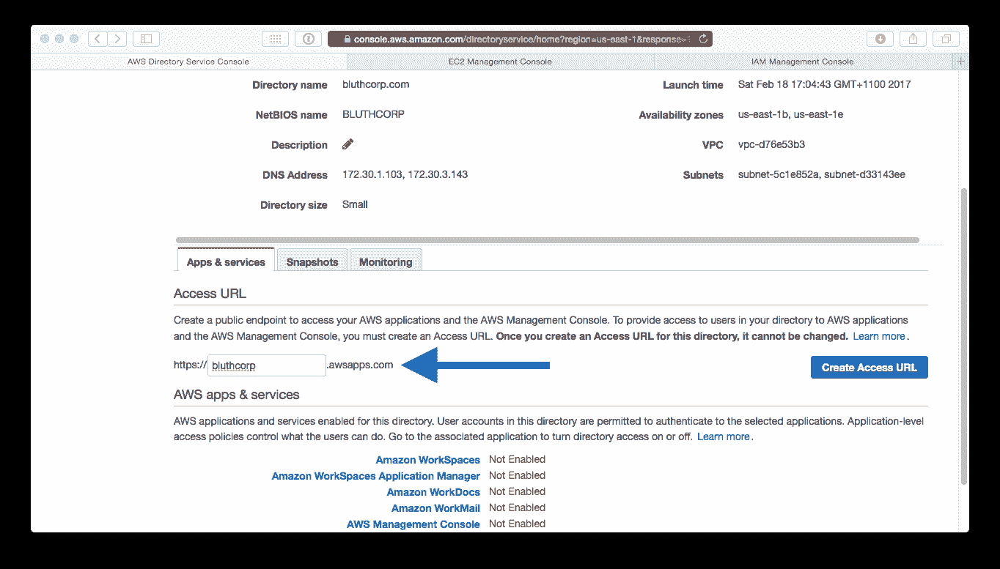
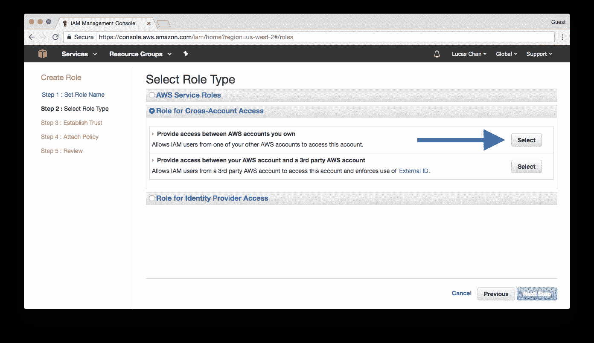
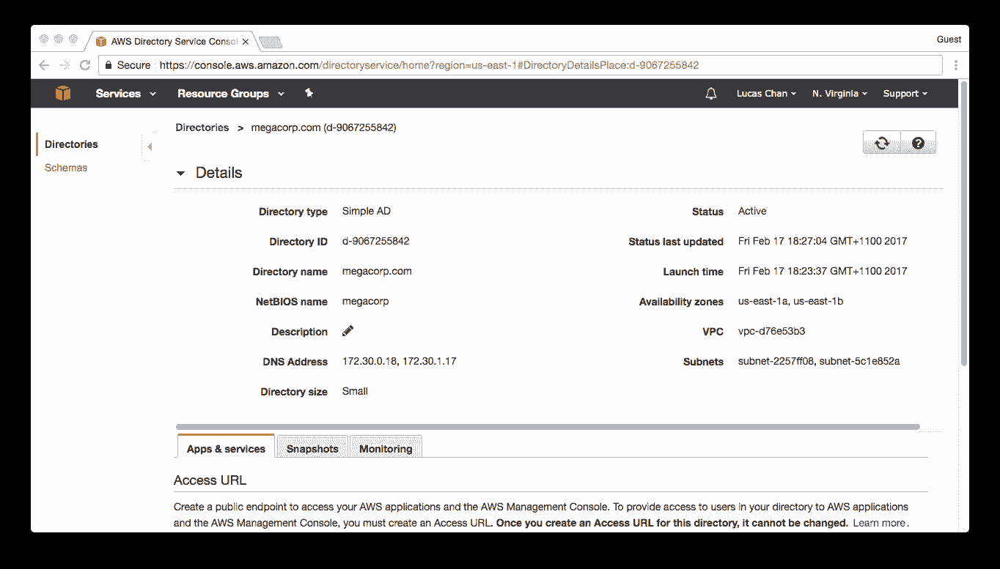

# 安全性和身份

在本章中，我们将涵盖：

+   与 AWS 账户联合

+   创建 SSL 证书

+   作为服务的活动目录

+   创建用户

+   创建实例角色

+   跨账户用户角色

+   存储密钥

# 介绍

安全性是使用云服务时最关键的领域之一。确保安全性做得好非常重要，因为良好的安全实践会相互强化，导致能力和控制的良性循环。

有许多工具和 AWS 服务可以确保您的云基础设施比您自己的资源更安全，甚至达到同样的安全水平。

AWS IAM 是 AWS 安全性的核心。它提供了极其精细的权限控制，允许（和拒绝）特定用户访问您的资源。

# 与 AWS 账户联合

本教程将展示如何从您的 Active Directory 联合身份，并使用 AD 组和 IAM 角色为多个 AWS 账户提供不同的访问级别。

从高层次来看，我们将拥有一个被指定为身份验证账户（Auth Account）的 AWS 账户。用户将登录到该账户并被分配一个角色。这个角色几乎没有权限，因为我们不希望他们在**身份验证账户**中做任何事情。然而，他们将能够通过角色切换访问另一个 AWS 账户；我们称这个账户为**应用账户**。

这是一种相对常见的模式，用户可以访问多个 AWS 账户，并使用角色切换在它们之间切换——所有操作都使用经过 AD 后端验证的凭据，以及从 AD 组派生的访问权限。


联邦

# 准备工作

在继续之前，您需要以下内容：

+   一个 Simple AD 实例。请参阅*作为服务的活动目录*教程。

+   一个访问 URL 的名称，您的用户将使用该 URL 进行登录（即 [`bluthcorp.awsapps.com`](https://bluthcorp.awsapps.com)）。

+   两个 AWS 账户。其中一个是您的*身份验证* *账户*，另一个是您的*应用* *账户*。

+   您 VPC 中的一台 Windows 服务器，已加入您的 Simple AD 域，并安装了远程服务器管理工具，以便我们能够管理组和用户。

如果您使用启动向导启动 Windows 服务器，它将为您提供在启动时加入域的选项。请注意，服务器需要使用具有以下两个 AWS 托管策略的实例角色运行：AmazonEC2RoleForSSM 和 AmazonSSMReadOnlyAccess。

# 如何操作...

这个教程分为五个部分：

+   活动目录配置

+   身份验证账户策略配置

+   身份验证账户角色配置

+   简单 AD 目录配置

+   应用账户角色配置

# 活动目录配置

我们的第一个任务是创建 Active Directory 中所需的组：

1.  如下图所示，创建一个名为`AWSPowerUser`的组：


1.  对`AWSReadOnly`组执行相同操作：


1.  我们现在将创建几个用户，第一个是`Lucille`，如下图所示：


1.  下一个用户将是`Buster`。现在让我们添加他：


1.  `Lucille`将成为我们的超级用户，因此我们将她添加到`AWSPowerUser`组：


1.  我们对`Buster`完全不信任。正如他的名字所示，他容易弄坏东西。让我们将他添加到`AWSReadOnly`组：


# Auth 账户策略配置

现在我们需要在我们的 Auth 账户中创建一个策略。记住，这是`Lucille`和`Buster`访问 AWS 控制台时最初登录的账户。我们实际上想要给他们非常有限的访问权限。事实上，我们将允许他们做的唯一事情就是尝试切换到应用账户中的某个角色。

1.  访问 Auth 账户中的 IAM 控制台并创建一个新的策略：

AWS 将这种类型的策略称为*客户管理策略*。


1.  将此策略命名为`AllowAssumeRole`。为它提供一个描述，以帮助你记住它的用途。然后应用以下策略文档。确保将应用账户的账户编号添加到策略中：

```
      { 
        "Version": "2012-10-17", 
        "Statement": [ 
            { 
              "Sid": "Stmt1487396837000", 
              "Effect": "Allow", 
              "Action": [ 
                  "sts:AssumeRole" 
              ], 
              "Resource": [ 
                  "arn:aws:iam::<app-acct-number>:role/*" 
              ] 
            } 
        ] 
      }

```


Auth 账户策略配置

# Auth 账户角色配置

现在我们将创建两个角色。这些角色将对应于我们在 Active Directory 中定义的组：

+   `AWSPowerUser`：`CanAssumePowerUser`

+   `AWSReadOnly`：`CanAssumeReadOnly`

1.  首先创建`CanAssumePowerUser`角色：


1.  我们希望这个角色是 AWS 目录服务角色，所以在继续之前一定要选择它：


1.  将我们已经创建的`AllowAssumeRole`策略附加到此角色：

提示：你可以使用搜索框过滤角色，使其更容易找到。


1.  点击“创建角色”以确认：


1.  现在，继续为`CanAssumeReadOnly`角色做相同的操作。再次附加我们之前创建的`AllowAssumeRole`策略：


# Simple AD 配置

现在，我们需要完成在目录中启用用户账户以登录 AWS 管理控制台的过程。

1.  打开浏览器，访问 AWS 目录服务控制台，并编辑你的 Simple AD 目录配置。输入你选择的访问 URL：



1.  现在，我们希望为此服务启用 AWS 管理控制台。点击它以继续到下一步：


1.  我们已经创建了角色并为其分配了策略。所以选择“使用现有角色”，如下图所示：


1.  从`CanAssumePowerUser`角色开始。我们需要将其映射到我们在 AD 中创建的`AWSPowerUser`组（`Lucille`所在的那个）：


1.  搜索`AWSPowerUser`，然后继续下一步：


1.  现在你需要为`CanAssumeReadOnly`角色重复这些步骤。将其映射到我们在 AD 中创建的`AWSReadOnly`角色：


# 应用账户角色配置

现在是时候配置我们的应用账户了。在这个账户中，我们需要创建一些新角色，并在这些新角色和我们在 Auth 账户中创建的角色之间建立信任关系：

1.  首先，进入 Auth 账户的 IAM 控制台并创建一个新角色。这个角色将是`PowerUserRole`：


1.  这个角色将是跨账户访问类型的角色。确保选择这种类型：



1.  系统会提示你输入一个 AWS 账户 ID。这是 Auth 账户的账户 ID：


1.  对于这个角色，我们将使用 AWS 托管的`PowerUserAccess`策略，所以现在就附加这个策略：


1.  在确认页面上点击“创建角色”，然后我们就可以进入下一步：


1.  AWS 将自动为我们创建信任关系。不幸的是，这并不完全正确，所以我们需要编辑它：


1.  我们希望在我们的 Auth 账户中拥有`CanAssumePowerUser`角色的任何人都能切换到应用账户中的`PowerUserRole`。因此，我们需要对信任关系做一个小的更改，如下所示（记得将账户 ID 替换为你自己的）：

```
      { 
        "Version": "2012-10-17", 
        "Statement": [ 
            { 
              "Effect": "Allow", 
              "Principal": { 
                 "AWS": "arn:aws:iam::<auth-account-number>:
                    role/CanAssumePowerUser" 
              }, 
              "Action": "sts:AssumeRole" 
            } 
        ] 
      }

```


1.  重复这些步骤，创建一个名为`ReadOnlyRole`的角色，并附加 AWS 托管的`ReadOnlyAccess`策略：


1.  再次，我们需要更新信任策略。在这里，我们将允许`CanAssumePowerUser`和`CanAssumeReadOnly`都切换到`ReadOnlyRole`。这样做对于那些希望避免在控制台上误操作的管理员非常有用：

```
      { 
        "Version": "2012-10-17", 
        "Statement": [ 
            { 
              "Effect": "Allow", 
              "Principal": { 
                  "AWS": "arn:aws:iam::<auth-account-number>:
                     role/CanAssumeReadOnly" 
              }, 
              "Action": "sts:AssumeRole" 
            }, 
            { 
              "Effect": "Allow", 
              "Principal": { 
                  "AWS": "arn:aws:iam::<auth-account-number>:
                    role/CanAssumePowerUser" 
              }, 
              "Action": "sts:AssumeRole" 
            } 
        ] 
      }

```


应用账户角色配置

这就是我们的最后一步。现在是时候进行测试了。

# 它是如何工作的...

1.  访问你为 Simple AD 目录分配的访问 URL（例如，[`bluthcorp.awsapps.com/console`](https://bluthcorp.awsapps.com/console)）。用`Lucille`用户的凭证登录，以便我们可以测试我们的`PowerUserRole`：


1.  如果你在 AWS 控制台中点击，你会发现你几乎无法做任何事情。这是因为你当前被一个只允许你切换角色（在应用账户中的）的策略所限制。那么，让我们试着这么做。点击右上角的账户名，然后选择“切换角色”：


1.  在下一个页面，你需要输入应用账户的账户 ID 和你希望切换的角色：`PowerUserRole`。点击“切换角色”将使你以`PowerUserRole`身份登录到应用账户：


1.  现在，你应该在应用账户下拥有一个活跃的 `PowerUserRole` 会话。你应该记得我们为该角色分配了一个 `PowerUserAccess` 策略。因此，你应该可以自由地在该账户中执行几乎所有操作，使用用户 `Lucille` 的配置文件（IAM 和组织管理是显著的例外）。如果你再次点击你的名字，你将看到登录时为你分配的角色以及当前活跃的角色信息：


1.  尝试切换到 `ReadOnlyRole`。验证你无法创建任何资源，可能通过尝试创建一个新的 EC2 密钥对或创建一个空的安全组来验证：


1.  登出并返回 Simple AD 的访问 URL。使用用户 `Buster` 的凭据登录。再次，你会看到你在 Auth 账户中无法做太多操作：


1.  你现在应该能够切换到应用账户中的 `ReadOnlyRole`。试试看，确保它能正常工作。你可以使用角色历史记录快捷方式，以避免再次输入账户号码和角色名称：


1.  最后，试着将 `Buster` 切换到应用账户中的 `PowerUserRole`。`Buster` 绝对不应该有权访问此角色，你应该会看到类似下面的错误页面：


# 还有更多…

+   完全相同的设置也可以通过你现有的 Active Directory 安装来实现，即使它位于 AWS 之外的你的数据中心。你需要将 Simple AD 替换为 AD Connector：


与 AD Connector 的联合身份验证

+   你还可以使用 ADFS 和 SAML 2.0 来启用从现有 AD 安装到 AWS 的联合身份验证。这将消除用户使用 `*.awsapps.com` 域名登录控制台的需求，同时也不再需要身份验证账户。

# 另见

+   *作为服务的 Active Directory* 配方

# 创建 SSL 证书

基于 SSL 的通信现在已成为事实上的标准——不安全的方式已经不再是*足够好*。

AWS 提供 **AWS 证书管理器** (**ACM**) 服务，用于配置 AWS 支持的 SSL 证书，你可以将其用于 AWS 资源，如 **弹性负载均衡器** (**ELB**) 和 CloudFront。

ACM 是免费的！证书本身没有费用。你只需按常规为所使用的基础资源付费。

# 如何操作...

1.  运行 CLI 命令，包含你要为其创建证书的域名（你可以使用 `*` 作为通配符）：

```
 aws acm request-certificate --domain-name <your-domain>

```

1.  你现在可以在 ACM 控制台中看到请求，但请注意请求仍在等待处理中：


1.  检查你的域名管理电子邮件。你将收到一条请求确认，类似以下信息：


1.  一旦你批准请求，你将收到一条确认消息：


1.  你现在可以在 AWS ACM 控制台中看到证书已经准备好使用：


1.  使用标识符值将证书应用到你的资源：


# 它是如何工作的……

使用 CLI 工具是创建证书请求的最快、最简单方法。在你计划使用证书的区域创建证书；即 ELB(s) 所在的区域。

如果你计划将证书与 CloudFront 一起使用，你必须在 `us-east-1 区域` 中创建它。

在请求创建后，AWS 会通过发送批准电子邮件到多个标准电子邮件地址来确认请求的有效性，这些地址是根据你的域名的惯例和 WHOIS 信息生成的。批准电子邮件将发送到以下地址：

+   域名注册人

+   技术联系人

+   管理联系

+   以及以下地址：

    +   `administrator@<your-domain>`

    +   `hostmaster@<your-domain>`

    +   `postmaster@<your-domain>`

    +   `webmaster@<your-domain>`

    +   `admin@<your-domain>`

在使用证书之前，你必须至少接受其中一个批准。

一旦批准，你可以在其他资源的配置中使用标识符值，例如 EC2 ELB(s) 和 CloudFront 分发。

# 还有更多……

虽然 ACM 使得为你的应用程序获取 SSL 证书变得非常简单，但仍有一些限制需要注意。

# EC2 实例

你会在文档中注意到，只有 ELB 和 CloudFront 支持 ACM 证书。你不能直接将 ACM 证书应用到 EC2 实例上。

虽然这是一个限制，但在实际操作中并不是一个大问题。通常，你不希望将实例直接暴露到互联网——它们应该位于 ELB/ALB 后面，以保证安全性、性能和管理。如果你提供静态资源，CloudFront 将更加安全，且在较低成本下性能更好。

# 导入证书

你可以将自己的证书导入 ACM，以便它们可以与 ELB(s) 和 CloudFront 一起使用。这样做的原因可能是你已经从第三方提供商购买了证书，或需要特定的签名授权。

# CloudFormation

你也可以作为 CloudFormation 堆栈的一部分请求证书。这非常适合确保每个资源都有一个特定的证书，且每次部署时都独一无二。

这是一个 CloudFormation YAML 示例代码片段，用于创建证书，类似于本食谱前面的示例：

```
Resources: 
  MyCertificate: 
    Type: "AWS::CertificateManager::Certificate" 
    Properties: 
      DomainName: <your-domain>

```

# 作为服务的活动目录

本食谱将向你展示如何部署一个 AWS **简单活动目录**（**Simple AD**）服务。

Simple AD 由 Samba 4 提供支持，是一个与 Microsoft Active Directory 兼容的托管服务。它可以与许多需要 Active Directory 支持的应用程序兼容，并提供了许多常用的 Active Directory 功能，包括以下内容：

+   用户账户

+   单一登录（Kerberos）

+   组成员资格

+   域名加入

它还与 AWS 提供的其他服务集成，如下所示：

+   AWS 管理控制台

+   WorkMail

+   WorkDocs

+   WorkSpaces 和 WorkSpaces 应用程序管理器

AWS 将为你管理目录的备份和恢复，采用每日快照以及能够执行时间点恢复的方式。

不支持的功能包括以下内容：

+   与其他 AD 域的信任关系

+   DNS 动态更新

+   架构扩展

+   MFA

+   LDAPS

+   PowerShell AD 命令

+   FSMO 角色转移

Simple AD 的理想使用场景是你不需要高级的 AD 功能，并且支持的用户数少于 5,000 人。如果其中任何一项不符合你的需求，你可能需要考虑使用 AWS 完全成熟的 Microsoft Active Directory 服务。不过，选择这条路径时，你需要做好面对更高复杂度和成本的准备。

# 准备工作

在继续之前，我们需要以下信息：

+   你的目录的 FQDN（完全合格域名）（例如，[`megacorp.com/`](http://megacorp.com/)）。

+   管理目录的密码。此密码对应将为你创建的`Administrator`用户。注意，密码长度应在 8 到 64 个字符之间，并且需要包含以下四个组中的三个组的字符：

    +   小写字母

    +   大写字母

    +   数字

    +   非字母数字字符

+   我们将要部署到的 VPC 的 ID。

+   该 VPC 中两个子网的 ID。这些子网需要位于不同的可用区（Availability Zones）。

+   你希望部署的目录的大小。你可以选择*Small*（小型）或*Large*（大型）。

域控制器将在你选择的两个子网中各部署一个。它们将通过大量端口进行相互通信。理想情况下，这些子网应该位于同一*层级*（tier）中，并且没有任何 NACL 阻止控制器之间的通信。

如果由于某些原因，你在 VPC 层中使用 NACL（网络访问控制列表）限制流量，你需要查阅 AWS 文档，获取需要允许的端口列表。

更多细节，请访问[`docs.aws.amazon.com/directoryservice/latest/admin-guide/prereq_simple.html`](http://docs.aws.amazon.com/directoryservice/latest/admin-guide/prereq_simple.html)。

# 如何操作...

1.  创建一个新的 CloudFormation 模板文件。我们将首先填充与我们之前提到的所有要求相对应的`Parameters`（参数）：

```
      AWSTemplateFormatVersion: '2010-09-09' 
      Parameters: 
        FullyQualifiedName: 
          Description: The fully qualified name for the directory
            (e.g. megacorp.com) 
          Type: String 
          AllowedPattern: '^([a-zA-Z0-9]+[\\.-])+([a-zA-Z0-9])+$' 
        Password: 
          Description: The password for the directory Administrator 
          Type: String 
          NoEcho: true 
        VpcId: 
          Description: The ID of the VPC to deploy to 
          Type: AWS::EC2::VPC::Id 
        SubnetIds: 
          Description: Subnets where the directory will be deployed to
            (pick at least 2) 
          Type: List<AWS::EC2::Subnet::Id> 
        DirectorySize: 
          Description: The size of the directory to deploy 
          Type: String 
          AllowedValues:  
            - Small 
            - Large

```

1.  接下来，我们定义我们的`Resources`（资源）。尽管将部署两个 Simple AD 域控制器，但在这里我们只需创建一个资源：

```
      Resources: 
        ExampleDirectory: 
          Type: AWS::DirectoryService::SimpleAD 
          Properties:  
            Name: !Ref FullyQualifiedName 
            Password: !Ref Password 
            Size: !Ref DirectorySize 
            VpcSettings:  
              SubnetIds:  
                - !Select [ 0, Ref: SubnetIds ] 
                - !Select [ 1, Ref: SubnetIds ] 
              VpcId: !Ref VpcId

```

1.  现在，你可以在 CloudFormation 网页控制台中运行此模板，或者通过 CLI 按如下方式运行：

```
 aws cloudformation create-stack \ 
 --stack-name example-directory \ 
 --template-body file://08-active-directory-as-a-service.yaml \ 
 --parameters \ 
 ParameterKey=FullyQualifiedName,ParameterValue=<fqdn> \ 
 ParameterKey=Password,ParameterValue=<password> \ 
 ParameterKey=VpcId,ParameterValue=<vpd-id> \ 
 "ParameterKey=SubnetIds,ParameterValue='<subnet-1>,<subnet-2>'" \ 
 ParameterKey=DirectorySize,ParameterValue=<Small/Large>

```

# 它是如何工作的...

创建目录将需要几分钟时间。目录状态变为 Active 后，你可以继续进行后续的设置和集成任务。你的目录列表页面最终会显示类似于以下的目录列表：


点击目录 ID 将显示更多关于目录的详细信息，类似于这样：



# 还有更多...

+   `Administrator` 账户的密码无法恢复或重置。请确保将此密码保存在安全的地方。

+   你可能会在 EC2 控制台中看到一个额外的安全组。这个组是目录控制器所必需的（尽管你不会在控制台中看到它们作为 EC2 实例出现）。

+   该目录将包含一个以 `AWSAdminD-` 为前缀的账户。这个账户对于 AWS 执行维护任务（如备份和 FSMO 角色转移）是必要的。删除该账户或更改其密码几乎肯定是一个不好的主意。

# 另见

+   第七章中的*构建安全网络*方案，*网络*。

# 创建用户

在介绍这个方案之前，我们需要简要地讨论一下**身份与访问管理**（**IAM**）。它是免费的，并且在每个账户上都已启用。它允许你创建组和用户，并允许你通过策略分配精确控制他们可以做什么以及不能做什么。

默认情况下，组和用户在你分配给他们*AWS 管理的策略*或*客户管理的策略*（由你管理的策略）之前，没有任何权限。你应尽可能使用 AWS 管理的策略，以避免创建和维护自己的策略。

还有第三种类型的策略，称为**内联策略**。请谨慎使用。实际上，我们通常只在 CloudFormation 模板中看到它。

你几乎永远不想将策略直接分配给用户。如果你走这条路，将来你会给自己带来很多麻烦。相反，你应该将策略应用于组，然后将用户分配到这些组。幸运的是，这个过程非常简单，我们将带你一步步完成。

IAM 仪表板提供了一个 URL，IAM 用户可以使用该 URL 登录到 Web 控制台（前提是你已为他们分配了密码并允许他们进行此操作）。如果需要，你也可以自定义这个*IAM 登录链接*。别忘了将这个 URL 给你创建的任何 IAM 用户，让他们知道去哪里登录。

在你自定义之前，它看起来像这样：

`https://<account-id>.signin.aws.amazon.com/console`

现在，直接跳入吧。没有理由不使用 IAM。从今天开始吧！

# 准备工作

继续操作所需的只是已安装 CLI 工具并配置了可以调用 AWS IAM API 的配置文件。如果没有配置文件，你也可以跟随方案步骤，使用 AWS Web 控制台来完成，过程是一样的。

# 如何操作...

1.  运行以下 CLI 命令来创建一个新组：

```
 aws iam create-group --group-name <group-name>

```

1.  输出看起来像这样：

```
      { 
          "Group": { 
            "Path": "/", 
            "GroupId": "AGPAIHM2XJ2ELQTNYBFQQ", 
            "Arn": "arn:aws:iam::067180688831:group/PowerUsers", 
            "GroupName": "PowerUsers" 
          } 
      }

```

1.  目前该组没有权限执行任何操作，因此你需要将策略附加到该组。你可以使用此命令来实现（但遗憾的是，如果命令执行成功，它不会提供任何反馈）：

```
 aws iam attach-group-policy \
 --group-name <group-name> \
 --policy-arn <policy-arn>

```

1.  你可以在 AWS IAM Web 控制台中找到你想要附加的**亚马逊资源名称**（**ARN**）。你也可以运行以下 CLI 命令来获取策略列表：

```
 aws iam list-policies

```

1.  在这个例子中，我们正在处理`PowerUsers`，所以我们要附加以下 ARN，它对应 AWS 为权限用户提供的托管策略：

```
 arn:aws:iam::aws:policy/PowerUserAccess

```

1.  现在我们可以通过运行这个 CLI 命令来创建一个新用户：

```
 aws iam create-user --user-name <new-username>

```

1.  你将得到如下的响应：

```
      { 
        "User": { 
            "UserName": "lucille.bluth", 
            "Path": "/", 
            "CreateDate": "2017-02-19T06:16:50.558Z", 
            "UserId": "AIDAIU5P6ESCGYTVGACFE", 
            "Arn": "arn:aws:iam::07180688831:user/lucille.bluth" 
        } 
      }

```

1.  如果你希望授予此用户访问 Web 控制台的权限，你需要为其创建一个登录配置文件。你可以这样做：

```
 aws iam create-login-profile --user-name <username> \
 --password <password> \
 --password-reset-required

```

1.  强制密码重置是一个好的实践。API 应该像这样回应：

```
      { 
         "LoginProfile": { 
              "UserName": "lucille.bluth", 
              "CreateDate": "2017-02-19T06:29:06.244Z", 
              "PasswordResetRequired": true 
         } 
      }

```

1.  要授予 API 用户访问权限，他们需要一组 API 密钥。使用以下命令生成密钥：

```
 aws iam create-access-key --user-name <username>

```

1.  输出结果看起来像这样：

```
      { 
          "AccessKey": { 
            "UserName": "lucille.bluth", 
            "Status": "Active", 
            "CreateDate": "2017-02-19T06:59:45.273Z", 
            "SecretAccessKey": "abcdefghijklmnopqrstuvwxyz", 
            "AccessKeyId": "AAAAAAAAAAAAAAAAAAAA" 
          } 
      }

```

1.  访问密钥只能被检索一次。生成并显示给你之后，无法再次获取。如果你丢失了访问密钥，必须重新生成一组新的密钥。

1.  这个用户仍然没有任何操作权限；这是因为他们还没有加入任何组。让我们将其加入第 1 步中创建的组：

```
 aws iam add-user-to-group \
 --group-name <group-name> \
 --user-name <username>

```

请注意，不幸的是，这个命令也不会返回任何输出。你可以通过运行此命令来验证是否成功：

```
 aws iam list-groups-for-user --user-name <username>

```

1.  你应该看到类似这样的内容：

```
      { 
          "Groups": [ 
              { 
                 "Path": "/", 
                 "CreateDate": "2017-02-19T07:24:46Z", 
                 "GroupId": "AGPAIHM2XJ2ELQTNYBFQQ", 
                 "Arn": "arn:aws:iam::067180688831:group/PowerUsers", 
                 "GroupName": "PowerUsers" 
              } 
          ] 
      }

```

# 还有更多…

这基本涵盖了如何创建 IAM 组和用户并为其分配策略的基本知识。以下是我们多年来遇到的一些 IAM 提示和陷阱：

+   用户可以存在于多个组中。利用这一点。

+   然而，组不能存在于其他组中。

+   用户可以拥有多个 API 密钥。当他们需要执行密钥轮换时，这是必要的。

+   你可以（并且应该）为你的 IAM 用户定义一个强密码策略。

+   `PowerUserAccess`策略很好，但不允许 IAM 访问。一开始这似乎不是问题；然而，如果你受此策略限制，当你运行创建 EC2 实例 IAM 角色的 CloudFormation 堆栈时，会遇到问题。

+   IAM 是一个全球性服务，这意味着用户和组是全球性的，而不是特定于某个区域。默认情况下，用户可以在任何区域使用 AWS 服务。

+   EC2 密钥对是特定于区域的，而不是特定于 IAM 用户。换句话说，IAM 用户没有与之关联的 SSH 密钥。

+   你的 IAM 用户名和密码（以及访问密钥）不会提供 SSH 或 RDP 访问正在运行的实例的权限。这些服务的凭证是单独管理的。

+   你可以为一个组或用户分配最多 10 个策略。

+   你还应该考虑为 IAM 用户账户启用 MFA 以增加安全性。主要用于访问 Web 控制台，但你也可以配置策略，使得 API 调用时必须使用 MFA。你可以选择硬件和软件令牌。一个好的经验法则是，IAM 用户使用软件令牌，root 登录使用硬件令牌。通过 SMS 的 MFA 功能很快会推出，目前正在公测中。

# 另见

+   *与 AWS 账户联合*方法

+   *跨账户用户角色*方法

# 创建实例角色

本配方相对简短，但它包含了一个对任何 AWS 平台新手来说非常重要的概念。理解并利用 EC2 的 IAM 角色将显著降低你的凭证丢失风险，可能也会让你晚上睡得更好。简而言之，实例角色帮助你将 AWS 凭证从服务器和代码库中移除。

角色包含一个或多个策略。我们将创建一个包含一些 AWS 托管策略以及一个内联策略的角色。顾名思义，AWS 托管策略是由 AWS 创建并完全控制的策略。内联策略将由我们创建，并将嵌入到我们的角色定义中。

我们将使用的 AWS 托管策略将允许只读访问 S3 和 EC2 API。我们创建的内联策略将允许写入 CloudWatch 日志。稍后在本配方中我们会讨论为什么你可能选择或不选择托管策略。

# 如何执行...

1.  创建一个新的 CloudFormation 模板文件，并添加第一个 `Resource`。这个资源将是我们包含托管策略引用的角色，并且还包括我们的内联策略：

```
      AWSTemplateFormatVersion: '2010-09-09' 
      Resources: 
        ExampleRole: 
          Type: AWS::IAM::Role 
          Properties: 
            AssumeRolePolicyDocument: 
              Version: "2012-10-17" 
              Statement: 
                - 
                  Effect: Allow 
                  Principal: 
                    Service: 
                      - ec2.amazonaws.com 
                  Action: 
                    - sts:AssumeRole 
            ManagedPolicyArns: 
              - arn:aws:iam::aws:policy/AmazonS3ReadOnlyAccess 
              - arn:aws:iam::aws:policy/AmazonEC2ReadOnlyAccess 
            Path: / 
            Policies: 
              - 
                PolicyName: WriteToCloudWatchLogs 
                PolicyDocument: 
                  Version: "2012-10-17" 
                  Statement: 
                    - 
                      Effect: Allow 
                      Action: 
                        - logs:CreateLogGroup 
                        - logs:CreateLogStream 
                        - logs:PutLogEvents 
                        - logs:DescribeLogStreams 
                      Resource: "*"

```

1.  我们现在需要创建一个 `InstanceProfile` 资源。一个配置文件封装了一个 IAM 角色，简而言之，它的作用就是如此。一个配置文件只能包含一个 IAM 角色，所以不太清楚为什么 AWS 要建立这层额外的抽象；可能他们计划为配置文件提供除了角色之外的其他属性：

```
      ExampleInstanceProfile: 
        Type: AWS::IAM::InstanceProfile 
        Properties: 
          Roles: 
            - !Ref ExampleRole 
          Path: /

```

1.  为了方便起见，我们将添加一些 `Outputs`，在堆栈创建后提供配置文件名称和 ARN：

```
      Outputs: 
        ExampleInstanceProfile: 
          Value: !Ref ExampleInstanceProfile 
        ExampleInstanceProfileArn: 
          Value: !GetAtt ExampleInstanceProfile.Arn

```

1.  现在你可以通过 CloudFormation 网络控制台或 CLI 创建你的实例角色，方法如下：

```
 aws cloudformation create-stack \
 --stack-name example-instance-profile \
 --template-body file://08-creating-instance-roles.yaml \
 --capabilities CAPABILITY_IAM

```

这个角色现在可以分配给你的 EC2 实例。在[第五章](http://Management%20Tools)中的 *将日志文件馈送到 CloudWatch 日志* 配方中，*管理工具* 章节展示了如何在启动 EC2 实例时，使用 CloudFormation 定义一个角色并将其分配给实例。

# 它是如何工作的...

这到底是如何解决硬编码 AWS API 密钥的问题的呢？当你将角色分配给 EC2 实例时，会发生一些非常有趣的事情。该实例的元数据将返回一组短期有效的 API 密钥。你可以通过发送 HTTP 请求到元数据 URL 来检索这些密钥（这是 EC2 实例用来获取自己信息的服务）：

`http://169.254.169.254/latest/meta-data/iam/security-credentials/<role name>`

对这个 URL 发出的 curl 请求的输出大概是这样的：

```
      { 
        "Code" : "Success", 
        "LastUpdated" : "2017-02-17T11:14:23Z", 
        "Type" : "AWS-HMAC", 
"AccessKeyId" : "AAAAAAAAAAAAAAAAAAAA", 
        "SecretAccessKey" : "zzzzzzzzzzzzzzzzzzzzzzzzzzzzzzzzzzzzzzzz", 
        "Token" : "token", 
        "Expiration" : "2017-02-17T12:14:23Z" 
      }

```

如果你取出响应中返回的 `AccessKeyId` 和 `SecretAccessKey`，你就可以使用它们查询 AWS API。基于分配给实例的角色所应用的策略，将决定实例在使用这些密钥时能够执行的具体 API 操作。

最有趣的部分是，你根本不需要太担心处理这些密钥（虽然了解这些在幕后是如何工作的确很有用）。例如，AWS CLI 工具会在执行任何 CLI 命令之前自动为你获取这些密钥。AWS SDK 也是如此。

假设有一个场景，你的开发人员正在构建一个需要从 S3 获取文件的应用程序。只要他们使用 AWS SDK 来完成这项工作，且应用程序运行在已经分配了包含允许从 S3 获取文件的策略的 EC2 实例上，那么应用程序根本不需要任何凭证！SDK 会为你处理对元数据服务的查询。

AWS SDK 支持几乎所有广泛使用的编程语言，因此不再有理由在配置文件或源代码中硬编码 AWS 凭证。

你将在 IAM 控制台的 `Roles` 部分看到你实例的角色列表：


点击角色将显示更多细节，例如已分配给它的策略：


# 还有更多……

+   IAM 是一个全球服务。这意味着你创建的角色和策略将在所有区域中可用。

+   你将在 AWS 网络控制台中找到所有可用的 AWS 管理策略。它们有很多，所以不要害怕使用搜索栏。

+   还有第三种策略叫做客户管理策略。这些策略由你管理，并将在 AWS 控制台中与 AWS 管理策略一起显示。

+   从 2017 年 2 月起，已可以将 IAM 角色附加到现有/运行中的 EC2 实例。这在之前是做不到的，角色只能在实例启动时分配。

+   AWS 会自动并定期轮换由元数据服务返回的凭证。

+   并不总是适合使用 AWS 管理策略。例如，如果服务器需要写入 CloudWatch 日志，你可能会想直接为它分配提供完全访问权限的 AWS 管理策略。然而，如果这么做，你也会赋予服务器删除日志组和流的权限。这几乎肯定是不可取的。你需要在应用策略之前检查它们，并在适当的情况下使用内联策略或客户管理策略。这里适用最小权限原则。

# 另见

+   第五章中的*将日志文件输入到 CloudWatch 日志*食谱，*管理工具*

# 跨账户用户角色

使用多个账户来配置资源（例如，开发环境和生产环境）可以提供一种*爆炸半径*保护——即使在最坏的情况下，任何问题或损害也仅限于发生问题的账户，而不会影响整个 AWS 环境。

在账户之间创建和假设角色是管理多个账户访问的最佳方式。特定的角色提供了明确且清晰的权限声明，既可以轻松审查，也可以在需要时撤销。

本方法提供了一种在多个账户之间扩展访问权限的方式，同时不会妥协你的安全性。

# 准备工作

本方法假设你已经创建并准备好两个 AWS 账户。

在一个账户中（即**源**账户，称为*账户 A*），你需要一个 IAM 用户。

虽然你需要使用账户的根凭证来设置账户中的第一个角色，但*不要*在日常使用中使用它们。根账户拥有对账户内任何操作的权限，只有在必要时才应使用根账户。

# 如何操作...

1.  从一个版本和描述开始新的模板：

```
      AWSTemplateFormatVersion: "2010-09-09" 
      Description: This template creates a role that can be assumed 
       from another account.

```

1.  模板将接受一个参数——可以假设该角色的源账户：

```
      Parameters: 
        SourceAccountNumber: 
          Type: String 
          Description: The AWS account number to grant access to assume
            the role. 
          AllowedPattern: "[0-9]+" 
          MaxLength: "12" 
          MinLength: "12"

```

1.  该角色本身将包括信任角色和一个示例策略：

该角色具有对目标账户的完全访问权限。

```
        Resources: 
          CrossAccountRole: 
            Type: "AWS::IAM::Role" 
            Properties: 
              Path: "/" 
              AssumeRolePolicyDocument: 
                Version: "2012-10-17" 
                Statement: 
                  - Sid: "" 
                    Action: "sts:AssumeRole" 
                    Effect: Allow 
                    Principal: 
                      AWS: 
                        !Sub "arn:aws:iam::${SourceAccountNumber}:root" 
              Policies: 
                - PolicyName: DoEverything 
                  PolicyDocument: 
                    Version: "2012-10-17" 
                    Statement: 
                      - Action: 
                          - "*" 
                        Effect: Allow 
                        Resource: "*" 
                        Sid: DoEverything

```

1.  最后，我们创建一个输出，使得更容易检索目标角色的 ARN：

```
      Outputs: 
        RoleARN: 
          Description: The Role ARN that can be assumed by the
            other account. 
          Value: !GetAtt CrossAccountRole.Arn

```

1.  保存模板并赋予一个已知名称，例如`08-target-account-role.yaml`。

1.  通过使用 CLI 工具，将角色部署到目标账户（即**账户 B**）：

```
 aws cloudformation create-stack \
        --stack-name CrossAccountRole \
 --template-body file://src/08-target-account-role.yaml \
 --parameters \
        ParameterKey=SourceAccountNumber, \
        ParameterValue=<your-source-account-number> \
 --capabilities CAPABILITY_IAM

```

1.  从 CloudFormation 堆栈的输出中获取（仅）目标角色的 ARN：

```
 aws cloudformation describe-stacks \
 --stack-name CrossAccountRole \
 --query 'Stacks[0].Outputs[0].OutputValue' \
 --output text

```

1.  在你的源账户（即**账户 A**）中，确认你可以通过手动调用 CLI 工具来假设目标角色：

```
 aws sts assume-role \
 --role-arn <your-target-role-arn> \
 --role-session-name CrossAccountRole

```

# 它是如何工作的...

虽然跨账户角色在管理多个 AWS 账户时极其有用，但它们的配置并不是最直观的。这里有一个图示，展示了资源及其相互作用：


本方法的前几个步骤是通过使用 CloudFormation 以清晰且可重复的方式创建**目标 IAM 角色**。

你必须明确指定允许假设该角色的 AWS 账户号码。如果你希望允许多个账户假设该角色，只需在角色的`AssumeRolePolicyDocument`属性中添加更多声明。

在此模板中创建的示例策略授予对目标账户的完全访问权限（因为`Action`和`Resource`都设置为`*`）。你应根据需要调整此策略。

定义一个输出值以返回 IAM 角色的 ARN，将使得稍后在本方法中更容易获取生成的 ID。

然后，我们在目标账户中启动模板。由于此模板会创建 IAM 资源，你必须提供`--capabilities CAPABILITY_IAM`参数。如果你没有可以启动它的现有 IAM 用户，使用 AWS Web 控制台（在使用根凭证登录后）。这意味着你不需要在目标账户中创建 IAM 用户。

部署模板后，您将不再需要手动登录账户——您可以直接从可信（源）账户假设新创建的角色。使用目标账户中的 IAM 角色意味着您的日常访问不再需要多个密码，这样可以减少管理和安全存储的工作量。您只需拥有一个密码——即源 IAM 用户的密码。

当堆栈创建完成后（这不会花费太多时间，因为只创建了一个资源），您可以通过 `describe-stacks` 调用快速提取目标角色的 ARN，并结合特定的 `--query` 参数。JMESPath 查询 `Stacks[0].Outputs[0].OutputValue` 获取第一个堆栈返回的第一个输出的 `OutputValue` 属性，我们知道它将是目标角色 ARN，因为模板中只有一个输出。

最后，示例 `assume-role` 命令将返回目标角色的凭证（即 `ACCESS_KEY_ID` 和 `SECRET_ACCESS_KEY`）。您可以将其用于 API 调用，无论是通过 CLI 工具还是某个 SDK。请记住，这些令牌是短暂的。

请参阅下一部分，了解通过创建配置文件，使用 CLI 工具更方便地使用凭证的方法。

# 还有更多...

就像有多种方式使用角色一样，也有多种方式利用跨账户角色。

# AWS CLI 配置文件

使用跨账户角色最简单的方法之一是将其配置为 AWS CLI 工具使用的配置文件。这意味着您只需通过更改执行命令时使用的配置文件，就可以快速轻松地切换账户。

要做到这一点，您必须在 CLI 配置文件中定义目标角色。假设您的 `default` 配置文件位于源账户中（即账户 A）。

将以下代码片段添加到 Linux 和 Mac 电脑上的 `~/.aws/config` 文件中，Windows 电脑上的 `C:\Users\[USERNAME]\.aws\config` 文件中：

```
[profile accountb] 
role_arn = <your-target-account-role-arn> 
source_profile = default

```

要使用切换角色，您只需在命令中传递 `--profile` 参数：

```
 aws --profile accountb ...

```

# 参见

+   *创建用户* 配方。

# 存储密钥

新管理员在开始使用基础设施即代码时常犯的一个错误是将密钥（密码、访问密钥等）提交到他们的代码库中。尽管这样可以让他们的基础设施更具可重复性，但也更容易导致凭证被泄露。一旦某些内容进入版本控制系统，就很难也很麻烦将其删除（这正是版本控制的意义所在！）。即使您删除了它，也几乎不可能知道它是否已经被某个不该看到的人查看或复制过。

在本配方中，我们将介绍并使用开源工具 **Unicreds**。

Unicreds 是 Python 工具 Credstash 的 Golang 移植版：[`github.com/fugue/credstash`](https://github.com/fugue/credstash)。

尽管功能非常相似，Unicreds 的优势在于它是跨平台的并且没有依赖！

由于该模式完全由 AWS 服务支持，它消除了管理（和担心）密码库、共享密码以及将敏感信息提交到 SCM 的需要。

你甚至可以使用 Unicreds 存储非机密信息，因为它提供了一种方便的方式来存储和共享设置，而不需要运行或维护任何服务器！

# 准备工作

你必须在目标系统上安装 Unicreds。

由于是用 Golang 编写的，它可以轻松地作为独立的二进制应用程序分发——无需安装程序或依赖项。

所有平台的发布版本可以在 [`github.com/Versent/unicreds/releases`](https://github.com/Versent/unicreds/releases) 上找到。

这些命令假设你的默认配置文件具有创建 KMS 密钥和 DynamoDB 表的权限。你可以通过在所有命令中传递 `--profile` 参数来覆盖使用的配置文件。你还必须配置好 AWS 区域设置。

# 如何操作...

1.  创建一个 KMS 密钥，并记录下返回的密钥 ID：

```
 aws kms create-key --query 'KeyMetadata.KeyId' --output text

```

1.  创建密钥的别名：

Unicreds 使用 `alias/credstash` 别名，使其与 Credstash 兼容。

```
 aws kms create-alias --alias-name 'alias/credstash' \
        --target-key-id "<your-key-id>"

```

1.  设置 Unicreds 所需的资源：

```
 unicreds setup

```

1.  使用 `put` 命令存储机密：

```
 unicreds put foo bar

```

1.  使用 `get` 命令获取机密信息：

```
 unicreds get foo

```

# 它是如何工作的...

这里是一个高层次的图示，展示了这些 Unicreds 命令所涉及的组件：


我们通过创建将用于加密机密信息的 KMS 密钥来开始这个流程。请注意，我们永远看不到这个密钥——它只存在于 KMS 中。你所能做的就是请求 KMS 为你加密或解密数据。

你可以将自己的密钥导入到 KMS（这样你就可以在需要时在 AWS 外部解密机密信息），但这不是 Unicreds 正常工作的必需步骤。`create-key` 命令返回密钥的 GUID，将在接下来的步骤中使用。

别名使得处理 KMS 密钥变得更加简单。你可以在大多数命令中使用别名代替完整的密钥 ARN。更重要的是，它使你能够清楚地知道你正在处理哪个密钥，从而可以快速、轻松且自信地分配访问权限。

Unicreds 使用的密钥的默认别名是`alias/credstash`。虽然这开始时可能有些令人困惑，但这意味着 Unicreds 向后兼容 Credstash。你可以选择自己的别名；只需要在执行其他命令（如`setup`、`put`等）时覆盖它。

`setup` 命令会在你的 AWS 账户中创建所需的资源。这实际上意味着创建一个 DynamoDB 表来存储机密信息。

一旦一切设置完成，你就可以开始使用 Unicreds 存储机密信息了。在这个示例中，机密信息是用（极具创意的）密钥 `foo` 和值 `bar` 存储的。

在这一阶段，你可以进入 AWS 控制台中的 DynamoDB，并查看`credential-store`表中存储的值。如果需要，你还可以更改在运行`credstash setup`命令时使用的 DDB 表名称。

一旦有秘密被存储，你可以通过`get`命令将其取出。需要记住的是，不必从存储秘密的同一台机器上进行操作。只要 AWS 用户/角色拥有足够的权限使用 KMS 服务并访问 DDB 表，他们就能检索到秘密。

# 还有更多...

Unicreds 利用了 AWS 的内置功能，因此你可以获得企业级解决方案，而无需为运行自己的服务器而增加额外的负担。以下是一些其他有用的做法，可以使你的秘密更加安全。

# 密钥别名

创建多个 KMS 密钥，并通过唯一别名引用它们，是限制特定应用程序或团队进行秘密存取的好方法。

你可以为团队提供他们自己的别名，而不是使用默认的`alias/credstash`别名，这样你可以放心，他们无法看到或写入其他团队的秘密。

# 秘密读取角色

由于 IAM 权限的精细粒度，你可以轻松地为不同的访问角色划分 AWS 资源的访问权限。

使用以下 IAM 策略，你可以确保用户/角色只能读取秘密值（使用特定的密钥和表），但无法设置或更改它们：

```
{ 
  "Version": "2012-10-17", 
  "Statement": [ 
    { 
      "Action": [ 
        "kms:Decrypt" 
      ], 
      "Effect": "Allow", 
      "Resource": "arn:aws:kms:us-east-1:<your-account-id>:
         key/<your-key-id>" 
    }, 
    { 
      "Action": [ 
        "dynamodb:GetItem", 
        "dynamodb:Query", 
        "dynamodb:Scan" 
      ], 
      "Effect": "Allow", 
      "Resource": "arn:aws:dynamodb:us-east-1:<your-account-id>:
         table/credential-store" 
    } 
  ] 
}

```

# 秘密写入角色

秘密读取角色的反面是秘密写入角色。

将此代码片段添加到角色的相关 IAM 策略部分，以赋予其设置秘密值的权限，但不能检索它们：

```
{ 
  "Version": "2012-10-17", 
  "Statement": [ 
    { 
      "Action": [ 
         "kms:GenerateDataKey" 
      ], 
      "Effect": "Allow", 
      "Resource": "arn:aws:kms:us-east-1:<your-account-id>:
         key/<your-key-id>" 
    }, 
    { 
      "Action": [ 
        "dynamodb:PutItem" 
      ], 
      "Effect": "Allow", 
      "Resource": "arn:aws:dynamodb:us-east-1:<your-account-id>:
         table/credential-store" 
    } 
  ] 
}

```

# put-file 命令

你可以将整个文件存储到 Unicreds 中。只需使用`put-file`命令：

```
unicreds put-file foo bar.txt

```

# 版本控制

虽然安全地存储你的秘密是一个好的开始，但定期更改/旋转密码、密钥和其他秘密仍然是一个良好的实践。

Unicreds 内置了版本控制支持，这意味着你可以更新你的秘密，同时保留先前版本的记录。

当你多次使用相同的秘密名称时，Unicreds 会自动为该值创建新版本。你可以通过在`get`或`put`命令中提供版本参数来获取特定版本的秘密：

```
unicreds get foo 1

```

# 另见

+   *创建用户*的操作步骤
