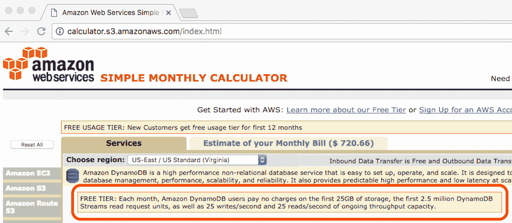
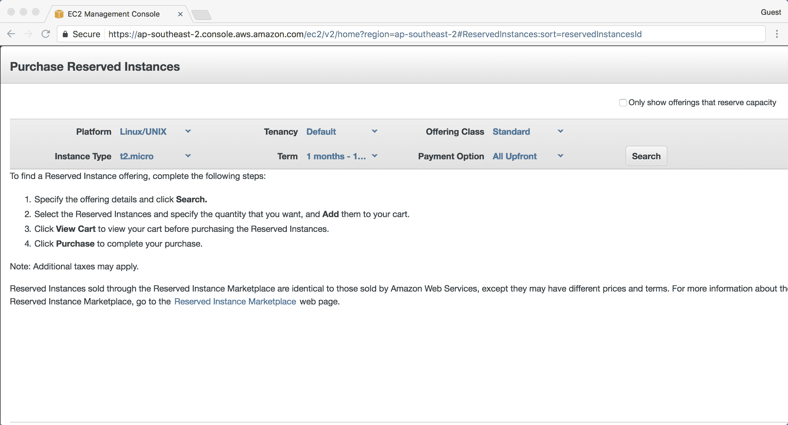

# 第九章：估算成本

本章内容包括：

+   计算成本

+   估算 CloudFormation 模板成本

+   购买预留实例

+   估算总拥有成本

# 介绍

刚开始使用 AWS 时，最难适应的事情之一是几乎每一样使用的东西都要付费。AWS 的最大优势之一就是你只为使用的部分付费。这使得许多人刚开始使用 AWS 时很难迅速回答*这会花多少钱？*的问题，因为他们并不清楚自己当前到底用多少！

在*传统*的基础设施或数据中心设置中，许多成本在初始支出或年度合同中支付。由于 AWS 没有前期费用，且少有长期承诺，因此关于成本的常规思维方式被颠倒了。

有许多有用的工具可以帮助你更好地估算 AWS 使用成本。别忘了每个 AWS 服务页面都有定价部分。虽然一些定价模型开始时可能会有些困惑，但很快就能理解。

# 计算成本

AWS 简单月度计算器是一个网站应用程序，旨在帮助你估算和预测 AWS 成本。通过列出你预计将消耗的资源，你可以计算按需付费的费用，这也是 AWS 的计费方式——没有前期费用。

# 准备就绪

为了有效使用 AWS 简单月度计算器，你需要提前了解你每月将使用的具体服务和资源。

你还需要了解一些细节，比如每月的数据传输量和你需要存储的数据量。在 AWS 中，你需要为进出 AWS 的数据付费（例如，访问你网站的访客），但不需要为 AWS 服务之间的数据传输付费（例如，从 EC2 实例到 RDS 数据库的传输）。

# 如何操作...

1.  访问计算器网站，[`calculator.s3.amazonaws.com/index.html`](http://calculator.s3.amazonaws.com/index.html)：


1.  根据你的账户情况选择/取消选择免费使用层选项——如果账户少于 12 个月，你有资格使用免费层。


1.  在添加资源之前，确保你选择了正确的区域，因为不同区域的价格可能不同：


1.  通过从左侧菜单选择相关服务并填写详细信息来添加资源：


1.  持续根据需要添加资源：


1.  一旦你添加了所有资源，查看该标签上的预计月账单：


1.  在确认估算的详细信息后，点击“保存并分享”按钮以添加一些关于报告的附加元数据。所有字段都是可选的：


1.  将为你的报告生成一个特定的一次性 URL，你可以将其与他人分享：


# 工作原理...

计算器的准确性完全依赖于您预测需求和使用情况的能力——当您刚开始使用 AWS 时，这可不是一件容易的事！

不幸的是，并非所有 AWS 服务都在计算器中（一个显著的例外是 AWS Lambda）。对于这些服务，您需要根据服务的定价页面自行计算费用。

服务和资源的费用可能因区域而异。一般来说，`us-east-1`区域是最便宜的，并且拥有最多的服务（并非所有服务都在所有区域提供），因此如果您想知道最低成本的选项，可以选择该区域。其他区域的价格因供需、运营成本以及 AWS 未公开的其他原因而有所不同。

一些服务（例如 DynamoDB、Lambda 等）有免费的服务层，即使您的账户不符合*标准*免费层的条件（即账户超过 12 个月），也适用这些免费层。这些服务在其特定的计算器页面上会有一条说明，详细列出包含的内容：



完成后，您可以为估算报告生成一个特定的 URL，并与他人分享。访问此 URL 不需要身份验证，因此请不要在报告中放入任何敏感信息。唯一的保护措施是该 URL 不太可能被猜中（因为它只是计算器网站加上一个 GUID 参数）。

# 另见

+   *估算 CloudFormation 模板费用*配方

# 估算 CloudFormation 模板的费用

本书中的大多数配方都是使用 CloudFormation（AWS 的基础设施即代码服务）进行管理和部署的。

# 准备工作

对于这个配方，您需要一个现有的 CloudFormation 模板。模板不需要作为堆栈部署，只需提供文件即可。

在这个例子中，我们将使用来自[第四章](http://Using%20AWS%20Compute)的模板，*使用 AWS 计算服务*，以安全地访问私有实例：`06-create-database-with-automatic-failover.yaml`。

# 如何操作...

1.  运行命令以生成报告：

```
 aws cloudformation estimate-template-cost \
 --template-body \
        file://06-create-database-with-automatic-failover.yaml \
 --parameters ParameterKey=VPCId,ParameterValue=test \
 ParameterKey=SubnetIds,ParameterValue=\"test,test\" \
 ParameterKey=DBUsername,ParameterValue=test \
 ParameterKey=DBPassword,ParameterValue=test \
 --query Url \
 --output text

```

1.  点击或复制并粘贴 URL 到浏览器中查看报告：


1.  点击左侧菜单中的 Amazon RDS 查看单个服务页面的详细信息：


1.  点击“估算您的月度账单”以查看模板资源的总概述：


# 它是如何工作的...

`estimate-template-cost`命令需要模板的所有参数。正如在第一步中所看到的，实际值并不重要，因为模板实际上不会被启动。您只需确保提供的值类型与该参数要求的类型匹配（例如，在此模板中，`SubnetIds`的值必须是一个值列表）。

您指定的区域非常重要！一些服务（但不是所有服务）可能会根据所在区域的不同而产生不同的费用。通常，`us-east-1`区域是最便宜的。

在命令的末尾，我们通过 `--query` 参数将输出限制为仅报告 URL。

您可以与他人共享生成的 URL，但除非您自己跟踪该 URL，否则无法检索之前的报告。

在计算器网站上，模板的资源会预先填充，即使您无法立即看到它们。报告始终默认显示 Amazon EC2 服务页面，因此您需要通过左侧菜单访问相关的服务页面（在本例中为 Amazon RDS）。

最后，您可以在“每月账单估算”标签页中查看您的模板每月成本的完整报告。如果您的模板包含许多不同类型的资源/服务，您将会在此看到它们的汇总。

# 另见

+   第六章中的 *创建具有自动故障转移的数据库* 配方，*数据库服务*

+   *计算成本* 配方

# 购买预留实例

预留实例可能会引起一些混淆，并且常常被误解。以下是一些指导，帮助您走上正确的道路：

+   与普通按需实例相比，预留实例没有任何区别的技术特性。

+   预留实例并不是某种特定类型或类别的实例。

+   简而言之，购买预留实例即是购买按需实例的折扣小时费率，该实例的属性与预留实例相匹配。

+   折扣后的小时费率会根据您支付的预付款金额有所不同。通常来说，您预付的金额越多，折扣越大。

当您购买预留实例时，您需要指定以下属性：

+   平台（Linux/Windows）

+   范围（区域或可用区）

+   实例类型（例如，m3.large）

+   租户（共享或专用）

+   产品类别（标准或可转换）

+   期限（1-12 个月或 1-3 年）

+   支付选项（无预付款、部分预付款、全额预付款）

我们将在本节稍后更详细地探讨这些内容。现在，让我们开始，看看如何进行购买。

# 准备工作

您需要一个 AWS 账户，并且对您希望预留的实例类型及其预留时间有所了解。请参考之前提到的预留实例属性，以获取您继续操作所需的准确信息。

您选择的支付选项将显著影响您购买预留实例时支付的价格：

+   无预付款：这意味着您现在不需要支付任何费用，但无论是否有与预留实例匹配的实例，您都将按整个期限收取折扣后的小时费率。还需注意，选择此选项将限制您选择标准预留实例的期限为 1 年，选择可转换预留实例的期限为 3 年（我们将在本节稍后讨论这些内容）。

+   部分预付款：这种预留方式意味着您支付较少的预付款，然后只按您实际使用的实例小时数收取折扣后的小时费率。

+   全额预付：顾名思义，您需要为整个期限支付实例的全部费用。在该期限内，您的匹配实例的小时费率将获得有效的 100% 折扣。

一旦您了解了实例预订的所有属性，就可以继续进行购买。

# 如何操作...

1.  进入 EC2 网页控制台，选择“预留实例”，然后选择“购买预留实例”：


1.  现在我们需要搜索您希望购买的实例类型。在此示例中，我们将选择以下内容：

+   平台：Linux/UNIX

+   租用类型：默认

+   提供类：标准

+   实例类型：t2.micro

+   期限：1 个月-12 个月

+   支付选项：全额预付

1.  显然，选择最适合您的工作负载的选项。您几乎肯定想在这里选择“默认”作为租用类型。专用租用/实例运行在只会被一个客户（您）占用的硬件上，且费用更高：



1.  控制台将返回实例预订的价格。请注意，由于我们没有选择“仅显示预留容量的选项”，我们看到的是一个单一的结果，即适用于我们当前在控制台中查看的区域的预订。可以将其视为*区域级别*的预订：


1.  现在尝试选择“仅显示预留容量的选项”，并注意当前区域显示了所有可用区。您可以将其视为*可用区级别*的预订。显然，选择这些选项将使您锁定到一个特定的可用区；但是，您也会获得一个*容量预订*（接下来讨论）：


1.  选择适合您的预订，然后点击“添加到购物车”，再点击“查看购物车”。

1.  下一页将显示您即将购买的摘要。点击“购买”继续。请注意，这是不可逆的操作。预留实例不能取消。请谨慎选择！


# 它是如何工作的...

完成购买后，您的预订将标记为“待付款”，然后很快会变为“激活”状态（还有一个可能的状态是“已退役”）。

一旦您的预订状态为“激活”，折扣将自动应用于匹配的实例。AWS 将此小时折扣称为*计费优惠*。

选择可转换预订类立即排除了除三年期之外的所有选项。作为回报，您将比标准预订获得更多的灵活性，因为如果您决定该预订不再满足您的需求，您可以*转换*为等值或更高价值的预订，当然需要支付差额。

如果你为特定的可用区做了预留，AWS 还会为你提供*容量预留*，这将确保该区域实例的可用性。例如，如果你的工作负载需要在整个可用区发生故障时保持一定的容量，这可能是你需要考虑的事项。此类事件通常会导致未受影响区域的新实例请求激增；然而，没有容量预留的客户可能会发现他们的新实例请求无法得到满足，因为缺乏容量（这并不罕见），从而错失机会或迫使他们为另一个区域和/或实例类型发出新请求，同时还得祈祷好运。

与*账单优惠*（按小时折扣）不同，账单优惠在购买后立即应用，而容量预留则由你在匹配预留属性的区域启动的第一个实例使用。

# 还有更多...

+   代表你启动实例的服务（如自动扩展、Elastic Beanstalk 等）也有资格享受按小时折扣。

+   标准预留可以选择 1 年或 3 年。前面提到过，可转换预留固定为 3 年。

+   在合并账单模型下，预留实例的折扣适用于所有子账户。例如，如果你为账户 A 购买了一个预留实例，但没有与其属性匹配的服务器，那么预留将自动应用于账户 B 中的匹配实例。这仅适用于账单优惠，而不适用于容量优惠。

+   预留实例可以在 AWS 市场上出售。如果预留不再适合你的需求，这很有用。请注意，你需要拥有美国银行账户才能进行此操作。

+   如果预留实例似乎不符合你的工作负载类型，你可以考虑使用计划实例。

# 估算总拥有成本

AWS TCO 计算器旨在为你提供一个大致的视图，帮助你了解在 AWS 上运行等效基础设施的成本，和在你自己的共址数据中心或本地数据中心相比如何。

计算器已由独立第三方进行审计，但在做出购买决定之前，当然应该将其输出与自己的计算结果进行对比。

# 准备工作

在这个示例中，我们将描述一个典型的三层 Rails 图像处理应用程序，运行时硬件量适中。你可以使用我们的示例配置，或者根据你自己的硬件需求进行操作。

# 如何操作...

1.  访问 [`awstcocalculator.com/`](https://awstcocalculator.com/)。

1.  选择你的货币、位置、AWS 区域和工作负载类型。在我们的案例中，我们将选择以下内容：

+   澳大利亚元

+   共址

+   亚太地区（悉尼）

+   一般


TCO 计算器—工作负载

1.  现在我们需要描述我们的服务器需求。我们将指定我们的应用运行在物理服务器上，配置如下：

+   应用名称: `nginx`

    +   服务器类型: 非数据库

    +   # 每台服务器处理器数量: 2

    +   # 处理器/核心数: 2

    +   # 服务器数量: `2`

    +   内存（GB）: `16`

+   应用名称: `rails`

    +   服务器类型: 非数据库

    +   # 每台服务器处理器数量: 2

    +   # 处理器/核心数: 4

    +   # 服务器数量: `4`

    +   内存（GB）: `32`

+   应用名称: `mysql`

    +   服务器类型: 数据库

    +   # 每台服务器处理器数量: 2

    +   # 处理器/核心数: 8

    +   # 服务器数量: `2`

    +   内存（GB）: `64`

    +   数据库引擎: `MySQL`


TCO 计算器—服务器

1.  最后，我们需要输入我们的存储需求。以我们的示例 `rails` 应用为例，我们需要以下配置：

+   存储类型: 对象存储

+   原始存储容量: `2`TB

+   访问频率低的比例: `90`


TCO 计算器—存储

1.  继续点击计算 TCO。

1.  三年成本细分图提供了潜在节省的高层次视图。您可以看到，在我们的示例中，AWS 估计我们在未来三年内将节省 68% 的基础设施成本。相当令人印象深刻！


TCO 计算器—总结

1.  继续浏览报告，查看按资源类型分类的成本细分：


TCO 计算器—图表

# 它是如何工作的...

计算器将根据您的服务器需求，将它们映射到适当大小的 EC2 实例。由于我们已经明确要求需要一个对象存储，因此它会根据我们所在地区 S3 存储的价格来计算我们的存储成本。

# 还有更多...

让我们来看看幕后运作，看看我们是如何在 AWS 上节省如此多资金的：

+   我们的 EC2 实例价格基于三年预留实例的价格，并进行部分预付。这是公平的比较吗？是，也不是。您可能会被锁定在本地或共同托管解决方案的固定硬件合同中，因此将类似的合同条款应用于 AWS 定价模型是有意义的。实际上，您可能希望在迁移到 AWS 并对实例类型进行一些微调后，再考虑购买预留实例。另一方面，如果您的服务器使用全额预付的实例预留，AWS 成本可能会进一步降低。

+   对象存储系统的比较是否公平，可能取决于您的本地或共同托管解决方案的功能集。例如，S3 具有对存储对象应用*低频访问*存储类别的功能，这可以减少存储成本，但也（理论上）略微降低其可用性。您可能在本地或共同托管存储中没有这个功能。

+   在我们本地/共同托管的设施中，存储的三年成本为 AU $69,660，其中高达 97%的成本是*每月操作机架的费用*。这包括空间租赁、冷却、电力等。

+   虽然成本计算器采取的是纯粹的基础设施视角，但它也考虑到了支持成本。如果你是 AWS 新手，可能会依赖 AWS 支持来帮助你启动和运行。

+   你还需要考虑一些培训费用，甚至可能需要雇佣熟悉在 AWS 上部署和迁移系统的员工。你的开发人员也会开始从不同的角度思考如何构建和部署他们的应用程序。一定要把这部分也考虑进去。

+   如果你对本地或共置的估算不完全满意，你可以继续修改计算中使用的数字。滚动到页面顶部，点击“修改假设”来输入你自己的硬件价格：


TCO 计算器——修改假设

# 另见

+   *购买预留实例* 方案
