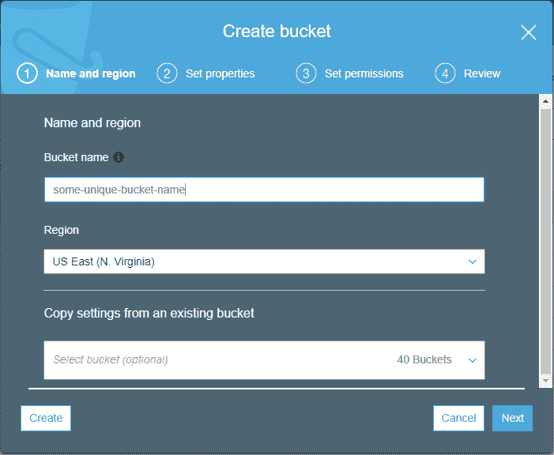
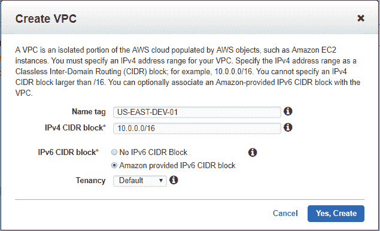
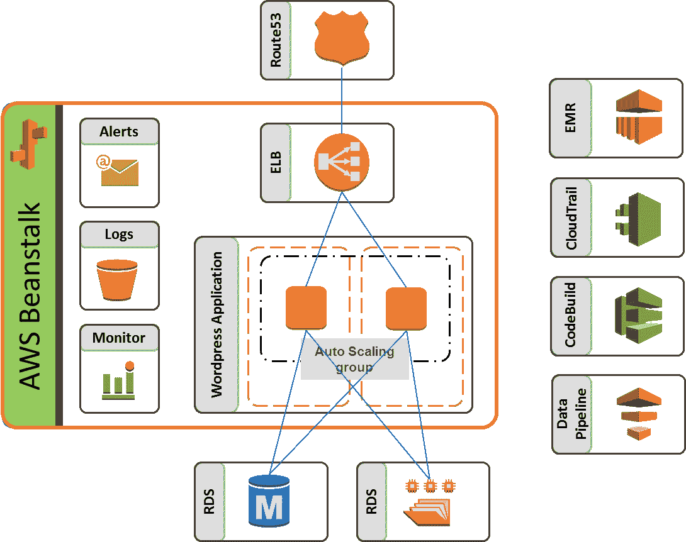

# 第一章：AWS 有什么新变化？

在信息技术行业工作多年后，你会看到许多新技术、产品和平台的出现，它们开始发展，逐渐成熟，最终被更快、更好的技术所取代！我想在某些方面，这个概念也适用于这本书。当我在 2016 年首次开始撰写这本系列的第一版时，我认为这将是技术的巅峰，任何东西都无法取代它！而现在，我正做着完全相反的事情！撰写第二版只是一个小小的证明，证明一切都会随着时间的推移而发展！看看 AWS，你就能看到平台在过去几年中发生了多么巨大的变化和成长！

我还记得 2009 年我第一次开始探索 AWS 的时候，那时 EC2 和 CloudFront 仍处于早期阶段，仍在为它们添加新功能，SimpleDB 和 VPC 刚刚开始成形，等等；真正让我感到惊讶的是平台今天已经发展到如此地步！AWS 提供了 50 多种不同的解决方案和服务，涵盖了从大数据分析、无服务器计算，到数据仓库和 ETL 解决方案、数字工作空间和代码开发服务，AWS 应有尽有！这也是我一直是其忠实粉丝的原因之一！它不仅仅关乎收入和客户数量，更关乎如何适应和发展以应对不断变化的时代和需求。

所以，我们又回来了！一本新书，里面有许多新的内容等待我们学习和探索！但在我们深入研究一些非常有趣且强大的服务之前，让我们先回顾一下过去一年里 AWS 发生了什么变化，以及在第一版中我们探讨的那些服务今天是如何发展的！

本章将涵盖以下主题：

+   现有 AWS 服务的改进。

+   简要介绍新推出的 AWS 服务及其用途。

+   进攻计划！我们将如何推进本书的学习。

# 现有服务的改进

在第一版《*AWS 管理 - 权威指南*》中涵盖的服务中，有很多改进。在本节中，我们将重点介绍这些重要的改进，并理解它们的用途。首先，让我们看看过去一两年中 EC2 的关键增强功能。

# 弹性计算云

**弹性计算云**（**EC2**）迄今为止是 AWS 中运行时间最长的服务之一，然而，它仍然在不断发展，随着时间的推移添加新的功能。这里提到了一些值得注意的功能改进和新增内容：

+   **t2.xlarge 和 t2.2xlarge 实例的介绍**：**t2** 工作负载是一种特殊类型的工作负载，因为它提供低成本的可突发计算，适合运行不需要持续使用 CPU 的通用应用程序，如 Web 服务器、应用服务器、LOB 应用、开发等。*t2.xlarge* 和 *t2.2xlarge* 实例类型分别提供 16 GB 内存和 4 vCPU，以及 32 GB 内存和 8 vCPU。

+   **I3 实例家族的介绍**：虽然 EC2 提供了一个全面的实例家族集合，但对于专门优化存储的实例家族的需求日益增加，这些实例非常适合运行诸如关系数据库或 NoSQL 数据库、分析工作负载、数据仓库、Elasticsearch 应用等工作负载。于是，I3 实例应运而生！I3 实例使用基于非易失性内存快速接口（NVMe）SSD 运行，能够提供极为优化的高 I/O 操作。最大资源容量为 64 vCPU、488 GB 内存和 15.2 TB 本地附加 SSD 存储。

这并不是一个详尽无遗的列表。如果你想了解 AWS 带来的更多变化，可以查看这个链接：[`aws.amazon.com/about-aws/whats-new/2016/`](https://aws.amazon.com/about-aws/whats-new/2016/)。

# FPGA 和 GPU 的可用性

采用公共云的客户的一个关键用例是高端处理单元的可用性，这些处理单元是运行高性能计算（HPC）应用所需的。去年新增的一种实例类型是 F1 实例，它配备了现场可编程门阵列（FPGA），你可以编程来为应用程序创建自定义硬件加速。另一项加入 EC2 实例家族的令人兴奋的特性是引入了弹性 GPU 概念。这使你可以以显著更低的成本为应用程序提供图形加速支持，同时提高性能。弹性 GPU 非常适合需要少量 GPU 来进行图形加速，或者有一些应用程序可能从某些 GPU 中受益，但同时还需要大量计算、内存或存储的场景。

# 简单存储服务

与 EC2 类似，**简单存储服务**（**S3**）也增加了许多新特性和支持。以下是一些说明：

+   **S3 对象标签**：S3 对象标签类似于 AWS 提供的其他标签机制，通常用于管理和控制对 S3 资源的访问。标签是简单的键值对，你可以用它们为 S3 资源创建和关联 IAM 策略，设置 S3 生命周期策略，并管理对象在不同存储类别之间的转换。

+   **S3 清单**：S3 清单是一个特别功能，专门用于目录化各种对象，并将其提供为可用于进一步分析和盘点的 CSV 文件。通过 S3 清单，您现在可以每天或每周提取存储桶中所有对象及其元数据的列表。

+   **S3 分析**：AWS 在 S3 上投入了大量的工作和努力，使其不仅仅是另一个无限可扩展的存储解决方案。S3 分析为最终用户提供了分析存储访问模式的手段，并根据这些分析结果定义合适的存储类别。您只需设置一个存储类别分析策略（无论是针对对象、前缀还是整个存储桶），即可启用此功能。启用后，该策略将监控存储访问模式，并在 AWS 管理控制台中提供您的存储使用情况的每日可视化报告。您甚至可以将这些结果导出到 S3 存储桶，以便使用您选择的其他商业智能工具（如 Amazon QuickSight）进行进一步分析。

+   **S3 CloudWatch 指标**：这一功能终于来了！您现在可以利用 13 个专为您的 S3 存储桶对象设计的全新 CloudWatch 指标。您可以接收每分钟的 CloudWatch 指标，设置 CloudWatch 告警，并访问 CloudWatch 仪表盘，以查看 S3 资源的实时操作和性能，如已下载的总字节数、4xx HTTP 响应计数等。

+   **全新** **仪表盘**：尽管 AWS 管理控制台的仪表盘和结构时常变化，但我最喜欢的还是全新的 S3 仪表盘。对象标签和存储分析策略功能现已通过新的 S3 仪表盘提供，此外，还有其他令人印象深刻且备受期待的功能，例如使用关键字搜索存储桶，以及在创建新存储桶时，能够从现有存储桶复制存储桶属性，如下图所示：

+   **Amazon S3 传输加速**：此功能允许您以非常快速的速度将大量工作负载跨地域迁移到 S3。它通过将 Amazon CloudFront 终端与 S3 配合使用，实现了数据上传速度最高可达 300 倍，无需担心任何防火墙规则或前期费用。

# 虚拟私有云

与其他服务类似，**虚拟私有云**（**VPC**）在过去几年中增加了许多新功能；这里突出了其中一些重要的功能：

+   **对 IPv6 的支持**：随着信息技术行业和互联网的指数级增长，VPC 也开始支持 IPv6 只不过是时间问题。今天，IPv6 已经在所有 AWS 区域扩展并可用，甚至与 EC2 和 S3 等服务兼容。为你的应用程序和实例启用 IPv6 是一个非常简单的过程。你需要做的就是在 VPC 创建向导中启用 IPv6 CIDR 块选项，如下所示：

每个启用 IPv6 的 VPC 都会有一个 `/56` 地址前缀，而在该 VPC 中创建的单独子网支持 `/64` CIDR 块。

+   **VPC 对等连接的 DNS 解析**：启用 VPC 对等连接的 DNS 解析后，当从任何对等的 VPC 查询时，你现在可以将公共 DNS 主机名解析为私有 IP 地址。这实际上简化了 VPC 的 DNS 配置，并使你的网络环境能够无缝地扩展到云端。

+   **DynamoDB 的 VPC 终端节点**：今年晚些时候，将为 VPC 提供的另一个令人惊叹的功能是支持 DynamoDB 表的终端节点。为什么这突然变得如此重要？首先，如果你使用 DynamoDB 终端节点，你就不需要为你的 VPC 附加互联网网关或 NAT 实例。这实际上节省了成本，并使得应用程序与数据库之间的流量保持在 AWS 内部网络内，而不像以前那样流量必须绕过互联网才能到达 DynamoDB 实例。其次，DynamoDB 的终端节点几乎消除了需要维护复杂防火墙规则来保护 VPC 的需求。第三，也是最重要的，它是免费的！

# CloudWatch

CloudWatch 与几年前它作为服务首次推出时相比，已经经历了许多新的令人兴奋的变化和功能新增。下面是一些最新公告的快速概览：

+   **CloudWatch 事件**：CloudWatch 新增的最受期待和最有用的功能之一就是 CloudWatch 事件！事件是一种让你能够几乎实时响应 AWS 环境中变化的方式。通过配置事件规则，并在触发特定事件时执行相应的操作步骤，这使得这一切成为可能。例如，设计一个简单的备份或清理脚本，在实例每天结束时关闭时被调用，等等。你也可以选择将事件规则安排在一天、一周、一个月甚至一年中的特定时间间隔触发！这真是太棒了！

+   **高分辨率自定义指标**：我们都曾感受到需要实时监控在 AWS 上运行的应用程序和资源的需求，然而，最小的可配置监控间隔为 10 秒，这一直是一个挑战。但现在不再是这样了！随着高分辨率自定义指标的引入，您现在可以将监控精确到 1 秒的分辨率！所有这一切的最佳部分是，标准警报和高分辨率警报的配置和使用之间没有特殊区别。两者都可以执行完全相同的功能，然而，后者比前者要快得多。

+   **CloudWatch 仪表板小部件**：许多用户在将 CloudWatch 作为其集中式监控解决方案时遇到了问题，原因在于它无法创建自定义仪表板。但这一切现在已经改变，今天的 CloudWatch 支持根据应用程序的需求创建高度可自定义的仪表板。它还支持开箱即用的小部件，如 *数字* 小部件，它提供了被监控指标的最新数据点的视图，例如被监控的 EC2 实例数量，或者 *堆叠图*，它提供了个别指标及其对整体影响的便捷可视化。

# 弹性负载均衡器

在过去一年中，ELB 最重要和最有用的新增功能之一就是应用程序负载均衡器的引入。与前身 ELB 不同，应用程序负载均衡器是严格的第 7 层（应用层）负载均衡器，旨在支持基于内容的路由以及运行在容器上的应用程序。ALB 还旨在提供目标 EC2 实例和容器健康状态的额外可视化。理想情况下，这些 ALB 将用于在一组容器中动态地平衡负载，这些容器运行着可扩展的 Web 和移动应用程序。

与 AWS 在过去一年中所增加的各种服务和功能相比，这只是冰山一角！让我们快速浏览一下本书中将涵盖的各种服务。

# 新服务介绍

《AWS 管理 - 权威指南》第一版涵盖了许多核心的 AWS 服务，如 EC2、EBS、自动扩展、ELB、RDS、S3 等等。在本版中，我们将以不同的方式来探索和学习，通过探索许多与核心服务协同工作的服务和功能：

+   **EC2 系统管理器**：EC2 系统管理器是一项基本上为管理你的计算基础设施提供许多附加功能的服务。每个由 EC2 系统管理器管理的计算实体被称为*受管实例*，它可以是一个 EC2 实例或一台本地机器！EC2 系统管理器提供开箱即用的功能，创建并基准化操作系统的补丁、自动创建 AMI、运行配置脚本等更多功能！

+   **Elastic Beanstalk**：Beanstalk 是一项强大而简便的服务，旨在帮助开发者轻松部署和扩展他们的 web 应用程序。目前，Beanstalk 支持使用 Java、.NET、PHP、Node.js、Python、Ruby 和 Go 开发的 web 应用程序。开发者只需设计并上传他们的代码到 Beanstalk，后者会自动处理应用程序的负载均衡、自动扩展、监控等功能。在写作时，Elastic Beanstalk 支持通过 Docker 容器或直接通过 EC2 实例部署应用程序，而使用该服务的最佳部分是它完全免费！你只需为所消费的底层 AWS 资源付费。

+   **弹性文件系统**：定义 **弹性文件系统** 或 **EFS** 最简单的方法是把它看作是一个超强版的 NFS 共享！EFS 提供简单且高度可扩展的文件存储服务，旨在与 EC2 实例一起使用。你可以让多个 EC2 实例连接到单个 EFS 挂载点，从而为你的应用程序和工作负载提供一个公共的数据存储。

+   **WAF 和 Shield**：在本书中，我们将探索一些提供安全性和合规性服务的服务，这些服务为你的标准 VPC 提供额外的安全层。我们将学习的其中两个服务是 WAF 和 Shield。**WAF**，或称 **Web 应用防火墙**，旨在保护你的应用程序免受可能影响其可用性和安全性的 web 漏洞攻击。通过使用 WAF，你可以创建自定义规则，以防止你的 web 应用程序受到常见攻击模式的侵害，例如 SQL 注入、跨站脚本等。

类似于 WAF，Shield 也是一项托管服务，提供防御 DDoS 攻击的功能，保护你的网页或 web 应用程序免受攻击：

+   **CloudTrail 和 Config**：CloudTrail 是我们将在接下来的章节中学习的另一个服务。它旨在记录和监控你的 AWS 账户和基础设施活动。当你需要确保你的 AWS 账户符合合规性、审计和标准时，这项服务非常有用，并可以采取必要的措施来缓解这些问题。另一方面，Config 提供了一套非常相似的功能，但它专注于评估和审计 AWS 资源的配置。两项服务被同义使用，以提供合规性和治理，帮助进行操作分析、故障排除以及满足安全需求。

+   **Cognito**：Cognito 是一个非常棒的服务，可以简化你为网站甚至移动应用创建注册页面的过程。你还可以选择集成社交身份提供商，如 Facebook、Twitter 和 Amazon，使用 SAML 身份解决方案。

+   **CodeCommit、CodeBuild 和 CodeDeploy**：AWS 为开发人员提供了一套非常丰富的工具和服务，旨在快速且安全地交付软件。这些工具的核心包括 CodeCommit、CodeBuild 和 CodeDeploy 三个服务，我们将在本书中学习和探索它们。正如名字所示，这些服务为你提供了安全存储和版本控制应用程序源代码的能力，同时还能自动构建、测试并将你的应用程序部署到 AWS 或本地环境。

+   **SQS 和 SNS**：**SQS**，即 **简单队列服务**，是 AWS 提供的完全托管的队列服务，旨在解耦基于微服务或分布式应用程序的架构。你甚至可以使用 SQS 在不同的应用程序之间发送、存储和接收消息，并且无需管理任何基础设施，同时还能处理高流量。**SNS** 是一个 **简单通知服务**，主要用作发布/订阅消息服务或通知服务。你还可以利用 SNS 触发其他 AWS 服务的自定义事件，例如 EC2、S3 和 CloudWatch。

+   **EMR**：**弹性 MapReduce** 是一个托管的 *Hadoop 即服务*，提供一个基于 EC2 实例的集群平台，用于运行 Apache Hadoop 和 Apache Spark 框架。EMR 非常适用于处理大量数据，并用于将大量数据从一个 AWS 数据源转换和迁移到另一个数据源。EMR 还提供了高度的灵活性和可扩展性，你可以根据当前处理的数据量调整集群的大小。此外，它还设计为可以与其他 AWS 服务无缝集成，如 S3 用于存储数据，CloudWatch 用于监控集群，CloudTrail 用于审核请求等。

+   **Redshift**：Redshift 是一个云中的千兆字节级别托管数据仓库服务。与其对应的 EMR 类似，Redshift 也基于集群化的 EC2 实例工作，在这些实例上，你可以上传大型数据集并执行分析查询。

+   **数据管道**：数据管道是一个托管服务，使用户能够处理和迁移数据集，从一个 AWS 服务迁移到另一个服务，甚至从本地数据存储迁移到 AWS 存储服务，如 RDS、S3、DynamoDB，甚至 EMR！你可以调度数据迁移任务，跟踪依赖关系和错误，甚至编写并创建前置条件和活动，定义数据管道对数据采取的操作，比如将数据运行通过 EMR 集群，执行 SQL 查询等。

+   **IoT 和 Greengrass：** AWS IoT 和 Greengrass 是两个非常强大的服务，旨在收集和聚合各种设备传感器数据，并将这些数据流式传输到 AWS 云中进行处理和分析。AWS IoT 提供了一个可扩展且安全的平台，借助该平台，您可以将数十亿的传感器设备连接到云或其他 AWS 服务，并利用它们收集、处理和分析数据，而无需担心底层基础设施或可扩展性需求。Greengrass 是 AWS IoT 平台的扩展，基本上提供了一种机制，允许您在传感器设备上直接运行和管理数据预处理作业。

这些服务完成后，让我们快速看一下如何计划推进本书其余章节的内容！

# 攻略计划！

就像上一版一样，我们将为本书制定一个简单的攻击计划！所谓攻击计划，我只是指我如何规划章节内容的结构并将它们整合在一起！在本书的大部分内容中，我们将专注于一个简单的用例，比如使用 Elastic Beanstalk、Elastic File System、WAF 和 Shield、EMR、Redshift 等一些非常酷的服务在 AWS 上托管 WordPress 应用程序，等等！以下是我们目标在书末实现的简单展示：

以下是下一些章节的大致结构：

1.  我们将通过首先在 EC2 实例上手动托管 WordPress，作为独立安装，然后学习如何借助 EC2 Systems Manager 实用工具管理这些实例，开始设置我们的 WordPress。

1.  完成此步骤后，我们将使用 Elastic Beanstalk 和 Elastic File System 的组合来托管相同的 WordPress，并对高可用性和可扩展性有更多的控制，同时在此过程中学习这两项服务的内部工作原理及其用例。

1.  既然站点已经托管，我们将通过利用 WAF 和 Shield 以及启用 CloudTrail 和 Config 等治理功能，为其增加一层安全保护。

1.  稍后我们还将学习如何利用 AWS 提供的代码开发服务，分别是 CodeCommit、CodeBuild 和 CodeDeploy，来创建一个有效的 CICD 流水线，以便将更新推送到我们的网站。

1.  最后，我们还将执行一些对站点至关重要的日志分析，使用 Elastic MapReduce 和 Redshift，并学习如何使用 Data Pipeline 备份我们站点的数据。

1.  但这还不是全部！正如前面提到的，我们还将学习一些额外的服务，形式包括 IAM 和 AWS Cognito 服务，用于身份验证和安全性，以及 AWS IoT 和 AWS Greengrass。

# 总结

让我们快速总结一下到目前为止在本章中学到的内容！我们首先快速回顾了过去几年内核心 AWS 服务中包含的一些关键功能和新增内容。不过，请记住，这绝不是一个完整的列表！还有很多内容需要覆盖和学习，但为了简便起见，我会将这些内容留给大家自行阅读。之后，我们还浏览并了解了将会在这系列*AWS 管理 - 权威指南*中包含的服务。最后，我们通过利用一个简单的 WordPress 应用程序作为我们部署和用例的焦点，展示了我们将如何构建接下来的章节！

在下一章中，我们将首先在 EC2 实例上部署我们的简单 WordPress 应用程序，然后结合 EC2 系统管理器及其附加服务来管理和跟踪 EC2 实例的系统配置，所以请继续关注！我们才刚刚开始！
