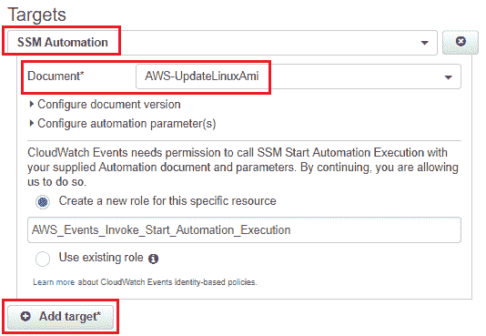

# 第二章：使用 Systems Manager 管理 EC2

EC2 实例一直是 AWS 提供的核心服务，EC2 也在不断发展，每年都会添加新的功能和实例类型。AWS re:Invent 2016 中新增的一项非常酷的服务就是 EC2 Systems Manager！

在本章中，我们将深入学习 EC2 Systems Manager 及其相关子服务；具体包括：

+   **运行命令**：允许你直接在启用 EC2 Systems Manager 的 EC2 实例上执行命令的服务

+   **状态管理器**：允许你为启用 EC2 Systems Manager 的 EC2 实例指定期望的状态

+   **补丁管理**：为管理员提供管理 EC2 实例上补丁部署的能力

+   **自动化**：允许管理员自动化某些任务的部署

+   **清单**：从管理的 EC2 实例收集和管理软件清单的服务

听起来很激动人心吧？那我们还在等什么呢？开始吧！

# 介绍 EC2 Systems Manager

正如名字所示，EC2 Systems Manager 是一项管理服务，它为管理员和最终用户提供了一套丰富的任务执行功能，涵盖了管理 EC2 实例集群的多个方面，比如定期为实例打补丁、跟踪实例的配置状态、确保实例符合状态模板、通过一个工具执行脚本和命令到你的实例集群，等等！EC2 Systems Manager 还特别设计用于帮助管理员管理混合计算环境，所有这些都可以通过 EC2 Systems Manager 仪表板进行管理。它高效且具成本效益，因为它不需要专门的软件或第三方服务来管理你的混合环境，这些服务往往昂贵！

那么 AWS 是如何实现这些功能的呢？一切都始于“托管实例”的概念。托管实例是由 EC2 Systems Manager 服务管理和控制的特殊 EC2 实例。每个托管实例都包含一个 **Systems Manager**（**SSM**）代理，该代理负责与 Systems Manager 工具进行通信并配置实例状态。Windows Server 2003–2012 R2 AMI，Windows Server 2003–2012 R2 AMI 将自动安装 SSM 代理。然而，Linux 实例默认情况下并不安装 SSM 代理。让我们快速看看如何安装该代理，并将我们的第一个开发实例设置为 AWS 中的托管实例。

# 开始使用 SSM 代理

在本节中，我们将安装并配置一个新的 Linux 实例上的 SSM 代理，我们将其称为开发实例，然后通过将代理的日志文件流式传输到 Amazon CloudWatch Logs 来验证它的工作情况。让我们开始吧！

# 配置 IAM 角色和策略以支持 SSM

首先，我们需要为我们的 EC2 系统管理器创建并配置 IAM 角色，以便其处理和执行对 EC2 实例的命令。你可以使用系统管理器提供的托管策略，或者选择创建你自己的自定义角色，并为其分配特定权限。对于这一部分，我们将创建一个自定义角色和策略。

开始时，我们首先为系统管理器托管的实例创建一个自定义 IAM 策略：

1.  登录到你的 AWS 账户并选择主仪表盘中的 IAM 选项，或者打开 [`console.aws.amazon.com/iam/`](https://console.aws.amazon.com/iam/) 以访问 IAM 控制台。

1.  接下来，从导航窗格中选择“策略”。这将显示当前 AWS 默认提供和支持的现有策略列表。

1.  在策略筛选器中输入`SSM`，以查看当前为 SSM 提供的策略列表。

1.  选择 AmazonEC2RoleforSSM 策略，并复制其内容以形成新的策略文档。以下是该策略文档的一个片段供参考：

```
{ 
    "Version": "2012-10-17", 
    "Statement": [ 
        { 
            "Effect": "Allow", 
            "Action": [ 
                "ssm:DescribeAssociation", 
                  ..... SSM actions list  
            ], 
            "Resource": "*" 
        }, 
        { 
            "Effect": "Allow", 
            "Action": [ 
                "ec2messages:AcknowledgeMessage", 
                "ec2messages:DeleteMessage", 
                "ec2messages:FailMessage", 
                "ec2messages:GetEndpoint", 
                "ec2messages:GetMessages", 
                "ec2messages:SendReply" 
            ], 
            "Resource": "*" 
        }, 
        { 
            "Effect": "Allow", 
            "Action": [ 
                "cloudwatch:PutMetricData" 
            ], 
            "Resource": "*" 
        }, 
        { 
            "Effect": "Allow", 
            "Action": [ 
                "ec2:DescribeInstanceStatus" 
            ], 
            "Resource": "*" 
        }, 
        { 
            "Effect": "Allow", 
            "Action": [ 
                "ds:CreateComputer", 
                "ds:DescribeDirectories" 
            ], 
            "Resource": "*" 
        }, 
        { 
            "Effect": "Allow", 
            "Action": [ 
                "logs:CreateLogGroup", 
                "logs:CreateLogStream", 
                ..... CloudWatch Log actions 
            ], 
            "Resource": "*" 
        }, 
        { 
            "Effect": "Allow", 
            "Action": [ 
                "s3:PutObject", 
                "s3:GetObject", 
                "s3:AbortMultipartUpload", 
                "s3:ListMultipartUploadParts", 
                "s3:ListBucketMultipartUploads" 
            ], 
            "Resource": "*" 
        }, 
        { 
            "Effect": "Allow", 
            "Action": [ 
                "s3:ListBucket" 
            ], 
            "Resource": "arn:aws:s3:::amazon-ssm-packages-*" 
        } 
    ] 
} 
```

1.  一旦策略被复制，返回到策略仪表盘，点击“创建策略”选项。在创建策略向导中，选择“创建您自己的策略”选项。

1.  提供合适的策略名称，并将复制的 AmazonEC2RoleforSSM 策略内容粘贴到策略文档部分。你现在可以根据自己的需求调整策略，但完成后，记得选择“验证策略”选项，以确保策略在语法上是正确的。

1.  完成后，选择“创建策略”以完成该过程。

完成此步骤后，你现在拥有一个自定义的 IAM 策略，用于管理系统管理器托管的实例。

下一个重要的策略是我们需要为系统管理器创建的自定义 IAM 用户策略。该策略将明确哪些特定用户可以查看系统管理器文档，并使用系统管理器的 API 对选定的受管实例执行操作：

1.  再次登录到你的 AWS IAM 仪表盘，选择“策略”选项，正如之前的步骤所做。

1.  在策略筛选器中再次输入`SSM`，然后选择 AmazonSSMFullAccess 策略。复制其内容，并将以下代码粘贴到新策略的策略文档部分，以创建一个自定义的 SSM 访问策略：

```
{ 
    "Version": "2012-10-17", 
    "Statement": [ 
        { 
            "Effect": "Allow", 
            "Action": [ 
                "cloudwatch:PutMetricData", 
                "ds:CreateComputer", 
                "ds:DescribeDirectories", 
                "ec2:DescribeInstanceStatus", 
                "logs:*", 
                "ssm:*", 
                "ec2messages:*" 
            ], 
            "Resource": "*" 
        } 
    ] 
} 
```

1.  在完成创建过程之前，记得*验证*策略。你现在应该有两个自定义策略，如下图所示：


创建好策略后，我们接下来只需要创建一个新的实例配置文件角色，将完全访问策略附加到新角色，并最终验证系统管理器与新创建角色之间的信任关系：

1.  要创建一个新角色，从 IAM 管理仪表盘中选择“角色”选项。

1.  在“创建角色”向导中，从 AWS 服务角色类型中选择 EC2 选项，如下图所示。接下来，选择 EC2 作为本次活动的*使用场景*，然后点击“下一步：权限”按钮继续：


1.  在“附加权限策略”页面中，筛选并选择我们在本练习开始时创建的 ssm-managedInstances 策略。完成后点击“审核”。

1.  最后，在“审核”页面提供一个合适的角色名称，然后点击“创建角色”以完成整个过程！

配置好角色后，我们需要验证实例配置文件角色的 IAM 策略是否包含`ssm.amazonaws.com`作为受信实体：

1.  为了验证这一点，选择 IAM 角色页面中新创建的角色，然后点击“信任关系”选项卡。

1.  在这里，选择“编辑信任关系”选项，并在策略编辑器中粘贴以下代码片段，如所示。记得将*EC2 和 SSM*都添加为受信服务，而不是仅仅添加其中一个：

```
{ 
  "Version": "2012-10-17", 
  "Statement": [ 
    { 
      "Sid": "", 
      "Effect": "Allow", 
      "Principal": { 
        "Service": [ 
          "ec2.amazonaws.com", 
          "ssm.amazonaws.com" 
        ] 
      }, 
      "Action": "sts:AssumeRole" 
    } 
  ] 
} 
```

1.  配置好新的信任策略后，点击“更新信任策略”以完成此过程。恭喜！

1.  配置 Systems Manager 几乎完成！剩下最后一步，我们需要将之前创建的第二个策略（SSM 完全访问权限）附加到我们的一个 IAM 用户上。在这种情况下，我已将该策略附加到我 AWS 环境中现有的一个用户上，然而，你也可以创建一个完全新的用户，专门用于 Systems Manager，并将其分配 SSM 访问策略。

策略配置完毕后，我们可以继续在我们的简单开发实例上安装和配置 SSM 代理。

# 安装 SSM 代理

正如在本章开始时讨论的，Systems Manager 或 SSM 代理是一个至关重要的软件，需要在 EC2 实例上安装和配置，才能让 Systems Manager 管理它。写本文时，SSM 代理支持以下操作系统：

+   **Windows**：

    +   Windows Server 2003（包括 R2）

    +   Windows Server 2008（包括 R2）

    +   Windows Server 2012（包括 R2）

    +   Windows Server 2016

+   **Linux**（64 位和 32 位）：

    +   Amazon Linux 2014.09、2014.03 或更高版本

    +   Ubuntu Server 16.04 LTS、14.04 LTS 或 12.04 LTS

    +   Red Hat Enterprise Linux（RHEL）6.5 或更高版本

    +   CentOS 6.3 或更高版本

+   **Linux**（仅限 64 位）：

    +   Amazon Linux 2015.09、2015.03 或更高版本

    +   Red Hat Enterprise Linux 7.x 或更高版本

    +   CentOS 7.1 或更高版本

    +   SUSE Linux Enterprise Server 12 或更高版本

若要在一个全新的实例上安装代理，例如我们稍后将创建的实例，你只需确保该实例提供了我们在上一节中创建的必要 SSM IAM 角色，并在实例配置的用户数据部分提供以下代码片段：

```
#!/bin/bash 
cd /tmp                
wget https://s3.amazonaws.com/ec2-downloads-windows/SSMAgent/latest/debian_amd64/amazon-ssm-agent.deb 
sudo dpkg -i amazon-ssm-agent.deb 
sudo start amazon-ssm-agent 
```

用户数据脚本在不同操作系统之间有所不同。在我的情况下，脚本旨在 Ubuntu Server 14.04 LTS (HVM) 实例上运行。你可以在 [`docs.aws.amazon.com/systems-manager/latest/userguide/sysman-install-ssm-agent.html#sysman-install-startup-linux`](http://docs.aws.amazon.com/systems-manager/latest/userguide/sysman-install-ssm-agent.html#sysman-install-startup-linux) 检查你的 SSM 代理安装脚本。

实例启动并运行后，通过 SSH 登录实例并使用以下命令验证你的 SSM 代理是否正在运行。记住，以下命令会根据你在启动时选择的操作系统有所不同：

```
# sudo status amazon-ssm-agent 
```

你应该能看到代理正在运行，如下图所示：


你还可以选择通过完成以下一组命令，在已运行的 EC2 实例上安装代理。

对于运行 Ubuntu 16.04 LTS 操作系统的实例，我们首先创建一个临时目录，用于存放 SSM 代理安装程序：

```
# mkdir /tmp/ssm 
```

接下来，使用 `wget` 工具下载特定操作系统的 SSM 代理安装程序：

```
# wget https://s3.amazonaws.com/ec2-downloads-windows/SSMAgent/latest/debian_amd64/amazon-ssm-agent.deb 
```

最后，使用以下命令执行安装程序：

```
# sudo dpkg -i amazon-ssm-agent.deb 
```

你还可以通过查看以下日志文件之一来验证代理的执行情况：

```
# sudo tail -f /var/log/amazon/ssm/amazon-ssm-agent.log  
# sudo tail -f /var/log/amazon/ssm/errors.log 
```

# 配置 SSM 代理将日志流式传输到 CloudWatch

这是 SSM 代理提供的一个特别有用的选项，特别是在你不想登录到每个实例并排除故障时。将 SSM 代理的日志与 CloudWatch 集成，使你能够将所有日志捕获并集中分析，这无疑节省了大量时间，而且它还带来额外的好处，例如配置警报、使用 CloudWatch 仪表盘查看各种指标，并将日志保留更长时间。

但是，在我们配置代理之前，我们首先需要在 CloudWatch 中创建一个单独的日志组，用于从各个实例流式传输代理日志：

1.  要做到这一点，首先在 AWS 管理控制台中选择 CloudWatch 选项，或者点击以下链接从 [`console.aws.amazon.com/cloudwatch/`](https://console.aws.amazon.com/cloudwatch/) 打开 CloudWatch 仪表盘。

1.  接下来，从导航窗格中选择日志（Logs）选项。在这里，点击创建日志组（Create log group），并为你的日志组提供一个合适的名称，如下图所示：


1.  完成后，使用 SSH 登录回你的开发实例，并运行以下命令：

```
# sudo cp /etc/amazon/ssm/seelog.xml.template /etc/amazon/ssm/seelog.xml 
```

1.  接下来，使用你喜欢的编辑器打开刚刚复制的文件，并将以下内容粘贴到其中。记得将 `<CLOUDWATCH_LOG_GROUP_NAME>` 字段替换为你自己的日志组名称：

```
# sudo vi /etc/amazon/ssm/seelog.xml 
<seelog minlevel="info" critmsgcount="500" maxinterval="100000000" 
 mininterval="2000000" type="adaptive"> 
 <exceptions> 
 <exception minlevel="error" filepattern="test*"/> 
 </exceptions> 
 <outputs formatid="fmtinfo"> 
 <console formatid="fmtinfo"/> 
 <rollingfile type="size" maxrolls="5" maxsize="30000000" 
 filename="{{LOCALAPPDATA}}\Amazon\SSM\Logs\amazon-ssm-agent.log"/> 
 <filter formatid="fmterror" levels="error,critical"> 
 <rollingfile type="size" maxrolls="5" maxsize="10000000" 
 filename="{{LOCALAPPDATA}}\Amazon\SSM\Logs\errors.log"/> 
 </filter> 
 <custom name="cloudwatch_receiver" formatid="fmtdebug" data-log-group="<CLOUDWATCH_LOG_GROUP_NAME>"/> 
 </outputs> 
CODE: 
```

1.  完成更改后，保存并退出编辑器。现在，通过 CloudWatch 仪表板查看您新创建的日志组；您应该能看到 SSM 代理的错误日志（如果有的话），以便轻松进行故障排除。

完成此步骤后，我们已经成功将 EC2 实例安装并配置为 Systems Manager 中的受管实例。要验证您的实例是否已成功添加，请在 EC2 仪表板的导航窗格中选择“Systems Manager 共享资源”部分下提供的“受管实例”选项；您应该能看到列出的实例，如下所示：


在下一节中，我们将深入探讨作为 Systems Manager 一部分提供的各种功能，首先介绍最广泛使用的一个：Run Command！

# 介绍 Run Command

Run Command 是 Systems Manager 的一个强大功能，基本上允许您在受管理的 EC2 实例队列中执行远程命令。您可以执行各种自动化管理任务，例如安装软件或修补操作系统、执行 Shell 命令、管理本地组和用户等！但这还不是全部！使用这个功能的最大优点是，它允许您在执行脚本时拥有无缝体验，即使是在您的本地 Windows 和 Linux 操作系统上，无论它们运行在 VMware ESXi、Microsoft Hyper-V 还是其他平台上。而且所有这些功能的成本？完全免费！您只需为创建的 EC2 实例和其他 AWS 资源付费，其它费用全免！

以下是由 Run Command 提供的一些常用预定义命令的简要列表，并附有简短描述：

+   `AWS-RunShellScript`：在远程 Linux 实例上执行 Shell 脚本

+   `AWS-UpdateSSMAgent`：用于更新 Amazon SSM 代理

+   `AWS-JoinDirectoryServiceDomain`：用于将实例加入 AWS 目录

+   `AWS-RunPowerShellScript`：在 Windows 实例上执行 PowerShell 命令或脚本

+   `AWS-UpdateEC2Config`：运行 EC2Config 服务的更新

+   `AWS-ConfigureWindowsUpdate`：用于配置 Windows Update 设置

+   `AWS-InstallApplication`：用于在 Windows 实例上使用 MSI 包安装、修复或卸载软件

+   `AWS-ConfigureCloudWatch`：配置 Amazon CloudWatch Logs 以监控应用程序和系统

在我们继续执行 Run Command 之前，重要的是要记住，Run Command 需要 SSM 代理以及正确的权限和角色集才能正常工作。因此，如果您还没有安装 SSM 代理或配置 IAM 策略和角色，现在是重新审视这些步骤的好时机！

在本节中，我们将看一下如何简单地执行一组命令来管理我们新添加的受管实例：

1.  首先，登录到 AWS 管理控制台并从主仪表盘选择 EC2 服务。或者，你也可以通过[`console.aws.amazon.com/ec2/`](https://console.aws.amazon.com/ec2/)直接进入 EC2 仪表盘。

1.  接下来，从导航窗格中选择“运行命令”选项，进入系统管理服务部分。你将被带到“运行命令”仪表盘，在这里你需要选择“运行命令”选项来开始。

1.  在“运行命令”页面，首先需要选择一个我们可以操作的命令文档。命令文档基本上是关于你想在托管实例上运行的命令的声明或信息集。在此场景中，我们将首先选择`AWS-RunShellScript`命令文档。

1.  在接下来的“选择目标”部分，你可以选择是否手动执行命令文档，通过选择单个实例，或者指定通过其*标签*名称标识的特定实例组。

1.  “执行条件”选项让你可以选择要在其上执行命令文档的目标实例或实例百分比。选择“目标”允许你指定允许执行命令文档的确切实例数量。执行将在每个实例上依次进行。或者，如果你选择“百分比”选项，则可以提供一个实例的百分比值，指示在单次操作中应允许多少实例执行该命令。

1.  你可以选择设置“在发生 x 个错误后停止”选项，以便在实例遇到错误时中止命令文档的执行。

1.  最后，你可以在“命令”部分粘贴你的执行代码或 Shell 脚本，如下图所示。在这种情况下，我们运行一个简单的脚本，该脚本将安装并配置 Zabbix 监控代理，以便轻松监控我们的 EC2 资源：


你可以在[`www.zabbix.com/product`](https://www.zabbix.com/product)了解更多关于 Zabbix 及其功能的信息。

1.  复制并粘贴以下代码片段，或者根据你为本次操作选择的 EC2 实例操作系统进行调整：

```
sudo wget http://repo.zabbix.com/zabbix/3.2/ubuntu/pool/main/z/zabbix-release/zabbix-release_3.4-1+xenial_all.deb 
sudo dpkg -i zabbix-release_3.4-1+xenial_all.deb 
sudo apt-get update -y 
sudo apt-get install zabbix-agent -y 

sudo bash -c "cat > /etc/zabbix/zabbix_agentd.conf <<EOF 
PidFile=/var/run/zabbix/zabbix_agentd.pid 
LogFile=/var/log/zabbix/zabbix_agentd.log 
LogFileSize=0 
Server=192.168.32.50 # Private IP of my Zabbix Server on EC2 
ServerActive=192.168.32.50 # Private IP of my Zabbix Server on EC2 
Include=/etc/zabbix/zabbix_agentd.d/*.conf 
EOF" 

sudo service zabbix-agent status 
sudo service zabbix-agent restart 
```

1.  其余的选项提供了其他配置项，例如设置一个可选的*工作目录*，以便在远程托管实例上执行命令。

此外，你还可以选择启用 SNS 通知，以及通过“高级选项”部分将命令输出日志写入 S3，如下所示：


1.  一旦配置项填写完毕，只需选择“运行”选项，开始执行您的命令文档。在此期间，系统管理器将对您提供的托管实例列表执行您提供的命令。如果执行过程中发生错误，系统管理器会停止执行并显示输出的状态，结果为成功或失败。

很简单，不是吗？您可以使用相同的机制，轻松且一致地远程管理和执行命令，针对您的 EC2 实例群组，甚至可以利用 AWS CLI 执行我们在本节中探讨的相同操作。

在接下来的章节中，我们将学习系统管理器提供的另一个非常有用的功能：状态管理器。

# 使用状态管理器

**状态管理器** 是一个强大的工具，帮助管理和治理托管系统的配置。例如，通过使用状态管理器，您可以为托管实例群组强制执行特定的防火墙规则，并将其设置为始终需要强制执行的要求状态。如果规则在状态管理器之外发生变化，它会自动恢复到与要求状态配置匹配的设置，从而维持合规性并在您的环境中执行标准化。

使用状态管理器非常简单直接。首先，您需要选择一个状态文档（基于 JSON），该文档指定了您需要配置或维护 EC2 实例的设置。这些文档是预定义的，您也可以创建自定义版本。创建文档后，您可以选择个别托管实例，这些实例可以是 EC2 实例或本地虚拟机，并指定应用这些状态的时间表，甚至可以指定应用的频率。就是这么简单！

但在继续调用状态管理器之前，让我们先更好地理解一下状态文档的概念，因为这些文档是支撑系统管理器工作的基础。

状态文档不过是简单的基于 JSON 的步骤和参数，定义了系统管理器需要执行的某些操作。AWS 提供了几十种这样的文档，可以用来执行各种任务，比如修补实例、配置某些软件包、配置 CloudWatch 日志代理等等！此外，您还可以创建自己的自定义文档！系统管理器支持三种类型的文档：

+   **命令**：命令文档通过运行命令来执行命令，这些命令可以作用于您的托管实例。或者，状态管理器也使用命令文档来应用某些策略。这些操作可以在实例生命周期的任何时刻对一个或多个目标执行。

+   **策略**：由状态管理器使用，策略文档用于在托管实例上强制执行某个策略。

+   **自动化**: 这些文档更经常被系统管理器内的自动化服务用来执行常见的维护和部署任务。我们将在本章稍后详细了解自动化文档。

要查看系统管理器的预定义文档，请从 EC2 仪表板的导航窗格中选择 Systems Manager 共享资源 部分下的 Documents 选项。在这里，您可以根据需要使用任何预定义文档来配置 State Manager，不过让我们快速创建一个非常简单的自定义文档，基于 aws:configurePackage 定义：

1.  要创建您自己的文档，请从 Documents 仪表板中选择 Create Document 选项，如下所示：


1.  在 Create Document 向导中，首先为您的文档提供一个合适的名称。在本例中，我已提供了名称 `yoyodev-ssm-configure-packages`。请注意，名称不能包含任何空格。

1.  接下来，从 Document Type 下拉菜单中选择 Command 作为选项类型，并在 Content 部分粘贴以下 JSON 代码，如下所示：

```
    {
          "schemaVersion": "2.0",
          "description": "Install or uninstall the latest version or specified version of LAMP stack.",
          "parameters": {
                "action": {
                      "description": "(Required) Specify whether or not to install or uninstall the package.",
                      "type": "String",
                      "allowedValues": [
                            "Install",
                            "Uninstall"
                      ]
                },
                "name": {
                      "description": "(Required) The LAMP package to install/uninstall.",
                      "type": "String",
                      "allowedValues": [
                            "apache2",
                            "mysql-server",
                            "php"
                      ]
                },
                "version": {
                      "description": "(Optional) A specific version of the package to install or uninstall.",
                      "type": "String",
                      "default": "",
                      "allowedPattern": "(^(?:(\\d+)\\.)(?:(\\d+)\\.)(\\d+)$|^$)"
                }
          },
          "mainSteps": [{
                "action": "aws:configurePackage",
                "name": "configurePackage",
                "inputs": {
                      "name": "{{ name }}",
                      "action": "{{ action }}",
                      "version": "{{ version }}"
                }
          }]
    }

```

1.  文档粘贴完成后，现在可以点击 Create Document 完成文档创建过程。

该文档包括两个主要部分：一个 `parameters` 部分，其中包含文档要执行的操作列表，然后是一个 `mainSteps` 部分，指定文档要执行的操作，在本例中是执行 `aws:configurePackage`。在调用文档时，文档将要求用户从下拉列表中选择 `apache2`、`mysql-server` 或 `php` 中的一个，并选择所选软件的可选版本号。然后，您可以选择是否要在托管的 EC2 实例群中安装或卸载此特定包，并在完成时执行文档！

现在，您的自定义文档已创建，让我们快速配置 State Manager 以调用它：

1.  从 EC2 导航窗格中的 Systems Manager Services 部分，选择 State Manager。在 State Manager 仪表板上，选择 Create Association 选项开始配置 State Manager。

1.  为您的关联提供一个合适的 Association Name。请注意，这是一个可选字段，如果您希望可以跳过它。

1.  接下来，从 Select Document 部分过滤并选择我们在前面步骤中创建的自定义文档。选择后，您将注意到子字段根据我们在文档中提供的参数而变化。让我们快速配置此项并创建我们的关联。

1.  在 Targets 部分，选择您的 Dev 实例或您希望与此 State Manager 关联的任何托管实例。最后，继续配置 Schedule，以基于 CRON 或速率计划触发关联。

1.  最后但并非最不重要的是，配置 Action 并从 Parameters 部分选择适当的 Package Name ，如下面的截图所示：


1.  您可以选择启用“写入 S3”复选框，将状态管理器的执行日志记录到您自己的自定义 S3 存储桶中。在此场景下，我没有选择此选项。

1.  最后，通过选择创建关联选项来完成状态管理器的关联过程。

现在，您可以通过状态管理器仪表板查看和修改您的关联。或者，您也可以选择通过选择立即应用关联选项来立即启用您的关联。

在接下来的部分中，我们将了解由 Systems Manager 提供的另一个简单易用的功能，它帮助自动化简单的实例和部署任务，称为 System Manager 自动化！

# 使用 System Manager 自动化简化实例维护

System Manager 自动化是一项托管服务，提供一个单一的集中界面，用于执行和监控常见的实例管理任务，如修补、执行备份、执行脚本等。让我们首先了解一些必要的先决条件，这些条件需要在您的环境中配置，以便自动化能够正常工作。

# 使用自动化文档

如在状态管理器服务介绍中简要讨论的那样，自动化文档是基于 JSON 的简单文档，旨在帮助您快速高效地开始使用自动化服务。您可以使用预定义的自动化文档，或者选择创建自己的文档集。在本节中，我们将了解如何利用现有的自动化文档来修补您的 Dev EC2 实例并从中创建一个新的 AMI：

1.  从 EC2 管理控制台中，在 Systems Manager 共享资源部分选择“文档”选项。

1.  使用文档仪表板，您可以过滤并查看仅设置为文档类型为自动化的文档。

1.  选择 AWS-UpdateLinuxAmi 并点击“内容”选项卡，以查看如下所示的自动化文档：


AWS-UpdateLinuxAmi 文档包括五个不同的步骤，每个步骤在此简要说明：

+   **launchInstance：** 这一步骤基本上是使用您的 Systems Manager IAM 实例配置文件以及一个用户数据脚本来启动一个新的 EC2 实例，该脚本将安装最新版本的 SSM 代理在该实例上。SSM 代理至关重要，因为它将使得后续步骤能够通过运行命令和状态管理器执行。

+   **updateOSSoftware:** 在实例启动并安装 SSM 代理后，下一步负责更新 Linux 实例中的包。这是通过执行更新脚本来完成的，脚本按照一定的方法更新包以及可能标记为升级的其他软件。你还可以通过分别使用 `IncludePackages` 和 `ExcludePackages` 参数，选择性地包括或排除某些包。如果未包含任何包，则程序将更新实例上所有可用的包。

+   **stopInstance:** 一旦实例更新了最新的包，下一步操作会简单地关闭实例，以便为镜像创建过程做准备。

+   **createImage:** 这一步骤将根据更新后的 Linux 实例创建一个新的 AMI。该镜像包含一个描述性名称，将其与源 ID 和创建时间关联。

+   **terminateInstance:** 自动化文档中的最后一步，实际上是通过终止正在运行的 Linux 实例来清理执行过程。

让我们来看几个简单的步骤，通过这些步骤我们可以使用自动化仪表盘手动调用这个自动化文档。

# 使用自动化修补实例

在本节中，我们将手动调用 AWS-UpdateLinuxAmi 自动化文档，以修补我们的 Linux 实例，并随后从中创建一个新的 AMI：

1.  为此，首先选择“自动化”选项，该选项位于 Systems Manager 服务部分下。

1.  在自动化仪表盘中，选择“运行自动化文档”选项。

1.  在“文档名称”字段中，选择 AWS-UpdateLinuxAmi 文档，并根据此处描述填写输入参数部分的必填字段：

    +   `SourceAmiId`: 提供源 Amazon Machine Image ID，用于从该镜像部署新实例。

    +   `InstanceIamRole`: 提供允许 Systems Manager 管理实例的 IAM 角色名称。我们在本章开始时作为 SSM 先决条件的一部分创建了这个角色。

    +   `AutomationAssumeRole`: 提供允许自动化代表你执行操作的 IAM 角色 ARN。

    +   `TargetAmiName`: 这将是作为此自动化文档的一部分创建的新 AMI 的名称。默认情况下，系统会生成一个字符串，包含源 AMI ID 以及创建的时间和日期。

    +   `InstanceType`: 指定启动用于 AMI 创建过程的实例类型。默认选择 *t2.micro* 实例类型。

    +   `PreUpdateScript`: 你还可以提供一个脚本 URL，在任何更新应用之前运行。此项为可选字段。

    +   `PostUpdateScript`: 提供一个可选的更新后脚本 URL，用于在包更新应用后运行。

    +   `IncludePackages`: 包含要更新的特定包。默认情况下，会应用所有可用的更新。

    +   `ExcludePackages`: 提供你希望从更新列表中排除的特定包名称。

1.  填充字段后，只需选择运行自动化选项，如下图所示：


1.  自动化文档完全执行需要几分钟。你还可以使用自动化仪表板来验证执行的输出。

1.  只需选择你的自动化任务执行 ID，就可以查看每个单独步骤的进度，如下图所示。你还可以通过选择相邻的查看输出链接来验证每个步骤的输出：


完成此操作后，你现在可以通过创建自己的自动化文档并按照此处提到的步骤执行它们来运行类似的自动化任务。但如果你希望基于某些事件或计划触发这些步骤呢？好吧，这正是我们将在下一节中讨论的内容——*使用 CloudWatch 调度和事件触发自动化*。

# 使用 CloudWatch 调度和事件触发自动化

虽然你可以手动触发自动化文档，但通过使用 CloudWatch 调度和事件安排或自动化执行自动化任务要更好。

让我们首先了解如何利用 CloudWatch 事件来触发系统管理器自动化事件的简单通知。这些事件可以用来通知你自动化任务是否成功、失败或仅仅是超时：

1.  首先，登录到 CloudWatch 仪表板。或者，你可以通过[`console.aws.amazon.com/cloudwatch/`](https://console.aws.amazon.com/cloudwatch/)打开 CloudWatch。

1.  接下来，在导航窗格中选择事件选项，打开创建规则页面。在这里，从事件源部分选择事件模式。

1.  完成此操作后，我们需要构建我们的事件源。为此，在服务名称下拉列表中，搜索并选择 EC2 简单系统管理器（SSM）选项，如下所示：


1.  选择服务后，你现在还可以选择相应的 SSM 事件类型，例如，在本例中，我希望在某个特定的自动化任务失败时收到通知。因此，在事件类型下拉列表中，我选择了自动化选项。你也可以选择其他 SSM 服务。

1.  接下来，在详细类型部分，我选择了 EC2 自动化执行状态变化通知选项。相应地，我也选择了“失败”作为我的事件的特定状态。这意味着，如果由于自动化任务生成了失败状态事件，它将触发相应的操作，操作可以简单到使用 SNS 服务发送通知，甚至触发相应的 Lambda 函数执行某种形式的修复操作。

1.  你的事件模式预览应该类似于此处的代码片段：

```
    {
      "source": [
        "aws.ssm"
      ],
      "detail-type": [
        "EC2 Automation Step Status-change Notification",
        "EC2 Automation Execution Status-change Notification"
      ]
    }

```

同样，您还可以通过选择事件源部分中的“计划”选项，配置自动化任务的 CRON 表达式或固定执行频率：

1.  根据您的需求提供合适的 Cron 表达式，例如，我希望每周日晚上 10 点（UTC）运行 AWS-UpdateLinuxAmi 自动化文档。在这种情况下，CRON 表达式将是`0,18,?,*,SUN,*`。

1.  配置好计划后，转到目标部分，选择目标下拉菜单中的 SSM 自动化选项，如下图所示：



1.  接下来，按照我们之前讨论的方式配置 AWS-UpdateLinuxAmi 参数，一旦所需的字段填充完成，点击“添加目标”*以完成配置。

完成此步骤后，您现在可以根据事件和计划即时触发自动化任务，所有这些都由 CloudWatch 提供支持！是不是很惊人？

在接下来的最后一节中，我们将了解另一种简单易用的 SSM 服务，它能让您轻松管理和修补您的实例。

# 使用补丁基准和合规性管理实例的补丁

定期为实例打上正确的安全补丁是一个重要的活动，如果在每个实例上手动进行，会消耗大量时间和精力。幸运的是，AWS 提供了一种非常高效且简便的方式，通过 Patch Manager 服务自动化管理实例的补丁，SSM 提供了这种现成的功能。

作为管理员，您只需要扫描实例，查找缺失的补丁，并利用 Patch Manager 自动修复问题，通过安装所需的补丁。您也可以选择使用 SSM 的维护窗口任务安排自动为您的托管实例或实例组打补丁。

在本节中，我们将探索一种简单快捷的方法，为我们的开发实例创建一个独特的补丁基准，并随后为其创建并关联一个维护窗口，所有这些都通过 EC2 管理仪表盘完成。让我们马上开始吧！

首先，您需要确保您的实例拥有所需的 IAM 角色以及已安装并正常运行的 SSM 代理，正如本章开头所述。基本配置完成后，我们首先需要根据要求的补丁集来配置补丁基准：

1.  为此，启动您的 EC2 仪表盘，并从系统管理服务部分选择“补丁基准”选项。补丁管理器为每个受支持的操作系统提供默认的补丁基准，包括 Windows Server 2003 到 2016、Ubuntu、RHEL、CentOS、SUSE，甚至 Amazon Linux。您可以使用这些默认的补丁基准，或者根据您的需求创建一个自定义基准。在这里，我们将快速为我们的开发实例创建一个自定义基准。

1.  选择“创建补丁基准”选项，以打开“创建补丁基准”仪表板。在此处，提供您自定义基准的合适名称。

1.  在操作系统中，选择 Ubuntu 作为操作系统选项。您将注意到，基于您选择的操作系统类型，补丁规则会相应地发生变化。

1.  接下来，在“批准规则”部分，根据您的需求创建适当的补丁基准规则。例如，我希望将 Python 包的优先级设置为重要，并将合规级别设置为高。同样，您可以为一个基准添加最多 10 条此类规则，如以下截图所示：


1.  在最后一部分“补丁例外”中，您可以选择性地提及这些补丁的批准包、拒绝包以及合规级别。在这种情况下，我将这些值保持为默认值，并选择“创建补丁基准”选项以完成该过程。

创建完新补丁基准后，您现在可以通过从补丁基准仪表板中选择新基准并点击“设置为默认补丁基准”选项，将其提升为默认基准。

进入本教程的下一部分，我们将继续为我们新创建的补丁基准设置维护窗口：

1.  为此，请从系统管理器共享资源部分选择“维护窗口”选项。点击“创建维护窗口”以开始此过程。

1.  在“创建维护窗口”页面中，提供窗口的合适名称以及可选的描述。

1.  接下来，在“指定时间表”部分，您可以选择使用*CRON 调度器*或*速率表达式*来定义维护窗口的时间表。对于这个场景，我选择了 Cron 时间表构建器选项，并设置了一个每周日中午 12:00 UTC 开始的窗口：


1.  在“持续时间”和“停止启动任务”字段中，指定维护窗口必须持续的小时数以及在您希望系统停止启动新任务之前的小时数。填写所有必需字段后，点击“创建维护窗口”以完成创建过程。

创建维护窗口后，我们接下来需要为执行添加一些目标。目标是单独的 EC2 实例或通过标签标识的一组 EC2 实例。要配置目标，请选择您新创建的维护窗口，然后在“操作”选项卡中选择“注册目标”选项：

1.  在“注册目标”页面中，为您的维护窗口的目标提供一个目标名称，并填写可选描述。

1.  接下来，选择你希望与此目标关联的 EC2 实例，可以选择指定标签或手动选择实例，如下面的截图所示。在本场景中，我已为我的开发实例提供了标签*OS:Linux*；或者，你也可以手动选择你的实例：


1.  完成后，选择“注册目标”选项来完成此过程。

在目标实例与我们的维护窗口注册后，最后一步是将维护窗口与我们的补丁基准关联：

1.  为了做到这一点，我们需要选择新创建的*维护窗口*；在“操作”标签页中，选择“注册运行命令任务”选项。

1.  在“注册运行命令任务”页面，填写所需的详细信息，如为你的新 Run Command 指定一个*名称*，并可选择填写描述。

1.  接下来，在“命令文档”部分，选择 AWS-RunPatchBaseline 文档。你还会看到与此 Run Command 相关的目标实例，因为我们在之前的步骤中已经配置过它。

1.  最后，在“参数”部分，选择合适的 IAM 角色，提供一个适当的值给*Run Command 在收到一定数量的错误后停止运行*，最后但同样重要的是，别忘了选择是否希望安装或仅扫描目标实例以检查所需的补丁集。

1.  所有字段填写完成后，点击“注册任务”以完成此配置。

很棒吧？只需几个简单的点击，你就为你的开发实例设置了一个有效的补丁管理解决方案，而且无需任何专门的软件或专业知识！但在我们结束本章之前，让我们看一下系统管理器提供的最后一个简单而非常有用的服务，它帮助收集并盘点有关你 AWS 实例以及本地实例的元数据。

# 开始使用库存管理

库存管理（Inventory Management），或者简称库存，是系统管理器提供的另一个托管服务，负责收集来自你的 AWS 实例以及由系统管理器管理的本地环境中的操作系统、应用程序和实例元数据。你可以使用此服务查询库存元数据，用于映射、理解和根据某些软件或合规性要求修复 EC2 实例。

让我们看一个非常简单的例子，演示如何通过 AWS 管理控制台启用库存服务用于我们的开发实例：

1.  首先，你需要在你的托管实例上配置 SSM 代理和所需的 IAM 角色。完成后，从系统管理器共享资源部分选择“托管实例”选项。

1.  在这里，选择你的开发实例，并点击如下面截图所示的“设置库存”选项：


1.  在“设置清单”页面上，大部分选项你现在应该已经很熟悉了，比如“目标”和“计划”部分，所以我不会再在这里多做解释。这里更重要的部分是“参数”部分，你可以通过它选择启用或禁用不同类型的清单收集。例如，由于我们在使用 Linux 实例，我选择禁用*Windows 更新*参数，同时保持其他参数启用。

1.  最后一个字段“将执行历史写入 S3”基本上允许你将清单数据集中写入并存储在一个 S3 存储桶中。当你希望从多个实例中集中整理清单数据，并使用 Amazon Athena 或 QuickInsights 等服务查询这些数据时，这非常有用。完成后，点击“设置清单”来完成清单设置过程。

现在，你可以通过在“托管实例”页面选择你的 EC2 实例，并点击“清单”标签，查看收集到的元数据。在这里，你可以在各种清单类型的下拉列表中选择，查看实例特定的元数据。你可以在 AWS:Application、AWS:AWSComponent、AWS:Network 和 AWS:InstanceDetailedInformation 等选项之间切换，举几个例子。

通过这些，我们来到了本章的结尾，但在进入下一个章节之前，这里有一些关键要点和建议，你应该试试看！

# 规划你的下一步

好的，我们在本章中涵盖了许多新功能和服务，但仍然有一些事情我建议你亲自尝试。首先是参数存储（Parameter Store）！

参数存储是 Systems Manager 提供的另一个托管服务，旨在安全地存储实例的配置数据，如密码、数据库字符串、许可证代码等。你还可以选择将数据以纯文本或加密形式存储，并在以后的自动化文档或政策文档中作为变量引用，而不是直接作为纯文本。这还不是它的最棒之处！通过参数存储，你还可以在其他 AWS 服务中引用这些数据，如 EC2 容器服务和 AWS Lambda，从而使其成为一个集中存储所有配置和安全数据的地方。

我强烈推荐在你的环境中使用的另一个重要功能是资源数据同步（Resource Data Sync）。资源数据同步使你能够将从不同的 Systems Manager 服务收集到的实例元数据存储在一个集中位置。你可以配置它来收集来自实例操作系统、应用程序、微软 Windows 更新、网络配置等方面的元数据！这在生产环境中非常有用，尤其是当你想分析实例的软件和补丁合规性时。

# 总结

好吧，这确实是一个长章节，但我们学到了很多东西，希望这能帮助您在掌握 AWS 的道路上取得进展！让我们快速回顾一下到目前为止所学的内容。

我们首先快速介绍了 Systems Manager，然后深入了解了如何在您的托管 EC2 实例上安装、配置和验证 SSM 代理。接着，我们了解了如何利用 Run Command 在托管实例上执行某些类型的操作，然后简要介绍了如何使用 State Manager 维护实例的状态配置。我们还讨论了如何与自动化文档一起工作，以及如何通过它们有效地修补您的实例。章节最后，我们学习了如何使用 Patch Manager 修补实例，并且还了解了如何通过 Inventory Manager 有效地清点实例的元数据。

在下一个章节中，我们将介绍两项新服务，它们将帮助我们将简单的 WordPress 应用程序部署到云端。所以，敬请期待！
