# 第三章：介绍 Elastic Beanstalk 和 Elastic File System

在上一章中，我们首先了解了一个很棒的托管服务——Systems Manager，它几乎可以执行与 EC2 实例相关的所有任务，比如自动化脚本执行、修补实例、维护状态和合规性等等。在本章中，我们将进一步提升难度，介绍两个非常强大的服务：Elastic Beanstalk，一个可以帮助您通过几次点击就能开发和部署丰富 Web 应用程序的服务，以及 Elastic File System，一个为 EC2 实例提供大规模共享文件系统的服务！因此，考虑到这一点，让我们快速回顾一下本章将涉及的各个主题：

+   介绍 Elastic Beanstalk 及其工作原理

+   如何通过 Elastic Beanstalk 轻松管理应用程序、环境和配置

+   使用 Elastic Beanstalk CLI 将应用程序推送到 AWS

+   开始使用 Elastic File System 及其各种用例

+   使用 Elastic Beanstalk 和 Elastic File System 托管一个高可扩展且高可用的 WordPress 网站

有很多事情要做，快点开始吧！

# 介绍 Amazon Elastic Beanstalk

云计算的一个关键特点是为用户和开发人员提供一个无缝且易于使用的平台，用于开发和部署他们的应用程序。这正是 Elastic Beanstalk 的作用所在。Elastic Beanstalk 于 2011 年首次推出，并不断发展，成为 AWS 提供的一个成熟的 PaaS 服务。

Elastic Beanstalk 是您在 AWS 上快速部署和管理 Web 应用程序的一站式解决方案。您只需将代码上传到 Beanstalk，完成！Elastic Beanstalk 会处理整个应用程序的部署过程，从 EC2 容量的配置到自动扩展实例，甚至通过 ELB 进行负载均衡！Elastic Beanstalk 负责一切，您可以专注于更重要的任务，如开发您的应用程序，而不必被复杂的操作细节困扰。

对我来说，Beanstalk 不仅仅是部署和管理应用程序的工具。让我们来看一下利用 Elastic Beanstalk 来支持 Web 应用程序的一些关键好处：

+   **部署支持**：今天，Beanstalk 支持标准 EC2 实例和 Docker 容器作为应用程序部署的基础。这使得您可以相对轻松地在 AWS 上托管 Web 应用程序和基于微服务的应用。

+   **平台支持**：Beanstalk 为开发人员提供了一套丰富的平台，用于在上面部署他们的应用程序。目前，支持的平台包括 Java、PHP、Python、.NET、Node.js 和 Ruby，未来将会增加更多语言和平台。

+   **开发者友好**：使用 Beanstalk，将应用程序构建并部署到 AWS 是极其简单的。你可以利用多种选项，包括 AWS 管理控制台或其命令行工具、代码库（如 Git），甚至是像 Eclipse 或 Visual Studio 这样的集成开发环境（IDE）来上传你的应用程序，剩下的由 Beanstalk 自动处理。

+   **控制**：使用 Beanstalk，你可以完全控制基础 AWS 资源以及托管应用程序的环境。你可以更改实例类型、扩展资源、添加更多应用环境、配置 ELB 等等！

+   **费用**：Beanstalk 最棒的地方之一就是它完全免费！没错，你没有听错！免费！你只需为根据你提供的配置启动的 AWS 资源付费，其他一切都不收费。是不是很惊人？

有了这些要点，让我们来看一下在开始使用 Elastic Beanstalk 之前，你需要了解的一些基本概念和术语。

# 概念和术语

以下是一些常见的概念和术语，您在使用 Elastic Beanstalk 时经常会遇到：

+   **应用程序**：Elastic Beanstalk 中的一个应用程序基本上是 Beanstalk 内部组件的集合，包括环境、版本、事件以及其他各种元素。可以将 Elastic Beanstalk 应用程序看作是一个高级容器，包含了应用程序的不同方面。

+   **应用程序版本**：应用程序版本不过是应用程序代码的不同版本。每个应用程序代码版本都会存储在由 Beanstalk 自动创建和管理的 S3 存储桶中。你可以创建多个应用程序代码版本，并将其用于部署到一个或多个环境中进行测试和比较。

+   **环境**：Elastic Beanstalk 环境是另一个逻辑容器，它一次只托管一个应用程序版本，并在指定的一组实例、负载均衡器、自动扩展组等上运行。通常，你会为开发、验收测试和生产托管设置不同的环境，但这并没有硬性规定。

环境有两种类型，在初始环境设置阶段你可以选择其中一种。第一种称为 **Web 服务器环境**，通常用于支持 HTTP 请求的应用程序，比如 Web 应用程序等。第二种是 **工作环境**，应用程序从 Amazon SQS 队列中拉取任务。以下是这两种类型的详细介绍：

+   **Web 服务器环境**：如前所述，这种环境非常适合托管和管理 Web 前端应用程序，如网站、移动应用程序等。作为该环境的一部分，Beanstalk 提供了一个面向互联网的弹性负载均衡器（Elastic Load Balancer），一个具有一些最小化配置设置的自动扩展组，以及少量 EC2 实例，这些实例包含您的应用程序代码以及一个预安装的名为 **Host Manager** 的代理。Host Manager 代理是整个设置过程中的关键组件，它负责部署和监控应用程序，并定期修补实例和轮换日志。

这是一个示意图，展示了如何使用 Web 服务器环境对简单应用程序进行扩展。请注意图中的 RDS 实例。您还可以选择使用 Elastic Beanstalk 为您的应用程序设置 RDS 实例，或者稍后手动将其添加到应用栈中：

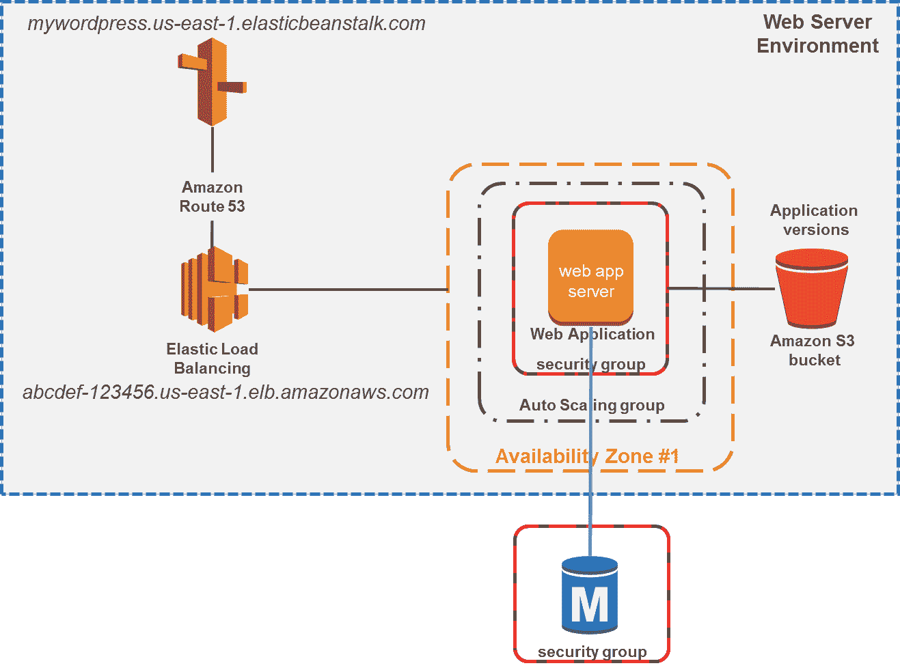

另外值得一提的是，每个环境都有一个唯一的 CNAME，例如 `mywordpress`。该 CNAME 映射到一个 URL，形式为 `mywordpress.us-east-1.elasticbeanstalk.com`。此 URL 通过使用 CNAME 记录在 Amazon 的 DNS 服务 Route53 中别名为 Elastic Load Balancing 的 URL，如 `abcdef-123456.us-east-1.elb.amazonaws.com`。

+   **Worker 环境**：Worker 环境与 Web 服务器环境的工作方式非常不同。在这种情况下，Elastic Beanstalk 会在您的环境中启动一个 SQS 队列，并在每个 Worker 实例中安装一个小型守护进程。守护进程负责定期轮询队列以获取新的消息，如果队列中有消息，守护进程将其拉入 Worker 实例进行处理，如下图所示：

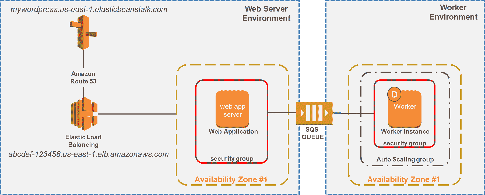

理想情况下，您可以使用 Web 和 Worker 环境的组合来托管应用程序，从而清晰地将 Web 前端资源和后端处理 Worker 实例解耦。请记住，在设置环境时，您还需要考虑许多其他设计要素，例如可扩展性如何处理、根据数据类型选择存储选项（例如，使用 S3 存储日志、使用 RDS 存储应用数据）、安全性、容错能力等。

完成这一部分后，让我们进入更有趣的部分，看看如何开始使用 Elastic Beanstalk！

# 开始使用 Elastic Beanstalk

在本节中，我们将深入探讨如何使用 Elastic Beanstalk 为我们的简单 WordPress 应用程序设置一个完全功能的开发和生产环境。在开始之前，这里有一份在继续之前需要准备的前提条件清单：

+   一个有效的 AWS 账户和用户凭证，并具有运行 AWS CLI 和 Elastic Beanstalk CLI 所需的权限集。

+   一个沙盒/开发实例，用于下载 WordPress 安装包，并随后将应用代码推送到相应的 Beanstalk 环境。请注意，您也可以使用其他资源，例如 Git URL 或 IDE，但目前我们将专注于这种方法。

# 创建开发环境

让我们首先通过创建一个简单明了的开发环境来为我们的 WordPress 站点奠定基础。为此，执行以下步骤：

1.  登录 AWS 控制台，并从服务筛选器中选择 Elastic Beanstalk 选项，或者通过在浏览器中启动 URL [`console.aws.amazon.com/elasticbeanstalk`](https://console.aws.amazon.com/elasticbeanstalk) 来启动 Elastic Beanstalk 控制台。

1.  接下来，选择“创建新应用”选项以开始。请记住，应用是我们应用代码的最高级别容器，它可以根据需要包含一个或多个环境。

1.  在“创建新应用”对话框中，提供合适的应用名称和一个可选的描述来开始。完成后，点击“创建”。

1.  在创建了基础应用容器后，您现在可以继续创建开发环境。为此，在操作下拉列表中，选择“创建新应用”选项。

1.  在这里，您将有一个选项，可以选择 Web 服务器环境或 Worker 环境配置。请记住，环境类型只能在此处选择一次，因此请确保根据您的应用需求选择正确的级别。在这种情况下，我选择了 Web 服务器环境，如下图所示：

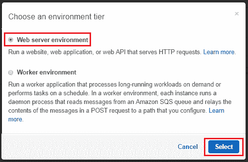

1.  在“创建新环境”向导页面中，为您的 WordPress 站点提供一个合适的环境名称。由于这是一个开发环境，我将其命名为 `YoyoWordpress-dev`。接下来，在“域名”字段中，为您网站的域名 URL 提供一个唯一名称。该 URL 将以区域特定的 Elastic Beanstalk URL 作为后缀，如下图所示：

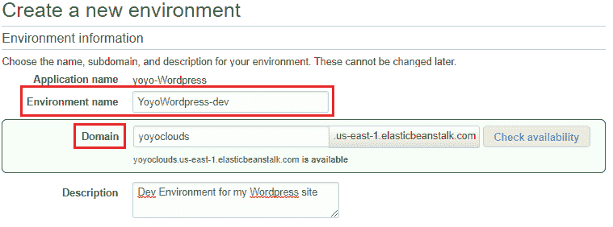

1.  接下来，为您的新环境输入一个合适的描述，并继续进入基础配置部分。在这里，从平台下拉菜单中选择“预配置平台”选项，并选择 PHP 平台，如下图所示。PHP 是我们的默认选项，因为 WordPress 是基于 PHP 5.6 构建的。今天，Beanstalk 支持打包构建器、Docker 容器、Go、Java SE、带 Tomcat 的 Java、在 Windows Server 上运行 IIS 的 .NET、Node.js、PHP、Python 和 Ruby，更多平台支持也将在不久的将来推出：

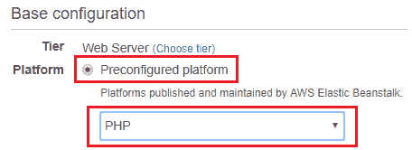

1.  现在，到了需要保持冷静的部分！将其余选项保持为默认值，选择“配置更多选项”，而不是“创建环境”选项！是的，我们首先将配置一些附加项，然后再创建我们的开发环境！

1.  在配置环境页面中，您可以根据应用程序的要求选择三个预配置的配置预设选项之一。预设选项在这里简要说明：

    +   **低成本（符合免费层资格）**：此配置将启动一个单一的（**t2.micro**）实例，并未配置负载均衡或自动扩展组。如果您只是想使用基础功能开始一个应用程序，或希望设置一个简约的开发环境，那么这个配置非常理想，正如本例中所示。

    +   **高可用性**：与低成本预设不同，高可用性配置预先配备了一个自动扩展组，可以扩展到默认的四个实例或更多实例，并且具有跨区域负载均衡和连接排空功能的弹性负载均衡器。此外，您还将获得一系列用于监控的 CloudWatch 警报，以及为您的实例和负载均衡器创建的安全组。

    +   **自定义配置**：您还可以选择根据其他参数配置您的环境。您可以选择此预设，并根据需要修改环境中的每个组件。

1.  在配置预设设置为低成本（免费层）后，我们可以修改的下一个项目是平台配置。Elastic Beanstalk 支持以下 PHP 平台配置：

| **PHP 语言** | **Amazon Linux AMI** | **PHP 版本** |
| --- | --- | --- |
| PHP 7.1 | 2017.03.1 | PHP 7.1.7 |
| PHP 7.0 | 2017.03.1 | PHP 7.0.21 |
| PHP 5.6 | 2017.03.1 | PHP 5.6.31 |
| PHP 5.5 | 2017.03.1 | PHP 5.5.38 |
| PHP 5.4 | 2017.03.1 | PHP 5.4.45 |

1.  由于我们正在使用 WordPress 应用程序，因此我们还需要修改平台，以适应正确的 PHP 版本。

为此，请选择更改平台配置选项。这将弹出选择平台版本的对话框，如下所示：

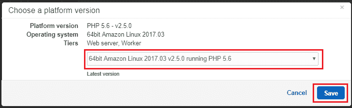

1.  在此，从下拉列表中搜索并选择运行 PHP 5.6 的 64 位 Amazon Linux 2017.03 v2.5.0 选项，因为 WordPress 执行在 PHP 5.6 上非常稳定。完成后，点击保存以完成此过程。

1.  在根据我们的需求更改了平台配置后，我们现在可以继续配置附加服务，如**安全**、**通知**、**网络**、**数据库**等！例如，我们可以通过在网络面板中选择“修改”选项，快速配置我们的 WordPress 开发环境的网络。

1.  在网络面板中，你可以选择在自定义 VPC 中启动你的环境，以及其他特定实例的设置，如启用公共 IP 地址、根据 VPC 设计选择实例子网，最后为你的开发实例分配实例安全组。在此情况下，我已经为开发环境专门创建了一个包含一个公共子网和一个私有子网的自定义 VPC，并且还有一个默认的安全组。以下是我的环境网络配置设置概览，你可以根据需求进行调整：

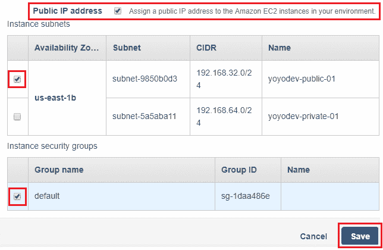

1.  设置完成后，点击保存以完成网络更改。你可以根据需要进行其他配置更改，但由于这是一个开发环境，我选择暂时保持其余选项为默认设置。完成后，选择创建环境选项以结束环境创建过程。

一旦环境创建过程开始，它将需要几分钟才能完成执行，如下图所示。在此阶段，你将看到 Elastic Beanstalk 创建一个新的安全组以及一个 Elastic IP 地址用于你的 EC2 开发实例。在这一阶段，环境也将从 Pending 状态过渡到 Ok 状态，你可以查看环境、应用程序的日志以及状态：

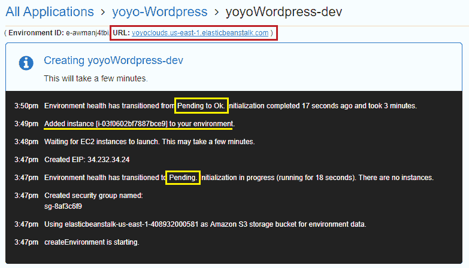

在环境启动并运行后，你也可以通过使用环境仪表板提供的 URL 来验证它。选择该 URL 后，你将被重定向到一个新的应用程序登陆页面，这基本上验证了你的环境已配置为可以使用 PHP 5.6。

但我们的 WordPress 应用程序在哪里呢？这正是我们接下来将要通过一个非常简单且易于使用的 Elastic Beanstalk CLI 部署的内容。

# 使用 Elastic Beanstalk CLI

在通过 AWS 管理控制台部署环境后，我们将重点转向使用 Elastic Beanstalk CLI，或 EB CLI，将应用程序代码推送到新创建的环境。

EB CLI 是一个强大的工具，可以使用几个简单的 CLI 命令操作和管理整个 Elastic Beanstalk 环境。它还与 AWS 开发服务（如 CodeBuild 和 CodeCommit）以及其他第三方代码仓库服务（如 Git）配合使用。

在本节中，我们将首先介绍在简单 Linux 实例上安装 EB CLI 的几个简单步骤，然后将继续配置并将我们的 WordPress 应用程序推送到相应的开发环境中：

1.  为此，我们首先需要确保实例已更新到最新的包。在我的案例中，我是在一个简单的 Ubuntu 14.04 LTS 实例上执行这些步骤，然而，您也可以使用您自己的本地虚拟机。

1.  运行以下命令以更新您的操作系统。命令将根据您的操作系统版本有所不同：

```
# sudo apt-get update
```

1.  接下来，我们需要确保实例中已安装所需的 Python 包。请注意，如果您使用的是 Amazon Linux AMI，那么默认情况下它将已经安装必要的 Python 包：

```
# sudo apt-get install python python-pip
```

AWS CLI 和 EB CLI 需要 Python 2 版本 2.6.5+ 或 Python 3 版本 3.3+。

1.  安装完 Python 包后，我们接着使用以下命令设置 AWS CLI：

```
# pip install awscli
# aws configure
```

第一个命令安装 CLI，而另一个命令将引导您通过一个简单的向导来为您的实例设置 AWS CLI。要了解更多关于如何配置 AWS CLI 的信息，您可以查看此网址：[`docs.aws.amazon.com/cli/latest/userguide/installing.html`](http://docs.aws.amazon.com/cli/latest/userguide/installing.html)。

1.  最后，我们继续安装 EB CLI。安装过程非常简单明了：

```
# pip install awsebcli
```

1.  就是这样！现在您已经安装了一个功能齐全的 Elastic Beanstalk CLI 并准备好使用。接下来，让我们下载所需的 WordPress 代码 ZIP 文件并使用 EB CLI 将其推送到开发环境中：

```
# sudo git clone https://github.com/WordPress/WordPress.git
```

1.  将您的 WordPress ZIP 文件的内容提取到一个新文件夹中，然后在 WordPress 目录中运行以下命令：

```
# eb init
```

`eb init` 命令用于初始化并将 EB CLI 与您新创建的开发环境同步。请按照屏幕上的指示配置 EB CLI 的设置，例如选择一个默认的操作区域，选择要使用的应用程序等。请记住，默认区域必须与您当前开发环境的区域相匹配，在我的案例中是 **us-east-1**：

1.  设置好 EB CLI 后，现在唯一剩下的步骤就是使用另一个名为 `eb deploy` 的 EB CLI 命令将 WordPress 应用部署到开发环境：

```
# eb deploy
```

在部署过程中，CLI 会在您的环境中新建一个 S3 存储桶，并创建一个应用版本档案。每次应用部署都会导致 S3 中后续版本的创建。之后，您将看到您的应用代码被上传到开发环境，如下图所示：

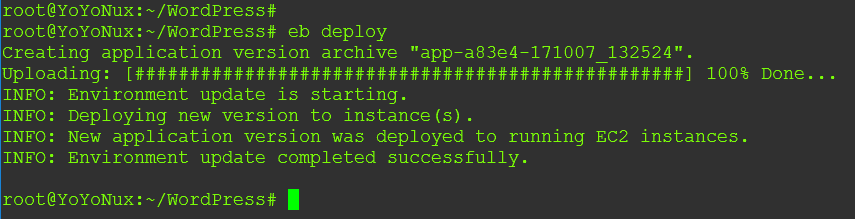

1.  在应用程序上传并在您的开发实例中设置后，环境的状态同时从 Ok 变为 Pending。一旦应用程序可用，环境的健康状态将再次从 Pending 转为 OK，再到 Info。

1.  你可以通过刷新环境仪表板上的应用程序 URL（`yoyoclouds.us-east-1.elasticbeanstalk.com`）来验证应用程序是否已上传。你应该能看到 WordPress 的欢迎屏幕，如下图所示：

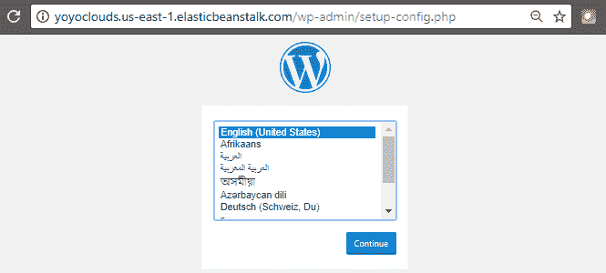

但需要注意的是，这个设置仍然需要一个 MySQL 数据库，因此不要忘记前往 RDS 管理控制台，创建一个简化的 MySQL 数据库，或者更好的是，为你的开发环境创建一个 Aurora DB 实例。记得记下数据库的用户名、密码、数据库主机和数据库名称；在配置 WordPress 时你将需要这些信息！

完成此步骤后，让我们花几分钟时间了解如何使用环境仪表板配置和监控你新部署的应用程序的各种选项！

# 理解环境仪表板

环境仪表板是你管理和监控新部署应用程序以及继承实例的集中平台。在本节中，我们将快速浏览环境仪表板中每个部分，并了解如何利用它们来管理你的应用程序。

首先，仪表板视图本身为你提供了一些高层次的信息和事件日志，展示了当前环境的状态。要了解最近一批事件的更多信息，你可以选择在“最近事件”部分选择“显示全部”选项，或者从导航窗格中选择“事件”选项。

仪表板还允许你通过选择“上传并部署”选项上传应用程序的新版，如下图所示。在这里，你还可以看到正在运行的 WordPress 应用版本。这就是我们刚刚使用 EB CLI 部署的应用。

你还可以通过环境仪表板右上角的“操作”标签来控制环境的各个方面，如保存配置、克隆环境和终止环境：

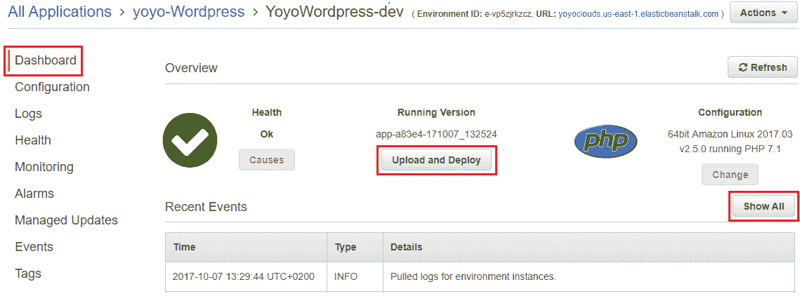

从仪表板移动到下一个值得查看的导航窗格标签，即“配置”部分。让我们更详细地查看每个配置选项，从扩展选项开始：

+   **扩展**：在这里，你可以选择将你的环境类型从单实例部署更改为负载均衡、启用自动扩展的环境，只需从环境类型下拉列表中选择正确的选项。你甚至可以通过选择“添加计划操作”选项来启用基于时间的扩展。

+   **实例**：在下一个选项卡中，你可以为你的环境配置特定实例的详细信息，例如实例类型、用于启用 SSH 连接到实例的 EC2 密钥对、实例配置文件以及其他选项，例如根卷类型及其所需大小。

+   **通知**：在这里，你可以指定一个特定的电子邮件地址，使用该地址，与你的环境相关的通知——例如其事件——将通过 Amazon SNS 发送。

+   **软件配置**：此部分允许你为应用程序配置一些关键参数，例如应用程序的文档根目录、运行 PHP 环境的内存限制以及日志选项。但是我真正喜欢软件配置的一点是环境属性部分。有了这个，你可以将密钥、端点、调试设置和其他信息传递给你的应用程序，而无需通过 SSH 登录到实例中，简直太棒了！稍后我们将在本章中了解环境属性以及如何创建简单的环境变量并将其传递给你的 WordPress 应用程序。

+   **健康**：在你的环境中，最重要的配置项之一就是健康部分，它允许你为应用程序配置健康检查 URL，并使用安装在系统上的特殊代理启用详细的健康报告。这个代理监控你的 EC2 实例的健康状况，捕获应用程序级别的健康指标，并将其直接发送到 Beanstalk 进行进一步分析。这与应用程序日志结合，帮助你深入排查问题并使用 Elastic Beanstalk 控制台解决所有问题。

+   **注意**：你可以在实例的`/var/log/healthd/daemon.log`文件中找到代理的日志。

除了配置选项卡外，Elastic Beanstalk 还为你提供了日志选项，在这里你可以请求完整的日志集或最后 100 行日志。你也可以通过这个部分下载每个实例的日志文件：

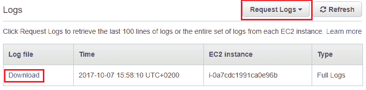

最后但同样重要的是，你还可以利用监控和警报部分查看整体环境健康状态，以及其他重要指标，如 CPU 利用率、最大网络流入和最大网络流出。要为单个图表配置警报，你只需选择每个图表旁边的警报图标，如下图所示：

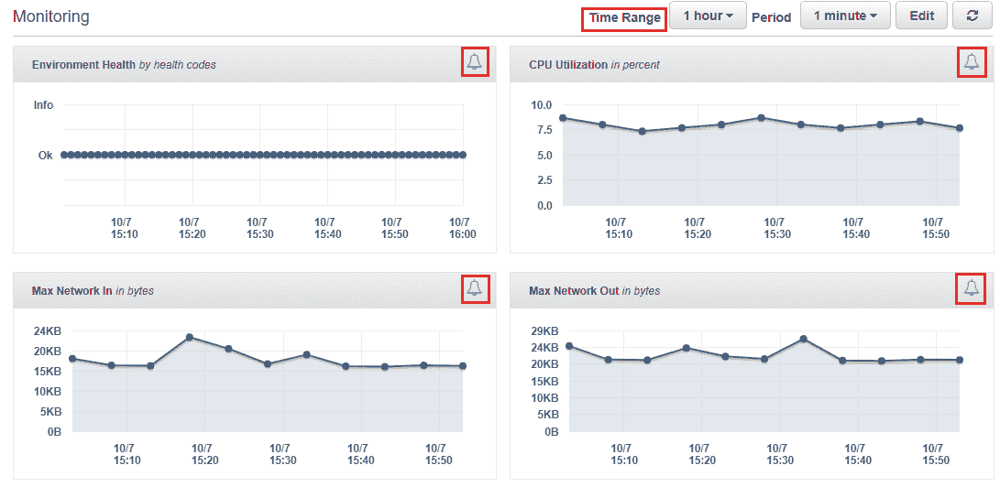

会弹出一个相应的添加警报小部件，使用它你可以配置警报的基本信息，如名称、周期和阈值设置，以及所需的通知设置。

通过这种方式，你可以结合使用环境仪表板和 EB CLI 来执行日常的应用程序管理和监控任务。在下一节中，我们将利用这个环境仪表板，从现有的开发环境克隆并创建一个新的生产环境。

# 克隆环境

在开发环境已设置并正常运行后，接下来就是创建生产环境的时间了。从技术上讲，你可以重复我们之前为创建开发环境所遵循的所有步骤，这样也能顺利工作，但 Elastic Beanstalk 提供了一种非常简单和简洁的方法来使用现有环境作为模板创建新环境。这个过程叫做克隆，可以通过环境仪表板本身进行简单的几次点击完成：

1.  要开始，只需从环境仪表板页面选择“操作”选项卡，然后选择“克隆环境”选项。这将打开“新环境”页面，如下所示：

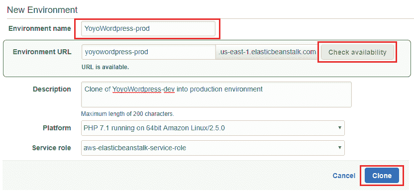

1.  在这里，首先为新环境提供一个环境名称，然后为环境 URL 添加一个独特的前缀。记住，这实际上是我们之前创建的开发环境的克隆，因此，默认情况下，它将包含相同的 Amazon Linux 实例和我们在开发阶段推送的 WordPress 应用程序。这不成问题，因为我们始终可以使用 EB CLI 将生产版本的应用程序推送到环境中。不过现在，请填写其余的详细信息并选择“克隆”选项。

新环境经历了与之前相同的初始化和创建过程，创建了独立的安全组，分配了一个新的弹性 IP，并启动了一个新的 EC2 实例，该实例与开发环境中推送的应用程序版本相同。

一旦完成，你现在应该有两个非常相似的环境并排运行，但生产环境难道不应该不仅仅是一个实例吗？嗯，这正是我们将在下一部分配置的内容。

# 配置生产环境

既然我们已经对环境仪表板有了全面了解，现在根据我们的需求配置生产环境应该相对容易。让我们从增加生产环境的实例数量开始：

1.  从新创建的生产环境的配置仪表板中选择“扩展配置”选项卡，将环境类型从“单实例”更改为“负载均衡，自动扩展”。实例数量设置以及自动扩展功能，只有在新更改反映到环境中后才会生效。完成后，点击“应用”。

要验证更改是否已传播，你可以将新创建的弹性负载均衡器 DNS 名称复制到网页浏览器中，验证是否能够访问 WordPress 入门向导。

1.  接下来，你还可以通过实例配置部分将默认实例类型从 t1.micro 更改为更强大的类型，如 t2.medium 或 t2.large。

1.  一旦主要设置完成，你还需要为你的生产实例创建一个新的 RDS 支持的 MySQL 数据库。所以，去[`console.aws.amazon.com/rds/`](https://console.aws.amazon.com/rds/)使用 RDS 管理控制台创建一个新的 MySQL 数据库实例吧。

为了处理生产级负载，我强烈建议为你的 MySQL 数据库启用多可用区（multi-AZ）部署。

1.  在继续执行下一步之前，记得记录下数据库名称、数据库终端节点、用户名和密码！

1.  接下来，使用生产环境的 URL，启动你的 WordPress 网站，并填写所需的数据库配置详细信息，如下图所示：

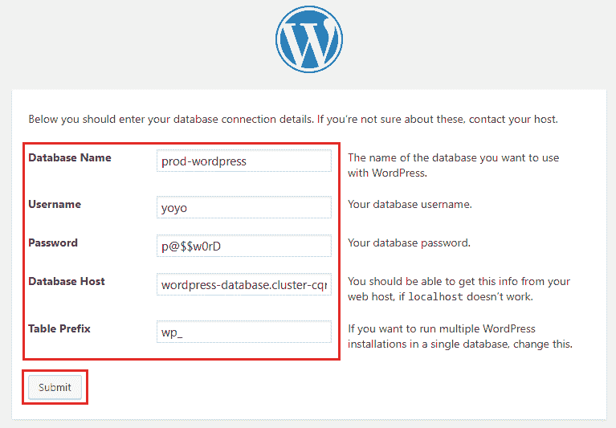

这种配置数据库设置的方法并不理想，特别是在生产环境中。作为替代方案，Elastic Beanstalk 为你提供了环境属性的概念，使你能够将配置的键值对直接传递给应用程序。

1.  为此，你需要从生产仪表盘中选择配置部分，并在其中选择修改软件配置。

1.  在此，在“环境属性”部分，填写所需的生产数据库变量，如下图所示：

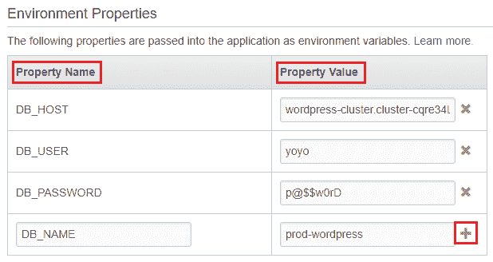

那么，这些变量最终会被配置到哪里呢？这就是我们利用名为`wp-config.php`的 WordPress 配置文件，将所有这些变量配置到文件中的地方。加载时，PHP 将从我们刚刚在 Elastic Beanstalk 中设置的环境属性中读取这些属性的值。

1.  使用你喜欢的文本编辑器打开`wp-config.php`文件，并更改数据库部分，如下代码片段所示：

```
/** The name of the database for WordPress */ 
define('DB_NAME', getenv('DB_NAME')); 

/** MySQL database username */ 
define('DB_USER', getenv('DB_USER')); 

/** MySQL database password */ 
define('DB_PASSWORD', getenv('DB_PASSWORD')); 

/** MySQL hostname */ 
define('DB_HOST', getenv('DB_HOST')); 
```

1.  保存文件并使用`eb deploy`命令将修改后的代码推送到生产环境。简单吧？

部署后，新的环境应该是这样的：

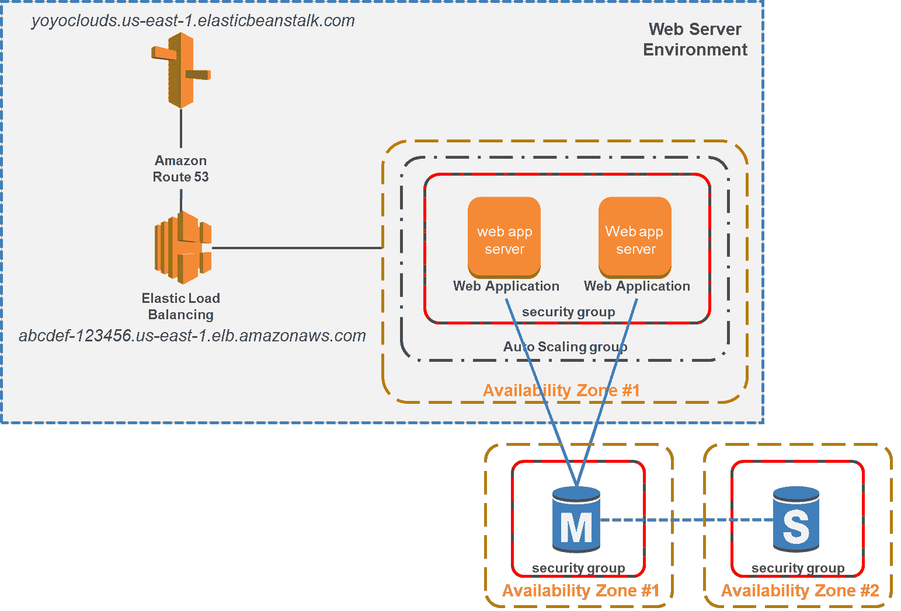

到目前为止看起来不错，对吧？完成这些设置后，你的 WordPress 配置应该能够高效地进行伸缩扩展，你不再需要担心负载均衡需求，甚至不用担心 MySQL 实例。此外，既然我们已经配置了实例从 Elastic Beanstalk 本身获取数据库信息，那么当底层的 WordPress 实例重启或终止时，我们也不必再担心网站会发生什么。这正是我们最初要做的事情，但还是有一个小问题。那就是，你最终会在 WordPress 网站上上传的内容文件，比如图片和视频呢？这些上传的文件最终会被存储在实例的本地磁盘上，这可能会成为一个问题，因为如果该实例被自动扩展策略终止，你可能会丢失所有数据。幸运的是，AWS 提供了一个解决方案来应对这个问题，这也是我们接下来要学习的内容。

# 介绍 Amazon 弹性文件系统

AWS 确实投入了大量创新和努力，推出了一些非常棒的服务，而我个人认为具有巨大潜力的一项服务就是弹性文件系统。为什么它如此重要呢？为了回答这个问题，我们需要稍微回顾一下，了解 AWS 目前提供的存储服务类型。

首先，我们有两种对象存储服务，分别是 Amazon S3 和 Amazon Glacier。虽然这两项服务在扩展能力上几乎是无限的，但与 EC2 实例存储和 EBS 相比，这些服务的性能稍显逊色。这是不可避免的，因为像 EBS 这样的服务是专门设计来提供快速且持久的块存储，但作为权衡，你不能跨多个可用区扩展 EBS 卷。另一方面，弹性文件系统（EFS）通过结合 EBS 卷的性能和跨多个 AZ 提供相同卷的可用性，提供了两者的优点，这真是太棒了！总结来说，EFS 是一个大规模可扩展的文件存储系统，它允许你同时将多个 EC2 实例挂载到它上面，跨 AZ 使用，而无需担心系统的耐用性、可用性或性能。

你问 EFS 是如何工作的？嗯，这正是我们将在下一节中学习的内容。

# 它是如何工作的？

EFS 的工作方式非常简单和极简，以减少作为最终用户需要执行和管理的配置量。首先，EFS 提供了创建一个或多个文件系统的功能。每个文件系统可以挂载到一个或多个实例，数据可以读取和写入到这些实例中。挂载文件系统要求您的实例支持网络文件系统版本 4.0 和 4.1（NFSv4）协议。大多数 Linux 操作系统都提供必要的支持，然而，如果这些机器上没有安装 NFS 客户端，您可能需要安装它才能连接到 EFS。那么，这对我们的 WordPress 应用有什么用呢？首先，一旦您有了 Amazon 弹性文件系统，您可以让多个 EC2 实例同时连接到它，并将其用作一个可扩展的共享驱动器，如果需要，它甚至可以扩展到 PB 级别。此外，Amazon 弹性文件系统在 EC2 实例重启甚至终止时不会出现任何停机或后果；数据将保存在文件系统中，直到您手动删除它或终止文件系统本身。然而，在使用弹性文件系统时，有一些规则和限制需要注意。

您一次只能将 Amazon EFS 挂载到一个 VPC 中的实例，并且文件系统和 VPC 必须位于同一 AWS 区域内。

文件系统创建后，系统将为您提供一个 DNS 名称，用于在您的区域内标识它。此外，您还需要在 VPC 内创建一个或多个支持挂载目标，这基本上充当了位于子网内的实例与文件系统之间的连接介质。以下是一个表示弹性文件系统如何通过挂载目标与 EC2 实例交互的示意图：

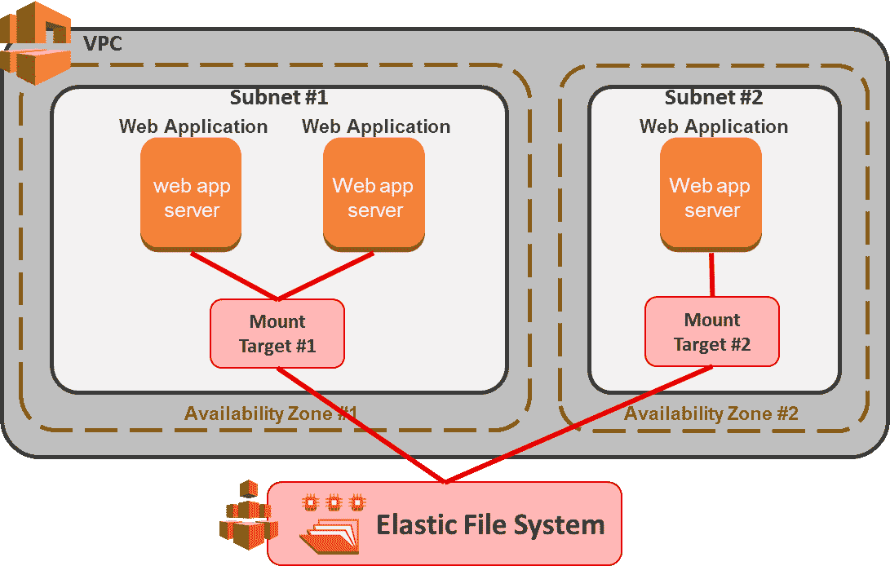

作为管理员，您可以在给定区域内的每个可用区创建一个挂载目标。您还可以在特定 VPC 中的每个子网中创建挂载目标，以便该 VPC 中的所有 EC2 实例共享该挂载目标。在接下来的部分，我们将介绍设置您自己的弹性文件系统所需的一些简单步骤。

# 创建弹性文件系统

设置您自己的弹性文件系统非常简单！您可以通过从 AWS 管理控制台启动弹性文件系统仪表板开始，或者访问以下 URL [`console.aws.amazon.com/efs/`](https://console.aws.amazon.com/efs/)：

1.  在 EFS 登录页面上，选择“创建文件系统”选项以开始。

1.  在“配置文件系统访问”页面中，您可以首先选择要与文件系统关联的 VPC。请记住，您可以为每个 VPC 配置多个文件系统，但它们不能跨区域扩展：

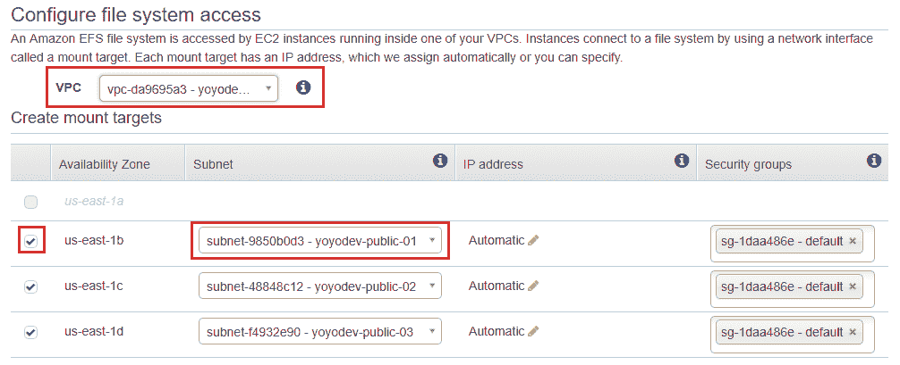

1.  在选择了 VPC 后，关联的子网将自动根据它们所在的可用区，在“创建挂载目标”部分填充。在这里，您可以选择要与 Elastic File System 关联的适当子集及其对应的安全组。在我的案例中，我选择了 VPC 中的单个公共子网，因为 WordPress 应用程序实例将在这里部署，这些实例需要访问文件系统来存储图像和其他内容。

1.  填写完字段后，选择“下一步”选项继续。

1.  下一步是配置您 Elastic File System 的可选设置。在这里，您可以为文件系统添加标签以描述文件系统，并根据您的需求选择适当的性能模式。今天，EFS 提供了两种模式：通用目的模式，适用于大多数工作负载，以及最大 I/O 模式，专为环境需要扩展到成千上万的 EC2 实例并都连接到这个单一文件系统的情况设计。与通用目的模式相比，最大 I/O 模式提供了更好的性能，但在处理文件操作时，可能会出现略微更高的延迟。

1.  最后的选项是启用加密，选中后，将利用您现有 AWS 账户中的 KMS 密钥对存储在文件系统中的所有数据进行加密：

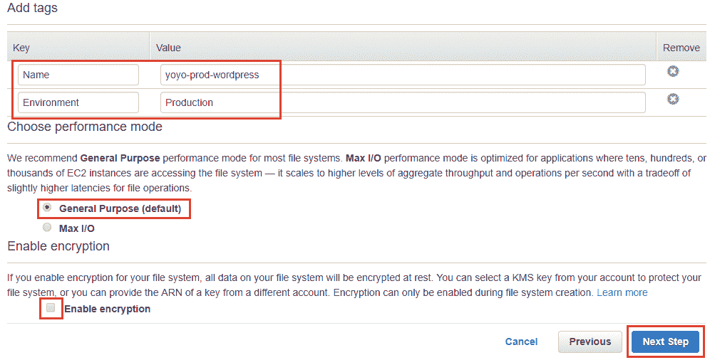

1.  在“审查并创建”页面上查看配置更改以完成 EFS 设置过程，最后点击“创建”以启用文件系统。此过程需要几分钟，一旦完成，您将看到新创建文件系统的 DNS 名称。请记下此名称，因为在我们的 Elastic Beanstalk 环境中也需要引用它。

到目前为止，一切顺利！我们已经在 Elastic Beanstalk 上启动并运行了我们的生产环境，现在我们创建了一个简单但功能强大的 Elastic File System。在下一部分，我们将探讨如何通过 Elastic Beanstalk 的配置文件概念，将这两个服务集成到 WordPress 中。

# 扩展 EFS 到 Elastic Beanstalk

尽管 Elastic Beanstalk 完全负责您的环境的配置和管理，但您仍然可以通过一些方法控制环境的高级配置，例如将应用程序集成到其他 AWS 服务（如 ElastiCache，甚至 EFS）。这可以通过 Beanstalk 本身提供的各种服务来实现；例如，通过利用 Beanstalk 的已保存配置，或使用环境清单（YML）文件。但在本节中，我们将重点介绍如何使用专门的配置文件 `.ebextensions`，将 EFS 服务与我们的 WordPress 应用程序集成。

这些`.ebextensions`是简单的 YAML 格式文档，文件扩展名以`.config`结尾。一旦创建了`.ebextensions`文件，你需要将其放置在应用程序源代码的根文件夹中，在一个名为`.ebextensions`的特殊目录内，最后，将你的应用程序部署到 Beanstalk。

这些配置文件非常强大，以至于你甚至不需要通过 SSH 连接到实例来发出配置命令。你可以通过使用`.ebextensions`，完全从项目源中配置你的环境：

1.  要开始在 WordPress 设置中使用`.ebextensions`，首先我们需要在 WordPress 应用程序的根目录中创建一个名为`.ebextensions`的文件夹。在你的开发实例中输入以下命令：

```
# cd wordpress && sudo mkdir .ebextensions
```

1.  创建一个扩展名为`.config`的新文件，并将以下内容粘贴到其中：

```
# sudo vi efs.config ### PASTE THE FOLLOWING CONTENTS ### 
packages: 
  yum: 
    nfs-utils: [] 
    jq: [] 
files: 
  "/tmp/mount-efs.sh" : 
    mode: "000755" 
    content: | 
      #!/usr/bin/env bash 
      mkdir -p /mnt/efs 
      EFS_NAME=$(/opt/elasticbeanstalk/bin/get-config environment | jq -r '.EFS_NAME') 
      mount -t nfs4 -o nfsvers=4.1,rsize=1048576,wsize=1048576,hard,timeo=600,retrans=2 $EFS_NAME:/ /mnt/efs || true 
      mkdir -p /mnt/efs/uploads 
      chown webapp:webapp /mnt/efs/uploads 
commands: 
  01-mount: 
    command: "/tmp/mount-efs.sh" 
container_commands: 
  01-rm-wp-content-uploads: 
    command: rm -rf /var/app/ondeck/wp-content/uploads 
  02-symlink-uploads: 
    command: ln -snf /mnt/efs/uploads /var/app/ondeck/wp-content/uploads 
```

你可以在[`github.com/yoyoclouds/Administering-AWS-Volume2`](https://github.com/yoyoclouds/Administering-AWS-Volume2)找到之前代码的完整副本。

该文件会使 Elastic Beanstalk 将新创建的 EFS 卷挂载到实例的`/mnt/efs`目录，并且如果存在，会删除`wp-content/uploads`目录，并将其符号链接到`/mnt/efs/uploads`，以便在实例之间共享并持久化：

1.  文件创建完成后，再次使用`eb deploy`命令将应用程序目录和新添加的`.ebextensions`目录推送到生产环境中。

1.  最后但同样重要的是，登录到你的生产环境，选择*环境*仪表板中的配置选项。在这里，选择软件配置图块，并在环境属性部分添加以下键值对，如下所示：

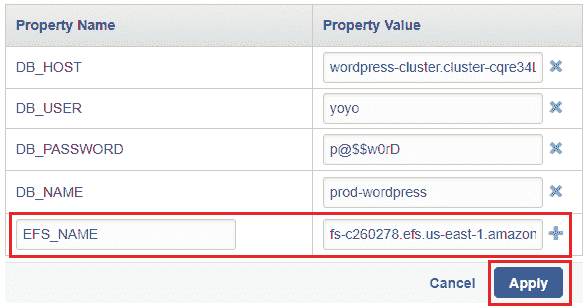

1.  在这里，EFS_NAME 的值必须是新创建的 EFS 文件系统的 DNS 名称。这与我们创建 EFS 时复制的 DNS 名称相同。

一旦部署状态发生变化并且可以使用，选择环境 URL 并验证 WordPress 的配置是否按照预期工作。如果你已经做到这一点，那么你应该已经拥有一个非常棒的、高可用、可扩展的 WordPress 站点并正在运行！棒极了，不是吗？

# 规划你接下来的步骤

好吧，本章我们已经介绍了许多新功能和服务，但我仍然有几件事推荐你自己尝试。首先是 Elastic Beanstalk 的高级配置。

如前所述，Beanstalk 为您提供了多种方式，可以通过各种内建服务（如`.ebextensions`，我们在前一节中已介绍过）来自定义和扩展您的应用并与其他 AWS 服务进行集成。另一个可以用来配置 Beanstalk 环境的服务是被称为**环境清单**（environment manifest）文件的配置。这是一个简单的 YAML 文件，包含了您的环境清单配置，例如环境名称、解决方案栈和在创建环境时使用的环境链接。该文件位于应用程序的根目录下，通常命名为`env.yaml`。此文件的一个关键用途是提供对环境链接的支持，允许您使用简单的名称作为引用连接两个应用环境。

例如，如果您有一个网站作为前端应用，接受用户的某些输入，另一个应用处理这些输入，您可以通过这个`env.yml`文件在工作者和前端应用之间创建一个链接。在调用时，这两个环境之间的链接将由 Beanstalk 自动设置和管理。

这是`env.yml`文件内容的一个小片段：

```
AWSConfigurationTemplateVersion: 1.1.0.0 
SolutionStack: 64bit Amazon Linux 2015.09 
EnvironmentName: frontend-environment 
EnvironmentLinks: 
  "WORKERQUEUE" : "worker-environment" 
```

您可以通过[`docs.aws.amazon.com/elasticbeanstalk/latest/dg/environment-cfg-manifest.html`](https://docs.aws.amazon.com/elasticbeanstalk/latest/dg/environment-cfg-manifest.html)了解更多关于*环境清单（env.yaml）*的信息。

或者，Beanstalk 还为您提供了一个更简便的配置保存机制，您可以通过环境仪表板或 EB CLI 来调用它。这被称为保存的配置，可以通过在环境仪表板的操作（Actions）选项卡中选择“保存配置”（Save configuration）来启用。一旦应用，这些环境配置将接受任何存储在 S3 存储桶中的自定义配置作为对象。您甚至可以下载这个配置对象，并使用 EB CLI 创建环境的克隆。要了解更多关于保存配置的信息，请查看这个链接：[`docs.aws.amazon.com/elasticbeanstalk/latest/dg/environment-configuration-savedconfig.html`](http://docs.aws.amazon.com/elasticbeanstalk/latest/dg/environment-configuration-savedconfig.html)。

另一个值得探索的非常有趣的功能是 Elastic Beanstalk 提供的对 Docker 容器的支持！如您所知，Docker 容器是创建微服务支持的应用程序的下一代重要技术，可以在巨大的规模上进行部署和扩展。Elastic Beanstalk 的 Docker 平台有两种通用配置，单容器和多容器选项，并且提供了几个预配置的容器镜像供您选择。

从弹性文件系统的角度来看，一个值得阅读和探索的关键方面是文件系统的整体性能考虑。本文件特别突出了与 EBS 提供的 IOPS 卷相比，不同的性能级别和使用案例。文档还提供了一些深入的见解和建议，帮助最大化文件系统的性能。你可以查看文档：[`docs.aws.amazon.com/efs/latest/ug/performance.html`](http://docs.aws.amazon.com/efs/latest/ug/performance.html)。

# 总结

所以，我们到了这里。又一章结束了！不过，在我们进入下一章之前，先快速回顾一下我们到目前为止学到的内容。

我们从简要介绍亚马逊 Elastic Beanstalk 开始，然后深入了解了它的概念和术语。接着，我们使用 Elastic Beanstalk 管理控制台和 EB CLI 为我们的 WordPress 应用创建了一个简单的开发环境。在这个过程中，我们还学会了如何使用 EB CLI 将应用部署到特定环境中，最后学会了如何快速克隆一个环境并配置它以处理生产工作负载。最后但同样重要的是，我们探索并学会了如何利用弹性文件系统创建一个持久且可扩展的文件共享系统，用于我们的 WordPress 设置，并以一些关键见解和下一步的计划结束了这一章。

在下一章中，我们将开始探索一些安全服务，例如 WAF 和 Shield。敬请期待——我们还有很多东西要学习！
