# 使用 AWS WAF 保障工作负载安全

在上一章中，我们学习了如何利用 Amazon Elastic Beanstalk 和 Amazon Elastic File System 来构建和部署高度可扩展且可用的应用程序，且过程非常简单！然而，有一个关键方面我们在上一章没有过多讨论，那就是，当然，安全性！"*我该如何保护我的应用程序和工作负载免受恶意软件和威胁的侵害？*" 这个正是我们通过结合两个简单但非常强大的 AWS 服务——AWS Shield 和 AWS **Web 应用防火墙**（**WAF**）来回答的问题。

鉴于此，让我们快速浏览一下本章将涵盖的各个主题：

+   介绍 AWS WAF 及其工作原理

+   通过利用 WAF 和使用 Web ACL 保护我们的 WordPress 网站

+   了解用于防范跨站脚本和 SQL 注入的附加 WAF 条件

+   使用 CloudFormation 模板自动部署和配置 AWS WAF

+   使用 Amazon CloudWatch 监控 AWS WAF

+   简要介绍 AWS Shield 及其工作原理

+   了解 AWS Shield Advanced 以及如何利用它

有很多事情要做，让我们马上开始吧！

# 介绍 AWS Web 应用防火墙

安全性一直是并将永远是许多在云上运行工作负载和应用程序的组织的关键关注点。这正是 AWS 提供各种托管服务的原因，作为云管理员的您应当利用这些服务来保护和保障您的工作负载免受任何安全漏洞或威胁。在本节中，我们将探索这样一个简单但非常强大的服务——AWS WAF，或称 Web 应用防火墙。

AWS WAF 基本上是一个防火墙，帮助您保护面向互联网的应用程序免受常见的基于网络的威胁和攻击。它实际上是一个服务，允许您指定一组 Web 安全规则或访问控制列表（ACL），这些规则可以允许或限制通过 Amazon CloudFront 以及 **应用负载均衡器**（**ALB**）的某种类型的 Web 流量。到目前为止，WAF 可以用来创建自定义规则，帮助您的应用程序抵御诸如 SQL 注入、跨站脚本、**分布式拒绝服务**（**DDoS**）、恶意机器人、抓取器等攻击！您可以根据需求轻松创建新规则，并将其附加到现有的 ACL 列表中，使您能够更快速地响应并缓解变化的流量模式。

WAF 还配备了一个强大的 API，通过使用它，您可以自动化部署 ACL 规则以及以编程方式管理它们。此外，对于界面用户，WAF 提供定制的 CloudFormation 模板，这将使您能够在几分钟内开始使用完整的基于 WAF 的安全解决方案！我们稍后将查看如何部署此模板，以确保我们自己的 WordPress 应用程序在本章稍后的部分。

WAF 的定价基于您部署的 ACL 规则数量以及您的应用程序接收的 Web 请求数量。

这里是通过利用 AWS WAF 可以获得的一些好处的快速总结：

+   **增强的保护**：除了标准的 VPC 和安全组外，您还可以通过利用 WAF 的 ACL 规则来进一步保护应用程序免受常见的 Web 攻击。

+   **高级流量过滤**：与简单的 NACL 或安全组不同，WAF 为您提供了根据传入 Web 请求的特征定义自定义规则和条件的能力，例如头部中存在的值，请求的源 IP 地址，请求中是否存在任何 SQL 代码等。使用这些条件，您现在可以基本上根据这些预设条件允许、阻止或过滤流量。

+   **简易管理**：通过在一个中心位置定义和管理 WAF 规则，您可以轻松地在多个 CloudFront CDN 和应用程序负载均衡器上重用和传播自定义 ACL，并监视流量以及缓解任何问题，所有这些都可以使用相同的 WAF API 或 Web 用户界面完成。

+   **成本效益的安全解决方案**：利用 WAF 的最佳之处之一是，它完全没有预付费用或相关费用。您只需根据使用 WAF 创建的规则数量以及您的 Web 应用程序接收的流量量进行支付，而不会多花一分钱！

有了这些基本信息，让我们看看 WAF 的实际工作原理！

# 概念和术语

正如简要讨论的那样，WAF 可以在您的标准 ALB 和 CloudFront 分发上启用。但在我们开始配置 WAF 及其各种规则和 ACL 之前，我们首先需要了解一些常用术语和术语：

+   **条件**：条件构成了您 WAF 规则集的核心。这些基本上是您希望 WAF 在每个传入的 Web 请求中监视的可配置特征。在编写本书时，WAF 支持以下条件列表：

    +   **IP 匹配**：你可以使用此条件检查传入的 web 请求是否来自指定的黑名单/白名单 IP 地址。然后，你可以根据需求对这些请求采取相应的操作，例如只允许来自白名单 IP 范围的流量，等等。AWS WAF 支持 IPv4 地址的 `/8`、`/16`、`/24`、`/32` CIDR 块。

    +   **字符串和正则表达式匹配**：字符串匹配或正则表达式匹配条件可以用来指定传入 web 请求中的某一部分及其相应的文本，控制访问。例如，你可以创建一个匹配或正则表达式条件，检查用户代理头及其值是否与预设的*字符串*或*表达式*匹配。如果条件匹配，你可以选择允许或阻止该特定流量。

    +   **SQL 注入匹配**：你可以使用此条件检查传入 web 请求的某些部分，比如 URI 或查询字符串，是否包含任何恶意的 SQL 代码。如果模式匹配成功，你可以选择阻止所有来自该请求 IP 范围的流量。

    +   **跨站脚本匹配**：黑客和利用者通常会在 web 请求中嵌入恶意脚本，这些脚本可能会危害你的应用程序。你可以利用跨站脚本匹配条件来检查传入请求的 URI 或头部，查找任何此类脚本或代码，并选择通过 WAF 规则阻止这些请求。

    +   **地理位置匹配**：你可以使用此条件列出你的 web 请求来源的国家，并根据你的需求决定是否阻止或允许这些请求。

    +   **大小限制匹配**：你可以使用大小限制匹配条件来检查传入 web 请求中指定部分的长度，比如查询字符串或 URI。例如，你可以创建一个简单的 WAF 规则来阻止所有查询字符串大于 100 字节的请求，等等。

+   **规则**：在定义了条件后，配置 WAF 的下一个重要方面是规则。规则基本上允许你将一个或多个条件组合成一个逻辑语句，然后可以用来允许、阻止或统计特定的传入请求。规则进一步分为两类：

    +   **常规规则**：常规或标准规则，应用一个或多个条件到你最近的一批传入的 web 请求。例如，一个规则可以阻止所有来自 IP 范围`40.40.5.0/24`的流量，或者当请求的查询字符串中包含任何类似 SQL 的代码时，等等。

    +   **基于速率的规则**：基于速率的规则与常规规则非常相似，不同之处在于它增加了速率限制。你现在可以配置条件并为其设置速率限制。只有当条件匹配或超过设置的速率限制时，规则才会触发。

WAF 会在 5 分钟的窗口期内检查速率限制。

例如，你可以配置一个简单的条件，阻止来自 `40.40.5.0/24` IP 范围的所有传入流量，且请求速率限制为 10,000。在这种情况下，只有在满足条件并且 5 分钟内的请求数量超过 10,000 个时，规则才会触发相应的操作（允许、阻止、计数）。不符合这两个条件的请求将不会被计入速率限制，因此不会被此规则阻止。

+   **Web ACLs**：一旦规则定义完成，你需要将它们组合成一个或多个 Web ACL。在这里，你可以为触发的规则定义一个操作，例如：允许、阻止、计数，或在请求不符合任何指定条件或规则时执行默认操作。Web ACL 按优先级工作，因此第一个列出的规则会首先与传入的请求进行比较。这使得你非常有必要了解在 Web ACL 中创建和分配规则的顺序。

下面是条件、规则和 Web ACL 如何在 WAF 中协同工作的简单示意图：

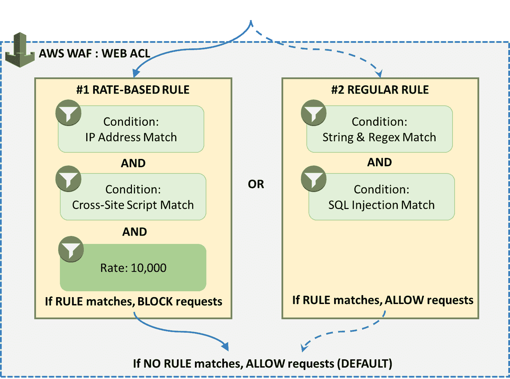

在了解了这些概念后，让我们来看一些简单的步骤，帮助你设置和配置 WAF Web ACL，以保护你的 Web 应用程序。

# 开始使用 WAF

在本节中，我们将介绍一些简单易行的步骤，帮助你快速开始使用 AWS WAF。为了演示，我们将使用与上一章节相同的环境和应用程序，因此，如果你还没有完成前面的案例，现在是时候快速回顾一下了！

在上一章节中，我们使用了 Elastic Beanstalk 和 Elastic File System 服务，将一个可扩展且高度可用的 WordPress 应用程序部署到互联网上。在本节中，我们将继续使用相同的设置，并通过引入 AWS WAF 进一步加强其安全性。为什么要为我们的 WordPress 应用程序使用 WAF？最简单的答案是：完全将安全检查从底层的 Web 服务器实例中抽象出来，而是将安全检查放在应用程序的入口点，如下图所示：

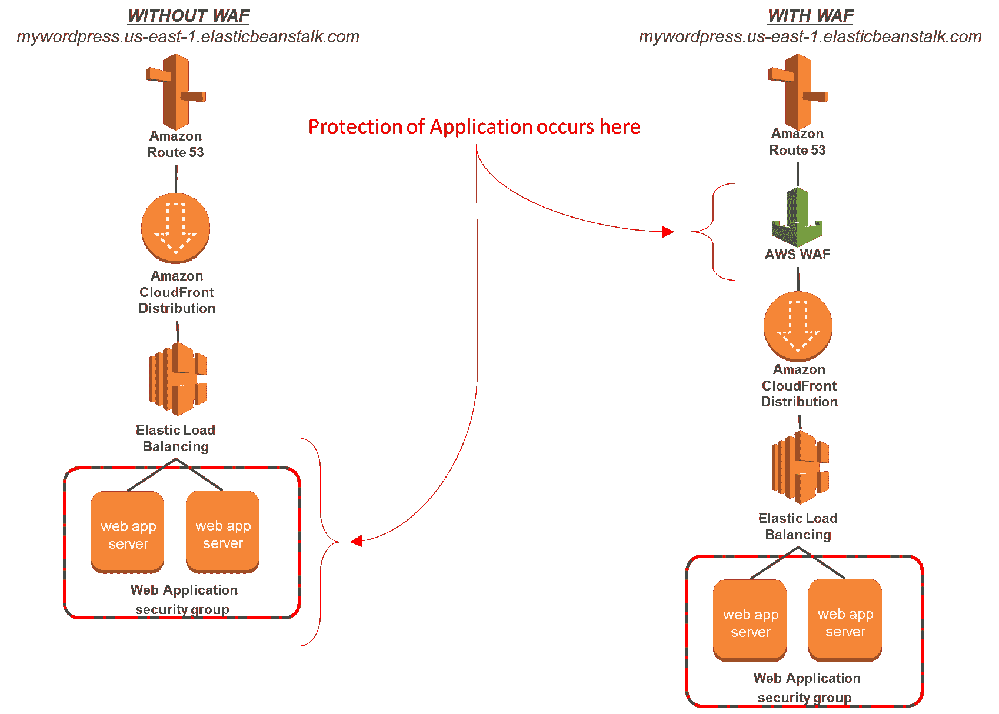

要开始使用，你首先需要确保你的 WordPress 应用程序已附加了 CloudFront CDN，或者至少前端请求是通过 Application Load Balancer 进行的。这一步至关重要，因为没有 CloudFront CDN 或 Application Load Balancer，WAF 根本无法工作！在我的案例中，我为我的生产级 WordPress 应用程序配置并部署了一个简单的 CloudFront CDN。你可以参考以下步骤指南，使用 CloudFront 设置你自己的 CDN：[`docs.aws.amazon.com/AmazonCloudFront/latest/DeveloperGuide/`](http://docs.aws.amazon.com/AmazonCloudFront/latest/DeveloperGuide/)。

# 创建 Web ACL

完成 CDN 设置后，前往 AWS 管理控制台，使用仪表板筛选 WAF 和 Shield 服务，或者直接访问此 URL [`console.aws.amazon.com/waf/home`](https://console.aws.amazon.com/waf/home) 打开 WAF 仪表板：

1.  假设这是您第一次配置 WAF，您将看到一个欢迎界面，提示您选择 AWS WAF 或 AWS Shield 服务。选择“前往 AWS WAF”选项。这将将您重定向到 WAF 仪表板，在此选择“配置 web ACL”选项以开始。

1.  选择“配置 web ACL”选项，将弹出一个“设置 web 访问控制列表（web ACL）”向导，指导您完成第一次 web ACL 设置。

1.  向导的第一页基本涵盖了条件、规则和 ACL 的概念，因此只需选择“下一步”继续。

1.  在“命名 web ACL”页面中，为您的新 ACL 提供一个合适的 Web ACL 名称。您会注意到，CloudWatch 指标名称字段会自动填充相应的名称。您可以根据需要更改名称。此指标名称将在以后用于通过 CloudWatch 仪表板监控我们的 web ACL。

1.  接下来，在“区域”下拉列表中，选择 Global (CloudFront) 或其他区域名称，具体取决于您是否要保护 CDN 或应用程序负载均衡器。以我为例，由于我已经设置了 CDN，所以我选择了 Global (CloudFront) 选项。

目前，WAF 对应用程序负载均衡器的支持仅限于以下地区：美国东部（弗吉尼亚北部）、美国西部（加利福尼亚北部）、美国西部（俄勒冈）、欧洲（爱尔兰）和亚太地区（东京）。

1.  在 AWS 资源关联字段中，您可以选择从下拉列表中选择您的 CloudFront 分发或应用程序负载均衡器；但是，为了简化起见，暂时不要配置此选项。请记住，完成此向导后，您始终可以将 web ACL 与一个或多个 AWS 资源关联！完成后，点击“下一步”继续：

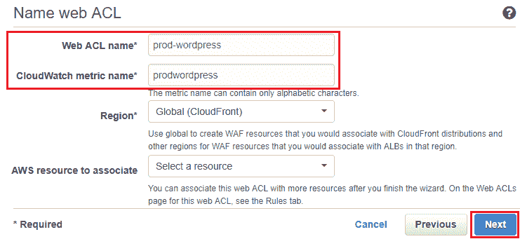

1.  在命名 web ACL 后，我们进入下一个阶段，可以配置条件。在“创建条件”页面，选择您希望为您的 web 应用程序配置的适当条件。在此场景中，我们将配置一个 IP 匹配条件以及一个字符串匹配条件。目标是仅允许我的本地笔记本 IP 访问 WordPress 管理员登录页面（`wp-login.php`），而任何其他 IP 访问 `wp-login.php` 页面时，流量应被丢弃。

# 创建条件

如前所述，条件是您希望 WAF 监控的每个传入 Web 请求的可配置特性：

1.  要开始配置条件，请从 IP 匹配条件卡片中选择“创建条件”选项。

1.  在这里，为你的匹配条件提供一个合适的名称，并从 IP 版本中选择 IPv4 选项。在地址字段中提供你的桌面或笔记本电脑的公共 IP。你也可以使用支持的 CIDR 块提供一系列 IP 地址。

1.  请记得在创建匹配条件之前选择“添加 IP 地址或范围”选项：

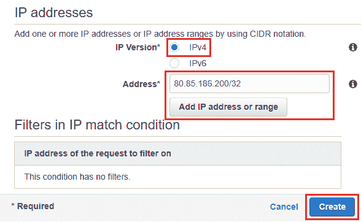

1.  创建了 IP 匹配条件后，让我们继续为我们的 ACL 创建第二个条件。为此，请从字符串和正则匹配条件部分选择“创建条件”选项。

1.  我们再次通过为我们的字符串匹配条件提供一个合适的名称开始，然后选择与之匹配的字符串类型。在这里，首先选择字符串匹配选项。

1.  接下来，在请求过滤部分，选择你希望根据匹配条件过滤的请求部分。在我的例子中，我选择了 URI 选项，因为我们需要从 URI 中匹配资源`wp-login.php`。另外，你也可以根据需求选择以下值：

+   +   `Header`：用于匹配特定的请求头，如用户代理。

    +   `HTTPMethod`：用于指示请求打算在源上执行的操作类型，如`PUT`、`GET`、`DELETE`等。

    +   `QueryString`：用于定义 URL 中的查询字符串。

    +   `Body`：用于匹配请求的主体。在这种情况下，WAF 仅检查请求主体中的前 8,192 字节（8KB）。你还可以设置大小限制条件，以阻止所有大于 8KB 的请求。

1.  接下来，在匹配类型下拉列表中，选择“包含”选项，如下图所示。“包含”选项意味着待匹配的字符串可以出现在请求的任何位置。你还可以根据需求从以下选项中进行选择：

+   +   ContainsWord：用于指定要在请求中匹配的特定值

    +   完全匹配：用于精确匹配字符串和请求值

    +   以...开始：用于检查请求开头的匹配字符串

    +   以...结束：用于检查请求结尾的匹配字符串

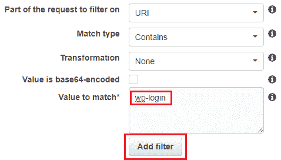

1.  转换字段在你需要在 WAF 检查请求之前重新格式化请求时非常有用。这可能包括转换为小写字母、HTML 解码、空白符规范化、URL 解码等。对于这个特定的用例，我们不需要对请求执行任何特定的转换，因此我选择了“无”选项。

1.  最后，在值匹配字段中，输入我们希望 WAF 在 Web 请求中搜索的文本（`wp-login`）。完成后，记得点击“添加过滤器”选项，然后再继续执行`创建`命令。

1.  完成此步骤后，我们的基本条件已设置完毕。或者，你可以根据你的标准和需求设置其他相关条件。完成后，选择下一步选项继续进行向导。

# 创建规则

在定义了条件后，我们将进入配置 WAF 的下一个重要方面：规则。规则基本上允许你将一个或多个条件组合成一个逻辑语句，之后可以用来允许、阻止或计数某个特定的传入请求：

1.  在创建规则页面，你现在可以合并我们之前创建的条件，并为每个规则分配相应的操作，例如允许、阻止或计数。要开始，选择创建规则选项。

1.  在创建规则弹出框中，我们将创建两个规则：一个规则基本上允许我从本地笔记本电脑访问 WordPress 管理员登录页面（`wp-login.php`），另一个规则阻止流量访问同一登录页面。让我们首先创建允许流量规则。

1.  为此，输入一个适当的规则名称。你会注意到，相应的 CloudWatch 指标名称字段也会自动填充为相同的名称。你可以根据需求选择更改此名称，或者保留其默认值。

1.  接下来，在规则类型下拉列表中，选择你希望此规则是常规规则还是评级规则。在此场景中，我选择了常规规则，如下图所示：

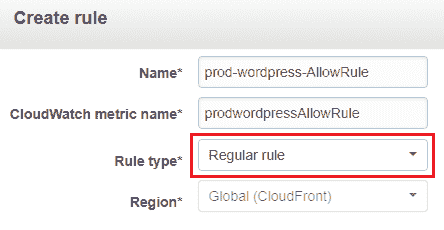

1.  完成后，继续进入添加条件部分，在这里我们可以将规则与一个或多个条件关联起来。首先选择适当的下拉选项来形成以下规则：

```
When a request: "Does": "Originate from an IP Address in": "<SELECT_YOUR_IP_ADDRESS_MATCH_CONDITION_HERE>"
```

这是你新规则应该是什么样子的，一旦正确设置完成，点击创建：

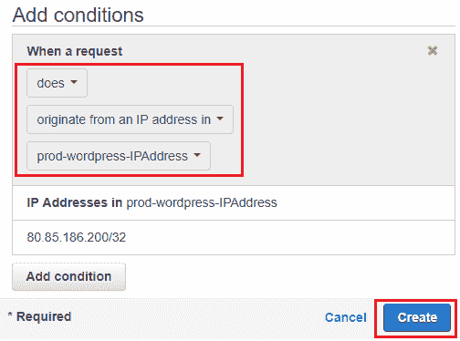

1.  在创建了“允许”规则后，我们再次使用相同的步骤来创建一个“阻止”规则。再次选择创建规则选项，并为规则提供一个适当的名称。与之前的情况类似，我在这里也选择了一个常规规则。

1.  接下来，在添加条件部分，我们首先添加一个匹配以下语句的条件：

```
When a request: "Does not": "Originate from an IP Address in": "<SELECT_YOUR_IP_ADDRESS_MATCH_CONDITION_HERE>"
```

1.  接下来，选择添加条件选项，添加字符串匹配条件：

```
When a request: "Does": "Match at least one of the filters in the string match condition": "<SELECT_YOUR_STRING_MATCH_CONDITION_HERE>"
```

这是在将条件添加到规则后，它应该是什么样子的：

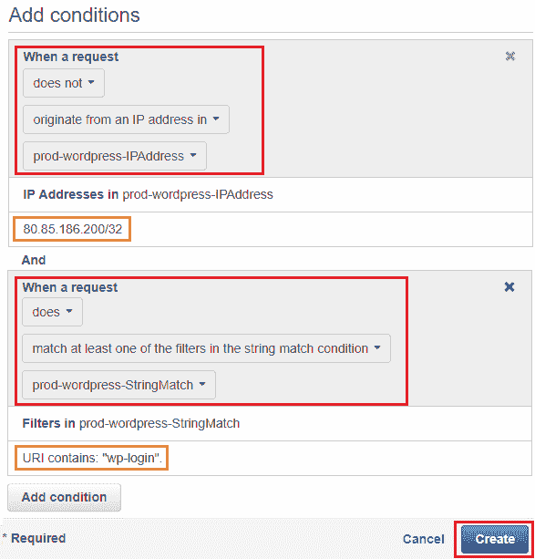

1.  在设置好条件后，选择创建选项，最终创建你的阻止规则。

1.  现在你的两个规则已经创建完成，你应该能在添加规则到 Web ACL 页面中看到它们，如下图所示：

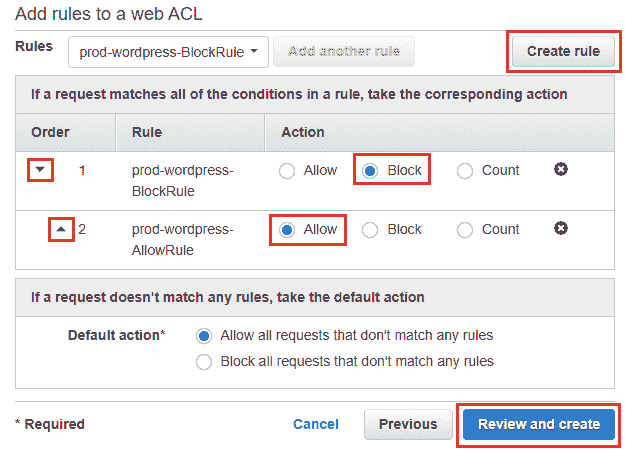

1.  在这里，请确保根据它们的优先级正确排序你的规则，通过选择所需的“顺序”选项。你还可以配置你的 Web ACL 的默认操作。只有当请求不匹配任何*允许或阻止规则*中提到的条件时，才会触发此默认操作。一旦你对配置感到满意，选择“审阅和创建”选项，如前所示。大功告成！你的基本 WAF 现在已经启动运行！

# 将 WAF Web ACL 分配给 CloudFront 分发

创建了 Web ACL 之后，你现在可以根据需求轻松地将其分配给一个或多个 CloudFront 分发。要做到这一点，只需登录到 AWS 控制台并过滤“CloudFront”服务，或者直接导航到[`console.aws.amazon.com/cloudfront/home`](https://console.aws.amazon.com/cloudfront/home)直接查看 CloudFront 仪表板：

1.  一旦登录到 CloudFront 仪表板，选择你希望启用 WAF Web ACL 规则的适当分发 ID。

1.  从“常规”选项卡中选择“编辑”选项，以打开分发的配置和设置。

1.  在“编辑分发”页面中，从 AWS WAF Web ACL 下拉列表中选择你新创建的 Web ACL，如下图所示。

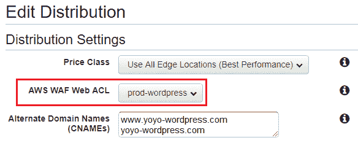

1.  一旦选择了 ACL，我还建议你启用你的分发日志记录，以防你还没有这样做。这只是一种额外的预防和安全措施，对于你可能正在工作的任何生产级环境都是必须的。在“编辑分发”页面上滚动到底部，并选择“日志记录”字段旁边的“打开”选项。在“日志记录桶的名称”字段中提供你的日志记录桶的名称，一旦所有必填字段都填写完毕，点击“是，编辑”选项。

更改将需要一些时间来传播到 CloudFront 分发中。一旦分发的“状态”更改为“已启用”，你可以开始测试你的 WAF。

要测试你的 WAF，请简单地打开浏览器，输入你的 WordPress 应用的 URL（`<http://YOUR_CLOUDFRONT_URL>/wp-login.php`）在你自己的笔记本电脑/台式机上。在这种情况下，你应该能够毫无问题地看到`wp-login.php`页面。但是，如果你尝试从不同的笔记本电脑或机器访问同一页面，你将在屏幕上看到以下错误：

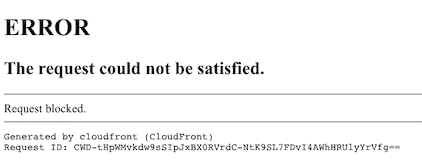

在这一点上，你的 WordPress 管理员登录页面现在受到除了你在 Web ACL 允许列表中指定的 IP 之外的所有 IP 的保护！是不是很神奇？

你可以使用 CloudFront 分发设置创建自定义错误页面，并将用户重定向到此页面，而不是显示标准的*错误页面*，如前面截图所示。

到这里，我们即将结束本节的基本 Web ACL 配置内容。在下一节中，我们将探讨如何通过添加更多条件来增强您的基本 ACL 设置，重点关注 SQL 注入和跨站脚本攻击。

# 处理 SQL 注入和跨站脚本攻击条件

除了限制对特定 IP 地址集的访问外，WAF 还提供了防范更多攻击的能力，例如 SQL 注入和跨站脚本攻击。在本节中，我们将详细了解这两种条件，以及如何利用它们保护您的应用程序。

首先，让我们更详细地了解 SQL 注入。SQL 注入本质上是在客户端发出的请求中插入 SQL 查询，攻击目标是您的应用程序。

如果 SQL 注入成功实施，它可以读取并修改数据库中的敏感数据，甚至能够执行数据库的管理操作，比如从之前的备份文件恢复、完全关闭数据库等操作。

下面是一些常见条件及其关联配置的列表，您可以选择在 Web ACL 规则中应用它们：

| **HTTP 请求组件匹配** | **相关输入转换应用** | **理由** |
| --- | --- | --- |
| `QUERY_STRING` | `URL_DECODE`, `HTML_ENTITY_DECODE` | 最常见的匹配组件。查询字符串参数常用于数据库查找。 |
| `URI` | `URL_DECODE`, `HTML_ENTITY_DECODE` | 如果您的应用使用友好或干净的 URL，那么参数可能会作为 URL 路径的一部分出现，而不是查询字符串的一部分。 |
| `BODY` | `URL_DECODE`, `HTML_ENTITY_DECODE` | 如果您的应用接受表单输入，这是一个常见的匹配组件。AWS WAF 仅评估正文内容的前 8 KB。 |
| **HEADER**: **Cookie** | `URL_DECODE`, `HTML_ENTITY` | 一个不太常见的匹配组件。如果您的应用在数据库查找中使用基于 Cookie 的参数，可以考虑匹配这个组件。 |
| **HEADER**: **Authorization** | `URL_DECODE`, `HTML_ENTITY_DECODE _DECODE` | 一个不太常见的匹配组件。如果您的应用使用该标头的值进行数据库验证，考虑匹配此组件。 |

要配置您自己的 SQL 注入条件和规则，请再次登录 WAF 仪表板，方法是访问 [`console.aws.amazon.com/waf/home`](https://console.aws.amazon.com/waf/home)。

1.  接下来，从导航窗格中选择 SQL 注入选项，然后选择创建条件以开始配置。

1.  在创建 SQL 注入匹配条件页面中，首先为您的新条件提供一个名称。您还可以选择是否要为您的 CloudFront CDN（全球）或单独的应用程序负载均衡器启用此条件。在这种情况下，我选择了全球（CloudFront）选项，如下图所示：

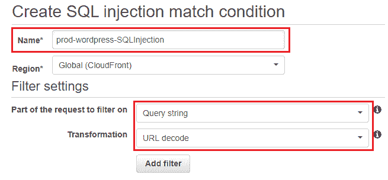

1.  接下来，在筛选设置部分，选择要筛选的请求的相应部分，以及相关的转换部分。如前所述，您可以参考 SQL 注入的*常见条件*表格。填写完值后，点击添加筛选器选项以完成该过程。

现在，这是一个非常实用的技巧！在某些情况下，您可能需要为 SQL 注入条件编写多个筛选器，依据您想要筛选的请求的不同部分，如 URI、查询字符串等。在这种情况下，建议在同一个 SQL 注入条件内创建多个筛选器，然后将该条件附加到 Web ACL 规则中。原因是，Web 请求只需要匹配 SQL 注入匹配条件中的一个筛选器，WAF 就会根据该条件允许或阻止请求。另一方面，如果您为每个 SQL 注入匹配条件仅添加一个筛选器，并且创建多个此类 SQL 注入条件，那么请求必须匹配所有条件，WAF 才会根据所有条件来允许或阻止该请求。

同样的设置也可以用于防护跨站脚本攻击（XSS）。跨站脚本通常发生在 Web 应用程序将用户提供的数据嵌入到网页中，并在没有正确清理的情况下发送到浏览器。如果数据没有经过适当验证或转义，攻击者可以利用这些向量将脚本、内联框架或其他对象嵌入渲染的页面中。这些攻击可以用于各种恶意目的，包括通过键盘记录器窃取用户凭据、安装系统恶意软件等。如果这些用户数据在服务器端的数据库中持续存在，并且随后被传递给更多的用户，攻击的影响将被放大。

以下是一些常见条件及其相关配置的列表，您可以选择应用于您的 Web ACL 规则中：

| **HTTP 请求组件匹配** | **应用的相关输入转换** | **理由** |
| --- | --- | --- |
| `BODY` | `URL_DECODE`, `HTML_ENTITY_DECODE` | 如果您的应用程序接受表单输入，这是一个非常常见的组件。AWS WAF 只会评估前 8 KB 的正文内容。 |
| `QUERY_STRING` | `URL_DECODE`, `HTML_ENTITY_DECODE` | 如果查询字符串参数被反射回网页中，建议使用此设置。一个例子是分页列表中的当前页码。 |
| **HEADER**: **Cookie** | `URL_DECODE`, `HTML_ENTITY_DECODE` | 如果你的应用接受表单输入，这是一个常见的匹配组件。推荐在你的应用使用基于 Cookie 的参数并将其反射回网页时使用。例如，当前登录用户的名称存储在一个 Cookie 中，并嵌入在页面头部。WAF 仅评估正文内容的前 8KB。 |
| `URI` | `URL_DECODE`, `HTML_ENTITY_DECODE` | 不太常见，但如果你的应用使用友好的 URL，则参数可能作为 URL 路径的一部分出现，而不是查询字符串（这些参数随后会在服务器端被重写）。这与查询字符串存在类似的安全隐患。 |

要配置你自己的跨站脚本条件和规则，再次登录到你的 WAF 仪表板，访问[`console.aws.amazon.com/waf/home`](https://console.aws.amazon.com/waf/home)。

1.  接下来，从导航窗格中选择“跨站脚本”选项，然后在其中选择“创建条件”以开始操作。

1.  在创建跨站脚本匹配条件页面中，首先为你的新条件提供一个名称。你还可以选择是否启用该条件适用于 CloudFront CDN（全局）或单个应用负载均衡器。在这种情况下，我暂时选择了全局（CloudFront）选项。

1.  接下来，在“要过滤的请求部分”一栏中，选择你希望 WAF 过滤的请求部分。你可以选择 Header、HTTP 方法、查询字符串、URI 和 Body 作为有效参数。然而请注意，如果选择了 Header 选项，系统会提供一个额外的字段，在该字段中，你可以从头部列表中选择一个头部，或者直接输入头部名称。

1.  最后，选择你希望 WAF 在实际检查请求之前执行的适当转换操作。完成后，记得选择“添加过滤器”选项，然后完成条件的创建过程。

现在，你有两个额外的条件可以添加到现有的 Web ACL 中，或者你也可以继续创建一个新的 Web ACL。通过这种方式，你可以根据需求创建不同的过滤器和条件，并在需要时将其附加到 Web ACL 中。但是，这种手动设置规则和条件的方式，随着时间的推移可能会变得有些复杂，尤其是在没有专门的安全团队的情况下，如果你需要将 ACL 快速部署到环境中。接下来，我们将介绍如何解决这个问题。

# 使用 CloudFormation 自动化 WAF Web ACL 部署

与 Web ACL 配合使用时，有时可能会非常困难，特别是当您拥有一个大型分布式环境且不一定有专门的安全团队来定期创建和管理规则时。幸运的是，AWS 通过提供易于使用和定制的 CloudFormation 模板来简化这一过程，用户可以在短短几分钟内创建一个包含所有基本安全条件配置的单一 Web ACL！这一综合解决方案称为 AWS WAF 安全自动化，所有人都可以免费使用。最终用户只需指定所需的安全功能，进行配置并部署解决方案！剩下的工作完全由 AWS 负责！

AWS WAF 安全自动化解决方案的架构相对简单，包含了比 AWS WAF 更多的 AWS 服务，例如 AWS Lambda、Amazon CloudWatch、Amazon API Gateway 和 Amazon S3，如本节后面所示的图所示。

解决方案的核心是 WAF 服务，它作为做出所有与安全相关的决策和过滤的中央点。根据用户在 CloudFormation 模板配置中指定的输入，相应的解决方案组件会相应激活。这些组件在这里进一步解释：

+   **蜜罐和反爬虫保护 (A)**：此安全组件自动设置一个*蜜罐*，以诱使并偏转可能对您的应用程序发起的攻击。该解决方案为您提供一个 API Gateway 端点，您需要将其插入到您的 Web 应用中，作为陷阱来检测并诱使来自各种爬虫和抓取器的请求。如果某个来源访问了该陷阱请求，相关的 Lambda 函数将拦截该请求，收集其源 IP 地址，并将其添加到 WAF 的 Web ACL 阻止列表中。

+   **SQL 注入保护 (B) 和跨站脚本保护 (C)**：选择此解决方案会创建两个 AWS WAF 规则，提供对常见 SQL 注入或跨站脚本模式的保护：

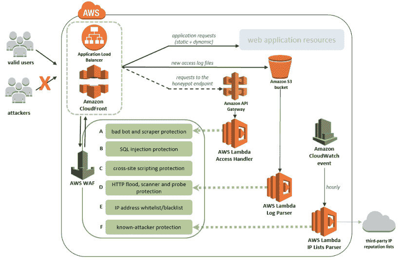

+   **HTTP 洪水、扫描器和探测器保护 (D)**：也称为**日志解析保护**，当您需要分析 Web 应用的访问日志以查找可能导致潜在威胁的异常时，此解决方案非常有用。通过一个专门的 AWS Lambda 函数来解析存储在 CloudFormation 模板创建的 S3 存储桶中的访问日志。

+   **IP 地址白名单/黑名单 (E)**：与 SQL 注入和跨站脚本解决方案类似，WAF 创建两个规则，允许您手动输入希望允许或阻止访问应用程序的 IP 地址。

+   **已知攻击者保护（F）**：此解决方案还利用了一个简单的 Lambda 函数，该函数监控某些第三方网站以获取潜在的 IP 地址列表，用于阻止威胁。这些网站包括 *Spamhaus*（[`www.spamhaus.org/drop/`](https://www.spamhaus.org/drop/)）、*Proofpoint*（[`rules.emergingthreats.net/fwrules/emerging-Block-IPs.txt`](https://rules.emergingthreats.net/fwrules/emerging-Block-IPs.txt)）和 *TOR*（[`check.torproject.org/exit-addresses`](https://check.torproject.org/exit-addresses)）等。

有了这些基本概念后，让我们迅速进入使用 CloudFormation 模板部署这些解决方案。撰写本书时，AWS WAF 安全自动化提供了两个模板供使用：一个用于基于 CloudFront CDN 的部署，另一个用于应用负载均衡器。两个模板都提供了一个默认配置，其中包括一个包含八组预配置规则的 web ACL，您可以根据需要随时更改或扩展这些规则。以下是下载相应模板的链接：

+   **基于 CloudFront CDN 的模板**: [`s3.amazonaws.com/solutions-reference/aws-waf-security-automations/latest/aws-waf-security-automations.template`](https://s3.amazonaws.com/solutions-reference/aws-waf-security-automations/latest/aws-waf-security-automations.template)

+   **基于应用负载均衡器的模板**: [`s3.amazonaws.com/solutions-reference/aws-waf-security-automations/latest/aws-waf-security-automations-alb.template`](https://s3.amazonaws.com/solutions-reference/aws-waf-security-automations/latest/aws-waf-security-automations-alb.template)

您也可以复制这些链接并在 CloudFormation 中部署堆栈。

下载正确的模板后，我们现在可以继续使用 CloudFormation 配置和部署解决方案：

1.  为此，首先通过导航到 [`console.aws.amazon.com/cloudformation/home`](https://console.aws.amazon.com/cloudformation/home) 登录到您的 CloudFormation 仪表盘。请注意，在本例中，我们将在 **N.Virginia** 区域部署基于 CloudFront CDN 的模板。

1.  在 CloudFormation 仪表盘中，选择“创建新堆栈”选项开始。在选择模板页面，您可以选择 *上传* 您下载的模板，或者仅在指定 Amazon S3 模板 URL 字段中复制模板的 URL，如下图所示。点击“下一步”继续设置：

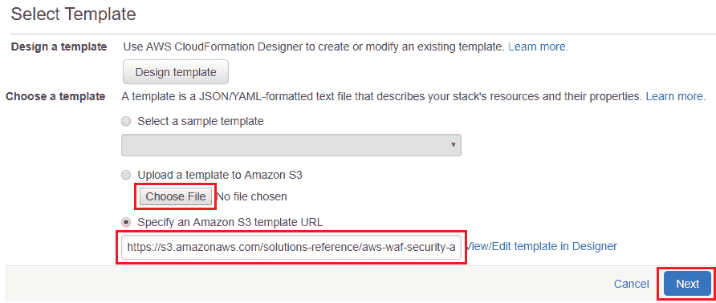

1.  在指定详细信息页面，您可以通过为您的 CloudFormation 堆栈提供一个合适的堆栈名称来开始。

1.  然后，在“参数”部分，选择您希望选择的保护服务。请记住，这些是我们在本节开始时讨论过的服务。在这种情况下，我选择了一个相对简单的设置，包括启用对 SQL 注入、跨站脚本和恶意机器人防护。您也可以根据需要选择自己的保护服务。

1.  接下来，在 CloudFront 访问日志桶名称字段中，提供一个独特的名称，用于存储 Amazon CloudFront 访问日志的 S3 桶。您可以提供现有桶的名称或新建一个桶。

1.  最后，在“高级设置”部分，您还可以选择修改一些参数，如请求阈值、错误阈值和 WAF 阻止周期，以满足您的需求。如果您选择了 HTTP 洪水保护或启用扫描器与探测器保护，这些参数将非常有用，否则，您可以像我一样将这些值保持默认。选择“下一步”继续部署过程。

1.  在“选项”页面中，您可以为 CloudFormation 模板创建的资源指定标签，并选择提供任何特殊的*IAM 角色*，以允许 CloudFormation 创建、修改或删除堆栈中的资源。点击“下一步”查看所做的更改，然后在“审查”页面选择“创建”选项以开始堆栈的创建。

1.  堆栈部署成功需要花费几分钟。一旦完成，您可以通过检查“状态”栏来验证堆栈的完成状态，如下截图所示：

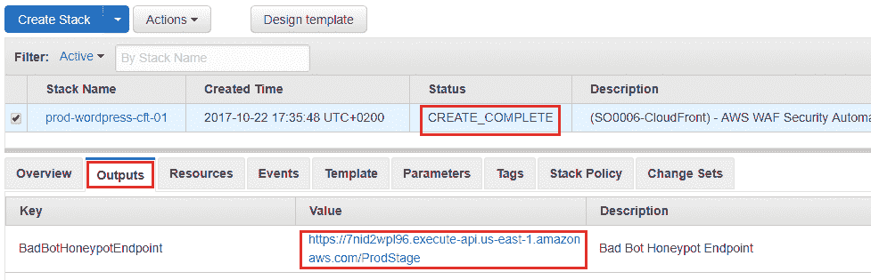

1.  此外，根据您的保护服务选择，您还可以验证模板为您的应用程序创建的其他输出，例如蜜罐端点，它实际上是一个 Amazon API Gateway 端点，您需要将其插入到应用程序中的某个位置，用来捕获机器人和爬虫。在我的案例中，模板创建了一个用于恶意爬虫的 Lambda 函数，针对 SQL 注入的 WAF 规则、IP 白名单和 XSS 检测，以及一个 API Gateway。

1.  堆栈成功运行后，您还可以返回 WAF 仪表板，查看模板自动填充的各个规则，针对一些保护服务。在这种情况下，*SQL 注入* 和 *跨站脚本* 条件已被自动填充；然而，*IP 白名单* 和 *恶意机器人* 规则仍然需要您手动提供 IP 范围和地址，或者允许 Lambda 函数在运行时将 IP 地址注入到列表中。以下是 SQL 注入条件创建的规则列表快照：

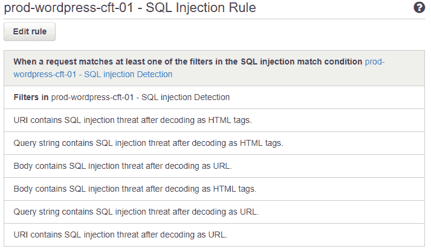

到这里，我们就结束了这一部分内容。你还可以使用这些模板为你的应用程序负载均衡器快速创建新的 Web ACL。记住，一旦测试完成，请删除你的堆栈，以避免产生不必要的费用。在下一部分中，我们将简要了解如何使用 AWS 提供的几个基本监控工具来有效监控你的 WAF 规则。

# 使用 CloudWatch 监控 WAF

监控你的 WAF 规则、条件以及应用程序的 Web 流量，对于识别和减轻可能的攻击和漏洞利用至关重要。AWS 提供了多种工具和服务，作为管理员的你可以利用它们来监控和报告此类活动。以下是简要说明的服务列表：

+   **AWS WAF 仪表盘**：没错，你没看错！AWS WAF 还提供了一个简单的监控仪表盘，列出了通过 CloudFront CDN 或应用程序负载均衡器发送到你应用程序的总请求数量，以及实际匹配你指定规则的请求数量。要查看仪表盘，你只需要登录 AWS WAF，选择 Web ACL 页面，并点击 Requests 标签，如下图所示：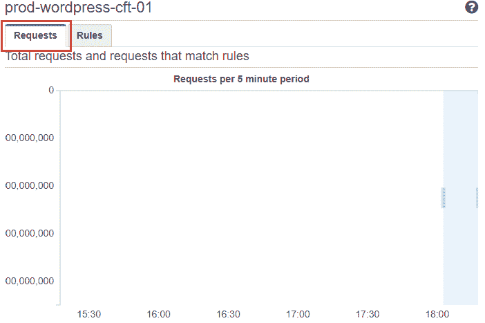

该图表按五分钟周期聚合和显示请求。你也可以使用 Amazon CloudWatch 打开相同的图表进行进一步分析。

+   **Amazon CloudWatch**：Amazon CloudWatch 已经存在一段时间，并且提供了多种你可以选择和配置的指标，作为定制请求监控仪表盘的一部分。以下是支持的 WAF 指标列表及简要说明：

    +   `AllowedRequests`：捕获被允许的 Web 请求数量。此指标的有效维度为 Rule 和 WebACL。

    +   `BlockedRequests`：捕获被阻止的 Web 请求数量。此指标的有效维度为 Rule 和 WebACL。

    +   `CountedRequests`：通常用于测试你的 Web ACL 和规则，这个指标提供了匹配特定规则中所有条件的 Web 请求计数。

你可以使用这些指标来监控你的 WAF 规则，甚至可以配置 CloudWatch 警报，当它们的阈值被超越时触发并发送通知。根据你的需求，你还可以进一步配置 CloudWatch 事件，触发相应的 Lambda 函数来缓解可能的攻击，正如我们在安全自动化解决方案中所执行的那样。你甚至可以利用 Amazon CloudWatch 来监控流入 CloudFront CDN 和应用程序负载均衡器的流量。

+   **AWS** **CloudTrail**：AWS CloudTrail 是你可以并且应该利用的另一项服务，用于解析和分析你的应用程序访问和错误日志，以及 AWS 服务本身生成的日志。以下是一些由安全自动化解决方案自动创建的日志组，用于捕获 WAF 流量流动和事件。我们将在下一章深入探讨 AWS CloudTrail：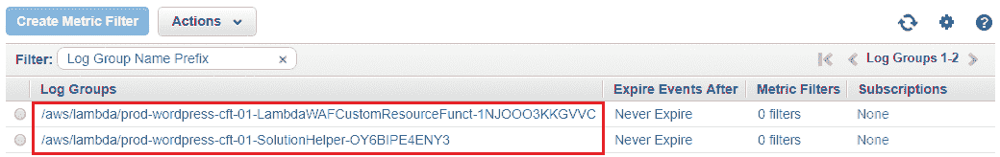

到这里，我们已经接近本章的结尾，但在我们结束之前，我想分享一些有趣的内容，我认为你作为 AWS WAF 的一部分应该尝试。

# 规划你的下一步

好吧，我们在本章中介绍了许多新的功能和服务。不过，我还是建议你自己阅读一些内容。首先要了解的是 AWS Shield 服务！

# AWS Shield 介绍

AWS Shield 是 AWS WAF 的扩展，但其目标是提供针对潜在 DDoS 攻击的安全保护。它是一项完全托管的服务，提供始终在线的检测和自动化缓解功能，最大限度减少应用程序的停机时间和延迟。AWS Shield 提供两个服务级别：**标准**和**高级**：

+   **AWS Shield Standard**：该服务不收取额外费用，默认启用在你的账户和 AWS 服务上，旨在保护你的 web 应用程序免受最常见和频繁发生的 DDoS 攻击。

+   **AWS Shield Advanced**：旨在为你的 web 应用程序提供更高层次的保护，AWS Shield Advanced 适用于当前运行在弹性负载均衡器（Elastic Load Balancers）或应用程序负载均衡器（Application Load Balancers）、Amazon CloudFront 和 Amazon Route 53 资源上的应用程序。AWS Shield Advanced 还提供对潜在攻击的近实时可见性，并具备缓解能力。最棒的是，你还可以获得专门的 24x7 **DDoS 响应团队** (**DRT**) 的支持，他们会关注你 web 应用程序上发生的潜在 DDoS 攻击，并提供快速的解决方案。

AWS Shield Advanced 的费用为每月 3,000 美元。

这是 AWS Shield 标准和高级服务之间的简要对比：

| **功能** | **AWS Shield Standard** | **AWS Shield Advanced** |
| --- | --- | --- |
| 网络流量监控 | 是 | 是 |
| 自动化应用程序（第 7 层）流量监控 | 否 | 是 |
| 有助于防范常见的 DDoS 攻击，例如 SYN 洪水和 UDP 反射攻击 | 是 | 是 |
| 访问额外的 DDoS 缓解能力 | 否 | 是 |
| 第 3/4 层攻击通知及攻击取证和历史报告 | 否 | 是 |
| 高严重性事件期间的事件管理 | 否 | 是 |
| 攻击期间的自定义缓解措施 | 否 | 是 |
| 攻击后分析 | 否 | 是 |
| 补偿与 Route 53、CloudFront 和 ELB 相关的 DDoS 费用 | 否 | 是 |

要为您的环境启用 AWS Shield Advanced，只需登录到您的 AWS WAF 仪表盘，然后在导航窗格中的 AWS Shield 部分选择受保护资源选项。在这里，点击启用 AWS Shield Advanced 按钮，开始您的 Shield Advanced 保护计划。在此过程中，您将被要求选择一个特定的资源，以保护免受 DDoS 攻击。根据您希望保护的资源，选择您的 CloudFront CDN 或弹性/应用负载均衡器，并为您指定的保护资源提供一个合适的名称。最后，记得勾选启用复选框，以将您的资源与 Web ACL 关联（如果您已经创建了 Web ACL）。完成后，选择添加 DDoS 保护选项，完成！您的 AWS Shield Advanced 保护已经启动！很简单，不是吗？

# 总结

以下是本章中我们已经涵盖的主题的简要回顾。

我们首先学习并了解了 Web 应用防火墙服务的一些基本知识，以及它如何通过防止潜在的安全威胁和漏洞来保护应用程序。接下来，我们查看了如何通过利用 IP 匹配以及字符串/正则表达式匹配条件，来保护我们之前部署的 WordPress 应用免受限制性访问。我们还讨论了如何通过利用 WAF 高级条件（如 SQL 注入和跨站脚本攻击）来减轻和保护您的应用程序。最后，我们介绍了如何利用某些预构建的 CloudFormation 模板来自动部署我们的 WAF 规则，并以简要介绍 AWS Shield 及其不同层次作为本章的结束。

在下一章，我们将继续我们的安全之旅，并将介绍两个非常棒的服务：AWS CloudTrail 和 AWS Config，请继续关注！
