# 使用 AWS CloudTrail 和 AWS Config 管理你的环境

在上一章中，我们学习了如何利用 AWS WAF 保护你的 web 应用免受常见的 web 攻击和漏洞利用。在这一章中，我们将探索两个非常有用且必不可少的安全和治理服务，即 AWS CloudTrail 和 AWS Config！

记住这一点，让我们快速看一下本章将涵盖的各种主题：

+   介绍 AWS CloudTrail、它的概念以及它是如何工作的

+   通过创建你自己的 Trail 为你的 AWS 环境启用 CloudTrail

+   使用 Amazon CloudWatch 集成和管理 CloudTrail 日志

+   使用 CloudFormation 为 CloudTrail 自动化 Amazon CloudWatch 警报

+   使用 Amazon Elasticsearch 查看 CloudTrail 日志

+   介绍 Amazon Config 及其工作原理

有很多事情要做，我们赶紧开始吧！

# 介绍 AWS CloudTrail

正如我们在上一章中了解到的，AWS 提供了多种工具和托管服务，帮助你保护运行在云上的应用，如 AWS WAF 和 AWS Shield。但这仅仅是一个更大拼图中的一个重要部分！那么合规性监控、风险审计以及环境的整体治理呢？你如何有效地分析环境中发生的事件并采取应对措施呢？幸运的是，AWS 为我们提供了解决问题的方法——AWS CloudTrail。

AWS CloudTrail 为你提供记录 AWS 账户内用户、服务、角色甚至 API 所采取的每一个操作的能力。每个记录的操作都被视为一个事件，之后可以分析这些事件来增强你的 AWS 环境的安全性。以下是启用 CloudTrail 后你可以获得的一些关键好处：

+   **深入的可见性**：使用 CloudTrail，你可以轻松获得账户使用情况的更好洞察，通过记录每个用户的活动，比如哪个用户发起了新的资源创建，这个请求是从哪个 IP 地址发起的，创建了哪些资源以及在何时创建等等！

+   **更简单的合规性监控**：通过 CloudTrail，你可以轻松地记录和记录发生在你的 AWS 账户内的事件，无论这些事件是来自管理控制台、AWS CLI，还是其他 AWS 工具和服务。最棒的是，你可以将 CloudTrail 与其他 AWS 服务（如 Amazon CloudWatch）集成，来警报和响应不合规事件。

+   **安全自动化**：正如我们在前一章所看到的，自动响应安全威胁不仅能够让你更快地减轻潜在威胁，还提供了一个机制来阻止所有后续攻击。AWS CloudTrail 同样适用！通过与 Amazon CloudWatch 事件的简单集成，你现在可以创建相应的 Lambda 函数，当合规性未达标时，自动触发这些函数，所有这些都可以在几秒钟内完成！

记住这些关键点后，让我们快速浏览一下 CloudTrail 的一些基本概念和术语：

+   **事件**：事件是 CloudTrail 中的基本计量单位。本质上，事件不过是记录某一特定活动的记录，这些活动可以是由 AWS 服务、角色或甚至 AWS 用户发起的。这些活动都作为 API 调用被记录，这些调用可以来自管理控制台、AWS SDK，甚至 AWS CLI。默认情况下，事件由 CloudTrail 与 S3 桶一起存储 7 天。你可以通过 CloudTrail 提供的事件历史功能查看、搜索，甚至下载这些事件。

+   **Trail**：Trail 本质上是交付机制，通过它，事件被发送到 S3 桶中。你可以使用这些 Trail 记录特定桶中的特定事件，并且能够过滤事件以及加密传输的日志文件。默认情况下，每个 AWS 区域最多可以创建*五个 Trail*，且此限制无法增加。

+   **CloudTrail 日志**：一旦你的 CloudTrail 开始捕获事件，它会将这些事件以 CloudTrail 日志文件的形式发送到 S3 桶中。日志文件是 JSON 文本文件，使用`.gzip`格式进行压缩。每个文件可以包含一个或多个事件。以下是 CloudTrail 日志的简单表示。在这个例子中，事件是我尝试通过 AWS 管理控制台将一个名为`Mike`的现有用户添加到*管理员*组时创建的：

```
{"Records": [{ 
    "eventVersion": "1.0", 
    "userIdentity": { 
        "type": "IAMUser", 
        "principalId": "12345678", 
        "arn": "arn:aws:iam::012345678910:user/yohan", 
        "accountId": "012345678910", 
        "accessKeyId": "AA34FG67GH89", 
        "userName": "Alice", 
        "sessionContext": {"attributes": { 
            "mfaAuthenticated": "false", 
            "creationDate": "2017-11-08T13:01:44Z" 
        }} 
    }, 
    "eventTime": "2017-11-08T13:09:44Z", 
    "eventSource": "iam.amazonaws.com", 
    "eventName": "AddUserToGroup", 
    "awsRegion": "us-east-1", 
    "sourceIPAddress": "127.0.0.1", 
    "userAgent": "AWSConsole", 
    "requestParameters": { 
        "userName": "Mike", 
        "groupName": "administrator" 
    }, 
    "responseElements": null 
}]} 
```

你可以通过访问在创建 Trail 时指定的 S3 桶来查看你自己的 CloudTrail 日志文件。每个日志文件都使用以下格式唯一命名：

```
AccountID_CloudTrail_RegionName_YYYYMMDDTHHmmZ_UniqueString.json.gz 
```

其中：

+   `AccountID`: 你的 AWS 账户 ID。

+   `RegionName`: 捕获事件的 AWS 区域：**us-east-1**，依此类推。

+   `YYYYMMDDTTHHmmz`: 指定年份、月份、日期、小时（24 小时制）、分钟和秒数。`z`表示 UTC 时间。

+   `UniqueString`: 一个随机生成的 16 字符长字符串，简单用于避免日志文件的覆盖。

了解了基础知识后，让我们快速看看如何开始在你自己的 AWS 环境中使用 CloudTrail！

# 使用 AWS CloudTrail

AWS CloudTrail 是一个相当简单且易于使用的服务，你可以在几分钟内开始使用。在本节中，我们将通过 AWS 管理控制台本身简单设置一个 CloudTrail Trail。

# 创建你的第一个 CloudTrail Trail

首先，登录到您的 AWS 管理控制台，并通过 AWS 服务筛选器过滤出 CloudTrail 服务。在 CloudTrail 仪表板上，选择“创建 Trail”选项以开始：

1.  这将打开创建 Trail 向导。使用此向导，您可以在每个区域创建最多五个 Trail。首先在 Trail 名称字段中输入一个合适的名称。

1.  接下来，您可以选择将 Trail 应用到所有区域，或者仅应用到您当前操作的区域。选择所有区域将使 CloudTrail 记录每个区域的事件，并将相应的日志文件导入您指定的 S3 存储桶。或者，选择只记录一个区域的事件将仅捕获该区域内的事件。在我的情况下，我选择仅为我当前工作的区域启用 Trail。在接下来的部分中，我们将学习如何使用 AWS CLI 更改此值：

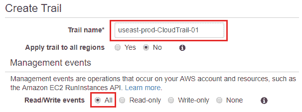

1.  接下来，在管理事件部分，选择您希望捕获的 AWS 环境中的事件类型。默认情况下，CloudTrail 会记录所有在您的 AWS 账户中发生的管理事件。这些事件可以是 API 操作，例如由于调用 EC2 RunInstances 或 TerminateInstances 操作而引发的事件，或者甚至是非 API 类型的事件，例如用户登录到 AWS 管理控制台等。对于这个特定的使用案例，我选择记录所有管理事件。

选择只读选项将捕获所有 `GET` API 操作，而选择写入选项将仅捕获在您的 AWS 环境中发生的 `PUT` API 操作。

1.  接下来，在存储位置部分，提供一个合适的 S3 存储桶名称，用于存储您的 CloudTrail 日志文件。这个存储桶将存储所有您的 CloudTrail 日志文件，无论日志来自哪个区域。您还可以从 S3 存储桶选择字段中选择一个现有的存储桶：

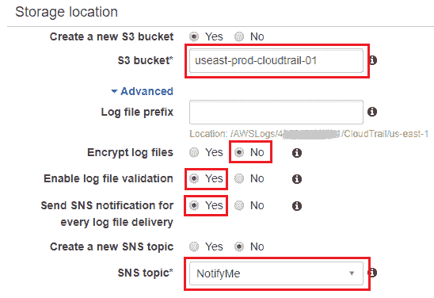

1.  接下来，在高级部分，您可以选择性地配置日志文件前缀。默认情况下，日志将自动存储在类似文件夹的层级结构下，通常形式为 `AWSLogs/ACCOUNT_ID/CloudTrail/REGION`。

1.  您还可以选择通过 AWS KMS 密钥加密日志文件。强烈建议在生产环境中启用此功能。

1.  在启用日志文件验证字段中选择“是”将启用您验证已交付的日志文件完整性，确保它们在送达 S3 存储桶后没有被篡改。

1.  最后，您甚至可以启用 CloudTrail，以便每次新的日志文件被送到您的 S3 存储桶时，通过选择“是”来启用“每次日志文件交付时发送 SNS 通知”选项。这将为您提供一个附加选项，可以选择一个预定义的 SNS 主题，或者为这个特定的 CloudTrail 创建一个新的 SNS 主题。填写所有必填字段后，点击“创建”以继续。

到这里，您应该能够通过从 CloudTrail 仪表盘的导航窗格中选择“Trail”选项，查看新创建的 Trail，如下图所示：

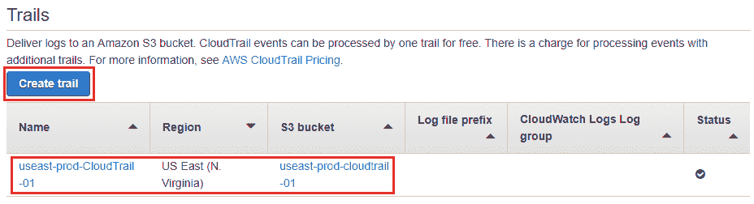

# 查看和筛选捕获的 CloudTrail 日志和事件

创建完 Trail 后，您可以使用 CloudTrail 仪表盘导航窗格中的 *事件历史* 选项查看捕获的事件并进行筛选。在这里，您可以查看过去 7 天内捕获的事件，甚至可以通过使用一个或多个支持的筛选属性来筛选特定的事件。

这里是您可以与时间范围一起使用的筛选属性的快速查看，以提取所需的事件和日志：

+   事件 ID：每个由 CloudTrail 捕获的事件都有一个唯一的 ID，您可以通过它进行筛选和查看。

+   事件名称：事件的名称。例如，EC2 事件 RunInstances、DescribeInstances 等。

+   事件源：请求所针对的 AWS 服务。例如，`iam.amazonaws.com` 或 `ec2.amazonaws.com`。

+   资源名称：事件引用的资源的名称或 ID。例如，名为 `useast-prod-wordpress-code` 的存储桶，或者 EC2 实例的实例 ID `i-1234567`。

+   资源类型：事件引用的资源类型。例如，S3 的资源类型可以是 Bucket，EC2 的资源类型可以是 Instance，等等。

+   用户名：创建或执行该事件操作的用户的名称。例如，一个 IAM 用户登录到 AWS 管理控制台，等等：

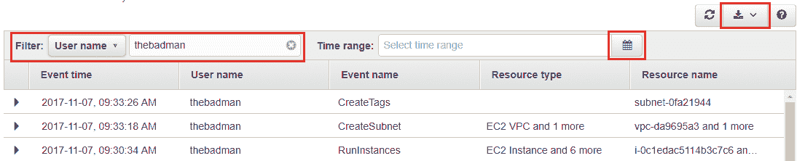

一旦您选择了特定的筛选器并提供了其相关属性值，您可以使用时间范围来缩小搜索结果，基于预定义的时间窗口进行筛选。为了进一步分析，您还可以选择事件详细信息窗格中的“查看事件”选项。选择此选项将以 JSON 格式查看事件，如下所示的代码所示：

```
{ 
    "eventVersion": "1.05", 
    "userIdentity": { 
        "type": "IAMUser", 
        "principalId": "AIDAIZZ25SDDZAQTF2K3I", 
        "arn": "arn:aws:iam::01234567890:user/yohan", 
        "accountId": "01234567890", 
        "accessKeyId": "ASDF56HJERW9PQRST", 
        "userName": "yohan", 
        "sessionContext": { 
            "attributes": { 
                "mfaAuthenticated": "false", 
                "creationDate": "2017-11-07T08:13:26Z" 
            } 
        }, 
        "invokedBy": "signin.amazonaws.com" 
    }, 
    "eventTime": "2017-11-07T08:25:32Z", 
    "eventSource": "s3.amazonaws.com", 
    "eventName": "CreateBucket", 
    "awsRegion": "us-east-1", 
    "sourceIPAddress": "80.82.129.191", 
    "userAgent": "signin.amazonaws.com", 
    "requestParameters": { 
        "bucketName": "sometempbucketname" 
    }, 
    "responseElements": null, 
    "requestID": "163A30A312B21AB2", 
    "eventID": "e7b7dff6-f196-4358-be64-aae1f5e7fed6", 
    "eventType": "AwsApiCall", 
    "recipientAccountId": "01234567890" 
} 
```

您还可以选择下载图标，并选择是否希望使用“导出为 CSV”或“导出为 JSON”选项导出所有日志。

您还可以通过访问 CloudTrail S3 存储桶并根据需求下载各个压缩的 JSON 文件来下载日志文件。

到这里，我们已接近本节的结尾。您可以使用这些相同的步骤，创建不同的 Trail 来捕获数据以及管理活动。在下一节中，我们将看到如何利用 AWS CLI 来更新我们新创建的 Trail。

# 使用 AWS CLI 修改 CloudTrail Trail

设置好 Trail 后，您可以使用 AWS 管理控制台或 AWS CLI 来修改其设置。在此，我们将介绍如何使用 AWS CLI 对新创建的 Trail 进行简单的更改。在继续此部分之前，您需要确保已根据 [`docs.aws.amazon.com/cli/latest/userguide/installing.html`](http://docs.aws.amazon.com/cli/latest/userguide/installing.html) 提供的指南在您的桌面/笔记本电脑上安装并配置了 AWS CLI。

一旦 CLI 安装并配置完毕，我们现在可以运行一些简单的命令来验证其有效性。首先，让我们使用 `describe-trails` 命令检查新创建的 Trail 状态，如下所示：

```
# aws cloudtrail describe-trails 
```

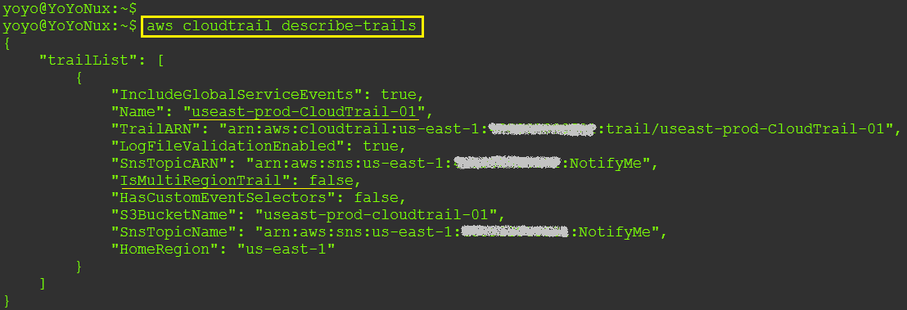

这将显示您的 CloudTrail Trails 的基本属性，如 `Name`、`TrailARN`、是否启用了日志文件验证以及该 Trail 是否为多区域 Trail 或仅属于一个区域。在此，`IsMultiRegionTrail` 的值设置为 `false`，这意味着该 Trail 仅会记录当前区域的事件，即 `us-east-1`。接下来，让我们使用 AWS CLI 修改这一设置。

为此，我们将使用 `update-trail` 命令：

```
# aws cloudtrail update-trail \ 
--name useast-prod-CloudTrail-01 \ 
--is-multi-region-trail 
```

以下代码将简单地将 `IsMultiRegionTrail` 值从 `false` 更改为 `true`。您可以通过之前执行的 `describe-trails` 命令来验证这一点。同样，您也可以使用 `update-trail` 命令来更改 CloudTrail Trail 的其他设置，比如启用日志文件验证功能，如下所示：

```
# aws cloudtrail update-trail \ 
--name useast-prod-CloudTrail-01 \ 
--enable-log-file-validation 
```

最后，您甚至可以使用 AWS CLI 执行 `get-trail-status` 命令来检查 Trail 的当前状态，如下所示：

```
# aws cloudtrail get-trail-status \ 
--name useast-prod-CloudTrail-01  
```

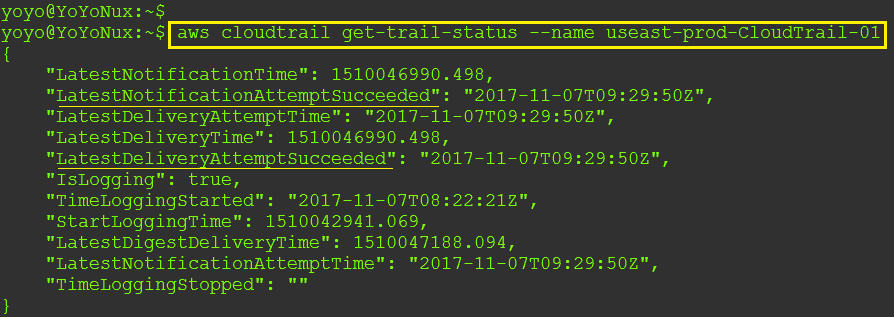

除了这些值之外，`get-trail-status` 命令还会额外显示两个字段（`LatestNotificationError` 和 `LatestDeliveryError`），用于显示 Amazon SNS 订阅失败或 CloudTrail Trail 在将事件写入 S3 存储桶时失败的情况。

完成此步骤后，我们将进入本章的下一个部分，在该部分中，我们将学习如何借助 CloudWatch Logs 有效地监控您的 Trails。

# 使用 CloudWatch 监控 CloudTrail 日志

使用 CloudTrail 的最佳功能之一是，您可以轻松将其与其他 AWS 服务集成，从而提升安全审计和治理体验。我们将在这里使用并探讨的一个服务是 Amazon CloudWatch。

使用 CloudWatch，您可以轻松设置自定义度量过滤器和一系列警报，当您的 AWS 环境中发生特定的安全或治理问题时，能够将通知发送给相应的人群。要开始使用 CloudWatch 与 CloudTrail，您首先需要配置 Trail，将捕获的日志事件发送到 CloudWatch Logs。这可以通过 AWS 管理控制台和 AWS CLI 轻松配置。接下来，一旦完成此步骤，您需要定义自定义 CloudWatch 度量过滤器，评估日志事件是否与特定模式匹配。一旦匹配，您可以进一步配置 CloudWatch 触发相应的警报、发送通知，甚至基于生成的警报类型执行补救措施。

这是 CloudTrail 与 CloudWatch 集成的示意图：

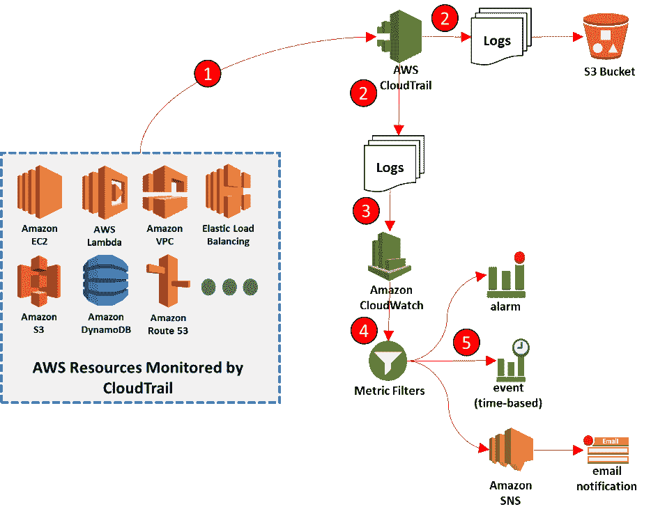

本节中，我们将使用 AWS CLI 将 Trail 的日志与 Amazon CloudWatch Logs 进行集成：

1.  首先，我们需要使用以下命令创建一个新的 CloudWatch 日志组：

```
# aws logs create-log-group --log-group-name useast-prod-CloudTrail-LG-01 
```

1.  接下来，您需要提取并记录新创建的日志组 ARN，以便进行后续步骤。为此，输入以下命令，并记录日志组的 ARN，如下所示：

```
# aws logs describe-log-groups
```

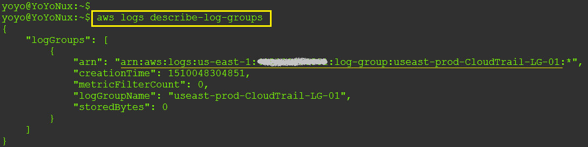

1.  成功创建日志组后，我们需要创建一个新的 IAM 角色，该角色将使 CloudTrail 能够将其日志发送到 CloudWatch 日志组。为此，我们首先需要创建一个策略文档，赋予 CloudTrail Trail`AssumeRole`权限。创建一个新文件，并将以下内容粘贴到该文件中。记得以`.json`扩展名创建该文件：

```
# vi policy.json 
{ 
  "Version": "2012-10-17", 
  "Statement": [ 
    { 
      "Sid": "", 
      "Effect": "Allow", 
      "Principal": { 
        "Service": "cloudtrail.amazonaws.com" 
      }, 
      "Action": "sts:AssumeRole" 
    } 
  ] 
} 
```

1.  创建文件后，使用`create-role`命令为 CloudTrail 创建具有所需权限的角色：

```
# aws iam create-role --role-name useast-prod-CloudTrail-Role-01 \ 
--assume-role-policy-document file://policy.json 
```

1.  执行此命令后，请记录下新创建角色的 ARN。接下来，将以下角色策略文档复制并粘贴到一个新文件中。此策略文档授予 CloudTrail 必要的权限，以便在您之前创建的日志组中创建 CloudWatch Logs 日志流，从而将 CloudTrail 事件传递到该日志流：

```
    # vi permissions.json
    {
      "Version": "2012-10-17",
      "Statement": [
        {

          "Sid": "CloudTrailCreateLogStream",
          "Effect": "Allow",
          "Action": [
            "logs:CreateLogStream"
          ],
          "Resource": [
            "<YOUR_LOG_GROUP_ARN>"
          ]

        },
        {
          "Sid": "CloudTrailPutLogEventsToCloudWatch",
          "Effect": "Allow",
          "Action": [
            "logs:PutLogEvents"
          ],
          "Resource": [
            "<YOUR_LOG_GROUP_ARN>"
          ]
        }
      ]
    }
```

1.  接下来，运行以下命令将权限应用于该角色。记得在这里提供我们在之前步骤中创建的策略名称：

```
# aws iam put-role-policy --role-name useast-prod-CloudTrail-Role-01 \ 

--policy-name cloudtrail-policy \ 
--policy-document file://permissions.json 
```

1.  最后一步是使用以下命令片段，更新 Trail，添加日志组 ARN 以及 CloudWatch Logs 角色 ARN：

```
# aws cloudtrail update-trail --name useast-prod-CloudTrail-01 \ 
 --cloud-watch-logs-log-group-arn <YOUR_LOG_GROUP_ARN> \ 
 --cloud-watch-logs-role-arn <YOUR_ROLE_ARN> 
```

到此为止，您已将 CloudTrail 日志与我们创建的 CloudWatch 日志组成功集成。您可以通过查看 CloudWatch 仪表板中的 CloudWatch Logs 部分下的日志组来验证这一点。

在下一节中，我们将利用新创建的日志组，为监控和警报目的分配自定义度量和警报。

# 创建用于监控 CloudTrail 日志的自定义度量过滤器和警报

在创建并将日志组与 CloudTrail Trail 集成后，我们现在可以继续创建并分配自定义度量过滤器和警报。每当 CloudTrail 识别出特定的合规性或治理问题时，这些警报可以用于触发通知。

首先，让我们通过 CloudWatch 日志创建一个自定义度量过滤器。在这个例子中，我们将创建一个简单的过滤器，每当对 S3 存储桶进行 API 调用时，就触发一个 CloudWatch 警报。这个 API 调用可以是对存储桶策略、生命周期等进行的简单 PUT 或 DELETE 操作：

1.  登录到您的 Amazon CloudWatch 仪表板，或者，您也可以通过以下链接开始：[`console.aws.amazon.com/cloudwatch/`](https://console.aws.amazon.com/cloudwatch/)。

1.  登录后，从导航窗格中选择“日志”选项。选择我们之前创建的新日志组，并选择“创建度量过滤器”选项，如下图所示：

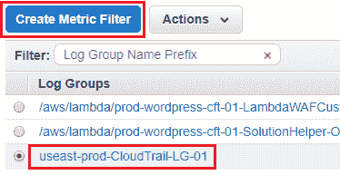

1.  在“创建度量过滤器并分配度量”页面中，首先为新度量提供一个合适的过滤器名称，然后将过滤器模式选项填写为以下片段：

```
{($.eventSource = s3.amazonaws.com) && (($.eventName = PutBucketAcl) || ($.eventName = PutBucketPolicy) || ($.eventName = PutBucketLifecycle) || ($.eventName = DeleteBucketPolicy) || ($.eventName = DeleteBucketLifecycle))} 
```

1.  完成后，输入一个合适的度量标准命名空间值，并随后输入度量名称。将其余值保持为默认值，选择“创建过滤器”选项以完成该过程。

1.  完成这一步后，您现在已经拥有一个正常工作的 CloudWatch 过滤器。为了为此过滤器分配警报，只需选择过滤器旁边的“创建警报”选项，如下图所示：

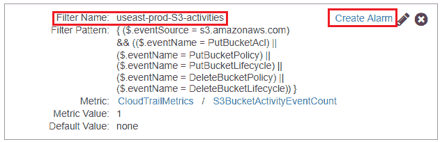

1.  创建警报是一个相当直接且简单的过程，我相信您完全有资格完成这项设置。首先为您的警报提供一个名称和可选的描述，然后通过设置事件计数为`>= 1`，在`1`个连续周期内配置触发器。接下来，记得在“操作”部分设置选择一个 SNS 通知列表，或者创建一个新的列表。所有设置完成后，选择“创建警报”选项以完成此过程。

完成这一步后，剩下的唯一任务就是试用过滤器！登录到您的 S3 仪表板并创建一个新存储桶，或者，您也可以更新现有存储桶的策略。CloudTrail Trail 会捕捉到这个变化，并将日志发送到您的 CloudWatch 日志组，在那里我们新创建的度量过滤器会触发一个警报，通知相关的云管理员！是不是很棒？您可以根据需求使用更多自定义过滤器和警报来配置 CloudWatch 的通知。

在下一节中，我们将讨论一种相当简单且自动化的方法，通过单个 CloudFormation 模板创建和部署多个 CloudWatch 警报。

# 自动化部署 AWS CloudTrail 的 CloudWatch 警报

如前一节所讨论的，你可以轻松地为监控你的 CloudTrail 日志文件创建不同的 CloudWatch 指标和警报。幸运的是，AWS 提供了一个非常简单且易于使用的 CloudFormation 模板，使你能够在几分钟内通过几个必要的警报快速启动！这个模板的最佳部分是，你可以通过添加自己的自定义警报和通知来扩展它。因此，不再多说，让我们开始吧。

该模板本身非常简单且易于使用。你可以在 [`s3-us-west-2.amazonaws.com/awscloudtrail/cloudwatch-alarms-for-cloudtrail-api-activity/CloudWatch_Alarms_for_CloudTrail_API_Activity.json`](https://s3-us-west-2.amazonaws.com/awscloudtrail/cloudwatch-alarms-for-cloudtrail-api-activity/CloudWatch_Alarms_for_CloudTrail_API_Activity.json) 下载一个版本。

在撰写本书时，该模板支持为以下 AWS 资源集创建度量过滤器：

+   亚马逊 EC2 实例

+   IAM 策略

+   Internet 网关

+   网络 ACL

+   安全组

1.  要创建并启动这个 CloudFormation 堆栈，请通过导航到 [`console.aws.amazon.com/cloudformation`](https://console.aws.amazon.com/cloudformation) 进入 CloudFormation 仪表板。

1.  接下来，选择“创建堆栈”选项，打开 CloudFormation 模板选择页面。将 [`s3-us-west-2.amazonaws.com/awscloudtrail/cloudwatch-alarms-for-cloudtrail-api-activity/CloudWatch_Alarms_for_CloudTrail_API_Activity.json`](https://s3-us-west-2.amazonaws.com/awscloudtrail/cloudwatch-alarms-for-cloudtrail-api-activity/CloudWatch_Alarms_for_CloudTrail_API_Activity.json) 粘贴到“指定一个 Amazon S3 模板 URL”字段中，点击“下一步”继续。

1.  在“指定详细信息”页面，提供一个合适的堆栈名称，并填写以下必填参数：

    +   邮箱：一个有效的电子邮件地址，将接收所有 SNS 通知。模板成功部署后，你必须确认这个电子邮件订阅。

    +   LogGroupName：我们在本章前面创建的日志组的名称。

1.  填写完必需的值后，点击“下一步”继续。审查模板设置后，在“审查”页面上选择“创建”选项完成过程。

该模板需要几分钟才能完成所需警报的创建和配置。以下是为你的环境创建的警报和指标的快照：

| **创建的资源的逻辑 ID** | **资源类型** |
| --- | --- |
| `AlarmNotificationTopic` | `AWS::SNS::Topic` |
| `AuthorizationFailuresAlarm` | `AWS::CloudWatch::Alarm` |
| `CloudTrailChangesAlarm` | `AWS::CloudWatch::Alarm` |
| `CloudTrailChangesMetricFilter` | `AWS::Logs::MetricFilter` |
| `ConsoleSignInFailuresAlarm` | `AWS::CloudWatch::Alarm` |
| `ConsoleSignInFailuresMetricFilter` | `AWS::Logs::MetricFilter` |
| `EC2InstanceChangesAlarm` | `AWS::CloudWatch::Alarm` |
| `EC2InstanceChangesMetricFilter` | `AWS::Logs::MetricFilter` |
| `EC2LargeInstanceChangesAlarm` | `AWS::CloudWatch::Alarm` |
| `EC2LargeInstanceChangesMetricFilter` | `AWS::Logs::MetricFilter` |
| `GatewayChangesAlarm` | `AWS::CloudWatch::Alarm` |
| `GatewayChangesMetricFilter` | `AWS::Logs::MetricFilter` |
| `IAMPolicyChangesAlarm` | `AWS::CloudWatch::Alarm` |
| `IAMPolicyChangesMetricFilter` | `AWS::Logs::MetricFilter` |
| `NetworkAclChangesAlarm` | `AWS::CloudWatch::Alarm` |
| `NetworkAclChangesMetricFilter` | `AWS::Logs::MetricFilter` |
| `SecurityGroupChangesAlarm` | `AWS::CloudWatch::Alarm` |
| `SecurityGroupChangesMetricFilter` | `AWS::Logs::MetricFilter` |
| `VpcChangesAlarm` | `AWS::CloudWatch::Alarm` |
| `VpcChangesMetricFilter` | `AWS::Logs::MetricFilter` |

到目前为止，我们已经了解了如何将 CloudTrail 的日志文件与 CloudWatch 日志组集成，以配置自定义指标以及通知的告警。那么，如何有效地分析和管理这些日志，尤其是在面对极其庞大的日志量时呢？这正是我们将在下一节中学习的内容，并且我们还将借助另一个强大的 AWS 服务——**Amazon Elasticsearch**！

# 使用 Amazon Elasticsearch 分析 CloudTrail 日志

许多组织的日志管理和分析开始和结束时，通常只有三个字母：*E*、*L* 和 *K*，它们分别代表 Elasticsearch、Logstash 和 Kibana。这三个开源产品基本上是一起使用，用于聚合、解析、搜索和可视化企业级日志：

+   **Logstash**：Logstash 主要用作日志收集工具。它设计用于从多个来源（如应用程序、基础设施、操作系统、工具、服务等）收集、解析并存储日志。

+   **Elasticsearch**：当所有日志都收集到一个地方后，你现在需要一个查询引擎来筛选和搜索这些日志中的特定事件。这正是 Elasticsearch 发挥作用的地方。Elasticsearch 基本上是一个基于流行信息检索软件库 Lucene 的搜索服务器。它提供了一个分布式的全文搜索引擎，并通过 RESTful Web 接口来查询日志。

+   **Kibana**：Kibana 是一个开源的数据可视化插件，与 Elasticsearch 一起使用。它使你能够创建并导出日志，生成各种可视化图表，例如条形图、散点图、饼图等。

您可以轻松下载并安装这些组件到您的 AWS 环境，并在几个小时内启动并运行您自己的 ELK 堆栈！或者，您也可以利用 AWS 自有的 Elasticsearch 服务！Amazon Elasticsearch 是一种托管的 ELK 服务，可以根据您的需求快速部署、操作和扩展 ELK 堆栈。使用 Amazon Elasticsearch，您可以省去安装和管理 ELK 堆栈组件的麻烦，从长远来看，这将是一个更省心的选择。

对于此特定用例，我们将利用一个简单的 CloudFormation 模板，基本上会设置一个 Amazon Elasticsearch 域，用于过滤和可视化捕获的 CloudTrail 日志文件，如下图所示：

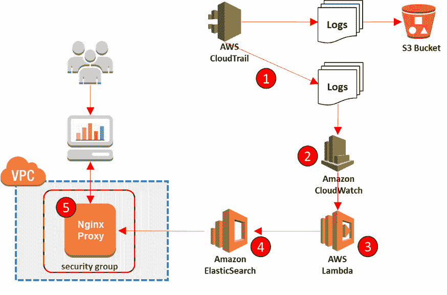

1.  要开始，请登录到 CloudFormation 仪表板，访问 [`console.aws.amazon.com/cloudformation`](https://console.aws.amazon.com/cloudformation)。

1.  接下来，选择“创建堆栈”选项，进入 CloudFormation 模板选择页面。在“指定 Amazon S3 模板 URL”字段中粘贴 [`s3.amazonaws.com/concurrencylabs-cfn-templates/cloudtrail-es-cluster/cloudtrail-es-cluster.json`](http://s3.amazonaws.com/concurrencylabs-cfn-templates/cloudtrail-es-cluster/cloudtrail-es-cluster.json)，然后点击“下一步”继续。

1.  在指定详细信息页面，提供一个合适的堆栈名称，并填写以下必填参数：

    +   AllowedIPForEsCluster: 提供将能够访问 nginx 代理的 IP 地址，从而能够访问您的 Elasticsearch 集群。在我的案例中，我提供了我的笔记本电脑的 IP。请注意，您可以在稍后阶段更改此 IP，方法是访问通过 CloudFormation 模板创建的 nginx 代理的安全组。

    +   CloudTrailName: 我们在本章开始时设置的 CloudTrail 的名称。

    +   KeyName: 您可以选择一个密钥对，用于获取 SSH 访问权限到您的 nginx 代理实例：

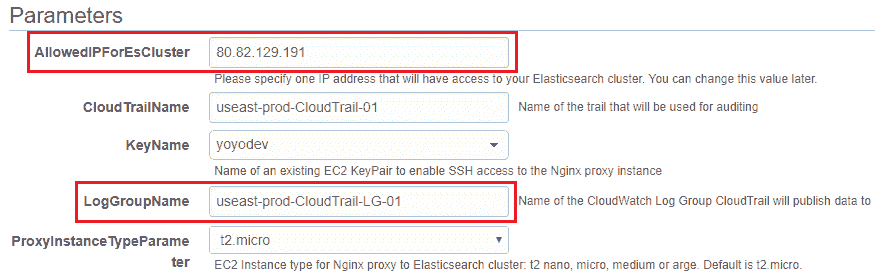

+   +   LogGroupName: 将作为输入到我们 Elasticsearch 集群的 CloudWatch 日志组名称。

    +   ProxyInstanceTypeParameter: 您的代理实例的 EC2 实例类型。由于这是演示，我选择了 t2.micro 实例类型。您也可以选择其他实例类型。

1.  完成后，点击“下一步”继续。检查堆栈设置并点击“创建”以完成过程。

堆栈部署需要几分钟时间，因为新的 Elasticsearch 域正在创建。您可以通过查看 CloudFormation 的输出选项卡或通过查看 Elasticsearch 仪表板来监控部署进度。请注意，在此部署中，选择了默认的 **t2.micro.elasticsearch** 实例类型来部署 Elasticsearch。在将堆栈部署到生产环境之前，您应该将此值更改为更大的实例类型。

您可以在[`docs.aws.amazon.com/elasticsearch-service/latest/developerguide/aes-supported-instance-types.html`](http://docs.aws.amazon.com/elasticsearch-service/latest/developerguide/aes-supported-instance-types.html)查看有关 Elasticsearch *支持的实例类型*的信息。

堆栈成功部署后，复制来自 CloudFormation 输出标签的 Kibana URL：

```
"KibanaProxyEndpoint": "http://<NGINX_PROXY>/_plugin/kibana/"
```

Kibana UI 可能需要几分钟才能加载。一旦启动并运行，您将需要配置一些必要的参数，才能实际继续操作。选择设置并点击“索引”选项。在这里，填写以下详细信息：

+   索引包含基于时间的事件：启用此复选框以索引基于时间的事件

+   使用事件时间创建索引名称：也启用此复选框

+   索引模式间隔：从下拉列表中将索引模式间隔设置为每日

+   模式的索引名称：在此字段中输入`[cwl-]YYYY.MM.DD`

+   时间字段名称：从下拉列表中选择@timestamp 值

完成后，点击创建以完成该过程。这样，您现在应该可以开始看到日志填充到 Kibana 的仪表板上。随时查看并尝试 Kibana 提供的各种选项和过滤器：

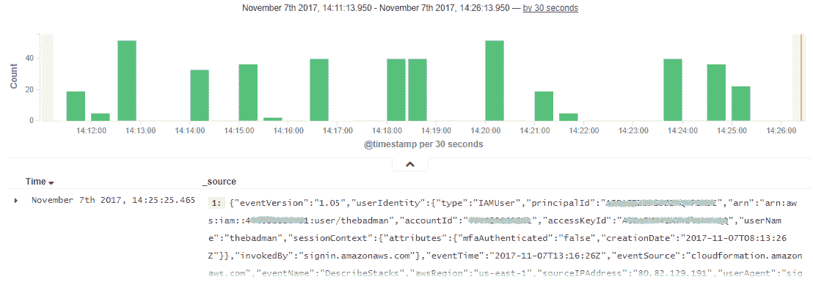

呼！这确实涉及了很多内容！但等等，还有更多！AWS 还提供了另一个非常有用的治理和配置管理服务，我们也需要了解它，因此，接下来就介绍 AWS Config！

# 介绍 AWS Config

AWS Config 是另一种托管服务，属于安全与治理服务类别，它提供每个 AWS 资源配置设置的详细视图。这里的配置设置可以是任何内容，从对 EC2 实例或 VPC 子网的简单设置，到一个资源如何与另一个资源相关联，如 EC2 实例与 EBS 卷、ENI 等的关系。使用 AWS Config，您可以查看和比较过去对您的资源所做的配置更改，并在必要时采取相应的预防措施。

以下是您使用 AWS Config 可以实现的功能列表：

+   根据所需设置评估您的 AWS 资源配置

+   检索并查看一个或多个资源的历史配置

+   在创建、修改或删除特定资源时发送通知

+   获取您的资源的配置快照，您可以将其作为蓝图或模板进行后续使用

+   查看资源之间的关系和层次结构，例如属于特定网络子网的所有实例等

使用 AWS Config 可以通过设置治理策略和标准化资源配置，更有效地管理资源。每当配置变化违反规则时，您可以触发通知，甚至对变更进行补救。此外，AWS Config 还提供与 AWS CloudTrail 等工具的现成功能集成，为您的 AWS 环境提供完整的端到端审计和合规性监控解决方案。

在我们开始为自己的场景设置 AWS Config 之前，先快速浏览一些重要的概念和术语。

# 概念和术语

以下是一些你在使用 AWS Config 时需要牢记的关键概念和术语：

+   **配置规则**：配置规则是 AWS Config 操作的核心。这些规则本质上代表了特定 AWS 资源的期望配置设置。在服务监控资源的任何变化时，这些变化会映射到一个或多个配置规则，并根据规则标记资源是否存在不合规情况。AWS Config 提供了一些现成的规则，您可以直接使用，也可以根据需求进行自定义。或者，您还可以从头开始创建自定义规则。

+   **配置项**：配置项基本上是某个特定 AWS 资源配置的某一时刻的表示。该项可以包括关于资源的各种元数据，如其当前的配置属性、与其他 AWS 资源（如有）之间的关系、事件（如创建时间、上次更新时间等）。每当 AWS Config 检测到特定资源配置的变化时，都会自动创建配置项。

+   **配置历史**：某一资源在特定时间段内的配置项集合称为其**配置历史**。你可以使用此功能比较资源随着时间的推移可能发生的变化，从而决定采取必要的措施。配置历史存储在你指定的 Amazon S3 桶中。

+   **配置快照**：配置快照也是某个特定资源在一段时间内的配置项集合。此快照作为一个模板或基准，可以用来与资源当前的配置设置进行比较和验证。

牢记这些内容后，让我们看一些简单的步骤，让你在几分钟内开始设置自己的 AWS Config！

# 开始使用 AWS Config

开始使用 AWS Config 是一个非常简单的过程，通常只需要一两分钟的时间。总体而言，你需要首先指定希望 AWS Config 记录的资源，配置一个 Amazon SNS 主题以及一个 Amazon S3 桶用于通知和存储配置历史记录，最后添加一些 Config 规则来评估你的资源：

1.  首先，通过在 AWS 管理控制台中筛选该服务，或直接访问[`console.aws.amazon.com/config/`](https://console.aws.amazon.com/config/)来访问 AWS Config 仪表盘。

1.  由于这是我们第一次进行配置，选择“开始使用”选项以开始 Config 的创建过程。

1.  在“要记录的资源类型”部分，选择你希望 Config 监控的 AWS 资源类型。默认情况下，Config 将记录所有支持的 AWS 资源的活动。你可以选择仅指定你希望监控的服务，通过在“特定类型”字段中输入，如下图所示。在这种情况下，我选择了默认值：记录此区域支持的所有资源并包含全球资源：

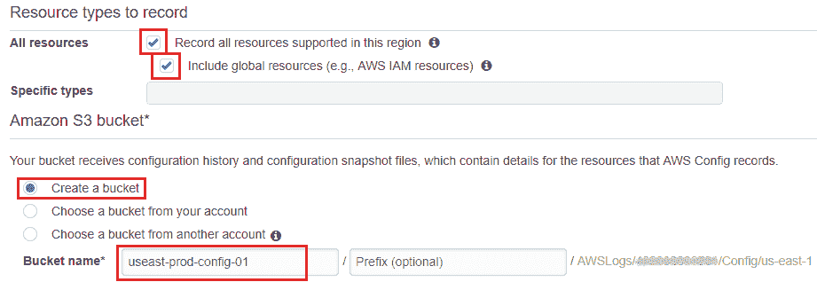

1.  接下来，选择一个位置来存储你的配置历史记录以及配置快照。在这种情况下，我选择为 AWS Config 创建一个新的 S3 桶，并提供一个唯一的桶名称。

1.  接下来，在 Amazon SNS 主题部分，你可以选择创建一个新的 SNS 主题，该主题将向你指定的邮箱发送电子邮件通知，或者选择你账户中已有的主题。

1.  最后，你需要为 Config 提供一个只读访问角色，以便它能够记录特定的配置信息并将其发送到 S3 和 SNS。根据你的需求，你可以选择创建一个角色，或者选择一个已有的角色。点击保存以完成 AWS Config 的基本配置。

完成此步骤后，我们现在可以继续在设置中添加 Config 规则。为此，从 AWS Config 仪表盘的导航窗格中，选择规则并点击“添加规则”选项。

1.  在 AWS Config 规则页面，你可以使用提供的*筛选器*来筛选和查看预定义的规则。对于这个特定的场景，我们可以添加两个规则来检查账户中的 S3 桶是否存在禁止公共读取或禁止公共写入的情况。为此，只需在筛选器中输入 `S3-bucket`，然后选择其中一个规则，如下图所示：

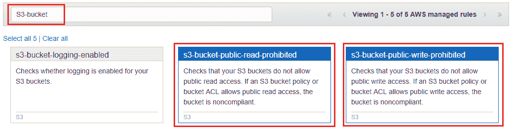

+   +   **资源**：当任何符合评估标准的资源被创建、修改或删除时

    +   **标签**：当具有指定标签的任何资源被创建、修改或删除时

    +   **所有更改**：当任何由 AWS Config 记录的资源被创建、修改或删除时

1.  选择特定规则将弹出该规则的配置页面，您可以在该页面中定义规则的触发器以及其范围。让我们首先选择 s3-bucket-public-read-prohibited 规则并进行操作。

1.  在“配置规则”页面中，为您的新规则提供合适的名称和描述。现在，由于这是一个托管规则，您将无法更改触发器类型；然而，当您创建自己的自定义规则时，您可以指定是否希望基于配置更改事件触发规则，或者使用周期性检查方法，利用您指定的时间频率来评估规则。

1.  接下来，您还可以选择希望规则评估发生的时间，方法是选择“变更范围”部分下提供的适当选项。在这种情况下，我选择了“资源”范围，并选择了 S3: 桶作为资源，如以下屏幕截图所示：

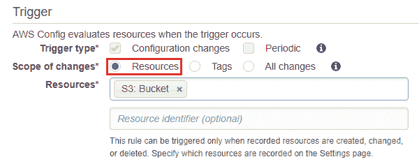

1.  可选地，您还可以通过“资源标识符”字段提供您希望配置监控的资源的 ARN。完成后，点击“保存”。

同样，使用上述步骤，创建另一个名为 s3-bucket-public-write-prohibited 的托管配置规则。

在设置好规则后，从配置的导航窗格中选择“资源”选项，查看当前已根据设定合规性评估的资源集。

在我的例子中，我的 AWS 环境中有两个 S3 桶：一个启用了公共读取权限，另一个没有。以下是您应看到的“已评估资源”仪表板：

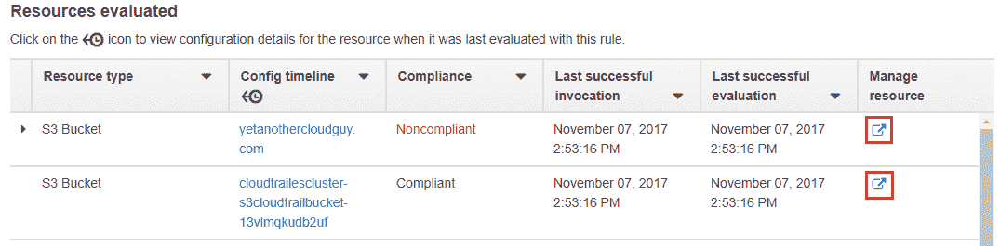

在这里，您可以通过简单地选择具有相同名称的列中的资源名称，查看基于配置时间线评估的资源。这将显示您特定资源的配置状态的时间序列。您可以在不同的时间序列选项之间进行选择，查看状态变化，并使用日历图标在不同时间段之间切换。使用 config 这个功能的最佳部分是，您可以通过选择“管理资源”选项，同时更改资源的配置。这样做将自动打开 S3 桶的配置页面，如本例所示。您也可以从 AWS Config 导航窗格中选择“仪表板”选项，并获取您整体合规状态的可视化摘要，如以下屏幕截图所示：

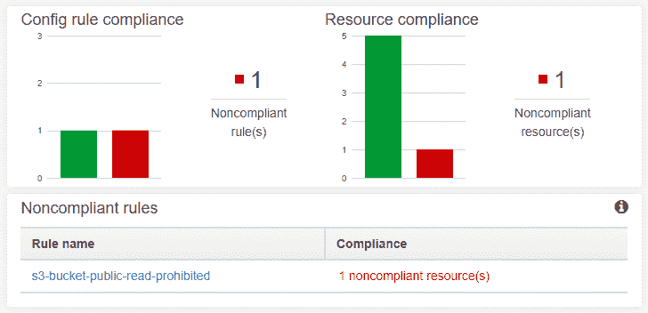

您可以使用相同的概念为其他各种 AWS 服务创建更多这样的托管配置规则，包括 EC2、EBS、Auto Scaling、DynamoDB、RDS、Redshift、CloudWatch、IAM 等等！有关托管规则的完整列表，请查看[`docs.aws.amazon.com/config/latest/developerguide/managed-rules-by-aws-config.html`](http://docs.aws.amazon.com/config/latest/developerguide/managed-rules-by-aws-config.html)。

完成托管配置规则后，最后需要做的是创建一个自定义配置规则，这正是我们将在下一节中介绍的内容。

# 创建自定义配置规则

创建自定义配置规则的过程与之前的过程大致相同，只是在某些地方有所变化。在本节中，我们将探讨如何创建一个简单的合规规则，该规则将在用户启动除**t2.micro**实例类型以外的 EC2 实例时触发配置合规性警报：

1.  首先，从 AWS Config 导航窗格中选择“规则”选项，然后选择“添加自定义规则”按钮，进入“添加规则”页面。自定义规则的创建过程与其他规则相似，首先需要为规则提供适当的名称和描述。现在，实际的变化就在这里。自定义配置规则依赖于 AWS Lambda 来监控并触发合规检查。实际上，这正是完美的，因为 Lambda 函数是事件驱动的，非常适合托管我们自定义规则的业务逻辑。

1.  选择“创建 AWS Lambda 函数”以开始操作。在这里，我将使用一个预定义的 Lambda 蓝图，该蓝图实际上是为了与 AWS Config 配合工作而创建的。或者，您可以从头开始创建配置规则的业务逻辑，并将其部署到一个新的函数中。目前，请在蓝图过滤器中输入以下文本，如下截图所示（config-rule-change-triggered）：

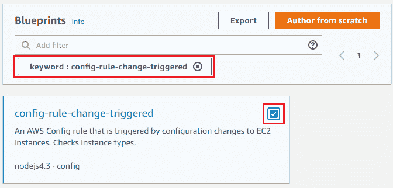

1.  确保选择了蓝图，然后点击“下一步”继续。

1.  在函数的基本信息页面，为您的函数提供名称，然后从角色下拉列表中选择“从模板创建新角色”选项。该角色将为 Lambda 函数提供必要的权限，以便从 EC2 读取数据并将输出写回到 AWS Config，以及 Amazon CloudWatch。

1.  输入合适的角色名称，然后选择“创建函数”选项以完成过程。函数部署完成后，记下其 ARN，因为我们将在下一步中用到它。

1.  返回 AWS Config 的“添加自定义规则”页面，并将新创建的函数的 ARN 粘贴到 AWS Lambda 函数 ARN 文件中，如下图所示：

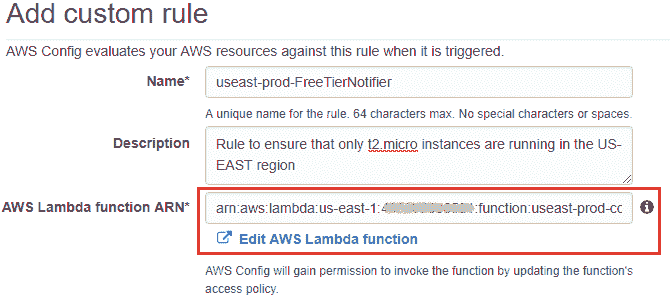

1.  将函数的 ARN 粘贴后，自定义规则的其余配置保持不变。与托管规则不同，您可以根据需要选择触发类型，选择“配置更改”或“定期”触发。在本例中，我选择了“配置更改”作为我的触发机制，并选择 EC2：实例 作为资源类型。

1.  最后但同样重要的是，我们还需要指定规则参数，这基本上是一个键值对，用于定义资源验证时所依据的属性。在本例中，desiredInstanceType 是键，`t2.micro` 是值。点击“保存”完成设置过程：

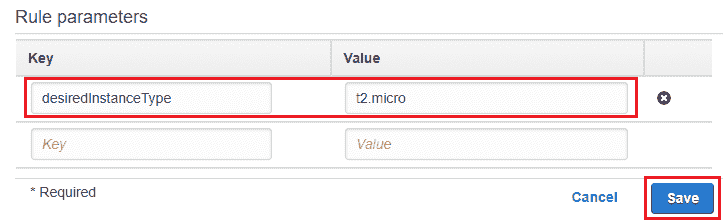

1.  配置好规则后，接下来要做的就是进行一次小测试！继续启动一个与 t2.micro 不同的新 EC2 实例。记住，实例必须在与您的 Lambda 函数相同的区域启动！当实例启动后，变更会立即在 AWS Config 的仪表盘中反映出来：

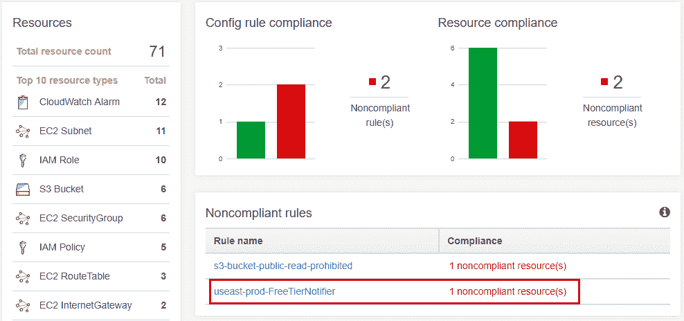

这样，我们就接近本节和本章的结束了！但是，在我们结束之前，以下是一些有趣的最佳实践和后续步骤，您在使用 AWS CloudTrail 和 AWS Config 时应牢记！

# 提示和最佳实践

以下是您在使用 AWS CloudTrail、AWS Config 和一般安全性时应牢记的一些重要提示和最佳实践：

+   **定期分析和审计安全配置**：虽然 AWS 提供了多种服务来保护您的云环境，但确保安全规则得到执行并定期验证是否存在潜在的配置错误，是组织的责任。

+   **为所有用户提供完整的审计轨迹**：确保跟踪每个用户（包括 root 用户、IAM 用户和联合用户）的所有资源创建、修改和终止操作。

+   **全局启用 CloudTrail**：通过在全局范围内启用日志记录，CloudTrail 可以捕获所有 AWS 服务的日志，包括全球性的服务，如 IAM、CloudFront 等。

+   **启用 CloudTrail 日志文件验证**：这是一个可选设置，但始终建议启用 CloudTrail 日志文件验证，以增加数据的完整性和安全性。

+   **为 CloudTrail 和配置存储桶启用访问日志**：由于 CloudTrail 和配置使用 S3 存储桶来存储捕获的日志，因此始终建议启用访问跟踪，以记录不当和未经授权的访问。或者，您也可以将日志和存储桶的访问限制给专门的用户组。

+   **加密静态日志文件**：对静态日志文件进行加密为日志数据提供了额外的保护层，防止未经授权查看或编辑日志数据。

# 总结

这一章确实非常有趣！在我们进入下一章之前，让我们快速回顾一下迄今为止学到的内容！

我们在本章开始时简要概述了 AWS CloudTrail，并提供了一个关于如何开始使用自己 CloudTrail Trail 的小型逐步指南。我们还学习了 AWS CloudTrail 日志及其与 Amazon CloudWatch Logs 的集成功能，以便提供更好的警报和通知功能。我们还利用了几个 CloudFormation 模板来部署预配置的 CloudWatch 警报，以便监控我们的 Trail，并设置了一个完整的 Amazon Elasticsearch 域来查看和筛选 CloudTrail 日志。最后，我们还介绍了 AWS Config 作为一个配置管理和合规性服务，通过部署托管的以及自定义的配置规则。

在下一章，我们将继续并结束我们的安全之旅，介绍两个非常棒的服务：AWS IAM 和 AWS Organizations，敬请期待！
