# 使用 AWS IAM 和 AWS Organizations 进行访问控制

在上一章中，我们学习并探索了如何利用两个 AWS 服务——AWS Config 和 AWS CloudTrail 来管理你的云环境。在本章中，我们将继续安全之旅，重新审视 AWS IAM 并介绍一些实用功能，同时还会学习另一个服务——AWS Organizations！

牢记这一点，让我们快速看一下本章将要涵盖的各个主题：

+   AWS IAM 的新功能

+   使用 IAM 可视化编辑器创建策略

+   使用 IAM 策略模拟器测试你的 IAM 策略

+   介绍 AWS Organizations 及其一些基本概念和术语

+   使用 AWS 管理控制台和 AWS CLI 创建你自己的组织

# AWS IAM 的新功能

在我们查看 IAM 最近的增强功能之前，这里为没有接触过的朋友提供一个 IAM 的简短速成课程。AWS 身份与访问管理（IAM）是一个提供安全访问控制机制的 Web 服务，适用于所有 AWS 服务。你可以使用 IAM 创建用户和组，分配用户特定的权限和策略等等。最棒的是，IAM 完全免费！没错！使用它不需要支付一分钱。

让我们快速浏览一些 AWS IAM 提供的有趣功能：

+   **多因素身份验证**：IAM 允许你为用户提供双因素身份验证以增强安全性。这意味着，除了密码外，你还需要提供来自特殊硬件设备（如硬件令牌）或软件应用程序（如 Google Authenticator）的密钥/密码。

+   **与其他 AWS 产品的集成**：IAM 与几乎所有 AWS 产品和服务集成，并且可以根据需要为每个服务提供细粒度的访问权限和权限。

+   **身份联合**：你是否已经有一个本地 Active Directory，其中包含已创建的用户和组？没问题，IAM 可以与本地 AD 集成，通过一些简单步骤提供访问你的 AWS 账户的权限。

+   **访问机制**：IAM 可以通过多种工具访问，最常用且最频繁使用的是 AWS 管理控制台。除此之外，IAM 还可以通过 AWS CLI 访问，通过支持不同平台和编程语言的 SDK（如 Java、.NET、Python、Ruby 等）访问，甚至可以通过一个安全的 HTTPS API 进行编程访问。

牢记这些基础知识后，让我们来看看近年来对 IAM 进行的一些有趣和有用的增强功能。

# 使用可视化编辑器创建 IAM 策略

IAM 策略用于定义 IAM 实体（如用户、组和角色）的权限。你创建的每个策略由一个或多个语句组成，这些语句包含以下元素：

+   **效果**：此元素决定策略语句是否允许或明确拒绝对特定 IAM 资源的访问。

+   **操作**：操作用于在策略中定义 AWS 服务操作，例如，您可以指定与 Amazon S3 相关的操作，如列出存储桶、读取或写入存储桶等。

+   **资源**：资源是指 AWS 服务或单个实体，操作将在其上应用。

+   **条件**：条件用于定义在某个资源上何时允许或拒绝特定权限。您可以利用一个或多个条件来为 AWS 资源提供更细粒度的安全性。

创建策略后，您需要将其附加到资源上，资源可以是 IAM 用户、组或角色。然而，创建自定义且细粒度的 IAM 策略有时会带来挑战，尤其是当您刚开始使用 AWS 时。为了解决这个问题，AWS 提供了一个新的改进版可视化编辑器，您可以轻松地使用它创建自定义策略：

1.  要开始使用可视化编辑器，首先登录到 IAM 管理控制台，选择此 URL [`console.aws.amazon.com/iam/home`](https://console.aws.amazon.com/iam/home)。

1.  登录后，从导航窗格中选择“策略”选项。这将显示一个页面，列出 AWS 托管策略和客户托管策略。要创建策略，只需选择“创建策略”选项。在这个场景中，我们将创建一个简单的 S3 策略，仅授予对 S3 存储桶内单个文件夹的完全访问权限。

1.  在“创建策略”页面上，确保选择了“可视化编辑器”标签，然后点击“选择服务”选项以筛选并选择 Amazon S3。

1.  选择服务后，接下来点击“选择操作”选项，添加适合我们策略的操作。在这里，您可以通过选择手动添加操作或通过选择每个访问级别中的正确访问权限，选择资源的适当访问级别。在此示例中，我选择了权限的整个列表级别，并从读取访问级别中选择了`s3:GetObject`，随后又从写入访问级别中选择了`s3:PutObject`和`s3:DeleteObject`权限。以下是您参考的操作截图：

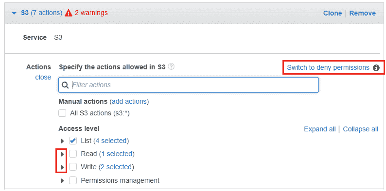

默认情况下，这里选定的所有操作都将被允许。如果要明确拒绝某些操作，请选择“切换到拒绝权限”选项，该选项位于“操作”部分。

1.  完成后，您可以选择“资源”部分，将所有或特定的资源添加到新的权限集。在此情况下，我们将权限集添加到一个名为**useast-prod-stuff-01**的特定存储桶中。为此，请选择与存储桶字段相邻的“添加 ARN”选项。

1.  在“添加 ARN(s)”对话框中，在“存储桶名称”字段中输入所选存储桶的名称，如以下截图所示。完成后，选择“添加”以完成此过程：

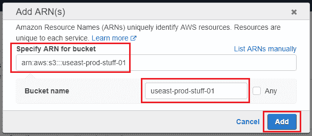

1.  完成后，你还可以选择为对象级别添加权限。点击对象字段旁边的“添加 ARN”选项，填写所需信息，就像我们在前面步骤中操作的那样。唯一的附加项是，你可以在对象名称字段中提供额外的*文件夹名称*，以便更精细地控制权限。完成后，点击“添加”以完成此过程。以下是我们策略完成的资源分配截图：

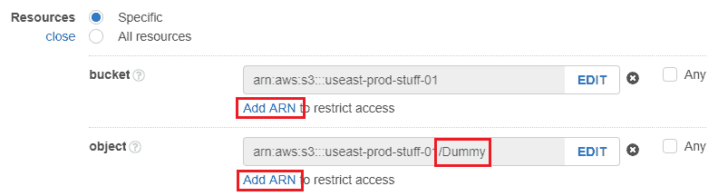

1.  在设置了权限和资源之后，你还可以选择向策略中添加条件。为此，选择“指定请求条件”选项。在这里，你可以选择并编辑符合需求的条件。例如，对于此策略，我们希望用户仅能从组织的内部网络访问特定的 S3 存储桶。为此，选择“源 IP”选项，并根据组织的 IP 范围输入合适的 IP 范围或单个 IP 地址。

1.  你还可以通过选择“添加请求条件”选项向策略中添加额外的条件。在这里，你可以使用条件键、限定符和操作符的组合，定制和指定更精细的条件，以下截图展示了这一过程：

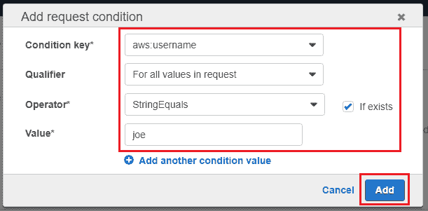

在这里，条件将检查并允许只有用户名为 joe 的特定 AWS IAM 用户访问 S3 存储桶。你可以使用相同的方法创建自己的自定义条件，完成后点击“添加”以完成此过程。

1.  在设置了权限、资源和条件后，选择“审查策略”选项以完成策略创建过程。在选择“创建策略”选项之前，为你的策略提供一个合适的名称和可选的描述。

就是这样！简单吧，是吧！你可以使用相同的流程，轻松创建高度自定义和精细化的策略。然而，仍然有一个问题没有解答：我们如何在不发出实际请求的情况下测试和排查策略？这正是 IAM 策略模拟器的作用所在！

# 使用 IAM 策略模拟器测试 IAM 策略

创建好新策略后，接下来的步骤是将其附加到 IAM 用户或组，并进行测试。但你如何在不发出任何实际调用或请求的情况下有效地测试新策略呢？这正是新的 IAM 策略模拟器派上用场的地方！

IAM 策略模拟器用于评估 IAM 策略，以确定你可以指定的最有效的权限和操作集，而无需实际调用任何资源。策略模拟器内部利用与处理真实请求到 AWS 资源的策略评估引擎相同的引擎；然而，它本身并不进行任何实际的服务请求。因此，策略模拟器无法报告从生成的请求中得到的任何响应。你所得到的结果只是该策略是否允许或拒绝某个特定操作。以下是你可以利用 IAM 策略模拟器的一些方法：

+   你可以使用 IAM 策略模拟器来测试附加到现有用户、组和角色上的策略。

+   你也可以通过简单地复制并执行策略到模拟器，来测试那些尚未附加到你的资源上的策略。

+   模拟器还可以用于测试附加到各种 AWS 资源上的策略，比如 Amazon S3 桶、Amazon EC2 实例等。

+   你甚至可以通过传递各种上下文键（例如*IP 地址*或*用户名*），这些键与策略的条件一起传递，从而使用模拟器测试真实世界的场景，等等！

要开始使用 IAM 策略模拟器，只需选择这个网址[`policysim.aws.amazon.com/`](https://policysim.aws.amazon.com/)。策略模拟器是一个独立的实体，运行在你的标准 AWS 控制台之外。如果需要，请使用你的标准 AWS IAM 凭证登录到策略模拟器：

1.  登录后，你可以使用模拟器测试和验证现有的用户、组甚至基于角色的策略。首先，让我们测试一下我们在本章前面部分创建的策略！为此，在“用户、组和角色”部分，从下拉列表中选择“用户”。你应该能看到你的 AWS 账户中存在的用户列表。

1.  选择用于附加策略的适当用户。在我的例子中，用户名是`joe`。选择后，你将看到该用户当前关联的所有策略，在本例中，我们应该能看到我们在前面部分创建的自定义 S3 访问策略，如下图所示：

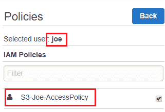

1.  选择策略以查看其详细信息。你甚至可以选择修改并在这里使用内置的*策略编辑器*来测试该策略，但请注意，在这里对策略所做的更改不会反映到实际的策略中。

1.  选择策略后，我们现在准备使用 IAM 策略模拟器部分来测试它。下面是我们将要测试的策略片段：

```
        { 
            "Sid": "VisualEditor0", 
            "Effect": "Allow", 
            "Action": [ 
                "s3:PutObject", 
                "s3:GetObject", 
                "s3:ListBucket", 
                "s3:DeleteObject" 
            ], 
            "Resource": [ 
                "arn:aws:s3:::useast-prod-stuff-01", 
                "arn:aws:s3:::useast-prod-stuff-01/Dummy" 
            ], 
            "Condition": { 
                "IpAddress": { 
                    "aws:SourceIp": "10.0.0.0/24" 
                }, 
                "ForAllValues:StringEqualsIfExists": { 
                    "aws:username": "joe" 
                } 
            } 
        } 
          . . . . . .  

            "Resource": "*", 
            "Condition": { 
                "IpAddress": { 
                    "aws:SourceIp": "10.0.0.0/24" 
                }, 
                "ForAllValues:StringEqualsIfExists": { 
                    "aws:username": "joe" 
                } 
            } 
        } 
```

根据我们的策略，只有用户`joe`拥有`s3:PutObject`、`s3:GetObject`、`s3:ListBucket`、`s3:DeleteObject`等权限，且只有当 Joe 从他所在组织的内部网络（`10.0.0.0/24`）访问`useast-prod-stuff-01`桶时才有效。

1.  要进行测试，请从“选择服务”下拉列表中选择 Amazon S3 选项。接下来，使用“选择操作”下拉列表匹配任一操作。在这种情况下，我只选择了`s3:PutObject`操作。

1.  完成后，在“全局设置”部分，输入与策略中出现的*条件键*相邻的值。在这种情况下，输入用户名和源 IP，如下图所示：

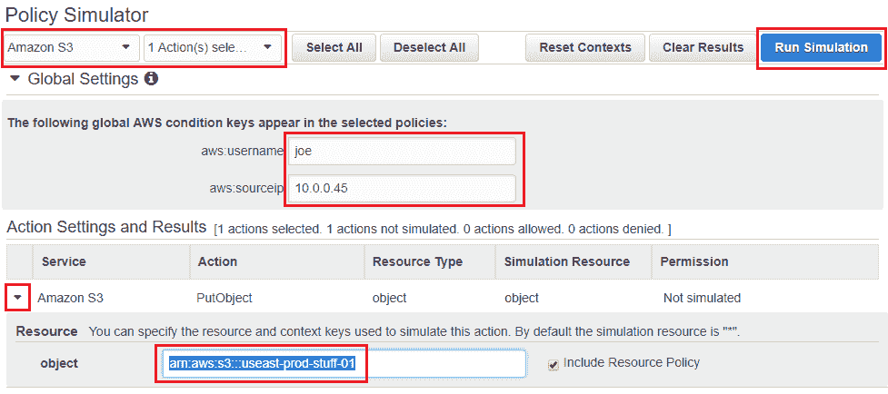

1.  接下来，在“操作设置和结果”部分，展开资源，并输入需要测试的策略对应的资源 ARN。在这种情况下，必须是 S3 桶的 ARN `arn:aws:s3:::useast-prod-stuff-01`。完成后，选择“运行模拟”选项。

在模拟运行过程中，您应该会根据在模拟过程中提供的值看到*允许*或*拒绝*的结果。您可以随意更改*操作*和*条件键*，并重新运行模拟。每次尝试后，您可以微调并排查策略问题，而无需真正向资源发出任何实际请求。

您还可以使用相同的策略模拟器来测试尚未附加到资源的新的策略。为此，您首先需要通过模拟器顶部提供的模式选项，将当前的（默认）现有策略模式切换为新策略模式。

一旦选择了“新策略”选项，您可以使用策略沙箱来创建新策略，并像之前一样测试它们。不过请记住，在此创建或编辑的策略不会反映到 AWS IAM 中。

至此，我们接近本节的结束。在下一节中，我们将介绍如何利用 AWS Organizations 轻松有效地管理多个 AWS 账户。

# 介绍 AWS Organizations

到目前为止，我们一直使用单一的 AWS 账户进行开发、测试和生产，但许多组织并非如此，他们会为了多个用途（如多个环境、合规问题等）拥有多个 AWS 账户。每个账户都有自己独特的管理方式，并没有集中式的所有权或控制。

AWS Organizations 是一个简单的服务，允许您集中管理多个 AWS 账户。它使您能够将 AWS 账户分组为一个或多个集体*组织*，您可以像管理一个整体一样进行创建和管理。

下面是一些 AWS Organizations 的关键概念和术语的简要介绍：

+   **组织**：组织是您所有 AWS 账户的集中视图，统一管理。通过组织，您可以在一个地方集中查看和管理所有 AWS 账户。组织提供了一项附加功能，您可以通过它来决定希望创建的组织类型。有两个此类功能集，即：

+   **合并计费**：AWS Organizations 提供的一个关键功能是能够查看并将每个 AWS 账户的计费合并到一个组织下。当您首次创建组织时，默认会选择此功能，并仅为您提供合并计费视图。要利用所有 AWS Organizations 的高级功能，您需要选择“全部功能”选项。

+   **全部功能**：此功能集提供了 AWS Organizations 的完整功能，包括合并计费以及许多其他功能，使您能够更好地控制您的各个账户。使用此功能集，您可以限制某些 AWS 服务的账户访问；修改访问角色等更多操作。

+   **根**：根是您在 AWS 中使用的所有单个账户的主要容器。当您首次创建组织时，AWS Organizations 会自动为您创建一个默认的根元素。任何在根级别应用的更改或策略都会传播到其后续的子元素。

+   **组织单位**（**OU**）：OU 是一个包含一个或多个 AWS 账户的容器。您还可以从单个 OU 分支出多个 OU，但 OU 的终点始终是一个账户。以下是一个示意图，展示了组织、根元素、OU 和各种 AWS 账户之间的交互关系：

**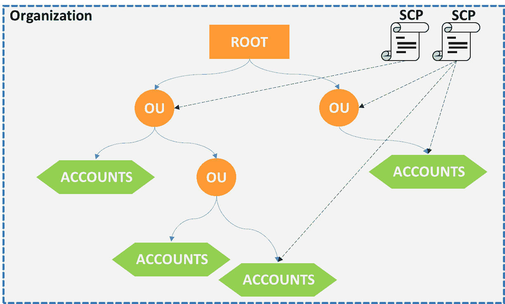**

+   **账户**：账户是包含您 AWS 资源的标准 AWS 账户。在创建组织时，AWS 将创建组织的账户标记为 *主账户*。稍后添加到此组织的任何其他账户都称为 *成员账户*。主账户还负责监督合并计费和为其他成员账户进行支付，并且可以用于邀请其他 AWS 账户加入组织、创建 OU、管理策略等。

+   **服务控制策略**（**SCP**）：SCP 本质上是附加到根、账户或组织单位（OU）上的策略，用于指定特定账户或 OU 的用户可以使用的服务和操作。例如，您可以在一个针对 HIPAA 合规性创建的账户上使用 SCP，并希望限制该账户的所有用户仅使用符合 HIPAA 合规的 AWS 服务，等等。

要了解更多关于 HIPAA 合规性以及它如何与 AWS 一起工作，请访问此 URL 了解更多信息 [`aws.amazon.com/compliance/hipaa-compliance/`](https://aws.amazon.com/compliance/hipaa-compliance/)。

这里需要记住一个重要点：SCP 只有在您启用创建组织时的“全部功能”功能集时才会生效。

了解这些基本信息后，让我们看看如何通过几个简单的步骤开始使用 AWS Organizations。

# 开始使用 AWS Organizations

AWS Organizations 可以通过 AWS 管理控制台和 AWS CLI 进行设置。在本节中，我们将探索简单的步骤，您可以通过这些步骤在几分钟内开始使用自己的组织：

1.  从 AWS 管理控制台，使用“筛选”选项过滤出 AWS Organizations，或者直接访问此 URL [`console.aws.amazon.com/organizations/`](https://console.aws.amazon.com/organizations/)。

1.  由于这是我们第一次设置 AWS 组织，因此此帐户将被转变为主帐户。添加或创建到该主帐户的任何其他 AWS 帐户将被视为成员帐户。点击“创建组织”以开始操作。

1.  在创建组织时，您可以选择启用“启用所有功能”或“仅启用合并账单”选项，具体取决于您的需求。在此场景中，选择“启用所有功能”，然后在完成后点击“创建组织”。

1.  创建组织后，您应该可以在帐户页面上看到现有帐户，如下图所示。选择“添加帐户”选项，将新 AWS 帐户添加到我们的组织中：

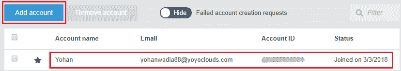

1.  如前所述，AWS Organizations 允许您将现有的 AWS 帐户添加到新组织中，并作为主帐户的一部分创建新帐户。在此场景中，我们将继续创建一个名为 **sandbox** 的新帐户。在“添加帐户”页面选择“创建帐户”选项。

1.  在“全名”和“电子邮件”字段中分别为您的新帐户提供合适的名称和电子邮件地址。您提供的电子邮件必须是全球唯一的，因此请提供一个之前未在 AWS 使用过的电子邮件地址。

1.  接下来，在 IAM 角色名称字段中，为您的帐户提供一个合适的角色名称。此角色将使您能够在作为主帐户中的 IAM 用户登录时访问新成员帐户。完成后，点击“创建”完成该过程。

这是 AWS 创建的 IAM 角色的片段。该角色授予对新帐户中所有 AWS 服务和资源的完全访问权限：

```
{ 
    "Version": "2012-10-17", 
    "Statement": [ 
        { 
            "Effect": "Allow", 
            "Action": "*", 
            "Resource": "*" 
        } 
    ] 
}
```

帐户创建过程需要几分钟时间。一旦完成，您应该会看到名为 Sandbox 的新帐户以及新的帐户 ID，也会出现在 AWS Organizations 的帐户页面中。选择 sandbox 帐户，查看其关联的 ARN 和 ID，显示在旁边的窗格中。

创建帐户后，下一步是创建一个或多个组织单元（OU），并将新创建的帐户移入该 OU。在此场景中，我们将继续创建一个名为 Sandbox 的 OU：

1.  从 AWS Organizations 仪表板中选择“组织帐户”选项卡，以查看组织的当前层级设置。在“组织单元”部分，选择“+ 新建组织单元”选项以开始操作。

1.  在“创建组织单元”对话框中，在“组织单元名称”字段中提供新 OU 的合适名称，如下图所示。完成后，点击“创建组织单元”：

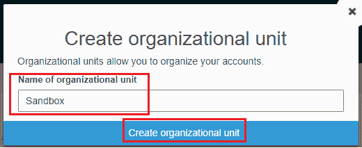

1.  创建完 OU 后，过程的最后一步是将账户移动到新创建的 OU 中。为此，从相同的“组织账户”页面，选择“沙盒”账户并点击“移动”。

1.  这将弹出一个简单的界面，您需要在其中选择要将沙盒账户移动到的新 OU。选择“沙盒”OU，点击“移动”以完成过程。

完成此步骤后，您应该会在新 OU 中看到一个新的账户。您可以使用相同的步骤根据需求创建多个 OU 和账户。您还可以通过为新账户创建并分配新的 SCP，进一步限制其访问服务：

1.  要创建新的 SCP，请在 AWS 组织仪表板上选择“策略”选项卡。您应该会看到一个默认的名为`FullAWSAccess`的策略。这个策略是 AWS 在您第一次创建 AWS 组织时自动创建的。沙盒环境目前也引用了相同的策略。

1.  要创建新的 SCP，请选择“创建策略”选项。AWS 组织在创建新 SCP 时提供两种选择。您可以选择利用策略生成器，从列表中选择特定服务和操作，构建自定义策略；或者选择复制现有的 SCP 并手动编辑。此处请选择“策略生成器”选项。

1.  接下来，提供一个策略名称和描述，然后选择策略在应用的 AWS 账户上应该具有的效果。

AWS Organizations 允许您根据需求对服务进行白名单（允许）或黑名单（拒绝）。将服务列入黑名单会导致策略中列出的所有服务默认被阻止，而将服务列入白名单则会阻止所有未在策略中列出的服务 API。接下来，我们将为沙盒 OU 创建一个简单的策略，允许使用 EC2、S3 和 RDS 服务，同时明确阻止 AWS CloudTrail。

1.  在“选择总体效果”部分，选择“允许”以首先创建服务的白名单。使用语句生成器选择正确的服务及其相应的操作。完成后，点击“添加语句”以添加更多服务和操作，如下图所示：

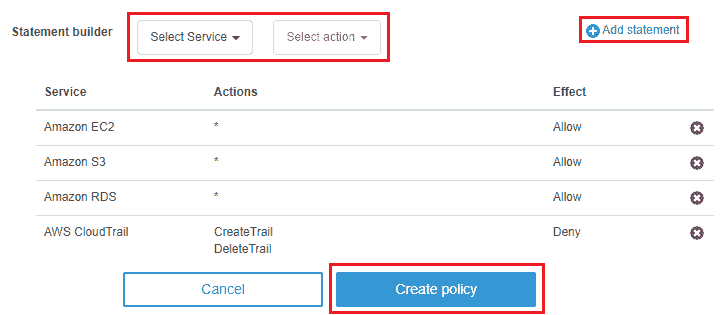

1.  添加完所需的语句后，直接选择“创建策略”选项以完成该过程。

1.  创建策略后，你可以将其附加到现有帐户、组织单位（OU）或甚至根目录，只需从策略页面选择策略，并根据需要选择根目录、帐户或组织单位选项。然而，在继续之前，你需要首先为根帐户启用 SCP 策略类型。为此，请从“组织帐户”选项卡中选择“根目录”选项。在相邻的详细信息窗格中，在“服务控制策略”部分旁边选择启用。

1.  完成此步骤后，你现在可以继续将新创建的策略附加到组织中的实体。记住，通过将策略附加到根域，你实际上也将策略传播到其成员中。这包括你可能已创建的子组织单位（OUs）和帐户。然而，对于此特定情况，请选择“帐户”选项，并点击列表中“沙盒”环境下方的“附加”选项。

就这样！这是一个简单的方法，通过它你可以轻松创建和管理你的 AWS 帐户。接下来，我们将展示如何通过 AWS CLI 实现相同的结果。

使用 CLI 创建和管理 AWS 帐户、OUs 和 SCPs 有其独特的优势。例如，你可以轻松自动化整个帐户创建过程，加快速度并简化新团队在组织中的入驻等：

1.  本练习的第一步是创建组织并设置为使用所有功能，正如我们在 AWS 管理控制台中所做的那样。为此，请输入如下命令：

```
# aws organizations create-organization --feature-set ALL
```

然而，对于已经将 AWS 帐户与组织关联的用户，这条命令可能会导致错误消息。

你也可以根据组织的需求，将 `CONSOLIDATED_BILLING` 值传递给 `--feature-set` 参数。

1.  组织就绪后，接下来我们将为我们的组织创建一个 AWS 帐户，但在此之前，我们需要执行一条命令来获取组织根目录的 ID。该 ID 将采用 `r-<XY00>` 的格式。请记下此 ID 以便后续步骤使用：

```
# aws organizations list-roots
```

1.  记下根目录 ID 后，输入以下命令来创建新帐户。在此情况下，我们将创建一个名为 `prod` 的新帐户。记得将 `<EMAIL_ID>` 字段替换为一个全球唯一的值：

```
# aws organizations create-account
--email <EMAIL_ID>
--account-name prod
```

下面是命令输出的快照。请记下新帐户的状态 ID，格式为 `car-<UNIQUE_ID>`，如以下截图所示：

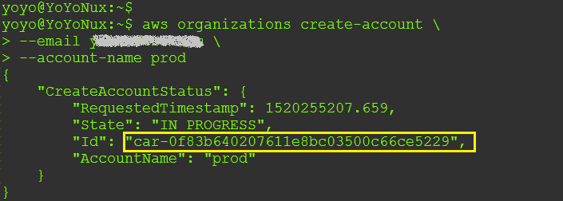

1.  你可以使用此状态 ID 来检查帐户创建是否成功，通过输入以下命令。将 `car-<UNIQUE_ID>` 替换为之前步骤中复制的值：

```
# aws organizations describe-create-account-status
--create-account-request-id car-<UNIQUE_ID>
```

你可以使用以下命令查看新创建的帐户 ID：

`**aws organizations list-accounts**`

1.  一旦新账户创建完成，我们就可以继续创建一个新的 OU，并将账户移动到新的 OU 中。在这种情况下，我们将新 OU 命名为`production`。用我们在之前步骤中记下的 root ID 替换`r-<XY00>`的值：

```
# aws organizations create-organizational-unit
--parent-id r-<XY00>
--name production
```

该命令的输出将返回两个重要的值，第一个是新 OU 的 ARN，第二个是 OU 的 ID，格式为`ou-<XY00>-<UNIQUE_ID>`。请记下这些值，以便后续步骤使用。

1.  现在账户和 OU 已经创建完成，我们只需要将账户移动到新 OU 中。为此，输入以下命令，并替换`account-id`、`parent-id`和`OU-id`的正确值：

```
# aws organizations move-account
--account-id <NEW_ACCOUNT_ID>
--source-parent-id r-<XY00>
--destination-parent-id ou-<XY00>-<UNIQUE_ID>
```

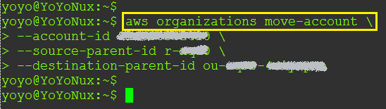

就这样！你刚刚创建了一个全新的 AWS 账户，并且通过几个简单的命令将其移动到了新的 OU！就是这么简单！不过，你还可以通过创建一个新的 SCP 并将其附加到我们新创建的 OU 上来进一步完善。假设我们创建的这个特定 OU 只允许某些 AWS 服务在生产环境中运行。为此，我们首先需要创建一个新的 SCP，代码块如下所示：

```
{ 
  "Version": "2012-10-17", 
  "Statement": [{ 
    "Effect": "Allow", 
    "Action": [ 
      "ec2:*", 
      "rds:*", 
      "dynamodb:*" 
    ], 
    "Resource": "*" 
  }] 
} 
```

在这种情况下，SCP 是将 EC2、RDS 和 DynamoDB 列入白名单，当然你可以根据自己的需求进行修改：

1.  将 SQP 粘贴到一个名为`policy.json`的新文件中并保存。接下来，输入以下命令来创建它：

```
# aws organizations create-policy
--content file://policy.json
--name AllowProductionServices
--type SERVICE_CONTROL_POLICY
--description "This policy allows only certain production services"
```

1.  创建策略后，你应该会收到一个格式为`p-<UNIQUE_ID>`的策略 ID。请记下该 ID。接下来，使用以下命令将新创建的策略附加到我们的 OU 上：

```
aws organizations attach-policy
--policy-id p-<UNIQUE_ID>
--target-id ou-<XY00>-<UNIQUE_ID>
```

就这样！你已经成功地将一个新策略附加到你的 OU 上。你可以使用相同的语法直接将策略附加到每个单独的账户上。

# 规划你的下一步行动

在使用 AWS Organizations 时，仍然有很多值得尝试的事情。以下是一些建议：

首先，作为最佳实践，你应该始终监控你的个人组织，并确保每个更改都能被跟踪和报告。你可以利用 AWS CloudTrail 和 AWS CloudWatch 事件来实现这一点。监控组织至关重要，因为它帮助你确保没有不必要的更改影响你的账户和环境的合规性。你可以在[`docs.aws.amazon.com/organizations/latest/userguide/orgs_monitoring.html`](https://docs.aws.amazon.com/organizations/latest/userguide/orgs_monitoring.html)阅读更多关于如何利用 AWS CloudTrail 和 AWS CloudWatch 事件来监控组织的内容。

接下来，我还建议你试试 AWS 提供的端到端账户创建过程：

[`aws.amazon.com/blogs/security/how-to-use-aws-organizations-to-automate-end-to-end-account-creation/`](https://aws.amazon.com/blogs/security/how-to-use-aws-organizations-to-automate-end-to-end-account-creation/)

自动化账户创建的整体过程与我们之前执行的 CLI 命令非常相似。脚本接受一些需要先定义的变量，并可以自定义角色名称。完成这些设置后，你只需执行 shell 脚本，它会调用 CloudFormation 模板来创建和配置新的成员账户。

# 总结

到这里，我们接近本章的结尾，但在进入下一章之前，让我们快速总结一下到目前为止学到的内容！

我们首先简要回顾了 AWS IAM 及其核心构建块，接着学习了最近对 IAM 做出的两项非常有用的增强功能。第一项是一个可视化编辑器，使用它你可以相对轻松地创建定制化和细粒度的 IAM 策略，接着是 IAM 策略模拟器工具，它帮助你创建和测试策略，而不影响云端任何正在运行的工作负载。之后，我们还了解了 AWS 组织及其如何帮助你在一个平台下创建和管理多个 AWS 账户。我们还看到了如何通过 AWS 组织仪表板以及 CLI，轻松地创建和管理根账户、组织和其他账户。

在下一章中，我们将学习和探索如何利用 AWS Code 套件服务，轻松地构建一个完整的端到端 CICD 流水线。
