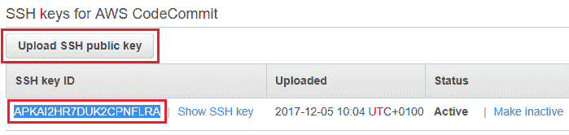

# 第七章：利用 AWS Code Suite 改变应用程序开发

在上一章中，我们探讨了 AWS **身份和访问管理服务**（**IAM**）所做的一些有趣且非常有用的增强功能，以及对 AWS 组织的快速深入了解。

在本章中，我们将学习和探索由 AWS 提供的三项极其有用和强大的服务，专门为增强开发人员在持续代码部署方面的体验而设计：AWS CodeCommit、AWS CodeDeploy 和 AWS CodePipeline！

牢记这一点，让我们快速浏览一下本章将涵盖的各种主题：

+   介绍 AWS CodeCommit、AWS CodeDeploy 和 AWS CodePipeline 以及每个服务的概念和内部工作原理

+   创建您的第一个 CodeCommit 存储库并将应用程序上传到其中

+   运行基本的 Git 命令来操作您的新代码存储库

+   在 EC2 实例上配置 CodeDeploy 代理

+   利用 AppSpec 文件配置应用程序生命周期部署

+   使用 CodePipeline 创建您自己的持续交付系统

所以，不再拖延，让我们立即开始吧！

# 了解 AWS Code Suite

除了提供大量基础设施相关的服务外，AWS 还提供了一些旨在帮助开发人员快速设计、开发、构建和部署他们的应用程序在 AWS 云平台上的服务。在本节中，我们将快速浏览这些服务以及如何将它们结合起来利用，构建您自己的持续集成和交付流水线：

+   **AWS CodeCommit**：任何 CI/CD 流水线的重要起点是一个简单但功能强大的源代码控制存储库。传统上，这将在一个或多个物理服务器上设置为 Git 或 SVN 存储库的形式，开发人员将使用它们来推送他们的代码和更新；然而，维护这样的代码存储库并扩展它们总是具有挑战性的。这就是 AWS CodeCommit 发挥作用的地方！AWS CodeCommit 是一项托管的源代码控制服务，使开发人员能够安全地将他们的代码存储在 AWS 云上。它提供了许多您在使用不同源代码控制存储库时需要和使用的功能，如分支、提交、回滚等。

+   **AWS CodeBuild**：AWS CodeBuild 是开发人员可以利用的代码构建服务，用于自动化他们的源代码编译、测试、执行和代码打包以进行部署。与 Code Suite 中的其他对应服务类似，CodeBuild 也完全由 AWS 管理，从而消除了任何不必要的管理开销，如修补或扩展代码构建软件。CodeBuild 具有高度可扩展性，也很容易与您现有的 CI/CD 工作流程集成。

+   **AWS CodeDeploy**：当你的应用代码安全地存储并编译完成后，最后一步是将代码部署到你的 EC2 实例群集中。这可以通过我们下一个 Code 套件服务，即 AWS CodeDeploy 来轻松实现。使用 CodeDeploy，开发人员可以自动将代码部署到运行 EC2 实例或本地数据中心服务器的任何环境。CodeDeploy 本质上通过让你自动化代码交付至数千个实例，消除了部署复杂性，无需经历任何长时间的停机。

+   **AWS CodePipeline**：AWS CodePipeline 是 AWS 提供的一个完整的 CI/CD 服务，开发人员可以利用它构建端到端的 CI/CD 流水线，既可以使用 AWS Code 套件服务，也可以使用其他流行的第三方工具，如 GitHub、Jenkins 等。使用 CodePipeline，你还可以创建和定义自定义的软件发布模型，通过这些模型，你的应用程序会更新最新的一系列更新，进行测试，并为下一个迭代的部署进行打包。

以下是这些服务如何协同工作以创建一个完整的 CI/CD 流水线的简要表示：


然而，出于本章的目的，我们将只使用三个 AWS Code 套件服务，即 AWS **CodeCommit**、AWS **CodeDeploy** 和 AWS **CodePipeline**。本章将展示如何将这三种服务结合起来，构建适用于我们示例 WordPress 应用的 CI/CD 流水线。以下是我们整体用例的高层次示意图：


在对 Code 套件服务有了基本了解后，让我们深入了解 AWS CodeCommit，看看如何将它作为你自己的源代码仓库来使用！

# 开始使用 AWS CodeCommit

如前所述，AWS CodeCommit 是一个安全且高度可扩展的源代码控制服务，允许你创建多个私有 Git 仓库，而无需担心底层的管理工作。你可以用它来存储任何东西，从代码到应用程序二进制文件，再到代码包，所有这些都使用标准的 Git 类似功能。这使得即使你之前没有使用过 CodeCommit，它也极其易于使用。以下是一些最常用的 Git 命令的要点，以及你如何在 CodeCommit 中利用它们：

+   `git clone`：用于将 AWS CodeCommit 仓库克隆并连接到你的本地开发服务器。

+   `git add`：一旦将仓库克隆到本地，你可以根据需要添加、编辑或删除文件。完成后，使用 `git add` 命令将修改暂存到本地 Git 仓库。

+   `git commit`：用于将对文件所做的修改提交到本地 Git 仓库。

+   `git push`：用于将提交的文件和更改推送到 AWS CodeCommit 仓库。

+   `git pull`：用于确保您正在处理的文件是最新版本，并且与 AWS CodeCommit 仓库中的版本保持同步。

在本节中，我们将介绍一些简单步骤，帮助您通过 AWS 管理控制台创建您自己的源代码仓库。然而，在我们继续之前，了解可以用来连接 CodeCommit 仓库的几种不同连接方式是非常重要的。连接方式可能会根据您的开发环境以及安全要求而有所不同：

+   **使用 HTTPS 连接**：通过 HTTPS 连接配置 Git 凭据是目前最简单和最广泛使用的连接 Git 仓库的方法。设置完成后，您只需使用 AWS IAM 生成一个静态用户名和密码。一旦凭据创建完成，您就可以在 Git 和任何第三方工具（如 IDE）中使用它们进行身份验证。

+   **使用 SSH 连接**：在这种情况下，用户需要在本地开发服务器上创建公钥和私钥文件，Git 和 AWS CodeCommit 将使用这些密钥进行 SSH 身份验证。此过程中生成的公钥与您的 IAM 用户关联，而私钥则保留在本地开发服务器上。密钥的生成过程因操作系统而异，有时可能会是一个繁琐的过程。

然而，在本节中，我们将利用 SSH 连接方法本身来连接到我们的 AWS CodeCommit 仓库：

1.  首先，登录到 AWS 管理控制台，并使用提供的“筛选器”选项筛选 IAM 服务。或者，您也可以选择 URL [`console.aws.amazon.com/iam/`](https://console.aws.amazon.com/iam/) 来查看 IAM 控制台。

1.  在这里，我们将从创建一个专门的用户开始，该用户将拥有对我们的 CodeCommit 仓库的完整管理权限。从 IAM 控制台的导航面板中选择“用户”选项，以显示当前创建的 IAM 用户列表。

1.  接下来，选择“添加用户”选项。这将打开“添加用户”页面，您可以在此页面上提供适当的用户名，并选择该用户的访问类型。在这种情况下，CodeCommit 用户仅需要编程访问权限。点击“下一步”继续。

1.  接下来，在权限页面中，我们需要筛选并将 `AWSCodeCommitFullAccess` 策略附加到新创建的用户。为此，选择“直接附加现有策略”选项，并选择 `AWSCodeCommitFullAccess` 策略，如下图所示。或者，您也可以根据需求在此处提供自定义访问策略：


1.  完成用户创建过程时，请审查更改并记下该用户的新访问密钥和秘密密钥。

此时，随着 CodeCommit IAM 用户的创建，我们进入本节的下一部分，即为 IAM 用户创建和配置一对公钥和私钥，使用一个简单的基于 Linux 的开发服务器。如果你使用的是 Windows 操作系统作为开发服务器，请访问 URL [`docs.aws.amazon.com/codecommit/latest/userguide/setting-up-ssh-windows.html`](http://docs.aws.amazon.com/codecommit/latest/userguide/setting-up-ssh-windows.html)：

1.  登录到开发服务器并运行以下命令生成新的密钥对：

```
# ssh-keygen 
```

1.  提示时，将密钥保存在以下目录结构中：

```
/home/<USER_NAME>/.ssh/<KEY_NAME> 
```

记下公钥和私钥的位置，如下图所示：


1.  接下来，使用以下命令显示并复制公钥的内容。注意，公钥将保存在以`.pub`扩展名结尾的文件中：

```
# cat /home/<USER_NAME>/.ssh/<KEY_NAME> 
```

1.  再次登录到 IAM 控制台并从用户页面中选择新创建的用户。选择该用户的“安全凭证”选项卡。在 AWS CodeCommit 的 SSH 密钥部分，点击“上传 SSH 公钥”并粘贴之前步骤中复制的完整文本。

1.  完成后，你应该能看到一个在 SSH 密钥 ID 列下自动生成的唯一密钥，如下图所示。复制此 SSH 密钥 ID，因为在接下来的步骤中我们需要它：



1.  将公钥上传到 IAM 并生成新的 SSH 密钥 ID 后，最后一步是在本地开发服务器中创建一个简单的`config`文件，并将以下内容粘贴到文件中：

```
# vi ~/.ssh/config
##### SUBSTITUTE THE <VALUES> WITH YOUR ACTUAL ONES #####
    Host git-codecommit.*.amazonaws.com
      User <SSH_KEY_ID>
      IdentityFile ~/.ssh/<PRIVATE_KEY_FILENAME>

```

1.  完成后保存文件。在继续验证步骤之前，记得修改`config`文件的权限：

```
# chmod 600 config
```

1.  为了验证连接，只需使用以下命令 SSH 连接到 AWS CodeCommit 端点。由于这是首次连接，你将被提示验证连接的真实性。提示时输入`yes`：

```
# ssh git-codecommit.us-east-1.amazonaws.com
```

你使用的端点将特定于你所在的 AWS 区域。你可以查看区域特定的 CodeCommit URLs 列表以及 CodeCommit 服务的可用性，访问[`docs.aws.amazon.com/codecommit/latest/userguide/regions.html`](http://docs.aws.amazon.com/codecommit/latest/userguide/regions.html)。

完成此步骤后，我们成功验证并连接了开发服务器与 AWS CodeCommit 服务！但我们的 CodeCommit 存储库在哪里？

1.  要创建存储库，请通过 URL [`console.aws.amazon.com/codecommit`](https://console.aws.amazon.com/codecommit)登录 AWS CodeCommit 服务。记得根据在密钥验证阶段选择的区域更改区域。

1.  由于这是我们第一次使用 CodeCommit，请选择“Get Started”选项开始。这将显示创建存储库页面，如下图所示：


1.  提供一个合适的仓库名称，并填写可选的描述。完成后点击“创建仓库”。

1.  你还可以在“配置电子邮件通知”页面中，为特定的事件类型（如拉取请求和对你仓库的提交）配置通知。只需选择一个现有的 SNS 主题，或者根据需要选择“创建新主题”。完成后，点击“保存”以完成仓库创建过程。

仓库创建完成后，你可以使用开发服务器，并通过简单的`git clone`命令连接到它。你可以随时通过选择 Code 页面上的“连接”选项来获取仓库的连接 URL：

```
# git clone https://git-codecommit.us-east-1.amazonaws.com/v1/repos/<YOUR_CODECOMMIT_REPO> 
```

这是第一次执行`git clone`命令的输出快照：


由于仓库为空，克隆过程仅会在你的开发服务器上创建一个与仓库名称相同的文件夹。现在，你可以将该文件夹作为代码源控制，只需将程序文件、二进制文件和其他应用程序特定的数据添加到其中。

在下一部分中，我们将使用该仓库作为我们的 WordPress 应用程序源控制，并探索 AWS CodeCommit 提供的一些简单命令和功能。

# 与分支、提交和触发器一起工作

创建了 CodeCommit 仓库后，现在是时候将该仓库用作我们的源控制仓库了。为此，我们将首先使用简单的 Git 命令将本地开发服务器上的标准 WordPress 应用程序推送到 AWS CodeCommit 仓库，并稍后运行更多 Git 命令和 AWS 操作，以分支和提交我们的代码。

你可以通过从这里下载 WordPress 应用程序的 ZIP 文件：

[`github.com/WordPress/WordPress`](https://github.com/WordPress/WordPress)

首先，我们需要将 WordPress 应用程序的内容复制到之前克隆的本地仓库中：

1.  一旦 WordPress 应用程序下载到本地开发服务器，只需解压并将其内容复制到本地仓库。你的本地仓库现在应该显示出类似以下截图的文件夹结构：


1.  代码准备好后，只需使用以下 Git 命令提交并将代码推送到你的 AWS CodeCommit 仓库。首先，使用`git add`命令暂存文件：

```
# git add *
```

1.  接下来，使用`git commit`命令提交更改：

```
# git commit -m "First Commit!!"
```

1.  最后，将提交推送到 AWS CodeCommit 仓库。在这里，`origin`是 Git 用于你 AWS CodeCommit 仓库的默认远程名称，而`master`是默认的分支名称：

```
# git push -u origin master
```

1.  你应该能看到代码已上传到你的 AWS CodeCommit 仓库，如下图所示。你可以通过刷新并检查 AWS CodeCommit 仪表板上的 Code 页面来交叉验证：


同样，你和其他开发人员可以编辑并提交代码到 AWS CodeCommit 仓库。你还可以创建多个仓库分支，以便开发人员可以独立工作，而不会影响 `master` 分支。一旦功能经过充分测试并验证后，单独的开发者分支可以合并到更稳定的 `master` 分支中。

在 CodeCommit 中创建分支是一个非常简单的过程！你可以使用 CodeCommit 仪表盘、Git 命令行，甚至 AWS CLI 来创建属于你自己的分支：

1.  要通过 AWS CodeCommit 仪表盘创建分支，只需从导航面板中选择 Branches 选项。

1.  接下来，选择 Create branch 选项，进入创建分支页面。在这里，提供一个合适的 Branch name，并选择你希望新分支从哪个分支创建。在这种情况下，由于你只创建了 `master` 分支，因此可以选择它。完成后点击 Create。

1.  你也可以使用 Git 命令行来实现相同的效果。在这种情况下，从开发服务器上输入以下命令以创建新分支：

```
# git checkout -b <NEW_BRANCH_NAME>
```


创建新分支后，你还可以使用 CodeCommit 提供的 Compare 功能，将分支的更改与另一个分支进行比较。为此，我们首先需要在应用程序中进行一些更改，以便这些更改能够反映出来。

在不更改当前仓库分支的情况下，简单地通过添加或删除注释来更新 WordPress 文件。在我的案例中，我仅在 WordPress 应用程序的 `index.php` 文件中做了一些注释更改；但是，你可以根据需要修改任何其他文件。一旦完成更改，我们需要再次进行暂存、提交并将更改推送到我们仓库的新分支：

1.  使用 `git add` 命令暂存更改。你可以使用 `*` 将所有文件添加到暂存区，也可以指定你希望暂存的文件名：

```
# git add *
```

1.  接下来，使用 `git commit` 命令提交更改：

```
# git commit -m "<SOME_NEW_COMMIT_MESSAGE>"
```

1.  最后，使用以下命令将更改推送到分支：

```
# git push origin <NEW_BRANCH_NAME>
```

1.  在推送更改后，在 CodeCommit 仪表盘中的 Commits 部分使用 Compare 选项。在这里，选择 **master** 作为 *源* 分支，选择你通过 Git 命令行创建的分支作为目标分支。完成后点击 Compare。你应该会看到所做的更改进行比较，如下图所示：


如果你在多个文件中做了更改，你可以使用 Go to file 下拉列表在不同文件之间切换。或者，你还可以使用 Unified 和 Split 视图来根据需要更改视觉比较方式。

CodeCommit 还提供了一个额外的功能，叫做 **触发器**，你可以用它来发送通知或运行其他外部的代码构建或处理过程。你可以为每个创建的仓库分配最多 10 个触发器，但在撰写本书时，CodeCommit 只支持 AWS SNS 和 AWS Lambda 作为触发机制：

1.  要创建一个简单的触发器，使用 CodeCommit 仪表盘，从导航面板中选择“设置”选项卡。在这里，选择“触发器”选项卡，以创建和查看现有的触发器列表（如果有的话）。

1.  选择“创建触发器”选项以打开“创建触发器”页面。在这里，你可以根据某些仓库事件配置触发器，例如推送到现有分支、创建分支或标签、删除分支或标签，或者所有仓库事件。

1.  提供触发器名称，并选择你希望与触发器关联的适当事件和分支名称。完成后，你可以将触发器配置为使用现有的 SNS 主题或 Lambda 函数作为其服务。你甚至可以通过选择“测试触发器”选项来测试触发器的功能。这将根据你之前选择的 *事件* 模拟触发器。

通过这种方式，你可以根据仓库的需求配置触发器，以便向开发人员发送通知并触发特定的 Lambda 函数。

# 介绍 AWS CodeDeploy。

在将 CodeCommit 配置好并为我们的 WordPress 应用程序做好准备后，我们可以继续使用另一个可以实际将代码部署到成千上万 EC2 实例的 Code Suite 服务！这就是 AWS CodeDeploy 的介绍！

AWS CodeDeploy 本质上是一个部署服务，允许你自动化将应用程序部署到 Amazon EC2 实例、Lambda 函数，甚至本地实例。AWS CodeDeploy 的部署内容没有限制。你可以使用它部署几乎任何内容，从代码、包、二进制文件、脚本、文件等。到目前为止，CodeDeploy 仅支持 GitHub 仓库和 Amazon S3 存储桶作为默认的应用内容仓库。是的，你没听错，目前 CodeDeploy 不支持 CodeCommit 作为仓库源。

除了自动化之外，CodeDeploy 还为你提供了一系列有用的好处。它使你能够：

+   快速创建新的原型软件并大规模部署，无需人工干预。

+   轻松更新你的应用程序代码，而无需任何停机。

+   在出现错误时回滚部署。

+   将你的部署规模从一个实例扩展到一千个实例，而且不会中断现有应用程序的运行。

在本章的这一部分，我们将探讨如何为我们自己的应用程序部署设置 CodeDeploy，但在此之前，先简要了解一下 CodeDeploy 的一些基本概念。

# 概念和术语。

CodeDeploy 本质上由两个主要的可配置部分组成，可以广泛地分类为部署和应用程序。以下是这些概念的详细介绍：

+   **应用程序**：这里的应用程序指的是 CodeDeploy 用来识别针对特定部署的单个应用程序代码的简单名称。应用程序可以部署到 EC2 实例、本地实例，也可以部署到无服务器计算平台，如 AWS Lambda。

+   **部署**：部署是部署配置和部署类型的集合，包括：

    +   **部署配置**：部署配置是一组简单的规则，决定了应用程序的部署速度以及该部署的成功或失败条件。例如，对于 EC2 部署，配置规则可以指定所需的最小健康实例数量，而对于 Lambda 函数部署，这些规则可以用来指定部署期间流量如何路由到这些函数。

    +   **部署组**：这是一个由 EC2 或本地实例组成的组，这些实例可以是独立的，也可以是自动扩展组的一部分。由于 AWS Lambda 是一个托管服务，它不提供任何部署组。

    +   **部署类型**：部署类型指示用于将应用程序的最新版本部署到特定部署组的方法类型。支持两种部署类型：

        +   **原地部署**：在这种情况下，每个 EC2 实例上运行的应用程序会被停止、更新、启动并进行验证。这种部署方式仅支持 EC2 和本地实例。

        +   **蓝绿部署**：在这种情况下，底层实例会被新版本的实例替换，这些新实例运行更新后的代码。这些实例会注册到**Elastic Load Balancer**（**ELB**），ELB 将流量路由到新的实例，而旧的实例则可以被终止。在无服务器平台上，流量也会自动由 AWS 从当前的 Lambda 函数切换到更新后的 Lambda 函数。请注意，所有的 Lambda 部署实际上都是蓝绿部署。

+   **CodeDeploy 代理**：CodeDeploy 代理是一个简单的软件包，安装在 EC2 实例或本地实例上，并由 CodeDeploy 用于设置和管理应用程序部署。一旦代理安装在实例上，会生成一个关联的配置文件。该文件包含应用程序特定的目录路径以及其他 CodeDeploy 用来与实例交互的设置。该文件是一个简单的 YAML 文件，基于实例的操作系统，可以位于以下目录：

    +   **Amazon Linux、Ubuntu、RedHat Enterprise Linux**：`/etc/codedeploy-agent/conf/codedeployagent.yml`

    +   **Windows 服务器**：`C:ProgramDataAmazonCodeDeployconf.yml`

+   **应用程序规范文件**：应用程序规范文件，或称 AppSpec 文件，用于将单个部署定义为一系列生命周期事件钩子。每个钩子本身可以是另一个文件，例如启动或停止服务、安装依赖项等的简单脚本。AppSpec 文件支持 JSON 和 YAML 格式。在部署时，AWS CodeDeploy 代理会在 AppSpec 文件的钩子部分查找当前事件的名称。如果找到该事件，代理将检索要执行的脚本列表，并按它们在 AppSpec 文件中的顺序依次运行这些脚本。

完成基本设置后，让我们快速看一下如何设置一个 EC2 实例，以便与 CodeDeploy 一起使用。

# 安装和配置 CodeDeploy 代理

在我们开始实际启动安装了 CodeDeploy 代理的 EC2 实例之前，我们需要设置 EC2 实例配置文件以及实例角色，这将授予我们的 EC2 实例与 CodeCommit 和 CodeDeploy 交互所需的权限：

1.  首先，登录到 AWS 管理控制台，从服务过滤器中选择 IAM 服务。或者，您也可以通过选择网址[`console.aws.amazon.com/iam/`](https://console.aws.amazon.com/iam/)来启动 IAM 仪表板。

1.  从 IAM 仪表板中，选择导航窗格中的“策略”选项，以打开 IAM 策略页面。然后，点击“创建策略”开始。

1.  在“创建策略”页面，选择 JSON 标签并粘贴以下策略文档内容：

```
{ 
    "Version": "2012-10-17", 
    "Statement": [ 
        { 
            "Action": [ 
                "ec2:Describe*", 
                "sns:*", 
                "codecommit:*", 
                "codedeploy:*", 
                "codepipeline:*", 
                "codecommit:GetBranch", 
                "codecommit:GetCommit", 
                "codecommit:UploadArchive", 
                "codecommit:GetUploadArchiveStatus", 
                "codecommit:CancelUploadArchive", 
                "s3:*" 
            ], 
            "Effect": "Allow", 
            "Resource": "*" 
        } 
    ] 
}
```

策略文档基本上为 EC2 实例提供了与 AWS 服务（如 CodeDeploy、CodeCommit 和 CodePipeline）交互所需的权限集。

1.  完成后点击“审核策略”。在最终的“审核策略”页面，提供一个合适的策略名称，并点击“创建策略”以完成过程。

1.  创建策略后，我们现在只需将其分配给一个新的 IAM 角色。为此，从导航窗格中选择“角色”选项，以打开 IAM 角色页面。

1.  点击“创建角色”以启动向导。在“选择可信实体类型”部分，确保选择 AWS 服务并从中筛选出 EC2。点击“下一步：权限”继续。

1.  在“附加权限策略”页面，筛选之前创建的策略并将其附加到我们的新角色，如下图所示：


1.  最后，在“审核”页面，给您的角色提供一个合适的角色名称，并点击“创建角色”以完成过程。

1.  在使用此新创建的角色启动 EC2 实例之前，请确保角色的信任关系在其策略文档中添加了以下 AWS 服务：

```
{ 
  "Version": "2012-10-17", 
  "Statement": [ 
    { 
      "Sid": "", 
      "Effect": "Allow", 
      "Principal": { 
        "Service": [ 
          "codecommit.us-east-1.amazonaws.com", 
          "ec2.amazonaws.com", 
          "codedeploy.us-east-1.amazonaws.com", 
          "codepipeline.us-east-1.amazonaws.com" 
        ] 
      }, 
      "Action": "sts:AssumeRole" 
    } 
  ] 
} 
```

完成此步骤后，我们现在可以启动一个简单的 EC2 实例，并分配新创建的角色：

1.  在 EC2 管理控制台中，选择“启动实例”选项开始操作。对于这个特定的用例，我选择了标准的 Amazon Linux AMI (`amzn-ami-hvm-2017.09.1.20171120-x86_64-gp2 - ami-55ef662f`)，但是，您也可以根据需要选择其他 Linux 操作系统发行版。

1.  为托管我们简单的 WordPress 应用程序选择一个合适的实例类型。目前，我选择了 **t2.micro** 实例类型。

1.  接下来，在“配置实例详细信息”页面，选择适当的网络、子网和 IAM 角色来配置我们的新 EC2 实例。将以下几行作为用户数据粘贴到高级详细信息部分，如下所示。这个简单的用户数据脚本将会复制并安装 CodeDeploy 代理以及其他一些必要的依赖项。您可以在 [`github.com/yoyoclouds/Administering-AWS-Volume2`](https://github.com/yoyoclouds/Administering-AWS-Volume2) 找到完整的代码：

```
#!/bin/bash 
yum -y update 
yum install -y ruby 
yum install -y aws-cli 
cd /home/ec2-user 
aws s3 cp s3://aws-codedeploy-us-east-1/latest/install . --region us-east-1 
chmod +x ./install 
./install auto 
```

请记得根据您当前的操作区域值更改 `region` 参数。

1.  一旦为实例分配了所需的存储，继续为我们的 EC2 实例分配一些必要的标签。这些标签稍后将在 CodeDeploy 中用于引用我们的 EC2 实例，因此请记下它们。

1.  最后，创建一个新的安全组，并确保 `22`（SSH）和 `80`（HTTP）端口对互联网流量开放。

1.  审查实例的设置并启动它。此外，记得在启动实例之前将其与密钥对关联，因为这对验证或排查 AWS CodeDeploy 代理的问题可能很有用。

到此为止，您已成功在 EC2 实例上启动并设置了 CodeDeploy 代理。在本章的下一节中，我们将介绍如何通过配置 AppSpec 文件来进一步推进这一安装过程，完成最终的 CodeDeploy 部署。

# 设置 AppSpec 文件

如前所述，AppSpec 或应用程序规范文件实际上是一个基于 YAML 或 JSON 的文件，用于定义特定部署的生命周期钩子。在这种情况下，虽然我们的 EC2 实例已经准备好并安装了 CodeDeploy 代理，但我们仍然需要 AppSpec 文件来定义一组依赖项，这些依赖项将会在 EC2 实例上安装必要的包，启动或停止服务，修改权限等。

AppSpec 文件包括以下部分：

+   **版本**：AppSpec 文件的版本。目前，CodeDeploy 支持的版本号为 `0.0`。请勿更改此值。

+   **操作系统**：指定底层 EC2/本地实例的操作系统。

+   **文件**：指定在部署过程中需要复制到实例上的文件。您还可以为应用程序指定源文件夹和目标文件夹。

+   **钩子**：钩子本质上指定了在何时触发特定的部署生命周期。钩子主要有四种类型：`BeforeInstall`、`AfterInstall`、`ApplicationStart`和`ApplicationStop`。每个钩子还需要附加参数，如要执行的脚本的`位置`、`超时`值，以及脚本应该以何种`身份运行`。

这是我们 WordPress 部署的一个简单 AppSpec 文件示例。由于我们使用的是 Amazon Linux 支持的实例，`os`值被设置为`linux`，并包含其他重要参数，如`files`和`hooks`。请注意，在我们的情况下，我们将配置 WordPress 应用程序文件从默认位置复制到`/var/www/html/WordPress`：

```
version: 0.0 
os: linux 
files: 
  - source: / 
    destination: /var/www/html/WordPress 
hooks: 
  BeforeInstall: 
    - location: scripts/install_dependencies.sh 
      timeout: 300 
      runas: root 
  AfterInstall: 
    - location: scripts/change_permissions.sh 
      timeout: 300 
      runas: root 
  ApplicationStart: 
    - location: scripts/start_server.sh 
      timeout: 300 
      runas: root 
  ApplicationStop: 
    - location: scripts/stop_server.sh 
      timeout: 300 
      runas: root 
```

要创建这个文件，登录到你的开发服务器，而不是你的 CodeDeploy 实例。登录到开发服务器后，打开我们在本章 CodeCommit 部分使用过的 WordPress 应用程序目录。这与我们用来同步主 CodeCommit 仓库的目录是同一个：

1.  在应用程序的根目录下，创建一个空白的`appspec.yml`文件，并复制粘贴之前解释过的`appspec`内容：

```
# vi appspec.yml 
```

1.  创建完 AppSpec 文件后，我们继续创建生命周期钩子的各个单独文件。为此，在 WordPress 应用程序目录内创建一个名为`scripts`的文件夹，并在其中创建这些单独的 Shell 脚本：

```
# mkdir scripts
```

1.  创建`install_dependencies.sh`脚本，该脚本将安装运行 WordPress 所需的必要软件包：

```
# vi scripts/install_dependencies.sh 
#!/bin/bash 
sudo yum install -y httpd mysql mysql-server php 
sudo yum install -y php-mysql 
```

1.  同样，创建`change_permissions.sh`脚本，修改`scripts`文件夹内文件的权限，使其*可执行*：

```
# vi scripts/change_permissions.sh 
#!/bin/bash 
chmod -R 755 /var/www/html/WordPress 
```

1.  最后，创建`start_server.sh`和`stop_server.sh`脚本，这些脚本将在部署的 EC2 实例上启动和停止`httpd`和`mysql`服务：

```
# vi scripts/start_server.sh 
#!/bin/bash 
service httpd start 
service mysqld start 

# vi scripts/stop_server.sh 
#!/bin/bash 
isExistApp=`pgrep httpd` 
if [[ -n  $isExistApp ]]; then 
   service httpd stop 
fi 
isExistApp=`pgrep mysqld` 
if [[ -n  $isExistApp ]]; then 
    service mysqld stop 
fi 
```

到这里了吗？太棒了！我们快完成 AppSpec 文件了，剩下的唯一步骤就是：将这些更改上传到我们的 CodeCommit 仓库！

为此，从部署服务器运行以下一组命令：

```
# git add * 
# git commit -m "Added scripts directory with AppSpec file!" 
# git push -u origin <NEW_BRANCH_NAME>
```

Et voila！WordPress 应用程序和我们的部署脚本都已上传到 CodeCommit 分支，准备好进行部署！在下一部分，我们将创建并配置 CodeDeploy 的应用程序和部署组。

# 创建一个 CodeDeploy 应用程序和部署组

我们已经准备好了 AppSpec 文件和脚本，并且 EC2 实例也已经配置好 CodeDeploy 代理，最后需要做的是配置 AWS CodeDeploy 并将这些内容连接起来：

1.  首先，通过选择 URL [`console.aws.amazon.com/codedeploy/home`](https://console.aws.amazon.com/codedeploy/home) 登录 AWS CodeDeploy 服务。

1.  由于这是我们第一次使用 CodeDeploy，请选择“立即开始”选项。在这里，您将被提示选择一个示例部署，它会在 EC2 实例上部署一个示例应用程序；或者，如果您已有代码和 EC2 实例正在运行，您可以选择自定义部署。在本例中，我们将选择自定义部署选项。

1.  在“创建应用程序”页面，首先提供合适的应用程序名称、计算平台和部署组名称。记得从计算平台中选择“EC2/本地部署”选项，如下图所示：


1.  接下来，在部署类型部分，暂时选择“原地部署”选项。这将允许 CodeDeploy 使用更新后的应用程序代码更新现有实例，并带有一定的停机时间。

1.  在环境配置部分，您可以指定任何组合的自动扩展组、Amazon EC2 实例和本地实例，以将实例添加到此部署组中。由于我们在之前的步骤中已经创建了一个 EC2 实例，并安装了 CodeDeploy 代理，因此请选择“Amazon EC2 实例”标签。然后，在标签组下拉列表中选择实例的“键”和值，如图所示。

请注意，这些标签与您在之前部分中为实例配置的标签相同：


1.  接下来，在部署配置部分，您可以从默认和自定义部署配置列表中进行选择。如前所述，部署配置是一组规则，决定了应用程序的部署速度，并定义了特定部署的成功或失败条件。

AWS CodeDeploy 本身提供了三种默认配置：

+   **OneAtATime**：将流量一次路由到替换环境中的一个实例

+   **HalfAtATime**：将流量一次路由到替换环境中最多一半的实例

+   **AllAtOnce**：将流量一次性路由到替换环境中的所有实例

由于我们目前只在使用一个 EC2 实例，因此请选择“OneAtATime”部署配置选项。

1.  最后，选择我们在启动时创建并分配给 EC2 实例的 IAM 角色，通过“服务角色”下拉列表进行选择。完成后，选择“创建应用程序”选项以完成该过程！

就这样！如果您已经完成到这里，那么您已经成功配置了 AWS CodeCommit 和 AWS CodeDeploy 来部署我们的 WordPress 应用程序！但我们仍然缺少将这些服务串联起来的“粘合剂”，这正是我们在下一部分介绍 AWS CodePipeline 时要讲解的内容！

# 介绍 AWS CodePipeline

AWS CodePipeline 是一种持续交付服务，你可以用它来建模、可视化并自动化发布应用软件所需的步骤。这是通过构建包含一个或多个*阶段*的“流水线”来实现的。这些阶段大致可以分为*构建*，即使用 AWS CodeBuild 或其他第三方工具编译并构建代码，*暂存*，以及*部署*，即通过 AWS CodeDeploy 将代码推送到计算实例等。每个阶段内部描述了为准备软件发布所需执行的一组操作。这些操作可以是从 Git 仓库构建源代码，到修改文件或部署包等等。对代码或 CodePipeline 中任何配置设置的每次更改都被视为一个*修订*，并且你可以在流水线的单个阶段中创建多个修订。

即使在流水线中的单个阶段进行更改，也会导致所有阶段中的所有操作被重新执行。

你可以使用 CodePipeline 提供的这些功能来有效地管理和监控软件的发布。在本节中，我们将继续使用之前设置的案例，利用 CodeCommit 和 CodeDeploy，看看如何利用 AWS CodePipeline 真正构建一个端到端的持续交付周期。

# 创建你自己的持续交付流水线

使用 CodePipeline 入门非常简单，只要你满足所有必要的先决条件，这些条件包括设置带有最新应用代码（在本例中为 WordPress 应用）的 CodeCommit 仓库，以及使用 CodeDeploy 配置应用程序和 AppSpec 文件：

1.  首先，通过选择 URL [`console.aws.amazon.com/codepipeline/home`](https://console.aws.amazon.com/codepipeline/home) 启动 CodePipeline 管理仪表板。

1.  由于这是我们的第一次设置，点击“开始使用”选项以启动。这将显示“使用 AWS CodePipeline 入门”向导，如以下截图所示。首先提供一个合适的流水线名称，然后点击“下一步”继续：


1.  接下来，在“源”页面，我们需要选择并配置新流水线的源。在撰写本书时，CodePipeline 支持三个源代码提供者，即 Amazon S3、AWS CodeCommit 和 GitHub。为了本案例，选择“源”下拉列表中的 AWS CodeCommit。

1.  这将自动提示你输入后续的 CodeCommit 仓库名称以及其对应的分支名称。确保提供包含最新 WordPress 代码和 AppSpec 文件的相同分支名称。点击“下一步”继续。

1.  管道设置的第三个阶段是“Build”阶段，您可以在此指定构建提供程序。CodePipeline 支持三种构建提供程序，即 AWS CodeBuild、Jenkins 和 Solano CI。由于我们的 WordPress 安装不需要任何编译或构建过程，因此只需从下拉列表中选择“No Build”选项，然后单击“下一步”继续。

1.  第四个状态需要为管道设置部署配置。在这里，您也可以根据需要选择利用的各种选项。目前，CodePipeline 支持 AWS Opsworks、AWS CodeDeploy、AWS CloudFormation 和 AWS Elastic Beanstalk 作为部署提供程序。由于我们已经为我们的用例配置了 AWS CodeDeploy，因此从下拉列表中选择相同选项。

1.  接下来，填写正确的应用程序名称以及在设置 CodeDeploy 期间配置的部署组。完成后，单击“下一步”：


1.  最后一步是配置服务角色。服务角色基本上授予了 CodePipeline 在您的 AWS 账户中使用资源的权限。提供适当的角色名称，并单击“下一步”以审查管道的配置。

1.  在“Review your pipeline”页面上，确保所有字段都正确配置，并在完成后单击“创建管道”。

选择此选项首先在您的环境中创建一个唯一的 S3 存储桶，该存储桶将包含并存储该特定管道所需的所有必要工件。创建管道后，您可以在 AWS CodePipeline 仪表板上查看它。

# 将所有内容整合在一起

完成管道设置后，现在可以将整个设置作为一个协同解决方案进行测试！

首先确保在部署过程中的任何阶段中都没有错误。如果有任何错误，请简单地选择阶段提供的特定错误链接，并跟随其源头，可能是从 CodeCommit 的问题到甚至是 CodeDeploy 的设置。以下是我们使用前述所有部分积累创建的管道的屏幕截图：


在此，您可以通过简单选择“Edit”选项来为您的管道添加更多阶段，正如前面所强调的那样。此外，您还可以通过选择“View pipeline history”选项来查看您的管道执行历史记录。

在“Edit pipeline”页面上，您可以根据需要选择添加一个或多个阶段到您的管道中。只需选择每个现有阶段末尾提供的“+ Stage”选项即可。这将弹出一个新对话框，在其中您可以指定阶段的名称以及定义一个或多个操作。

考虑以下用例，我们需要在代码实际推送到暂存区之前添加一个批准步骤。在这种情况下，我们需要在现有的“Source”和“Staging”阶段之间添加一个新阶段：

1.  点击 + 阶段 选项，为这个新阶段提供一个合适的名称。接着，选择 + 操作 选项，添加设置审批过程的规则。

1.  在添加操作对话框中，首先从操作类别下拉列表中选择操作类型。以下操作可以添加到阶段中：审批、源、构建、测试、部署和调用。对于这个用例，选择审批：


1.  填写合适的操作名称，并选择一个合适的操作类型。目前，CodePipeline 只提供手动审批配置选项。

1.  最后，选择一个预先存在的 SNS 主题，使用 SNS 主题 ARN 字段，然后点击添加操作按钮，一旦完成。

1.  添加新阶段后，点击“保存管道更改”以提交更改。你应该能看到新阶段已成功添加并出现在你的管道中，截图如下所示：


1.  一旦源阶段准备好，管道会自动停在审批阶段，如下图所示。在这里，你只需选择“审核”选项并选择 `approval` 命令，即可批准流程。这将启动最终的 Staging 阶段，进而触发 CodeDeploy 服务，将 WordPress 代码部署到我们等待中的 EC2 实例上：


几分钟后，应用程序成功上传至实例并正常运行。你可以通过记下实例的公共 IP 地址，并在浏览器中输入以下 URL 来验证：

```
http:///WordPress/wp-admin/index.php
```

请记得在 URL 前缀中添加`WordPress`，因为 `AppSpec` 文件明确指向的是应用程序根目录 `/var/www/html/WordPress`，而不是 `/var/www/html` 本身。

通过这种方式，你可以轻松利用并自动化部署你的应用代码，使用 AWS Code 服务套件！是不是很棒？但这还不是全部！接下来还有许多有趣的内容，我希望你能够学习和探索，所有内容都会在下一节中讲解。

# 规划你的下一步

好了，我们在这一章中涵盖了许多新功能和服务。然而，还是有一些事情我建议你自己也需要深入了解。首先是 AWS CodeStar！

AWS CodeStar 是一个了不起的服务，可以帮助开发人员在一个地方创建、管理和开发应用程序。实现这一点的 CodeStar 的重要部分称为**项目**。开发人员可以基于预定义模板创建项目，这些模板包含支持的编程模型，可用于开发。您还可以从多种选项中选择应用程序的托管，包括 Amazon EC2、Elastic Beanstalk 和 AWS Lambda！CodeStar 还可以与多种 IDE（如 Eclipse、Visual Studio 等）轻松连接。您可以在 [`docs.aws.amazon.com/codestar/latest/userguide/welcome.html`](http://docs.aws.amazon.com/codestar/latest/userguide/welcome.html) 上了解更多关于 *AWS CodeStar* 的信息。

第二个值得尝试的令人惊叹的服务是 AWS Cloud9！AWS Cloud9 是一个基于云的 IDE，您可以使用标准的 Web 浏览器编写、调试和运行代码！Cloud9 预装了最受欢迎的编程语言（包括 JavaScript、Python、PHP、Node.js、C++ 等）的基本工具，最好的部分是您可以轻松将 Cloud9 与 AWS 的其他服务（如 CodeCommit、CodeStar 等）集成。您可以在 [`docs.aws.amazon.com/cloud9/latest/user-guide/welcome.html`](https://docs.aws.amazon.com/cloud9/latest/user-guide/welcome.html) 上了解更多关于 AWS Cloud9 的信息。

最后，但同样重要的是，我还建议您尝试一下由 **AWS 合作伙伴网络** (**APN**) 提供的完整的端到端 CI/CD 解决方案，该解决方案利用 CloudFormation 堆栈部署了全面的 AWS Code 套件，包括 CodeBuild、CodeCommit、CodeDeploy 和 CodePipeline！该堆栈使您能够体验使用 AWS CodeBuild 作为服务，并为您提供一个使用 CloudFormation 自动化部署代码的模板。您可以访问博客了解更多信息：[`aws.amazon.com/blogs/apn/deploy-to-production-using-aws-codebuild-and-the-aws-developer-tools-suite/`](https://aws.amazon.com/blogs/apn/deploy-to-production-using-aws-codebuild-and-the-aws-developer-tools-suite/)。

# 总结

这是本章迄今为止涵盖的主题的快速总结！

我们首先学习了解了 AWS Code 套件的一些服务，以及它们如何与持续集成和持续交付生命周期相关联。然后我们学习了 AWS CodeDeploy 的基础知识，以及如何轻松入门。我们创建了一个简单的 CodeCommit 仓库，并将我们的示例 WordPress 应用程序存储在其中。随后，我们深入了解了 AWS CodeDeploy 的工作原理。我们还配置了一个 CodeDeploy 代理，并利用了 AppSpec 文件来管理我们的 WordPress 应用程序的部署生命周期。最后，我们通过将迄今为止完成的工作与 AWS CodePipeline 集成，将所有内容整合在一起，并在章节结束时介绍了一些自行尝试的基本内容！

在下一章中，我们将探讨两个特定应用的服务，并看看你如何利用它们来满足你的需求：Amazon SQS 和 Amazon SNS。敬请期待！
