# 使用 Amazon SNS 和 Amazon SQS 在云中进行消息传递

在上一章中，我们简要探讨了 AWS 代码套件服务，即 AWS CodeCommit、AWS CodeDeploy 和 AWS CodePipeline，以及它们如何与应用程序的持续集成和持续交付生命周期结合。

在本章中，我们将学习并探索另一组在开发现代云原生应用程序时极其有用的 AWS 服务，以及用于管理 AWS 账户的常规操作：Amazon **简单通知服务**（**SNS**）和 Amazon **简单队列服务**（**SQS**）。

记住这一点，让我们快速浏览一下本章将要涵盖的各个主题：

+   介绍 AWS 提供的各种消息服务，并深入了解每个服务的用途

+   介绍 Amazon SNS 和 Amazon SQS，以及它们的核心概念和术语

+   创建您自己的 SNS 主题和订阅，并将其用于您的 AWS 账户

+   使用 Amazon CloudWatch 监控 SNS 通知

+   将 Amazon SNS 与 Slack 集成，提供更丰富的用户通知体验

+   入门标准队列和 FIFO 队列，并将 Amazon SNS 与 Amazon SQS 集成

那么，事不宜迟，我们开始吧！

# 了解 AWS 消息服务

我们现在都知道 AWS 提供了大量的服务，旨在帮助您开发丰富的云原生应用程序；但是，面对如此多的服务，您该如何选择合适的服务组合呢？这正是我们在本节中将要学习和探索的内容，首先是简要了解并比较几个常用的 AWS 消息服务，如下图所示：

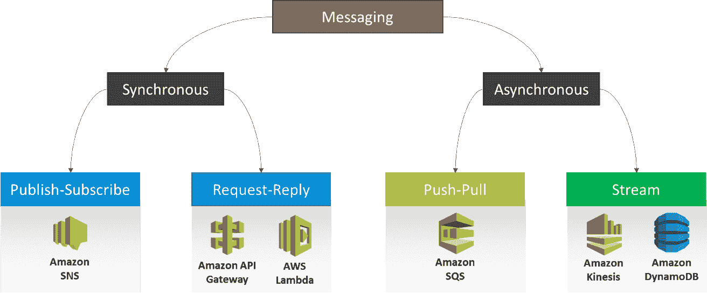

+   **Amazon SNS：** Amazon **SNS**，即**简单通知服务**，是一种同步的、托管的服务，能够让最终用户将消息发送或传递给一个或多个端点或客户端。它通过使用类似**发布者–订阅者**的模型来工作，如下图所示：

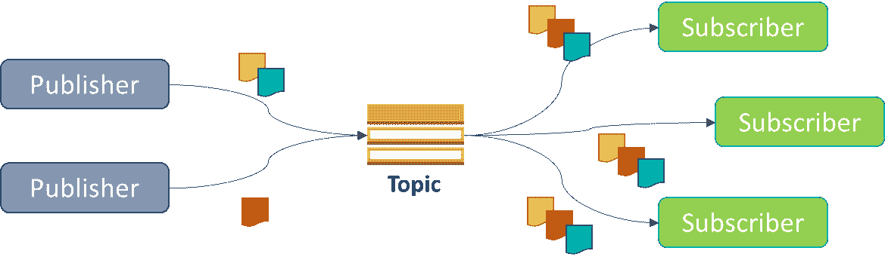

一个或多个发布者或生产者将消息发布到相应的 SNS **主题**，而不需要知道哪些订阅者或消费者最终会消费这些消息。生产者也不需要等待消费者的响应，这使得 SNS 成为一种松耦合服务。消费者的任务是订阅主题并获取传入的消息通知。SNS 支持多种消费者实现选项，如电子邮件、移动推送通知、SMS、HTTP/HTTPS 通知，甚至是 Lambda 函数。

+   **Amazon SQS：** 另一方面，Amazon **SQS**，或称为 **Simple Queue Service**，是一种异步托管服务，提供了将消息推送到队列并从队列中拉取消息的能力。在这里，多个生产者可以将消息推送到队列中，而在另一端的消费者会逐个消费并处理这些消息。这里需要注意的重要一点是，与其对应的 SNS 不同，后者会在有新消息时通知消费者，而在 SQS 中，消费者必须定期轮询队列以查找新消息。一旦发现消息，消费者需要处理它，并将其从队列中删除。该过程如下所示：

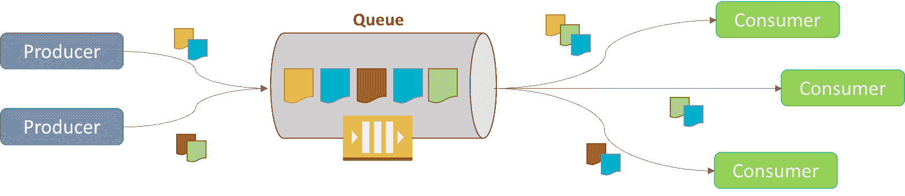

+   **Amazon Kinesis：** Amazon Kinesis 与 Amazon SQS 很像；然而，它本质上是为高吞吐量的数据写入和读取而设计和优化的。在这里，代替队列，你将得到一个流，消费者可以多次读取该流。该流会在 24 小时后自动修剪，因此，与队列中的消费者不同，这里不需要在处理完消息后删除消息：

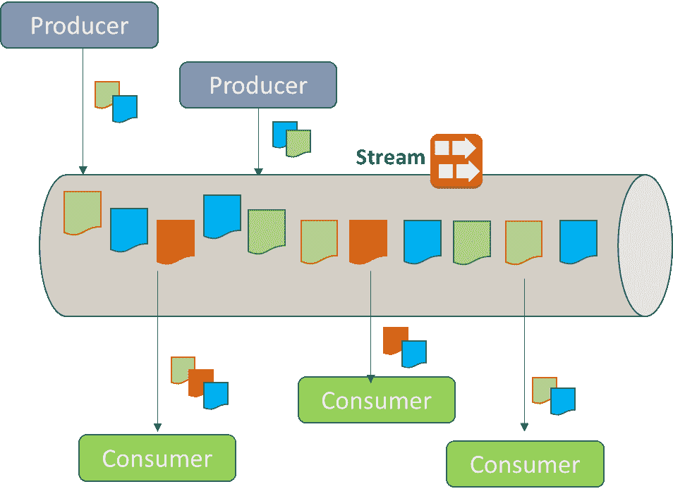

与 Amazon Kinesis 类似，AWS 也提供了一种流式功能，称为 DynamoDB streams，结合 DynamoDB 使用。通过这个功能，你可以基本上启用对表中某些项的实时变更，并以流的形式进行处理。最后，你还可以通过结合使用 Amazon API Gateway、ELB、AWS Lambda 和其他服务，获得标准的请求-回复消息模型。这种通信模式本质上是同步的，可以根据你的需求用于各种用例。

牢记这些基本的区别后，我们现在可以继续了解更多关于 SNS 的内容。

# 开始使用 Amazon Simple Notification Service

如前所述，SNS 是一种托管的 Web 服务，你可以作为最终用户利用它将消息发送到各种订阅的端点。SNS 采用发布-订阅或生产者-消费者模型，在该模型中，生产者创建并将消息发送到特定主题，随后一个或多个订阅者通过一组受支持的协议消费这些消息。在编写本书时，SNS 支持 HTTP、HTTPS、电子邮件、短信形式的推送通知，以及作为首选订阅者模式的 AWS Lambda 和 Amazon SQS。

SNS 是一个非常简单但又极其有用的服务，你可以将其用于各种目的，其中最常见的是在特定事件发生时向云管理员推送通知或系统警报。我们在本书中一直使用 SNS 来实现这一目的；然而，SNS 还有许多其他功能和使用案例。例如，你可以使用 SNS 向大量目标受众发送促销电子邮件或短信，甚至可以将其用作移动推送通知服务，将消息直接推送到你的 Android 或 iOS 应用程序。

记住这一点，让我们快速创建一个简单的 SNS 主题：

1.  为此，首先登录到你的 AWS 管理控制台，并在筛选选项中筛选出 `SNS` 服务。或者，你也可以通过选择 [`console.aws.amazon.com/sns`](https://console.aws.amazon.com/sns) 来访问 SNS 仪表板。

1.  如果这是你第一次使用 SNS，只需选择“开始使用”选项即可开始。在 SNS 仪表板中，你可以通过选择“创建主题”选项来开始，如下图所示：

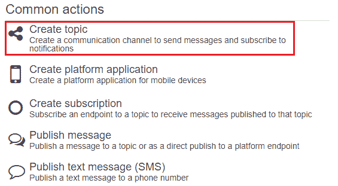

1.  选择后，你将被提示提供一个合适的主题名称以及对应的显示名称。主题是 SNS 的核心功能。你可以使用主题向特定类型的订阅者发送消息。记住，一个主题可以被多个订阅者订阅。一旦你填写了所需的字段，选择“创建主题”选项以完成此过程。就这样！简单吧？

1.  创建主题后，你现在可以将其与一个或多个订阅者关联。为此，首先我们需要创建一个或多个订阅。在新创建的主题下，选择提供的“创建订阅”选项，如下图所示：

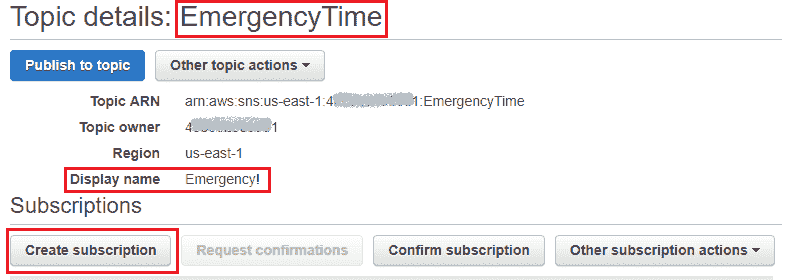

1.  在此，在“创建订阅”对话框中，选择一个合适的协议来订阅新创建的主题。在这种情况下，我选择了 Email 作为协议。接下来，在随后的“终端节点”字段中提供一个有效的电子邮件地址。终端节点字段会根据所选协议而有所不同。完成后，点击“创建订阅”按钮以完成该过程。

1.  创建订阅后，你现在需要验证该订阅。这可以通过启动你的电子邮件应用并选择你收到的邮件中的“确认订阅”链接来完成。

1.  一旦订阅得到确认，你将被重定向到一个确认页面，在那里你可以查看订阅的主题名称以及订阅 ID，如下图所示：

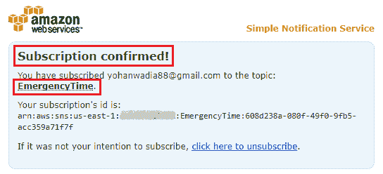

1.  您可以使用相同的过程为同一主题创建并分配多个订阅者。例如，选择创建订阅选项，按之前的操作，从协议下拉列表中选择 SMS 作为新的协议。接下来，在随后的端点字段中提供一个有效的电话号码。该号码可以以您的国家代码为前缀，如下图所示。完成后，点击创建订阅按钮以完成此过程：

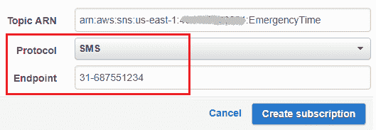

1.  订阅成功创建后，您现在可以通过向您的主题发布消息来测试这两项功能。为此，请从您的主题页面选择发布到主题选项。一旦在此处发布消息，SNS 将尝试将该消息发送到每个订阅端点；在此案例中，发送到电子邮件地址以及电话号码。

1.  输入合适的主题名称，后跟您希望发送的实际消息。请注意，如果您的字符数超过 160 个字符，SNS 将自动发送另一条短信，包含剩余的字符数。您可以选择在原始格式和 JSON 格式之间切换消息格式，以符合您的需求。完成后，选择发布消息。

1.  再次检查您的电子邮件应用程序以查看已发布的消息。您应该会收到一封邮件，如下图所示：

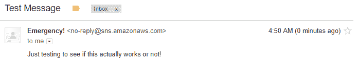

类似地，您可以为每个创建的主题创建并关联一个或多个订阅。在下一节中，我们将介绍如何利用 SNS 向一个或多个电话号码发送短信或文本消息。

# 使用 SNS 发送短信

亚马逊 SNS 还为用户提供了一个非常易于使用的界面，允许您向一个或多个电话号码发送短信或 SMS 消息。它还提供了根据消息的紧急程度对消息进行分类和发送的功能，并可以指定您每月发送短信时愿意花费的最大金额。所以，别浪费时间，让我们直接开始吧：

1.  要使用 SNS 发送短信，首先通过选择[`console.aws.amazon.com/sns/`](https://console.aws.amazon.com/sns/)登录 SNS 仪表板。

1.  登录后，从导航面板中选择文本消息（SMS）选项。这将打开文本消息（SMS）仪表板，您可以在此设置您的短信偏好设置，并向一个或多个电话号码发送消息。首先，通过从仪表板中选择管理短信偏好设置选项来设置一些偏好设置。

1.  填写以下偏好设置字段：

    +   默认消息类型：SNS 提供两种消息类型：推广和事务性。如果您要发送的消息不那么重要（例如，简单的营销信息等），可以选择推广选项。另一方面，事务性消息更适合发送关键性信息，例如一次性密码、交易详情等。SNS 优化事务性消息的发送，以确保最佳的可靠性。

在撰写本书时，发送短信在以下国家/地区得到支持，详情请见[`docs.aws.amazon.com/sns/latest/dg/sms_supported-countries.html`](https://docs.aws.amazon.com/sns/latest/dg/sms_supported-countries.html)。

对于这个特定场景，我选择了推广选项，如下图所示：

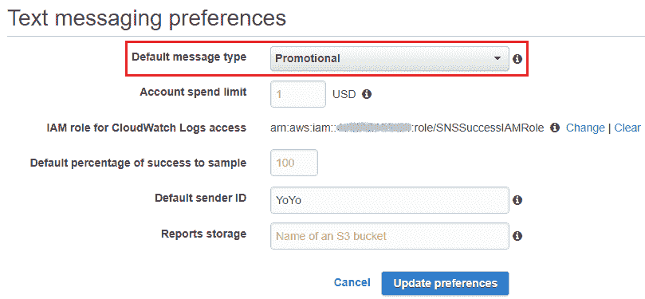

+   +   账户消费限制：您希望每月发送消息时的最大花费，单位为美元。默认情况下，限制设置为 1.00 美元。在本场景中，我们将不更改此值。

推广消息和事务性消息类型的费用根据指定的国家或地区不同而有所不同。您可以在[`aws.amazon.com/sns/sms-pricing/`](https://aws.amazon.com/sns/sms-pricing/)查询价格。

+   +   CloudWatch Logs 访问的 IAM 角色：此选项用于创建一个 IAM 角色，允许 Amazon SNS 将日志写入 CloudWatch。由于这是第一次配置此功能，请选择创建 IAM 角色选项。这将引导您到一个新页面，您应选择允许选项，以授予 SNS 所需的权限。以下是为您的 IAM 角色提供的权限片段：

```
{ 
  "Version": "2012-10-17", 
  "Statement": [ 
    { 
      "Effect": "Allow", 
      "Action": [ 
        "logs:CreateLogGroup", 
        "logs:CreateLogStream", 
        "logs:PutLogEvents", 
        "logs:PutMetricFilter", 
        "logs:PutRetentionPolicy" 
      ], 
      "Resource": [ 
        "*" 
      ] 
    } 
  ] 
} 
```

+   +   默认成功采样百分比：此选项用于指定成功发送的短信百分比，基于此，SNS 会将日志写入 CloudWatch。如果仅想记录失败的消息发送日志，请将此值设置为`0`。默认情况下，SNS 会记录所有成功的发送日志（100%）。

    +   默认发送者 ID：此选项用于指定消息发送者的名称。您可以在此处提供任何有意义的名称。

    +   报告存储：使用此选项配置一个 S3 存储桶，用于存储来自 Amazon SNS 的每日短信使用报告。如果您提供的是现有的存储桶作为报告存储，请确保该存储桶具有与 SNS 服务交互所需的访问权限。

1.  填写完所需字段后，选择更新偏好设置选项以完成该过程。

要发送短信，只需从文本消息（SMS）仪表板选择发送文本消息（SMS）选项。这将弹出发送短信（SMS）对话框，如下图所示。提供有效的电话号码和消息。记得在电话号码中前缀添加您的国家区号：

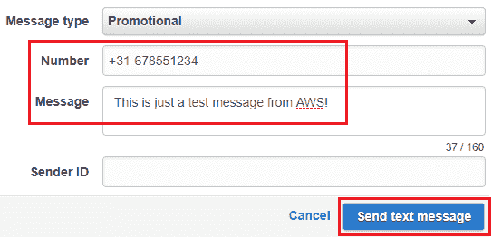

你还可以选择性地覆盖此处的 Sender ID 字段，不过在这个案例中，我们保持默认值，它是在偏好设置阶段配置的。填写完必填字段后，只需选择发送短信以完成消息发送过程。你还可以通过在“短信（SMS）”页面提供的账户统计部分验证每个消息的送达状态，可以是交易性或促销性。

# 使用 Amazon SNS 作为触发器。

拥有像 SNS 这样的服务的一个关键好处是，它也可以作为多种用例的触发机制。SNS 发送的消息可以触发简单的 Lambda 函数，Lambda 函数执行某些操作，比如对其他 AWS 服务进行操作，或者简单地处理 SNS 的消息内容并将其转发到另一个应用程序。在本节中，我们将探索一个非常简单的用例，其中 SNS 主题作为触发机制，触发 Lambda 函数将 CloudWatch 警报推送到 Slack！这些警报将发送到一个自定义的 Slack 频道，IT 团队可以在该频道中跟踪警报和有关 AWS 环境的其他重要通知。

从更广泛的角度来看，以下是我们计划为此活动做的事情：

+   创建一个 SNS 主题，它将作为 Lambda 触发器。

+   为我们的 EC2 机器创建一个 CloudWatch 报警，比如当 CPU 利用率超过 80%时触发报警。

+   CloudWatch 报警将把通知发送到 SNS 主题。

+   SNS 主题将作为我们的 Lambda 函数的触发器。

+   一旦 Lambda 函数收到触发，它将把通知发送到我们的 Slack 频道。

听起来很简单？那我们就开始实现它吧：

1.  首先，我们需要创建一个简单的 SNS 主题，它将作为 Lambda 函数的触发器。按照我们之前的步骤创建一个简单的 SNS 主题。完成后，记下主题仪表板中的 SNS 主题 ARN。在本例中，我们的 SNS 配置为将通知发送到一个电子邮件订阅者，该订阅者是 IT 管理员的邮件别名。

1.  接下来，我们创建我们的 CloudWatch 报警。为此，选择 AWS 管理控制台中的 CloudWatch 服务，并点击导航面板中的“警报”。选择“创建警报”以开始。

1.  在这个场景中，我们将监控我们环境中的 EC2 实例，因此我选择了 EC2 指标选项。你也可以根据需求选择其他指标。在我们的例子中，我们配置了一个简单的 CPUUtilization 报警，如下图所示：

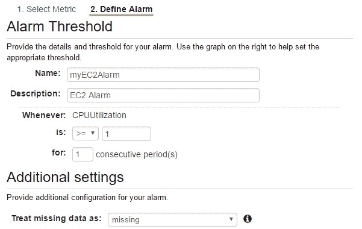

1.  确保你为警报设置了通知，并将其指向新创建的 SNS 主题，如下图所示：

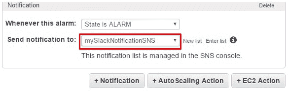

在设置好 SNS 主题和 CloudWatch 警报后，我们需要配置一个 Slack 频道，用于发布警报通知。为此，我们需要设置一个传入的 Webhook 并获取一个钩子 URL，之后可以用它来发布通知：

1.  进入你的 Slack 团队设置页面，选择“应用和集成”选项，如下图所示：

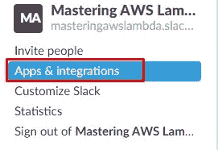

你可以在[`slack.com/get-started`](https://slack.com/get-started)注册一个免费的 Slack 账户。

1.  一旦点击“应用和集成”，系统会将你带到一个新页面，列出了多种预配置的应用。搜索`Incoming`并从出现的选项中选择“传入 Webhook”。

1.  接下来，点击“添加配置”。系统会要求你选择要发布的频道，并填写一些其他必要的参数。在继续执行下一步之前，请确保你已复制并保存 Webhook URL。

现在我们已经准备好 Slack 钩子 URL，可以开始部署我们的 Lambda 函数了。在这个示例中，我们将使用为 Slack 集成设计的现有 AWS Lambda 函数蓝图，使用的是 Node.js 4.3 版本：

1.  从 AWS 管理控制台的仪表盘中，使用筛选选项筛选 Lambda 服务，或者选择[`console.aws.amazon.com/lambda/home`](https://console.aws.amazon.com/lambda/home)。

1.  在 AWS Lambda 的首页，选择“创建函数”选项开始操作。

1.  在使用 Lambda 函数时，你可以选择从头创建一个新的函数，或者从一系列预定义和配置好的蓝图中筛选并使用一个函数。在这种情况下，选择“蓝图”选项，并使用相邻的蓝图筛选器搜索以下函数：蓝图名称：cloudwatch-alarm-to-slack（如下面的截图所示）：

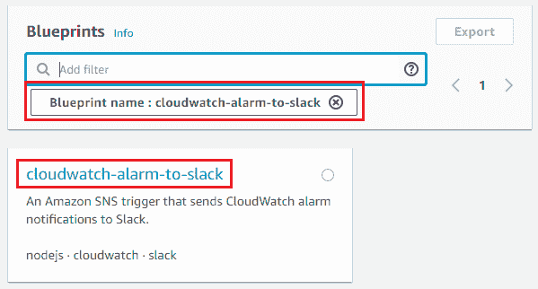

1.  选择蓝图后，填写你函数的必要信息，比如名称、角色名称等。完成后，在 SNS 部分，从下拉列表中选择新创建的 SNS 主题。

1.  在继续下一步之前，记得勾选“启用触发器”复选框。

1.  最后，在“环境变量”部分，提供`slackChannel`和`kmsEncryptedHookUrl`参数的适当值，如下图所示。记住，`kmsEncryptedHookUrl`就是我们之前创建的 Slack 钩子 URL：

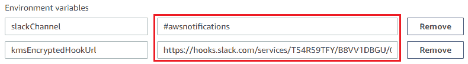

1.  填写完所有值后，简单选择“创建函数”选项，让魔法开始吧！

根据为告警选择的 CloudWatch 指标，继续为你的 EC2 实例创建一些合成负载。一旦负载超过告警中设定的阈值，它会触发相应的消息到 SNS 主题，进而触发 Lambda 函数在 Slack 渠道发布告警。通过这种方式，你还可以使用相同的 SNS 主题来订阅其他服务，例如 Amazon SQS，进行其他处理需求。

# 使用 Amazon CloudWatch 指标监控 Amazon SNS

Amazon SNS 会自动收集并将消息投递的各种指标发送到 Amazon CloudWatch。你可以查看这些指标，并为它们设置告警，提醒你在消息投递率低于某个阈值时。你还可以使用 CloudWatch 日志页面查看消息投递日志：

1.  要开始，首先确保你已经分配了允许 SNS 将短信投递日志写入 CloudWatch 的 IAM 角色。为此，从导航窗格中选择“文本消息（SMS）”选项。

1.  接下来，在“管理短信偏好设置”选项中，确保在“CloudWatch 日志访问的 IAM 角色”字段下提供了有效的 IAM 角色。

1.  一旦 IAM 角色创建完成，登录到你的 CloudWatch 仪表盘，选择[`console.aws.amazon.com/cloudwatch/home`](https://console.aws.amazon.com/cloudwatch/home)。

1.  在这里，从导航窗格中选择“日志”选项，打开 CloudWatch 日志组页面。你应该能看到一个名为`DirectPublishToPhoneNumber`的默认日志组。

1.  选择日志组以查看短信投递日志信息。日志将显示`SUCCESS`或`FAILURE`，并出现在`status`字段中，如下截图所示：

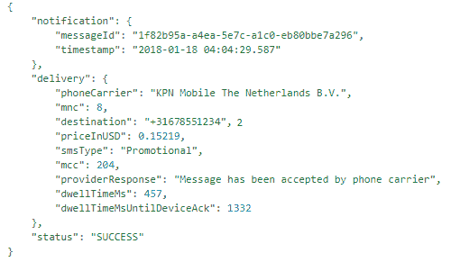

1.  你还可以为监控的 SNS 指标创建并关联 CloudWatch 告警。为此，从 CloudWatch 仪表盘中选择“指标”选项。

1.  从“所有指标”标签页中，筛选并选择 SNS 选项。

1.  根据需求，你现在可以选择根据 PhoneNumber、Country、SMSType 等查看指标。在本例中，我们选择了 PhoneNumber 选项，以查看 NumberOfNotificationsFailed 和 NumberOfNotificationsDelivered 指标。

1.  接下来，选择“图表化的指标”标签页，查看这两个指标及其相关操作。使用“操作”列，选择你希望监控的指标的“创建告警”选项。

1.  填写相关详细信息，并根据需求配置告警的阈值。一旦完成，点击“创建告警”以完成设置。

通过这种方式，你可以利用 Amazon CloudWatch 创建并查看由 SNS 服务生成的日志和告警。在下一部分中，我们将探索并学习 AWS 消息服务的第二部分：SQS。

# 介绍 Amazon 简单队列服务

Amazon SQS 是一项托管的、高度可扩展的且持久的服务，提供开发人员一种机制来存储消息，供一个或多个应用程序稍后消费。在本节中，我们将探讨 SQS 提供的一些概念和术语，并了解在不同场景下该使用哪个 SQS 队列，下面我们就开始吧！

首先，SQS 提供两种不同的模式：

+   **标准队列**：标准队列是使用 SQS 时的默认选择。在这里，所创建的队列提供几乎无限的**每秒事务数**（**TPS**），并配有 *至少一次* 的交付模型。这意味着消息至少会被交付一次，但偶尔也可能有很大概率同一消息会被多次交付。这是因为 SQS 设计和构建在一个高度分布式的系统上，已知会创建同一消息的副本以维持高可用性。因此，你可能会收到多次相同的消息。

标准队列还采用 *尽力而为的顺序* 模型，在这种情况下，消息的交付顺序可能与发送时的顺序不同。将消息按正确的接收顺序排序的工作由你的应用程序来完成。那么，什么时候标准队列是解耦应用程序的理想选择呢？如果你的应用程序有高吞吐量要求，例如批量消息处理、将用户请求与高强度背景处理工作解耦等，那么标准队列是正确的选择。

标准队列在所有 AWS 区域都可用。

+   **FIFO 队列**：在使用标准队列时，会遇到保持消息顺序并确保每条消息只处理一次的问题。为了解决这个问题，AWS 引入了 FIFO 队列，它为开发人员提供了消息交付顺序的保证，并确保每条消息只交付一次，绝不发送重复或副本。

另一方面，FIFO 队列不像其前身那样提供无限的吞吐能力。截止本书编写时，FIFO 队列每秒最多支持发送 300 条消息，如果每次操作处理 10 条消息，则额外可支持每秒 3,000 条消息的吞吐量。

这种队列在消息顺序至关重要时非常有用，例如，确保用户在注册或购买产品时按照正确的事件顺序进行操作等。

FIFO 队列目前仅在美国东部（北弗吉尼亚）、美国东部（俄亥俄）、美国西部（俄勒冈）和欧盟（爱尔兰）地区提供。

在有了这些基本了解之后，让我们看看一些简单的步骤，帮助你在几分钟内创建自己的队列！

# 创建你的第一个队列

使用您自己的 SQS 队列入门是一个相当简单的过程。在本节中，我们将介绍如何使用 AWS 管理控制台创建您自己的标准队列：

1.  首先，登录到您的 AWS 管理控制台，并使用提供的过滤器选项过滤出 SQS 服务。或者，您也可以通过选择[`console.aws.amazon.com/sqs/home`](https://console.aws.amazon.com/sqs/home)来访问 SQS 仪表板。

1.  由于这是我们第一次配置 SQS 队列，请选择“立即开始”选项继续。

1.  在“创建新队列”页面中，首先在队列名称字段中为您的队列提供一个合适的名称。

如果您正在构建 FIFO 队列，您需要在队列名称后加上 `.fifo` 后缀，例如：`myQueue.fifo`。

1.  填写完队列名称后，下一步是选择您希望设置的队列类型。在这种情况下，我们首先选择`标准队列`选项。

1.  接下来，选择“配置队列”选项，以查看队列的一些配置参数。或者，您也可以选择“快速创建队列”选项，选择队列的所有默认参数。

1.  在队列属性部分，您可以根据需求自由修改以下一组队列参数：

    +   默认可见性超时：Amazon SQS 不会自动从队列中删除消息，即使这些消息已经被消费者处理。因此，消费者有责任在接收到并处理消息后，将其从队列中删除。

然而，由于 SQS 的分布式特性，不能保证其他消费者不会尝试从同一消息的副本中读取。为了防止这种情况发生，SQS 在消息被消费者接收后，设置了一个短暂的*可见性超时*期。这会防止其他消费者在超时之前读取该消息。

默认情况下，可见性超时可以设置为最短 30 秒，最长 12 小时。如果消费者未能在分配的超时窗口内处理该消息，则该消息将被交付给其他消费者，直到消费者从队列中删除该消息为止，过程才会结束。

+   +   消息保留时间：Amazon SQS 保留消息的时间，如果消息没有被删除。这里接受的值最小为 1 分钟，最大为 14 天。

    +   最大消息大小：Amazon SQS 接受的最大消息大小（字节）。最大限制为 256 KB。

    +   传递延迟：Amazon SQS 允许您在队列中暂时延迟新消息的投递，延迟时间为指定的秒数。这是通过将新消息放入由 AWS 完全管理的延迟队列来实现的。尽管这看起来与可见性超时的概念相似，但延迟队列在消息首次添加到队列时会将其隐藏，而后者则是在消息被消费者提取时将其隐藏。此处接受的值为 0 秒到 15 分钟之间：

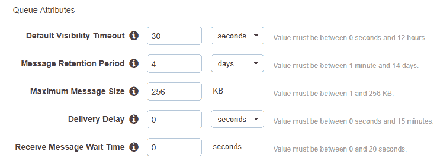

+   +   接收消息等待时间：Amazon SQS 定期查询少量服务器，以确定是否有新消息可供消费。此方法称为**短轮询**，并且通常在接收消息等待时间设置为 `0` 时默认启用。然而，这种方法会导致大量空响应，因为有时队列中可能没有可供消费的消息。在这种情况下，SQS 还提供了**长轮询**的概念，即 Amazon SQS 等待直到队列中有消息可用时才发送响应。这大大减少了空响应的数量，并有助于降低系统的整体运行成本。要启用长轮询，只需将接收消息等待时间的值更改为 0 到 20 秒之间的值。

配置了这些基本设置后，您现在可以继续创建自己的队列。不过需要注意的是，您还可以配置一些额外的设置，比如**死信队列**和**服务器端加密**。但我们暂时先不讨论这些内容。完成后请选择“创建队列”。

在创建新队列后，您现在可以通过简单地复制队列的 URL（`https://sqs.us-east-1.amazonaws.com/<ACCOUNT_ID>/<QUEUE_NAME>`）并将其提供给您的应用程序或消费者来开始使用它：

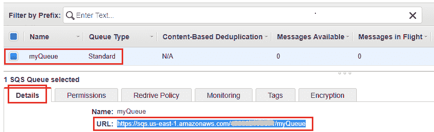

您还可以通过使用 SQS 仪表板向队列发送测试消息来测试队列的功能。从 SQS 仪表板中选择新创建的队列，然后在“队列操作”下拉菜单中选择“发送消息”选项。

这将打开“发送消息”对话框，如下图所示。接下来，在“消息正文”部分输入测试消息，然后点击“发送消息”以完成该过程：

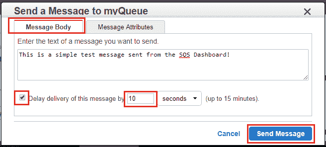

您还可以选择通过启用“延迟发送此消息”选项并提供 0 到 15 分钟之间的值，来更改此单个消息的传递延迟。

发送消息后，你将收到消息的 *标识符* 和消息体的 *MD5 校验和*。点击“关闭”以关闭“发送消息”对话框。此时，“可用消息”列的状态应该变为 1，因为新消息现在正在等待被读取或消费。要从 SQS 控制台读取消息，再次选择队列操作下拉菜单，并选择“查看/删除消息”选项。

这将弹出“查看/删除消息”对话框，如下图所示。在这里，系统会每隔 2 秒轮询一次队列，直到你使用“轮询队列”选项指定轮询。你还可以通过修改“最多查看”字段来更改查看的最大消息数。完成后，选择“开始轮询消息”选项以启动操作：

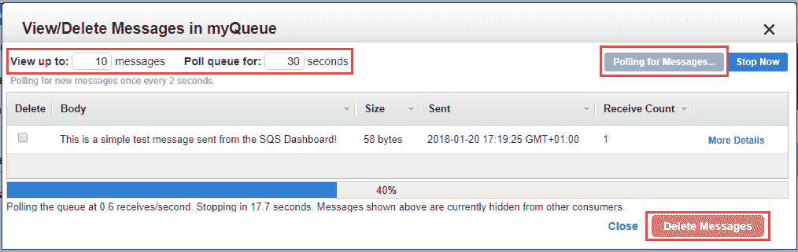

启动轮询后，你应该很快在显示区域看到你的测试消息。你还可以通过选择与消息相邻的“更多详情”选项，并验证之前记录的 MD5 校验和，来验证消息的有效性。

完成后，选择消息并点击“删除消息”选项，将消息从队列中移除。记住，这是一个永久性操作，无法撤销。删除消息后，队列应该会再次显示零个正在传输或可用的消息。

# 使用 AWS CLI 创建 FIFO 队列

使用 AWS 管理控制台足够简单，但 AWS CLI 使事情变得更简单！在本节中，我们将介绍一些简单的 AWS CLI 命令，你可以使用它们来创建并操作你的第一个 FIFO 队列：

1.  要开始操作，我们需要一台已经安装并配置了最新版本 AWS CLI 的服务器或实例。如果你还没有配置好，可以快速查看[`docs.aws.amazon.com/cli/latest/userguide/installing.html`](https://docs.aws.amazon.com/cli/latest/userguide/installing.html)提供的详细步骤。

1.  安装并配置好 AWS CLI 后，你可以使用以下命令来创建你的第一个 FIFO 队列。首先，创建一个简单的 JSON 文件，用于存储我们希望传递给新 FIFO 队列的必要属性列表：

```
# vi fifo-queue.json 
#### PASTE THE FOLLOWING CONTENTS ##### 
{"VisibilityTimeout" : "30", 
"MaximumMessageSize" : "262144", 
"MessageRetentionPeriod" : "345600", 
"DelaySeconds" : "10", 
"ReceiveMessageWaitTimeSeconds" : "0", 
"FifoQueue" : "true", 
"ContentBasedDeduplication" : "true" 
} 
```

在这里，大多数值你可能已经熟悉了，比如 `VisibilityTimeout`、`MaximumMessageSize`、`DelaySeconds` 等等。这里列出的两个专门为 FIFO 队列设计的新属性是：

+   +   `FifoQueue`：用于将队列指定为 FIFO 队列。请注意，无法将现有的标准队列更改为 FIFO 队列。你必须完全重新创建一个 FIFO 队列。此外，当你为队列设置此属性时，必须显式提供消息的 `MessageGroupId`。

    +   `ContentBasedDeduplication`：它确保每条消息只会被处理一次。当启用`ContentBasedDeduplication`后，在去重时间窗口内，具有相同内容的消息会被视为重复消息，且只会传递一份消息。

1.  创建 JSON 文件后，运行以下命令以创建你的 FIFO 队列：

```
# aws sqs create-queue --queue-name myQueue.fifo
--attributes file://fifo-queue.json 
```

你应该在输出中收到新的 FIFO 队列终端节点 URL，如下图所示：

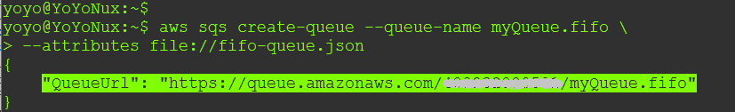

1.  创建队列后，你还可以使用 CLI 将消息传递到队列中。这也可以通过以下命令来实现：

```
# aws sqs send-message  
--queue-url https://queue.amazonaws.com/012345678910/myQueue.fifo  
--message-body "Well this is far easier than I expected."  
--message-group-id "R@nD0M" 
```

`send-message`命令将队列 URL 作为输入参数之一，另外还需要提供要发送的实际消息。消息可以是原始的、JSON 格式或 XML 格式。除此之外，`send-message`命令还使用`--message-group-id`参数，它基本上将消息标记为属于特定的消息组。属于同一消息组的消息会按 FIFO 顺序处理：

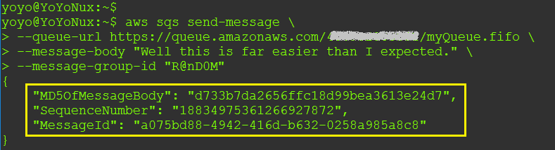

在使用 FIFO 队列时，`--message-id-group`参数是必需的。

1.  现在消息已被发送到队列，你也可以使用 AWS CLI 来接收消息。使用以下命令从你的 FIFO 队列中获取消息：

```
# aws sqs receive-message  
--queue-url https://queue.amazonaws.com/012345678910/myQueue.fifo 
```

你还可以额外使用`--max-number-of-messages`属性列出当前队列中最多 10 条可用消息。以下是你可能通过前述命令获得的输出片段：

```
{ 
    "Messages": [ 
        { 
            "Body": "Well this is far easier than I expected.", 
            "ReceiptHandle": "AQnmzJjGNrI9cl7ZyZ2NyVDDDy==", 
            "MD5OfBody": "d733b7da2656ffc18d99bea3613e24d7", 
            "MessageId": "a075bd88-4942-416d-b632-0258ac8" 
        } 
    ] 
} 
```

你也可以使用 AWS CLI 列出环境中可用的队列，修改其参数，推送和轮询新消息，删除消息，等等！记住，消息会在队列中持续存在，直到你手动删除它们或队列的`MessageRetentionPeriod`有效期过期。

# 集成亚马逊 SNS 和亚马逊 SQS

亚马逊 SQS 的一个关键特点是它可以轻松与其他 AWS 服务集成，例如亚马逊 SNS。为什么我需要这样的功能？首先，让我们快速回顾一下我们目前所了解的 SNS 和 SQS：

| **亚马逊 SNS** | **亚马逊 SQS** |
| --- | --- |
| 利用推送机制 | 利用轮询机制 |
| 亚马逊 SNS 消息可以直接推送到移动设备或其他订阅者 | 亚马逊 SQS 需要一个工作者来轮询消息 |
| 不支持消息持久化 | 亚马逊 SQS 支持消息持久化，如果由于网络故障无法接触到消费者，这非常有用 |

从表格中可以很容易地看到，这两项服务在使用时各有优缺点。然而，当我们将这两项服务结合使用时，实际上可以利用它们来设计和构建大规模可扩展且解耦的应用程序。结合 SNS 和 SQS 使用的一个常见架构模式被称为 **扇出模式**。

在这种模式下，发布到特定 SNS 主题的单条消息可以并行分发到多个 SQS 队列。因此，您可以构建高度解耦的应用程序，利用并行和异步处理的优势。考虑一个简单的示例来演示这种模式。用户将一张图片上传到其 S3 存储桶，这会触发 SNS 通知并发送到特定的 SNS 主题。该主题可以被多个 SQS 队列订阅，每个队列都运行与其他队列完全独立的进程。例如，一个队列可以用于处理图片的元数据，而另一个队列可以用于将图片调整为缩略图，依此类推。在这种模式中，队列可以独立工作，而无需担心其他队列是否完成了处理。以下是该模式的示意图：

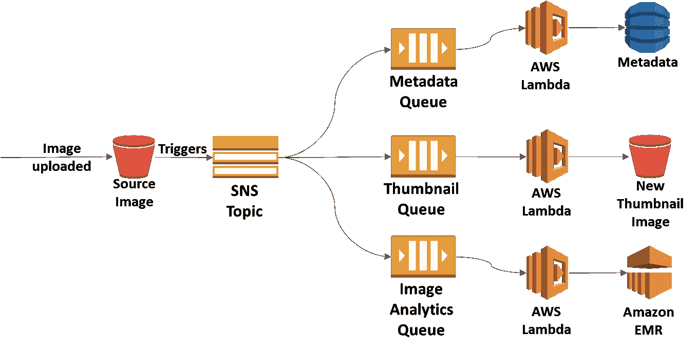

1.  要集成 SNS 和 SQS 服务，您首先需要创建您自己的简单 SNS 主题。请按照本章前面所示，使用 AWS 管理控制台创建一个新的 SNS 主题。

1.  主题准备好后，下一步是创建关联的订阅。为此，在 SNS 控制台中，从导航面板中选择“订阅”选项，点击“创建订阅”以开始操作。

1.  在“创建订阅”对话框中，将新创建的主题的 ARN 复制并粘贴到 Topic ARN 字段，如下图所示：

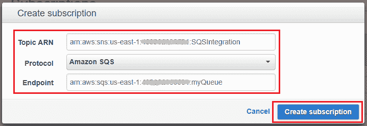

1.  一旦粘贴了 Topic ARN，选择协议下拉列表中的 Amazon SQS 选项，然后将队列的 ARN 粘贴到 Endpoint 字段中。在这种情况下，我使用的是我们在本章前面创建的标准队列的端点。

1.  填写必填字段后，选择“创建订阅”以完成过程。

1.  接下来，在 SQS 控制台中，选择您为此集成所确定的队列，并在“权限”选项卡中选择“添加权限”，以允许 SNS 服务向该队列发送消息。为此，请提供以下权限集：

    +   效果：允许

    +   角色：Everybody

    +   操作：SendMessage

1.  完成后，点击“添加权限”以授予 SNS 服务所需的权限集。

1.  现在我们准备测试集成！要做到这一点，只需从 SNS 仪表板的“发布到主题”选项中发送一个示例消息。一旦消息成功发送，请切换到 SQS 仪表板，并使用“查看/删除消息”选项从“队列操作”下拉列表中轮询队列。

这是在长轮询队列后获取的消息正文片段：

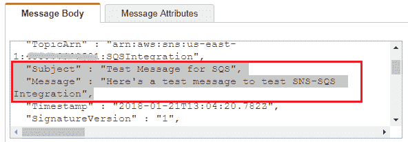

同样，您可以使用这样的扇出模式来设计和构建自己的高度可扩展和解耦的云应用程序。

# 计划您的下一步

嗯，这确实是很多需要学习和尝试的内容，但我们还没有完成！您还应该自己尝试一些关于 SNS 和 SQS 的内容。首先是 Amazon SNS 移动推送通知。

我们已经提到了 Amazon SNS 可以用来向各种订阅者发送通知，包括 HTTP、HTTPS 端点、Amazon SQS 和 AWS Lambda，但最近增加的另一个关键功能是 SNS 直接推送通知到您的移动设备应用程序上。这就是所谓的**SNS 移动推送通知**，目前，SNS 支持以下推送通知服务：

+   **Amazon 设备消息** (**ADM**)

+   **Apple 推送通知服务** (**APNS**) 用于 iOS 和 macOS

+   **百度云推送** (**Baidu**)

+   **Google 云消息传递** (**GCM**) 用于 Android

+   **Microsoft 推送通知服务** (**MPNS**) 用于 Windows Phone

+   **Windows 推送通知服务** 或 **Windows 通知服务** (**WNS**)

要开始使用移动推送通知非常简单明了。您只需要一组用于连接支持的推送通知服务的凭据，用于移动应用程序和设备本身的设备令牌或注册 ID，以及配置为向移动端点发送推送通知消息的 Amazon SNS。

您可以在[`docs.aws.amazon.com/sns/latest/dg/SNSMobilePush.html`](https://docs.aws.amazon.com/sns/latest/dg/SNSMobilePush.html)了解更多关于 SNS 移动推送通知服务的信息。

另一个值得尝试的重要功能是为您的 Amazon SQS 队列配置服务器端加密。您可以利用 SSE 对存储在队列中的数据进行加密和保护，但是目前此功能仅在美国东部（弗吉尼亚北部）、美国东部（俄亥俄州）和美国西部（俄勒冈州）地区可用。

在队列创建时以及队列创建后都可以对队列进行加密。但是，如果现有队列已经开启了 SSE，则队列中存在的旧消息不会被加密。

你可以通过在 SQS 仪表板上选择现有队列，并在队列操作下拉菜单中选择“配置队列”选项，来配置现有队列的 SSE。然后，选中“使用 SSE”复选框以启用队列的服务器端加密。此时，你将被提示选择一个**客户主密钥**（**CMK**）ID，如果你没有自己的 CMK，可以保留默认值。完成后，设置数据密钥重用周期的持续时间，范围为 1 分钟到 24 小时。点击“保存更改”以应用最近对队列的修改。

你可以阅读更多关于 SSE 以及如何在新队列上启用它的内容，访问[`docs.aws.amazon.com/AWSSimpleQueueService/latest/SQSDeveloperGuide/sqs-create-queue-sse.html`](https://docs.aws.amazon.com/AWSSimpleQueueService/latest/SQSDeveloperGuide/sqs-create-queue-sse.html)。

最后但同样重要的是，我还建议你尝试一下 Amazon SQS 提供的*死信队列*功能。死信队列其实就是你为存储无法被应用程序主处理队列处理的消息而创建的队列。当你需要调试应用程序或消息系统中的问题时，这非常有用。然而，非常重要的一点是，标准队列的死信队列始终是标准队列，同样，基于 FIFO 的队列也是如此。

你可以通过简单地配置应用程序主队列的 Redrive 策略，将账户中的任何队列配置为另一个队列的死信队列。想要了解更多关于死信队列及其工作原理的信息，请查看[`docs.aws.amazon.com/AWSSimpleQueueService/latest/SQSDeveloperGuide/sqs-dead-letter-queues.html`](https://docs.aws.amazon.com/AWSSimpleQueueService/latest/SQSDeveloperGuide/sqs-dead-letter-queues.html)。

# 总结

哇，这一章确实很有洞察力。在我们进入下一章之前，快速回顾一下我们迄今为止学到的内容！

首先，我们快速了解了 AWS 提供的各种消息服务。接下来，我们深入探索了神奇的 Amazon SNS 世界，创建了我们的第一个主题，并订阅了电子邮件和手机订阅。我们还了解了如何配置和利用 SNS 的短信服务。

一旦我们掌握了 SNS 的基础知识，我们就进入了下一个消息服务 SQS，了解了它的一些概念和术语。我们使用 AWS 管理控制台和 AWS CLI 创建了我们的第一个队列，最后我们还了解了这两个服务的一个非常有用的集成，您可以利用它来设计和构建可扩展的、解耦的云应用程序。最后，我们为你提供了一个实用的后续步骤指南，供你在空闲时间尝试！

在下一章中，我们将学习并探索两个非常棒的分析服务，分别是 Amazon Elastic MapReduce 和 Amazon Redshift，敬请期待！
