# 第九章：使用 Amazon EMR 和 Amazon Redshift 强化分析功能

在上一章中，我们学习了两个非常有用的服务，开发人员可以利用这些服务在云中构建高度可扩展且解耦的应用程序：Amazon SNS 和 Amazon SQS。

在本章中，我们将提高一个层次，探索两个非常强大的 AWS 服务，这些服务非常适合在云中处理和运行大规模分析和数据仓储：Amazon EMR 和 Amazon Redshift。

记住这一点，让我们快速浏览一下本章将要涵盖的各个主题：

+   通过深入了解 Amazon EMR、其用例和好处来理解 AWS 分析服务套件

+   介绍一些关键的 EMR 概念和术语，并进行快速入门指导

+   在 EMR 上运行样本工作负载，使用步骤

+   介绍 Amazon Redshift

+   开始使用 Amazon Redshift 集群

+   使用 Redshift 数据库和表

+   从 Amazon EMR 加载数据到 Amazon Redshift

所以，事不宜迟，让我们立即开始吧！

# 了解 AWS 分析服务套件

随着大数据的增长以及各大组织对其的广泛应用，许多云服务提供商现在提供了大量专门设计用于在海量数据上进行大规模计算和分析的服务。AWS 就是其中之一，它也在大数据和分析范式上投入了大量资源，提供了一系列现成的框架、商业洞察和数据仓储解决方案。以下是 AWS 分析服务套件的简要说明：

+   **Amazon EMR**：Amazon **Elastic MapReduce** 或 **EMR** 是一项快速且易于使用的服务，提供可扩展的托管 Hadoop 生态系统和框架。你可以利用 EMR 处理大量数据，而无需担心配置底层的 Hadoop 平台。我们将在本章的后续部分中深入学习和探索 EMR。

+   **Amazon Athena**：Amazon Athena 通过提供标准 SQL 接口来查询直接存储在 Amazon S3 上的数据，提升了大数据处理能力。使用 Athena 时，你不需要管理或维护任何底层硬件；这一切都由 AWS 管理。这种 *无服务器* 的方式使得 Athena 非常适合处理不需要复杂 ETL 处理的数据。你需要做的只是创建一个模式，将 Athena 指向存储在 Amazon S3 上的数据，并使用简单的 SQL 语法开始查询。

+   **Amazon Elasticsearch Service**：Amazon Elasticsearch Service 提供了流行的开源搜索和分析引擎 Elasticsearch 的托管部署。当你希望处理来自各种来源（如实例生成的日志等）的数据流时，这项服务非常有用。

+   **Amazon Kinesis**：与之前讨论的其他服务不同，Amazon Kinesis 更像是一个由 AWS 提供的流处理服务。您可以使用 Amazon Kinesis 将来自多个源的大量数据推送到一个或多个数据流中，这些流可以被其他 AWS 服务消费，用于执行分析和其他数据处理操作。

+   **Amazon QuickSight**：Amazon QuickSight 是一个极具成本效益的商业洞察解决方案，可用于对数据进行快速的临时分析。

+   **Amazon Redshift**：Amazon Redshift 是 AWS 提供的 PB 级数据仓库解决方案，您可以利用它使用现有的工具集来分析数据。在本章稍后，我们将更详细地了解 Redshift。以下是这些服务的示意图：

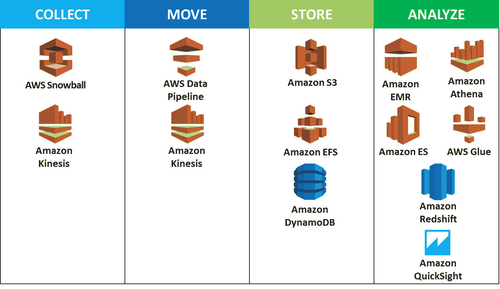

+   **AWS Data Pipeline**：在 AWS 服务之间迁移大量数据可能非常困难，尤其是在数据源各异的情况下。AWS Data Pipeline 使得在不同的 AWS 存储和计算服务之间传输数据变得更加容易，同时也帮助进行数据的初步转换和处理。您甚至可以使用 Data Pipeline 将数据可靠地从本地环境传输到 AWS 存储服务。

+   **AWS Glue**：AWS Glue 是 AWS 最近推出的托管**ETL**（**提取**、**转换**和**加载**）服务。使用 AWS Glue 可以大大简化从大型数据集准备、提取和加载数据到 AWS 存储服务的过程。

通过对 AWS 分析服务套件的简要概述，我们现在可以继续并开始进一步了解 Amazon EMR！

# 介绍 Amazon EMR

如前所述，Amazon EMR 是一种托管服务，提供开箱即用的大数据分析框架，如 Apache Hadoop 和 Apache Spark，并准备好供使用。通过使用 Amazon EMR，您可以轻松执行各种用例，如批处理、大数据分析、低延迟查询、数据流处理，甚至将 EMR 作为一个大型数据存储来使用！

使用 Amazon EMR，您无需管理太多底层基础设施。您只需决定最初希望在哪些实例上运行您的 EMR 集群，并开始使用该框架进行分析和处理。Amazon EMR 为您提供了能够根据需求扩展基础设施的功能，而不影响现有设置。以下是您可以通过利用 Amazon EMR 处理您自己工作负载所获得的一些好处：

+   **定价**：Amazon EMR 依赖于 EC2 实例来启动您的 Apache Hadoop 或 Apache Spark 集群。尽管您可以通过选择集群的实例类型（从大到超大等）来调整成本，但 EMR 的最大优势是，您还可以根据您的设置选择使用按需 EC2 实例、预留实例和竞价实例的组合，从而为您提供灵活性，并显著降低成本。

+   **可扩展性**：Amazon EMR 为您提供了一种简单的方式来根据工作负载的处理需求扩展运行中的工作负载。您可以根据需要调整集群或其各个组件的大小，并且可以配置一个或多个实例组，以保证实例的可用性和处理能力。

+   **可靠性**：尽管作为最终用户，您需要指定初始实例及其大小，但 AWS 最终通过更换那些已失败或即将失败的实例来确保集群的可靠性。

+   **集成**：Amazon EMR 与其他 AWS 服务集成，为您的集群提供额外的存储、网络和安全要求。您可以使用诸如 Amazon S3 来存储输入和输出数据，AWS CloudTrail 用于审计对 EMR 的请求，VPC 确保您启动的 EMR 实例的安全性，等等！

牢记这些细节后，让我们通过先了解一些关键概念和术语，逐步迈向启动我们自己的 EMR 集群。

# 概念和术语

在我们开始使用 Amazon EMR 之前，了解其一些关键概念和术语是很重要的，首先从集群和节点开始：

+   **集群**：集群是 Amazon EMR 的核心功能组件。集群是由一组 EC2 实例组成的，这些实例可以一起用来处理您的工作负载。集群中的每个实例称为一个节点，每个节点在集群内有不同的角色。

+   **节点**：Amazon EMR 通过为集群实例提供以下三种角色之一来区分集群实例：

    +   **主节点**：负责集群的整体可管理性、工作和监控的实例。*主节点*负责处理集群内发生的所有数据和任务分配。

    +   **核心节点**：核心节点与主节点非常相似；然而，它们主要用于运行任务并在您的**Hadoop 分布式文件系统**（**HDFS**）上存储数据。核心节点还可以包含一些 Hadoop 应用程序的额外软件组件。

    +   **任务节点**：任务节点仅设计用于运行任务。它们不包含任何 Hadoop 应用程序的额外软件组件，在集群部署时是可选的。

+   **步骤**：步骤是提交到集群进行处理的简单任务或作业。每个步骤包含一些指示，说明如何执行特定的作业。步骤可以按顺序安排，例如，某个步骤可以用于从 Amazon S3 获取输入数据，而第二个步骤可以用于运行 Pig 或 Hive 查询，最后第三个步骤用于将输出数据存储到 Amazon DynamoDB。如果某个步骤失败，后续的步骤会自动取消执行，然而，您可以选择通过设置步骤忽略失败并继续处理来覆盖这一行为。

除了这些概念，您还需要复习 Apache Hadoop 框架和术语。以下是一些在使用 Amazon EMR 时可能会遇到的 Apache 框架和应用程序的快速介绍：

+   **存储**：EMR 的一个重要部分是数据如何实际存储和检索。以下是使用 Amazon EMR 时提供的一些存储选项：

    +   **Hadoop 分布式文件系统**（**HDFS**）：顾名思义，HDFS 是一个分布式和可扩展的文件系统，允许数据跨底层节点实例进行存储。默认情况下，数据会在集群中的实例间进行复制和存储。这提供了高可用性和数据弹性，以防实例发生故障。您可以在此处了解更多关于 HDFS 的信息：[`hadoop.apache.org/docs/stable/hadoop-project-dist/hadoop-hdfs/HdfsUserGuide.html`](https://hadoop.apache.org/docs/stable/hadoop-project-dist/hadoop-hdfs/HdfsUserGuide.html)。

    +   **EMR 文件系统**（**EMRFS**）：EMRFS 是 HDFS 文件系统的扩展，您可以使用它直接在 Amazon S3 上访问和存储数据，就像使用普通文件系统一样。

    +   **本地文件系统**：除了 HDFS，每个集群中的实例还会提供一个小块的预附加临时磁盘，这也被称为本地文件系统。您可以使用这个本地文件系统来存储 Hadoop 框架所需的额外软件或应用程序。

+   **框架**：如前所述，Amazon EMR 提供了两种数据处理框架，您可以根据处理需求选择使用：Apache Hadoop MapReduce 和 Apache Spark：

    +   **Apache Hadoop MapReduce**：MapReduce 是迄今为止构建分布式应用程序时最常用和最广为人知的编程模型。开源模型依赖于一个 `Mapper` 函数，该函数将数据映射为一组键值对，并且还有一个 `Reducer` 函数，它将这些键值对组合，应用一些额外的处理，最后生成所需的输出。要了解更多关于 MapReduce 以及如何利用它的信息，请访问此 URL：[`hadoop.apache.org/docs/r1.2.1/mapred_tutorial.html`](https://hadoop.apache.org/docs/r1.2.1/mapred_tutorial.html)。

    +   **Apache Spark**：Apache Spark 是一种快速的内存数据处理模型，开发者可以使用它来处理需要快速迭代访问数据集的流处理、机器学习或 SQL 工作负载。它是一个类似于 Apache Hadoop 的集群框架；然而，Spark 利用图形和内存数据库来访问数据。你可以在 [`spark.apache.org/`](https://spark.apache.org/) 阅读更多关于 Spark 的信息。

+   **应用程序和程序**：借助标准数据处理框架，Amazon EMR 还提供了其他应用程序和程序，供你用于构建原生分布式应用程序。下面是其中几个的简要介绍：

    +   **YARN**：**Yet Another Resource Negotiator**（另一个资源调度器），是 Hadoop 框架的一部分，提供集群数据资源的管理功能。

    +   **Hive**：Hive 是一个分布式数据仓库应用程序，利用标准 SQL 查询存储在 HDFS 文件系统中的超大数据集。

目前，Amazon EMR 提供了许多其他应用程序和程序可供使用，例如 Apache Pig、Apache HBase、Apache Zookeeper 等等。在接下来的部分，我们将探讨如何利用这些概念和术语来创建我们自己的 Amazon EMR 集群，快来开始吧！

# 开始使用 Amazon EMR

在基础内容介绍完之后，在本节中，我们将使用 Amazon EMR 仪表板创建我们的第一个集群。然而，在开始之前，以下是我们需要首先完成的小列表前提步骤。

首先，我们需要创建一个 Amazon S3 存储桶，用于存储输出、EMR 生成的日志以及一些附加脚本和软件文件：

1.  在 AWS 管理控制台中，使用“筛选”选项筛选并选择 Amazon S3 服务。或者，通过访问以下网址启动 Amazon S3 仪表板：[`s3.console.aws.amazon.com/s3/`](https://s3.console.aws.amazon.com/s3/)。

1.  接下来，选择“创建存储桶”选项。在创建存储桶向导中，提供一个合适的存储桶名称，并选择一个适当的区域来创建存储桶。对于本案例，EMR 集群以及 S3 存储桶都创建在 **美国东部（俄亥俄州）** 区域，不过你可以根据需求选择其他区域。点击“下一步”继续操作。

1.  在设置属性页面，你可以选择为存储桶提供一些 *标签*，用于成本分配和跟踪目的。点击“下一步”继续。

1.  在设置权限页面，确保不授予存储桶公共读取权限。点击“下一步”以查看设置，最后选择“创建存储桶”以完成操作。

1.  创建存储桶后，使用“创建文件夹”选项来为存储日志、输出以及未来可能使用的其他脚本创建专用文件夹。以下是完成所有前面步骤后存储桶的代表性截图：

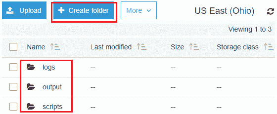

1.  在存储桶创建并准备好使用后，剩下的一个先决条件是创建一个密钥对，您可以使用它通过 SSH 访问 EC2 实例。确保密钥对是在与 EMR 集群相同的区域（此处为 **美国东部（俄亥俄州）**）中创建的。

既然先决条件已经处理完毕，我们终于可以开始设置 EMR 集群了！

1.  从 AWS 管理控制台中，使用筛选选项筛选并选择 Amazon EMR 服务。或者，可以通过选择此 URL 启动 Amazon EMR 仪表盘：[`us-east-2.console.aws.amazon.com/elasticmapreduce/home`](https://us-east-2.console.aws.amazon.com/elasticmapreduce/home)。

1.  由于这是我们第一次创建 EMR 集群，请选择“创建集群”选项开始。

1.  您可以通过两种方式配置 EMR 集群：快速简便的快速选项（默认显示给您），以及高级选项页面，在该页面上您可以选择并配置集群的各个项。在这种情况下，我们将选择进入高级选项。

1.  高级选项页面为我们提供了一个四步向导，基本上引导我们配置一个完全功能的 EMR 集群。首先，第一步是您可以选择并自定义要在 EMR 集群上安装的*软件*。

1.  从版本下拉列表中，选择您希望使用的 EMR 版本。本书写作时发布的最新版本是 `emr-5.11.1`。每个版本包含几个可供安装在集群上的分布式应用程序。例如，选择 emr-5.11.1（2018 年发布）包含 Hadoop v2.7.3、Flink v1.3.2、Ganglia v3.7.2、HBase v1.3.1 以及其他许多应用程序和软件。

要查看可用的 EMR 版本及其相关软件版本的完整列表，请访问：[`docs.aws.amazon.com/emr/latest/ReleaseGuide/emr-release-components.html`](https://docs.aws.amazon.com/emr/latest/ReleaseGuide/emr-release-components.html)。

1.  在这种情况下，我已经选择了我们在此场景中所需的基本应用程序，包括 Hadoop、Hive 和 Hue。根据您的需求，可以选择其他应用程序。

1.  接下来的几个部分是可选的，但了解它们的目的非常重要：

    +   **AWS Glue 数据目录设置**：在 EMR 版本 5.8.0 及以上版本中，您可以选择配置 Spark SQL 使用 AWS Glue 数据目录（外部 Hive 表）作为其元数据存储。

    +   **编辑软件设置**：您可以使用此选项覆盖某些应用程序的默认配置设置。通过提供一个 JSON 文件形式的配置对象来实现这一点。您可以选择输入配置或从 S3 加载 JSON 文件：

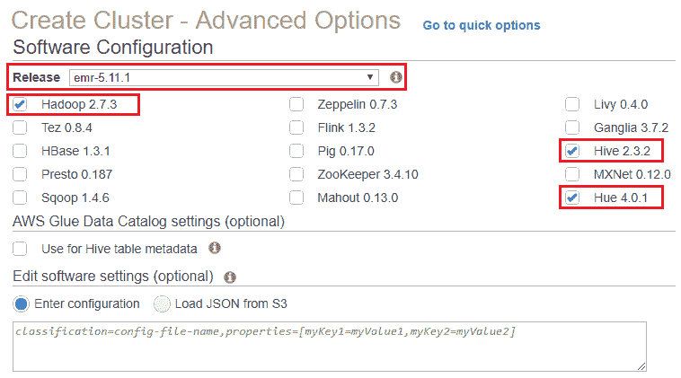

+   +   **添加步骤**：软件配置页面上的最后一个可选参数是*添加步骤*。如本章前面简要讨论的那样，步骤本质上是我们提交给集群的工作单元。它可以是从 S3 加载输入数据，或者处理并运行 MapReduce 作业在数据上。我们将在本章稍后更详细地探索步骤，因此请将此字段保持默认值，并选择“下一步”继续流程。

1.  高级选项向导的第二步是配置集群的硬件，或实例配置，以及集群的网络设置。

EMR 提供两种选项：实例舰队和实例组；下面简要解释：

+   +   **实例舰队**：实例舰队允许您为集群中存在的实例指定目标容量。通过此选项，您可以获得最多样化的实例配置选项，可以为节点利用混合实例类型，甚至为同一节点选择不同的购买选项。每创建一个实例舰队，您可以为按需实例和竞价实例设定目标容量。

每个节点类型（主节点、核心节点、任务节点）只能有一个实例舰队。

+   +   **实例组**：另一方面，实例组每个节点类型的可自定义配置选项较少。在实例组中，每个节点由相同的实例类型和相同的购买选项组成。集群创建过程中配置了这些设置后，无法更改；不过，您可以随时根据需要添加更多实例。

1.  对于这个特定的使用案例，我们将选择统一实例组，如下图所示：

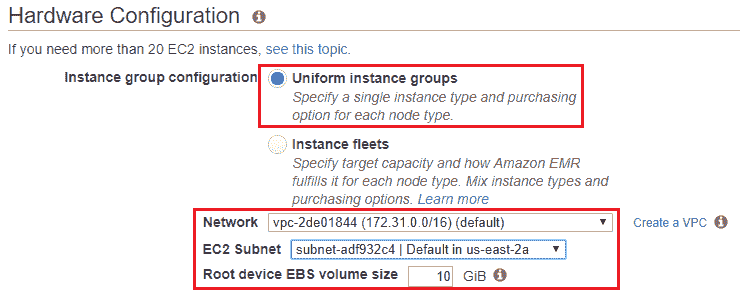

1.  接下来，从网络下拉列表中选择您希望启动 EMR 集群的适当*VPC*。您也可以选择使用旁边的“创建 VPC”选项为 EMR 创建一个新的 VPC。

1.  同样，从 EC2 子网下拉列表中选择适当的子网。

1.  最后，为集群中每个实例分配将要配置的根设备 EBS 卷的大小。您可以提供介于 10 GB 和 100 GB 之间的值。

1.  使用提供的编辑选项，您还可以为每个节点类型配置实例类型、实例数量以及购买选项，如下图所示。请注意，这些选项是因为我们选择了实例组作为首选的实例配置模式。如果选择了实例舰队选项，选项将会有所不同：

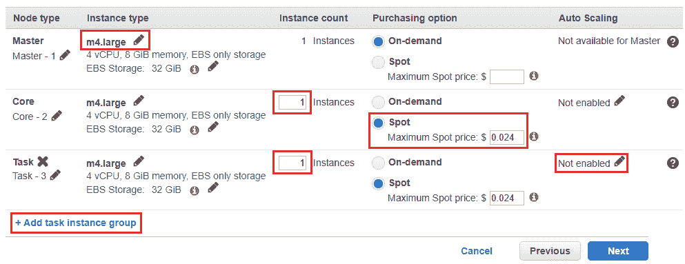

1.  您还可以选择启用核心和任务节点的自动扩展，通过在自动扩展列下选择“未启用”选项。随后，您也可以选择“添加任务实例组”选项来添加额外的任务实例组。完成后，选择“下一步”选项继续设置。

1.  高级选项中的第三步提供了您可以根据需求设置的一般配置。首先，提供一个合适的集群名称，然后选择“日志记录”选项来为您的 EMR 集群设置日志记录。使用文件夹选项浏览到我们新创建的 S3 存储桶，如下图所示：

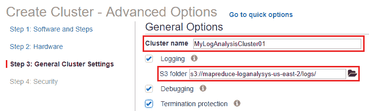

1.  您还可以启用“终止保护”选项，以防止集群被意外删除。

1.  接下来，集群“常规选项”页面上的最后一个配置项是引导操作。顾名思义，引导操作是您希望在集群实例启动时执行的脚本或代码。因此，当您需要向现有运行中的集群添加新实例时，这个功能非常有用。

默认情况下，引导操作是使用 Hadoop 用户执行的。您可以通过使用`sudo`命令切换到 root 权限。

您可以在实例上执行两种类型的引导操作：

+   +   运行时：运行时操作会在`instance.json`或`job-flow.json`文件中找到与*实例特定*相关的值时执行操作。这是一个预定义的引导操作，当您只希望在特定类型的实例上执行该操作时非常有用，例如，仅当实例类型为`master`时才执行引导操作。

    +   自定义操作：自定义操作利用您自己的脚本来执行定制的引导操作。

1.  要创建引导操作，从“添加引导操作”中选择“配置并添加”选项。确保在继续之前选择了“运行时”操作。

1.  这将弹出“添加引导操作”对话框，如下图所示。为您的运行时操作输入一个合适的名称。由于运行时操作是预定义的引导操作，因此脚本的位置不是可编辑字段。然而，您可以为脚本添加可选参数，如下所示。在此案例中，只有当实例是**主节点**时，运行时操作才会回显消息：

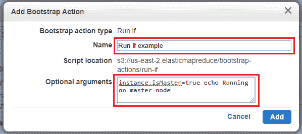

1.  完成后点击“添加”。类似地，您也可以通过将可执行脚本放置在我们在本章前置阶段创建的 Amazon S3 存储桶中，并提供该路径来添加自定义引导操作。

1.  进入集群创建过程的最后一步，在安全选项页面，你可以审查集群部署后将使用的各种权限、角色、身份验证和加密设置。从本章开始时创建的 EC2 密钥对开始。你还可以选择更改权限或使用默认提供的权限。

1.  完成后，点击 Create cluster 来完成过程。

集群的创建需要几分钟时间，具体取决于为集群选择的实例数量，以及要安装的软件。一旦完成，你可以使用 EMR 仪表板查看集群的健康状态和其他重要信息。

# 连接到你的 EMR 集群

一旦你已经配置好 EMR 集群，你应该能看到其状态从 Starting 变为 Bootstrapping，最终变为 Running。如果当前没有正在执行的任务，你的集群可能还会进入 Waiting 状态。此时，你可以开始使用 EMR 集群来运行各种任务和分析。但在此之前，以下是几种连接到正在运行的 EMR 集群的方法的简要介绍。

首先，通过简单的 SSH 连接到主节点。通过 SSH 连接到主节点可以用于监控集群、查看 Hadoop 的日志文件，甚至运行 Hive 或 Pig 编程的交互式 Shell：

1.  要做到这一点，请登录到你的 Amazon EMR 仪表板并从集群列表页面选择你新创建的集群名称。这将显示集群的详情页面，你可以在此管理和监控集群。

1.  接下来，复制主节点的公共 DNS 地址。复制后，打开 PuTTY 终端并将复制的公共 DNS 粘贴到主机名（或 IP 地址）字段中。

1.  将你与该 EMR 集群关联的密钥对转换为私钥，并通过在 SSH 部分选择 Auth 选项，将该私钥附加到 PuTTY 中。

1.  完成后，点击 Open 以建立连接。在证书对话框中，接受证书并在提示时输入 `Hadoop` 作为用户名。你应该能够获得对集群主节点的 SSH 访问权限！

同样的操作也可以通过 AWS CLI 执行：

1.  从终端中，首先输入以下命令来获取正在运行的集群 ID。集群 ID 将是 `j-XXXXXXXX` 这种格式：

```
# aws emr list-clusters 
```

1.  要列出在集群中运行的实例，可以使用从上一条命令输出中获取的集群 ID，执行以下命令：

```
# aws emr list-instances --cluster-id <CLUSTER_ID>
```

从此命令的输出中复制 `PublicDnsName` 值。然后，你可以使用以下命令集来获取对主节点的访问权限。

1.  确保集群的私钥具有必要的权限：

```
# chmod 400 <PRIVATEKEY.pem>
```

1.  完成后，使用以下命令 SSH 连接到主节点：

```
# ssh hadoop@<PUBLIC_DNS_NAME> -i <PRIVATEKEY.pem>
```

你还可以通过一些简单的步骤连接到各种应用程序的 Web 界面，例如 *Hue* 或 *Hadoop HDFS NameNode*：

1.  开始之前，您再次需要获取主节点的公共 DNS 名称。您可以从 EMR 仪表板获取该名称，或使用我们刚才介绍的 CLI 步骤。

1.  接下来，使用 PuTTY，将公共 DNS 名称粘贴到“主机名（或 IP 地址）”字段中，如之前所做的那样。也使用“身份验证”选项浏览并加载私钥。

1.  在 PuTTY 的导航窗格中，选择 SSH 选项，并选择“隧道”。

1.  填写以下列表中提到的所需信息：

    +   将源端口字段设置为 `8157`

    +   启用动态和自动选项

1.  完成后，选择“添加”并最终点击“打开”连接。

这种隧道或端口转发方式非常关键，因为网页界面只能通过主节点的本地 Web 服务器进行查看。完成后，启动您喜欢的浏览器并查看相应的网页界面，如下所示：

+   要访问 Hue，请在您的网页浏览器中输入以下内容：

```
http://<PUBLIC_DNS_NAME>:8888/
```

+   要访问 Hadoop HDFS NameNode，请输入以下内容：

```
http:// <PUBLIC_DNS_NAME>::50070/
```

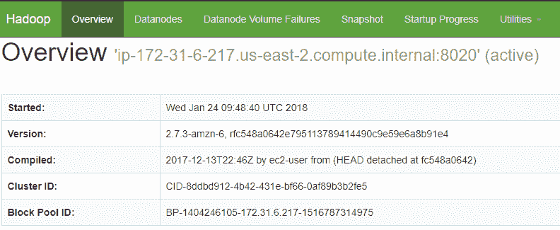

您甚至可以使用 CLI 来创建隧道。为此，请在以下命令中替换公共 DNS 名称和私钥值：

```
# ssh -i <PRIVATEKEY.pem> -N -D 8157 hadoop@<PUBLIC_DNS_NAME> 
```

`-D` 标志表示端口转发是动态的。

# 在集群上运行作业

在建立连接后，您现在可以在集群上作为一个或多个步骤执行作业。在本节中，我们将通过一个简单的示例演示步骤的工作流程，该示例涉及处理一些 Amazon CloudFront 日志。示例数据和脚本的详细信息可以在此找到：[`docs.aws.amazon.com/emr/latest/ManagementGuide/emr-gs-prepare-data-and-script.html`](https://docs.aws.amazon.com/emr/latest/ManagementGuide/emr-gs-prepare-data-and-script.html)。您也可以使用类似的技术和基础，创建并执行您自己的作业：

1.  要开始作业，请在 EMR 仪表板中从“集群列表”页面选择您的集群名称。这将打开新创建集群的详细信息页面。在此页面中，选择“步骤”标签。

1.  由于这是我们的第一个步骤，请继续点击“添加步骤”选项。这将弹出“添加步骤”对话框，如下图所示。根据描述填写所需的信息，所有字段填写完毕后，点击“添加”以完成步骤创建：

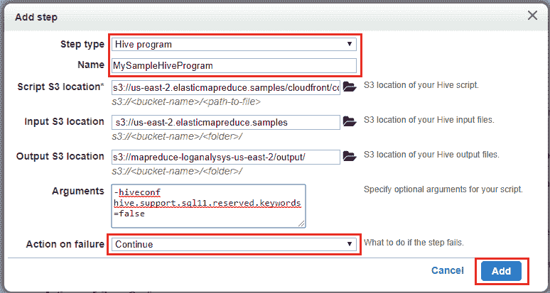

+   +   步骤类型：您可以选择各种选项，如流式程序，它会提示您提供 `Mapper` 和 `Reducer` 函数的详细信息，或者您也可以选择 Hive 程序、Pig 程序、Spark 程序或自定义应用程序。在此案例中，我们选择 Hive 程序选项。

    +   名称：为您的步骤选择一个合适的名称。

    +   脚本 S3 位置：在此提供 Hive 脚本的位置。由于我们使用的是预定义脚本，只需将 `<REGION>` 字段替换为您 EMR 所在的操作区域：`s3://<REGION>.elasticmapreduce.samples/cloudfront/code/Hive_CloudFront.q`。

    +   输入 S3 位置：在此处提供输入数据文件的位置。将 `<REGION>` 占位符替换为你 EMR 的操作区域，如之前所做的那样：`s3://<REGION>.elasticmapreduce.samples`。

    +   输出 S3 位置：指定处理后的输出文件存储位置。在这种情况下，我使用的是我们在 EMR 集群创建过程中作为先决步骤创建的自定义 S3 存储桶。你也可以提供任何其他替代存储桶。

    +   参数：你可以使用此字段提供脚本运行所需的任何可选参数。在这种情况下，复制并粘贴以下内容：`-hiveconf hive.support.sql11.reserved.keywords=false`。

    +   失败时的操作：你可以选择在步骤执行失败时 EMR 应该采取的措施。在这种情况下，我们选择了默认的 **Continue** 值。

1.  填写所需字段后，点击 **Add** 完成此过程。

该步骤现在开始在 EMR 集群上执行提供的脚本。你可以通过查看步骤状态从 **Pending** 到 **Running** 再到 **Completed** 的变化，来查看进度，如下图所示：

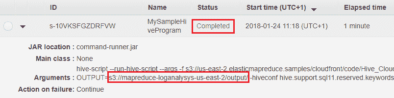

一旦作业完成执行，返回到 Amazon S3 的输出存储桶并查看处理结果。在这种情况下，输出包含对 CloudFront 发出的访问请求的数量，并按操作系统进行排序。

# 监控 EMR 集群

EMR 仪表板提供了丰富的功能集，借此你可以在一个地方管理和监控 EMR 集群。你还可以查看日志，并利用 Amazon CloudWatch 跟踪集群的性能。

本节将介绍几种简单的方法，帮助你监控 EMR 集群。首先，让我们看看如何通过 EMR 仪表板来监控集群的状态：

1.  在 EMR 仪表板中，从集群列表页面选择你的集群名称。这将打开新创建的集群的详情页面。在这里，选择 **Events** 标签，如下图所示：

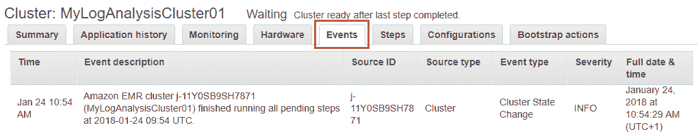

**Events** 标签允许你查看集群记录的事件。你可以使用此功能查看由集群、运行的应用程序、步骤执行等生成的事件。

1.  仪表板还提供了关于集群在一段时间内性能的深入分析。要查看性能指标，请从集群详情页面选择 **Monitoring** 标签。

在这里，你可以查看有关集群的基本信息和状态，包括运行中的节点，以及底层的 I/O 和数据存储。

1.  或者，你也可以使用 Amazon CloudWatch 来查看和监控集群的各种指标。为此，通过选择以下 URL 启动 Amazon CloudWatch 仪表板：[`console.aws.amazon.com/cloudwatch/home`](https://console.aws.amazon.com/cloudwatch/home)。

1.  接下来，在导航面板中选择“Metrics”选项以查看与 EMR 相关的所有指标。如果您在同一环境中运行多个集群，可以使用`JobFlowID`维度来过滤 EMR 集群。

以下是一些值得监控的重要 EMR 指标列表：

| **指标名称** | **指标描述** |
| --- | --- |
| `AppsFailed` | 提交到 EMR 集群的应用程序中未能完成的数量。此应用程序状态由 YARN 内部监控并报告。 |
| `MRUnhealthyNodes` | 标记为`UNHEALTHY`状态的可用于 MapReduce 作业的节点数量。 |
| `MRLostNodes` | 被标记为`LOST`状态的 MapReduce 分配的节点数量。 |
| `CorruptBlocks` | HDFS 报告为损坏的块数量。 |

您可以在以下链接查看监控的所有指标列表：[`docs.aws.amazon.com/emr/latest/ManagementGuide/UsingEMR_ViewingMetrics.html`](https://docs.aws.amazon.com/emr/latest/ManagementGuide/UsingEMR_ViewingMetrics.html)。

1.  一旦确定了某个指标，选择该指标并点击“Graphed metrics”标签页。在这里，选择“Create alarm”选项，在“Actions”栏下创建并设置报警阈值及其对应的动作。

通过这种方式，您还可以利用 Amazon CloudWatch 事件定期监控集群生成的事件。然而，请记住，EMR 只会追踪并记录七天内的事件。至此，我们已经结束了这一部分内容，接下来将介绍另一项非常棒的分析服务——Amazon Redshift！

# 介绍 Amazon Redshift

Amazon Redshift 是 AWS 提供的**数据库即服务**（**DBaaS**）之一，它以显著更低的成本提供可大规模扩展的数据仓库作为托管服务。该数据仓库基于开源 PostgreSQL 数据库技术，但并非所有在 PostgreSQL 中提供的功能都能在 Amazon Redshift 中找到。以下是使用 Amazon Redshift 时需要牢记的一些基本概念和术语：

+   **集群**：与 Amazon EMR 类似，Amazon Redshift 也依赖于集群的概念。集群是包含一个或多个实例或计算节点以及一个负责集群整体管理的 Leader 节点的逻辑容器。以下是每个节点提供的简要说明：

    +   **Leader 节点**：Leader 节点是集群中唯一的节点，负责协调和执行各种数据库操作，并促进数据库与关联客户端程序之间的通信。

    +   **计算节点**：计算节点负责执行由主节点提供的代码。执行完毕后，计算节点将结果返回给主节点进行汇总。Amazon Redshift 支持两种类型的计算节点：密集存储节点和密集计算节点。密集存储节点提供标准的硬盘驱动器，用于创建大型数据仓库；而密集计算节点提供更高性能的 SSD。您可以首先使用一个提供 160 GB 存储的单节点，并通过利用一个或多个 16 TB 容量实例来扩展至 PB 级别。

+   **节点切片**：每个计算节点根据集群的初始大小，被主节点划分为一个或多个更小的块或切片。每个切片包含一部分计算节点的内存、CPU 和磁盘资源，并利用这些资源处理分配给它的特定工作负载。工作负载的分配同样由主节点执行。

+   **数据库**：如前所述，Amazon Redshift 提供了一个可扩展的数据库，您可以利用它来进行数据仓库和分析用途。每个在 Redshift 中启动的集群，您都可以创建一个或多个关联的数据库。该数据库基于开源关系数据库 PostgreSQL（v8.0.2），因此可以与其他 RDBMS 工具和功能结合使用。应用程序和客户端可以通过标准的 PostgreSQL JDBC 和 ODBC 驱动与数据库进行通信。

这里是一个由 Amazon Redshift 提供支持的、工作中的数据仓库集群的示意图：

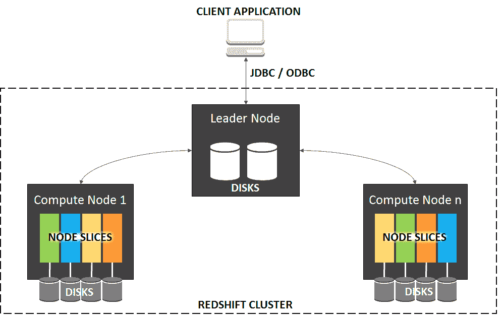

在了解了这些基本信息后，接下来让我们看看一些简单易行的步骤，您可以通过这些步骤设置并启动您的 Amazon Redshift 集群。

# 开始使用 Amazon Redshift

在本节中，我们将介绍几个简单的步骤，通过这些步骤，您可以在几分钟内启动并运行一个完整的 Amazon Redshift 集群：

1.  首先，我们有几个前提步骤需要在开始实际设置 Redshift 集群之前完成。从 AWS 管理控制台中，使用过滤选项筛选出 IAM。或者，您也可以通过选择此 URL 启动 IAM 仪表盘：[`console.aws.amazon.com/iam/`](https://console.aws.amazon.com/iam/)。

1.  登录后，我们需要创建并分配一个角色，使我们的 Redshift 集群能够获得对 Amazon S3 存储桶的只读访问权限。这个角色将在本章后面加载一些示例数据到 Amazon S3 存储桶，并使用 Amazon Redshift 的 `COPY` 命令将数据复制到 Redshift 集群中进行处理时派上用场。要创建自定义角色，请从 IAM 仪表盘的导航面板中选择角色（Role）选项。

1.  在角色（Roles）页面，选择创建角色（Create role）选项。这将弹出一个简单的向导，我们将使用它创建并关联所需的权限到我们的角色。

1.  在 AWS 服务组部分，选择 Redshift 选项，并在“选择您的用例”字段下选择 Redshift - 可自定义选项。点击下一步以继续设置。

1.  在“附加权限策略”页面，筛选并选择 AmazonS3ReadOnlyAccess 权限。完成后，选择下一步：审查。

1.  在最终的审查页面，输入一个合适的角色名称，并选择“创建角色”选项以完成该过程。请记下角色的 ARN，因为后续步骤中将需要使用它。以下是角色策略的片段供参考：

```
{ 
  "Version": "2012-10-17", 
  "Statement": [ 
    { 
      "Effect": "Allow", 
      "Action": [ 
        "s3:Get*", 
        "s3:List*" 
      ], 
      "Resource": "*" 
    } 
  ] 
} 
```

创建角色后，我们可以继续创建 Redshift 集群。

1.  为此，登录到 AWS 管理控制台，并使用筛选选项筛选出 Amazon Redshift。或者，您也可以通过选择以下 URL 启动 Redshift 仪表板：[`console.aws.amazon.com/redshift/`](https://console.aws.amazon.com/redshift/)。

1.  选择启动集群以开始该过程。

1.  接下来，在“集群详情”页面，填写与您的集群相关的必要信息，如下所述：

    +   集群标识符：为您的新 Redshift 集群指定一个合适的名称。请注意，此名称仅支持*小写*字母。

    +   数据库名称：为您的 Redshift 数据库指定一个合适的名称。您可以在以后阶段随时在一个 Redshift 集群内创建更多数据库。如果未提供值，则会默认创建一个名为`dev`的数据库：

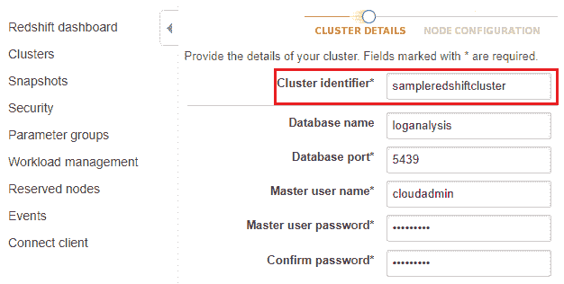

+   +   数据库端口：数据库接受连接的端口号。默认情况下，值设置为`5439`，但是您可以根据安全需求更改此值。

    +   主用户名：为访问数据库提供一个合适的用户名。

    +   主用户密码：输入一个强密码，至少包含一个大写字母、一个小写字母和一个数字值。在确认密码字段中重新输入密码以确认。

1.  完成后，点击继续以进入向导的下一步。

1.  在“节点配置”页面，选择适合您集群的节点类型，以及根据功能需求选择集群类型。由于这个集群设置用于演示目的，我选择了 dc2.large 作为节点类型，并选择了一个单节点部署，包含*1*个计算节点。完成后点击继续进入下一页面。

这里需要特别注意的是，您即将启动的集群将是实时集群，而不是在类似沙盒的环境中运行。因此，您将按标准的 Amazon Redshift 使用费用计费，直到您删除该集群。您可以阅读更多关于 Redshift 定价的信息：[`aws.amazon.com/redshift/pricing/`](https://aws.amazon.com/redshift/pricing/)。

1.  在“附加配置”页面，你可以配置附加设置，如启用加密、为集群选择默认 VPC、是否允许集群直接访问互联网，以及选择特定的可用区供集群运行。大多数这些设置目前无需更改，可以保留默认值。

1.  本页面所需的唯一更改是将之前创建的 IAM 角色与集群关联。为此，从可用角色下拉列表中选择我们在先决条件部分创建的自定义 Redshift 角色。完成后，点击“继续”。

1.  在“审查”页面查看设置和更改，完成后选择“启动集群”选项。

集群的启动可能需要几分钟，具体取决于你选择的是单实例部署还是多实例部署。启动完成后，你应该能在“集群”页面看到你的集群，正如下图所示。确保你的集群在“数据库健康”列中显示为健康状态。你还可以记下集群的端点，方便后续通过编程方式访问：

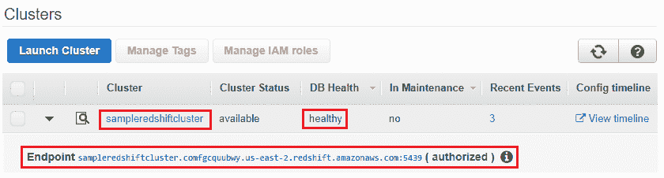

在集群设置完成后，接下来要做的就是连接到它。在接下来的章节中，我们将介绍一些简单的步骤，帮助你连接到新部署的 Redshift 集群。

# 连接到你的 Redshift 集群

一旦集群启动并运行，你可以使用多种工具连接到它。大多数这些工具都符合 PostgreSQL 标准，并且可以轻松购买到。在本例中，我们将安装并使用一个开源的 SQL 客户端工具，叫做**SQL Workbench/J**。

首先，你需要在本地工作站安装 Java 运行时环境。Java 运行时版本必须与 SQL Workbench/J 的要求*匹配*，否则它将无法正常工作。如果你正在使用 Linux 操作系统，可以通过在终端输入以下命令来检查本地桌面上已安装的 Java 运行时版本，或者通过在控制面板中查找 Java 配置来查看版本：

```
# java --version
```

在这种情况下，我们使用的是一台普通的 Windows 桌面来安装 SQL Workbench/J。从这里下载正确版本的软件：[`www.sql-workbench.net/downloads.html`](http://www.sql-workbench.net/downloads.html)。

软件下载完成后，安装过程相当简单。接受最终用户许可协议，选择软件安装路径，完成即可！此时，SQL Workbench/J 应该已成功安装并运行：

1.  要将 SQL Workbench/J 连接到你的 Redshift 集群，你需要新创建的数据库的 JDBC URL。你可以通过选择 Redshift 导航窗格中的“连接客户端”选项，并从“获取集群连接 URL”部分选择你刚部署的集群来复制该 URL，如下图所示：

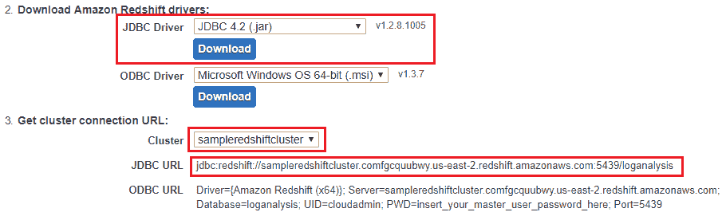

1.  你还需要从相同页面下载正确版本的 Amazon Redshift JDBC 驱动程序 JAR。

1.  完成后，从 SQL Workbench/J 客户端中选择“文件”，然后选择“连接窗口”选项。

1.  在这里，点击“创建新连接配置文件”以开始操作。这将弹出一个“新建配置文件”框，您需要为此新配置文件输入名称。

1.  创建配置文件后，选择“管理驱动程序”选项。这将显示“管理驱动程序”对话框，如下截图所示。选择“Amazon Redshift”选项，并为你的连接驱动程序提供一个合适的名称。点击浏览图标并选择我们从 Redshift 下载的 Amazon Redshift 驱动程序 JAR 文件。点击确定以完成驱动程序设置：


1.  配置好驱动程序后，最后要做的就是连接到数据库并进行测试。为此，选择 SQL Workbench/J 中新创建的连接配置文件，并将复制的数据库 JDBC URL 粘贴到 URL 字段中，如所示。提供数据库的用户名和密码，密码是集群设置过程中配置的。同时，确保选中“自动提交”选项，如图所示：

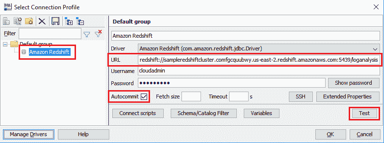

1.  你还可以通过在 SQL Workbench/J 屏幕上选择“测试”选项来测试连接。完成后，点击确定以建立连接并打开 SQL 提示符。

完成这一步后，你应该已经将正在运行的 Redshift 集群连接到 SQL Workbench/J 客户端。接下来的最后一步是执行一些示例查询并测试集群的功能，快开始吧！

# 使用 Redshift 数据库和表

在开始查询 Redshift 数据库之前，我们首先需要将一些数据上传到它。对于这个特定的场景，我们将使用一小部分来自佛罗里达州 NASA 肯尼迪航天中心的 HTTP 请求日志。这些数据可以公开使用，并可以从这里下载：[`ita.ee.lbl.gov/html/contrib/NASA-HTTP.html`](http://ita.ee.lbl.gov/html/contrib/NASA-HTTP.html)。

日志文件基本包含以下列集：

+   主机：向 web 服务器发出 web 请求的主机。此字段还包含完全限定的主机名或 IP 地址。

+   时间戳：特定 web 请求的时间戳。格式为 `DAY MON DD HH:MM:SS YYYY`。此时间戳使用 24 小时制。

+   请求：用于请求服务器的方法（`GET`/`HEAD`/`POST`）。

+   URL：客户端请求的资源 URL。

+   响应：包含 HTTP 响应代码（`200`、`302`、`304` 和 `404`）。

+   字节数：回复的字节大小。

以下是数据片段供你参考：

```
pppa006.compuserve.com,807256800,GET,/images/launch-logo.gif,200,1713 
vcc7.langara.bc.ca,807256804,GET,/shuttle/missions/missions.html,200,8677 
pppa006.compuserve.com,807256806,GET,/history/apollo/images/apollo-logo1.gif,200,1173 
```

你可以通过以下链接下载本场景使用的示例 CSV 文件（2.14 MB，包含 30,970 条记录）：

[`github.com/yoyoclouds/Administering-AWS-Volume2.`](https://github.com/yoyoclouds/Administering-AWS-Volume2)

下载文件后，你只需将其上传到你的其中一个 Amazon S3 存储桶。记住，该存储桶应该能够被 Amazon Redshift 访问，否则你可能会在执行过程中遇到 `S3ServiceException: Access Denied` 异常。

接下来，从 SQL Workbench/J 客户端输入以下代码，以在我们的 Redshift 数据库中创建新表：

```
create table apachelogs( 
host varchar(100), 
time varchar(20), 
method varchar(8), 
url varchar(200), 
response varchar(10), 
bytes varchar(10)); 
```

你可以在以下链接找到前面代码的完整副本：[`github.com/yoyoclouds/Administering-AWS-Volume2`](https://github.com/yoyoclouds/Administering-AWS-Volume2)。

选择“执行查询”按钮。你应该会收到一个输出，显示表格已创建，如下截图所示：

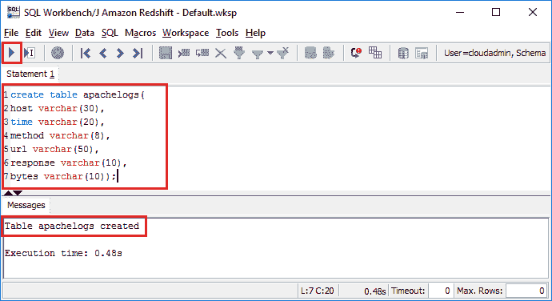

接下来，使用 `COPY` 命令将存储在 Amazon S3 中的数据文件内容加载到新创建的 Redshift 表中。`COPY` 命令是一个非常灵活的命令，可以用于从 Amazon S3、Amazon EMR，甚至是 Amazon DynamoDB 表加载数据到 Amazon Redshift。要了解更多关于 `COPY` 命令的信息，请访问此 URL：[`docs.aws.amazon.com/redshift/latest/dg/r_COPY.html`](https://docs.aws.amazon.com/redshift/latest/dg/r_COPY.html)。

用新创建的表名替换 `<REDSHIFT_TABLE_NAME>` 的值，用包含数据文件的 S3 存储桶名称替换 `<BUCKET_NAME>`，并用我们在 Amazon Redshift 先决条件过程中创建的 IAM 只读访问角色 ARN 替换 `<REDSHIFT_IAM_ROLE_ARN>`：

```
copy <REDSHIFT_TABLE_NAME> from 's3://<BUCKET_NAME>/data.csv'  
credentials 'aws_iam_role=<REDSHIFT_IAM_ROLE_ARN>'  
csv; 
```

一旦代码粘贴到 SQL Workbench/J 中，点击“执行查询”按钮。以下是来自 SQL Workbench/J 的命令执行快照：

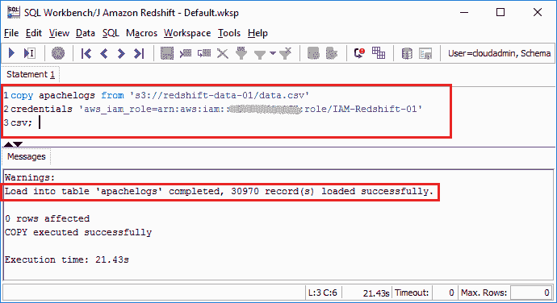

数据加载完成后，你可以使用简单的查询来查询数据集，如本节所述。以下命令将列出表中的所有 30,970 条记录：

```
select * from apachelogs;
```

以下命令将只列出那些响应值为 `404` 的记录：

```
select * from apachelogs where response=404; 
```

以下命令将列出所有请求了特定资源的主机：

```
select host from apachelogs where url='/images/NASA-logosmall.gif'; 
```

你还可以使用 Redshift 仪表板来查看每个单独查询的性能和运行时，首先在集群页面选择你的 Redshift 集群名称。接下来，选择“查询”标签，列出最近执行的查询，如下图所示：

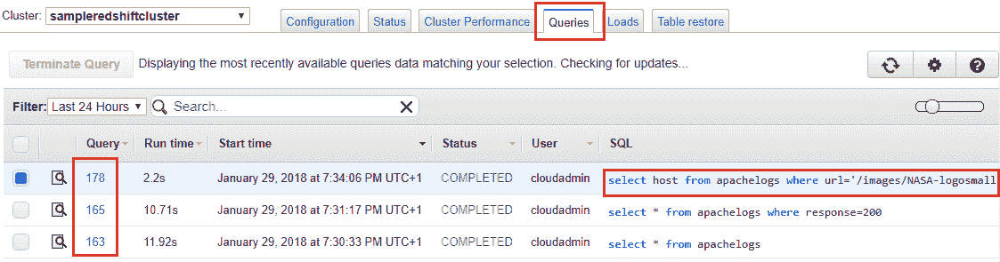

你也可以通过进一步选择 *查询标识符* 来深入查看每个查询。

# 规划你的下一步

在我们通过总结本章来结束之前，我强烈建议你尝试一些与 Amazon EMR 和 Amazon Redshift 相关的功能。首先是 EMRFS。

在决定选择哪种文件系统来部署 EMR 集群时，我们简要介绍了 EMRFS 主题。**EMR 文件系统**（**EMRFS**）是传统 HDFS 的一种实现，它允许从 Amazon EMR 直接读取和写入 Amazon S3 中的文件。这本质上让你能够利用 S3 提供的一致性以及其其他一些功能，如数据加密。要了解更多关于 EMRFS 以及如何在 EMR 集群中使用它的信息，请访问：[`docs.aws.amazon.com/emr/latest/ManagementGuide/emr-fs.html`](https://docs.aws.amazon.com/emr/latest/ManagementGuide/emr-fs.html)。

其次，Amazon EMR 还提供了以 MapR 形式提供的企业级 Hadoop 发行版。MapR 发行版的 Hadoop 为你提供了丰富的功能，增强了你在构建分布式应用程序以及管理整个 Hadoop 集群时的整体体验。例如，选择 MapR 作为 Hadoop 发行版提供对行业标准接口（如 NFS 和 ODBC）的支持，通过这些接口，你可以将 EMR 集群与任何主要的 BI 工具（包括 Tableau 和 Toad）连接。MapR 还提供内建的高可用性、数据保护、更高的性能和一系列额外功能。你可以在以下链接中了解更多关于 EMR 中 MapR 发行版的内容：[`docs.aws.amazon.com/emr/latest/ManagementGuide/emr-mapr.html`](https://docs.aws.amazon.com/emr/latest/ManagementGuide/emr-mapr.html)。

最后但同样重要的是，我还推荐你尝试使用 Amazon Redshift 的一些高级功能，如保留节点和参数组。参数组本质上是一组在数据库创建时应用的参数。你可以通过从 Redshift 的导航面板中选择“参数组”选项来查找你现有数据库的参数组。你可以根据需求使用并调整这些参数组，以便微调和定制数据库。要了解如何利用参数组进行数据库调优，请访问：[`docs.aws.amazon.com/redshift/latest/mgmt/working-with-parameter-groups.html`](https://docs.aws.amazon.com/redshift/latest/mgmt/working-with-parameter-groups.html)。

# 总结

好的，这就带我们走到了又一章的结束。让我们快速总结一下目前为止学到的内容！

一开始，我们通过学习 AWS 为大数据分析提供的各种服务，随后快速浏览了 Amazon EMR 的入门指南。我们了解了一些 Amazon EMR 的概念，并启动了我们的第一个 EMR 集群。我们还在 EMR 集群上运行了第一个简单作业，并学会了如何使用 Amazon CloudWatch 等工具监控其性能。

在本章的末尾，我们了解了 Amazon Redshift 及其核心概念和工作原理。我们还创建了我们的第一个 Redshift 集群，使用开源客户端连接并运行了几条 SQL 查询。

在下一章，我们将学习和探索另一个旨在进行数据协调的 AWS 服务，敬请期待，我们还有很多内容要学习！
