# 使用 AWS Data Pipeline 编排数据

在上一章中，我们深入探讨了 AWS 分析套件服务，详细了解了 Amazon EMR 和 Amazon Redshift 服务。

在本章中，我们将继续学习一个极其灵活且强大的数据编排和转换服务——AWS Data Pipeline。

让我们快速了解一下本章将涵盖的各个主题：

+   介绍 AWS Data Pipeline，并快速了解其一些概念和术语

+   使用简单的 Hello World 示例开始使用 Data Pipeline

+   使用 Data Pipeline 定义文件

+   使用数据管道在远程 EC2 实例上执行脚本和命令

+   使用简单的参数化数据管道将数据从一个 S3 桶备份到另一个

+   使用 AWS CLI 构建管道

那么，废话不多说，我们马上开始吧！

# 介绍 AWS Data Pipeline

AWS Data Pipeline 是一个极为灵活的 Web 服务，允许您在各种 AWS 服务和本地数据源之间双向传输数据。该服务专为提供内建的容错性和高可用性平台而设计，您可以利用它来定义并构建您自己的定制数据迁移工作流。AWS Data Pipeline 还提供了附加功能，如调度、依赖关系追踪和错误处理，使您无需花费额外的时间和精力自行编写这些功能。这个易于使用且灵活的服务，结合其低运营成本，使 AWS Data Pipeline 成为以下使用场景的理想选择：

+   定期将数据从 Amazon EMR 集群迁移到 Amazon Redshift 进行数据仓储

+   将存储在 Amazon S3 中的文件增量加载到 Amazon RDS 数据库中

+   将数据从 Amazon MySQL 数据库复制到 Amazon Redshift 集群

+   将数据从 Amazon DynamoDB 表备份到 Amazon S3

+   定期备份存储在 Amazon S3 桶中的文件，等等

在本节中，我们将通过先了解一些 AWS Data Pipeline 的内部组件、概念和术语，来进一步理解和学习 AWS Data Pipeline。

AWS Data Pipeline 的核心基础，如其名所示，就是一个管道。您可以创建管道来安排和执行数据迁移或转换任务。每个管道依赖于一个管道定义，该定义本质上包含了驱动数据迁移活动所需的业务逻辑。我们将在接下来的章节中深入学习管道定义。现在，让我们先来了解一些基本的管道概念和组件：

+   **管道组件**：单个管道可以包含多个部分，每个部分在整个管道的运行中都有其特定的位置。例如，管道可以包含指定输入数据源的部分，用于收集数据、在数据上执行的活动以及一些必要的条件、活动触发的时间等等。这些部分每个单独被称为管道的组件，并一起使用来构建管道定义。

+   **任务执行器**：任务执行器是执行管道中分配任务的特殊应用程序或代理。任务执行器轮询 AWS Data Pipeline，查看是否有可用的活动任务。如果发现，任务会分配给任务执行器并执行。一旦执行完成，任务执行器会将状态（成功或失败）报告回 AWS Data Pipeline。默认情况下，AWS 为通过 AWS Data Pipeline 启动和管理的资源提供了一个默认的任务执行器。您还可以在自己管理的实例或本地服务器上安装任务执行器：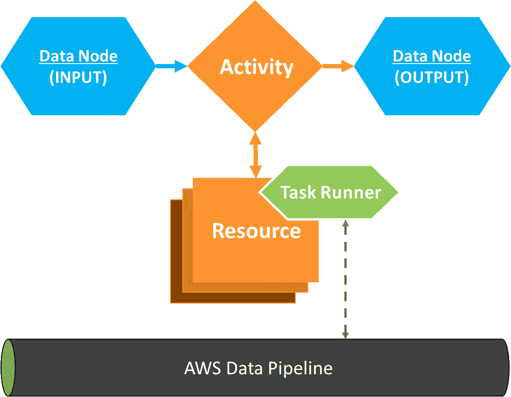

+   **数据节点**：数据节点用于定义管道的输入和输出数据的位置及类型。目前，AWS Data Pipeline 提供了以下数据节点：

    +   `S3DataNode`：用于将 Amazon S3 位置定义为存储数据的输入或输出

    +   `SqlDataNode`：定义 SQL 表或数据库查询供管道使用

    +   `RedshiftDataNode`：用于将 Amazon Redshift 表定义为管道的输入或输出

    +   `DynamoDBDataNode`：用于指定 DynamoDB 表作为管道的输入或输出

+   **活动**：通过使用数据节点选择数据的位置和类型，接下来需要定义的是在该数据上执行的活动类型。AWS Data Pipeline 提供了一组预包装的活动，您可以根据需要使用并扩展：

    +   `CopyActivity`：用于将数据从一个数据节点复制到另一个数据节点

    +   `ShellCommandActivity`：用于将 Shell 命令作为活动执行

    +   `SqlActivity`：在如`SqlDataNode`或`RedhsiftDataNode`等数据节点上执行 SQL 查询

    +   `RedshiftCopyActivity`：一种特定的活动，利用 `COPY` 命令在 Redshift 表之间复制数据

    +   `EmrActivity`：用于运行 EMR 集群

    +   `PigActivity`：用于在 EMR 集群上运行自定义 Pig 脚本

    +   `HiveActivity`：在 EMR 集群上运行 Hive 查询

    +   `HiveCopyActivity`：用于运行 Hive `COPY` 查询，将数据从 EMR 集群复制到 Amazon S3 桶或 Amazon DynamoDB 表

+   **资源**：选择数据节点和活动之后，配置管道的下一步是选择适当的资源来执行活动。AWS Data Pipeline 支持两种类型的资源：

    +   `Ec2Resource`：EC2 实例用于执行管道中选定的活动。此资源类型常用于诸如`CopyActivity`、`ShellCommandActivity`等活动。

    +   `EmrCluster`：Amazon EMR 集群用于执行管道中选定的活动。此资源最适用于诸如`EmrActivity`、`PigActivity`、`HiveActivity`等活动。

+   **操作**：操作是在管道中，当发生*成功*、*失败*或*延迟活动*事件时，管道采取的某些步骤。您可以使用操作作为监控和通知管道执行状态的一种方式；例如，在`CopyActivity`失败时发送 SNS 通知等。

完成了这些概念和术语后，接下来让我们进行一些实际操作，创建我们第一个简单且简洁的管道。

# 开始使用 AWS Data Pipeline

创建您自己的管道是一个相对简单的过程，一旦您了解了与管道仪表板互动的复杂性。在本节中，我们将探索 AWS 数据管道仪表板、它的各种功能和编辑器，以创建一个简单的“Hello World”示例管道。首先，以下是您需要首先完成的几个必要的先决步骤，从创建一个简单的 Amazon S3 存储桶来存储我们所有的数据管道日志开始。

AWS Data Pipeline 仅在 EU（爱尔兰）、亚太地区（悉尼）、亚太地区（东京）、美国东部（北弗吉尼亚）和美国西部（俄勒冈）区域提供。为了本章中的情景，我们只使用美国东部（北弗吉尼亚）区域。

从 AWS 管理控制台，您可以通过从“筛选”选项中筛选服务名称，或直接访问以下 URL 来启动 Amazon S3 控制台：[`s3.console.aws.amazon.com/s3/home?region=us-east-1`](https://s3.console.aws.amazon.com/s3/home?region=us-east-1)。

接下来，选择“创建存储桶”选项，并在“存储桶名称”字段中提供一个合适的值。将其他字段保持默认值，然后选择“创建”以完成该过程。

创建好日志存储桶后，接下来的先决步骤是创建几个 AWS Data Pipeline 所需的 IAM 角色，以便访问资源，以及它可以对这些资源执行的具体操作。由于我们将使用 AWS Data Pipeline 控制台来构建我们的第一个管道，Data Pipeline 提供了两个默认的 IAM 角色，您可以直接使用：

+   `DataPipelineDefaultRole`：一个 IAM 角色，授予 AWS Data Pipeline 访问所有 AWS 资源的权限，包括 EC2、IAM、Redshift、S3、SNS、SQS 和 EMR。您可以自定义该角色以限制 Data Pipeline 可以访问的 AWS 服务。以下是创建的策略片段：

```
{ 
    "Version": "2012-10-17", 
    "Statement": [ 
        { 
            "Effect": "Allow", 
            "Action": [ 
                "cloudwatch:*", 
                "datapipeline:DescribeObjects", 
                "datapipeline:EvaluateExpression", 
                "dynamodb:BatchGetItem", 
                "dynamodb:DescribeTable", 
                "dynamodb:GetItem", 
                ... 
                "ec2:RunInstances", 
                "ec2:StartInstances", 
                "ec2:StopInstances", 
                ... 
                "elasticmapreduce:*", 
                "iam:GetInstanceProfile", 
                "iam:GetRole", 
                "iam:GetRolePolicy", 
                ...   
                "rds:DescribeDBInstances", 
                "rds:DescribeDBSecurityGroups", 
                "redshift:DescribeClusters", 
                "redshift:DescribeClusterSecurityGroups", 
                "s3:CreateBucket", 
                "s3:DeleteObject", 
                "s3:Get*", 
                "s3:List*", 
                "s3:Put*", 
                ... 
                "sns:ListTopics", 
                "sns:Publish", 
                "sns:Subscribe", 
                ... 
                "sqs:GetQueue*", 
                "sqs:PurgeQueue", 
                "sqs:ReceiveMessage" 
            ], 
            "Resource": [ 
                "*" 
            ] 
        }, 
        { 
            "Effect": "Allow", 
            "Action": "iam:CreateServiceLinkedRole", 
            "Resource": "*", 
            "Condition": { 
                "StringLike": { 
                    "iam:AWSServiceName": [ 
                        "elasticmapreduce.amazonaws.com", 
                        "spot.amazonaws.com" 
                    ] 
                } 
            } 
        } 
    ] 
}
```

+   `DataPipelineDefaultResourceRole`：此角色允许在数据管道资源（EC2/EMR 实例）上执行的应用程序、脚本或代码访问您的 AWS 资源：

```
{ 
    "Version": "2012-10-17", 
    "Statement": [ 
        { 
            "Effect": "Allow", 
            "Action": [ 
                "cloudwatch:*", 
                "datapipeline:*", 
                "dynamodb:*", 
                "ec2:Describe*", 
                "elasticmapreduce:AddJobFlowSteps", 
                "elasticmapreduce:Describe*", 
                "elasticmapreduce:ListInstance*", 
                "elasticmapreduce:ModifyInstanceGroups", 
                "rds:Describe*", 
                "redshift:DescribeClusters", 
                "redshift:DescribeClusterSecurityGroups", 
                "s3:*", 
                "sdb:*", 
                "sns:*", 
                "sqs:*" 
            ], 
            "Resource": [ 
                "*" 
            ] 
        } 
    ] 
} 
```

完成前提条件后，现在让我们开始创建我们的第一个管道：

1.  从 AWS 管理控制台中，使用“筛选”选项过滤出数据管道，或者直接选择此处提供的 URL [`console.aws.amazon.com/datapipeline/home?region=us-east-1`](https://console.aws.amazon.com/datapipeline/home?region=us-east-1)。选择“立即开始”选项。

1.  这将弹出显示创建管道向导。首先，使用“名称”字段提供管道的合适名称，然后可选地填写描述。

1.  接着，从源字段中选择“使用架构师构建”选项。

AWS 数据管道提供了多种创建管道的方法。你可以使用“通过模板构建”选项利用多个预构建的模板，或者选择更定制化的方式，选择“导入定义”选项，在此可以创建并上传自己的数据管道定义。最后，你可以使用数据管道架构师模式，通过一个简单直观的仪表板拖放并定制你的管道，这也是我们在此用例中要做的：

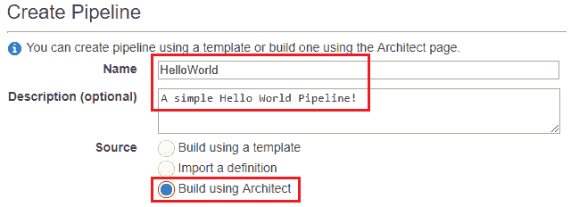

1.  接下来，你还可以通过选择调度部分提供的正确选项来安排管道的运行。目前，选择“管道激活时运行”选项，因为我们希望管道仅在首次激活时才开始执行。

1.  接下来，浏览并选择正确的*S3 桶*，通过“S3 日志位置”选项来记录数据管道的日志。此桶应该与在本场景的前提部分中创建的桶相同。

1.  可选地，你也可以通过在安全/访问部分选择提供的自定义选项，为数据管道提供自定义 IAM 角色。在这种情况下，我们已经选择了默认的 IAM 角色。

1.  一旦填充了所有必需的字段，选择“在架构师中编辑”选项继续。

完成此步骤后，你应该能看到当前管道的*架构师*视图。如图所示，默认情况下，你将只看到一个名为“配置”的框。

1.  选择配置框以查看管道运行所需的各种配置选项。此信息应在右侧导航窗格的“其他”部分中可见，如下图所示：

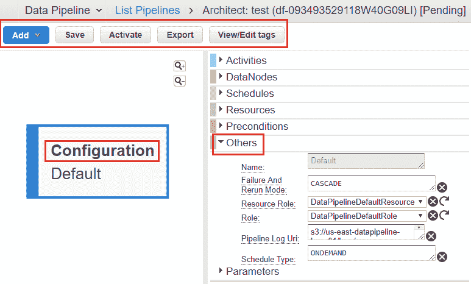

你可以使用此配置来编辑管道的资源角色、管道日志 URI、调度类型以及其他设置。

1.  要将资源和活动添加到管道中，选择所示的添加下拉列表。在此，选择`ShellCommandActivity`开始。我们将使用此活动来回显一个简单的“Hello World”消息作为开始。

1.  一旦选择了`ShellCommandActivity`选项，你应该能够在相邻的导航窗格的“活动”选项卡下看到相应的配置项。

1.  输入适当的活动名称。接下来，从类型部分，选择“添加可选字段”下拉列表，并选择“命令”选项，如图所示。在新的命令字段中，输入`echo "This is just a Hello World message!"`。

1.  配置活动后，最后一步是为流水线提供并关联资源。该资源将在 EC2 实例或 EMR 实例上执行`ShellCommandActivity`。

1.  要创建和关联资源，从“活动”部分再次选择“添加可选字段”选项，并从下拉列表中选择“运行于”选项。使用“运行于”选项，您可以为流水线执行任务创建和选择资源。

1.  选择“创建新的：资源”选项以开始。这将创建一个名为`DefaultResource1`的新资源，如下图所示：

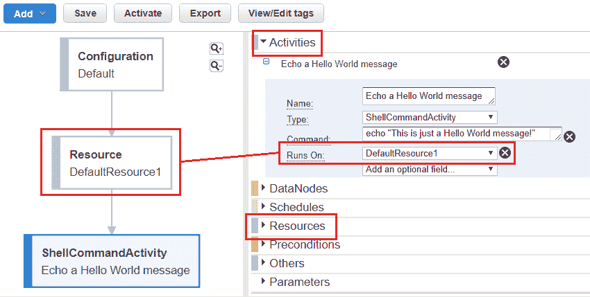

1.  选择新创建的资源，或者从导航窗格中选择“资源”选项以查看并添加特定于资源的配置。

1.  在流水线的“资源”部分填写以下信息，如之前截屏所示：

    +   名称：为您的新资源提供一个合适的名称。

    +   类型：从下拉列表中选择`Ec2Resource`选项。

    +   角色/资源角色：您可以选择不同的 IAM 角色，但我选择了默认的流水线角色。

    +   实例类型：在相邻字段中键入`t1.micro`。如果未提供或选择实例类型字段，则资源将默认启动**m1.medium**实例。

    +   终止后：选择适当的时间，在这种情况下，我选择在`10`分钟后终止。

这是最终流水线填写“资源”部分后的屏幕截图：

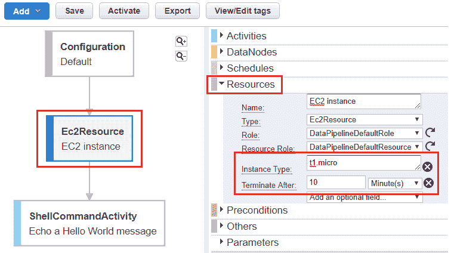

1.  一旦流水线准备就绪，点击“保存”保存所做的更改。选择“保存”选项将自动编译您的流水线并检查任何错误。如果发现任何错误，它们将显示在“错误/警告”部分。如果没有报告错误，请点击“激活”最终激活您的流水线。

流水线需要几分钟来从“等待运行程序”状态转换为“完成”状态。这个过程首先涉及启动我们在流水线中定义的 EC2 实例或资源。一旦资源启动并运行，数据管道将自动在这个特定资源上安装*任务运行器*，因为数据管道本身管理它。安装了任务运行器后，它开始轮询数据管道以执行挂起的活动。

当流水线状态变为“完成”时，展开流水线组件名称并选择“尝试”选项卡，如所示。如果未指定，数据管道将尝试在最终停止执行之前默认执行三次您的流水线。

对于每次尝试，你可以查看相应的活动日志、Stdout 以及 Stderr 消息：

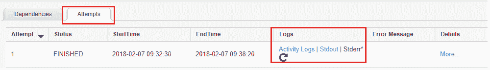

选择 Stdout 选项查看你的 Hello World 消息！瞧！你的第一个管道已启动并运行！

随意尝试其他管道选项，只需选择管道名称并点击“编辑管道”选项。你还可以通过选择管道名称并在“操作”选项卡中选择“导出”选项来导出管道的定义。

如果你喜欢使用 JSON 和 CLI 接口，管道定义是一种比标准管道仪表板更好、更简单的创建管道方式。与可能需要时间适应的标准管道仪表板相比，它们提供了更好的灵活性和可用性。考虑到这一点，在接下来的部分中，我们将探讨一些基本内容，帮助你通过创建自己的管道定义文件入门。

# 使用数据管道定义文件

AWS Data Pipeline 控制台提供了三种不同的选项来开始创建新管道。你可以使用架构模式，这正是我们在前面部分使用的方式，或者选择任何一个预定义的模板作为样板，从中构建你的管道。最后但同样重要的是，控制台还允许你上传自己的管道定义文件，它基本上是一个由多个管道对象和条件组成的 JSON 格式文件。在本部分中，我们将学习如何编写自己的管道定义，并随后使用它们来构建自定义管道。

首先，你需要两个组件来构建管道定义文件：对象和字段：

+   **对象**：对象是构建管道所需的单个组件。这些可以是数据节点、条件、活动、资源、计划等。

+   **字段**：每个对象由一个或多个字段描述。字段由键值对组成，键值对用双引号括起来，并通过冒号分隔。

这是一个管道定义文件的基本结构：

```
{ 
  "objects" : [ 
    { 
       "key1" : "value1", 
       "key2" : "value2" 
    }, 
    { 
       "key3" : "value3" 
    } 
  ] 
} 
```

下面是我们之前执行的 Hello World 管道示例导出的管道定义文件：

```
{ 
  "objects": [ 
    { 
      "failureAndRerunMode": "CASCADE", 
      "resourceRole": "DataPipelineDefaultResourceRole", 
      "role": "DataPipelineDefaultRole", 
      "pipelineLogUri": "s3://us-east-datapipeline-logs-01/logs/", 
      "scheduleType": "ONDEMAND", 
      "name": "Default", 
      "id": "Default" 
    }, 
    { 
      "name": "myActivity", 
      "id": "ShellCommandActivityId_2viZe", 
      "runsOn": { 
        "ref": "ResourceId_EhxAF" 
      }, 
      "type": "ShellCommandActivity", 
      "command": "echo "This is just a Hello World message!"" 
    }, 
    { 
      "resourceRole": "DataPipelineDefaultResourceRole", 
      "role": "DataPipelineDefaultRole", 
      "name": "myEC2Resource", 
      "id": "ResourceId_EhxAF", 
      "type": "Ec2Resource", 
      "terminateAfter": "10 Minutes" 
    } 
  ], 
  "parameters": [] 
} 
```

你可以在[`github.com/yoyoclouds/Administering-AWS-Volume2`](https://github.com/yoyoclouds/Administering-AWS-Volume2)找到完整的代码副本。

每个对象通常包含一个`id`、`name`和`type`字段，用于描述对象及其功能。例如，在 Hello World 场景中，`Resource`对象包含以下值：

```
{ 
      "name": "myEC2Resource", 
      "id": "ResourceId_EhxAF", 
      "type": "Ec2Resource", 
       ... 
} 
```

你还可以在`ShellCommandActivity`和默认配置对象中找到相同的字段。

一个管道对象可以使用`"ref" : "ID_of_referred_resource"`字段引用同一管道中的其他对象。以下是`ShellCommandActivity`引用 EC2 资源的示例，使用资源 ID：

```
{ 
      "name": "myActivity", 
      "id": "ShellCommandActivityId_2viZe", 
      "runsOn": { 
        "ref": "ResourceId_EhxAF" 
      }, 
      "type": "ShellCommandActivity", 
      "command": "echo "This is just a Hello World message!"" 
    }, 
    { 
      "resourceRole": "DataPipelineDefaultResourceRole", 
      "role": "DataPipelineDefaultRole", 
      "name": "myEC2Resource", 
      "id": "ResourceId_EhxAF", 
      "type": "Ec2Resource", 
      "terminateAfter": "10 Minutes" 
    } 
```

您还可以创建自定义或用户定义的字段，并使用与前面代码中描述的相同语法，将它们引用到其他管道组件中：

```
{ 
  "id": " ResourceId_EhxAF", 
  "type": "Ec2Resource", 
  "myCustomField": "This is a custom field.", 
  "myCustomReference": {"ref":" ShellCommandActivityId_2vi"} 
  }, 
```

您可以在[`docs.aws.amazon.com/datapipeline/latest/DeveloperGuide/dp-pipeline-objects.html`](https://docs.aws.amazon.com/datapipeline/latest/DeveloperGuide/dp-pipeline-objects.html)找到有关数据节点、资源、活动和其他对象的详细参考资料。

最后但同样重要的是，您还可以利用参数化模板来定制管道定义。使用这种方法，您基本上可以拥有一个通用的管道定义，并在管道创建时向其传递不同的值。

要使管道定义参数化，您需要使用以下语法指定一个变量：

```
 "#{VARIABLE_NAME}"
```

创建变量后，您可以在单独的`parameters`对象中定义其值，该对象可以存储在相同的管道定义文件中，也可以完全存储在一个单独的 JSON 文件中。考虑以下示例，我们将相同的 Hello World 消息传递给`ShellCommandActivity`，不过这次使用了变量定义：

```
{ 
      "name": "myActivity", 
      "id": "ShellCommandActivityId_2viZe", 
      "runsOn": { 
        "ref": "ResourceId_EhxAF" 
      }, 
      "type": "ShellCommandActivity", 
      "command": "#{myVariable}" 
}
```

一旦变量定义完成，我们将其对应的值和表达式传递到单独的`parameters`对象中，如下代码所示：

```
{ 
  "parameters": [ 
    { 
      "id": "myVariable", 
      "description": "Shell command to run", 
      "type": "String", 
      "default": "echo "Default message!"" 
    } 
  ] 
} 
```

在这种情况下，变量`myVariable`是一个简单的字符串类型，并且我们还为其提供了一个默认值，以防在管道创建时未为此变量提供值。

要了解更多有关如何在管道定义中利用和使用变量及参数的信息，请访问[`docs.aws.amazon.com/datapipeline/latest/DeveloperGuide/dp-custom-templates.html`](https://docs.aws.amazon.com/datapipeline/latest/DeveloperGuide/dp-custom-templates.html)。

到此，我们已经接近本节的结束。在下一节中，我们将探讨如何利用 AWS 数据管道，在使用参数化管道定义的情况下，在远程 EC2 实例上执行脚本和命令。

# 使用 AWS 数据管道执行远程命令

使用数据管道的一个最大优点是，您可以仅通过这个工具实现多种任务。在本节中，我们将介绍一个相对简单的管道定义，您可以通过它在 EC2 实例上执行远程脚本和命令。

这个设置是如何工作的呢？首先，我们需要创建一个 S3 桶（可以位于任何 AWS 区域），用于存储并作为所有 Shell 脚本的存储库。创建桶后，您只需创建并上传以下 Shell 脚本到该桶。请注意，在此案例中，Shell 脚本名为`simplescript.sh`，并且在以下管道定义中也使用了相同的名称：

```
#!/bin/bash 
echo "----------------------------------" 
echo "Your username is: $(echo $USER)" 
echo "----------------------------------" 
echo "The current date and time : $(date)" 
echo "----------------------------------" 
echo "Users currently logged on this system: " 
echo "$(who)" 
echo "----------------------------------" 
echo "AWS CLI installed at: " 
echo "$(aws --version)" 
echo "----------------------------------" 
```

这个脚本相当不言自明。它将基于启动它的 EC2 实例打印一系列消息。您可以用任何其他用于备份特定文件或将现有文件存档为`tar.gz`并推送到等待存档的 S3 存储桶的 Shell 脚本替换它，等等。

将脚本文件上传到正确的 S3 存储桶后，最后一步是复制并粘贴以下流水线定义到一个文件中，并上传到数据管道以执行：

```
{ 
  "objects": [ 
    { 
      "failureAndRerunMode": "CASCADE", 
      "resourceRole": "DataPipelineDefaultResourceRole", 
      "role": "DataPipelineDefaultRole", 
      "pipelineLogUri": "s3://<DATAPIPELINE_LOG_BUCKET>", 
      "scheduleType": "ONDEMAND", 
      "name": "Default", 
      "id": "Default" 
    }, 
    { 
      "name": "CliActivity", 
      "id": "CliActivity", 
      "runsOn": { 
        "ref": "Ec2Instance" 
      }, 
      "type": "ShellCommandActivity", 
      "command": "(sudo yum -y update aws-cli) && (#{myCustomScriptCmd})" 
    }, 
    { 
      "instanceType": "t1.micro", 
      "name": "Ec2Instance", 
      "id": "Ec2Instance", 
      "type": "Ec2Resource", 
      "terminateAfter": "15 Minutes" 
    } 
  ], 
  "parameters": [ 
    { 
      "watermark": "aws [options] <command> <subcommand> [parameters]", 
      "description": "AWS CLI command", 
      "id": "myCustomScriptCmd", 
      "type": "String" 
    } 
  ], 
  "values": { 
    "myCustomScriptCmd": "aws s3 cp s3://<S3_BUCKET_SCRIPT_LOCATION>/simplescript.sh . && sh simplescript.sh" 
  } 
} 
```

记得用对应的实际值替换`<DATAPIPELINE_LOG_BUCKET>`和`<S3_BUCKET_SCRIPT_LOCATION>`的值，并将文件保存为 JSON 扩展名。

此流水线定义依赖于`ShellCommandActivity`，首先在远程 EC2 实例上安装 AWS CLI，然后通过从 S3 存储桶本地复制执行 Shell 脚本。

要上传流水线定义，请使用 AWS 数据管道控制台创建新的流水线。在“创建流水线”向导中，为新流水线提供适当的名称和描述。完成后，从“源”字段中选择“导入定义”选项，如下截图所示：

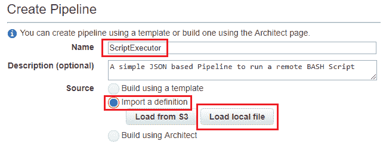

一旦脚本加载完成，您应该在“参数”部分中看到自定义 AWS CLI 命令。成功加载流水线定义后，您现在可以选择在计划或激活时运行流水线。在我的情况下，我选择在激活时运行流水线，因为这是为演示目的而设。

确保为新流水线启用了*日志记录*，并提到正确的 S3 存储桶来存储流水线的日志。填写所有必要的字段后，点击“激活”以启动流水线。

流水线将再次从“等待运行者”状态转换为“已完成”状态。通常需要一两分钟才能完成。

从数据管道控制台扩展现有流水线，并选择“尝试”选项卡，如下截图所示。在此处，点击“标准输出”以查看脚本执行的输出：

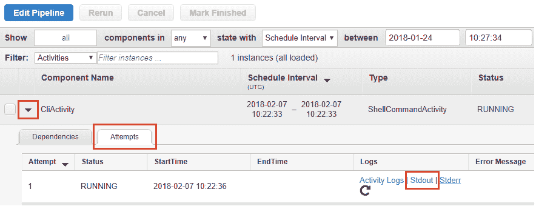

查看输出后，您可以选择流水线，然后点击“标记为完成”选项。这将阻止流水线进一步尝试执行。

简单，不是吗！您可以使用类似的方法和途径来备份您的文件并在托管实例上执行一些命令。在下一部分中，我们还将查看最后一个流水线定义示例，该示例基本上帮助我们定期备份存储在一个 Amazon S3 存储桶中的内容到另一个存储桶，同时使用数据管道控制台和 AWS CLI！

# 使用 AWS 数据管道备份数据

AWS 数据管道最常见的应用场景之一是其同步和调度备份任务的能力。你可以使用数据管道备份存储在 EC2 实例、EBS 卷、数据库甚至 S3 存储桶中的数据。在本节中，我们将介绍一个简单的、带参数的管道定义，你可以使用它来有效地调度和执行存储在 Amazon S3 存储桶中的文件的备份。

首先，我们来看看管道定义文件本身：

你可以在 [`github.com/yoyoclouds/Administering-AWS-Volume2`](https://github.com/yoyoclouds/Administering-AWS-Volume2) 找到完整的代码副本。

首先，我们再次提供一份描述管道组件的*对象*列表，从管道配置对象开始，如以下代码所示：

```
  "objects": [
    {
      "failureAndRerunMode": "CASCADE",
      "resourceRole": "DataPipelineDefaultResourceRole",
      "role": "DataPipelineDefaultRole",
      "pipelineLogUri": "#{myDataPipelineLogs}",
      "scheduleType": "ONDEMAND",
      "name": "Default",
      "id": "Default"
    },
```

接下来，我们提供其他管道对象的定义，包括数据节点：

```
    {
      "filePath": "#{myInputS3FilePath}",
      "name": "inputS3Bucket",
      "id": "InputS3FilePath",
      "type": "S3DataNode"
    },
    {
      "filePath": "#{myOutputS3FilePath}/#{format(@scheduledStartTime, 'YYYY-MM-dd-HH-mm-ss')}.bak",
      "name": "outputS3Bucket",
      "id": "OutputS3FilePath",
      "type": "S3DataNode"
    },
```

在这种情况下，我们使用 `#{VARIABLE_NAMES}` 来声明一组变量，使管道定义更加可重用。一旦数据节点配置完成，我们还需要定义一组操作，这些操作将在管道成功或失败时触发 SNS 通知。以下是相关的代码片段：

```
{
    "role": "DataPipelineDefaultRole",
    "subject": "Failure",
    "name": "SNSAlertonFailure",
    "id": "OnFailSNSAlert",
    "message": "File was not copied over successfully. Pls check with Data Pipeline Logs",
    "type": "SnsAlarm",
    "topicArn": "#{mySNSTopicARN}"
},
```

定义好对象后，第二部分需要设置`parameters`，在这里详细定义了在对象部分声明的每个变量：

```
  "parameters": [
    {
      "watermark": "s3://mysourcebucket/filename",
      "description": "Source File Path:",
      "id": "myInputS3FilePath",
      "type": "AWS::S3::ObjectKey",
      "myComment": "The File path from the Input S3 Bucket"
    },
    {
      "watermark": "s3://mydestinationbucket/filename",
      "description": "Destination (Backup) File Path:",
      "id": "myOutputS3FilePath",
      "myComment": "The File path for the Output S3 Bucket",
      "type": "AWS::S3::ObjectKey"
    },
    {
      "watermark": "arn:aws:sns:us-east-1:28619EXAMPLE:ExampleTopic",
      "description": "SNS Topic ARN:",
      "id": "mySNSTopicARN",
      "type": "string",
      "myComment": "The SNS Topic's ARN for notifications"
    },
. . . .
  ]
}
```

牢记这一点，接下来我们首先来看看如何通过 AWS 数据管道的 Web 控制台上传这个定义：

1.  登录 AWS 数据管道控制台，访问此网址：[`console.aws.amazon.com/datapipeline/home?region=us-east-1`](https://console.aws.amazon.com/datapipeline/home?region=us-east-1)。

到目前为止，我们已经将所有管道部署在美国东部（北弗吉尼亚）区域。你可以根据需求选择更改区域。

1.  完成后，选择“创建管道”选项以开始。在“创建管道”页面中，为新管道填写合适的名称和描述：

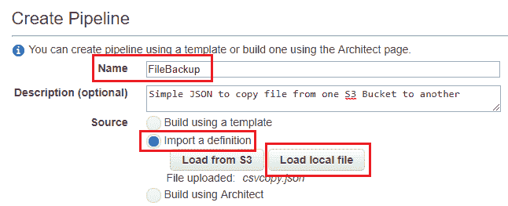

1.  接下来，选择“导入定义”选项，并点击“加载本地文件”如所示。将 JSON 文件定义复制并上传到此处。

1.  上传文件后，填写“参数”部分，如此处所述：

    +   **S3 存储桶路径到数据管道日志**：浏览并提供用于存储管道日志的存储桶路径。

    +   **源文件路径**：浏览并选择一个你希望从 Amazon S3 存储桶备份的文件。

    +   **目标（备份）文件路径**：浏览并选择一个存储备份文件的 Amazon S3 存储桶路径。你也可以选择提供一个备份文件夹名称。每个备份到此位置的文件将遵循标准命名规则：`YYYY-MM-dd-HH-mm-ss.bak`。

    +   **SNS 主题 ARN**：在此提供一个有效的 SNS 主题 ARN。此 ARN 将用于通知用户管道执行的成功或失败。

    +   **EC2 实例类型**：你可以选择提供一个不同的 EC2 实例类型作为资源。默认情况下，它将使用 t1.micro 实例类型。

    +   **EC2 实例终止**：你可以再次提供不同的实例终止值。默认情况下，设置为 20 分钟。终止时间应根据备份文件所需的时间来调整。文件越大，复制所需的时间就越长，反之亦然。

1.  一旦参数字段被填充，选择“在 Architect 中编辑”选项查看管道定义的整体组件。你应该能看到如下图示：

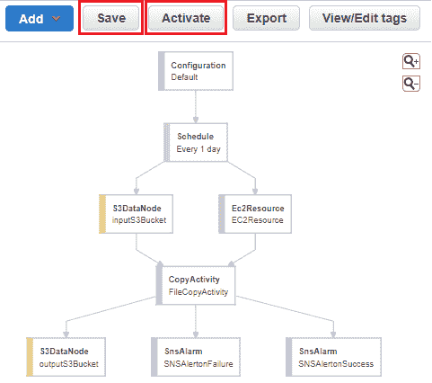

1.  点击保存以验证管道是否有错误。完成后，选择激活以启动管道的执行过程。

1.  管道需要几分钟时间才能从 WAITING_FOR_RUNNER 状态过渡到 FINISHED 状态。完成后，检查目标 S3 文件夹中的备份文件。

你可以进一步调整这个特定的管道定义，以包括整个 S3 文件夹路径，而不仅仅是当前执行的单个文件。此外，你还可以通过将 `scheduleType` 从 `ONDEMAND` 改为 `Schedule` 来改变管道执行的启动方式，如下面的代码片段所示：

```
{ 
  "id" : "Default", 
  "type" : "Schedule", 
  "period" : "1 hours", 
  "startDateTime" : "2018-03-01T00:00:00", 
  "endDateTime" : "2018-04-01T00:00:00" 
} 
```

以下代码片段将在 2018 年 3 月 1 日 00:00:00 开始，每小时执行一次管道，直到 2018 年 4 月 1 日 00:00:00。

若要了解更多有关如何使用 `Schedule` 对象的信息，请访问 [`docs.aws.amazon.com/datapipeline/latest/DeveloperGuide/dp-object-schedule.html`](https://docs.aws.amazon.com/datapipeline/latest/DeveloperGuide/dp-object-schedule.html)。

现在，管道已经通过控制台启动并运行，我们还可以看看一些简单的 AWS CLI 命令，通过这些命令，你可以实现相同的结果：

1.  首先，使用以下命令创建一个空的管道：

```
# aws datapipeline create-pipeline  
--name <NAME_OF_PIPELINE>  
--unique-id <UNIQUE_TOKEN> 
```

`<UNIQUE_TOKEN>` 可以是任何字符字符串，用于确保在多次调用 `create-pipeline` 命令时的幂等性。

1.  创建管道后，你将看到管道的 ID，如下图所示。请记下这个 ID，因为接下来的步骤中会用到它：

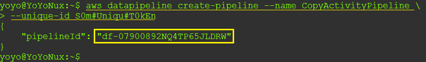

1.  接下来，我们需要创建三个单独的 JSON 文件，文件内容如下：

    +   `pipeline.json`：仅复制并粘贴此文件中的对象定义。

    +   `parameters.json`：在此处复制并粘贴参数定义。

    +   `values.json`：创建一个新文件，其中包含参数的值，如下代码片段所示。记得将 `<>` 中的值替换为你自己的值：

```
{ 
  "values": 
    { 
      "myDataPipelineLogs": "s3://<BUCKET_NAME>", 
      "myOutputS3FilePath": "s3://<BUCKET_NAME>/<FOLDER>", 
      "myInputS3FilePath": "s3://<BUCKET_NAME>/<FILE_NAME>", 
      "mySNSTopicARN": "<SNS_ARN_FOR_NOTIFICATIONS>", 
      "myEC2InstanceType": "t1.micro", 
      "myEC2InstanceTermination": "20" 
    } 
} 
```

1.  完成后，保存所有三个文件，并输入以下命令将管道定义附加到新创建的管道上：

```
# aws datapipeline put-pipeline-definition  
--pipeline-id <PIPELINE_ID>  
--pipeline-definition file://pipeline.json  
--parameter-objects file://parameters.json  
--parameter-values-uri file://values.json 
```

这是该命令输出的截图，供你参考：

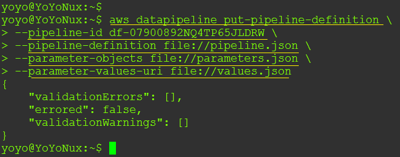

1.  上传管道定义后，剩下的最后一步是使用以下命令激活管道：

```
# aws datapipeline activate-pipeline  
--pipeline-id <PIPELINE_ID> 
```

1.  一旦管道被激活，你可以使用以下命令查看其状态和最后的运行时间：

```
# aws datapipeline list-runs
--pipeline-id <PIPELINE_ID>
```

1.  一旦管道执行完成，你可以使用以下一组命令停用并删除管道：

```
# aws datapipeline deactivate-pipeline  
--pipeline-id <PIPELINE_ID> 
# aws datapipeline delete-pipeline  
--pipeline-id <PIPELINE_ID> 
```

这是该命令输出的截图，供你参考：

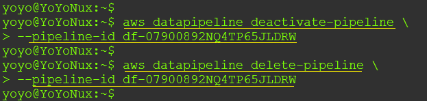

到此，我们又迎来了另一个有趣章节的结束，但在结束之前，来看看一些你应该自己尝试的下一步操作。

# 规划你的下一步

虽然我们在本章中已经讲解了很多内容，但关于数据管道的内容仍有许多需要讨论。开始使用数据管道的最快且最简单的方法之一是使用现成的管道定义模板。

截至目前，数据管道提供了以下可供使用的现成模板，你可以使用它们在几分钟内开始你自己的管道：

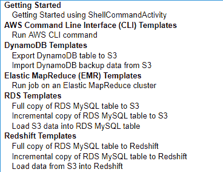

你还可以将这些定义作为模板，用于进一步定制和增强你自己的管道。只需使用之前展示的模板创建一个管道，但不要激活它。在架构模式下编辑管道并简单地将管道定义导出到本地。一旦模板的管道定义保存在本地，你可以进一步对其进行修改和增强，或者直接重用其中的组件来创建你自己的管道，可能性是无穷的！

管道的另一个酷功能是使用*竞价实例*作为任务节点。默认情况下，管道仅提供按需实例作为任务节点的资源。你可以通过简单地从管道的资源面板中选择任务实例出价价格选项来切换到竞价实例。在相应字段中提供合适的金额（介于 0 和 20.00 之间），就这么简单！下次管道激活并运行任务时，它将根据竞价实例的可用性来执行。

# 总结

好的，这也意味着我们又一精彩章节的结束。让我们快速总结一下到目前为止学到的内容！

首先，我们开始简要了解了 AWS 数据管道及其概念和术语。随后，我们还学习了管道定义，并了解了如何轻松编写和使用它们。我们甚至使用管道定义构建了第一个简单的“Hello World”管道，并给出了几个示例，你可以根据自己的使用案例进行调整和使用。最后，我们还探索了一些简单的 AWS CLI 命令，来帮助你与管道配合使用，并为下一步操作提供了实用的指南。

在下一个也是最后一章中，我们将学习和探索 AWS 多功能且强大的 IoT 服务，敬请期待！
