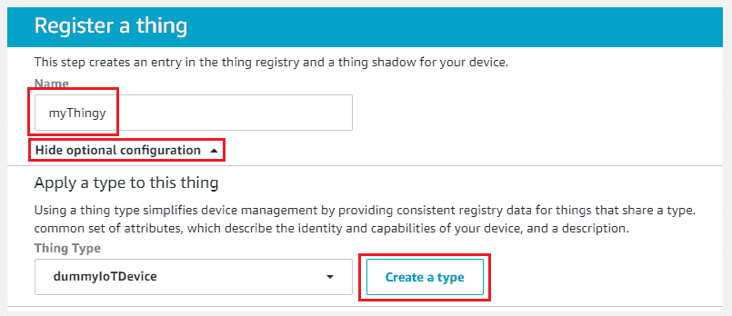
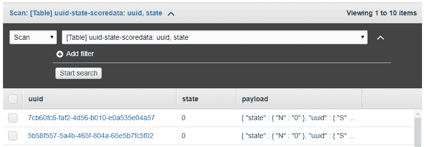
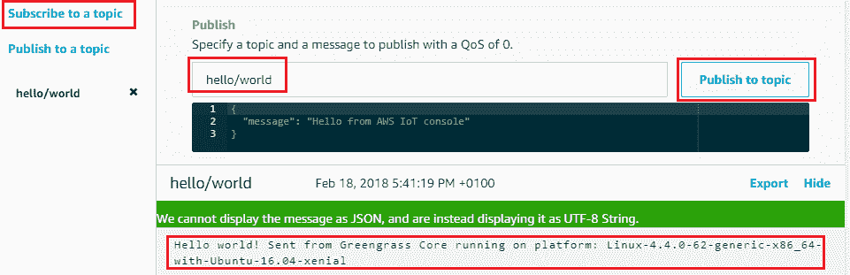

# 第十一章：使用 AWS IoT 和 AWS Greengrass 连接世界

到目前为止，这一路走来已经挺长了，但我们终于到了本书的最后一章！如果你已经坚持到这里，那你绝对需要花点时间给自己一个应得的掌声！

到目前为止，我们已经介绍了许多服务，如 Amazon EFS、AWS Beanstalk、AWS Code Suite、AWS Shield 和 AWS Data Pipeline，等等。在最后一章，我们将深入探讨 AWS 提供的物联网服务套件，重点关注两个核心产品，即 AWS IoT 和 AWS Greengrass。

让我们快速浏览一下本章将要涉及的各种主题：

+   对物联网所需构建块的简要介绍

+   AWS IoT 服务套件简介，并深入探讨 AWS IoT 及其概念和术语

+   使用树莓派 Zero 设备连接到 AWS IoT

+   探索 AWS IoT 设备 SDK，通过一些简单的代码示例

+   使用物联网规则将 AWS IoT 与其他 AWS 服务集成

+   AWS Greengrass 简介，并附带一个简单的入门示例

+   有效监控物联网设备以及物联网服务

那么不再多说，让我们开始吧！

# 物联网——它究竟是什么？

对于外行来说，**物联网**（**IoT**）就是将日常的*物品*或*物体*通过使用一个共同的通信媒介（在此为互联网）连接起来，以便交换数据。我知道这听起来没什么了不起的，但如今，物联网几乎无处不在；从可穿戴设备、智能手机、家电（如冰箱、空调）到车辆、重型机械等，几乎无所不包！Gartner 预测，到 2020 年，预计将有约 260 亿个设备通过物联网连接，且随着物联网的普及，这一数字将继续增长。但物联网究竟是什么？又该如何构建物联网呢？下面是一些入门物联网所需的基本构建块：


+   **物体**：首先，任何形式的物联网都由我们使用或依赖的终端设备组成，这些设备用于执行我们日常生活中的某些任务。这些设备或物体可以是任何东西，包括简单的电子设备，如智能手机、可穿戴设备、闹钟、灯泡，到洗衣机、车库门、车辆、船只，等等，名单非常长！

+   **传感器**：传感器是可以嵌入到物体中的设备，用于捕获或提供我们的数据。一些常见的传感器包括红外传感器、湿度传感器、气体和压力传感器等。传感器本身并不处理数据，它们仅仅收集并将数据发送到一个或多个处理器。例如，一个监控灯泡开关状态的光传感器，等等。

+   **处理器**：处理器是物联网系统的大脑。它们的主要功能是处理由传感器捕获的数据。这种处理可以基于特定触发条件进行，或者也可以接近实时地执行。一个处理器还可以连接并处理来自多个传感器的数据。最常用的处理器类型包括微控制器、嵌入式控制器等。

+   **网关**：网关是负责收集和路由数据的特殊设备，这些数据由一个或多个处理器处理后传送到物联网应用程序以进行进一步分析。网关可以收集、汇总并通过互联网发送数据，具体是以流式数据或批量数据的形式，取决于其配置和连接选项。

+   **应用程序**：一旦从各种网关收集到数据，接下来需要进一步分析，以形成有意义的见解，从而能够在各自的操作上执行适当的动作。这可以通过利用一个或多个应用程序来实现，例如工业控制中心，甚至是家庭自动化系统。例如，可以使用应用程序来远程触发灯泡开关，一旦房间的环境光开始变暗，等等。

牢记这些基本信息后，让我们来看一看一些关键的 AWS 服务，帮助你开始在云端构建自己的物联网应用。

# 介绍 AWS 物联网服务套件

自 2015 年底首次推出以来，AWS 大大增强了其物联网服务套件。以下是其提供服务的简要说明：

+   **AWS IoT Core**：AWS IoT Core 是一个托管服务，它允许你安全地连接并与数十亿的物联网设备进行交互，而无需担心设置或管理任何底层基础设施。你可以使用 IoT Core 服务构建物联网应用程序，还可以结合使用多个 AWS 服务，如 AWS Lambda、Amazon Elasticsearch、Amazon 机器学习等。

+   **AWS IoT 设备管理**：AWS IoT 设备管理服务允许你轻松注册、组织和管理大量物联网设备。你可以使用该服务批量引入设备，并通过一个统一的视图管理所有设备。

+   **AWS Greengrass**：AWS Greengrass 是一个软件服务，旨在在你的物联网设备上本地执行 Lambda 函数。此外，你还可以使用 Greengrass 在设备与 IoT Core 之间同步数据，利用数据缓存以及其他功能，如机器学习推理、消息传递等。

+   **AWS IoT 分析**：连接和管理数十亿个 IoT 设备是一项任务，而查询庞大的 IoT 数据集则是另一项任务。AWS IoT 分析是一个完全托管的服务，允许你对极大量的 IoT 数据进行分析，无需配置或管理底层分析平台。使用此服务，你可以获得关于设备的更好洞察，并构建强韧的 IoT 应用程序。

+   **AWS IoT 按钮**：AWS IoT 按钮是一个支持 Wi-Fi 的可编程按钮，使你能够编写并集成 IoT 应用程序，而无需了解任何设备特定的代码。

+   **AWS IoT 设备防护**：随着设备数量的增加，保护设备免受恶意攻击变得同样重要。AWS IoT 设备防护是一个托管服务，允许你根据一套安全规则和政策来保护、管理和审核远程设备。如果发现任何偏离，IoT 设备防护会触发适当的通知。

+   **Amazon FreeRTOS**：Amazon FreeRTOS 是一个专为小型、低功耗的边缘设备或微控制器构建的定制操作系统。该操作系统基于 FreeRTOS 内核，帮助轻松连接和管理与 AWS IoT 服务的设备。

至此，本节内容已结束。在接下来的章节中，我们将更详细地了解 AWS IoT Core 服务，并提供一个简单易懂的入门指南。

# 开始使用 AWS IoT Core

在简要了解了 AWS IoT 套件服务后，我们现在可以深入探索 AWS IoT Core 的世界！然而，在开始一些实际操作项目之前，下面是一些重要的 AWS IoT Core 概念和术语的快速介绍：

AWS IoT Core 服务提供设备与 AWS 云之间的双向通信，使用以下列表中描述的一组组件：

+   **设备网关**：设备网关为 IoT 设备与 AWS IoT 服务之间的通信提供了安全机制。

+   **设备影像**：设备影像是 IoT 设备在云端的持久表示。基于 JSON 的文档存储了设备的当前状态，你可以用它与云端进行同步。

+   **消息代理**：消息代理提供了一个安全可靠的通道，通过它，IoT 设备可以与云端进行通信。该代理基于发布–订阅模型，可以利用标准的 MQTT 协议，或通过 WebSockets 实现高级 MQTT 协议进行通信。

+   **注册表**：注册表是一项服务，用于安全地将 IoT 设备注册到云端。你可以使用注册表将证书和 MQTT 客户端 ID 与设备关联。

+   **组**：组是逻辑容器，用于将类似设备进行分组，从而有效地管理它们。你可以使用组来传播权限并对连接的设备执行批量操作。

+   **规则**：AWS IoT Core 中的规则引擎服务提供了一种机制，使您能够使用简单的 SQL 查询处理物联网数据。您还可以编写规则，将 AWS IoT Core 与其他 AWS 服务集成，如 AWS Lambda、Amazon S3、Amazon Kinesis 等。

下面是所有内容如何完美地配合在一起的！您首先准备一台设备，以便连接到 AWS IoT Core。这涉及创建一组证书，这些证书在设备连接到 AWS IoT Core 时验证设备。连接后，设备开始使用标准 MQTT 协议以 JSON 格式发布其当前状态的消息。这些消息被发送到消息代理，基于消息的主题将其路由到相应的订阅客户端。

您甚至可以创建一个或多个规则来定义基于消息中包含的数据的一系列操作。当特定数据匹配配置的表达式时，规则引擎会调用该特定操作，该操作可以是将数据发送到 Amazon S3 中的文件，也可以是使用 AWS Lambda 或 Amazon Kinesis 处理数据。以下是这些组件的表示方式：


牢记这一点，让我们看看如何将您的物联网设备连接到 AWS IoT Core！

# 连接设备到 AWS IoT Core

AWS IoT 支持多种专用物联网嵌入式设备和微控制器，您可以将其连接到。但是，为简单起见，您还可以使用本地设置的虚拟机或 EC2 实例来模拟物联网设备。对于本节，我们将使用基于 Ubuntu 的简单虚拟机，在 VirtualBox 中托管。虚拟机中安装了基本操作系统软件包，并以 512 MB RAM 和 1 CPU 核心分配运行，拥有 10 GB 硬盘。在继续任何进一步的步骤之前，请确保您的虚拟机具有开放的互联网连接和有效的主机名设置。

下面的列表展示了模拟物联网设备的配置供您参考：

+   **CPU**：1 CPU

+   **RAM**：512 MB

+   **操作系统**：Ubuntu Server 16.04.2 LTS（Xenial）x86_64 架构

+   **软件包**：核心服务器软件包以及 `vim`、`node`、`npm`、`git`、`wget`

设备或虚拟机准备好后，我们可以连接到 AWS IoT Core：

1.  从 AWS 管理控制台，使用提供的筛选器过滤并选择 AWS IoT 服务。或者，选择此网址，[`console.aws.amazon.com/iot/home`](https://console.aws.amazon.com/iot/home) 来启动 AWS IoT 控制台。

1.  选择“开始”选项以继续。

1.  登录控制台后，从控制台左侧的导航窗格中选择"入门"选项。在这里，您可以选择开始配置第一个设备与 IoT 服务的连接，并选择其他选项，如配置 AWS IoT 按钮或开始使用 AWS IoT 入门套件。在此部分中，选择在“配置设备”部分下的“开始使用”选项。

1.  "开始使用"选项是一个简单的三步过程，首先是注册您的设备，然后下载一组凭证和 SDK，以便设备与 IoT Core 进行通信，最后测试检查设备是否成功连接。

1.  从“选择平台”选项中选择 Linux/OSX，然后从“选择 AWS IoT 设备 SDK”中选择 Node.js，如下图所示。请注意，您也可以选择 Java 或 Python SDK；不过，本用例的其余部分将仅基于 Node.js：


1.  选择适当的平台和 IoT SDK 后，点击“下一步”继续。

1.  下一步涉及注册一个*Thing*，在我们的例子中，就是物联网设备本身。首先为您的 Thing 提供一个合适的名称，然后选择显示可选配置选项。

1.  在“为此 Thing 应用类型”部分中，选择创建类型选项。Thing 类型通过为共享特定类型的 Thing 提供一致的注册数据，从而简化了 IoT 设备的管理。为您的 Thing 类型提供合适的名称和可选描述，并在完成后选择创建 Thing 类型。

1.  这是最终配置的样子。在我的例子中，我创建了一个名为 dummyIoTDevice 的 Thing 类型，用于将所有基于虚拟机的 IoT 设备逻辑地分类在一起。完成后选择创建 Thing 选项：



1.  成功创建 Thing 后，我们现在需要建立 Thing 与 AWS IoT Core 之间的连接。为此，请从 Things 控制台中选择新创建的 Thing 图标，以查看 Thing 的各种配置选项。重要选项之一是安全性选项。请从导航窗格中选择安全性选项。

1.  在这里，您可以创建并关联所需的证书，以及与 Thing 通信所需的策略，这些策略是与 IoT Core 通信时所必需的。首先选择创建证书选项开始。

1.  必要的证书由 AWS Core 自动创建。下载这些文件并保存在安全的地方。证书可以随时检索，但在关闭此页面后，私钥和公钥*无法检索*：

    +   **此 Thing 的证书**: `xyz.cert.pem`

    +   **一个公钥**: `xyz.public.key`

    +   **一个私钥**: `xyz.private.key`

此外，您还需要从 Symantec 下载 AWS IoT 的*根 CA*。您可以通过选择以下 URL 来完成此操作：

[`www.symantec.com/content/en/us/enterprise/verisign/roots/VeriSign-Class%203-Public-Primary-Certification-Authority-G5.pem`](https://www.symantec.com/content/en/us/enterprise/verisign/roots/VeriSign-Class%203-Public-Primary-Certification-Authority-G5.pem)

请记得选择“激活”选项，以成功激活密钥。完成后，选择“附加策略”选项，如下截图所示：


1.  由于这是我们第一次使用 IoT Core，我们需要从头开始创建一个新策略。该策略将用于授权我们在前一步创建的证书。选择“创建新策略”选项以开始。

1.  在创建策略页面，首先为你的新策略提供一个合适的名称。完成后，你可以选择 *基础* 或 *高级* 模式来创建 IoT 策略。为了简单起见，选择高级模式选项，并粘贴以下策略片段：

```
{
  "Version": "2012-10-17",
  "Statement": [
  {
    "Effect": "Allow",
    "Action": "iot:*",
    "Resource": "*"
  }
  ]
}
```

以下策略允许所有设备连接、发布和订阅 AWS IoT 消息代理。你也可以根据需求调整此策略。

1.  完成后，选择“创建”选项以完成策略创建过程。

完成此步骤后，我们距离建立 IoT 设备与 AWS IoT Core 之间的连接仅剩几个步骤。

1.  创建所需的策略并下载证书后，我们现在需要将这些证书复制到我们的 IoT 设备上，在此案例中是 Ubuntu 虚拟机。你可以使用任何 SCP 工具来执行此操作，例如 WinSCP。以下是我 Ubuntu 虚拟机上的文件截图：


对于这个场景，我将下载的 Symantec 根证书文件命名为 `root-CA.crt`。

一旦文件被复制到 IoT 设备的目标文件夹，你现在可以开始测试连接性，但为了做到这一点，我们首先需要在 IoT 设备上安装并配置 AWS IoT 设备 SDK。

# 开始使用 AWS IoT 设备 SDK

AWS IoT 设备 SDK 是一种快速简便的方法，可以将你的 IoT 设备连接到 AWS IoT Core。至今，AWS 提供了适用于 Node.js、Java、Python 和嵌入式 C 的 IoT 设备 SDK。在本节中，我们将使用 Node.js SDK 将虚拟的 IoT 设备与 AWS IoT 连接。

在开始之前，确保你已经安装并运行了设备上的最新版本的 node 和 NPM。由于我们使用 Ubuntu 虚拟机模拟 IoT 设备，你可以使用以下命令来安装并验证 node 和 NPM 的版本：

```
# sudo apt-get update 
# sudo apt-get install nodejs npm 
# node -v && npm -v 
```

安装所需的软件包后，我们现在需要安装 AWS IoT 设备 SDK。请输入以下命令：

```
# npm install aws-iot-device-sdk 
```

安装好 SDK 后，我们现在可以开始通过一个简单的 Node.js 程序测试连接性。将以下代码片段复制并粘贴到你 IoT 设备上的新 `.js` 文件中：

```
# vi test1.js 
//Connection parameters 
var awsIot = require('aws-iot-device-sdk'); 
var device = awsIot.device({ 
   keyPath: '<PATH_TO_PRIVATE.PEM.KEY>', 
  certPath: '<PATH_TO_CERTIFICATE.PEM>CRT>', 
    caPath: 'root-CA.crt', 
  clientId: '<THING_NAME>', 
    region: '<REGION>', 
      host: '<IoT_DEVICE_REST_API_ENDPOINT>' 
}); 
//Connection parameters end 

//Device Object 
device 
.on('connect', function () { 
console.log('Yaaa! We are connected!'); 
}); 
```

这段代码的作用是什么？首先，代码的第一部分是传递从前面的步骤中下载的私钥和证书，以及其他一些配置项，比如`clientId`、AWS IoT Core 所在的`region`，以及`host`，这实际上是你的设备的唯一 REST API 端点。你可以通过从 AWS IoT 仪表板中选择新创建的 IoT 设备，并选择“Interact”标签来找到这个端点，具体如下图所示：


代码的第二部分是使用配置好的参数连接到 AWS IoT Core。如果连接成功，它将打印出一个简单的消息，如下所示。要运行代码，只需输入以下命令：

```
# node test1.js 
```


设备现在成功连接到 AWS IoT Core，我们来看一些其他示例，帮助你与消息代理服务进行交互。首先，让我们看看如何使用 AWS IoT 设备 SDK 订阅主题，并打印出发布到该主题的任何消息。

将以下代码片段粘贴到连接参数下方：

```
# vi test2.js 
//Connnection parameters 
. . . . . 
//Connection parameters end 

//Device Object 
device 
.on('connect', function () { 
console.log('Yaaa! We are connected!'); 
device.subscribe('Topic0'); 
console.log('Subscribed to Topic'); 
}); 

device 
.on('message', function (topic, payload) { 
console.log('Received following message: ', topic, payload.toString()); 
}); 
```

以下代码将设备订阅到名为`Topic0`的主题。一旦订阅完成，代码将显示发布到该主题的任何消息。

在代码就绪后，保存文件并使用以下代码运行程序：

```
# node test2.js 
```

接下来，我们来看一下如何将消息发布到新创建的主题：

1.  要将消息发布到以下主题，我们将使用 AWS IoT Core 本身提供的 MQTT 客户端。为此，从 AWS IoT Core 仪表板中选择导航窗格中的“Test”选项。

1.  使用 MQTT 客户端，你既可以订阅，也可以发布消息到主题。点击“Publish to topic”选项。

1.  在“发布”部分，提供你想发布消息的主题名称（在本例中为`Topic0`），然后点击“Publish to topic”按钮，如下图所示：


检查设备终端以获取相应的消息。你应该会看到以下输出：


设备现在能够订阅主题，你还可以让设备发布消息到主题。

再次创建一个新文件，并将以下代码片段粘贴到连接参数下方：

```
# vi test3.js 
//Connnection parameters 
. . . . . 
//Connection parameters end 

//Device Object 
device 
.on('connect', function () { 
console.log('Yaaa! We are connected!'); 
device.subscribe('Topic0'); 
console.log('Subscribed to Topic'); 
var msg = "Hello from IoT Device!"; 
      device.publish('Topic0', msg); 
      console.log ("Publishing message: "+msg); 
}); 

device 
.on('message', function (topic, payload) { 
console.log('Received following message: ', topic, payload.toString()); 
}); 
```

从以下代码可以看到，我们只是添加了一个`publish()`方法，它将把自定义消息发布到预定义的主题，在本例中为`Topic0`。

保存代码并使用以下命令运行程序：

```
# node test3.js 
```

你应该在设备终端看到以下输出：


很简单，对吧！你也可以将相同的概念应用于实际的 IoT 设备，只需做一些小的调整。下面是一个代码片段，你可以用它来生成虚拟数据并将数据发布到 MQTT 主题。

创建一个新文件，并将以下代码片段粘贴到连接参数之后，如本节中所示：

```
# vi test4.js 
//Connnection parameters 
. . . . . 
//Connection parameters end 

var uuid = require('node-uuid'); 
var numbers = new Array(10); 
function getRandomInt(min, max) { 
  return Math.floor(Math.random() * (max - min + 1)) + min; 
} 

device 
.on('connect', function () { 
console.log('Yaaa! We are connected!'); 
device.subscribe('Topic0'); 
console.log('Subscribed to Topic'); 

for (var i = 0; i < numbers.length; i++) 
    { 
  for (var j = 0; j < numbers.length; j++) 
     { 
       numbers[i] = getRandomInt(0,1); 
       uuid[i] = uuid.v4() 
      } 
      var msg = "{"uuid":"" + uuid[i] + """ + "," +"""+ "state":" + numbers[i]+"}"; 
      device.publish('Topic0', msg); 
      console.log ("Publishing message: "+uuid[i],numbers[i]); 
   } 

}); 

device 
.on('message', function (topic, payload) { 
console.log('Received following message: ', topic, payload.toString()); 
}); 
```

以下代码片段使用 `node-uuid` 模块随机生成长字符串的 UUID。每生成一个 UUID 记录，就会打印一个随机值，值为 `0` 或 `1`，表示 UUID 的*状态*。你可以通过调整数组对象的值来控制生成的记录数量。默认情况下，以下代码将以正确的 JSON 格式将 10 条记录发布到 MQTT 主题，如以下代码片段所示：

```
{ 
"uuid":"357d6212-3444-4f55-9784-93a265905289", 
"state":0 
} 
{ 
"uuid":"ad8cb61b-f29d-4a84-a7eb-42633dd3a3c2", 
"state":0 
} 
. . . . .  
{ 
"uuid":"19492c45-0cf7-4468-b275-5b7b1bdf3a64", 
"state":1 
} 
```

一旦代码就位，只需使用以下命令执行它：

```
# node test4.js 
```


到此，我们这一节的内容已经结束。在下一节中，我们将讨论如何使用简单的 IoT 规则将 AWS IoT Core 与其他 AWS 服务集成。

# 使用 IoT 规则

最近 AWS IoT Core 提供的最吸引人的功能之一就是 IoT 规则。通过 IoT 规则，你可以为连接的设备提供与其他 AWS 服务交互的能力。IoT 规则提供了一组预定义的规则，使你能够执行各种任务，下面列举了一些：

+   将设备接收到的数据写入 Amazon DynamoDB 表

+   向所有用户发送推送通知，使用 Amazon SNS

+   将数据发布到 Amazon SQS 队列

+   调用 Lambda 函数执行数据转换

+   使用 Amazon Kinesis 处理设备数据，等等

一个 IoT 规则还为你提供了额外的功能，使你能够查询和过滤设备数据，同时使用简单的 SQL 命令。根据 SQL 语句的执行结果，你可以触发成功或错误的操作：

1.  要开始使用 IoT 规则，从 AWS IoT Core 控制台中选择 Act 选项。由于这是第一次使用，请点击创建规则，继续下一步。

1.  在创建规则页面，首先为规则提供一个合适的名称和描述。在本场景中，我们将创建一个 IoT 规则，将所有设备数据写入 DynamoDB 表。

1.  接下来，从使用 SQL 版本的下拉列表中选择一个适合此规则的 SQL 版本。默认情况下，将选择 2016-03-23 版本。

1.  接下来，我们形成规则查询语句。此语句用于从大量设备数据中筛选出特定的消息。在这种情况下，我们希望将来自演示设备的所有数据写入 DynamoDB 表，因此在属性字段中输入一个`*`，表示所有字段，接着在主题过滤选项中输入有效的主题名称。你还可以设置一个可选的条件来匹配查询。

这是最终查询应该呈现的样子：


1.  在查询设置完成后，下一步是将一个或多个操作与您的物联网规则关联。在“设置一个或多个操作”部分，选择“添加操作”选项以开始操作。

1.  在“选择操作”页面，您可以浏览并选择一个预定义的操作模板。在这种情况下，我们将选择“将消息插入到 DynamoDB 表”操作，它允许您将整个或部分 MQTT 消息写入 DynamoDB 表。选择后，点击“配置操作”以继续。

1.  这将带您进入“配置操作”页面，您可以选择一个现有的 DynamoDB 表，或者创建一个新的表。在此用例中，我们将依赖于我们在示例设备上最后执行的 *UUID 和 state* 代码。为了拆分并将消息数据写入各自的列，请确保您创建的 DynamoDB 表符合以下设置：

    +   分区键：`uuid`

    +   排序键：`state`

    +   阅读容量单位：`5`

    +   写入容量单位：`5`


1.  创建表格后，从“表格名称”下拉列表中选择该表格。接下来，填写“哈希键值”和“范围键值”字段中的相应表达式，如下图所示。这些表达式会将消息值写入其对应的 DynamoDB 表列：


1.  确保您还创建并分配一个 IAM 角色，该角色将授予 DynamoDB 表的写入 AWS IoT 访问权限。表格和 IAM 角色分配完成后，点击“添加操作”以完成操作配置。您可以使用相同的过程向单个 IoT 规则添加多个操作。例如，将设备消息写入 DynamoDB 表以及 SQS 队列，等等。规则设置好后，点击“创建规则”以完成该过程。

1.  现在，测试规则。运行我们在前面部分中运行的 `uuid-state` 代码。确保代码中的主题名称与 IoT 规则中的主题名称匹配，否则代码将无法将任何内容写入 DynamoDB 表：

```
# node test4.js
```

在代码执行时，检查 DynamoDB 表中的数据。您应该看到与以下截图类似的输出：



到此为止，我们已完成 AWS IoT Core 的内容。确保在测试完成后清理并删除 DynamoDB 表，以避免不必要的费用。在下一部分，我们将探讨另一个强大的 AWS IoT 服务——AWS Greengrass。

# 介绍 AWS Greengrass

AWS Greengrass 是一种边缘计算服务，通过允许数据收集和分析更接近数据源的方式，将云功能扩展到您的物联网设备。这是通过在物联网设备本地执行 AWS Lambda 函数来实现的，同时仍然利用云端进行管理和分析。

这对企业有什么帮助呢？首先，通过使用 AWS Greengrass，您现在可以近实时地响应本地生成的事件！借助 Greengrass，您可以编程 IoT 设备在本地处理和筛选数据，仅将重要的信息传回 AWS 进行分析。这也直接影响到成本和传输回云端的数据量。

下面简要介绍 AWS Greengrass 工作原理中所需的一些组件：

+   **Greengrass Core（GGC）** **软件（software）：** Greengrass Core 软件是一个打包的模块，包含一个运行时环境，允许在本地执行 Lambda 函数。它还包含一个内部消息代理和一个部署代理，定期通知 AWS Greengrass 服务有关设备的配置、状态、可用更新等信息。该软件还确保设备与 IoT 服务之间的连接通过密钥和证书保持安全。

+   **Greengrass 群组（Greengrass groups）：** Greengrass 群组是用于管理一个或多个由 Greengrass 支持的 IoT 设备的 Greengrass Core 设置和定义的集合。群组内部包括一些其他组件，具体如下：

    +   **Greengrass 群组定义（Greengrass group definition）：** 关于 Greengrass 群组的相关信息集合。

    +   **设备定义（Device definition）：** 作为 Greengrass 群组一部分的 IoT 设备集合。

    +   **Greengrass 群组设置（Greengrass group settings）：** 包含连接及配置相关信息，以及与其他 AWS 服务交互所需的 IAM 角色。

    +   **Greengrass Core：** IoT 设备本身。

+   **Lambda 函数（Lambda functions）：** 可以部署到 Greengrass Core 的 Lambda 函数列表。

+   **订阅（Subscriptions）：** 一组消息源、消息目标和用于传输消息的 MQTT 主题。消息源或目标可以是 IoT 服务、Lambda 函数，甚至是 IoT 设备本身。

+   **Greengrass Core SDK：** Greengrass 还提供了一个 SDK，您可以用它在 Greengrass Core 设备上编写和运行 Lambda 函数。当前 SDK 支持 Java 8、Python 2.7 和 Node.js 6.10。

牢记这些关键信息后，让我们开始在 IoT 设备上部署我们自己的 Greengrass Core。

# 将设备连接到 Greengrass Core。

将 IoT 设备连接到 AWS Greengrass 的步骤与我们在设置 AWS IoT Core 时执行的步骤非常相似。在本节中，我们将使用 AWS 管理控制台为我们的虚拟机上的 Ubuntu Server 添加 Greengrass 以扩展我们的虚拟 IoT 设备：

1.  要开始使用，请在 AWS IoT 控制台中，选择导航窗格中的 Greengrass 选项。

1.  设置 Greengrass 包括三个步骤，首先创建和配置一个 **Greengrass 群组（Greengrass group）**，然后将 **Greengrass Core** 添加到群组，最后将 IoT 设备添加到群组。开始之前，请点击“定义 Greengrass 群组”面板下的“开始使用”选项。

1.  在“设置您的 Greengrass 组”页面，选择“使用简单创建”选项。此过程将自动在注册表中预配一个核心，使用默认设置生成一个新组，并为您的核心提供一个新的证书和密钥对。

1.  输入一个合适的组名，并点击“下一步”继续。

1.  您可以选择通过从下拉框中选择“Thing 类型”来为此组应用类型，如下图所示。在这种情况下，我们已经在之前的练习中定义了一个 Thing 类型，因此我们将使用这个。点击“下一步”继续：


1.  由于我们使用的是 *简单创建* 方法，AWS 执行一个脚本操作，基本上为我们完成以下任务：

    +   在云中创建一个新的 Greengrass 组

    +   在 IoT 注册表中预配一个新的核心并将其添加到组中

    +   为您的核心生成一对公钥和私钥

    +   使用这些密钥为核心生成新的安全证书

    +   将默认安全策略附加到证书上

1.  点击“创建组和核心”继续执行脚本安装。

1.  最后，在“连接您的核心设备”页面，选择“将这些资源下载为 tar.gz”选项，将特定于核心的证书和配置文件作为 TAR 资源下载。您还需要下载适合在 IoT 设备上运行的 Greengrass 核心软件版本。由于我们正在 Ubuntu 基础的虚拟机上执行所有这些操作，请从 Greengrass 核心软件下拉列表中选择 x86_64_Ubuntu 选项并下载。下载完成后，点击“完成”退出设置。

下载了 Greengrass 核心软件和必要的 Greengrass 证书后，我们需要使用任何 SCP 工具将它们传输到我们的 IoT 设备上。传输完成后，运行以下命令集以设置并启动 Greengrass 核心：

1.  首先，使用以下命令解压 Greengrass 核心软件。

```
# sudo tar -xzvf greengrass-<PLATFORM-VERSION>.tar.gz -C /
```

1.  接下来，运行以下命令以解压并将安全文件和证书放置在 `greengrass` 目录中：

```
# sudo tar -xzvf <UID>-setup.tar.gz -C /greengrass
```

1.  一旦两个 TAR 文件的内容被解压，运行以下命令从 Symantec 下载根 CA 证书：

```
# cd /greengrass/certs/
# sudo wget -O root.ca.pem http://www.symantec.com/content/en/us/enterprise/verisign/roots/VeriSign-Class%203-Public-Primary-Certification-Authority-G5.pem
```

以下是最终的文件夹结构供您参考：


1.  完成后，运行以下命令集为 Greengrass 核心软件创建一个专用的用户和组：

```
# sudo adduser --system ggc_user 
# sudo addgroup --system ggc_group 
```

1.  接下来，使用以下命令更新主机操作系统并安装 `sqlite3` 软件包：

```
# sudo apt-get update 
# sudo apt-get install sqlite3 
```

1.  当所有组件就位后，我们现在准备好在 IoT 设备上启动 Greengrass 核心服务。按如下所示输入以下命令：

```
# cd /greengrass/ggc/packages/1.3.0/ 
# sudo ./greengrassd start
```

您应该在终端上看到以下输出，如下所示：


如果连接时出现错误，您还可以查看 Greengrass 运行时日志文件，路径如下：

`/greengrass/ggc/var/log/system/runtime.log.`

很简单，对吧！完成了三步中的两步，剩下的最后一步就是将设备添加到我们创建的 Greengrass 组中：

1.  为此，在 AWS IoT 控制台中，选择导航窗格中 Greengrass 部分下的“组”选项。您应该在这里看到新创建的 Greengrass 组。点击选择它。

1.  选择“设备”，然后点击“添加您的第一个设备”选项继续。

1.  在“添加设备”页面中，您可以选择创建新设备或选择使用现有的 IoT Thing 作为设备。由于我们已经在之前的 IoT 设置中注册了物联网设备，请选择“选择 IoT Thing”选项继续。

1.  选择已添加的 IoT 设备的名称，然后点击“完成”以完成该过程。

完成了！您已成功安装并将物联网设备与 AWS Greengrass 连接！在下一节中，我们将通过运行一个简单的 Lambda 函数来测试此部署。

# 在 AWS Greengrass 上运行 Lambda 函数

在您的物联网设备上成功运行 Greengrass Core 软件后，我们现在可以继续在其上运行一个简单的 Lambda 函数！在本节中，我们将使用一个 AWS Lambda 蓝图，该蓝图会打印一个简单的 Hello World 消息：

1.  首先，我们需要创建我们的 Lambda 函数。进入 AWS 管理控制台，通过筛选器选项筛选出 Lambda 服务，或者选择此网址：[`console.aws.amazon.com/lambda/home`](https://console.aws.amazon.com/lambda/home)。

确保 Lambda 函数是在与 AWS Greengrass 相同区域启动的。在这种情况下，我们使用的是 US-East-1（北弗吉尼亚）区域。

1.  在 AWS Lambda 控制台首页，选择“创建函数”选项以开始。

1.  由于我们将利用现有的函数蓝图来完成此用例，请在“创建函数”页面中选择“蓝图”选项。

1.  使用筛选器查找名为 `greengrass-hello-world` 的蓝图。目前有两个与此名称匹配的模板，一个基于 Python，另一个基于 Node.js。对于本节内容，请选择基于 Python 的 `greengrass-hello-world` 函数，并点击“配置”以继续。

1.  填写新函数的必需详细信息，例如名称，然后选择一个有效的角色。对于本节内容，请选择“从模板创建新角色”选项。提供一个合适的角色名称，最后，从“策略模板”下拉列表中选择 AWS IoT 按钮权限角色。

1.  完成后，点击“创建函数”以完成函数的创建过程。但在将此函数与 AWS Greengrass 关联之前，您还需要从该函数创建一个新的*版本*。在“操作”标签中选择“发布新版本”选项。

1.  提供合适的版本描述文本，完成后点击 Publish。您的函数现在已准备好用于 AWS Greengrass。

1.  现在，返回到 AWS IoT 仪表板，选择导航窗格中的 Groups 选项，然后选择新部署的 Greengrass 群组。

1.  在 Greengrass 群组页面，选择导航窗格中的 Lambdas 选项，然后选择 Add Lambda 选项，如下图所示：


1.  在将 Lambda 添加到您的 Greengrass 群组页面上，您可以选择创建一个新的 Lambda 函数或使用现有的 Lambda 函数。由于我们已经创建了函数，请选择 Use existing function 选项。

1.  在下一页，选择您的 Greengrass Lambda 函数，然后点击 Next 继续。最后，选择已部署函数的版本，完成后点击 Finish。

1.  最后，我们需要在 Lambda 函数（源）和 AWS IoT 服务（目标）之间创建一个新的订阅。在同一 Greengrass 群组页面中选择 Subscriptions 选项，如下所示。点击 Add Subscription 以继续：


1.  在选择源和目标页面，选择新部署的 Lambda 函数作为源，然后选择 IoT 云作为目标。完成后点击 Next。您还可以提供一个可选的主题过滤器，用于过滤在消息队列中发布的消息。在此示例中，我们提供了简单的 `hello/world` 作为过滤器。完成后点击 Finish 以完成订阅配置。

所有组件准备就绪，现在是时候将我们的 Lambda 函数部署到 Greengrass Core 上了。为此，选择 Deployments 选项，并从 Actions 下拉菜单中选择 Deploy 选项，如下图所示：


部署需要几秒钟完成。完成后，通过查看 Status 列来验证部署状态。状态应该显示为 Successfully completed。

函数部署完成后，使用 AWS IoT 提供的 MQTT 客户端进行测试，如之前所做。记得在订阅主题字段中输入相同的 `hello/world` 主题名称，完成后点击 Publish to topic。如果一切顺利，您应该会从 Greengrass Core 收到一个自定义的 Hello World 消息，如下图所示：



这只是 Greengrass 和 Lambda 能实现的高层次概述。您可以利用 Lambda 在 IoT 设备本身上执行各种数据预处理，从而节省大量时间和成本。

至此，本节内容已结束。在下一节中，我们将介绍一些简单有效的监控 IoT 设备的方法。

# 监控 AWS IoT 设备和服务

AWS 提供了多种方法来监控你的 IoT 设备以及 IoT 服务及其调用。为了开始，让我们先看看 AWS IoT 仪表板本身提供的简单设备监控功能。在 AWS IoT 控制台页面上，选择“监控”选项。在这里，你可以查看各种图表和数据，比如过去一小时、一天或一周内与 AWS IoT 服务建立的*成功连接数*。你甚至可以检查通过 MQTT 或 HTTP 协议传输的*消息数*，如下图所示：


你还可以使用监控页面查看*发布的消息数*、*执行的规则数*和*影像更新数*。

除此之外，你还可以为 AWS IoT 服务启用日志记录。为此，请从 AWS IoT 控制台的导航窗格中选择“设置”选项。默认情况下，AWS IoT 的日志记录是*禁用*的，但你可以通过选择日志部分下的“编辑”选项轻松启用它。当你的 IoT 设备的消息通过消息代理和规则引擎时，你可以使用 AWS IoT 日志来处理事件，进而排查设备端以及服务端的问题。

根据你的日志记录需求，你可以选择调试（最详细）、信息、警告和错误（最简洁）等不同的详细级别。

# 总结

嗯，就像所有美好的旅程一样，这本书也迎来了它的终结！我只想借此机会说，这真是一次美妙的旅程和体验，写这本书的过程让我非常愉快！尽管这本书看起来有很多内容需要阅读和理解，但相信我，这一切不过是沧海一粟！AWS 不断努力通过新增越来越多的功能来发展其服务，以至于如今，你几乎可以找到任何你需要的即用型服务，包括游戏开发、人工智能、客户互动、商业生产力等，仅举几例！

简要总结一下我们到目前为止所学的内容：我们从与 EC2 Systems Manager 的一些有趣实践开始，接着是我最喜欢的两个服务——Elastic Beanstalk 和 Elastic File System。我们还涉及了很多安全内容，包括 AWS WAF、AWS Shield、AWS CloudTrail 和 AWS Config！在接近结尾时，我们开始探索一些以开发者为主的服务，比如 AWS CodeDeploy、AWS CodeCommit 和 AWS CodePipeline 等。最后，我们以高亢的调子结束了最后几章，重点讲解了 Amazon Redshift、Amazon EMR、AWS Data Pipeline 以及最后但同样重要的 AWS IoT 中的物联网和分析服务！

直到下次，再见！
