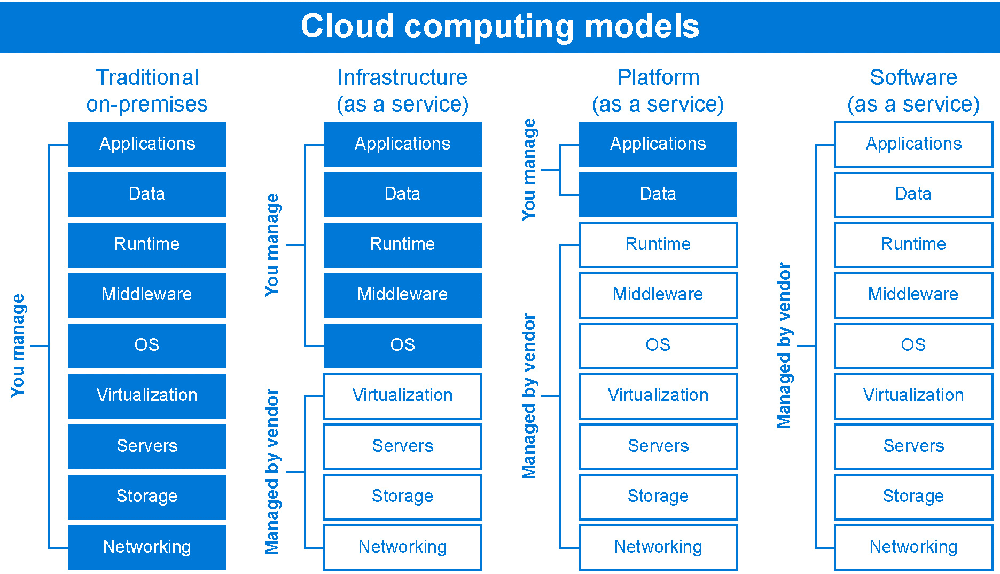

当今的企业面临着巨大的挑战，从支持远程工作、应对增加的网络攻击到管理减少的现金流。Microsoft Azure 是一个强大的云平台，旨在帮助你提升生产力、确保安全性、提高效率并节省成本，使你能够提供弹性、节省成本并带来公司所需的影响。无论你是初创公司还是在全球运营的大型跨国企业，你都可以开始根据符合业务需求的方法部署和迁移工作负载到 Azure。

利用 Azure 提供的众多功能的第一步是进行仔细的规划。本书旨在帮助你通过为你提供关于 Azure 基础设施的基础知识、核心能力和优势以及最佳实践，成功地开展这一规划，帮助你成功使用 Azure，无论你决定完全迁移还是采取混合云方法。

本章将涵盖以下内容：

+   什么是 Microsoft Azure？

+   Azure 采用的方式

+   Azure 迁移策略

+   Azure 基础设施的业务效益

本章将介绍 Azure 的框架以及其业务效益概述。接下来的章节将在此基础上展开，提供更具体的指导，并解释有助于你规划迁移和 Azure 基础设施实施策略的技术。

## 第一章：什么是 Microsoft Azure？

Azure 是微软的云计算平台，提供各种服务，面向个人和组织。云计算使得通过网络方便、按需访问共享的计算资源成为可能。这些资源可以从存储、服务器到可以快速部署的应用程序。

Azure 提供了快速配置计算资源的功能，帮助你托管现有应用程序、简化新应用开发，甚至增强本地应用。这些资源由 Microsoft 管理；不过，你可以监控这些资源，并在出现问题时获取报告和警报。这一切都建立在资源池之上，这些资源池可以动态分配给所需的服务，包括 CPU、内存、存储和网络带宽。

Azure 提供四种服务模型，分别是**基础设施即服务**（**IaaS**）、**软件即服务**（**SaaS**）、**平台即服务**（**PaaS**）和无服务器。Azure IaaS 是一种即时计算基础设施，按需提供计算、存储和网络资源，并通过互联网进行配置和管理。

理解如何利用这些服务模型来满足不断变化的需求至关重要。当你使用 Azure 时，你和微软在你部署的资源上共同承担责任。在*图 1.1*中，你可以看到在不同服务模型下，你与微软在工作负载责任方面的分担程度，帮助你将重点放在对你的应用程序重要的资源上：

图 1.1：云计算模型

根据你希望管理的责任级别与 Azure 管理的责任相比，你可以确定最适合你组织的云服务模型。不同的模型让你在开发环境的控制程度、重构应用程序的能力、市场推出时间目标等方面具有不同的自由度。通常，随着从 SaaS 到 PaaS 到 IaaS 的过渡，你的责任会逐渐增加。责任的划分将在*第二章 自动化与治理*中的*身份和访问控制*部分深入讨论。

在本书的其余部分，我们将重点关注 IaaS。IaaS 让你对环境拥有最大的控制权，因为微软提供基础设施，而你则管理应用程序。这种方法非常适合那些希望为其业务应用定制云解决方案的组织。

## Azure 采用方法

当你考虑将 Azure 作为云基础设施战略的一部分时，可以选择多种方式来部署云服务——公共云、私有云、混合云、多云和网络边缘云。选择这些计算环境的方式可能取决于多种因素。

让我们来看看每种方法。

### 公共云

最常见的云计算服务类型是公共云，它由第三方云提供商提供，并通过公共互联网交付。这些公共云环境中的资源由基础云提供商拥有和管理，以 Azure 为例，云提供商是微软。在公共云中，资源与其他组织或云租户共享；这些资源包括电子邮件、CRM、虚拟机和数据库等服务。

一些常见的公共云使用场景涉及那些希望公开其公共工作负载的组织，例如公共网站或移动应用程序。这些类型的应用程序的工作负载有多个层次的 UI 和服务，以使它们能够正常运行。一个很好的例子是微软的 Office 产品在不同平台上的应用，如桌面、Web 和移动端。这些产品通过将 UI 与服务分离，并且每个实现都利用后台的服务和云基础设施来提供相同的体验，无论平台如何。

Azure 作为公共云提供了多个优势：

+   Azure 建立在庞大的服务器和区域网络之上，这有助于防范故障并保证高可靠性。

+   Azure 通过按需提供服务，能够实现近乎无限的可扩展性，以满足组织的需求。

+   与本地部署模型相比，Azure 提供的硬件和软件成本低得多，因为你是按消费付费的。

### 私有云

如其名所示，私有云由专门用于一个企业或组织的云计算资源——硬件和软件——组成，服务和基础设施都在私有网络上维护。第三方服务提供商可以托管私有云，或者它可以位于本地数据中心。

私有云通常由政府机构、金融机构或医疗服务提供商使用，以满足特定的监管和 IT 要求，并寻求对其环境的更大控制。通过使用 Azure ExpressRoute 或站点到站点 VPN 隧道连接工作负载，私有云可以扩展到 Azure，同时保持工作负载与公共视野隔离。我们将在*第五章，使用 Microsoft Azure AD 和 WVD 启用安全的远程工作*中深入探讨这些核心的 Azure 基础设施组件。

选择私有云的优势包括：

+   更大的资源控制，因为它们不会与其他人共享。

+   更大的灵活性，可以根据特定的业务需求定制环境。

+   相比本地基础设施，具有更好的可扩展性。

这种类型的云解决方案由于需要隔离和访问组织工作负载的基础设施，因此成本相对较高。

### 混合云

混合云是一种计算环境，结合了本地数据中心和公共云，允许数据和应用在它们之间共享。混合云使企业能够在处理需求增加时，无缝地将本地基础设施扩展到云中，并在需求减少时缩减该基础设施。混合云还提供了灵活性，可以在新工作负载或迁移工作负载时使用新的云优先技术，同时由于迁移成本和业务或监管合规要求，保持其他对业务至关重要的应用和数据在本地。

举个例子，假设我们考虑一个税务公司的场景。税务公司通常只在一年中的三个月内需要大量计算资源，这可能会非常昂贵。与其投入大量资本购买额外的本地服务器来支持峰值容量，他们可以在云中使用混合环境，根据需求扩展和收缩计算资源。这样，他们就能通过按需付费的方式来降低成本，只需为实际使用的部分付费。

Azure 提供独特的混合能力，使客户可以灵活地在任何地方进行创新，无论是在本地、跨云，还是在边缘环境中。Azure 提供不同的混合使用模型，帮助您降低在云中运行工作负载的成本。例如，Azure 混合受益允许您将现有的本地服务器许可证带到 Azure，以最大化成本节省。这被称为混合许可模型，适用于大多数基于服务器的许可。

微软还提供独特的行业特定云服务，如微软金融服务云、微软制造业云和微软非营利云。这些行业云将微软云服务的全系列与行业特定的组件、标准、工作流和 API 结合起来，为行业挑战提供量身定制的解决方案，帮助企业瞄准那些最需要技术转型的领域。

混合云不应被视为一个临时的过渡阶段，组织仅在从本地部署转移到 Azure 的过程中使用。相反，混合云可以成为组织采用的一种战略，帮助它们找到最佳的稳定解决方案，以满足其信息技术需求。

### 多云

多云方法涉及使用来自多个云服务提供商的多种云计算服务。这使得您能够混合搭配不同提供商的服务，以获得特定任务的最佳组合，或者利用特定位置的服务，无论是公共云还是私有云。

例如，客户可能选择多云战略以满足不同国家的监管或数据主权要求。这也可以用来提高业务连续性和灾难恢复能力，例如，在两个公共云中备份本地数据，以便为采用不同云平台的业务单元、子公司或收购公司提供支持。

多云模型可能变得非常复杂，因为它们需要跨多个平台进行管理。微软 Azure 提供解决方案，帮助您无缝操作混合云，您可以在[`azure.microsoft.com/solutions/hybrid-cloud-app/`](https://azure.microsoft.com/solutions/hybrid-cloud-app/)上了解更多相关信息。一个这样的解决方案是 Azure Arc，它是一项多云管理技术。Azure Arc 通过在混合云、多云和边缘环境中提供单一的控制平面，扩展了 Azure 的管理和服务，实现了资源环境和基础设施的一致性状态。它提供了更好的资源可视性、团队责任和开发者赋能，同时加速了从 Azure 到任何位置的创新。

混合云和多云解决方案将在*第三章，使用混合云和多云进行现代化*中详细介绍。

### 边缘计算

边缘计算将云计算的力量与**物联网**（**IoT**）设备相结合。在接近数据存储位置的边缘地点，你可以通过边缘计算运行虚拟机、数据服务和容器，实时获取洞察并减少延迟。在网络的边缘，你的设备与云的通信时间更短，即使在长时间离线的情况下也能可靠运行。

智能传感器和连接设备的广泛应用，以及机器学习和人工智能等先进云技术的结合，使物联网设备能够快速响应本地变化并具备上下文感知能力。由于边缘计算系统的分布式特性，还带来了安全性上的好处，这使得单一的干扰难以破坏整个网络。

这对于车队跟踪等应用场景非常有益。在 Azure 的帮助下，**联合国开发计划署**（**UNDP**）使用物联网技术设计了一种车队管理解决方案，并使设备能够获得新的洞察。这些物联网跟踪设备在连接到互联网时会发送大量遥测数据，并在没有连接的情况下将数据存储在本地。这使得 UNDP 能够在协调大约 12,000 名工作人员参与消除贫困的可持续发展任务时，移动和管理其车队。欲了解更多信息，请访问 [`customers.microsoft.com/story/822486-united-nations-development-programme-nonprofit-azure-iot`](https://customers.microsoft.com/story/822486-united-nations-development-programme-nonprofit-azure-iot)。

我们已经了解了你可以在云基础设施策略中采用的不同 Azure 方式，现在让我们更详细地讨论一下 Azure 迁移是如何工作的。

## Azure 迁移策略

Microsoft Azure 为组织提供了将现有基础设施推送到云端的能力，既可以将部分工作负载迁移以实现混合云方案，也可以迁移整个基础设施——这被称为*迁移*。从迁移传统应用程序到在 Azure 上部署应用程序，组织需要提前确定需求并规划迁移策略。

迁移到 Azure 可以通过多种方式实现，这取决于两个重要的考量因素。首先是你希望使用哪种部署模型：公共 Azure、私有云、混合 Azure 或多云。其次是服务类别或类型：IaaS、PaaS、SaaS 或无服务器。了解这些迁移策略将帮助你理解哪种方法可能最适合将工作负载迁移到 Azure。

有三种不同的策略可以实现迁移到 Azure：重新托管、重新平台化和重构。

### 重新托管

重新托管，或称为提升和迁移，是将本地应用程序主机或虚拟机直接迁移到 Azure 的过程。这是最快且最简单的迁移方式，因为它依赖最少，商业影响最小，并且没有约束。推荐在需要快速交付的场景中使用重新托管。

### 重新平台化

重新平台化，或称为重新部署，是指你想将类似于**互联网信息服务**（**IIS**）的东西，从虚拟机迁移到 Azure 的 PaaS 提供。这样，你就不需要管理操作系统，只需要管理应用程序本身。通常可以通过简单地将你的 DevOps 流程重定向到新的基础设施进行重新部署，尽管在这种情况下，第三方 DLL 和限制可能会导致问题。

### 重构

当你的应用程序代码不符合 Azure 服务要求时，一般建议进行重构。这要求你重写应用程序或其部分，以符合不断变化的新标准，以及功能性和安全性的需求。这也被称为应用程序的*现代化*，因为你正在使其更加符合 Azure 原生环境。在三种迁移到 Azure 的策略中，这种方式可能会有超预算的风险。

你应该注意，选择这些方法之间没有对错之分。确定你的业务目标有助于你确定哪种迁移策略最适合你的组织。

让我们来谈谈为什么你可能会考虑迁移到 Azure。

## Azure 基础设施的业务好处

在考虑采用 Azure 基础设施时，了解你可以实现的好处有助于为你的组织迁移提供支持。Azure 的灵活性和敏捷性是本地基础设施环境无法比拟的。此外，通过迁移到 Azure，你可以获得以下好处：

+   **可扩展性**：Azure 可以处理操作工作，并允许你快速扩展或缩减 Azure 资源，以满足业务需求。你可以通过 Azure 门户轻松配置新资源，并通过 Azure PowerShell、**Azure 命令行界面**（**Azure CLI**）或 REST API 程序化地扩展现有资源。

+   **成本节约**：Azure 提供按需付费的云服务，使组织能够从资本支出（CapEx）转变为更灵活的运营支出（OpEx）模式。通过混合服务、全面的数据中心迁移计划和成本优化的 IT 基础设施，节省成本并实现运营灵活性。

+   **提高交付速度**：由于你不需要等待在数据中心部署基础设施即可访问所需资源，你将看到市场交付速度加快。Azure DevOps 上的持续集成、交付和部署自动化流程也在这一过程中发挥了重要作用。

+   **创新**：你可以访问 Azure 上的所有最新技术，如 Azure AI、机器学习和物联网。

+   **无缝且安全地管理混合环境**：你可以开始利用基于 Azure 的资源，而无需将现有的本地基础设施完全迁移到云端。此外，你可以在这些混合环境中应用安全性和弹性。Azure 使你能够提升安全态势，并深入了解面临的威胁。

如前所述，Azure 可以根据需求提供资源，并采用按需消费模式，这意味着你只为使用的部分付费。你不再需要投资本地资源和应用程序；Azure 使你能够无限扩展应用程序以提高性能，同时将安全性置于首位，惠及大小型组织。

现在我们已经概览了 Azure 及其提供的服务，在下一章中，我们将深入探讨一些适用于组织的核心技术和解决方案。

## 有用的链接

+   如果你想了解更多关于 Azure 架构的信息，可以查看以下关于资源和架构的文档：[`docs.microsoft.com/azure/architecture/framework/`](https://docs.microsoft.com/azure/architecture/framework/)

+   如果你想体验 Azure 的 12 个月免费服务，请访问：[`azure.microsoft.com/free/services/virtual-machines/`](https://azure.microsoft.com/free/services/virtual-machines/)
