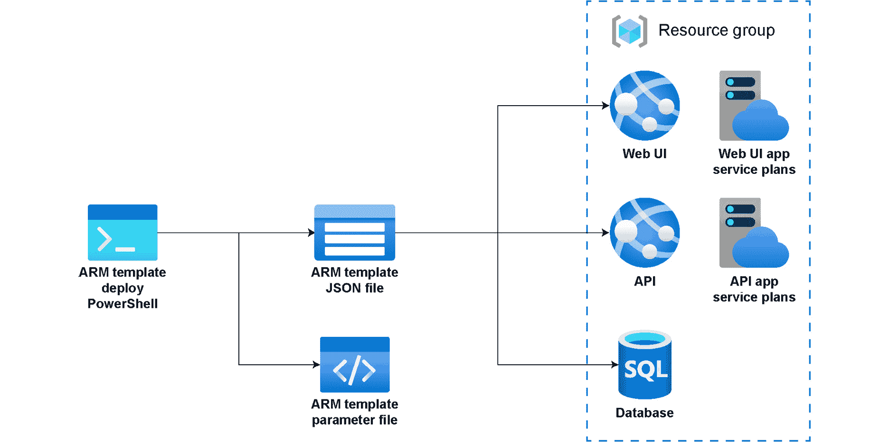
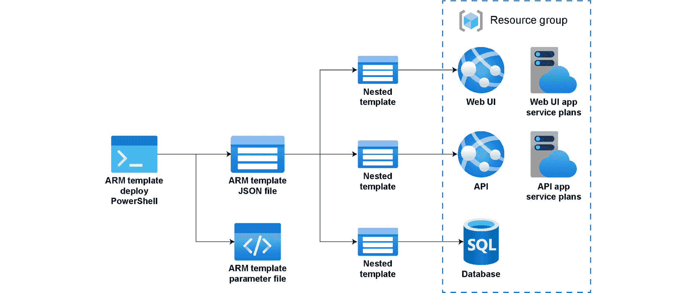
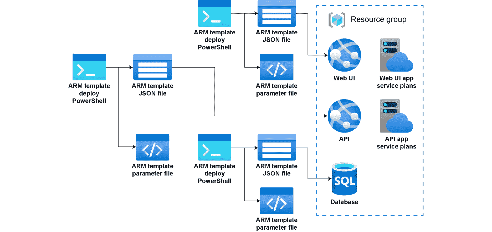
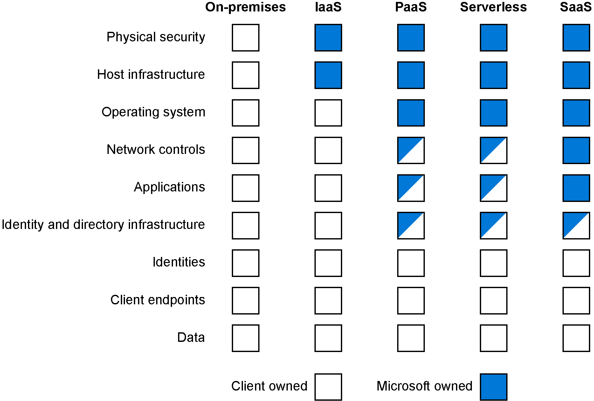
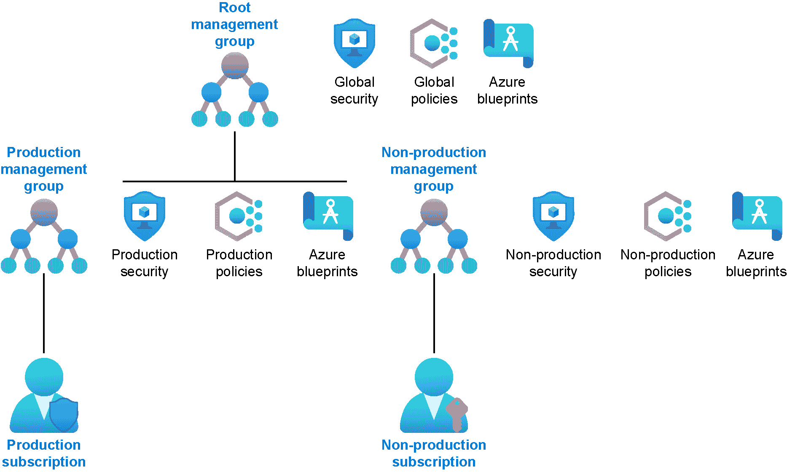

# 2\. Azure 中的自动化与治理

在上一章中，我们从本地和混合视角了解了云中的基础设施是如何工作的。现在，我们将看看如何在 Azure 中构建资源。你现在可以进入 Azure 门户并创建任何 Azure 资源；然而，如果没有自动化，这可能会非常繁琐。Azure 中的自动化是通过 Azure DevOps 和 **Azure 资源管理器**（**ARM**）模板完成的。我们严格遵循 Microsoft 的现成解决方案，但也有很多其他部署和开发工具可以帮助你完成自动化任务。一旦部署了资源，你需要确保它们是安全的。

在本章中，我们将讨论以下内容：

+   Azure DevOps 及其重要性

+   ARM 模板及其可以使用的不同方式

+   部署 Azure **基础设施即代码**（**IaC**）的基础知识和最佳实践

+   Azure 中身份和访问控制的好处及最佳实践

+   Azure 治理

在我们深入探讨如何实现自动化以及什么是基础设施即代码（IaC）之前，让我们先了解一下 Azure DevOps 和 ARM 模板，为这一自动化方法打下基础。

## Azure DevOps

虽然本章并非关于 Azure DevOps，但了解它所带来的基本功能是一个好主意。Azure DevOps 既是开发工具也是业务工具，因为它可以成为代码库的真实来源，并且是代码需要完成的项目待办事项的来源。让我们看看它所提供的一些选项，你可以从中选择使用：

+   Azure Repos 允许你创建一个 Git 仓库或 Team Foundation 版本控制库来存储开发源代码控制。

+   Azure Pipelines 是我们在本章中用于创建工件的关键流程之一，它提供了用于**持续集成和交付**（**CI/CD**）应用程序的构建和发布服务。

+   Azure Boards 帮助交付产品待办事项，以规划和跟踪工作、代码缺陷及在软件开发过程中可能出现的其他问题。

+   Azure Test Plans 允许你测试仓库中的代码，并使你能够执行手动和探索性测试，以及持续测试。

+   Azure Artifacts 提供了将代码打包和部署所需的元素，例如通常与 CI/CD 管道共享的 NuGet 资源。

正如你所看到的，Azure DevOps 是微软的工具，用于在 Azure 内部部署和管理应用程序，作为发布管理过程的一部分。想要了解更多关于 Azure DevOps 的信息，你可以前往文档：[`docs.microsoft.com/azure/devops/user-guide/what-is-azure-devops?view=azure-devops`](https://docs.microsoft.com/azure/devops/user-guide/what-is-azure-devops?view=azure-devops)。

#### 注意

Azure DevOps 提供五用户免费许可证，因此可以随时查看并探索 Azure 中的部署方式。请访问 [`azure.microsoft.com/services/devops/`](https://azure.microsoft.com/services/devops/) 创建您的免费帐户。

现在我们已经从非常高的层次讨论了一些工具，让我们来看看 ARM 模板。

### ARM 模板

ARM 模板是您基础设施如何以代码形式表示的方式。ARM 模板帮助团队以更敏捷的方式在云中部署基础设施；不再需要在 Azure 门户中点击“部署”来创建基础设施。ARM 模板是一个 JSON 文件，表示您的基础设施配置，以及一个 PowerShell 脚本，用于执行该模板并创建基础设施。

使用 ARM 模板系统的真正好处是它允许您使用声明性语法。这意味着您可以部署虚拟机并创建围绕它的网络基础设施。模板最终提供了一个可以一致、重复运行的过程。它们管理基础设施的期望状态，意味着模板成为这些基础设施资源的权威来源。如果您对基础设施进行更改，应该通过模板来完成。

模板部署过程无法完成，除非您组织模板过程的执行方式及其执行顺序。将这些文件拆分成较小的部分并允许它们相互链接或在不同的模板中以不同的方式重用也很有用。这有助于理解和控制您的基础设施，同时使其可重复和稳定。ARM 模板在 CI/CD 流水线和代码部署中用于构建组织内的一系列应用程序。

以下 JSON 文件展示了 ARM 模板的结构：

```
{
  "$schema": "https://schema.management.azure.com/schemas/2015-01-01/deploymentTemplate.json#",
  "contentVersion": "1.0.0.0",
  "parameters": {},
  "variables": {},
  "resources": [],
  "outputs": {}
}
```

如您所见，有几个重要部分：参数、变量、资源和输出。我们简要讨论一下每个部分：

+   ARM 模板文件应该是参数化的，并且有一个单独的文件来定义参数，映射到 JSON 模板文件中的 **参数** 列表。

+   **变量**部分用于文件中使用的变量。变量通常用于创建命名函数，以帮助生成已经结构化的命名约定，并通过构建该结构来使用输入参数生成名称。

+   **资源**部分是您尝试通过此 ARM 模板部署的所有资源的表示；这些资源可以是从虚拟机到网站的任何内容。

+   最后，**输出**部分是您希望从 ARM 模板中传递到其他地方使用的内容，比如在运行 SQL 脚本之前传递 SQL Server 名称。

在 Visual Studio 中创建 ARM 模板文件时，会创建三个文件：

+   第一种是 JSON 文件，这就是前面代码中表示的模板。

+   第二种是 JSON 参数输入文件，这个文件可以在每次部署时更改，以匹配您要部署的环境。

+   第三种是用于执行模板的 PowerShell 脚本。该 PowerShell 脚本接受资源组的输入、ARM 模板文件和参数文件。

这就是 Azure DevOps 和创建 ARM 模板时所生成文件的快速概述。接下来，让我们看看如何使用这些 ARM 模板部署 Azure 资源。

## 部署 Azure 基础设施即代码（IaC）

正如我们在*ARM 模板*部分看到的，我们希望使用 ARM 模板来部署我们的基础设施，因为它与我们的 CI/CD 过程非常契合。构建这些模板有几种方法。

一种方法是创建一个包含所有要部署资源的单体模板。为了让它更加模块化，您可以使用嵌套模板结构。或者，您可能希望采取一种更解耦的方法，创建更小的模板，并将它们链接在一起，从而构建一个高度可用和可重复的结构。

让我们从单体视图开始，看看每种方法：



图 2.1：单体 ARM 模板

如您在*图 2.1*中看到的，单体 ARM 模板部署了一个与 SQL 数据库连接的 UI 前端和 API 中间层。在这个过程中，我们需要在 JSON 模板中构建所有依赖项。SQL 数据库在 API 中间层之前部署，以便在 API 应用程序配置中使用连接字符串。然后，您将部署 UI 层，UI 应用程序配置中会使用 API URL。部署链不仅适用于部署代码，还可以帮助进行配置。

另外，您可以实现嵌套模板安排：



图 2.2：嵌套的 ARM 模板

如您所见，这与*图 2.1*中的结构类似。然而，这个结构中的模板被嵌套在单独的文件部分中。这意味着每个模板拥有其内部的资源，并且它正在尝试部署这些资源。这个结构类似于将 C# 代码拆分为可管理的方法和操作。这遵循与单体场景中讨论的相同的部署过程，但文件是嵌套的。

最终结构是链接的 ARM 模板：



图 2.3：链接的 ARM 模板

如你所见，模板最初是独立且解耦的，然后我们在发布流水线中将它们链接在一起。链接模板类似于嵌套模板，只不过文件是外部的，而嵌套模板则包含在与父模板相同的作用域内。这有助于后期的可重用性，因为这些模板是独立的文件，可以链接到其他部署文件中。

我们应该注意，使用链接或嵌套模板时，部署模式只能设置为**增量**模式。然而，主模板可以以**完整**模式部署，因此如果链接或嵌套模板针对的是同一个资源组，那么该组合部署将被评估为完整部署；否则，它将增量部署。要了解更多关于 ARM 部署模式的信息，请访问[`docs.microsoft.com/azure/azure-resource-manager/templates/deployment-modes`](https://docs.microsoft.com/azure/azure-resource-manager/templates/deployment-modes)。

我们已经看到不同的方式使用这些 ARM 模板来自动化基础设施的部署；现在我们来探讨这样做的好处。

## Azure IaC 的好处

使用 IaC 的主要好处是自动化不同资源和环境的创建、更新和配置。自动化将人为因素排除在外，同时带来一些关键的好处：

+   能够安排自动化部署，帮助运维人员减少工作时间。

+   能够进行自动化部署的烟雾测试。

+   能够创建可重复的流程。

+   可以实现完全自愈的应用程序。

+   能够回滚更改。

+   资源管理器有助于为资源打标签。

+   ARM 负责资源组中资源的依赖关系。

在任何阶段的自动化都是使用像 Azure 这样的平台的真正关键，无论是自动化基础设施的部署还是测试以确保生产部署的稳定性。

为了获得这些好处，我们需要学习如何有效地使用 ARM 模板。

## 最佳实践

我们想快速了解一些优化 ARM 模板的最佳实践。但首先，我们先了解一下模板的一些限制。

总体而言，模板的最大大小为 4 MB，每个参数文件的大小限制为 64 KB。你只能有 256 个参数、256 个变量、包含 800 个资源、64 个输出值和 24,576 个字符的模板表达式。如我们所讨论的，如果模板过大，你可以通过使用嵌套模板来超出某些限制，但微软建议你使用链接模板来避免这些限制。在接下来的章节中，我们将讨论 ARM 模板中每个组件的最佳实践。

### 参数

Azure DevOps 中的 ARM 模板系统会在部署操作之前解析参数值，并允许您将模板重用于不同的环境。需要特别指出的是，每个参数必须有一个明确的数据类型值。您可以在[`docs.microsoft.com/azure/azure-resource-manager/templates/template-syntax#data-types`](https://docs.microsoft.com/azure/azure-resource-manager/templates/template-syntax#data-types)找到这些数据类型的列表。

### 最佳实践

微软推荐以下关于参数的最佳实践：

+   最好尽量减少使用参数。正如我们在本章开头提到的，您应该使用变量来表示属性，只有在需要输入值时才使用参数。

+   推荐您使用驼峰命名法来命名参数。

+   还建议您描述每个参数，这样当其他开发人员使用模板时，他们能清楚地知道这些参数的作用。

+   确保为那些在环境变化时可能发生变化的设置使用参数，如容量或应用服务名称。

+   确保为参数命名，以便于识别。

+   为参数提供默认值；这涉及提供最小的虚拟机配置，以便非生产环境使用较小的资源，并且其他使用该模板的开发人员有一个基本的起始点。

+   如果您需要指定可选参数，请避免使用空字符串作为默认值，应该使用一个字面值。这有助于为模板用户提供命名结构。

+   尽量减少使用允许的值，因为这些值可能会随着时间变化，更新脚本时可能会变得困难。

+   始终为每个环境使用参数来设置用户名、密码或秘密，而不是将它们硬编码在模板中。对于所有密码和秘密，您还应该使用安全字符串。

+   当您需要为正在部署的资源设置位置时，将默认值设置为`resourcegroup().location`，这样资源组中的位置值就会正确设置。

正如您所看到的，参数在 ARM 模板过程中非常有用，因为它们使我们能够灵活地应对不同的部署环境。请记住，在使用模板部署应用程序或微服务时，尽量保持模板的简单性。

### 变量

变量也会在开始部署之前解析，资源管理器会将变量替换为其确定的值。变量在推导模板中的复杂命名时非常有用，它们让您只需传入所需的参数。

例如，一个组织使用客户 ID，并依赖此 ID 来保持所有部署的 Azure 资源对于该客户 ID 的唯一性。在这种情况下，您可以将客户 ID 作为参数创建，然后开发变量来使用命名标准生成名称。您可以在[`docs.microsoft.com/azure/azure-resource-manager/templates/template-syntax#data-types`](https://docs.microsoft.com/azure/azure-resource-manager/templates/template-syntax#data-types)中找到可接受的数据类型列表。

### 最佳实践

微软推荐以下变量的最佳实践：

+   记得删除未使用的变量和文件，以免引起混淆。

+   请使用驼峰命名法来命名您的变量。

+   对于模板中需要多次使用的值，请使用变量。

+   变量名称必须是唯一的。

+   对于重复的 JSON 对象模式，请在变量中使用复制循环。

### 资源

ARM 模板中的资源部分用于部署或更新的资源。ARM 模板通常有助于推导出 Azure 中资源的期望状态。在更改 Azure 基础设施时，最好先更改模板，然后重新运行它来更新 Azure 资源。很多时候，组织会在门户中进行更改，却忘记更新 ARM 模板，接下来部署这些资源时，它们会被部署到错误的状态。

### 最佳实践

微软推荐以下资源的最佳实践：

+   为您的资源添加注释，以便其他人了解其用途。

+   请记住，很多资源需要唯一的名称，因此永远不要将资源名称硬编码。

+   当您向自定义脚本扩展添加密码时，请使用 `CommandToExecute` 属性，在 Azure 资源管理器的保护设置中进行配置。

我们现在对 ARM 模板中的元素有了基本的理解。接下来的重点是，当您的资源部署完成后，我们将关注身份和访问控制。

## 身份和访问控制

在我们深入探讨之前，理解在安全性和保护资源方面，您与云服务提供商之间有共享责任是很重要的。必须了解您的责任在哪里结束，而云服务提供商的责任在哪里开始。让我们快速看一下 Azure 中的共享责任，如*图 2.4*所示：



图 2.4：Azure 共享责任

根据您在 Azure 中选择的服务类型，您的责任将有所不同，云服务提供商的责任也会不同。请注意本地资源和各种 Azure 选项之间的差异。您可以看到，无论有无新增责任，您始终需要对在云中创建的端点、账户管理、帐户和数据存储库负责。

由于 Azure 是面向公众的资源，安全性是其开发的重中之重。Azure 中有一系列工具和顾问，帮助你利用 Azure 的各种安全工具和功能。

### Azure 的安全性有哪些好处？

组织的本地安全组通常资源有限（团队成员和工具），无法有效查看漏洞和攻击者。使用像 Azure 这样的平台的一个好处是，你可以将这些职责转交给云端提供商，借助更高效、更智能的方式应对组织的威胁，而不需要引入物理资源。

Azure 的一个重要优势是，当你创建一个租户时，它自带 Azure AD，这让你可以从安全的角度开始使用 Azure。Azure AD 用于锁定 Azure 中的所有服务和资源。你还可以使用 Azure AD 来保护你的应用程序，或者创建**企业对客户**（**B2C**）或**企业对企业**（**B2B**）的 AD，以存储客户信息。

### Azure 中的有用工具

Azure 内置了多个安全和审计解决方案，用于增强你的安全防护，这些可以通过 Azure 门户的安全和审计仪表盘从首页查看。以下是一些帮助你和你的组织的有用工具：

+   我们之前提到过，Azure 资源管理器帮助将所有内容集中在一个地方，便于部署、更新和删除解决方案中的资源，以支持协调操作。

+   Azure 还提供了**应用性能管理**（**APM**），也称为应用洞察。应用洞察使你能够监控 Azure 中的应用程序，并检测性能异常。

+   Azure 监控允许你可视化基础设施的活动日志和单独的诊断日志，以监控你的 Azure 资源。

+   Azure 顾问就像一个个性化的云管家，帮助你优化云资源。该服务可以帮助检测应用程序中的安全和性能问题。

+   Azure 安全中心有助于防止、检测并应对 Azure 中应用程序面临的不同威胁。它帮助你在所有其他订阅中提供安全监控和策略管理。

### 最佳实践

以下是微软推荐的一些 Azure 安全最佳实践：

+   使用 Azure AD 进行中心化的安全控制和身份管理。这将使管理和集成更加高效。

+   尽量保持 Azure AD 实例为单一的真理源。

+   如果你有本地 AD，建议将其与 Azure AD 集成，使用 Azure AD Connect 实现单点登录体验。

+   如果你使用 Azure AD Connect 将本地 AD 与 Azure 同步，请开启密码哈希同步，以防主资源离线或被弃用。

+   请记住，你可以在新的应用程序中使用 Azure AD 进行身份验证，这可以通过 Azure AD 直接、B2B 或 B2C 来实现。

+   使用管理组来控制你对订阅的访问。这有助于集中管理，而不必担心在每个订阅中进行**Azure 身份和访问管理**（**IAM**）。

+   使用条件访问控制你的支持人员，以便他们在需要时提升权限，而不是始终拥有访问权限。

+   阻止不再使用的传统协议，以阻止攻击计划。

+   如果你在应用程序中使用 Azure AD，并且希望确保能够监控此过程，建议为用户启用自助密码重置功能。

+   如果你正在使用 Azure AD Connect，请确保你的云端策略与本地策略匹配。

+   如果可能，启用多因素身份验证以保障组织的安全。

+   如果你希望在 Azure 中提供内置角色，请确保优先使用基于角色的访问控制，而不是基于规则的访问控制，因为基于规则的访问控制在长期管理中可能非常繁琐。

+   确保对登录 Azure 的用户授予最小权限，这样当账户被攻破时，其访问权限将被限制。

+   至少定义两个紧急访问账户，以防组织管理员操作团队成员的账户被攻破。

+   如果你还希望主动监控 Azure AD 租户中的可疑活动，请确保控制资源创建的位置，因为不同地区可能有数据限制。

+   确保对你的存储账户使用身份验证和授权。

+   随着时间推移，回顾并应用对最佳实践的改进。

现在我们已经了解了 Azure 中的安全性，可以回顾一下如何使用 Azure 管理。

## Azure 管理

Azure 管理被定义为用于保持对 Azure 中应用程序和资源控制的流程和机制。这些是涉及你组织内计划优先事项的战略规划。Azure 管理通过两个服务提供：Azure Policy 和我们将在*第七章*中讨论的*提供、支持、资源和优化 Azure 成本的建议*，以及 Azure 成本管理。

Azure Policy 的目的是组织你的操作标准并评估合规性。Azure Policy 调节合规性、安全性、成本和管理，同时对你的资源实施一致性的治理。我们在 Azure 中看到的所有内容都由这些政策进行治理，这些政策包含 JSON 格式的业务规则和政策定义。你可以在 [`schema.management.azure.com/schemas/2019-09-01/policyDefinition.json`](https://schema.management.azure.com/schemas/2019-09-01/policyDefinition.json) 找到这些政策定义的架构。

### 其益处是什么？

Azure 治理和 Azure 策略帮助您在构建和扩展应用程序的同时保持一定的控制水平。这有助于创建防护栏，并协助通过 Azure 蓝图在组织的订阅中部署完全治理的环境。正如我们在*第七章*中讨论的那样，*提供优化 Azure 成本的建议、支持、资源和技巧*，它还通过提供支出洞察来帮助管理成本，从而最大化您的云投资。此外，Azure 治理还提供以下好处：

+   有助于对任何 Azure 服务的策略进行审计和执行

+   有助于在监控支出的同时，推动整个组织的问责制

+   创建合规的环境，包括资源、策略和访问控制

+   通过内建的合规性控制，帮助确保符合外部规定

在以下章节中，我们将详细介绍通过 Azure 治理可用的一些功能和服务，具体包括 Azure 管理组、Azure 策略、Azure 蓝图、Azure 图形以及 Azure 成本管理和计费。

### Azure 管理组

Azure 管理组通过将您的 Azure 订阅进行分组并对这些组采取行动来帮助管理您的 Azure 订阅。它们允许您通过蓝图定义安全性、策略和典型的部署方式。它们有助于创建您组织的层次视图，以便您能高效地管理订阅和资源：



图 2.5：Azure 管理组

正如在*图 2.5*中所示，生产和非生产环境之间有简单的分隔。我们应该从这张示意图中理解到，每个管理组都有一个根节点或父节点，所有层次结构都从这个节点继承。您可以在根节点创建全局结构，或者可以在任一分支中创建生产或非生产策略。

### Azure 策略

Azure 策略的实施旨在帮助确保资产符合组织在 Azure 中的标准。Azure 策略的常见用途包括实施资源一致性、安保、成本和管理的治理。像 Azure 中的其他内容一样，Azure 策略是 JSON 格式的，并且您可以为策略定义添加业务规则，从而简化这些规则的管理。

Azure 策略可以应用于 Azure 资源的不同生命周期阶段或在持续的合规性评估过程中。这些策略可以作为控制机制来拒绝更改或记录更改。Azure 策略与 Azure **基于规则的访问控制** (**RBAC**) 之间的区别在于，您的策略不会限制 Azure 操作。这意味着结合使用 Azure RBAC 和 Azure 策略可以提供 Azure 安全的完整范围。

以下是微软推荐的最佳实践：

+   使用 Azure 策略时，最好从审核策略开始，而不是拒绝策略，因为设置拒绝策略可能会妨碍在创建资源时的自动化任务。

+   在创建定义时，请考虑组织层级结构。建议在管理组或订阅级别创建更高层次的定义。

+   即使是最小的策略定义，也可以创建和分配计划定义或策略集。

+   值得记住的是，一旦初始分配被评估，所有该计划中的策略也会被评估。

+   你应该考虑使用策略来帮助控制你的基础设施，例如要求所有虚拟机安装防病毒软件，或者不允许在非生产环境中创建特定大小的虚拟机。要更好地了解 Azure 策略定义结构，你可以访问 [`docs.microsoft.com/azure/governance/policy/concepts/definition-structure`](https://docs.microsoft.com/azure/governance/policy/concepts/definition-structure) 了解更多信息。

### Azure 蓝图

Azure 蓝图使技术团队能够开发一套可重复的 Azure 资源，以支持组织的模式、需求和标准。蓝图是编排各种资源部署的好方法，例如角色分配、策略、ARM 模板和资源组。Azure 蓝图是 ARM 模板的扩展，旨在帮助环境设置，而 Azure 蓝图使用模板来实现这一目标。

### Azure Resource Graph

Azure Resource Graph 的创建旨在扩展 ARM 模板的功能，帮助跨订阅探索资源。Azure Resource Graph 查询允许你从已部署在 Azure 中的资源中搜索复杂的结果。Azure Resource Graph 是支持 Azure 搜索的查询系统。查询语言基于 Kusto 查询语言（KQL），该语言也被 Azure 数据探索器使用，因此它可能对你来说是新的，需要一些时间适应。

你需要在 Azure RBAC 中拥有适当的权限才能查看资源——这是读取权限。如果在使用 Azure Resource Graph 时没有返回任何结果，请先检查你的读取权限。

Azure Resource Graph 是免费的，但为了确保每个人都能获得最佳体验，使用时会受到限制。

### Azure 成本管理与计费

Azure 成本管理与计费的创建旨在帮助分析、管理和优化 Azure 工作负载的成本。它的引入旨在帮助企业在迁移到云时减少潜在的浪费和低效风险。Azure 成本管理与计费提供以下功能：

+   协助支付账单

+   生成包含成本和使用数据的月度发票，并可以下载

+   设置支出阈值

+   主动分析成本

+   识别优化 Azure 工作负载支出的机会

我们将在*第七章*《*Azure 中优化成本的方案、支持、资源和技巧*》中深入探讨此内容，因为个人和组织在 Azure 中管理成本流的方式有所不同。

## 摘要

正如你从这一章中看到的，Azure 和 Azure DevOps 之间具有显著的协同效应。创建一种可重复、稳定的方式来将代码和基础设施部署到云端至关重要。在学习如何将基础设施部署到云端时，我们需要理解为什么使用 ARM 模板。这促使我们讨论了一些部署基础设施的基本原则和最佳实践，以便利用我们的代码或应用程序。我们具体查看了如何通过身份和访问控制来保护资源和应用程序。这引导我们理解如何在 Azure 中创建治理，以确保一致性和合规性。

Azure 创建了许多框架，允许你消化确保应用程序安全和完整所需的内容。同样值得记住的是，在接触 Azure 时，应该从自动化的角度来接近它。一个组织应该制定合规性、Azure 管理和最佳实践，这些内容能在整个组织中有效运作，同时最小化其业务风险。

现在我们已经建立了基础，在下一章中，我们将讨论如何实现应用程序的现代化。

## 重要链接

+   *Azure 成本管理与计费*: [`docs.microsoft.com/azure/cost-management-billing/cost-management-billing-overview`](https://docs.microsoft.com/azure/cost-management-billing/cost-management-billing-overview)

+   *Azure 资源图*: [`docs.microsoft.com/azure/governance/resource-graph/`](https://docs.microsoft.com/azure/governance/resource-graph/)

+   *Azure 蓝图*: [`docs.microsoft.com/azure/governance/blueprints/overview`](https://docs.microsoft.com/azure/governance/blueprints/overview)

+   *Azure Policy*: [`docs.microsoft.com/azure/governance/policy/overview#policy-definition`](https://docs.microsoft.com/azure/governance/policy/overview#policy-definition)

+   *Azure Policy*: [`docs.microsoft.com/azure/governance/policy/concepts/definition-structure`](https://docs.microsoft.com/azure/governance/policy/concepts/definition-structure)

+   *Azure 管理组*: [`docs.microsoft.com/azure/governance/management-groups/`](https://docs.microsoft.com/azure/governance/management-groups/)

+   *ARM 模板工具包*: [`docs.microsoft.com/azure/azure-resource-manager/templates/test-toolkit`](https://docs.microsoft.com/azure/azure-resource-manager/templates/test-toolkit )

+   *ARM 模板结构*: [`docs.microsoft.com/azure/azure-resource-manager/templates/template-syntax`](https://docs.microsoft.com/azure/azure-resource-manager/templates/template-syntax)

+   *ARM 模板建议*: [`docs.microsoft.com/azure/azure-resource-manager/templates/templates-cloud-consistency`](https://docs.microsoft.com/azure/azure-resource-manager/templates/templates-cloud-consistency)

+   *Azure 安全中心*: [`azure.microsoft.com/services/security-center/`](https://azure.microsoft.com/services/security-center/)

+   *Azure 安全最佳实践*: [`azure.microsoft.com/blog/azure-storage-support-for-azure-ad-based-access-control-now-generally-available/`](https://azure.microsoft.com/blog/azure-storage-support-for-azure-ad-based-access-control-now-generally-available/)

+   *资源链接*: [`docs.microsoft.com/azure/azure-resource-manager/templates/template-syntax#resources`](https://docs.microsoft.com/azure/azure-resource-manager/templates/template-syntax#resources)

+   *ARM 模板最佳实践*: [`docs.microsoft.com/azure/azure-resource-manager/templates/template-best-practices?WT.mc_id=azuredevops-azuredevops-jagord`](https://docs.microsoft.com/azure/azure-resource-manager/templates/template-best-practices?WT.mc_id=azuredevops-azuredevops-jagord)

+   *变量*: [`docs.microsoft.com/azure/azure-resource-manager/templates/template-variables`](https://docs.microsoft.com/azure/azure-resource-manager/templates/template-variables)

+   *参数*: [`docs.microsoft.com/azure/azure-resource-manager/templates/template-parameters`](https://docs.microsoft.com/azure/azure-resource-manager/templates/template-parameters)
