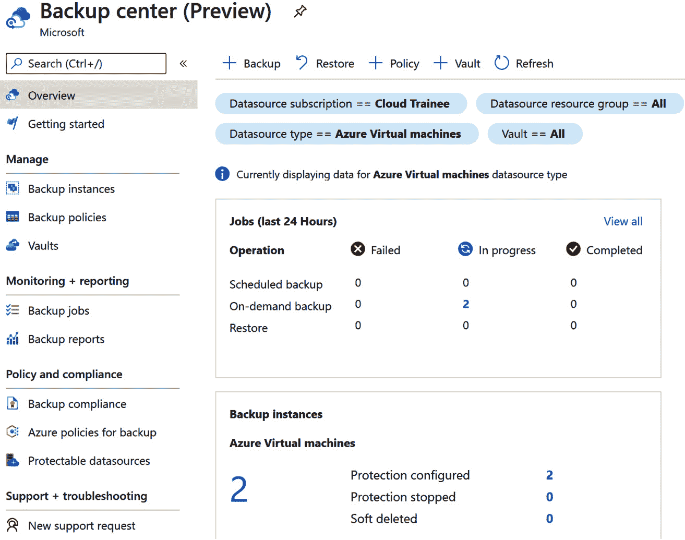
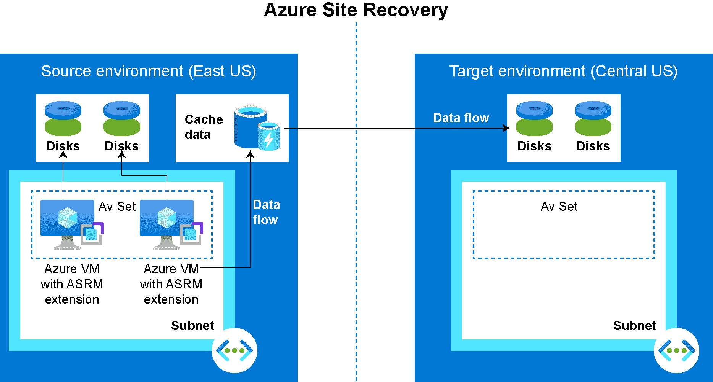

# 4. 云迁移：规划、实施和最佳实践

客户正在加速云端之旅，以优化成本、增强安全性和弹性，并按需扩展。组织迁移到 Azure 的主要动机之一是降低其 IT 基础设施的**拥有总成本**（**TCO**）。通过迁移到 Azure，组织可以从具有固定前期承诺的**资本支出**（**CapEx**）模式转向更灵活、可扩展的**运营支出**（**OpEx**）模式。在 OpEx 模式下，组织通过仅为其消耗的资源和服务付费来减少支出。

正如我们将在本章中讨论的那样，这只是迁移到 Azure 后你将获得的许多好处之一。首先，我们将看到微软提供了一个框架，帮助你在架构中实现可靠性、安全性和高可用性。然后，我们将探索 Azure 的基础设施，帮助你做出最明智的选择以实现迁移目标。在我们建立了 Azure 基础设施的基础知识后，我们将讨论一些常见的工作负载迁移场景，以及如何实现云规模并最大化性能。

本章将涵盖以下主题：

+   微软的 Well-Architected 框架

+   选择你的基础设施

+   工作负载迁移场景

+   实现云规模并最大化性能

+   企业级备份和灾难恢复

+   Azure 迁移最佳实践和支持

让我们首先讨论在 Azure 中使用 Microsoft Well-Architected 框架进行可靠系统规划、设计和实施的架构最佳实践。

## 微软 Azure Well-Architected 框架

随着组织将员工转移到远程工作，关键基础设施和应用程序受到了影响。虽然一些组织能够将应用程序迁移到云端，但其他组织则不得不重新设计其云端环境。然而，设计和部署成功的云工作负载可能会具有挑战性，特别是当组织面临时间限制，以确保它们能够继续支持全球客户时。

在云中运行时，有几个设计原则和考虑因素与在本地部署时不同，比如你如何管理工作负载、基础设施成本、监控、安全性和性能。我们曾经为本地应用程序执行的许多管理任务并不适用于云环境。

如果我们在云中运行的工作负载没有正确部署，那么可能会有各种后果，影响 Azure 服务的成本和应用程序的性能。

为了帮助您和您的组织解决在 Azure 中规划、设计和实施可靠系统的复杂性，微软创建了 Azure Well-Architected 框架，提供了构建 Azure 云解决方案的最佳实践。该框架旨在指导您提高在 Azure 中运行的解决方案的质量，包含五大支柱：

+   **成本优化** 使您能够创建成本效益高的解决方案。

+   **运营卓越** 确保通过最小的停机时间保持系统在生产环境中的持续运行。

+   **性能效率** 能够按需扩展并在使用高峰时满足业务需求。

+   **可靠性** 能够快速从可能影响应用程序可用性的故障中恢复。

+   **安全性** 保护您的应用程序和数据，并快速响应潜在的威胁和漏洞。

基于行业标准，微软帮助客户提高其工作负载的质量。该框架是微软 Azure Well-Architected 计划的核心，包含文档、参考架构和设计原则，帮助您理解并找出如何更好地设计、实施和成功部署这些工作负载到云端。

微软还提供了 Azure Well-Architected 审查，它是一个 web 应用程序，通过问答帮助您更好地理解工作负载的设计，并评估需要改进的地方。

此外，Azure Advisor 与 Azure Well-Architected 框架的五大支柱保持一致，提供实时建议，帮助您改善在云中运行的所有资源的性能。

我们推荐以下微软学习路径来学习 Well-Architected 框架：[`docs.microsoft.com/learn/paths/azure-well-architected-framework/`](https://docs.microsoft.com/learn/paths/azure-well-architected-framework/)

许多组织从 **基础设施即服务** (**IaaS**) 开始他们的云之旅。在下一节中，我们将首先通过学习 Azure 的三项核心服务来建立基础知识。稍后在本章中，我们将探讨其他常见的工作负载迁移场景。

## 选择您的底层基础设施

在本节中，我们将检查 Azure 的底层基础设施。其核心是，典型的 Azure IaaS 环境由以下三项服务构成：

+   计算

+   网络

+   存储

这三项服务构成了 IaaS 环境中的主要架构构建块。我们将详细探讨每一项核心服务，从 Azure 计算开始。

### 计算

无论您是部署新工作负载还是将现有工作负载迁移到云，Azure 计算提供了运行工作负载所需的基础设施。

下面是 Azure 计算的一些关键功能：

+   Azure 提供超过 700 种**虚拟机**（**VM**）规格，几乎可以应对所有类型的工作负载。从开发/测试工作负载、关键生产工作负载到面向客户的应用程序高性能计算场景。

+   您可以在 Windows Server 和多个 Linux 发行版上运行应用程序，如 Red Hat、SUSE、Ubuntu、CentOS、Debian、Oracle Linux 和 CoreOS。此外，Microsoft 提供与 Red Hat 和 SUSE 的 24x7 集成协作支持。

+   Azure 提供了专门的裸金属基础设施，用于运行越来越多的解决方案，如 SAP HANA、NetApp 或 Cray 等在 Azure 中的服务。

+   Azure 提供了一个**常青**的基础架构，拥有来自 Intel®、AMD 和 NVIDIA 的 CPU 和 GPU，帮助您获得最佳的性价比。

+   您可以选择在任何可用的 Azure 区域运行应用程序。您还可以利用多个区域来提高应用程序的大规模弹性。

+   Azure 提供了多种定价模式，从按需付费到预订，包括 1 年或 3 年期的折扣。此外，还有优化工具，提供调整大小的建议，帮助您充分利用 Azure 环境。

+   如果您已有 Windows Server 订阅、SQL Server 许可证或具有软件保障的 Windows Server 许可证，并且享受**Azure 混合权益**，您可以在将工作负载迁移到 Azure 时重复使用它们，从而显著节省成本。此外，借助 Azure 混合权益，您还可以在 Azure 上使用现有的本地 Red Hat 和 SUSE 软件订阅。

对于 Azure 客户来说，最常见的迁移场景之一是将现有的本地环境迁移到云端，几乎不需要任何改变。这通常被称为“提升与迁移”或“重新托管”。我们可以利用虚拟化技术帮助迁移现有的本地工作负载到 Azure。毫无疑问，虚拟化技术在简化组织如何在 Azure 上部署和管理 IT 基础设施方面起到了积极作用，部分归功于像 Microsoft Hyper-V 和 VMware vSphere 等解决方案。此外，熟悉在本地运行虚拟机的管理员可以成功地将相同的技能应用于 Azure。

在下表中，我们为您提供了一些常见的使用场景以及每个场景推荐的 Azure 计算服务。您可以使用此表来规划您的下一步云迁移策略。我们还包括了每个 Azure 计算服务的链接，供您进一步了解。

| 计算服务 | 常见使用场景 |
| --- | --- |
| Azure 应用服务: https://azure.microsoft.com/services/app-service/ | 为开发云原生应用程序提供全面管理的平台，支持 Web 和移动端应用。 |
| Azure 专用主机: https://azure.microsoft.com/services/virtual-machines/dedicated-host/ | 在专用物理服务器上部署 Azure 虚拟机，以隔离仅供您组织使用的工作负载。 |
| Azure 函数: https://azure.microsoft.com/services/functions/ | 你可以使用事件驱动的无服务器架构加速应用开发，无需额外设置。 |
| Azure 容器实例: https://azure.microsoft.com/services/container-instances/ | 帮助你通过单个命令轻松在 Azure 中运行容器。 |
| Azure Kubernetes 服务: https://azure.microsoft.com/services/kubernetes-service/ | 用于简化 Kubernetes 的部署、管理和操作。 |
| Azure Service Fabric: https://azure.microsoft.com/services/service-fabric/ | 用于开发微服务和在 Windows 与 Linux 上编排容器。 |
| Azure Batch: https://azure.microsoft.com/services/batch/ | 用于访问云规模的作业调度和计算管理，支持 10 倍、100 倍、1000 倍虚拟机。 |
| Azure 云服务: https://azure.microsoft.com/services/cloud-services/ | 如果你更倾向于使用 PaaS 技术来部署可扩展、可靠且运营成本低廉的 Web 和云应用程序。 |
| 虚拟机: https://azure.microsoft.com/services/virtual-machines/ | 如果你需要快速部署 Linux 和 Windows 虚拟机，并完全控制云环境。 |
| 虚拟机规模集: https://azure.microsoft.com/services/virtual-machine-scale-sets/ | 用于在几分钟内自动扩展大量负载均衡虚拟机，以根据需求实现高可用性和性能。 |
| Azure VMware 解决方案: https://azure.microsoft.com/services/azure-vmware/ | 如果你希望在 Azure 上本地运行你的 VMware 工作负载。 |

表格 4.1：常见使用案例的推荐 Azure 服务

现在我们已经了解了 Azure 计算的能力，接下来我们来看看 Azure 网络。

### 网络

Azure 网络安全地连接并交付你的云原生和混合工作负载，提供低延迟和基于零信任的网络服务。零信任是一种安全概念，强调组织不应自动信任其边界内外的任何事物。相反，任何尝试连接到系统的请求都必须在授权之前进行验证。

在下表中，我们为你提供了一些常见的使用案例以及推荐的 Azure 网络服务。你可以使用此表来规划下一个云迁移策略。我们还包含了每个 Azure 网络服务的链接，方便你深入了解它们：

| 网络服务 | 常见使用案例 |
| --- | --- |
| Azure Bastion: [`azure.microsoft.com/services/azure-bastion/`](https://azure.microsoft.com/services/azure-bastion/) | 用于通过私有和完全托管的 RDP 与 SSH 访问虚拟机。 |
| Azure 虚拟网络: [`azure.microsoft.com/services/virtual-network/`](https://azure.microsoft.com/services/virtual-network/) | 用于连接从虚拟机到传入 VPN 连接的所有内容。 |
| Azure ExpressRoute: [`azure.microsoft.com/services/expressroute/`](https://azure.microsoft.com/services/expressroute/) | 如果需要将本地网络与 Azure 连接以提供专用网络连接。 |
| Azure VPN Gateway: [`azure.microsoft.com/services/vpn-gateway/`](https://azure.microsoft.com/services/vpn-gateway/) | 用于通过互联网安全访问 Azure 虚拟网络。 |
| Azure Virtual WAN: [`azure.microsoft.com/services/virtual-wan/`](https://azure.microsoft.com/services/virtual-wan/) | 通过统一门户安全地连接办公地点、零售位置和站点。 |
| Azure DDoS Protection: [`azure.microsoft.com/services/ddos-protection/`](https://azure.microsoft.com/services/ddos-protection/) | 用于保护您的应用程序免受 DDoS 攻击。 |
| Azure Firewall: [`azure.microsoft.com/services/azure-firewall/`](https://azure.microsoft.com/services/azure-firewall/) | 需要添加原生防火墙功能，无需维护且具备内建的高可用性。 |
| Azure Firewall Manager: [`azure.microsoft.com/services/firewall-manager/`](https://azure.microsoft.com/services/firewall-manager/) | 需要一种集中管理网络安全策略和路由的方式。 |
| Azure Load Balancer: [`azure.microsoft.com/services/load-balancer/`](https://azure.microsoft.com/services/load-balancer/) | 需要对应用程序的传入和传出连接进行负载均衡。 |
| Traffic Manager: [`azure.microsoft.com/services/traffic-manager/`](https://azure.microsoft.com/services/traffic-manager/) | 需要路由传入的流量以提高性能和可用性。 |
| Network Watcher: [`azure.microsoft.com/services/network-watcher/`](https://azure.microsoft.com/services/network-watcher/) | 需要监控和诊断网络问题。 |
| Azure Web Application Firewall: [`azure.microsoft.com/services/web-application-firewall/`](https://azure.microsoft.com/services/web-application-firewall/) | 需要使用 Web 应用防火墙服务来增强 Web 应用程序的安全性。 |
| Azure Application Gateway: [`azure.microsoft.com/services/application-gateway/`](https://azure.microsoft.com/services/application-gateway/) | 用于使用 Web 流量负载均衡器来管理到 Web 应用程序的流量。 |
| Azure DNS: [`azure.microsoft.com/services/dns/`](https://azure.microsoft.com/services/dns/) | 确保超快的 DNS 响应和可用性，以满足您的域名需求。 |
| Azure Private Link: [`azure.microsoft.com/services/private-link/`](https://azure.microsoft.com/services/private-link/) | 需要为托管在 Azure 平台上的服务提供专用访问。 |
| Azure Front Door：[`azure.microsoft.com/services/frontdoor/`](https://azure.microsoft.com/services/frontdoor/) | 你需要为全球范围且基于微服务的 Web 应用程序提供一个具有增强安全性、可扩展的交付点。 |
| Azure CDN：[`azure.microsoft.com/services/cdn/`](https://azure.microsoft.com/services/cdn/) | 你需要加速向全球客户传递高带宽内容。 |
| Azure Internet Analyzer（预览版）：[`azure.microsoft.com/services/internet-analyzer/`](https://azure.microsoft.com/services/internet-analyzer/) | 你需要测试网络基础设施变化对性能的影响。 |

表 4.2：常见用例推荐的 Azure 服务

Azure 基础设施的另一个关键组件是存储，我们将在下一节中讨论。

### 存储

在今天的商业环境中，数据以快速的速度增长。组织对最佳存储解决方案的需求日益增加。对于存储解决方案，Azure 提供了众多服务，组织可以根据成本和性能要求选择最适合的方案：

+   Azure Disk Storage

+   Azure 文件

+   Azure Blob Storage

+   Azure Data Lake Storage

+   Azure NetApp 文件

让我们更详细地了解这些 Azure 存储产品。

### Azure Disk Storage

**Azure Disk Storage** 旨在与 Azure 虚拟机配合使用。它提供高性能以及为关键任务和业务应用程序提供高度耐用的块存储。

Azure Disk Storage 的一些关键特性和优势包括：

+   **具有成本效益的存储**：

    +   根据不同的价格点和性能特征，通过各种磁盘选项优化成本，并获得适合工作负载的精确存储。

    +   使用共享磁盘将基于 Windows 和 Linux 的集群或高可用性应用程序以具有成本效益的方式迁移到云端。

+   **无与伦比的弹性**：

    +   Azure 为所有单实例虚拟机使用 Azure Disk Storage 提供可用性保证。

    +   Azure Disk Storage 提供企业级的耐用性，年化故障率为零。

+   **无缝可扩展性和高性能**：

    +   使用 Azure Ultra Disk Storage 动态扩展性能，获得高 IOPS 和吞吐量，同时保持一致的亚毫秒延迟。

    +   根据需求扩展性能，使用性能层和内建的突发功能来满足业务需求。

+   **内建安全性**：

    +   使用 Microsoft 管理的密钥或您自己的自定义密钥来自动加密数据，保护数据安全。

    +   通过 Azure Private Link 支持，限制磁盘的导入和导出仅在你的私有虚拟网络内进行。

根据成本和性能需求，您可以选择四种类型的磁盘存储选项：

+   Ultra Disk Storage

+   高级 SSD

+   标准 SSD

+   标准 HDD

数据密集型和事务密集型工作负载可以从**Azure Ultra Disk Storage**的高性能和一致的低延迟能力中受益。此类工作负载的例子包括 SAP HANA、顶级数据库如 SQL Server 和 Oracle，以及 NoSQL 数据库如 MongoDB 和 Cassandra。

要了解更多关于这些磁盘存储选项的信息，请访问[`docs.microsoft.com/azure/virtual-machines/disks-types`](https://docs.microsoft.com/azure/virtual-machines/disks-types)。

### Azure 文件存储

**Azure Files**是一个理想的完全托管云文件共享服务，既是无服务器的又是安全的。您可以通过行业标准的 NFS 和 SMB 协议访问 Azure Files 上的共享文件。此外，它还可以作为容器的持久共享存储，与 AKS 紧密集成。如果您寻找跨平台的混合体验，您会很高兴知道，Azure 文件共享可以通过 Azure File Sync 在 Windows、Linux 或 macOS 系统上同时挂载，无论是在 Azure 还是本地环境中。

要了解更多关于 Azure Files 的信息，请访问[`docs.microsoft.com/azure/storage/files/storage-files-introduction`](https://docs.microsoft.com/azure/storage/files/storage-files-introduction)。

### Azure Blob 存储

**Azure Blob 存储**提供高度可扩展、可用且安全的存储。在安全性方面，数据可以通过静态加密和高级威胁保护来保护，同时数据访问可以通过**Azure Active Directory**（**Azure AD**）、**基于角色的访问控制**（**RBAC**）和网络级控制来保护。

它适用于以下类型的工作负载：

+   云原生和移动应用程序

+   高性能计算

+   机器学习工作负载

+   存储归档

Azure Blob 存储的一些关键功能和优势包括：

+   **完全支持云原生应用程序开发：**

    +   提供云原生应用程序所需的可扩展性和安全性。

    +   支持 Azure Functions 和许多流行的开发框架，如.NET、Python、Java 和 Node.js。

+   **存储数 PB 数据：**

    +   以最具成本效益的方式存档不常访问的数据。

    +   用 Azure Blob 存储替代旧的磁带存储，减少跨硬件代际迁移的需求。

+   **为高性能计算（HPC）扩展：**

    +   能满足 HPC 应用程序的高吞吐量要求。

+   **为数十亿 IoT 设备扩展：**

    +   提供存储，以收集来自数十亿 IoT 设备的数据点。

你可以在[`docs.microsoft.com/azure/storage/blobs/storage-blobs-overview`](https://docs.microsoft.com/azure/storage/blobs/storage-blobs-overview)了解更多关于 Azure Blob 存储的信息。

### Azure 数据湖存储

**Azure Data Lake Storage** 提供了一种高可扩展且具有成本效益的大数据分析数据湖解决方案。它针对分析工作负载进行了优化，并通过提供单一的存储平台来支持 Azure Synapse Analytics 和 Power BI，便于数据的获取、处理和可视化。

它具有成本效益，因为它允许存储和计算的扩展可以独立进行（这是本地数据湖无法实现的）。Azure Data Lake Storage Gen2 还允许通过自动化生命周期管理策略进一步优化成本，并可以根据使用情况自动扩展或缩减。

在安全性方面，它提供与 Azure Blob 存储相同级别的安全性，包括静态加密和高级威胁防护。与 Azure Blob 存储类似，数据访问可以通过 **Azure AD**、**RBAC** 和网络级别控制来保护。

您可以在[`docs.microsoft.com/azure/storage/blobs/data-lake-storage-introduction`](https://docs.microsoft.com/azure/storage/blobs/data-lake-storage-introduction)了解更多关于 Azure Data Lake Storage 的信息。

### Azure NetApp 文件

在云中运行性能密集型和延迟敏感的文件工作负载可能是具有挑战性的。**Azure NetApp 文件**使企业的 **业务线**（**LOB**）和存储专业人员能够轻松迁移并运行复杂的基于文件的应用程序，无需更改代码。Azure NetApp 文件是一个完全托管的 Azure 服务，由 NetApp 的行业领先存储技术提供支持。它广泛用于各种场景中的共享文件存储服务，包括：

+   POSIX 兼容的 Linux 和 Windows 应用程序的迁移（提升和转移）

+   SAP HANA

+   数据库

+   高性能计算（HPC）基础设施和应用程序

+   企业 Web 应用程序

您可以在[`docs.microsoft.com/azure/azure-netapp-files/`](https://docs.microsoft.com/azure/azure-netapp-files/)了解更多关于 Azure NetApp 文件的信息。

这结束了我们对 Azure 基础设施的快速浏览，概述了 Azure 的核心服务：计算、网络和存储。在下一节中，我们将查看一些常见的工作负载迁移场景。

## 工作负载迁移场景

在上一节中，我们构建了对 Azure 底层基础设施的基础理解。我们将继续在此基础上，通过讨论以下常见的工作负载迁移场景来扩展这些知识：

+   Windows Server 和 Linux 工作负载

+   SQL Server

+   容器

+   VMware 工作负载

+   SAP 工作负载

+   高性能计算（HPC）

让我们从 Windows Server 和 Linux 工作负载开始。

### Windows Server 和 Linux 工作负载

当涉及到将 Windows Server 和 Linux 虚拟机从本地迁移到 Azure 时，微软建议使用 **Azure Migrate** 工具和服务中心。Azure Migrate 提供了一个集中的中心，用于发现、评估和迁移到 Azure。Azure Migrate 中的 **Server Migration** 工具专门用于将服务器迁移到 Azure。

Azure Migrate 的一些关键功能和好处包括：

+   您可以跨不同的环境和场景进行迁移，包括本地服务器、VM、数据库、Web 应用和虚拟桌面。

+   您可以使用内置的 Azure 工具以及您选择的第三方工具，进行全面的发现、评估和迁移。

+   您可以在仪表板中全面查看迁移进度。

+   您可以通过快速的升迁和迁移工具高效迁移，无需额外费用（包括在您的 Azure 订阅中）。

一旦将 VM 迁移到 Azure，您应该启用 **Azure Automanage**，以简化日常和重复的 IT 管理任务。Azure Automanage 允许 IT 管理员通过点击界面管理和自动化日常操作，并跨 Windows 和 Linux 服务器执行生命周期管理。

Azure Automanage 可与任何新的或现有的 Windows Server 或 Linux VM 一起使用。它会根据 Microsoft Cloud Adoption Framework 中定义的最佳实践自动执行 VM 管理。Azure Automanage 消除了服务发现、注册和 VM 配置的需求。例如，Azure Automanage 使客户能够通过提供一种简便的方法，将操作系统基线应用于 VM，从而实施安全最佳实践，符合 Microsoft 的基线配置。像 Azure Security Center 这样的服务会根据客户选择的配置文件自动启用。如果 VM 的配置偏离应用的最佳实践，Azure Automanage 会检测到并自动将 VM 恢复到期望的配置。

要了解更多关于 Azure Migrate 的信息，请访问 [`docs.microsoft.com/azure/migrate/migrate-services-overview`](https://docs.microsoft.com/azure/migrate/migrate-services-overview)。

要了解更多关于 Azure Automanage 的信息，请访问 [`azure.microsoft.com/services/azure-automanage`](https://azure.microsoft.com/services/azure-automanage)。

要了解更多关于 Azure Security Center 的信息，请访问 [`azure.microsoft.com/services/security-center/`](https://azure.microsoft.com/services/security-center/)。

有关 Microsoft Cloud Adoption Framework 的信息，请访问 [`docs.microsoft.com/azure/cloud-adoption-framework/`](https://docs.microsoft.com/azure/cloud-adoption-framework/)。

### SQL Server

Azure SQL 是一系列安全、托管和智能产品，构建在 Azure 云中的熟悉 SQL Server 数据库引擎之上。微软的数据平台使用 SQL Server 技术，并使其在各种不同的环境中可用。包括公有云以及私有云环境（可以是第三方托管），以及物理本地机器。因此，Azure SQL 目的地与本地 SQL Server 提供一致的体验，允许您将自己熟悉的技能、工具、语言和框架与应用程序一起迁移到 Azure。您可以使用 Azure Migrate 轻松迁移应用程序，并继续使用您熟悉的资源。

以下表格清晰地展示了每个 Azure SQL 产品及其用途，帮助您做出适合自己需求的明智决策：

| Azure SQL 产品 | 常见使用场景 |
| --- | --- |
| Azure SQL 数据库 | 支持现代云应用程序，提供智能、完全托管的数据库服务，并包括无服务器计算功能。 |
| Azure SQL 托管实例 | 将现有的本地应用程序迁移到 Azure，并要求与完整的 SQL Server 数据库引擎保持 100% 功能对等。迁移后，您不希望再管理 SQL Server 的升级或维护。 |
| SQL Server on Azure VMs | 轻松迁移现有 SQL Server 工作负载，同时保持 100% SQL Server 兼容性和操作系统级别访问。您希望对数据库服务器以及其运行的底层操作系统拥有完全控制。 |

表格 4.3：Azure SQL 产品及常见使用场景

我们将更详细地介绍每个 Azure SQL 产品。

### Azure SQL 数据库

**Azure SQL 数据库** 是 Azure **平台即服务**（**PaaS**）产品，是一个完全托管的 SQL Server 数据库引擎，托管在 Azure 中。Azure SQL 数据库基于最新的稳定版 SQL Server 企业版。它是需要当前稳定 SQL Server 功能的云应用程序的理想选择，同时还能减少开发和市场推广时间的需求。

使用 Azure SQL 数据库，您可以根据需要快速进行扩展和缩减，无需中断。它还提供了 SQL Server 中没有的额外功能，包括内置的高可用性、智能化和管理功能。

### Azure SQL 托管实例

**Azure SQL 托管实例** 是 Azure 的 PaaS 产品，类似于完整的 Microsoft SQL Server 数据库引擎实例。它非常适合将本地应用程序迁移到 Azure，且几乎无需数据库更改。Azure SQL 托管实例包括 Azure SQL 数据库的所有 PaaS 优势，但还添加了以前仅在 Azure 虚拟机上的 SQL Server 中可用的功能（如下一节所述），包括本地虚拟网络和与本地 SQL Server 几乎 100% 的兼容性。

### SQL Server 在 Azure 虚拟机上

**SQL Server 在 Azure 虚拟机上** 是一种 Azure **基础设施即服务** (**IaaS**) 服务，允许您在 Azure 虚拟机内运行完整的 SQL Server。SQL Server 在 Azure 虚拟机上非常适合使用“提升和迁移”方法将现有的本地数据库迁移到 Azure，几乎无需对数据库进行任何更改。通过 SQL Server 在 Azure 虚拟机上，您对 SQL Server 实例以及运行在 Azure 虚拟机上的底层操作系统具有完全的管理控制。然而，拥有这种完全控制权的同时，您还需负责升级、维护和备份虚拟机上的软件。如果您的组织已经有 IT 资源来管理虚拟机，这将不成问题。

这是 SQL Server 在 Azure 虚拟机上的一些其他好处：

+   您可以在 Windows Server 虚拟机或 Linux 虚拟机上安装和托管您的 SQL Server。

+   所有最新版本和版本的 SQL Server 都可以在 Azure 虚拟机中安装。

+   您可以使用现有的 SQL Server 许可证来在 Azure 虚拟机上运行 SQL Server，或者使用一个预构建的 SQL Server 虚拟机镜像，其中已经包括了 SQL Server 许可证。这同样适用于通过 Azure 混合权益的 PaaS 服务。

+   SQL Server 在 Azure 虚拟机上允许您构建一个具有高度自定义性的系统，以满足应用程序的性能和可用性需求。

+   您可以使用 SQL Server 在 Azure 虚拟机上快速启动一个环境来开发和测试传统的 SQL Server 应用程序。

总结本节内容时，我们将讨论这三种 Azure 数据库服务的关键区别。

### Azure SQL 数据库、Azure SQL 托管实例和 SQL Server 在 Azure 虚拟机上的关键区别

这三种 Azure 数据库服务之间最显著的区别是，SQL Server 在 Azure 虚拟机上允许您对数据库引擎进行完全控制。而 SQL 数据库和 SQL 托管实例是基于 PaaS 的，这意味着您无需管理 SQL 数据库和 SQL 托管实例的升级或备份。另一方面，SQL Server 在 Azure 虚拟机上是基于 IaaS 的，因此您需要自己管理操作系统、数据库软件和备份的升级。您应该根据迁移需求选择合适的 Azure 数据库服务。

另一项被许多组织广泛采用的技术是容器。

### 容器

容器因其允许您轻松地将应用程序从一个环境迁移到另一个环境，而无需更改应用程序而广泛流行。关于容器，Azure 提供了多种选择，包括：

+   Azure Kubernetes 服务（AKS）

+   Azure 容器实例（ACI）

+   Web 应用程序容器

ACI 允许你为不需要完整容器编排的小型应用程序创建独立的容器。这些实例启动迅速，可以利用 Azure 虚拟网络和公共 IP。ACI 非常适合 **概念验证** (**PoC**) 应用程序。

要了解更多关于 ACI 的内容，请访问 [`azure.microsoft.com/services/container-instances/`](https://azure.microsoft.com/services/container-instances/)。

AKS 简化了在 Azure 上部署托管 Kubernetes 集群的过程。由于许多管理责任已被转移到 Azure，因此管理 Kubernetes 的复杂性和操作开销大大减少。

Azure 管理 Kubernetes 主节点并处理关键任务，如维护和健康监控。这意味着你只需要管理代理节点。因此，你只需为代理节点付费，而不需要为集群中的主节点付费；作为托管的 Kubernetes 服务，AKS 是免费的。如果你希望创建 AKS 集群，你可以在 Azure 门户中进行创建。或者，你可以使用 Azure CLI 或各种模板驱动的部署选项，如 **Azure 资源管理器** (**ARM**) 模板和 Terraform。

当部署 AKS 集群时，所有节点（包括主节点和代理节点）都会为你自动部署和配置。在部署过程中，你还可以配置额外的功能，如 **Azure AD** 集成、先进的网络和监控。AKS 还支持 Windows Server 容器。

要了解更多关于 AKS 的信息，请访问 [`docs.microsoft.com/azure/aks/intro-kubernetes`](https://docs.microsoft.com/azure/aks/intro-kubernetes)。

使用 **Web 应用程序容器**，你可以轻松地在 Windows 和 Linux 上部署和运行容器化应用程序。它提供了内建的自动扩展和负载均衡。你可以通过 GitHub、Azure 容器注册表和 Docker Hub 自动化你的 **持续集成/持续部署** (**CI/CD**) 流程。你还可以设置自动扩展以满足工作负载需求。例如，你可以设置扩展规则，以在非高峰时段降低成本。

要了解更多关于 Web 应用程序容器的内容，请访问 [`azure.microsoft.com/services/app-service/containers/`](https://azure.microsoft.com/services/app-service/containers/)。

### VMware 工作负载

使用 Azure VMware 解决方案，你可以无缝地将 VMware 工作负载从本地环境迁移到 Azure。这使你可以继续使用熟悉的工具管理现有的 VMware 环境，同时将 VMware 工作负载原生运行在 Azure 上。

你可以在 [`azure.microsoft.com/services/azure-vmware/`](https://azure.microsoft.com/services/azure-vmware/) 了解更多关于 Azure VMware 解决方案的信息。

另一种将 VMware 工作负载迁移到 Azure 的方法是使用 **Azure Migrate: Server Migration** 工具。你可以通过两种方式将 VMware 虚拟机迁移到 Azure：

1.  无代理迁移

1.  基于代理的迁移

我们将在下面突出每种类型迁移所涉及的步骤，并提供链接以便您获取详细的迁移指导。

### 无代理迁移

以下是无代理迁移所涉及的步骤概述：

1.  设置**Azure Migrate**设备。

1.  复制虚拟机（VM）。

1.  跟踪并监控迁移状态。

1.  进行测试迁移。

1.  迁移虚拟机（VM）。

1.  完成迁移。

有关无代理迁移的更多信息，请访问：[`docs.microsoft.com/azure/migrate/tutorial-migrate-vmware`](https://docs.microsoft.com/azure/migrate/tutorial-migrate-vmware)

### 基于代理的迁移

以下是基于代理迁移所涉及的步骤概述：

1.  准备 Azure 以便与 Azure Migrate 配合使用：

    1.  创建一个**Azure Migrate**项目。

    1.  验证 Azure 账户权限。

    1.  设置 Azure VM 迁移后将加入的网络。

1.  准备基于代理的迁移：

    1.  设置 VMware 账户。这是为了使**Azure Migrate**能够发现需要迁移的机器，并且可以在您希望迁移的机器上安装 Mobility 服务代理。

    1.  准备一台将充当复制设备的机器。

    1.  添加**Azure Migrate: Server Migration**工具。

1.  设置复制设备。

1.  复制虚拟机（VM）。

1.  为了检查一切是否按预期工作，请进行测试迁移。

1.  完成完整的迁移到 Azure。

有关基于代理迁移的更多信息，请访问：[`docs.microsoft.com/azure/migrate/tutorial-migrate-vmware-agent`](https://docs.microsoft.com/azure/migrate/tutorial-migrate-vmware-agent)

有 SAP 工作负载的公司可能有兴趣迁移到 Azure。我们将在下一部分讨论这个问题。

### SAP 工作负载

Azure 针对 SAP 工作负载进行了优化，您可以将大多数现有的 SAP NetWeaver 和 S/4HANA 系统迁移到 Azure，而不会遇到任何问题。Azure 的可扩展性极强，可以提供拥有超过 200 个 CPU 和数 TB 内存的虚拟机（VM）。对于最具挑战性的工作负载，Azure 还提供**HANA 大型实例**（**HLIs**）。HLIs 基于 Azure 数据中心中的专用物理硬件，运行 Intel Optane，这是 Azure 独特的云服务。

为了成功将您的 SAP 工作负载部署到 Azure IaaS，您必须了解传统托管提供商和 Azure IaaS 提供的差异。传统托管提供商会根据客户要托管的工作负载调整基础设施（例如服务器类型、存储和网络）。而对于 Azure IaaS，责任在于客户，客户需要识别工作负载的需求，并选择适当的 Azure VM、存储和网络组件进行部署。

为了规划成功的迁移，您应该注意以下事项：

+   什么类型的 Azure VMs 可以支持您的 SAP 工作负载需求？

+   哪些 Azure 数据库服务可以提供您的 SAP 工作负载所需的支持？

+   了解支持的 Azure VM 类型和 HLI SKU 提供的各种 SAP 吞吐量。

此外，有必要了解 Azure IaaS 资源和带宽限制与本地资源实际消耗之间的对比。因此，你必须了解 Azure 虚拟机和 HLI 在 SAP 支持下的各种能力，包括：

+   内存和 CPU 资源

+   存储 IOPS 和吞吐量

+   网络带宽和延迟

要了解更多关于 SAP 迁移到 Azure 的信息，请访问：[`azure.microsoft.com/solutions/sap/migration/`](https://azure.microsoft.com/solutions/sap/migration/)

要了解微软如何将其 SAP 应用程序迁移到 Azure 以及其他 SAP 在 Azure 上的应用场景，请访问：[`www.microsoft.com/itshowcase/sap-on-azure-your-trusted-path-to-innovation-in-the-cloud`](https://www.microsoft.com/itshowcase/sap-on-azure-your-trusted-path-to-innovation-in-the-cloud)

具有复杂计算和过程密集型任务的组织通常需要 HPC 资源。我们将在接下来的部分详细了解 Azure 的 HPC 产品。

### 高性能计算

随着公司获取更多的数据和更复杂的处理方法，高性能计算（HPC）变得越来越普及。近年来，越来越多的组织开始理解如何利用 HPC 解决方案重新构建和转型他们的业务。然而，许多这些组织在 HPC 方面没有历史积累，因此没有现有的硬件集群或其他 HPC 硬件投资作为起点。这正是 Azure HPC 可以提供其最大价值的地方。Azure HPC 使你能够开发和托管改变游戏规则的应用程序和体验，而无需在本地部署基础设施。

以下是不同产业及其使用 HPC 的例子：

| 行业 | 他们使用 HPC 来做什么？ |
| --- | --- |
| 金融 | 风险建模，防止欺诈 |
| 工程 | **计算流体力学** (**CFD**)，**有限元分析** (**FEA**)，**电子设计自动化** (**EDA**)，化学工程仿真，自动驾驶车辆开发 |
| 生命科学 | 基因组测序，DNA 拼接，分子生物学，制药开发 |
| 地球科学 | 天气建模（WRF），地震处理，油藏建模 |
| 制造业 | 数字车辆工程，工业 4.0，预测性维护，数字双胞胎 |

表 4.4：HPC 如何在不同行业中应用

Azure 使你能够在云中运行企业级 HPC 工作负载，而不需要投资在本地规划、部署和管理自己的 HPC 集群，从而避免了成本和风险。Azure HPC 系统的优势在于，你可以根据需要动态配置资源，并在需求下降时将其关闭。Azure 使得在多个虚拟机（VM）之间协调 HPC 任务变得容易，并且支持多种 VM 大小、处理器类型以及 HPC 数据要求常见的存储选项。

在 Azure 中，你可以选择多种技术来满足你的 HPC 需求：

+   **H 系列虚拟机**：基于 CPU 的虚拟机，具有高性能互联

+   **N 系列虚拟机**：基于 GPU 和其他加速器的虚拟机，具有高性能互联

+   **Cray 超级计算机**：专用、完全托管环境选项

+   **Azure Cycle Cloud**：用于扩展环境和集群

+   **Azure HPC Cache**：用于本地/外部大数据同步

+   **Azure Batch**：用于扩展应用程序任务

一些领先的行业独立软件供应商（ISV）在 Azure 上运行，包括 **Ansys**、**Altair** 和 **Willis Towers Watson**。让我们来详细了解这些 Azure HPC 服务。

#### 注意

Linux 是高性能计算（HPC）工作负载中最常见的操作系统，因此 Azure 完全支持 Linux 作为 HPC 虚拟机的默认操作系统。

### Azure H 系列虚拟机

**H 系列虚拟机**针对具有极高内存带宽和可扩展性需求的高性能计算（HPC）应用进行了优化，例如：

+   计算化学

+   电子设计自动化

+   有限元分析

+   流体动力学

+   热传导模拟

+   量子模拟

+   渲染

+   油藏模拟

+   风险分析

+   地震处理

+   Spark

+   气象建模

H 系列还支持使用 RDMA InfiniBand 的极快互联，使其在处理过程中需要大量服务器间通信的紧密耦合工作负载中表现出色。

你可以通过 [`azure.microsoft.com/pricing/details/virtual-machines/series/`](https://azure.microsoft.com/pricing/details/virtual-machines/series/) 了解更多关于 Azure 虚拟机 HPC 实例的信息。

### Azure N 系列虚拟机

**N 系列虚拟机**支持多种 GPU，适用于计算和图形密集型工作负载，包括：

+   深度学习

+   高端远程可视化

+   预测分析

这些虚拟机还支持使用 RDMA InfiniBand 的极快互联，使其在处理过程中需要大量服务器间通信的紧密耦合工作负载中表现出色。

你可以通过 [`azure.microsoft.com/pricing/details/virtual-machines/series/`](https://azure.microsoft.com/pricing/details/virtual-machines/series/) 了解更多关于 N 系列虚拟机的信息。

### Cray 超级计算机

**Azure 中的 Cray** 为你提供一个专用、完全托管的超级计算机，运行在你的虚拟网络上。微软和 Cray 合作，提供极致的性能、可扩展性和弹性，能够处理最苛刻的 HPC 工作负载。你现在可以将自己的 Cray 超级计算机作为托管服务获取，并与其他 Azure 服务一起运行，推动大规模计算工作流。

你可以通过 [`azure.microsoft.com/solutions/high-performance-computing/cray/`](https://azure.microsoft.com/solutions/high-performance-computing/cray/) 了解更多关于 Azure 中 Cray 的信息。

### Azure CycleCloud

**Azure CycleCloud**是一个企业级工具，用于在 Azure 上管理和编排 HPC 环境。它面向希望使用特定调度器部署 HPC 环境的 HPC 管理员。Azure CycleCloud 开箱即用，支持许多广泛使用的 HPC 调度器，包括：

+   网格引擎

+   HTCondor

+   PBS Professional

+   Platform LSF

+   Slurm 工作负载管理器

使用 Azure CycleCloud，HTC 管理员可以：

+   自动扩展基础设施，以在任何规模下高效运行任务。

+   创建并挂载不同类型的文件系统到计算集群节点，以支持 HPC 工作负载。

+   为 HPC 系统提供基础设施。

有趣的是，Azure CycleCloud 和**Azure Batch**是姊妹产品。我们将在本节稍后讨论 Azure Batch。

你可以通过访问[`docs.microsoft.com/azure/cyclecloud/overview`](https://docs.microsoft.com/azure/cyclecloud/overview)了解更多关于 Azure CycleCloud 的信息。

### Azure HPC 缓存

**Azure HPC 缓存**通过将文件缓存到 Azure 中，并帮助提高对 HPC 任务数据的访问速度，将云计算的可扩展性带入现有工作流。你甚至可以使用 Azure HPC 缓存通过广域网（WAN）链接访问数据，例如在本地数据中心的**网络附加存储**（**NAS**）环境中。我们将在本章后面进一步讨论 Azure HPC 缓存。

你可以通过访问[`azure.microsoft.com/services/hpc-cache/`](https://azure.microsoft.com/services/hpc-cache/)了解更多关于 Azure HPC 缓存的信息。

### Azure Batch

**Azure Batch**是一个用于在 Azure 上处理大规模并行计算和计算密集型任务的服务。与 HPC 虚拟机和 Microsoft HPC Pack 不同，Azure Batch 是一个托管服务。你提供数据和应用程序，指定是否在 Linux 或 Windows 上运行，使用多少台机器，以及适用于自动扩展的规则。Azure Batch 处理计算能力的供应，并优化并行工作的方式。你只需为使用的基础计算、网络和存储付费。Azure Batch 的调度和管理服务是免费的。

Azure Batch 是处理重负载的理想服务，如金融风险建模、3D 渲染、媒体转码和基因序列分析。把 Azure Batch 看作是 Azure 平台上灵活的管理和调度服务层。尽管你可能能在没有 Azure Batch 帮助的情况下配置数千台虚拟机以支持重负载，但没有 Azure Batch，你需要自己处理所有虚拟机的调度工作，并根据可用的计算资源分配任务。

你可以通过访问[`docs.microsoft.com/azure/batch/batch-technical-overview`](https://docs.microsoft.com/azure/batch/batch-technical-overview)了解更多关于 Azure Batch 的信息。

Azure 的 HPC 服务将高性能计算技术带到您的指尖，使您能够执行新的任务。您已经了解了 Azure 上可用于 HPC 工作负载的解决方案：Azure Batch、HPC 虚拟机和 Microsoft HPC Pack。现在，您可以选择最适合您 HPC 工作负载的选项。

本节概述了常见工作负载迁移场景。下一节，我们将探讨如何在 Azure 中实现云规模并最大化性能。

## 实现云规模并最大化性能

在这里，我们将探讨将工作负载迁移到 Azure 后，如何实现云规模并最大化性能。我们将首先了解 Azure 的扩展方式，以及自动缩放如何帮助实现这一目标。然后，我们将讨论可用于计算和存储性能优化的选项。

### Azure 自动缩放

自动缩放使系统能够根据用户需求的变化调整所需的资源，同时控制与这些资源相关的成本。您可以在许多 Azure 服务中使用自动缩放，例如 Azure **虚拟机规模集**。自动缩放要求您配置自动缩放规则，指定何种条件下应增加或移除资源。

假设您经营一家在线专卖店。在假期季节，您的网站可能会经历短期的流量激增。此类流量峰值可能随时发生，这使得很难为潜在的流量激增进行规划。事件的不可预测性意味着手动扩展不可行，而且为了随时应对突发流量，保持网站资源的可用性将是非常昂贵的。这就是 Azure 自动缩放派上用场的地方。它会根据您配置的自动缩放规则自动调整资源的增减，给您带来安心。

与扩展类似，我们还需要考虑计算和存储性能。

### 计算和存储性能考虑

正如您在本章的 *选择您的基础设施* 部分中所回忆的，我们重点介绍了用于计算和存储的各种 Azure 服务。关于计算性能考虑，Azure **虚拟机规模集** 是一种提供高性能和高可用性的服务，可替代可用性集。关于存储性能，Azure Ultra Disk 提供最高的性能和最低的延迟。在本节中，我们将深入探讨这两项服务，以帮助您优化计算和存储性能。

### 计算性能考虑：虚拟机规模集

使用虚拟机规模集，您可以创建和管理一组多样化的负载均衡虚拟机，并根据实际需求和使用情况，或根据您定义的自定义计划，自动调整虚拟机数量的增减。最棒的是，您无需单独手动配置每个虚拟机。

在底层，虚拟机规模集使用负载均衡器将请求分配到虚拟机实例，并通过健康探测来判断每个实例的可用性。其工作原理如下：

1.  虚拟机规模集使用健康探测来检测实例。

1.  如果实例响应，虚拟机规模集确定该实例仍然可用。

1.  如果 ping 失败或超时，虚拟机规模集将确定该实例不可用，并停止向其发送请求。

虚拟机规模集支持 Azure 中的 Linux 和 Windows 虚拟机，并允许你集中管理、配置和更新异构虚拟机组。随着需求增长，规模集中运行的虚拟机数量会增加。相反，需求减少时，多余的虚拟机可以被关闭。每个可用性区域中的单个虚拟机规模集最多可以包含 1,000 个虚拟机。

如果你处理的是需求变化大且不可预测的大型工作负载，虚拟机规模集是一个理想的解决方案。你可以完全控制规模集内的单个虚拟机，并通过灵活的编排模式确保大规模的高可用性。你可以在不重新部署规模集的情况下更改虚拟机大小，或在同一规模集内混合使用 **Azure Spot 虚拟机** 和按需虚拟机，以优化成本。你还可以使用相同的 API 管理虚拟机和虚拟机规模集，并通过在虚拟机创建过程中定义故障域加速部署。

要了解更多关于 Azure 虚拟机规模集的信息，请访问：[`azure.microsoft.com/services/virtual-machine-scale-sets/`](https://azure.microsoft.com/services/virtual-machine-scale-sets/)。

在讨论了计算后，我们将探讨你在高性能计算（HPC）工作负载中应考虑的存储选项。

### 高性能文件缓存考虑因素：Azure HPC 缓存

如前所述，**Azure HPC 缓存**通过在 Azure 中缓存文件来加速 HPC 任务对数据的访问。通过 Azure 门户，你可以轻松启动并监控 Azure HPC 缓存。即使你更改后端存储目标，客户端访问依然保持简单，因为新的 Blob 容器或现有的 NFS 存储可以成为 Azure HPC 缓存聚合命名空间的一部分。

要了解更多信息，你可以观看关于 Azure HPC 缓存的简短视频，链接如下：[`azure.microsoft.com/resources/videos/hpc-cache-overview/`](https://azure.microsoft.com/resources/videos/hpc-cache-overview/)。

### 延迟敏感存储考虑因素：Azure NetApp 文件

Azure NetApp 文件是一项企业级、按需计量的文件存储服务，让你可以选择所需的服务和性能等级。默认情况下，它是高度可用的，具备高性能，支持所有工作负载类型。该服务允许你按需设置快照，并管理策略（目前处于预览阶段），该策略可以定时自动创建卷快照。

Azure NetApp Files 使企业 LOB（线性业务）和存储专业人员能够轻松迁移并运行复杂的基于文件的应用程序，而无需修改代码。它是首选的共享文件存储服务，适用于多种场景，包括迁移符合 POSIX 标准的 Linux 和 Windows 应用程序（迁移与转移）、企业 Web 应用程序、数据库、SAP HANA、以及 HPC 应用程序和基础设施。

### 存储性能考虑：Azure Ultra Disks

正如本章前面所讨论的，如果你的 Azure 虚拟机需要最高的性能、吞吐量和 IOPS，并且具有最低的延迟，你应该考虑使用 Azure Ultra Disk。Azure Ultra Disk 提供顶级性能，并与现有磁盘产品保持相同的可用性水平。Azure Ultra Disk 的一大优点是，你可以根据工作负载动态调整 SSD 性能，而无需重新启动 Azure 虚拟机。这使其成为适合高负载、事务密集型工作负载（如 SAP HANA、SQL Server 和 Oracle）的理想选择。

要了解更多关于 Azure Ultra Disks 的信息，请访问[`docs.microsoft.com/azure/virtual-machines/disks-enable-ultra-ssd`](https://docs.microsoft.com/azure/virtual-machines/disks-enable-ultra-ssd)。

在接下来的部分，我们将讨论业务连续性和灾难恢复，并介绍如何使用适当的 Azure 工具来实现它们。

## 企业级备份和灾难恢复

在撰写本文时，主要由于疫情，大小组织纷纷选择将其运营迁移到 Microsoft Azure，以实现安全的远程办公并提高运营效率。此外，迁移到 Azure 的组织可以显著减少资本支出，因为在部署公共云工作负载时几乎没有或根本没有需要在初期投资中购买的基础设施。然而，设计一个可靠的基础设施至关重要，这将帮助你保持数据和应用程序的可用性，确保它们始终可以访问。

为了帮助你保护数据和关键应用免受潜在故障的影响，始终备份数据并为这些备份提供安全访问至关重要，以确保业务连续性。Azure Backup 可以帮助你备份数据并在 Azure 中恢复。

### Azure Backup

在云中执行备份可以帮助组织降低成本，并改善存储管理的一致性。Azure Backup 旨在帮助你将数据备份并恢复到云中。

虽然 Azure 已知至少保留三份数据副本，并使用 Azure 存储进行存储，但保持备份并通过启用对数据损坏、意外删除或勒索软件的保护来提升安全性至关重要。

由于 Azure Backup 是一项完全托管的服务，内建于 Azure 中，你可以备份本地或云中的数据，并将其恢复到特定的时间点，以确保业务连续性。

Azure 备份无需你设置任何基础设施，这使得它既简单易用，又能降低拥有成本。Azure 备份与在 Azure 上运行的不同工作负载（如 Azure 虚拟机、SQL Server 数据库、Azure PostgreSQL、SAP 和 Azure 文件）提供原生集成，因此无需为执行备份而预配任何基础设施。

那么，Azure 备份是如何存储数据的呢？在后台，Azure 备份主要依赖于 Azure Blob 存储来存储你的备份，并确保可靠性，因为你可以从多种冗余选项中选择用于备份的存储方式，例如**本地冗余存储**（**LRS**）、**地理冗余存储**（**GRS**）、**只读访问地理冗余存储**（**RA-GRS**）或**区域冗余存储**（**ZRS**）。Azure 备份提升了安全性，因为它具备加密能力，以确保数据在传输和静态时的安全性，并提供如基于角色的访问控制等功能，同时提供最多 14 天的备份数据软删除功能，且无需额外收费。

随着组织的数据量以及跨多个 Azure 订阅、区域甚至租户的工作负载的增加，确保数据和资源的安全性和合规性变得至关重要。因此，治理功能对于监控和执行备份治理标准变得尤为重要。

要了解有关 Azure 备份的更多指南和最佳实践，请访问[`docs.microsoft.com/azure/backup/guidance-best-practices`](https://docs.microsoft.com/azure/backup/guidance-best-practices)。

**备份中心**是一个全新的本地集中管理功能，帮助你监控、操作、治理并获取所有备份数据的洞察。你可以管理所有保管库中的数据源和备份实例。你还可以选择特定的数据源，以获取有关备份的更多详细信息。通过备份中心，你可以启动数据恢复，并根据*图 4.1*中的示例添加策略和保管库：

图 4.1：备份中心页面

使用备份中心，你可以集成治理功能，如 Azure 策略，允许组织审计和部署策略，以达到预期的备份目标状态。然后，你可以使用备份合规性检查你的组织是否遵循了这些策略。

现在我们已经回顾了 Azure 备份的工作原理，构建可靠系统的另一个考虑因素是恢复能力。让我们看看 Azure 如何通过 Azure 站点恢复帮助你改进故障切换和恢复过程。

### Azure 站点恢复

作为一个组织，你需要确保业务连续性，并在灾难发生时减少停机时间。业务连续性和灾难恢复的规划意味着采用一种机制，确保你的工作负载和数据在计划内或计划外的停机事件中是安全且具备恢复力的。

**Azure 站点恢复**（**ASR**）可以帮助您在计划内或计划外停机期间保持应用程序和工作负载的运行。ASR 能够复制在本地或虚拟机上运行的工作负载，并将其恢复到不同的位置。这样，如果您的主要位置发生停机，您可以将工作负载复制到次要位置，确保业务连续性。主位置恢复后，您可以将其恢复。

通过这种灾难恢复机制，ASR 帮助降低基础设施成本，因为它消除了建设或维护昂贵的二级数据中心的需要。而且，只有在虚拟机启动时（即实际故障转移时）才需要支付计算资源费用。

此外，部署和管理非常简单。提供了一个图形用户界面，可以通过点击设置复制和执行持续操作，包括无影响的灾难恢复演练。这意味着整个灾难恢复计划可以通过故障转移到备用站点进行测试，而不会影响生产站点。最后，它还与其他 Azure 服务无缝集成。

假设有一个组织希望为其在 Azure 上运行的虚拟机上的应用程序启用灾难恢复场景。启用 ASR 时，ASR 需要在虚拟机上安装一个扩展程序——这个扩展程序就是如*图 4.2*所示的站点恢复移动服务：

图 4.2：Azure 站点恢复

#### 注意

必须在要复制的虚拟机上安装站点恢复移动服务。如果你计划在 Azure **网络虚拟设备**（**NVA**）上启用 ASR，我们强烈建议你验证是否能够安装该扩展程序，因为许多 NVA 拥有封闭的操作系统，无法为这些虚拟机启用 ASR。

在复制过程中，虚拟机磁盘写入会发送到源区域的缓存存储帐户，数据则从缓存存储帐户传送到目标区域或次要区域。此时，Azure 会从复制的数据中建立恢复点。

在执行虚拟机故障转移时，ASR 会利用恢复点将虚拟机恢复到目标区域。

总体而言，要在虚拟机上启用 ASR，您必须：

+   **创建恢复服务保管库**以存储将要复制的数据以及虚拟机的配置信息。建议在订阅中至少拥有贡献者角色。

+   **启用复制**并在执行故障转移时**配置源和目标设置**。所有资源，包括虚拟机和网络组件，都将在目标区域创建。

+   **准备虚拟机**以确保外向连接并验证虚拟机是否安装了根证书。

+   **进行测试故障切换**，建议使用非生产网络进行测试，以避免对生产网络中的资源产生任何影响。

请注意，通过 Azure 备份只能访问由 ASR 库使用的存储帐户。这样可以提高安全性并保护您的数据。

以上是我们关于业务连续性和灾难恢复的讨论。在最后一部分，我们将介绍一些有用的资源，帮助您顺利完成 Azure 云迁移旅程。

## Azure 迁移最佳实践与支持

根据您的需求，您可以浏览以下资源，获取文档、教程等内容。

### 官方 Azure 文档

官方 Azure 文档提供了丰富的信息，涵盖如何入门、如何设计和架构您的云应用、所有 Azure 产品的文档、教程等内容：[`docs.microsoft.com/azure/`](https://docs.microsoft.com/azure/)。

### Azure Migrate

了解如何使用 Azure Migrate 发现、评估并将您的本地基础设施、数据和应用程序迁移到 Azure：[`docs.microsoft.com/azure/migrate/migrate-services-overview`](https://docs.microsoft.com/azure/migrate/migrate-services-overview)。

### Azure 迁移计划

了解 Azure 迁移计划如何通过最佳实践、资源和指导加速您的云迁移之旅：[`azure.microsoft.com//migration/migration-program/`](https://azure.microsoft.com//migration/migration-program/)。

### Azure 架构中心

通过遵循行业中的验证实践，了解如何在 Azure 上设计安全、弹性、可扩展和高可用的应用程序：[`docs.microsoft.com/azure/architecture/guide/`](https://docs.microsoft.com/azure/architecture/guide/)。

### Azure 应用服务

了解如何通过快速入门、教程和示例使用 Azure 应用服务：[`docs.microsoft.com/azure/app-service/`](https://docs.microsoft.com/azure/app-service/)。

### Azure SQL 数据库

了解更多关于 Azure SQL 系列 SQL Server 数据库引擎产品在云中的信息：[`docs.microsoft.com/azure/azure-sql/`](https://docs.microsoft.com/azure/azure-sql/)。

### 使用 Microsoft Learn 免费培训

为确保团队能够获得并保持 Azure 的熟练度，Microsoft Learn 提供了一个免费的培训平台，您可以通过互动在线学习获得新技能和认证：[`docs.microsoft.com/learn/`](https://docs.microsoft.com/learn/)。

### 联系 Azure 销售专家

与微软的专家团队联系，了解微软如何帮助您迁移到 Azure：[`azure.microsoft.com/migration/web-applications/app-migration-contact-sales/`](https://azure.microsoft.com/migration/web-applications/app-migration-contact-sales/)。

## 摘要

在本章中，我们全面审视了如何规划、设计和实施可靠的云系统。我们深入探讨了微软 Azure 良构架构倡议及其如何帮助您采纳最佳实践，以改善在云中运行的工作负载质量。然后我们深入研究了 Azure 的基础架构，为您提供了实现迁移目标的最佳方式所需的所有信息。我们还讨论了常见的工作负载迁移场景以及如何在 Azure 上实现云规模和最大化性能。

最后，我们回顾了如何利用 ASR 和 Azure 备份帮助您快速转向员工的远程工作，确保业务在故障切换期间的连续性，并以安全的方式访问您的数据。

在下一章中，我们将回顾如何在启用远程工作时改善您的安全姿态。
