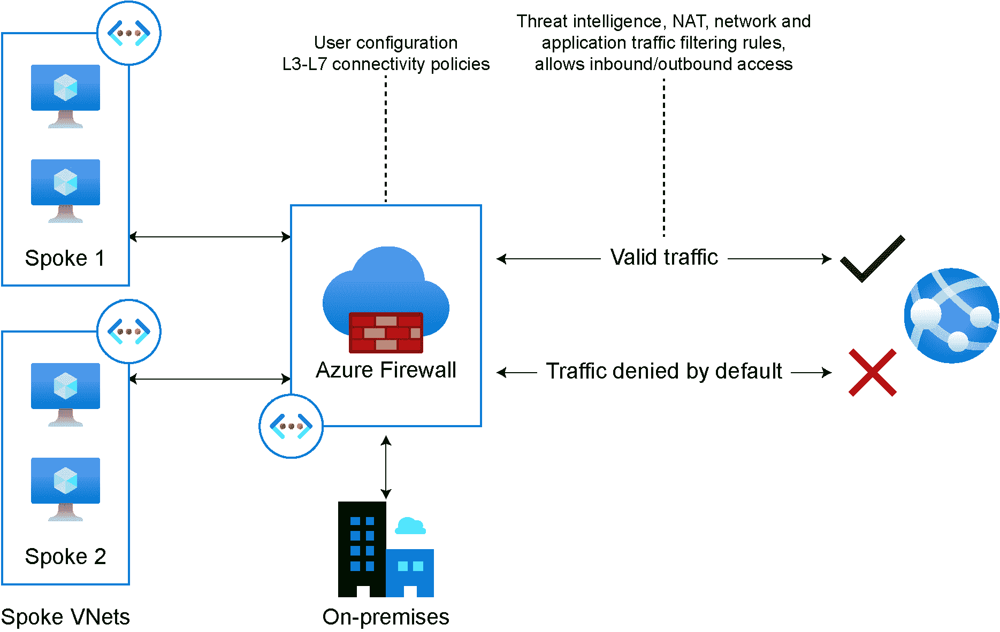

# 5. 使用 Microsoft Azure AD 和 WVD 启用安全远程工作

在上一章中，我们学习到，向云过渡不仅仅是将本地资源迁移到云端，而是一个涉及提升可扩展性、安全性和基于云的生产力的过程，从而实现随时随地的远程协作工作。

在本章中，我们将讨论组织在启用远程工作时常见的基础设施挑战，以及如何利用 Azure 核心基础设施组件（如网络、身份、安全、计算和存储）来赋能现代数字工作空间。本章将覆盖以下内容：

+   部署远程工作基础设施的基本原理

+   Azure Active Directory

+   启用远程连接

+   保护和管理流量到您的工作负载

+   使用 Windows 虚拟桌面赋能远程工作者

我们将从讨论如何使用 Azure 部署远程工作基础设施的基本原理开始。

## 部署远程工作基础设施的基本原理

远程工作在过去一年里成为大多数组织的必要转型，并为曾经全职在公司办公室工作的人员带来了多重挑战。

启用居家办公是帮助人们保持跨组织以及与合作伙伴和客户连接的关键。通过利用**Azure Active Directory**（**Azure AD**），您不仅能够启用远程工作，还可以允许用户安全地访问他们需要的应用程序，即使是在公司网络外部。

在云中拥有强大的身份基础至关重要，而 Azure AD 是赋能远程工作的关键组件。Azure AD 是微软提供的基于云的身份和访问管理服务。这意味着 Azure AD 可以跨不同环境使用，使得员工可以访问位于实际本地数据中心或云应用中的资源。

Azure AD 是全球最大规模的基于云的身份服务，已有超过 20 万个组织使用，每天处理超过 300 亿次身份验证请求。Azure AD 还帮助您检测和修复安全威胁。组织在使用身份和访问管理服务时面临的主要挑战之一是入职流程。

让我们快速了解一下可以帮助您安全启用应用程序访问的关键组件和配置。

## Azure Active Directory

在我们回顾 Azure AD 启用远程工作的能力之前，重要的是要理解，Azure AD 是一个基于云的身份和访问管理服务。因此，它适用于不同类型的用户，例如：

+   IT 管理员希望控制对应用程序的访问，同时保护用户身份和凭证，以满足治理要求。

+   应用开发人员可以利用 Azure AD 的功能和与 Azure AD API 的集成来提供个性化的应用程序体验。

+   订阅多个服务的用户，如 Microsoft 365、Dynamics 365 或 Microsoft Azure。

在选择 Azure AD 时，您需要考虑一些因素，接下来我们将讨论这些内容。

### 规划您的环境

在执行 Azure AD 部署之前，我们需要确保拥有正确的许可模型，以便能够正确配置 Azure AD，并为我们的组织提供所需的功能。Azure AD 主要有三个许可层级：

+   Azure AD 免费

+   Azure AD Premium P1

+   Azure AD Premium P2

从**Azure AD 免费**开始，此层级将为您提供一些基本功能，如用户和组管理、本地目录同步、云用户的自助密码更改，以及跨云平台（如 Azure、Microsoft 365 和第三方 SaaS 解决方案）的单点登录，如*图 5.1*所示：


图 5.1：Azure AD

如果您希望允许组织中的用户访问本地和云端资源，那么**Azure AD Premium P1**可能会满足您组织的主要需求。此层级支持动态组和自助组管理，并启用 Microsoft Identity Manager 和云端回写功能，允许您的本地用户执行自助密码重置，如*图 5.2*所示：


图 5.2：Azure AD 混合环境

**Azure AD Premium P2** 是理想的层级，如果您的组织希望利用先进的安全功能，例如基于 Azure AD 身份保护的风险访问策略，可以通过云规模的机器学习算法检测恶意活动，如*图 5.3*所示：


图 5.3：Azure AD 条件访问

当您的组织注册使用 Microsoft 服务，如 Azure、Microsoft Intune 或 Microsoft 365 时，将会获得一个专用的 Azure AD 服务实例，称为租户。租户代表一个组织。

您可以通过 Azure 门户创建 Azure AD 租户，在其中配置和执行所有与 Azure AD 相关的管理任务。此外，您还可以利用 Microsoft Graph API 访问 Azure AD 资源。

现在我们已经了解了 Azure AD 的各种场景和许可模型，接下来我们将回顾实际部署 Azure AD 租户的配置。

### 配置 Azure AD 和混合环境

尽管您可能熟悉大部分**Active Directory 域服务**（**AD DS**）的功能，但需要强调的是，Azure AD 和 AD DS 有一些相似之处和差异，值得进行简要回顾，以便更好地理解每个产品的范围。下表总结了它们的一些核心差异：


表 5.1：AD DS 和 Azure AD 的比较

如果您的组织有 Linux 工作负载并需要为这些资源提供安全访问和通信，则可以使用 Azure AD 管理标识。

为了开始使用 Azure AD，您需要使用一个租户，通常表示一个组织。您可以选择使用现有租户，也可以创建一个新的 Azure AD 租户。

当您创建 Azure 订阅时，它将与 Azure AD 建立信任关系，以验证用户、服务和设备。您的组织可以拥有多个 Azure 订阅，建立与 Azure AD 实例的信任关系，并利用安全主体来提供访问已由 Azure AD 租户保护的资源。

根据您的应用程序要验证的用户类型，可以创建两种主要的环境：

+   Azure AD 账户（或 Microsoft 账户）

+   Azure AD B2C 账户

Azure AD 账户或 Microsoft 账户指的是像 outlook.com 和 live.com 这样的账户，或与工作和学校相关的账户。Azure AD B2C 账户指的是使用本地或社交账户，如您的 Facebook 或 Twitter 社交身份，以及其他身份，来获得对您的应用程序和 API 的单点登录访问权限。

### 创建您的 Azure AD 租户

新的 Azure AD 租户可以通过 Azure 门户创建。一旦您的 Azure 订阅准备好使用，下一步是进入 Azure 门户，然后选择 Azure Active Directory 选项，如*图 5.4*所示：


图 5.4：Azure 门户中的 Azure AD

在概览页面，点击创建租户，如*图 5.5*所示：


图 5.5：创建租户

然后，在基础面板中，您可以选择要创建的租户类型。选择 Azure Active Directory 或 Azure Active Directory (B2C)，如*图 5.6*所示：


图 5.6：Azure AD 租户类型

在配置面板中，您可以为组织提供一个名称，并输入您想使用的初始域名，如*图 5.7*所示：


图 5.7：Azure AD 配置

接下来，Azure 将验证您的部署。完成后，点击创建，如*图 5.8*所示：


图 5.8：创建 Azure AD 租户

您应该在 Azure 门户中看到与创建 Azure AD 租户相关的通知，如此处所示：


图 5.9：租户创建中

几分钟后，你的新 Azure AD 租户应该已经准备好。你将在 Azure 门户中看到通知，如*图 5.10*所示：


图 5.10 Azure AD 租户创建成功

点击通知以跳转到你的新租户页面，如*图 5.11*所示：


图 5.11：Azure AD 租户

对于混合环境，建议使用 Azure AD Connect 实现混合身份集成，因为它提供了同步本地用户与 Azure AD 所需的功能，同时允许用户在本地和云端使用相同的密码，无需额外的联合环境基础设施。

虽然联合是一个可选配置，但 Azure AD Connect 对于使用本地**Active Directory 联合服务**（**AD FS**）基础设施的混合配置是非常有用的。

### 为 Windows 虚拟桌面准备基础设施

无论你的组织是否已经在本地部署了 Active Directory，还是刚开始使用 Azure AD，都可以通过混合环境启用远程办公，并利用**Azure 资源管理器**（**ARM**）模板简化云环境的创建。如*图 5.12*所示的 ARM 模板将帮助你部署一个安装了 Active Directory 和 Azure AD Connect 的虚拟机：


图 5.12：ARM 模板组件

该 ARM 模板将提供以下资源：

+   一个虚拟网络

+   一个子网

+   一个**网络安全组**（**NSG**）：

    +   允许 AD 流量，允许**远程桌面协议**（**RDP**）传入流量，并限制**隔离区**（**DMZ**）访问

+   配置 DNS 指向域控制器

+   一个虚拟机：

    +   已安装并配置 AD DS。

    +   在域中创建测试用户。

    +   Azure AD Connect 已安装并准备好进行配置。

+   分配一个公共 IP 地址用于通过 RDP 进行远程管理

一旦 ARM 模板部署完成，状态将更改为**完成**。此时，域控制器已准备好进行 RDP 连接。

#### 注意

你还可以根据需要尝试不同的 ARM 模板，并从 Azure 快速入门模板中获取，例如：

新域高可用 2 个 DC 区域： [`github.com/Azure/azure-quickstart-templates/tree/master/active-directory-new-domain-ha-2-dc-zones`](https://github.com/Azure/azure-quickstart-templates/tree/master/active-directory-new-domain-ha-2-dc-zones)

active-directory-new-domain-module-use: [`github.com/Azure/azure-quickstart-templates/tree/master/active-directory-new-domain-module-use`](https://github.com/Azure/azure-quickstart-templates/tree/master/active-directory-new-domain-module-use)

active-directory-new-domain: [`github.com/Azure/azure-quickstart-templates/tree/master/active-directory-new-domain`](https://github.com/Azure/azure-quickstart-templates/tree/master/active-directory-new-domain)

现在我们可以继续配置 Azure AD Connect 与 AD DS。您可以通过此链接连接到最近配置的 Azure 虚拟机来安装 Azure AD Connect：[`www.microsoft.com/download/confirmation.aspx?id=47594`](https://www.microsoft.com/download/confirmation.aspx?id=47594)

### 配置 Azure AD Connect 与 AD DS

如前所述，Azure AD Connect 将帮助您实现混合身份集成，因为它提供了将本地用户同步到 Azure AD 的功能。

该过程的下一步是连接到域控制器并配置 Azure AD Connect。如果您的组织采用单森林拓扑，则可以使用**Express 设置**。

您可以在此处找到有关安装 Azure AD Connect 的更多详细信息：[`docs.microsoft.com/azure/active-directory/hybrid/how-to-connect-install-custom`](https://docs.microsoft.com/azure/active-directory/hybrid/how-to-connect-install-custom)。

下图展示了 Azure AD Connect 向导：


图 5.13：Azure AD Connect 向导

到目前为止，我们已经回顾了与 AD DS 同步的 Azure AD Connect。一旦您的组织正确配置了 Azure AD，保护员工身份的安全就显得尤为重要，必须采用更强的认证机制，最大限度地减少潜在的身份攻击。

### 保护您的身份基础设施

我们生活在一个密码已不再足够安全的世界，大多数攻击都与密码漏洞和数据泄露有关，其中大部分涉及钓鱼攻击。保护身份的安全需要更强的认证机制。Azure AD **多重身份验证**（**MFA**）就是其中之一——我们来看看。

### Azure AD 多重身份验证

使用 Azure AD 的强身份验证可以防止 99.9%的身份攻击。在制定强化凭据的策略时，您应该为组织和用户部署最安全、最易用且最具成本效益的方法。使用 Azure AD 的主要优势之一是它支持 MFA（多重身份验证），要求至少使用两种验证方法。通过这种方式，Azure AD MFA 有助于保护对数据和应用程序的访问。

Azure AD MFA 功能通过不同的方式提供并授权。你可以参考文档获取更多详细信息：[`docs.microsoft.com/azure/active-directory/authentication/howto-mfa-mfasettings`](https://docs.microsoft.com/azure/active-directory/authentication/howto-mfa-mfasettings)。

Azure AD MFA 至少需要以下两种身份验证方法：

+   你知道的某物——用户名和密码是用户提供凭据的最常见方式。

+   你拥有的某物——这可以是你的手机或硬件密钥等受信设备。

+   你是的某物——例如指纹或面部扫描。

作为管理员，你可以定义可使用的二次身份验证形式。

### Azure AD 身份保护

使用 Azure AD 身份保护实施用户风险安全策略可以帮助你识别潜在风险，并在需要时对每个风险采取手动措施。你可以识别不同的风险检测类型，作为管理员，你可以使用关键报告进行调查。使用 Azure AD 身份保护需要 Azure AD Premium P2 版或 EMS E5 订阅。

在 Azure AD 中，主要有两种风险策略可以启用：**登录风险策略**和**用户风险策略**。虽然这两种策略都致力于自动响应环境中的风险检测，但了解它们之间的区别是值得的：

+   登录风险策略是一种自动响应，你可以为特定的登录风险级别配置它，阻止访问资源，并要求用户通过 MFA 证明其身份，以便访问特定资源。在配置登录风险策略时，你需要设置其适用的用户和组。

+   另一方面，IT 管理员可以根据用户之前的高风险登录自定义登录体验，使用用户风险策略。用户风险策略也是一种自动响应，当用户达到特定风险级别或其凭据有高概率被泄露时，会对其进行修复。此策略将允许你阻止访问资源，或要求用户重置密码以保持其身份安全。

这是配置风险策略的参考：[`docs.microsoft.com/azure/active-directory/identity-protection/howto-identity-protection-configure-risk-policies`](https://docs.microsoft.com/azure/active-directory/identity-protection/howto-identity-protection-configure-risk-policies)。

### 特权身份管理

**特权身份管理**（**PIM**）对于那些正在迁移到云端（如果尚未迁移）并希望最小化风险的组织特别有用，尤其是当涉及到分配给组织角色的特权账户时。我们指的是那些可以访问大量资源和数据的账户。

PIM 是 Azure AD 中的一项服务，通过强制执行 **按需访问**（**JIT**）和 **足够访问**（**JEA**）来帮助您降低这些风险。

PIM 强制组织中的管理员在需要使用管理权限时提升其权限，因此需要批准才能激活特权规则并强制执行 MFA。

您可以按照以下步骤为您的组织配置 PIM：[`docs.microsoft.com/azure/active-directory/privileged-identity-management/pim-security-wizard`](https://docs.microsoft.com/azure/active-directory/privileged-identity-management/pim-security-wizard)。

### Azure AD 应用代理

Azure AD 中的安全体验为您提供了所有身份安全功能的一站式服务。通过使用 Azure AD 应用代理，您可以启用对本地资源的远程访问。这意味着，Azure AD 应用代理允许您将本地应用程序发布给企业网络外的用户，同时将 Azure AD 功能扩展为所有组织内应用程序的中央管理点。

这带来了一些好处，如 MFA 和条件访问。更重要的是，它避免了传统解决方案（如 VPN）的局限性，因为无需开放整个网络的访问权限。Azure AD 应用代理允许您控制哪些资源应可访问，并支持多种设备，包括移动设备和桌面设备。

一个组织可以在 DMZ 内拥有多个部门跨应用的企业网络，并且有多个子网，同时也有需要访问企业网络资源的外部用户。

要启用 Azure AD 应用代理，您首先需要在网络中安装本地代理，称为 **连接器**。

这些连接器是运行在您企业网络中的 Windows 服务器上的代理，负责在本地应用程序与 Azure AD 应用代理之间进行通信。

连接器还可以根据所需的单点登录机制与本地 Active Directory 集成。需要注意的是，Azure AD 应用代理需要 Azure AD Premium P1 或 P2 许可证：


图 5.14：Azure AD 应用代理工作流程

如*图 5.14*所示，Azure AD 应用代理的工作流程如下：

1.  您的组织可以通过一个公共访问端点来拥有一个面向外部的应用程序，该端点可以是一个 URL。

1.  外部用户可以使用该 URL 连接到应用程序。

1.  外部用户将被重定向到云服务；身份提供者，即 Azure AD，将使用 MFA、条件访问或其他任何方法来验证用户。

1.  一旦验证通过，Azure AD 会将令牌发送到用户的客户端设备。

1.  然后，Azure AD 会将令牌发送到 Azure AD 应用程序代理服务，用户将通过应用程序代理连接器重新定向到本地应用程序。

1.  如果配置了单一登录，Azure AD 应用程序代理连接器将代表用户执行额外的身份验证。

1.  最后，连接器将请求发送到本地应用程序，并通过连接器和 Azure AD 应用程序代理服务将响应发送回用户。

正如你所看到的，Azure AD 应用程序代理可用于需要从公司网络外部访问的本地应用程序。

### Azure AD 条件访问

为了使用户能够访问本地和云中的应用程序，管理员需要确保合适的人拥有访问资源的权限。条件访问是 Azure AD 的一项高级功能，通过提供基于策略控制资源访问的机制来解决这些挑战。

使用 Azure AD 条件访问，作为管理员的你可以轻松保护组织资产，并通过基于一些常见信号（如设备、应用程序、IP 位置以及用户或组成员身份）配置的策略来应用合适的访问控制。

Azure AD 条件访问的示例包括：

+   **位置**：当用户在公司网络之外访问资源时，应该要求使用 MFA（多因素身份验证）。

+   **设备平台**：为每个设备平台定义一个阻止访问的策略。例如，只允许 iOS 设备访问，但不允许 Android 设备。

+   **云应用**：要求当 Azure AD 检测到存在风险的登录时，阻止使用敏感信息的应用程序。

这就是我们对 Azure AD 的详细介绍。接下来我们将讨论 Azure 如何帮助你启用远程连接的其他方式。

## 启用远程连接

在连接性方面，Azure Virtual Network 是扩展到 Azure 并为组织、合作伙伴和客户提供最佳应用体验和连接性的基本构建块。Azure 提供了多种网络功能，以便安全地提供连接并支持远程工作。

这些网络功能包括多个 Azure 网络服务。有三个主要服务可以支持远程办公：Azure Virtual WAN、Azure VPN 和 ExpressRoute。

### Azure Virtual WAN

Azure Virtual WAN 提供了一个统一的网络安全和路由框架，帮助你在不同地区之间建立连接并扩展。它还允许你在 Virtual WAN 中心部署 Azure **网络虚拟设备**（**NVA**）。

Virtual WAN 中心本质上是一个虚拟网络，你可以在其中部署集成了 ExpressRoute 和 NVA 的网关。为了支持远程办公，你可以利用 Azure Virtual WAN 的功能，为远程用户提供更好的连接体验。它可以通过站对站 VPN 连接多个分支，通过点对站 VPN 连接远程用户。

使用 Azure Virtual WAN 时，你可以通过多个中心扩展连接，构建一个完全网状的中心，允许你实现任意到任意的连接方式。这样，你可以将远程用户连接到 Azure 的同时，也能将 ExpressRoute 终端或通过站对站 VPN 连接的分支互联起来。

需要强调的是，每个 Azure Virtual WAN 都有一个路由器，控制与中心内其他网关的路由。它还支持网络到网络的传输功能，聚合能力可达 50 Gbps。

Azure Virtual WAN 具有内置的安全功能。你可以为每个区域部署一个中心，并配置多个防火墙，这些防火墙可以通过 Azure Firewall Manager 进行管理。这样，你可以使用 Azure Firewall Manager 跨订阅、区域和部署工作，并创建策略来保护所有通过网络的流量。

目前大多数组织依赖合作伙伴和供应商通过硬件或虚拟设备启用这些网络功能。这些设备可以迁移到 Azure，因为你可以通过 Azure Marketplace 部署 NVA，并将其集成到 Virtual WAN 中心中。此外，Azure 还内置了 BGP 功能，支持跨多个网络的传输路由，并交换路由信息，通知本地设备和 Azure VPN 网关它们是否可达：


图 5.15：Azure 网络

你可以在 Azure 中跨多个区域配置多个虚拟网络，为远程工作者提供点对站点 VPN 连接或站对站 VPN 连接，连接你从本地网络到虚拟网络的 VPN 网关。如*图 5.15*所示。

### Azure VPN

Azure VPN 网关使你能够通过互联网或其他虚拟网络发送加密流量，连接本地位置和 Azure 虚拟网络。你可以有多个连接到同一个 VPN 网关，但每个虚拟网络只能有一个 VPN 连接。

在配置特定类型的 VPN 网关之前，我们需要了解可用的 VPN 网关连接配置，并评估哪个最适合你的组织。Azure 提供了多种连接拓扑，你可以选择最适合你组织需求的连接方式：**站对站**（**S2S**）、多站点、**点对站**（**P2S**）和 ExpressRoute。

让我们逐一讨论它们。

### 站对站和多站点

站点到站点 VPN 网关最适合您的组织，如果您希望实现本地位置与虚拟网络之间的混合配置。S2S 是通过 IPsec/IKE（IKEv1 或 IKEv2）VPN 隧道建立的连接，这意味着要部署此类型的连接，您需要在本地数据中心部署 VPN 设备，并为其分配一个公共 IP 地址。下图展示了 S2S VPN 连接架构：


图 5.16：站点到站点 VPN

如果您的组织有多个本地位置，您可以通过基于路由的 VPN 实现多站点连接方法，将多个分支连接到同一虚拟网络。请记住，虚拟网络只能有一个 VPN 网关；所有通过同一 VPN 网关的连接将共享可用带宽：


图 5.17：多站点 VPN

此外，您可以配置网络到网络的连接，并将其与如*图 5.17*所示的多站点配置结合使用。您可以与同一订阅、不同订阅、不同区域和不同部署模型中的多个虚拟网络建立连接。

### 点对站点 VPN

如果您希望远程用户访问 Azure 中的资源，可以利用 P2S VPN 网关连接。在此部署模式下，您无需在本地部署 VPN 设备；连接直接从客户端设备建立，如*图 5.18*所示：


图 5.18：点对站 VPN

如果您希望让少量远程用户通过虚拟网络访问云中的资源，这种类型的连接具有成本效益。

### ExpressRoute

在行业中常常听到这样一句话，ExpressRoute 就是您通往 Azure 的**以太网电缆**。它通过一个名为**连接提供商**的合作伙伴提供私有连接，连接您本地位置与 Azure。ExpressRoute 提供第三层连接，支持任何对任何网络连接、点对点以太网连接或虚拟跨连接。

根据您组织的需求和连接提供商，您可以选择如何创建到云的连接。有四种创建连接的方式：

+   **CloudExchange 联合定位**：如果您的数据中心与云交换设施位于同一地点，您可以通过服务提供商的以太网交换利用第二层跨连接或托管的第三层跨连接，连接您的基础设施与 Azure。

+   **点对点以太网连接**：在此模型中，您可以通过提供第二层连接或托管第三层连接的以太网服务商将您的数据中心连接到 Azure，并通过点对点以太网链路构建您的私有连接。

+   **任意对任意（IPVPN）连接**：你可以启用 Azure 与分支机构或数据中心之间的 WAN 连接，通常以托管的第三层连接形式提供。

+   **ExpressRoute Direct**：你可以接入微软的全球网络，并实现规模化的 Active/Active 连接，满足不同的需求，例如大规模数据导入到 Azure 服务或连接隔离。

如*图 5.19*所示，ExpressRoute 电路提供从 50 Mbps 到 10 Gbps 的宽带，并且可以在不中断的情况下动态扩展：


图 5.19：ExpressRoute

此外，可以同时拥有 ExpressRoute 电路和 S2S 连接。尽管它们可以共存，但这需要为同一个虚拟网络配置两个虚拟网络网关，一个使用 VPN 类型的网关，另一个使用 ExpressRoute 类型的网关。

在建立了与 Azure 的连接后，我们来看看如何保护和管理流量到你的云应用程序。

## 保护和管理流量到你的工作负载

安全性是微软、合作伙伴和客户之间的共同责任。Azure 提供安全控制和服务来保护身份、网络和数据资源。

在上一节*Azure Active Directory*中，我们回顾了如何利用 Azure AD 提供的身份和管理功能，确保对数据和资源的安全访问。保护基础设施和远程访问的工作负载是日常工作中的一项关键任务，微软提供了企业级解决方案来保障应用程序的流量，无论它们是通过 Azure 提供，还是来自本地环境。

Azure 可以通过使用网络安全控制来保护你的云基础设施，管理流量，配置访问规则，将连接扩展到本地资源，并保护你的虚拟网络。

你可以用来保护 Web 应用程序的主要服务之一是**Azure Web 应用防火墙**（**WAF**），如*图 5.20*所示：


图 5.20：Azure WAF

Azure WAF 符合各种合规标准，包括但不限于 PCI-DSS、HIPAA、SOC、ISO 和 CDSA。完整的合规服务列表可以在此找到：[`docs.microsoft.com/azure/compliance/`](https://docs.microsoft.com/azure/compliance/)。

### 带有 WAF 的应用程序网关

您的组织可能在云端或本地运行应用程序，远程用户尝试访问这些工作负载。应用网关是一个关键的**平台即服务**（**PaaS**）组件，可以帮助实现这一目标。它是一个轻量级的**应用交付控制器**（**ADC**），提供 SSL 终止、会话亲和性和基于内容的路由支持。这一系列功能使得应用网关成为一个灵活的服务。它可以与 Azure WAF 或 Azure Front Door 一起部署，以提高扩展能力，并保护您的应用程序，无论是在本地还是在云中，免受 OWASP 和其他漏洞的影响，而无需额外配置。

应用网关和 Azure WAF 都是 PaaS 托管服务，因此您可以节省时间，并在 Azure 负责底层基础设施的同时为您的应用程序提供正确的保护，如下图所示：


图 5.21：Azure 应用网关和 Azure WAF

Azure WAF 的主要好处包括：

+   预配置的防护，防止 OWASP 十大攻击。

+   机器人保护。

+   自定义规则引擎（地理过滤、IP 限制、HTTP 参数过滤和大小限制）。

+   用于检测和警报的日志和指标。

另一个常见的用例是与 Azure Front Door 的集成，Azure Front Door 提供全球应用加速和交付服务，除了为 Web 应用提供区域负载均衡外，还能加速传输。

使用 Azure Front Door 配合 Azure WAF 的一个关键好处是能够在攻击到达虚拟网络之前，检测并防止针对您 Web 应用程序的攻击。您可以在恶意攻击接近源头时将其阻止，防止它们进入虚拟网络，并创建速率限制或请求阈值，以保护您的应用免受洪水攻击。我们可以在*图 5.22*中看到它是如何工作的：


图 5.22：Azure Front Door 和 Azure WAF

这可以让您发布和保护您的 Web 应用程序，无论它们是托管在本地还是云中。

### Azure 防火墙

组织可以用于保护虚拟网络资源的下一个边界安全控制是 Azure 防火墙。Azure 防火墙允许您创建、强制执行并记录应用程序和网络连接策略，覆盖 OSI 模型的第 3 层到第 7 层，并跨订阅和虚拟网络进行管理。

在考虑远程办公时，Azure 防火墙至关重要，它能为你在 Azure 上部署的 Windows 虚拟桌面基础设施提供保护，同时提供威胁情报，确保远程用户能够正确访问其虚拟桌面。建议在使用 Windows 虚拟桌面时，使用**完全限定域名**（**FQDNs**）来简化访问。Azure 防火墙通过启用出站流量过滤功能，为 Windows 虚拟桌面提供简化集成，如*图 5.23*所示：



图 5.23：Azure 防火墙

需要注意的是，Azure 防火墙是一个完全基于云的托管服务，Azure 会负责底层基础设施。

### Azure 负载均衡器与跨区域负载均衡

很多时候，当应用流量增加，组织会面临基于云的工作负载挑战，并希望提供更好的客户体验。Azure 提供了内置的负载均衡功能，供云资源使用，这样你就可以创建高可用且可扩展的 Web 应用程序。

实现高可用性的主要组件是 Azure 负载均衡器，如*图 5.24*所示。它在 OSI 模型的第 4 层运行，并代表客户端的单一接入点。Azure 负载均衡器经过优化，能将流量分配到后端池实例，适用于云工作负载。

Azure 负载均衡器可以面向公网，负载均衡来自互联网的流量到你在 Azure 上的应用程序，或者它可以面向内网，仅在前端需要私有 IP 地址：


图 5.24：Azure 负载均衡器

你将发现 Azure 负载均衡器有两种主要配置文件：Basic 和 Standard。以前，你只能将与虚拟机或虚拟机规模集相关联的网络接口添加到负载均衡器的后端池中。然而，由于最近的改进，允许跨 IP 地址进行负载均衡，现在你可以通过 Standard 配置文件，使用私有 IPv4 或 IPv6 地址对 Azure 中的资源进行负载均衡，从而扩展了容器负载均衡的能力。

过去，Azure 负载均衡器只能在特定区域内进行负载均衡。现在，你可以使用 Azure 负载均衡器进行跨区域负载均衡，分配流入流量，并启用地理冗余高可用性场景：


图 5.25：跨区域负载均衡器

在现有的负载均衡器解决方案上构建跨区域功能是可能的，一个重要的好处是能够使用静态前端 IP 配置。

### Azure Bastion 和即时（JIT）访问

有时，组织需要提供远程访问 Azure 中的资源，并希望提供一种安全的方式连接这些资源，而不需要 VPN 连接或为虚拟机分配公共 IP。

Azure Bastion 通过提供 RDP/SSH 连接，让你以安全的方式管理资源，允许你通过虚拟网络中的虚拟机，而无需直接使用公共 IP。


图 5.26：Azure Bastion

Azure Bastion 是一种托管解决方案，后端是一个部署在你的虚拟网络中的虚拟机规模集，远程用户可以通过 RDP/SSH 连接，而无需暴露公共 IP。这意味着它还具备按需扩展的能力，取决于并发会话的数量。

除了保护和连接功能，Azure 安全中心还可以用于实施 JIT 访问，使你能够限制虚拟机的入站流量，减少遭受攻击的风险，并轻松审核对虚拟机的访问。

JIT 访问还可以与 Azure 防火墙一起使用，通过创建策略来减少对网络流量攻击的暴露，定义你想保护的端口，例如，设置端口应保持打开的时间，并过滤应该访问虚拟机的 IP。

现在我们已经讨论了能够帮助你的组织更好地保护和管理应用程序流量的主要服务，让我们来看看最后一块拼图：通过 Azure Windows 虚拟桌面基础设施启用远程工作。

## 启用远程工作与 Windows 虚拟桌面

在过去几个月里，我们都经历了如何与组织内的同事、合作伙伴和客户进行协作的改变。各类企业都投入了采用可以支持远程工作的协作工具，并为员工提供最佳的体验，使他们在业务中断期间保持联系并提高生产力。

**虚拟桌面基础设施**（**VDI**）是一种虚拟化解决方案，为远程用户提供类似于在本地计算机上工作的桌面环境。Windows 虚拟桌面使远程工作成为可能，同时提供最佳的体验来维护基础设施，甚至可以在几分钟内构建完成。

Windows 虚拟桌面支持多种操作系统，包括 Windows 10 企业版、Windows 10 企业版多会话版、Windows 7 企业版，以及 Windows Server 2012 R2、2016 和 2019。根据组织的需求，你可以选择特定的许可模式，如 Microsoft 365 E3、E5、A3、A5 或 F3；Business Premium；Windows E3、E5、A3 或 A5；或 RDS 客户端访问许可证。*图 5.27* 展示了 Windows 虚拟桌面的工作原理：


图 5.27：Windows 虚拟桌面架构

+   左侧的终端通常位于本地网络中，可以通过 S2S 或 Express Route 扩展连接，而 Azure AD Connect 可以将本地 AD DS 与 Azure AD 集成。

+   你的组织可以管理 AD DS、Azure AD、Azure 订阅、虚拟网络、存储以及 Windows 虚拟桌面主机池和工作区。

+   微软管理 Windows 虚拟桌面的控制平面，负责处理 Web 访问、网关、代理、诊断以及扩展性组件（如 REST API）。

为了让你的组织能够使用 Windows 虚拟桌面，你需要 Azure AD，一个与 Azure AD 同步的 Windows Server Active Directory 实例，以及一个 Azure 订阅。Windows 虚拟桌面的虚拟机可以是标准的域加入或混合 AD 加入。

基于 ARM 的新体验使 Windows 虚拟桌面的管理变得更加轻松。它包括一个集成的新监控 UI，结合了日志分析和通过 Azure 门户的管理 UI。它还允许你使用 Azure PowerShell 模块来管理 Windows 虚拟桌面环境。

基于 ARM 的体验还提供了更好的管理员访问控制，因为它利用了 Azure **基于角色的访问控制**（**RBAC**）和内置的自定义角色。你还可以通过 Azure AD 用户组和单个用户来发布应用程序并管理访问权限。此外，现在你可以指定你希望用于存储的地理位置。

以下图表为你提供了 Windows 虚拟桌面架构的高级概述：


图 5.28：Windows 虚拟桌面结构

通过 Azure 门户，你将获得无缝的体验来管理 Windows 虚拟桌面的部署，包括主机池、应用程序组、工作区和用户：


图 5.29：通过 Azure 门户管理 Windows 虚拟桌面

你可以使用 ARM 功能来配置 Windows 虚拟桌面。你需要注册 `Microsoft.DesktopVirtualization` 资源提供程序，然后根据需要创建主机池，包括指定虚拟机详细信息，并提供 Azure 虚拟网络的参数。完成这些操作后，你可以继续创建应用程序组，并将 Azure AD 用户或用户组添加到其中。最后，配置你的 Windows 虚拟桌面工作区，然后在客户端设备上安装 Windows 虚拟桌面客户端。

在 Microsoft Learn 上有一条学习路径，教你如何通过 Windows 虚拟桌面从 Azure 提供远程桌面和应用程序：[`docs.microsoft.com/learn/paths/m365-wvd/`](https://docs.microsoft.com/learn/paths/m365-wvd/)。

另外，你还可以利用 ARM 模板来自动化部署 Windows 虚拟桌面环境的过程：[`github.com/Azure/RDS-Templates/`](https://github.com/Azure/RDS-Templates/)。

### 你可以在 Windows 虚拟桌面中管理的组件

以下表格比较了 Microsoft 在 Windows 虚拟桌面中管理的资源与你可以管理的资源：


表 5.2：资源管理的责任

以下是由 Microsoft 管理的组件：

+   **Web 访问**：通过该服务，用户可以使用兼容 HTML5 的 web 浏览器访问其桌面。

+   **网关**：该服务使远程用户能够从任何能够执行 Windows 虚拟桌面客户端的设备连接到 Windows 虚拟桌面应用和桌面。

+   **连接代理**：该服务管理用户连接并提供负载均衡功能。

+   **诊断**：这是一个基于事件的聚合器，用于识别组件可能出现的故障。

+   **扩展性组件**：这包括可以为 Windows 虚拟桌面启用的第三方工具和额外的扩展。

这些是你管理的组件：

+   **Azure 虚拟网络**：你可以根据组织的政策配置网络拓扑，以提供对桌面和应用程序的访问。

+   **Azure AD**：虽然这是使用 Windows 虚拟桌面的前提条件，但你可以管理 Azure AD 集成和安全功能，以确保你的环境符合合规要求。

+   **AD DS**：这是启用 Windows 虚拟桌面的前提条件，包括与 Azure AD 的同步。你还可以使用 Azure AD Connect 将 AD DS 与 Azure AD 关联。

+   **Windows 虚拟桌面会话主机**：你可以运行各种操作系统，包括 Windows 10 企业版；Windows 10 企业版多会话版；Windows 7 企业版；Windows Server 2012 R2、2016 和 2019；以及自定义 Windows 镜像。

+   **Windows 虚拟桌面工作区**：这是一个用于管理和发布主机池资源的工作区。

### 确定 Windows 虚拟桌面环境的规模

过去，由于只有一些基本的指导，确定 Windows 虚拟桌面环境的规模是一个挑战。现在，你可以使用 Windows 虚拟桌面体验评估器，这是一款可以帮助你根据组织需求找到合适规模的工具。

Windows 虚拟桌面体验评估器可以通过 [`azure.microsoft.com/services/virtual-desktop/assessment/`](https://azure.microsoft.com/services/virtual-desktop/assessment/) 获取。

初始时，你将看到一个表格，展示了从当前位置出发的最低往返时间区域，并提供了虚拟机和网络服务的大小参考，这些服务对于你的实现至关重要：


表 5.3：不同 Azure 区域的往返时间

根据您当前的位置，您可以选择一个首选区域，以提供更好的用户体验。请记住，还有一些其他组件可能会影响您的部署，如网络条件、终端设备和虚拟机的配置。

### 网络指南

正如我们已经讨论过的，网络组件对于支持远程工作至关重要。带宽是您在规划环境时需要关注的关键度量标准之一，因为它会影响用户体验。下表展示了基于不同类型工作负载的一些建议，您可以在[`docs.microsoft.com/windows-server/remote/remote-desktop-services/network-guidance`](https://docs.microsoft.com/windows-server/remote/remote-desktop-services/network-guidance)找到：


表 5.4：不同工作负载类型的推荐带宽

显示分辨率是与带宽一起影响用户体验的另一个因素。下表展示了为获得最佳用户体验推荐的带宽：


表 5.5：30 fps 下不同显示分辨率的推荐带宽

关于 Windows 虚拟桌面环境中的虚拟机，Microsoft 提供了不同工作负载类型的示例，帮助您正确配置所需的虚拟机大小：


表 5.6：不同工作负载类型的示例

此外，您应该考虑的一个度量标准是同时有多少用户访问相同的应用程序。也就是说，您可以根据组织的需求考虑多会话或单会话的建议。

Microsoft 根据每个**虚拟 CPU**（**vCPU**）的最大建议用户数量提供虚拟机大小，并提供与最小虚拟机配置匹配的 Azure 实例示例：


表 5.7：多会话建议

一般建议是，对于关键工作负载，使用高级 SSD 磁盘，并且如果计划在虚拟机上运行图形密集型程序，可以考虑使用 GPU。

### 使用 Azure 文件和 NetApp 文件管理用户配置文件

虽然 Azure 提供了多种存储解决方案，但 FSLogix 配置文件容器是 Windows 虚拟桌面服务推荐的用户配置文件解决方案之一，因为它们被设计用于在无状态的远程计算环境中漫游配置文件。

当用户执行登录操作时，一个容器会动态地附加到计算环境中。您还可以使用 Azure NetApp Files 创建配置文件容器，以快速为 Windows 虚拟桌面配置 SMB 卷。

以下表格比较了适用于 Windows 虚拟桌面 FSLogix 配置文件容器用户配置文件的不同解决方案：


表格 5.8：Windows 虚拟桌面 FSLogix 配置文件容器用户配置文件

若要查找 Azure NetApp Files 和其他产品的区域可用性详细信息，请访问 [`azure.microsoft.com/global-infrastructure/services/`](https://azure.microsoft.com/global-infrastructure/services/)。

以下表格比较了 Azure 存储为 Windows 虚拟桌面提供的存储解决方案，这些解决方案在 Azure 上支持 FSLogix 配置文件容器用户配置文件：


表格 5.9：Azure 存储为 Windows 虚拟桌面提供的存储解决方案

以下是一些相关链接，供进一步了解：

1.  微软合规性产品：[`docs.microsoft.com/compliance/regulatory/offering-home`](https://docs.microsoft.com/compliance/regulatory/offering-home)

1.  Azure 文件与 AD 集成：[`docs.microsoft.com/azure/storage/files/storage-files-active-directory-overview`](https://docs.microsoft.com/azure/storage/files/storage-files-active-directory-overview)

1.  Azure NetApp Files 与 AD 集成：[`docs.microsoft.com/azure/azure-netapp-files/azure-netapp-files-faqs#does-azure-netapp-files-support-azure-active-directory`](https://docs.microsoft.com/azure/azure-netapp-files/azure-netapp-files-faqs#does-azure-netapp-files-support-azure-active-directory)

### Windows 虚拟桌面的 Azure 监视器

您需要尽量减少 Windows 虚拟桌面环境中的故障风险。Azure 提供与 Azure 监视器的原生集成，可以通过单一仪表板快速识别问题。

您可以查看以下活动日志：

+   管理活动

+   连接

+   主机注册

+   错误

+   检查点

为了监控您的 Windows 虚拟桌面环境，您需要通过 Azure 门户或 PowerShell 创建一个 Log Analytics 工作区，然后将虚拟机连接到 Azure 监视器。

一旦您将 Windows 虚拟桌面引入 Log Analytics，您将能够使用 **Kusto 查询语言**（**KQL**）运行自定义查询，以分析您的 Windows 虚拟桌面环境的健康状况。一个简单的用例是，如果需要按用户查找会话持续时间，如以下代码所示：

```
let Events = WVDConnections | where UserName == "userupn" ;
Events
| where State == "Connected"
| project CorrelationId , UserName, ResourceAlias , StartTime=TimeGenerated
| join (Events
| where State == "Completed"
| project EndTime=TimeGenerated, CorrelationId)
on CorrelationId
| project Duration = EndTime - StartTime, ResourceAlias
| sort by Duration asc
```

在此代码中，我们使用了一个 `let` 语句来定义名为 `WVDConnections` 的 `Event` 实例，并对表格进行筛选，提取与 `connected` 状态的用户匹配的行。然后，作为良好的实践，我们使用 `project` 来选择我们需要的列，再执行 `join`。我们先提取第一个 `EventType` 的事件，再提取第二个 `EventType` 的事件，然后根据 `CorrelationId` 将这两组数据连接起来。

在此之后，我们重命名时间戳列并按升序排序结果。

你可以使用 Azure Monitor 工作簿创建 Windows 虚拟桌面性能的自定义可视化。你可以在这里找到一个 Windows 虚拟桌面的工作簿示例：[`github.com/wvdcommunity/AzureMonitor/blob/master/WVD-ARM-monitoring-workbook.json`](https://github.com/wvdcommunity/AzureMonitor/blob/master/WVD-ARM-monitoring-workbook.json)。

### Windows 虚拟桌面合作伙伴集成

微软合作伙伴是完全启用组织远程工作能力的关键组件；Windows 虚拟桌面与 Citrix 和 VMware 之间有合作伙伴集成。

Citrix 将其虚拟应用和桌面服务扩展到 Azure，可以作为托管服务消费，并通过 Azure 市场提供。这是新技术和新权益的结合。它支持多会话 Windows 10 体验，如果你拥有合适的 RDS 许可证，还可以使用 Windows Server。它还支持持久性和非持久性的单会话或多会话体验。

你可以在这里阅读更多关于 Azure 虚拟应用和桌面的信息：[`azure.microsoft.com/services/virtual-desktop/citrix-virtual-apps-desktops-for-azure/`](https://azure.microsoft.com/services/virtual-desktop/citrix-virtual-apps-desktops-for-azure/)。

VMware 是认证的 Windows 虚拟桌面提供商，通过其 Horizon 控制平面简化了混合 Windows 虚拟桌面环境的部署，使本地和云端部署都能通过单一管理界面进行管理。

客户可以利用 Windows 10 多会话功能，并且该平台通过 Horizon Universal License 提供，包含在任何受支持平台上部署 VMware Horizon 的能力：

+   你可以在这里阅读更多关于 VMware Horizon Cloud on Microsoft Azure 的信息：[`azuremarketplace.microsoft.com/marketplace/apps/vmware-inc.hc-azure`](https://azuremarketplace.microsoft.com/marketplace/apps/vmware-inc.hc-azure)

+   Windows 虚拟桌面快速入门指南：[`azure.microsoft.com/resources/quickstart-guide-to-windows-virtual-desktop/`](https://azure.microsoft.com/resources/quickstart-guide-to-windows-virtual-desktop/)

+   Windows 虚拟桌面 RDS 迁移指南：[`azure.microsoft.com/resources/windows-virtual-desktop-migration-guide-for-remote-desktop-services/`](https://azure.microsoft.com/resources/windows-virtual-desktop-migration-guide-for-remote-desktop-services/)

## 总结

在这一章中，我们回顾了组织在尝试启用远程工作时面临的常见基础设施挑战，以及 Azure AD 如何帮助你的组织保护员工的身份和资源。我们还学习了如何使用 Azure 网络组件来实现连接性，并确保组织的工作负载在本地和云端的安全访问。最后，我们回顾了如何通过 Windows Virtual Desktop 提供更好的终端用户体验，并查看了关于环境规模和配置的指导。

下一章将为你提供安全基准，并推荐如何使用可用的安全服务，以便你可以将标准的安全控制框架应用到你的 Azure 部署中，并在所有资源上强制执行治理。
