# 6. 保护免受网络犯罪的安全基础

本章将帮助您了解 Azure 安全基础，并引导您通过可用的安全服务。我们将回顾如何使用微软服务在您的组织中实施零信任策略，以及您可以利用的解决方案来保护您的工作负载并评估和提升您的安全姿态。本章内容包括：

+   启用远程工作人员的安全

+   使用**Azure 安全中心**获得对整个基础设施的可见性

+   使用**Azure Defender**为您的混合云和多云环境实现高级威胁防护

+   保护您的网络

+   使用**Azure Sentinel**现代化安全操作

+   统一的 SecOps 体验

在深入了解可以用来保护环境的服务之前，了解如何有效实施安全实践以保护您的环境非常重要，无论它们是在本地还是在云端。那么，让我们先来探讨一下当今面临的主要挑战，以及如何为您的组织制定有效的安全策略。

## 启用远程工作人员的安全

COVID-19 不仅影响了不同规模和行业的企业，也助长了网络犯罪。与这一大流行相关的恐惧心理导致不同技能和动机的网络犯罪分子通过模仿受信任的来源和国家卫生组织，使用不同的战术和技术进行资本化。

启用远程工作一直是一个挑战，尤其是对于那些习惯于仅在公司网络内提供对本地应用程序访问的组织。安全是微软和其客户共同的责任；在今天的世界里，组织的安全漏洞可能意味着数百万美元的损失。

鉴于疫情，所有规模的组织都不得不采用新的系统和控制措施，以确保对本地和云资源的访问安全。

### 安全操作卓越

由于许多员工可能继续远程工作，因此需要启用混合工作环境。采用**零信任**原则可以帮助组织确保员工能够访问所需的资源，无论这些资源是在私有数据中心还是云端。

零信任方法涉及对所有企业服务、应用程序和网络连接进行持续验证和监控。简单来说，就是“永不信任，始终验证”。

通过采用零信任安全模型，组织可以摆脱使用传统虚拟专用网络（VPN）来访问遗留应用程序，转而将其迁移到 Microsoft Azure。

云应用程序可以通过互联网访问，对于那些无法完全迁移到 Azure 的应用程序，可以通过 **Azure Active Directory**（**Azure AD**）应用代理进行发布，正如我们在 *第五章*，*使用 Azure AD 和 WVD 实现安全的远程工作* 中所述。

员工将能够通过 **Windows 虚拟桌面**（**WVD**）以更安全的方式访问他们日常使用的应用程序，并限制对其他资源的访问。该方法使您的组织能够调整云优先的安全策略，确保员工在需要时能够访问所需的应用程序，并且拥有正确的访问权限。

微软提供了一个安全基线，通过身份驱动的安全解决方案保护人员、设备、基础设施和数据免受漏洞的威胁。因此，微软强化了产品和服务，以快速高效地识别和解决漏洞。为了确保您能够在安全策略中采用最佳实践，微软提供了两个核心平台：

+   安全工程门户

+   Microsoft 安全响应中心

微软通过运营管理和威胁缓解实践不断改善对服务和数据的保护。您可以使用安全工程门户了解微软用于保护应用程序和服务的安全实践。

另一方面，您可以使用 **Microsoft 安全响应中心**（**MSRC**）来保持系统的保护并管理安全风险。在 MSRC 门户上，您将看到最新的安全更新、产品家族的详细信息、漏洞的严重性和影响，并可以下载适用于您系统的安全更新。

### 网络防御运营中心

**Microsoft 网络防御运营中心** 执行入侵检测并响应安全漏洞和攻击，帮助您更好地保护远程员工的安全。它保护云基础设施以及客户使用的服务、产品和设备，并且超越传统的安全边界，保护微软的内部资源。

**Microsoft 网络防御运营中心** 汇集了公司的安全响应专家，帮助全球范围内保护、检测和响应对微软 IT 基础设施和资产的安全威胁，全天候 24x7。

微软的网络安全态势致力于保护、检测和响应网络安全威胁。基于以下三个支柱，微软可以提供一个有用的框架来制定安全策略和能力。

### 保护

微软致力于保护客户和员工使用的计算资源，以确保云基础设施和服务的恢复能力。微软的保护策略依赖于九个主要类别：

+   对物理环境进行监控和控制，如对数据中心的物理访问、筛查以及在设施外围、楼内和数据中心楼层的访问批准。

+   使用软件定义网络组件保护云基础设施免受入侵和攻击，如**分布式拒绝服务**（**DDoS**）攻击。

+   通过多因素身份验证的身份和管理控制，确保关键资源和数据得到保护。

+   使用**适当管理**（**JEA**）和**及时**（**JIT**）权限来确保正确的资源访问权限。

+   配置管理和适当的系统维护，通过反恶意软件软件和系统更新来实现。

+   识别并开发部署在微软基础设施中的恶意软件特征，以便进行高级检测和防御。

+   通过微软**安全开发生命周期**（**SDL**）加强所有应用程序、在线服务和产品的安全性。

+   通过限制服务来最小化攻击面。

+   采取适当措施保护机密数据，启用数据传输和静态加密，并执行最小权限访问原则。

### 检测

尽管微软不断投资于这些保护层，但网络犯罪分子总是寻找利用漏洞的途径。没有完全保护的环境，因为系统可能失败，人员可能犯错。因此，微软已采纳**假设已遭入侵**的立场，确保能够快速检测到安全漏洞并采取适当措施。

微软的检测策略依赖于六大类：

+   监控网络和物理环境。

+   基于身份和行为分析突出异常活动。

+   使用机器学习工具发现不规则行为。

+   通过分析工具和流程识别异常活动。

+   通过使用自动化的软件处理过程来提高效率。

+   确定系统异常的修复流程和响应措施。

### 响应

加速分类、缓解和恢复是微软承诺通过自动响应系统提供相关和可操作信息的一个重要部分。主要目标是修补漏洞、减轻攻击并应对网络安全事件。

微软的响应策略依赖于以下六大类：

+   通过自动化响应系统标记需要干预的事件。

+   通过提供明确定义、文档化和可扩展的事件响应流程来实现快速响应，并使所有响应人员都能使用该流程。

+   微软各团队的专业知识确保深入了解云数据中心中运行的平台、服务和应用程序，以应对各种事件。

+   通过广泛的企业级搜索，跨云端和本地数据及系统来确定事件范围。

+   通过深入的法医分析，更好地理解事件。

+   通过安全软件工具和自动化实现快速响应时间和恢复。

组织可以从微软网络防御运营中心学习，采用最佳实践来确保其环境安全并提升安全姿态，同时使用微软智能安全联盟提供的解决方案和集成。

### 微软智能安全联盟

**微软智能安全联盟**（**MISA**）是来自网络安全行业的独立软件供应商生态系统，其最终目标是通过共享专业知识和集成解决方案，提升组织的安全性，以更好地防御日益增长的威胁。

MISA 会员的好处包括：

+   微软安全产品以扩展解决方案能力

+   一种享受联合营销机会的市场战略

+   客户连接

+   访问产品团队以区分您的解决方案

MISA 提供构建应用程序、工作流以及与微软安全管理、威胁保护、信息保护和身份与访问管理解决方案的集成指导和资源，以便您可以构建连接的安全解决方案并支持跨产品场景的体验。

您可以通过以下网址找到 MISA 会员：[`www.microsoft.com/misapartnercatalog`](https://www.microsoft.com/misapartnercatalog)

在本节中，我们回顾了微软如何确保安全运营卓越，并介绍了公司应遵循的策略，以保护、检测和响应潜在的安全威胁。

为了提升您的安全姿态，重要的是要在您的环境中具备可见性，并能够使用机制来防范安全威胁。在下一节中，我们将介绍安全中心的关键功能以及如何使用该服务。

## 通过 Azure 安全中心获取您的整个基础设施的可见性

跨环境的统一可见性对于监控您的安全姿态、检测威胁并快速响应至关重要。安全中心可以提供监控您的环境并主动响应安全威胁的机制。

如果您导航到 Azure 门户并搜索 `Security Center`，您将能够看到您的订阅中的服务，如 *图 6.1* 所示：

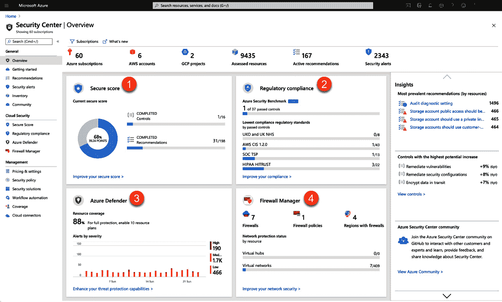

图 6.1：Azure 安全中心概览

在 **安全中心** 页面上，您可以查看订阅中资源的安全姿态概览，以及加强这些资源安全性的建议：

1.  **安全评分**：Azure 安全中心云安全态势管理功能的核心是安全评分。这是对所有资源的安全建议当前状态的衡量标准。它通过计算健康资源与总资源的比例，并加权一些安全建议的重要性来得出。得分越高，识别出的风险水平越低。

1.  **合规性**：提供您已应用于订阅的各种法规和行业标准的合规性水平的洞察。必须启用 Azure Defender 才能监控您的合规性评分。

1.  **Azure Defender**：这是安全中心集成的云工作负载保护平台。您可以从安全中心访问 Azure Defender，保护在服务器、SQL、存储、容器和物联网中运行的混合云和多云工作负载。Defender 是微软 **扩展检测与响应**（**XDR**）解决方案的一部分。

1.  **防火墙管理器**：将 Azure 防火墙管理器集成到 Azure 安全中心的主仪表板中，允许客户检查所有网络的防火墙覆盖状态，并集中管理 Azure 防火墙策略。

### 安全态势管理与多云

随着多个云服务提供商云服务的快速采用，组织能够简化运营、实现远程办公，并提高员工生产力。跨多个云平台使用云应用程序引入了新的风险和威胁。

**云安全态势管理**（**CSPM**）是一个术语，用来描述安全解决方案应该包含的关键特性，以提供可见性和能力，帮助您了解环境并更好地保障它的安全，无论是在云端还是本地。

通过 Azure 安全评分，安全中心可以帮助您改善安全态势，降低资源被攻击的可能性。这不仅适用于 IaaS 或 PaaS，还适用于 SaaS。事实上，*Azure 安全中心的总经济影响研究*指出，Azure 安全中心可以将安全漏洞的风险降低 25%。

您可以通过以下网址阅读有关 TEI 研究的更多内容：[`query.prod.cms.rt.microsoft.com/cms/api/am/binary/RWxD0n`](https://query.prod.cms.rt.microsoft.com/cms/api/am/binary/RWxD0n)

微软的云安全平台可以改善云基础设施的安全配置，并帮助您检测和保护 Azure、内部环境以及其他云中的环境。

已采纳多云策略的组织现在能够轻松改善其安全态势，因为 Microsoft 通过安全中心提供统一的基础设施安全管理系统，帮助加强云端和本地资源的安全态势，同时提供威胁保护和深入分析。通过安全中心，你可以持续评估资源的安全状态，包括运行在其他云和本地数据中心的资源。

安全中心为你提供了保护服务和强化网络所需的工具。你可以在 Azure 订阅中启用安全中心，并利用扩展的检测和响应功能，为在 Azure、本地和其他云环境中运行的工作负载提供威胁保护。

大多数迁移到 Azure 的组织通常会将一些具有传统安全控制的应用程序迁移到云端，以尝试保护这些工作负载。但实际上，云威胁与本地威胁不同。因此，安全中心解决了云原生工具的需求，能够识别资源中的潜在漏洞，并提供有关如何解决这些漏洞的建议。

保护混合云和多云环境有多种策略、战术和工具可供选择。以下是保护多云环境的四阶段建议策略：

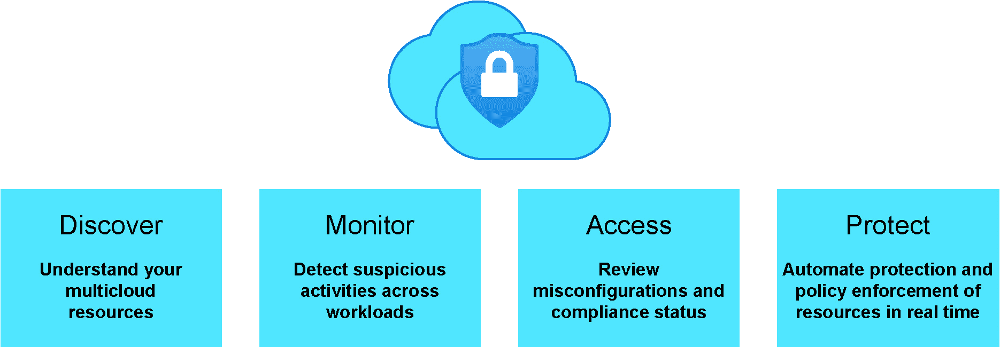

图 6.2：保护你的多云环境的四个阶段

**阶段 1**：识别组织安全态势的状态

理解并评估资源的状态及其实际使用情况非常重要；为此，你可以使用 **Cloud Discovery** 分析通过网络传输的所有流量。识别异常的过程可以通过机器学习、异常检测引擎或主要关注发现和调查过程的自定义策略来完成。

**阶段 2**：检测工作负载中的可疑行为

建议使用云监控工具，这样你可以从警报中学习，调整活动检测以识别真实的安全入侵，并改进处理大量误报的过程。你可以遵循一些具体的建议，例如配置 IP 地址范围、调整监控使用情况和警报灵敏度，以及调整异常检测策略。

**阶段 3**：评估并修复配置错误和合规性状态

安全中心可以评估给定订阅中的所有资源，并为整个环境提供建议。当你选择特定的建议时，安全中心会将你重定向到该建议的详细信息页面，在那里你可以看到更多详细信息和如何修复已识别问题的说明。

对于多云方法，如果您的组织正在使用**亚马逊网络服务**（**AWS**）或**谷歌云平台**（**GCP**），您可以深入了解 AWS 的安全配置细节。当您将 AWS 连接到 Azure 安全中心时，您将能够在安全中心中看到 AWS 的建议，帮助您实现多云方法。

**第 4 阶段**：自动化保护和策略执行以保障云资源

本阶段的重点是通过执行控制和访问资源的策略，实时保护您的云资源免受数据泄漏。这将防止数据外泄和恶意文件上传到您的云平台。

可以创建会话策略，阻止上传标签错误的文件，并配置策略以强制正确创建标签。这样，您可以确保保存到云中的数据具有正确的访问权限。

### Azure 安全中心架构

由于安全中心与 Azure 本地集成，您可以监控几乎所有属于您环境的资源，并在无需额外部署的情况下保护它们。如前所述，安全中心可以保护非 Azure 服务器，并通过安装安全中心代理来支持 Windows 和 Linux 服务器，如*图 6.3*所示：

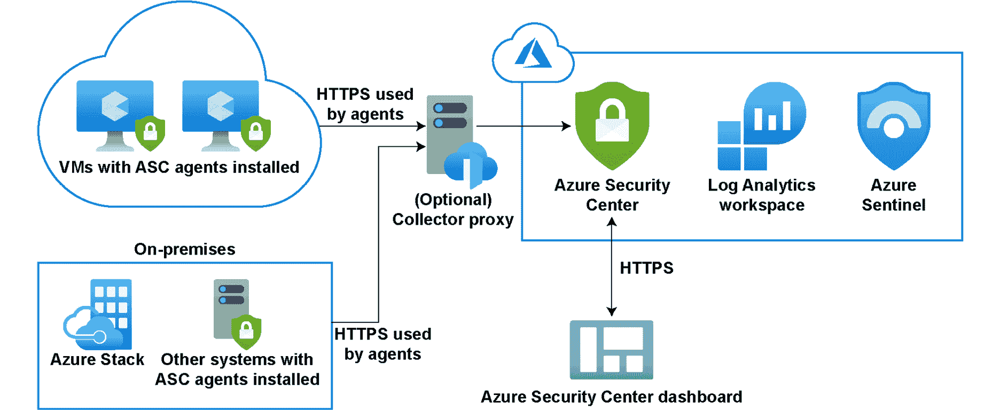

图 6.3：Azure 安全中心与 Azure Sentinel 架构

该代理收集所有安全事件，然后在安全分析引擎中进行关联，为您提供基于定义的安全策略的定制建议。安全策略基于在 Azure 策略中创建的策略计划，可以用于定义工作负载的期望配置，以确保您遵守组织或任何特定法规的安全要求。

安全中心包含三种主要的安全策略：

+   **内置默认策略**：这是在启用安全中心时自动分配的策略。它们是内置计划的一部分，您可以稍后进行自定义。

+   **自定义策略**：如果您的环境未遵循您创建的策略，您可以使用自定义安全策略并添加自定义计划，以接收建议。您可以通过安全中心配置自定义计划，选择您希望添加自定义计划的订阅或管理组，并为其定义参数。

+   **合规性监管政策**：您将能够看到一个合规性仪表板，显示您环境中所有评估的状态，以帮助改善您的合规性监管。

### Azure 安全基准

安全是微软与您的组织及客户之间的共同努力。我们必须确保我们的工作负载在本地或云端都能保持安全。为了帮助您提高在云中运行的工作负载、数据和服务的安全性，微软为 Azure 提供了**安全基准**，专注于云中心的控制领域，并通过**Azure 安全基准**（**ASB**）应用指令性指导和最佳实践来加强安全。

ASB 主要专注于云中心的控制领域。通过这种方式，您可以遵循包括云采纳框架、Azure 良好架构框架和微软安全最佳实践在内的建议和指导。

理解 Azure 安全基准中的背景和术语非常重要，因此我们需要强调一些术语：

+   **控制**：这是一个描述功能或活动的术语，非特定于某项技术，必须解决的内容。例如，**数据保护**是一个安全控制，包含应采取的具体行动，以确保您的数据得到保护。

+   **基准**：这包含特定技术的安全建议，并可以按所属控制分类。例如，ASB 包含针对 Azure 的特定安全建议。

+   **基准**：这是对 Azure 服务实施安全基准的过程。例如，一个组织可以按照 Azure SQL 安全基准启用 Azure SQL 的安全功能。

如果您的组织是 Azure 新用户，并希望获得建议来保护部署、改善现有环境的安全态势，或满足高度监管客户的合规要求，ASB 是理想的起点。它包含工具、跟踪和安全控制，并与知名的安全基准一致，例如**互联网安全中心**（**CIS**）控制版本 7.1 和**美国国家标准与技术研究院**（**NIST**）SP800-53。

ASB 可以通过一系列安全建议来帮助您保护在 Azure 中使用的服务，这些建议包括：

+   **安全控制**：这些是您可以在 Azure 租户和服务中应用的建议。

+   **服务基准**：这些可以应用于 Azure 服务，以便获取关于特定服务安全配置的建议。

要实施 ASB，您可以从规划实施并验证适合您组织需求的企业控制和服务特定基准开始。接下来，使用安全中心的合规性仪表板监控合规性。最后，通过**Azure 蓝图**和**Azure 策略**建立保护措施以强制执行合规性。ASB 包含以下控制领域：

+   网络安全

+   身份管理

+   特权访问

+   数据保护

+   资产管理

+   日志记录与威胁检测

+   事件响应

+   姿态和漏洞管理

+   端点安全

+   备份与恢复

+   治理与策略

ASB 是 Azure 安全中心的默认安全策略，因此您可以在 Azure 中扩展安全建议的丰富性。结果，Azure 安全评分将反映出更广泛的建议集，并覆盖更广泛的 Azure 资源。

此外，ASB 在合规性仪表板中的完整控制集布局现在对所有 Azure 安全中心客户开放，包括 Azure 安全中心免费版以及现有的 Azure Defender 客户。客户可以在查看详细的安全评分影响时，在合规性视图中查看与基准控制的合规性。通过使用安全评分指标优先修复安全建议，客户可以在实现更高安全评分的同时，达到合规性目标。

您可以在以下 GitHub 仓库中查看完整的安全中心安全基准映射文件的最新更新：[`github.com/MicrosoftDocs/SecurityBenchmarks/`](https://github.com/MicrosoftDocs/SecurityBenchmarks/)

### 通过 Azure Defender 实现混合云和多云环境的高级威胁保护

随着过去几个月居家工作的人员数量急剧增加，组织需要确保员工能够通过多种设备访问公司资源的需求大大增加。因此，调整安全策略以支持远程工作并保持数据安全变得至关重要。如前一节所述，安全中心可以改善您的**云安全姿态管理**（**CSPM**）并提供**云工作负载保护**（**CWP**）能力。

您可以在任何给定的订阅中免费使用安全中心，其中包括检测您 Azure 资源中的安全配置错误、通过安全评分来改善您的混合云姿态，并启用 Azure Defender 为您的 Azure 混合工作负载提供高级保护。

Azure Defender 集成到与安全中心相同的云原生服务中，并提供额外的安全功能，如安全警报和高级威胁保护。

Azure Defender 原生支持 Azure 服务，如虚拟机、SQL 数据库、存储、容器、Web 应用程序、网络以及托管在本地或其他云平台（如 AWS 和 GCP）上的非 Azure 服务器。

为了扩展在其他云或本地运行的 SQL 数据库和服务器的混合云保护，建议您使用 Azure Arc 和 Azure Defender。您可以在以下网站查看资源覆盖范围和定价的详细信息：[`azure.microsoft.com/pricing/details/azure-defender/`](https://azure.microsoft.com/pricing/details/azure-defender/)

### Azure Defender 仪表板

如果你进入 Azure 门户并查找 **安全中心**，在 **安全中心** 中，你会找到 **Azure Defender** 仪表板，如 *图 6.4* 所示：

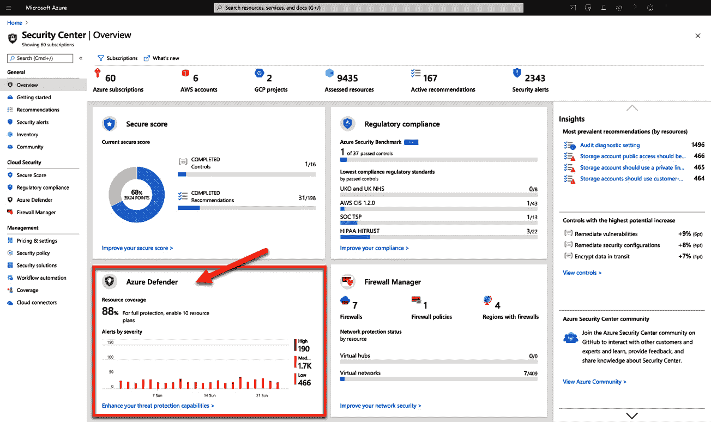

图 6.4：Azure 安全 Defender 仪表板

**Azure Defender** 仪表板将为你提供资源的整体覆盖情况、安全警报、先进的保护措施，以及对你最常受攻击的资源的洞察，并附带虚拟机的漏洞警报：

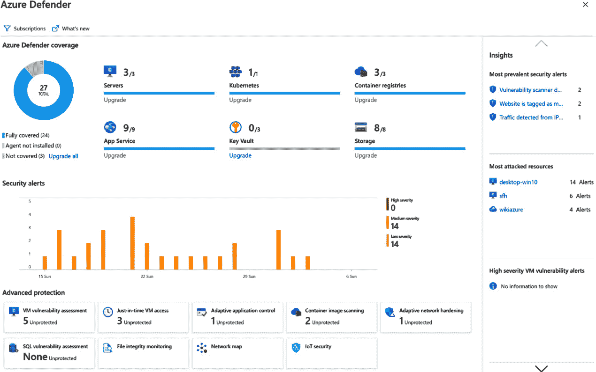

图 6.5：Azure Defender 仪表板

让我们来看一下 Azure Defender 在服务器、SQL、存储和容器注册表方面能做什么。

### Azure Defender for 服务器

Azure Defender 与 Azure Monitor 集成，用于保护你的基于 Windows 的机器。当安全中心展示警报和修复建议时，Azure Defender 会从机器中收集审计记录，包括通过 `auditd` 收集的 Linux 机器的记录，`auditd` 是一个存在于内核中的常见 Linux 审计框架。

你的组织可以通过使用 Azure Defender for 服务器获益，从多个方面提供威胁检测和防护功能，具体包括以下内容：

+   与 Microsoft Defender for Endpoint 集成，因此当检测到威胁时，会触发警报，并显示在安全中心中。

+   使用 Qualys 漏洞扫描器，我们稍后会详细讨论。

+   JIT 访问可以用于锁定进入虚拟机的流量，从而减少受到攻击的暴露面。

+   变更监控或文件完整性监控，可以帮助你检查操作系统、应用程序的文件和注册表，以及可能表明攻击的文件大小、访问控制列表和内容哈希的变化。

+   你可以使用自适应应用程序控制，作为一个智能化、自动化的解决方案，创建一个允许列表，列出可以在机器上运行的应用程序，并在发现有未定义为安全的应用程序运行时，获取安全警报。

+   自适应网络硬化可以通过 **网络安全组**（**NSG**）硬化帮助你改善安全态势。

+   安全中心可以评估你的容器，并将其配置与 **互联网安全中心**（**CIS**）的 Docker 基准进行比较。

+   你可以使用 **无文件攻击检测**，并获得带有描述和元数据的详细安全警报。

+   Linux `auditd` 警报和日志分析集成可以用来收集丰富的记录，这些记录可以汇总成事件。

### Azure Defender for SQL

Azure Defender for SQL 可以用于保护你的工作负载免受潜在的 SQL 注入攻击、异常数据库访问和查询模式以及可疑活动的威胁。它可以用于 IaaS 和 PaaS 服务。简而言之，它支持以下两个范围：

+   **SQL 数据库服务器**：包括 Azure SQL 数据库、Azure SQL 托管实例和 Azure Synapse 中的专用 SQL 池。

+   **机器上的 SQL 服务器**：这为基于 Azure 的 SQL 服务器提供扩展保护，同时也适用于其他云端和本地环境，例如 Azure 虚拟机上的 SQL 服务器、在 Windows 机器上运行的本地 SQL 服务器以及启用 Azure Arc 的 SQL 服务器。

### Azure 存储防御

对于远程工作人员访问云中具有上传文件功能的应用程序，我们需要确保能够判断上传的文件是否可疑。通过 Azure 存储防御，我们可以使用哈希信誉分析，并在发现任何可疑活动、异常行为或潜在的恶意软件上传时触发警报。

Azure 存储防御会显示警报，并且可以通过电子邮件通知存储的所有者，要求批准删除这些文件。

### Azure 容器注册表防御

使用 Azure 容器注册表，你可以在托管的私有 Docker 注册表服务中构建、存储和管理容器镜像和工件。

你可以通过 Azure Defender 扫描容器镜像中的漏洞，并在安全中心的安全推荐列表中查看按严重性分类的发现。

镜像可以在三个不同阶段进行扫描：推送时、最近拉取的镜像时和导入时。这些镜像从注册表中拉取后，会在与 Qualys 扫描器隔离的沙箱中运行。然后，安全中心将呈现发现的结果。

### Qualys 漏洞扫描器

Azure Defender 包含三个 Qualys 扫描器：一个用于机器，一个用于容器注册表，另一个用于 SQL。Qualys 扫描器，如*图 6.6*所示，已集成到安全中心，并通过安装在实际资源上的扩展监控你的机器。然后，Qualys 的云服务执行漏洞评估并将结果发送到安全中心：

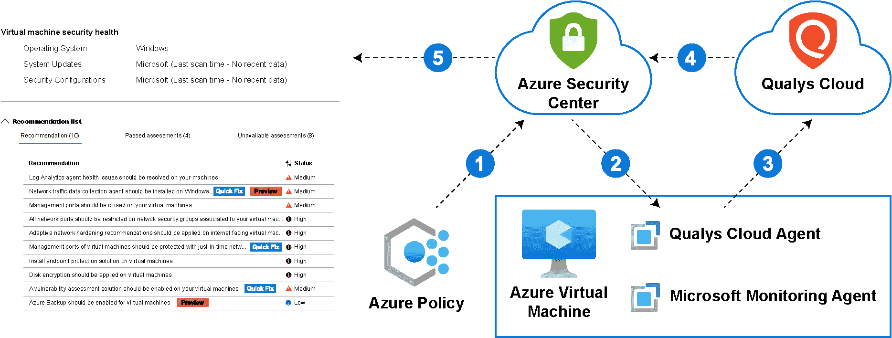

图 6.6：Azure 安全中心漏洞扫描器

漏洞扫描器的工作原理如下：

1.  一旦为你的订阅启用 Azure Defender，你可以使用推荐 *应在虚拟机上启用漏洞评估* 来部署集成的漏洞扫描器扩展。

1.  扩展安装后，代理会收集必要的安全信息，包括操作系统版本、开放端口、已安装的软件、环境变量和与文件相关的元数据。每 4 小时进行一次扫描，所有数据都会发送到 Qualys 云服务进行分析。

1.  Qualys 分析信息并按机器构建发现。这些发现会被发送到安全中心。

1.  然后，你可以从安全中心的推荐页面查看机器的漏洞。

通过将非 Azure 机器连接到安全中心并通过 Azure Arc 进行扩展部署，可以扫描这些机器。对于大规模部署，您可以使用**Azure 资源管理器**（**ARM**）修复脚本、PowerShell、Azure Logic Apps 或 REST API。

### 警报

由于安全中心可用于保护您在 Azure、其他云平台和本地部署的资源，它可以生成多种类型的警报，这些警报是通过 Azure Defender 的高级检测触发的。

如果在任何资源上检测到威胁，将生成这些安全警报。安全中心为您提供一个单一视图，显示包含事件的攻击活动。安全事件是相关警报的集合。

您将能够检查安全警报并查看更多相关细节，如*图 6.7*所示：

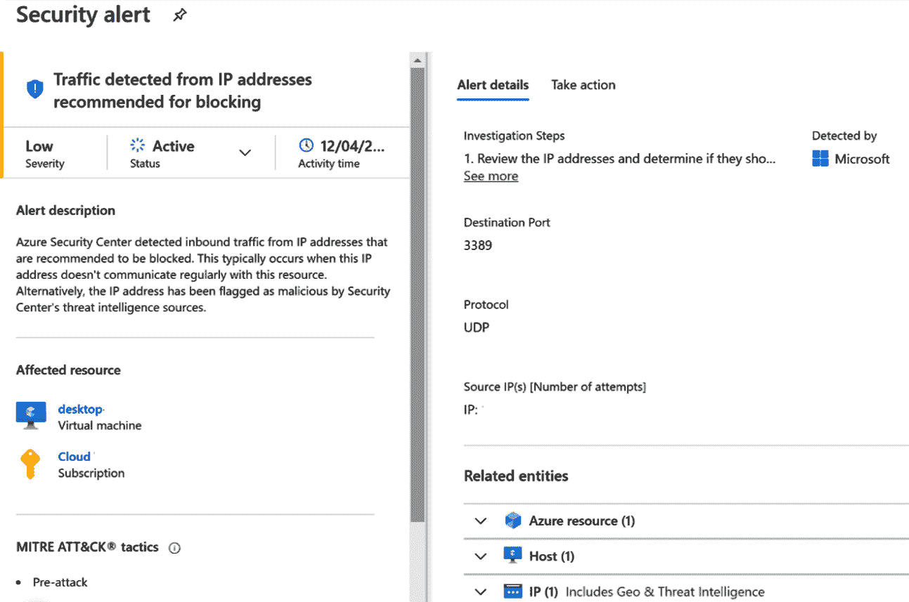

图 6.7：安全警报详细信息

随着环境的不断增长，您可能会在安全中心看到更多的警报，您将需要更好地控制这些警报并根据优先级进行处理。安全中心会根据四个类别为这些安全警报分配严重性级别：

+   **信息性**：如果您深入到由多个警报组成的安全事件中，您将看到这些类型的警报。

+   **低**：这些类型的警报可能表示一个已被阻止的攻击或一个低影响的误报。

+   **中等**：这些警报表明由于可疑活动，某个资源可能已被攻破。例如，来自异常位置的登录。

+   **高**：高风险警报表示您的资源很可能已被攻破，您应立即采取行动。

安全中心允许您以不同方式导出警报。您可以在警报仪表板上下载 CSV 报告，配置持续导出，或使用 SIEM 连接器（如 Azure Sentinel）进行安全警报流式传输。

虽然 Azure Defender 可以帮助您保护和修复潜在漏洞，但同样重要的是在配置对您的工作负载至关重要的资源时，实施最佳实践，例如网络资源。

## 确保网络安全的最佳实践

在本章的前一节中，*安全操作卓越性*，我们回顾了零信任原则。这一原则假设攻击是不可避免的，因此我们必须确保设置合适的控制措施来验证每一个请求。身份管理在这一过程中起着至关重要的作用。

在零信任模型中，确保网络安全的三个主要目标是：

+   提前准备应对攻击

+   减少攻击面和损害程度

+   加强您的云端基础设施，包括您环境中的资源和配置，以减少被攻破的可能性。

如果贵组织正在启用远程工作并实施端到端的 Zero Trust 框架，则有一些最佳实践需要遵循，以实现这些目标：

+   网络分段

+   威胁保护

+   加密

让我们更详细地了解一下它们。

### 网络分段

保护企业网络是首要任务，但随着远程工作重新定义了安全边界，这比以往任何时候都更具挑战性。现在的安全边界不再由组织的物理位置定义，而是扩展到访问企业数据和服务的每个终端。因此，仅依赖传统的防火墙和 VPN 已经无法保护这一新的数字化资产。

众所周知，没有一种通用的架构设计适用于所有组织；每个组织都有不同的业务需求需要满足。采用 Zero Trust 方法可以帮助确保远程工作人员的安全性，同时不影响应用体验。

传统企业曾使用传统网络控制来保护企业边界。传统网络通常只有少数的网络安全边界，并且是平坦的开放网络，这使得攻击者可以迅速横向移动，快速遍布整个网络。Zero Trust 网络是完全分布式的，采用微分段。细粒度的网络分段消除了网络中的信任，大大减少了横向移动和数据外泄的风险。

Zero Trust 网络采用机器学习威胁保护和基于上下文的过滤，这可以有效阻止即使是最复杂的攻击。在传统网络中，并非所有流量都被正确加密，这使得它们更容易受到中间人攻击、窃听和会话劫持的威胁。而在 Zero Trust 网络中，所有流量都使用行业标准进行加密，以确保数据在传输过程中保持机密性。

主要目标是通过微型边界将传统的集中式网络转变为更全面和分布式的网络分段。通过这种方式，应用程序可以跨多个 Azure 虚拟网络进行划分，并通过中心-辐射模型连接。此外，建议在中心虚拟网络中部署 Azure 防火墙，以检查所有流量。

为支持这种方法，Microsoft Azure 提供了多种云原生网络组件，以支持远程工作并缓解网络问题。组织正在通过 Microsoft Azure Marketplace 使用第三方 NVA 来提供跨多云和本地环境的关键连接。

### 威胁保护

暴露于互联网的云应用面临更高的攻击风险，因此我们必须确保扫描所有经过这些应用的流量。威胁保护涉及到能够缓解已知和未知攻击的能力。

未知攻击主要是指那些无法与任何已知签名匹配的威胁。对于已知攻击，大多数情况下会有可用的签名，我们可以确保每个请求都经过检查。

Azure 中提供的服务，如**Web 应用防火墙**（**WAF**），可用于保护 HTTP(S) 流量。您可以将 Azure WAF 与 Azure Front Door 或 Azure Application Gateway 一起使用，而 Azure Firewall 可用于在 OSI 模型的第四层进行基于威胁情报的过滤。

### 加密

Azure 使您能够确保对敏感数据的保护。它在多个加密领域提供支持，包括静态数据加密、传输中数据加密以及密钥管理。静态数据加密适用于持久存储资源，如磁盘或文件存储，并且在 SaaS、PaaS 和 IaaS 服务中均可用。

通过服务器端加密，您可以使用服务管理密钥或客户管理密钥，结合 Key Vault 或客户控制硬件。客户端加密包括由运行在本地或 Azure 之外的应用程序处理的数据，以及接收到 Azure 后进行加密的数据。

在零信任模式下，我们必须确保从用户到应用程序的所有流量都经过加密。我们可以通过使用 Azure Front Door 强制执行暴露给互联网的应用程序的 HTTPS 流量，并利用 VPN 网关（P2S 或 S2S）等网络服务和功能来实现这一目标。

此外，如果您通过虚拟机启用对 Azure 中资源的访问，您可以使用 Azure Bastion 来确保通信安全，如*第五章*《使用 Azure AD 和 WVD 启用安全远程工作》中所述。

现在我们已经审查了确保网络和流量安全的最佳实践，接下来同样重要的是，您需要一个机制来从您环境中的资源中获取洞察，并能够主动分析环境中的潜在威胁。

## 使用 Azure Sentinel 现代化您的安全操作，一款云原生的 SIEM

支持远程工作的组织需要一种方式来监控并从其环境中获得更多洞察，无论它们是运行在云端还是本地。

Azure Sentinel 是一款云原生的**安全信息与事件管理**（**SIEM**）服务，它允许您通过内置连接器简化从多个数据源收集数据的过程，包括本地环境和多云环境，以便您能够主动分析潜在的威胁，并简化安全操作。

Azure Sentinel 关联来自您所有应用程序、服务、基础设施、网络和用户的安全日志和信号。Azure Sentinel 可以基于您的数据识别攻击，并将其显示在地图上，以便您分析所有流量。

首先，您需要连接您的资源，这些资源可以包括网络组件、应用程序和数据源。Azure Sentinel 为您提供了多种连接器，用于拉取数据，包括 Microsoft 服务，如 Microsoft 365 Defender、Azure AD、Microsoft Defender for Identity（前身为 Azure ATP）、Microsoft Cloud App Security 以及来自 Security Center 的 Azure Defender 警报，如*图 6.8*所示：

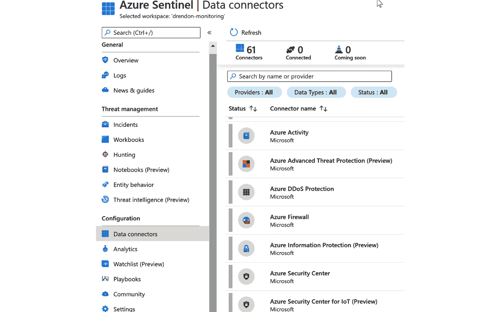

图 6.8：Azure Sentinel 数据连接器

或者，您可以选择第三方解决方案或创建自己的自定义连接器，因为 Azure Sentinel 支持通用事件格式、Syslog 和 REST API 来连接您的数据源。所有收集的数据都存储在日志分析工作区中，这是一个容器，用于收集和聚合数据。当您在订阅中启用 Azure Sentinel 时，您将能够选择一个特定的日志分析工作区。

一旦连接了您的资源，您将能够选择一个特定的工作簿，这个工作簿为数据分析提供了一个画布，并使您能够在 Azure 门户中创建自定义的可视化报告。您可以根据业务需求创建自己的工作簿，并将来自多个来源的数据整合在一个报告中，同时加入自定义的可视化效果。

通过**Azure Sentinel**仪表盘，如*图 6.9*所示，您可以获得组织安全态势的高层次概览，其中包含随着时间推移的事件和警报、按状态划分的事件以及潜在的恶意事件：

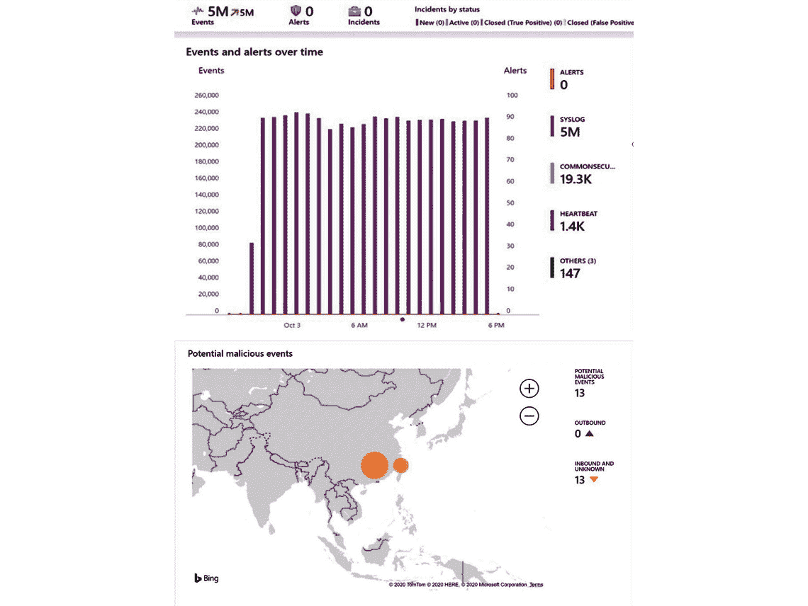

图 6.9：Azure Sentinel 仪表盘

让我们探索一下 Azure Sentinel 提供的其他一些功能：威胁检测与狩猎、调查与事件响应以及管理多个租户。

### 启用威胁检测与狩猎

将您组织使用的威胁指标流式传输到 Azure Sentinel，以增强您的安全分析，并在组织的数据源中进行安全威胁狩猎，无论这些数据是否存储在 Azure、其他云端或本地环境中。

Azure Sentinel 为您提供了狩猎功能，如*图 6.10*所示，其中包括内置的查询，可以筛选提供商或数据源，帮助您的安全分析师快速发现您现有数据中的问题。每个查询都提供了使用案例的详细描述，您可以根据需要自定义查询：

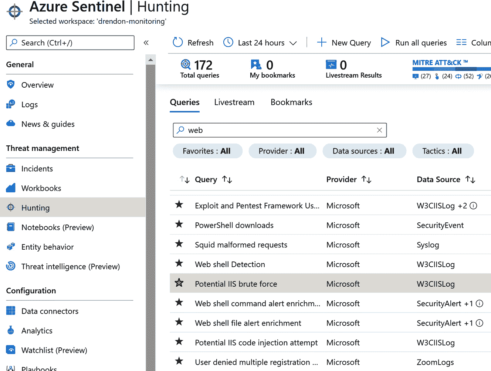

图 6.10：Azure Sentinel Hunting

查询基于**Kusto 查询语言**，并与 Azure Monitor 完全集成。一旦您自定义了一个查询，提供了有关潜在攻击的高价值见解，您可以保存该查询，并使用笔记本运行自动化的狩猎活动。

### 调查与事件响应

Azure Sentinel 允许您查看事件操作的变化。事件是基于分析规则创建的，并包含调查的相关证据；因此，它们可以包含多个警报。如果您组织中的分析人员希望调查事件，Azure Sentinel 提供了可通过**事件**页面访问的事件管理功能。您可以查看您有多少事件是打开、进行中或已关闭的：

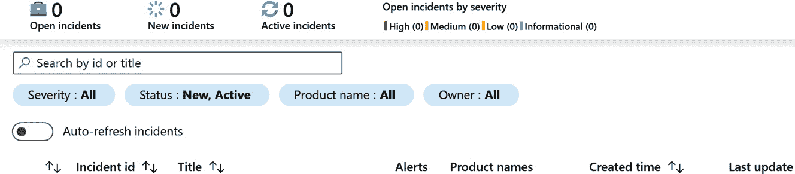

图 6.11：Azure Sentinel 事件表属性和过滤器

您可以深入查看每个事件，查看时间戳以及事件的状态和严重性。还可以使用调查图，它提供了与警报相关的实体以及与其关联的资源的示意图。

然而，目标是能够响应安全警报，并尽可能地自动化对这些安全警报的响应。Azure 安全剧本可以帮助您编排和自动化响应。这些安全剧本基于 Azure 逻辑应用程序，并可以改善您对安全警报的响应方式。

当您收到安全警报时，您可以手动运行剧本或自动化您的安全剧本。要手动执行安全剧本，您可以通过**事件**页面，在**警报**选项卡中配置您希望从可用剧本列表中运行的剧本。

自动化响应涉及从安全警报中配置触发器。您可以配置当安全警报匹配时触发安全剧本的动作。

### 管理多个租户/多租户环境

使用 Azure Sentinel 来现代化您的安全操作的一个巨大好处是，您可以从自己的 Azure 租户中管理客户的 Azure Sentinel 资源，因此无需连接到客户租户。这种多租户能力对于作为托管安全服务提供商为其他组织或客户提供服务的公司尤其有用。

从您自己的 Azure 租户中管理多个 Azure Sentinel 租户的能力是通过 Azure Lighthouse 实现的，Azure Lighthouse 提供了多租户管理功能并增强了资源和租户之间的治理。如果您的组织为多个客户提供托管服务，您可以使用更全面的管理工具，委派资源管理，通过 Azure 门户查看跨租户的信息，使用 ARM 模板进行客户入驻，执行管理任务，还可以通过 Azure Marketplace 提供托管服务。

基于行业垂直领域和档案，组织必须遵守规定的合规要求，这些要求指明了必须采用的安全控制措施，例如 PCI-DSS、NIST、ISO27001 等。

在云环境或混合环境中，满足这些监管合规要求可能是一个重大挑战。在最后一部分，我们将介绍 Azure 中的一些功能，帮助您执行这些组织标准。

## 统一的 SecOps 体验

随着组织部署云应用并为远程工作人员提供访问权限，保持一致性以确保云合规性、避免配置错误、降低潜在攻击风险以及实现组织范围的治理可能成为一项巨大的挑战。

您可以使用 Azure Policy 强制执行组织标准，通过策略定义评估资源的属性来评估合规性。Azure Policy 提供一个合规性仪表盘，您可以通过它查看每个资源或每个策略的更详细信息，从而确保您的资源符合合规要求。此外，您可以定义 Azure 举措，这些举措是 Azure 策略定义的集合，帮助您实现目标并简化策略管理：

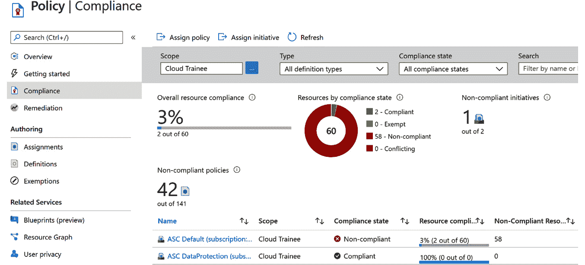

图 6.12：政策合规性

在这种背景下，您的组织可以利用 Azure Policy 中的一个新功能——**监管合规性**，该功能在本文撰写时处于预览阶段，提供内置的举措定义，帮助您了解控制项和合规领域。这意味着您可以看到哪个合规领域预期由您的组织、微软或共享合规领域来覆盖。

您将在**合规性**页面中看到一个名为**控制**的新标签页，您可以通过合规领域进行过滤，并查看每一行的详细信息：

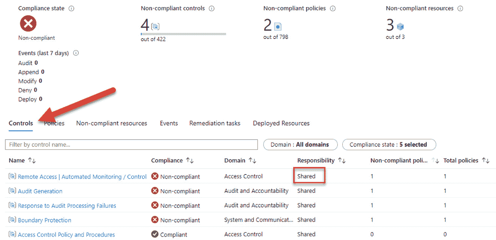

图 6.13：政策中的控制页面

通过使用 Azure Policy 中的监管合规性功能，您的组织可以实现符合业务需求的合规性。在合规页面上，您可以看到某个合规领域是由微软、客户负责，还是属于共同责任。 如果您正在查看的控制项是微软负责的，您还可以查看审计结果的更多详细信息。

## 总结

启用远程工作使得安全操作变得更加具有挑战性，因为需要监控和保护的端点和环境的数量显著增加。通过采纳零信任策略，我们可以降低潜在攻击和安全泄露的风险。

在本章中，我们回顾了微软提供的帮助您在组织中实施零信任策略并快速、智能地响应威胁的一些核心服务。

我们回顾了如何利用 Azure Sentinel（一款云原生 SIEM）来增强安全运营团队的能力，帮助他们在面对对手时始终保持领先。同时，我们也了解了如何使用 Azure Security Center 监控几乎所有属于你的环境的资源，并无需额外部署即可保护这些资源，以及如何使用 Azure Defender 保护你的工作负载，无论它们是在云端还是本地部署。

在下一章，我们将探讨如何利用 Azure 订阅中的工具来优化云成本，追踪资源使用情况，管理所有环境中的成本，并实施治理政策以有效地进行成本管理。
