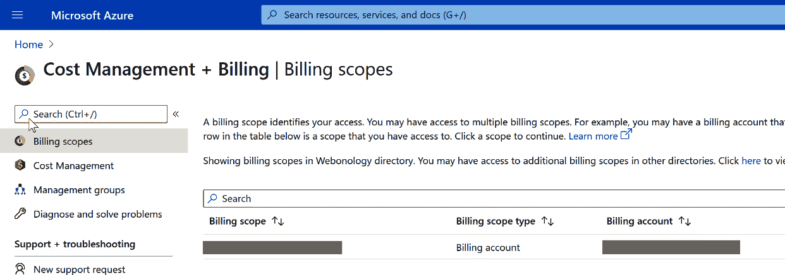

在上一章中，你了解了保护应用程序免受网络犯罪的基础知识。现在我们将重点介绍 Azure 提供的各种优惠和 Microsoft 提供的支持，以优化成本，介绍可用于降低成本的各种工具，以及管理这些成本的建议。

随着组织开始迈向云端，必须学习的关键事项之一就是如何优化成本。从客户的角度来看，成本预测可以基于如何减少数据中心的占地面积、运营支出定价模型、员工生产力以及其他因素。

本章将涵盖以下内容：

+   理解和预测你的成本

+   优化成本的策略

第一步是理解并规划你组织所面临的成本。

## 第七章：理解和预测你的成本

组织应该及时分析他们的 Azure 发票，以监控成本并减少管理 IT 资源所需的开销。使用 Azure 成本管理和计费以及 Azure 顾问等工具，你可以分析、管理并优化工作负载。在我们深入了解这些工具及其提供的好处之前，我们必须先理解在云基础设施中预测成本时最关键的因素。

### 云经济学

企业理解云经济学至关重要，这样他们才能预测成本并最大化云投资。企业应该分析从本地工作负载迁移到云端或从其他工作负载切换到 Azure 时的**投资回报率**（**ROI**）。首先，你需要基准测试当前数据中心的运行成本。这可能包括资本支出、维护和运营成本以及软件许可费用。你还应确定将 IT 操作迁移到云端的成本。

总结云经济学，你组织的关注点应该是以下八点公式：

1.  通过简化操作来减少数据中心占地面积。

1.  聚焦于将按需云服务作为运营支出模型的一部分来利用。

1.  通过解放员工免于维护任务，提升生产力。

1.  力求业务可持续发展。

1.  探索你的可扩展性选项，并在需要时提供资源。

1.  满足安全和合规标准。

1.  使用高可用性的云基础设施来确保业务连续性。

1.  优化工作负载和使用成本。

Azure 提供的解决方案可以帮助你实现这些目标，我们将在接下来的章节中进行探讨。

### 成本管理工具

Azure 提供了一系列工具，以提供卓越的开发和运维体验，并帮助了解在 Azure 中使用的资源的成本。本章讨论的所有成本管理解决方案，如果正确使用，将对业务产生影响。让我们来看看 Azure 中可用的工具列表。

### Azure 成本管理和计费

Azure 成本管理和计费具有完整的云成本管理功能，并提供跨所有云的单一统一视图，帮助您提高组织的问责制，并自信地管理云支出。**成本管理和计费**服务使您能够查看计费范围，深入分析成本管理，审查管理组，并诊断和排除问题：

图 7.1：成本管理 + 计费页面

管理组是一种独特的方式，用于对订阅和成本进行分组。虽然本章并不讨论管理组，但值得注意的是，它们仍然是管理订阅的有用 Azure 资源。

组织需要采取独特的方法，向非财务部门的用户提供成本管理访问权限。有多种方式可以使这些成本结构对组织的运营和开发人员可见。可以使用 Power BI 仪表板和 API 来提取报告，并创建整洁、独特的仪表板来访问成本信息；您可以在此处阅读更多内容：[`docs.microsoft.com/power-bi/connect-data/desktop-connect-azure-cost-management`](https://docs.microsoft.com/power-bi/connect-data/desktop-connect-azure-cost-management)。除了 Power BI，Azure 还允许与自定义应用程序集成，以及与像 CRM 这样的 SaaS 应用程序集成，以消化和使用您的数据。

如前所述，管理组可以帮助提供更好的成本视图，您还可以使用标签在组织内分配预算代码。以下截图展示了如何按服务基础来可视化成本：

图 7.2：按服务分组的成本

借助 Azure，您的组织可以轻松地从一个位置管理混合云环境（例如 Azure 和 AWS）的成本，从两个云的数据中获得最佳的洞察。

让我们快速了解一下 **成本管理** 部分，适用于按需付费模式（我们将在本章后面讨论的定价模型）：

图 7.3：成本管理部分

如您所见，**成本管理**部分允许您分析成本、创建成本警报、分配预算并获取顾问推荐。当您点击 **成本分析** 时，您将获得资源组范围内资源的详细分解，例如数据存储或无服务器帐户。

您还可以设置成本警报，这是一个极好的工具，可以通过设置阈值来监控非生产环境的超支，并收到警报。警报可以与预算结合使用，如下截图所示：

图 7.4：预算阈值警报

在组织可视化当前支出后，预算和警报是一个不可或缺的下一步。您应当监控和分析您的 Azure 账单，确保没有任何费用或隐藏的基础设施被遗漏。这在非生产环境中尤其重要，因为这些环境的控制通常不如生产环境严格。

当触发警报时，您应进行成本审查以找出原因，并确定是否需要采取任何措施。这可能包括修订预算或实施额外的 Azure 策略控制等。为不同团队的项目和业务部门分配预算，也有助于控制其成本。

要了解 Azure 策略及其在治理中的重要作用，请访问 [`docs.microsoft.com/azure/governance/policy/overview`](https://docs.microsoft.com/azure/governance/policy/overview)。

要了解更多关于 Azure 成本管理和计费的功能，请访问 [`docs.microsoft.com/azure/cost-management-billing/cost-management-billing-overview`](https://docs.microsoft.com/azure/cost-management-billing/cost-management-billing-overview)。

### Azure 定价计算器

Azure 定价计算器是一个免费的工具，可以用来实时估算订阅服务的成本。您可以通过中央仪表板个性化查看估算。定价计算器还可以与其他工具结合使用，例如 Azure **总拥有成本**（**TCO**）计算器，以实现更好的成本优化。我们可以创建估算并将其保存到账户中，或与相关方共享。

Azure 区域有时会影响 Azure 资源的成本，因此在选择资源之前，使用 Azure 定价计算器来预测成本是非常有帮助的：

图 7.5：Azure 定价计算器

Azure 定价计算器可以在此找到：[`azure.microsoft.com/pricing/calculator/`](https://azure.microsoft.com/pricing/calculator/)。

使用定价计算器时，组织可能会遇到的一大障碍是考虑到资源周围的基础设施，以便获得准确的估算。您应始终考虑部署应用程序到云所需的所有网络基础设施。

例如，考虑一个有两个虚拟机（VM）的组织，一个运行网站，另一个运行支持该网站的服务，它希望将这两个虚拟机迁移到云端。他们使用定价计算器，输入这两个虚拟机的信息，并发现它们的平均月度成本。

在这种情况下，他们应该做的一件事是查看虚拟机的使用情况，以便在 Azure 中正确配置其资源。许多组织过度分配了未来扩展所需的机器，但在云端，你可以随时扩展资源，因此无需配置过大的资源。该组织还忽视了路由器和防火墙，并未考虑虚拟机规模集，或者在虚拟机故障时保护基础设施的能力。如你所见，一个好的计划可以带来长远的效益。

### 总拥有成本计算器

当企业想要更全面地了解将 Azure 解决方案迁移的意义时，他们可以使用 TCO 计算器。这个工具提供了关于将本地工作负载迁移到云端的详细信息，并帮助企业了解如何使迁移过程更加顺利。

你可以在[`azure.microsoft.com/pricing/tco/calculator/`](https://azure.microsoft.com/pricing/tco/calculator/)找到更多关于该计算器的信息。

### Azure Migrate

另一个可以使用的工具是 Azure Migrate，特别是当你决定从本地迁移到云时。Azure Migrate 提供了一个集中的、统一的视图，用于评估和迁移本地服务器、基础设施、应用程序和数据到云端。它为组织提供了一系列工具和选项，帮助评估和迁移这些不同的资源和工作负载到 Azure。

有关如何使用 Azure Migrate 的更多信息，请访问[`docs.microsoft.com/azure/migrate/migrate-services-overview`](https://docs.microsoft.com/azure/migrate/migrate-services-overview)。

### 选择合适的定价模型

除了工具外，了解 Azure 提供的各种定价模型同样重要，这有助于更好地预测资源和成本。在 Azure 中，服务有两种标准定价模型：

+   按需付费模型，也称为基于消费的模型

+   固定价格模型

大多数 Azure 资源，如 PaaS 或无服务器服务，都将使用基于消费的模型。固定价格的一个例子是 Azure **预留虚拟机实例**（**RIs**），或者更广泛的 **Azure 预留**。

固定价格模型更具可预测性，而按需付费模型则可能变化，因此在选择两者时需要考虑业务需求。我们将在接下来的章节中详细讨论这两种模型。

### 基于消费的模型

按消耗付费或按需付费模型遵循基于公用事业的结构。这意味着你只为实际使用的部分付费，资源没有固定的月度费用或固定成本。举个例子，像功能应用程序这样的服务，你为一百万次应用使用支付一美元。

这种按使用付费的模型可以帮助你控制成本，但也可能导致成本增加。举个例子，像 CosmosDB 这样的服务基于使用量或请求单元收费，取决于查询运行的次数，最终可能会非常昂贵。

你可以使用架构模式，如基准负载平衡和服务的自动伸缩，来帮助实现固定的最低性能水平。如果需要突发工作负载，可以使用类似节流模式的方式，在负载下保持服务的质量。

### 固定价格模型

在固定价格模型下，无论资源是否被使用，你都需要为其支付费用。我们已经提到过 Azure 预留实例（RIs），但另一个例子是 Azure 中的应用服务计划。当你选择某种资源类型时，你会产生每月费用，无论有多少人使用该应用，你仍然需要支付这个费用。这个定价模型帮助组织更好地预测在 Azure 中的支出，但也可能根据使用情况出现问题。

当组织计划大规模使用虚拟机（VM）来支持应用时，它们会购买预留实例。作为对固定期限资源承诺的回报，Azure 会提供折扣价格。当你首次迁移到云时，可能会对资源使用情况产生不确定性，因此根据你的工作负载，最好在考虑预留实例之前先掌握这些情况。

在保持成本结构的过程中，规模扩展性与可预测性之间存在权衡，大多数组织选择两种定价模型的混合方式。

欲了解更多定价模型的信息，请访问[`docs.microsoft.com/azure/architecture/framework/cost/design-price`](https://docs.microsoft.com/azure/architecture/framework/cost/design-price)。

现在我们了解了 Azure 在帮助你评估和管理成本方面的各种方法，我们将继续讨论如何优化这些成本。

## 优化你的成本

成本优化是通过识别浪费、资源管理不当、资源规模不匹配以及预留容量来降低资源成本的过程。由于成本管理是云治理五大原则之一，因此关注如何为云资源制定支出计划和预算非常重要。您还需要使用监控和警报来执行这些预算，并检测开发实践中出现的异常。微软提供了云采用框架作为指导，其中详细介绍了工具、最佳实践和文档，帮助组织在云中取得成功。您可以在[`docs.microsoft.com/azure/cloud-adoption-framework/.`](https://docs.microsoft.com/azure/cloud-adoption-framework/.) 获取更多信息。

估算成本和对我们之前讨论的定价模型进行调整的一般方法是通过监控工作负载的峰值吞吐量。例如，如果利用率一直很高，那么按需付费模式在基准成本估算时就不够高效。因此，尽管按需付费模式提供了灵活性，但单靠它并不总能实现成本节约。

如前所述，最佳的成本优化是拥有一个计划，因此您应当利用手头的工具，从定价计算器到清单，来制定您的政策、预算和控制措施，以限制解决方案的支出。Azure 良好架构框架是建立这些政策的一个很好的起点，也是一个宝贵的信息来源。它位于[`docs.microsoft.com/azure/architecture/framework/cost/.`](https://docs.microsoft.com/azure/architecture/framework/cost/.) 我们在*第四章，云迁移：规划、实施和最佳实践*中讨论了 Azure 良好架构框架。

当我们在接下来的几个部分中开始探索 Azure 提供的优化选项时，您应该记住，这不仅仅是将工作负载迁移到 Azure，还包括周围的所有事项。在迁移到云时，许多组织会忽略一些相关的基础设施成本。

### Azure 顾问

通过 Azure 成本管理，您可以访问的一个有用服务是 Azure 顾问。Azure 顾问分析您的资源配置和使用情况，提供个性化的优惠和建议，帮助您优化资源以提高成本效益、安全性和性能。例如，它可以帮助您发现未使用的资源或长期处于空闲状态的资源，包括调整资源规模，如 SQL。

要了解有关 Azure 顾问的更多信息，请访问[`docs.microsoft.com/azure/advisor/advisor-overview`](https://docs.microsoft.com/azure/advisor/advisor-overview)。

需要特别指出的是，你应该为云计算正确调整资源。大多数组织会过度购买内部基础设施，只是为了未来的增长。当迁移到 Azure 时，你可以横向和纵向扩展，因此如果你的机器需要更多资源，可以增加更多资源。你还可以使用混合方法，不需要将所有工作负载迁移到云端——你可以将那些需要更多性能或实例级可扩展性的工作负载部分迁移过去。

### Azure 混合福利

Azure 混合福利是一项许可福利，可以大幅降低在云中运行工作负载的成本。它允许你在 Azure 上使用本地启用软件保障的 Windows 或 SQL Server 许可证，以及 Red Hat 和 SUSE Linux 订阅。此类福利可以使成本降低 40%或更多。此外，当你将 Windows Server 或 SQL Server 2008 及 2008 R2 工作负载迁移到 Azure 时，还将获得额外三年的安全更新，完全免费。

微软的混合福利模型的主要目标之一是通过使用 Windows 或 SQL Server 混合许可证节省成本，这能使托管实例的成本降低近 85%。这些福利也可以应用于虚拟机操作系统。*图 7.6*显示了一些涉及预留实例（RI）和 Azure 混合福利的潜在成本节省：

图 7.6：潜在的成本节省

推荐使用混合福利计算器来计算使用混合模型的整体成本节省，计算器可以在[`azure.microsoft.com//pricing/hybrid-benefit/#calculator`](https://azure.microsoft.com//pricing/hybrid-benefit/#calculator)找到。

### Azure 预留

Azure 预留可以帮助你在为资源承诺一年或三年的费用时节省资金。这些承诺可以使费用比按需定价节省最多 72%，因为这是一项预付费用的资源使用时间合同。只有在你有长期应用计划并且符合时间要求时，预留才应使用。它们仅适用于 Azure 中的特定资源，如虚拟机（VM）。

要了解更多有关预留的信息，请访问以下链接：

+   [`azure.microsoft.com/reservations/`](https://azure.microsoft.com/reservations/)

+   [`docs.microsoft.com/azure/cost-management-billing/reservations/save-compute-costs-reservations`](https://docs.microsoft.com/azure/cost-management-billing/reservations/save-compute-costs-reservations)

+   [`azure.microsoft.com/pricing/reserved-vm-instances/`](https://azure.microsoft.com/pricing/reserved-vm-instances/)

### Spot 虚拟机

Spot 虚拟机允许您以大幅折扣使用 Azure 未使用的计算能力。需要注意的是，当 Azure 需要恢复该计算能力时，它会驱逐您的 Spot 虚拟机。因此，Spot 虚拟机非常适合那些可以中断的工作负载，如批处理、非生产环境、大数据分析、基于容器的大规模无状态应用程序等。可用的计算能力因地区而异，取决于一天中的时间或工作负载的大小；因此，这些虚拟机没有服务级别协议（SLA）。您可以在 Azure 门户中查看所选 Spot 虚拟机的价格历史和驱逐率。

如果您想了解更多关于使用 Spot 虚拟机的信息，请访问[`docs.microsoft.com/azure/virtual-machines/spot-vms`](https://docs.microsoft.com/azure/virtual-machines/spot-vms)。

### DevTest 定价

Azure DevTest 使开发人员可以创建虚拟机或其他 PaaS 资源，而无需快速批准。它允许团队开发非生产环境，以快速测试应用程序，并使组织能够为这些非生产资源或沙箱区域设置一致的预算。此外，它还允许您为虚拟机设置自动启动和关机计划，以降低成本，并允许设置策略以确保不使用更大的资源。

要了解更多关于如何使用 Azure DevTest，请访问[`docs.microsoft.com/azure/devtest-labs/devtest-lab-overview`](https://docs.microsoft.com/azure/devtest-labs/devtest-lab-overview)。

### 优化清单

基于我们在本章中学到的内容，以下是一些您可以立即实施的 Azure 成本优化方法：

1.  根据需要调整未使用资源的大小，因为它们可以在云中水平和垂直扩展。

1.  在未使用时关闭您的资源。这可以通过自动化脚本来处理。

1.  利用云中的混合模型，仅将必要的工作负载迁移到云中。获取更多信息，请访问[`docs.microsoft.com/azure/cost-management-billing/costs/tutorial-acm-opt-recommendations`](https://docs.microsoft.com/azure/cost-management-billing/costs/tutorial-acm-opt-recommendations)。

1.  对您知道会在云中长时间使用的大型虚拟机资源使用预留实例。

1.  设置预算，将成本分配到不同的组，并在接近预算时接收警报。

1.  设置 Azure DevTest 环境，用于开发和测试，然后再发布到您的公共工作负载中。

1.  探索其他 Azure 服务，如 PaaS、SaaS 或无服务器，以优化您对云的使用并控制成本。

1.  按照 Azure 顾问的最佳实践建议优化您的工作负载成本。

1.  使用 Microsoft Azure 优良架构评审评估和设计文档审查您的工作负载架构，看看在哪里可以优化成本。

1.  利用 Azure 提供的优惠和许可条款，如 Azure 混合权益、通过预订为可预测的工作负载支付预付款、Azure Spot 虚拟机和 Azure 开发/测试定价。如需了解更多 Azure 提供的优惠信息，请访问 [`azure.microsoft.com/support/legal/offer-details/`](https://azure.microsoft.com/support/legal/offer-details/)。

## 总结

如您所见，组织建立全公司范围的成本管理和保护措施是有益的，这有助于解放团队，让他们能够提供更多的创新。在云中平衡性能、弹性与保持成本之间的关系可能很繁琐，您不应让成本成为唯一的驱动力。

在本章中，我们回顾了优化成本的方式，从正确配置资源或围绕未使用资源创建自动化，到为您的团队建立预算和警报来监控开支。

在 Azure 中，本地数据中心与将这些数据中心虚拟化到云中之间存在明显的成本差异。我们回顾了在 Azure 中处理这些成本和成本模型的一些方法。我们讨论了采用 Azure 的独特优势，包括通过混合模型将工作负载扩展到云中，以适应那些不完全需要在云中运行的工作负载。我们还看到了一些有助于管理和优化成本的工具。

总结一下，记住始终要：

+   选择适合您需求的 Azure 计算服务

+   正确配置资源

+   关闭未使用的资源

+   配置自动扩展

+   预留实例

+   使用 Azure 混合权益

+   为不同的团队和项目设定预算

我们不应该让成本驱动我们使用 Azure，但要意识到那些可能影响最终结果的因素。
