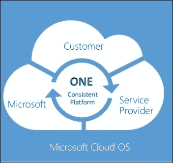
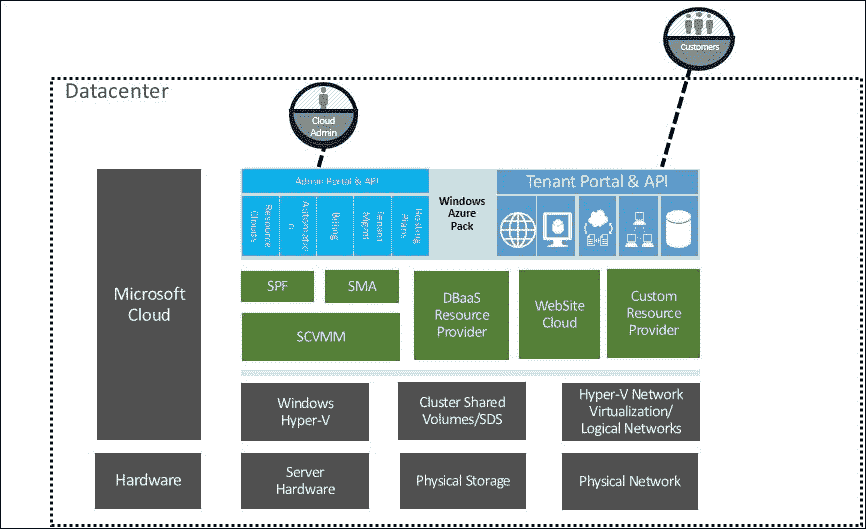
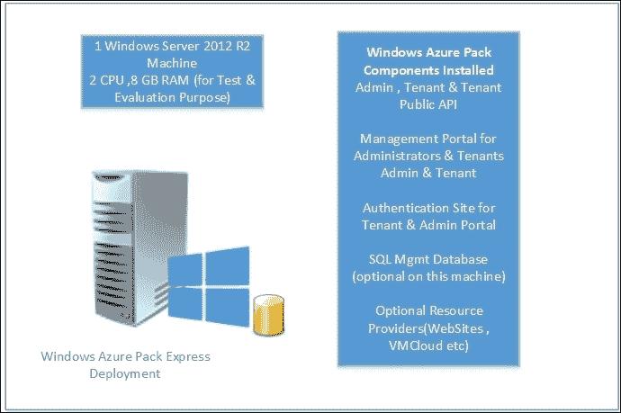
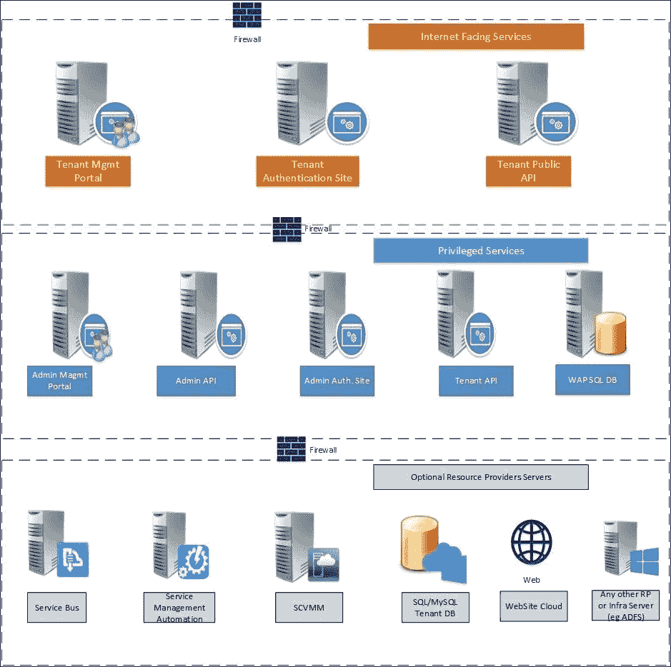
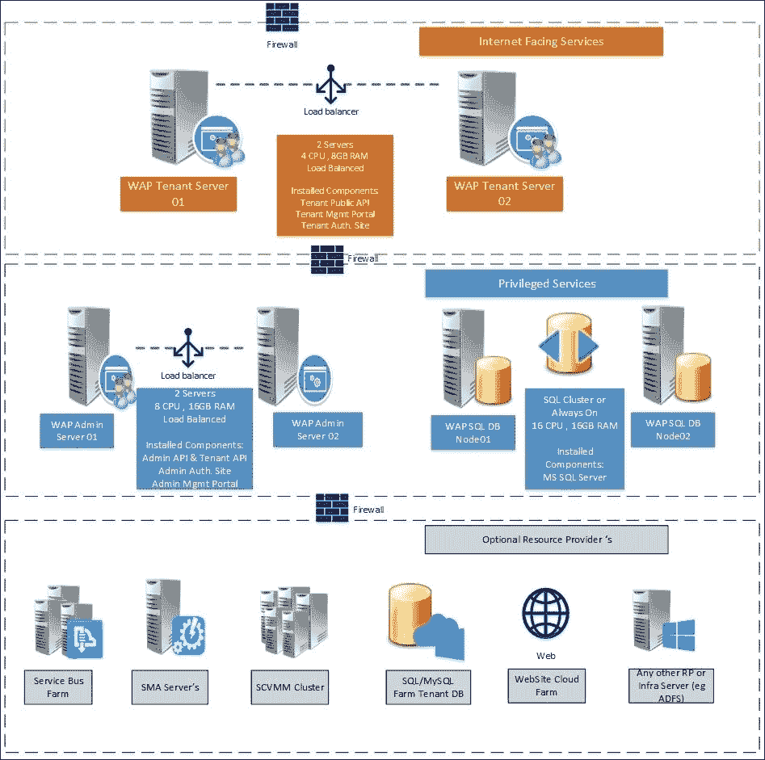
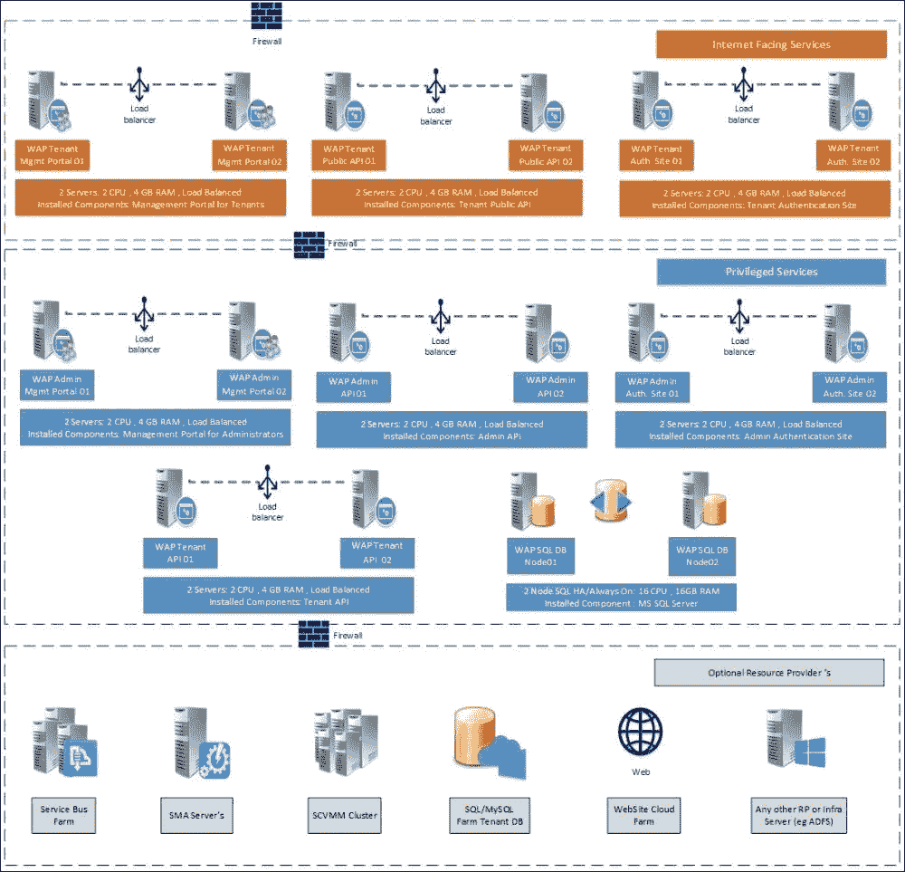

# 第一章：了解 Windows Azure Pack 及其架构

本章将介绍微软 Cloud OS 视野以及 Windows Azure Pack 在其中的角色。本章将帮助你理解 Windows Azure Pack 云解决方案的概述、功能和服务内容，以及其构建模块。之后，我们将讲解 Windows Azure Pack 组件的架构及其在测试和生产环境中的部署模型。

本章将涵盖以下主题：

+   微软 Cloud OS 视野

+   什么是 Windows Azure Pack？

+   Windows Azure Pack 的功能和服务内容

+   Windows Azure Pack 架构组件和功能

+   Windows Azure Pack 云解决方案构建模块

+   Windows Azure Pack 部署模型

+   集成 Windows Azure Pack 和 System Center 套件以提供 IaaS 服务

# 微软 Cloud OS 视野

Cloud OS 是微软的混合云解决方案，由 Windows Server、Windows Azure、System Center、Windows Intune 和 SQL Server 组成。微软 Cloud OS 视野使得在微软 Azure 公共云数据中心、客户的本地数据中心或服务提供商数据中心内托管云服务时，能够提供一致的平台和体验。Cloud OS 本质上执行与传统基础设施相同的操作，如服务器和应用程序的配置，但具有云规模的能力和效率。

Windows Azure Pack 为实现 Cloud OS 视野做出了重要贡献，它将微软 Azure 的功能和经验引入组织的私有云和服务提供商云中。这为使用微软技术提供云服务提供了一个统一、一致的平台。

下面是微软白皮书《Cloud OS 的统一管理：System Center 2012 R2》中的一句话，可以对其进行总结：

> *"微软对于 IT 新时代的愿景提供了一个一致的平台，用于基础设施、应用程序和数据：Cloud OS。Cloud OS 跨越你的数据中心环境、服务提供商数据中心以及 Windows Azure，帮助你轻松且具有成本效益地将业务云优化。"*

### 提示

关于微软 Cloud OS 的更多信息，请访问 [`www.microsoft.com/en-in/server-cloud/cloud-os/`](http://www.microsoft.com/en-in/server-cloud/cloud-os/)。

# 什么是 Windows Azure Pack？

Windows Azure Pack 是微软的一种解决方案，它与 Windows Server 2012 R2、System Center 套件、SQL 和 IIS 服务器集成。它们共同提供了一个面向组织和服务提供商的企业级云解决方案。Windows Azure Pack 将微软公共云的功能（即微软 Azure 的能力）带入你的数据中心。

Windows Azure Pack 由一系列 Azure 技术组成，使组织能够拥有企业级的自助服务和多租户云，并提供一致的 Microsoft Azure 公共云体验。为消除混淆，Windows Azure Pack 独立运行于 Microsoft Azure 云，并部署在组织自己的数据中心；由组织自行管理和运营。

Windows Azure Pack 提供包括虚拟机（基础设施即服务）、**数据库即服务**（**DBaaS**）、**平台即服务**（**PaaS**）等云服务，并具有启用自定义服务架构的灵活性，能够提供任何服务（XaaS）。

Windows Azure Pack 主要可用于以下使用场景：

+   作为组织的私有云解决方案

+   作为云服务提供商，即云转售商，作为托管云平台

令人惊讶的是，Microsoft 客户可以免费使用 Windows Azure Pack。

### 注意

其他 Microsoft 组件的许可，如 Windows Server、System Center、SQL Server 等，必须考虑用于云管理和工作负载基础设施。

## 用于组织私有云的 Windows Azure Pack

在当今云计算时代，组织的 IT 部门正逐渐转变为各个团队和业务部门（LOB）的 IT 服务提供商。在传统的计算模型中，不同的团队会向 IT 部门寻求 IT 需求，这通常是一个相当漫长的过程，涉及多个级别的审批、硬件/软件采购、实施、服务、计划安排等。该模型中，基础设施的准备本身就需要大量时间和资源，这导致在应用部署时面临各种限制。当涉及到测试和开发环境相关的请求时，情况会更加复杂。

私有云能够大幅度消除这些挑战。例如，借助私有云解决方案，开发团队可以通过一个易于使用的自助服务门户请求具有所需规格和中间件组件的虚拟机，而无需与 IT 基础设施提供部门进行繁琐的电子邮件沟通。在这种私有云基础设施中，开发团队可以期望在几分钟内就能准备好用于应用程序的服务器，而在传统模型中，这可能需要几天时间。

Windows Azure Pack 是一个平台，能够帮助组织以非常高效的方式获得所有私有云的好处和功能。让我们来看看私有云的几个主要要求和特性，以及通过 Azure Pack 提供的解决方案：

+   **熟悉的技术和操作简便性**：任何私有云解决方案的一个重要方面是该解决方案必须仅由组织的 IT 人员进行管理。技术应该是熟悉的并且容易管理。Windows Azure Pack 与微软产品（如 Windows Server、System Center、SQL、IIS 等）集成，这些产品已经被全球组织用于其 IT 需求。

+   **自服务门户和自动化配置**：Windows Azure Pack 提供与微软公共云客户相同的自服务租户门户，并结合 SPF、SMA 和 SCVMM 实现自动化配置。有关这些角色的内容将在后续主题中介绍。

+   **有效利用现有基础设施**：Windows Azure Pack 可以利用现有基础设施来配置工作负载，并通过验证过的 Hyper-V 和 SCVMM 功能（如动态内存、动态优化、差异磁盘等）实现有效利用。

+   **支持软件定义基础设施技术**：Windows Azure Pack 可以利用软件定义基础设施组件，如 SDN 和 SDS。这可以大大有助于实现硬件独立性，并避免昂贵的专有硬件购买。一个例子是使用 SDS 产品配合普通硬件服务器和磁盘机柜，而不是企业级存储阵列。

+   **动态控制与计费回收**：不同的团队和业务部门有不同的 IT 需求；例如，HR 部门可能需要更多存储空间来存储数据，而财务部门则可能需要更多的计算能力和存储空间。Windows Azure Pack 内置的计划和使用服务可以帮助更好地控制不同业务资源的使用，并通过计费回收进行财务管理。

+   **支持多厂商操作系统和应用程序**：由于 Windows Azure Pack 云集成了 Hyper-V 和 System Center，它支持广泛的操作系统，包括各种 Windows 和 Linux 版本、虚拟化供应商（默认是 Hyper-V，通过合作伙伴提供 VMware 解决方案）以及应用程序/数据库产品。

+   **自定义云服务**：每个组织可能都有一些特定的自定义需求，这些需求仅限于某个特定实体或团队。Windows Azure Pack 的客户产品为组织提供了灵活性，允许其设计和开发自定义服务，并将其与 Windows Azure Pack 集成，以实现云功能。

### 注意

并非在使用 VMware 作为虚拟化管理程序时，所有功能或自服务能力都可以使用。此内容将在第十章中详细介绍，*通过合作伙伴解决方案扩展 Windows Azure Pack 能力*。

## Windows Azure Pack 面向云服务提供商

Windows Azure Pack 为云服务提供商（如转售商/托管服务提供商）提供了灵活性，能够为客户提供与 Microsoft Azure 云一致的体验和功能。在这种场景下，Windows Azure Pack 组件在服务提供商的数据中心运行，并为外部或内部客户提供服务。

Windows Azure Pack 为服务提供商提供了构建自己的云平台的能力，以较低的成本托管服务，并使用经过验证的 Azure 技术，使其能够赢得越来越多的业务。这为云服务提供商和 Microsoft 带来了双赢的局面，因为 Microsoft Azure 技术的足迹正在拓展到 Azure 数据中心以外的云市场。

云服务提供商的主要关注点是提供真正的多租户、自服务云平台，并具有极高的自动化可能性，这与我们之前讨论的组织私有云需求有所不同。让我们来看看服务提供商云解决方案的一些主要需求，以及如何通过 Windows Azure Pack 来满足这些需求：

+   **赢得更多云业务**：这不是云解决方案的直接技术需求，但却是任何服务提供商业务中最重要的方面之一。服务提供商需要赢得客户的信任，才能让客户的工作负载在提供商的云中运行。Windows Azure Pack 使用与全球领先的公共云 Microsoft Azure 相同的技术，为全球客户提供服务。这将帮助服务提供商以更低的成本向客户提供经过验证的技术，从而赢得越来越多的业务。

+   **真正的多租户产品**：云服务提供商必须满足不同客户的多样化需求。真正的多租户架构，在门户、产品、服务质量（QoS）等方面是任何提供商云平台必不可少的。Windows Azure Pack 通过租户门户、Windows Azure Pack 计划和订阅等功能实现了这些特性。

+   **网络隔离与扩展能力**：在同一数据中心运行的客户工作负载将拥有不同的网络、安全需求，并且需要完全隔离开来。Windows Azure Pack 的虚拟网络利用网络虚拟化技术，为客户的工作负载提供完全的网络隔离。Windows Azure Pack 的站点到站点 VPN 功能，使用网络虚拟化网关，使客户能够将本地网络扩展到服务提供商的云网络，从而实现混合场景。

+   **广泛的云服务产品（IaaS、PaaS 等）**：Windows Azure Pack 云解决方案支持多种内置的自服务 IaaS、PaaS 和 DBaaS 产品，并具备添加自定义服务产品的能力。

+   **使用与计费**：Windows Azure Pack 云解决方案具备使用和计量功能，可与 SCOM（系统中心操作管理器）计费或其他第三方使用和计费解决方案（如 Cloud Assert 等）结合使用，提供企业级云计费解决方案。

+   **极致的自动化可能性**：通过与 Windows Azure Pack 集成的服务管理自动化（SMA），服务提供商可以为其环境编写专门的自动化工作流（使用 PowerShell 工作流），从而实现完全自动化的云解决方案。结合 SMA，标准的微软自动化解决方案如系统中心 Orchestrator 和 Windows PowerShell 可以被用来自动化操作。

+   **优化的资源使用**：Windows Azure Pack 云解决方案利用经过验证的企业级 Hyper-V 虚拟化技术，最大化硬件和软件资源的利用率。

+   **自定义服务**：Windows Azure Pack 提供了通过其门户添加自定义服务的选项，允许服务提供商添加与默认服务不同的独特自定义服务。

# Windows Azure Pack 的功能和服务

Windows Azure Pack 与系统中心和 Hyper-V 一起提供企业级 IaaS（基础设施即服务）、PaaS（平台即服务）和 DBaaS（数据库即服务）功能。以下是 Windows Azure Pack 部署后提供的主要功能和能力：

+   **云管理员管理门户**：Windows Azure Pack 服务管理门户为管理员提供了创建和管理云服务目录、资源提供商、租户用户账户、计划和订阅等功能。该门户将由组织或服务提供商的云管理员使用。

+   **租户管理门户**：租户的服务管理门户由租户管理员使用，用于自服务功能。通过这个门户，租户可以配置、管理和监控他们可用的云服务，如 IaaS、网站和数据库。

+   **服务管理 REST API**：服务管理 API 是管理门户功能的核心。它可以用于提供自定义资源服务和门户集成。

+   **虚拟机**：这是使用 Windows Azure Pack 提供的核心服务之一。它提供基于 Hyper-V 和系统中心的 Windows 和 Linux 虚拟机。包括适用于不同操作系统版本的 VM 画廊项目、虚拟机角色用于自动化服务配置（在虚拟机部署后）以及扩展选项。

+   **虚拟网络**：Windows Azure Pack 租户门户为租户管理员提供了自助服务功能，可以创建自己的虚拟网络以及所需的 IP 模式和 VPN 配置。它使用 System Center 和 Hyper-V 网络虚拟化技术。虚拟网络还提供站点到站点 VPN 功能，可以将客户的本地网络扩展到云提供商的网络，以满足混合云需求。

+   **数据库**：此提供为 MS SQL 服务器和 MySQL 数据库服务器提供了 DBaaS 功能。租户可以使用租户服务管理门户创建数据库，这些数据库可以被 Web 服务器或任何其他应用程序用于数据库需求。

+   **网站**：Windows Azure Pack 提供可扩展的共享 Web 托管平台，服务提供商或组织可以利用该平台运行 Web 工作负载。这与 Microsoft Azure 公共云网站功能一致。除了支持 ASP.NET、PHP 和 Node.js 应用程序外，网站云还提供内置的用于流行 Web 应用程序（如 WordPress）的库项，并与自定义开发的应用程序和系统集成。

+   **自动化**：Windows Azure Pack 包括通过与 System Center Orchestrator 产品的一部分 Service Management Automation（SMA）集成，实现在环境中启用自定义自动化的功能。通过 SMA 集成，可以编写和执行自定义运行簿和工作流程。

+   **自定义服务**：Windows Azure Pack 架构允许将额外的自定义服务集成到服务目录中。这些功能允许云服务提供商提供任何服务。组织和服务提供商可以为自定义服务提供启用自定义资源提供程序的设计和开发。

+   **服务总线**：此服务使得在分布式应用程序之间提供可靠的异步消息传递服务成为可能。服务总线通过允许本地 Web 服务投影公共端点，解决了在本地应用程序和外部世界之间通信的挑战。

### 提示

Windows Azure Pack 支持英语、德语、西班牙语、法语、意大利语、日语、简体中文、繁体中文、巴西葡萄牙语、韩语和俄语。

# Windows Azure Pack 组件和功能

现在我们了解了什么是 Windows Azure Pack，以及它的功能和服务提供，是时候深入技术细节，深入了解构成 Windows Azure Pack 的各个部分了。

Windows Azure Pack 由一系列站点和 API 端点组成，负责其不同的功能。Windows Azure Pack 组件可以分为以下两类：

+   强制组件

+   可选/依赖组件

强制组件必须在每个 Windows Azure Pack 部署中安装，而可选组件的部署取决于使用情况。

### 注意

Windows Azure Pack 组件使用 SQL 服务器数据库来存储其配置和运行时数据，这些数据高度依赖于数据库的可用性。

Windows Azure Pack 组件如下：

必需组件：

+   服务管理 API：

    +   管理员 API

    +   租户 API

    +   租户公共 API

+   认证站点：

    +   管理员认证站点

    +   租户认证站点

+   服务管理门户：

    +   管理员管理门户

    +   租户管理门户

可选或依赖组件：

+   资源提供者扩展（虚拟机云、网站等）

+   服务总线

+   自动化和可扩展性

+   PowerShell API

+   SQL 服务器和 MySQL 服务器扩展

+   使用扩展（服务）

+   使用扩展（收集器）

+   监控扩展

+   合作伙伴启用解决方案扩展（例如，vConnect、GridPro 等）

+   客户资源提供者扩展

+   Windows Azure Pack BPA（最佳实践分析器）

让我们了解前述组件的角色和功能：

+   **服务管理 API**：一组服务管理的 REST API。API 是通过管理门户和 PowerShell 模块访问 Windows Azure Pack 云服务的核心端点。我们可以将 API 看作是管理门户和 PowerShell 模块的支柱，使得云服务能够与其他云基础设施进行集成。

    总共有三个 API 接口，按其功能区分如下：

    +   **管理员 API**：管理员 API 负责通过管理门户或 PowerShell 模块执行 Windows Azure Pack 中的管理任务。此 API 通常托管在企业局域网（LAN）内，即它们不会暴露给公共互联网。

    +   **租户 API**：租户 API 负责执行租户的管理任务，例如通过租户管理门户或 PowerShell 模块配置和管理服务。此 API 不会暴露给公共互联网。

    +   **租户公共 API**：租户公共 API 还使租户能够配置和管理他们订阅的云服务。通常，它是公开暴露的。这使得租户能够在其订阅上使用 Azure Pack PowerShell 模块进行自定义自动化任务。

    除了云服务的配置和管理外，租户公共 API 使租户能够在没有管理员门户和 SMA 参与的情况下，为其云工作负载配置自定义自动化任务。

+   **身份验证站点**：身份验证站点为云管理员和租户的管理界面提供身份验证服务。当云管理员或租户用户打开各自的门户时，他们会被重定向到身份验证站点，使用其 Windows AD 凭据或 ASP.NET 凭据进行登录。如果需要，也可以使用 **Active Directory 联合身份验证服务**（**ADFS**）身份验证替代默认身份验证。成功登录后，页面将重定向到各自的管理门户。总共有两个身份验证站点：

    +   **管理员身份验证站点**：该站点负责为管理员管理界面提供身份验证服务。默认情况下，它使用 Windows 身份验证作为身份验证源。也可以配置为支持 ADFS 作为身份验证源。该站点通常不会对外暴露在公共互联网中。

    +   **租户身份验证站点**：该站点负责为租户管理界面提供身份验证服务。默认情况下，它使用 ASP.NET 会员提供程序进行用户身份验证。也可以配置为支持 ADFS 作为身份验证源。通常，该站点会暴露在公共互联网中，以支持租户通过互联网访问。

+   **服务管理门户**：服务管理门户是基于 HTML5 构建的网站，供管理员和租户用于云服务的创建和管理。这些门户提供与 Microsoft Azure 公有云门户类似的体验。总共有两个服务管理门户：

    +   **管理员管理门户**：在此门户中，云管理员配置和管理资源提供者，例如 IaaS 云、网站云、目录库项、计划和用户订阅、数据库资源提供者等。此门户仅限云管理员访问，通常不会对外暴露在公共互联网中。

    +   **租户管理门户**：这是租户用于自助服务的界面，可以进行云服务的创建、管理和监控，例如网站、虚拟机、数据库等。租户还可以通过此门户注册并订阅可用的 Azure Pack 计划。通常，该门户会暴露在公共互联网中。

+   **可选组件**：可选组件通常需要启用资源提供者扩展以及任何其他第三方解决方案/自定义产品的集成。以下是一些重要的可选组件角色及其功能：

    +   **虚拟机云**：此组件允许 Windows Azure Pack 为 Windows 和 Linux 虚拟机以及虚拟网络提供 **IaaS**（**基础设施即服务**）服务。虚拟机云需要 SPF（服务提供者基础）和 **SCVMM**（**系统中心虚拟机管理器**）才能正常运行。

    +   **WebSite 云扩展**：此扩展允许 Windows Azure Pack 提供网站即服务（PaaS）功能给租户。它可以与其他 Windows Azure Pack 内部组件共同安装。为了提供功能，它需要与网站云资源提供者的基础设施进行集成，详细内容将在第七章，*交付 PaaS – 网站云与服务总线*中讨论。

    +   **SQL 和 MySQL 资源提供者**：此扩展为租户提供数据库即服务（DBaaS）功能。MS SQL Server 和 MySQL 数据库可以通过 Windows Azure Pack 和数据库资源提供者基础设施来提供。

    +   **使用扩展（API 和收集器）**：Windows Azure Pack 提供了一项服务，用于收集云中所提供服务的使用情况，以便拥有企业级的计费和计量系统。合作伙伴可以使用此服务开发自定义计费解决方案，并与 Windows Azure Pack 使用情况服务集成，以实现自动化和一致的计费模型。收集器服务从每个资源提供者（如虚拟机云、网站等）收集使用数据，并将数据存储在使用数据库中。使用 API 即使用服务，客户的计费解决方案可以通过它来提取这些数据。

    +   **服务总线扩展**：此扩展实现分布式应用程序之间的可靠消息传递服务。它与 Microsoft Azure 服务总线功能相似，提供基于队列和主题的发布/订阅功能。

    +   **合作伙伴提供和自定义扩展**：此扩展包括合作伙伴为 Windows Azure Pack 提供的可扩展性解决方案，如 GridPro 提供的请求管理、CloudAssert 提供的 vConnect 用于 VMware 集成等。开发人员还可以创建自定义扩展以添加自定义的云服务。

# Windows Azure Pack 云解决方案构建模块

Windows Azure Pack 云解决方案有不同的基础设施组件来支持每种云服务，以交付特定的服务。上述讨论的 Windows Azure Pack 组件将保持一致，并与其他系统中心及其他 Microsoft 组件集成，以提供如 IaaS 和 PaaS 等功能。

通常，每个服务都需要一个扩展，可以与 Windows Azure Pack 组件一起安装，并负责门户集成和扩展（管理员和租户集成）。该扩展与资源提供者的基础设施组件（如 SCVMM、SQL 服务器等）直接或间接通信，以提供和管理服务。

以下截图展示了 Windows Azure Pack 云解决方案的主要组件，提供 IaaS、DBaaS 和 PaaS 服务。

## Windows Azure Pack 云 IaaS 服务解决方案组件

为了启用包括 Windows 和 Linux 虚拟机、虚拟网络的 IaaS 服务，Windows Azure Pack 云解决方案需要部署并集成以下组件：

+   Windows Azure Pack 组件

+   服务提供商基础（SPF）

+   系统中心虚拟机管理器 2012 R2（SCVMM）

+   Hyper-V 2012 R2 主机和集群（用于云管理和工作负载）

+   Windows Azure Pack、SPF 和 SCVMM 的 SQL 数据库服务器

+   Windows/Linux 虚拟机模板和画廊项目

+   计算、网络和存储的可用性

+   服务管理自动化（SMA-可选）

Windows Azure Pack 虚拟机云服务使用 SPF 与 SCVMM 通信，来配置和管理虚拟机资源。所有由管理员或租户执行的虚拟机任务都由 SPF 传递给 SCVMM 执行，也就是说，SPF 负责通过 SCVMM 完成工作。SMA 与 Windows Azure Pack 和 SPF 集成，为云提供自定义自动化功能。IaaS 服务还包括通过 SCVMM 使用 Hyper-V 网络虚拟化为租户提供的虚拟网络自助服务配置。

IaaS 云的详细构建程序将在第二章，*准备云基础设施*和第四章，*构建虚拟机云与 IaaS 服务*中讨论。

## 网站云解决方案组件（PaaS 服务）

网站云需要部署以下组件，以为网站云服务提供 PaaS 能力。

Windows Azure Pack 与网站管理服务器通信，进行与网站云相关的操作。

网站的服务器角色包括：

+   Windows Azure Pack 组件

+   网站控制器

+   管理服务器

+   网站工作者

+   前端

+   文件服务器

+   发布者

+   网站云 API 数据库、运行时数据库和应用程序数据库的 SQL DB 服务

前述组件的部署和架构将在第七章，*交付 PaaS - 网站云与服务总线*中讨论。

## DBaaS 服务解决方案组件（SQL 和 MySQL）

在 Windows Azure Pack 云中添加 DBaaS 服务包括以下组件：

+   Windows Azure Pack 组件

+   租户工作负载的 SQL 服务器（独立服务器或使用 SQL HA 或 Always On 的集群）

+   租户工作负载的 MySQL 服务器

Windows Azure Pack 数据库扩展 API 直接与数据库服务器通信，以为租户配置和管理数据库。这些组件的部署和架构将在第八章，*交付数据库即服务*中讨论。

## 服务总线提供的解决方案组件

服务总线是另一个使用 Windows Azure Pack 云的 PaaS 产品，它帮助开发人员构建和运行基于消息驱动的应用程序。它与 Microsoft Azure 服务总线一致，提供类似的可扩展性和弹性。服务总线产品的解决方案组件包括以下内容：

+   Windows Azure Pack 组件

+   服务总线集群（基于 Windows Server 2012 R2）

+   服务总线的 SQL 服务器数据库

服务总线的部署和架构将在 第八章，*提供数据库即服务* 中讨论。

## 自定义资源提供程序

Windows Azure Pack 提供了允许自定义资源提供程序将额外服务添加到云目录中的功能。自定义提供程序的组件将依赖于其架构，但通常包括资源提供程序的应用程序服务器及其数据库，并通过其自定义扩展与 Windows Azure Pack 集成。

在常见场景中，自定义资源提供程序的解决方案包括以下组件：

+   Windows Azure Pack 组件

+   自定义资源提供程序 Windows Azure Pack 管理员和租户扩展

+   自定义资源提供程序架构

### 注释

几乎所有的产品都需要一般的 Microsoft 基础架构组件，如 Active Directory、DNS 等。

# Windows Azure Pack 部署模型

Windows Azure Pack 组件，包括必需和可选组件，可以根据用例在不同架构中部署。所有组件都要求使用 Windows Server 2012 或 2012 R2 作为操作系统，并可以部署在虚拟或物理机器上。建议使用虚拟机，以利用虚拟化级别的保护和其他功能。所有组件可以通过为每个组件配置两个或更多服务器的冗余方式进行部署，从而消除任何单点故障。Windows Azure Pack 组件使用 Microsoft SQL Server 进行数据库需求，也可以通过 SQL 高可用性技术来保护免受故障影响。

主要有两种部署架构用于 Windows Azure Pack 组件，并为不同需求提供进一步的部署拓扑：

+   Express 部署架构

+   分布式部署架构

## Express 部署架构

在 Express 部署架构中，所有 Windows Azure Pack 必需组件都安装在单台机器上，而可选组件可以安装在同一台机器上或另一台机器上。此模型不推荐用于生产部署，仅应用于测试和评估目的。

Windows Azure Pack Express 安装通过 Microsoft Web Platform Installer 完成。对于 Express 部署，Web PI 提供一个单击选项，即 **Windows Azure Pack：Portal 和 API Express**，该选项将根据需求在单台机器上安装所有 Windows Azure Pack 必需和可选的组件。

在快速部署模型中，MS SQL Server（Express）也可以安装在同一服务器或单独的服务器上。

### 提示

Microsoft Web 平台安装程序（Web PI）是一个免费工具，可以帮助您获取 Microsoft Web 平台的最新组件，如 IIS、SQL Server Express、Windows Azure Pack 等等。Web PI 还帮助更轻松地安装这些组件。您可以从[`www.microsoft.com/web/downloads/platform.aspx`](http://www.microsoft.com/web/downloads/platform.aspx)下载 Web PI。

上图展示了在 Windows Azure Pack 快速部署模型中安装在机器上的组件。快速部署的最低硬件要求为两个 CPU，8GB 内存（无动态内存），并且需要 40GB 可用磁盘空间。详细的快速部署架构部署过程将在第三章中涵盖，*安装和配置 Windows Azure Pack*。

### 注意

快速部署仅适用于测试和评估目的，不应在生产环境中使用。

尽管 Windows Azure Pack 组件可以安装在 Windows Server 2012 或 2012 R2 操作系统上，但像 ADFS、SMA 支持等所有功能可能不会在部署在 Windows 2012 上时可用。建议使用安装了最新补丁和更新的 Windows Server 2012 R2 来获取所有功能和特性。

## 分布式部署架构

分布式部署架构允许在不同服务器上安装 Windows Azure Pack 角色，以提高可靠性和可扩展性。在这种部署模型中，每个组件可以安装在单独的服务器上或与其他角色共同放置，根据功能和需求。可以为每个角色添加冗余服务器和负载均衡器，以消除每个层级的单点故障。

对于生产部署推荐采用分布式部署模型，提供了横向扩展的能力。接下来的图示展示了一个没有高可用性的示例分布式部署架构。

在以下示例架构中，Windows Azure Pack 组件将安装在三个不同的服务器上，这些组件可以从 Internet 访问（租户管理员门户、认证站点和租户公共 API），这些服务器位于单独的网络区域（称为 DMZ 面向 Internet 的区域），并且通过防火墙与其他网络区域隔离。其余的 Windows Azure Pack 强制组件和面向 Internet 的组件按照安全最佳实践放置在单独的网络区域。所有服务器可以部署为任何 Hypervisor 主机上的虚拟机。

| 每个 Windows Azure Pack 服务器的最低硬件配置要求 |
| --- |
| CPUs | 2 |
| RAM | 8GB（无动态内存） |
| 可用磁盘空间 | 40GB |

### 注意

为了符合产品特定的指南，资源提供者服务器的硬件要求、高可用性和可扩展性如以下截图所示：

### 注意

在所有部署模型中，应根据产品特定的最佳实践部署标准的 Microsoft 基础设施服务，如 Active Directory、DNS 和 Fabric。此架构图仅限于 Windows Azure Pack 组件的部署。

## 最小化生产部署示例架构

分布式部署架构为用户提供了灵活性，可以根据冗余、可扩展性和安全性等需求来设计和部署 Windows Azure Pack 组件。最常见的生产部署模型之一是拥有最小占用并且没有单点故障的生产就绪架构。以下图示展示了一个具有冗余的最小化部署示例架构。

在上述示例架构中，Windows Azure Pack 组件所需的虚拟机数量为六个（不包括基础设施和资源提供服务器）。所有 Windows Azure Pack 必需的组件按功能和网络区域部署的不同，主要分为三类。

**Windows Azure Pack 租户服务器**：租户服务器包括租户管理门户、租户公共 API 和租户身份验证站点。两台服务器通过负载均衡提供冗余和可扩展性。由于这些服务器将面向互联网，它们必须部署在 DMZ 网络区域。

| 每台 Windows Azure Pack 租户服务器的硬件配置要求 |
| --- |
| CPUs | 4 |
| RAM | 8GB（无动态内存） |
| 可用磁盘空间 | 40GB |

**Windows Azure Pack 管理服务器**：管理服务器包括管理员管理门户、管理员 API、租户 API 和管理员身份验证站点。

两台服务器通过负载均衡提供冗余和可扩展性。由于这些服务器不会面向互联网，它们必须部署在内部网络区域。

| 每台 Windows Azure Pack 管理服务器的硬件配置要求 |
| --- |
| CPUs | 8 |
| RAM | 16GB（无动态内存） |
| 可用磁盘空间 | 40GB |

**Windows Azure Pack 数据库服务器**：在此示例中，考虑使用 2 节点 SQL 集群 / AlwaysOn 来提供 Windows Azure Pack 和 System Center 组件的数据库。此集群托管在内部网络区域，为云管理结构数据库提供冗余。

| SQL 数据库节点的硬件配置要求 |
| --- |
| CPUs | 16 |
| RAM | 16GB（无动态内存） |
| 可用磁盘空间 | 40GB + 数据库磁盘（视大小或云而定） |

资源提供者的规模和可用性最佳实践应根据产品特定的指南进行部署。

该架构适用于 SMB 组织和云服务提供商，因为它提供了最小的生产部署可行性，并且在特定需求下具备定制化的可能性。

## 扩展生产部署示例架构

在此示例架构中，Windows Azure Pack 解决方案的每个组件将部署在单独的专用服务器上，并提供冗余以消除任何单点故障。这种架构最适合大型企业和云服务提供商。接下来的图表将展示组件的部署模型和布局，以及最小配置。

为了在此架构中部署 Windows Azure Pack 组件，架构中需要总共 16 台虚拟机，其中包含八个故障转移/LB 集群。

| 每台 Windows Azure Pack 服务器的最小硬件配置要求 |
| --- |
| CPU | 2 |
| 内存 | 8GB（无动态内存） |
| 可用磁盘空间 | 40GB |

## 扩展 Windows Azure Pack 云部署

可扩展性是任何云解决方案中最重要的方面之一。云解决方案必须支持在基础设施规模发生变化时无需大幅更改且服务不中断的可扩展性。Windows Azure Pack 具备根据需要进行扩展的能力。为了支持扩展，Windows Azure Pack 必须以分布式模型进行部署；最佳选择是为每个组件配备专用服务器，从而以最小的努力进行扩展。

在常见场景中，特别是对于租户相关的组件，随着时间推移，租户的工作负载可能会增加，因此需要进行扩展。

在扩展 Windows Azure Pack 部署时，需要注意一些事项，具体如下：

+   **租户 API 和管理门户扩展**：租户管理门户需要与租户 API 一同进行扩展，反之亦然。当你扩展租户的管理门户时，还需要扩展租户 API。

+   **扩展租户身份验证站点**：租户身份验证必须根据 ADFS 服务器进行扩展。在此场景中，租户身份验证站点需要与 ADFS 部署相对应。

+   **扩展工作负载基础设施**：租户工作负载基础设施的扩展取决于使用的工作负载框架。在 IaaS 工作负载的情况下，System Center 和 Hyper-V 通过非中断性地添加更多计算、网络和存储资源，提供高度可扩展的能力。DBaaS 和 PaaS 服务也适用相同的原理。在大多数场景中，可以根据需要添加额外的资源，而不会造成中断。

### 注意

在扩展资源提供者的工作负载基础设施时，请参考产品特定的指南（例如 SQL 服务器、IIS、服务总线等）。

# 集成 Windows Azure Pack 和 System Center 套件以提供 IaaS 服务

Windows Azure Pack 利用 System Center 2012 R2 产品以及 Hyper-V 来提供基础设施即服务（IaaS）。System Center 套件是一组紧密集成的多个产品，帮助实现统一管理和配置整个数据中心或云基础设施。System Center 套件支持微软和非微软基础设施的集成。

系统中心组件负责在 Windows Azure Pack 云中提供 IaaS 服务。可与 Windows Azure Pack 集成的系统中心产品如下：

+   **系统中心服务提供商基础设施**：SPF 为系统中心产品增加了多租户支持。作为系统中心 Orchestrator 媒体的一部分，它提供了一个可扩展的 OData API，基于 REST Web 服务，允许程序化的多租户接口与系统中心虚拟机管理器集成。Windows Azure Pack 使用 SPF 与 SCVMM 集成，用于 IaaS 工作负载配置和生命周期管理。

+   **系统中心虚拟机管理器**：SCVMM 是虚拟化基础设施配置和管理计算（虚拟化主机）、网络和存储资源以部署虚拟机和服务的管理解决方案。VMM 还通过 Hyper-V 网络虚拟化实现软件定义网络功能。Windows Azure Pack 使用 SCVMM 来配置和管理云、虚拟机、虚拟网络和其他 IaaS 服务。

+   **系统中心服务管理自动化（可选——用于自定义自动化功能）**：SMA 是 Windows Azure Pack 云基础设施的自动化解决方案。它支持在 Windows Azure Pack 云解决方案中进行资源的配置、监控和生命周期管理。它作为系统中心 Orchestrator 的一部分提供。

+   **系统中心操作管理器（可选——用于监控和使用计量）**：SCOM 是一款监控和使用计量解决方案。它可以在 Windows Azure Pack 云中用于实时监控基础设施资源（通过 SCOM 控制台）和使用计量（通过合作伙伴解决方案，如 CloudAssert、Cloudcruiser 等）。

### 注意

其他系统中心产品也可以通过合作伙伴提供商解决方案与 Windows Azure Pack 集成（例如，GridPro 使得系统中心服务管理器与 Windows Azure Pack 集成，实现请求管理解决方案）。虽然某些组件可能无法直接与 Windows Azure Pack 集成以实现自助服务，但这些组件可以在云基础设施中使用，按产品特定功能增加能力。

云管理解决方案中的其他系统中心产品功能包括：

+   **System Center 配置管理器**：在基于 Windows Azure Pack 的云环境中，SCCM 部署有助于合规性管理、资产智能与库存、补丁解决方案和设备管理。SCCM 必须通过 SCCM 管理控制台进行管理，目前没有与 Windows Azure Pack 门户集成的功能。

+   **System Center 数据保护管理器**：DPM 是一个企业级备份解决方案。它可以用于云管理和工作负载资源的备份与恢复。DPM 提供诸如虚拟机和应用程序集中备份与细粒度恢复能力等功能。DPM 还可以将备份数据归档到 Microsoft Azure，从而支持混合场景。

+   **System Center 服务管理器**：它为云基础架构提供 IT 服务管理解决方案。SCSM 基于 **Microsoft 操作框架**（**MOF**）和 **信息技术基础设施库**（**ITIL**）的框架构建。它提供了处理事件和变更管理、变更控制和生命周期管理的内建流程。GridPro 提供了一种将 SCSM 与 Windows Azure Pack 集成的方式，从而启用有效的请求管理解决方案。

+   **System Center 端点保护**：端点保护是针对 Microsoft 平台的反恶意软件和安全解决方案。它可以与 SCCM 配合使用，提供企业级的端点管理解决方案。

+   **System Center 应用控制器**：应用控制器为 VMM 基础设施提供自助服务体验，并支持在 Microsoft Azure 中配置工作负载。

+   **System Center 编排器（SCORCH）**：SMA 和 SPF（如上所述）是 SCORCH 产品的一部分，并与 Windows Azure Pack 紧密集成，以提供 IaaS 服务。除了 SMA 和 SPF，编排器还为数据中心提供工作流管理解决方案。编排器可以自动化数据中心的资源部署和管理操作。

# 摘要

在本章中，我们了解了 Microsoft Cloud OS 的愿景以及 Windows Azure Pack 如何为此做出贡献。我们了解了 Windows Azure Pack 提供的能力和服务，以及其架构组件的概述和功能。

我们了解了 Windows Azure Pack 云解决方案的构建模块，以及所需和可选组件的详细信息。

我们还介绍了 Windows Azure Pack 组件的部署模型，并讨论了几种用于测试和生产环境的云基础架构示例架构。我们讨论了 System Center 产品在提供 IaaS 服务时与 Windows Azure Pack 云的作用。

在下一章，我们将设置云基础设施，Windows Azure Pack 将利用该基础设施进行云管理和租户工作负载处理。
