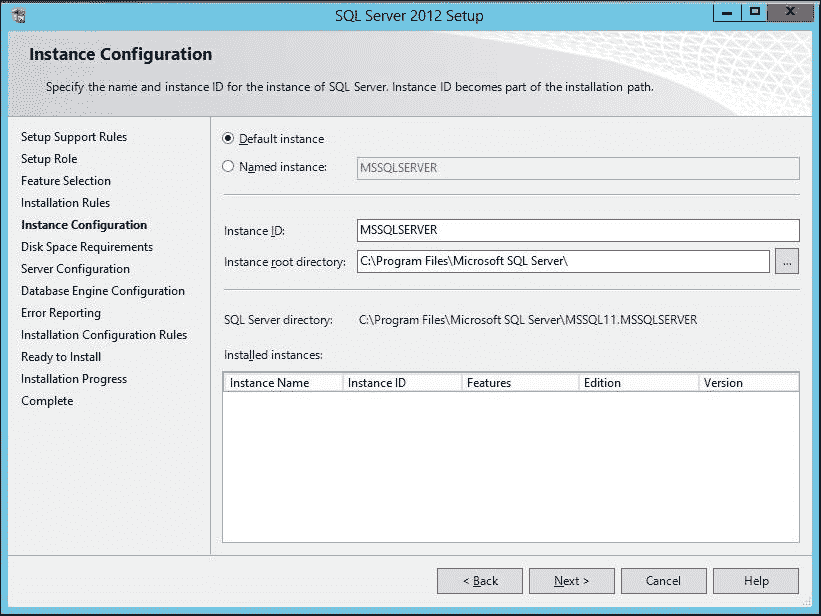
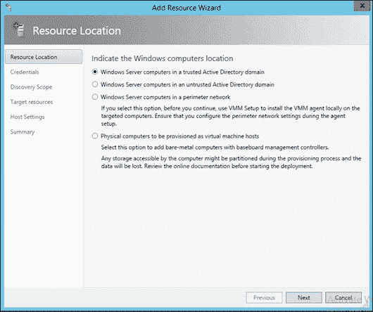
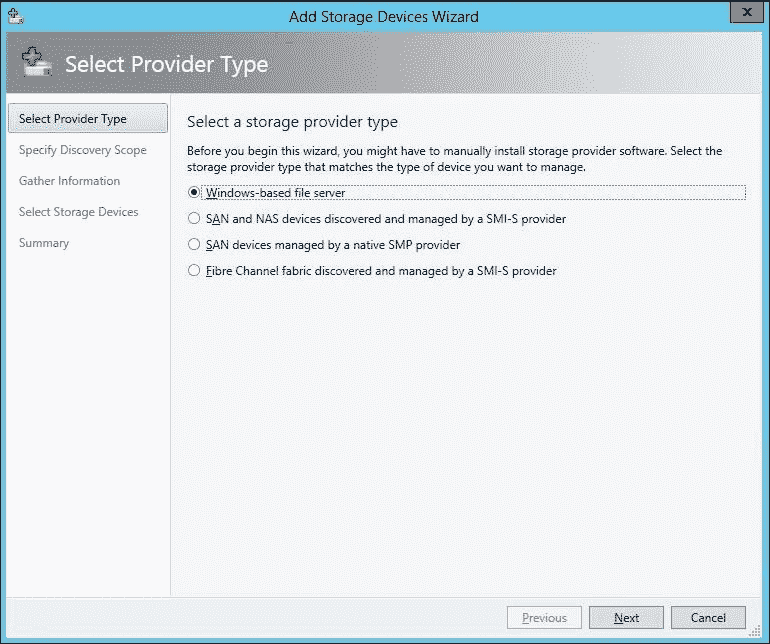

# 第二章：准备云架构

云架构是任何传统数据中心或云解决方案中最重要、最关键的部分之一。云架构本质上包括但不限于计算、网络、存储和虚拟化管理程序。设计良好并部署的云架构基础设施是确保云或传统数据中心平稳运行的关键。本章将涵盖为基于 Windows Azure Pack 的云解决方案规划和部署云架构的各个方面。这将帮助你理解 WAP 云解决方案的架构需求和部署实践。我们还将包括主要组件的安装和配置，如 SQL 数据库、SCVMM、SPF 等等。我们将讨论为组织的私有云以及服务提供商的云规划的指导原则。此架构基础设施将用于在我们的 WAP 云中提供 IaaS 服务。

本章将涵盖以下主题：

+   云架构基础设施规划

+   Hyper-V 部署最佳实践

+   设置虚拟机以用于云管理架构

+   规划和部署 SQL Server 以用于云管理数据库

+   安装和配置 **System Center 虚拟机管理器** (**SCVMM**)

+   使用 SCVMM 规划和配置云计算虚拟化管理程序层

+   使用 SCVMM 规划和配置云网络

+   使用 SCVMM 规划和配置云存储

+   规划和部署 System Center 服务提供商基础

# 云架构基础设施规划

规划云架构基础设施需要实践和业务与技术决策者的参与。云架构必须以确保以可靠和高效的方式为业务提供服务的方式进行规划。当前基础设施评估、预测和未来资源规划、云服务目录，以及战略愿景和财务因素是规划云基础设施时需要考虑的关键要素。让我们看看为提供 IaaS 服务规划基于 WAP 的云架构基础设施的基础和基本原则。

## 选择硬件

在为你的云基础设施选择硬件时，有一长串需要注意的事项。以下是其中一些需要注意的事项：

+   遵循微软认证的硬件和软件支持性与兼容性清单。这不是强制性要求，因为基于 WAP 的解决方案几乎可以安装在任何支持虚拟化的 x86 架构硬件上，然而，建议选择微软认证的硬件，以避免在生产阶段出现任何问题。使用不受支持的硬件时，获得技术支持有时可能会遇到挑战。

+   在选择通用硬件时，检查单个服务器组件（如网卡等）的兼容性和功能。

+   使用支持新功能（如 RDMA 和其他硬件卸载能力）的最新硬件，以充分发挥超管程序和云层的所有能力。

+   检查扩展性灵活性，足够数量的处理器、内存和 PCI 插槽有助于在需要时增加资源。

+   硬件故障是常见的，检查硬件供应商的支持和服务级别协议（SLA）是个好主意，特别是在硬件故障时需要更换部件等。

+   在比较多种硬件选项时，考虑数据中心的物理要求（空间、电力、冷却等）作为其中一个参数，物理要求通常会在现实世界中成为限制因素。

尽管前述所有观点都有效，但当今数据中心技术的趋势包括软件定义战略。通过使用最佳的软件与通用硬件来运行数据中心是可行的，尽管构建通用硬件需要精心规划，但在 WAP 云解决方案中使用通用硬件既是可行的也是合理的。

例如，使用不支持的磁盘驱动器会导致与 IOPS 相关的性能问题，网络接口卡（NIC）的速度和功能也存在类似情况。在设计通用硬件时，需遵循行业最佳实践指南，并确保兼容性与微软 Hyper-V 的功能支持。

选择专有硬件与通用硬件的组合也并不罕见；组织可以选择在专有硬件上运行关键工作负载，以确保性能和支持，而在较不关键或测试与开发工作负载上使用通用硬件。

启用通用硬件选项帮助中小型企业（SMBs）在有限预算内利用企业级虚拟化和云技术来满足 IT 需求。云服务提供商也是如此，预算有限的小型供应商也能利用通用硬件进入云服务市场。

### 提示

微软的支持性和兼容性列表可以通过[`www.windowsservercatalog.com/`](https://www.windowsservercatalog.com/)访问。

## 硬件规格

选择硬件后，接下来的工作是进行规格规划。私有云和服务提供商云的云架构规格规划是一门不同的学问，但其基础是数据中心基础设施的规格规划实践。预测未来的需求是规格规划中最重要的方面，云平台应能够应对未来*X*年的硬件需求，具体取决于业务策略。微软提供的 MAP 工具包（微软评估与规划）可以帮助组织和服务提供商评估当前基础设施并规划目标基础设施。

让我们来看看一些针对私有云和服务提供商云的主要硬件规格最佳实践和程序。

私有云硬件规格：

+   评估当前的工作负载需求，并根据 Hyper-V 服务器虚拟化尺寸规划指南进行硬件规划，涉及虚拟 CPU、内存等。

+   利用 MAP 工具包评估传统计算中当前运行的工作负载。

+   如果计划进行 P2V 或硬件刷新，请执行服务器整合规划。

+   列出预计的新增工作负载要求（如计划中的新应用等）

+   列出预计在接下来的*X*年内，计算、网络和存储方面的资源增长需求。

+   如果有需要，分析隔离的基础设施要求（一些应用可能因合规等原因需要在网络/服务器层面上进行隔离）

+   考虑**业务连续性和灾难恢复**（**BCDR**）规划因素。

+   汇总所有收集的细节，并根据 Hyper-V 虚拟化和 IT 基础设施规划指南对硬件进行尺寸规划。

+   根据要管理的工作负载，添加云管理基础设施的硬件要求。

为服务提供商云环境规划云硬件：

+   评估客户需求和服务提供商技术领域中的技术要求

+   定义技术产品和灵活性，包括基础设施和应用程序及其架构要求

+   根据服务提供商的战略设定业务目标，例如在接下来的*X*年内拥有*X*数量的资源/客户

+   汇总所有收集的细节和战略决策，并根据 Hyper-V 虚拟化和 IT 基础设施尺寸规划指南对硬件进行尺寸规划

+   根据计划管理的工作负载，添加云管理基础设施的硬件要求。

### 注意

为云或任何传统数据中心进行硬件尺寸规划是完全不同的详细研究和实践。上述指南旨在帮助读者理解云架构硬件规划的基础基础。有关生产环境尺寸规划的产品和实践特定技术及经济指南，请参阅相关资料。

## 选择 Hypervisor 的部署选项和版本

Microsoft 向 Windows Server 2012 添加了各种企业级虚拟化功能。通过 Windows Server 2012 / R2，Hyper-V 成为支持更大灵活性和可扩展性的企业级验证虚拟化平台。

Microsoft Windows Server 2012 R2 Hyper-V 提供了一个企业级虚拟化平台，适用于基于 WAP 的云解决方案。Hyper-V 可以通过三种方式部署：

+   带 GUI 的 Windows Server 2012 R2 服务器并启用 Hyper-V 角色

+   带 Hyper-V 角色的 Windows Server 2012 R2 服务器核心

+   Hyper-V Server 2012 R2（免费）

**带 GUI 的服务器**选项安装并配置所有用户界面选项，如服务器管理器、桌面体验等。它以传统方式安装 Windows Server，并提供所有功能和特性。

**Server Core**版本是完整安装版本的精简版，不会安装 GUI 组件。必须通过命令行、PowerShell 或远程服务器管理选项进行管理。部署 Server Core 版本的好处包括但不限于更少的资源消耗、更小的磁盘占用、更好的安全性（通过减少被移除组件的攻击面，相比 GUI 版本更为安全）等。

推荐在云基础设施中部署 Server Core 作为虚拟化平台的操作系统，因为这些服务器将仅用于运行虚拟机。这样可以在大型基础设施中充分利用 Server Core 部署的优势。

在 Windows Server 2012 及其 R2 版本中，部署后可以在完整版本和核心版之间切换。管理员可以选择初始安装带 GUI 的服务器，配置完成后再切换到核心版本，以便于部署。

### Windows Server 版本

Windows Server 有多个版本，如 Essentials、Foundation 等，但主要用于虚拟化需求的有以下两种版本：

+   Windows Server Standard 版

+   Windows Server Data Center 版

Windows Server 的 Standard 和 Data Center 版本是基于处理器授权的，每两个处理器需要一份许可证。两者提供相同的功能集，主要的区别在于虚拟化权限。Standard 版本允许运行两个 Windows Server 操作系统虚拟机，而 Data Center 版本则没有数量限制。以 Windows Server 2012 R2 Standard 版本为例，授权的虚拟化平台可以创建两个虚拟机，运行 Windows Server 2012/R2 Standard 来宾操作系统，无需购买额外的许可。对于运行 Windows Server 2008 R2 操作系统的虚拟机，许可降级权限适用。

### 为您的云选择合适的版本

选择合适的版本取决于云基础设施中操作系统的类型和数量。如果虚拟化工作负载主要包括 Windows 作为来宾操作系统，建议选择 Data Center 版本。如果虚拟机中的 Windows 操作系统数量不高，Standard 版本既实用又更具预算友好性。

作为最佳解决方案，在大型基础设施中，可以根据虚拟化工作负载的操作系统，灵活使用 Standard 和 Data Center 版本的组合。

对于组织而言，选择合适的版本取决于工作负载的性质，是 Windows 还是非 Windows 系统。服务器提供商可以使用 Data Center 和 Standard 版本的组合来满足客户对 Windows 和非 Windows 基础设施需求的请求。

### 提示

请参考[`www.microsoft.com/`](http://www.microsoft.com/)上的 Windows Server 2012 产品和版本对比指南，以获得各个 Windows 版本之间的详细比较。

### 免费的 Microsoft Hyper-V Server 2012 R2

Microsoft Hyper-V Server 2012 R2（也称为独立 Hyper-V）是 Microsoft 专有虚拟化技术的免费版本（是的，完全免费）。它是 Windows Server 操作系统的精简版，仅包含虚拟化技术、Windows Server 驱动程序及支持组件，如集群功能。免费 Hyper-V 版本不包括任何除了虚拟化技术以外的 Windows 功能，从而使得它的占用空间更小、管理负担更轻、攻击面更小。

免费的 Hyper-V Server 2012 R2 仅提供 Hyper-V 虚拟化功能，虚拟机的客户操作系统许可需要另行考虑。如果你在虚拟机中运行 Windows Server 操作系统，建议根据 Windows 虚拟机的数量使用标准版或数据中心版。此版本对于虚拟机内客户操作系统非 Windows 的情况非常有用。

免费 Hyper-V 服务器的一个主要应用场景是供组织或服务提供商用于托管非 Windows 工作负载。

### 注意

在通过定制产品或合作伙伴提供的解决方案扩展 WAP 云解决方案时，务必检查免费 Hyper-V 版本的支持性。

Microsoft Hyper-V 是基于 WAP 的云解决方案的最佳选择，尽管也可以与其他虚拟化技术供应商（如 VMware 和 Citrix）进行集成。查看特定产品指南，以选择版本和部署模型，并在选择 VMware 或 Citrix 时查看功能的支持矩阵。

## 选择系统中心的部署选项和版本

Microsoft System Center 2012 R2 是提供基于 WAP 的云服务的核心管理组件。系统中心产品可以通过多种方式进行部署，例如：

+   物理机或虚拟机

+   独立模式或高可用模式（取决于产品）

系统中心组件需要 Windows Server 作为操作系统来运行。它可以部署在虚拟机中，也可以部署在物理服务器上。由于我们将所有云管理和租户工作负载虚拟化，因此除非有特定需求或例外情况，否则没有必要将系统中心组件部署在物理服务器上。

对于组织和服务提供商，建议将系统中心组件部署在虚拟机中，以便利用虚拟化技术的高可用性和其他功能。

除了 Hyper-V 的高可用性，部署虚拟机内的客户操作系统或应用级高可用性还可以带来额外的好处，如应用级故障检测和负载均衡。

系统中心产品可以部署在操作系统/应用级集群或冗余模式下。

组织或服务提供商可以根据其可用性业务和技术要求选择独立模式或高可用模式的产品组合。

### 系统中心版本

系统中心以套件形式提供，包含两个版本。购买系统中心套件后，您可以根据许可使用所有组件（SCCM 除外）。

系统中心套件的两个版本如下：

+   系统中心标准版

+   系统中心数据中心版

许可仅在通过系统中心组件管理一定数量的端点时才需要。运行系统中心组件不需要许可。许可方式与 Windows Server 类似，是基于处理器的许可（每个许可包含两个产品）。标准版和数据中心版在功能上没有差别，差别在于你可以管理的虚拟实例数量。使用标准版时，系统中心可以管理两个**OSEs**（**操作系统环境**），而数据中心版则没有此限制。微软的许可政策可能会有所变化，具体取决于 EA/SA 等协议。因此，建议与微软联系，以规划许可和版本。

### 提示

请参考微软官方网站上的*如何购买 System Center 2012 R2*页面，了解更多关于许可和版本对比的信息。

为组织和服务提供商选择合适的 System Center 版本与选择 Windows Server 版本直接相关。选择 System Center 数据中心版来管理 Windows Server 数据中心版，反之亦然，这样可以实现一致的功能集和灵活性。

### 注意

所给出的许可详情是根据撰写本章时的最新信息；许可政策可能会发生变化，建议在规划许可和版本时咨询相关信息。

## 云管理基础设施和租户工作负载基础设施

云基础设施通常分为两个类别：云管理和租户工作负载。我们来看看这两者：

+   **云管理基础设施**：管理基础设施或管理集群用于托管云管理组件的虚拟机，如 Windows Azure Pack 服务器和系统中心组件。建议为云管理工作负载专门设置独立的虚拟化集群。管理集群的规模取决于提供的服务数量以及需要管理的租户工作负载的大小。

+   **租户工作负载基础设施**：租户工作负载基础设施用于托管客户的云资源，如虚拟机和数据库。租户工作负载基础设施的设计必须考虑到可用的云服务、服务质量（QoS）和服务等级协议（SLA）。

## 核心微软基础设施服务规划

微软基于 WAP 的云解决方案使用微软核心基础设施服务，如 Active Directory、DNS、DHCP 等，进行认证等基础操作。这些核心基础设施服务必须遵循产品特定的指南和行业最佳实践，以确保可用性和效率。接下来，我们来看看核心服务及其部署最佳实践：

+   **Active Directory**：微软的 AD 是大多数 MS 基础设施解决方案中最关键的组成部分，包括 WAP 云解决方案。AD 用于认证、授权及 WAP 云中的其他功能。AD 部署可以通过冗余（部署额外的域控制器）和安全最佳实践进行规划。应规划定期备份和灾难恢复，以确保 Active Directory 基础设施的安全。

+   **DNS**：通常与 AD 一同部署，DNS 为整个云提供名称解析。DNS 故障可能导致整个云系统故障，因此需要进行规划，确保每次都能保证可用性，并防止受到攻击。应规划定期备份和灾难恢复。

+   **NTP**：任何云计算或 IT 解决方案的另一个关键组成部分，NTP 确保所有云资源的时间同步。时间延迟可能导致整个云解决方案失败以及账单错误。NTP 设备必须具备高可用性和准确性。所有组件应配置为使用相同的 NTP 设备。加入域的 Windows 操作系统使用域控制器（PDC 角色）进行时间同步。

    ### 提示

    在虚拟化持有 NTP 角色的域控制器时，遵循微软的指南。详细信息请参见 [`technet.microsoft.com/en-us/library/virtual_active_directory_domain_controller_virtualization_hyperv%28v=ws.10%29.aspx`](https://technet.microsoft.com/en-us/library/virtual_active_directory_domain_controller_virtualization_hyperv%28v=ws.10%29.aspx)。

+   **DHCP**：动态主机配置协议（DHCP）可以用于动态分配和管理 IP 地址。DHCP 的部署应具备高可用性并高效地满足云的 IP 地址需求。

+   **其他基础设施支持服务（PXE 引导服务器、IPAM 等）**：根据部署和使用案例，其他微软服务如 PXE 引导和裸机供应或网络引导的部署服务器，WSUS 或 SCCM 用于补丁管理，IPAM 用于 IP 地址管理，跳板机用于集中访问，安全产品应根据需要以高效且高可用的方式进行部署。

### 提示

云网络和存储的规划与部署选项将在本章的后续主题中讨论。

# Hyper-V 部署最佳实践

虚拟化管理程序是基于 WAP 的云基础设施的核心基础，因为每个虚拟机，包括管理工作负载虚拟机，如 WAP 管理/租户门户虚拟机、SCVMM、SPF 都将在 Hyper-V 主机上的虚拟机内运行。让我们看看 Hyper-V 服务器的一些部署最佳实践。

建议在所有 Hyper-V 主机中保持配置上的一致性，应用相同的最佳实践。可以使用 SCVMM 和 AD 组策略来配置和管理所有主机的 Hyper-V 配置和策略。

集中管理是每个云解决方案的关键元素。

## Hyper-V 安装最佳实践

尽管 Windows Server 2012 R2 Hyper-V 的安装过程相当简单，但还是建议遵循 Hyper-V 安装的最佳实践，以确保虚拟化基础架构的顺利和稳定运行。

虚拟化管理程序安装的最佳实践如下：

+   **支持的硬件和最新硬件固件**：建议使用经过验证性能和稳定性的支持硬件。始终确保更新服务器硬件、机箱或刀片的固件（视情况而定）。

+   **使用硬件供应商提供的工具安装操作系统**：主要服务器硬件供应商提供其专有工具来安装操作系统，如 HP 智能配置工具。这样可以确保虚拟化管理程序以正确的硬件特定驱动程序和集成工具部署。

+   **选择正确的部署选项**：在云基础架构中，建议使用 Server Core 版本，以利用 Server Core 部署的优势，例如更小的磁盘占用和攻击面，从而减少管理和更新负担。如果部署带 GUI 的服务器，建议移除所有不必要的组件。

+   **最新设备驱动程序**：使用最新的设备驱动程序，无论是专有硬件还是商品硬件。

+   **Windows 更新**：确保使用最新的补丁和服务包来更新虚拟化管理程序。建议部署补丁管理解决方案，以确保持续部署最新的修补程序。

+   **页面文件**：Hyper-V 服务器会根据系统中安装的物理内存自动管理页面文件大小。应将其设置为**系统管理**。

+   **Windows 防火墙**：根据环境需求配置 Windows 防火墙规则。如果端口级访问由网络防火墙管理，组织可以选择禁用防火墙。

+   **虚拟化管理程序硬化和 VA**：根据组织定义的标准应用标准安全策略。根据组织的政策进行必要的漏洞评估和修复。

+   **命名约定和域**：确保遵循正确的主机名约定，并在适用时加入域。对于集群节点，必须将主机加入域。

## Hyper-V 网络最佳实践

Hyper-V 网络的最佳实践如下：

+   **为 Hyper-V 和虚拟机网络流量分配独立网络**：应考虑为管理流量（如主机管理和实时迁移）分配一个独立的物理和逻辑网络，并为虚拟机流量根据虚拟机网络区（如内部、DMZ 等）分配另一个独立的网络。

+   **在物理网络路径中配置冗余**：为每个网络团队配置至少两个网卡适配器，分别连接到两个不同的网络交换机。确保避免单点故障。

+   **配置网卡聚合和负载均衡策略**：Windows Server 2012 / R2 提供了多种负载均衡策略（Hyper-V 端口、地址哈希、动态负载均衡等），能够为 Hyper-V 网络提供最大性能和可靠性。确保配置合适的网卡聚合负载均衡策略。

+   **为 IP 存储流量分配独立网络**：建议为基于 IP 的存储流量（如 iSCSI、SMB 等）使用独立的物理和逻辑网络。

+   **实施网络 QoS**：使用 Hyper-V 网络 **服务质量（Quality of Service，QoS）** 功能，确保单个虚拟机不会成为其他虚拟机网络带宽的瓶颈。在基于 WAP 的云解决方案中，实施 QoS 变得至关重要，确保根据租户的计划和订阅为其虚拟机提供请求的网络带宽。

+   **监控网络使用情况**：持续监控 Hyper-V 网络虚拟化，以便获取网络使用情况的洞察并规划未来的可扩展性。

+   **使用 SDN（软件定义网络）**：这不是 Hyper-V 网络的最佳实践，但通过使用 SDN（即网络虚拟化）来查看云解决方案，可以实现云网络的自动化配置、管理和灵活性。

## Hyper-V 存储部署最佳实践

Hyper-V 存储部署的最佳实践如下：

+   **确保存储路径冗余**：为存储路径使用多路径 I/O。消除服务器端口、存储端口或 SAN 交换机等处的任何单点故障。根据 SAN 提供商的指导方针配置多路径策略，以提高可靠性和效率。

+   **使用 vhdx**：Windows Server 2012 引入了新的虚拟磁盘文件格式 vhdx。与旧版 vhd 格式相比，vhdx 在性能和可靠性方面具有多项优势。除非特殊需要，否则应使用 vhdx 而非 vhd。

+   **正确设置磁盘和 CSV 大小**：在容量和 IOPS（每秒输入输出操作次数）方面，虚拟机的磁盘大小设置非常重要。过大的磁盘可能会导致性能问题和停机故障。

+   **实施存储 QoS**：使用 Hyper-V 存储服务质量功能，确保单个虚拟机不会成为其他虚拟机在 IOPS 方面的存储性能瓶颈。对于基于 WAP 的云解决方案，必须确保根据租户的计划和订阅为其虚拟机提供请求的存储 IOPS。

+   **监控存储使用情况**：持续监控 Hyper-V 存储的容量和性能，以便获得网络使用情况的洞察并为未来的可扩展性做好规划。

+   **使用 SDS/SMI-S/SMP 集成**：这不是 Hyper-V 存储最佳实践，但从云的角度来看，建议使用 SDS（软件定义存储）、SMI-S 提供商阵列集成，以便更好地进行云存储的配置、管理和自动化。

## Hyper-V 虚拟机部署最佳实践

Hyper-V 虚拟机部署的最佳实践如下：

+   **正确规划虚拟机计算资源**：更多的虚拟 CPU 并不保证更高的性能，应该根据实际的应用需求为虚拟机分配 CPU。内存也是如此，确保虚拟机不会超配或配备不足。

+   **使用第二代虚拟机**：第二代虚拟机提供了比第一代虚拟机更多的功能，如 UEFI 启动、合成硬件、更快的安装和启动时间等。除非特别要求，建议使用第二代虚拟机。

+   **使用动态内存**：建议使用动态内存，以充分利用服务器中可用的物理内存。在大规模云环境中使用动态内存有助于提高主机密度。建议在使用动态内存时进行仔细规划，以避免对虚拟机或主机的性能产生负面影响。

+   **如果支持，使用非统一内存访问（NUMA）**：NUMA 帮助分配多个虚拟 CPU 的虚拟机通过使用执行指令的 CPU 的本地缓存和内存总线，来扩展性能并提高性能。NUMA 取决于硬件架构。

+   **移除未使用的虚拟硬件**：建议移除未使用的虚拟硬件，例如软盘驱动器等。

+   **使用适当的集成服务**：集成服务安装在客户操作系统中，使其具备虚拟化意识，并可启用例如从 Hyper-V 管理器进行平滑关机、时间同步、数据交换等功能。所有最新的 Windows 操作系统默认包括集成服务，对于非 Windows 操作系统，可能需要手动安装集成服务。

+   **监控虚拟机使用情况**：持续监控虚拟机的计算资源使用情况，并对过度配置或配置不足的虚拟机采取必要的纠正措施。

## Hyper-V 集群与迁移部署最佳实践

Hyper-V 集群和迁移部署的最佳实践如下：

+   **集群验证报告**：Microsoft Windows 的故障转移集群提供功能，用于在部署集群之前检查节点的 Hyper-V 配置、清单、网络、存储和系统配置。验证检查产生的任何错误或警告应通过必要的纠正措施进行修复。成功验证的集群是实现顺利 Hyper-V 高可用功能的关键。

+   **使用 SCVMM 部署和管理高可用虚拟机**：这与 Hyper-V 集群最佳实践没有直接关系，但对于云解决方案，建议通过 SCVMM 部署和管理 Hyper-V 集群及迁移。

+   **使用独立网络进行实时迁移**：建议为实时迁移流量使用独立的物理和逻辑网络，以确保可靠性和性能。

+   **集群感知更新**：建议使用 CAU 进行集群节点的修补和升级。这样，组织和服务提供商可以确保在修补 Hyper-V 管理程序时不会影响终端客户的服务。WSUS 可以与 VMM 集成，自动更新 Hyper-V 主机。

# 设置用于云管理架构的虚拟机

经过充分规划和最佳实践后，是时候开始动手了。让我们设置虚拟机来托管我们的云基础架构。这些虚拟机将托管云管理架构，并部署在云管理集群中。

在 Active Directory 中创建用户，以将这些服务器加入 Active Directory 域。

### 注意

为下述每种类型的虚拟机添加一个冗余虚拟机，WAP 服务器除外（参见第一章，*了解 Windows Azure Pack 及其架构*，了解 WAP 高可用性），以提供高可用性架构。请参阅产品特定指南，配置各组件的高可用性。

| 序号 | 虚拟机名称 | 计算配置 | 虚拟机用途 |
| --- | --- | --- | --- |
| 1 | WAPMGT-SQLDB-01 | 4 CPU，12 GB RAM | 托管整个 WAP 解决方案数据库的 SQL 数据库 |
| 2 | WAPMGTSCVMM-01* | 4 CPU，12 GB RAM | System Center 虚拟机管理器 |
| 3 | WAPMGT-SCSPF-01 | 2 CPU，8GB RAM | 服务提供商基础架构 |
| 4 | WAPMGT-SCSMA-01 | 2 CPU，8 GB RAM | 服务管理自动化 |
| 5 | WAPMGT-ACRDG-01 | 2 CPU，8 GB RAM | 提供 Azure 控制台连接的远程桌面网关服务器 |
| 6 | WAPMGT-WAPSR-01 | 2 CPU，8 GB RAM | Windows Azure Pack（Express 安装模型） |

### 注意

本书中使用的虚拟机配置仅供评估使用，请遵循第一章，*了解 Windows Azure Pack 及其架构*以及本章内容，并结合产品特定文档进行生产部署。

上述所有虚拟机应配置以下通用设置：

+   127 GB 磁盘（动态扩展磁盘）

+   Windows Server 2012 R2 DC/STD 版操作系统

+   连接到 Hyper-V 虚拟交换机（外部）的单 NIC 卡

+   不使用动态内存

+   启用所有集成功能

+   在 Hyper-V 集群中高度可用（推荐，非强制）

虚拟机部署后的步骤如下：

+   活动 Windows 操作系统

+   分配静态 IPv4 地址

+   按命名规范分配主机名

+   将服务器加入域

+   关闭 Windows 防火墙或根据需要创建防火墙规则

# 为云管理数据库规划和部署 SQL Server

Windows Azure Pack 和系统中心的所有组件都使用 SQL Server 数据库来存储其配置、运行时数据、历史使用数据等。数据库的故障与相应组件的故障直接相关。

## 选择数据库服务器版本和部署模型

在最小部署的情况下，以下组件将使用该 SQL Server 来管理数据库：

+   Windows Azure Pack 组件

+   SCVMM

+   SPF

+   SMA

在选择数据库版本和部署模型时，必须根据先前提到的各个组件的支持性和兼容性进行对齐。

Windows Azure Pack 支持以下 MS SQL Server 版本来管理数据库：

+   MS SQL Server 2008 Service Pack 3

+   MS SQL Server 2008 R2 Service Pack 2

+   MS SQL Server 2012 Service Pack 1

+   MS SQL Server 2012 Service Pack 2

+   MS SQL Server 2014

System Center 2012 R2 对不同组件支持不同的 SQL Server 版本。以常见和最新版本为例，Windows Azure Pack 和所有 System Center 产品支持 MS SQL 2012 SP1，WAP 组件和所有 System Center 2012 R2 组件（除了应用控制器）支持 MS SQL 2012 SP2 和 MS SQL 2014。组织或云服务提供商可以根据已安装的组件选择 SQL 2012 SP1、SQL 2012 SP2 或 SQL 2014。

### 提示

可以在 [`technet.microsoft.com/en-us/library/dn281933.aspx`](https://technet.microsoft.com/en-us/library/dn281933.aspx) 查看 System Center 2012 R2 的 SQL 支持矩阵。

SQL Server 中的部署模型可以根据位置、故障转移等多种方式进行部署。WAP 管理数据库部署支持以下方式：

+   独立 SQL Server 部署

+   SQL Server 故障转移集群

+   SQL Server AlwaysOn 可用性组

为云管理数据库选择正确的部署模型取决于部署策略。独立部署工作正常，但会成为单点故障。管理数据库的故障会导致所有云管理组件功能的故障。

SQL 集群（主动/被动）和 SQL AlwaysOn 可用性组可用于为管理数据库增加冗余，消除单点故障。

虽然这两种选项都为 SQL Server 提供冗余，但 AlwaysOn 通过支持没有共享存储的集群并在数据库级别提供保护，比 SQL 集群在实例级别提供更大的灵活性和可靠性。

更多关于 SQL 集群与 SQL 的对比可以参见 [`msdn.microsoft.com/en-us/library/ff929171.aspx`](https://msdn.microsoft.com/en-us/library/ff929171.aspx)。

### 提示

SQL 集群功能在 MS SQL 标准版中可用，而 AlwaysOn 需要企业版许可证。

在为管理数据库安装 SQL 时，必须安装以下功能。默认排序规则在部署英文版时有效。对于其他语言，请参见产品特定指南：

+   常见功能：

    +   数据库引擎

    +   管理工具

+   产品特定功能：

    +   完整文本搜索（用于 SC 操作管理器和服务管理器）

    +   报告服务（用于 SC 操作管理器和服务管理器）

    +   分析服务（用于 SC 服务管理器）

部署 SQL Server 时需要考虑的额外事项包括：

+   在大型生产环境中部署额外的 SQL Server/实例，以避免性能问题。

+   报告服务实例不能在各组件之间共享。

+   配置预先设置的大小并自动增长，同时监控以实现高效和不中断的管理数据库。

+   在安装 Windows Azure Pack 组件之前，必须在 SQL Server 上启用 SQL 身份验证。如果计划配置 Windows 身份验证，则当前用户必须被添加为 SQL Server 的管理员。

+   对于 System Center 服务管理器数据库，SQL AlwaysOn 可用性组功能不支持命名实例，仅支持默认服务器实例。

### 注意

SQL Express 版本可以在 Express 部署中用于 WAP。对于 WAP 分布式部署和系统中心组件，标准版是最低支持版本。根据上述功能和高可用性模型选择 SQL 版本。

## 安装并配置 SQL Server 2012 SP2

本书中为了评估的目的，我们将使用 SQL Server 2012 SP2 独立安装作为数据库服务器。此数据库服务器将供所有 WAP 和系统中心组件使用。

+   安装前提条件：

    +   在部署 SQL Server 之前，必须满足一套硬件和软件的先决条件。

+   软件要求：

    在安装 SQL Server 之前，请在 SQL Server 虚拟机上安装以下组件：

    +   .NET 3.5 SP1 框架

    +   Windows PowerShell（默认安装）

    +   网络协议和库（如共享内存、命名管道、TCP IP——默认可用）

+   Active Directory 账户要求：

    +   在 AD 中创建 SQL Server 管理和服务登录账户

        | 账户名称 | 目的 | 权限 |
        | --- | --- | --- |
        | Sqldbadmin | SQL 数据库管理员用户 | SVMM 上的本地管理员组成员 + 数据库管理员 |
        | Sqldb-svc | SQL Server 服务账户 | SVMM 上的本地管理员组成员 + 数据库管理员 |

    +   将创建的用户账户添加到 SQL Server Windows 操作系统上的本地管理员组。

### 安装步骤

以下是需要遵循的安装程序：

1.  下载 MS SQL Server 2012 SP1 安装介质并在 SQL 虚拟机上挂载。

1.  从安装介质执行设置文件并选择**独立安装**。

1.  SQL 设置将开始对安装 SQL Server 设置支持文件进行有效性验证检查。所有测试必须报告绿色，才能继续进行下一步。

1.  输入产品密钥（嵌入在许可媒体中）或根据需要选择评估模式安装选项。

1.  接受许可条款，并继续安装设置文件。

1.  验证设置支持规则的结果。所有结果必须成功通过才能继续进行下一步。

1.  在 **安装角色** 页面上选择 **SQL Server 功能安装**。

1.  在 **功能** 页面上选择 **数据库引擎服务**、**客户端工具连接性** 和 **管理工具 - 基础**（根据上一个主题中讨论的产品特定要求选择功能）。

1.  验证安装规则的状态，所有规则必须成功通过才能继续进行下一步。

1.  将实例名称更改为您选择的名称。为了评估目的，我们使用的是**默认实例**。

1.  验证磁盘空间要求和可用空间，确保可以继续进行下一步。

1.  将 SQL Server 代理和数据库引擎的默认服务帐户更改为之前创建的 Active Directory 帐户。

1.  在 **数据库引擎配置** 页面上选择 **混合模式** 身份验证。提供 "`sa`" 作为密码，并将当前登录用户（SQLDBADMIN）添加到 SQL 管理员中。如果适用，修改数据目录位置到不同的驱动器。

1.  如果希望参与错误报告以向 Microsoft 提交错误，可以选择错误报告选项。

1.  验证安装配置规则状态。每个规则必须成功通过才能继续进行下一步。

1.  验证所选安装选项的摘要。

1.  SQL 设置将根据提供的输入开始安装 SQL DB Server。

1.  安装成功完成后，关闭向导，并查看安装日志以检查是否有任何错误。

## 安装后的任务

成功安装 SQL Server 2012 SP1 后配置以下任务：

1.  使用 SQL Management Studio 登录 SQL Server 并验证安装是否成功。还要验证系统数据库（如 `master`、`tempdb`）是否已创建。

1.  为 SCVMM、SPF 和 WAP 管理员 Active Directory 用户创建登录名。权限可以稍后定义。通过 **安全性** | **登录名** 菜单浏览，并右键单击 **登录名** 来创建 SQL 用户。

1.  使用 SQL Server 配置管理器配置 SQL Server 网络端口以供远程访问。默认情况下，端口为 **1433**。

# 规划和部署 SCVMM 2012 R2

系统中心虚拟机管理器是该解决方案的核心，负责为基于 Windows Azure Pack 的云解决方案提供 IaaS 服务。SCVMM 负责为虚拟机、虚拟网络等 IaaS 资源的生命周期管理提供配置和管理。

SCVMM 不仅管理虚拟化主机和虚拟机资源，还负责为云虚拟机提供和管理网络和存储资源。SCVMM 提供了与第三方网络和存储提供商集成的灵活性，用于自动化资源的提供和管理。简而言之，SCVMM 是 WAP 云解决方案中 IaaS 服务的核心资源提供者。

SCVMM 是系统中心套件的一部分。WAP 通过**SPF**（**服务提供商基础架构**）与 SCVMM 进行 IaaS 服务通信。在本节中，我们将介绍 VMM 架构和部署模型，并提供安装指南。

## VMM 架构和部署模型

VMM 服务器由多个组件构成，这些组件可以一起部署在单个服务器上，或在不同服务器上以分布式方式部署，以实现扩展性和可用性。VMM 需要一个 SQL Server 数据库来存储所有配置和运行时数据。整体 VMM 工作解决方案的组件如下：

+   **VMM 管理服务器**：此服务器负责执行 SCVMM 参与的所有任务。它安装 System Center 虚拟机管理服务，与所有其他系统中心 VMM 及非系统中心组件进行通信，完成虚拟化基础设施的提供与控制。通过在 Microsoft 故障转移集群上以 HA 模式部署，可以防止单点故障。

+   **VMM 管理控制台**：管理控制台供管理员连接到 VMM 管理服务并执行管理任务。默认情况下，它安装在 VMM 管理服务器上，您也可以将其安装在您的管理终端上，用于 SCVMM 管理。

+   **VMM 数据库**：VMM 数据库是由 Microsoft SQL Server 提供的数据库，用于存储 VMM 配置（如主机、网络、虚拟机等）及运行时数据。VMM 高度依赖此数据库进行操作，因此强烈建议在生产环境部署中使用 SQL HA 技术保护该数据库。

+   **VMM 库和库服务器**：VMM 库存储所有用于部署虚拟机或服务的资源。VMM 库通常包括 VHD、模板、ISO 文件、网络和存储配置文件等。VMM 库存储在由库服务器托管的文件共享中。

+   **VMM 代理**：VMM 代理不是一个服务器组件，它用于促进虚拟化主机和 VMM 之间的通信。VMM 代理在将主机添加到 VMM 时安装在虚拟化主机上。若存在孤立环境限制，也可以手动安装该代理。

除了 VMM 数据库（由 SQL 提供）外，SCVMM 2012 R2 安装介质中提供了所有其他组件。

### VMM 部署模型

SCVMM 采用分布式架构，使其能够提供多种灵活的部署选项。组织可以选择增加如管理服务器或库服务器等组件，以满足扩展需求。主要来说，SCVMM 可以通过三种方式进行部署：

+   **独立部署**：在独立部署中，VMM 的所有服务器组件（VMM 管理服务器、VMM 控制台、VMM 库服务器和 VMM SQL 数据库）都安装在一台服务器上。此部署模型便于最小化部署占用，适用于测试和非生产架构。它不提供任何组件的冗余。

+   **分布式部署**：在分布式部署中，组织可以选择在三台或更多不同的服务器上安装管理服务器、库服务器和数据库服务器，以实现可用性和可扩展性。VMM 数据库可以通过 SQL 高可用性技术进行保护。

+   **SCVMM 高可用模式**：SCVMM 支持使用 Windows 故障转移集群以集群模式进行部署。虚拟机管理服务器可以通过 HA 部署模式进行保护，并使用 SQL HA 技术保护数据库。这种模式建议用于生产环境部署，以消除任何单点故障。

## 安装 System Center 虚拟机管理器 2012 R2

本书中的评估目的，我们将在单一机器上部署 VMM 管理服务器、VMM 控制台和 VMM 库服务器，并进行共享。云管理 SQL 数据库服务器将用于托管 VMM 数据库。

### 安装前提条件

SCVMM 的工作需要多个具有特定权限的 Active Directory 账户。让我们看看 SCVMM 使用时推荐的账户和权限。

SCVMM 的 AD 用户账户和组：

| 账户名称 | 目的 | 权限 |
| --- | --- | --- |
| Scvmmadmin | SCVMM 管理用户，用于管理任务 | 是 SVMM 本地管理员组成员 + DB 管理员 |
| Scvmmsvc | SCVMM 服务的服务账户 | 是 SVMM 本地管理员组成员 + DB 管理员 |
| Scvmm-runasadmin | SCVMM 操作的运行账户 | 具有 SCVMM 及其他管理资源（如 Hyper-V 主机）的管理员权限。 |
| Scvmm-admins | 管理员的安全组 | SCVMM 上的管理员权限 |

将 SCVMM 管理员和服务账户添加为“scvmm-admin”安全组的一部分

### 软件前提条件

VMM 负责安装大部分软件前提条件，除了 Windows 访问和开发工具包（Windows ADK）以及 SQL 数据库相关工具。安装以下组件作为部署 System Center 虚拟机管理器 2012 R2 的前提条件：

+   来自 Windows 评估和开发工具包的功能：

    +   部署工具

    +   Windows 预安装环境（Windows PE）

+   SQL Server 连接工具：

    +   SQL Server 2012 命令行工具

    +   Microsoft SQL Server 本地客户端

除了安装，VMM 还有以下软件组件要求，安装程序会在安装过程中自动处理：

+   Windows 远程管理（WinRM 2.0）服务

+   Microsoft .NET 框架 4 或 4.5

+   Windows PowerShell 2.0

### 注意

Windows ADK 可从[`www.microsoft.com/en-in/download/details.aspx?id=39982`](https://www.microsoft.com/en-in/download/details.aspx?id=39982)下载，SQL 连接工具可从[`www.microsoft.com/en-in/download/details.aspx?id=29065`](http://www.microsoft.com/en-in/download/details.aspx?id=29065)下载。这些工具也可以在 SQL Server 2012 安装介质中找到。

### 安装过程

出于评估目的，我们将在单台机器上部署 VMM 管理服务器、VMM 控制台和库服务器。

1.  下载 MS System Center 2012 R2 Virtual Machine Management 安装介质并挂载到 SCVMM 虚拟机上。

1.  从安装介质中执行安装文件，并点击**安装**。

1.  选择**VMM 管理服务器**功能进行安装，它将自动选择**VMM 控制台**。

1.  输入名称和组织详细信息以及 Microsoft 提供的产品密钥，以便为您的系统中心许可证注册。如果未指定产品密钥，则 VMM 将以评估模式安装。您还可以选择在后续阶段提供产品密钥，安装完成后也可以提供。

1.  接受评估/产品许可条款并继续下一步。

1.  选择**是**或**否**参与**客户体验改进计划**。

1.  启用或禁用 Microsoft 更新，启用时可以使用自动更新更新 VMM。

1.  指定 SCVMM 的安装位置，默认路径为 `C:\Program Files\Microsoft System Center 2012 R2\Virtual Machine Manager`。

1.  点击**下一步**将开始前置条件检查，如果前一部分中定义的任何前置条件没有完成，将返回错误或警告。完成任何待完成的前置条件并继续下一步。

1.  在此页面上提供数据库配置。您可以选择使用在 SQL 实例中为 VMM 创建的现有数据库，或选择创建一个新数据库。如果在 SQL 后安装任务中更改了 SQL 端口，请进行更改。

1.  验证数据库配置并继续下一步。

1.  配置 SCVMM 服务登录的服务帐户。对于高可用性（HA）模式下的 SCVMM，这必须是一个域帐户。如果在 HA 模式下部署，还需提供在 AD 中存储分布式加密密钥的位置。有关 HA 模式部署的更多信息，请参阅下一部分。

1.  如果需要，定制 SCVMM 通信的网络端口。

1.  在库磁盘上创建一个库共享，并提供名称和位置。这将作为 SCVMM 库，用于存储 VHD、模板等资源。默认情况下，VMM 安装程序将 `C:\Program Data\Virtual Machine Manager Library Files` 作为库共享位置。

1.  审查安装配置摘要并开始安装。

1.  安装成功后关闭向导。

### 提示

VMM 安装日志位于 `%SystemDrive%\ProgramData\ VMMLogs\`

安装失败的已知问题是——SCVMM 服务器的计算机名称中包含 SCVMM。您可以尝试通过从主机名中删除 "`-`" 或将其更改为 `scvmm` 或其他字符来重命名服务器。

### 安装后的任务

以下是安装后的任务：

1.  通过使用 VMM 控制台登录到 VMM 服务器来验证 VMM 是否成功安装。

1.  将 SCVMM-admins 组添加到 VMM 控制台设置中的 SCVMM 管理员。

1.  为虚拟化管理程序和更多相关操作创建 RunAs 帐户。

1.  更新 SCVMM 至最新的更新和补丁。

## 高可用 SCVMM 架构和部署

如 *VMM* *架构和部署模型* 部分所述，SCVMM 可以使用 Windows Server 故障转移集群以高可用模式部署。通过将 SCVMM 部署在 Microsoft Windows 故障转移集群服务之上，它可以防范硬件和软件层级的故障。

在集群中部署 SCVMM 管理服务器有一些前提条件，需要满足：

+   **VMM 服务帐户**：SCVMM 服务器上的虚拟机管理服务必须配置为使用域帐户运行。不能使用本地系统帐户在 HA 模式下运行 VMM 服务。此服务帐户必须是 SCVMM 服务器 Windows 上本地管理员组的成员。

+   **Active Directory 中的分布式密钥管理容器**：VMM 将所有配置和用户帐户详细信息（如 RunAs 帐户凭证）存储在 SQL 数据库中。凭证安全在每种情况下都至关重要，SCVMM 通过将这些凭证以加密形式存储来确保安全性。

有两种方法可以加密这些凭证：

+   **DPAPI**：DPAPI 使用计算机硬件 ID（SCVMM 安装所在的计算机）来加密凭证。

+   **DKM**：在 DKM SCVMM 的情况下，它将加密密钥存储在 Active Directory 中的一个容器中。这些加密密钥与任何 SCVMM 服务器的物理参数无关。

在集群部署中，SCVMM 虚拟机管理服务将在多个节点上运行，这使得 DPAPI 加密技术无法使用。在集群部署中，必须使用 DKM。

作为在集群中部署 SCVMM 的前提条件，必须在安装 SCVMM 之前在 Active Directory 中创建一个容器。该容器将用于存储各种 SCVMM 凭证的加密密钥。

部署高可用 VMM 管理服务器的步骤如下：

1.  完成 VMM 服务帐户和 AD 容器的前提条件。

1.  将 VMM 服务器加入 Windows Server 故障转移集群。

1.  执行 SCVMM 安装设置；设置将自动检测到安装正在集群节点上运行，并提供将 VMM 部署为高可用模式的选项。

1.  按照上一节中给出的 SCVMM 安装指南进行操作。

1.  在提示时提供集群名称和 DKM 容器位置。

1.  通过执行设置来添加其他 SCVMM 节点，设置将自动检测已部署的集群和 SCVMM 配置。

1.  部署成功后，可以使用故障转移集群管理器查看集群状态并根据需要切换服务。

# 使用 SCVMM 规划和配置虚拟化计算层

在本节中，我们将学习如何规划和配置虚拟化资源，例如 Hyper-V 主机和集群、VMware 和 Citrix 虚拟化管理程序。在基于 WAP 的云解决方案中，虚拟化管理程序层必须由 SCVMM 控制，以提供 IaaS 服务和生命周期管理。

在本节中，我们将介绍在 SCVMM 中添加和管理虚拟化管理层的不同方法。

## 规划和创建 SCVMM 主机组

在包含数百台 Hyper-V 主机和成千上万台虚拟机（或更多）的规模化云部署中，有效管理主机资源的分配和控制变得具有挑战性。可以使用 SCVMM 主机组来避免这些挑战，它提供了将多个虚拟化主机分组并作为单个实体进行资源分配和管理的灵活性。

主机组规划对于组织和服务提供商有不同的基础和策略。以下是一些常见选项：

+   站点或地理位置

+   性能和能力，如容错等

+   Web 区域环境的隔离，如 DMZ

+   服务提供商云中的大型租户专用主机组

+   带或不带 BC 和 DR 的主机组

+   云管理基础设施和租户工作负载基础设施

+   更多选项

我们可以在主机组中添加 Hyper-V 主机或集群以及 VMware/Citrix 主机，并在主机组层级定义各种设置，如：

+   一般设置。

+   部署规则。

+   主机预留设置（CPU、内存、网络和存储带宽等）

+   动态优化。

+   电源优化。

+   网络和存储资源以及配额。

+   PRO 配置。

+   自定义属性。

主机组可以嵌套到服务提供商的更高层级管理结构中。默认情况下，子主机组继承父主机组的设置和策略，但可以在子主机组层级覆盖这些设置。虚拟化管理程序主机可以从一个主机组移动到另一个主机组。

你可以创建由多个主机组组成的 SCVMM 云。SCVMM 云将在第四章，*构建虚拟机云和 IaaS 服务*中详细讨论。

## 创建主机组

以下是创建主机组的步骤：

1.  使用 VMM 控制台登录到 SCVMM 服务器，并打开 Fabric 工作区。

1.  在 **Fabric** 菜单中展开 **Servers**，右键点击 **All Hosts**。

1.  点击**创建主机组**并提供主机组友好名称。

1.  配置主机组属性。

## 在主机组中添加虚拟机主机

创建主机组后，我们可以将虚拟机主机添加到各自的组中，以应用主机组级别的策略。我们可以选择添加已配置的虚拟化程序或集群，或者使用 SCVMM 执行裸机配置。我们还可以使用 SCVMM 创建一个由已配置的独立 Hyper-V 主机构成的 Hyper-V 集群。

### 将 Hyper-V 主机添加到主机组

以下是将 Hyper-V 主机添加到主机组的步骤：

1.  使用 VMM 控制台登录到 SCVMM 服务器并打开 Fabric 工作区

1.  右键点击已创建的主机组并选择**添加 Hyper-V 主机和集群**。

1.  在给定选项中提供 Windows Server 的位置信息

1.  使用 RunAs 账户或手动凭据提供访问主机的凭证

1.  根据之前提供的服务器位置填写发现范围的详细信息

1.  选择目标主机组和主机设置

1.  审核配置摘要并完成向导以添加主机。

# 使用 SCVMM 规划和配置云网络 Fabric

云网络是任何私有云或服务提供商云中最关键且最复杂的部分。云网络必须足够高效和灵活，以处理租户和企业每日变化的网络需求。软件定义网络是为租户提供自动化和灵活网络的关键支柱，同时确保完全隔离和可扩展性。在本节中，我们将学习在 WAP 云中针对私有云和服务提供商云的各种云网络解决方案组件。

在讨论租户工作负载网络需求之前，必须注意，云管理基础设施与租户工作负载基础设施的网络应当分开。用网络术语来说，这分别被称为控制平面和数据平面。云管理基础设施的网络在配置和管理上应当保持独立。为了澄清这一建议，假设在某种情况下，云网络因物理网络问题而中断，而由于网络控制器虚拟机也运行在同一有问题的网络上，您无法对云网络解决方案进行任何更改以使其恢复运行。在设计云网络控制平面和数据平面时，请遵循相同的云管理和租户工作负载基础设施建议。

私有云和服务提供商云的网络需求不同，下面我们将看看这两者在 WAP 云中的主要云网络需求及其解决方案：

+   私有云的云网络需求：

    +   安全可靠的虚拟网络，易于管理

    +   **T&D 环境**的隔离网络能力

    +   根据网络流量，使用防火墙将不同区域隔开

    +   更快速且自动化的网络配置

    +   IP 地址的自动分配与管理

    +   支持自定义需求的可扩展性

    +   服务质量控制

    +   负载均衡和物理网络集成能力

    +   硬件独立配置

+   服务提供商云的云网络需求：

    +   在使用相同物理网络的情况下，实现不同租户网络之间的完全隔离

    +   支持与租户本地部署的混合网络模型的可扩展性

    +   自动化供应和租户控制的管理

    +   在公共服务中，提供具有有限资源（如网关等）的高级地址转换能力

    +   无 IP 范围使用限制

    +   易于管理并且能够动态变化

    +   根据租户的计划和订阅提供服务质量

    +   所有企业级网络功能，如负载均衡和与物理网络集成或硬件独立的配置

WAP 与系统中心和 Hyper-V 一起，为私有云和服务提供商云的需求提供真正的云网络功能。SCVMM 的网络功能，如逻辑网络和交换机、网络负载均衡集成、网络虚拟化（这是一个重要的技术）、网络虚拟化网关、端口配置文件，以及 Windows Azure Pack 提供的自动化和自助服务体验，为组织和服务提供商的所有这些需求提供了解决方案。

## 网络虚拟化

网络虚拟化允许我们在相同的物理硬件上创建多个独立的网络，这些网络在相同的物理 NIC 卡和网络交换机/路由器上进行传输和路由，彼此之间完全隔离。网络虚拟化是当今最现代化的网络技术之一——软件定义网络（SDN）的基础。网络虚拟化使得传统的物理网络设备，如路由器、防火墙和负载均衡器，能够转变为软件。软件定义网络使得从第 2 层到第 7 层的所有网络功能能够实现隔离和多租户支持。网络虚拟化是云服务提供商必须拥有的技术，能够为租户提供灵活的隔离网络，而不依赖彼此。

使用 **通用路由封装**（**NVGRE**）机制的 Hyper-V 网络虚拟化，用于促进虚拟机的虚拟网络。Windows Azure Pack 与 SCVMM 和 Hyper-V 一起，为私有和服务提供商云解决方案提供真正的自助服务自动化虚拟网络。Hyper-V 和 VMM 提供网络虚拟化网关，使虚拟化的网络流量能够与物理网络和外部世界进行通信。

每个连接到虚拟化网络的 VM 都有两个关联的 IP 地址，一个来自虚拟网络，称为**客户地址**（**CA**），另一个来自云**提供商地址**（**PA**）。Hyper-V 网络虚拟化在传输数据包时使用 PA 来封装 CA 地址的数据包，包括源 IP、目标 IP 和虚拟网络 ID，以便数据包能够在物理网络上传输。在接收端，它解封装数据包并只使用 CA 地址将数据包发送到另一个虚拟机。

网络虚拟化在 Hyper-V 主机的 Hyper-V 虚拟交换机层面上工作。从 Server 2012 开始，Hyper-V 虚拟交换机可以扩展，以提供除默认二层功能外的其他功能。可以在虚拟交换机上编程并实现额外的扩展，提供更多的网络和安全功能，如网络过滤、虚拟防火墙等。这使得真正的软件定义网络基础设施成为可能。

实现网络虚拟化没有单独的专用 NIC 要求，我们可以使用相同的 NIC 或虚拟交换机来处理传统网络和虚拟化网络两种类型的流量。

### 提示

提供程序地址不需要是物理 NIC 或团队的 IP 地址，在 VMM 中，它来自逻辑网络中配置的 IP 池。

## 配置 SCVMM 中的网络布线

在本节中，我们将配置 SCVMM 中的网络布线，用于传统网络和虚拟化网络。配置 VMM 中网络布线时有多个网络资源：

+   逻辑网络

+   MAC 地址池

+   负载均衡器

+   VIP 模板

+   逻辑交换机

+   端口配置文件

+   端口分类

+   网络服务

+   VM 网络（适用于 VM 和服务工作区）

### 逻辑网络

SCVMM 中的逻辑网络是 SCVMM 网络布线的最高层次结构。它可用于表示一个网络站点或一个不同的网络域。逻辑网络可以由多个虚拟机网络组成。可以创建多个逻辑网络，如生产网络、T&D 逻辑网络等。逻辑网络可以分配给主机和主机组。

在传统网络中，创建与您环境中物理网络相对应的逻辑网络，如 DMZ、备份、内部网络等。在这种情况下，每个逻辑网络将创建一个虚拟机网络。

在逻辑网络级别启用网络虚拟化。

#### 创建逻辑网络

创建逻辑网络需要遵循以下步骤：

1.  使用 VMM 控制台登录 VMM 服务器并选择布线工作区。

1.  展开**网络**，然后点击**逻辑网络**。

1.  右键点击**逻辑网络**，然后点击**创建逻辑网络**。

1.  输入逻辑网络的名称，如**WAP-CLOUD-PROD**，并可以添加可选的描述，以便在大型部署时容易识别。根据您的网络拓扑选择**一个连接的网络**、VLAN 基于网络或 PVLAN 网络。

1.  点击**下一步**并在逻辑网络中添加网络站点。选择一个可以使用此逻辑网络的主机组，以及**VLAN** ID 和 **IP 子网**。

1.  在**摘要**页面上查看配置，并点击**完成**以创建网络。

#### 为新创建的逻辑网络创建 IP 池

IP 池用于提供可用的 IP 地址范围给 VMM 进行 IP 分配。分配给逻辑网络的 IP 池也用于在网络虚拟化中提供 PA（提供者地址）。

1.  打开 VMM 控制台中的**Fabric** | **Networking**。

1.  展开逻辑网络，右键点击逻辑网络并选择**创建 IP 池**。

1.  提供 IP 池名称和描述，并选择我们创建的逻辑网络。

1.  在**网络站点**上，点击**使用现有网络站点**。

1.  输入一个可用的 IP 范围。

1.  为给定的 IP 范围提供网关。

1.  如果有，配置 DNS、DNS 后缀和 WINS 设置。

1.  在**摘要**页面上查看设置并创建 IP 池。

#### 在逻辑网络上创建虚拟化的 VM 网络和 IP 池

VM 网络由虚拟机网络适配器使用，以便连接到虚拟化的 VM 网络，并使用逻辑网络作为 PA。在传统的网络场景中，每个逻辑网络创建一个 VM 网络并供虚拟机使用。也可以自动创建与逻辑网络对应的虚拟网络。

#### 创建一个 VM 网络

以下是创建 VM 网络的步骤：

1.  登录到 VMM 控制台并选择**逻辑网络**。

1.  右键点击**逻辑网络**并选择**创建 VM 网络**。

1.  为 VM 网络提供名称和描述以便识别。选择相应的逻辑网络。

1.  配置隔离设置，点击**使用 Hyper-V 网络虚拟化进行隔离**来创建隔离网络。

1.  提供虚拟网络**名称**和**子网**。

1.  如果有，选择一个 Hyper-V 网络虚拟化网关。

1.  查看配置并完成创建 VM 网络的向导。

为每个通过 VM 网络创建向导创建的 VM 网络创建 IP 池。

私有或服务提供商云网络部署的下一步是根据云网络设计创建并附加所有逻辑网络和 VM 网络，并将其相应附加到主机组。

### 提示

VM 网络管理向导在 VMM 控制台的“VM 和服务”工作区中可用，而非在 fabric 工作区中。

除了逻辑网络、VM 网络和 IP 池之外，VMM 还提供了多种其他网络资源，如上所述，以增强对云网络架构的管理控制和灵活性。

### MAC 地址池

MAC 地址池允许您为虚拟机提供自定义的静态 MAC 地址。虽然 VMM 默认创建了一个 MAC 地址池，但您始终可以根据需求创建一个新的池。

### 负载均衡器

通过使用负载均衡，您可以轻松地在多个服务器之间分配流量，从而实现应用程序的扩展。SCVMM 内置支持使用 Microsoft NLB 作为本地负载均衡提供程序，您还可以为支持的第三方负载均衡器集成（如 F5、Citrix 等）添加自定义配置。第三方集成的自定义配置提供程序需要安装。

### VIP 模板

VIP 模板是负载均衡器用于虚拟 IP 需求的配置。它们可以用于配置 VIP 配置，负载均衡流量规则，如 HTTPS 等。

### 逻辑交换机

这些功能使得您可以在 Hyper-V 主机上集中部署网络。逻辑交换机可以配置为使用特定的端口映射、分类和扩展。

### 端口配置文件

端口配置文件使得在所有 Hyper-V 主机上部署一致的网络设置成为可能，例如 QoS 和高级安全功能。

### 端口分类

端口分类可用于对端口进行分类，例如 10GB 网络、低带宽网络等。

### 网络服务

在网络服务中，第三方网络设备可以与 SCVMM 集成，例如 TOR 交换机等。

# 使用 SCVMM 规划和配置云存储架构

基于 Microsoft Windows Azure Pack 的云解决方案支持块存储和基于文件的存储，并可通过 VMM 配置，用于存储虚拟机和其他云 IaaS 资源。

私有云和服务提供商云的存储需求和解决方案可能会有所不同。虽然在私有云中通常可以看到传统的企业级 SAN 存储解决方案，但在私有云和服务提供商云解决方案中，基于通用硬件的软件定义存储解决方案也在使用。VMM 支持多种存储解决方案集成，用于自动化配置和管理，解决私有云和服务提供商云的存储挑战。

在基于块的存储情况下，VMM 可以利用**存储区域网络**（**SAN**）通过光纤通道、iSCSI 和 SAS 存储连接解决方案来存储虚拟机和资源。

对于基于文件的存储，VMM 可以与支持 SMB 3.0 协议的存储解决方案集成，以便访问基于文件的存储。Windows Server 文件服务器提供 SMB 功能，使共享存储能力得以实现，而无需购买昂贵的存储阵列解决方案。

## VMM 中的云存储部署选项

VMM 提供了多种选项来存储虚拟机和其他云资源。每个存储设备在 Hyper-V 主机上呈现为本地或远程存储，本地存储指的是本地附加或分配给主机的存储设备，而远程存储则指远程连接的 LUN。让我们来看一下在 VMM 环境中提供存储架构的主要选项。

+   **直接附加存储（DAS）**：这是直接连接到虚拟化主机的存储磁盘，通常以服务器机箱内部的硬盘驱动器形式，通过内置 RAID 控制器或基于 SAS 的 JBOD 连接方式连接。这是专门为每个主机提供的，不可共享。它不提供高可用性或主机故障容错，因此不推荐用于生产环境。

+   **传统 SAN 阵列**：来自 EMC、NetApp、日立等领先厂商的企业级存储解决方案属于这一类。这些解决方案可用于通过 FC/iSCSI 及其他连接机制在 LUN 上存储虚拟机。VMM 可以通过支持静态和动态发现与 iSCSI 目标阵列集成。

+   **支持 SMI-S 或 SMP 提供者的存储解决方案**：支持通过 SMI-S 或 SMP 协议与 SCVMM 集成的存储解决方案属于这一类。SMI-S 通过 VMM 控制台实现自动化存储配置和管理，提供真正的自动化云解决方案。建议在私有云中将任何支持的传统存储与 VMM 集成，实现存储层的自动化。有关配置 SMI-S 以进行 VMM 集成的详细信息，请参阅供应商的特定指南。

+   **文件存储（SMB 3.0）**：Windows Server 2012 R2 Hyper-V 支持通过 SMB 协议访问的文件共享存储虚拟机。基于 Windows Server 的文件服务器集群可以部署并与 VMM 集成，用于存储云虚拟机和资源。

+   **横向扩展文件服务器**：横向扩展文件服务器是 Windows Server 的一个功能，确保在多个主机之间同时持续提供文件共享存储。SOFS 可以利用连接的 JBOD 文件服务器节点，为 Hyper-V 主机提供始终可用的文件共享。SOFS 使用 SMB 协议提供存储访问。可以通过 System Center 虚拟机管理器轻松配置和管理 SOFS。

+   **软件定义存储（Microsoft 存储空间）**：在今天的软件定义基础设施时代，微软提供了 Windows 存储空间，可用于在普通硬件上提供存储解决方案，而无需购买昂贵的存储阵列。这可以被云服务提供商用来提供共享存储功能和能力，而无需投资传统的存储解决方案。微软存储空间将物理磁盘组合在一个存储池中，可用于创建数据存储需求的空间。它可以配置为在每个级别保护故障，通过保持多个数据副本。存储空间可以通过使用连接到 JBOD 托盘的多个节点来提供共享存储功能。

### 提示

可在[`social.technet.microsoft.com/wiki/contents/articles/16100.system-center-2012-vmm-supported-storage-arrays.aspx`](http://social.technet.microsoft.com/wiki/contents/articles/16100.system-center-2012-vmm-supported-storage-arrays.aspx)找到支持 VMM 集成的存储解决方案列表。

## 在 VMM 中配置存储架构

让我们来看看在 VMM 中可用于存储架构的各种可配置参数。

+   **存储分类**：存储分类可用于为可用的存储资源提供友好的名称或容器，例如金牌存储、银牌存储，这些分类基于容量、性能、可靠性等因素进行区分。这可以简化日常管理任务，在分配存储时以简化的方式表示复杂的架构。你可以将存储池与分类关联，以便通过友好的名称映射资源。要创建存储分类，需要执行以下步骤：

    1.  登录到 VMM 控制台并打开**架构**工作区。

    1.  右键点击**存储** | **分类和池**以创建分类。

    1.  提供一个友好的名称和描述，然后点击**添加**。

    

+   **存储提供商**：存储提供商提供在 VMM 中添加存储设备以实现自动化 LUN 提供和管理的选项。VMM 2012 R2 提供了以下存储解决方案的灵活性：

    +   基于 Windows 的文件服务器

    +   通过 SMI-S 提供商发现并管理的 SAN 或 NAS 设备

    +   由本地 SMP 提供商管理的 SAN 设备

    +   通过 SMI-S 提供商发现并管理的光纤通道架构

通过在 VMM 中集成存储设备，我们可以使用 VMM 控制台为 Hyper-V 主机提供和分配 LUN，存储设备的提供和管理可以通过 VMM 进行，这允许完成自动化存储部署和管理的灵活性。

+   在 VMM 中添加存储设备：

    1.  启动 VMM 控制台，并以管理员权限连接到 VMM 服务器。

    1.  打开架构工作区，在**存储**部分下右键点击**提供商**。

    1.  选择**添加存储设备**，然后从给定选项中选择设备类型。

    1.  提供发现范围、凭据和更多详细信息，具体取决于存储提供商类型。

    1.  选择一个可用的存储设备并完成向导以进行添加。

    1.  验证在 VMM 存储面料工作区中列出的阵列。

+   存储设备集成后的任务：

    +   创建存储池和 LUN

    +   将存储池与之前创建的分类进行映射

    +   将 LUN 和存储池分配给主机

    +   管理和监控存储资源

# 规划和部署服务提供商基础

System Center Service Provider Foundation 2012 R2 是 System Center 套件的一部分，可在 System Center 2012 R2 Orchestrator 安装介质中获得。SPF 为 System Center 产品如 SCVMM、SMA 等增加了多租户能力。SPF 暴露了一个可扩展的 OData Web 服务，与虚拟机管理器进行交互。

服务提供商和组织可以设计和开发自己的云门户，并利用 SPF 来使用 SCVMM 的 IaaS 能力。Windows Azure Pack 通过 SPF 与 SCVMM 集成，以便提供和管理云 IaaS 资源，如虚拟机、虚拟网络等。

## SPF 架构和部署选项

SPF 是由四个 Web 服务组成，具体如下：

+   **SPF Admin Web 服务**：Admin Web 服务负责创建和管理租户、角色、印章（SCVMM）等。可以通过`https://SPFSERVER:8090/SC2012R2/Admin/Microsoft.Management.Odata.svc`访问此服务。运行 SPF Admin Web 服务应用程序池的用户必须是本地管理员和`SPF_Admin`本地组的成员。

+   **SPF VMM Web 服务**：VMM Web 服务负责执行虚拟机管理器的操作，如创建虚拟机、网络、用户角色等。此服务还负责维护和复制在 WAP 和 SCVMM 等组件上进行的更改。它可以通过以下地址访问：

+   `https://SPFSERVER:8090/SC2012R2/VMM/Microsoft.Management.Odata.svc`。运行 SPF Admin Web 服务应用程序池的用户必须是本地管理员、`SPF_VMM`本地组的成员，并且分别是 SPF 和 VMM 服务器上的 VMM 管理员。

+   **SPF Usage 服务**：Usage Web 服务与 System Center Operations Manager 数据仓库集成，并由 WAP 或第三方计费提供商用于收集资源使用数据。运行 Usage 服务的用户帐户必须是本地管理员和`SPF_Usage`组的成员，并具有对 SC Operations Manager 数据仓库数据库的访问权限。

+   **SPF 提供程序服务**：提供程序 Web 服务供资源提供者交付 IaaS 服务。提供程序服务使用 Microsoft ASP.NET Web API，而非其他 Web 服务使用的 OData。提供程序服务还使用 VMM 和管理员服务。运行 SPF 提供程序 Web 服务应用程序池的用户必须是 SPF 服务器上的本地管理员及 SPF_Provider、SPF_VMM 和 SPF_Admin 本地组的成员。

系统中心服务提供者基础结构可以通过两种方式进行部署：

+   **独立单服务器部署**：在独立部署的情况下，解决方案中仅部署一个服务器，且没有冗余。这种方式不推荐用于生产环境，仅用于测试和评估目的。所有 Web 服务始终安装在同一台服务器上。

+   **高度可用的可扩展部署**：SPF 支持使用负载均衡器进行高度可用的部署。可以使用硬件负载均衡器（LB）或 Microsoft NLB 提供多个 SPF 服务器之间的负载均衡。可以将多个 SPF 服务器部署在负载均衡器后面，指向一个高度可用的数据库，以为 SPF 部署在每个层提供高可用性（HA）能力。这是生产环境场景中推荐的部署模型。

## 安装服务提供者基础结构 2012 R2

和其他系统中心或 Microsoft 产品一样，SPF 也有一套前提条件，需要在开始安装之前满足。SPF 安装二进制文件包含在 System Center 2012 R2 Orchestrator 媒体中。

### 安装前提条件

以下是安装前提条件。

按如下方式创建 SPF 服务账户（Active Directory 账户）：

| 账户名 | 目的 | 权限 |
| --- | --- | --- |
| Spfsvc | 用于运行 IIS 应用程序池的 SPF 服务账户 | 本地管理员 + SPF 本地组 + SCVMM 管理员 + SQLDB 系统管理员 |
| Spflocal | SPF 集成的本地账户 | 本地管理员 + SPF 本地组 + SCVMM 管理员 |

如果需要，还可以为管理员、提供程序、使用情况和 VMM 应用程序池创建独立的服务账户。

### 软件前提条件

在开始安装服务提供者基础结构之前，需要安装以下软件：

Windows 功能：

+   管理 OData 互联网信息服务（IIS）扩展

+   .NET Framework 4.5 功能，WCF 服务和 HTTP 激活

+   对于 Web 服务器（IIS），请安装以下 IIS 组件：

    +   基本身份验证

    +   Windows 身份验证

    +   应用程序部署 ASP.NET 4.5

    +   应用程序开发 ISAPI 扩展

    +   应用程序部署 ISAPI 过滤器

    +   IIS 管理脚本和工具角色服务

+   Web 服务：

    +   WCF 数据服务 5.0 用于 OData V3

    +   ASP.NET MVC 4

+   虚拟机管理器 2012 R2 控制台

+   证书 SPF 创建自签名证书，生产环境部署应由 CA 提供 SSL 证书

### 注：

本地账户由 Windows Azure Pack 用于注册 SPF。

### 安装过程

以下是安装过程：

1.  登录到 SPF 服务器并挂载 System Center Orchestrator 媒体。

1.  从已挂载的媒体中运行`SetupOrchestrator.exe`。

1.  在**独立安装**部分点击**服务提供商基础设施**。

1.  这将启动**SPF 安装向导**，点击**安装**以继续。

1.  接受协议并继续。

1.  设置程序将检查前提条件，如果所有检查成功完成，继续进行。如果出现失败，检查错误。

1.  提供数据库**服务器**IP 和**端口号**以及**数据库名称**。

1.  提供 SPF 文件的安装文件夹和端口号。（默认`C:\intepub`和`8090`）。选择**生成自签名证书**或提供预先创建的 SSL 证书用于 SPF。

1.  SPF 会自动在 SPF 服务器上创建本地组以进行管理权限，提供 SPF 管理员服务账户和管理员账户，SCVMM-Admins 组和 SPF 本地账户。

1.  提供每个服务的服务账户详情，即管理员 Web、VMM、使用情况和提供者。

1.  审查安装配置和摘要，然后继续进行安装。

1.  安装成功后关闭向导。

### 安装后任务

以下是安装后的任务：

1.  验证 IIS 中的安装成功和应用程序池状态。

1.  验证在 SPF 服务器中创建的本地组，并将`spflocal user`添加到所有组中。

1.  为 SPF 网站启用**基本身份验证**，这是 WAP 集成的要求。

# 总结

在本章中，我们学习了为私有云需求和服务提供商规划云架构。我们涵盖了从硬件到虚拟化程序、网络和存储的每一层的基础设施规划。还介绍了 Hyper-V 的部署最佳实践，这将有助于部署可靠和稳定的虚拟化程序层。

我们了解了 SCVMM 和 SPF 架构，并且为这两个产品提供了安装指南。我们学习了 SCVMM 中云架构的计算、网络和存储的规划和配置。

在下一章中，我们将介绍 Windows Azure Pack 门户、API 和身份验证站点的安装与配置。
