# 第三章：安装和配置 Windows Azure Pack

在上一章中，我们讲解了云基础设施的规划与配置，它用于托管云基础设施管理和租户工作负载。接下来，本章将讲解 Windows Azure Pack 网站、API 和认证站点的安装与配置。我们还将覆盖部署后的步骤，例如根据企业和服务提供商的需求自定义门户名称和证书。

本章将覆盖以下主题：

+   Windows Azure Pack 部署模型回顾

+   安装和配置 Windows Azure Pack

+   在分布式模型中安装 Windows Azure Pack

+   WAP 组件所需的防火墙端口

+   自定义 WAP 门户的可访问性和证书总结

+   将服务提供商基础设施与 WAP 注册

# Windows Azure Pack 部署模型回顾

在第一章，*了解 Windows Azure Pack 及其架构*中，我们介绍了适用于组织私有云和服务提供商云需求的架构及各种部署模型。在开始实际安装 **Windows Azure Pack**（**WAP**）之前，让我们回顾一下可能的和推荐的部署模型。

+   **快速部署架构**：在快速部署架构中，WAP 的所有组件（门户、API 和认证站点）都安装在单一的 Windows Server 2012/Windows Server 2012 R2 上。它不提供任何高可用性，仅适用于测试、开发和部署。为了在本书中评估 WAP，我们将遵循快速部署模型。

+   **分布式部署架构**：在分布式部署架构中，WAP 角色如管理员/租户门户或 API、认证站点以分布式方式部署，涉及多个 Windows 服务器，以提供可扩展性和高可用性，并确保安全性。分布式部署架构可以根据需求进行定制，例如只为某些角色添加 **高可用性**（**HA**）层，而不是为所有角色添加。这种架构适用于生产环境部署。

# 安装和配置 Windows Azure Pack

**Microsoft Web Platform Installer**（**WEB PI**）用于在快速部署和分布式架构中安装 Windows Azure Pack 组件。Microsoft Web Platform 是一款免费的工具，用于下载并安装最新的 Microsoft Web 平台相关组件，如 IIS、.NET、Web 开发工具、Web 应用程序、Windows Azure Pack 等。Web PI 会自动检测执行它的操作系统，并仅显示可下载和安装的兼容解决方案。

在下载并启动 Web 平台安装程序之前，我们需要确保 Windows Azure Pack 安装的前提条件已完成。在开始安装之前，先完成前提条件。

## WAP 安装前提条件

为了评估目的，我们正在以 Express 部署模型安装 Windows Azure Pack。在开始安装之前，必须满足以下硬件和软件的前提条件。请参阅 第一章，*了解 Windows Azure Pack 及其架构*，以获取硬件要求的详细信息以及 Express 和分布式部署架构的部署模型。

+   Active Directory 用户账户：

    +   在 Active Directory 中为 Windows Azure Pack 组件身份验证创建以下用户账户和组：

        | 账户名称 | 目的 | 权限 |
        | --- | --- | --- |
        | Wapsvc | WAP Web 服务的服务账户 | WAP 服务器上的本地管理员组成员和 WAP Admins 组成员 |
        | Wapadmin | 管理 WAP 云的管理员账户 | WAP 服务器上的本地管理员组成员 + WAPAdmins 组成员 |
        | Wapadmins | WAP 管理员组 | WAP 服务器上的本地管理员组成员 |

+   硬件要求：

    +   Windows Server 2012 R2 虚拟机或物理服务器

    +   8 GB RAM（无动态内存）

    +   50 GB 可用磁盘空间

+   软件要求：

    +   Windows Server 2012 /2012 R2 操作系统。Windows Server 2012 R2 提供了所有最新功能和支持。如果在 Windows Server 2012 上部署，请查看功能兼容性指南。

    +   Microsoft Web 平台安装程序 5，下载地址 [`www.microsoft.com/web/downloads/platform.aspx`](http://www.microsoft.com/web/downloads/platform.aspx)。

    +   Microsoft .NET Framework 3.5 服务包。使用服务器管理器和添加功能向导进行安装。

    +   IIS（Internet 信息服务）。Windows Server 操作系统的组件。Web 平台安装程序可以在 WAP 安装之前自动安装它。稍后手动添加管理控制台。

    +   Microsoft .NET Framework 4.5 Extended with ASP.NET for Windows 8。可以使用服务器管理器的“添加功能”向导进行安装。WEB PI 也可以在启动 WAP 安装之前自动安装此组件。

    +   应该禁用管理员的 Internet Explorer 增强安全配置。请使用服务器管理器来禁用它。

    ### 注意

    在 Windows Server 2012 或 2012 R2 上安装 .NET Framework 3.5 时，需要在“添加角色和功能”向导中指定 .NET 文件的备用位置。有关更多信息，请访问 [`technet.microsoft.com/en-in/library/dn482071.aspx`](https://technet.microsoft.com/en-in/library/dn482071.aspx)。

## 安装 Windows Azure Pack：Portal 和 API Express

在成功完成前提条件后，我们可以开始安装 Windows Azure Pack。

按照以下步骤安装 WAP Express：

1.  登录到 WAP 服务器。

1.  启动 Microsoft Web PI（Microsoft Web Platform Installer）。

1.  搜索**Windows Azure Pack: Portal and API Express**。Web PI 会自动检测到其正在运行，并且 Windows Server 2012 R2 只会显示兼容的产品供下载和安装。

1.  搜索**Windows Azure Pack: Portal and API Express**。这将自动下载并安装作为 Express 部署一部分的所有 WAP 组件。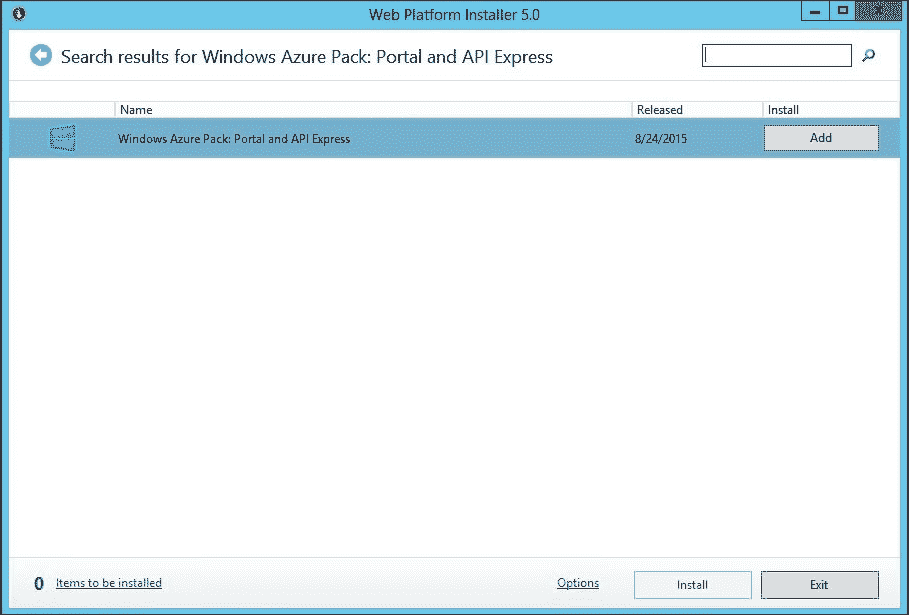

1.  点击**添加**以选择高亮显示的条目进行下载和安装。

1.  选择**安装**以继续操作。

1.  Web PI 向导将显示可以安装的先决条件和可选组件。如果不打算使用某些组件（如合作伙伴提供的扩展），可以选择删除它们。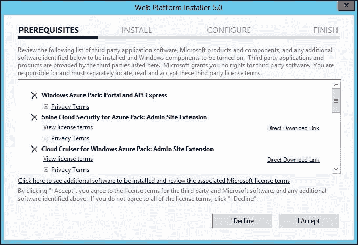

1.  删除任何额外或未使用的组件，并点击**我接受**以继续操作。

1.  根据需求选择 Microsoft 更新设置。建议启用 Microsoft 更新，以便使用 Windows Update 控制台将 WAP 和其他组件更新到最新功能和修复版本。

1.  向导将开始下载并安装 WAP 组件和先决条件，如下图所示：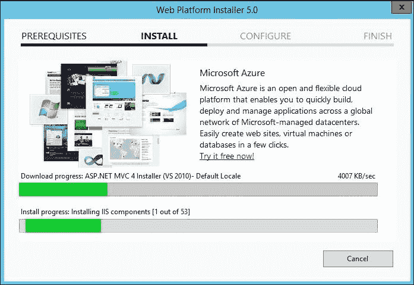

1.  安装成功后，将进入**配置**页面，页面上提供了关于配置 WAP 已安装组件的详细信息，如下图所示。在初始设置期间，WAP 会在 IIS 中创建一个名为 Windows Azure Pack 配置站点的站点，用于配置和集成所有 WAP 组件和数据库。点击**继续**以继续操作。点击**继续**还会打开配置站点页面，您可以现在配置，或者稍后关闭页面再进行设置。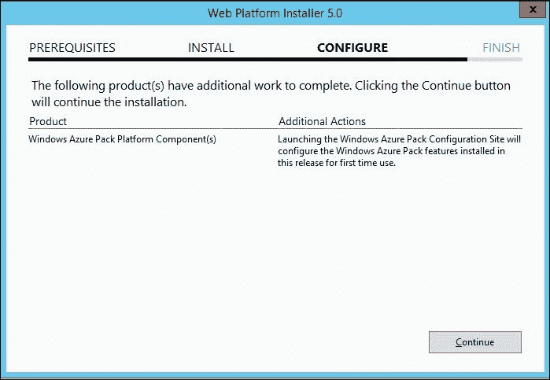

1.  审核已安装组件的摘要并完成向导。如遇到错误，请查看安装日志。退出 Web PI 控制台。

1.  已安装的组件可以在程序和功能（`appwiz.cpl`）管理控制台中验证。

    ### 提示

    Microsoft Web PI 总是包含 Windows Azure Pack 组件的最新版本及其更新。

## 配置 Windows Azure Pack Express 部署

在前面的话题中，我们只安装了那些尚未准备好使用的 WAP 组件。现在，我们需要通过将其与管理数据库等进行集成，来配置所有的 WAP 组件（已安装在单个服务器上）。Windows Azure Pack 配置站点用于配置安装。您可以通过打开 IE 和输入其 URL，或使用开始菜单图标来打开 WAP 配置站点。

配置 WAP Express 安装的步骤如下：

1.  使用**以管理员身份运行**启动 Internet Explorer。

1.  打开可以通过`https://localhost:30101/`访问的 Windows Azure Pack 配置站点。

1.  如果出现任何 SSL 警告，点击**继续访问此网站**。

1.  点击**立即配置**继续下一步。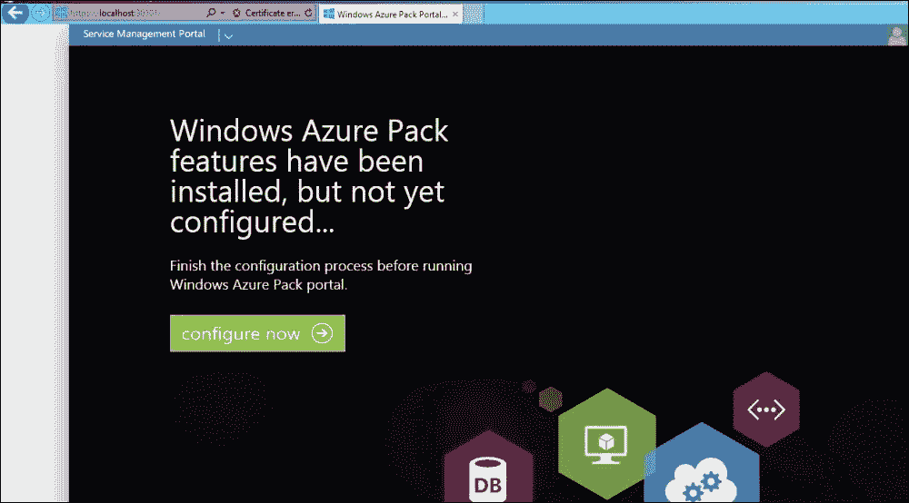

1.  在**数据库服务器设置**向导中提供所需的信息：

    +   **服务器名称**：用于托管云管理数据库的 SQL 服务器的 FQDN。

    +   **身份验证类型**：Windows 身份验证或 SQL 身份验证。

    +   **数据库服务器管理员用户名**和**数据库服务器管理员密码**：向导将在继续之前自动检测用户名和密码是否正确。

    +   **配置存储密码短语**：WAP 使用加密和解密技术存储和检索 SQL 配置中存储的机密数据。此密码短语将用于加密和解密数据。在分布式部署中配置所有服务器时，必须使用相同的密码短语。

    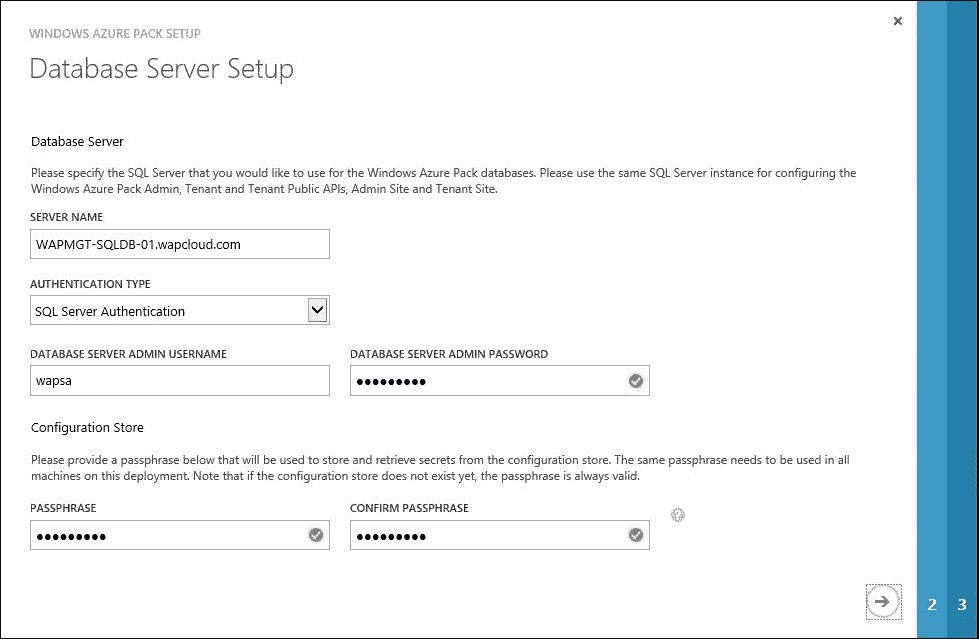

1.  选择是否参与**客户体验改进计划**。

1.  审查需要配置的组件并点击右下角的勾选标记。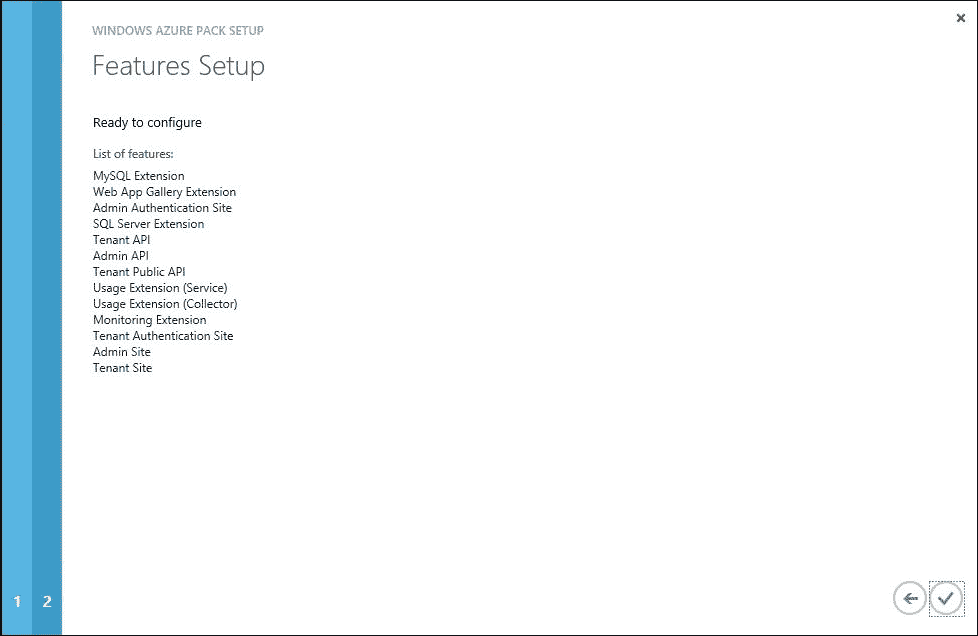

1.  **WINDOWS AZURE PACK 设置**将开始配置每个角色。配置完成可能需要几分钟时间。配置完成并且所有组件都成功时，点击**完成**。

1.  配置已完成。现在可以继续验证部署并进行后续步骤。

### 提示

配置完成后，登出并重新登录到 WAP 服务器。这将创建必要的安全权限来登录门户。

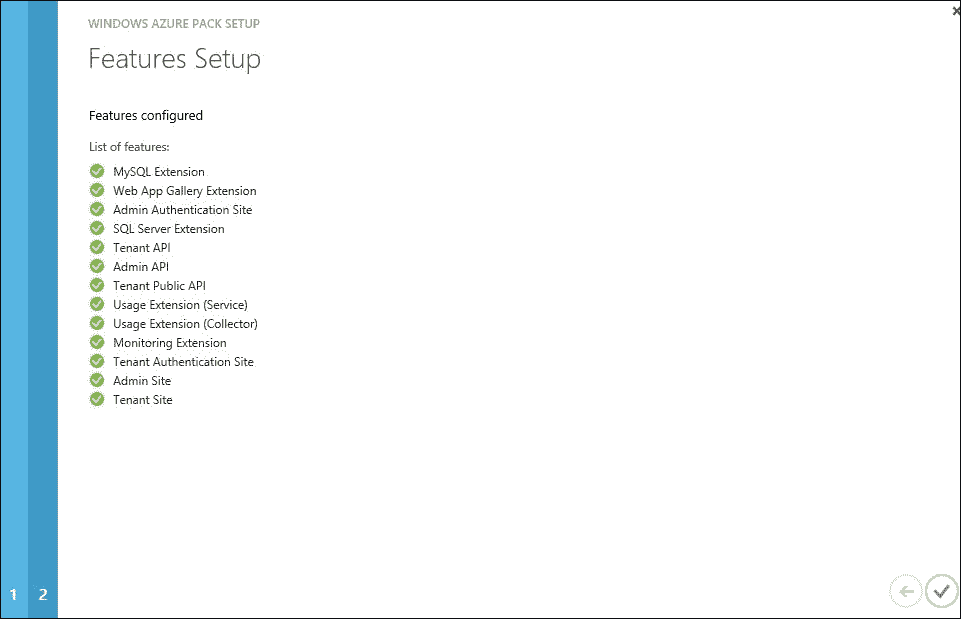

## 验证成功的部署

配置向导完成后，建议快速运行一些测试，以验证部署和数据库集成是否成功完成。执行以下检查以验证部署是否成功：

+   验证所有 Internet 信息服务（IIS）网站和应用程序是否已在 WAP 服务器上创建。使用**Internet 信息服务（IIS）管理器**进行验证。如果未安装 IIS 管理器，请使用服务器管理器安装它。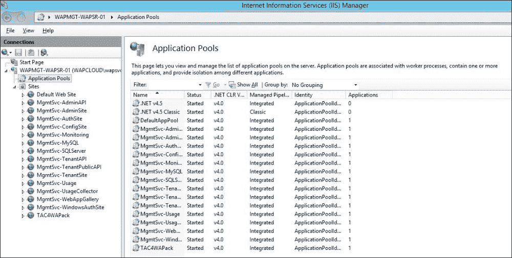

+   验证所有 WAP 数据库是否已在设置过程中指定的 SQL 服务器上创建。使用 SQL Management Studio 访问 SQL 管理服务器。访问 WAP 数据库服务器并展开数据库，以查看所有在服务器上创建的数据库：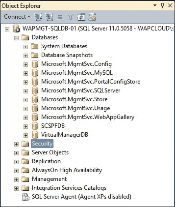

+   验证管理员门户和租户门户的登录和可访问性。尝试登录管理员门户：

    管理员门户网址：`https://WAPServer:30091`

    租户门户网址：`https://WAPServer:30081`

+   运行 Microsoft Best Practice Analyzer for Windows Azure Pack，识别部署中的任何缺口。

### 提示

用于安装 WAP 组件的帐户必须用于登录到管理门户。可以通过将用户添加到 WAP 服务器上的 MgmtSvc Operators 本地组来添加额外的共同管理员。

可以通过 Microsoft Web Platform Installer（WebPI）下载并安装 Windows Azure Pack 的 Microsoft 最佳实践分析器。

# 在分布式架构中安装 Windows Azure Pack

在分布式架构中安装 Windows Azure Pack 与快速安装类似。在分布式架构中，选择的不是 Windows Azure Pack: Portal and API Express，而是单独选择并在多个服务器上安装组件，例如管理员站点和管理员身份验证站点。

**Microsoft Web Platform Installer**（**Web PI**）用于选择各个组件并在所有 WAP 服务器上安装它们。让我们来看一下在分布式架构中部署 WAP 的步骤。

1.  在所有 WAP 服务器上完成硬件和软件的先决条件（请参阅第一章, *了解 Windows Azure Pack 及其架构*，该章最后一部分讨论 WAP 在分布式架构中的各种部署拓扑，软件先决条件）。

1.  验证 Windows 防火墙或网络防火墙中是否允许所需的防火墙端口。

1.  根据架构部署任何负载均衡器（物理或逻辑），用于 WAP 虚拟机。

1.  按顺序在 WAP 服务器上安装并运行 Microsoft Web Platform Installer。

1.  按照给定的顺序在多个服务器上安装和配置 WAP 组件：

    1.  安装并配置 WAP 服务管理 API（管理员 API、租户 API 和租户公共 API）

    1.  安装并配置 WAP 管理门户（管理员站点、租户站点等）

    1.  安装并配置身份验证站点（管理员身份验证站点和租户身份验证站点）

    1.  安装并配置其他组件，如资源提供者等

1.  在配置过程中，提供 SQL 服务器的详细信息和密码短语。记下密码短语，因为在配置其他组件时必须完全一致。建议将其记录下来，因为一旦丢失，就无法恢复密码短语。

1.  配置负载均衡器以分配流量和 DNS 记录。

1.  为负载均衡的名称自定义门户和身份验证站点的 URL 和端口。

1.  用受信任的 SSL 证书替换自签名证书。

1.  测试部署并完成后续部署最佳实践，例如运行 BPA。

更改门户的 URL 和端口，以及更换 SSL 证书，将在后续主题中讨论。

### 注意

默认情况下，Windows Azure Pack 门户使用 HTTPS。如果您尝试通过 HTTP 打开门户，将会显示页面无法显示的错误。要接受 HTTP 流量，请在 IIS 中为每个网站创建附加绑定，指向 80 端口，并与默认的 HTTPS 绑定一起使用。

每个门户的 Web.Config 已经有一个将 HTTP 流量重定向到 HTTPS 的规则，该规则在为端口 80 添加绑定后生效。

# WAP 组件所需的防火墙端口

以下网络端口必须在网络中或任何其他外部防火墙中允许，以便实现 WAP 组件与管理员或租户访问网站之间的通信。

Windows Azure Pack 会在 Windows 防火墙中自动创建这些端口的规则（如果已启用）。请注意，以下列表仅包括 WAP 组件使用的默认端口；如果使用任何自定义端口，请添加其他端口。

| WAP 服务 | 端口号 | 范围 |
| --- | --- | --- |
| 管理员 API | 30004 | 需要访问管理员 API 的任何 IP 地址。通常是云管理 IP 范围。 |
| 管理员管理门户 | 30091 | 需要访问管理员门户的任何 IP 地址。通常是云管理 IP 范围。 |
| Windows 身份验证站点（用于管理员门户身份验证） | 30072 | 需要访问管理员门户的任何 IP 地址。通常是云管理 IP 范围。 |
| 配置站点 | 30101 | 本地 WAP 组件子网。在初始设置时将访问该站点。 |
| 监控站点 | 30020 | 需要访问监控服务的任何 IP 地址。通常是云管理范围。 |
| MySQL 资源提供程序 | 30012 | 使用指定服务的任何 IP 地址。 |
| SQL Server 或 MySQL 资源提供程序 | 30010 | 使用指定服务的任何 IP 地址。 |
| 租户 API | 30005 | 使用指定服务的任何 IP 地址。 |
| 租户公共 API | 30006 | 使用指定服务的任何 IP 地址。通常是所有互联网 IP 范围。 |
| 租户管理门户 | 30081 | 使用指定服务的任何 IP 地址。通常是所有互联网 IP 范围。 |
| 租户身份验证站点 | 30071 | 使用指定服务的任何 IP 地址。通常是所有互联网 IP 范围。 |
| 用途 | 30022 | 使用指定服务的任何 IP 地址。 |
| WebAppGallery | 30018 | 使用指定服务的任何 IP 地址。 |

# 自定义 WAP 门户的可访问性和证书

默认情况下，WAP 网站使用服务器主机名作为网站 URL、默认端口号以及自签名证书。在本主题中，我们将更改网站的名称，即 URL、默认端口（例如将 30081 更改为 443 用于租户门户）以及根据需要使用的内部或公共 SSL 证书。建议自定义这些门户的配置，以提高安全性和用户体验。

假设一个租户门户（也称为客户门户）的用户体验，该门户具有足够复杂的 URL 和一个自定义端口，同时会出现不受信任的 SSL 证书的安全警告。Windows Azure Pack 提供了灵活性，可以更改 URL 和端口，并为 WAP 网站提供受信任的 SSL 证书，从而提高安全性和优化终端用户体验。

在开始操作之前，让我们了解哪些网站涉及用户登录（管理员或租户）。WAP 门户使用基于声明的身份验证机制进行登录过程，如下所示：

1.  用户通过输入 WAP 服务器的主机名和端口，打开各自的门户网站，如管理员门户或租户门户。

1.  管理员站点将网页重定向到相应的身份验证站点网页。

1.  用户通过 Windows 身份验证/ASP.NET 身份验证或 ADFS 等机制输入凭据。在身份验证成功后，用户将获得安全访问令牌，并再次被重定向到门户网页。

1.  管理员门户网页接受用户的安全令牌，并根据用户可用的服务/权限显示门户。

如我们所知，四个网站在验证用户身份并根据角色获取个性化门户方面发挥作用。为了提供流畅的用户体验，我们需要自定义名称、端口，并为以下 WAP 网站提供受信任的证书：

+   管理员管理门户

+   管理员身份验证站点

+   租户管理门户

+   租户身份验证站点

对于组织的私有云，在大多数情况下，所有这些网站将仅从组织内部访问，这使得可以使用内部 **CA**（**证书颁发机构**）提供的 SSL 证书来保护所有网站。

在服务提供商场景下，租户门户将通过公共互联网访问；而管理员门户则可能仅在提供商的网络内访问。在这种情况下，应为租户管理门户和身份验证站点使用由公共 CA 发放的 SSL 证书，而管理员门户和管理员身份验证站点则可以使用内部 CA 提供的证书。

这使得建议明确：内部 CA 提供的 SSL 证书应用于企业局域网内使用的门户和身份验证站点，而任何公共门户或身份验证站点应分配由公共受信任的 CA 发放的 SSL 证书。

总的来说，为了改善用户体验和安全性，需要对用户可访问的网站执行以下建议：

+   为管理员和租户网站使用更简洁的 URL。

+   使用标准端口如 443（HTTPS）以避免 URL 中的复杂性。

+   使用受信任的 SSL 证书，以避免任何与 SSL 相关的安全警告。

为实现上述建议，需要在 WAP Cloud 解决方案中执行以下操作：

1.  为新 URL 创建 DNS 记录（在内部 DNS 和公共 DNS 服务器中）。

1.  为每个网站生成并导入受信任的 SSL 证书。

1.  配置网站绑定，以使用新 URL、端口和证书。

1.  更新 Windows Azure Pack 配置数据库，添加新的 URL 和端口。

## 配置门户的 DNS 名称。

默认情况下，WAP 管理门户和身份验证站点使用以下端口。

以下是 WAP 网站的默认 URL 和端口：

| 网站名称 | URL | 端口 |
| --- | --- | --- |
| 管理员管理门户 | `https://WAPServer:30091` | 30091 |
| 管理员身份验证站点 | `https://WAPServer:30072` | 30072 |
| 租户管理门户 | `https://WAPServer:30081` | 30081 |
| 租户身份验证站点 | `https://WAPServer:30071` | 30071 |

为了评估目的，我们将根据以下表格更改 URL 和端口。组织和服务提供商可以根据需要选择自己的名称和端口。

| 网站名称 | URL | 端口 |
| --- | --- | --- |
| 管理员管理门户 | `https://admin.wapcloud.com` | 443 |
| 管理员身份验证站点 | `https://adminauth.wapcloud.com` | 443 |
| 租户管理门户 | `https://manage.wapcloud.com` | 443 |
| 租户身份验证站点 | `https://manageauth.wapcloud.com` | 443 |

"`A`" 记录和 "`PTR`" 记录需要在内部和外部 DNS 服务器中创建，指向 WAP 服务器的前述名称。如果有任何服务可以通过互联网访问，如租户门户和身份验证站点，则需要更改公共 DNS 服务器。

可以使用 DNS 管理器在内部 DNS 服务器上创建记录。使用以下步骤来创建记录：

1.  在 DNS 服务器上打开 DNS 管理器。

1.  右键点击**DNS 区域**，然后点击创建新记录按钮。

1.  提供门户和 WAP 服务器的名称及 IP，如下所示：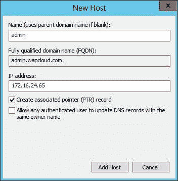

1.  选择**创建关联的指针（PTR）记录**。

1.  使用相同的方法创建所有所需的记录。

## 获取 WAP 网站的 SSL 证书

获取 WAP 管理门户和身份验证站点的 SSL 证书类似于为任何其他运行在 web 服务器上的网站获取 SSL 证书。SSL 证书通常由任何 CA 权威在线请求并分配，或者通过在 IIS 服务器上创建证书请求文件，然后将证书请求文件提交给公共 CA 提供商以获得所需的 SSL。

Active Directory 证书服务，即内部企业 CA，可以用于为仅在公司网络内可访问的门户分配证书，例如管理员的管理门户等。为了评估目的，我们将使用内部 Windows ADCS 服务作为 CA 来为这些网站分配证书。

假设您已经在组织内部配置了企业 CA（Active Directory 证书服务），以下是请求和分配 WAP 网站 SSL 证书所需的步骤：

1.  登录 WAP 服务器并打开 IIS 管理器。

1.  选择您的 IIS 服务器名称，然后在主页上点击**服务器证书**。

1.  **服务器证书**窗口将显示所有现有的自签名证书或其他在 IIS 服务器中使用的证书。

1.  点击操作窗格中的**请求域名证书**。

1.  提供所要求的**通用名称**、**组织**、**组织单位**、**城市/地区**、**州/省**和**国家/地区**的详细信息，如下图所示。**通用名称**将是为其请求证书的网站的 FQDN。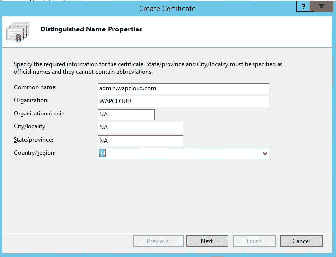

1.  指定运行和配置 ADCS 的 CA 名称和服务器名称。为证书分配一个友好的名称，方便识别和管理。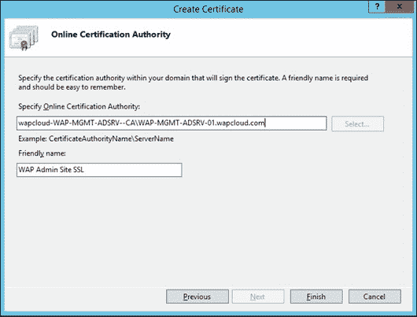

1.  点击**完成**将会在 IIS 中请求并导入证书，如下图所示：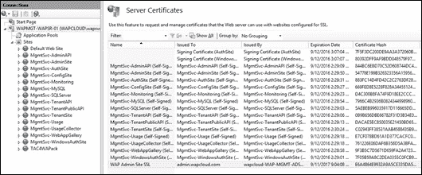

1.  为剩余的三个网站请求证书。

要从公共 CA 请求 SSL 证书，请执行以下步骤：

1.  打开**IIS 管理器** | **IIS 服务器主页** | **服务器证书**。

1.  在**操作**面板中点击**创建证书请求**。

1.  提供所要求的**通用名称**、**组织**、**组织单位**、**城市/地区**、**州/省**和**国家/地区**的详细信息。**通用名称**将是为其请求证书的网站的 FQDN。

1.  根据公共 CA 的要求，选择**加密服务提供商**和**位长度**。

1.  指定文件名和位置以提取证书请求文件。

1.  将此请求文件提交给公共 CA 在线或通过离线方式。CA 将根据证书请求文件中收到的详细信息生成 SSL 证书。

1.  在 IIS 管理器的服务器证书菜单中，点击**完成证书请求**。

1.  提供由 CA 提供的证书文件的文件路径。

1.  证书将会被添加到 IIS 中。

## 配置站点绑定以使用新的 URL、端口和 SSL 证书。

现在，我们需要配置 WAP 网站以使用这些新的名称、端口和 SSL 证书。按照以下步骤操作：

1.  打开 WAP 服务器上的 IIS 管理器，浏览网站。

1.  选择**MgmtSvc-AdminSite**以选择管理员站点的管理门户。

1.  在**操作**面板中点击**绑定**。

1.  选择现有的 HTTPS 绑定，点击**编辑绑定**。

1.  提供新的**端口**号和**主机名**，并选择新创建的**SSL 证书**用于管理员站点。

1.  选择**要求服务器名称指示**复选框。

1.  点击**确定**提交更改。

1.  对剩余的网站重复上述步骤。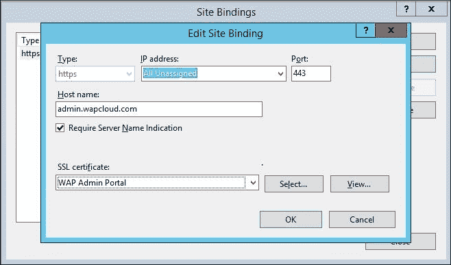

以下是 IIS 网站名称和相应的 WAP 网站：

| IIS 网站名称 | WAP 组件 |
| --- | --- |
| MgmtSvc-AdminSite | 管理员管理门户 |
| MgmtSvc-WindowsAuthSite | 管理员认证站点 |
| MgmtSvc-TenantSite | 管理员管理门户 |
| MgmtSvc-AuthSite | 租户认证站点 |

## 更新 Windows Azure Pack 数据库中的更改。

在前面步骤中进行的所有更改必须在 Windows Azure Pack 配置存储中更新，才能生效。接下来，我们将在管理 SQL 服务器上的 WAP 配置数据库中更新门户 URL 和端口的更改。

将使用 Windows Azure Pack PowerShell 来更新更改。我们需要更新 WAP 数据库中管理员和租户门户的以下三个配置项的值：

+   **门户 FQDN**：通过在 PowerShell 命令中使用 `Set-MgmtSvcFqdn` 配置，这将更新 WAP 数据库中网站门户的 FQDN，例如 `admin.wapcloud.com`。

+   **身份验证服务中继**：通过在 PowerShell 命令中使用 `Set-MgmtSvcRelyingPartySettings` 配置，这将更新 WAP 数据库中身份验证站点的 URL。该 URL 将用于当用户在没有任何安全令牌的情况下访问门户时，由门户进行重定向。

+   **身份验证服务重定向**：通过在 PowerShell 命令中使用 `Set-MgmtSvcIdentityProviderSettings` 配置，这将更新身份验证站点在用户身份验证后使用的重定向 URL。该 URL 将用于身份验证站点在用户身份验证后将其重定向到管理员或租户门户。

接下来给出的 PowerShell 命令中的示例 URL 需要在生产环境中替换为实际的名称。更新 WAP 数据库中新网站的 URL 和端口的步骤如下：

1.  以 WAP 管理员身份登录到 WAP 服务器。

1.  以管理员身份运行 Windows PowerShell。

1.  通过执行以下命令导入 Windows Azure Pack PowerShell 模块：

    ```
    Import-Module -Name MgmtSvcConfig

    ```

1.  通过在 PowerShell 中执行以下命令更新管理员门户的 FQDN。此命令中的 FQDN 是管理员门户的 FQDN：

    ```
    Set-MgmtSvcFqdn -Namespace "AdminSite" -FullyQualifiedDomainName "admin.wapcloud.com" -Port 443 -Server "WAPMGT-SQLDB-01.wapcloud.com"

    ```

1.  通过执行以下 PowerShell 更新管理员身份验证站点的 FQDN。此命令中的 FQDN 是管理员身份验证站点的 FQDN：

    ```
    Set-MgmtSvcFqdn -Namespace "WindowsAuthSite" -FullyQualifiedDomainName "adminauth.wapcloud.com" -Port 443 -Server "WAPMGT-SQLDB-01.wapcloud.com"

    ```

1.  通过执行以下 PowerShell 更新管理员身份验证站点重定向的更改。此命令中的 FQDN 是管理员身份验证站点的 FQDN：

    ```
    Set-MgmtSvcRelyingPartySettings –Target Admin –MetadataEndpoint 'https://adminauth.wapcloud.com:443/FederationMetadata/2007-06/FederationMetadata.xml' -ConnectionString "Data Source=WAPMGT-SQLDB-01.wapcloud.com ;User ID=sa; Password=*******"

    ```

1.  通过执行以下 PowerShell 更新身份验证服务的重定向。此命令中的 FQDN 是管理员门户的 FQDN：

    ```
    Set-MgmtSvcIdentityProviderSettings –Target Windows –MetadataEndpoint 'https://admin.wapcloud.com/FederationMetadata/2007-06/FederationMetadata.xml' -ConnectionString "Data Source=WAPMGT-SQLDB-01.wapcloud.com ;User ID=sa;Password=********"

    ```

1.  通过执行以下 PowerShell 更新租户管理员门户的 FQDN。此命令中的 FQDN 是租户门户的 FQDN：

    ```
    Set-MgmtSvcFqdn -Namespace "TenantSite" -FullyQualifiedDomainName "manage.wapcloud.com" -Port 443 -Server "WAPMGT-SQLDB-01.wapcloud.com"

    ```

1.  通过执行以下 PowerShell 更新租户身份验证门户的 FQDN。此命令中的 FQDN 是租户身份验证门户的 FQDN：

    ```
    Set-MgmtSvcFqdn -Namespace "AuthSite" -FullyQualifiedDomainName "manageauth.wapcloud.com" -Port 443 -Server "WAPMGT-SQLDB-01.wapcloud.com"

    ```

1.  通过执行以下 PowerShell 更新租户身份验证重定向站点的更改。此命令中的 FQDN 是租户身份验证站点的 FQDN：

    ```
    Set-MgmtSvcRelyingPartySettings –Target Tenant –MetadataEndpoint 'https://manageauth.wapcloud.com:443/FederationMetadata/2007-06/FederationMetadata.xml' -ConnectionString "Data Source=WAPMGT-SQLDB-01.wapcloud.com ;User ID=sa; Password=*******"

    ```

1.  通过执行以下 PowerShell 更新租户身份验证服务的重定向。此命令中的 FQDN 是租户管理员门户的 FQDN：

    ```
    Set-MgmtSvcIdentityProviderSettings –Target Membership –MetadataEndpoint 'https://manage.wapcloud.com/FederationMetadata/2007-06/FederationMetadata.xml' -ConnectionString "Data Source=WAPMGT-SQLDB-01.wapcloud.com ;User ID=sa;Password=********"

    ```

1.  成功更新的配置将输出如下：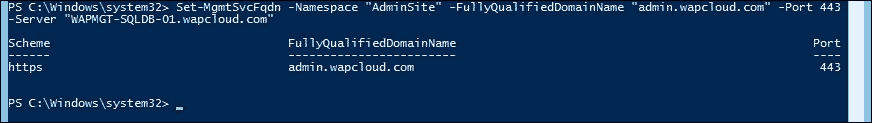

## 验证门户自定义设置

可以按照以下步骤验证前一节中的自定义设置是否生效：

1.  通过登录租户和管理员门户验证门户 URL 和端口自定义是否正常工作。

1.  通过点击网站浏览器中的 SSL 按钮来检查网站的 SSL 证书。

1.  验证登录或访问门户时没有显示 SSL 信任相关的警告。

# 使用 WAP 注册服务提供商基础架构

现在我们已经准备好管理员和租户使用的门户，接下来是将 WAP API 与前一章中准备的 Fabric 进行集成或通信。在本节中，我们将使用 Windows Azure Pack 服务管理 API 注册服务提供商基础架构。

请参阅第一章，*了解 Windows Azure Pack 及其架构*，系统中心集成部分，了解 WAP API 与 SPF 之间的集成。

在注册之前，验证 SPF 是否已正确部署和配置，以确保注册成功：

+   WAP 服务器和 SPF 之间的必需端口已实现网络连通性

+   SPF 应用程序池身份以域用户身份运行

+   SPF 应用程序池身份用户对 SCVMM 和 SPF 数据库具有管理员权限

+   本地用户在 SPF 服务器上为 WAP 集成创建。确保该本地用户已添加到 SPF 本地组服务器（`SPF_Admin`，`SPF_Provider`，`SPF_Usage`，`SPF_VMM`）

注册 SPF 端点到 WAP 的步骤如下：

1.  使用 WAP 管理员凭据登录 WAP 管理员门户。

1.  选择虚拟机云。打开虚拟机云页面时会出现注册 SPF 的选项。如果不可用，请点击快速启动（）按钮。

1.  选择**注册系统中心服务提供商基础架构**。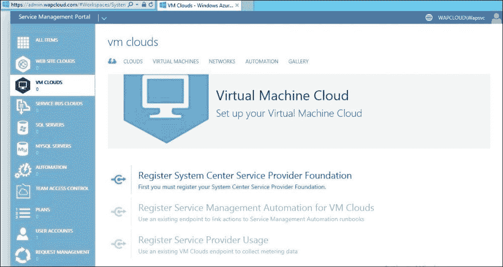

1.  提供 SPF 服务器的 FQDN 和登录凭据：

    SPF 服务器：`https://WAPMGT-SCSPF-01:8090/`

    使用第二章，*准备云 Fabric*中 SPF 安装时创建的 spflocal 帐户。登录名中不要提供任何域名或计算机名称。

    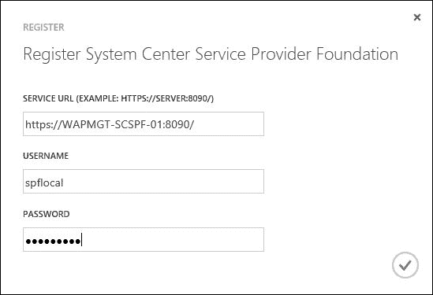

1.  注册任务通过点击勾选框开始。

1.  注册成功完成后，点击**确定**：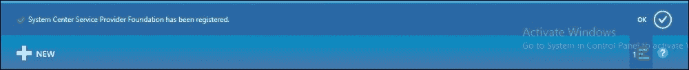

1.  现在，我们可以开始集成 SCVMM 并构建 IaaS 服务，这将在下一章中讨论。

# 总结

在本章中，我们学习了在快速部署模型和分布式部署模型中安装和配置 Windows Azure Pack。我们进行了不同 WAP 组件的安装和配置演示。

我们还涵盖了定制门户网站的 URL、端口和 SSL 证书，以提供更好的用户体验并符合组织和云服务提供商的需求。在本章结束时，我们定制了可供用户（管理员和租户用户）访问的管理员和租户门户，准备提供云服务。

在下一章，我们将构建 IaaS 云服务目录。
