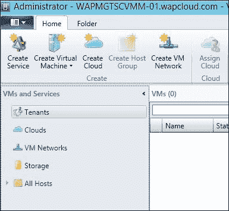
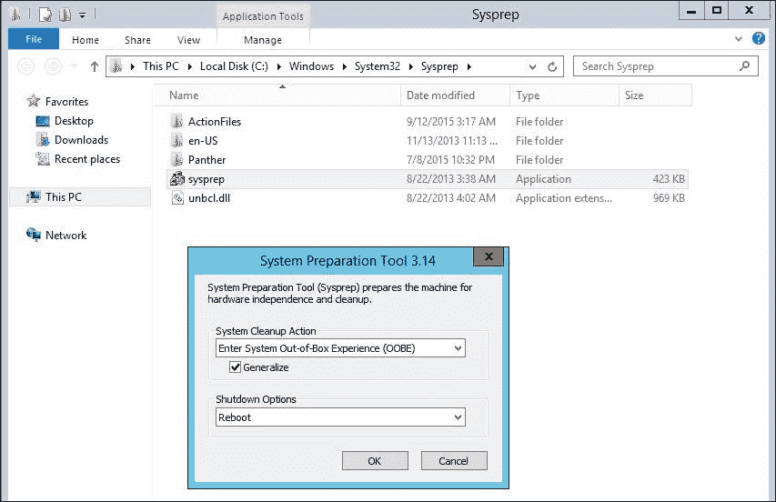

# 第四章：构建虚拟机云和 IaaS 服务

在前一章中，我们安装并配置了 Windows Azure Pack 组件。此时，管理员和租户可以访问的门户在云服务提供方面非常基础。在本章中，我们将构建与 Windows Azure Pack、SPF 和 SCVMM 集成的虚拟机云。Windows Azure Pack 虚拟机云用于提供 IaaS（基础设施即服务）功能，如虚拟机、虚拟网络等。

你将了解虚拟机云的架构、规划和实施。此外，我们将开始构建云服务，如虚拟机和模板、画廊资源及其集成，并与 SCVMM 中的基础设施资源进行映射。你将学习使用微软提供的标准云服务画廊项目，并开发定制的画廊项目以满足特定需求。

本章将涵盖以下主题：

+   虚拟机云概述

+   将 SCVMM 注册到 Windows Azure Pack

+   为 Windows Azure Pack 云构建 SCVMM 云

+   为云目录准备操作系统镜像（Windows 和 Linux 虚拟机）

+   IaaS 虚拟机服务 – 独立虚拟机与虚拟机角色

+   构建独立虚拟机 IaaS 服务

+   VM 角色架构

+   使用画廊资源构建虚拟机角色 IaaS 服务

+   使用**GRIT**（**Gallery Resource Import**）工具

+   使用虚拟机角色创作工具开发虚拟机角色资源

+   访问租户虚拟机 – Windows Azure Pack 控制台连接

# 虚拟机云概述

Windows Azure Pack 云解决方案中的虚拟机云是一个顶层的伞形结构，用于提供 IaaS 服务。在**System Center Virtual Machine** **Manager (SCVMM)**中创建的云表示为 Windows Azure Pack 管理门户中的虚拟机云。

虚拟机云可以用来提供带有多租户功能的 IaaS 服务。在基于 Windows Azure Pack 的云中，云计划、订阅、云服务目录和基础设施资源都是在虚拟机云层面进行配置、映射和管理的。

Windows Azure Pack 使用 SPF 与 VMM 进行通信，处理与虚拟机云相关的所有操作和管理。根据需求，可以在一个或多个 SCVMM 中创建多个虚拟机云；但推荐只创建单个或较少数量的虚拟机云。

创建多个虚拟机云的使用场景包括 GEO 站点位置、为租户提供专用硬件服务、备份/辅助/灾难恢复基础设施，或根据云提供商策略提供的功能；但这些不局限于此。

IaaS 服务包括虚拟机、虚拟网络和带有自动化应用部署的 IaaS 虚拟机，这些服务通过虚拟机云提供。但它们不限于此。

虚拟机云负责提供 IaaS 服务，包括虚拟机、网络和虚拟机内部的自动化应用部署。

# 将 SCVMM 注册到 Windows Azure Pack

在开始构建 VM 云和 IaaS 提供之前，我们必须将我们的 SCVMM 实例注册到 Windows Azure Pack。这也称为印章注册。

注册 SCVMM 印章与 Windows Azure Pack 的以下步骤需要执行

1.  登录 Windows Azure Pack 管理门户进行管理员操作。

1.  浏览**vm clouds**工作区。

1.  点击**使用现有虚拟机云提供商来配置虚拟机**。

1.  提供**虚拟机管理器服务器 FQDN**和**端口号**（如果自定义）。请注意，Windows Azure Pack 使用服务提供商基础 VMM 服务帐户访问 VMM，因此不需要凭据。输入**远程桌面网关 FQDN**，这将用于 Azure Pack 控制台连接。稍后可以在本章中配置远程桌面网关。

1.  成功注册后，在 Windows Azure Pack 门户的**云**工作区中将显示 VMM 印章。

1.  检查 Windows Azure Pack 注册错误、Windows Azure Pack、SPF 和 VMM 日志，以防任何注册失败。

我们目前在 Windows Azure Pack 门户中看不到任何列出的云，因为我们只集成了虚拟化机器云提供商。现在，我们将开始构建 VM 云。

## 为 Windows Azure Pack 云构建 SCVMM 云

在**SCVMM**中的云是一个包含我们的 VMM 布局资源（如计算（hypervisors）、网络和存储），以及资源（如 VM、服务和模板）的总称。在 SCVMM 中创建的云被 Windows Azure Pack 用于通过计划和订阅向租户提供 IaaS 服务。

在 SCVMM 中可以使用 SCVMM 主机组创建云，这些主机组可能包含不同的 hypervisor，或者可以从 VMware 资源池创建。在撰写本书时，Windows Azure Pack VM 云不支持使用 VMware 资源池创建的 SCVMM 云。

请注意，虽然可以将 VMware 或服务器资源添加到 SCVMM 云中，但通过 Windows Azure Pack 租户门户对这些资源进行 IaaS 资源配置是不可能的。目前，仅支持 Hyper-V 作为 WAP VM 云中 IaaS 服务的 hypervisor。第三方合作伙伴解决方案可用于使用基于 VMware 的虚拟化解决方案的 Windows Azure Pack。此限制仅适用于租户的 IaaS 工作负载，可用于托管 Windows Azure Pack 管理服务器、网站、DBaaS 服务器等的 VMware/Xen 和其他基于 VM 的 VM。

在创建 SCVMM 云之前，让我们看看 SCVMM 云在 Windows Azure Pack VM 云支持方面的要求。

## Windows Azure Pack VM 云的要求

创建 SCVMM 云时，请注意以下有关 Windows Azure Pack VM 云的前提条件：

+   SCVMM 云必须从主机组中创建。当前，Windows Azure Pack 不支持使用 VMware 资源池创建的云。

+   创建云时，不能选择云能力配置文件（ESX 服务器、Hyper-V 或 XenServer）。

+   必须根据可用的容量选择云容量（计算/网络/存储资源）。这些资源的限制将适用于使用 Windows Azure Pack 云的租户在资源供应过程中。

+   计划用于 Windows Azure Pack 的逻辑网络必须已创建并与 SCVMM 云关联。

+   必须已创建并配置 VMM 库共享与云一起使用。

+   **服务管理自动化**（**SMA**）将在接下来的章节中讨论。如果它用于与 SCVMM 云相关的自动化，则必须在 SPF 服务器上信任 SMA Web 服务证书。这将在第九章，*自动化与身份验证 - 服务管理自动化与 ADFS*中详细讨论。

## 在 SCVMM 中创建云

SCVMM 管理控制台用于在 VMM 中创建云。在创建云之前，请确认已配置所有必需的架构组件。请参阅第二章，*准备云架构*，以回顾架构组件的要求。

按照以下步骤创建 SCVMM 云：

1.  使用具有管理权限的 VMM 控制台登录到 SCVMM 服务器。

1.  单击**主页**功能区中的**创建云**。

1.  在**创建云向导**中提供云名称和描述。 

1.  在**选择此云的资源**部分，选择将用于 Windows Azure Pack 租户工作负载的**主机组**云。向导还将显示 CPU、内存和网络方面的容量或主机组。 

1.  在**逻辑网络**页面，选择为 Windows Azure Pack 云使用而创建的逻辑网络或网络。租户将使用这些网络来创建和使用虚拟机网络。这将利用网络虚拟化为租户提供独立的虚拟网络。有关网络虚拟化的更多信息，请参阅第二章，*准备云架构*，了解更多关于网络虚拟化的内容。

    ### 注意

    请注意，分配给 Hyper-V 主机物理网络适配器的逻辑网络仅在此页面上可见。

    

1.  可选地，选择**负载均衡器**，使其在此云中可供访问。

1.  可选地，选择用于云端的**VIP 模板**。VIP 模板与负载均衡器配合使用，用于虚拟 IP 和其他相关配置。

1.  可选地，选择**端口分类**以供云资源使用。端口配置文件可用于指定云层的**QOS**（**服务质量**），并在 Windows Azure Pack 计划级别进行精细控制。

1.  可选地，选择**存储**来存储此云中的虚拟机。有关 Windows Azure Pack 云存储选项的详细信息，请参阅第二章，*准备云基础设施*。

1.  选择存储的虚拟机路径和只读库共享以供云端使用。

1.  选择**容量**以了解可供租户使用的云容量。这是 SCVMM 层面云的重要设置之一。容量应根据资源的可用性谨慎选择。此容量限制将适用于云中所有托管 IaaS 工作负载的租户。租户级别的容量限制将在 Windows Azure Pack 计划级别配置。虽然 CPU 和内存等值易于理解，但容量中的自定义配额值是根据虚拟机模板的参数（如大小）定义的值。稍后，这些将用于限制任何自服务用户在云中提供的最大资源。

    ### 注意

    请注意，自定义配额点提供向后兼容性，仅适用于在 VMM 2008 R2 中创建的自服务用户。这些不适用于 Windows Azure Pack 虚拟机云。

    

1.  在**功能配置文件**页面中，不要选择任何配置文件（ESX/Hyper-V/XenServer）。Windows Azure Pack 不支持在 IaaS 工作负载的租户使用带有功能配置文件的 SCVMM 云。

1.  如适用，添加任何**云灾难恢复解决方案**，可在**复制组**页面上进行操作。

1.  查看**总结**页面上的设置。

1.  点击**完成**以创建云端。

1.  查看任务以验证云创建任务的状态。新创建的云将显示在**SCVMM 虚拟机**和**服务管理**工作区中。

    ### 注意

    Azure Site Recovery，微软基于云的灾难恢复解决方案，可以用于保护 SCVMM 云免受灾难影响。请访问[`azure.microsoft.com/en-in/services/site-recovery/`](https://azure.microsoft.com/en-in/services/site-recovery/)以了解更多关于 Azure Site Recovery 的信息。

### 在 Windows Azure Pack 门户中验证 SCVMM 云

我们在上一篇文章中创建了一个 SCVMM 云。为了将其用于构建 IaaS 云服务，它必须在 Windows Azure Pack 管理门户中的虚拟机云部分可见。服务提供商基础架构负责同步 SCVMM 和 Windows Azure Pack 层级所做的更改，反之亦然。让我们验证一下云是否在 Windows Azure Pack 管理门户中可见：

1.  登录到 Windows Azure Pack 管理门户（管理员）。

1.  浏览 **虚拟机云** 部分。

1.  展开当前已注册的 SCVMM 服务器。

1.  在上一篇文章中创建的新云将可见。

如果在 Windows Azure Pack 管理门户中没有看到新创建的云， 请验证 VMM 中 **创建新云** 作业的状态。请查看 SPF SCVMM 和 Windows Azure Pack 集成检查表及状态。

SCVMM **作业**窗口提供了清晰的细节，包含执行特定任务所发生的事件及其各自的状态。这对于任何故障排除操作都非常有用。


通过本主题，我们已经成功将我们的基础架构和云与 Windows Azure Pack 集成。此外，我们将开始为 Windows Azure Pack 云创建云服务。

# 为云目录准备操作系统镜像（Windows 和 Linux 虚拟机）

云服务目录可以与任何在线购物网站的商品目录进行对比。在任何在线购物网站上，都有不同类型的商品可供购买，而每个商品可能会有不同的尺寸或版本。

客户选择目录中提供的商品并进行购买。在云目录的情况下，类似的购买方式也适用。如果我们查看任何公共云提供商，例如微软、亚马逊等虚拟机服务目录，可能会有不同操作系统以不同格式提供，如普通操作系统或为特定应用或工作负载类型定制的操作系统，这些操作系统以不同的配置尺寸（CPU/内存/存储容量）提供。还可以有其他特征和区分目录的因素，如高可用性、性能、功能等。

在基于 Windows Azure Pack 的云解决方案中，SCVMM 虚拟机模板和 Windows Azure Pack 画廊项目是云目录的核心。虚拟机模板和画廊项目都依赖于预安装的操作系统 VHDXs，用于虚拟机和应用程序的配置。这些 Hyper-V **虚拟硬盘**（**VHD**）或 VHDXs 存储在 VMM 库中，以供虚拟机模板和画廊资源使用。

在本节中，我们将介绍虚拟磁盘的规划和执行，以用于虚拟机模板和画廊项目的准备。

## 规划虚拟机镜像

准备虚拟机镜像和目录是任何云解决方案中的持续过程，因为云需要满足 IT 解决方案日常变化的需求。为任何云准备的镜像数量和类型将取决于提供商的策略和产品组合。

在基于 Windows Azure Pack 的云解决方案的通用场景中，可以为组织和服务提供商的云解决方案准备以下镜像。

以下是基于 Hyper-V 支持的操作系统：

+   所有可用和受支持的 Windows 操作系统的镜像如下：

    +   Windows Server 2012 R2

    +   Windows Server 2012

    +   Windows Server 2008 R2 SP1

    +   Windows 客户操作系统（Win 7/8/8.1）

+   所有可用和受支持的 Unix/Linux 系统的镜像如下：

    +   Red Hat Enterprise Linux

    +   Cent OS

    +   任何其他支持的 Unix 发行版

+   任何其他 Hyper-V 支持的操作系统

对于操作系统磁盘的大小，Windows Azure Pack 会为租户的虚拟机提供与 VHD 模板相同的大小。尽管可以使用 Windows Azure Pack 自动化功能进行定制，但最好有多种大小变体的操作系统虚拟磁盘，例如以下：

+   150 GB

+   100 GB

+   80 GB

+   40 GB

+   根据组织或租户的需求提供任何其他大小

在应用程序或工作负载特定的操作系统磁盘基础设施即服务（IaaS）中，虚拟机不仅仅是为租户的工作负载提供纯粹的操作系统；它还可以根据租户的要求提供带有预配置应用程序的服务器，支持自动化应用程序部署；例如包括 Web 服务器、为租户专门配置的数据库服务器等。可以为应用程序或工作负载特定的产品创建单独的操作系统磁盘，这些磁盘具有特定预安装或配置的应用程序或平台，用于部署应用程序（如 .NET 框架）。

## 为 Windows 操作系统虚拟机准备 Sysprepped 虚拟磁盘

每个 Windows 操作系统都有一个独特的标识符，即 SID（安全 ID）。为避免任何 SID 冲突，使用 Sysprep 来处理通过模板 VHD 部署的虚拟机。

一旦为虚拟机镜像的准备工作完成计划，以下说明可以用来准备 Sysprepped 虚拟磁盘。

为 Windows 操作系统模板准备 VHD 的步骤如下：

1.  创建一个 Hyper-V 虚拟机。

1.  挂载操作系统安装 ISO 并安装操作系统。

1.  安装或验证 Hyper-V 集成服务。

1.  配置所需的本地加固策略。

1.  配置访问设置，例如启用 RDP 和配置 Windows 防火墙。

1.  安装所需的代理（如杀毒软件、备份等）。

1.  如适用，安装所需的 Windows 角色和功能。

1.  安装任何其他第三方应用程序（如适用）。

1.  在启动时添加任何脚本（如 Windows 激活、代理配置和应用程序部署）。

1.  使用最新的 Windows 补丁和服务包更新操作系统。

1.  执行必要的清理工作，例如移除安装介质、事件查看器日志、临时文件等。

1.  最后检查操作系统，识别任何缺失的组件或问题。

1.  要使用 Sysprep 泛化操作系统镜像，我们可以在`C:\Windows\System32\Sysprep`文件夹中找到`Sysprep.exe`。在**系统清理操作**中选择**进入系统开箱体验（OOBE）**，并勾选**泛化**选项。在**关机选项**中选择**关机**，以在 Sysprep 完成后关闭虚拟机。

完成此过程后，虚拟磁盘文件可以复制到 VMM 库中供模板使用。建议保留多个已准备好的磁盘文件副本，以备未来使用和回滚。

### 注意

在虚拟磁盘中配置的产品密钥、主机名和其他值对使用该虚拟磁盘配置的虚拟机没有任何影响。Sysprep 过程完成后，这些配置将不再使用。

## 准备 Linux OS 虚拟机的 VHDX

Linux 操作系统没有任何 SID 关联，因此不需要执行任何 Sysprep 操作。然而，在对 Linux 工作负载进行操作系统镜像泛化时，需要遵循额外的考虑事项。

让我们执行以下步骤以准备 Linux 操作系统镜像：

1.  确定 Linux 版本、分区/LVM 配置等。

1.  挂载操作系统安装 ISO 并安装操作系统。

1.  安装或验证**Linux 集成服务**（**LIS**）。

1.  配置任何需要的本地加固策略。

1.  安装所需的代理（杀毒软件、备份等）。

1.  安装 SCVMM 客户端代理。

1.  安装任何其他第三方应用程序（如适用）。

1.  在启动时添加任何脚本（例如代理配置/应用程序部署）。

1.  使用最新的补丁和更新更新操作系统。

1.  执行一些必要的清理工作，例如移除安装介质、日志、临时文件等。

1.  最后检查操作系统，识别任何缺失的组件或问题。

1.  移除任何 IP 配置并关闭虚拟机。

完成此过程后，虚拟磁盘文件可以复制到 VMM 库中供模板使用。建议保留多个已准备好的磁盘文件副本，以备未来使用和回滚。

Linux 操作系统的 SCVMM 客户端代理可以在 VMM 管理服务器的`C:\Program Files\Microsoft System Center 2012\Virtual Machine Manager\agents\Linux`目录中找到。将代理复制到 Linux 虚拟机中，并执行以下命令进行安装：

+   运行以下命令：

    ```
    chmod +x install

    ```

+   根据需要运行以下命令，适用于 x86 或 x64：

    ```
    ./install scvmmguestagent.1.0.0.544.x64.tar
    ./install scvmmguestagent.1.0.0.544.x86.tar

    ```

# IaaS 虚拟机服务 – 独立 VM 与 VM 角色

基于 Windows Azure Pack 的云解决方案为租户提供了以下两种虚拟机工作负载配置选项：

+   独立虚拟机

+   虚拟机角色（VM 角色）

## 独立虚拟机

Windows Azure Pack 租户管理员门户中的独立虚拟机是独立虚拟机产品目录与 SCVMM 中创建和配置的虚拟机模板之间的直接映射。

对于独立虚拟机，所有配置都在 SCVMM 层面进行。Windows Azure Pack 门户用于使用 SCVMM 虚拟机模板中的预定义配置来创建虚拟机。这不允许租户用户根据自定义需求自定义虚拟机。

云管理员需要预先创建多个 SCVMM 虚拟机模板，以提供不同的大小和选项，从而为租户提供灵活性。对现有独立虚拟机提供的任何更改都必须在 SCVMM 端进行。

由于 Windows Azure Pack 中的独立虚拟机直接使用 SCVMM 虚拟机模板，因此通常用于提供标准操作系统或预安装或配置应用程序的操作系统。它不能用于根据租户需求以自动化方式安装应用程序（这由 SCVMM 中的服务模板引擎提供）。

在后续的主题中，你将学习如何创建一个 SCVMM 虚拟机模板，该模板可供 Windows Azure Pack 中的独立虚拟机角色使用。

## 虚拟机角色

Windows Azure Pack 中的虚拟机角色为租户用户提供了一个可定制的自服务向导，用于请求虚拟机，这使租户用户可以根据需求自定义虚拟机。虚拟机角色也可以用于在虚拟机之上自动化部署应用程序，并以相同的自服务方式交付。

与独立虚拟机角色不同，虚拟机角色使用 SCVMM 的服务模板引擎来配置操作系统和应用程序。

Windows Azure Pack 订阅中的 VM 角色可以包含相同类型或应用程序的多个虚拟机，并且可以轻松扩展（只需移动滑块）。

虚拟机角色提供了比独立虚拟机更多的灵活性，具体包括：

+   为租户的虚拟机请求提供可定制的自服务向导。

+   使用虚拟机角色，租户可以根据云提供商提供的选项控制虚拟机配置和部署，这消除了租户用户对 VMM 管理员在标准模板上所需的任何虚拟机更改的依赖。

+   它通过与 **SMA**（**服务管理自动化**）的集成，提供极高的自动化能力。

+   它不仅以自服务自动化的方式部署虚拟机，还可以部署应用程序。

+   它在一个统一的框架下部署和管理相同类型的多个实例。

+   它只需点击一下（通过移动滑块）即可扩展实例数量。

+   它提供了使用 Hyper-V 差异磁盘或专用磁盘（在 CU5 中新增）来节省大量磁盘空间和管理开销的灵活性，适用于大型部署的操作系统。

+   微软和第三方供应商提供了广泛的预配置画廊项目，供虚拟机角色用于标准使用。也可以开发自定义虚拟机角色，这使得虚拟机角色的提供可能性几乎无限。

在后续的主题中，您将学习虚拟机角色的架构、实现和其他方面的内容。

# 构建独立虚拟机 IaaS 服务

每个 Windows Azure Pack 云中的独立虚拟机服务都必须与 SCVMM 库中的虚拟机模板有直接映射。SCVMM 库中的虚拟机模板可以使用之前准备的虚拟磁盘进行配置。我们现在开始为 Windows Azure Pack 创建 SCVMM 中的虚拟机模板。可以使用相同的 VHD 和定义的硬件/操作系统配置组合创建多个模板，为租户提供灵活的虚拟机工作负载部署选项。

## 使用虚拟机模板为 Windows Azure Pack 提供服务的要求

创建用于 Windows Azure Pack 独立虚拟机的虚拟机模板时必须考虑以下事项：

+   在模板创建向导的硬件配置页面上，不得选择任何云能力配置文件。如果使用的是任何预配置的硬件配置文件，情况也是一样。

+   用于创建模板的 VHD 必须启用远程桌面。

+   在创建虚拟机模板时，必须从下拉列表中选择客户操作系统配置文件。不能选择为“无”。

## 创建用于 Windows Azure Pack 独立虚拟机云服务的 SCVMM 虚拟机模板

在创建虚拟机模板之前，准备好所需的 VHD 文件并将其复制到 VMM 库中。

创建独立虚拟机角色模板的步骤如下：

1.  使用具有管理员权限的 VMM 管理控制台登录 SCVMM。

1.  转到**库**工作区并展开**模板**。

1.  点击**创建虚拟机模板**以启动虚拟机模板向导。

1.  选择**使用库中存储的现有虚拟机模板或虚拟硬盘**。如果 VHD 文件尚未复制到 VMM 库，也可以选择**从已部署在主机上的现有虚拟机**。

1.  点击**浏览**以从 VMM 库中选择可用的 VHD。

1.  提供模板名称、描述和代数。使用一个具有自解释性的名称和描述，详细说明虚拟机的相关信息，因为这些将显示给 Windows Azure Pack 门户中的租户用户。最好在描述中包括硬件和软件配置以及可用的功能集。

    ### 注意

    虚拟机的代数描述了虚拟机的特性和功能。第 2 代虚拟机引入了 Hyper-V 2012 R2，支持 UEFI 固件、所有合成设备等功能。有关第 2 代虚拟机的更多信息，请访问 [`technet.microsoft.com/en-in/library/dn282285.aspx`](https://technet.microsoft.com/en-in/library/dn282285.aspx)。

    

1.  使用预创建的硬件配置文件或自定义设置来定制模板的硬件。确保未选择任何云能力配置文件。在稍后的存储中，任何硬件更改必须在虚拟机模板的硬件配置文件属性中进行。

1.  根据租户的需求配置适当的网络配置，如虚拟交换机名称、IP 池和 MAC 地址（必须是静态的）。在此阶段添加任何额外硬件，例如数据磁盘。

1.  配置操作系统配置文件设置。不要在操作系统配置文件设置中选择"无"；相反，预先创建**客户操作系统配置文件**并从下拉列表中选择。进行必要的更改，例如 Windows 操作系统版本、管理员密码、时区、产品密钥、域/工作组、要运行的脚本等。不要在此页面中选择任何角色和功能。这些仅在服务模板或虚拟机角色中支持。

1.  对于应用程序配置文件和 SQL 配置文件设置请选择"无"，因为这些在独立虚拟机中不受支持。

1.  审查**摘要**页面中的设置，并完成向导以创建虚拟机模板。

1.  在**设置**中的**作业**窗口查看作业状态。

1.  新创建的模板将在 VMM 库工作区的**虚拟机模板**部分中可用。

## 测试虚拟机模板功能

在 Windows Azure Pack 部署中分配此独立虚拟机模板之前，最好通过以下步骤配置一个测试虚拟机来测试配置：

1.  登录到 SCVMM 并浏览**库**工作区下的**虚拟机模板**部分。

1.  右键点击新创建的虚拟机模板并选择**创建虚拟机**。

1.  提供虚拟机名称和描述。最好为任何虚拟机使用相同的虚拟机名称和主机名，以确保一致性并在每一层都能轻松识别。

1.  如有需要，定制硬件和客户操作系统配置文件。

1.  选择新创建的云或主机组作为虚拟机的目标。

1.  配置操作系统计算机名称，并添加自定义属性，如服务器开关机操作。

1.  审查摘要中的所选值，然后点击**创建**以开始创建此虚拟机。

1.  监控虚拟机创建作业是否有错误；在作业成功完成后，浏览虚拟机和 SCVMM 管理控制台中的服务工作区。

1.  登录到新创建的虚拟机，并根据配置验证预期结果。

# 虚拟机角色架构

Windows Azure Pack 中的虚拟机角色为 IaaS 产品提供了更大的灵活性和自助服务功能。虚拟机角色不仅仅是为租户的工作负载提供虚拟机，它通过以自助服务的方式提供自动化的应用程序部署，将 IaaS 服务提升到了另一个层次。

虚拟机角色包是用 JSON 开发的，并提供用于配置虚拟机和应用程序的资源或值。**JSON**（**JavaScript 对象表示法**）是一种轻量级的数据交换格式。

包含虚拟机角色的 JSON 文件以及元数据（如图标、资源等）构成了虚拟机角色包。

一个虚拟机角色主要由以下两个组件/包组成：

+   资源定义包

+   资源扩展包

在深入了解这些包之前，让我们先理解虚拟机角色的工作机制。在没有自助服务门户的传统场景中，虚拟机创建需要一组输入变量，如硬件配置（CPU 数量、内存大小等）和网络配置（虚拟交换机），这些是由虚拟化管理员在虚拟机创建过程中提供的。在基于云的自助服务场景中，也会发生类似的事情，其中某些值（如虚拟机名称、配置等）会根据租户需求提供，而某些则由云管理员预先配置，例如用于虚拟机部署的虚拟化主机或 SCVMM 云。

在基于 Windows Azure Pack 的云解决方案中，租户用户将通过自助服务向导在 Windows Azure Pack 租户门户中提供特定于租户的值。这些值需要传递给 SCVMM，在那里它会添加管理员指定的值并开始虚拟机的创建。以类似的方式，IaaS 服务上的应用部署也需要从租户用户和管理员那里获取值，以便部署应用。

所有这些操作都必须以自助服务和自动化的方式进行。

前面提到的虚拟机角色包或画廊资源包便于实现上述功能。

## 资源定义包

资源定义包包含虚拟机配置或在自助服务向导中提供给租户用户的值，以及通过资源扩展包定义的与 SCVMM 中资源的映射。资源定义还包含一个小包，叫做 `视图定义`，它包含租户用户可见的值和图形图像。如果适用，视图资源定义值会映射到资源扩展，并传递给 VMM 以进行虚拟机和应用程序部署。资源定义包以 `.resdefpkg` 扩展名存储，并导入到 Windows Azure Pack 中。

总体来说，以下文件构成了资源定义包：

+   **资源定义文件** **（RESDEF 文件）**：它包含 SCVMM 所需的所有参数——从虚拟机角色到虚拟机和服务的配置。

+   **查看定义文件** **（VIEWDEF 文件）**：它包含表单和图标映射（发布者图标/资源图标），在租户用户请求 IaaS 资源时会显示这些内容，使用虚拟机角色画廊项。

+   **图标**：这些图标在画廊项列表中对租户用户可见。

+   **本地化文件**：这些文件用于显示具有本地化值的画廊项自助服务部署向导。

资源定义包包括条件或参数值，这些条件或参数值必须在 SCVMM 资源级别满足，以确定使用哪个硬盘作为操作系统或数据存储。这些值需要在 SCVMM 中为虚拟机角色使用配置在资源上。例如，Windows Server 2012 R2 虚拟机的虚拟机角色可能会配置一个条件，使用 SCVMM 中与操作系统系列 Windows Server 2012 兼容的 VHD 等。只有兼容的资源才能在画廊资源部署向导中供租户用户选择。

## 资源扩展包

资源扩展包在系统中心虚拟机管理器中导入。扩展包用于将应用作为虚拟机角色部署的一部分进行配置。这个组件是虚拟机角色的可选部分，仅在使用自动化应用程序配置部署虚拟机角色时使用。这可以与 VMM 服务模板中的应用配置文件进行比较。资源扩展利用 SCVMM 服务模板引擎执行应用程序逻辑。

在资源扩展包中配置的参数与资源定义中的参数进行映射。

除了资源扩展包外，一些虚拟机角色还包含**应用负载**。

应用负载包含诸如安装二进制文件、媒体、脚本和其他应用部署所需的先决条件等资源。这个组件是可选的，其必要性因应用而异。

## 获取虚拟机角色画廊资源

画廊资源包括所需的包，例如资源定义包、资源扩展包和任何虚拟机角色的应用负载。组织或服务提供商可以选择以下方式获取画廊资源以供云虚拟机角色使用：

+   **使用微软或第三方提供的画廊资源**：微软网页平台安装程序包括各种现成的画廊资源，适用于多种产品，例如 Windows Server 虚拟机、Web 服务器、域控制器等。这些画廊项可以根据特定环境需求进行下载和自定义。

+   **开发自定义画廊项**：组织或服务提供商还可以选择以 JSON 格式开发自己的画廊项。这为基于 Windows Azure Pack 的云解决方案提供几乎所有内容的灵活性。

## 处理画廊项——可用工具

虽然 JSON 文件和包看起来更像是开发者的东西，而不是 IT 专业人员的工具，但有一些工具可以被 IT 专业人员或云服务提供商利用，以便在没有任何开发知识（至少是特定语言的知识）的情况下处理画廊项。微软和第三方供应商提供以下工具来处理基于 Windows Azure Pack 部署的画廊项：

+   **VM 角色创作工具**：此工具可用于创建、查看和编辑画廊项包，如资源定义包、资源扩展包等。它还可以用于编辑微软或供应商提供的画廊项，以便进行自定义修改。此工具由 CodePlex 开发（[`vmRoleauthor.codeplex.com/`](https://vmRoleauthor.codeplex.com/)）。

+   **画廊资源导入工具**：此工具简化了将资源定义包导入到 Windows Azure Pack，将资源扩展包导入到 SCVMM，并设置资源属性（如硬盘）的过程。此工具完全使用 PowerShell 编写。

# 使用画廊资源构建 VM 角色 IaaS 产品

微软和一些第三方供应商已经开发了广泛的标准画廊项供公众使用。这些画廊项可以被组织或服务提供商下载并用于他们的云 IaaS 产品。值得注意的是，这些项也可以根据特定的定制需求进行修改或定制。

微软 Web 平台安装程序用于下载微软提供的 Windows Azure Pack 画廊项。

## 使用 Microsoft Web PI 下载画廊项

Windows Azure Pack 画廊项不在标准 Web PI 下载列表中；必须添加自定义源。我们来看看下载这些资源的步骤：

1.  登录 Windows Azure Pack 或任何其他具有互联网连接的服务器。

1.  启动**Microsoft Web 平台安装程序**（[`www.microsoft.com/web/downloads/platform.aspx`](https://www.microsoft.com/web/downloads/platform.aspx)）。

1.  点击 Web PI 底部的**选项**链接。

1.  在**自定义源**中添加 [`www.microsoft.com/web/webpi/partners/servicemodels.xml`](http://www.microsoft.com/web/webpi/partners/servicemodels.xml)。

1.  新的**服务模型**选项现在将在 Web PI 中提供。

1.  浏览**服务器模型**选项和**画廊资源**。选择**添加**以下载画廊资源。

1.  点击**安装**将把这些画廊资源下载到运行 PI 的服务器上的本地文件夹中。

## 在 Windows Azure Pack 和 SCVMM 中准备和导入画廊资源

从 Web PI 下载的每个画廊资源通常包含以下一个或多个包：

+   一个或多个资源定义包

+   资源扩展包

+   ReadMe 文件

+   任何其他应用程序负载文件

`ReadMe` 文件通常包含关于 VM 角色、包详情、其他应用负载详情以及适用时的下载链接。最重要的是，它包含了为 VM 和应用程序提供资源所需准备 SCVMM 资源的说明。

在 Windows Azure Pack/SCVMM 中导入画廊项并使其可用通常包括以下操作：

1.  下载 `ReadMe` 文件中指定的画廊资源和任何应用负载。

1.  根据 `ReadMe` 文件中的要求准备操作系统或数据磁盘。操作系统磁盘必须使用 `sysprep` 准备，并上传到 VMM 库。

1.  在 SCVMM 中导入资源扩展包。

1.  按照 `ReadMe` 中的说明准备虚拟硬盘（操作系统/数据磁盘）属性。

1.  在 Windows Azure Pack 中导入资源定义包。

1.  如果 `ReadMe` 文件中有其他要求，请执行相应的附加任务。

1.  测试配置。

### 在 SCVMM 中导入资源扩展包。

使用 Windows PowerShell cmdlet 在 SCVMM 中导入资源扩展包。此时没有 VMM 或 Windows Azure Pack 图形用户界面可用来执行此功能。

以下 PowerShell 命令可用于导入此资源扩展：

1.  启动虚拟机管理器 PowerShell 模块。

1.  使用管理员权限连接到 VMM 服务器。以下 PowerShell 代码可用于在 PowerShell 会话中连接到 VMM 服务器：

    ```
    Get-VMMServer

    ```

1.  在计算机名属性值中输入 VMM FQDN。这将使用登录到 Windows 的凭证连接到 VMM 服务。

1.  根据要求执行以下 PowerShell 命令，将资源扩展导入到 VMM 中。

    以下代码将在 SCVMM 库 `MSSCVMMLibrary` 中导入名为 `SampleVMRole.resextpkg` 的资源扩展，该包存储在 `SystemDrive\GalleryResources\Sample-VMRole-Pkg\MyVMRole.resextpkg` 文件夹中：

    ```
    $libraryShare = Get-SCLibraryShare | Where-Object {$_.Name -eq 'MSSCVMMLibrary'}
    $resextpkg = $Env:SystemDrive + "\GalleryResources\Sample-VMRole-Pkg\SampleVMRole.resextpkg"
    Import-CloudResourceExtension –ResourceExtensionPath $resextpkg -SharePath $libraryShare –AllowUnencryptedTransfer
    ```

1.  使用以下 PowerShell 命令验证资源扩展导入状态，以确认导入是否成功：

    ```
    Get-CloudResourceExtension
    ```

1.  结果将显示在 SCVMM 中导入的所有资源扩展。

### 配置虚拟硬盘属性以供 VM 角色使用。

每个 VM 角色画廊资源至少需要一个操作系统虚拟磁盘进行 VM 部署，另外可以选择性地需要一个或多个额外的数据磁盘。由于 VMM 通常包含大量虚拟硬盘，VHD 属性如操作系统名称、操作系统系列名称和版本、标签等用于识别与特定 VM 角色兼容的磁盘。

每个画廊资源都有自己的特定参数值，这些参数在 `ReadMe` 文件中定义。需要手动在为给定 VMM 角色准备的虚拟硬盘上配置这些参数。所有符合要求参数的虚拟硬盘，在请求资源时将提供给租户用户的自服务门户。

例如，以下属性是配置为可用于某个画廊资源的虚拟硬盘所必需的，该资源用于为 Windows Server 2012 操作系统提供虚拟机：

| **配置** | 安装以下软件：

+   Windows Server 2012

|

| **操作系统属性** | 使用以下之一：

+   64 位版本的 Windows Server 2012 Datacenter

+   64 位版本的 Windows Server 2012 Standard

+   64 位版本的 Windows Server 2012 Essentials

+   Windows Server 2012 R2 Datacenter 预览版

+   Windows Server 2012 R2 Standard 预览版

+   Windows Server 2012 R2 Essentials 预览版

|

| **Familyname 属性** | 考虑以下 familyname 的值：

+   Windows Server 2012 Datacenter

+   Windows Server 2012 Standard

+   Windows Server 2012 Essentials

+   Windows Server 2012 R2 Datacenter 预览版

+   Windows Server 2012 R2 Standard 预览版

+   Windows Server 2012 R2 Essentials 预览版

|

| **标签** | 添加以下所有标签：

+   Windows Server 2012

+   Windows Server 2012 R2

|

这些参数可以通过 VMM GUI 或 VMM PowerShell 配置。`tags` 参数只能通过 VMM PowerShell 配置。

#### 配置操作系统属性

操作系统属性指定安装在虚拟硬盘中的操作系统。可以通过 VMM 管理控制台或 PowerShell 配置。

在以下示例 PowerShell 中，值可以根据画廊资源的`Readme`文件中的值进行替换：

```
$myVHD = Get-SCVirtualHardDisk | where {$_.Name –eq '2012R2BASE.vhd'}
$WS2012Datacenter = Get-SCOperatingSystem | where { $_.name –eq 'Windows Server 2012 R2 Datacenter Preview' }
Set-scvirtualharddisk –virtualharddisk $myVHD –OperatingSystem $WS2012Datacenter
```

对于数据磁盘，操作系统属性必须设置为*无*。

#### 配置 family name 和 release 属性

`familyName` 和 `release` 属性是虚拟磁盘在租户自助服务部署向导中可用性的配置。所有按画廊资源要求配置了 `familyName` 和 `release` 属性的虚拟磁盘，租户用户都可以看到并使用。

`familyName` 通常包含操作系统版本和虚拟机角色特定的值，例如 Web 服务器、域控制器等。`release` 属性通常控制虚拟硬盘的多个版本，通常表示为 1.0.0.0、1.0.0.1、1.1.0.0 等。

`familyName`和`release`属性可以通过 VMM 管理控制台或 PowerShell 配置。请参阅以下示例 PowerShell，了解如何为虚拟硬盘配置`familyName`和`release`属性。值可以根据画廊资源`Readme`文件中提供的要求进行替换：

```
$myVHD = Get-SCVirtualHardDisk | where {$_.Name –eq '2012R2BASE.vhd'}
$familyName = "Windows Server 2012 R2 DataCenter Preview"
$release = "1.0.0.0"
Set-scvirtualharddisk –virtualharddisk $myVHD –FamilyName $familyName –Release $release
```

数据磁盘可以具有不同的值，例如 SQL DB 磁盘、更大的磁盘、更小的磁盘等。

#### 配置标签属性

`tags` 属性必须根据画廊资源要求正确配置，以便用于部署。操作系统磁盘必须配置 `tags`，而数据磁盘可能有也可能没有特定的 `tags` 要求。标签可能是定义角色或虚拟机角色提供的功能的词汇。

标签只能通过 VMM PowerShell 配置。目前没有 VMM GUI 选项用于配置虚拟硬盘上的 `tags`。

请参阅以下 PowerShell 示例，用于配置虚拟硬盘的 `tags` 属性。可以根据画廊资源 `Readme` 文件中提供的要求替换相关值：

```
$myVHD = Get-SCVirtualHardDisk | where {$_.Name –eq '2012R2BASE.vhd'}
$tags = $myVHD.Tag
if ( $tags -cnotcontains "WindowsServer2012R1" ) { $tags += @(" WindowsServer2012") }
Set-scvirtualharddisk –virtualharddisk $myVHD –Tag $tags
```

### 注意

配置虚拟磁盘属性的 PowerShell 必须在 VMM PowerShell 或 Windows PowerShell 上执行，并加载 VMM 模块，且连接到 SCVMM 实例。

### 在 Windows Azure Pack 中导入资源定义包

可以通过 Windows Azure Pack 管理或管理员门户，或者 Windows Azure Pack PowerShell 导入画廊资源定义包。

以下是在 Windows Azure Pack 中导入画廊资源定义包的步骤：

1.  登录 Windows Azure Pack 管理门户进行管理员操作。

1.  导航到 **vm clouds** 工作区。

1.  点击 **GALLERY** 标签。

1.  从任务面板中点击 **IMPORT** 按钮。

1.  选择要导入的资源定义文件（`RESDEFPKG`）。

1.  导入成功后，项目信息将在画廊中列出。

导入的画廊项目信息现在可以通过 Windows Azure Pack 租户门户进行部署测试。该部分将在下一章详细介绍。

# 使用 GRIT（画廊资源导入）工具

GRIT（也称为画廊资源导入工具）是微软提供的一个 PowerShell 编写的工具。它可以简化前面提到的画廊资源下载和安装过程。GRIT 工具为画廊资源的安装或导入生命周期提供了图形用户界面。

建议在处理画廊资源时使用 GRIT 工具，以方便管理员操作，并避免在 PowerShell 脚本中出现人为错误。

## GRIT 功能

GRIT 提供了一个易于使用的图形用户界面，具备以下功能：

+   它既可以与微软提供的画廊资源一起使用，也可以与自定义开发的资源一起使用。

+   它可以直接从 Microsoft 下载画廊资源（无需使用 Web PI）。

+   导入资源扩展文件

+   导入资源定义文件

+   它可以比较并配置画廊资源所需的虚拟磁盘属性（包括操作系统磁盘和数据磁盘），并与 VMM 库中可用的磁盘进行对比。

+   它可以使画廊项目信息变为私有或公开（这一点将在下一章详细讨论）。

+   移除资源定义或扩展文件

## 使用 GRIT 处理画廊资源

GRIT 工具的最新版本是 1.2，可以从[`gallery.technet.microsoft.com/Gallery-Resource-Import-2273ce71`](https://gallery.technet.microsoft.com/Gallery-Resource-Import-2273ce71)下载。GRIT 工具需要访问 SCVMM、SPF 和 Windows Azure Pack，因此 SPF 服务器是运行此工具的最佳位置。

我们需要执行以下步骤以使用 GRIT：

1.  下载 GRIT 工具并使用具有 SCVMM、SPF 和 Windows Azure Pack 权限的帐户登录 Windows。

1.  以提升权限执行下载的`GalleryResourceImportTool.ps1` PowerShell 脚本。

1.  PowerShell 脚本执行将开始检查参数和先决条件。

1.  它将启动一个 GUI 控制台，具体内容取决于网络连接情况。

1.  浏览本地计算机以查找库资源文件，或者选择任何在线可用的库资源下载并导入文件。

1.  选择**虚拟磁盘配置**页面来设置 VHD 属性。

1.  从下拉列表中选择适用的操作系统版本。

1.  选择操作系统版本后，将自动显示可用的 VHD 及其状态（与 VM 角色包中指定的要求匹配）。选择 VHD 来使用此特定库项，并点击**将这些操作系统磁盘设置应用于选定磁盘并刷新列表**以应用操作系统磁盘参数，点击**将这些数据磁盘设置应用于选定磁盘并刷新列表**以应用数据磁盘参数。刷新后的列表将显示已配置的磁盘，状态为绿色，表示已配置。

1.  选择**库资源导入**页面，分别导入 SCVMM 和 Windows Azure Pack 中的资源扩展和定义包。

1.  从下拉列表中选择**VMM 库** **共享**。

1.  选择**导入资源扩展**、**导入资源定义**，或根据需要选择两者。

1.  如果需要，选择**使库项公开**（此内容将在下一章中详细讨论）。

1.  点击导入将分别导入 SCVMM 和 Windows Azure Pack 中的资源扩展和定义包。

1.  **附加工具**页面可以用来访问其他功能，例如删除扩展和定义包或将任何定义包设为私有。

# 使用 VM 角色创作工具开发 VM 角色库资源

VM 角色创作工具作为一个开源项目发布在 CodePlex 上。它提供了一个易于使用的 GUI，用于为 Windows Azure Pack VM 角色开发自定义库资源。

使用 VM Role Authoring 工具，可以从零开始开发 VM Role 的组件，如资源定义包和资源扩展包，同时也可以用于修改微软提供的现有图库项，以满足特定环境的需求。

VM Role Authoring 工具可用于 VM Roles 的开发和修改操作，包括：

+   一个资源定义包

+   查看定义包和本地化资源文件

+   Windows 和 Linux 机器的资源扩展包

+   资源定义到资源扩展的参数和值映射

## 获取 VM Role Authoring 工具

此工具可在 CodePlex 网站上获取。写本书时，最新的稳定版本是 1.1。

任何支持的 Windows 系统都可以用来使用此工具开发 VM Roles。

你可以从[`vmroleauthor.codeplex.com/`](https://vmroleauthor.codeplex.com/)下载 VM Role Authoring 工具。下载后，工具可以解压到系统中的任何位置。

## 开发示例图库资源 – VM Role

VM Role 是用 JSON 语言编写的。VM Role Authoring 工具为其添加了一个基础的图形用户界面。通过使用 VM Role Authoring 工具，IT 专业人员可以在不掌握 JSON 的情况下开发自定义图库资源（虽然掌握 JSON 会更好）。

VM Role Authoring 工具以两种方式展示每个配置和绑定：

+   编辑器视图：提供 GUI 界面。

+   JSON 视图：这是高级 JSON 语言中的配置视图。可以进行深度自定义修改。

让我们为 Windows 机器 IaaS VM Role 创建一个示例 VM Role 图库资源，以便了解更多关于使用 VM Role Authoring 工具以及开发自定义 VM Role 的信息。

以下是创建 VM Role 的步骤：

1.  执行`VM Role Authoring Tool.exe`。

1.  提供包名称和存储图库资源的目录。

1.  提供名为**版本**和**发布者**的图库资源。

    .

    

1.  **资源需求**包含了在虚拟硬盘上设置的必要参数，这些硬盘将用于此 VM Role 的配置。输入如标签等参数。

1.  展开**应用程序配置文件（Windows）**并选择**角色和功能**。此选项可用于在自动化过程中启用 VM Role 部署后的 Windows 角色和功能。选择兼容的操作系统以及所需的角色和功能。

1.  点击 **Add** 并选择 **Web Application** / **SQL DAC Application** / **Script Application** 或其他适用的选项，以便进行自动化应用程序安装。此功能使云服务提供商能够提供超越 IaaS 的服务：在 Vanilla IaaS 服务之上进行自动化的 Web、应用程序和数据库配置。

1.  选择 **File** 并选择新的 **Resource Definition** 文件。提供资源定义文件的名称和位置。添加 **Version** 和 **Publisher** 属性。

1.  在 **Extension Reference** 页面中，执行资源定义和资源扩展参数之间的绑定或映射。选择可用的资源扩展包。它将自动填充 **Name** 和 **Publisher** 等详细信息。

1.  在 **Parameters** 选项卡中，添加由租户用户在自助服务表单中提供的值。

1.  **Scale Out** 配置为此虚拟机角色添加了简单的（只需移动滑块）扩展和缩减功能。可以提供最小、初始和最大实例数量。

1.  **Hardware Profile** 提供与虚拟机大小相关的选项，包括计算（CPU 和内存）。**Param.VMRoleVMSize** 提供可供租户用户选择的标准 Azure 大小，如 Extra Small、Small 等。

1.  在 **Storage Profile** 中，云管理员可以为虚拟机角色添加额外的 VDHX，例如数据磁盘和数据库磁盘等。需要为每个添加到虚拟机角色中的磁盘定义标签等参数。

1.  **Network Profile** 提供用于配置虚拟机角色网络选项的功能，如 NIC 连接、负载均衡器等。可以使用 **Add** 按钮添加更多网络适配器。

1.  **Operating System Profile** 提供配置操作系统选项，例如本地管理员密码、计算机加入域或工作组。租户特定的设置可以通过自助服务向导由用户输入。使用下拉列表中的生成新参数将值映射到自助服务向导。

1.  在 **ViewDefinition** 部分，可以添加租户用户在画廊目录中可以看到的图形图标，如 **Label**、**PublisherLabel** 和 **Description**。

1.  点击 **Validate** 以验证所有配置和映射。

1.  点击 **Save** 保存包和其他组件。

这些包现在可以分别导入到 Windows Azure Pack 和 SCVMM 中。请参阅前面的主题，了解如何导入库资源。

使用 VM 角色创作工具、JSON 脚本语言能力和 **服务管理自动化** (**SMA**)，服务提供商可以配置 XaaS（任何服务作为一种服务）云服务。

## 虚拟机角色示例工具包

微软提供了一个虚拟机角色示例工具包，可以作为使用虚拟机角色创作工具开发自定义虚拟机角色的参考。

示例工具包包含了资源扩展包、资源定义包、有效载荷、自定义脚本等的示例配置。这有助于云服务提供商开发客户虚拟机角色库资源。

虚拟机角色示例工具包可以从[`blogs.technet.com/b/privatecloud/archive/2013/12/11/virtual-machine-Role-example-kit.aspx`](http://blogs.technet.com/b/privatecloud/archive/2013/12/11/virtual-machine-Role-example-kit.aspx)下载。

# 访问租户虚拟机 – Windows Azure Pack Console Connect

Windows Azure Pack 为租户提供了两种连接虚拟机的方式：

+   远程桌面连接

+   Windows Azure Pack Console Connect

在 Windows Azure Pack Cloud 中的远程桌面连接使用传统的 RDP 机制，需要网络连接到虚拟机的客户操作系统、启用 RDP、允许 RDP 通信的防火墙规则等。如果机器需要通过互联网访问（服务提供商云场景），还需要公有 IP。

另一个选项是 Windows Azure Pack Console Connect，它解决了 RDP 方法的挑战。它通过 Hypervisor 主机使用远程桌面网关提供对虚拟机客户操作系统的访问。Console Connect 不需要与客户操作系统的网络连接。

Console Connect 使租户用户能够像通过远程桌面网关使用 SSL 访问 Hyper-V 管理器上的虚拟机连接一样访问其虚拟机。

Console Connect 不依赖于虚拟机内操作系统的状态（无论是关闭、电源故障，还是其他）。由于 Console Connect 的工作方式与 RDP 不同，因此一些 RDP 功能，如剪贴板重定向、驱动器映射、声音和打印机重定向等，无法使用。

## Windows Azure Pack Console Connect 架构

Windows Azure Pack Console Connect 利用 Windows Server 2012 R2 的远程桌面网关服务，通过底层的虚拟化管理程序基于 SSL 与虚拟机建立 Console Connect 连接。

Console Connect 不使用任何虚拟机内部操作系统的身份验证。它基于 SSL 证书令牌声明身份验证工作。这要求 Windows Azure Pack、SPF、远程桌面网关服务器、VMM 和 Hyper-V 主机彼此信任。

Windows Azure Pack 结合远程桌面网关、SPF 和 SCVMM 对用户进行身份验证并授权访问虚拟机，并生成分配给租户的令牌，以便访问该虚拟机。Hyper-V 主机使用该令牌确保租户用户只能访问授权的虚拟机。

该过程对租户用户不可见。当租户用户通过 Azure Pack 门户使用 Console Connect 连接到任何虚拟机时，它会下载一个包含所有必要连接信息的 RDM 文件。运行此 RDP 文件将用户连接到虚拟机的控制台。


图示来源：TechNet

### 注意

所有参与 Console Connect 架构的服务器必须运行 Windows Server 2012 R2。

客户端端的 Console Connect 最低 RDP 版本为 8.1。

## 准备 Console Connect 部署所需的证书

需要在远程桌面网关服务器、SPF、SCVMM 和 Hyper-V 主机之间配置信任关系，以支持基于声明令牌的身份验证。可以使用单个或多个 SSL 证书来建立此信任关系。

用于 Console Connect 的 SSL 证书必须满足以下要求：

+   证书必须有效，即未过期。

+   密钥使用字段必须包含数字签名。

+   扩展密钥使用字段必须包含以下客户端身份验证对象标识符：（1.3.6.1.5.5.7.3.2）

+   发行证书的**认证机构**（**CA**）的根证书必须安装在受信任的根证书颁发机构证书存储区中。

+   证书的加密服务提供商必须支持 SHA256。

SSL 证书可以是自签名的，也可以是由任何内部企业或公共证书颁发机构颁发的。建议使用 CA 提供的 SSL 证书，以便更好地管理和轻松续订。

## 部署 Console Connect

部署 Windows Azure Pack Console Connect 需要执行多个操作，例如导入 Console Connect 证书、配置 RDS 网关以及在 Windows Azure Pack 中添加 RDS 网关。

### 将受信任的证书（Console Connect）导入到管理服务器

可以先将 Console Connect 证书导入到 VMM 数据库中，而不是将其逐个导入到每台 Hyper-V 主机中，然后再将其分发到 Hyper-V 主机。为此，需要执行以下步骤：

1.  以管理员身份执行 VMM PowerShell。

1.  使用 `Set-SCVMMServer` PowerShell cmdlet 连接到 SCVMM 服务器。

1.  使用以下脚本将证书导入到 VMM 数据库中。根据环境的具体细节更新高亮显示的值：

    ```
    PS C:\> $mypwd = ConvertTo-SecureString "password" -AsPlainText -Force
    PS C:\> $cert = Get-ChildItem .\RemoteConsoleConnect.pfx
    PS C:\> $VMMServer = WAPCLOUD-SCVMM01.wapcloud.com
    PS C:\> Set-SCVMMServer -VMConnectGatewayCertificatePassword $mypwd -   VMConnectGatewayCertificatePath $cert -VMConnectHostIdentificationMode FQDN -VMConnectHyperVCertificatePassword $mypwd -VMConnectHyperVCertificatePath $cert -VMConnectTimeToLiveInMinutes 2 -VMMServer $VMMServer

    ```

1.  等待所有 Hyper-V 主机在 SCVMM 中刷新，或通过登录 VMM 管理控制台手动刷新。

1.  如果使用自签名证书，请将证书的公钥导入到 Hyper-V 主机的受信任根证书颁发机构存储区。导入后，重新启动 Hyper-V 管理服务：

    ```
    Import-Certificate -CertStoreLocation cert:\LocalMachine\Root -Filepath "<certificate path>.cer"

    ```

1.  向 SPF 服务器导入证书；在此可以使用 PowerShell：

    ```
     Import-PfxCertificate -CertStoreLocation Cert:LocalMachineMy -Filepath "<certificate path>.pfx"-Password <Secure String>

    ```

1.  配置服务提供商基础架构以使用此证书创建声明令牌，可以使用以下 PowerShell 命令。根据需要替换指纹值：

    ```
    import-module spfadmin

    Set-SCSPFVmConnectGlobalSettings -AccessTokenLifetimeInMinutes 5 -CertificateThumbprint 4D92EF6B88AA2A76A1BA28834A42E599C917A9C2-HostIdentityType IPv4

    ```

1.  定义令牌的生命周期，范围从 1 到 60 分钟。SSL 证书的指纹值可以通过以下 PowerShell 命令找到：

    ```
    $thumbprints = @(dir cert:localmachineMy | Where-Object { $_.subject -eq "CN=Remote Console Connect" } ).thumbprint

    ```

### 设置远程桌面服务网关

设置远程桌面服务网关时，需要执行以下步骤：

1.  登录到指定的 RDS 网关角色虚拟机。

1.  使用**添加角色和功能**在服务器管理器中安装远程桌面网关组件。

1.  在远程桌面网关服务器上安装 Microsoft System Center 虚拟机管理器控制台连接网关组件。SCVMM 控制台连接网关的 MSI 安装程序可以在 SCVMM 安装媒体位置`CDLayout.EVAL\amd64\Setup\msi\RDGatewayFedAuth`找到。

1.  将证书的公钥导入到个人证书存储中：

    ```
    Import-Certificate -CertStoreLocation cert:\LocalMachine\My -Filepath "<certificate path>.cer"

    ```

1.  配置 RDS 网关服务器以使用 Console Connect SSL 和哈希算法接受令牌。

    通过**Windows 管理工具**（**WMI**）`FedAuthSettings`类中的`TrustedIssuerCertificateHashes`和`AllowedHashAlgorithms`属性来配置此项。使用以下 PowerShell 命令配置 RDS 网关服务器：

    将服务器的指纹值替换为特定环境的值：

    ```
    $Server = "WAPMGT-RDSG.wapcloud.com"
    $Thumbprint = "4D92EF6B88AA2A76A1BA28834A42E599C917A9C2"
    $TSData = Get-WmiObject -computername $Server -NameSpace "root\TSGatewayFedAuth2" -Class "FedAuthSettings"
    $TSData.TrustedIssuerCertificates = $Thumbprint
    $TSData.Put()

    ```

1.  配置 RDS 网关服务器的 SSL 证书。该证书将用于客户端识别 RDS 服务器。使用 RDS 网关管理器创建自签名 SSL 证书，或使用现有的受信 SSL 证书。

1.  验证 SCVMM、Hyper-V 主机、SPF 和 RDS 网关服务器的配置。

## 在 Windows Azure Pack 中注册 RDS 网关服务器

Windows Azure Pack 提供在注册 SCVMM 戳记时注册远程桌面网关服务器的选项。RDS 网关服务器必须与 VMM 服务器进行映射注册才能正常工作。

任何现有的注册 SCVMM 连接也可以在后期修改，以便添加 RDS 网关。

请查看以下注册 RDS 网关的步骤：

1.  登录到 Windows Azure Pack 管理门户并浏览虚拟机云。

1.  选择一个现有的 SCVMM 注册，并点击**编辑**。

1.  提供 RDS 网关的 FQDN，点击**完成**以完成配置。

## 确保 Console Connect 部署的安全性

Windows Azure Pack Console Connect 使用基于 SSL 令牌的声明认证。建议在部署 Console Connect 环境时考虑以下安全建议：

+   令牌生命周期：租户用户下载的 RDP 文件用于访问虚拟机控制台，包含`EndpointFedAuth`令牌以验证用户的真实性。建议将令牌生命周期配置为较小的值，如 1 或 2 分钟，以消除丢失或泄露该文件的安全风险。

+   在 RDS Gateway 服务器上配置强大的防火墙和安全策略，以保护其免受恶意用户或攻击。例如，最好阻止 RDP（3389）端口。

+   应限制访问生成令牌的 SCVMM 服务器上的证书存储。

+   建议为 Hyper-V 主机使用由 CA 提供的有效链证书。这将防止与计算机身份识别相关的 RDP 连接警告。

+   租户用户下载的 RDP 文件包含托管该虚拟机的 Hyper-V 服务器的主机名/网络详细信息。这使得租户用户可以看到虚拟化主机的网络信息。建议对 Hyper-V 主机进行安全保护，避免互联网访问，以防止这些信息被滥用。

# 总结

本章结束时，我们已经准备好了基于 Windows Azure Pack 的云解决方案，提供 IaaS 服务供租户使用。你学习了 Windows Azure Pack VM Clouds 的架构以及为 Windows Azure Pack 构建 SCVMM 云的步骤。你了解了为 Windows 和 Linux 操作系统构建 IaaS 服务（也称为目录）。我们还讨论了使用 VM Role 作者工具创建自定义服务，以及使用 GRIT 轻松导入 Windows Azure Pack 和 SCVMM 中的画廊资源。

还讨论了如何使用 RDP 和 Console Connect 访问虚拟机，并介绍了 Console Connect 架构和部署。

在下一章，我们将通过使用 Windows Azure Pack 计划和订阅，将这些服务分配给租户。
