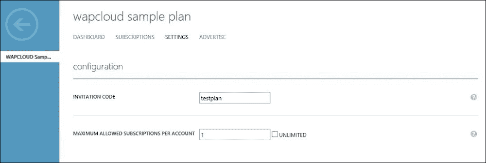
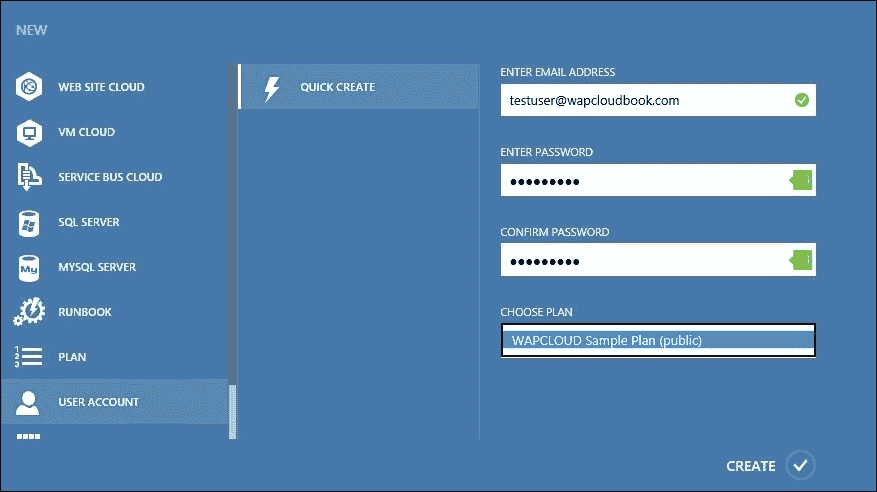

# 第五章. 分配云服务 – 计划、附加组件、租户账户和订阅

在上一章中，我们为基于 WAP 的云构建了虚拟机云和 IaaS 服务。在本章中，我们将继续学习如何将这些服务分配给租户，从而完成一个可用的云解决方案。我们将涵盖租户订阅所需的云计划的规划与实施，此外还将讨论附加组件、租户的订阅以及租户的用户账户管理。

本章将涵盖以下主题：

+   Windows Azure Pack 计划和附加组件 – 概述与规划

+   创建和管理 Windows Azure Pack 云计划及附加组件

+   创建和管理租户的用户账户

+   租户订阅 – 概述与管理

# Windows Azure Pack 计划和附加组件 – 概述与规划

Windows Azure Pack 计划，也称为托管计划，是根据租户的协议或合同协议，分配云服务提供给租户的一种机制。这些协议或合同会考虑到多种服务、配额、可用资源数量、服务质量等因素。云提供商根据协议或云服务战略创建和配置计划；租户订阅计划，以便访问已配置的云服务。一个计划通常包含一组可用的服务，以及定义的限制或限制条件。

一个计划可以被多个具有相同需求的租户订阅。一个计划可能由多个资源提供者服务组成，例如 **虚拟机云**（**IaaS**）、网站和 **服务总线**（**PaaS**）、**数据库**（**DBaaS**）或其他自定义服务。

租户在未订阅至少一个计划之前无法访问云服务。根据需求，他们可以订阅多个计划。当租户用户订阅 WAP 计划时，会生成一个新的订阅，专门为该租户使用。该订阅用于标识和访问租户在云中的资源。

通常，计划还会与服务的定价进行映射。可以创建多个具有不同定价方案和服务的计划。可以使用多种计费适配器或解决方案，配合 WAP 计划为云服务提供商定义的定价提供云服务。

附加组件用于为计划提供额外的功能和限制，例如为使用额外数量的虚拟机或计算资源提供额外的配额。附加组件与计划链接，只有当租户具有有效的计划订阅时，才能订阅这些附加组件。

一个附加组件可以链接到多个计划。

## 规划 Windows Azure Pack 云计划

Windows Azure Pack 计划，提供 IaaS 服务，使用虚拟机云时只能配置一个 SCVMM 服务器和 SCVMM 云。也就是说，如果云服务提供商有多个 SCVMM 标签或云，那么必须为这些云单独创建计划。这也是前一章中建议保持单一或较少数量 SCVMM 云的原因之一。

在讨论 WAP 计划的规划之前，先来看一下我们可以在使用虚拟机云资源提供者的 IaaS 服务计划中添加的所有选项或配置：

+   **服务或资源提供者的服务**：一个计划可以包含一个或多个资源提供者的云服务，例如 IaaS（虚拟机云）、DBaaS（SQL/MySQL）、网站或任何自定义资源提供者。

+   **VMM 管理服务器和 VM 云**：使用虚拟机云的 WAP 计划提供 IaaS 服务，并与 VMM 管理服务器和 VMM 云相对应。对于其他管理服务器或虚拟机云，需要单独创建计划。

+   **使用限制**：WAP 计划可能包含以下资源使用限制：

    +   虚拟机数量

    +   CPU 核心

    +   RAM（MB）

    +   存储（GB）

    +   虚拟网络数量

    +   每秒 MB 网络流入和流出

    +   每个网络的站点到站点 VPN

    +   存储 IOPS

    这些限制必须与 SCVMM 中配置的云级限制一致。

+   **网络**：这里的网络指的是在 SCVMM 中创建的逻辑网络。可以根据性能和功能要求（如隔离、虚拟化网络等）将租户限制在某一特定网络中。所有网络都在 SCVMM 架构中创建和配置。

+   **硬件配置文件**：硬件配置文件包含虚拟机的硬件配置选项，如 CPU/RAM 的数量等。在 WAP 计划中，硬件配置文件直接指代在 SCVMM 中创建的硬件配置文件。在为租户配置独立虚拟机时，这些硬件配置文件可供使用。根据业务决策，计划中可能包含多个硬件配置文件，以便为租户提供虚拟机大小上的灵活性。

+   **模板**：这里的模板直接指的是在 SCVMM 中为 WAP 独立虚拟机提供的虚拟机模板。根据业务决策，计划中可能包含多个模板，以便为租户提供不同种类虚拟机的灵活性。有关虚拟机模板规划的更多信息，请参见前一章。

+   **画廊**：在画廊中，云服务提供商可以选择为租户提供哪些画廊虚拟机角色资源。根据业务决策，计划可以包含多个画廊，以便为租户提供灵活性，涵盖不同类型的虚拟机和应用程序。有关画廊资源规划的更多信息，请参见第四章，*构建虚拟机云和 IaaS 服务*。

+   **附加设置**：这允许云服务提供商配置是否将此处提到的某些操作提供给租户。

    +   创建、查看和恢复虚拟机检查点（也称为 Hyper-V 虚拟机检查点或快照）

    +   保存虚拟机状态

    +   将虚拟机存储到库中并从库中部署

    +   连接到虚拟机的控制台（Azure Pack 控制台连接）

+   **自定义设置**：这允许云服务提供商为租户及其资源配置此处提供的自定义设置：

    +   禁用租户的内置网络扩展

    +   使用模板定义计算机名称

    +   为所有虚拟机启用保护

### 注意

针对其他资源提供者（如网站和数据库）配置 WAP 计划，接下来的章节将涵盖这些资源提供者及其构建服务。

### 规划 Windows Azure Pack 计划

云解决方案中计划的数量及其配置取决于云服务提供商的商业决策或战略、提供的服务以及在云服务和资源可用性方面的能力。通常，可以创建多个计划，提供不同的服务和资源能力。例如，战略上，计划可以以多种方式设计，如下所示：

+   **标准包计划或公共计划**：这类计划是预配置的，包括特定的服务提供和限制，并具有定义的定价模型。可以创建多个计划，针对不同的行业、公司规模或使用场景。例如，专为托管小型网站服务设计的计划可能包括最多 5 个虚拟机、2 个数据库等 IaaS 资源，而专门为托管应用服务器设计的计划可能包括最多 50 个 Windows 或 Linux 虚拟机。

+   **定制计划**：当标准计划不符合特定组织的需求时，可以创建定制计划，并根据商业协议为特定组织配置服务和限制。

+   **具有特殊服务或功能的计划**：可以为特殊功能或服务创建单独的计划，例如某些自定义应用服务或功能，包括备份或灾难恢复。

+   **财务**：根据任何先前策略创建的所有计划都可以映射到定价；因此，每种类型的计划中可以创建多个计划，以适应根据商业决策制定的不同定价。

## 规划 Windows Azure Pack 云插件

插件与计划相关联，并在计划中配置的服务之上提供额外的功能。插件是可选的，租户可以根据需求订阅。插件仅增加配额或启动计划中的服务；它们不能用于提供计划中未包括的额外服务。配额为计划中提供的服务设定了限制。

可以创建多个附加组件并将其与计划关联。附加组件可以像计划一样进行规划，包括公开使用的标准包、为定制租户需求设计的自定义附加组件以及为特定功能设计的专用附加组件。

# 创建和管理 Windows Azure Pack 计划和附加组件

Windows Azure Pack 云管理员可以使用 WAP 管理门户创建和管理计划或附加组件。在创建计划或附加组件之前，云提供商必须规划并决定他们配置的计划和附加组件数量。

## 创建 WAP 计划

让我们执行以下步骤来创建 WAP 计划：

1.  登录 WAP 管理门户作为管理员。

1.  导航到**计划**工作区。

1.  点击**创建新的托管计划**。创建 WAP 计划

1.  为托管计划提供一个友好的名称；默认情况下，这个名称将在租户注册时可见。创建 WAP 计划

1.  选择要在计划中提供的服务或资源提供者类型。创建 WAP 计划

1.  选择要与计划关联的任何**附加组件**。这也可以稍后配置。

1.  点击勾选框以创建计划。

1.  默认情况下，任何计划都以私有状态创建。必须手动将其更改为**公开**，才能供租户使用。

1.  点击**名称**计划以开始配置所选服务的计划。创建 WAP 计划

1.  WAP 门户将显示计划仪表板，说明它尚未配置。点击屏幕底部的**虚拟机云**以开始配置。也可以使用**添加服务**按钮添加其他服务。创建 WAP 计划

1.  选择要与计划关联的**VMM 管理服务器**和**虚拟机云**。创建 WAP 计划

1.  选择适用的**使用限制**。在配置这些设置时，考虑 VMM 云级别的限制。门户将根据 SCVMM 云级别配置的限制显示可用的配置。创建 WAP 计划

1.  将在 SCVMM 中创建的逻辑网络添加到计划中，以供订阅此计划的租户使用。

1.  将硬件配置文件添加到计划中。这些硬件配置文件将在租户请求独立虚拟机时可供选择。

1.  将 VM 模板配置文件添加到计划中。这些 VM 模板将在租户请求独立虚拟机时可供选择。

1.  将画廊项目添加到计划中。这些画廊项目将在租户请求 VM 角色资源时可供选择。

1.  配置额外设置以允许租户特定的操作和自定义设置以启用附加功能。

1.  点击**保存**以完成计划配置。

1.  可以以类似方式创建其他计划。

## 发布、配置、宣传和克隆 WAP 计划

现在，我们已经配置了一个计划，用于向租户提供云服务。在开始分配计划给租户之前，先回顾一下关于计划的一些管理操作。

默认情况下，发布计划时，新创建的计划处于私有模式，即租户无法看到并订阅。为了使计划对租户可见，必须先发布计划：

+   **发布计划**：选择**计划**并点击**更改访问权限**将计划设为公开。也可以通过类似的方式停用计划或将其设为私有。

+   **设置**：此页面包含其他配置项，例如：

    +   **邀请码**：此代码可用于在租户注册计划时验证其身份。云服务提供商可以创建邀请码并与租户共享。租户没有此代码将无法订阅该计划。

    +   **每个帐户最大允许的订阅数**：这定义了一个帐户可以使用该计划的最大订阅数。这样，用户可以多次订阅该计划。

    

+   **广告**：可以使用此页面配置本地化的计划广告。可以通过此页面修改租户可见的计划显示名称和描述：

    +   默认情况下，WAP 使用计划名称作为显示名称，可以通过编辑广告按钮进行修改。

    +   可以通过**添加广告**按钮创建额外的本地化广告，并提供本地化设置、显示名称和描述。

    +   可以通过 WAP 门户直接将计划发布到 Microsoft Web 托管画廊，或通过将计划导出为 XML 并手动上传该 XML 文件进行发布。

    

+   **克隆计划**：Windows Azure Pack 计划可以被克隆，以创建具有预配置的现有计划设置的新计划。克隆的计划将按照原计划的设置预配置所有内容，包括广告等。以下步骤用于克隆计划：

    1.  登录 WAP 管理门户并浏览到**计划**工作区。

    1.  选择要克隆的计划，并点击底部窗格中的**克隆**。

    1.  提供一个新的计划名称并点击**完成**以克隆该计划。克隆后的计划将出现在**计划**工作区中。

    

## 创建和管理附加组件

按照以下步骤创建附加组件：

1.  登录 WAP 管理门户并浏览到**计划**工作区。

1.  转到**附加组件**标签页。

1.  点击**创建新附加组件**以提供附加组件。

1.  为附加组件提供一个友好的名称。此名称将显示给租户。

1.  选择**服务**，插件将扩展。请注意，插件将要链接的计划必须提供这些服务。

1.  点击插件名称开始配置设置。

1.  对于使用 VM 云插件的 IaaS，按照原始配置计划选择**VMM 管理服务器**和**VMM 云**。

1.  配置插件将提供的使用限制。

1.  添加此插件将提供的额外网络、硬件配置文件、模板和画廊项目。

1.  根据需要选择额外和自定义设置。

1.  点击**保存**以使用定义的设置配置插件。

1.  额外的插件可以以类似方式创建。

以下插件管理操作可以按计划和操作的方式执行：

+   使插件公开或私有

+   添加或删除服务

+   克隆插件以创建新的插件

+   插件在特定计划上可以订阅的最大次数

+   广告配置

## 将插件链接到计划

按照以下步骤将插件链接到计划：

1.  登录 WAP 管理门户并浏览到**计划**工作区。

1.  转到**插件**标签。

1.  选择插件并点击底部窗格中的**链接计划**按钮。

1.  选择插件需要链接的计划。

+   点击**完成**以将插件链接到计划。

# 创建和管理租户的用户账户

在 Windows Azure Pack 租户门户注册时，租户必须提供电子邮件地址和密码。这将在 Windows Azure Pack 目录中为租户创建账户（适用 ASP .Net 或 ADFS）。

租户用户账户可以通过以下两种方式在 Windows Azure Pack 中创建：

+   它们可以由租户的自助注册操作创建

+   它们可以由云管理员创建

## 为租户创建用户账户

创建租户用户账户的以下步骤应执行：

1.  登录 WAP 管理门户进行管理员操作。

1.  浏览**用户账户**工作区。

1.  点击**创建新用户**。

1.  提供用户详细信息，包括电子邮件地址、密码和订阅计划。请注意，公开的计划仅在此处可用。

1.  租户现在可以使用此账户登录租户门户并使用所选计划下的服务。

管理员可以对用户账户执行额外的操作，例如：

+   暂停账户

+   重置密码

+   删除账户

### 注意

请注意，当使用任何其他身份验证和联合服务（如 ADFS）时，所有与租户用户账户相关的操作不适用。这些仅适用于 WAP 内置的 ASP .Net 提供程序用户账户。

## 配置通知设置和规则

Windows Azure Pack 提供通知功能，用于标准用户账户管理操作，如下所示：

+   通过向用户的电子邮件地址发送验证链接来验证用户的电子邮件账户

+   向用户发送新密码

+   向用户发送重置密码的链接

可以根据需求创建额外的规则。激活任何规则之前，必须先配置 SMTP 设置，因为通知需要邮件服务器来向租户的用户发送电子邮件。让我们来看看配置 SMTP 设置和通知规则的步骤：

1.  登录到 WAP 管理员管理门户。

1.  浏览**用户账户**工作区，然后是**设置**标签。配置通知设置和规则

1.  点击**添加新的 SMTP 设置**。

1.  添加服务器地址和端口号。

1.  选择**认证**类型（基本或匿名）。

1.  如适用，提供连接 SMTP 服务器时使用的用户名和密码。配置通知设置和规则

配置通知规则，请执行以下步骤：

1.  登录到 WAP 管理员管理门户。

1.  浏览**用户账户**工作区和**规则**标签。配置通知设置和规则

1.  点击任何现有规则以配置设置或添加规则来创建新规则。

1.  配置该规则的邮件设置，如下所示：

    +   启用状态：是或否

    +   回复邮件地址：如果租户希望回复自动生成的电子邮件，将使用该地址

    +   邮件主题：通知消息的邮件主题

    +   邮件正文：云服务提供商可以根据需求修改现有模板

    +   使用的 SMTP 账户

可以以类似方式创建和配置额外的通知规则。管理员可以使用发件箱标签查看发送给用户的所有通知。

## 配置额外的账户管理设置

WAP 门户中用户账户工作区的**配置**标签允许云服务提供商根据自己的选择对用户账户进行通用控制：

+   **要求密码强度**：弱/一般/强

+   **租户自助服务订阅管理**：启用或禁用

    这允许云管理员选择租户是否可以以自助服务的方式订阅计划（使用邀请码），或者是否必须通过云管理员进行订阅

+   **账户验证要求**：是/否

    此设置需要相应的通知规则和 SMTP 设置来进行配置

+   **忘记密码启用**：是/否

    此设置需要相应的通知规则和 SMTP 设置来进行配置

# 租户订阅 – 概述与管理

订阅是定义租户访问计划的对象，用于标识租户在云中的资源和访问权限。当租户注册任何计划或附加服务时，将创建订阅。

订阅是租户用户与计划访问之间的一对一映射。一个订阅只能附加到一个计划，而单一租户可以有多个订阅。Windows Azure Pack 为租户提供自助服务访问，允许他们创建和管理订阅，操作由云管理员定义。在本主题中，您将从云管理员的角度学习订阅管理；租户的视角将在下一章讨论。

## 订阅管理操作 – 管理员

Windows Azure Pack 管理门户允许对订阅进行管理操作，这些操作可以由云管理员执行。可以执行以下管理操作：

+   查看每个计划或整个云的所有订阅列表

+   显示订阅中资源使用情况的仪表板

+   挂起或删除订阅

+   将订阅从一个计划迁移到另一个计划

+   向任何订阅添加共同管理员（租户）

+   将任何附加组件与订阅关联

以下步骤是进行订阅管理操作所需执行的：

1.  登录到 WAP 管理门户以进行管理员操作。

1.  浏览**计划**工作区和**订阅**标签。

1.  所有**订阅**将在 WAP 云中显示。

1.  可以通过底部面板中的按钮执行订阅管理操作。操作包括以下内容：

    +   **挂起订阅**

    +   **将订阅迁移到不同的计划**

    +   **删除订阅**

1.  点击订阅名称以获取订阅使用情况的仪表板。

1.  额外的共同管理员可以通过**管理员**标签创建。

1.  可以通过**附加组件**标签映射附加组件。

## 向租户的用户账户添加新订阅

通常，当租户注册任何计划或附加组件时，订阅会自动创建。云管理员也可以根据需要为现有或新租户用户创建额外的订阅。

执行以下步骤为现有租户账户添加新订阅：

1.  登录到 WAP 管理门户以进行管理员操作。

1.  浏览**用户账户**工作区。

1.  点击用户账户，为现有账户添加新的订阅。可以使用**添加用户**按钮创建新用户。

1.  点击用户账户将显示与该租户用户关联的订阅。

1.  可以使用**添加订阅**按钮创建额外的订阅。

# 摘要

在本章中，您了解了向前几章创建的租户提供云服务的方式。我们涵盖了 Windows Azure Pack 托管计划和附加组件的规划及其实施。您还学习了租户账户和订阅的用户账户管理。

在本章的结尾，我们已经准备好了云解决方案，并配置了包含租户使用计划的 IaaS 服务。在下一章中，我们将作为云租户（也称为客户）访问此解决方案。我们将体验云服务的提供和管理操作。
