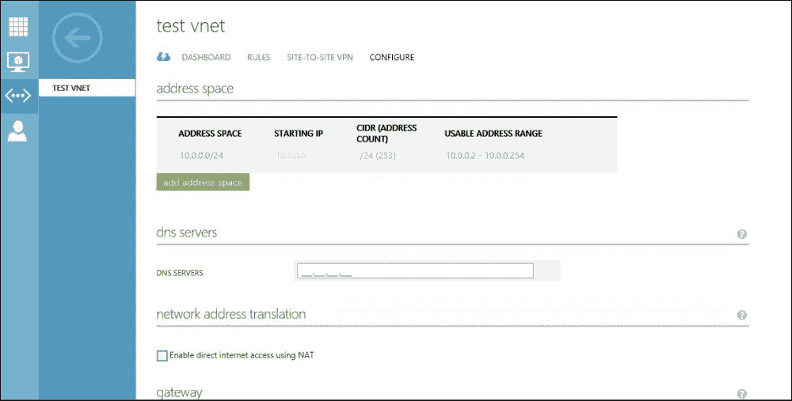

# 第六章：体验云服务 —— 租户的视角

在经历了五个硬核技术章节后，本章节将变得轻松且富有奖励。在本章节中，我们将从客户或租户的角度查看我们之前部署的云设置。我们将通过订阅我们之前创建的计划来注册一个新的租户，并随后请求和管理订阅计划中提供的云服务。

我们将涵盖以下主题：

+   租户注册和账户管理

+   创建和管理虚拟网络

+   独立虚拟机——配置和管理

+   虚拟机角色——配置和管理

# 租户注册和账户管理

如上一章节简要介绍，租户有两种方式可以注册使用 Windows Azure Pack 中的云服务。一种是租户自行注册并订阅，另一种是云提供商预先注册。

我们已经在上一章覆盖了第二种方法。在本章中，我们将体验第一种方法。

## 注册和计划订阅

以下步骤应按照指示进行，以注册租户和计划或附加服务订阅：

1.  登录到 Windows Azure Pack 租户门户。

1.  点击**注册**。

1.  提供电子邮件地址和密码，然后点击**注册**。这将在 Azure Pack 云目录（ASP.NET 提供商）中创建一个账户。

1.  注册成功后，门户将显示管理门户导览。

1.  要使用任何云服务，租户必须先订阅一个计划。在**我的账户**页面底部点击**新建**按钮来订阅计划。

1.  云提供商发布的公共计划将在这里显示。选择**计划**以订阅并提供**邀请代码**以验证其真实性。

    订阅将开始创建，可能需要几分钟才能完成。

1.  订阅创建后，租户将能够看到根据计划中配置的服务提供的其他选项和工作区。

1.  订阅 ID 可以在**我的账户**工作区的**订阅**标签下找到。

1.  可以通过底部窗格中的**更改名称**按钮为订阅分配一个友好的名称。

1.  通过导航到 **新建** | **我的账户** | **添加附加服务**，订阅该计划中可用的附加服务。

## 租户账户和订阅管理操作

租户的管理员可以通过租户门户以自助服务方式对账户和订阅执行以下管理操作：

+   可以查看活动订阅的列表和状态

+   可以查看订阅和附加服务下的资源当前使用情况和使用限制

+   它可以上传管理证书，以便使用基于证书的身份验证来访问分配的云服务。

+   它可以为订阅分配一个或多个联合管理员。

+   它可以订阅额外的计划或附加组件。

+   它可以删除订阅。

+   它可以删除账户。

现在，我们将详细查看之前提到的管理操作：

+   查看列表、状态、使用情况，删除活跃订阅和附加组件：

    按照以下步骤执行这些操作：

    1.  使用租户管理员账户登录租户门户。

    1.  浏览**我的账户**工作区并点击订阅。

    1.  所有与账户关联的订阅将显示出来，包括订阅 ID、名称、状态、计划和注册日期。

    1.  点击**删除**按钮以删除任何现有的订阅。

    1.  点击**订阅 ID**以查看与证书相关的使用情况和限制。

    1.  点击**附加组件**选项卡以对附加组件执行类似操作。

    租户账户和订阅管理操作

+   **上传管理证书**：租户可以将管理证书上传到 WAP 租户门户，这些证书可以在租户使用租户 PowerShell 或 API 登录时用于验证其真实性。

+   可以使用租户门户的**我的账户**工作区中的**上传证书**按钮上传管理证书。租户账户和订阅管理操作

+   **添加联合管理员**：可以使用 WAP 租户门户为任何订阅添加额外的管理员。这允许多个用户登录并请求/管理分配给租户的云服务：

    +   可以在租户门户的**管理员**选项卡下的**我的账户**工作区中添加额外的管理员。租户账户和订阅管理操作

    +   点击**添加**按钮以添加新的联合管理员。提供用户 ID 并选择要关联的订阅。租户账户和订阅管理操作

    +   同一页面可以用来添加更多联合管理员或编辑/删除现有管理员。

+   **删除账户**：删除账户会删除所有相关联的订阅。在门户的**我的账户**工作区浏览，可以找到删除账户的选项。

# 创建和管理虚拟网络

租户可以根据自定义需求创建虚拟网络。虚拟网络可以根据租户的选择具有任何 IP 范围，也可以用于在租户现有的数据中心和 Windows Azure Pack 云网络之间建立站点到站点的 VPN 连接。VNet 还允许虚拟机使用**网络地址转换（NAT）**。租户可以创建多个相互隔离的虚拟网络。

Windows Azure Pack 虚拟网络由 Hyper-V 网络虚拟化和 SCVMM 提供支持。

## 创建虚拟网络

按照以下步骤创建虚拟网络：

1.  使用租户的管理员账户登录租户门户。

1.  浏览**网络**工作区。

1.  点击**创建虚拟网络**。

1.  点击**快速创建**或**自定义创建**。

1.  提供虚拟网络名称和协议（IPv4 或 IPv6）。

1.  提供将在 VNet 中使用的 DNS 服务器 IP。提供 DNS 后，DNS 的 IP 将自动分配给此虚拟网络下的虚拟机。此配置也可以稍后进行。

1.  选择附加选项，如**启用通过 NAT 访问互联网**或**配置站点到站点 VPN**，根据需要选择。

1.  选择**地址空间**，并根据租户的选择进行子网划分。

1.  新创建的虚拟网络现在将在**网络**工作区下可见，并已准备好供虚拟机使用。

### 注意

在 Windows Azure Pack 租户门户中请求任何资源时，会提供**快速创建**和**自定义创建**或**从图库中选择**三个选项。**快速创建**会使用一些默认值来创建资源请求，而无需询问租户用户的详细信息，**自定义创建**则允许租户根据需要自定义请求。

## 管理和扩展虚拟网络。

租户的管理员可以使用租户门户对预创建的虚拟网络执行以下管理和扩展操作：

+   它可以虚拟网络 IP 使用。

+   它可以添加额外的地址空间。

+   它可以配置 DNS 服务器 IP。

+   它可以启用或禁用 NAT 或站点到站点 VPN。

+   NAT 规则。

+   它可以配置站点到站点 VPN。

+   它可以下载站点到站点 VPN 配置脚本。

### 注意

配置 DNS 服务器 IP 将允许虚拟网络内外的虚拟机之间进行 DNS 名称转换。任何配置了 VNet 连接的虚拟机，都会根据 VNet 配置自动配置 DNS 服务器 IP。站点到站点 VPN 将允许在云的虚拟网络与租户本地数据中心的本地网络之间建立混合云网络连接。为任何虚拟机启用**NAT**（**网络地址转换**）将允许虚拟机的私有 IP 与公共 IP 进行 NAT 转换，从而可以通过互联网访问。查看更多关于 Windows Azure Pack 混合云网络的信息，请访问[`blogs.technet.com/b/privatecloud/archive/2013/11/20/hyper-v-network-virtualization-architecture-and-key-concepts.aspx`](http://blogs.technet.com/b/privatecloud/archive/2013/11/20/hyper-v-network-virtualization-architecture-and-key-concepts.aspx)。

执行管理操作时，应该遵循以下步骤：

1.  使用租户的管理员账户登录租户门户。

1.  浏览**网络**工作区，然后点击网络进行管理。

1.  **DASHBOARD**将显示虚拟网络的详细信息，如状态、网络 ID、外部 IP 和网关 IP，以及虚拟 IP 的使用情况。

1.  **RULES**页面允许租户创建和管理所有针对公共互联网的虚拟机的 NAT 规则。

1.  **SITE-TO-SITE VPN**允许租户配置和管理 Cloud VNET 与租户本地网络之间的站点到站点 VPN 连接。

1.  **CONFIGURE**页面允许租户添加或修改地址空间和 DNS 服务器。它还允许配置站点到站点 VPN 或 NAT。

1.  本地 VPN 配置脚本可以从**networks**工作区快速启动菜单下载。

# 独立虚拟机 – 配置和管理

独立虚拟机允许租户管理员根据云服务提供商在计划中配置的内容创建和管理虚拟的 Vanilla OS 虚拟机。云服务提供商在计划中添加的所有虚拟机模板将在创建独立虚拟机菜单中向租户显示。

## 创建独立虚拟机

要创建独立虚拟机，必须按照以下步骤操作：

1.  使用租户管理员账户登录租户门户。

1.  点击底部窗格中的**NEW**按钮，然后选择**STANDALONE VIRTUAL MACHINE**。

1.  点击**QUICK CREATE**或**FROM GALLERY**，根据需要选择。

1.  选择可供租户使用的模板或磁盘。点击对象将显示云管理员配置的描述。

1.  提供虚拟机名称、密码和产品密钥（如适用）。

1.  选择此虚拟机需要附加的网络。新创建的虚拟网络将在下拉列表中显示。

1.  现在，**CREATE VIRTUAL MACHINE**操作将开始。虚拟机将在操作完成后列出在门户中的虚拟机工作区。

## 管理操作 – 独立虚拟机

租户的管理员可以使用租户门户对独立虚拟机执行以下管理操作：

+   查看虚拟机的状态和资源使用情况

+   使用控制台或 RDP 连接到虚拟机

+   暂停、重启、关闭、启动、停止和删除虚拟机

+   创建、查看和恢复检查点

+   修改虚拟机大小

+   向虚拟机附加额外的设备，如网络适配器、磁盘和 DVD

接下来的基本操作可以通过在虚拟机工作区中选择虚拟机来访问。

诸如虚拟机资源使用情况仪表盘和其他高级操作等附加操作可以在**samplevm** | **DASHBOARD**下进行。

**配置**页面允许租户修改虚拟机配置，例如**虚拟机大小**，以及为虚拟机附加设备，如网络、DVD 和磁盘。

# 虚拟机角色 – 配置和管理。

虚拟机角色使租户能够以便捷的方式扩展和缩放虚拟机及其应用程序。一个虚拟机角色可以包含一个或多个相同类型的虚拟机。请参阅第四章，*构建虚拟机云和 IaaS 服务*以了解更多关于虚拟机角色的信息。

## 创建虚拟机角色

创建虚拟机角色时，需要按照以下步骤操作：

1.  使用租户管理员账户登录租户门户。

1.  点击底部面板的**新建**按钮，然后点击**虚拟机角色**。

1.  点击**快速创建**或**从画廊创建**，根据实际情况选择。

1.  选择画廊项以部署虚拟机角色。

1.  提供虚拟机角色名称并选择其版本。请注意，这不是虚拟机的名称或主机名。所有虚拟机实例将以此虚拟机角色名称展示。

1.  提供虚拟机配置，例如虚拟机大小、磁盘、IP 地址类型、网络、主机名模式、域或工作组设置等（如适用）。

1.  提供扩展设置，如**初始实例数量**、**最小实例数量**和**最大实例数量**。

1.  **创建虚拟机角色**操作将开始。虚拟机角色将在门户的虚拟机工作区下列出，成功配置后。

## 管理操作 – 虚拟机角色。

租户管理员可以通过租户门户执行以下管理操作以管理虚拟机角色：

+   它可以查看虚拟机角色的状态和资源使用情况。

+   它可以查看虚拟机角色下虚拟机实例的列表。

+   它可以通过控制台或远程桌面协议（RDP）连接到虚拟机。

+   它可以暂停、重启、关机、启动、停止和删除虚拟机。

+   它可以查看单个虚拟机实例的状态和资源使用情况。

+   它可以进行虚拟机角色的扩展和缩放。

+   它可以创建、查看和恢复检查点。

+   它可以修改虚拟机角色配置（这将影响虚拟机角色下的所有虚拟机实例）。

+   它可以为虚拟机附加额外的设备，如网络适配器、磁盘和 DVD。

+   它可以删除虚拟机角色。

虚拟机角色的管理操作分布在四个页面或类别中，如下所示：

+   **虚拟机角色仪表板**：**仪表板**页面可用于快速查看虚拟机角色和资源使用情况，如下所示：

+   **实例**：**INSTANCES** 页面列出了在所选虚拟机角色下的所有虚拟机实例。可以选择每个虚拟机实例进行虚拟机特定的操作，这些操作都在相同的独立虚拟机角色中进行。

+   **规模**：**SCALE** 页面可用于根据云提供商或租户管理员在创建虚拟机角色时定义的设置来进行虚拟机角色的扩展和缩减。扩展虚拟机角色将部署额外的虚拟机，使用虚拟机角色的设置。扩展和缩减可以通过简单地将滑块向左或向右移动来执行。

    将扩展滑块向左或向右移动，然后点击保存以执行虚拟机角色的扩展或缩减。

    

+   **配置**：**CONFIGURE** 页面可用于修改在虚拟机角色配置期间所选的虚拟机角色设置。请注意，只有在虚拟机角色中部署的新虚拟机才会使用新的设置进行配置。任何现有的虚拟机必须重新创建，才能使新设置生效，除非手动修改。

# 概述

在本章中，我们体验了从租户的角度进行 IaaS 云服务的配置和管理。我们通过 WAP 的自助服务门户注册了一个新租户，并订阅了之前创建的计划。我们创建了虚拟网络、独立虚拟机和虚拟机角色。您还了解了关于网络和虚拟机的管理操作，例如修改网络和扩展或缩减虚拟机角色。

在下一章中，我们将继续构建**PaaS**（**平台即服务**）云服务，包括网站和服务总线服务。
