# 第七章：交付 PaaS——WebSites 云和服务总线

在本章中，我们将重点介绍 **PaaS**（**平台即服务**）云服务的 Windows Azure Pack 版本。PaaS 使租户和组织能够在云提供商的平台上开发、运行和管理他们的应用程序，而无需担心基础设施层，如硬件或操作系统。

在本章中，我们将讨论 Windows Azure Pack 中的两大 PaaS 服务，包括 WebSites 和 Service Bus。WAP 网站云可以供组织和云提供商用来向内部业务部门和租户提供网站托管服务。WAP 网站云支持多种编程语言，如 ASP.NET、PHP 和 Node.js。

WAP 网站与 Azure WebSites 一致工作。租户负责他们网站的开发和管理，而平台的责任由云服务提供商承担。

虽然这看起来像是 IT 开发人员的内容，但本章仅面向 IT 专业人员。我们将专注于构建一个可靠的平台，能够以多租户方式托管成千上万的高密度网站。任何网站开发或编程都将在相同的传统 Web 开发服务机制中进行，并且不会成为 Windows Azure Pack Websites 云的一部分。

WAP 的另一个 PaaS 服务是 Service Bus，它提供可靠且可扩展的消息传递服务。应用程序可以使用该服务传递消息或信息。

在本章中，我们将涵盖以下主题：

+   Websites 云概述及其功能

+   规划 WebSites 云平台

+   准备安装 Windows Azure Pack Websites 云

+   安装和配置 Websites 云

+   Websites 云——管理操作

+   Websites 云——租户体验

+   Windows Azure Pack 服务总线

+   安装和配置 Service Bus 云集群

# Websites 云概述及其功能

Windows Azure Pack 中的 Websites 云使组织和服务提供商能够为其内部或外部租户提供高密度的 Web 托管服务。WAP Websites 云为租户提供一个平台，用于开发和运行他们的网站。

WAP 网站旨在以 Web 规模提供服务，托管成千上万的网站，具备灵活性和可扩展性，在可扩展性、精细控制和计量方面具有能力。WebSites 云平台通过结合 Windows 服务器、IIS、SQL 数据库以及许多第三方和开源技术构成。

## 从服务提供商的角度看 WAP 网站功能

Windows Azure Pack 网站提供与 Microsoft Azure 网站类似的体验，后者是全球最大的网页托管服务提供商之一。该网站服务基于分布式架构，提供可扩展性，并消除了任何单点故障。让我们看看 WAP 网站云为服务提供商提供的功能和特性：

+   **高密度和可扩展性**：WAP 网站设计为可以在单一农场中运行数万个及更多网站，并具有灵活的扩展决策。服务提供商可以从一个小型农场开始，根据需求在后期添加更多资源，而不会中断服务。

+   **多租户**：WAP 网站服务本质上是多租户的，并为租户提供隔离服务、细粒度的控制和自助服务。还可以为租户提供保留服务器（即专用服务器）。

+   **简单且更快的部署和管理**：简便性是当今 IT 解决方案的关键要求之一。WAP 网站易于部署、管理和扩展，且不繁琐。

+   **自动化和自助服务**：WAP 网站提供自动化平台和网站部署功能，以自助服务的方式为云管理员和租户提供服务。

+   **应用程序和框架支持**：WAP 网站支持广泛的框架和编程语言，无需额外的管理负担。这包括微软和第三方框架以及开源技术。WAP 网站支持的框架和技术有 ASP.NET、经典 ASP、PHP、Node.js 等，并且支持使用 GitHub、Bitbucket、Dropbox 和 Team Foundation Server 的源代码控制。除了应用程序和编程语言支持外，它还提供了一个 Web 应用库，里面有预配置的网站模板和应用程序模板。

+   **灵活的服务级别**：默认情况下，Windows Azure Pack 网站提供多个服务级别，如共享或专用服务器供租户选择。客户可以根据需求在共享模式和保留模式之间选择网站的规模。

+   **细粒度的服务质量和计量**：Windows Azure Pack 网站计划提供细粒度的服务质量控制。这确保了租户即使在共享模式下运行，也能根据合同获得所需的资源。所有这些服务级别都通过强大的计量机制来实现费用返还。

+   **可靠的分布式架构**：WAP 网站在分布式架构中工作，分布在多个角色和服务器上，具有完整的冗余性，消除了任何单点故障。

+   **虚拟化平台无关性**：网站云服务要求运行 Windows Server 2012 或 2012 R2 操作系统，这可以在任何支持的虚拟化平台或物理服务器上托管。

### 注意

尽管 Windows Server 2012 支持托管 WAP 网站服务器，但建议使用 Windows Server 2012 R2，并安装最新的 Windows 更新。

## 从租户角度来看 WAP 网站概述和功能

除了典型的云计算优势外，WAP 网站服务还为租户提供以下功能和好处：

+   **简单且更快速的网站配置和管理**：在传统的 IT 交付机制中，网站平台部署通常需要几天才能使网站上线。此平台部署包括基础设施级别的准备、操作系统和中间件或 Web 服务器部署。而使用 WAP 网站，租户只需几次点击即可将网站上线。这使租户能够更多地专注于网站开发，而非平台建设。

+   **可扩展性**：传统部署模型中的可扩展性是最具挑战性的方面。Windows Azure Pack 通过提供简单的横向扩展和缩减功能，仅需几次点击即可消除这一问题。租户可以仅在高峰时段或高峰日以非常简单且具成本效益的方式选择增加更多服务器。

+   **自助服务**：Windows Azure Pack 网站服务操作，如配置和管理，均通过易于使用的自助服务门户提供，从而消除了因人工操作而可能导致的任何错误和延迟。

+   **广泛的框架和编程选项**：租户可以根据自己的需求和选择自由选择开发框架。WAP 支持多种应用框架，例如 ASP .NET、PHP、Node.js 等。

+   **灵活的开发和部署工具**：WAP 支持多种开发和部署工具，包括 Visual Studio、FTP、WebDeploy、GIT、Bitbucket、Dropbox、Team Foundation Server 等。

+   **Web 应用画廊**：Windows Azure Pack 中提供的 Web 应用画廊包含多种预配置的网站模板和来自 Microsoft、第三方供应商以及开源的流行 Web 应用。租户可以利用这些资源更快速、高效地开发网站。

# WAP 网站 – 架构

网站云解决方案由多个角色组成，并运行在多个服务器上。所有服务器都基于 Windows Server 2012 R2（也支持 2012 版本）。整体解决方案利用了 Windows 服务器的功能，如动态**Windows 进程激活服务**、资源限流、IIS 等，以及 SQL 数据库和网站角色。让我们深入探讨 WebSites 云解决方案的架构组件。

## 网站云服务角色

基于 Windows Azure Pack 的网站云服务至少由六个服务器角色组成：

+   **WebSites 控制器**：此角色用于部署和管理其他角色。这是首个安装的角色，包含所有媒体、设置和用于部署及配置其他角色的配置。

+   **网站管理服务器**：此角色与 Windows Azure Pack 管理门户和 API 通信。它暴露了一个 **表述性状态转移**（**REST**）端点，WAP 使用该端点连接并与网站云平台通信。所有网站的供应操作通过此管理服务器执行。

+   **Web 工作者**：此角色承载并运行租户的网站。网站的客户端请求仅由 Web 工作者处理。Web 工作者服务器可以以共享模式或专用模式工作。在共享模式下，一个 Web 工作者角色处理多个租户的网站请求，而在专用模式下，它专门为单一租户服务。

+   **前端角色**：此角色接受客户端请求，将其路由到工作角色进行处理，并将响应返回给客户端。一个前端服务器可以将请求路由到多个 Web 工作者角色，并具有负载均衡能力。前端服务器还负责 SSL 终止。

+   **文件服务器**：文件服务器是一个基于 Windows 的文件服务器角色，用于存储托管网站内容的文件。这些文件包括所有托管在网站云中的网站的应用程序和数据内容。网站使用 Windows 文件服务器的文件服务器资源管理器功能来管理网站的托管文件。

+   **发布者角色**：此角色通过 FTP 客户端、Visual Studio 和 WebMatrix 将内容发布到网站的农场。发布者角色使用 FTP 和 Web Deploy 协议。租户使用发布服务器上传并发布其网站内容。

## WAP 网站 – 数据库角色

就像其他任何 Microsoft 产品一样，WAP 网站云平台利用 Microsoft SQL Server 处理其数据库需求。WAP 网站的数据库需求可以分为三个类别：

+   **网站运行时数据库**：此数据库托管租户网站的运行时数据库和配置。它必须是基于 Microsoft SQL Server 的数据库。

+   **应用程序数据库或租户数据库**：此数据库由租户用于托管网站数据。这不是强制性要求，取决于租户的网站架构和需求。租户必须订阅 WAP 的数据库服务才能使用此功能。根据 Web 应用程序支持，它可以是基于 MS SQL 或 MySQL 的数据库。

+   **服务管理 API 数据库**：此数据库由 WAP 服务管理 API 用于存储配置信息。它与我们在 第三章 中配置 Windows Azure Pack 安装时使用的数据库相同，*安装和配置 Windows Azure Pack*。这必须是基于 Microsoft SQL Server 的数据库。

# 网站云平台规划

在本主题中，我们将讨论网站云平台的容量、弹性等方面的规划因素和最佳实践。

## 弹性规划

Windows Azure Pack 网站云解决方案可以通过在每个角色或层级添加冗余服务器来保护免受故障影响。为冗余添加额外服务器是一个相对简单的过程。

以下是每个角色的冗余建议：

+   **网站角色**：通过部署额外的服务器以提供冗余，可以保护此角色免受故障影响：

    +   **控制器服务器**：WAP 网站部署中最多可以配置两台控制器服务器，这提供了控制器层的高可用性。

    +   **管理和发布**：对于管理和发布角色，建议至少部署两台服务器来提供冗余。根据扩展需求，也可以添加更多服务器。

    +   **前端**：可以部署两台前端服务器以提供高可用性；然而，也支持部署多于两台前端服务器以满足容量和负载均衡需求。负载均衡器应配置用于前端服务器的客户端访问请求负载均衡。

    +   **Web 工作角色**：建议至少配置四个 Web 工作角色——两个用于共享托管，两个用于保留托管。根据扩展需求，可以部署更多工作角色。

+   **文件服务器**：建议在生产环境中为 WAP 网站云使用预配置的基于 Windows 的文件服务器集群。请注意，Sale-out 文件服务器集群不支持网站云使用，因为它需要文件服务器资源管理器才能运行。

+   **SQL 服务器**：对于生产环境，建议使用配置了 SQL 级集群技术的数据库服务器，如 SQL 服务器集群或 SQL 服务器 Always On。

还建议将网站云角色托管在虚拟机中，以利用高级的虚拟化可用性技术。

## 容量规划

Windows Azure Pack 网站云解决方案可以根据能力需求轻松进行扩展。以下指南在规划容量时提供了基本的设计考虑：

+   **网站角色**：

    +   **控制器服务器**：控制器服务器不需要太多的计算、网络或存储资源，因为它只用于配置其他角色。标准配置包括两个虚拟 CPU 和四个或八个 GB 的内存，以及足够的存储空间来托管操作系统。该控制器应满足这些要求。

    +   **管理**：此角色负责处理 WAP 与 WebSites 云之间的通信。除非启动多个同时的配置操作，否则此服务器不需要太多资源。

    +   **前端服务器**：前端服务器将所有网站的访问请求路由到工作节点。为了更好的负载均衡，建议部署多个前端服务器。根据 Microsoft 的指南，单个核心每秒可以处理 100 个请求。可以根据这个值来规划前端的计算能力，并将高峰时段作为一个附加因素来考虑。

    +   **发布服务器**：发布服务器通常只有在多个发布操作被租户发起时，才会经历较高的计算利用率。

    +   **Web 工作节点角色**：此角色是 WebSites 云中资源消耗最重的角色，因为所有网站都托管在这些服务器上。建议为 Web 工作节点角色部署多个服务器。Web 工作节点角色的内存需求需要根据单次活动中活跃网站的数量进行规划。根据 Microsoft 的建议，生产环境中每个网站的平均内存占用是 70 MB。建议根据常规活跃网站的数量以及高峰时段或日值来规划内存。

+   **文件服务器**：文件服务器托管运行在农场中的所有网站内容和应用程序，并且具有较高的磁盘 IO 强度。建议使用具有更高 IOPS 的磁盘来作为文件服务器。

+   **SQL Server**：根据 Microsoft 的指南，SQL 的内存应该按每 30,000 个预配网站分配 4 GB。建议预留更多内存，因为 SQL 性能主要取决于可用内存。每 10,000 个网站需要 4 GB 的磁盘空间。

## 网站服务器角色的域与工作组

Windows Azure Pack 网站角色可以在域环境和工作组环境中部署。建议在生产环境中使用加入域的服务器，以利用 AD 功能，如通过 Kerberos 进行安全认证、简化用户管理以及通过组策略实现更好的控制。工作组服务器可用于测试和开发环境。

# 准备 Windows Azure Pack WebSites 云的安装

在开始安装和配置 WAP 网站云之前，需要满足多个前提条件。我们来看一下这些条件。

## 准备 Windows 服务器

所有指定托管网站云组件的服务器必须运行 Windows Server 2012 或 2012 R2 操作系统。建议将服务器更新到最新的补丁。建议使用全新安装的操作系统。

在所有服务器上启用 Windows 远程管理。为发布服务器和前端服务器创建以下服务的入站访问防火墙规则：

+   文件和打印共享（SMB-In）

+   Windows 管理工具（WMI-In）

所有服务器的用户帐户控制必须禁用，以便进行远程操作。这可以通过添加以下注册表项来完成。添加该注册表项后，服务器必须重新启动：

`reg add HKLM\SOFTWARE\Microsoft\Windows\CurrentVersion\Policies\system /v LocalAccountTokenFilterPolicy /t REG_DWORD /d 1 /f`

### 提示

添加上述注册表键不会影响本地 UAC 配置。

## 准备 DNS 记录

Windows Azure Pack 网站需要 DNS 记录来执行以下操作：

+   **访问网站**：默认情况下，每个托管在 Windows Azure Pack 网站中的网站都包含一个由服务提供商配置的 DNS 后缀。该 DNS 后缀需要指向前端服务器，以进行网站的名称解析。例如，在网站云中，名为 'abc' 的网站使用 DNS 后缀 'xyz.com'，则其 FQDN 为 'abc.xyz.com'。服务提供商需要规划和决定 DNS 后缀，并在内部或公共 DNS 服务器中创建必要的区域。

+   **开发/发布**：此记录供租户上传和发布网站内容。为此，需要两个 'CNAME' 记录，它们指向发布服务器。

总体而言，以下 DNS 记录需要在 DNS 服务器中创建，以确保网站云的正常运行：

| 名称 | IP 地址 | 用途 |
| --- | --- | --- |
| * | 前端服务器 | 访问网站 |
| *.scm | 前端服务器 | 通过 Git 发布内容 |
| ftp | 发布服务器 | 通过 Web Deploy 或 FTP 发布内容 |
| publisher | 发布服务器 | 通过 Web Deploy 或 FTP 发布内容 |

## 为网站云数据库准备 SQL 服务器

使用 SQL 服务器进行网站云时，必须满足以下数据库配置要求：

+   SQL 版本必须是 SQL Server 2012 SP1 或更高版本。可以使用 Express 版本进行评估；生产环境中需要使用完整版。数据库服务器必须能够从所有节点访问。

+   必须根据设计配置必要的集群技术，如 SQL 集群或 Always On。

+   必须启用混合模式身份验证。

+   如果使用命名实例，SQL 浏览器服务需要手动启动，并且需要打开 1434 端口。

## 准备 SSL 证书

默认情况下，Windows Azure Pack 网站会为网站云生成并安装自签名证书。建议在生产环境中不要使用自签名证书。您可以使用内部 CA 为内部私有云颁发以下证书。对于服务提供商，建议从公共信任的 CA 获取 SSL 证书。

在 WAP 解决方案中需要以下两个 SSL 证书：

+   **默认域证书**：这些证书在访问网站和源代码管理时使用。由于该证书被所有租户的网站使用，因此它需要是一个通配符证书，并且必须是 `.pfx` 格式。该证书会放置在前端服务器上。根据服务提供商的命名约定，以下主题名称需要进行配置：

    +   `*.dnssuffix.com`

    +   `*.scm.dnssuffix.com`

+   **发布证书**：发布 SSL 证书用于为开发者提供安全通信，以便通过 FTP 或 Web Deploy 上传或发布网站内容。该证书需要放置在发布服务器上，并应根据服务提供商的命名约定包含以下 SAN 名称：

    +   `Publish.dnssuffix.com`

    +   `ftp.dnssuffix.com`

### 提示

用于默认域证书的通配符证书也可以用于发布，因为它包含相同的父域名。

## 准备文件服务器

Windows Azure Pack 网站支持独立部署和预配置的文件服务器集群或 NAS 设备。建议在生产环境中使用文件服务器集群或 NAS 设备，以实现高可用性和更好的性能。以下步骤是为 WAP 网站配置文件服务器集群所需的：

1.  配置文件服务器集群或 NAS 设备。

1.  创建用户帐户和组（用于文件共享所有者和用户）。

1.  启用 **WinRM**（**Windows 远程管理**）和 **FSRM**（**文件服务器资源管理器**）。

1.  使用标准文件服务器操作来提供内容共享和证书存储共享。

1.  将 `FileShareOwners` 组添加到文件服务器的本地管理员组中，以启用 WinRM。

1.  根据配置的用户帐户和组来配置共享的访问控制。

# 安装和配置网站云

Microsoft Web Platform Installer 用于下载和安装网站云组件。请参阅第三章，*安装和配置 Windows Azure Pack*，以了解更多有关 Web Platform Installer 的信息。

在开始安装之前，确认所有设计决策和规划已完成，并且前提条件已满足。

首先安装控制器服务器，之后它将用于安装和配置其他角色。控制器服务器的安装还会安装一个用于 Windows Azure Pack 网站的管理控制台，该控制台可以与 WAP 服务管理门户结合使用，以安装和配置其他服务器角色。

## 安装和配置控制器及管理服务器

以下步骤概述了控制器和管理服务器的安装和配置过程：

1.  登录到指定的 WebSites 控制器服务器。

1.  运行 Microsoft Web PI。

1.  搜索 Windows Azure Pack WebSites。

1.  选择 **Windows Azure Pack: WebSiteVersion2 Update 7**（本书写作时可用的最新版本）。

    ### 提示

    安装控制器服务器包括下载部署和配置其他角色所需的所有媒体。

    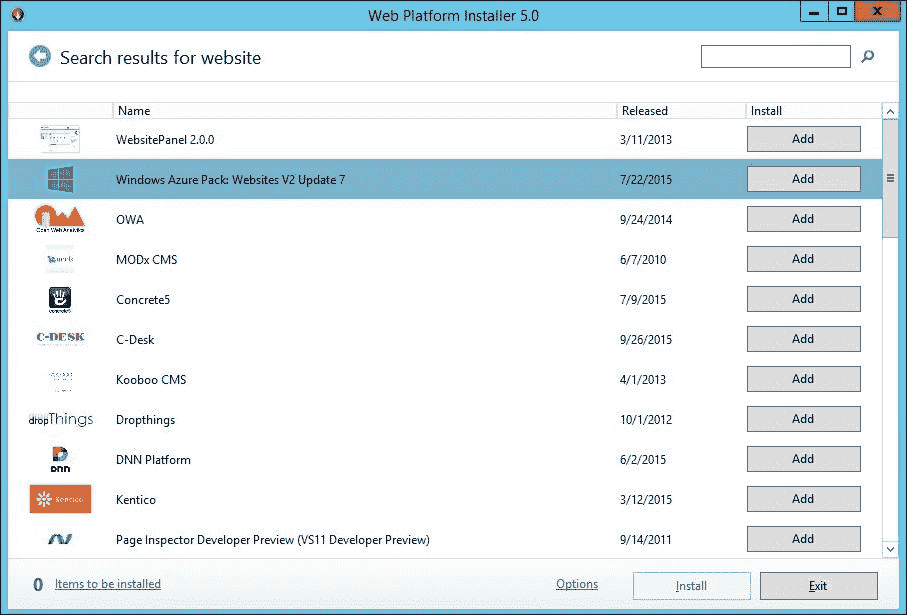

1.  点击 **安装** 以继续。

1.  WebSites 安装程序将自动下载、安装并启动。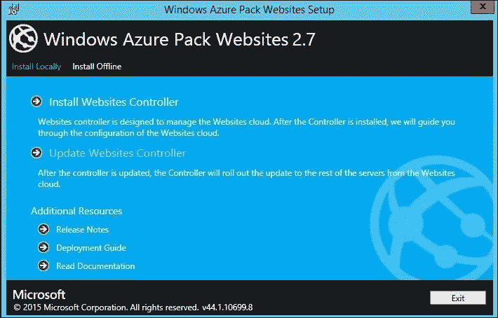

1.  点击**安装网站控制器**。

1.  接受协议并继续。

1.  验证所有需要安装的 Microsoft 和第三方组件。你可以选择本地安装，或将它们下载到另一台服务器进行安装。

1.  安装将继续进行；等待下载和安装完成。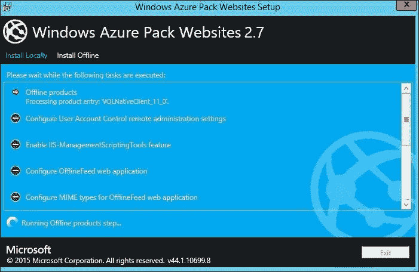

1.  点击**配置**以开始配置控制器部署。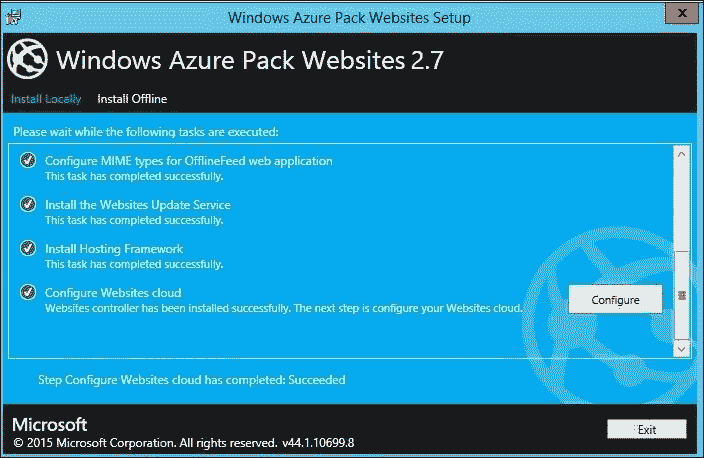

1.  点击**配置**将启动 Windows Azure Pack 网站管理控制台。所有其他网站角色可以通过此向导或 WAP 管理门户进行安装和配置。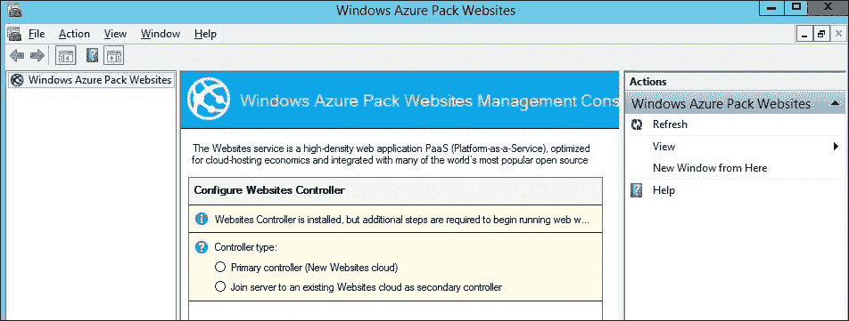

1.  选择**控制器类型**；由于我们正在部署第一个控制器服务器，它将在我们的案例中作为主控制器。

1.  选择**文件服务器类型**。选择文件服务器后，会显示额外选项，包括托管数据库配置和其他系统设置，如 DNS 后缀、凭据等。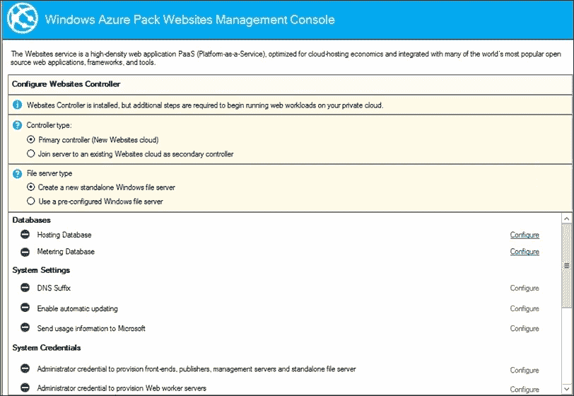

1.  输入托管和计量数据库的配置。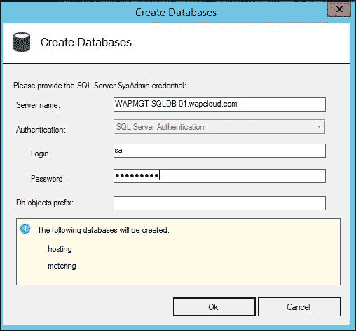

1.  提供 DNS 后缀和网站的自动更新，并将使用信息发送到 Microsoft 设置。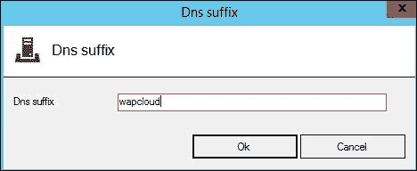

1.  提供以下系统凭据：

    +   用于配置网站云角色的管理员凭据，包括前端、发布者、文件服务器和管理服务器

    +   用于配置 Web 工作角色的管理员凭据

    +   文件共享所有者凭据

    +   文件共享用户凭据

    +   服务端点凭据（由 WAP 使用）

        这些用户帐户必须是目标服务器本地管理员组的成员

    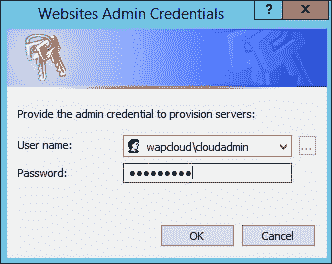

1.  输入独立或预配置的文件服务器详细信息。

1.  最后，输入服务器详细信息以配置管理角色。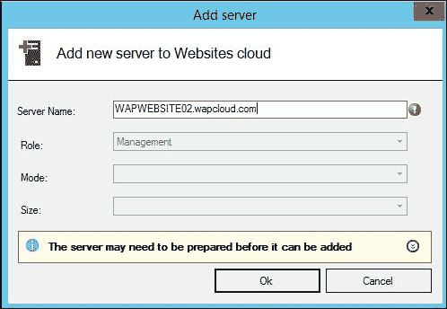

1.  网站云农场现已配置。控制器服务状态将在**Windows Azure Pack 网站管理控制台**中显示。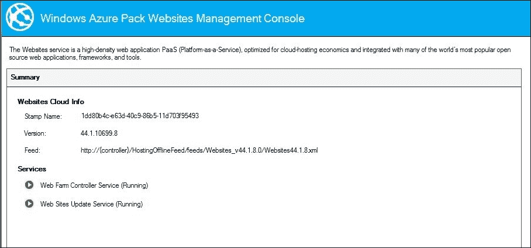

1.  **Windows Azure 网站管理控制台**现在可以用来修改任何现有配置或部署额外的服务器。在服务器控制台中验证服务器状态。如有任何问题，查看错误日志。

1.  可以通过选择添加额外的服务器来部署其他管理和控制器服务器。

## 使用 Windows Azure Pack 注册网站管理服务器

Windows Azure Pack 使用 WebSites 管理服务器的 REST 终结点来注册网站云资源提供程序和操作。执行以下步骤以向 Windows Azure Pack 注册网站云：

1.  登录管理员用的 Windows Azure Pack 管理门户。

1.  浏览**网站云**工作空间。

1.  点击**注册现有网站云 REST 终结点**。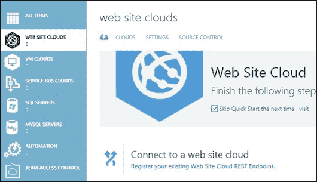

1.  提供云连接详细信息，包括显示名称、管理服务器地址和凭据（服务终结点凭据）。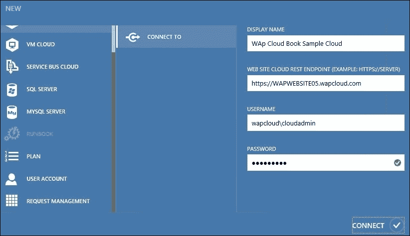

1.  注册的网站云现在将在 WAP 门户的**网站云**工作空间下可见。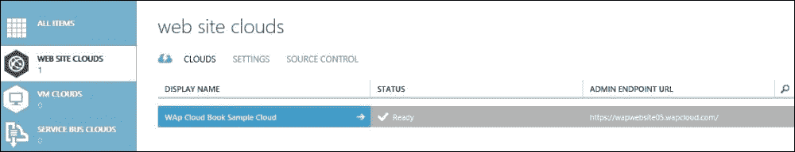

1.  Windows Azure Pack 门户现在可以用来配置其他角色和管理任务。

## 安装和配置前端、Web Worker 和发布者角色

剩余的网站云角色包括前端、Web Worker 和发布者可以使用安装在控制器服务器上的 Windows Azure Pack 服务管理门户或 WebSites 管理控制台进行安装和配置。在本书的演示中，我们将使用 WAP 服务管理门户。以下步骤概述了部署剩余网站云组件的过程：

1.  登录管理员用的 Windows Azure Pack 管理门户。

1.  浏览**网站**工作空间。

1.  打开新注册的网站云终结点。

1.  打开**角色**工作空间；这将列出当前网站云农场中配置的所有网站角色。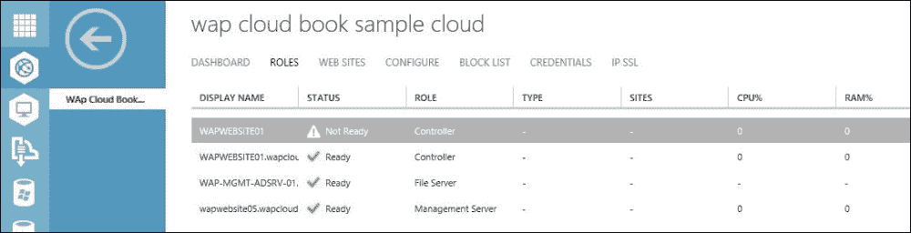

1.  点击**添加角色**以配置网站角色。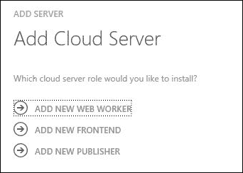

1.  选择**添加新的 Web Worker**以添加一个新的工作角色。

1.  提供一个工作角色服务器名称和配置，包括工作类型。**工作类型**包括以下内容：

    +   **共享**

    +   **预留 - 小**

    +   **预留 - 中等**

    +   **预留 - 大**

    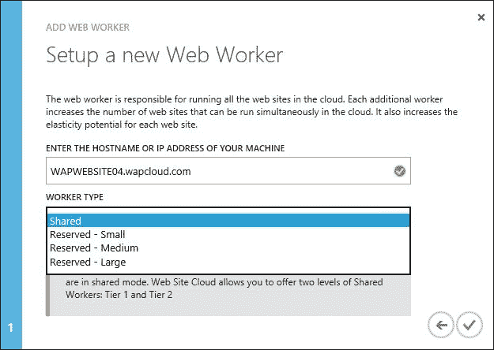

1.  现在将开始工作角色安装。WAP 门户显示安装的状态。

1.  通过提供主机名或分配给托管前端角色的服务器的 IP 添加一个新的前端。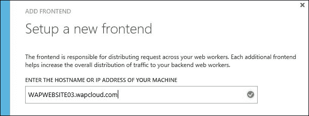

1.  只需提供主机名或指定用于托管前端角色的服务器的 IP 地址，即可添加新的发布者服务器。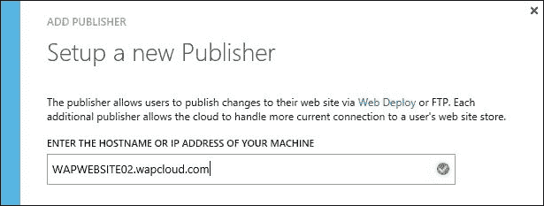

1.  可以通过类似的方式配置额外的服务器，以实现高可用性和更多功能。

1.  安装后，所有可用的服务器角色都可以在**网站云**工作区下的**角色**标签中列出。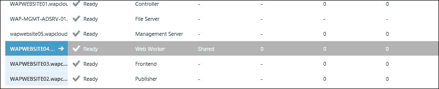

# 自定义 WebSite 云源代码控制和 Web 画廊源设置

源代码控制和 WebApp 画廊源设置是全局性的，适用于 WAP 站点云。所有网站和网站云集群都可以利用在 WAP 级别配置的源代码控制机制。WebApp 画廊源设置也是如此。

## 配置源代码控制

Windows Azure Pack 支持多个仓库用于网站的源代码控制。租户可以利用这些仓库来管理和发布自己的网站内容。

此设置在网站云中全局配置。

服务提供商需要首先在相应的源代码控制网站上注册，以便租户使用这些服务。支持以下源代码控制库：

+   Bitbucket

+   GitHub

+   CodePlex

+   Dropbox

配置源代码控制设置时，我们需要遵循以下步骤：

1.  登录 Windows Azure Pack 管理门户进行管理员操作。

1.  浏览**网站云**工作区。

1.  点击**源代码控制**。

1.  输入源代码控制网站的特定设置，例如客户端 ID、凭证等。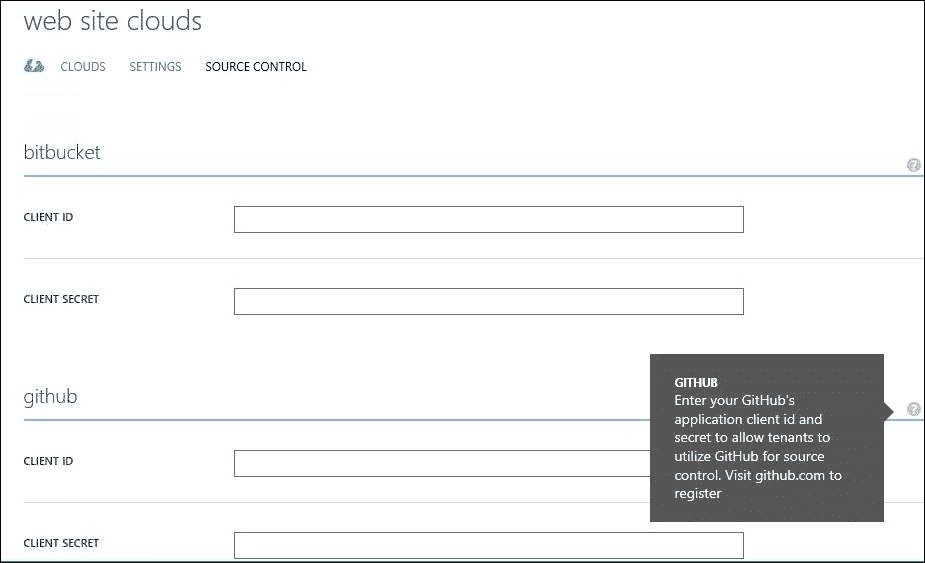

## Web 画廊源设置

Windows Azure Pack 与 Web App Gallery 完全集成，Web App Gallery 包含许多预配置的网站模板和 Web 应用程序。这使得客户可以更快速、更高效地部署顶级 Web 应用程序。默认情况下，Windows Azure Pack 网站云配置为 Microsoft 标准 Web App Gallery。云服务提供商还可以选择创建自定义的 Web App Gallery。以下步骤是更改 WAP 部署的 Web App Gallery URL 所需的步骤：

1.  登录 Windows Azure Pack 管理门户进行管理员操作。

1.  浏览**网站云**工作区。

1.  点击**设置**。

1.  默认情况下，配置了 Microsoft Web App Gallery 的 URL；可以通过此设置配置任何自定义的画廊源 URL。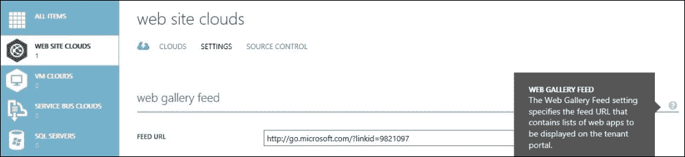

# 网站云 – 管理操作

Windows Azure Pack 管理门户为租户用户和云管理员提供自助服务体验。WAP 管理门户可用于执行对网站云集群的监控和管理操作，例如以下内容：

+   监控云集群和租户网站的利用率及可用状态

+   配置、监控以及启动或停止网站角色

+   自定义 WebSites 设置，如 SSL 和 DNS 记录

+   配置和管理封锁列表、IP SSL 和平台凭证

## 使用率仪表盘

WebSites 云的**仪表盘**页面提供了完整网站云农场的 CPU 和内存使用率图表。除了使用率，还可以通过**仪表盘**页面查看网站云的事件日志。

## 角色 - 配置和管理

**角色**页面使管理员可以执行以下操作：

+   提供和移除任何网站服务器角色

+   重启、修复并使任何服务器角色离线

+   查看服务器角色列表及其状态

以下步骤概述了访问角色页面的过程：

1.  登录到 Windows Azure Pack 管理门户进行管理员操作。

1.  浏览**网站云**工作区。

1.  选择要管理的网站云并访问**角色**标签。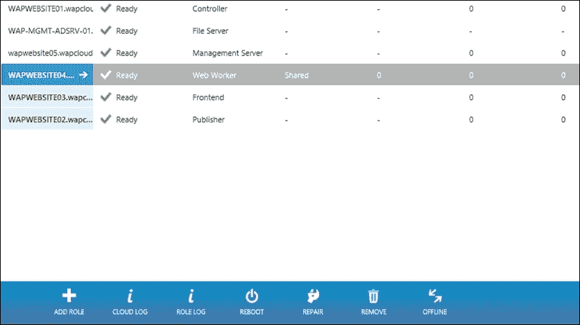

## WebSites – 监控和操作

网站页面使租户创建的网站可以执行以下操作：

+   查看和监控租户创建的所有网站

+   执行租户操作，如代表租户修改 .NET 框架版本

以下步骤概述了访问**角色**页面的过程：

1.  登录到 Windows Azure Pack 管理门户进行管理员操作。

1.  浏览**网站云**工作区。

1.  选择要管理的网站云并访问**网站**标签。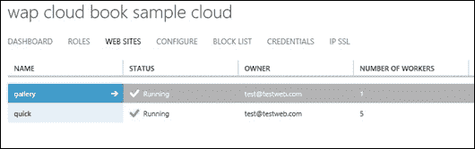

## 配置 WebSites 云设置

此页面可用于修改网站云设置，如 SSL 证书和 DNS 名称。

可以通过此页面自定义以下设置：

+   上传新的 WebSites 默认证书。默认情况下，所有 WAP 网站都配置有自签名的 SSL，这可能是一个安全隐患。使用此选项，云提供商可以上传由公开信任的 CA 签发的 SSL 证书供网站使用。通常，它会是一个包含网站域名的通配符证书。

+   可以启用、禁用或强制执行网站的 Windows 身份验证。

+   可以允许或不允许**自定义应用池身份**。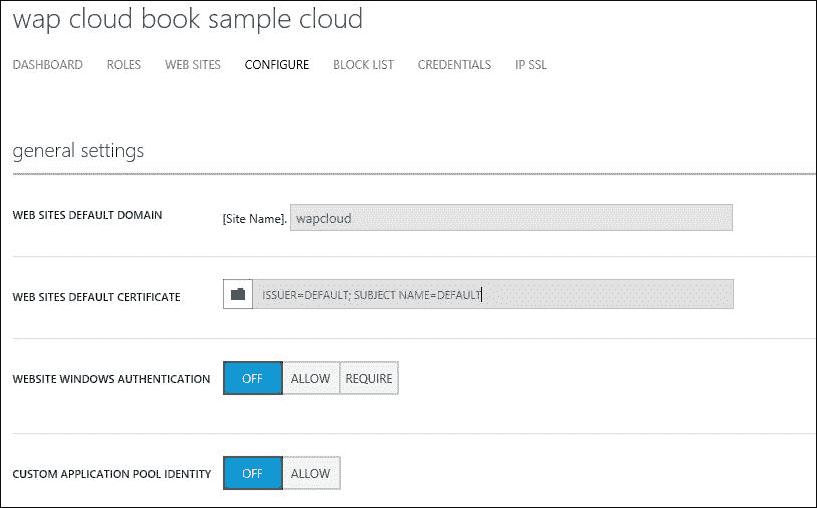

+   配置**发布设置**包括以下内容：

    +   Web 部署 DNS 记录

    +   FTP 部署 DNS 记录

    +   发布证书

    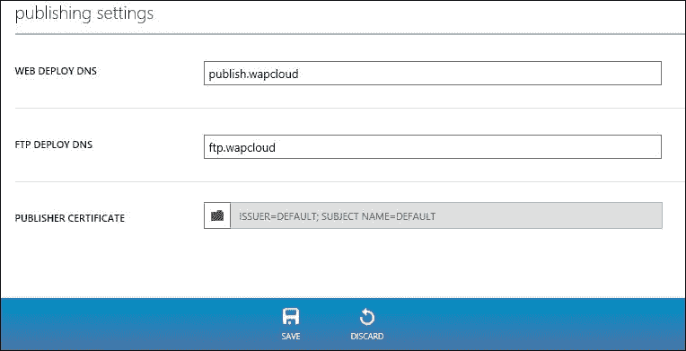

## 封锁列表 - IP 过滤

Windows Azure Pack 提供了强大的 IP 过滤机制，可用于防止**DOS**（**拒绝服务**）攻击。可以使用封锁列表阻止选定的 IP 或 IP 地址范围访问网站。此功能可以与防火墙设备结合使用，自动防止任何攻击。

以下步骤概述了阻止任何指定的 IP 范围访问网站的过程：

1.  浏览**封锁列表**标签。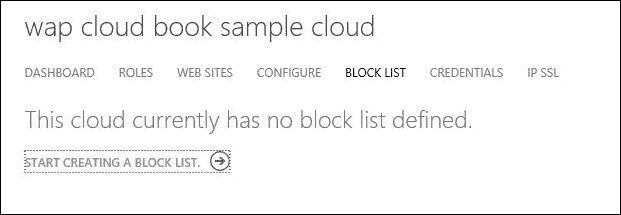

1.  点击**开始创建阻止列表**。

1.  输入要阻止的 IP 范围：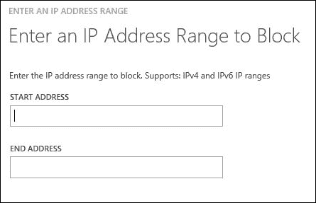

1.  此页面也可以用来创建额外的阻止列表，删除任何现有的阻止列表，或者上传 CSV 文件以阻止访问。

## 网站云平台凭证

**凭证**选项卡显示所有为网站云组件之间的身份验证和授权配置的凭证。这些凭证是在部署第一个网站控制器角色时定义的。通过选择凭证名称并点击底部面板的**编辑**，可以轻松编辑这些凭证。浏览网站云设置下的**凭证**选项卡以修改任何凭证。

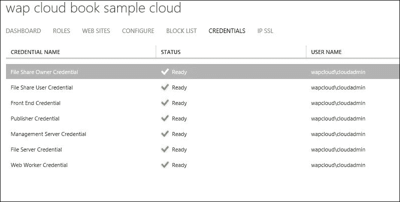

## 网站 IP SSL

租户的网站可以配置为使用基于 IP 的 SSL 证书，从而提供更加安全的网站访问机制。在这种情况下，服务提供商必须在所有前端服务器上配置所有特定于网站的 IP 地址。

网站云设置下的 IP SSL 页面可用于配置 VIP 和 VIP 之间的本地地址。VIP 设置及其端口映射也必须在负载均衡器设备上配置，以使 IP SSL 功能正常。

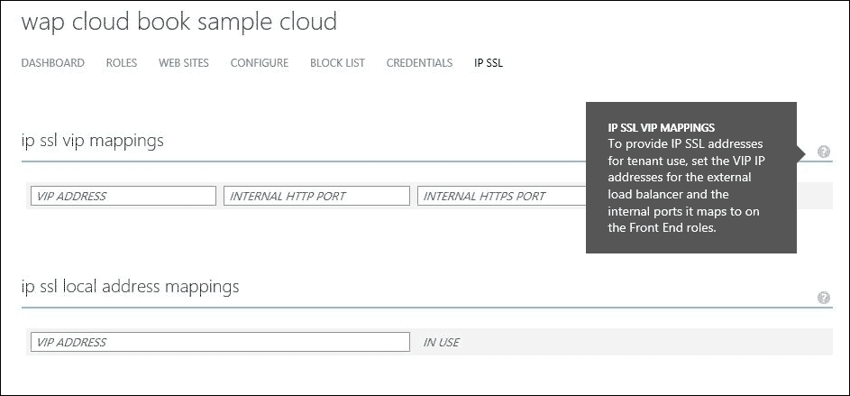

# 创建网站云计划

Windows Azure Pack 网站计划允许管理员为租户提供云服务，并对服务和资源（如 CPU 或内存）进行精细控制。可以从单一云农场创建多个计划，每个计划有不同的限制和功能。有关 Windows Azure Pack 网站计划的更多信息，请参见第五章，*分配云服务 - 计划、附加组件、租户账户和订阅*。

## 网站云计划概述和服务模型

WAP 网站计划被配置为提供三种服务模型：

+   介绍

+   基础

+   保留

对于每个计划，可以配置 17 项配额设置，其中包括订阅 CPU 时间、最大内存工作集等 QOS（服务质量）设置。

+   **介绍模式**：也称为免费模式。它为托管租户网站提供共享平台。这是一个入门级的服务，应该用于测试和开发目的。介绍模式下的租户网站可以根据需求升级为基础模式或保留模式。此模式不包含任何扩展能力。

+   **基础模式**：此模式也适用于共享模型，但比免费模式网站提供更好的性能。它为租户的网站提供低成本的托管服务，并具有生产就绪的特性，如便捷的扩展、定制 DNS 名称等。

+   **保留模式**：在保留模式下，租户的网站可以配置在专用资源上运行，如 CPU 核心、内存或带宽。与其他两种模式相比，这种模式提供了最高的性能。

服务提供商可以根据可用的平台能力和业务策略创建多个计划。基本上，计划可以通过两种方式进行配置：

+   **标准计划**：这些是公开提供的标准网站需求计划。

+   **自定义计划**：这些计划是根据特定租户的自定义需求和合同专门提供的。

## 为 WebSites 云服务创建一个计划

以下步骤概述了为租户提供 WebSites 云服务的 WAP 计划创建与配置过程：

1.  登录管理门户。

1.  浏览**计划**工作区。

1.  点击**让我们创建一个托管计划**。

1.  输入计划的友好名称。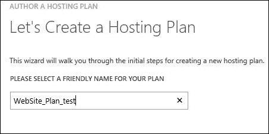

1.  在**计划服务**页面上选择**WEB SITES CLOUD**。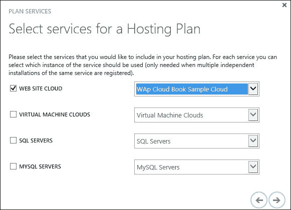

1.  如适用，选择附加组件。

1.  点击新创建的计划开始配置。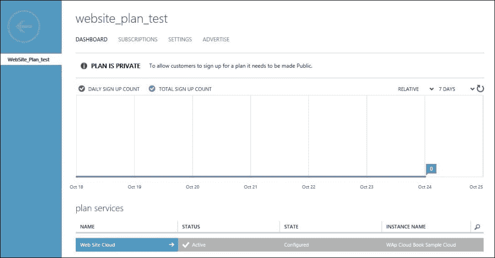

1.  在**计划服务**工作区下点击计划名称以开始定制。

1.  根据需求和业务策略配置额外的 QOS 和能力设置。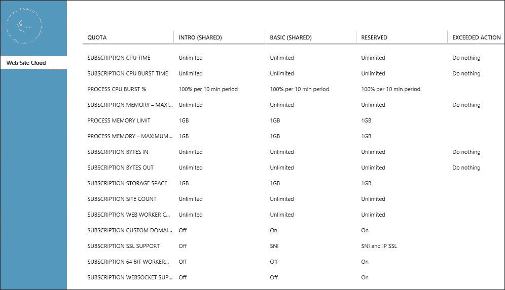

1.  保存更改并配置附加计划设置，如邀请码、广告、将访问权限更改为公开等。请参见第五章，*分配云服务 – 计划、附加组件、租户账户和订阅*，了解更多如何在 WAP 计划中执行这些操作。

# WebSites 云 – 租户体验

使用租户门户，租户可以以自助和自动化的方式配置和管理他们在 Windows Azure Pack Websites 云上的网站。在本主题中，我们将介绍租户在 WAP 网站配置和管理操作中的体验。

## 创建网站 – 快速创建与 Web 应用画廊

以下步骤概述了租户配置网站的过程：

1.  登录 Windows Azure Pack 租户门户。

1.  使用配置的邀请码订阅网站计划。

1.  **WEB SITES** 工作区在管理门户中不可见。

1.  点击**创建一个网站**以开始；根据选择和需求选择**快速创建**或**从画廊中选择**。请注意，云服务提供商预配置的 DNS 后缀已添加到 URL 中。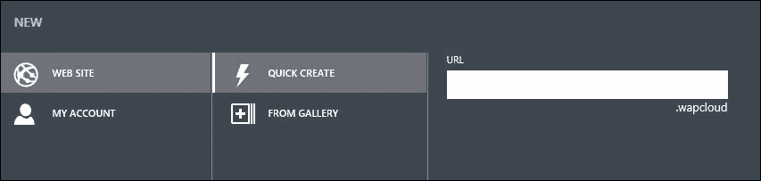

1.  网站将在片刻间创建并可供访问和进一步开发。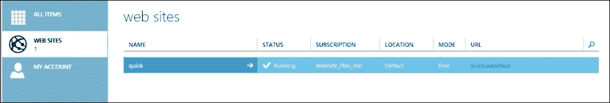

1.  点击**从画廊选择**将显示 Web 应用程序画廊，供用户选择预配置的网站模板和其他 Web 应用程序。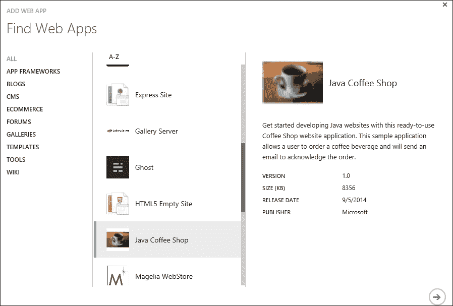

1.  租户可以选择自己喜欢的画廊项并继续操作。

1.  输入画廊项的特定值，包括 URL；然后，点击勾选标志部署网站。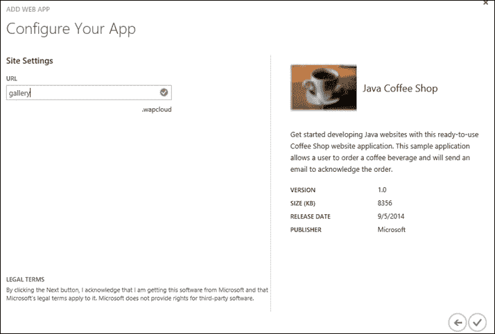

1.  现在，让我们尝试打开一个新创建的网站，名为`quick.wapcloud`。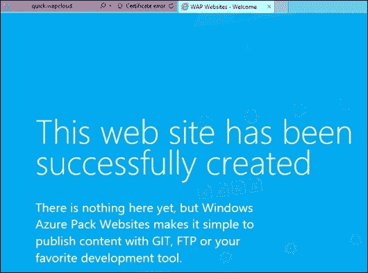

租户现在可以使用传统的发布工具，如 FTP 和 WebDeploy，或使用源代码控制机制，如 Git，向新创建的网站发布内容。

## 管理操作 - 租户的网站

Windows Azure 包为租户提供了自服务门户功能，租户可以在该门户上执行、监控和管理其网站。让我们看看租户可以进行的管理和监控操作。

使用租户门户中的**网站**工作区，租户可以执行以下操作：

+   浏览网站

+   停止网站

+   重启网站

+   删除网站

让我们看看租户可以进行的其他管理和操作：

+   **快速设置**：通过网站下的快速设置按钮，租户可以学习并执行以下配置：

    +   获取 WebMatrix 等工具

    +   发布应用程序

    +   设置从源代码控制的部署

    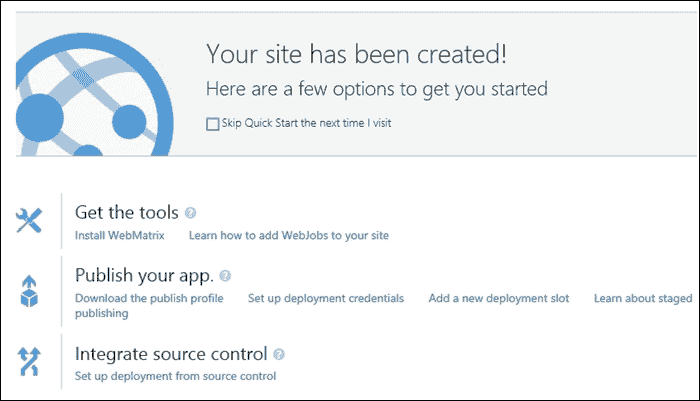

+   **仪表盘**：此页面显示网站的统计数据，例如 CPU、内存使用率、数据使用情况以及附加设置，如 VIP。可以在此页面上执行添加新的部署插槽操作。此页面还可以用于管理链接的资源，如数据库或存储。

+   **监控**：此页面显示网站的使用统计数据。还可以添加其他统计计数器，例如 HTTP 错误或成功的计数。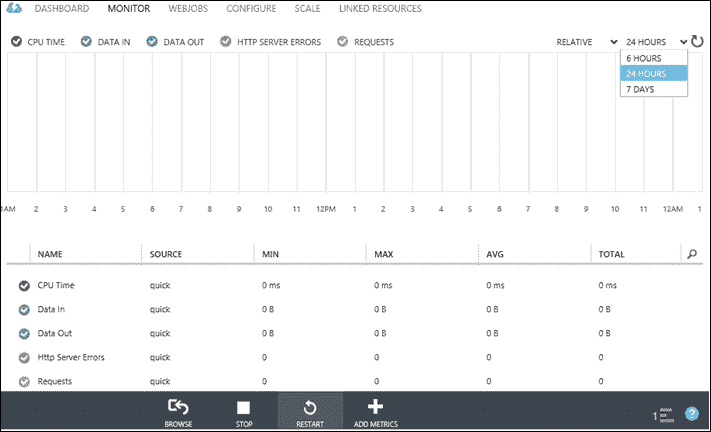

+   **WEBJOBS**：这使得租户能够在 WAP 网站云中为任何已部署的 Web 应用程序运行持续或按需的脚本。

    WAP 支持上传以下类型的文件到 WebJobs：

    +   `cmd`、`.bat`、`.exe`（Windows）

    +   `.ps1`（Windows PowerShell）

    +   `.sh`（Bash）

    +   `.php`（PHP: 超文本预处理器）

    +   `.py`（Python）

    +   `.js`（JavaScript）

以下步骤概述了配置和管理 WebJobs 的过程：

1.  在租户门户中浏览网站设置下的**WEBJOBS**选项卡。

1.  点击**添加作业**以添加新的 WebJob。

1.  输入**名称**WebJob，上传脚本文件，并配置执行类型（持续或按需）。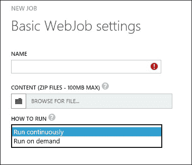

**CONFIGURE**选项卡允许租户为其网站选择平台和版本。这些项目的配置直接依赖于 Web 应用程序平台和架构，可能因部署而异。包括以下设置：

+   .NET 框架版本

+   PHP 版本

+   管理管道模式（经典或集成）

+   Windows 身份验证

+   自定义身份池

+   Web 套接字

+   SSL 证书

+   域名

+   SSL 绑定

+   应用程序诊断

+   网站诊断

+   额外的应用程序设置，如虚拟目录！管理操作–租户网站

网站设置中的**SCALE**选项卡允许租户执行以下操作：

+   在三种服务模型之间升级网站模式（入门、基础和预留）

+   扩展和缩减实例数量！管理操作–租户网站

租户部署的网站和 Web 应用程序可能需要额外的资源，如数据库或存储。**LINKED RESOURCES**选项卡允许租户将这些资源与网站关联。

# Windows Azure Pack Service Bus

Windows Azure Pack Service Bus 提供了一种可靠的消息传递服务，租户的应用程序可以使用它传递信息或消息。该服务与微软的公共云产品 Azure Service Bus 一致。应用程序可以托管在任何地方；即可以托管在提供商的云中、租户的本地数据中心或其他任何地方。

Windows Azure Pack Service Bus 可以被组织内部的开发人员用来在应用程序之间高效地传递消息。服务提供商可以将此作为服务提供给外部租户，从而支持云驱动的应用程序消息传递。

Windows Azure Pack 中的 Service Bus 提供了两种解决方案：

+   Service Bus 队列

+   Service Bus 主题

## 理解 Service Bus 队列

Service Bus 队列通过在两个应用程序之间添加一个 Service Bus 命名空间来提供负载均衡，这使得消息接收器可以根据自己的节奏和资源可用性接收消息。这样可以实现松耦合应用程序之间高效且可靠的消息传递。

还可以有额外的接收器，它们可以从相同的 Service Bus 命名空间接收消息。以下图表解释了 Service Bus 队列的工作机制。

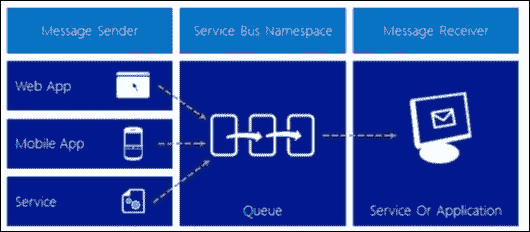

## 理解 Service Bus 主题

Service Bus 主题提供发布和订阅功能，可以被多个订阅者和接收器同时独立接收消息。订阅者还可以配置为仅接收经过筛选的消息。

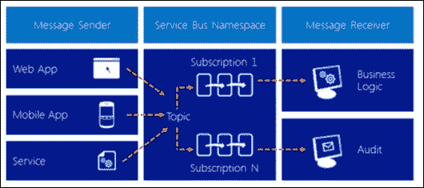

在主题中，不使用直接通信模型，而是使用一种单独的通信模型——*发布和订阅*。在此模型中，通信是通过一个中介（即主题）建立的。与队列相比，Service Bus 主题提供了更多功能，如一对多通信。主题允许租户执行大规模的消息传输，涵盖大量的用户、应用程序和设备。

## Service Bus 架构

Windows Azure Pack Service Bus 架构包含以下组件：

+   Windows Server 2012 或 2012 R2 操作系统

+   SQL Server 数据库

+   Windows Azure Pack Service Bus 1.1

+   Microsoft Windows Fabric

推荐以高度可用模式部署多个带 SQL 数据库的 Service Bus 服务器，以消除任何单点故障。此架构采用农场模型；可以在单个农场下部署多个服务器，提供弹性和负载均衡。

## 安装和配置 Service Bus 云农场

以下步骤是安装和配置 Service Bus 农场所必需的：

1.  登录到指定的安装 Service Bus 的服务器。

1.  下载并运行 Microsoft Web PI。

1.  搜索 Service Bus 并选择 **Windows Azure Pack Service Bus 1.1** 进行安装。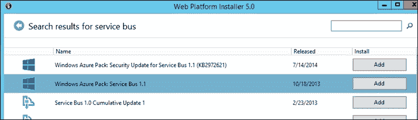

1.  按照以下 Web PI 指令安装 Service Bus 组件。成功安装后退出。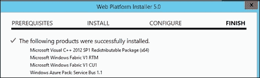

1.  通过开始菜单启动 Service Bus 配置应用。

1.  点击 **创建新农场**，根据需要选择默认或自定义设置。选择默认设置适合大多数部署模型。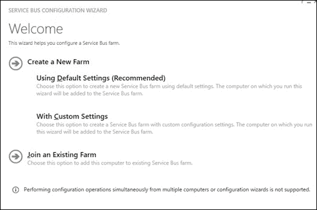

1.  输入数据库服务器名称和凭证；点击 **测试连接** 测试连接性。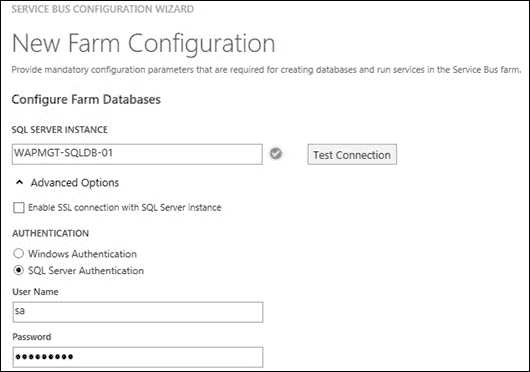

1.  输入服务帐户详细信息、证书和生成密钥（用于将新服务器添加到现有的 Service Bus 农场）。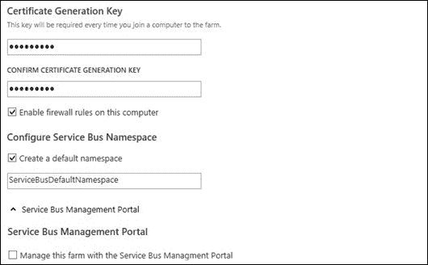

1.  提供 Service Bus 配置的默认命名空间。

1.  输入服务管理门户的访问凭证；这些凭证将用于 Windows Azure Pack 与 Service Bus 的通信。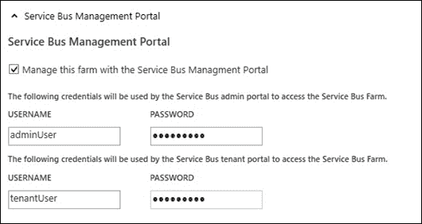

1.  查看摘要中的设置，并点击勾选按钮开始部署。

1.  配置过程将开始；监控日志以查看是否有任何错误。完成后，点击勾选按钮。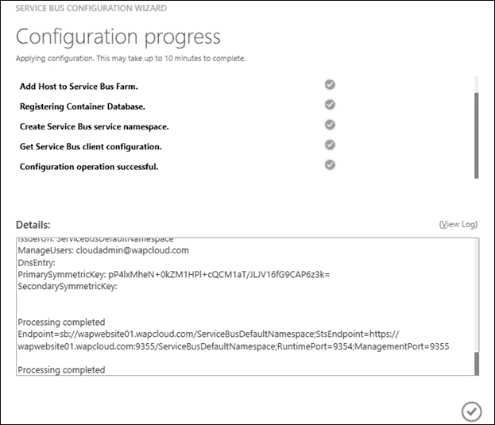

## 将 Service Bus 云注册到 Windows Azure Pack

以下步骤概述了将 Windows Azure Pack 与 Service Bus 云农场注册的过程：

1.  登录到 Windows Azure Pack 管理门户。

1.  浏览**Service Bus 云**工作区。将 Service Bus 云与 Windows Azure Pack 注册

1.  点击**连接到现有的 Service Bus 云**。

1.  在配置 Service Bus 云配置时，输入**SERVICE BUS CLOUD**端点和管理员及租户操作的凭证。

1.  注册成功后，新注册的 Service Bus 云将显示在**Service Bus 云**工作区中。将 Service Bus 云与 Windows Azure Pack 注册

## 编写 Service Bus 计划

与其他 Windows Azure Pack 云服务类似，租户也可以通过订阅由服务提供商配置的相关计划来使用 Service Bus。请参见第五章，*分配云服务 – 计划、附加组件、租户账户和订阅*，了解更多关于 Windows Azure Pack 计划的信息。以下步骤概述了编写 Service Bus 计划的过程：

1.  登录管理门户。

1.  浏览**计划**工作区，点击**创建新的托管计划**。

1.  为计划输入一个友好的名称。

1.  选择**SERVICE BUS**和在**计划服务**中新注册的 Service Bus 云。创建 Service Bus 计划

1.  配置其他计划设置。请注意，没有配额或其他可配置的设置。Service Bus 云适用于所有用户的共享模型，没有每个用户的配额或限制。编写 Service Bus 计划

## Service Bus – 租户的体验

本主题讨论了租户从租户角度进行 Service Bus 操作的体验。租户必须订阅一个 WAP 计划，该计划配置了提供 Service Bus 服务。

### 配置和访问 Service Bus 命名空间及功能

以下步骤需由租户执行，用于配置、使用和管理 Service Bus 命名空间：

1.  登录 Windows Azure Pack 租户门户。

1.  订阅为 Service Bus 服务提供配置的 WAP 计划。

1.  浏览**Service Bus**工作区。配置和访问 Service Bus 命名空间及功能

1.  点击**创建命名空间**开始创建命名空间。配置和访问 Service Bus 命名空间及功能

1.  创建成功后，命名空间将在门户中可用。

1.  点击**连接信息**了解关于命名空间的连接机制。配置和访问 Service Bus 命名空间及功能

1.  命名空间的**配置**标签允许租户配置和管理访问策略以及用于授权的主密钥和次密钥。配置和访问 Service Bus 命名空间及功能

### 创建主题和队列

WAP 门户的**新项目**工作区用于创建新的队列或主题。以下步骤可用于创建和管理主题和队列：

1.  点击 WAP 租户门户底部的**NEW**按钮。

1.  选择**SERVICE BUS**。

1.  根据您的选择和需求，选择**QUEUE**服务或**TOPIC**。

1.  为创建所需项目提供名称和命名空间。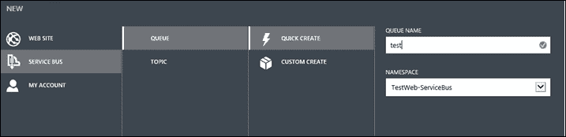

1.  成功配置后，新的队列或主题将在选定命名空间下的相应标签页中可见。选择任何已配置的主题或队列，查看其仪表板，其中包括利用率状态和连接性相关信息。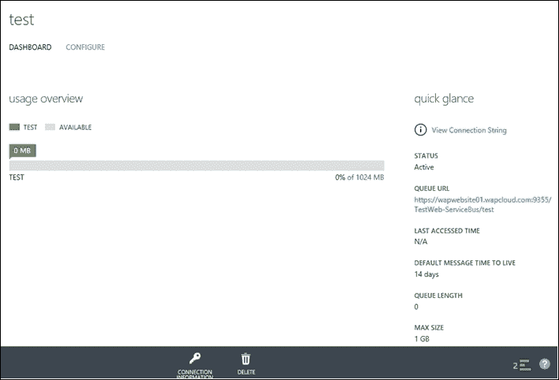

# 总结

本章介绍了两个主要的 PaaS 云服务——WebSites 和 Service Bus。您学习了这些服务的规划、部署和租户体验。

在下一章，我们将继续学习 Windows Azure Pack 的另一个云服务——DBaaS 的规划和部署。
