# 第八章：提供数据库即服务

在云计算服务模型中，数据库即服务提供应用程序和网站所需的关系型数据库，用户无需关心其基础设施和中间件层。开发人员或应用程序所有者只需以自助方式创建数据库。这大大减少了交付时间，并使组织能够更多地专注于应用程序。

Windows Azure Pack 支持多种数据库服务器和版本，包括 Microsoft SQL Server 和 MySQL，以集成和自助的方式进行管理。通过稍加努力，几乎可以交付所有在 Hyper-V 上支持的数据库。

在本章中，我们将讨论以下主题：

+   Windows Azure Pack DBaaS 产品概览

+   规划 DBaaS 平台架构

+   实现 SQL DBaaS

+   实现 MySQL 资源提供者架构

+   SQL 和 MySQL DBaaS 管理操作—服务提供商

+   启用数据库服务质量（QoS）—SQL 资源管理器

+   创建 DBaaS 计划

+   DBaaS - 租户体验

+   专用 DBaaS 产品

# Windows Azure Pack DBaaS 产品概览及其功能

Windows Azure Pack Express 原生包含 SQL 和 MySQL 的 DBaaS 资源提供者 API。此外，这两个 API 是 WAP 默认支持的唯一 DBaaS 资源提供者。

WAP DBaaS 产品在私有云和服务提供商云解决方案中提供以下功能和能力：

+   高密度且具弹性的 DBaaS 服务

+   默认支持 SQL 和 MySQL，并提供扩展能力以支持其他数据库产品

+   多租户和共享模型

+   服务质量与细粒度控制

+   自助服务和自动化

+   多种服务模型，包括共享和专用服务，支持 IaaS 和 PaaS

+   使用和计量

+   支持多种高可用性技术，如 Always On

从租户的角度看，WAP DBaaS 服务提供以下功能：

+   它以自助方式提供简单、快速的数据库提供和管理

+   它运行在隐形的基础设施和平台上；即无需担心硬件/操作系统/数据库服务器层的提供、管理或更新

+   它提供了关于数据库版本、规模和功能的多种选项

## 共享和专用数据库服务

根据业务需求和合规性，租户可能需要共享或专用数据库。在共享服务模型中，单一数据库服务器通常会托管来自多个租户的数据库。租户共享计算能力和其他资源以及数据库引擎。共享服务模型在公共云解决方案中非常常见，并被广泛使用。

对于专用服务，单个服务器或一组资源（包括硬件和软件）仅托管单一租户的数据库。专用服务的典型用例包括：

+   租户根据基础设施和软件的定制需求，这些需求在共享模式下无法提供或实现

+   与安全性或合规性相关的要求

+   定制的 QoS 要求及其他更多

虽然 Windows Azure Pack 中本地提供共享数据库服务，但可以通过 VM 角色和专用织物实现专用服务。我们将在接下来的主题中详细讨论这些内容。

## WAP DBaaS 的架构组件

Windows Azure Pack DBaaS 解决方案在共享模式下通常包括以下组件：

+   SQL 或 MySQL 数据库服务器和集群

+   Windows Azure Pack 服务器 SQL 和 MySQL 扩展 API 服务器

+   WAP SQL/MySQL 组、计划和租户订阅

+   任何其他与数据库服务相关的监控、管理或自动化解决方案，如 SCOM

WAP 资源提供者的 API 负责与数据库服务器的织物进行通信，用于管理和租户相关的配置操作。所有数据库由资源提供者的 API 创建和管理。

租户应用程序与数据库服务器之间的通信是直接的；也就是说，它不涉及任何 WAP 组件。

# 规划 DBaaS 平台织物

本主题将讨论 SQL 和 MySQL 数据库服务的共享 DBaaS 平台织物的规划。

## 规划数据库服务器的组

在 Windows Azure Pack 中，SQL 和 MySQL 数据库服务器都被分类到组中。一个组可以包含多个独立的或集群的数据库服务器，这些服务器可以是虚拟的或物理的。WAP 计划配置为通过组向租户提供云数据库服务。SQL 和 MySQL 组是独立工作的；也就是说，一个组不能同时包含 SQL 和 MySQL 数据库。

数据库服务器组以共享模式工作；也就是说，它们为多个用户或租户托管数据库，且为共享实例。

组织或服务提供商可以根据需求和策略规划创建多个组，例如，某个组用于提供高端数据库托管（在大小和性能方面），而另一个则可以是非 HA 组。

使用 Windows Azure Pack 数据库服务来满足私有云需求的组织，可能会根据工作负载或类型（如生产环境和**T&D**（**测试与开发**）环境）计划为 SQL 资源提供者创建多个组。以下是一些示例：

+   基于业务单元或部门的分类

+   根据关键性进行分类，这与织物的性能和可用性能力直接相关

+   为 T&D 应用程序或任何其他独立的专用数据库需求创建单独的组

+   为不同版本或功能的可用性创建单独的组，例如 DR、备份等

+   为不同的地理位置或数据中心创建单独的组

虽然大多数前述示例适用于服务提供商，但服务提供商可以选择根据以下内容创建组：

+   为租户创建独立和共享的数据库服务组

+   为提供高可用性的独立和集群服务器创建不同的组

+   根据性能和额外功能（如备份）将组分开

+   根据数据库大小划分；即为托管大型数据库和小型数据库创建不同的组

## 规划 SQL Server 的部署结构

Windows Azure Pack SQL 资源提供者支持以下 SQL 数据库服务器版本：

+   SQL Server 2014

+   SQL Server 2012 SP1

+   SQL Server 2008 R2 SP2 和 SP3

虽然几乎所有适用于 Microsoft SQL Server 部署的规划和最佳实践都适用，但可以遵循以下指南来创建 Windows Azure Pack DBaaS SQL 部署结构。请参阅 Microsoft 官方文档 [`msdn.microsoft.com/en-us/library/bb545450.aspx`](https://msdn.microsoft.com/en-us/library/bb545450.aspx) 了解更多关于 MS SQL 的信息：

+   **使用 SQL 可用性技术**：Windows Azure Pack SQL 资源提供者可以与以下类型的 SQL 数据库服务器一起部署。建议为 SQL Server 组使用 SQL 高可用性技术作为设计决策：

    +   独立 SQL Server

    +   SQL Always ON

+   **利用 SQL 资源治理器**：WAP 支持使用 SQL Server 2014 的资源治理器功能，为租户的数据库启用 QOS 控制

+   **使用虚拟机来托管 SQL Server**：使用虚拟机托管 SQL Server 虚拟机是个不错的主意，这样可以利用虚拟化层的高可用性和其他技术，如迁移性

+   **附加要求**：WAP 要求在 SQL Server 中启用 SQL 身份验证

## 规划 MySQL Server 的部署结构

Windows Azure Pack MySQL 资源提供者支持租户数据库的以下 MySQL Server 版本：

+   Windows 版 MySQL 5.1

+   Windows 版 MySQL 5.5

参阅 MySQL 文档 ([`dev.mysql.com/doc/`](https://dev.mysql.com/doc/)) 了解更多关于 MySQL 数据库服务器的规划和规模化。通常，MySQL 服务器可以通过两种方式部署到 WAP DBaaS 服务：

+   使用 WEB PI 安装独立 MySQL 服务器

+   高可用的 MySQL 服务器通过 Windows 集群和 MySQL Enterprise 安装

# 实施 SQL DBaaS

实施 SQL Server DBaaS 服务包括以下步骤：

+   规划 SQL Server 部署结构

+   安装和配置 SQL Server 独立或 Always On 服务器

+   创建 SQL Server 组

+   将 SQL Server 添加到各个组中

+   创建计划并分配服务

本书未涵盖 SQL 独立或 Always On 的安装与配置。建议遵循 Microsoft 的标准指南和最佳实践来安装和配置 SQL 服务器。SQL 服务器安装指南可以在[`msdn.microsoft.com/en-us/library/bb500442.aspx`](https://msdn.microsoft.com/en-us/library/bb500442.aspx)找到。

## 创建 SQL 组

以下步骤概述了创建 SQL 组的过程：

1.  使用管理员身份登录到 Windows Azure Pack 管理门户。

1.  浏览**sql 服务器**工作区。

1.  点击**创建 SQL 服务器组**。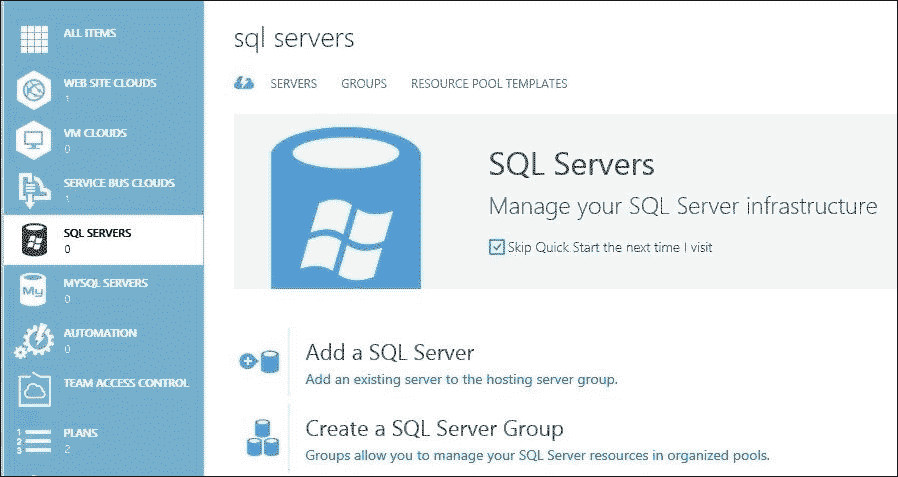

1.  提供**组** **名称**，选择类型为**独立服务器**或**高可用性（启用 Always On）**，并选中复选框以启用 SQL 资源治理（将在后续章节讨论）。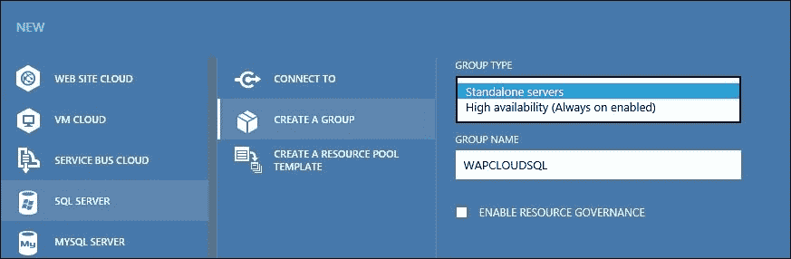

1.  新创建的组将现在列在**sql 服务器**工作区的**组**选项卡下。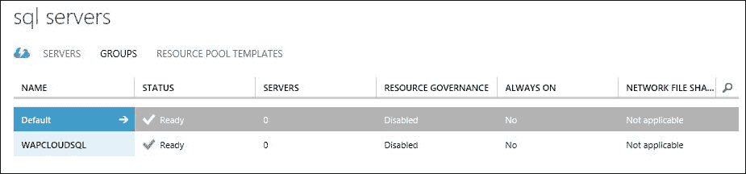

## 将 SQL 服务器添加到组

以下步骤概述了将 SQL 服务器添加到组的过程：

1.  使用管理员身份登录到 Windows Azure Pack 管理门户

1.  浏览**sql** **服务器**工作区。

1.  点击**添加新 SQL 服务器**选项。

1.  输入服务器名称和凭证（SQL 身份验证及数据库托管容量的总数据库大小）。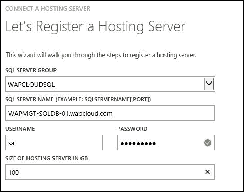

1.  新添加的 SQL 服务器现在将在**服务器**选项卡中显示。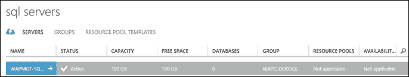

# 实施 MySQL 资源提供程序架构

MySQL 数据库引擎对于 Windows Azure Pack 可以通过两种方式安装：

+   使用传统的 MySQL 机制

+   使用 Microsoft Web Platform 安装程序

Microsoft Web Platform 安装程序在社区版中包含了 MySQL 5.1 和 5.5 版本。它以独立模式安装。安装后，必须手动启用 MySQL 服务器的远程访问，以允许 WAP 通信。

查阅 MySQL 文档以了解有关生产环境 MySQL 部署的更多信息。MySQL 文档可以在[`dev.mysql.com/doc/`](https://dev.mysql.com/doc/)找到。

## 安装和配置 MySQL 服务器

以下步骤概述了使用 Microsoft Web Platform Installer 安装 MySQL 的过程：

1.  使用管理员凭证登录到指定托管 MySQL 服务器数据库的服务器。

1.  下载并安装 Microsoft Web Platform Installer。

1.  搜索 MySQL 5.5。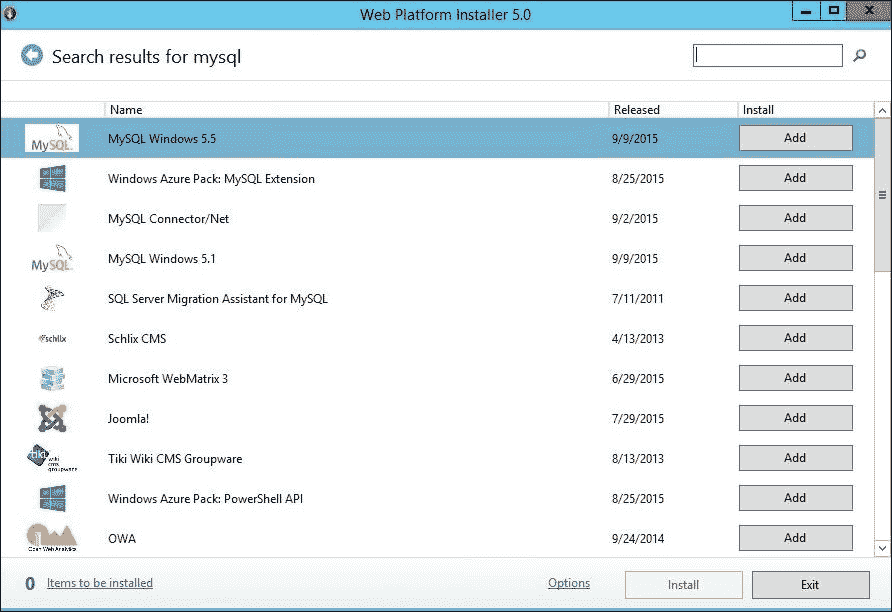

1.  选择**MySQL Windows 5.5**并点击**添加**。

1.  点击**安装**以继续操作。

1.  输入 MySQL 数据库的 root 密码。这将在安装后与 MySQL 服务器通信时使用。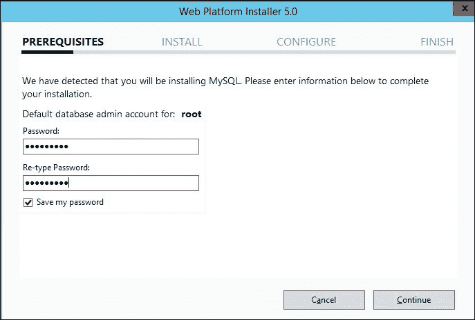

1.  接受协议并继续操作。

1.  现在，将开始下载和安装过程。

1.  安装成功后退出向导。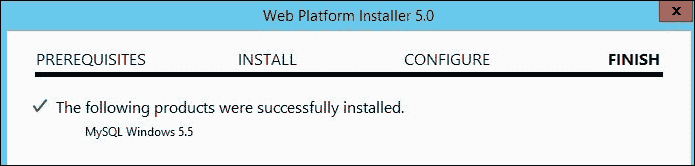

1.  从 **开始** 菜单启动 MySQL 命令行客户端。

1.  输入在安装过程中配置的 root 用户的密码。

1.  通过在 MySQL 服务器的实用工具命令行上执行以下命令来启用远程访问，该命令行是通过 WEB PI 安装在 MySQL 服务器上的：

    ```
    GRANT ALL PRIVILEGES ON *.* TO 'root'@'%' IDENTIFIED BY 'password' WITH GRANT OPTION

    ```

1.  现在，这个 MySQL 服务器已准备好与 Windows Azure Pack 集成。

## 创建 MySQL 组

为 MySQL 服务器创建 Windows Azure Pack 组非常简单，类似于 SQL 服务器组。以下步骤概述了创建 MySQL 服务器的要求：

1.  登录到 Windows Azure Pack 管理门户以进行管理员操作。

1.  浏览 **MYSQL 服务器** 工作区。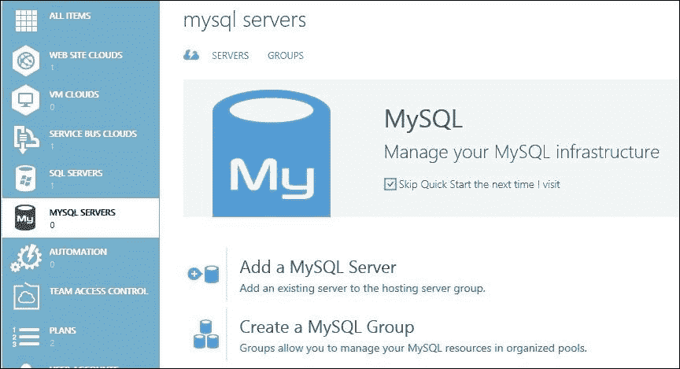

1.  点击 **创建组**。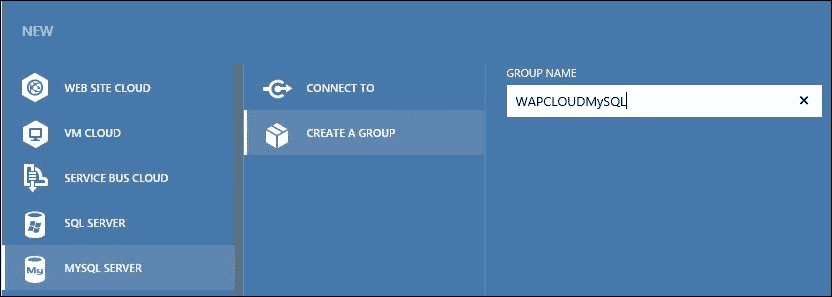

1.  新创建的组现在将在 MySQL 组下显示。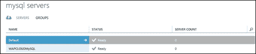

## 将 MySQL 服务器添加到组

以下步骤概述了在 Windows Azure Pack MySQL 服务器组中添加 MySQL 服务器的要求：

1.  登录到 Windows Azure Pack 管理门户并浏览 **mysql 服务器** 工作区。

1.  点击 **添加新 MySQL 服务器**。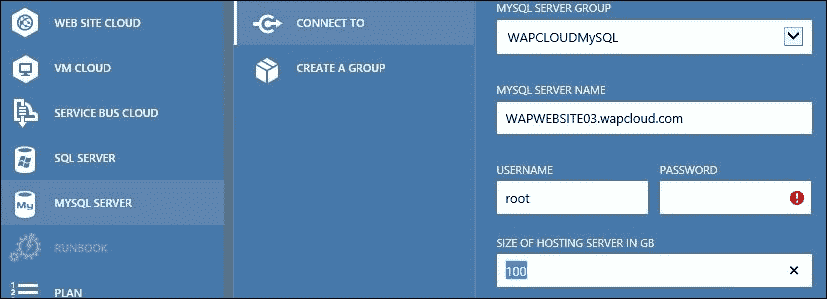

1.  完成后，MySQL 服务器将列在 **mysql 服务器** 工作区的 **服务器** 标签下。

# SQL 和 MySQL DBaaS 管理操作 – 服务提供商

Windows Azure Pack 为管理员提供了一个自助服务门户，用于执行常规 DBaaS 管理服务操作。可以通过 WAP 门户为 SQL 和 MySQL 资源提供商的组和服务器执行以下操作：

+   组管理操作如下：

    +   添加组

    +   删除组

+   可以执行以下数据库服务器管理操作：

    1.  查看 SQL 服务器上的 SQL 数据库的使用情况和数量。

    1.  列出所有已创建的数据库。

    1.  更改 DB 服务器组和托管容量（仅适用于 SQL 服务器，不适用于 MySQL）。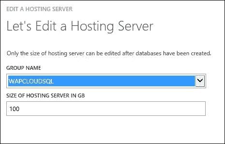

    1.  修复与现有数据库服务器的连接：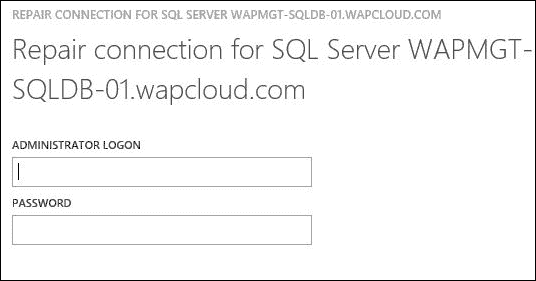

    1.  删除服务器。

# 启用 DB QoS – SQL 资源治理器

如你所学，Windows Azure Pack 的数据库即服务提供在共享模式下工作；即多个租户可以访问托管在同一服务器上的数据库。在共享的多租户云中保证服务质量是必要的。SQL 2014 企业版的 SQL 资源治理器功能使 Windows Azure Pack 能够对租户的数据库提供服务质量控制。

资源治理器避免了某个租户消耗过多或全部资源，进而影响其他租户数据库性能的情况。这确保了每个租户根据订阅获得平等的资源份额。

Windows Azure Pack 提供的 SQL 资源治理器为云服务提供商提供了灵活性，可以对以下参数设置限制：

+   CPU

+   内存

+   IOPS

以下是 SQL 资源治理器部署或 Windows Azure Pack DBaaS 服务的架构组件：

+   SQL Server 2014 企业版服务器

+   在 WAP 中创建的启用了 SQL 治理的 SQL Server 组

+   配置了带有限制和设置的资源池模板

+   与 SQL Server 和资源池模板相关联的 Windows Azure Pack 计划

+   资源治理器是 SQL Server 2014 企业版提供的一项功能；这意味着仅可以与 SQL Server 2014 企业版数据库一起使用 WAP DBaaS 服务及其 QoS 控制。

## 为 WAP 实现 SQL 资源治理器

以下步骤概述了使用 SQL 治理器部署 Windows Azure Pack SQL DBaaS 服务器所需的过程：

### 创建 SQL 组并添加 SQL Servers

要创建 SQL 组并向组中添加 SQL Server，请执行以下步骤：

1.  安装并配置 SQL Server 2014 企业版服务器。

1.  在 Windows Azure Pack 中创建 SQL Server 组，并勾选**启用资源治理**选项。

1.  将 SQL Server 添加到组中。在添加 SQL Server 时，提供 CPU 核心数、已安装内存、每个卷的 IOPS 和在服务器上创建的最大资源池数量。

新创建的 SQL Server 组和 SQL Server 将在 WAP 门户中显示。

### 注意

每个 SQL Server 最多可以创建 18 个池。

### 资源模板

资源模板用于配置限制和数值，它们与计划关联。这些值也会传递到 SQL Server 用于创建和配置资源池。

以下步骤概述了创建资源模板的要求：

1.  登录 WAP 管理门户并浏览**mysql servers**工作区。

1.  选择新创建的**SQL SERVER**组并浏览资源模板选项卡。

1.  点击**新建项目**工作区，选择 SQL Server 下的**创建资源**模板。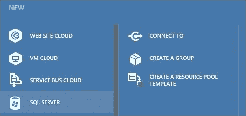

1.  输入一个名称来标识模板。

1.  输入以下限制值：

    +   **最小 CPU 核心数**

    +   **最大 CPU 核心数（软限制）**

    +   **最大 CPU 核心数（硬限制）**

    +   **最小内存（MB）**

    +   **最大内存（MB）**

    +   **每个卷的最小 IOPS**

    +   **每个卷的最大 IOPS**

    +   **每池最大订阅数**

    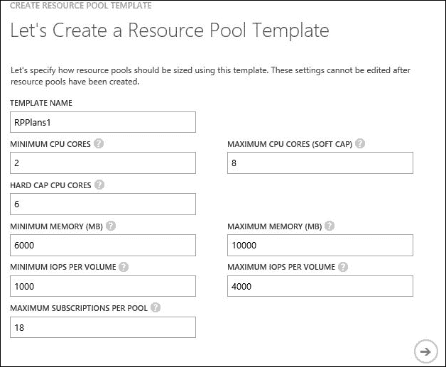

1.  接下来，为以下限制提供值。这些设置适用于在资源池中创建的工作负载组：

    +   **每个请求的最大内存（MB）**

    +   **每个请求的最大 CPU 时间（秒）**

    +   **每个查询的内存授予超时（秒）**

    +   **最大并发请求数**

    +   **最大并行度**

    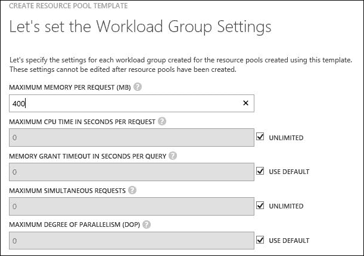

1.  完成向导后，资源池模板将可在**mysql 服务器**工作区下使用。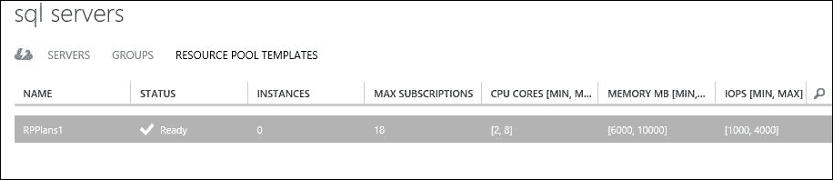

该资源模板现在可以与 WAP 计划关联，以便对租户分配 QoS 控制。

# 编写 DBaaS 计划

像所有其他 Windows Azure Pack 云服务一样，DBaaS 服务也是通过 Windows Azure Pack 计划和附加组件分配给租户的。请参阅第五章，*分配云服务 – 计划、附加组件、租户帐户和订阅*，了解更多关于计划和附加组件的规划信息。

## 为 SQL 和 MySQL DBaaS 创建计划

以下步骤概述了为 SQL 和 MySQL 数据库创建 WAP 计划的要求：

1.  登录 WAP 管理门户并浏览新项目工作区。

1.  选择**计划**开始创建计划。

1.  输入计划标识的友好名称。

1.  选择**SQL 服务器**、**MySQL 服务器**，或根据需要选择两者。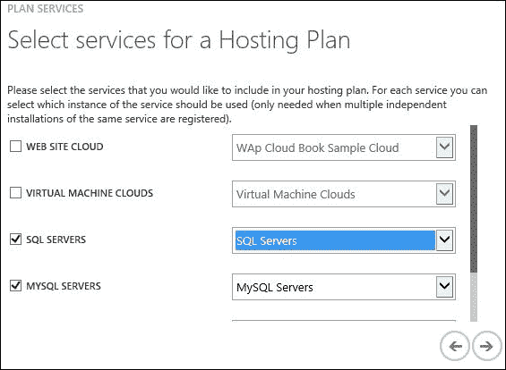

1.  新创建的计划现在将以未配置状态显示在**计划**工作区下。

1.  点击计划名称以开始配置。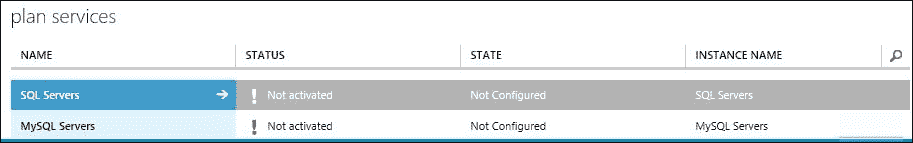

1.  点击 SQL 和 MySQL 服务器开始将组添加到计划中。输入数据库服务器信息，包括组、模板和其他设置，例如租户的版本显示名称、最大数据库数量、正常订阅中的数据库大小及附加功能。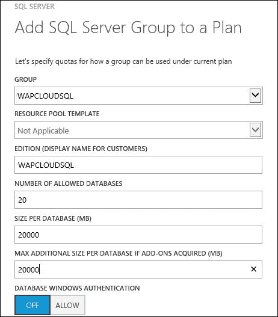

对于 MySQL 服务器，提供数据库组、显示给租户的版本名称、最大数据库数量和数据库大小。租户的 MySQL 数据库不支持调整大小，因此无法修改最大附加大小选项。

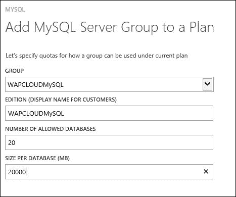

1.  保存更改并配置附加计划设置，例如邀请代码、广告、更改访问权限为公开等。请参阅第五章，*分配云服务 – 计划、附加组件、租户帐户和订阅*，了解更多关于在 WAP 计划中执行这些操作的信息。

## SQL 和 MySQL DBaaS 计划的附加组件

附加组件可以创建并与 WAP DBaaS 服务的计划关联，以增加配额和服务：

+   对于 SQL 服务器，我们有以下内容：

    +   允许的额外数据库数量

    +   允许的额外容量（MB）

    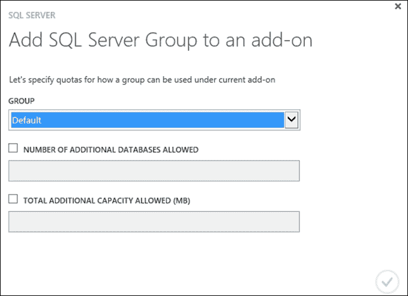

+   对于 MySQL 服务器，我们有以下内容：

    +   允许的额外数据库数量

    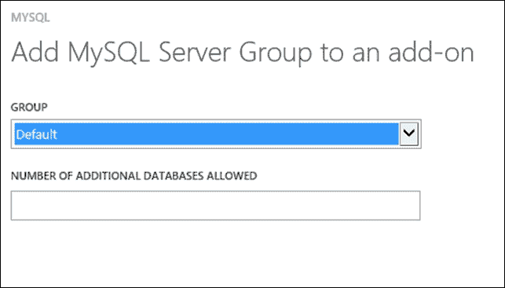

# DBaaS – 租户体验

通过租户门户，租户可以在 Windows Azure Pack 网站的云端以自服务和自动化的方式提供和管理他们的数据库。在本主题中，我们将详细介绍租户在 MySQL 和 SQL 数据库提供及管理操作中的体验。

## 数据库提供和访问

以下步骤概述了租户为提供和访问数据库所遵循的流程：

1.  登录到 Windows Azure Pack 租户门户。

1.  使用配置的邀请代码订阅 DBaaS 计划。

1.  SQL 和 MySQL 工作区将不会在管理门户中显示，因为它们已经按照计划配置。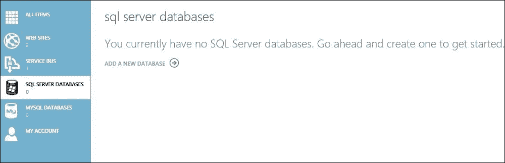

1.  点击 **添加新数据库** 来开始创建 SQL 数据库。提供数据库 **名称** 并选择按提供者在计划设置中配置的 **版本**：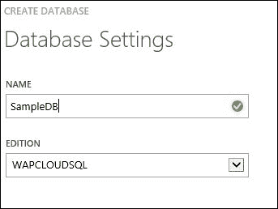

1.  输入数据库管理员用户名和凭据。对应的 SQL 和 MySQL 账户将会随之创建。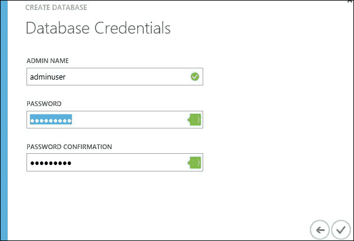

1.  新创建的数据库现在将在数据库和 **所有项** 工作区中显示。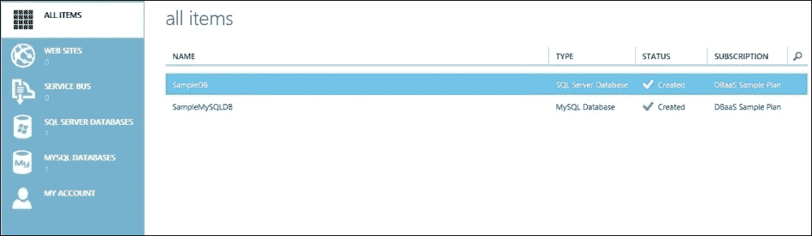

1.  选择数据库并点击底部窗格中的 **查看信息**，以查看连接信息并将其集成到应用程序中。请注意，数据库连接客户端与托管在云中的数据库服务器之间必须有网络连接。根据架构的不同，这可以通过互联网或 VPN 来实现。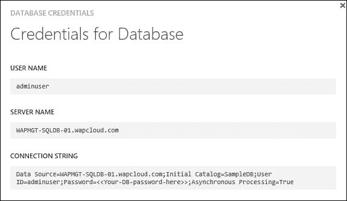

## 数据库管理操作 – 租户

Windows Azure Pack 提供一个自服务门户，租户可以使用该门户执行已创建数据库的基本管理操作。

以下操作可以通过 WAP 门户执行，用于 SQL 和 MySQL 数据库。SQL 和 MySQL 数据库管理操作如下：

+   **查看信息**：此操作查看连接信息，并包括由租户创建的管理员用户

+   **删除**：此操作删除一个数据库

+   **更改密码**：此操作更改管理员用户密码！数据库管理操作 – 租户

+   **调整大小**：此操作调整数据库大小（仅适用于 SQL 数据库，不适用于 MySQL）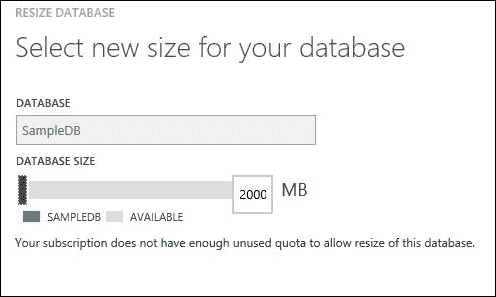

# 专用 DBaaS 提供

为单个租户使用预留或专用数据库服务器（包括基础设施和软件）属于专用数据库即服务提供的范畴。

本地的 SQL 或 MySQL 资源提供商无法为单个租户预留数据库服务器。以下选项可以被组织和服务提供商用于提供专用的 DBaaS 服务：

+   VM 角色库项（IaaS 和 DBaaS）

+   专用组和计划（在大规模部署中不推荐使用）

## DBaaS VM 角色库项（IaaS 和数据库软件）

提供数据库服务的 VM 角色库项目包括 IaaS 和 DBaaS 服务模型的组合。服务提供商可以有库项目，其中包括根据租户在自服务门户中提供的参数自动化操作系统和数据库服务器的部署和配置。在这种情况下，操作系统和数据库层只能由租户进行管理。

该选项中支持的数据库列表也得到了增加；也就是说，它可以支持所有可以在 Hyper-V 虚拟机上运行的数据库。

在 Web PI 上有多个库项目可用，其中包括一些 DB 服务器的项目，涵盖 SQL 和 Oracle 数据库。可以为任何其他自定义需求开发自定义库项目。请参见 第四章，*构建虚拟机云和 IaaS 服务*，了解更多关于 VM 角色库项目的信息。

虽然这为租户的数据库托管提供了专用服务器，但这并不是一个真正的 PaaS 提供，因为它对租户可见基础设施服务。

## 专用的组和计划

服务提供商还可以选择通过 SQL 和 MySQL 资源提供商提供专用数据库作为服务，而无需添加任何 IaaS 复杂性。

服务提供商可以通过创建以下内容来实现这一点：

+   每个租户的专用服务器组

+   每个租户的专用 WAP 计划和附加组件，对应他们的服务器组

虽然这看起来是一个简单直接的解决方案，但在大规模部署中选择它并不是一个好主意。这会增加云服务提供商在管理基础设施、计费和使用解决方案方面的复杂性和管理开销。

# 总结

在本章中，您了解了 Windows Azure Pack 的数据库即服务（DBaaS）提供。我们完成了 SQL 和 MySQL 数据库服务器的组规划、部署和基础设施管理操作。

您还了解了 SQL 资源治理器及其用例。之后，我们讨论了撰写计划和附加组件以及租户体验的 DBaaS 服务。

在下一个章节中，我们将介绍 Windows Azure Pack 的自动化和认证解决方案，即 **SMA**（**服务管理自动化**）和 **ADFS**（**活动目录联合服务**）。
