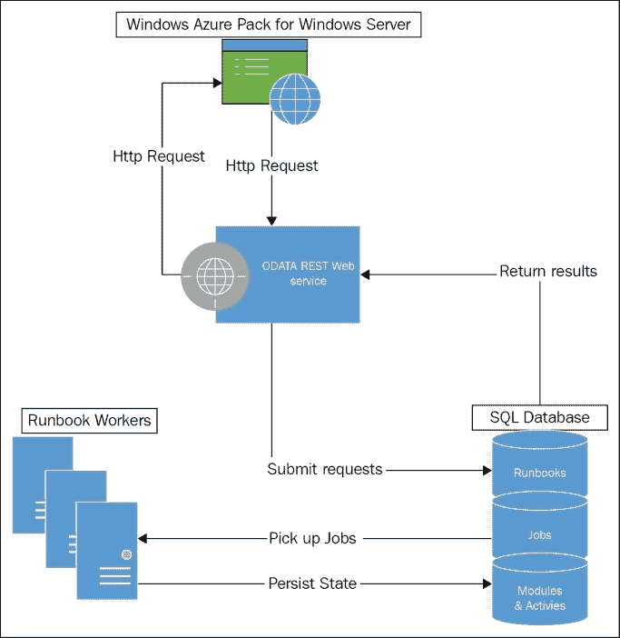
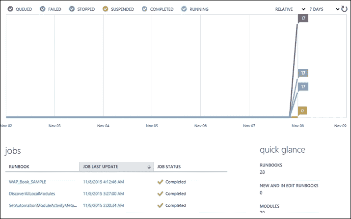
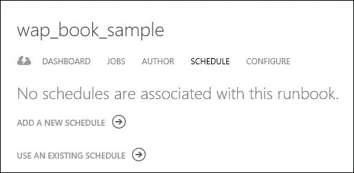
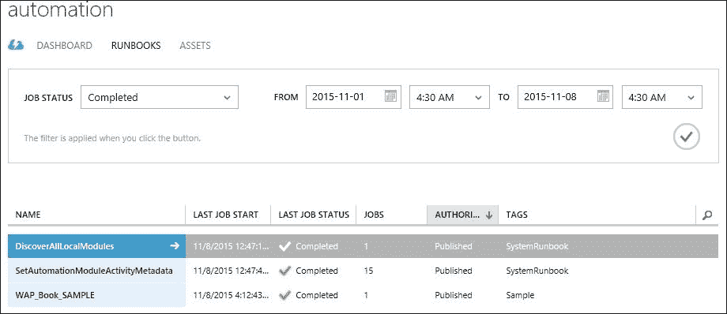

# 第九章：自动化与认证 - 服务管理自动化和 ADFS

本章将专注于自动化基于 Windows Azure Pack 的云解决方案。你将学习 **SMA**（**服务管理自动化**）的安装与配置。同时，你还将学习如何创建、编写和管理运行书和资产。

除了自动化，你还将学习认证相关内容，包括使用 ADFS 进行管理和租户门户的认证。本章涵盖以下主题：

+   SMA - 概述和架构

+   规划 SMA 基础设施

+   安装与配置 SMA

+   处理 SMA 资产

+   处理 SMA 运行书

+   为 WAP 门户启用 ADFS 认证

# SMA - 概述和架构

SMA 作为 System Center 产品系列的一部分，为 Windows Azure Pack 云添加了自动化能力。SMA 使得云服务提供商能够自动化 WAP 云中的所有资源的预配、监控和管理。

让我们举个例子。在大规模云服务提供商的场景中，租户实时大规模地创建和删除虚拟机，也就是每天有数百个操作。该云服务提供商在云中托管的虚拟机上提供了多个功能和特性，作为其增值服务，这些功能包括：

+   备份和灾难恢复

+   实时监控

+   防病毒和反恶意软件保护

+   自动时间点状态快照

租户配置的每个虚拟机都需要在各自的工具中进行配置，以启用前述功能。在租户删除每个虚拟机后，其相应的配置也需要从备份、监控等中移除。假设在云环境中，通过传统方法实现这一点，每天有数百个或更多的虚拟机配置操作。

SMA 可以大大简化并自动化这些操作。服务提供商可以创建 SMA 运行书，用于虚拟机配置的预配和删除。运行书可以与虚拟机的创建和删除操作关联，这样便会自动启动执行具有特定虚拟机参数的相应运行书。

## SMA 概述

SMA 是随着 System Center 2012 R2 产品系列推出的，并且包含在 System Center Orchestrator 安装介质中。它可以作为独立产品使用，也可以与 Windows Azure Pack 一起使用。

SMA 提供了微软本地云基础设施的自动化引擎。它依赖于 Windows PowerShell 工作流，也就是说，几乎任何可以通过 Windows PowerShell 执行的任务，都可以通过 SMA 进行自动化。

PowerShell 工作流是在 Windows PowerShell 3.0 发布时引入的，包含传统的 PowerShell cmdlet 来执行任务。SMA 中的运行书使用 PowerShell 工作流进行编写，加入了 PowerShell 工作流的以下功能：

+   检查点或挂起一个运行书的工作流

+   在多个系统上并行执行 PowerShell 任务

本地的 SMA 不提供任何图形界面来创建、管理或执行运行手册。与 System Center Orchestrator 不同，所有 SMA 运行手册必须手动用 PowerShell 工作流编写。

Windows Azure Pack 管理员门户与 SMA 集成良好，提供图形界面用于调度、执行以及执行其他管理操作。

必须注意的是，SMA 功能不适用于租户创建和管理自己的运行手册。

### 注意

Microsoft Azure 自动化使用与 SMA 相同的架构，并为使用 Microsoft Azure 托管其 IT 资源的客户提供类似的自动化功能。

## SMA 架构

与所有其他 WAP 云组件类似，SMA 分布于多个组件之间，提供灵活的架构以提高性能并消除单点故障。SMA 包括以下组件来实现其功能：

+   SMA Web 服务

+   SMA 运行手册工作者

+   数据库服务器

+   SMA PowerShell 模块（可选）

**SMA Web 服务**：Web 服务是所有其他管理媒介与 SMA 之间的接口。Windows Azure Pack 使用 SMA Web 服务与 SMA 通信，并执行其他 SMA 任务，例如执行运行手册或获取运行手册的状态。

它暴露了一个 REST 端点和 OData API，可以被 WAP 或任何其他自定义开发的门户用来与 SMA 集成。

它还负责授权和分发运行手册执行任务到工作者角色。

**SMA 运行手册工作者**：SMA 运行手册的任务由工作者服务器执行或处理。一个运行手册工作者服务器在隔离环境中执行多个运行手册，这些环境也被称为沙箱。这确保了一个运行手册执行的活动不会影响同一工作者服务器上执行的其他运行手册。

**SMA 数据库**：SMA 利用 Microsoft SQL Server 数据库来存储其配置和运行时数据。SMA 数据库存储了 SMA 运行手册、任务及其他与 SMA 相关的对象的配置和运行时数据。

**SMA PowerShell 模块**：可以用来自动化自动化；即它提供了 40 多个 PowerShell cmdlet，管理员可以使用它们来自动化执行和管理运行手册的过程。PowerShell 模块还与 SMA Web 服务交互，以执行 SMA 操作。该模块可以安装在管理员的端点上，并可作为 SMA 操作的 WAP 门户的替代方案。

下图展示了 SMA 组件在 Windows Azure Pack 中的角色和流程：



# SMA 基础设施规划

SMA 基于分布式架构运行，允许操作以简便且不中断的方式进行横向扩展和收缩。在规划 SMA 部署的基础设施时，必须考虑以下几个方面：

+   可用性规划

+   性能/容量规划

## 可用性规划

通过添加冗余服务器，SMA 解决方案的所有组件都可以抵御单点故障。以下指南包括每个角色的可用性方面的推荐配置：

+   **SMA Web 服务角色**：建议部署多个 Web 服务角色（最低推荐部署两个以确保高可用性），并配置负载均衡器。任何管理端点，如 WAP 门户，都必须指向负载均衡器，以便与 SMA Web 服务进行通信。

+   **SMA 工作角色**：建议部署多个 SMA 工作角色（最低推荐部署两个以确保高可用性），以避免单点故障。SMA Web 服务会自动将作业任务分配到不同的工作节点，以确保负载均衡。

+   **SMA 数据库**：建议使用 SQL 可用性技术来保护 SMA SQL 数据库，防止任何单点故障。SMA 数据库支持在以下环境中运行：

    +   独立 SQL 服务器

    +   SQL 服务器集群

    +   SQL Always on

+   **SMA 服务器的虚拟机**：使用虚拟机或托管 SMA 服务器可以为硬件故障提供另一层保护。

## 性能和容量规划

在规划 SMA 基础设施的大小时，以下因素应考虑在内：

+   运行手册的数量

+   运行手册的大小（活动、变量、连接等）

+   运行手册的平均运行时间

+   执行的远程调用

根据前述因素，无法通过直接公式来计算大小。以下指南有助于为 SMA 服务器确定大小：

+   **SMA Web 服务**：SMA Web 服务是无状态的；也就是说，它可以随着计算资源的增加和附加服务器的增加，轻松进行扩展和缩放，并通过负载均衡器进行配置。Web 服务负责与管理控制台（如 WAP）以及工作角色进行通信，以分配运行手册作业。除非大量用户同时启动 SMA 执行过程，否则 SMA Web 服务对资源的需求较低。启动时，建议的计算配置是两核 CPU 和 4 GB RAM（最低配置），推荐 8 GB。

+   **SMA 工作节点**：SMA 工作节点托管沙箱来执行非无状态的运行手册作业。每个沙箱可以处理 30 个并发作业，默认情况下，一个工作节点最多可以托管四个沙箱。这意味着每个工作节点可以处理 120 个并发作业。标准 SMA 服务器的硬件建议配置为两核 CPU 和 4 GB RAM（最低配置），但推荐 8 GB。这样的配置可以高效处理这些工作。根据使用和需求，工作角色可以进行横向扩展。

+   **SMA 数据库**：每个 SMA 部署只能有一个数据库；因此，建议在生产环境中使用专用实例来承载 SMA 数据库，确保它获得所需的计算资源。微软建议使用具有最低 8 GB RAM 和 8 核心计算能力的 SQL 服务器来承载 SMA 数据库。在存储方面，根据微软指南，12 个作业每分钟的数据量需要 20 GB 的磁盘空间。并且建议遵循标准的微软 SQL Server 性能和容量指南。有关 SQL Server 最佳实践，请参阅 [`technet.microsoft.com/en-us/sqlserver/bb671430.aspx`](https://technet.microsoft.com/en-us/sqlserver/bb671430.aspx)。

# 安装和配置 SMA

SMA 安装程序位于 System Center Orchestrator 媒体中，遵循与其他 System Center 产品类似的安装说明。

## SMA 安装前提条件

SMA 安装前提条件可以分为三类：

+   软件组件前提条件

+   AD 账户前提条件

+   SSL 证书前提条件

Windows Server 2012 R2 是 SMA 安装的最低操作系统版本。除此之外，必须在开始安装 SMA 之前安装以下软件组件，因为 SMA 安装程序不会自动安装前提组件。

安装 SMA Web 服务的软硬件前提条件如下：

+   **互联网信息服务**（**IIS**）7.5 或更高版本

+   IIS 基本身份验证

+   IIS Windows 身份验证

+   IIS URL 授权

+   ASP.NET 4.5

+   .NET Framework 3.5（用于安装程序）

+   .NET Framework 4.5

+   WCF HTTP 激活

+   SQL Server 2012 数据库连接

### 注意

要在 Windows Server 2012/R2 上使用服务器管理器的 **添加功能** 向导安装 .NET 3.5，必须在安装过程中指定备用源位置，并指向 Windows 安装介质中的 `sxs` 文件夹。

安装 SMA 工作者角色的软硬件前提条件——Windows PowerShell 4.0（Windows Server 2012 R2 默认包含此版本）：

+   **活动目录账户**：建议为运行以下服务创建独立的专用账户和组。下表列出了部署 SMA 组件所需的账户：

    | 示例账户/组名称 | 账户用途 | 备注 |
    | --- | --- | --- |
    | SMA pool | SMA 应用程序池管理员组 | 本地管理员组成员 |
    | SMA poolsvc | SMA 池 Web 服务账户 | 本地管理员组成员 |
    | SMA workersvc | SMA 工作者服务账户 | 本地管理员组成员 |

+   **SSL 证书**：建议使用由内部 CA 颁发的 SSL 证书而不是自动生成的自签名证书来安装 SMA Web 服务。此证书必须被 SPF 服务器信任。

## 安装 SMA Web 服务、Runbook 工作者和 PowerShell 模块

为了本书中的评估目的，我们将在单台服务器上安装这三个组件。以下步骤用于安装 SMA Web 服务：

1.  登录到指定安装 SMA Web 服务的服务器。

1.  从 System Center Orchestrator 媒体启动`SetupOrchestrator.exe`。

1.  在**服务管理**的**安装**页面上，点击**Web 服务**。

1.  点击**安装**以继续。

1.  输入**名称**和**组织**名称，并提供注册密钥（如果有）。如果此时没有提供注册密钥，安装将以评估模式进行：

1.  同意条款和条件以继续。

1.  安装程序将开始检查先决条件，并显示任何适用的错误或警告。如果所有先决条件都满足，则可以继续：

1.  输入数据库服务器连接信息，包括服务器名称、端口、数据库名称和凭据。可以使用 Windows 身份验证和 SQL 身份验证：

1.  指定安全组或用户及凭据以运行 Web 服务应用程序池：

1.  指定 Web 服务端口和 SSL 证书。安装程序还可以生成自签名证书用于测试环境：

1.  指定存储 Web 服务文件的位置。

1.  指定**CEIP**（**客户体验改进计划**）和 Microsoft 更新的选项。

1.  审查设置后，点击**安装**以开始安装。

1.  安装成功后，点击**关闭**；SMA Web 服务现已安装。

## 安装 Web 工作器角色

安装 SMA 工作器角色所需的步骤如下：

1.  登录到指定安装 SMA 工作器的服务器。

1.  从 System Center Orchestrator 媒体启动`SetupOrchestrator.Exe`。

1.  在**服务管理**的**安装**页面上，点击**运行簿工作者**。

1.  输入**名称**和**组织**名称，并提供注册密钥（如果有）。如果此时没有提供注册密钥，安装将以评估模式进行。

1.  同意条款和条件以继续。

1.  安装程序将开始检查先决条件，并显示任何适用的错误或警告。如果所有先决条件都满足，则可以继续。

1.  输入数据库服务器连接信息，包括服务器名称、端口、数据库名称和凭据。可以使用 Windows 身份验证和 SQL 身份验证。

1.  指定用于运行 SMA 工作服务的服务帐户：

1.  指定存储工人文件的位置。

1.  指定 CEIP 的选择。

1.  审查设置并点击**安装**以开始安装。

1.  点击**关闭**以完成操作。SMA 运行书工作者已安装完毕。

可以在管理端点以类似的方式安装 SMA PowerShell 模块。

## 安装后任务

确保完成以下任务，以便在 WAP 集成中实现有效的 SMA 部署：

+   在生产环境中，用受信任的 SSL 证书替换 SMA Web 服务的自签名证书。

+   验证**SPF**（**服务提供商基础架构**）服务器是否信任 SMA Web 服务所呈现的 SSL 证书。

# 将 SMA 与 Windows Azure Pack 集成

通过注册 SMA 端点，执行以下步骤以将 SMA 与 Windows Azure Pack 集成：

1.  登录 WAP 管理门户以进行管理员操作。

1.  浏览**自动化**工作区：

1.  点击**注册服务管理自动化端点**。

1.  输入 SMA 端点的详细信息和一些凭据：

1.  成功注册后，SMA 端点将在 WAP 门户中可见。

1.  WAP 门户下的**自动化**工作区现在可以用于所有与 SMA 相关的操作。**仪表板**页面显示云中运行书和作业的状态和统计信息。每个运行书也可以访问类似的仪表板：

# 处理 SMA 资产

在基于 SMA 的 WAP 自动化解决方案中的资产提供全球配置和参数，可以被运行书（runbooks）利用。例如，执行 VM 云操作的任何运行书可能需要 VMM 服务器连接信息和凭据。在拥有数百个运行书的大型环境中，可以将这些 VMM 服务器连接信息和凭据声明为资产，而不需要在每个运行书中定义，这样它们可以被所有运行书共享。

在资产中声明此类变量有助于在后续阶段平稳地处理变化。

Windows Azure Pack 自动化中的资产包括以下内容：

+   连接

+   凭据

+   变量

+   日程安排

+   模块

## 资产类型和功能

以下是资产类型及其功能：

+   **连接**：连接包含常用服务的连接详情和授权凭据，供运行书使用。例如，包括 SCVMM、Azure 或其他可用服务等服务。

+   **凭据**：WAP 自动化资产中的凭据可以与 SCVMM 中的“以身份运行”（Run As）帐户进行比较。凭据包含用户名和密码，供运行书使用，以访问、修改和管理跨云的资源。WAP 自动化资产可以存储两种类型的凭据：

    +   Windows PowerShell 凭证

    +   SSL 证书凭证

    服务提供商可以根据运行书籍所需的权限和使用情况添加多个凭证。

+   **变量**：顾名思义，变量可以用来存储运行书籍使用的关键值。变量可以按以下格式定义：

    +   字符串

    +   整数

    +   布尔值

    +   日期时间

    具有敏感值（如密码）的变量可以加密以保证安全性。

+   **计划**：这可以用于为任何运行书籍创建定期的执行计划；例如，可以创建一个计划，每天在特定时间启动运行书籍来收集统计数据。

+   **模块**：这包含 PowerShell 模块，可以被运行书籍用来执行特定的 PowerShell cmdlet。模块可以与 System Center Orchestrator 中的集成包进行比较。

    模块帮助在一个中心位置管理所有 PowerShell 模块，无需在每个工作角色中进行安装。

## 添加和管理资产

**资产**标签在 WAP 管理门户的自动化工作区下提供了添加或删除资产的选项。

添加、删除和修改资产的步骤如下：

1.  登录到 WAP 管理门户进行管理员操作。

1.  浏览**自动化**工作区和**资产**标签。

1.  默认情况下，所有标准的 PowerShell 模块都包含在 WAP 门户中。任何额外的模块都可以被导入。任何现有的模块都可以通过底部窗格中的按钮删除：

1.  点击**添加设置**以添加新资产：

1.  选择要添加的资产类型并继续。

1.  要创建一个连接资产，请选择一个连接并提供连接详细信息，包括连接类型、名称、主机名和凭证。默认情况下，WAP 支持以下连接类型：

1.  在添加服务页面选择添加凭证来添加任何凭证。提供凭证类型、凭证友好名称和用户名、密码或适用的 SSL 证书：

1.  在添加服务页面选择添加变量来添加任何变量，提供变量类型、变量名称和值，并可选择加密：

1.  在添加服务页面选择添加计划来添加任何计划。提供计划名称和计划值，包括类型（一次性或每日）和开始时间：

1.  创建的资产现在将在**资产**标签下可见。它们已准备好供运行书籍使用。

1.  点击任何资产将显示其配置；例如，点击一个模块将显示模块信息以及 PowerShell cmdlet。它将显示以下截图：

可以以类似的方式创建其他资产。

# 处理 SMA runbooks

SMA runbooks 由 PowerShell 工作流组成，其中包括 PowerShell cmdlet，以自动化的方式执行指定的任务。

Runbooks 可以从**automation**工作区 WAP 门户下的**RUNBOOKS**标签进行管理。服务提供商可以在任何地方编写 PowerShell 工作流和 runbook，然后将其导入到 WAP SMA 中。

**automation**工作区中的**RUNBOOKS**标签提供以下基本操作功能，供对 runbooks 执行操作：

+   启动任何 runbook 的执行

+   将 runbook 导入到 WAP（PS1 文件）

+   将任何现有的 runbook 导出为本地系统上的 PS1 文件

+   从 WAP 中删除任何现有的 runbook

请注意，编写 runbook 时没有类似 System Center Orchestrator（SCO）的 GUI（拖放项）；它必须手动编写 PowerShell 工作流。

## 示例 runbooks

Windows Azure Pack 默认提供与 SMA 一起使用的一些示例 runbook，供参考用于编写新 runbook。

以下步骤概述了查看和管理示例 runbook 的过程：

1.  登录到 WAP 管理门户（管理员）。

1.  浏览**automation**工作区和**RUNBOOKS**标签。

1.  示例 runbooks 将显示。点击任何示例 runbook 以查看其工作流和其他配置。

1.  任何 runbook 都可以通过底部面板中的按钮启动、导入、导出和删除。

## 创建一个 runbook

创建 runbook 所需的步骤如下：

1.  登录到 WAP 管理门户（管理员）。

1.  浏览**automation**工作区和**RUNBOOKS**标签。

1.  点击**NEW**按钮，选择**RUNBOOK**和**QUICK CREATE**：

1.  新创建的 runbook 现在将列出在**RUNBOOKS**标签下。

1.  点击**RUNBOOK NAME**执行其他操作，包括编写和调度。

## 编写 runbook

编写 runbook 涉及为 runbook 编写 PowerShell 工作流，并在整个生命周期中管理 runbook 版本和修改。

服务提供商可以利用多种工具来编写 runbook：

+   Windows PowerShell ISE

+   Visual Studio IDE

+   Windows Azure Pack 管理门户

+   任何其他源代码控制或编程工具

在 Windows Azure Pack 管理员门户中编写 runbook 时，它可以是草稿版本或已发布版本。已发布的版本由工作服务器在启动 runbook 时执行工作负载。

以下概述了在 Windows Azure Pack 门户中编写 runbook 所需的步骤：

首先，按照前面的说明创建 runbook。

1.  选择新创建的 runbook，并浏览**AUTHOR**工作区。

1.  点击**DRAFT**，然后工作流编写器将可用：

1.  请遵循标准的 Microsoft PowerShell 工作流编写指南，为运行手册编写工作流。请参阅 Microsoft 文档 [`azure.microsoft.com/en-in/documentation/articles/automation-powershell-workflow/`](https://azure.microsoft.com/en-in/documentation/articles/automation-powershell-workflow/) 了解有关编写 PowerShell 工作流的更多信息。

1.  底部面板按钮可用于向运行手册中添加额外功能，如添加另一个运行手册（嵌套）或添加任何活动或资产。

1.  点击 **SAVE** 将保存当前版本的草稿。发布将使此草稿可供 SMA 工作者执行。

## 在运行手册 PowerShell 工作流中使用资产

在全局级别声明的 SMA 资产可以通过以下语法在工作流中使用：

+   **连接**：以下是一个示例，展示了在资产中声明的连接如何在 PowerShell 工作流中被访问：

    ```
    $SCVMMConnection = Get-AutomationConnection -Name "SCVMVMMConnection"
    $SCVMMServer = $SCVMMConnection.ComputerName
    $SCVMMUser = $SCVMMConnection.Username
    $SCVMMPassword = $SCVMMConnection.Password
    ```

+   **凭证**：以下 PowerShell 示例展示了如何在 PowerShell 工作流中访问在资产中声明的凭证：

    ```
    $AccessCred = Get-AutomationPSCredential -Name "SampleCred"
    ```

+   **变量**：以下 PowerShell 示例展示了如何在 PowerShell 工作流中访问在资产中声明的变量：

    ```
    $ABCVar = Get-AutomationVariable -Name "SampleVAR"
    ```

## 调度运行手册

调度运行手册将根据配置的日期、时间和频率值自动启动运行手册的执行。可以将配置在资产中的调度附加到运行手册；也可以创建自定义调度。

创建运行手册所需的步骤如下：

1.  在 WAP 门户中选择要调度的运行手册，并浏览 **SCHEDULE** 标签页：

1.  点击现有的调度以利用在全局资产中创建的调度。点击 **ADD A NEW SCHEDULE** 为该运行手册添加新的调度。

1.  提供调度名称和类型（一次性/每日）以及日期和时间来配置新的调度。

1.  点击 **Finish** 保存为运行手册配置的调度。

## 处理作业

每当运行手册执行启动时，都会创建一个相应的作业，并分配给工作角色进行执行。工作角色在运行时将作业存储在沙箱中。

使用 Windows Azure Pack 门户的 **automation** 工作区，我们可以实时查看作业的状态以及历史数据。作业也可以被停止、暂停和恢复。

以下概述了查看和处理运行手册的步骤：

1.  **自动化** 工作区下的 **RUNBOOKS** 标签页显示 WAP 云中所有运行手册的状态：

1.  每个运行手册页面下的 **JOBS** 标签页可以访问每个运行手册的作业状态。选择作业状态和时间线，根据选定的参数查看作业状态。

## 配置运行手册日志记录

Windows Azure Pack 为云管理员提供了多个选择，用于配置运行簿的日志级别和类型。管理员可以选择每个运行簿启用或禁用以下日志级别：

+   日志调试记录

+   日志详细记录

+   日志进度记录

以下步骤是配置运行簿日志选项所需的操作：

1.  选择运行簿并浏览配置选项卡。

1.  向下滚动到日志区域，并根据需求配置设置；点击**保存**以保存更改的配置：

## 将运行簿与虚拟机云操作链接

将运行簿与虚拟机云操作链接，只有在发生特定事件或操作时才执行指定的运行簿。将运行簿与操作链接有助于在对象创建后立即执行所需的操作，而不是等到下一个运行簿计划。

以下步骤是将运行簿与虚拟机云中的操作链接的要求：

1.  登录到 WAP 管理员门户并浏览**虚拟机云**工作区。

1.  选择**自动化**选项卡：

1.  点击**将操作与运行簿链接**。

    WAP 自动化支持以下虚拟机云对象，以在特定操作上链接运行簿：

    

1.  选择**对象**、**操作**和**运行簿**进行配置：

1.  **点击** **完成**以将运行簿与选定的操作链接。

# 启用 ADFS 身份验证用于 WAP 门户

Windows Azure Pack 标准安装包括管理员和租户门户的身份验证站点，以利用其默认的身份验证机制。Active Directory 提供全球范围的身份验证服务。通过启用 WAP 门户使用 ADFS 进行身份验证，我们可以利用 AD 的功能和特性。

这可以让服务提供商验证租户用户身份，使用租户自己托管在本地基础设施中的 Active Directory。

## ADFS 身份验证架构和概述 – 管理员和租户门户

默认情况下，Windows Azure Pack 门户配置为使用以下身份验证机制。

+   WAP 管理员门户：Windows 身份验证

+   租户的 WAP 管理门户—ASP.NET 提供者

Active Directory 联合服务（ADFS）用于简化登录并启用跨应用程序和服务的真正 SSO（单点登录）功能，无论这些应用程序和服务托管在哪里（本地/公共云）。通过在 Windows Azure Pack 中使用 ADFS 进行身份验证，云提供商可以保护和简化管理员门户的身份验证机制。对于租户门户，它有助于启用租户用户的单点登录，利用租户自己的 Active Directory 进行身份验证。以下图示解释了 Windows Azure Pack 与 ADFS 的身份验证架构：


为 Windows Azure Pack 云实施 ADFS 需要以下步骤：

+   设置 ADFS 农场（包括云提供商和租户）。

+   将租户的 ADFS 作为声明提供者添加到云提供商的 ADFS 中。

+   将云提供商的 ADFS 添加为租户的 ADFS 的信任方。

+   将 WAP 门户（租户/管理员）添加为云提供商的 ADFS 信任方。

+   将云提供商的 ADFS 添加为 WAP 租户门户的声明提供者。

+   测试并验证配置。

本书未涵盖设置 ADFS 农场和配置提供方与租户之间 ADFS 服务的关系。有关 ADFS 的更多信息，请参阅 Microsoft ADFS 文档：[`technet.microsoft.com/en-in/windowsserver/dd448613.aspx`](https://technet.microsoft.com/en-in/windowsserver/dd448613.aspx)。

## 将 WAP 门户添加为信任方。

以下步骤是将 WAP 门户添加为云提供商的 ADFS 服务的信任方。有关 Windows Azure Pack 架构及其组件角色的更多信息，请参阅第三章，*安装和配置 Windows Azure Pack*：

1.  登录到 ADFS 服务器，并从服务器管理器打开 ADFS 控制台。

1.  点击**添加**信任中继方。

1.  提供 WAP 服务器的联合元数据 URL，格式为`https://manage.wapcloud.com/federationmetadata/2007-06/federationmetadata.xml`：

1.  指定**显示名称**和可选的备注。

1.  根据服务提供商的决策启用或禁用多因素认证。

1.  选择**允许**以允许所有用户访问此信任方。

1.  在**完成**页面，选中**编辑声明规则**的复选框。

1.  添加名为**发送 LDAP 属性作为声明**的规则。

1.  提供声明规则名称，并选择**Active Directory**作为**属性存储**。

1.  将用户主体名称 LDAP 属性映射到名为**传出声明类型**的 UPN。

1.  添加另一个规则，配置相同，唯一的不同是通过映射 MapToken-Groups—由域名 LDAP 属性限定到组的传出声明类型来更改绑定。

1.  添加另一个规则，使用传递或筛选传入声明规则模板。

1.  提供声明规则名称，并选择传入声明类型中的**UPN**。

1.  添加另一个规则，使用提供声明规则名称的传递或筛选传入声明模板。在传入声明类型中选择**组**。

1.  验证已创建的规则，并继续完成配置向导。

执行此操作以完成 ADFS 配置以及 WAP 网站标识符：

```
Set-AdfsRelyingPartyTrust -TargetIdentifier'http://azureservices/TenantSite'-EnableJWT $true
```

要获取标识符，请运行以下 PowerShell 命令。 在 cmdlet 中提供 WAP 门户方名称：

```
Get-AdfsRelyingPartyTrust -Name "Party Name"
```

## 配置 WAP 网站使用 ADFS

配置 WAP 网站使用 ADFS 作为身份验证站点的步骤如下。请参阅 第三章，*安装和配置 Windows Azure Pack*，以了解更多关于配置 WAP 门户的内容：

1.  在 Windows Azure Pack 服务器上执行以下 PowerShell 命令，以配置租户网站使用 ADFS。租户可以替换为管理员来配置管理员门户：

    ```
    Set-MgmtSvcRelyingPartySettings -Target Tenant -MetadataEndpoint https://adfs.wapcloud.com/FederationMetadata/2007-06/FederationMetadata.xml -DisableCertificateValidation -ConnectionString'Server=WAPMGT-SQLDB-01.wapcloud.com;User Id=sa;Password=*******;'

    ```

1.  在 Windows Azure Pack 服务器上执行以下 PowerShell 命令，以配置身份提供者使用 ADFS：

    ```
    Set-MgmtSvcIdentityProviderSettings -Target Membership -MetadataEndpoint https://adfs.wapcloud.com/FederationMetadata/2007-06/FederationMetadata.xml -DisableCertificateValidation -ConnectionString'Server=WAPMGT-SQLDB-01.wapcloud.com;User Id=sa;Password=*******;'
    ```

1.  在 Windows Azure Pack 服务器上执行以下 PowerShell 命令，将所选用户配置为 WAP 的管理员：

    ```
    $adminuser = 'userap@domain.com'
    $dbServer = 'WAPMGT-SQLDB-01.wapcloud.com'
    $dbUsername = 'sa'
    $dbPassword = 'SQL_Password'
    $connectionString = [string]::Format('Server= {0} ;Initial Catalog=Microsoft.MgmtSvc.Store;User Id={1};Password={2};',$dbServer, $dbUsername, $dbPassword)
    Add-MgmtSvcAdminUser -Principal $adminuser -ConnectionString $connectionstring
    ```

配置成功后，可以通过打开 WAP 门户验证 ADFS 身份验证。门户将自动将身份验证重定向到 ADFS 页面。

# 总结

在本章结束时，我们已经完成了构建 WAP 云解决方案的基本服务。你学习了如何构建 SMA 解决方案来自动化 WAP 云资源的提供、监控和管理。你还了解了 SMA 的规划、安装和配置过程。你学习了 SMA 资产和运行手册，包括编写和管理运行手册。

我们还介绍了如何使用 ADFS 的身份验证功能，通过 Windows Azure Pack 进行管理员和租户门户的身份验证。

在下一章中，我们将通过了解合作伙伴和第三方开发的产品来扩展 WAP 功能和特性，从而深入了解 Windows Azure Pack 云的可扩展架构。
