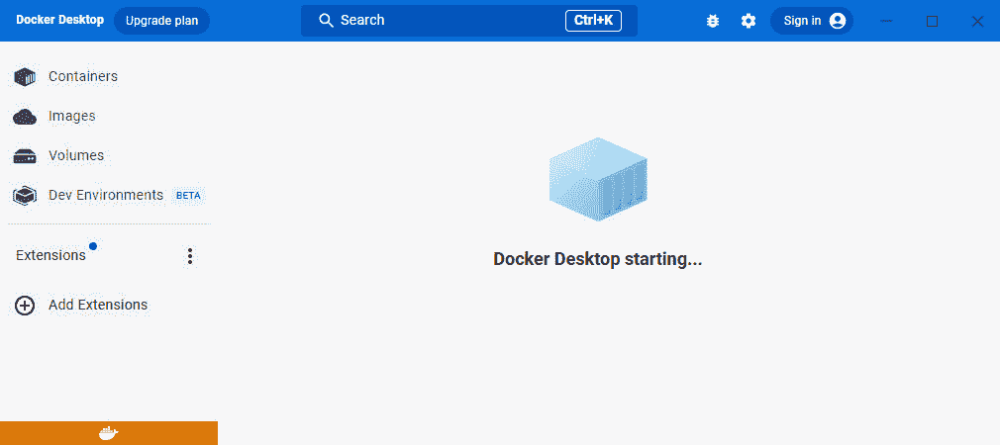

# 1

# 使用 Docker 的现代基础设施与应用程序

软件工程与开发一直在不断发展，引入新技术到架构和工作流中。软件容器在十多年前就已出现，并在过去五年中特别流行，得益于 Docker 的普及，使得这一概念成为主流。目前，每个企业都在云端和本地分布式基础设施上管理其基于容器的应用程序基础设施。本书将教你如何通过使用软件容器来提高开发生产力，从而创建、测试、共享和运行你的应用程序。你将使用基于容器的工作流，最终的应用程序构件将是基于 Docker 镜像的部署，准备在生产环境中运行。

本章将介绍软件容器，尤其是在当前软件开发文化中的应用。现代开发文化需要更快速的软件供应链，由可移动、分布式的组件组成。我们将回顾容器的工作原理以及它们如何适应基于分布式组件（具有非常特定功能的微服务）的现代应用程序架构。这使得开发人员可以为每个应用组件选择最合适的语言，并分散整个应用程序的负载。我们将学习使软件容器成为可能的内核特性，并学习如何创建、共享和运行作为软件容器的应用程序组件。在本章的最后，我们将了解不同的工具，帮助我们使用软件容器，并为你的笔记本电脑、台式机和服务器提供具体的应用场景。

在本章中，我们将讨论以下主题：

+   应用程序架构的演变，从单体架构到分布式微服务架构

+   开发基于微服务的应用程序

+   容器如何适应微服务模型

+   理解软件容器的主要概念、特性和组成部分

+   比较虚拟化和容器

+   构建、共享和运行容器

+   解释 Windows 容器

+   使用软件容器提升安全性

# 技术要求

本书将教你如何使用软件容器来提高应用程序开发效率。我们将使用开源工具来构建、共享和运行容器，并结合一些不需要专业授权的商业工具。此外，本书还包含一些实验，帮助你实践理解我们所讨论的内容。这些实验可以在[`github.com/PacktPublishing/Containers-for-Developers-Handbook/tree/main/Chapter1`](https://github.com/PacktPublishing/Containers-for-Developers-Handbook/tree/main/Chapter1)找到。本章的*Code In Action*视频可以在[`packt.link/JdOIY`](https://packt.link/JdOIY)找到。

# 从单体架构到分布式微服务架构

随着技术的进步，应用架构不断演变。在计算历史上，每当硬件和软件工程中的技术差距得到解决时，软件架构师就会重新思考如何改进应用，以利用这些新的技术进展。例如，网络速度的提升使得将应用组件分布到不同服务器成为可能，如今，甚至将这些组件分布到多个国家的数据中心也不成问题。

要快速了解计算机是如何被企业采纳的，我们必须回到早期的主机时代（1990 年代之前）。这可以被视为我们今天所称的**单体架构**的基础——一台拥有所有处理功能的大型计算机，用户通过终端进行访问。在此之后，随着用户端技术的进步，**客户端-服务器**模型变得非常流行。服务器技术不断改进，而客户端则获得了越来越多的功能，减轻了服务器的负载，从而支持应用发布。我们认为这两种模型都是**单体**的，因为所有应用组件都运行在同一台服务器上；即使数据库与其他组件解耦，将所有重要组件运行在专用服务器上，仍然被视为单体架构。这两种模型在性能下降时都很难升级。在这种情况下，通常需要更高规格的硬件。这些模型也存在可用性问题，即任何对服务器或应用层的维护任务都可能导致服务中断，进而影响系统的正常运行时间。

## 探索单体应用

**单体应用**是指所有功能由一个组件或一组紧密集成的组件提供，这些组件彼此之间无法解耦，从而使得它们的维护变得困难。它们的设计并未考虑重用性或模块化，意味着每当开发人员需要修复一个问题、添加新功能或改变应用的行为时，整个应用都会受到影响，例如，可能需要重新编译整个应用程序的代码。

为单体应用程序提供高可用性需要重复的硬件、仲裁资源和应用程序节点之间的持续可见性。虽然今天这一点可能没有太大变化，但我们现在拥有许多其他资源来提供高可用性。随着应用程序复杂性的增加，它们开始承担更多任务和功能，我们开始将其解耦成几个较小的组件（例如，Web 服务器、数据库等具有特定功能的组件），尽管核心组件保持不变。将所有应用程序组件运行在同一台服务器上比将它们分散到更小的部分更为合适，因为当时的网络通信速度并不够快。通常，使用本地文件系统在应用程序进程之间共享信息。这些应用程序的扩展性差（需要更多的硬件资源，通常导致需要购买更先进的服务器），并且升级困难（生产前需要相同或至少兼容的硬件来进行测试、预发布和认证环境的构建）。事实上，一些应用程序只能在特定的硬件和操作系统版本上运行，开发人员需要具备相同硬件或操作系统的工作站或服务器才能开发修复程序或新功能。

既然我们已经了解了早期应用程序的设计方式，现在让我们介绍一下数据中心中的虚拟化技术。

## 虚拟机

**虚拟化**的概念——为特定目的提供一组物理硬件资源——早在 1990 年代前就已经出现在大型机时代，但在那个时期，它更接近于计算级别的**时间共享**定义。我们通常所说的虚拟化概念源于 1990 年代末期引入的**虚拟机监控器**（hypervisor）及新技术，它使得能够创建运行自己虚拟操作系统的完整虚拟服务器。这个虚拟机监控器软件组件能够在虚拟化的客户操作系统中虚拟化并共享主机资源。在 1990 年代，微软 Windows 的普及和 Linux 作为企业级服务器操作系统的崛起，使得 x86 服务器成为行业标准，虚拟化技术推动了这两者在数据中心的增长，提高了硬件的利用率并促进了服务器的升级。当应用程序需要更多内存或 CPU 时，虚拟化层简化了虚拟硬件的升级过程，也提高了高可用性服务的提供过程。随着新的服务器能够运行数十个虚拟服务器，数据中心变得更加紧凑，而随着物理服务器硬件能力的提升，每个节点上虚拟化的服务器数量也在增加。

在 1990 年代末期，服务器变成了服务。这意味着公司开始考虑他们提供的服务，而不是如何提供服务。云服务提供商应运而生，向那些不想拥有和维护自己数据中心的小型企业提供服务。因此，创建了一种新的架构模型，并变得相当流行：**云计算基础设施**模型。亚马逊推出了**亚马逊网络服务**（**AWS**），提供存储、计算、数据库以及其他基础设施资源。很快，弹性计算云（Elastic Compute Cloud）进入了虚拟化领域，允许用户通过几次点击就能运行自己的服务器。云服务提供商还允许用户使用他们的文档完备的**应用程序编程接口**（**API**）进行自动化，并引入了**基础设施即代码**（**IaC**）的概念。我们可以通过编程和可重用的代码创建虚拟化实例。这个模型还改变了服务/硬件的关系，最初作为一个好主意——将云平台用于每个企业服务——最终变成了大企业的问题，这些企业很快就看到了基于网络带宽使用的成本增加，且由于没有充分控制其云资源的使用，成本进一步上升。控制云服务成本很快成为许多企业的优先事项，许多开源项目也基于提供云类基础设施的前提开始了。**基础设施弹性**和**简易配置**是这些项目的关键。OpenStack 是第一个，它被分发成多个小项目，每个项目专注于不同的功能（存储、网络、计算、配置等）。拥有本地云基础设施的想法促使软件和基础设施供应商建立新的合作伙伴关系，最终为数据中心提供了具有所需灵活性和资源分配的新技术。他们还提供了用于快速部署和管理配置基础设施的 API，现在，我们可以使用相同的代码，仅需少量更改，就能配置云基础设施资源或我们数据中心的资源。

现在，我们已经对今天的服务器基础设施有了清晰的了解，接下来让我们回到应用程序。

## 三层架构

即使有了这些解耦的基础设施，如果我们没有将应用程序准备好分离成不同的组件，它们仍然可能是单体应用。弹性基础设施允许我们分配资源，最好能够拥有分布式组件。网络通信至关重要，技术的进步提高了速度，使我们能够像使用本地服务一样使用网络提供的服务，并促进了分布式组件的使用。

**三层架构**是一种软件应用架构，其中应用被解耦成三到五个逻辑和物理计算层。我们有**表示层**，即用户界面；**应用层**，即后台，数据在此被处理；以及**数据层**，应用所需的数据在此存储和管理，比如在数据库中。即使在虚拟化技术出现之前，这种模型也已经被使用，但你可以想象，能够将应用组件分布到不同的虚拟服务器上，而不是增加数据中心中服务器的数量，这样的改进。

在继续我们的旅程之前，先回顾一下：基础设施和网络通信的发展使我们能够运行组件分布式的应用，但在三层模型中，每个应用只有少量组件。请注意，在这个模型中，由于通常采用不同的软件技术，不同的角色参与到应用的维护中。例如，我们需要数据库管理员、中间件管理员以及系统和网络通信的基础设施管理员。在这个模型中，尽管我们仍然不得不使用服务器（虚拟或物理），但应用组件的维护、可扩展性和可用性得到了显著提高。我们可以独立管理每个组件，执行不同的维护任务和修复，并在不依赖于应用核心的情况下增加新功能。在这个模型中，开发人员可以专注于前端或后端组件。一些编程语言专门为每一层设计——例如，JavaScript 是前端开发人员的首选语言（尽管它也发展成为后端服务的语言）。

随着 Linux 系统在 1990 年代末期的普及，应用被分布成不同的组件，最终，不同的应用在不同操作系统上协同工作，成为一种新的需求。最初通过网络文件系统提供的共享文件（使用**网络附加存储**（**NAS**）或更复杂的**存储区域网络**（**SAN**）存储后端）被使用，但**简单对象访问协议**（**SOAP**）和其他队列消息技术帮助应用在组件之间分发数据并管理其信息，而无需与文件系统交互。这有助于将应用解耦成更多分布式组件，运行在不同的操作系统之上。

## 微服务架构

**微服务架构**模型更进一步，将应用程序解耦为足够小的组件，每个组件都有足够的功能，可以视为独立的模块。该模型使我们能够管理完全独立的组件生命周期，允许我们选择最适合该功能的编程语言。应用程序组件在功能和内容方面保持轻量，这应该使它们占用更少的主机资源，并能够更快地响应启动和停止命令。更快的重启对于系统的弹性至关重要，并帮助我们在应用程序运行时减少故障停机。应用程序的健康状况不应依赖于组件外部的基础设施；我们应改进组件的逻辑和弹性，使其能够尽可能快速地启动和停止。这意味着我们可以确保应用程序的变更能够迅速应用，并且在发生故障时，所需的进程能在几秒钟内启动。这还帮助我们管理应用程序组件的生命周期，因为我们可以非常快速地升级组件，并准备断路器来管理停止的依赖。

微服务采用**无状态**范式；因此，应用组件应该是无状态的。这意味着微服务的状态必须与其逻辑或执行过程相分离。这对于能够运行多个副本的应用组件至关重要，使我们能够在不同节点上分布运行它们。

该模型还引入了*随处运行*的概念，即应用程序应该能够在云端或本地基础设施上运行其组件，甚至是两者的混合（例如，组件的展示层可以运行在云基础设施上，而数据则存储在我们的数据中心）。

微服务架构提供以下有用特性：

+   应用程序被解耦为多个较小的部分，提供不同的特性或功能；因此，我们可以随时更改其中任何一部分，而不会影响整个应用程序。

+   将应用程序解耦为更小的部分，使开发人员可以专注于特定的功能，并允许他们为每个组件使用最合适的编程语言。

+   应用组件之间的交互通常通过**表现性状态转移**（**REST**）API 调用使用 HTTP 来提供。RESTful 系统旨在实现快速的性能和可靠性，并能够无障碍地扩展。

+   开发人员描述他们的微服务提供哪些方法、操作和数据，这些方法、操作和数据会被其他开发人员或用户使用。软件架构师必须标准化应用组件之间的交互方式以及微服务的使用方式。

+   将应用组件分布在不同的节点上，能够将微服务分组到节点中，以获得最佳的性能，更接近数据源并具备更好的安全性。我们可以创建具有不同特性的节点，以便为我们的应用组件提供最合适的环境。

现在我们已经了解了什么是微服务架构，让我们来看看它对开发过程的影响。

# 开发分布式应用程序

单体应用程序，正如我们在上一节中看到的，是所有功能共同运行的应用程序。这些应用程序大多数是为特定的硬件、操作系统、库、二进制版本等创建的。要在生产环境中运行这些应用程序，你至少需要一台配备正确硬件、操作系统、库等的专用服务器，而开发人员即便只是为了修复可能的应用问题，也需要类似的节点架构和资源。更不用说，像认证和测试等任务的预生产环境将显著增加服务器的数量。即使你的企业有足够的预算来购买这些服务器，任何由于操作系统相关组件升级导致的维护任务，都必须在所有其他环境中进行复制。这时，自动化有助于在环境之间复制更改，但这并不容易。你必须复制并维护这些环境。另一方面，过去（在虚拟化出现之前）新节点的配置可能需要数月时间（准备新节点的规格、制定预算、提交到公司审批流程、寻找硬件供应商等）。虚拟化帮助系统管理员为开发人员更快地配置新节点，自动化工具（如 Chef、Puppet，以及我最喜欢的 Ansible）帮助对所有环境之间的更改进行对齐。因此，开发人员能够迅速获取他们的开发环境，并确保他们使用的是对齐版本的系统资源，从而提高了应用程序维护的效率。

虚拟化与三层应用架构的兼容性也非常好。开发人员在需要连接数据库服务器来编写新更改时，能够轻松运行应用组件。虚拟化的问题出在复制一个完整操作系统及其服务器应用组件的概念上，而我们只需要软件部分。仅操作系统就消耗了大量硬件资源，且由于这些节点运行的是一个完整的操作系统，该系统又位于一个虚拟机监控器上，而虚拟机监控器又运行在一台具有自己操作系统的物理服务器上，因此重启这些节点需要一些时间。

不过，开发者受限于过时的操作系统版本和软件包，这使得他们难以推动应用程序的发展。系统管理员开始管理数百个虚拟主机，即使使用自动化，也无法保持操作系统和应用生命周期的同步。通过使用云提供商的**基础设施即服务**（**IaaS**）平台，或者使用**平台即服务**（**PaaS**）环境，并通过其 API（IaC）脚本化基础设施，虽然有所帮助，但由于应用程序数量的快速增长以及所需的更改，问题并未完全解决。应用生命周期从每年一两次更新变成了每天几十次更新。

开发者开始使用云提供的服务，并且使用脚本和应用程序变得比运行它们的基础设施更为重要，这在今天看起来是完全正常和合乎逻辑的。更快的网络通信和分布式可靠性使得我们能够更容易地在任何地方部署应用程序，数据中心也变得越来越小。我们可以说，正是开发者推动了这个运动，并且它变得如此流行，以至于我们最终将应用组件从底层操作系统中解耦。

软件容器是计算机历史发展中学到的进程隔离特性的演进。多年前，大型机计算机使我们能够共享 CPU 时间和内存资源。Chroot 和 jail 环境是共享操作系统资源的常见方式，用户可以使用系统管理员为他们在 BSD 操作系统中准备的所有二进制文件和库。在 Solaris 系统中，我们有**区域**作为资源容器，充当单一操作系统实例内完全隔离的虚拟服务器。

那么，为什么我们不直接隔离进程，而不是完整的操作系统呢？这就是容器背后的主要思想。容器利用内核特性，在操作系统层面提供进程隔离，所有进程运行在同一主机上，但彼此隔离。因此，每个进程都有自己的一套资源，分享同一个主机内核。

自 2000 年代末以来，Linux 内核就以**控制组**（**cgroups**）的形式具备了这一进程分组的设计。这个特性允许 Linux 内核管理、限制和审计进程组。

另一个与容器一起使用的非常重要的 Linux 内核特性是**内核命名空间**，它允许 Linux 运行与其进程层次结构绑定的进程，同时具备自己的网络接口、用户、文件系统挂载和进程间通信。通过使用内核命名空间和控制组，我们可以完全隔离操作系统中的进程。它将像在自己的操作系统中运行一样，使用自己有限的 CPU 和内存（我们甚至可以限制它的磁盘 I/O）。

**Linux 容器**（**LXC**）项目进一步发展了这一理念，创造了第一个可行的实现。这个项目仍然存在，并且还在持续进展，它是我们现在所知的**Docker 容器**的关键。LXC 引入了诸如**模板**等术语，用来描述使用内核命名空间创建封装进程。

Docker 容器将所有这些概念结合起来，创建了 Docker Inc.，一个开源项目，使得在我们的系统上运行软件容器变得简单。容器带来了一场伟大的革命，就像虚拟化在 20 多年前所做的那样。

回到微服务架构，理想的应用解耦意味着将定义和特定的应用功能作为完全独立且隔离的进程运行。这促生了将微服务应用组件运行在容器内的理念，且操作系统开销最小。

# 什么是容器？

我们可以将容器定义为一个进程，所有的需求都通过 cgroups 和命名空间内核功能被隔离。**进程**是我们在操作系统内执行任务的方式。如果我们将**程序**定义为使用编程语言开发的指令集，并以可执行格式存储在磁盘上，那么我们可以说，进程就是程序在运行。

进程的执行涉及使用一些系统资源，如 CPU 和内存，尽管它在自己的环境中运行，但它可以使用与其他共享同一主机系统的进程相同的信息。

操作系统提供了在执行过程中操控进程行为的工具，允许系统管理员优先处理关键进程。每个在系统上运行的进程都有一个唯一的**进程标识符**（**PID**）。当一个进程在执行过程中执行一个新进程（或创建一个新线程）时，会产生进程之间的父子关系。新创建的进程（或子进程）将以之前的进程为父进程，依此类推。操作系统使用 PID 和父 PID 存储进程关系的信息。进程可能会继承从运行它们的用户那里来的父级层级，因此用户拥有并管理自己的进程。只有管理员和特权用户能够与其他用户的进程交互。这种行为同样适用于我们执行时创建的子进程。

每个进程都在自己的环境中运行，我们可以使用操作系统的功能来操控它的行为。进程可以根据需要访问文件，并在执行过程中使用指针来描述符来管理这些文件系统资源。

操作系统内核管理所有进程，将它们调度到物理或虚拟化的 CPU 上，分配适当的 CPU 时间，并为它们提供内存或网络资源（等等）。

这些定义适用于所有现代操作系统，并且是理解软件容器的关键，我们将在下一节详细讨论。

## 理解容器的主要概念

我们已经了解到，与虚拟化不同，容器是运行在隔离环境中的进程，并共享主机操作系统的内核。在本节中，我们将回顾使容器成为可能的各个组件。

### 内核进程隔离

我们已经介绍了内核进程命名空间隔离作为运行软件容器的关键特性。操作系统内核提供基于命名空间的**隔离**。自 2006 年以来，这一特性就存在于 Linux 内核中，并提供与进程在主机上运行时的属性或特征相关的不同隔离层级。当我们将这些命名空间应用于进程时，它们会运行自己的属性集，并且看不到与它们并行运行的其他进程。因此，内核资源被分割，使每组进程看到不同的资源集。资源可以存在于多个空间中，进程可能会共享这些资源。

容器作为主机进程运行，具有自己的内核命名空间集，如下所示：

+   **进程**：容器的主进程是容器内其他进程的父进程。所有这些进程共享同一进程命名空间。

+   **网络**：每个容器都分配一个独特的网络栈，包含唯一的接口和 IP 地址。共享同一网络命名空间的进程（或容器）将获得相同的 IP 地址。容器之间的通信通过主机桥接接口进行。

+   **用户**：容器内的用户是独立的；因此，每个容器都有自己的用户集，但这些用户会映射到主机的实际用户标识符。

+   **进程间通信**（**IPC**）：每个容器都会获得一组独立的共享内存、信号量和消息队列，从而避免与主机上其他进程发生冲突。

+   **挂载**：每个容器挂载一个根文件系统；我们还可以附加远程和主机本地挂载。

+   **Unix 时间共享**（**UTS**）：每个容器都会被分配一个主机名，并且时间会与底层主机同步。

在容器内运行的进程共享同一内核命名空间时，将获得类似于单独在自己内核内运行的 PID。容器的主进程被分配 PID 1，其他子进程或线程将获得后续 ID，继承主进程的层次结构。如果主进程死亡（或被停止），容器也会死掉。

下图展示了我们的系统如何管理容器 PID 在容器的 PID 命名空间（由灰色框表示）内外的分配：

图 1.1 – 展示执行一个带有四个工作进程的 NGINX web 服务器时 PID 层次结构的示意图

在前面的图中，容器内运行的主进程被分配为 PID 1，而其他进程是其子进程。主机运行自己的 PID 1 进程，所有其他进程与这个初始进程关联运行。

### 控制组

**cgroup** 是 Linux 内核提供的一项功能，允许我们限制和隔离与进程相关的主机资源（例如 CPU、内存和磁盘 I/O）。它提供了以下功能：

+   **资源限制**：通过使用 cgroup 限制主机资源，因此进程可以使用的资源数量（包括 CPU 或内存）是有限的

+   **优先级**：如果观察到资源争用，可以控制与另一个 cgroup 中的进程相比，进程可以使用的主机资源（CPU、磁盘或网络）数量

+   **计账**：Cgroups 在 cgroup 层级监控并报告资源限制的使用情况

+   **控制**：我们可以管理 cgroup 中所有进程的状态

cgroup 的隔离机制不会允许容器通过耗尽主机资源来使主机崩溃。有趣的是，你可以在没有软件容器的情况下使用 cgroup，只需挂载一个 cgroup（cgroup 类型系统），调整该组的 CPU 限制，最后将一组 PID 添加到该组中。这个过程适用于 cgroups-V1 或更新的 cgroups-V2。

### 容器运行时

**容器运行时**，或称为 **容器引擎**，是一种在主机上运行容器的软件。它负责从注册表下载容器镜像以创建容器，监控主机上可用的资源以运行这些镜像，并管理操作系统提供的隔离层。容器运行时还会检查容器的当前状态并管理其生命周期，在主进程死亡时重新启动（如果我们声明容器在这种情况下可以随时恢复）。

我们通常将容器运行时分为 **低级容器运行时** 和 **高级容器运行时**。

低级容器运行时是那些仅专注于软件容器执行的简单运行时。我们可以考虑对二进制文件和库执行 `ldd` 命令，并迭代所有依赖项的过程。这样我们就能得到一个完整的文件列表，列出所有进程严格需要的文件，这将成为应用程序的最小镜像。

高级容器运行时通常实现 OCI 的 **容器运行时接口** (**CRI**) 规范。这是为了使容器编排更具运行时无关性。在这一组中，我们有 Docker、CRI-O 和 Windows/Hyper-V 容器。

CRI 接口定义了规则，使我们能够将容器运行时集成到容器编排器中，例如 Kubernetes。容器运行时应具备以下特点：

+   能够启动/停止 pod

+   处理所有容器（启动、暂停、停止和删除它们）

+   管理容器镜像

+   提供度量收集和容器日志访问

Docker 容器运行时在 2016 年成为主流，使得用户可以轻松执行容器。CRI-O 是由 Red Hat 专门为 Kubernetes 调度器创建的，旨在使用任何符合 OCI 标准的低级运行时执行容器。高级运行时提供与它们交互的工具，这也是大多数人选择它们的原因。

Containerd 作为一种行业标准的容器运行时，提供了低级和高级容器运行时之间的中间地带。它可以在 Linux 和 Windows 上运行，并且可以管理整个容器生命周期。

运行时背后的技术发展非常迅速；我们甚至可以通过沙箱技术（Google 的**gVisor**）和虚拟化运行时（**Kata Containers**）来改善容器和宿主机之间的交互。前者通过不与宿主机共享内核来增加容器的隔离性。容器提供一个特定的内核（具有限制能力的小**unikernel**）作为代理，来替代真实的内核。而虚拟化运行时则使用虚拟化技术将容器隔离在一个非常小的虚拟机中。虽然这两种情况都会给底层操作系统增加一些负担，但通过容器不直接与宿主机内核交互，安全性得到了提升。

容器运行时仅审查主进程的执行。如果容器内的其他进程死亡且不影响主进程，容器将继续运行。

### 内核能力

从 Linux 内核 2.2 版本开始，操作系统将进程权限划分为不同的单元，称为**能力**。这些能力可以由操作系统和系统管理员启用或禁用。

我们之前了解到，容器通过使用宿主机的内核来运行进程。但重要的是要知道，除非显式声明，否则只有一小部分内核能力允许在容器内使用。因此，容器提高了进程在宿主机级别的安全性，因为这些进程不能做任何它们想做的事情。当前在基于 Docker 容器运行时运行的容器内可用的能力包括`SETPCAP`、`MKNOD`、`AUDIT_WRITE`、`CHOWN`、`NET_RAW`、`DAC_OVERRIDE`、`FOWNER`、`FSETID`、`KILL`、`SETGID`、`SETUID`、`NET_BIND_SERVICE`、`SYS_CHROOT`和`SETFCAP`。

这一套功能允许，例如，容器内的进程附加并监听低于`1024`端口（`NET_BIND_SERVICE`能力）或使用 ICMP（`NET_RAW`能力）。

如果我们在容器内的进程需要，例如，创建一个新的网络接口（可能是为了运行一个容器化的 OpenVPN 服务器），应该包含`NET_ADMIN`能力。

重要提示

容器运行时允许容器以完全权限运行，使用特殊的参数。这些容器中的进程将使用所有内核功能，这可能非常危险。您应该避免使用特权容器——最好花些时间验证应用程序正确运行所需的功能。

### 容器编排工具

现在我们知道我们需要一个运行时来执行容器，我们还必须理解，这将在一个独立的环境中工作，且没有硬件高可用性。这意味着服务器维护、操作系统升级以及在软件、操作系统或硬件层面上的任何问题都可能影响您的应用程序。

高可用性需要资源的冗余，因此需要更多的服务器和/或硬件。这些资源将允许容器在多个主机上运行，每个主机都有一个容器运行时。然而，在这种情况下维持应用程序的可用性并不容易。我们需要确保容器能够在这些节点中的任何一个上运行；在*覆盖文件系统*一节中，我们将了解到，同步节点内与容器相关的资源不仅仅是复制几个文件。**容器编排工具**管理节点资源并将其提供给容器。它们根据需要调度容器，处理容器状态，为持久性提供资源，并管理内部和外部通信（在*第六章*《编排基础》中，我们将学习一些编排工具如何将其中的一些功能委派给不同的模块，以优化它们的工作）。

当今最著名且广泛使用的容器编排工具是**Kubernetes**。它有很多很棒的功能，帮助管理集群容器，尽管学习曲线可能较为陡峭。此外，**Docker Swarm**非常简单，并且允许您快速执行具有高可用性（或弹性）的应用程序。我们将在*第七章*《使用 Swarm 进行编排》和*第八章*《使用 Kubernetes 编排器部署应用程序》中详细讲解这两者。在这场竞争中还有其他对手，但它们都被抛在了后头，而 Kubernetes 则占据了主导地位。

HashiCorp 的 **Nomad** 和 Apache 的 **Mesos** 仍然用于一些非常特殊的项目，但对于大多数企业和用户来说超出了范围。Kubernetes 和 Docker Swarm 是社区项目，一些厂商甚至将它们包含在企业级解决方案中。Red Hat 的 **OpenShift**、SUSE 的 **Rancher**、Mirantis 的 **Kubernetes Engine**（旧版 Docker 企业平台）和 VMware 的 **Tanzu** 等，提供了本地部署的以及部分云准备的定制 Kubernetes 平台。但使 Kubernetes 成为最常用平台的是那些著名的云提供商——Google、Amazon、Azure 和 Alibaba 等，他们提供自己的容器编排工具，如 Amazon 的 **弹性容器服务** 或 **Fargate**，Google 的 **Cloud Run**，以及 Microsoft 的 **Azure 容器实例**，他们还为我们打包并管理自己的 Kubernetes 基础设施（Google 的 GKE，Amazon 的 EKS，Microsoft 的 AKS 等）。他们提供 **Kubernetes 即服务** 平台，你只需要一个账户就可以开始部署应用程序。他们还为你提供存储、先进的网络工具、发布应用程序的资源，甚至是 *跟随太阳* 或全球分布式架构。

Kubernetes 有很多实现。最流行的可能是 OpenShift 或其开源项目 OKD。还有一些基于二进制文件的项目，通过自动化程序启动并创建所有 Kubernetes 组件，如 Rancher RKE（或其政府版本 RKE2），以及仅包含严格必要的 Kubernetes 组件的项目，如 K3S 或 K0S，以提供最轻量的平台，适用于物联网和更谦逊的硬件。最后，我们还有一些 Kubernetes 发行版，专为桌面计算机提供，具备 Kubernetes 所有功能，准备好用于开发和测试应用程序。在这个组中，我们有 Docker Desktop、Rancher Desktop、Minikube 和 **Kubernetes in Docker**（**KinD**）。我们将在本书中学习如何使用它们来开发、打包和准备生产环境的应用程序。

我们不应忽视基于多个容器在独立服务器或桌面计算机上运行编排应用程序的解决方案，例如**Docker Compose**。Docker 为我们准备了一个简单的基于 Python 的编排工具，用于快速应用程序开发，管理容器依赖关系。这对于在笔记本电脑上以最小开销测试我们所有组件非常方便，而不是运行完整的 Kubernetes 或 Swarm 集群。我们将在*第五章*中介绍这个工具，*创建* *多容器应用程序*，因为它已经发展了很多，并且现在是常见的 Docker 客户端命令行的一部分。

### 容器镜像

本章前面提到，容器能够运行是因为有了**容器镜像**，这些镜像作为模板用于在隔离环境中执行进程并附加到文件系统上；因此，容器镜像包含了其进程所需的所有文件（如二进制文件、库、配置文件等）。这些文件可以是某些操作系统的子集，或者只是由你自己构建的少量二进制文件和配置。

虚拟机模板是不可变的，容器模板也是如此。这个不可变性意味着它们在执行之间不会发生变化。这个特性非常关键，因为它确保每次使用镜像创建容器时，我们都会得到相同的结果。容器的行为可以通过容器运行时的配置或命令行参数进行更改。这确保了开发人员创建的镜像在生产环境中能够按预期工作，并且将应用程序迁移到生产环境（甚至在不同版本之间创建升级）将变得平滑且快速，从而缩短上市时间。

容器镜像是分层分发的文件集合。我们不应添加除应用程序所需文件以外的任何内容。由于镜像是不可变的，这些层会作为只读文件集呈现给容器化进程。但我们不会在层之间重复文件。只有在某一层上修改的文件会存储在上面一层中——这样，每一层都会保留来自原始基础层（称为基础镜像）的更改。

以下图示展示了如何使用多个层创建容器镜像：

图 1.2 – 表示容器镜像的堆叠层次结构示意图

基础层始终会包含，即使它是空的。位于基础层之上的层可能包含新的二进制文件，或者仅包含新的元信息（这不会创建一个层，而只是修改元信息）。

为了方便在计算机之间或不同环境之间共享这些模板，这些文件层会被打包成 `.tar` 文件，这些文件最终就被称为镜像。这些包包含了所有的层文件，以及描述内容的元信息，指定要执行的进程，标识将暴露出来以与其他容器化进程进行通信的端口，指定将拥有该镜像的用户，指示将在容器生命周期中保持不变的目录等信息。

我们使用不同的方法来创建这些镜像，但我们的目标是使这个过程可重复，因此我们使用 Dockerfile 作为配方。在*第二章*《构建容器镜像》中，我们将学习镜像创建的工作流程，同时使用最佳实践并深入探讨命令行选项。

这些容器镜像存储在注册表中。该应用软件旨在将文件层和元信息存储在一个集中位置，使得在不同镜像之间共享公共层变得容易。这意味着，两个使用相同 Debian 基础镜像（来自完整操作系统的文件子集）的镜像将共享这些基础文件，从而优化磁盘空间的使用。这也可以在容器的底层主机本地文件系统上使用，节省大量空间。

使用这些镜像层的另一个结果是，使用相同模板镜像执行其进程的容器将使用相同的文件集，只有被修改的文件会被存储。

所有这些与优化不同镜像和容器之间共享文件的行为都得到了操作系统的支持，这要归功于 overlay 文件系统。

### Overlay 文件系统

**Overlay 文件系统**是一种联合挂载文件系统（将多个目录合并成一个，看起来包含其所有合并内容的方式），它结合了多个底层挂载点。这导致了一个结构，其中包含一个单一的目录，包含来自所有源的所有底层文件和子目录。

Overlay 文件系统将来自不同目录的内容合并，结合由不同进程生成的文件对象（如果有的话），其中 *上层* 文件系统具有优先权。这是容器镜像层可重用性和节省磁盘空间背后的魔法。

现在我们了解了镜像是如何打包以及它们如何共享内容的，接下来我们回到学习更多关于容器的内容。正如你在本节中可能学到的，容器是依赖于容器运行时在主机操作系统上孤立运行的进程。尽管多个容器共享内核主机，但像内核命名空间和 cgroups 这样的特性提供了特殊的隔离层，使我们能够将其隔离开来。容器进程需要一些文件来工作，这些文件作为不可变模板包含在容器空间中。正如你所想，这些进程可能需要修改或创建一些新的文件，这些文件位于容器镜像层中，新的读写层将用于存储这些更改。容器运行时将这个新层呈现给容器，以便进行更改——我们通常称之为 **容器层**。

以下架构概述了来自容器镜像模板的读写层与新添加的容器层，其中容器运行进程存储其文件修改：

图 1.3 – 容器镜像层将始终为只读；容器会添加一个具有读写权限的新层

容器进程所做的更改始终是*短暂的*，因为每当我们删除容器时，容器层将被丢失，而镜像层是不可变的，将保持不变。了解这种行为后，我们可以轻松理解为什么可以使用相同的容器镜像运行多个容器。

下图表示了这一情况，三个不同的运行容器是从相同的镜像创建的：

图 1.4 – 使用相同容器镜像运行的三个不同容器

如你所注意到的，这种行为在操作系统中留下的磁盘空间占用非常小。容器层非常小（或者至少它应该是小的，作为开发者，你会学到哪些文件不应该留在容器生命周期内）。

容器运行时管理这些叠加文件夹如何包含在容器内及其背后的机制。这个机制基于特定的操作系统驱动程序，这些驱动程序实现了**写时复制（copy-on-write）**文件系统。各层依次排列，只有在其中修改的文件才会合并到上层。这个过程由操作系统驱动程序高速管理，但总会有一些小的开销，因此请记住，所有由应用程序持续修改的文件（例如日志文件）不应包含在容器内。

重要提示

*写时复制（Copy-on-write）*使用小型分层文件系统或文件夹。任何层中的文件都可以进行读取访问，但*写入*则需要在底层查找文件，并将该文件复制到上层以存储更改。因此，从文件读取产生的 I/O 开销非常小，我们可以保持多个层以便更好地分配文件到容器之间。相比之下，写入需要更多资源，最好将大文件和那些需要频繁或持续修改的文件排除在容器层之外。

同样重要的是要注意，容器并非完全短暂。如前所述，容器层中的更改会一直保留，直到容器从操作系统中被移除；因此，如果你在容器层创建了一个 10 GB 的文件，它将会保存在主机的磁盘中。容器编排器管理这种行为，但要小心你存储持久文件的位置。管理员应当进行容器清理和磁盘维护，以避免磁盘压力问题。

开发者应该牢记这一点，并使用容器准备应用程序，使其在逻辑上是短暂的，并将持久数据存储在容器层之外。我们将在*第十章*中学习关于持久化的选项，*在 Kubernetes 中利用应用数据管理*。

这种思维方式引导我们进入下一部分，在这一部分我们将讨论容器环境的内在动态性。

## 理解基于容器的应用程序中的动态性

我们已经看到容器如何使用不可变存储（容器镜像）运行，以及容器运行时如何为管理已更改的文件添加新层。尽管我们在上一节中提到容器在磁盘使用方面并非短暂存在，但我们仍然必须在应用程序设计中考虑这一特性。每当你升级应用程序的组件时，容器将会启动和停止。每当你更改基础镜像时，将创建一个全新的容器（记得前面提到的层次结构生态系统）。如果你想将这些应用程序组件分发到一个集群中，这种情况会变得更加复杂——即使使用相同的镜像，也会在不同的主机上创建不同的容器。因此，这种**动态性**在这些平台中是继承而来的。

在容器内的网络通信上下文中，我们知道容器内运行的进程共享其网络命名空间，因此它们都会获得相同的网络栈和 IP 地址。但每当创建一个新容器时，容器运行时会提供一个新的 IP 地址。得益于容器编排和所包含的**域名系统**（**DNS**），我们可以与我们的容器进行通信。由于 IP 地址由容器运行时的内部**IP 地址管理**（**IPAM**）使用定义的池进行动态管理，每当一个容器死亡时（无论是主进程被停止、手动杀死，还是因错误结束），它将释放其 IP 地址，IPAM 会将其分配给一个新的容器，这个容器可能属于一个完全不同的应用程序。因此，我们可以信任 IP 地址分配，尽管我们不应该在应用程序配置中使用容器 IP 地址（更糟的是，在代码中写入它们，这是任何场景下的坏实践）。IP 地址将由 IPAM 容器运行时组件默认动态管理。我们将在*第四章*中学习更多可以用来引用应用程序容器的更好机制，比如服务名称，*运行* *Docker 容器*。

应用程序使用完全限定的域名（或者在使用内部域名通信时使用简短的名称，正如我们在使用 Docker Compose 运行多容器应用程序时会学到的那样，此外，当应用程序运行在更复杂的容器编排中时也是如此）。

由于 IP 地址是动态的，因此应该使用专门的资源来为服务名称分配一组 IP 地址（或者如果我们只有一个进程副本，则分配唯一的 IP 地址）。同样，发布应用程序组件也需要一些资源映射，使用**网络地址转换**（**NAT**）来实现用户与外部服务以及运行在容器中的服务之间的通信，这些容器可能分布在不同的服务器上的集群中，甚至是在不同的基础设施中（例如，云提供的容器编排器）。

由于我们在本章回顾与容器相关的主要概念，因此不能忽视用于创建、执行和共享容器的工具。

## 管理容器的工具

正如我们之前所学，容器运行时将管理我们可以通过容器实现的大多数操作。大多数这些运行时以**守护进程**的形式运行，并提供与之交互的接口。在这些工具中，Docker 脱颖而出，因为它提供了*一盒子中的所有工具*。Docker 作为一个客户端-服务器应用程序，且在较新的版本中，客户端和服务器组件是分别打包的，但无论如何，用户都需要这两者。最初，当 Docker Engine 是最流行和可靠的容器引擎时，Kubernetes 选择了它作为其运行时。但是这种结合并没有持续太久，Docker Engine 在 Kubernetes 1.22 版本中被弃用。这是因为 Docker 管理它自己的 Containerd 集成，而这并非标准化，也不能直接由 Kubernetes 的 CRI 使用。尽管如此，Docker 仍然是开发基于容器的应用程序最广泛使用的选项，也是构建镜像的事实标准。

我们在本节中之前提到了 Docker Desktop 和 Rancher Desktop。两者都充当容器运行时客户端，使用`docker`或`nerdctl`命令行。我们可以使用这些客户端，因为在这两种情况下，`dockerd`或`containerd`充当容器运行时。

开发者和广泛的社区推动 Docker 为那些希望运行容器而不需要运行特权系统守护进程的用户提供解决方案，而这正是`dockerd`的默认行为。这花了一些时间，但最终，在几年前，Docker 发布了其无根（rootless）运行时，并赋予用户权限。在此开发阶段，另一个名为 Podman 的容器执行器应运而生，由 Red Hat 创建，旨在解决相同的问题。此解决方案可以在没有 root 权限的情况下运行，并且避免使用守护进程化的容器运行时。默认情况下，主机用户可以无需任何系统权限运行容器；如果容器要在安全加固环境中运行，管理员只需要做一些小的调整。这使得 Podman 成为在生产环境中运行容器（没有编排）的一个非常安全的选项。Docker 也在 2019 年底加入了无根容器，使得这两种选择默认都是安全的。

正如你在本节开始时学到的，容器是运行在操作系统上的进程，通过操作系统的内核特性进行隔离。容器在微服务环境中如此流行是显而易见的（一个容器运行一个进程，最终它是一个微服务），尽管我们仍然可以在没有容器的情况下构建基于微服务的应用程序。也可以使用容器将整个应用组件一起运行，尽管这并不是理想的情况。

重要提示

在本章中，我们将主要关注在 Linux 操作系统环境中的软件容器。这是因为容器在 Windows 系统中直到后期才被引入。然而，我们也会简要讨论它们在 Windows 环境中的应用。

我们不应该将容器与虚拟节点进行比较。正如本节前面所讨论的，容器主要基于 cgroups 和内核命名空间，而虚拟节点则基于虚拟化管理程序软件。这些软件提供了沙箱功能以及特定的虚拟化硬件资源给来宾主机。我们仍然需要为这些虚拟来宾主机准备操作系统。每个来宾节点将获得一块虚拟化的硬件，我们必须像管理物理服务器一样管理这些虚拟主机之间的交互。

在下一节中，我们将并排比较这些模型。

# 虚拟化与容器比较

下图表示几个虚拟来宾节点在物理主机之上的运行情况：

图 1.5 – 运行在物理服务器之上的虚拟来宾节点上运行的应用程序

一台物理服务器运行其自身的操作系统，并执行一个虚拟化管理程序（hypervisor）软件层，以提供虚拟化功能。一定数量的硬件资源被虚拟化并分配给这些新的虚拟来宾节点。我们需要为这些新主机安装操作系统，之后我们就可以运行应用程序。物理主机资源被划分给来宾主机，且两个节点完全隔离。每个虚拟机执行自己的内核，操作系统运行在主机之上。由于底层主机的虚拟化管理程序软件将它们隔离开来，因此来宾操作系统之间是完全隔离的。

在这种模型中，我们需要大量资源，即使我们只需为每个虚拟主机运行几个进程。启动和停止虚拟主机将需要时间。很多不必要的软件和进程可能会在我们的来宾主机上运行，我们需要做一些调整以去除它们。

正如我们所学到的，微服务模型基于应用程序在不同进程中解耦运行，并具备完整功能的理念。因此，在仅仅几个进程中运行完整的操作系统似乎并不是一个好主意。

尽管自动化会帮助我们，但我们仍然需要维护和配置这些来宾操作系统，以便运行所需的进程并管理用户、访问权限、网络通信等内容。系统管理员像管理物理主机一样管理这些主机。开发人员需要自己的副本来开发、测试和认证应用组件。扩展这些虚拟服务器可能会成为问题，因为在大多数情况下，增加资源需要重新启动才能应用更改。

现代虚拟化软件提供基于 API 的管理，增强了它们的使用和虚拟节点的维护，但这对于微服务环境来说还不够。在弹性环境中，组件应该能够根据需求进行扩展或收缩，而虚拟机并不适合这种需求。

现在，让我们回顾以下架构图，表示一组运行在物理和虚拟主机上的容器：

图 1.6 – 一组运行在物理和虚拟主机上的容器

在此架构中，所有容器共享相同的主机内核，因为它们只是运行在操作系统之上的进程。在这种情况下，我们不关心它们是运行在虚拟主机还是物理主机上；我们期望它们表现相同。我们不再需要虚拟机管理程序软件，而是可能需要`/etc/hosts`和`/etc/nsswitch.conf`文件（以及一些网络库及其依赖项）。**攻击面**将与拥有满是二进制文件、库和运行服务的完整操作系统完全不同，无论应用程序是否使用它们。

容器被设计为只运行一个主要进程（及其线程或子进程），这使得它们非常轻量。它们可以像其主进程一样快速启动和停止。

容器消耗的所有资源都与给定的进程相关，这在硬件资源分配方面非常有利。我们可以通过观察所有微服务的负载来计算应用程序的资源消耗。

我们将**镜像**定义为运行容器的模板。这些镜像包含容器工作所需的所有文件，并附带一些元信息，提供其特性、能力以及将用于启动进程的命令或二进制文件。通过使用镜像，我们可以确保使用相同模板创建的所有容器运行方式相同。这消除了基础设施摩擦，并帮助开发人员准备应用程序在生产环境中运行。配置（当然，还有诸如凭证之类的安全信息）是开发、测试、认证和生产环境之间唯一的差异。

软件容器还提高了应用程序的安全性，因为它们默认以有限的权限运行，并且仅允许一组系统调用。它们可以在任何地方运行；我们所需要的只是一个容器运行时，以便能够创建、共享和运行容器。

现在我们知道了容器是什么以及涉及的最重要概念，让我们尝试理解它们如何融入开发流程中。

# 构建、共享和运行容器

*构建、发布和运行*：你可能几年前听过或读到过这句话。Docker 公司使用它来推广容器的使用简便性。在创建基于容器的应用程序时，我们可以使用 Docker 来构建容器镜像，在环境中共享这些镜像，将内容从开发工作站移动到测试和预发布环境，作为容器执行它们，最终在生产环境中使用这些包。整个过程只需要进行少量更改，主要是在应用程序的配置层面。这个工作流程确保了开发、测试和预发布阶段之间应用的使用性和不可变性。根据每个阶段所选择的容器运行时和容器编排器，Docker 可能会贯穿始终（Docker Engine 和 Docker Swarm）。无论如何，大多数人仍然使用 Docker 命令行来创建容器镜像，因为它具有出色且不断发展的功能，使我们能够例如在桌面计算机上为不同处理器架构构建镜像。

添加**持续集成**（**CI**）和**持续部署**（**CD**）（或**持续交付**，具体取决于来源）简化了开发人员的工作，使他们能够专注于应用程序的架构和代码。

他们可以在工作站上编写代码并将其推送到源代码库，这一事件将触发 CI/CD 自动化，构建应用程序工件，编译代码并将工件以二进制或库的形式提供。这种自动化还可以将这些工件包含在容器镜像中。这些工件成为新的应用程序工件并存储在镜像仓库中（存储容器镜像的后端）。不同的执行可以通过链接来测试这个新编译的组件与其他组件在集成阶段的表现，通过一些测试验证它在测试阶段的效果，依此类推，经过不同阶段直到进入生产环境。所有这些链式工作流都基于容器、配置和用于执行的镜像。在这个工作流中，开发人员从未显式创建发布镜像；他们只构建和测试开发镜像，但相同的 Dockerfile 配方既用于他们的工作站，也用于在服务器上执行的 CI/CD 阶段。可复现性是关键。

开发人员可以在开发工作站上运行多个容器，就像使用真实环境一样。他们可以在环境中测试自己的代码和其他组件，这使得他们能够更快地评估和发现问题，甚至在将组件移到 CI/CD 管道之前就修复这些问题。当代码准备好后，开发人员可以将其推送到代码库并触发自动化流程。开发人员可以构建他们的开发镜像，在本地进行测试（无论是独立组件、多个组件，还是一个完整的应用程序），准备发布代码，然后将其推送，CI/CD 协调器会为他们构建发布镜像。

在这些环境中，图像通过使用镜像注册表在不同环境之间共享。*从服务器到服务器传输*镜像非常简单，因为主机的容器运行时将从指定的注册表下载镜像——但只有那些在服务器上尚不存在的层会被下载，因此容器镜像中的层分布至关重要。

以下架构概述了这个简化的工作流：

图 1.7 – 使用软件容器将应用程序交付到生产环境中的 CI/CD 工作流示例的简化架构

运行这些不同阶段的服务器可以是独立服务器、编排集群中的节点池，或者更复杂的专用基础设施，包括某些情况下由云提供的主机或整个集群。使用容器镜像可以确保制品的内容和特定基础设施的配置能够在每个案例中以定制应用环境的方式运行。

牢记这一点，我们可以设想如何使用容器构建完整的开发链条。我们已经讨论过 Linux 内核命名空间，那么接下来我们将继续了解这些隔离机制如何在微软 Windows 上工作。

# 解释 Windows 容器

在本章中，我们重点讨论了 Linux 操作系统中的软件容器。软件容器起源于 Linux 系统，但由于其重要性以及在主机资源使用方面的技术进步，微软在 Microsoft Windows Server 2016 操作系统中引入了容器。在此之前，Windows 用户和管理员只能通过虚拟化使用 Linux 软件容器。因此，出现了 Docker Toolbox 解决方案，其中 Docker Desktop 是其一部分，安装此软件可以让我们在基于 Windows 的计算机上拥有一个终端，其中包括 Docker 命令行、精美的 GUI 和一个 Hyper-V Linux 虚拟机，容器将在其中运行。这使得初学者可以轻松地在 Windows 桌面上使用软件容器，但微软最终带来了一个改变游戏规则的创新，创造了一种新的封装模型。

重要提示

容器运行时是客户端-服务器应用程序，因此我们可以将运行时服务提供给本地（默认）和远程客户端。当我们使用远程运行时时，我们可以使用不同的客户端（如 `docker` 或 `nerdctl`，具体取决于服务器端）在此运行时上执行命令。我们在本章前面提到，诸如 Docker Desktop 或 Rancher Desktop 这样的桌面解决方案使用这种模型，运行一个容器运行时服务器，常见客户端可以从常规的 Linux 终端或 Microsoft PowerShell 中执行，用来管理运行在服务器端的容器。

微软提供了两种不同的软件容器模型：

+   **Hyper-V Linux 容器**：旧模型，使用 Linux 虚拟机。

+   **Windows Server 容器**，也称为**Windows 进程容器**：这是新模型，允许运行基于 Windows 操作系统的应用程序。

从用户的角度来看，运行在 Windows 上的容器的管理和执行是相同的，无论使用的是哪种模型，但每台服务器只能使用一种模型，因此适用于该服务器上的所有容器。这里的差异来源于每种模型所使用的隔离方式。

**进程隔离**在 Windows 上的工作方式与 Linux 上相同。多个进程在主机上运行，访问主机的内核，主机通过命名空间和资源控制（以及根据底层操作系统的其他特定方法）提供隔离。如我们所知，进程有自己的文件系统、网络、进程标识符等，但在这种情况下，它们还会拥有自己的 Windows 注册表和对象命名空间。

由于微软 Windows 操作系统的本质，一些系统服务和**动态链接库**（**DLLs**）在容器中是必需的，并且无法从宿主机共享。因此，进程容器需要包含这些资源的副本，这使得 Windows 镜像比基于 Linux 的容器镜像要大得多。根据用于生成镜像的基础操作系统（文件树），您还可能会遇到一些兼容性问题。

以下示意图并排展示了这两种模型，方便我们观察主要的堆栈差异：

图 1.8 – 微软 Windows 软件容器模型比较

当我们的应用程序需要与微软操作系统紧密集成时，例如集成**组管理服务帐户**（**gMSA**）或封装无法在 Linux 主机上运行的应用程序时，我们将使用 Windows Server 容器。

根据我的经验，Windows Server 容器在最初推出时非常受欢迎，但随着微软改进了其应用程序对 Linux 操作系统的支持，以及开发者能够为微软 Windows 或 Linux 创建 .NET Core 应用程序的事实，再加上许多云服务提供商未提供此技术，使得 Windows Server 容器几乎从市场上消失。

还需要提到的是，编排技术的演变帮助开发者转向仅 Linux 的容器。Windows Server 容器在 2019 年之前仅在 Docker Swarm 上受支持，直到 Kubernetes 宣布支持它。由于 Kubernetes 在开发者社区甚至企业环境中的广泛应用，Windows Server 容器的使用减少到非常特定和小众的用例。

如今，Kubernetes 支持运行 Microsoft Windows Server 主机作为工作角色，允许进程容器的执行。我们将在*第八章*《使用 Kubernetes 协调器部署应用程序》中了解 Kubernetes 和主机角色。尽管如此，你可能不会发现很多 Kubernetes 集群在运行 Windows Server 容器工作负载。

我们提到过容器可以提高应用程序的安全性。下一节将展示在主机和容器层面上使容器*默认*更*安全*的改进措施。

# 使用软件容器提高安全性

在本节中，我们将介绍一些容器平台上的功能，这些功能有助于提高应用程序的安全性。

如果我们记住容器是如何运行的，我们知道首先需要一个带有容器运行时的**主机**。因此，拥有一个只包含必要软件的主机是第一道安全防线。我们应该在生产环境中使用专用主机来运行容器工作负载。开发过程中我们不需要过多担心这一点，但系统管理员应为生产节点准备最小化攻击面。我们绝不应该共享这些主机用于提供其他技术或服务。这个特性非常重要，以至于我们可以找到专门的操作系统，比如 Red Hat 的 CoreOS、SuSE 的 RancherOS、VMware 的 PhotonOS、TalOS 或 Flatcar Linux，仅举几种流行的操作系统。这些是最小化的操作系统，仅包含一个容器运行时。你甚至可以通过使用 Moby 的 LinuxKit 项目来创建自己的操作系统。一些厂商定制的 Kubernetes 平台，比如 Red Hat 的 OpenShift，使用 CoreOS 创建集群，从而提高整个环境的安全性。

我们永远不会连接到任何集群主机来执行容器。容器运行时采用客户端-服务器模式。相反，我们暴露这个引擎服务，简单地在我们的笔记本电脑或台式机上使用客户端就足以在主机上执行容器。

在本地，客户端通过使用 `/var/run/docker.sock` 连接到容器运行时，例如 `dockerd`。为特定用户添加对这个套接字的读写访问权限将允许他们使用守护进程来构建、拉取和推送镜像或执行容器。在这种方式下配置容器运行时，如果主机在编排环境中具有主控角色，可能会带来更大的安全风险。理解这一特性并了解哪些用户能够在每个主机上运行容器至关重要。系统管理员应确保容器运行时的套接字免受不信任用户的访问，仅允许授权访问。这些套接字是本地的，具体取决于我们使用的运行时，TCP 或甚至 SSH（例如在 `dockerd` 中）可以用于确保远程访问的安全。始终确保使用**传输层安全性**（**TLS**）来保护套接字访问。

需要注意的是，容器运行时不提供任何**基于角色的访问控制**（**RBAC**）。我们需要使用其他工具后续添加这一层。Docker Swarm 不提供 RBAC，但 Kubernetes 提供。RBAC 是管理用户权限和多个应用隔离的关键。

我们应该在此提到，目前，桌面环境（Docker Desktop 和 Rancher Desktop）也采用这一模型，在这种模型中，你并不直接连接到运行容器运行时的主机。一个虚拟化环境会部署在你的系统上（如果是 Linux，使用 Qemu；如果是 Windows 主机，使用 Hyper-V 或更新的 Windows 子系统 Linux），我们的客户端将通过终端连接到该虚拟容器运行时（或者在 Kubernetes 上部署工作负载时，连接到 Kubernetes API，正如我们将在*第八章*，《使用 Kubernetes 调度器部署应用程序》中学习到的）。

在这里，我们必须重申，容器运行时默认仅向容器进程添加了一部分内核能力。但在某些情况下，这可能不够。为了提升容器的安全行为，容器运行时还包括一个默认的**安全计算模式**（**Seccomp**）配置文件。Seccomp 是一个 Linux 安全功能，用于过滤容器内允许的系统调用。特定的配置文件可以由运行时包含并使用，以添加一些所需的系统调用。作为开发者，你需要注意当应用程序需要额外的能力或非常规系统调用时。本节所描述的特性，例如，适用于主机监控工具，或者当我们需要通过系统管理容器添加新的内核模块时。

容器运行时通常作为守护进程运行；因此，它们很可能以 root 用户身份运行。这意味着任何容器都可以包含主机的文件（我们将在*第四章*，《运行 Docker 容器》中学习如何在容器内挂载卷和主机路径），或者包含主机的命名空间（容器进程可能访问主机的 PID、网络、IPC 等）。为了避免容器运行时权限带来的不良影响，系统管理员应该使用**Linux 安全模块**（**LSM**），如 SELinux 或 AppArmor 等，采取特别的安全措施。

SELinux 应该与容器运行时和容器编排进行集成。这些集成可以确保例如，仅允许某些路径进入容器。如果你的应用程序需要访问主机的文件，应包含非默认的 SELinux 标签，以修改默认的运行时行为。容器运行时的软件安装包包括这些设置等，以确保常见应用能够正常运行。然而，那些有特殊需求的应用，例如需要读取主机日志的应用，将需要进一步的安全配置。

到目前为止，在本章中，我们已经提供了与容器相关的关键概念的快速概述。在接下来的部分，我们将把这些内容付诸实践。

# 实验

在本章中，我们学习了大量内容，了解了什么是容器以及它们如何融入现代微服务架构。

在本实验中，我们将为基于容器的应用程序安装一个完整的开发环境。我们将使用 Docker Desktop，因为它包含了一个容器运行时、客户端，并且提供了一个最小但功能完整的 Kubernetes 编排解决方案。

我们本可以直接在 Linux 上使用 Docker Engine（仅容器运行时，按照[`docs.docker.com/`](https://docs.docker.com/)中的说明），用于大多数实验，但对于 Kubernetes 实验，我们需要安装一个新工具，要求进行最小的 Kubernetes 集群安装。因此，即使是仅使用命令行，我们也将使用 Docker Desktop 环境。

重要说明

我们将使用 Kubernetes 桌面环境，以最小化 CPU 和内存要求。还有更轻量的 Kubernetes 集群替代方案，如 KinD 或 K3S，但这些可能需要一些自定义配置。当然，如果您觉得更舒服，您也可以使用任何云服务提供商的 Kubernetes 环境。

## 安装 Docker Desktop

本实验将引导您在笔记本电脑或工作站上安装**Docker Desktop**，并执行测试以验证其是否正确运行。

Docker Desktop 可以安装在 Microsoft Windows 10、大多数常见的 Linux 版本和 macOS 上（arm64 和 amd64 架构都受支持）。本实验将向您展示如何在 Windows 10 上安装此软件，但在其他实验中，我将交替使用 Windows 和 Linux，因为它们的操作方式大致相同——我们将在需要时回顾不同平台之间的差异。

我们将按照[`docs.docker.com/get-docker/`](https://docs.docker.com/get-docker/)中记录的简单步骤进行操作。Docker Desktop 可以在 Windows 上使用**Hyper-V**或较新的**Windows Subsystem for Linux** 2（**WSL 2**）进行部署。第二种选项占用的计算和内存资源较少，并且与微软 Windows 紧密集成，是首选的安装方法。但请注意，在安装 Docker Desktop 之前，您的主机必须安装 WSL2。请在安装 Docker Desktop 之前，按照微软提供的[`learn.microsoft.com/en-us/windows/wsl/install`](https://learn.microsoft.com/en-us/windows/wsl/install)中的说明进行操作。您可以安装任何 Linux 发行版，因为该集成会自动包含。

我们将使用**Ubuntu** WSL 发行版。它可以从**微软商店**获取，安装起来非常简单：

图 1.9 – 微软商店中的 Ubuntu

在安装过程中，您将被提示输入**用户名**和**密码**，以完成此 Windows 子系统的安装：

图 1.10 – 安装 Ubuntu 后，你将拥有一个完全功能的 Linux 终端

你可以关闭此 Ubuntu 终端，因为 Docker Desktop 集成将要求你在配置完成后打开一个新的终端。

重要提示

如果你的操作系统尚未更新，可能需要在 [`docs.microsoft.com/windows/wsl/wsl2-kernel`](https://docs.microsoft.com/windows/wsl/wsl2-kernel) 执行一些额外步骤以更新 WSL2。

现在，让我们继续进行 Docker Desktop 安装：

1.  从 [`docs.docker.com/get-docker/`](https://docs.docker.com/get-docker/) 下载安装程序：

图 1.11 – Docker Desktop 下载部分

1.  下载后，执行 `Docker Desktop Installer.exe` 可执行文件。系统会要求你选择 Hyper-V 或 WSL2 后端虚拟化，我们将选择 WSL2：

图 1.12 – 选择 WSL2 集成以获得更好的性能

1.  点击**确定**后，安装过程将开始解压所需的文件（库、二进制文件、默认配置等）。这可能需要一些时间（1 到 3 分钟），具体取决于主机的磁盘速度和计算资源：

图 1.13 – 安装过程将花费一段时间，因为应用文件正在解压并安装到系统中

1.  为完成安装，我们将被要求注销并重新登录，因为我们的用户已被添加到新的系统组（Docker）中，以便通过操作系统管道（类似 Unix 套接字）访问远程 Docker 守护进程：

图 1.14 – Docker Desktop 已成功安装，且我们必须注销

1.  登录后，我们可以通过新添加的应用图标执行 Docker Desktop。我们可以启用 Docker Desktop 开机启动，这可能非常有用，但如果计算机资源不足，可能会导致计算机变慢。我建议仅在需要使用 Docker Desktop 时启动它。

    一旦我们接受了 Docker 订阅许可协议，Docker Desktop 将启动。这可能需要一些时间：

图 1.15 – Docker Desktop 正在启动

你可以跳过 Docker Desktop 运行时出现的快速指南，因为我们将在后续章节中深入学习如何构建容器镜像和容器执行。

1.  我们将看到以下屏幕，显示 Docker Desktop 已准备就绪：

图 1.16 – Docker Desktop 主屏幕

1.  我们需要启用 WSL2 与我们最喜爱的 Linux 发行版的集成：

图 1.17 – 启用我们先前安装的 Ubuntu 使用 WSL2

1.  完成此步骤后，我们终于准备好使用 Docker Desktop。让我们使用 Ubuntu 发行版打开终端，执行 `docker`，然后执行 `docker info`：

图 1.18 – 执行一些 Docker 命令以验证容器运行时集成

如你所见，我们拥有一个完全功能的 Docker 客户端命令行，它与 Docker Desktop WSL2 服务器关联。

1.  我们将通过执行`docker run-ti alpine`来下载 Alpine 镜像并使用它执行容器，结束本实验：

图 1.19 – 创建一个容器并在退出前执行一些命令

1.  此容器执行已在 Docker Desktop 中留下更改；我们可以查看当前容器运行时中存在的镜像：

图 1.20 – Docker Desktop – 镜像视图

1.  我们还可以查看容器，它已经停止，因为我们通过在其 shell 内执行 `exit` 命令退出：

图 1.21 – Docker Desktop – 容器视图

现在，Docker Desktop 已经启动，我们准备好使用 WSL2 Ubuntu Linux 发行版继续进行接下来的实验。

# 摘要

在本章中，我们学习了有关容器的基础知识以及它们如何融入现代微服务应用程序。本章内容帮助你理解如何在分布式架构中实现容器，利用现有的主机操作系统隔离特性和容器运行时，后者是构建、共享和执行容器所需的软件组件。

软件容器通过其天生的特性帮助应用程序开发，提供了弹性、高可用性、可扩展性和可移植性，并将帮助你创建和管理应用程序生命周期。

在下一章中，我们将深入探讨创建容器镜像的过程。
