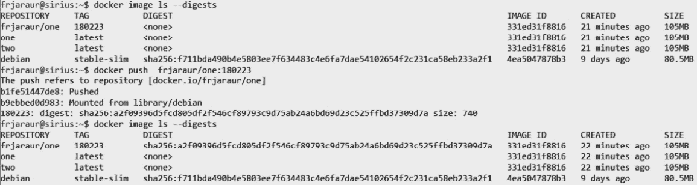
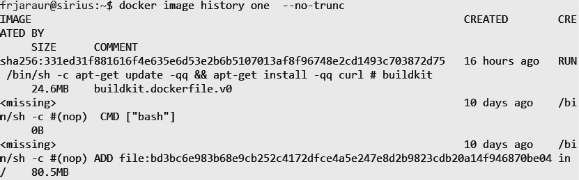

# 2

# 构建 Docker 镜像

作为软件容器运行的应用程序是一个相对较新的发展，也是避免底层基础设施问题的一种很好的方式。正如我们在上一章中所学到的，容器是利用宿主的内核执行的进程，通过内核中提供的特性（有时已存在多年）实现隔离，并被封装在自己的文件系统中。

在本章中，我们将使用容器镜像，它们是类似模板的对象，用于创建容器。构建这些镜像是创建你自己基于容器的应用程序的第一步。我们将学习不同的构建容器镜像的过程。这些镜像将成为我们新应用程序的产物，因此我们需要安全地构建它们，并准备在我们的笔记本电脑或计算机、预发布和生产服务器，甚至云提供的基础设施上运行它们。

在本章中，我们将讨论以下内容：

+   理解**写时复制（copy-on-write）**文件系统的工作原理

+   构建容器镜像

+   理解常见的 Dockerfile 关键字

+   创建镜像的命令行

+   高级镜像创建技巧

+   容器镜像创建的最佳实践

# 技术要求

在本章中，我们将教你如何构建容器镜像，并在你的代码编译工作流中使用它们。我们将使用开源工具，以及一些可以在非专业用途下无许可证运行的商业工具来构建镜像并验证其安全性。本章中还包含了一些实验，帮助你理解所介绍的内容。这些实验已发布在以下 GitHub 仓库：[`github.com/PacktPublishing/Containers-for-Developers-Handbook/tree/main/Chapter2`](https://github.com/PacktPublishing/Containers-for-Developers-Handbook/tree/main/Chapter2)。在这里，你将找到一些为了让章节更易于跟进而省略的扩展说明。本章的*实践代码*视频可以在[`packt.link/JdOIY`](https://packt.link/JdOIY)找到。

# 理解**写时复制（copy-on-write）**文件系统的工作原理

构建容器镜像是使用容器开发应用程序时的第一步。在本章中，我们将学习不同的镜像构建方法。但首先，深入探讨如何从文件系统角度创建镜像会很有趣。

容器是利用内核特性实现隔离运行的进程。它们运行在宿主系统上，拥有自己的文件系统，仿佛在各自的子系统内完全独立运行。这个文件系统中的文件被分成不同的层次，一层叠一层。需要修改的较低层文件会被复制到要进行修改的层，修改后会提交。新文件只会创建在上层。这就是**写时复制（CoW）**文件系统的基础。

正如我们所预期的，这种模型下，容器运行时将管理所有这些变化。每次文件修改都需要主机资源来在层之间复制文件，因此，使得这个机制在连续创建文件时成为一个问题。在上层创建新文件之前，必须读取所有层，以确保文件尚未存在，并将其内容复制到上层。

所有这些层在每次我们使用特定容器镜像作为模板创建容器时，都以**只读**模式呈现给容器，并且会在其他层上方添加一个新的**读写**模式层。这个新层将包含容器启动后所有的文件更改。然而，这种行为会出现在系统中所有运行的容器中。所有基于相同容器镜像的容器共享这些只读层，这在磁盘使用方面非常重要。只有**容器层**在每次执行新的容器时会有所不同。

重要提示

所有在不同容器执行之间应该持久化的数据，必须在容器生命周期之外声明和使用——例如，通过使用**卷**，正如我们将在*第四章*《运行 Docker 容器》中学习的那样。我们可以在容器镜像构建过程中声明卷，这表明内容存在于镜像层之外。

如我们所见，使用这些模板加速了容器创建并减少了我们系统中所有容器的大小。如果我们将其与虚拟机进行比较，它就像虚拟机模板或快照一样。只有更改被存储在主机级别，尽管这里需要特别提到的是，容器占用的空间非常少。

然而，在使用 CoW 文件系统时，性能总是会受到影响，这是你需要注意的。切勿将日志存储在容器层中，因为如果你删除容器，日志可能会丢失，且非常重要的一点是，由于任何文件的查找-复制-写入过程，应用程序性能可能也会受到影响。因此，我们绝不会在容器层中存储日志，尤其是那些不断写入文件或监控数据的进程。你应该将这些文件写入远程后端或使用容器卷功能。这种性能下降适用于大量小文件（成千上万），相反地（少量巨大文件），或有深层树结构的大量目录。作为开发者，你必须避免这些情况出现在你的应用中，并且应当提前准备好容器来避免它们。

现在我们了解了这些 CoW 文件系统的行为，适用于容器镜像的创建和执行，让我们学习如何构建镜像。

# 创建容器镜像

在本节中，我们将回顾构建容器镜像的不同方法，以及它们的优缺点和使用场景，以便你根据需求选择合适的方法。

创建容器镜像有三种方法：

+   在 Dockerfile 中使用基础镜像，Dockerfile 是一个配方文件，包含创建镜像时执行的不同自动化步骤。

+   交互式手动执行命令并存储生成的文件系统

+   从空文件系统开始，使用 Dockerfile 配方文件，只复制我们应用所需的二进制文件和库。

很容易看出，最后一种方法在安全性方面是最好的，但如果你的代码有很多依赖关系并且与操作系统文件紧密集成，那么这可能很难实现。让我们从最常见的方法开始，逐一探讨这些方法。

## 使用 Dockerfile 创建容器镜像

在我们描述这种方法之前，让我们先了解一下什么是**Dockerfile**。

Dockerfile 是一个符合**开放容器倡议**（**OSI**）规范的文件，作为创建容器镜像的配方，包含一步步的程序。它包含一组键值对，描述不同的执行步骤以及镜像行为的元信息。我们可以使用变量扩展在构建镜像时传递的参数，且它非常适合自动化。如果一个 Dockerfile 写得很好，我们可以确保它的可复现性。

以下是一个 Dockerfile 的示例：

```
FROM debian:stable-slim
RUN apt-get update -qq && apt-get install -qq package1 package2
COPY . /myapp
RUN make /myapp
CMD python /myapp/app.py
EXPOSE 5000
```

如前所述，这个文件描述了组装镜像所需的所有步骤。让我们快速概览一下所展示的 Dockerfile 中的步骤。

第一行，`FROM debian:stable-slim`，表示此容器镜像将作为基础镜像，因此它的所有层都会被使用。容器运行时会下载（*pull*）所有这些层，如果它们在我们的主机上不存在的话。如果其中任何一层已经存在于主机上，它们将被使用。这个层可能已经来自主机中的任何其他镜像。容器镜像的层是可以重用的。

第二行，`RUN apt-get update -qq && apt-get install -qq package1 package2`，执行所有作为值的内容。首先会执行`apt-get update -qq`，如果成功，则会执行`apt-get install -qq package1 package2`。这个完整步骤只会创建一个层，叠加在之前的层之上。此层会自动对使用相同执行的任何其他镜像启用，使用相同的`debian:stable-slim`基础镜像。

第三行，`COPY . /myapp`，会将当前目录下所有可用的文件复制到名为`/myapp`的目录，并在新的一层中完成。正如第二行提到的，这也为包含相同入口的任何新镜像创建了可重用的层。

第四行，`RUN make /myapp`，执行`make /myapp`命令并创建一个新的层。记住，这是一个示例。我们添加了`make`命令来构建源代码。在这一步骤中，例如，我们运行了一个先前在镜像中安装的编译器，并构建了我们的二进制文件。所有执行层（包含`RUN`键的层）应该正确退出。如果发生异常，镜像构建过程将中断并停止。如果发生这种情况，所有之前的镜像层将保留在你的系统中。容器运行时会创建一个层缓存，所有后续执行会默认重用它们。这种行为可以通过在构建过程中重新创建所有之前的镜像来避免。

最后的两步不会增加镜像层。`CMD`键声明了将执行的命令行（记住，容器运行的是一个主进程），`EXPOSE`则添加了有关应暴露（监听）哪个端口的元信息。通过这种方式，我们明确声明了应用程序将在哪个端口监听任何类型的通信。

重要提示

你应该在 Dockerfile 中声明所有相关的元信息，比如*暴露的端口*、*持久化数据的卷*、为你的主进程定义的*用户名*（或*用户 ID*）以及启动时应执行的命令行。这些信息可能是容器编排管理员所需要的，因为它们对于避免安全问题至关重要。他们可能会在生产平台上强制实施一些安全策略，以禁止你的应用程序执行。询问他们是否应用了一些安全策略，确保你已经添加了所需的信息。无论如何，如果你遵循本书中描述的安全实践，你在生产中可能不会遇到任何问题。

如你所见，这是一个相当可复现的过程。如果我们不做任何更改，这个配方每次都会创建相同的镜像。这帮助开发者专注于他们的代码。然而，创建可复现的镜像并不容易。如果你仔细查看所使用的`FROM`值，我们使用的是`debian:stable-slim`，这意味着默认镜像是`docker.io`。目前，你只需要知道注册表是所有容器镜像层的存储库。`FROM`键的值表示将使用一个特定标签为`stable-slim`的`debian`镜像，因此，如果 Docker 更改了这个镜像，你的所有镜像构建也会随之变化。标签是我们识别镜像的方式，但它们并不是唯一标识的。每个镜像及镜像中的层都是通过**摘要哈希**唯一标识的，这些才是你应该密切关注的真正相关值。为了获取这些值，我们要么需要拉取镜像，要么检查定义注册表中的信息。较为简单的方法是拉取镜像，这会在执行构建过程时自动发生，但在这个示例中，我们使用了一个模拟的 Dockerfile，因此它不会直接起作用。

所以，让我们从官方 Docker 镜像注册表 [`hub.docker.com`](https://hub.docker.com) 拉取镜像，或者使用 `docker.io` 命令行工具：

```
$ docker image pull debian:stable-slim
stable-slim: Pulling from library/debian
de661c304c1d: Pull complete
Digest: sha256:f711bda490b4e5803ee7f634483c4e6fa7dae54102654f2c231ca58eb233a2f1
Status: Downloaded newer image for debian:stable-slim
docker.io/library/debian:stable-slim
```

在这里，我们执行 `docker image pull debian:stable-slim` 从 `docker.io` 下载该镜像。所有相关的层将被下载。Docker Hub 网站提供了许多有用的信息，比如与镜像相关的所有标签以及在包含的文件中发现的漏洞。

上述代码片段中显示的摘要将唯一标识此镜像。我们可以通过执行 `docker image inspect` 并使用其 **镜像 ID** 来验证系统中的镜像并查看其信息：

```
$ docker image ls --no-trunc
REPOSITORY   TAG           IMAGE ID                                                                  CREATED      SIZE
debian       stable-slim   sha256:4ea5047878b3bb91d62ac9a99cdcf9e53f4958b01000d85f541004ba587c1cb1   9 days ago   80.5MB
$ docker image inspect 4ea5047878b3bb91d62ac9a99cdcf9e53f4958b01000d85f541004ba587c1cb1 |grep -A1 -i repodigest
        "RepoDigests": [
            "debian@sha256:f711bda490b4e5803ee7f634483c4e6fa7dae54102654f2c231ca58eb233a2f1"
```

所有与容器相关的对象都有唯一的对象 ID，因此我们可以用它们来引用每个对象。在这个例子中，我们使用镜像 ID 来检查对象。

重要提示

我们可以在列出本地镜像时使用 `--digests` 来检索所有镜像的摘要——例如，使用本节中的镜像：

`$ docker image` `ls --digests`

`REPOSITORY   TAG           DIGEST               IMAGE ID       CREATED      ``SIZE`

`debian       stable-slim   sha256:f711bda490b4e5803ee7f634483c4e6fa7dae54102654f2c231ca58eb233a2f1   4ea5047878b3   9 天前   ``80.5MB`

需要注意的是，镜像 ID 和其摘要是不同的。ID 代表当前在系统中生成的编译或标识符，而摘要则代表所有层的汇总，并且本质上可以在任何地方唯一标识该镜像——无论是在你的笔记本电脑、服务器上，还是在远程存储的注册表中。镜像摘要与镜像内容清单相关联（[`docs.docker.com/registry/spec/manifest-v2-2/`](https://docs.docker.com/registry/spec/manifest-v2-2/)），并用于 V2 注册表（目前大多数现代注册表实现使用的版本）。由于本地构建的镜像不符合注册表格式，因此摘要将显示为 `none`。将镜像推送到 V2 注册表后，情况将发生变化。

让我们通过查看一个简短且简单的示例来回顾这个过程以及镜像 ID 和摘要。我们将使用以下两行 Dockerfile 构建几个镜像：

```
FROM debian:stable-slim
RUN apt-get update -qq && apt-get install -qq curl
```

使用当前的 `debian:stable-slim` 镜像，我们将更新其内容并安装 `curl` 包。

我们将构建两个镜像，`one` 和 `two`，如下面的截图所示：


图 2.1 – 执行两个连续的容器镜像构建。预计没有变化，因此镜像是相同的

第一次构建过程将创建一个层缓存，因此第二次构建将复用这些缓存，构建过程会变得更快，因为层是相同的。安装过程不会被触发。我们使用当前目录作为**构建上下文**。像 Docker 这样的容器运行时是以客户端-服务器模型运行的，因此，我们通过 Docker 命令行与 Docker 守护进程进行交互。构建过程会将所有文件发送到*当前上下文*（*路径*）中的守护进程，以便它可以使用这些文件来创建镜像的文件系统。这一点至关重要，因为如果我们选择了错误的上下文，很多文件会被发送到守护进程，这将影响构建过程。我们应该正确指定包含代码的目录，这将在构建过程中使用。在这个上下文文件夹中，我们应避免放入二进制文件、库文件、文档等。需要注意的是，我们可以使用 Git 仓库（以 URL 格式）作为构建上下文，这使得 CI/CD 集成变得非常有趣。

为了避免在构建过程中将无关文件发送给守护进程，我们可以使用 `.dockerignore` 文件。在该文件中，我们将列出应该排除的文件和文件夹，即使它们存在于我们的构建上下文中。

让我们查看系统中这些图像的相关信息。如果我们执行 `docker image ls --digest`，将获得它们的图像 ID 和摘要：


图 2.2 – 创建的容器镜像列表，显示它们完全相同的 ID

我们首先可以看到的是，`one` 和 `two` 这两个镜像具有相同的镜像 ID。这是因为我们复用了它们的层。在第二次构建过程中，使用相同的 Dockerfile，容器运行时会复用所有先前相同的镜像层（那些来自相同执行的层），因此镜像创建非常快速。它们是相同的镜像，但有两个不同的标签。

我们还可以看到，只有基础镜像显示了它的摘要。正如前面所提到的，它是唯一来自 V2 注册表的镜像。如果我们将某个镜像上传到*Docker Hub*（或任何其他支持 V2 的注册表），它的摘要将会被创建。

重要提示

要能够将图像上传到 Docker Hub，您需要一个有效的账户。通过访问[`hub.docker.com/signup`](https://hub.docker.com/signup)来创建您的账户。这个过程非常简单，您将在一分钟内拥有一个 Docker Hub 注册账户。

让我们来看一下上传镜像的工作原理，以及它如何生成不可变且唯一的引用摘要。

在启动过程之前，我们只需使用账户名登录 Docker Hub。系统会提示输入密码，之后我们应该会收到 `Login` `Succeeded` 消息：

```
$ docker login --username <YOUR_USERNAME>
Password:
Login Succeeded
Logging in with your password grants your terminal complete access to your account.
For better security, log in with a limited-privilege personal access token. Learn more at https://docs.docker.com/go/access-tokens/
```

现在我们已经登录，需要重新标记我们的镜像。镜像标签是我们用来引用镜像的易读格式。在本示例中使用的构建过程中，我们通过命令行输入 `docker build –t <TAG>`，将 `one` 和 `two` 作为标签。然而，我们看到这两个镜像是相同的；因此，我们可以说标签是镜像 ID 的名称，这可能会让您感到困惑。*我们能信任镜像标签吗？* 简短的回答是，*不，我们不能*。它们并不代表一个唯一的镜像状态。我们可以为镜像 ID 使用不同的标签并修改这些镜像，但如果您仍然使用这些标签，您将使用完全不同的镜像。在我们的示例中，任何人都可以更改我们的 `debian:stable-slim` 镜像。如果我们基于这个标签重新构建某些镜像，我们将创建一个具有完全不同内容的新镜像。如果新镜像包含一些代码漏洞，因为恶意攻击者将其包含在该基础镜像中呢？在像 Docker Hub 这样的高度受控的镜像注册表中，这不应该发生，但这个问题确实存在。

让我们重新标记并上传我们的镜像，使用 `docker tag` 然后 `docker push`：



图 2.3 – 标记和推送镜像以获取其摘要

请注意，我们需要推送镜像。仅重新标记并不起作用。现在，我们拥有一个唯一的镜像，任何人都可以使用我们的标签来引用它。如果我们更新了我们的`one`镜像，添加了一些新内容或更改了要执行的命令行，这个摘要将发生变化。即使我们仍然使用相同的`frjaraur/one`标签，使用我们的镜像进行的新构建过程也将创建新的内容。

重要提示

作为开发者，您应该注意您作为参考来创建镜像时所使用的镜像中引入的任何更改。您可能会想知道管理这些更改的正确方法是什么。简短的回答是：始终使用镜像摘要（遵循示例标签和摘要，我们将使用`FROM debian:stable-slim@sha256:f711bda490b4e5803ee7f634483c4e6fa7dae54102654f2c231ca58eb233a2f1`）。这种方法可能非常复杂，但它是最安全的。另一种方法是使用您自己的私有注册表，隔离于互联网，在其中存储您的镜像。使用您自己管理的私有注册表，您可以放心使用镜像标签。您将是唯一能够更新您的基础镜像的人，因此，您管理整个镜像生命周期。

正如我们在本示例开始时提到的，我们使用相同的 Dockerfile 构建了两个镜像，并且我们意识到这两个镜像具有相同的镜像 ID；因此，它们是完全相同的。让我们稍微改变一下，使用 `docker build –no-cache` 选项，这样可以避免重新使用先前创建的层：


图 2.4 – 执行无缓存的镜像构建过程

我们可以看到，即使使用相同的 Dockerfile，仍然构建出了一个全新的镜像。这是由于执行之间的时间差异。因为我们在两个不同的时间点进行了修改，所以下次构建执行时，层会发生变化。当然，我们也可以包括由于软件包更新带来的新变更，但在这种情况下，情况更加简单。

我们可以从中学到的是，重用层有助于保持镜像的大小和构建时间（在这个例子中我们没有注意到这一点，因为我们使用了一个简单的两行 Dockerfile，但当你在为代码编译或下载大量模块时，这可能需要很长时间），但是当我们需要刷新镜像内容时，禁用缓存是必须的。当我们为项目创建基础镜像文件时，这一点非常有用——例如，我们自己的 .NET Core 和 Python 项目。我们将使用这些基础镜像并将它们上传到我们的注册中心，确保它们的内容是可靠的。当新的发布版本到来时，我们可以重建这些镜像以及它们的所有依赖镜像（我们的应用镜像）。这个过程应该是我们自动化 CI/CD 管道的一部分。

现在我们已经理解了如何使用 Dockerfile 构建镜像，接下来我们将介绍一种在某些特定情况下非常有用的新方法。

## 交互式创建容器镜像

我们之前没有提到，但这里需要特别指出，Dockerfile 中的 `RUN` 行会创建中间容器来执行命令，这些命令作为 `RUN` 键后的值书写。因此，`docker build` 命令启动了一系列链式容器，这些容器创建了最终构成镜像的不同层。在执行新容器之前，这个过程会将修改过的文件（容器层）存储到系统中，使用容器运行时的 `commit` 功能。

这些容器一个接一个地运行，使用前一个容器创建的层。我们即将描述的交互式过程以简化的方式遵循这一工作流。我们将运行一个容器，使用镜像作为基础，并手动运行和复制应用程序所需的所有命令和内容。变更将在运行时创建，当我们完成后，我们将提交创建的容器层。当我们需要安装要求交互式不同配置的软件，并且无法自动化此过程时，这种方法可能会很有趣。

这种方法缺乏可重现性，如果我们能找到一种方法来自动化镜像创建过程，就不应该使用它。没有人会知道你是如何在镜像中安装内容的（如果你没有删除它，shell 历史会包含这些步骤，但交互式命令不会出现）。让我们介绍一个可以帮助我们了解镜像如何构建的命令——`docker image history`。这个命令显示了创建镜像的所有步骤，包括在过程中添加的元信息，按倒序排列。

让我们看一下使用上一节中提到的一个镜像的输出，*使用 Dockerfile 创建* *容器镜像*：



图 2.5 – 回顾用于创建容器镜像的所有步骤

镜像历史记录必须从最新的行开始按逆序读取。我们将从 `ADD` 键开始，这代表了我们 Dockerfile 中的初始 `FROM` 键。这是因为 `FROM` 键被解释为将所有基础镜像的内容复制到基础层之上。

我们使用了`–-no-trunc`选项，以便从输出中读取完整的命令行。我们可以很容易地看到，这个镜像是通过 `/bin/sh -c apt-get update –q && apt-get install –qq curl` 命令创建的。`docker image history` 命令将显示我们从 Dockerfile 构建任何镜像时执行的步骤，但它对交互式创建的镜像无效。

让我们看一个使用 *Debian* 镜像安装 Postfix 邮件服务器的简单示例：


图 2.6 – 手动执行 Postfix 邮件包

一旦安装过程完成，我们将被提示配置服务器的各个方面。这些配置是完全交互式的：


图 2.7 – Postfix 安装是交互式的，因为它要求用户进行特定配置

安装过程中将要求你进行一些交互式配置，之后 Postfix 服务器将准备好工作。我们可以通过执行 `exit` 来退出容器进程，然后将容器层作为新镜像提交。我们使用 `docker container ls –l` 仅列出最后执行的容器，然后执行 `docker commit`（或 `docker container commit` — 两个命令都可以使用，因为它们都指容器）将当前容器层保存为新镜像：


图 2.8 – 提交容器层以创建图像

然而，正如我们之前提到的关于此方法的内容，我们无法知道创建图像时所采取的步骤。

让我们试试使用 `docker image` 的 `history` 命令：


图 2.9 – 当执行交互式过程时，历史记录不会显示任何命令

我们在输出中看到的只是我们使用`bash`做了某些事情。我们将在它的`.bash_history`文件中看到命令，但这并不是应有的做法。如果你必须在特定情况下使用这种方法，例如当应用程序的安装需要一些交互步骤时，记得将你所做的所有更改记录在文件中，以便其他开发人员理解你的过程。

这种方法不推荐使用，因为它不可重复，并且我们无法向容器镜像中添加任何元信息。在下一节中，我们将描述可能是解决此问题的最佳方法，但它需要对应用程序的二进制文件、库以及隐藏的依赖项有大量的了解。

## 从零开始创建镜像

在这种方法中，正如其名称所示，我们将创建一个空层，并通过使用一组打包好的文件来引入所有文件。你可能已经注意到，我们迄今为止看到的所有图像历史都涉及使用`ADD`关键字作为第一步。这就是容器运行时启动构建过程的方式——通过复制基础镜像的内容。

使用这种方法，你可以确保只有明确需要的文件会被包含在容器镜像中。它与 Go 等编程语言配合得非常好，因为你可以将所有依赖项都包含在二进制文件中；因此，添加已编译的工件可能就足以使应用程序正常工作。此方法也使用 Dockerfile 文件，但在这种情况下，我们将从简单的`FROM scratch`行开始。这将为我们的文件创建一个空层。让我们看一个简单的 Dockerfile 示例：

```
FROM scratch
ADD hello /
CMD ["/hello"]
```

这是一个简单的 Dockerfile，我们只是添加文件和元信息。它将包含我们的二进制文件，基于一个空结构，并包含构建完整容器镜像所需的元信息。正如你所想，这种方法创建了最安全的镜像，因为攻击面完全被缩减为我们自己的应用程序。开发人员可以从零开始创建镜像，打包他们应用程序所需的所有文件。这样做可能非常棘手，需要付出很多努力来包含所有依赖项。正如本节前面提到的，这种方法在运行静态二进制文件的应用程序中效果非常好，因为这些二进制文件已经包括了所有依赖项。

这种方法还可以用于创建基于外来或高度自定义操作系统的镜像，这些操作系统没有基础镜像。在这些情况下，你应该删除所有不需要的文件和对底层硬件的所有引用。这可能非常困难，这也是为什么通常推荐使用官方容器镜像的原因。我们将在*第三章*中了解更多有关不同类型镜像的内容，并且如何确保它们的来源、不可变性和所有权，*发布* *Docker 镜像*。

现在我们知道了如何使用不同的方法制作容器镜像，我们应该回顾一下在 Dockerfile 中将使用到的最重要的关键字。

# 理解常见的 Dockerfile 键

在本节中，我们将查看最重要的键及其最佳实践。为了全面了解，最好参考 Docker Inc. 提供的文档 ([`docs.docker.com/engine/reference/builder/`](https://docs.docker.com/engine/reference/builder/))。

容器运行时可以通过读取写在 Dockerfile 中的一系列指令来创建容器镜像。遵循这种类似配方的文件，容器运行时将组装出容器镜像。

## FROM

所有 Dockerfile 都以 `FROM` 键开始。此键用于设置基础镜像并初始化构建过程。我们可以使用任何有效的容器镜像作为 `FROM` 键的有效值，并且保留了 `scratch` 关键字，用于基于空层构建镜像。

一个 Dockerfile 可以包含多个镜像构建过程，尽管通常我们会为每个过程使用不同的文件。

我们可以通过名称和标签来引用镜像，还可以包括其摘要以确保镜像的唯一性。如果没有使用标签，则会自动使用 `latest` 标签。尽量避免这种不良做法，并始终使用合适的标签，或者更好地，在使用公共镜像注册中心时，添加其摘要。还可以使用 `AS` 键为每个构建过程定义一个引用。通过这种方式，我们可以在使用唯一 Dockerfile 构建的容器镜像之间共享内容。**多阶段构建**是一种将内容从一个镜像复制到另一个镜像的做法。我们将在本章稍后的*高级镜像构建过程*部分探讨一个用例。

如前所述，Dockerfile 可以包含多个构建定义，我们将使用 `AS` 键为其命名，这样我们可以仅执行特定的目标，并使用 `–-``target` 命令。

要修改构建过程的行为，我们将使用 `ARG` 和 `ENV` 键。我们可以使用 `–-build-arg` 选项在构建过程中包含额外的参数，当找到 `ARG` 键时，容器运行时将评估这些值。以下行显示了如何将参数传递给 `build` 命令的示例：

```
$ docker image build –build-arg myvariable=myvalue –tag mynewimage:mytag context-directory –file myDockerfile
```

这里需要注意，我们通过添加 `–file` 参数使用了特定的 `context` 和非默认的 Dockerfile。我们还将 `myvalue` 添加到了 `myvariable` 变量中，并且应该在 `myDockerfile` 文件中包含 `ARG` 键，以扩展此值。

## ARG

`ARG` 是唯一一个可以在 `FROM` 之前使用的键，用于使用构建参数——例如，选择特定的基础镜像。作为开发者，您可能希望为生产和开发使用两个不同的镜像，可能有一些小的修改，比如启用调试标志。我们将只使用一个 Dockerfile，但会根据传递的参数触发两个构建过程。以下简单示例可以帮助您理解这一用例：

```
ARG CODE_VERSION=dev
FROM base:${CODE_VERSION}
CMD /code/run-app
```

每当我们需要构建生产环境镜像时，我们将使用`–build-arg CODE_VERSION=prod`，并使用特定的基础镜像`base:prod`，该镜像可能包含较少的文件和二进制文件。

通常还会将`ENV`关键字与`ARG`一起使用。`ENV`关键字用于在构建过程中为容器添加或修改环境变量——例如，向`LD_LIBRARY`添加某些路径或更改`PATH`变量。然后，`ARG`可以用于在运行时修改环境变量。

要在最终的容器镜像中包含元信息，我们可以使用`LABEL`关键字。标签将帮助我们识别所使用的框架、发布版本、内容的创建者和维护者等，甚至是其使用的简短描述。

重要提示

OCI 定义了一些可以使用的约定标签，使用它们可能比自己创建标签更有趣，因为许多应用程序已集成此标准。你可以在[`github.com/opencontainers/image-spec/blob/main/annotations.md`](https://github.com/opencontainers/image-spec/blob/main/annotations.md)查看这些标签。你会找到像`org.opencontainers.image.authors`、`org.opencontainers.image.vendor`和`org.opencontainers.artifact.description`等标签，所有这些都是标准标签，已集成到许多容器相关工具中。

## WORKDIR

在 Dockerfile 中定义的所有命令执行都将在相对工作目录中运行。我们可以通过使用`WORKDIR`关键字来改变这一点。一旦在 Dockerfile 中定义，所有后续定义的步骤将使用此环境——例如，复制文件到镜像层内。

## COPY 和 ADD

向镜像层中添加文件是必须的。我们将包括我们的代码或二进制文件、库、一些静态文件等。然而，我们不应该添加证书、令牌、密码等。一般来说，任何需要一定安全性或可能频繁变化的内容，必须在运行时包含，而不是在镜像层中。

我们可以使用`COPY`和`ADD`关键字将文件添加到镜像层中。`COPY`指令将文件和目录复制到指定的镜像路径。如果源使用相对路径，文件必须包含在构建上下文目录中。如果目标使用相对路径，则会使用`WORKDIR`关键字作为参考路径。我们还可以通过使用`–-from=<IMAGE_TARGET_NAME>`从在同一 Dockerfile 中声明的其他镜像复制文件。需要注意的是，可以使用`–-chown=<USERNAME or USERID>:<GROUPNAME or GROUPID>`命令更改文件所有权；如果省略，则将使用当前容器执行步骤中的用户。

`ADD`的功能与`COPY`相似，但在这种情况下，你可以使用远程 URL 作为源，也可以使用 TAR 和 gzip 打包文件。如果使用压缩和打包的文件，它将在指定的目标位置自动解包和解压。

所有传递的文件都会根据镜像文件的校验和进行验证，但修改时间不会被记录，因此在执行构建过程之前，你必须注意对文件所做的更改。最好为那些经常编辑的文件（例如你的应用程序代码）添加单独的`COPY`命令，或者如果不确定文件更改是否已正确复制，可以简单地禁用缓存。

为了避免将某些文件复制到我们的项目文件夹中，我们可以使用`.dockerignore`文件。该文件包含不应包含在 Docker 构建上下文中的文件列表，因此这些文件将不会被复制到镜像层中。

## 运行

`RUN`关键字用于在构建过程中创建的容器内部执行命令行。这个操作是创建容器镜像的基础。所有传递给该关键字的命令将会被执行，结果生成的容器层将作为一个新的镜像层提交；因此，所有的`RUN`命令都会创建一个层。只有`COPY`、`ADD`和`RUN`关键字会创建镜像层；其他任何关键字都不会增加镜像的大小，因为它们只是修改了镜像的行为或添加了元数据。你可能会看到`RUN`命令使用多行，从`&&`开始，使用`\`结束。这种简单的技巧可以避免为每个执行的命令创建新的层。通过这种方式，你可以将多个执行操作连接到一行，并将其拆分成多行以便阅读。行会被视为单行，因此只会创建一个层。在此过程中需要小心，因为这样做可能会丧失层的可复用性，这种方法也可能掩盖构建过程中的错误。如果你遇到包含大量命令的长命令行的问题，可以将它们分解为多个执行操作，以隔离错误，解决后再将命令行重新连接成一行。

一个简单的例子如下所示：

```
RUN apt-get update –qq \
&& apt-get install --no-install-recommends --no-install-suggests –qq \
curl \
ca-certificates \
&& apt-get clean
```

这五行命令会被解释为在同一个容器中执行的三次不同操作，因此它们只会为最终镜像创建一个层。

重要的是要理解，构建过程不会存储进程状态。这意味着如果我们运行一个进程，并且期望在下一个`RUN`命令执行时该进程仍然运行，它不会继续运行，因为容器运行时只会存储来自容器层的文件。这同样适用于服务或守护进程。如果你期望某些进程已经在运行，并且你应用了一些数据或文件到这些进程中，构建过程将无法正常工作。每次执行在`RUN`命令被处理时就结束了。

## 用户

默认情况下，容器运行时会以`userid`执行容器中的所有命令，该`userid`在基础镜像中定义。如果我们从头开始创建镜像，默认会以`root`用户运行。你会发现大多数官方的 Docker 容器镜像都会以`root`身份运行。Docker 公司及其他供应商准备他们的镜像以允许你安装和管理额外的软件和二进制文件。你应该确保你的镜像遵循*最小权限*原则，因此，必须声明哪个用户将运行容器的主进程。Dockerfile 中的`USER`关键字将帮助我们定义这个用户，甚至可以在同一个 Dockerfile 中多次切换用户。切换用户将确保每一行 Dockerfile 都以适当的用户运行，而使用该镜像创建的容器也会以正确的用户身份运行。

强制避免使用具有特权的用户容器。这基本上将保护你的应用程序和底层基础设施。如果你需要使用`root`或其他特权用户，应该明确声明这种情况。例如，你可以使用标签来表明你的镜像需要特权账户才能运行。

重要说明

如果你正在开发需要 root 用户执行的应用程序，可以使用用户命名空间映射。此功能允许我们将容器的 root 用户与主机中的普通用户映射。如果需要设置此功能，你可以参考[`docs.docker.com/engine/security/userns-remap/`](https://docs.docker.com/engine/security/userns-remap/)中提供的说明。

## ENTRYPOINT

现在，让我们介绍如何声明将在哪些进程中运行的内容。以下关键字会添加必要的元信息，用于定义镜像中将运行的二进制文件或脚本。

我们将使用`ENTRYPOINT`关键字来定义容器将运行的主进程。如果未定义此关键字，则 Linux 容器将使用`/bin/sh` shell，Microsoft Windows 容器将使用`cmd.exe`。这个关键字可能已经在基础镜像中被修改为自定义值，但我们也可以在 Dockerfile 中重写它，以修改容器的行为。

你还可以使用`CMD`关键字，它允许你指定应该传递给 shell、Windows 命令或任何其他已定义`ENTRYPOINT`的参数。因此，我们可以将主进程的执行理解为`ENTRYPOINT`和`CMD`关键字的拼接或叠加。例如，如果我们使用默认的`/bin/sh` shell 的`ENTRYPOINT`，并将`CMD`关键字定义为`ping 8.8.8.8`，那么在容器内执行的最终命令将是`/bin/sh -c ping 8.8.8.8`；换句话说，shell 会被扩展来执行我们的`ping`命令。我们可以在容器创建时修改它们中的任何一个，但请记住，使用`USER`关键字定义的用户将是进程的拥有者。

如前所述，我们可以通过更改这些非常重要的键来更改镜像行为。`ENTRYPOINT` 和 `CMD` 由容器运行时作为数组管理，尽管我们可以在 Dockerfile 中将它们定义为字符串，这在手动执行容器时也常用。容器运行时会将这两个数组连接在一起，构建最终的命令行。由于这种行为，将 `ENTRYPOINT` 设置为字符串会强制忽略 `CMD`，但我们可以在 `ENTRYPOINT` 为数组时将 `CMD` 设置为字符串，`CMD` 会被视为大小为 0 的数组。

这两个值可以在容器执行时被覆盖，但通常我们会通过使用 `CMD` 自定义容器参数；因此，该键可以作为 Dockerfile 中的默认值使用。作为开发者，您应尽可能提供关于应用程序行为的详细信息，以使其更具可用性，`LABEL`、`USER` 和 `CMD` 必须出现在您的 Dockerfile 中。

## EXPOSE

我们还应该将 `EXPOSE` 键添加到此列表中，该键定义了您的应用程序将使用的端口。您可以根据需要定义多个端口，并指定将使用的传输协议，无论是 TCP 还是 UDP。通过这些信息，您可以确保任何使用您的应用程序的人都知道您的进程将监听哪些端口。

以下示意图展示了一个简单的 Dockerfile 堆栈的实际操作，包括位于顶部的容器层：


图 2.10 – 使用 Dockerfile 创建的容器镜像层的示意图。容器层位于顶部，用于跟踪由进程创建的更改

此图表示使用 `docker image history` 命令获得的顺序。对于这个例子，我们执行了以下步骤：

1.  我们使用了一个简单的 `alpine:3.5` 基础镜像。我们更新了包源并安装了 `nginx` 和 `curl`。

1.  接下来，我们准备了 NGINX 日志，将它们的输出流式传输到 `/dev/stdout` 和 `/dev/stderr`。这将确保我们能够通过容器运行时读取应用程序日志，因为这些描述符将被容器的主进程使用。

1.  我们复制了自定义的 NGINX 配置文件，覆盖了默认配置文件。

1.  我们暴露了端口 `80`，这表示我们的主要进程将在该端口上监听。

1.  最后，我们定义了默认的命令行。在这种情况下，`/bin/sh -c "nginx –g daemon off;"` 将在每次使用此镜像运行容器时执行。

## HEALTHCHECK

为确保主进程在容器内正确运行，我们应该添加健康检查探针，以指示该进程是否健康。假设我们运行的是一个 Web 服务器应用程序，假如它卡住了，进程会继续运行，但功能完全丧失。为了解决这个问题，我们可以使用`HEALTHCHECK`键来定义一条命令行，以检查我们主应用程序的健康状态。我们可以使用带有参数的脚本或二进制文件，比如 Web 服务器的`curl`，或者运行数据库服务器时使用的数据库客户端。对于健康检查来说，重要的一点是，如果应用程序正常运行，命令应正确退出（`exit 0`）。如果我们的检查进程以任何其他信号退出，容器会因为应用程序被标记为不健康而停止运行。`HEALTHCHECK`键允许我们管理如何执行检查，以确保应用程序持续运行。我们可以修改标记主进程为不健康的检查次数以及检查的间隔。当达到定义的尝试次数并且返回负面响应（任何非 0 的退出代码）时，容器运行时会收到通知，即使主进程看似正常运行，服务已经不可用，容器应该停止。通常，这意味着会创建一个新的健康容器，但为了使这个过程正常工作，我们应该配置容器使用`restart: always`选项。我们将在*第三章*中深入探讨容器执行，*运行* *Docker 容器*。

## VOLUME

在本节结束时，我们将回顾一下`VOLUME`键。由于容器镜像的构建过程依赖于多个容器的执行及其层的存储，因此该键用于避免某些目录在容器生命周期内的变化。建议使用此键来指示您为持久化存储准备的镜像中的文件夹。您可以在所有`RUN`键之后使用此键，以避免在构建过程中丢失应用程序的文件夹。

我们已经在本章的*实验室*部分提供了这些键的清晰和简洁的示例，以帮助您理解它们的使用。

在接下来的章节中，我们将为您介绍一些常用的命令行选项，这些选项通常用于构建容器镜像。

# 创建镜像的命令行

本节中，我们将详细介绍 Docker 以及其他常用的工具，您将使用它们来为您的项目创建容器镜像。

我们将从回顾最流行的工具之一——`docker`命令行开始，因其简单性和友好的环境，成为了开发者和用户的首选。

Docker 对所有参数和选项使用统一的模式。我们将使用 `docker <OBJECT> <ACTION> <OPTIONS>`。由于 Docker 容器运行时通过 ID 来识别其对象，因此通常会省略 `<OBJECT>` 原语，但你应该确保使用正确的对象。犯错的可能性很小，但记得在命令中包含对象是一个好习惯。

让我们从基础开始——也就是学习哪个命令可以创建镜像。

## 创建镜像的操作

我们使用 `build` 操作通过 Dockerfile 创建镜像。默认情况下，它会在当前目录中搜索文件，但我们可以使用任何名称和路径来存储我们的构建清单。我们必须始终声明构建上下文，通常我们会使用 `–tag` 选项来为镜像定义名称和标签。以下是其常见用法的示例：


图 2.11 – 执行简单的镜像构建过程

在这个例子中，`context2` 是包含所有应传送到容器运行时的文件夹名称，其中一些文件应复制到最终镜像中。

这里是你可能会添加到 `docker` `image build` 中的一些最常见选项：

+   `--build-arg` 是我们为构建过程提供参数的方式。它通常与 `ARG` Dockerfile 关键字一起使用来修改镜像创建——例如，我们可以使用 `build` 参数将一些**证书** **授权**（**CA**）证书添加到命令中。

重要提示

当你处于代理服务器后面时，通常会使用 `–build-arg` 传递著名的 Linux `HTTPS_PROXY`、`HTTP_PROXY` 和 `NO_PROXY` 变量作为参数：

`docker build --build-arg` `HTTP_PROXY=$http_proxy \`

`--build-arg HTTPS_PROXY=$http_proxy --build-arg` `NO_PROXY="$no_proxy" \`

`--build-arg http_proxy=$http_proxy --build-arg` `https_proxy=$http_proxy \`

`--build-arg no_proxy="$no_proxy" -t` `myimage:tag mycontext`

+   `--force-rm` 会清除所有中间容器。默认情况下，在构建过程中创建的所有容器都会保留在主机中，除非你的进程成功结束，否则会占用磁盘空间。如果你知道构建过程会创建较大的层（例如，当你的应用程序在容器中编译并创建了许多依赖项，之后过程失败时），清理中间容器是一个好习惯。

+   `--label` 允许你为容器镜像添加额外的标签。添加所有必要的信息，例如特定的库版本、作者、简短的描述以及任何能够帮助其他开发人员理解你的内容的信息，都会受到极大的赞赏。

+   `--no-cache` 将让我们决定是否使用之前创建并本地存储的层。使用此参数时，构建过程会创建新的层，即使这些层已经存在于主机中。请注意，如果没有缓存，所有过程都会被执行并将中间容器数据存储在本地；因此，构建将花费更多的时间。通过尽可能多地重用已经包含在主机中的层，你将获得更快的构建过程。这对于在镜像构建中编译应用程序时尤其重要，因为如果没有缓存，任何微小的变化都会导致进程的完全重启。

+   `--target` 用于标识 Dockerfile 中的构建定义。它可以表示一个特定的编译过程或多阶段构建中的某个阶段。例如，我们可以使用目标来维护一个包含不同构建定义的唯一 Dockerfile，如 `small`、`complete` 和 `debug`，每个定义需要不同的步骤和基础镜像。我们可以触发一个特定定义的构建过程，以构建适用于生产环境的最小发布版本。这个过程也可以通过参数进行管理，根据变量选择不同的基础镜像。

+   `--cpuquota`、`--cpu-shares` 和 `--memory` 将帮助我们管理每个构建过程可用的资源。如果你在桌面计算机上资源不足，这一点尤其重要。

现在我们已经了解了用于构建镜像的命令行，让我们来看一下如何管理镜像。

## 管理容器镜像

容器镜像将存储在主机的不同目录中，将数据文件与元数据分离。文件的存储位置将取决于你使用的容器运行时，或者在 **Podman** 的情况下，它们可能会存储在你的主目录中。这个运行时以无根模式运行，并且没有守护进程，因此非常适合用户容器。无论如何，你将永远无法直接访问容器镜像文件。

在 Docker（以及其他任何容器运行时客户端）中最常用的操作之一是 `list`（或 `ls`），用于列出主机（或远程运行时）中可用的对象。默认情况下，镜像可以通过它们的名称（或仓库——我们将在*第三章*《Docker 镜像的传输》）中学习如何存储和管理镜像）、ID、标签、创建时间和大小来表示。在这个上下文中，大小是镜像在主机上占用的空间。镜像越小越好，这也是为什么作为开发人员，你应该关注镜像的内容。只包含绝对必要的文件，并考虑你的层策略，尤其是在你与项目共享依赖项时。使用 `.dockerignore` 文件来避免不必要的文件，因为这可以帮助你节省大量空间：

```
$ docker image list
REPOSITORY     TAG           IMAGE ID       CREATED        SIZE
example1       0.0           f7bba7eac35e   22 hours ago   9.51MB
postfix        test          a8768bd1ec8f   2 days ago     169MB
four           latest        3de85feddb15   2 days ago     105MB
three          latest        55f07527310e   2 days ago     105MB
frjaraur/two   180223        8e64333d6033   2 days ago     105MB
frjaraur/one   180223        331ed31f8816   2 days ago     105MB
one            latest        331ed31f8816   2 days ago     105MB
<none>         <none>        7ed6e7202eca   About a minute ago 72.8MB
alpine         latest        b2aa39c304c2   10 days ago    7.05MB
debian         stable-slim   4ea5047878b3   12 days ago    80.5MB
```

上面的代码片段显示我们有多个名称（仓库）包含相同的内容；我们知道这一点是因为它们有相同的 ID。具有相同 ID 的镜像是相同的，它们只是在标签上有所不同。因此，我们可以为镜像添加多个标签。我们将使用`docker tag <ORIGINAL> <NEWTAG>`来标记镜像。为了能够将镜像上传到注册表，这是必要的，因为它们存储在自己的仓库中。标签将帮助您在我们的注册表中识别镜像，但尽管标签在每个仓库中是唯一的，我们仍然可以有多个标签指向相同的镜像，您需要确保使用的是正确的镜像。

开发人员可能会选择按照应用程序的生命周期来标记他们的镜像，您可能会遇到许多使用`release.minor.fixes`模型标记的镜像。这是一种良好的做法，添加一些关键标签来识别作者、项目等，会改善您的工作。

您可能还注意到有一个没有标签或名称的镜像。这是一个*悬空*容器镜像，它没有被其他镜像使用，并且因为另一个使用相同仓库和标签的镜像被创建而未被标记。它没有被任何镜像引用，现在只占据空间。这些悬空的镜像应该被删除，我们可以使用`docker image prune`来删除它们。

要删除单个镜像，我们可以使用`docker image rm <IMAGE>`。需要理解的是，如果镜像在容器或其他镜像中有引用，是无法删除的。我们可以通过使用`–force`来强制删除，但只有在容器被停止（或已死）的情况下才有效。还值得注意的是，可以通过使用镜像的 ID 来删除多个镜像标签，而不是使用它们的镜像仓库名称。

要查看容器镜像对象中包含的所有信息，我们可以使用`docker image inspect <IMAGE>`。该命令将展示非常有用的信息，包括镜像摘要（如果镜像有来自注册表的引用）、镜像构建时的架构、其标签、层次结构，以及用于启动容器的配置，比如环境变量和需要执行的主要命令。

值得介绍一些格式化和过滤选项，我们可以在某些命令中使用：

+   `--filter`将允许我们使用定义的标签从列表中过滤对象。这适用于容器运行时提供的任何列表——例如，如果我们使用`environment`键标记了我们的镜像，我们可以用它来获取特定的镜像：

    ```
    $ docker image list --filter label=environment
    REPOSITORY     TAG           IMAGE ID       CREATED        SIZE
    frjaraur/two   180223        8e64333d6033   2 days ago     105MB
    frjaraur/one   180223        331ed31f8816   2 days ago     105MB
    $ docker image list --filter label=environment=production
    REPOSITORY     TAG           IMAGE ID       CREATED        SIZE
    --format works with *Go templates* to manipulate output for listing (and logs from containers). The container runtime and clients work with *JSON* streams; hence, using these templates will help us interpret objects’ data. For example, we can use table to obtain a table-like output, with the keys we need to review:

    ```

    $ docker image list \

    --format "table {{.Repository}}:{{.Tag}}\t{{.Size}}"

    REPOSITORY:TAG        SIZE

    example1:0.0          9.51MB

    postfix:test          169MB

    frjaraur/two:180223   105MB

    two:latest            105MB

    one:latest            105MB

    frjaraur/one:180223   105MB

    alpine:latest         7.05MB

    docker image ls --format "{{json .}}"。要获取特定镜像的所有标签，我们可以使用`docker image inspect <IMAGE> --format "{{ index .Config.Labels }}"`。

    ```

    ```

在下一节中，我们将学习命令行中可用的选项，用于在主机或用户之间共享镜像。

## 共享镜像的操作

你可能在想，所有这些示例都是基于主机构建的，因此我们需要能够将我们的镜像与其他开发者共享，甚至将它们迁移到准备好管理应用程序生命周期的服务器上（例如测试、预生产、认证或生产环境）。我们可以将容器镜像导出并导入到新位置，但使用镜像注册中心是更好的选择，因为这些存储库将与容器的协调器共享，而容器运行时将自动为我们执行拉取过程。

`docker image pull` 和 `docker image push` 分别用于拉取和推送镜像。为了使其正常工作，通常需要登录到你的注册中心。要访问你的注册中心，你需要用户名和密码。Docker Hub（`docker.io`）可能是最知名的容器注册中心。它作为一个云服务，提供镜像存储、扫描和自动化镜像构建的功能。还有其他选项；所有云提供商都提供注册中心服务，许多代码仓库也提供镜像存储（因为它们被视为代码工件）。我们可以在本地部署一些这些解决方案，但我们也可以找到像 VMware 提供的 Harbor 这样的解决方案，它专门为数据中心准备。你可能会注意到，容器运行时也存储镜像，事实上，它可以被认为是一个注册中心——一个本地注册中心。`podman` 命令行工具支持本章中描述的所有操作，并且可以作为 Docker 客户端的替代品，它将你的镜像构建为 `localhost/IMAGE_NAME:TAG`，其中 `IMAGE_NAME` 是仓库的名称。我们将在*第三章*《运输 Docker 镜像》中学习镜像注册中心是如何工作的；现在，我们只回顾一些最常用的共享镜像的选项。

当有人请求我们提供镜像时，我们可以使用 `docker image save` 将容器镜像导出到一个文件中。这将完全打包所有层和元信息。默认情况下，标准输出将用于流式传输所有数据，但我们可以使用 `–output` 选项指定一个文件。你可以将这个文件复制到另一个工作站或服务器，并执行 `docker image load` 来导入所有镜像层和元数据。默认情况下，该命令将使用标准输入，但我们可以添加 `–input` 选项来指定一个文件：


图 2.12 – 将镜像保存到文件中以便共享很简单

我们可以验证镜像大小是否保留，并且如果列出包文件中包含的文件，我们将获得层和元数据文件。

Docker 客户端可以使用`docker image load`将镜像集成到本地注册表中，但我们也可以使用`docker image import`仅上传镜像层。这一点很有趣，因为它可以用作从零开始构建的基础镜像，但需要注意的是，如果没有元数据清单 JSON 文件，你将无法执行容器。你需要添加其暴露的端口、用户、主进程、参数等信息。

正如你所想象的，`docker image save`和`docker image load`在小环境中工作良好，但当你需要在十几个服务器上分发文件时，它们就不再适用了。如果没有保持良好的标签管理，镜像就很难同步；因此，尽量使用具有代表性的标签，并为你的镜像打上标签，帮助他人理解其内容。

在回顾一些最佳实践和建议之前，我们将学习一些有助于优化工作流的主题，以便能够构建新的镜像。

# 高级镜像创建技术

在本节中，我们将回顾一些可用的选项和技术，以加速构建过程并优化镜像大小。

在*第一章*《使用 Docker 的现代基础设施和应用程序》中，我们了解到镜像是一个由多个层组成的包。这些层一个接一个地分布，包含所有的文件，所有这些层的合并给我们提供了一个优化的文件分发，旨在减少磁盘空间使用，采用写时复制（CoW）文件系统。当一个较低层的文件需要被修改时，如果该文件尚未存在于顶层，它将被复制到顶层。所有未修改的文件都以只读模式使用。由此可见，正确管理 CoW 过程有助于加速镜像创建时间。

每当我们在 Dockerfile 的末尾添加新的`RUN`命令时，所有先前的层都会被使用（除非我们指定`--no-cache`）；因此，容器运行时只需要根据这些新变化创建新的层。然而，每当我们在 Dockerfile 中间添加一行来复制新文件，或者当文件被修改时，所有在此更改之后的层都会失效。`COPY`、`ADD`和`RUN`都会发生这种情况，因为这些 Dockerfile 指令会添加新的层，但`WORKDIR`和`ENV`也可能修改构建过程的行为，从而影响后续的层。一旦某个层发生变化，容器运行时必须重新构建所有下游层，即使我们在上述变化后没有修改 Dockerfile 中的任何行。

以下是一些可能有助于构建过程的建议：

+   多阶段构建是最小化和保护容器镜像的关键。我们将在 Dockerfile 中定义不同的目标，将它们作为阶段来编译代码和依赖项，并且只将所需的文件添加到最终的镜像中。通过这种技术，我们可以确保最终镜像中不会包含任何编译器。这是一个简单的示例：

    ```
    FROM alpine:3.17.2 as git # First stage, install git on small Alpine
    RUN apk add git
    FROM git as fetcher # Second stage, fetching repository
    WORKDIR /src
    RUN git clone https://gitlab.com/myrepo/mycode.git .
    FROM nginx: 1.22.1-alpine as webserver
    COPY --from=fetcher /src/html/ /usr/share/nginx/html
    ```

    这是一个非常简单的 Dockerfile；最终镜像只包含从我们的 Git 代码仓库中获取的`docs`目录。我们将在本章的*实验*部分看到一个更好的示例。

+   层的顺序对于加速构建和维护应用程序更改至关重要。尽量找到最合理的顺序来声明 Dockerfile 的配方。如果我们有一些耗时的任务，例如安装大量软件包，最好将这些任务放在构建过程的开头。相反，我们更频繁更改的文件，可能是我们应用程序的代码，应该接近 Dockerfile 的末尾。

+   这同样适用于`COPY`关键字；如果您的应用程序有很多依赖，一次性复制所有代码和需求可能会带来问题。更好的做法是将文件拆分成不同的`COPY`语句，首先复制模块需求声明文件，然后更新这些依赖，之后再复制构建代码。这样可以确保所有的代码更改不会导致容器构建过程中再次下载依赖。

+   我们再次提醒您，容器镜像中应仅保留必要的文件，避免包含任何不必要的文件。这将增加构建时间和最终镜像的大小，有时决定这些文件存储位置也很重要。此外，使用`.dockerignore`可以帮助您避免将不必要的文件发送到容器运行时，即使这些文件不会保留在最终镜像中。如果不确定文件内容、是否会重新构建之前的工件、是否会重新构建它们，或者日志等内容，请避免使用`COPY . /src`来复制整个目录。

+   安装包时要避免安装不必要的依赖。根据您使用的基础操作系统发行版，您会有不同的参数或选项来仅安装特定的包，从而避免安装那些推荐但不必要的关联包。您可能需要在安装之前更新包列表；如果您没有添加或修改任何包仓库，请在开始时执行此操作。如果不打算安装其他包，也建议清理包缓存。我们可以使用`RUN` `--mount type=cache,target=DIRECTORY_PATH <INSTALL_EXPRESSION>`来安装包。这个选项会在不同的构建过程中保持定义目录的内容，从而加速新软件的安装。

+   敏感信息不应包含在容器镜像中。可以通过 `COPY` 或 `ADD` 键，或者甚至作为 `docker build` 命令的参数，将一些包含密码、证书、令牌等的文件包含在 Dockerfile 中，并在构建完成前将其删除。尽管这些看起来不是坏解决方案，但它们并不完美，因为你可能会不小心留下敏感数据。如果机密用于下载二进制文件或库，多阶段构建可以帮助我们，并且可以轻松将它们复制到最终阶段，而无需将任何敏感数据添加到其层中。然而，还有一个更好的解决方案——使用 `buildx`。这个 Docker 工具包括一个选项，可以在特定的 `RUN` 步骤中挂载机密，而无需将其存储在任何层中，就像它们是来自卷的文件一样。下面是一个简单的示例：

    ```
    FROM python: 3.9.16-alpine3.17
    COPY mycript.sh .
    RUN --mount=type=secret,id=mysecret ./myscript.sh
    ```

    要将一个值传递给 `mysecret` 键，我们可以使用环境变量——例如，我们可以通过以下命令行执行构建过程：

    ```
    $ SECRETVALUE="mysecretpass" docker image buildx build --secret id= SECRETVALUE <CONTEXT>
    ```

重要提示

`buildx` 甚至允许我们挂载包含数据的文件，例如用户凭证、令牌、证书等，以便在构建过程中运行的容器内部作为机密使用，方法是使用 `docker image buildx build –secret id=mysecret,src=<FULLPATH_TO_SECRETFILE>`。默认情况下，这些文件将包含在容器中的 `/run/secrets/<SECRETID>`，但我们可以在 Dockerfile 的 `mount` 定义中添加 `target`，并指定我们希望创建的目标文件的完整路径。

+   保持层尽可能小是一个好习惯。我们将尽量使用 `RUN`、`COPY` 和 `ADD`，执行尽可能多的更改，尽管这可能会影响层的可重用性。我们将把多个 `RUN` 执行合并为一行。较少的 Dockerfile 行意味着更小的缓存，这很好，但你不能为新镜像过于频繁地重用层。你 Dockerfile 之间的任何小变动都会使缓存失效。

重要提示

我们可以使用 heredocs 格式将多行合并。这提高了 Dockerfile 的可读性。例如，我们可以编写以下内容：

`RUN <<EOF`

`set -e`

`apt-get` `update -qq`

`apt-get install` `mypackage1 mypackage2`

`EOF`

+   Docker 客户端安装还提供了 `buildx` 的独特功能，帮助我们减少构建时间和大小。我们可以配置垃圾回收，以根据时间删除未使用的层，并启用远程缓存位置。这个功能改善了 CI/CD 流水线，特别是那些使用分布式缓存的项目，这些项目必须编译大量的依赖或低级语言，如 *C* 或 *Rust*。

+   可以使用`docker buildx build –platform`命令和一个独特的 Dockerfile 来构建多个处理器架构，如`riscv64`或`arm64`。过去，我们通常为每个架构使用不同的 Dockerfile，并且需要使用不同处理器的机器来执行构建过程。这个新特性允许你在自己的笔记本电脑上使用 Docker Desktop 为不同平台准备镜像。在本章的*实验*部分，我们将为`arm64`平台准备一个容器镜像。

+   如果镜像包含许多层，我们可以通过使用`–squash`显著减少最终镜像的大小。合并容器镜像是 Docker 容器运行时提供的实验性功能。这意味着我们需要启用`docker.json`文件，一旦配置好，我们就能使用`docker image build –squash`命令。将层数减少为一个层可以减小镜像大小，但你将失去共享层的优势。需要在此提到的是，你不应期待奇迹。镜像合并的效果取决于使用的层数，因此，最终大小可能与使用较少层时的大小差不多。

在开始实验之前，我们将通过概述构建容器镜像的最佳实践来回顾本章所学的内容。

# 容器镜像创建的最佳实践

在这一部分，我们将推荐一份最佳实践清单，供你在创建应用程序时参考，从而提高应用程序的安全性、可重用性和构建过程：

+   仅包括应用程序所需的文件。不要安装应用程序不需要的包、二进制文件、库和任何其他文件，并保持镜像内容尽可能小，暴露最小的攻击面。

+   使用`.dockerignore`文件避免将不必要的文件从构建上下文传递到容器运行时。

+   准备调试版本的镜像，包括一些二进制文件或工具，以帮助你解决问题，但永远不要在生产环境中使用这些镜像。

+   准备好 Dockerfile 的逻辑来适应你的变更，因此，应将代码放在文件的接近尾部，并考虑到可能需要更改多少模块或依赖项，以确保更新能在正确的部分执行。

+   每当可能时，使用层缓存以加速构建过程，并记住，使用多个层会提高可重用性，但当文件需要运行时更改时，会影响性能。

+   除非绝对必要，否则不要在应用程序中使用`root`。如果使用了`root`，你应该了解其风险并加以管理。在构建过程中，你可以多次使用`USER`关键字来更改执行用户，但始终确保在 Dockerfile 的最后使用非 root 用户。

+   永远不要在最终的容器镜像中包含敏感信息，如证书、密码和令牌。这些信息应该在运行时提供。使用 Docker 的 `buildx` 仅在构建过程中包含秘密信息。

+   在你的 Dockerfile 中声明所有应用程序的要求，如进程用户、暴露的端口以及需要执行的命令行。这将有助于其他开发者使用你的应用程序。

+   使用标签添加关于应用程序生命周期、维护者、所需特殊库等信息。这些信息对于其他开发者来说非常有帮助，可以帮助他们理解如何将他们的代码集成到你的镜像中，或是如何改进你的 Dockerfile。

+   镜像的大小很重要，特别是在你将容器化应用程序运行在分布式环境中时。如果必须在主机上创建容器，容器运行时需要下载镜像。根据你对镜像所做的更改数量，这可能会成为一个挑战，并且如果你的平台定义了 *always-pull* 策略，应用程序问题的弹性可能会受到影响。我们已经讨论了一些减少镜像大小的技术；请使用它们，但要记住，层的可重用性可能会受到影响。

有了这个清单，你可以准备自己的容器镜像创建工作流程。部分建议可能比较棘手，需要一些练习，但我可以向你保证，这是值得的，你将为你的应用程序交付高质量的镜像。

现在我们已经了解了不同的构建镜像方法、常用的命令行和一些创建良好且安全的镜像的高级技术与建议，是时候在下一节中通过一些实验来将这些知识付诸实践。

# 实验

以下实验将提供示例，帮助你将本章中学到的概念和流程付诸实践。我们将使用 Docker Desktop 或任何其他容器运行时。我们还将使用不同的工具，如 **Podman** 和 **nerdctl**，展示你手头的一些可能性，尽管某些实验所需的特定功能可能仅在某个特定工具中可用（或某个工具具有更友好的界面）。在这些情况下，我们将要求你使用特定的命令行界面。

所有实验的第一步是下载本书 GitHub 仓库的最新版本，地址为 [`github.com/PacktPublishing/Docker-for-Developers-Handbook.git`](https://github.com/PacktPublishing/Docker-for-Developers-Handbook.git)。你可以通过执行 `git clone https://github.com/PacktPublishing/Docker-for-Developers-Handbook.git` 来下载所有内容。如果你之前已经下载过，确保通过在该目录下执行 `git pull` 来获取最新版本。

本节将从一个简单的实验开始，介绍如何使用缓存加速构建过程。所有在这些实验中呈现的命令将会在 `Docker-for-Developers-Handbook/Chapter2` 目录下执行。

重要提示

为了向您展示与容器交互的不同工具，我们将在这些实验中使用`nerdctl`，但您也可以使用`podman`或`docker`（独立使用或在 Docker Desktop 中）。每个工具都有各自的特点，但大多数容器中的工作将类似地执行。如果某些命令需要特定工具，我们会明确通知您。请按照本书 GitHub 代码库中的具体说明来安装每个工具。我们将使用`containerd`作为容器运行时，并将`nerdctl`命令行集成到 WSL 2 中，但所有实验也可以使用 Docker 命令行来执行，`docker`替代`nerdctl`。

## 缓存层

在这个第一个实验中，我们将回顾缓存对加速构建过程的重要性。我们将使用`nerdctl`，但`docker`或`podman`也可以使用，此外还有`buildah`（[`buildah.io`](https://buildah.io)），这是一个专门为增强构建过程而准备的开源工具。

我们将构建一个简单的*Node.js*应用程序，它是我几年前为快速演示而准备的。它的唯一目的是展示关于运行它的容器的一些信息、请求头以及它的版本。稍后在本书中，了解容器编排器中的负载均衡过程将会很有趣，但现在我们将专注于构建过程：

1.  首先，我们将进入`Chapter2/colors/nodejs`文件夹，并执行一个简单的构建，使用`ch2lab1:first`作为镜像名称和标签。我们将在此过程中使用以下 Dockerfile：

    ```
    FROM docker.io/node:18.14.2-alpine3.16
    ENV APPDIR /APP
    WORKDIR ${APPDIR}
    COPY package.json package.json
    RUN apk add --no-cache --update curl \
    && rm -rf /var/cache/apk \
    && npm install
    COPY app.js app.js
    COPY index.xhtml index.xhtml
    CMD ["node","app.js","3000"]
    EXPOSE 3000
    ```

    请注意，我们在这里将内容复制分为三行，尽管我们本可以使用一行来包含所有内容——例如，使用`COPY . .`。

重要提示

如您所见，这个 Dockerfile 没有包含任何`USER`指令，但它的应用程序在没有任何特权的情况下运行，因为它非常简单，不使用任何 Linux 功能或特权端口。无论如何，最好包含`USER`指令，您可以将其添加到您的本地仓库。以下步骤中描述的所有内容都能正常工作。

1.  我们将向`build`命令添加`time`来测量构建过程所需的时间：

    ```
     $ time nerdctl build -t ch2lab1:one \
      --label nodejs=18.14.2 \
      --label=base=alpine3.16 \
      nodejs  --progress plain
    #1 [internal] load .dockerignore
    #1 transferring context: 2B done
    #1 DONE 0.0s
    #2 [internal] load build definition from Dockerfile
    #2 transferring dockerfile: 311B done
    #2 DONE 0.0s
    #3 [internal] load metadata for docker.io/library/node:18.14.2-alpine3.16
    #3 DONE 1.1s
    #4 [internal] load build context
    #4 transferring context: 90B done
    #4 DONE 0.0s
    ```

    在这些行之后，我们的 Dockerfile 开始被容器运行时处理：

    ```
    #5 [1/6] FROM docker.io/library/node:18.14.2-alpine3.16@sha256:84b677af19caffafe781722d4bf42142ad765ac4233960e18bc526ce036306fe
    #5 resolve docker.io/library/node:18.14.2-alpine3.16@sha256:84b677af19caffafe781722d4bf42142ad765ac4233960e18bc526ce036306fe 0.0s done
    #5 DONE 0.1s
    #5 [1/6] FROM docker.io/library/node:18.14.2-alpine3.16@sha256:84b677af19caffafe781722d4bf42142ad765ac4233960e18bc526ce036306fe
    #5 sha256:aef46d6998490e32dcd27364100923d0c33b16165d2ee39c307b6d5b74e7a184 0B / 2.35MB 0.2s
    ```

    一旦所需的层被加载，我们的任务将开始执行命令。在我们的示例中，需要安装很多包：

    ```
    #8 [4/6] RUN apk add --no-cache --update curl && rm -rf /var/cache/apk && npm install
    #0 0.115 fetch https://dl-cdn.alpinelinux.org/alpine/v3.16/main/x86_64/APKINDEX.tar.gz
    #8 0.273 fetch https://dl-cdn.alpinelinux.org/alpine/v3.16/community/x86_64/APKINDEX.tar.gz
    #8 0.503 (1/5) Installing ca-certificates (20220614-r0)
    ...
    #8 0.601 (5/5) Installing curl (7.83.1-r6)
    #8 0.618 Executing busybox-1.35.0-r17.trigger
    #8 0.620 Executing ca-certificates-20220614-r0.trigger
    #8 0.637 OK: 10 MiB in 21 packages
    #8 3.247
    #8 3.247 added 3 packages, and audited 4 packages in 2s
    #8 3.247
    #8 3.247 found 0 vulnerabilities
    #8 3.248 npm notice
    #8 3.248 npm notice New patch version of npm available! 9.5.0 -> 9.5.1
    #8 3.248 npm notice Changelog: <https://github.com/npm/cli/releases/tag/v9.5.1>
    #8 3.248 npm notice Run `npm install -g npm@9.5.1` to update!
    #8 3.248 npm notice
    #8 DONE 3.3s
    Once all execution lines are concluded, a tar file is created with the layer where changes were made:
    #11 sending tarball
    #11 sending tarball 0.6s done
    #11 DONE 0.8s
    time command before nerdctl build:
    ```

    ```
    real    0m12.588s
    user    0m0.009s
    nodejs/app.js file. Change var APP_VERSION="1.0"; to any other value, such as the following:

    ```

    var APP_VERSION="1.1";.

    ```

    Execute the first step again with a new tag, and note the `CACHED` lines in the output:

    ```

    $ time nerdctl build -t ch2lab1:two \

    --label nodejs=18.14.2 \

    --label=base=alpine3.16  nodejs  \

    --progress plain

    #1 [内部] 加载 .dockerignore

    #1 正在传输上下文：已完成 2B

    CACHED 表示这些层已经被创建；我们使用这些层，而不是执行实际的命令来创建层：

    ```
    #7 [3/6] COPY package.json package.json
    app.js file; hence, a new layer must be created:

    ```

    #9 [5/6] 复制 app.js app.js

    #9 完成 0.0 秒

    #10 [6/6] 复制 index.xhtml index.xhtml

    #10 完成 0.0 秒

    ```

    All successive lines will also create new layers because we *broke the cache*. A new line of changes was created:

    ```

    #11 正在发送 tarball

    #11 正在发送 tarball 0.6 秒 已完成

    #11 完成 0.7 秒

    解包 docker.io/library/ch2lab1:two (sha256:bfffba0cd2d7cc82f686195b0b996731d0d5a49e4f689a3d39c7b0e6c57dcf0e)…

    ```

    Finally, we obtained our new image:

    ```

    加载的镜像：docker.io/library/ch2lab1:two

    实际耗时    0m1.272s

    用户    0m0.007s

    index.xhtml 或我们的简单代码 app.js，所有的包将再次被下载。

    ```

    ```

    ```

    ```

1.  让我们通过更改 Dockerfile 中的复制过程来重复这个过程：

    ```
    FROM docker.io/node:18.14.2-alpine3.16
    ENV APPDIR /APP
    WORKDIR ${APPDIR}
    COPY . .
    RUN apk add --no-cache --update curl \
    && rm -rf /var/cache/apk \
    && npm install
    CMD ["node","app.js","3000"]
    EXPOSE 3000
    ```

    我们再次执行构建过程。我们预期它会在 12 秒内完成，因为基础镜像已经在我们的主机中：

    ```
    $ time nerdctl build -t ch2lab1:three \
    --label nodejs=18.14.2 \
    --label=base=alpine3.16  nodejs  \
    --progress plain
    …
    …
    #6 [2/4] WORKDIR /APP
    #6 CACHED
    …
    COPY step, and no cache can be used:

    ```

    #7 [3/4] 复制 . .

    #7 完成 0.0s

    #8 [4/4] 运行 apk add --no-cache --update curl && rm -rf /var/cache/apk && npm install

    ...

    ...

    #8 完成 2.8s

    ...

    ...

    #9 发送 tarball 0.6s 完成

    #9 完成 0.8s

    解包 docker.io/library/ch2lab1:three (sha256:b38074f0ee5a9e6c4ee7f68e90d8a25575dc7df9560b0b66906b29f3feb8741c)...

    加载的镜像：docker.io/library/ch2lab1:three

    实际耗时    0m4.634s

    用户    0m0.004s

    将 `APP_VERSION` 改为新的变量值，看看重新构建时会发生什么。将其从 var APP_VERSION="1.1"; 更改为 var APP_VERSION="1.2";，然后再次执行：

    ```
    $ time nerdctl build -t ch2lab1:four \
    --label nodejs=18.14.2 \
    --label=base=alpine3.16  nodejs  \
    --progress plain
    #1 [internal] load build definition from Dockerfile
    …
    …
    #6 [2/4] WORKDIR /APP
    #6 CACHED
    ```

    之前的层已被缓存，但由于一个最小的更改打破了所有的进程，因此必须重新创建这些层：

    ```
    #7 [3/4] COPY . .
    #7 DONE 0.0s
    #8 [4/4] RUN apk add --no-cache --update curl && rm -rf /var/cache/apk && npm install
    #0 0.084 fetch https://dl-cdn.alpinelinux.org/alpine/v3.16/main/x86_64/APKINDEX.tar.gz
    #8 0.172 fetch https://dl-cdn.alpinelinux.org/alpine/v3.16/community/x86_64/APKINDEX.tar.gz
    #8 0.307 (1/5) Installing ca-certificates (20220614-r0)
    …
    #8 0.376 OK: 10 MiB in 21 packages
    …
    #8 3.433 added 3 packages, and audited 4 packages in 3s
    …
    #8 DONE 3.5s
    …
    …
    #9 DONE 0.8s
    unpacking docker.io/library/ch2lab1:four (sha256:75ba902c55459593f792c816b8da55a673ffce3633f1504800c90ec9fd214d26)...
    Loaded image: docker.io/library/ch2lab1:four
    real    0m5.210s
    user    0m0.007s
    sys     0m0.000s
    ```

    如你所见，花费的时间与之前的执行相同，因为容器运行时无法识别和隔离这些小的更改，并且无法重用之前创建的层。

    ```

    ```

在本实验中，我们回顾了缓存层的工作原理，并讨论了如何通过为应用程序选择正确的 Dockerfile 逻辑来避免构建问题。

在下一个实验中，我们将执行一个多阶段构建过程，使用空层作为最终镜像。

## 执行多阶段构建过程

这是一个非常有趣的用例，因为我们的代码是用 Go 语言编写的，并且我们将包括静态依赖：

1.  移动到 `Chapter2/colors` 文件夹，并这次使用 `go` 子文件夹。多阶段的 Dockerfile 如下所示：

    ```
    FROM golang:1.20-alpine3.17 AS builder
    WORKDIR /src
    COPY ./src/* .
    RUN mkdir bin && go build -o bin/webserver /src/webserver.go
    FROM scratch
    WORKDIR /app
    COPY --from=builder /src/bin/webserver .
    CMD ["/app/webserver"]
    USER 1000
    EXPOSE 3000
    ```

1.  我们将使用 `golang:1.20-alpine3.17` 镜像来编译我们的代码。编译后的二进制文件将从 *builder* 镜像复制到我们的最终镜像：

    ```
    $ nerdctl build -t ch2lab1:go.1 \
    --label golang=1.20 --label=base=alpine3.17  go  \
    --progress plain
    #1 [internal] load .dockerignore
    #1 transferring context: 2B done
    ...
    FROM key is reached and the image build process starts:

    ```

    #6 [builder 1/4] 从 docker.io/library/golang:1.20-alpine3.17@sha256:48f336ef8366b9d6246293e3047259d0f614ee167db1869bdbc343d6e09aed8a

    …

    …

    #6 完成 3.2s

    #6 [builder 1/4] 从 docker.io/library/golang:1.20-alpine3.17@sha256:48f336ef8366b9d6246293e3047259d0f614ee167db1869bdbc343d6e09aed8a

    #6 提取 sha256:752c438cb1864d6b2151010a811031b48f0c3511c7aa49f540322590991c949d

    ...

    …

    #6 完成 4.8s

    #7 [builder 2/4] 工作目录 /src

    #7 完成 0.2s

    #8 [builder 3/4] 复制 ./src/* .

    #8 完成 0.0s

    #9 [builder 4/4] 运行 mkdir bin && go build -o bin/webserver /src/webserver.go

    达到 FROM 键并开始新的镜像构建过程——在这个例子中，仅复制了之前内容：

    ```
    #10 [stage-1 2/2] COPY --from=builder /src/bin/webserver .
    #10 DONE 0.0s
    #11 exporting to oci image format
    ...
    ...
    #11 sending tarball 0.1s done
    #11 DONE 0.3s
    unpacking docker.io/library/ch2lab1:go.1 (sha256:527a2d2f49c7ea0083f0ddba1560e0fc725eb26ade22c3990bb05260f1558b0b)...
    Loaded image: docker.io/library/ch2lab1:go.1
    ```

    ```

    ```

1.  最终的镜像非常小，因为它仅包含我们的应用代码：

    ```
    $ nerdctl image ls
    REPOSITORY    TAG       IMAGE ID        CREATED              PLATFORM       SIZE         BLOB SIZE
    ch2lab1       one     7f63598f2144    2 hours ago          linux/amd64    186.6 MiB    51.7 MiB
    ch2lab1       go.1      527a2d2f49c7    4 minutes ago        linux/amd64    6.3 MiB      3.6 MiB
    ```

    在这个输出中，你可以对比我们获得的不同大小（因为本书 GitHub 仓库中的代码可能会有更新，导致大小有所变化）。

使用二进制文件从零开始创建镜像可能非常棘手，但这是交付我们应用程序的最佳方式。

本实验展示了如何通过使用静态构建二进制文件从零开始创建容器镜像，这些镜像是您可以创建的最佳应用镜像。

在下一个实验中，我们将使用 Docker 的`buildx`功能，因此我们将使用`docker`命令行。

## 为不同架构构建镜像

如果您使用`nerdctl`命令行跟随实验，请退出**Rancher Desktop**并启动**Docker Desktop**（或您自己的 Docker 引擎实现）。

重要说明

Podman 和 nerdctl 在新版本中也提供了多平台支持，并且多架构构建通常是可用的；因此，任何这些工具都适用于本实验。

请注意，当您从一个容器运行时切换到另一个容器运行时时，镜像列表会完全不同。每个容器运行时都会管理自己的环境，如预期那样。

我们将在`Chapter2/colors`文件夹内继续本实验。我们将为多个架构构建镜像——即`amd64`和`arm64`：

1.  我们将使用`buildx`配合`–-platform`参数和`arm64`。但首先，我们将确保通过执行`docker buildx` `ls`命令，能够为其他架构构建镜像：

    ```
    $ docker buildx ls
    NAME/NODE     DRIVER/ENDPOINT STATUS  BUILDKIT PLATFORMS
    default *     docker
    arm64 architecture build:

    ```

    $ docker buildx build -t ch2lab1:six \

    --label nodejs=18.14.2 \

    --label=base=alpine3.16 \

    nodejs --progress plain \

    --platform arm64 \

    --load –no-cache

    #1 [internal] 从 Dockerfile 加载构建定义

    #1 正在传输 dockerfile: 32B 完成

    #1 完成 0.0s

    ...

    在此过程中下载了 aarch64 架构的镜像：

    ```
    #8 0.348 fetch https://dl-cdn.alpinelinux.org/alpine/v3.17/main/aarch64/APKINDEX.tar.gz
    #8 0.753 fetch https://dl-cdn.alpinelinux.org/alpine/v3.17/community/aarch64/APKINDEX.tar.gz
    #8 1.204 (1/5) Installing ca-certificates (20220614-r4)
    …
    …
    #8 1.341 Executing busybox-1.35.0-r29.trigger
    #8 1.366 Executing ca-certificates-20220614-r4.trigger
    ...
    …
    #11 writing image sha256:2588e9451f156ca179694c5c5623bf1c80b9a36455e5f162dae6b111d8ee00fd done
    #11 naming to docker.io/library/ch2lab1:six done
    arm64 Alpine image was used, even though we used the same Dockerfile from previous labs.
    ```

    ```

    ```

1.  我们可以通过使用`docker inspect`来验证此镜像架构：

    ```
    $ docker image inspect ch2lab1:six \
    --format='{{.Architecture}}'
    arm64 architectures and can be used in some QNAP NAS platforms.
    ```

在这个构建过程中，我们还使用了`--load`和`–-no-cache`。第一个参数用于将构建好的镜像加载到我们的容器运行时。如果我们不与 Docker 的`buildx`一起使用它，镜像默认只会作为新构建的缓存使用。为了避免在此构建过程中使用任何缓存层，我们使用了`–-no-cache`，这样可以确保 Dockerfile 中定义的每个步骤都被完整执行。

本实验展示了通过使用统一的 Dockerfile，并执行带有`–-``platform`参数的构建过程，您可以为任何可用架构准备镜像。

# 总结

在本章中，我们学习了如何为应用程序创建容器镜像。我们首先概述了 CoW 文件系统，这是通过使用层来创建容器镜像的基础。我们研究了不同的构建镜像方法，以及它们的优缺点和示例。使用 Dockerfile 是最好的方法，因为它通过按顺序编写的不同步骤提供了一种可重现的创建镜像方式。我们简要回顾了在 Dockerfile 和命令行中可以使用的最重要的指令及其参数。由于容器镜像构建过程可能比较复杂，我们介绍了一些可以用来改进工作流的高级功能和实践，以提高速度、可重用性和质量。

在下一章中，我们将简要概述镜像仓库，学习如何在其中存储和标记我们的镜像，并学习如何通过签名和扫描容器镜像来提高完整性和安全性。
