# 第三章：3

# 分享 Docker 镜像

分享容器镜像是能够在任何地方运行应用程序的关键。你已经在工作站或笔记本电脑上构建了应用程序组件，现在你准备将它们移动到不同的平台阶段。本章将介绍镜像如何存储并与其他用户或编排平台共享。我们还将回顾各种容器镜像签名的方法，以提高开发工作流中的安全性。我们还将学习如何使用内容扫描工具来发现容器镜像中可能存在的安全问题。到本章结束时，你将能够交付安全可信的镜像到生产环境。

本章将涵盖以下主要内容：

+   容器镜像注册表和仓库

+   通过签名容器镜像来提高安全性

+   使用镜像扫描工具分析容器镜像内容

本章将教授你不同的工具和技术，这些工具和技术可用于交付安全的镜像，这将极大地提高你在项目中使用软件容器的效果。

# 技术要求

你可以在 [`github.com/PacktPublishing/Containers-for-Developers-Handbook/tree/main/Chapter3`](https://github.com/PacktPublishing/Containers-for-Developers-Handbook/tree/main/Chapter3) 找到本章的实验内容，里面有一些章节中省略的详细解释，以便更容易跟进。本章的*实战视频*可以在 [`packt.link/JdOIY`](https://packt.link/JdOIY) 找到。

# 容器镜像注册表和仓库

在*第一章*《使用 Docker 的现代基础设施和应用》中，我们讨论了为什么软件容器变得如此流行。在*第二章*《构建 Docker 镜像》中，我们学习了如何通过使用容器模板来创建容器镜像。在深入容器执行之前，本章将教你如何通过使用注册表来存储和管理容器镜像。

## 什么是注册表？

**注册表**是一个容器镜像存储服务。这种存储可以由云服务提供商以服务形式提供，或者通过部署自己的注册表在本地提供。云注册表不需要你进行任何维护；你只需要管理通常的未使用镜像的清理工作。Docker Hub ([docker.io](http://docker.io)) 可能是最常见的这类服务，但我们也有 Google 的 Container Registry ([gcr.io](http://gcr.io)) 和 Red Hat、GitHub、GitLab 等的类似服务。容器镜像已经成为运行应用程序的新制品，现如今，许多云代码仓库也包含了它们自己的镜像注册表服务。

现在，大多数镜像仓库都可以接受并管理 Docker 的镜像清单 V2 以及开放容器倡议（OCI）规范，因此，我们可以使用这些格式来管理我们的镜像。这些镜像架构指定了如何将镜像层和元数据关联，以供容器运行时使用。

在本章的最后，我们将运行自己的本地镜像仓库，并验证镜像是如何存储的。

容器运行时完全管理我们与软件容器或其镜像的所有操作；因此，你的客户端只是告诉容器运行时在执行容器之前下载镜像，或者在构建完成后上传镜像。

## 理解镜像仓库如何工作

在继续了解镜像仓库如何工作之前，我们应该在这里介绍完整的容器镜像命名约定。镜像总是通过以下格式进行引用：`name`:`tag`。

```
full_FQDN_registry_name[:registry_port]/[username or team]/image_repository:image_tag
```

这意味着所有镜像引用必须包含存储它们的镜像仓库。当容器运行时与本地镜像交互时，你可以省略镜像仓库，但每次使用任何远程镜像时，你应始终使用仓库的 `443` 端口，并且采用 **TLS/SSL**。容器运行时将默认使用该端口连接到镜像仓库，但我们可以通过指定端口来使用其他端口。**镜像仓库**是我们通常用来指代存储镜像的软件仓库的术语，但需要理解的是，镜像遵循与代码仓库相同的命名规则，因此，不同的标签用来在仓库内标识镜像。

容器镜像可能与在仓库中拥有这些镜像的用户或团队相关联。这在这类服务中是常见的，因为用户是推送镜像的人，而镜像可以是公开的或私有的。如果你是某个组的一部分，你的镜像可能对该组的成员可访问。这种基于角色的访问可能在不同的镜像仓库之间有所不同；你应该向管理员询问或阅读相应镜像仓库的文档。发布在 Docker Hub 上的 Docker 镜像显示为 `docker.io/library`，并且所有公开的镜像仓库都发布在这个根组下，类似于本小节开头呈现的架构。

相反，虽然标签有助于识别镜像，我们在*第二章*《构建 Docker 镜像》中了解到，一张镜像可以有多个标签；因此，标签并不能唯一地标识一个特定的镜像。然而，**镜像摘要**能够唯一标识每个镜像的一组层，这些在不同镜像间确实是不同的。为了确保我们使用正确的镜像，我们应当使用它的**摘要**。

给镜像打标签并不总是容易的；作为开发者，你必须确保其他人能够通过使用适当的标签来跟踪你的工作，这些标签引用了用户正在运行的版本。记住，你可以根据需要添加尽可能多的标签，以包含对用户相关的额外信息。我总是尝试遵循代码发布方案，使用`X.Y.Z`表示主版本、次版本和修复版本。包含关于生成镜像工件的代码提交标签是个好主意。这将帮助你跟踪问题，同时也能改善应用的生命周期。自动化将真正帮助你实现工作流，并遵循你自己的标签和标记逻辑方案。

每当我们从注册表拉取镜像时，我们都会在其元数据中获取镜像摘要，如下例所示，通过执行`docker image pull alpine:3.17.2`：

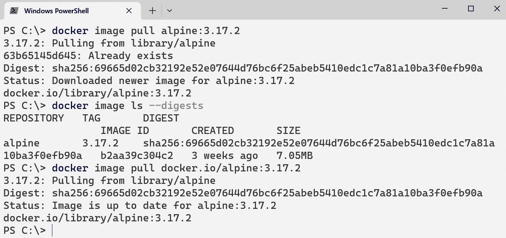

图 3.1 – 拉取镜像后，镜像摘要可以轻松恢复

根据你使用的容器运行时，可以设置默认的容器注册表。Docker 容器运行时默认使用[docker.io](http://docker.io)，这就是为什么我们可以执行`docker image pull alpine:3.17.2`来下载`alpine:3.17.2`镜像，如*图 3.1*所示。两种情况下的摘要是相同的，因此它们是相同的镜像。然而，我们可以在系统中创建一个具有相同名称的新镜像。如果我们先删除之前下载的镜像（名称在容器运行时中是唯一的）并创建一个新的，它将具有完全不同的摘要。即使我们使用相同的 Dockerfile，这也会发生，因为摘要还会整合每次构建过程中的执行日期。

重要说明

我们可以通过使用`--all-tags`参数来下载仓库中的所有镜像，如下例所示：`docker image pull --all-tags alpine`。这将下载`alpine`仓库中的所有镜像。

我们可以通过使用`docker info`查看 Docker Desktop 中默认包含的注册表。以下截图展示了使用**Windows PowerShell**的示例输出：

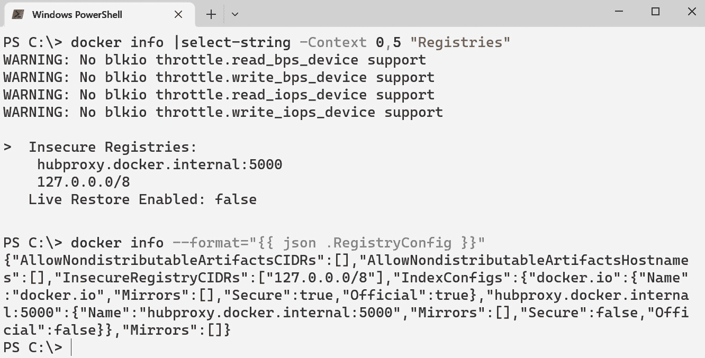

图 3.2 – 我们的容器运行时使用的本地容器镜像注册表

在这个例子中，展示了`localhost`注册表和`hubproxy.docker.internal:5000`。本地注册表用于将镜像存储在本地。桌面客户端，如**Docker Desktop**和**Rancher Desktop**，将以图形方式展示本地镜像：

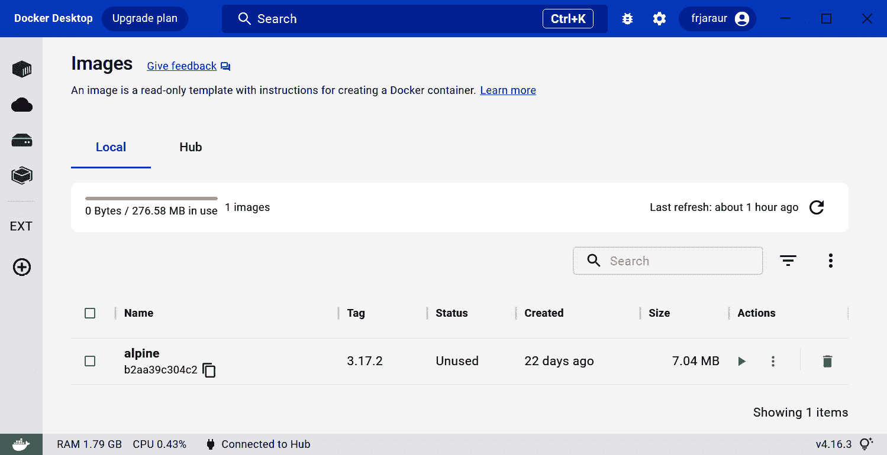

图 3.3 – Docker Desktop 本地镜像概览

事实上，Docker 提供了与 Docker Hub 账户的集成。你还可以查看你的远程镜像：

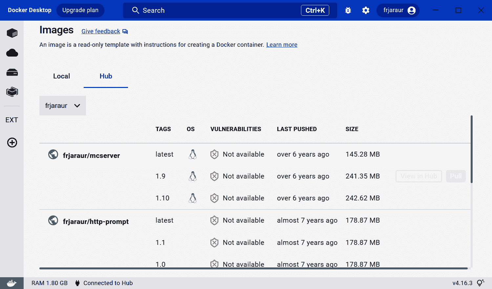

图 3.4 – Docker Desktop Docker Hub 远程镜像概览

该界面还允许你下载并查看镜像内容中发现的漏洞，如果你订阅了 Docker 服务。我们将在本章的 *扫描镜像内容中的漏洞* 部分深入了解安全内容扫描。

重要提示

你的容器运行时可能需要一些特定的配置，以允许新的容器镜像仓库。所有容器镜像仓库都应该使用 `insecure-registries` 列表。

镜像仓库通常需要登录，我们将使用其 FQDN 来访问它们。如果需要访问私有仓库，则需要一个账户。

我们将使用 `docker search` 来基于字符串查找仓库：

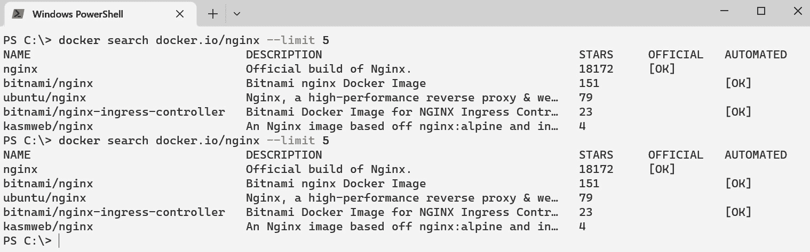

图 3.5 – 使用 docker search 命令搜索镜像

请注意，某些镜像标记为 `OFFICIAL`，而其他则标记为 `AUTOMATED`。Docker Hub 提供此功能，因为根据你的镜像仓库，一些 CI/CD 集成可能会自动为你构建镜像。这些标记有助于标识自动构建的镜像。如果符合你的需求，你可以使用它们的自动化功能。

Docker 官方镜像是由 Docker 根据最佳实践构建和维护的容器镜像。它们还通过持续更新来确保安全性。所有官方镜像的代码都可以在 GitHub 上公开查看，你可以直接使用它或根据自己的需求进行自定义。如果在使用过程中遇到任何问题，你可以提供反馈并联系 Docker。一个很好的示例是 Alpine 镜像仓库（[`github.com/alpinelinux/docker-alpine/`](https://github.com/alpinelinux/docker-alpine/)），你可以在这里找到构建所有 Alpine 镜像的代码。以下截图展示了如何找到你需要的任何技术的官方镜像：

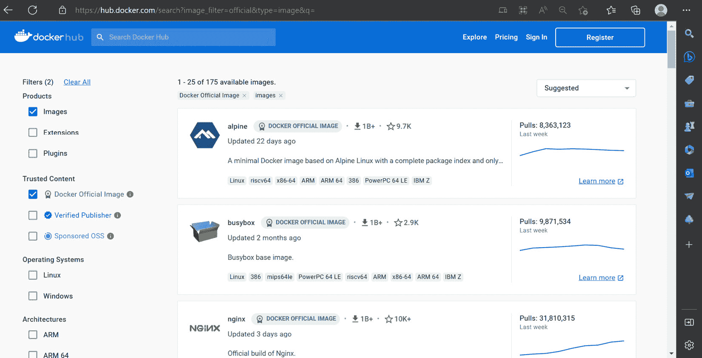

图 3.6 – Docker Hub 中可用的官方镜像概览

软件供应商和开源社区项目也提供由他们准备和维护的容器镜像。将第三方项目或组件集成到你的应用程序中的最佳方法永远是使用 Docker、经过验证的发布者或赞助的开源软件提供商已为你准备好的镜像。这些镜像有很好的文档支持，你可以通过使用参数和环境变量来定制容器行为。使用这些镜像可以避免许多问题，而不必从头开始创建你自己的镜像。在 *实验室* 部分，我们将通过一个非常常用的 PostgreSQL 数据库示例来更好地理解这一点。

## 在仓库中搜索

Docker 客户端提供了一些仓库搜索功能，但在尝试查找特定镜像时，它们并不充分。你可能会使用 Docker Hub 的 Web 界面来进行更细致的搜索。镜像注册表会发布它们的 API，我们可以使用`curl`或其他 Web 接口，带上参数来查找这些镜像。或者，我们可以使用`skopeo`。这个工具可以让我们在搜索仓库时，过滤出特定的标签。

如本节前面提到的，注册表提供了一个 HTTP API，我们可以用来查询特定的仓库、标签等，但它并不容易使用。例如，我们可以使用`curl` [`myregistry.com:5000/v2/_catalog`](https://myregistry.com:5000/v2/_catalog) 来列出目录中的所有镜像。推荐使用`skopeo`，因为它提供了一个清晰简便的命令行，特别是当处理需要身份验证的注册表时（需要证书和登录）。它在不同 Linux 发行版的包管理库中都有提供。你可以按照你所在发行版或 WSL 的安装说明，查看这里的指引：[`github.com/containers/skopeo/blob/main/install.md`](https://github.com/containers/skopeo/blob/main/install.md)。

不幸的是，`skopeo`在 Ubuntu 20.04 LTS 的包管理库中不可用。我们可以通过在 Windows PowerShell 终端执行`wsl --install -d Ubuntu-22.04`来安装更新的 WSL 发行版。一旦新的 Ubuntu 22.04 WSL 发行版准备好后，我们可以通过使用`sudo apt-get update -qq && sudo apt-get install skopeo -qq`来安装该软件包。然后，我们可以通过进入**设置** | **资源** | **WSL 集成**，或者**文件** | **首选项** | **WSL**来将容器运行时集成到 Docker Desktop 或 Rancher Desktop 中。以下截图展示了 Docker Desktop 中的界面：

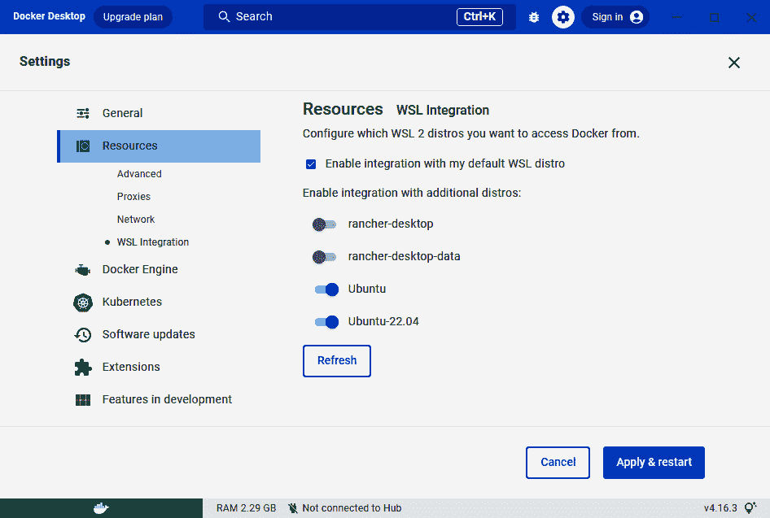

图 3.7 – 在 Ubuntu 22.04 LTS WSL 中启用 Docker Desktop 集成

使用`skopeo`，我们可以轻松列出一个仓库中包含的所有标签，如下例所示：

```
$ skopeo  list-tags docker://docker.io/frjaraur/colors
{
    "Repository": "docker.io/frjaraur/colors",
    "Tags": [
        "1.0",
        "1.1",
        "1.2",
        "1.5",
        "latest"
    ]
}
```

我们甚至可以通过使用`skopeo inspect`来检查远程镜像的信息：

```
$ skopeo inspect docker://docker.io/frjaraur/colors:1.0 \
--format="{{ .Digest }}"
sha256:cb7c1e49bcac66663aafea571ce5a6e6626e387c43b4836cc4d9e4c0e5d9faff
```

我们可以通过使用`docker` `container run`命令，直接使用 Red Hat 的官方镜像，而不需要在本地安装`skopeo`：

```
$ docker container run --rm quay.io/skopeo/stable \
inspect docker://docker.io/frjaraur/colors:1.0 \
--format="{{ .Digest }}"
Unable to find image 'quay.io/skopeo/stable:latest' locally
latest: Pulling from skopeo/stable
1a72627e77ed: Already exists
...
Digest: sha256:23f4b378c4aff49621e90289b33daf133462824b5eba603b0834e25cb83a97ca
Status: Downloaded newer image for quay.io/skopeo/stable:latest
sha256:cb7c1e49bcac66663aafea571ce5a6e6626e387c43b4836cc4d9e4c0e5d9faff
```

希望这能为你使用软件容器提供新的视角。我们可以将工具打包成容器镜像，使用它们，而不必在计算机上安装软件。

现在我们已经知道如何存储和引用注册表中的镜像，接下来是学习如何通过对镜像进行签名来提高镜像的所有权和安全性。

# 通过对容器镜像进行签名来提高安全性

正如我们在前一部分提到的，摘要是我们验证自己使用的镜像的唯一方式。在这一部分，我们将回顾如何通过签署镜像来改进这一过程。这将确保我们使用的是正确的镜像，因为我们可以检查签名并验证每个镜像的所有权。

我们将分析并了解 Docker 用于签署镜像的方法，但也有其他方法可用。我们将在 *实验室* 部分使用 **Cosign**，它看起来更简单，并且与 Kubernetes 容器编排器集成得非常好。

Docker 几年前创建了**Docker 内容信任**，将数字签名集成到容器镜像管理工作流中，并将签名与镜像标签关联起来。我们将能够拥有签名和未签名的镜像仓库，例如，在进入新阶段之前进行本地测试。作为开发者，您可以创建镜像并决定哪些镜像应签名。

签名过程基于一组不同的密钥，这些密钥将用于将元信息添加到您注册的镜像中。其中一些密钥由用户交互式管理，而其他一些则在执行过程中计算。这些密钥包括以下内容：

+   `root` 密钥始终用于启动签名过程。系统会要求您提供此密钥，但您也可以将其作为变量包含在您的环境中。非常重要的一点是，如果您丢失了此密钥，您将需要重新签署所有镜像，因为没有已知的恢复过程。始终备份此密钥；丢失它可能会在生产环境中造成真正的问题，因为您的旧签名将不再有效。

+   每个仓库也将拥有其`自己的`密钥。此密钥将用于签署特定仓库中的镜像，因此丢失它只会影响该仓库中的镜像。尽管如此，您应该妥善保管并备份它。

+   `timestamp` 密钥会自动添加到最终的签名中。这确保了安全性，因为每个签名将始终完全不同。

您将被要求为根密钥创建一个密码短语，每个仓库的密钥将随机生成。Docker 在您用户的 `~/.docker` 目录下提供了它自己的密码管理器。

重要提示

为了备份您的密钥，请准备一个包含 `~/.docker/trust/private` 目录内容的 `tar.gz` 文件。我们可以执行以下命令：

`$ umask 077; tar -zcvf private_keys_backup.tar.gz ~/.docker/trust/private;` `umask 022`

我们可以通过设置 `DOCKER_CONTENT_TRUST=1` 环境变量，在客户端启用 Docker 内容信任。这将为执行的任何新命令启用内容信任，这意味着您的环境中将只启用签名镜像。如果我们只需要为特定命令启用内容信任，可以使用 `--disable-content-trust=false` 参数。

让我们尝试通过设置 `DOCKER_CONTENT_TRUST` 变量来启用镜像的内容信任。在这个示例中，我们执行以下步骤：

1.  我们首先拉取 `docker.io/busybox:latest` 镜像：

    ```
    $ docker image pull busybox
    Using default tag: latest
    latest: Pulling from library/busybox
    Digest: sha256:7b3ccabffc97de872a30dfd234fd972a66d247c8cfc69b0550f276481852627c
    Status: Image is up to date for busybox:latest
    DOCKER_CONTENT_TRUST=1 and download the same image again:

    ```

    $ export DOCKER_CONTENT_TRUST=1

    $ docker image pull busybox

    使用默认标签：latest

    拉取（1/1）：busybox:latest@sha256:7b3ccabffc97de872a30dfd234fd972a66d247c8cfc69b0550f276481852627c

    docker.io/library/busybox@sha256:7b3ccabffc97de872a30dfd234fd972a66d247c8cfc69b0550f276481852627c: 从 library/busybox 拉取

    摘要：sha256:7b3ccabffc97de872a30dfd234fd972a66d247c8cfc69b0550f276481852627c

    状态：镜像已更新，适用于 busybox@sha256:7b3ccabffc97de872a30dfd234fd972a66d247c8cfc69b0550f276481852627c

    将 busybox@sha256:7b3ccabffc97de872a30dfd234fd972a66d247c8cfc69b0550f276481852627c 标记为 busybox:latest

    busybox 镜像，docker.io/frjaraur/busybox-untrusted:0.1。让我们看看当 Docker 内容信任启用时，如果尝试拉取一个不受信任的镜像会发生什么：

    ```
    $ docker pull docker.io/frjaraur/busybox-untrusted:0.1
    Error: remote trust data does not exist for docker.io/frjaraur/busybox-untrusted: notary.docker.io does not have trust data for docker.io/frjaraur/busybox-untrusted
    ```

    这意味着未找到有效的签名，但如果我们禁用内容信任，我们就可以毫无问题地拉取镜像：

    ```
    $ export DOCKER_CONTENT_TRUST=0
    $ docker pull docker.io/frjaraur/busybox-untrusted:0.1
    0.1: Pulling from frjaraur/busybox-untrusted
    Digest: sha256:907ca53d7e2947e849b839b1cd258c98fd3916c60f2e6e70c30edbf741ab6754
    Status: Downloaded newer image for frjaraur/busybox-untrusted:0.1
    docker.io/frjaraur/busybox-untrusted:0.1
    ```

    事实上，我们不能使用这个不受信任的镜像来运行任何容器，这点我们可以轻松验证：

    ```
    $ docker run -ti --disable-content-trust=false\
    docker.io/frjaraur/busybox-untrusted:0.1
    docker: Error: remote trust data does not exist for docker.io/frjaraur/busybox-untrusted: notary.docker.io does not have trust data for docker.io/frjaraur/busybox-untrusted.
    See 'docker run --help'.
    ```

    相反，如果我们运行一个受信任的镜像，一切按预期工作：

    ```
    $ docker run -ti --disable-content-trust=false \
    docker.io/busybox:latest ls -ld /tmp
    docker trust command line:

    ```

    $ docker trust inspect \

    --pretty docker.io/busybox:latest

    docker.io/busybox:latest 的签名

    签名标签   摘要

    签名者

    latest       7b3ccabffc97de872a30dfd234fd972a66d247c8cfc69b0550f276481852627c   （仓库管理员）

    docker.io/busybox:latest 的管理密钥

    仓库密钥：       02d15c99120886f6e02b4b0186522bc72d21a339ec35fad8af0a1b4a47c871d2

    根密钥：     074cad59e43e13b440b11d1b5521e20aa8633fc8f3928720590268895711d0c6

    $ docker trust inspect --pretty docker.io/frjaraur/busybox-untrusted:0.1

    frjaraur/busybox-untrusted:0.1；因此，这个镜像不能在启用 Docker 内容信任的容器运行时中使用。

    ```

    ```

    ```

    ```

1.  让我们通过使用 `docker trust` `key generate` 创建一个用户密钥，开始签名过程：

    ```
    $ docker trust key generate frjaraur
    Generating key for frjaraur...
    Enter passphrase for new frjaraur key with ID ceb39cd:
    Repeat passphrase for new frjaraur key with ID ceb39cd:
    ~/.docker/trust/private/:

    ```

    $ ls -lart ~/.docker/trust/private/

    总计 12

    drwx------ 4 frjaraur frjaraur 4096 Mar  5 17:43 ..

    -rw------- 1 frjaraur frjaraur  420 Mar  5 17:50 ceb39cd48cf78d478ffef211cc9da3e97ff9912ae60585254d6dc661076d0d2a.key

    带有 docker.io/frjaraur/busybox-trusted:0.1 的 busybox 镜像；因此，两个镜像是相同的，但签名与标签相关：

    ```
    $ docker image tag busybox docker.io/frjaraur/busybox-trusted:0.1
    $ docker image push docker.io/frjaraur/busybox-trusted:0.1
    The push refers to repository [docker.io/frjaraur/busybox-trusted]
    b64792c17e4a: Mounted from frjaraur/busybox
    0.1: digest: sha256:907ca53d7e2947e849b839b1cd258c98fd3916c60f2e6e70c30edbf741ab6754 size: 528
    Signing and pushing trust metadata
    You are about to create a new root signing key passphrase. This passphrase
    will be used to protect the most sensitive key in your signing system. Please
    choose a long, complex passphrase and be careful to keep the password and the
    key file itself secure and backed up. It is highly recommended that you use a
    password manager to generate the passphrase and keep it safe. There will be no
    way to recover this key. You can find the key in your config directory.
    Enter passphrase for new root key with ID dfbeee2:
    Repeat passphrase for new root key with ID dfbeee2:
    Enter passphrase for new repository key with ID 9cfa33d:
    Repeat passphrase for new repository key with ID 9cfa33d:
    Finished initializing "docker.io/frjaraur/busybox-trusted"
    docker trust sign docker.io/frjaraur/busybox-trusted:0.1 and then push it with docker image push docker.io/frjaraur/busybox-trusted:0.1.
    ```

    ```

    ```

1.  现在，我们可以轻松查看我们的镜像签名：

    ```
    $ docker trust inspect \
    --pretty docker.io/frjaraur/busybox-trusted:0.1
    Signatures for docker.io/frjaraur/busybox-trusted:0.1
    SIGNED TAG   DIGEST                                                             SIGNERS
    0.1          907ca53d7e2947e849b839b1cd258c98fd3916c60f2e6e70c30edbf741ab6754   (Repo Admin)
    Administrative keys for docker.io/frjaraur/busybox-trusted:0.1
      Repository Key:       9cfa33df6e6b93596416b06bb82198a46befb94479bbf5b0d92e73a213a30126
      Root Key:     f802546452481df2edc8b9670d30638e079164e7dc7187b698cd275d894531f4
    ```

在这里需要强调的是，你需要一个带有**Notary**的注册表服务器。这个项目负责管理你的签名。它是一个客户端-服务器应用程序，和你的注册表一起运行，集成签名部分。Docker Hub 已经将 Notary 服务器集成到他们的注册表中，这就是为什么我们能够将签名集成到我们的镜像元数据中的原因。

如果你计划使用带有内容信任的本地注册表，你还需要运行并集成一个 Notary 服务器。你可以在 [`github.com/notaryproject/notary`](https://github.com/notaryproject/notary) 上了解更多关于 Notary 的信息。

我们可以通过使用 `docker trust revoke` 来撤销特定容器镜像标签的签名。通过共享我们的公钥，可以将签名委托给其他用户。镜像签名的集成在你的平台中实际上取决于你使用的注册表。我们已经了解了 Docker Hub 的流程，但其他解决方案可能会实现不同的命令和选项。我们将展示如何使用 Cosign，它管理一种不同类型的签名，但它同样有助于实施良好的安全供应链，确保镜像的来源和所有权。

现在我们已经知道如何通过使用摘要和签名来确保容器镜像的唯一性，接下来我们将通过实施镜像内容漏洞扫描来进一步保障镜像的安全性。

# 扫描镜像内容中的漏洞

容器镜像可以安全地存储在注册表中，我们可以通过查看它们的摘要和签名来追踪它们的来源和所有权。如果我们能信任镜像层中包含的所有文件，那将是非常棒的。现在有许多解决方案可以检查镜像层中的文件是否存在任何已报告的问题或漏洞，这些漏洞可能会影响到应用程序的完整性。然而，这需要新的工具和努力。

**镜像扫描**可以在本地开发环境或镜像最终存储和共享的远程注册表中实施。大多数内容扫描器使用著名的公共和社区支持的已知漏洞和利用数据库。这些数据库会为我们提供一份**常见漏洞和暴露**（**CVE**）列表，用于与我们的内容进行对比。该列表中的每个二进制文件或库都会通过其摘要进行标识，我们可以轻松找出镜像层中的文件是否被认为在该列表中是脆弱的。

Docker 容器运行时扫描功能集成在客户端命令行中，可以通过镜像或 Dockerfile 来执行，这一点非常有趣，因为我们可以在镜像构建之前就概览可能出现的问题。

所有 Docker Hub 的官方镜像都会提供非常详细的安全扫描报告。**已验证的发布者**（软件供应商）和**赞助的开源软件**（开源社区支持的项目）镜像也提供此类报告。我们可以通过这些镜像的**标签**部分访问这些报告。以下截图显示了 Postgres 每个标签的摘要报告：

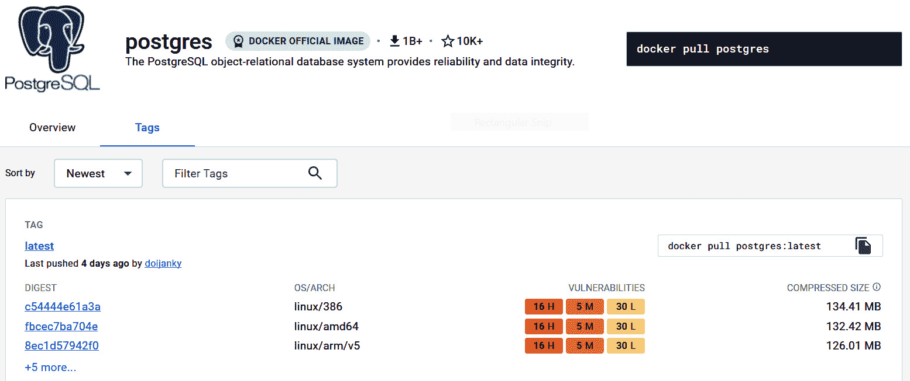

图 3.8 – Docker Hub 中官方 Postgres 镜像漏洞的回顾

我们可以通过点击任何标签进行深入探讨。这将显示与检测到的漏洞相关的 CVE 编号。以下截图显示了在**postgres:latest**镜像层中发现的一些 **stdlib 1.18.2** 的 CVE：

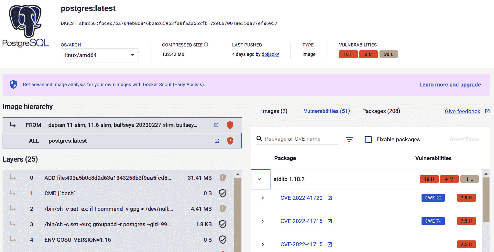

图 3.9 – 深入分析当前在 postgres:latest 镜像中的漏洞

该报告让我们对 Docker Hub 镜像的健康状况有了很好的了解。建议始终查看我们在开发中使用的官方镜像的扫描报告。

Docker 命令行扫描实现使用 `docker scan`。下面是对 **postgres:latest** 执行的一个示例：

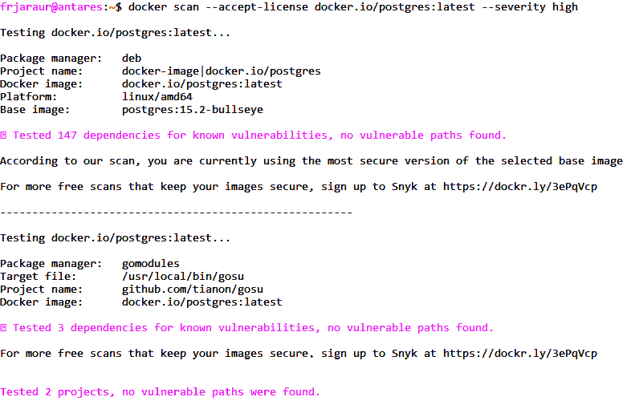

图 3.10 – 在我们的本地环境中使用 docker scan 功能

在前面的截图中，我们使用了 `--accept-license` 参数进行非交互式执行；否则，我们会被要求接受与 Snyk 服务的协议。我们还加入了 `--severity` 参数进行过滤，只显示严重漏洞。在这个示例中，Snyk 没有显示任何严重漏洞，这与 Docker Hub 网站上的情况不同。这可能与基础镜像扫描有关。Snyk 扫描器每月仅提供 10 次扫描，这可能不够用。你可以注册以增加这个限制，或者订阅他们的服务以增加可用功能，避免任何限制。在本章的 *实验* 部分，我们将学习如何使用另一种扫描工具 **Trivy**，该工具将作为容器执行，从而避免在我们的工作环境中安装。

我们已经学会了如何使用镜像注册表并通过扫描和签名镜像确保安全。在接下来的部分，我们将回顾一些简单的实验，帮助实践我们讨论过的概念。

# 实验

接下来的实验将提供示例，帮助实践本章中学到的概念和程序。我们将使用 Docker Desktop 作为容器运行时，使用 WSL 2（或你的 Linux/macOS 终端）来执行所描述的命令。

所有实验的第一步都是始终下载本书 GitHub 仓库的最新版本，地址为 [`github.com/PacktPublishing/Containers-for-Developers-Handbook.git`](https://github.com/PacktPublishing/Containers-for-Developers-Handbook.git)。为此，只需执行 `git clone` [`github.com/PacktPublishing/Containers-for-Developers-Handbook.git`](https://github.com/PacktPublishing/Containers-for-Developers-Handbook.git) 即可下载所有内容。如果你之前已经下载过，确保通过在该目录下执行 `git pull` 来获取最新版本。

本章中所有实验中的命令将会在 `Containers-for-Developers-Handbook/Chapter3` 目录下执行。

## 部署和使用你自己的本地注册表

在这个第一个实验中，我们将部署一个简单的无认证和不受信任（HTTP，而非 HTTPS）的注册中心。我们将使用当前可用的 Docker 官方注册镜像，它是`registry:2.8.1`，写作时该版本为最新。我们可以通过访问[`hub.docker.com/layers/library/registry/2.8.1/images/sha256-a001a2f72038b13c1cbee7cdd2033ac565636b325dfee98d8b9cc4ba749ef337?context=explore`](https://hub.docker.com/layers/library/registry/2.8.1/images/sha256-a001a2f72038b13c1cbee7cdd2033ac565636b325dfee98d8b9cc4ba749ef337?context=explore)来查看它的漏洞：

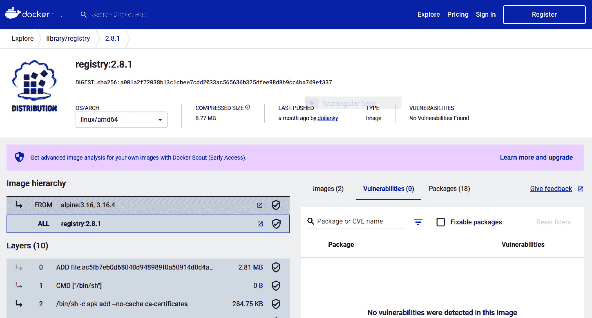

图 3.11 – 官方 Docker registry:2.8.1 漏洞概览

然后我们执行以下步骤：

1.  拉取`docker.io/registry:2.8.1`镜像：

    ```
    $ docker image pull docker.io/registry:2.8.1
    ...
    Digest: sha256:3f71055ad7c41728e381190fee5c4cf9b8f7725839dcf5c0fe3e5e20dc5db1faStatus: Downloaded newer image for registry:2.8.1
    docker.io/library/registry:2.8.1
    ```

1.  现在，回顾其**CMD**、**ENTRYPOINT**、**VOLUME**和**EXPOSE**键。这些将显示我们将执行的命令、将使用的端口以及将用于持久化数据的目录：

    ```
    $ docker image inspect docker.io/registry:2.8.1 \
    --format="{{ .Config.Cmd }} {{.Config.Entrypoint }} {{.Config.Volumes }} {{.Config.ExposedPorts }}"
    5000 will be published, and a custom script will be launched with a configuration file as the argument. The /var/lib/registry directory will be used for our images; hence, we will map it to a local folder in this lab.If you’ve already downloaded this book’s GitHub repository, change to the `Chapter3` folder and follow the next steps from there. If you haven’t, please download the repository to your computer by executing `git clone` [`github.com/PacktPublishing/Containers-for-Developers-Handbook.git`](https://github.com/PacktPublishing/Containers-for-Developers-Handbook.git). We will remove the long path in the following prompts.
    ```

1.  创建一个用于注册数据的目录，并使用之前拉取的注册镜像执行一个容器：

    ```
    Chapter3$ mkdir registry-data
    Chapter3$ docker container run -P -d \
    --name myregstry \
    -v $(pwd)/registry-data:/var/lib/registry \
    5000. It also used the directory we created to store all our images, by using $(pwd) to get the current directory. Adding volumes to a container requires the use of the directory’s full path.As we identified our new container as `myregistry`, we can easily review its status:

    ```

    $ docker container ls

    容器 ID   镜像              命令                      创建时间          状态              端口                       名称

    5000。我们使用了–P 选项，以便容器运行时可以选择任何可用端口来发布应用程序的端口；因此，这个端口在您的环境中可能不同：

    ```
    $ curl -I 0.0.0.0:32768
    HTTP/1.1 200 OK
    Cache-Control: no-cache
    32768 (in my example environment).
    ```

    ```

    ```

1.  让我们下载一个`alpine`容器镜像并上传到我们的注册中心。首先，我们需要拉取这个镜像：

    ```
    Chapter3$ docker pull alpine
    Using default tag: latest
    ...
    Status: Downloaded newer image for alpine:latest
    localhost:32768:

    ```

    Chapter3$ docker image tag alpine localhost:32768/alpine:0.1

    ```

    ```

1.  我们可以列出本地镜像，然后再推送到本地注册中心：

    ```
    Chapter3$ docker image ls |grep "alpine"
    alpine                        latest      b2aa39c304c2   3 weeks ago    7.05MB
    localhost:32768 registry:

    ```

    Chapter3$ docker image push localhost:32768/alpine:0.1

    推送涉及的仓库是[localhost:32768/alpine]

    7cd52847ad77: 推送完成

    0.1: 摘要：sha256:e2e16842c9b54d985bf1ef9242a313f36b856181f188de21313820e177002501 大小：528

    ```

    As you can see, everything works as if we were pushing to the Docker Hub registry. The only difference here is that we didn’t have to log in and our registry uses HTTP. We can manage this by adding an NGINX web server as a frontend, behind the registry server.
    ```

1.  现在让我们回顾一下图像在文件系统中的分布情况：

    ```
    Chapter3$ ls -lart registry-data/docker/registry/v2/
    total 16
    drwxr-xr-x 3 root root 4096 Mar  6 19:55 repositories
    drwxr-xr-x 3 root root 4096 Mar  6 19:55 ..
    drwxr-xr-x 3 root root 4096 Mar  6 19:55 blobs
    repositories directory manages the metadata for each image repository, while the blobs directory stores all the layers from all container images.The `blobs` directory is distributed in many other directories to be able to manage an enormous number of layers:

    ```

    Chapter3$ ls -lart registry-data/docker/registry/v2/blobs/sha256/

    总计 20

    drwxr-xr-x 3 root root 4096 3 月 6 19:55 63

    drwxr-xr-x 3 root root 4096 3 月 6 19:55 ..

    drwxr-xr-x 3 root root 4096 3 月 6 19:55 e2

    drwxr-xr-x 3 root root 4096 3 月 6 19:55 b2

    alpine:latest 镜像作为 localhost:32768/alpine:0.2：

    ```
    Chapter3$ docker image tag alpine localhost:32768/alpine:0.2
    ```

    这意味着我们为原始 Alpine 镜像创建了一个新的标签；因此，我们预计只有元数据会被修改。

    ```

    ```

1.  让我们推送镜像并回顾文件系统的变化：

    ```
    $ docker image push localhost:32768/alpine:0.2
    The push refers to repository [localhost:32768/alpine]
    7cd52847ad77: Layer already exists
    localhost:32768 registry says that the image layers already exist.
    ```

1.  我们可以再次列出注册表的内容：

    ```
    Chapter3$ ls -lart registry-data/docker/registry/v2/blobs/sha256/
    total 20
    drwxr-xr-x 3 root root 4096 Mar  6 19:55 63
    drwxr-xr-x 3 root root 4096 Mar  6 19:55 ..
    drwxr-xr-x 3 root root 4096 Mar  6 19:55 e2
    drwxr-xr-x 3 root root 4096 Mar  6 19:55 b2
    blobs directory wasn’t changed, but let’s review the repositories directory, where the image metadata is managed:

    ```

    Chapter3$ ls -lart registry-data/docker/registry/v2/repositories/alpine/_manifests/tags/

    总计 16

    drwxr-xr-x 4 root root 4096 3 月 6 19:55 0.1

    drwxr-xr-x 4 root root 4096 3 月 6 19:55 ..

    drwxr-xr-x 4 root root 4096 3 月 6 19:59 0.2

    blobs 目录适用于标签 0.1 和 0.2。现在，让我们推送一个有些变化的新镜像。

    ```

    ```

1.  我们现在将通过将 `alpine.latest` 镜像作为基础镜像，在新的构建过程中创建它的修改版。我们将通过管道传递 Dockerfile 来进行实时构建：

    ```
    Chapter3$ cat <<EOF | docker build -t \
    localhost:32768/alpine:0.3 -
    FROM docker.io/alpine:latest
    RUN apk add --update nginx
    EXPOSE 80
    CMD ["whatever command"]
    EOF
    ```

    这是另一种使用 Dockerfile 构建镜像的方式。在这种情况下，我们不能使用镜像内容，因此复制文件将不起作用，但对于这个例子来说是可以的。我们使用 Unix 管道创建一个新的镜像，以避免创建文件。这样，我们就可以实时创建镜像：

    ```
    Chapter3$ cat <<EOF | docker build -t \
    localhost:32768/alpine:0.3 -
    FROM> FROM docker.io/alpine:latest
    > RUN apk add --update nginx
    > EXPOSE 80
    > CMD ["whatever command"]
    > EOF
    [+] Building 1.3s (6/6) FINISHED
    ...
    => [1/2] FROM docker.io/library/alpine:latest
    0.0s
    => [2/2] RUN apk add --update nginx
    1.2s
    ...
    => => writing image sha256:e900ec26c76b9d779bc3d6a7f828403db07daea66c85b5271ccd94e12b460ccd                                0.0s
    => => naming to localhost:32768/alpine:0.3
    ```

1.  现在我们推送这个新镜像并查看目录：

    ```
    Chapter3$ docker push localhost:32768/alpine:0.3
    The push refers to repository [localhost:32768/alpine]
    33593eed7b41: Pushed
    7cd52847ad77: Layer already exists
    0.3: digest: sha256:1bf4c7082773b616fd2247ef9758dfec9e3084ff0d23845452a1384a6e715c40 size: 739
    ```

    如你所见，一个新的层已被推送。

1.  现在，我们来查看本地文件夹，了解镜像注册表在我们的主机中存储数据的位置：

    ```
    Chapter3$ ls -lart registry-data/docker/\
    registry/v2/repositories/alpine/_manifests/tags/
    total 20
    drwxr-xr-x 4 root root 4096 Mar  6 19:55 0.1
    drwxr-xr-x 4 root root 4096 Mar  6 19:55 ..
    drwxr-xr-x 4 root root 4096 Mar  6 19:59 0.2
    drwxr-xr-x 4 root root 4096 Mar  6 20:08 0.3
    drwxr-xr-x 5 root root 4096 Mar  6 20:08 .
     Chapter3$ ls -lart registry-data/docker/registry/v2/blobs/sha256/
    total 32
    drwxr-xr-x 3 root root 4096 Mar  6 19:55 63
    drwxr-xr-x 3 root root 4096 Mar  6 19:55 ..
    drwxr-xr-x 3 root root 4096 Mar  6 19:55 e2
    drwxr-xr-x 3 root root 4096 Mar  6 19:55 b2
    drwxr-xr-x 3 root root 4096 Mar  6 20:08 c1
    drwxr-xr-x 3 root root 4096 Mar  6 20:08 e9
    drwxr-xr-x 3 root root 4096 Mar  6 20:08 1b
    repositories and blobs locations.
    ```

我们已经了解了镜像是如何在我们的注册表中存储和管理的。现在让我们进入一个新实验，回顾一下如何使用一个不同的工具**Cosign**来签名镜像。

## 使用 Cosign 签署镜像

在这个新实验中，我们将使用一个新的工具 Cosign，它可以以不同的格式轻松下载：

1.  我们将通过下载其二进制文件来安装 Cosign：

    ```
    Chapter3$ mkdir bin
    Chapter3$ export PATH=$PATH:$(pwd)/bin
    Chapter3$ curl -sL -o bin/cosign https://github.com/sigstore/cosign/releases/download/v2.0.0/cosign-linux-amd64
    Chapter3$ chmod 755 bin/*
    Chapter3$ cosign --help
    A tool for Container Signing, Verification and Storage in an OCI registry.
    Usage:
      cosign [command]
    --output-key-prefix to ensure our keys have an appropriate name:

    ```

    Chapter3$ cosign generate-key-pair \

    --output-key-prefix frjaraur

    输入私钥密码：

    再次输入私钥密码：

    私钥写入到 frjaraur.key

    公钥写入到 frjaraur.pub

    ```

    Use your own name for your key. You will be asked for a password. Use your own, and remember that this will be required to sign any image. This will create your public and private keys:

    ```

    Chapter3$ ls -l

    total 12

    -rw------- 1 frjaraur frjaraur 649 Mar 7 19:51 frjaraur.key

    -rw-r--r-- 1 frjaraur frjaraur 178 Mar 7 19:51 frjaraur.pub

    ```

    ```

1.  我们将为镜像添加一个新的名称和标签，然后推送它：

    ```
    Chapter3$ docker tag localhost:32768/alpine:0.3 \
    localhost:32768/alpine:0.4-signed
    Chapter3$ docker push localhost:32768/alpine:0.4-signed
    The push refers to repository [localhost:32768/alpine]
    dfdda8f0d335: Pushed
    7cd52847ad77: Layer already exists
    0.4-signed: digest: sha256:f7ffc0ab458dfa9e474f656afebb4289953bd1196022911f0b4c739705e49956 size: 740
    ```

1.  现在，我们可以继续签署镜像：

    ```
    Chapter3$ cosign sign --key frjaraur.key \
    localhost:32768/alpine:0.4-signed
    Enter password for private key:
    WARNING: Image reference localhost:32768/alpine:0.4-signed uses a tag, not a digest, to identify the image to sign.
        This can lead you to sign a different image than the intended one. Please use a
        digest (example.com/ubuntu@sha256:abc123...) rather than tag
        (example.com/ubuntu:latest) for the input to cosign. The ability to refer to
        images by tag will be removed in a future release.
            Note that there may be personally identifiable information associated with this signed artifact.
            This may include the email address associated with the account with which you authenticate.
            This information will be used for signing this artifact and will be stored in public transparency logs and cannot be removed later.
    By typing 'y', you attest that you grant (or have permission to grant) and agree to have this information stored permanently in transparency logs.
    Are you sure you would like to continue? [y/N] y
    tlog entry created with index: 14885625
    Pushing signature to: localhost:32768/alpine
    ```

    请注意警告信息。正如我们在*第二章*《构建 Docker 镜像》中学到的，*只有镜像摘要真正确保镜像的唯一性*，在这个例子中，我们使用标签来引用我们正在签名的镜像。我们应该使用摘要来改进签名过程，确保我们为生产签署正确的镜像，但在这个例子中，我们可以继续使用标签。

1.  现在我们可以验证与该镜像相关联的签名：

    ```
    Chapter3$ cosign verify --key frjaraur.pub \
    localhost:32768/alpine:0.4-signed
    Verification for localhost:32768/alpine:0.4-signed --
    The following checks were performed on each of these signatures:
      - The cosign claims were validated
      - Existence of the claims in the transparency log was verified offline
      - The signatures were verified against the specified public key
    cosign triangulate to verify whether an image is signed:

    ```

    Chapter3$ cosign triangulate localhost:32768/\

    alpine:0.4-signed

    localhost:32768/alpine:sha256-f7ffc0ab458dfa9e474f656afebb4289953bd1196022911f0b4c739705e49956.sig

    ```

    This hash is the digest referenced:

    ```

    Chapter3$ docker image ls --digests |grep "0.4-signed"

    localhost:32768/alpine:0.3 镜像：

    ```
    Chapter3$ docker tag localhost:32768/alpine:0.3 \
    localhost:32768/alpine:0.4-signed
    ```

    ```

    ```

1.  现在，我们再次推送它：

    ```
    Chapter3$ docker push localhost:32768/\
    alpine:0.4-signed
    The push refers to repository [localhost:32768/alpine]
    33593eed7b41: Layer already exists
    7cd52847ad77: Layer already exists
    0.4-signed: digest: sha256:1bf4c7082773b616fd2247ef9758dfec9e3084ff0d23845452a1384a6e715c40 size: 739
    ```

1.  现在我们可以再次验证新推送的镜像：

    ```
    Chapter3$ cosign verify --key frjaraur.pub \
    localhost:32768/alpine:0.4-signed
    Error: no matching signatures:
    ValidatingWebHook. This will ensure that only signed images (we can also include specific signatures) will be available to create containers.
    ```

现在我们知道如何通过签名和验证签名来提高安全性，我们可以更进一步，使用安全扫描器来审查它们内容中的任何潜在漏洞。

## 通过使用镜像内容漏洞扫描器来提高安全性

在这个实验中，我们将使用来自 Aquasec 的**Trivy**。它是一个非常强大的安全扫描器，可以扫描文件内容、配置错误，甚至是 Kubernetes 资源。它将大大帮助你在日常的 DevOps 工作中，也会对开发人员有帮助。我们将创建一个用于离线使用的自定义 Trivy 镜像，并包含在线数据库。在这个例子中，我们还将学习如何管理镜像中的缓存内容。

在`Chapter3`文件夹中，您将找到`trivy`目录，其中包含一个准备好的 Dockerfile，供您为本实验构建上述自定义镜像：

1.  首先，我们将使用`skopeo`验证最新稳定版本的`docker.io/trivy`镜像的摘要：

    ```
    Chapter3$ skopeo inspect \
    docker://aquasec/trivy:0.38.2-amd64|grep -i digest
    trivy image. We will move inside the trivy folder to build our new image. Review the Dockerfile’s content, and write down the appropriate hash for your base image:

    ```

    FROM aquasec/trivy:0.38.2-amd64@sha256:8038205ca56f2d88b93d804d0407831056ee0e40616cb0b8d74b0770c93aaa9f

    LABEL MAINTAINER "frjaraur at github.com"

    LABEL TRIVY "0.38.2-amd64"

    ENV TRIVY_CACHE_DIR="/cache"  \

    TRIVY_NO_PROGRESS=true

    RUN TRIVY_TEMP_DIR=$(mktemp -d) \

    && trivy --cache-dir $TRIVY_CACHE_DIR image --download-db-only \

    && tar -cf ./db.tar.gz -C $TRIVY_CACHE_DIR/db metadata.json trivy.db

    ENV TRIVY_SKIP_DB_UPDATE=true

    RUN chmod 777 -R /cache

    USER nobody

    ```

    ```

1.  现在我们将构建我们的镜像：

    ```
    Chapter3/trivy$ docker build -t \
    localhost:32768/trivy:custom-0.38.2 . --no-cache
    [+] Building 23.5s (7/7) FINISHED
    => [internal] load build definition from Dockerfile
    0.1s
    ...
    => => writing image sha256:de8c7b30b715d05ab3167f6c8d66ef47f25603d05b8392ab614e8bb8eb70d4b3             0.1s
    => => naming to localhost:32768/trivy:custom-0.38.2
    python:alpine image available in Docker Hub. We will only scan for content vulnerability:

    ```

    Chapter3/trivy$ docker run -ti \

    localhost:32768/trivy:custom-0.38.2 \

    image python:alpine --scanners vuln \

    --severity 高危,严重

    2023-03-08T20:49:21.927Z        INFO    已启用漏洞扫描

    2023-03-08T20:49:26.865Z        INFO    检测到操作系统: alpine

    2023-03-08T20:49:26.865Z        INFO    正在检测 Alpine 漏洞...

    2023-03-08T20:49:26.869Z        INFO    语言特定文件的数量：1

    2023-03-08T20:49:26.869Z        INFO    正在检测 python-pkg 漏洞...

    python:alpine (alpine 3.17.2)

    总计：1（高危：1，严重：0）

    │  库       │ 漏洞         │ 严重程度 │ 已安装版本 │ 修复版本 │                           标题                            │

    │ libcom_err │ CVE-2022-1304 │ 高危     │ 1.46.5-r4         │ 1.46.6-r0     │ e2fsprogs: 通过精心构造的文件系统进行越界读写 │

    仅报告高危和严重漏洞，以避免任何非关键输出。我们使用了默认的表格格式输出，但也可以使用 JSON 格式，例如，将漏洞扫描器集成到自动化任务中。

    ```

    ```

镜像扫描将真正帮助我们决定使用哪些版本，甚至通过了解基础镜像中包含的漏洞，修复镜像中的问题。扫描过程通常会被包含在构建管道中，以确保您的工作流不会产生易于管理的漏洞镜像。

# 总结

在本章中，我们学习了如何将容器镜像存储在镜像仓库中，使用适当的仓库和标签来管理我们的应用组件。作为开发者，您必须为您的镜像提供逻辑名称、标签和所需信息，以便用户能够正确运行您的应用程序。标签还允许您包括任何相关信息，这些信息有助于您跟踪代码更改以及这些更改如何影响您的应用程序流程。

另外，确保我们图像制品的安全供应链至关重要。我们了解到摘要提供了唯一性，但这还不够。我们可以包含签名来告知用户我们创建的图像的来源和所有权，但签名并不能保证我们图像层内包含的文件的健康。我们将在构建过程中包含内容漏洞扫描。这将使我们能够审查和验证我们用来创建项目的图像是否包含任何安全问题。了解我们图像中的漏洞将帮助我们改进应用程序生命周期。尽管修复所有漏洞可能很困难甚至不可能，但理解我们在项目中必须处理的可能问题是关键的。

现在我们有了一个良好的基础来创建和共享我们的应用程序图像，使用最佳技术和改进的安全性，是时候进入下一章了，我们将学习如何运行软件容器以及不同功能和容器运行时的命令行。
