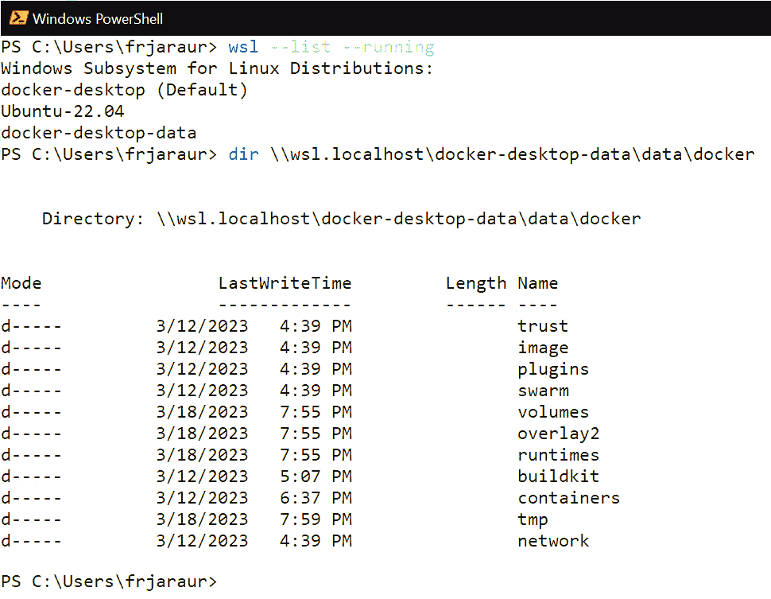
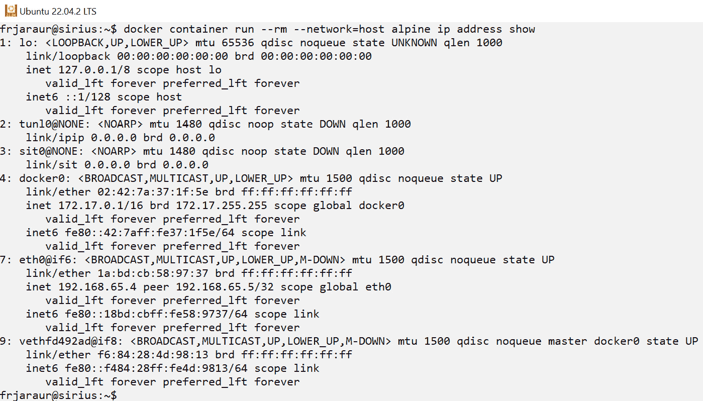
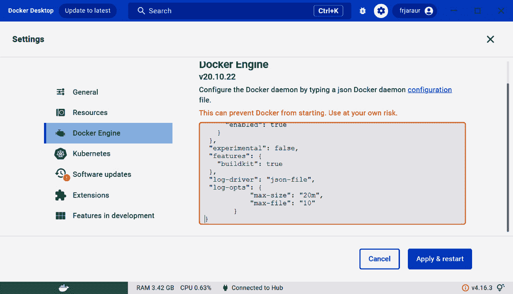

# 第四章：4

# 运行 Docker 容器

软件容器是现代平台的标准应用程序制品。在前几章中，我们学习了如何创建软件容器镜像并与其他开发者或服务共享它们。本章将学习如何有效地使用容器。我们将理解主要的 Docker 容器对象以及如何使用适当的命令行操作和选项来管理它们。理解容器网络模型以及如何管理持久化数据是使用容器的关键。我们还将介绍管理这两者的概念。最后，本章将回顾一些你应该了解的重要维护任务，以便你能够有效地管理你的环境。

本章将涵盖以下主题：

+   了解 Docker 软件容器对象

+   学习使用命令行与容器互动

+   限制容器访问主机资源

+   管理容器行为

+   容器运行时维护任务

# 技术要求

本书教你如何使用软件容器来提升应用程序的开发效率。本章的实验可以在[`github.com/PacktPublishing/Docker-for-Developers-Handbook/tree/main/Chapter4`](https://github.com/PacktPublishing/Docker-for-Developers-Handbook/tree/main/Chapter4)找到。在这里，你将找到本章内容中为便于理解而省略的一些扩展解释。本章的*实战视频*可以在[`packt.link/JdOIY`](https://packt.link/JdOIY)观看。

本章将从介绍最重要的 Docker 容器对象开始。

# 了解 Docker 软件容器对象

容器运行时通常采用客户端-服务器模型工作。我们通过使用客户端命令行（如`docker`、`nerdctl`或`crictl`）与运行时进行交互，具体取决于后端。运行时本身负责管理不同的对象或资源，用户可以通过与其交互轻松地操作这些对象。在我们学习如何与软件容器交互并管理容器之前，本节将介绍容器运行时管理的不同对象。所有命令或操作将与这些对象相关，目的是创建、删除或修改它们的属性。我们在*第一章*《使用 Docker 的现代基础设施与应用程序》和*第二章*《构建 Docker 镜像》中学习了容器镜像，并且还学会了如何构建它们。让我们从复习这些在所有容器运行时中通用的著名对象开始：

+   **容器镜像**：这些对象也被称为**容器工件**。它们是创建容器的基础，因为它们包含所有文件，并集成到不同的层中，这些文件将包含在容器的文件系统内。镜像还包含运行容器所需的元信息，例如将要在内部运行的进程、将暴露到外部的端口、将用于覆盖容器文件系统的卷等。作为开发者，你将为你的应用创建并使用大量镜像。请参考在*第二章*《构建 Docker 镜像》中回顾的安全最佳实践。

+   **容器**：当我们使用容器镜像并运行容器时，我们是在告诉容器运行时执行镜像元信息中定义的进程，并使用镜像层提供这些进程所需的基础文件系统。内核特性如 cgroups 和命名空间也被提供，以隔离容器。这使得在同一主机上以安全的方式运行不同的容器成为可能。除非特别声明，否则它们互相无法看到。容器的文件系统层将以读写模式添加到镜像层之上，所有低于容器层的层将以只读模式使用，已修改或创建的文件将使用 CoW 文件系统的特性进行管理。

+   在主机级别，`docker0` 桥接接口，尽管也可以使用其他网络选项和驱动程序。容器运行时通过内部 IPAM 管理 IP 地址，并使用 NAT 允许容器访问主机附加的真实网络。网络对象允许我们创建不同的桥接接口并将容器连接到它们，隔离在不同网络中运行的容器。

+   **卷**：CoW 文件系统可能会影响应用程序的行为。如果你的进程修改了大量文件或任何文件必须在容器的生命周期中持久化，则必须使用卷来覆盖 CoW 文件系统管理。我们使用卷来存储容器层之外的文件。这些可以是我们主机系统中的文件夹、远程文件系统，甚至是外部块设备。可以使用不同的驱动程序，并且默认情况下，卷将作为文件夹在每个底层主机中本地可用。

所有这些对象将通过唯一的 ID 进行标识，我们将使用它们的名称或 ID 来引用它们。创建和删除它们的常见操作将在我们的客户端命令行中提供。我们还可以列出它们并检查它们的属性，并且我们可以使用 Go 模板格式化，就像我们在*第二章*《构建 Docker 镜像》中学到的那样。

容器编排器将拥有一组自己的对象或资源（如在 Kubernetes 中）。我们将在 *第七章*《与 Swarm 编排》以及 *第八章*《使用 Kubernetes 编排器部署应用程序》中分别进行回顾。

在我们回顾这些新对象之前，让我们记住，容器是通过容器运行时在主机之上运行的进程。这些进程通过使用主机的特殊内核功能相互隔离。容器镜像将为这些进程提供基础文件系统，我们将使用客户端命令行与它们进行交互。

容器被视为无状态和短暂的，尽管它们存在于底层主机上。在容器中运行的应用程序应当准备好可以在任何地方运行，并且它们的状态和数据应该管理在容器生命周期之外。如果我们需要存储应用程序的数据或其状态该怎么办？我们可以使用卷对象来持久化数据和进程状态，当容器被删除或使用相同数据创建新容器时。若我们在分布式或编排环境中工作，共享这些卷是至关重要的，我们需要使用外部卷将数据附加到任何需要它的容器上。

根据我们使用的容器运行时，相关文件的位置可能会有所不同，但在 Docker 容器运行时的情况下，我们预计所有镜像和容器层及其文件都位于 `/var/lib/docker` 或 `c:\ProgramData\docker` 下。对于新的桌面环境，如 Docker Desktop 和 Rancher Desktop，这些路径可能看起来完全不同。在这些环境中，我们将使用 WSL 或 Windows 命令行来执行客户端并与容器运行时交互。容器运行时运行在不同的 WSL 环境中；因此，你将无法直接访问其数据路径。若要查看客户端当前的数据路径，如果你使用的是 Docker 作为容器运行时，可以使用 `docker info` 命令：

```
$ docker info --format="{{ .DockerRootDir }}"
/var/lib/docker
```

如果你直接使用 `containerd`，数据根路径将位于 `/var/lib/containerd` 目录下，但在这两种情况下，你都无法在桌面环境中访问这些文件夹，因为客户端访问是通过管道连接远程访问容器运行时的。所有对象的元数据信息将存储在 `DockerRootDir` 路径下，我们可以通过容器运行时客户端使用适当的命令来检索这些对象的属性。

如果你使用的是 WSL2 与 Docker Desktop，那么两个 WSL 实例会被创建：`docker-desktop` 和 `docker-desktop-data`。第二个实例用于挂载所有数据到你自己的 WSL 实例（在我的例子中是 `ubuntu-22.04`，但在你那里可能不同）。这一切都得益于 Docker Desktop 的集成。我们可以在 `\\wsl.localhost\docker-desktop-data\data\docker` 目录中找到所有的 Docker 容器内容。以下是 PowerShell 截图，展示了我的环境数据：



图 4.1 – Docker 容器运行时对象数据在 docker-desktop-data WSL 实例中的展示

现在我们已经了解了容器运行时管理的主要对象，我们可以回顾一下用于管理和与之交互的命令行选项。

# 学习如何使用命令行与容器交互

在本节中，我们将学习如何管理容器。我们将使用由 Docker 客户端提供的 Docker 命令行（`docker-client` 包或集成到 Docker Desktop 环境中的 WSL）。我们将在本章讨论的所有命令行操作对于其他客户端（如 `nerdctl` 或 `podman`）也类似，尽管在后者的情况下，它不使用 `containerd` 守护进程。

每次我们获取关于 Docker 对象的信息时，Docker 客户端都会通过 API 将操作发送到 Docker 守护进程。客户端可以使用 **SSH**、**HTTP/HTTPS** 或直接 **sockets**（在 Microsoft 操作系统中为 **pipes**）进行通信。

首先，我们将从所有容器运行时对象的常见操作开始：

+   `create`：所有容器运行时对象都可以创建和销毁。这不适用于容器镜像，因为我们将使用 `docker image build` 来启动构建过程以创建它们。所有对象都会自动接收一个 ID，并且在某些情况下，如容器，还会自动添加一个随机名称。如果我们想要指定一个固定名称，可以使用 `--name` 参数。

+   `list`：此操作将显示定义类别中的所有对象；例如，`docker image list` 将列出我们容器运行时中本地所有可用的镜像。如我们在 *第二章*《构建 Docker 镜像》中所学，我们可以使用 `--all` 参数来筛选和格式化输出。如果我们只需要对象标识符，可以使用 `--quiet` 选项。这对于将输出传递给另一个命令非常有用。

重要提示

你可能注意到，我们也可以使用 `docker container ps` 或其简化版 `docker ps` 来列出容器。容器是运行在主机中的进程，利用内核特性提供隔离；因此，似乎将此命令作为列出进程的方式是合适的。默认情况下，只有正在运行的进程（或容器）会被列出，如果我们还希望显示已停止的容器，则需要使用 `--all` 参数。

+   `inspect`：检查对象将允许我们检索与定义对象相关的所有信息。默认情况下，所有对象的数据将以 JSON 格式呈现，但我们也可以使用 `--format` 参数来格式化输出。

+   `remove`：所有对象也可以被移除。我们将使用它们的 ID 或名称来删除它们。在某些情况下，可能会出现内部依赖关系。例如，如果任何现有的容器正在使用某个容器镜像，我们就无法移除该镜像。为了避免这些依赖关系，我们可以使用 `--force` 参数。

这些操作是所有容器运行时管理的对象共有的，但当我们深入容器时，会发现更多的操作。接下来，我们将回顾当前容器的操作，但首先，我们必须理解，当我们创建一个对象时，我们会准备所有必要的配置。这意味着，创建一个容器会准备容器以便运行，但容器会被停止。让我们通过一个快速的示例来查看这个功能的实际操作：

```
$ docker container create --name test alpine
f7536c408182698af04f53f032ea693f1623985ae12ab0525f7fb4119c8850d9
$ docker container inspect test --format="{{ .Config.Cmd }}"
[/bin/sh]
$ docker container ls
CONTAINER ID   IMAGE     COMMAND   CREATED   STATUS    PORTS     NAMES
```

我们的 Docker 容器运行时刚刚创建了一个容器，但它并未运行，尽管它仍然存在于我们的主机系统中。

我们可以移除这个容器并再次检查它。我们将无法从这个对象中获取任何值，因为它现在已经不存在了：

```
$ docker container rm test
test
$ docker container inspect test --format="{{ .Config.Cmd }}"
Error: No such container: test
```

现在，我们可以继续回顾容器的操作，首先从容器创建后实际启动容器的操作开始：

+   `start`：这个操作需要一个先前创建的容器对象。容器运行时将执行定义的容器对象的进程，使用宿主机的隔离和定义的附加资源。

+   `run`：这个操作会使用 `--detach` 参数；在这种情况下，容器将在后台运行，我们的终端会与容器分离。我们可以使用 `--interactive` 和 `--tty` 来以交互模式执行当前容器，并使用伪终端；这样，我们就可以与容器的主进程进行主动交互。容器将使用其配置中定义的所有参数运行，例如用户名、定义的内核命名空间、卷、网络等。通过向命令行添加不同的参数，我们可以修改这些定义。

+   `stop`：容器可以被停止。这个操作会要求容器运行时向容器的主进程发送停止信号（`SIGTERM`），如果进程仍然存活，它会等待 10 秒钟（默认设置）后再发送终止信号（`SIGKILL`）。

+   `kill`：杀死容器将直接请求容器运行时发送`SIGKILL`信号。作为开发者，你应该准备好让应用程序在收到`SIGTERM`或`SIGKILL`时正确退出。确保你的文件正确关闭，且在主进程终止后没有未管理的进程继续运行。

+   `restart`：此操作将用于停止并启动容器。我们可以要求容器运行时在主进程死亡时始终重启容器。

+   `pause`/`unpause`：容器可以被暂停。这将使容器运行时通知内核停止容器进程的 CPU 时间。这一点非常重要，因为暂停的容器可以用于共享容器资源，如卷和命名空间。

重要提示

如果你在前台运行某些进程时没有使用`--interactive`参数，可能会卡住并无法退出容器的主进程标准输出和错误输出。为避免这种情况，可以使用*CTRL* + *P* + *Q*键盘快捷键。

现在我们已经了解了管理容器的最重要操作，让我们回顾一下可以用来修改容器行为的一些参数：

+   `--name`：每个容器都会由唯一的 ID 标识，但始终会分配一个名称。这个名称将是随机的，由两个字符串组成。将使用内部数据库来生成它们，最终的拼接字符串将是唯一的。我们可以通过使用`--name`并传递我们选择的字符串来避免这种行为，但请记住，容器名称必须是唯一的，且不能重复使用该名称。

+   `--restart`：如前所述，我们可以要求容器运行时为我们管理容器的生命周期。默认情况下，如果主进程死亡，容器不会重启，但我们可以使用诸如`on-failure`、`always`或`unless-stopped`的字符串来定义容器在失败时（任何退出码非`0`）、始终或仅在未有效停止容器的情况下是否应重新启动。我们还可以通过不使用任何特定的字符串或命令，确保 Docker 运行时不管理容器的生命周期。

+   `--entrypoint`：此选项允许我们覆盖容器镜像定义的入口点（主进程）。理解这一点非常重要，因为任何人都可以更改你的镜像入口点，执行镜像层中可用的任何二进制文件或脚本；因此，严格包含应用程序所需的文件是至关重要的。

+   `--env`：我们可以通过使用此参数或`--env-file`来添加新的环境变量。在这种情况下，将包含一个键值对格式的文件来添加一组变量。

+   `--expose`：默认情况下，仅容器镜像中定义的端口会被暴露，但如果容器行为的某些修改需要新的端口或协议，可以添加新的端口。

+   `--user`：此参数允许我们修改实际执行容器主进程的用户。如果你更改了容器的用户，必须确保你的应用程序仍然能够运行；这在你将应用程序运行在 Kubernetes 中时可能尤为关键。在 *第八章*，*使用 Kubernetes 编排器部署应用程序* 中，我们将学习是否可以通过使用 **安全上下文** 来提高应用程序的安全性。

+   `--publish` 和 `--publish-all`：这些参数允许我们发布一个端口（我们可以多次使用这些参数以添加多个端口），或者发布镜像定义的所有暴露端口。这将使应用程序可以通过 NAT 从容器的网络外部访问。除非在容器执行期间定义了特定端口，否则将使用随机主机端口来发布应用程序。

+   `--memory` 和 `--cpus`：这些选项，和其他一些选项一起，将允许我们管理分配给容器的内存和 CPU 资源。我们还可以通过使用 `--gpus` 来包含主机的 GPU。

现在我们已经概览了与容器一起使用的最重要的参数，接下来我们将查看一些关键选项，以确保我们的工作负载安全：

+   `--cap-add`：此选项允许我们为容器内进程的执行特定地添加一些内核功能。内核功能是一组与超级用户相关的特权，系统以细粒度的方式提供这些特权。默认情况下，容器运行时不允许*特权*容器以所有可用的功能运行。容器运行时默认只允许所有可用功能的一个子集（当前可用的功能可以在[`man7.org/linux/man-pages/man7/capabilities.7.xhtml`](https://man7.org/linux/man-pages/man7/capabilities.7.xhtml)中查看）。例如，Docker 运行时允许 14 个功能（[`docs.docker.com/engine/reference/run/#runtime-privilege-and-linux-capabilities`](https://docs.docker.com/engine/reference/run/#runtime-privilege-and-linux-capabilities)），这些功能可能足以让你的应用程序运行，但如果你的应用程序需要一些特定的功能，比如使用 `NET_ADMIN` 权限管理网络接口，你应该使用 `--cap-add NET_ADMIN` 参数来添加该功能。添加功能可能对修改当前内核行为有帮助，特别是如果你的应用程序需要一些特殊的特性。作为开发人员，你应该告知相关人员你的应用程序所需的特殊权限，因为在安全的容器编排环境中，功能可能会被剥离。请告知你的 DevOps 或集群管理员团队你的特殊需求。

+   `--cap-drop`：此选项用于移除某些能力。例如，如果我们需要移除在容器生命周期内更改文件所有权的可能性，可以使用 `--cap-drop CHOWN`，或者移除发送原始网络数据包的能力，例如 ICMP，可以使用 `--cap-drop NET_RAW`。你可能会在一些安全环境中看到所有能力都被丢弃的情况。

重要提示

`--cap-drop` 和 `--cap-add` 都可以与 `ALL` 参数一起使用，这意味着所有的能力都会被丢弃或添加，具体取决于命令。作为开发者，你非常需要测试如果丢弃所有可用能力时可能出现的问题。这将帮助你为安全环境准备好应用程序。

+   `--privileged`：此选项将提供所有能力，并避免任何资源限制。你应该避免在应用程序容器中使用此选项。花时间查看你的应用程序所需的能力和资源，并应用它们。在生产环境中覆盖所有进程限制是个坏主意，应仅应用于特定的应用程序容器，例如用于监控你的基础设施。在这些特定情况下，你可能需要额外的资源或能够访问主机的所有能力、进程等，以便从容器内管理应用程序。

+   `--disable-content-trust`：此选项将禁用任何 Docker 内容信任验证；因此，任何签名或镜像来源检查都将被省略。

+   `--read-only`：在 `/tmp` 目录中执行容器时，你需要设置一个附加到此路径的卷以允许此交互。

+   `--security-opt`：某些扩展的安全措施可能需要额外的选项，例如设置不同的 `seccomp` 配置文件或指定 SELinux 选项。一般来说，这个选项允许我们修改 Linux 安全模块的行为。

现在我们知道如何运行容器以及最重要的选项，让我们回顾一下如何限制和包括底层主机的资源。

# 限制容器访问主机资源

在本节中，我们将学习如何限制容器内主机的资源，但首先，我们将了解容器的网络模型以及如何使用卷覆盖容器存储。

## 网络隔离

默认情况下是 `docker0`。这个接口在 Docker 守护进程安装时创建，所有容器的 IP 接口将与 `docker0` 相关联。可以使用不同的驱动程序扩展这一默认行为，例如，直接将网络 VLAN 附加到容器。

重要提示

默认情况下，以下网络插件可用：`bridge`、`host`、`ipvlan`、`macvlan`、`null` 和 `overlay`。

默认情况下，新的 Docker 容器运行时安装会创建三个不同的接口。我们可以通过列出安装后的默认网络对象来查看它们：

```
$ docker network list
NETWORK ID     NAME      DRIVER    SCOPE
490f99141fa4   bridge    bridge    local
b984f74311fa   host      host      local
25c30b67b7cd   none      null      local
```

所有容器默认将使用`bridge`接口运行。每次我们创建一个容器时，都会在主机中创建一个虚拟接口，并将其附加到`docker0`。所有的出站和入站流量都会经过这个接口。在这种情况下，理解所有附加到这个公共桥接的容器彼此之间是可见的，这一点非常重要。让我们通过这个例子来看看这是如何发生的：

```
$  docker container create --name one alpine sleep INF
116220a54ee1da127a4b2b56974884b349de573a4ed27e2647b1e780543374f9
$ docker container inspect one --format='{{ .NetworkSettings.IPAddress }}'
```

这个容器在运行之前不会获取 IP 地址。我们现在可以执行它，并再次查看 IP 地址：

```
$ docker container start one
one
$ docker container inspect one --format='{{ .NetworkSettings.IPAddress }}'
172.17.0.2
```

容器运行时管理 IP 分配，我们可以验证使用的网络段：

```
$ docker network inspect bridge --format='{{ .IPAM }}'
{default map[] [{172.17.0.0/16  172.17.0.1 map[]}]}
```

让我们验证当另一个容器运行并附加到网络桥接接口时发生了什么：

```
$ docker container ls
CONTAINER ID   IMAGE     COMMAND       CREATED          STATUS         PORTS     NAMES
116220a54ee1   alpine    "sleep INF"   12 minutes ago   Up 8 minutes             one
$ docker container run -ti alpine ping -c 3 172.17.0.2
PING 172.17.0.2 (172.17.0.2): 56 data bytes
64 bytes from 172.17.0.2: seq=0 ttl=64 time=1.148 ms
64 bytes from 172.17.0.2: seq=1 ttl=64 time=0.163 ms
64 bytes from 172.17.0.2: seq=2 ttl=64 time=0.165 ms
--- 172.17.0.2 ping statistics ---
3 packets transmitted, 3 packets received, 0% packet loss
round-trip min/avg/max = 0.163/0.492/1.148 ms
```

第二个容器对第一个容器的 IP 地址执行了三次 ping 操作，并且可以访问。两个容器都运行在同一网络段，关联到同一个桥接接口。此默认行为可以通过在创建网络对象时设置某些键来管理，例如`com.docker.network.bridge.enable_icc`，它管理同一网络中容器之间的隔离（更多信息请参见[`docs.docker.com/engine/reference/commandline/network_create`](https://docs.docker.com/engine/reference/commandline/network_create)））。

我们将使用`--network`来定义容器应该附加到的网络。

`none`网络可以用于初始化和运行没有任何网络能力的容器。当我们运行一些不需要网络流量的任务时，这会非常有用——例如，管理存储在卷中的数据。

我们可以通过使用`host`网络共享主机的网络命名空间。当我们将容器附加到此网络时，它将使用主机的 IP 接口。我们可以通过执行`docker container run --rm --network=host alpine ip address show`来验证这一行为。以下截图显示了该命令的输出，展示了使用`host`网络的容器内部接口：



图 4.2 – 我们主机的网络接口，包含在一个运行中的容器内

在这里，我们可以看到`docker0`和前一个容器的接口都出现在新容器中。`host`网络通常用于监控和安全应用——例如，当我们需要访问所有主机接口以管理或获取它们的流量统计数据时。

重要提示

我们使用了`--rm`参数，在容器执行后立即删除容器。这个选项在测试和快速执行容器内部命令时非常有用。

### 理解自定义网络

我们还可以创建自定义网络，就像其他任何容器运行时对象一样。我们可以使用 `docker network create <NETWORK_NAME>` 来执行此任务；默认情况下，将创建一个新的桥接网络接口。这些新网络接口将类似于 `docker0` 接口，但会添加一些重要的功能：

+   每个自定义网络与其他网络隔离，使用完全不同的网络段。每个自定义网络都会创建一个新的桥接接口，并将该网络段与之关联。所有连接到此网络的容器将彼此可见，但它们无法访问连接到任何其他网络的容器，包括默认桥接网络。反过来也是如此；因此，连接到某个网络的容器只能看到在同一网络上运行的容器。

+   自定义网络可以动态连接。这意味着可以使用 `docker network connect <CONTAINER>` 和 `docker network disconnect <CONTAINER>` 来连接和断开容器。这种行为无法在默认桥接网络中重现。

+   每个自定义网络都提供内部 DNS。这意味着所有连接的容器都可以通过名称进行访问。因此，提供了网络发现，每次新的容器连接到此网络时，都会将一个新的条目添加到内部 DNS。但是，请记住，DNS 名称仅在定义的网络内可访问。如果我们使用 `--link` 参数，默认桥接网络也可以通过名称访问容器。这样，我们可以将容器连接在一起，使它们像使用 DNS 一样工作，但这只适用于包含在该参数中的容器；其他容器将无法通过名称访问。

让我们通过使用 `docker network create` 创建一个新网络来查看一个快速示例。我们还将定义名称、范围和关联的子网：

```
$ docker network create --subnet 192.168.30.0/24 mynetwork
43ee9a8bde09de1882c91638ae7605e67bab0857c0b1ee9fe785c2d5e5c9c3a7
$ docker network inspect mynetwork --format='{{ .IPAM }}'
{default map[] [{192.168.30.0/24   map[]}]}
$ docker run --detach  --name forty \
--network=mynetwork alpine sleep INF
3aac157b4fd859605ef22641ea5cc7e8b37f2216f0075d92a36fc7f62056e2da
$ docker container ls
CONTAINER ID   IMAGE     COMMAND       CREATED          STATUS         PORTS     NAMES
3aac157b4fd8   alpine    "sleep INF"   10 seconds ago   Up 8 seconds             forty
116220a54ee1   alpine    "sleep INF"   2 hours ago      Up 2 hours               one
```

现在，让我们尝试访问连接到创建的自定义网络的容器：

```
$ docker run  --rm --network=mynetwork alpine ping \
-c 1 forty
PING forty (192.168.30.2): 56 data bytes
64 bytes from 192.168.30.2: seq=0 ttl=64 time=0.222 ms
 --- forty ping statistics ---
1 packets transmitted, 1 packets received, 0% packet loss
round-trip min/avg/max = 0.222/0.222/0.222 ms
```

它可以通过其名称访问，但让我们再次尝试将容器连接到默认网络：

```
$ docker run  --rm --network=mynetwork alpine ping \
-c 1 one
ping: bad address 'one'
```

通过 DNS 名称无法访问。让我们验证网络是否可用：

```
$ docker container inspect one \
--format='{{ .NetworkSettings.IPAddress }}'
172.17.0.2
$ docker run  --rm --network=mynetwork alpine ping -c 1 172.17.0.2
PING 172.17.0.2 (172.17.0.2): 56 data bytes
--- 172.17.0.2 ping statistics ---
1 packets transmitted, 0 packets received, 100% packet loss
```

所有数据包都丢失。自定义网络与我们创建的网络之间无法访问桥接网络，尽管它们都使用主机的接口。每个网络都连接到自己的桥接网络，但我们可以使用 `docker connect <NETWORK> <CONTAINER>` 将容器连接到两个网络：

```
$ docker network connect mynetwork one
```

现在，我们有一个容器同时连接到自定义网络和默认桥接网络：

```
$ docker exec -ti one ip address show|grep inet
    inet 127.0.0.1/8 scope host lo
    inet 172.17.0.2/16 brd 172.17.255.255 scope global eth0
    inet 192.168.30.3/24 brd 192.168.30.255 scope global eth1
```

因此，我们现在可以访问自定义网络中的容器：

```
$ docker exec -ti one ping -c 1 forty
PING forty (192.168.30.2): 56 data bytes
64 bytes from 192.168.30.2: seq=0 ttl=64 time=0.199 ms
 --- forty ping statistics ---
1 packets transmitted, 1 packets received, 0% packet loss
round-trip min/avg/max = 0.199/0.199/0.199 ms
```

一些选项可以修改容器内部的默认网络行为。让我们看看一些用于运行容器或创建网络的选项：

+   `--add-host`：这个选项允许我们以 `host:ip` 格式包含一些外部主机，使它们像在 DNS 中一样可用。

+   `--dns`、`--dns-search` 和 `--dns-option`：这些选项允许我们修改容器的 DNS 解析。默认情况下，容器运行时会包含当前的 DNS，但我们可以改变这一行为。

+   `--domainname`：我们可以将容器的域名设置为不同于默认域名的名称。

+   `--ip`：尽管使用默认的动态 IP 地址映射非常重要，但我们可能更愿意为容器分配特定的 IP 地址。请小心使用此选项，因为不能重复使用 IP 地址。

+   `--hostname`：默认情况下，每个容器将使用容器的 ID 作为名称，但我们可以通过使用此选项来更改此行为。

+   `--link`：此选项允许我们通过多次使用该选项来连接两个或更多的容器。它与 `--add-host` 选项非常相似，但在这种情况下，我们将使用它以 `CONTAINER_NAME:DNS_ALIAS` 格式将容器连接到 DNS 名称，以便通过其 DNS 名称访问该容器。

+   `--network-alias`：有时，我们需要让容器在网络中使用多个名称。此选项允许我们为容器添加 DNS 别名。

+   `--subnet` 和 `--ip-range`：此选项适用于网络，允许我们修改内部 IP 地址的分配。我们还可以使用 `--gateway` 参数修改每个网络的默认网关（默认情况下将使用最低的 IP 地址）。

在下一节中，我们将学习卷的工作原理。

## 管理容器中的持久数据

在容器中运行的应用程序必须能够在任何主机上运行。我们甚至可以进一步说，我们应该能够在云环境或本地环境中运行它们。然而，容器的生命周期不应包含进程状态和数据。**卷**将帮助我们管理容器生命周期之外的数据（如果我们使用远程存储解决方案，如 NAS）。在本节中，我们将学习容器运行时如何管理本地卷。卷将允许容器访问主机的文件系统或远程文件系统。

本地卷默认情况下会位于容器运行时主机上的 `DockerRootDir` 路径下。这对于任何在镜像元数据中声明了 `VOLUME` 键的情况以及由用户在容器运行期间创建或声明的**命名卷**都适用。

我们还可以使用任何本地文件系统（`tmpfs`卷，这在我们需要尽可能快的存储后端时非常有趣）。在绑定挂载的情况下，任何来自主机文件系统的目录或文件都可以包含在容器内。但是这里会出现一个问题：每当我们将应用程序迁移到另一个主机时，任何与主机相关的预期位置可能会发生变化。为避免这种情况，建议使用外部存储，这些存储可以在其他主机上同时呈现或在容器需要运行时呈现。这对于集群特别相关，集群中的多个节点可以运行你的容器。在这一点上，我们仅讨论如何让数据脱离容器的生命周期；在*第十章*中，*利用 Kubernetes 中的应用数据管理*，我们将讨论如何在这些更复杂的场景中管理数据。

让我们深入探讨一下，并描述本地卷的类型：

+   `VOLUME`定义。这些卷用于覆盖容器的文件系统，但作为用户，我们不负责其内容。换句话说，每当一个新容器运行时，一个新的卷将动态创建并使用新的数据。如果我们需要数据在执行之间持久化，我们必须自己定义一个卷。容器运行时完全管理未命名的卷。我们可以使用`docker volume rm`命令将其删除，但我们需要先停止并删除相关的容器。让我们用`postgres:alpine`镜像运行一个快速示例，该镜像使用动态未命名卷覆盖容器的`/var/lib/postgresql/data`目录：

    ```
    $ docker pull postgres:alpine -q
    docker.io/library/postgres:alpine
    $ docker image inspect postgres:alpine \
    --format="{{ .Config.Volumes }}"
    map[/var/lib/postgresql/data:{}]
    $ docker run -d -P postgres:alpine
    27f008dea3f834f85c8b8674e8e30d4b4fc6c643df5080c62a14b63b5651401f
    $ docker container inspect 27f008dea3 \
    --format="{{ .Mounts }}"
    [{volume 343e58f19c66d664e92a512ca2e8bb201d8787bc62bb9835d5b2d5ba46584fe2 /var/lib/docker/volumes/343e58f19c66d664e92a512ca2e8bb201d8787bc62bb9835d5b2d5ba46584fe2/_data /var/lib/postgresql/data local  true }]
    frjaraur@sirius:~$ docker volume ls
    DRIVER    VOLUME NAME
    docker volume create to create them or just include a volume name when we run a container. If this volume already exists, the container runtime will attach it to the container, and if isn’t already present, it will be created. Container runtimes allow us to extend their volumes’ functionality by using different plugins; this will allow us to use NFS, for example. Let’s run the previous example using a defined volume; we will use DATA as the name for this new volume:

    ```

    $ docker run -d -P \

    -v DATA:/var/lib/postgresql/data postgres:alpine

    ad7dde43bfa926fb7afaa2525c7b54a089875332baced7f86cd3709f04629709

    $ docker container inspect ad7dde43bf \

    --format="{{ .Mounts }}"

    [{volume DATA /var/lib/docker/volumes/DATA/_data /var/lib/postgresql/data local z true }]

    $ docker volume ls

    DRIVER    VOLUME NAME

    local     343e58f19c66d664e92a512ca2e8bb201d8787bc62bb9835d5b2d5ba46584fe2

    DATA 是卷的名称，每次我们删除 postgresql 容器并创建一个新容器时，都可以重新使用此卷。在这两个示例中，数据都会保存在卷中，但命名卷使我们能够更方便地管理数据。

    ```

    ```

重要提示

理解命名卷和未命名卷（动态卷）使用主机存储非常重要。你必须小心文件系统中遗忘的卷；我们将在本章稍后的*容器运行时维护任务*部分中回顾一些处理方法。

+   **绑定挂载**：在这种情况下，我们将把主机的目录或文件包含在容器内部。在*实验室*部分，我们将练习使用这种类型的卷。

+   **内存或 tmpfs 卷**：这些卷可用于覆盖容器的存储，提供快速存储，例如主机的内存。这对于存储一些经常变化的小数据（例如统计数据）非常有用。如果不限制使用的内存量，它也可能非常危险。

重要提示

卷可以以只读模式使用，以保持现有数据不变。这对于展示你希望保持不变的数据非常有用，例如操作系统文件。我们还可以操作容器文件系统中看到的任何已挂载卷的所有权和权限。通常也会使用`--volumes-from`在容器之间共享卷。

正如你可能已经注意到的，我们在运行时使用了`-v`或`--volumes`参数来为容器添加卷。我们可以多次使用这个参数，并使用`--volume SOURCE_VOLUME:FULL_DESTINE_PATH[:ro][:Z]`格式，其中`SOURCE_VOLUME`可以是之前描述的任何类型（使用绑定挂载时，必须使用共享目录的完整路径）。卷可以以只读模式挂载，当你向容器提供配置时，这非常有趣，如果需要，我们还可以使用`Z`选项强制启用 SELinux。然而，我们也可以使用`--mount`参数来使用卷，它提供了一个扩展版的卷挂载选项，采用键值对格式：

+   `type`：我们指定挂载的类型（`bind`、`volume`或`tmpfs`）。

+   `source`（或`src`）：此键用于定义挂载的源。值可以是一个名称（用于命名卷）、一个完整路径（用于绑定挂载），或为空（用于未命名卷）。

+   `target`（或`dst`）：此键定义了卷将呈现的目标路径。

我们还可以包含`volume-opt`。

现在，我们已经学习了如何将主机的网络和文件系统包含在容器内，接下来我们将继续访问 CPU 和内存等其他资源。

## 限制访问主机硬件资源

在容器中共享主机资源是容器模型的关键，但这需要能够限制它们访问这些资源的方式。在*第一章*，*使用 Docker 的现代基础设施和应用程序*中，我们了解到资源隔离是通过 cgroups 提供的。

如果我们的主机内存或 CPU 耗尽，所有在其上运行的容器都会受到影响。这就是为什么限制对主机资源的访问如此重要的原因。

默认情况下，容器没有任何限制，因此它们可以消耗主机的所有资源。作为开发人员，你应该知道你的所有应用组件所需的资源，并限制为它们提供的资源。我们现在将回顾可以传递给容器运行时的参数，以有效地限制容器对资源的访问：

+   `--cpus`：此参数允许我们定义分配给容器主进程的 CPU 数量。此值取决于主机上可用的 CPU 数量。我们可以使用小数来表示总 CPU 数量的一个子集。此值保证可以用于运行容器进程的 CPU 数量。

+   `--memory`：我们可以设置分配给容器进程的最大内存。当达到此限制时，主机的内核将通过执行名为`--oom-kill-disable`的运行时杀死容器的主进程；然而，强烈不建议这样做，因为如果消耗了过多的内存，可能会使您的主机失去保护。

重要说明

容器运行时提供了更多选项，用于管理容器可用的 CPU 和内存资源。甚至可以限制对块设备的**输入/输出** (**I/O**) 操作或修改默认的内核调度行为。我们刚刚回顾了最重要的选项，帮助您理解如何限制对主机资源的访问。您可以在[`docs.docker.com/config/containers/resource_constraints/`](https://docs.docker.com/config/containers/resource_constraints/)查阅完整选项。

## 扩展对主机资源的访问

容器依赖于容器运行时在主机上运行。默认情况下，主机的 CPU 和内存是通过 cgroups 提供的。卷通过不同类型（动态无名卷、命名卷、主机绑定或 tmpfs 卷）在容器内提供，网络通过内核命名空间提供。我们可以使用其他 Docker 客户端参数来集成或修改内核命名空间：

+   `--ipc`：此参数允许我们修改容器内的 IPC 行为（共享内存段、信号量和消息队列）。出于监控目的，使用`--ipc host`来包含主机的 IPC 是很常见的做法。

+   `--pid`：此选项用于设置 PID 内核命名空间。默认情况下，容器会以自己的进程树运行，但我们可以通过使用`--pid container:CONTAINER_NAME`来包含其他容器的 PID。我们还可以通过使用`--pid host`来包含底层主机的 PID 树。如果您的应用程序需要监控主机的进程，这会非常有用。

+   `--userns`：我们可以创建一个不同的内核用户命名空间并将其包含在容器内。这允许我们将不同的用户 ID 映射到容器内运行的进程。

其他有趣的选项允许我们包括不同的主机设备：

+   `--device`：此选项允许我们将主机的设备包含在容器内。运行在容器内的进程将把这些设备视为直接连接到容器。我们可以使用此选项挂载块设备（`--device=/dev/sda:/dev/xvdc`）、声音设备（`--device=/dev/snd:/dev/snd`）等。

+   `--gpus`：我们可以使用`--gpus all`。

在本节中，我们学习了如何限制对不同主机资源的访问。在下一节中，我们将学习如何管理在主机上运行的容器及其行为。

# 管理容器行为

容器运行时将通过提供一组选项来帮助我们了解容器的行为，包括查看进程日志、在容器之间复制文件、执行容器内部进程等。

以下操作允许我们与容器进程和文件系统进行交互：

+   `exec`：我们可以通过使用`docker container exec`将新进程附加到容器的命名空间。此选项允许我们运行容器文件系统中或挂载卷中的任何脚本或二进制文件。

+   `attach`：当容器在后台运行，且与容器运行时客户端命令行分离时，我们可以使用此操作附加到其输出。我们将把 Docker 客户端附加到容器的主进程；因此，所有输出和错误都会显示在我们的终端上。使用此选项时要小心，因为你应该从容器的主进程输出中分离出来，以释放你的终端。不要使用*Ctrl* + *C*键组合，因为这会将`SIGNINT`信号发送给容器的主进程，可能会导致容器停止。你可以通过使用*Ctrl* + *P* + *Q*来从容器的进程中分离出来。

+   `cp`：有时，我们需要从容器中获取一些文件进行调试，例如，某些错误。我们可以使用`cp`操作来复制文件到/从容器中。记住，你可以使用卷为容器提供文件或目录；`cp`操作应仅用于小文件，因为它使用容器运行时和客户端来从容器中检索文件或将文件从本地客户端发送到容器中。

+   `logs`：从容器中获取日志是理解应用程序工作原理的关键。每个容器都有一个主进程，通过使用`logs`操作，我们可以获取该进程的`STDOUT`和`STDERR`流作为输出。我们可以使用`--follow`来持续附加到容器的进程输出，并使用`--tail`来仅获取一定数量的行。可以使用`--since`和`--until`按日期过滤日志。

重要提示

如果你需要在容器内执行交互式会话，重要的是要加上`--interactive`和`--tty`。这些选项要求容器运行时准备一个伪终端并附加到`exec`操作中定义的二进制文件上；例如，我们可以使用`docker container exec --ti CONTAINER /bin/bash`在指定的容器内执行一个*bash* shell。

我们还可以使用运行中的容器创建一个容器镜像。我们在*第二章*中学习了有关此功能的信息，即*构建 Docker 镜像*。从容器创建镜像不提供可重复使用的方法，并且不是创建镜像的好方法，但在某些情况下，您可能需要容器的内容来查看包含的文件。

我们可以使用`docker container commit`从容器层创建镜像，并通过`docker container export`导出所有层。此操作仅存储容器中包含的文件，不包括任何元信息，因为我们仅处理内容。

另一个非常有趣的快速调试容器进程所做文件更改的操作是`diff`。此操作允许我们通过比较容器层的所有文件与镜像层的文件来检索创建的更改。让我们通过一个快速示例回顾这个操作：

```
$ docker container run --name test alpine touch /tmp/TESTFILE
$ docker container diff test
C /tmp
A /tmp/TESTFILE
```

正如我们从命令输出中所见，`/tmp`目录已更改（由`C`指示），并且添加了一个文件`/tmp/TESTFILE`（由`A`指示）。

现在，我们已经全面了解了如何与容器交互并获取调试应用程序信息，让我们学习一些有助于保持容器环境健康的日常任务。

# 容器运行时维护任务

在本节中，我们将快速浏览一些用于维护我们容器运行时的日常操作。

维护主机中可用存储空间的正确量是非常重要的任务。根据您的容器运行时，您可能需要修剪特定对象而不是使用通用工具。例如，使用名为`nerdctl`的`containerd`客户端时会发生这种情况。如果您使用的是 Rancher Desktop，则需要针对每个类别专门删除不必要的对象。让我们通过 Docker 客户端使用`docker system prune`来回顾如何执行此操作。但是，在修剪系统并清理旧对象之前，您应首先了解磁盘空间的使用情况。

要查看已分配给不同对象的实际磁盘量，请使用`docker system` `df`命令：

```
$ docker system df
TYPE            TOTAL     ACTIVE    SIZE      RECLAIMABLE
Images          5         4         1.564GB   11.1MB (0%)
Containers      17        0         729.3MB   729.3MB (100%)
Local Volumes   2         2         0B        0B
Build Cache     13        0         1.094GB   1.094GB
```

这个命令显示了系统上图像、容器和本地卷使用的空间。通过添加`--verbose`参数，我们可以获取相当详细的信息，该参数将显示主机中每个对象使用的确切空间量。每个对象类别的特定部分将显示在删除这些对象后我们将释放的空间（仅作为示例显示对象标题和一个对象行；您可以访问完整输出网址[`github.com/PacktPublishing/Docker-for-Developers-Handbook/blob/main/Chapter4/Readme.md`](https://github.com/PacktPublishing/Docker-for-Developers-Handbook/blob/main/Chapter4/Readme.md)）：

```
$ docker system df --verbose
Images space usage:
 REPOSITORY               TAG             IMAGE ID       CREATED       SIZE      SHARED SIZE   UNIQUE SIZE   CONTAINERS
localhost:32768/trivy    custom-0.38.2   bdde1846d546   2 weeks ago   1.3GB     7.05MB        1.293GB       4
Containers space usage:
CONTAINER ID   IMAGE                                 COMMAND                  LOCAL VOLUMES   SIZE      CREATED        STATUS                       NAMES
df967027f21a   alpine                                "touch /tmp/TESTFILE"    0               0B        47 hours ago   Exited (0) 47 hours ago      test
Local Volumes space usage:
VOLUME NAME                                                        LINKS     SIZE
DATA                                                               1         0B
343e58f19c66d664e92a512ca2e8bb201d8787bc62bb9835d5b2d5ba46584fe2   1         0B
 Build cache usage: 1.094GB
 CACHE ID       CACHE TYPE     SIZE      CREATED       LAST USED     USAGE     SHARED
lipx4a3h7x8j   regular        4.05MB    2 weeks ago   2 weeks ago   2         true
```

这个输出给了我们一个很好的了解，关于我们的环境是如何运行的。作为开发者，如果你在本地构建镜像，你可能会有很多缓存层。这些层会帮助加速构建过程，但所有很长时间未被使用的层可以被删除。

让我们看一下在示例中镜像是如何分布的：

```
REPOSITORY               TAG             IMAGE ID       CREATED       SIZE      SHARED SIZE   UNIQUE SIZE   CONTAINERS
localhost:32768/trivy    custom-0.38.2   bdde1846d546   2 weeks ago   1.3GB     7.05MB        1.293GB       4
localhost:32768/alpine   0.3             a043ba94e082   2 weeks ago   11.1MB    7.05MB        4.049MB       0
registry                 2.8.1           0d153fadf70b   6 weeks ago   24.15MB   0B            24.15MB       1
postgres                 alpine          6a35e2c987a6   6 weeks ago   243.1MB   7.05MB        236MB         2
alpine                   latest          b2aa39c304c2   6 weeks ago   7.05MB    7.05MB        0B            10
```

所有基于`alpine`的镜像共享`7.05MB`；因此，使用共同的基础镜像将帮助你节省大量存储空间，这是一个好习惯。

`CONTAINERS`部分将帮助我们发现可能的问题，因为我们不希望容器占用太多空间。记住，容器是为了短暂存在的，持久数据应该保存在容器存储之外。应用日志应该重定向到卷或`STDOUT`/`STDERR`（这是推荐的选项）。因此，容器占用的空间应该最小，仅包括运行时的修改，不应该持久化。在我们的示例中，我们可以看到几个容器使用了几兆字节的空间：

```
737aa47334e2   localhost:32768/trivy:custom-0.38.2   "trivy image python:…"   0               365MB     2 weeks ago    Exited (0) 2 weeks ago       infallible_mirzakhani
f077c99cb082   localhost:32768/trivy:custom-0.38.2   "trivy image python:…"   0               365MB     2 weeks ago    Exited (0) 2 weeks ago       sharp_kowalevski
```

在这两种情况下，`trivy`数据库可能被包含在容器的层中（我们在构建这些镜像时使用了`trivy`并更新了它的数据库）。

我们也有一些卷（动态和命名卷）存在，但没有存储数据，因为我们没有向数据库示例添加任何数据。

最后，我们可以在`docker system df –verbose`命令的输出中看到缓存部分，在这里我们将找到在`buildx`过程中使用的共享层。

`docker system df`显示的对象磁盘使用情况是对`/var/lib/docker`（默认的`rootDir`）中物理空间分布的表示。

## 修剪容器对象

一旦我们了解了主机存储的分布情况，就可以开始清理未使用的对象。我们将使用`docker system prune`一次性清理所有未使用的对象。它会通过删除不同类别的对象来尝试释放磁盘空间。我们可以通过使用`--volumes`参数来包括卷。`system prune`命令将删除以下内容：

+   **所有悬空的镜像（默认情况下）**：未被任何容器镜像引用的镜像层。

+   **所有未使用的镜像（使用 --all 参数）**：未被任何容器引用的镜像（无论是正在运行的还是停止的容器）。

+   **所有停止的容器（默认情况下）**：默认情况下，所有停止的容器（状态为*exited*的容器）都会被删除。这将移除容器的层。

+   **所有未使用的卷（使用 --volumes）**：未被任何容器使用的卷。

+   **所有未使用的网络（默认情况下）**：没有容器附加的网络。

+   **所有悬空的缓存层（默认情况下）**：所有未在任何构建过程中引用的层。

你将始终被要求确认此操作，因为它无法撤销：

```
$ docker system prune
WARNING! This will remove:
  - all stopped containers
  - all networks not used by at least one container
  - all dangling images
  - all dangling build cache
 Are you sure you want to continue? [y/N] y
Deleted Containers:
df967027f21a15e473d236a9c30fa95d5104a8a180a91c3ca9e0e117bdeb6400
...
Deleted Networks:
test1
...
Deleted build cache objects:
1cmmyj0xgul6e37qdrwjijrhf
...
 Total reclaimed space: 1.823GB
```

清理过程完成后，会显示回收的空间的总结。

对于每一类对象，我们可以执行以下修剪操作：

+   `docker` `container prune`

+   `docker` `image prune`

+   `docker` `buildx prune`

+   `docker` `network prune`

这些操作只会清理特定的对象，如果你不想更改其他对象，这可能非常有用。

所有修剪选项都可以使用适当的`--filter`参数进行过滤。以下是一些最常用的过滤器：

+   `until`：我们使用时间戳参数来只删除在某个日期之前创建的容器。

+   `label`：这将帮助我们过滤掉某一类别中只希望删除的对象。可以使用多个标签，用逗号分隔。标签可以根据其存在或不存在进行过滤，我们还可以使用键和值进行精细选择。

重要提示

如果你计划安排修剪进程，你可能需要使用`--force`来以非交互方式执行它们。

在继续下一个部分之前，了解容器的日志也会存在于主机系统中是非常重要的。

## 配置容器运行时日志

你的系统容器日志选项取决于你的容器运行时。在本节中，我们将快速回顾一些 Docker 容器运行时提供的选项，因为它是提供最先进选项的运行时。你可能会发现可以使用 JSON 格式进行日志记录的选项，但 Docker 还提供了其他日志驱动程序。

默认情况下，Docker 守护进程将使用`json-file`日志驱动程序，但我们可以在 Docker 的`daemon.json`文件中更改这一行为。该驱动程序比其他驱动程序使用更多的磁盘空间，因此建议在本地开发时使用本地日志驱动程序。我们可以通过配置`syslog`或`journald`驱动程序，在 Linux 环境中使用主机的系统日志，但如果我们需要将容器日志发送到外部应用程序，我们可能会使用`gelf`（常用标准）或`splunk`驱动程序，尽管也有一些特定于云环境的驱动程序。

我们可以通过向`daemon.json`文件添加特定的键来配置一些维护选项。以下是一个示例，它将日志的大小保持在 20MB 以内：

```
   {
      "log-driver": "json-file",
      "log-opts": {
            "max-size": "20m",
            "max-file": "10",
        }
   }
```

我们将应用此配置并重启我们的 Docker 容器运行时。我们可以在 Docker Desktop 中进行这些更改：



图 4.3 – Docker Desktop 中可用的 Docker 守护进程设置（我们环境中配置的嵌入式 daemon.json 文件）

可以为每个容器定义一个特定的日志驱动程序，尽管通常建议为整个环境定义一个通用的日志驱动程序：

```
$ docker run \
      --log-driver local --log-opt max-size=10m \
      alpine echo hello world
```

在完成本节内容之前，我们需要讨论一下可以在我们的环境中使用的不同日志记录策略：

+   **本地日志**：在开发应用程序时，你可能会使用本地日志。当你删除容器时，这些日志也会被删除，并且始终由容器运行时进行管理。这些日志只会保存在你的电脑桌面、笔记本电脑或服务器本地。

+   **卷**：使用容器的外部存储可以确保日志在执行之间得以保留；尽管这些日志可能会附加到主机的存储上，从而只会在本地保存。如果你希望在其他服务器上保留这些日志，以防你迁移容器（或执行带有相同附加卷的新容器），你将需要使用外部存储解决方案，如 NAS 或 SAN。

+   **外部日志接收**：这是生产环境的最佳选择。你的应用程序可以直接将日志从代码发送到外部日志接收解决方案，或者你可以配置容器运行时直接将日志发送出去。这将帮助你保持一个统一的环境，尤其是当你的应用程序在容器中运行时。

在下一节中，我们将通过执行一些实验来回顾本章所学的内容。

# 实验

以下实验将提供示例，帮助将本章中学到的概念和步骤付诸实践。我们将使用 Docker Desktop 作为容器运行时，并使用 WSL2（或你的 Linux/macOS 终端）来执行文中描述的命令。

确保你已从 [`github.com/PacktPublishing/Docker-for-Developers-Handbook.git`](https://github.com/PacktPublishing/Docker-for-Developers-Handbook.git) 下载了本书的 GitHub 仓库内容。对于本章的实验，我们将使用 `Chapter4` 目录中的内容。

## 容器网络概念回顾

在这一节中，我们将回顾本章中学习到的一些最重要的网络主题：

1.  首先，我们将在后台运行一个容器，该容器将作为其他步骤中的参考。我们将运行一个简单的 `sleep` 命令：

    ```
    $ docker container run -d --name one alpine sleep INF
    one is running, we will run a second one directly with the ping command. We will use one as the name to test the default bridge network DNS’s existence:

    ```

    $ docker container run -ti --rm \

    --name two alpine ping -c1 one

    one 无法解析，但让我们验证一下是否存在通信。我们使用了 --rm 参数，在容器执行完毕后立即删除它。

    ```

    ```

1.  让我们通过使用 `inspect` 命令来验证容器的 IP 地址：

    ```
    $ docker container inspect one \
    --format="{{ .NetworkSettings.IPAddress }}"
    two can reach container one:

    ```

    $ docker container run -ti --rm --name two \

    --add-host one:172.17.0.2 alpine ping -c1 one

    PING one (172.17.0.2): 56 data bytes

    从 172.17.0.2 收到 64 字节：seq=0 ttl=64 time=0.116 ms

    --- one ping 统计信息 ---

    1 个数据包传输，1 个数据包接收，0% 数据包丢失

    往返时间最小/平均/最大 = 0.116/0.116/0.116 毫秒

    ```

    As expected, both containers see each other because they are running in the default bridge network. Let’s remove the reference container so that we can test this again using a custom network:

    ```

    $ docker container rm --force one

    测试网网络并回顾其 IPAM 配置：

    ```
    $ docker network create testnet
    582fe354cf843270a84f8d034ca9e152ac4bffe47949ce5399820e81fb0ba555
    $ docker network inspect testnet --format="{{ .IPAM.Config }}"
    [{172.18.0.0/16  172.18.0.1 map[]}]
    ```

    现在我们开始启动连接到这个网络的参考容器：

    ```
    $ docker container run -d --net testnet --name one alpine sleep INF
    027469ad503329300c5df6019cfe72982af1203e0ccf7174fc7d0e242b7999aa
    ```

    ```

    ```

重要提示

如果容器已经在运行，可以通过使用 `docker network connect NETWORK CONTAINER` 来完成此操作（例如，如果我们重新使用之前步骤中的容器并将其连接到桥接网络，我们也可以将其连接到新的自定义网络）。

现在，让我们回顾一下分配给这个自定义网络中的容器的 IP 地址：

```
$ docker network inspect testnet \
--format="{{ .Containers }}"
ping command with the first container’s name as the target:

```

$ docker container run -ti --rm --name two \

--net testnet alpine ping -c1 one

PING one (172.18.0.2): 56 data bytes

从 172.18.0.2 收到 64 字节：seq=0 ttl=64 time=0.117 ms

--- one ping 统计 ---

1 个数据包发送，1 个数据包接收，0%数据包丢失

默认情况下是 docker0 桥接接口）。

访问容器服务

在本实验中，我们将使用创建的自定义网络并运行一个简单的 NGINX web 服务器：

1.  我们使用`nginx:alpine`镜像运行一个新容器，并将其连接到自定义网络。请注意，我们没有使用`--it`（交互式和伪终端附加）参数，因为我们不会与 NGINX 进程进行交互：

    ```
    $ docker container run -d --net testnet \
    --name webserver nginx:alpine
    docker container ls or docker ps:

    ```

    $ docker ps

    CONTAINER ID   IMAGE          COMMAND              CREATED         STATUS         PORTS     NAMES

    1eb773889e80   nginx:alpine   "/docker-entrypoint.…"   4 minutes ago    Up 4 minutes    80/tcp    webserver

    使用 curl 包并测试与运行在自定义网络中的 Web 服务器的连接：

    ```
    $ docker container exec -ti one /bin/sh
    / # ps -ef
    PID   USER     TIME  COMMAND
        1 root      0:00 sleep INF
        7 root      0:00 /bin/sh
       26 root      0:00 ps -ef
    / # apk add --update --no-cache curl
    fetch https://dl-cdn.alpinelinux.org/alpine/v3.17/main/x86_64/APKINDEX.tar.gz
    ...
    OK: 9 MiB in 20 packages
    / # curl webserver -I
    HTTP/1.1 200 OK
    ...
    ```

    现在，我们在参考容器内执行一个 shell，退出之前，我们可以验证参考容器的主机名默认是容器的 ID：

    ```
    / # hostname
    027469ad5033
    webserver container because we are going to modify its main page by using a bind mount volume:

    ```

    当前路径下的 data 目录，我们将使用一个简单的 echo 命令创建 index.xhtml 文件：

    ```
    $ mkdir $(pwd)/data
    webserver container again, but this time, we will add the created directory as a volume so that we can include our index.xhtml file:

    ```

    $ docker container run -d --net testnet -v $(pwd)/data:/usr/share/nginx/html \

    --name webserver nginx:alpine

    再次启动 webserver 服务：

    ```
    $ docker container exec -ti one curl webserver
    webserver container using the same volume, we will obtain the same result because this directory provides persistency for static content:

    ```

    $ docker container run -d --net testnet -v $(pwd)/data:/usr/share/nginx/html \

    --name webserver2 nginx:alpine

    $ docker container exec -ti one curl webserver2

    index.xhtml 文件并验证结果：

    ```
    $ echo "My webserver 2" >data/index.xhtml
    $ docker container exec -ti one curl webserver2
    My webserver 2
    ```

    请注意，我们可以在容器运行状态下更改静态内容。如果您的应用程序管理静态内容，您可以在开发过程中在线验证更改，但如果您的进程在启动时读取信息，则可能无法正常工作。在这种情况下，您需要重新启动/重新创建容器。

    ```

    ```

    ```

    ```

    ```

    ```

    ```

    ```

    2. 最后，让我们移除第二个 web 服务器：

    ```
    $ docker container rm -fv webserver2
    -fv argument to force-remove the container (stop it if it was running) and the associated volumes (in this case, we used a bind mount, which will never be removed by the container runtime, so don’t worry about this type of mount). Let’s also launch our web server by using the extended mount definition just to understand its usage:

    ```

    $ docker container run -d --net testnet \

    –name webserver \

    --mount type=bind,source=$(pwd)/data,target=/usr/share/nginx/html \

    nginx:alpine

    b2446c4e77be587f911d141238a5a4a8c1c518b6aa2a0418e574e89dc135d23b

    $ docker container exec -ti one curl webserver

    我的 webserver 2

    ```

    ```

    3. 现在，让我们测试一个命名卷的行为：

    ```
    $ docker container run -d --net testnet -v WWWROOT:/usr/share/nginx/html --name webserver nginx:alpine
    fb59d6cf6e81dfd43b063204f5fd4cdbbbc6661cd4166bcbcc58c633fee26e86
    $ docker container exec -ti one curl webserver
    <!DOCTYPE html>
    <html>
    <head>
    <title>Welcome to nginx!</title>
    …
    <h1>Welcome to nginx!</h1>
    $ docker cp data/index.xhtml webserver:/usr/share/nginx/html
    ```

    让我们再测试一次，验证更改：

    ```
    $ docker container exec -ti one curl webserver
    My webserver 2
    ```

正如我们所看到的，我们可以使用卷在容器内管理持久数据，并且可以使用`docker cp`将一些内容复制到其中（您也可以使用相同的命令来检索容器的内容）。我们还测试了所有内部通信；我们没有将任何服务暴露到容器运行时环境之外。让我们移除仍然存在的`webserver`容器：

```
$ docker rm -f webserver webserver2
```

现在，让我们继续进行下一个实验。

暴露应用程序

在本实验中，我们将暴露应用程序的容器，允许它们在容器运行时的内部网络之外访问：

1.  我们将使用`--publish-all`或`-P`参数来发布镜像定义的所有暴露端口：

    ```
    $ docker container run -d \
    --net testnet -P -v WWWROOT:/usr/share/nginx/html \
    --name webserver nginx:alpine
    dc658849d9c34ec05394a3d1f41377334261283092400e0a0de4ae98582238a7
    $ docker ps
    CONTAINER ID   IMAGE          COMMAND                  CREATED          STATUS          PORTS                   NAMES
    dc658849d9c3   nginx:alpine   "/docker-entrypoint.…"   14 seconds ago   Up 12 seconds   0.0.0.0:32768->80/tcp   webserver
    32768 and 61000.
    ```

    2. 现在，让我们从主机检查服务。我们可以使用`localhost`、`127.0.0.1`或`0.0.0.0`作为 IP 地址，因为我们没有指定任何主机的 IP 地址：

    ```
    $ curl 127.0.0.1:32768
    host network.As we already have `curl` installed on one container, we can use `commit` for these changes to prepare a new image for running new containers with `curl`:

    ```

    $ docker container commit one myalpine

    sha256:6732b418977ae171a31a86460315a83d13961387daacf5393e965921499b446e

    ```

    ```

重要提示

如果您直接在 Linux 中使用 `host` 网络，您将能够直接连接到容器的端口，即使它们没有暴露。在 WSL 环境中，直接这样做是行不通的，但在集群环境中，您可以使用这种行为。

1.  现在，我们可以通过将此新容器连接到主机网络，来验证网络的变化：

    ```
    $ docker container run -d --net host \
    --name two myalpine sleep INF
    inspect, we will notice that no IP addresses will be associated with the container via the container runtime. Instead, all the host’s network interfaces will be attached to the containers:

    ```

    $ docker container exec \

    -ti two ip add show|grep "inet "

    inet 127.0.0.1/8 范围主机 lo

    inet 172.17.0.1/16 brd 172.17.255.255 范围全局 docker0

    inet 192.168.65.4 peer 192.168.65.5/32 范围全局 eth0

    inet 172.18.0.1/16 brd 172.18.255.255 范围全局 br-582fe354cf84

    ```

    ```

    2. 但是，您应该注意到，在主机网络中 DNS 容器解析不起作用：

    ```
    $ docker container exec -ti two curl webserver -I
    curl: (6) Could not resolve host: webserver
    ```

    3. 让我们获取 web 服务器的 IP 地址，以通过主机网络容器访问它：

    ```
    $ docker container inspect webserver --format="{{ .NetworkSettings.Networks.testnet.IPAddress }}"
    172.18.0.3
    $ docker container exec -ti two curl 172.18.0.3
    My webserver 2
    ```

接下来，我们将回顾如何限制对主机硬件资源的访问，以及如何超出内存限制会触发 OOM-Killer 内核进程的执行。

限制容器的资源使用

在本实验中，我们将回顾如何限制容器内的主机内存：

1.  首先，我们将创建一个自定义镜像，包括`stress-ng`应用：

    ```
    $ cat <<EOF|docker build -q -t stress -
    FROM alpine:latest
    RUN apk add --update --no-cache stress-ng
    EOF
    stress-ng works by using just one worker process and a maximum memory capacity of 1,024 MB:

    ```

    $ docker run -d --name stress stress stress-ng  \

    --vm-bytes 1024M  --fork 1 -m 1

    使用 docker stats 检索当前容器的资源使用情况：

    ```
    $ docker stats --no-stream
    CONTAINER ID   NAME      CPU %     MEM USAGE / LIMIT     MEM %     NET I/O     BLOCK I/O   PIDS
    docker stats to retrieve the statistics continuously:

    ```

    $ docker stats --no-stream

    CONTAINER ID   NAME      CPU %     MEM USAGE / LIMIT     MEM %     NET I/O       BLOCK I/O   PIDS

    stress 容器并重新运行，限制其访问主机内存：

    ```
    $ docker container kill stress
    stress
    $ docker run -d --name stress-limited  \
    --memory 128M stress stress-ng --vm-bytes 1024M  \
    --fork 1 -m 1
    stats action again continuously (to show the output in this book, we executed it using --no-stream a few times) and we can verify that although stress-ng runs a process with 1,024 MB, the container never uses that amount of memory:

    ```

    $ docker stats --no-stream

    CONTAINER ID   NAME              CPU %     MEM USAGE / LIMIT   MEM %     NET I/O       BLOCK I/O   PIDS

    ff3f4797af43   stress-limited   166.65%   125.1MiB / 128MiB   97.74%   1.12kB / 0B   0B / 0B   4

    ```

    Wait a few seconds and execute it again:

    ```

    $ docker stats --no-stream

    CONTAINER ID   NAME              CPU %     MEM USAGE / LIMIT   MEM %     NET I/O       BLOCK I/O   PIDS

    ff3f4797af43   stress-limited   142.81%   127MiB / 128MiB     99.19%   1.12kB / 0B   0B / 0B   5

    ```

    As we expected, the memory usage is limited. You can verify what happened by reviewing the current host’s system log. The container runtime uses cgroups to limit the container’s use of resources and the kernel launched the OOM-Killer feature to kill the processes that were consuming more memory than expected:

    ```

    $ dmesg|grep -i oom

    [22893.337110] oom_reaper: 收割进程 19232 (stress-ng)，现在 anon-rss:0kB，file-rss:0kB，shmem-rss:32kB

    [22893.915193] stress-ng 调用了 oom-killer：gfp_mask=0xcc0(GFP_KERNEL)，order=0，oom_score_adj=1000

    [22893.915221] oom_kill_process.cold+0xb/0x10

    [22893.915307] [ pid ]   uid  tgid total_vm      rss pgtables_bytes swapents oom_score_adj name

    stress-ng 工作进程，但它会启动更多进程（这是 stress-ng 的正常行为，但如果 OOM-Killer 被要求销毁您的进程，您的应用程序可能会崩溃）。

    ```

    ```

    ```

    ```

    ```

    ```

    2. 我们将通过简单地删除使用过的容器来完成此实验：

    ```
    $ docker container rm --force stress-limited
    stress-limited
    ```

现在我们可以进入下一个实验，在其中我们将学习如何限制如果不需要特权用户的情况下在进程中使用它们。

避免在容器内使用 root 用户

这个快速实验将向你展示如何在没有 `root` 权限的情况下运行 NGINX web 服务器。但首先，我们将回顾更改默认 NGINX 环境时会发生什么：

1.  首先，让我们查看默认的 `nginx:alpine` 镜像使用的用户，方法是简单地启动一个新的 web 服务器：

    ```
    $ docker container run -d --publish 8080:80 \
    --name webserver nginx:alpine
    cbcd52a7ca480606c081edc63a59df5b6a237bb2891a4f4bb2ae68f9882fd0b3
    $ docker container ls
    CONTAINER ID   IMAGE          COMMAND                  CREATED         STATUS         PORTS                  NAMES
    8080:

    ```

    $ curl 0.0.0.0:8080 -I

    HTTP/1.1 200 OK

    ...

    ```

    ```

    2. 现在，让我们检索它的日志：

    ```
    $ docker logs webserver
    /docker-entrypoint.sh: /docker-entrypoint.d/ is not empty, will attempt to perform configuration
    ...
    2023/03/31 19:26:57 [notice] 1#1: start worker process 33
    --tail 2 (this will show only the last two lines of the container’s logs):

    ```

    $ docker logs webserver --details \

    --timestamps --tail 2

    2023-03-31T19:29:35.362006700Z  172.17.0.1 - - [31/Mar/2023:19:29:35 +0000] "GET / HTTP/1.1" 200 615 "-" "curl/7.81.0" "-"

    --timestamp 用于显示容器运行时包含的时间戳。当运行的应用程序未提供任何时间戳时，这非常有用。默认情况下，NGINX 会写入 `/var/log/nginx/access.log` 和 `/var/log/nginx/error.log`。了解该容器镜像的开发者如何设置进程，将日志写入 `/dev/stdout` 和 `/dev/stderr`，是非常有趣的。你可以在 [github.com/nginxinc/docker-nginx/blob/73a5acae6945b75b433cafd0c9318e4378e72cbb/mainline/alpine-slim/Dockerfile](http://github.com/nginxinc/docker-nginx/blob/73a5acae6945b75b433cafd0c9318e4378e72cbb/mainline/alpine-slim/Dockerfile) 上了解更多。以下是目前重要的行摘录：

    ```
    # forward request and error logs to docker log collector
        && ln -sf /dev/stdout /var/log/nginx/access.log \
        && ln -sf /dev/stderr /var/log/nginx/error.log \
    ```

    ```

    ```

    3. 现在，让我们查看运行此实例的用户：

    ```
    $ docker exec -ti webserver id
    root should always be preferred, so let’s remove this container and create a new safer one (without root):

    ```

    $ docker container rm webserver --force -v

    0 用户（root）到普通 1000 ID：

    ```
    $ docker container run -d --publish 8080:80 \
    --name webserver  --user 1000 nginx:alpine
    root user:

    ```

    $ docker logs webserver

    ...

    nginx: [warn] "user" 指令仅在主进程以超级用户权限运行时才有意义，在 /etc/nginx/nginx.conf:2 中被忽略

    2023/04/01 11:36:03 [emerg] 1#1: mkdir() "/var/cache/nginx/client_temp" 失败 (13: 权限被拒绝)

    80 是因为它是系统限制的；如果必须在你的环境中使用此端口，则应添加像 NET_BIND_SERVICE 这样的特殊权限。我们不会更改当前镜像的行为，而是将使用 NGINX, Inc. 提供的新镜像：

    ```
    $ docker search nginxinc
    NAME                                         DESCRIPTION                                     STARS OFFICIAL   AUTOMATED
    nginxinc/nginx-unprivileged                  Unprivileged NGINX Dockerfiles                  90
    ...
    ```

    你可以在 [`hub.docker.com/r/nginxinc/nginx-unprivileged#!`](https://hub.docker.com/r/nginxinc/nginx-unprivileged#!) 找到此镜像及其信息。

    ```

    ```

    ```

    ```

    4. 让我们从 Docker Hub 拉取镜像并查看端口和使用的用户：

    ```
    $ docker image pull nginxinc/nginx-unprivileged:alpine-slim -q
    docker inspect to do so:

    ```

    $ docker image inspect \

    nginxinc/nginx-unprivileged:alpine-slim \

    --format="{{ .Config.ExposedPorts }} {{ .Config.User }}"

    8080 在我们主机的端口 8080 上。注意，我们使用了 --publish 选项，它允许我们以 IP:host_port:container_port 格式使用主机的特定 IP 地址：

    ```
    $ docker container run -d --publish 8080:8080 --name webserver nginxinc/nginx-unprivileged:alpine-slim
    369307cbd5e8b74330b220947ec41d4f263ebfe7727efddae3efbcc3a1610e5e
    $ docker container ps
    CONTAINER ID   IMAGE                                     COMMAND                  CREATED          STATUS          PORTS                    NAMES
    369307cbd5e8   nginxinc/nginx-unprivileged:alpine-slim   "/docker-entrypoint.…"   15 seconds ago   Up 13 seconds   0.0.0.0:8080->8080/tcp   webserver
    ```

    ```

    ```

    5. 让我们再次测试我们的 web 服务器并查看日志：

    ```
    $ curl 0.0.0.0:8080  -I
    HTTP/1.1 200 OK
    ...
     $ docker logs --tail 2 webserver
    2023/04/01 11:40:29 [notice] 1#1: start worker process 32
    172.17.0.1 - - [01/Apr/2023:11:41:36 +0000] "HEAD / HTTP/1.1" 200 0 "-" "curl/7.81.0" "-"
    ```

    6. 现在，让我们查看 web 服务器的用户：

    ```
    $ docker exec webserver id
    uid=101(nginx) gid=101(nginx) groups=101(nginx)
    ```

正如我们预期的那样，这个 `webserver` 应用程序是使用非特权用户运行的，比以 `root` 身份运行要更安全。作为开发者，你必须优先考虑在应用程序中使用非特权用户，以提高组件的安全性。

清理容器运行时

为了完成本章的实验，我们将通过组合多个命令，快速清理实验过程中创建的所有对象：

1.  杀掉所有正在运行的容器（我们也可以通过一行命令将它们删除，但我们将在执行`prune`操作前先终止它们）：

    ```
    $ docker ps -q|xargs docker kill
    6f883a19a8f1
    3e37afe57357
    -q argument is used to only show the containers’ IDs. Then, we piped the result using the xargs command to docker kill. This combination kills all the running containers.
    ```

    2.  现在，我们可以使用`docker system prune`命令删除所有已创建的对象。我们将使用`--all`删除所有未使用的镜像，并通过添加`--volumes`来删除卷（系统会要求确认）：

    ```
    $ docker system prune --all --volumes
    WARNING! This will remove:
      - all stopped containers
      - all networks not used by at least one container
      - all volumes not used by at least one container
      - all images without at least one container associated to them
      - all build cache
     Are you sure you want to continue? [y/N] y
    ...
    docker system df:

    ```

    $ docker system df

    类型           总计       活跃       大小       可回收

    镜像           0          0          0B         0B

    容器           0          0          0B         0B

    本地卷       0          0          0B         0B

    构建缓存       0          0          0B         0B

    ```

    ```

在这些实验中，我们涵盖了本章中几乎所有的内容。你可以在为本章准备的 GitHub 仓库中找到更多信息：[`github.com/PacktPublishing/Docker-for-Developers-Handbook/tree/main/Chapter4`](https://github.com/PacktPublishing/Docker-for-Developers-Handbook/tree/main/Chapter4)。

总结

在本章中，我们学习了如何运行容器并管理它们的行为。我们还回顾了如何通过应用不同的内核功能来限制对主机资源的访问。不同的技术允许我们在容器运行时与之交互，并能用它们获取关于容器内应用程序的重要信息。在本章结束时，我们还学习了一些简单的命令，帮助我们保持环境中没有旧的未使用容器对象。

现在我们知道如何创建容器镜像、存储镜像并使用它们运行容器后，我们可以进入下一章，学习如何使用多个相互交互的容器来运行应用程序。

```

```
