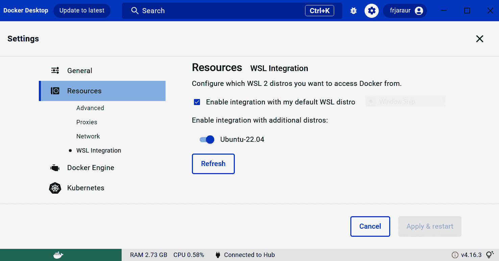
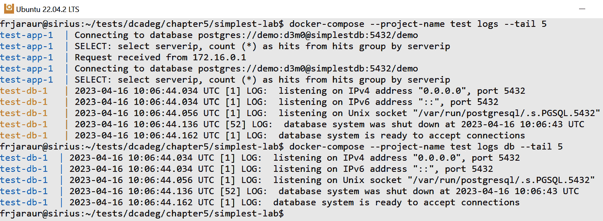
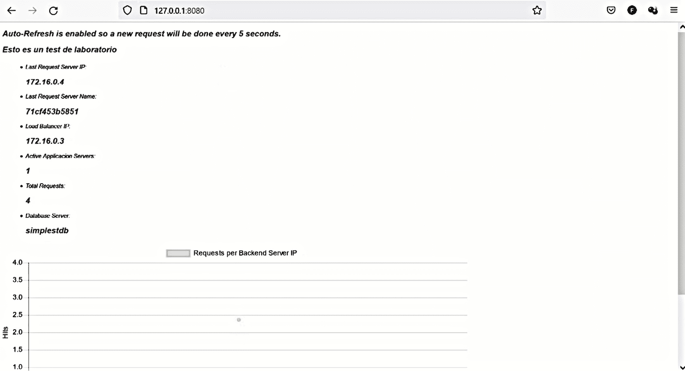

# 5

# 创建多容器应用程序

本书将一步步引导你使用容器开发应用程序的路径。在之前的章节中，我们学习了如何创建容器镜像，如何共享它们，最后，如何在容器内运行应用程序进程。在本章中，我们将进一步讨论如何使用多个容器运行应用程序。这是你开发应用程序时可能会使用的方法，通过运行不同的相互连接的组件、共享信息，并只将前端进程暴露给用户。通过本章的学习，你将能够构建、交付并运行由多个容器组成的应用程序，并使用新学会的命令行一次性管理这些容器。

本章将涵盖以下主题：

+   安装和使用 Docker Compose

+   介绍 Docker Compose 文件语法

+   构建和共享多容器应用程序

+   运行和调试多容器应用程序

+   使用 Docker Compose 管理多个环境

# 技术要求

我们将使用开源工具来构建、共享和运行由多个容器组成的应用程序。本章的实验将帮助你理解所展示的内容，实验文件可以在 [`github.com/PacktPublishing/Containers-for-Developers-Handbook/tree/main/Chapter5`](https://github.com/PacktPublishing/Containers-for-Developers-Handbook/tree/main/Chapter5) 上找到。本章的 *Code In Action* 视频可以在 [`packt.link/JdOIY`](https://packt.link/JdOIY) 观看。

# 安装和使用 Docker Compose

**Docker Compose** 是 Docker Inc. 开发的一款工具，帮助开发人员在多个容器中运行的应用程序中创建、交付和运行多个组件。这个工具可能随 Docker 容器运行时分发版一起提供，或者需要单独安装。如果你使用诸如 **Podman** 的工具，也会提供等效的命令行工具。

Docker Compose 于 2014 年作为一个开源项目开发，旨在基于 YAML 定义管理多个容器。该命令行将直接与 Docker 容器运行时 API 进行交互。这意味着所有由 `docker-compose` 文件管理的容器将一起运行在同一个容器运行时之上，因此在同一主机上。理解这一点非常重要，因为如果需要为你的应用提供高可用性，你将需要使用第三方工具和配置。我们可以将 Docker Compose 看作是一个单节点容器编排器。

如果你正在使用 Docker Desktop，你会注意到 Docker Compose 已经为你提供了。它应该已经集成到你的 WSL 环境中，如果你在 Docker Desktop 中勾选了**启用集成**选项（该选项应该在你环境中的所有前几章实验和示例中已经勾选）。你可以通过快速访问 Docker Desktop 设置来验证这一点，路径为**设置** | **资源** | **WSL 集成**：



图 5.1 – Docker Desktop WSL 集成设置

然后，你可以在 WSL 环境中打开终端，并简单地执行 `which docker-compose`：

```
$ which docker-compose
/usr/bin/docker-compose
```

Docker Desktop 安装了一个现代的 Docker CLI 环境，这包括一个内置的 `docker-compose` 链接。你可以通过简单地检索相关信息来验证这一点，如下所示：

```
$ docker compose --help
Usage:  docker compose [OPTIONS] COMMAND
Docker Compose
Options:
...
Commands:
  build       Build or rebuild services
…
  version     Show the Docker Compose version information
Run 'docker compose COMMAND --help' for more information on a command.
```

因此，我们可以使用 `docker-compose` 或 `docker compose` 来运行 `compose` 命令。

如果你直接在计算机上使用 Docker 容器运行时，并且客户端环境中没有这个内置链接，你需要正确安装 `docker-compose` 二进制文件。你可以使用以下任何一种方法：

+   使用 Python 包管理器安装 `docker-compose` 模块（`pip install docker-compose`）。这将安装最新的基于 Python 的 `docker-compose` 版本（1.29.2）：

    ```
    $ pip install docker-compose
    Defaulting to user installation because normal site-packages is not writeable
    Collecting docker-compose
      Downloading docker_compose-1.29.2-py2.py3-none-any.whl (114 kB) ——— 114.8/114.8 KB 3.9 MB/s eta 0:00:00
    ...
    Successfully installed attrs-22.2.0 bcrypt-4.0.1 certifi-2022.12.7 cffi-1.15.1 charset-normalizer-3.1.0 docker-6.0.1 docker-compose-1.29.2 dockerpty-0.4.1 docopt-0.6.2 idna-3.4 jsonschema-3.2.0 packaging-23.0 paramiko-3.1.0 pycparser-2.21 pynacl-1.5.0 pyrsistent-0.19.3 python-dotenv-0.21.1 requests-2.28.2 texttable-1.6.7 urllib3-1.26.15 websocket-client-0.59.0
    ```

    然而，这种方法将在新版本的 `docker-compose` 二进制文件使用 Go 语言构建后被淘汰。我们可以使用 `--version` 参数检查当前安装的版本：

    ```
    $ docker-compose --version
    docker-compose version 1.29.2, build unknown
    ```

+   `docker-compose` 包。我们将展示在 Ubuntu 22.04 上的安装步骤，该版本提供了所需的软件包及其依赖项：

    ```
    $ sudo apt-get install -qq docker-compose
    Preconfiguring packages ...
    Selecting previously unselected package pigz.
    …
    Setting up docker-compose (1.29.2-1) ...
    Processing triggers for dbus (1.12.20-2ubuntu4.1) ...
    Processing triggers for man-db (2.10.2-1) .
    ```

    如你所见，这种方法还会安装最新的基于 Python 的 `docker-compose` 版本：

    ```
    $ file /usr/bin/docker-compose
    /usr/bin/docker-compose: Python script, ASCII text executable
    ```

    Docker Compose v1 将在 2023 年 6 月被淘汰。我们应该至少使用 Docker Compose v2 和基于 Go 的适当命令行版本。该版本可以通过 Docker Desktop 自动安装，正如本节开头所提到的，或者通过将 Docker Compose 作为 Docker 客户端插件安装。

+   `docker-compose-plugin`。我们将以以下 Ubuntu 过程为例：

    ```
    $ sudo apt-get install docker-compose-plugin -qq
    Selecting previously unselected package docker-compose-plugin
    ...
    Unpacking docker-compose-plugin (2.17.2-1~ubuntu.22.04~jammy) ...
    Setting up docker-compose-plugin (2.17.2-1~ubuntu.22.04~jammy) ...
    $ docker compose version
    docker-compose version compatible with both Docker Compose v2 and v3.
    ```

重要提示

也可以直接通过从项目的 GitHub 仓库下载其二进制文件来安装 `docker-compose`。你可以使用以下链接查看进一步的安装说明：[`docs.docker.com/compose/install/linux/#install-the-plugin-manually`](https://docs.docker.com/compose/install/linux/#install-the-plugin-manually)。

一旦我们按照任何一种方法安装了 `docker-compose`，就可以快速回顾可用的主要功能：

+   我们可以构建多个镜像、代码块和 Dockerfile，它们可以分布在不同的文件夹中。这对于自动化一次性构建所有应用组件非常有用。

+   使用 `docker-compose` 共享应用的容器镜像组件更加简便，因为所有镜像将一次性推送。

+   我们可以使用 `docker-compose` 启动和停止基于多个容器的应用。所有组件默认情况下将同时运行，尽管我们可以定义组件间的依赖关系。

+   所有应用的标准错误和输出将通过单一命令获取，这意味着我们可以一次性访问所有应用日志。这在调试多个组件之间的交互时非常有用。

+   使用 `docker-compose` 来提供和淘汰环境非常简单，因为所有必需的应用组件都可以通过简单的操作如 `docker compose create` 和 `docker compose rm` 创建和删除。

+   `docker-compose` 非常适合轻松共享数据并隔离进程间通信。我们将只发布特定的应用进程，其他进程将保持内部运行，用户无法看到。

+   我们将使用 `<PROJECT>-<SERVICE_NAME>` 语法。我们可以通过使用 `docker-compose ls` 命令来获取运行中的项目列表。此命令将展示所有正在运行的 `docker-compose` 项目及其 Compose YAML 文件定义。

+   通过使用 `docker-compose --profile prod up --detach` 启动生产环境中的应用，而使用 `--profile debug` 将运行一些额外的组件/服务进行调试。我们将在 Compose YAML 文件中使用 `profile` 键来分组服务，服务可以被添加到多个配置文件中。我们将使用字符串来定义这些配置文件，并在后续的 `docker-compose` 命令行中使用它们。如果没有指定配置文件，`docker-compose` 将在不使用任何配置文件的情况下执行操作（没有配置文件的对象将会被使用）。

以下列表展示了 `docker-compose` 的主要操作：

+   `config`：此操作将检查并展示 Compose YAML 文件的回顾。它可以与 `--services` 或 `--volumes` 参数结合使用，以仅获取这些对象。如前所述，`--profile` 可用于特别获取某一组或一类对象的信息。

+   `images`：此命令展示了我们 Compose YAML 文件中定义的镜像。如果你在想是否需要构建镜像或镜像是否已经存在于你的环境中，这将非常有用。

+   `build`：即使你计划将应用程序部署到像 Kubernetes 这样的容器编排集群中，此操作也使得`docker-compose`成为一个非常强大的工具，因为我们可以通过一个命令构建所有应用组件的容器镜像。使用`docker-compose`创建的镜像将包含项目名称，因此它们将被标识为`<PROJECT_NAME>-<SERVICE_NAME>`。每个组件目录中应该包含一个 Dockerfile，尽管我们可以通过直接指定镜像仓库来覆盖某些镜像的构建。记得我们在*第三章*中学到的镜像标签知识，*发布 Docker 镜像*。我们可以通过`context`和`dockerfile`键来修改构建上下文和 Dockerfile 文件名。如果 Dockerfile 包含多个目标，我们可以通过`target`键定义用于构建服务镜像的目标。还可以通过`args`键传递构建过程中的参数，以使用一系列键值对来修改环境。

+   `pull`/`push`：定义的镜像可以一次性下载，镜像创建后，构建定义也可以推送到远程注册表。

+   `up`：此操作相当于对我们在 Compose YAML 文件中定义的每个组件/服务执行`docker run`。默认情况下，`docker compose up`会同时启动所有容器，并且我们的终端将附加到所有容器的输出，这对于测试可能很有趣，但对于生产环境来说则不适用（我们的终端将被附加到进程中，我们必须使用*Ctrl* + *P* + *Q*来脱离它们）。为了避免这种情况，我们应使用`-d`或`--detach`参数来将容器在后台启动。`docker-compose`还支持`run`操作，但通常用于一次运行特定服务。

+   `down`：此操作，顾名思义，执行与`up`相反的操作；它将停止并删除所有正在运行的容器。需要理解的是，如果之前使用此操作删除了容器，那么新的容器将被重新创建。任何持久化数据都必须存储在容器生命周期之外。要完全删除应用程序，请记得始终删除关联的卷。我们可以添加`--volumes`参数来强制删除任何关联的卷。

+   `create`/`run`/`start`/`stop`/`rm`：这些操作等同于我们在*第四章*中学到的操作，*运行 Docker 容器*，但在这种情况下，它们将应用于一次多个容器。

+   `ps`：由于我们为一个项目运行多个容器，因此此操作将列出所有关联的容器。容器的性能可以通过使用`docker-compose top`来查看，这是我们在*第四章*中学习的`docker stats`命令的扩展，*运行* *Docker 容器*。

+   `exec`：这个选项允许我们执行附加到某个容器（在这种情况下是项目的服务）上的命令。

+   `logs`：我们可以使用 `docker-compose logs` 来检索所有项目容器的日志。这对于通过单一视角和一个命令获取所有应用程序日志非常有用。容器输出将通过颜色进行区分，并且所有在*第四章*《运行 Docker 容器》中学到的过滤选项都会被应用，包括 `--follow`，它会持续跟踪所有日志。我们也可以通过将服务名称作为参数来仅检索某个服务的日志。

重要提示

虽然您通常会针对所有容器执行 `docker-compose` 操作，但也可以通过添加特定的服务名称来一次指定一个服务，`docker-compose <ACTION> <SERVICE>`。这个选项几乎适用于所有命令，并且在调试容器出现问题时非常有用。

既然我们已经知道如何安装 `docker-compose` 以及可以期待的功能，我们就可以学习如何使用它来创建应用程序了。

# 介绍 Docker Compose 文件语法

我们将使用带有 YAML 文件的 `docker-compose`，在该文件中我们将定义所有将一起运行并作为应用程序组件进行管理的服务、卷和网络。所使用的 YAML 文件应遵循 **Compose 应用模型**（更多信息请参见 [`github.com/compose-spec/compose-spec/blob/master/spec.md`](https://github.com/compose-spec/compose-spec/blob/master/spec.md)）。该模型将应用程序组件分布在 **服务** 中，并通过 **网络** 进行互相通信。这些网络为我们的应用程序容器提供了隔离和抽象层。服务将使用 **卷** 来存储和共享它们的数据。

服务可能需要额外的配置，我们将使用 **config** 和 **secret** 资源来添加特定的信息以管理应用程序的行为。这些对象将被挂载到我们的容器内，容器中的进程将使用提供的配置。Secrets 将用于注入敏感数据，容器运行时将以不同的方式处理它们。

正如本章前面讨论的，Compose v1 很快将被弃用，您应该迁移到至少 Compose v2。您的文件可能需要进行一些更改。您可以通过查看 [`docs.docker.com/compose/compose-file/compose-versioning`](https://docs.docker.com/compose/compose-file/compose-versioning) 来验证这一点。Compose 应用模型规范融合了 v2 和 v3 的对象定义。

现在，让我们深入了解 Docker Compose YAML 文件的定义关键字。

## YAML 文件定义关键字

默认情况下，`docker-compose` 命令将在当前目录中查找 `docker-compose.yaml` 或 `compose.yaml` 文件（你可以使用 `.yaml` 或 `.yml` 扩展名）。可以同时使用多个 Compose 文件，它们出现的顺序将决定最终使用的文件规范。值将被最新的文件覆盖。我们还可以使用在运行时可以扩展的变量，通过设置环境变量来实现。这将帮助我们使用一个包含变量的通用文件来支持多个环境。

Compose YAML 文件的基本结构如下所示：

```
services:
      service_name1:
            <SERVICE_SPECS>
...
      service_nameN:
            <SERVICE_SPECS>
volumes:
      volume_name1:
            <VOLUME_SPECS>
…
      volume_nameN:
            <VOLUME_SPECS>
networks:
      network_name1:
            <NETWORK_SPECS>
…
      network_nameN:
            <NETWORK_SPECS>
```

每个服务至少需要一个容器镜像定义或一个包含 Dockerfile 的目录。

让我们通过一个示例文件来回顾 Compose 语法：

```
version: "3.7"
services:
  # load balancer
  lb:
    build: simplestlb
    image: myregistry/simplest-lab:simplestlb
    environment:
      - APPLICATION_ALIAS=simplestapp
      - APPLICATION_PORT=3000
    networks:
      simplestlab:
          aliases:
          - simplestlb
    ports:
      - "8080:80"
  db:
    build: simplestdb
    image: myregistry/simplest-lab:simplestdb
    environment:
        - "POSTGRES_PASSWORD=changeme"
    networks:
       simplestlab:
        aliases:
          - simplestdb
    volumes:
      - pgdata:/var/lib/postgresql/data
  app:
    build: simplestapp
    image: myregistry/simplest-lab:simplestapp
    environment:
      - dbhost=simplestdb
      - dbname=demo
      - dbuser=demo
      - dbpasswd=d3m0
    networks:
       simplestlab:
        aliases:
          - simplestapp
    depends_on:
      - lb
      - db
volumes:
  pgdata:
networks:
  simplestlab:
    ipam:
      driver: default
      config:
        - subnet: 172.16.0.0/16
```

第一行用于标识使用的 Compose 语法版本。目前，`version` 键仅用于提供信息，添加此项是为了向后兼容。如果某些键在当前 Compose 版本中不被允许，我们将会收到警告，并且这些键将会被忽略。在撰写本书时，Compose YAML 文件不要求包含 `version` 键。

此 Compose YAML 文件包含三个服务定义：`lb`、`db` 和 `app`。它们都包含一个 `image` 键，定义了用于创建每个服务的镜像仓库。我们还有一个 `build` 键，定义了用于构建镜像的目录。拥有这两个键将允许我们在执行服务之前，先创建具有指定名称的镜像。正如你可能注意到的，我们为 `app` 服务定义了依赖关系。该服务依赖于 `lb` 和 `db` 服务，因此它们的容器必须在任何 `app` 容器启动之前处于运行并健康的状态。每个容器镜像中定义的健康检查将用于验证容器进程的健康状态。因此，作为开发者，你应该为应用组件定义适当的健康检查。

重要提示

尽管在这个例子中我们使用了 `depends_on` 键，但在我们的应用代码中，管理不同组件之间的依赖关系是非常重要的。这一点很重要，因为 `depends_on` 键仅在 Compose YAML 文件中有效。当你在 Docker Swarm 或 Kubernetes 中部署应用时，依赖关系不能以同样的方式进行管理。Compose 会为你管理依赖关系，但在编排环境中并没有这个功能，你的应用程序应该为此做好准备。例如，你可能需要在执行某些任务之前验证与数据库组件的连接，或者你可能需要在代码中处理因失去连接而导致的异常。你的应用组件可能需要多个组件，你应该决定在其中一个组件发生故障时你的应用该如何处理。如果关键的应用组件发生故障，应该停止代码执行，以避免整个应用的功能中断。

在这个例子中，我们还定义了一个卷 `pgdata` 和一个网络 `simplestlab`。`volumes` 和 `networks` 部分允许我们定义容器使用的对象。每个定义的服务应包含应附加到该服务容器的卷和网络。与服务关联的容器将以服务名称命名，并加上项目作为前缀。每个容器被视为服务的一个实例，并将进行编号；因此，最终容器的名称将是 `<PROJECT_NAME>-<SERVICE_NAME>-<INSTANCE_NUMBER>`。

我们可以为每个服务配置多个实例。这意味着可以为一个定义的服务运行多个容器。我们将使用 `--scale SERVICE_NAME=<NUMBER_OF_REPLICAS>` 来定义为特定服务运行的副本数量。

重要提示

如前所述，服务容器将使用动态名称，但我们可以使用 `container_name` 键来定义一个特定的名称。这对于从其他容器访问容器名称可能很有用，但此服务将无法扩展，因为如你所知，容器名称对于每个容器运行时都是唯一的，因此在这种情况下我们无法管理副本。

Compose YAML 文件允许我们覆盖容器镜像中定义的所有键。我们将在每个 `services` 定义块内包含它们。在示例中，我们为所有服务添加了一些环境变量：

```
…
services:
  lb:
    environment:
      - APPLICATION_ALIAS=simplestapp
      - APPLICATION_PORT=3000
…
  db:
    environment:
        - "POSTGRES_PASSWORD=changeme"
…
  app:
    environment:
      - dbhost=simplestdb
      - dbname=demo
      - dbuser=demo
      - dbpasswd=d3m0
…
```

正如你可能注意到的，这些环境变量定义了一些将改变应用组件行为的配置。这些配置中有些包含敏感数据，我们可以使用额外的 Compose 对象，如 `secrets`。非敏感数据可以使用 `config` 对象写入。

对于这些对象，将在根级别使用一个额外的键：

```
...services:
  app:
...
    configs:
     - source: appconfig
        target: /app/config
        uid: '103'
        gid: '103'
        mode: 0440
volumes:
…
networks:
...
configs:
  appconfig:
    file: ./appconfig.txt
```

在这个例子中，我们将所有 `app` 组件的环境变量更改为一个 `config` 对象，该对象将会被挂载到容器内。

重要提示

默认情况下，如果未使用 `target` 键，`config` 对象文件将会挂载到 `/<source>` 中。虽然有一种简短的方式可以将 `config` 对象文件挂载到服务容器内，但建议使用长格式，因为它允许我们指定 `source` 和 `target` 的完整路径，以及文件的权限和所有权。

秘密对象仅在 `swarm` 模式下可用。这意味着即使你只使用一个节点，你也必须执行 `docker swarm init` 来初始化一个单节点的 Swarm 集群。这将允许我们创建秘密，秘密会作为集群对象由 Docker 容器引擎存储。Compose 可以管理这些对象并将它们展示在我们服务的容器内。默认情况下，秘密会被挂载到容器中的 `/run/secrets/<SECRET_NAME>` 路径，但我们可以在接下来的例子中看到，这个路径是可以更改的。

首先，我们通过 `docker` `secret create` 创建一个包含数据库密码的秘密，该密码用于 `db` 服务：

```
$ printf "mysecretdbpassword" | docker secret create postgres_pass -
dzr8bbh5jqgwhfidpnrq7m5qs
```

然后，我们可以修改我们的 Compose YAML 文件，加入这个新的 `secret`：

```
…
  db:
    build: simplestdb
    image: myregistry/simplest-lab:simplestdb
    environment:
        - POSTGRES_PASSWORD_FILE: /run/secrets/postgres_pass
    secrets:
    - postgres_pass
…
secrets:
  postgres_pass:
     external: true
```

在这个示例中，我们通过标准输出创建了一个秘密，并使用 `external: true` 来声明该秘密已被设置，容器运行时必须使用其密钥存储来查找它。我们本来也可以使用文件作为来源。通常，也会通过以下格式将某些文件集成为容器内的 `secrets`：

```
secrets:
  my_secret_name:
    file: <FULL_PATH_TO_SECRET_FILE>
```

这里的主要区别在于，你可能会使用一个普通文本文件作为秘密，该文件将由 Docker 容器运行时加密并挂载到容器内部。任何可以访问该普通文本文件的人都能读取你的秘密。使用标准输出提高了安全性，因为只有容器运行时可以访问 `secret` 对象。事实上，Docker Swarm 存储也可以被加密，增加了一层新的安全保障。

现在我们已经理解了基本的 Compose YAML 语法，我们可以继续学习如何使用这些文件来构建和共享我们的应用容器镜像。

# 构建和共享多容器应用

Docker Compose 允许你在单个节点上运行多容器应用程序。这些应用程序实际上并不会具备高可用性，因为你会有单点故障，而且你可能更倾向于使用 Kubernetes 或 Docker Swarm 来使用集群编排。然而，即便在这些情况下，`docker-compose` 仍然可以帮助你构建和管理项目的容器镜像。在本节中，我们将学习如何使用这些功能。

你的 Compose YAML 文件将包含一些服务定义，每个服务的容器都需要一个镜像定义或 `build` 目录。`image` 键将用于下载该镜像（如果它在你的容器运行时中尚不存在）或设置服务容器镜像的名称，如果存在 `build` 文件夹的话。如我们在前一节中提到的，项目名称将默认作为所有镜像的前缀，但有了这个 `image` 键则可以覆盖这一行为。项目前缀有助于你识别为项目准备的所有镜像，但当一个项目需要执行两次（两个不同的项目实例）时，可能会导致混淆。在这种情况下，将为两个项目分别准备并推送镜像，而不是使用默认的文件夹名称来构建镜像，会更为方便。

现在我们将专注于与 `build` 相关的键：

```
services:
  lb:
    build: simplestlb
    image: myregistry/simplest-lab:simplestlb
...
  db:
    build: simplestdb
    image: myregistry/simplest-lab:simplestdb
...
  app:
    build: simplestapp
    image: myregistry/simplest-lab:simplestapp
```

如我们所述，`image` 键定义了要下载的镜像，但在这种情况下，`build` 键也存在，并且带有一个文件夹字符串，这意味着这个文件夹将用于构建镜像：

```
$ docker-compose --project-name test build \
--progress quit --quiet
$ docker image ls
REPOSITORY                TAG           IMAGE ID       CREATED      SIZE
myregistry/simplest-lab   simplestapp   26a95450819f   3 days ago   73.7MB
myregistry/simplest-lab   simplestdb    7d43a735f2aa   3 days ago   243MB
myregistry/simplest-lab   simplestlb    3431155dcfd0   3 days ago   8.51MB
```

正如你所注意到的，项目名称被包含在内，以避免使用默认的目录名作为前缀，但创建的镜像使用了定义的仓库和标签字符串。

让我们删除 `image` 键行并重新启动 `build` 过程：

```
$ docker-compose --project-name test build \
--progress quit --quiet
$ docker image ls
REPOSITORY                TAG           IMAGE ID       CREATED      SIZE
test-app                  latest        b1179d0492be   3 days ago   73.7MB
myregistry/simplest-lab   simplestapp   b1179d0492be   3 days ago   73.7MB
test-db                   latest        8afd263a1e89   3 days ago   243MB
myregistry/simplest-lab   simplestdb    8afd263a1e89   3 days ago   243MB
test-lb                   latest        4ac39ad7cefd   3 days ago   8.51MB
latest was used by default. This is what we expect in such situations, but we could have used any of the following keys to modify the build process:

*   `context`: This key must be included inside the `build` key to identify the context used for each image. All the files included in this `context` directory will be passed to the container runtime for analysis. Take care to remove any unnecessary files in this path.
*   `dockerfile`: By default, the container runtime will use any existing Dockerfile in your `build` folder, but we can use this key to change this filename and use our own.
*   `dockerfile_inline`: This key may be very interesting, as it allows us to use `inline` definitions, as we already learned in *Chapter 2*, *Building Docker Images*. These quick definitions don’t permit any `COPY` or `ADD` keys.
*   `args`: This key is equivalent to `--build-arg` and it allows us to add any required arguments to our `build` process. Remember that you should include appropriate `ARG` keys in your Dockerfile.
*   `labels`: We can include labels in our Dockerfile, and we can also add new ones or overwrite those already defined by using the `labels` key. We will include a list with these labels in key-value format.
*   `targets`: This key will identify which targets should be compiled in the `build` process. This may be of interest when you want to separate the base image and some additional debug ones from the production-ready final container images.
*   `tags`: We can add more than one tag at a time. This may be pretty interesting for defining a `build` process that creates a container image for different registries. By using this key, you will be able to push to all registries at the same time (you will need to be already logged in or you will be asked for your username and password).
*   `platforms`: Remember that we learned that `buildx` allowed us to prepare images for different container runtimes architectures (we learned how to create images for ARM64, AMD64, and so on in *Chapter 2*, *Building Docker Images*). In our Compose file, we can write which architectures must always be included in the `build` process. This is very interesting for automating your software supply chain.
*   `secrets`: Sometimes, we need to include a token, an authentication file with a username and password, or a certificate for accessing some SSL-protected site during the `build` process. In such situations, we can use a secret to introduce this information only at such a stage. You should always avoid adding sensitive information to your container images. Secrets will only be accessible to the containers created for building the image; thus they will not be present in the final image. We will need to define a `secrets` object in our Compose file, but this time, it will be used in the `build` process instead of the container runtime. Here is an example of adding a certificate required to access a server:

    ```

    服务：

    前端：

    构建：

    秘密：

    - server-certificate

    秘密：

    服务器证书：

    文件: ./server.cert

    ```

    We can use the long syntax, which is always recommended because it allows us to set the destination path for the included file (by default, the secrets will be present in `/run/secrets`) and its permissions and ownership:

    ```

    服务：

    前端：

    构建：

    秘密：

    - 来源: server-certificate

    目标：server.cert

    uid: "103"

    gid: "103"

    模式: 0440

    秘密：

    服务器证书：

    文件: ./server.cert

    ```

There are some keys that may be interesting to you if you plan on modifying the default caching behavior during the `build` processes. You can find additional information at [`docs.docker.com/compose/compose-file/build/`](https://docs.docker.com/compose/compose-file/build/).
You can push images to the registries to share them using `docker-compose` if you included a registry in the `image` key definition; otherwise, images will be local.
By default, all images will be pushed when you execute `docker-compose push`, but as with any other Compose action, you may need to pass a service as an argument. In this case, it is useful to use the `--include-deps` argument to push all the images of the services defined in the `depends_on` key. This will ensure that your service will not miss any required images when it is executed:

```

$ docker-compose --project-name test push --include-deps app

[+] 运行中 0/26bc077c4d137 层已存在   3.6 秒

⠇ 正在推送 lb: 0bc077c4d137 层已存在    3.8 秒

…

⠧ 正在推送 db: a65fdf68ac5a 层已存在    3.7 秒

…

⠧ 正在推送 app: 7dfc1aa4c504 层已存在   3.7 秒

```

 Notice, in this example, that even though we have just pushed the `app` service image, `lb` and `db` are also pushed to our registry because they were declared as dependencies.
In this section, we learned how to use `docker-compose` for building and sharing our application’s components. In the next section, we will run containers defined in our Compose YAML files and review their logs and status.
Running and debugging multi-container applications
Applications executed using Docker Compose will be orchestrated but without high availability. This doesn’t mean you can’t use it in production, but you may need additional applications or infrastructure to keep your components always on.
Docker Compose provides an easy way of running applications using a *single point of management*. You may have more than one YAML file for defining your application’s components, but the `docker-compose` command will merge them into a single definition. We will simply use `docker-compose up` to launch our complete application, although we can manage each component separately by simply adding its service’s name. `docker-compose` will refresh the components’ status and will just recreate those that have stopped or are non-existent. By default, it will attach our terminal to all application containers, which may be very useful for debugging but it isn’t useful for publishing our services. We will use `-d` or `--detach` to launch all container processes in the background.
The `docker-compose up` execution will first verify whether all the required images are present on your system. If they aren’t found, the container runtime will receive the order of creating them if a `build` key is found. If this key isn’t present, images will be downloaded from the registry defined in your `image` key. This process will be followed every time you execute `docker-compose up`. If you are changing some code within your application’s component folders, you will need to recreate them by changing your compose YAML `image` tags or the image’s digest.
Important note
You can use `docker-compose up --d --build` to specifically ask your container runtime to rebuild all the images (or part of them if you specified a service). As you may expect, the runtime will check each image layer (`RUN` and `COPY`/`ADD` keys) and rebuild only those that have changed. This will avoid the use of an intermediate `docker-compose build` process. Remember to maintain your container runtime disk space by pruning old unnecessary images.
As we already mentioned in this section, containers will always be created if they don’t exist when we execute `docker-compose up`. But in some cases, you will need to execute a fresh start of all containers (maybe some non-resolved dependencies in your code may need to force some order or reconnection). In such situations, we can use the `--force-recreate` argument to enforce the recreation of your services’ containers.
We will use the `entrypoint` and `command` keys to *overwrite* the ones defined in the images used for creating each service container and we will specifically define which services will be available for the users by publishing them. All other services will use the internally defined network for their communications.
As you may expect, everything we learned about `<PROJECT_NAME>_<SERVICE_NAME>_<INSTANCE>`); we will instead use the service’s name to locate a defined service. For example, we will use `db` in our `app` component connection string. Take care because your instance name will also be available but shouldn’t be used. This will really break the portability and dynamism of your applications if you move them to clustered environments where instances’ names may not be usable or if you use more than one replica for some services.
Important note
We can manage the number of container replicas for a service by using the `replicas` key. These replicas will run in isolation, and you will not need a load balancer service to redirect the service requests to each instance. Consider the following example:
`services:`
`app:`
`…`
`deploy:`
`replicas: 2`
`…`
In such a situation, two containers of our `app` service will be launched. Docker Swarm and Kubernetes will provide TCP load balancer capabilities. If you need to apply your own balancer rules (such as specific weights), you need to add your own load balancer service. Your container runtime will just manage OSI layer 3 communications ([`en.wikipedia.org/wiki/OSI_model`](https://en.wikipedia.org/wiki/OSI_model)).
Multi-container applications defined in a Compose file will run after we execute `docker-compose up --detach`, and to review their *state*, we will use `docker-compose ps`. Remember to add your project in all your commands if you need to overwrite the default project’s name (current folder). We can use common `--filter` and `--format` arguments to filter and modify the output of this command. If some of the service’s containers are missing, maybe they didn’t start correctly; by default, `docker-compose ps` will only show the running containers. To review all the containers associated with our project, we will use the `--all` argument, which will show the running and stopped containers.
If any issues are found in our project’s containers, we will see them as exited in the `docker-compose ps` command’s output. We will use `docker-compose logs` to review all container logs at once, or we can choose to review only the specific service in error by adding the name of the service to this command.
We can use the `--file` (or `-f`) argument to define the complete path to our Compose YAML file. For this to work, it is very useful to first list all the Compose applications running in our system by using `docker-compose ls`. The full path to each application’s Compose YAML file will be shown along with its project’s name, as in this example:

```

$ docker-compose ls

名称                状态              配置文件

测试                运行中(3)          /home/frjaraur/labs/simplest-lab/docker-compose.yaml

```

 In this case, we can add the path to the Compose file to any `docker-compose` action:

```

$ docker-compose --project-name test \

--file /home/frjaraur/labs/simplest-lab/docker-compose.yaml ps

名称                镜像                                         命令                  服务             创建时间             状态              端口

test-app-1          docker.io/frjaraur/simplest-lab:simplestapp   "node simplestapp.js…"   app                 25 小时前        运行中 28 分钟       3000/tcp

test-db-1           docker.io/frjaraur/simplest-lab:simplestdb    "docker-entrypoint.s…"   db                  25 小时前        运行中 24 分钟       5432/tcp

test-lb-1           docker.io/frjaraur/simplest-lab:simplestlb    "/entrypoint.sh /bin…"   lb                  25 小时前        运行中 24 分钟       0.0.0.0:8080->80/tcp

```

 This will work even with `build` actions, as the Compose YAML file location will be used as a reference for all commands. The `context` key may be included to modify its behavior.
We can review the port exposed for the application in the `docker-compose ps` output. To review our application’s logs, we can use `docker-compose logs`, and each service will be represented in a different random color. This is very useful for following the different entries in each service. We can specify a single service by passing its name as an argument.
The following screenshot shows the output of `docker-compose logs` using `--tail 5` to only retrieve the latest five lines:


Figure 5.2 – Service container logs retrieved by using docker-compose logs
Notice that in this simple test, we only have two services, and colors are applied to each one. We retrieved only the latest five lines of each container by adding `--tail 5`. This argument applies to all containers (we didn’t get the latest five lines of all logs merged). It is also important to mention that service names must be used as arguments when we need to use an action in a specific service. We will never use the container names; hence, we need to include the appropriate project name.
We can use the same approach to access a container’s namespace by using the `exec` action. Remember that we learned in *Chapter 4*, *Running Docker Containers*, that we can execute a new process inside our container (it will share all the container’s process kernel namespaces). By using `docker-compose exec <SERVICE_NAME>`, we can execute a new process inside any of our service’s containers:

```

$ docker-compose --project-name test exec db ps -ef

PID   用户     时间  命令

1 postgres  0:00 postgres

53 postgres  0:00 postgres: 检查点

54 postgres  0:00 postgres: 背景写入器

55 postgres  0:00 postgres: walwriter

56 postgres  0:00 postgres: autovacuum 启动器

57 postgres  0:00 postgres: stats collector

58 postgres  0:00 postgres: logical replication 启动器

90 root      0:00 ps -ef

```

 In summary, we will be able to run the same actions for containers by using `docker-compose`.
For you as a developer, Docker Compose can really help you develop applications faster. You will be able to run all application containers at once. In the development stage, you can include your code in specific containers by mounting a volume, and you can verify how your changes affect other components. For example, you can mount the code of one application component and change it while other components are running. Of course, you can do this without the `docker-compose` command line, but you will need to automate your deployments with scripts and verify the containers’ state. Docker Compose orchestrates this for you, and you can focus on changing your code. If you work in a team and all other developers provide container images and you share some application information, you can run these images locally while you are still working on your component.
Now that we know how to run and interact with multi-container applications, we will end this chapter by learning how to use environment variables to deploy your applications under different circumstances.
Managing multiple environments with Docker Compose
In this section, we will learn how to prepare our Compose YAML files as templates for running our applications in different environments and under different circumstances, such as developing or debugging.
If you are familiar with the use of environment variables in different operating systems, this section will seem pretty easy. We already learned how to use variables to modify the default behavior of Dockerfiles (*Chapter 2*, *Building Docker Images*) and containers at runtime (*Chapter 4*, *Running Docker Containers*). We used variables to overwrite the default values defined and modify the `build` process or the execution of container image processes. We will use the same approach with Compose YAML files. We will now review some of the different options we have to use variables with the `docker-compose` command line.
We can define a `.env` file with all the variables we are going to use in a Compose YAML file defined as a template. Docker Compose will search for this file in our project’s root folder by default, but we can use `--env-file <FULL_FILE_PATH>` or the `env_file` key in our Compose YAML file. In this case, the key must be set for each service using the environment file:

```

env_file:

- ./debug.env

```

 The environment file will overwrite the values defined in our images. Multiple environment files can be included; thus, the order is critical. The lower ones in your list will overwrite the previous values, but this also happens when we use more than one Compose YAML file. The order of the arguments passed will modify the final behavior of the execution.
You, as a developer, must prepare your Compose YAML files with variables to modify the execution passed to your container runtime.  The following example shows how we can implement some variables to deploy applications in different environments:

```

服务：

lb：

构建：

上下文: ./simplestlb

参数：

alpine 版本: "1.14"

dockerfile: Dockerfile.${environment}

标签：

org.codegazers.description: "测试镜像"

镜像: ${dockerhubid}/simplest-lab:simplestlb

环境：

- 应用别名=simplestapp

- 应用端口=${backend_port}

网络：

simplestlab:

别名：

- simplestlb

端口：

- "${loadbalancer_port}:80"

```

 In this example, we can complete our variables with the following `.``env` file:

```

环境=dev

dockerhubid=frjaraur

loadbalancer 端口=8080

后端端口=3000

```

 This environment file will help us define a base build and deployment. Different Dockerfiles will be included – `Dockerfile.dev` and `Dockerfile.prod`, for example.
We can then verify the actual configuration applied using `docker-compose`:

```

$ docker-compose --project-name test \

--file myapp-docker-compose.yaml 配置

名称: test

服务：

lb：

...

上下文: /home/frjaraur/tests/dcadeg/chapter5/simplest-lab/simplestlb

dockerfile: Dockerfile.dev

参数：

alpine 版本: "1.14"

标签：

org.codegazers.description: 测试镜像

环境：

应用别名：simplestapp

应用端口: "3000"

镜像: frjaraur/simplest-lab:simplestlb

...

端口：

- 模式: ingress

目标: 80

已发布: "8080"

协议：tcp

网络：

...

```

 All the values have already been assigned using the `.env` file, but these can be overridden manually:

```

$ dockerhubid=myid \

docker-compose --project-name test \

--file myapp-docker-compose.yaml 配置

…

镜像：myid/simplest-lab:simplestlb

…

```

 Remember that profiles and targets can also be used to prepare specific images and then run the services completely customized.
We can now review some labs that will help us better understand some of the content of this chapter.
Labs
The following labs will help you deploy a simple demo application by using some of the commands learned in this chapter. The code for the labs is available in this book’s GitHub repository at [`github.com/PacktPublishing/Containers-for-Developers-Handbook.git`](https://github.com/PacktPublishing/Containers-for-Developers-Handbook.git). Ensur[e that you have the latest revision available by simply executing `git`](https://github.com/PacktPublishing/Docker-for-Developers-Handbook.git) `clone https://github.com/PacktPublishing/Docker-for-Developers-Handbook.git` to download all its content or `git pull` if you have already downloaded the repository before. All commands and content used in these labs will be located inside the `Docker-for-Developers-Handbook/Chapter5` directory.
In this chapter, we learned how to deploy a complete application using `docker-compose`. Let’s put this into practice by deploying a sample application.
Deploying a simple demo application
In this lab, we will learn how to deploy an application with three components: a load balancer, a frontend, and a database.
There are hundreds of good Docker Compose examples and, in fact, there are many vendors who provide their applications packaged in the Compose YAML format, even for production. We chose this pretty simple application because we are focusing on the Docker command line and not on the application itself.
If you list the content of the `Chapter5` folder, you will see a folder named `simplestapp`. There is a subfolder for each component and a Compose file that will allow us to deploy the full application.
The Compose YAML file that defines our application contains the following code:

```

版本："3.7"

服务：

lb：

构建：simplestlb

镜像：myregistry/simplest-lab:simplestlb

环境：

- APPLICATION_ALIAS=simplestapp

- APPLICATION_PORT=3000

网络：

simplestlab：

别名：

- simplestlb

端口：

- "8080:80"

db：

构建：simplestdb

镜像：myregistry/simplest-lab:simplestdb

环境：

- "POSTGRES_PASSWORD=changeme"

网络：

simplestlab：

别名：

- simplestdb

卷：

- pgdata:/var/lib/postgresql/data

应用：

构建：simplestapp

镜像：myregistry/simplest-lab:simplestapp

环境：

- dbhost=simplestdb

- dbname=demo

- dbuser=demo

- dbpasswd=d3m0

网络：

simplestlab：

别名：

- simplestapp

依赖于：

- lb

- db

卷：

pgdata：

网络：

simplestlab：

ipam：

驱动：默认

配置：

- 子网：172.16.0.0/16

```

 This application is a very simplified demo for showing how various components could be deployed. Never use environment variables for your sensitive data. We already learned how to use `configs` and `secrets` objects in this chapter. It is good to also notice that we didn’t use a non-root user for the database and load balancer components. You, as a developer, should always try to keep security at the maximum on your application components. It is also important to notice the lack of health checks at the Dockerfile and Compose levels. We will learn more about application health checks in Kubernetes later in this book because it may not always be a good idea to include some **Transmission Control Protocol** (**TCP**) check tools in your images. In *Chapter 8*, *Deploying Applications with the Kubernetes Orchestrator*, we will learn how this orchestration platform provides internal mechanisms for such tasks and how we can enforce better security options.
In this lab, only one volume will be used for the database component, and the only service published is the load balancer. We included this service just to let you understand how we can integrate a multilayer application and only share one visible component. All images will be created locally (you may want to upload to your own registry or Docker Hub account). Follow the next steps to deploy the `simplestapp` application described in the `compose` file:

1.  To build all the images for this project, we will use `docker-compose build`:

    ```

    $ docker-compose --file \

    simplestlab/docker-compose.yaml \

    --project-name chapter5 build

    [+] 正在构建 0.0s (0/0)

    …

    => => 写入镜像 sha256:2d88460e20ca557fcd25907b5f026926b0e61d93fde58a8e0b854cfa0864c3bd 0.0s

    docker-compose run 来构建或拉取镜像并运行所有容器，但通过这种方式，我们可以逐步回顾过程。

    ```

Important note
If you reset your Docker Desktop before starting the labs, you may find some errors regarding an old Docker container runtime integration on your WSL environment:
`$ docker-compose --file simplestlab/docker-compose.yaml --project-name` `chapter5 build`
`docker endpoint for "default"` `not found`
The solution is very easy: simply remove your old Docker integration by removing your `.docker` directory, located in your home directory: `$ rm -``rf ~/.docker`.

1.  We can take a look at the images created locally:

    ```

    $ docker image ls

    仓库                       标签          镜像 ID          创建时间          大小

    myregistry/simplest-lab simplestapp 2d88460e20ca 8 分钟前 73.5MB

    myregistry/simplest-lab simplestdb e872ee4e9593 8 分钟前 243MB

    构建键存在时，执行构建过程，而不是直接拉取镜像。

    ```

     2.  Let’s now create the container for the database service:

    ```

    $ docker-compose --file \

    simplestlab/docker-compose.yaml \

    --project-name chapter5 创建 db

    [+] 正在运行 3/3

    :: 网络 chapter5_simplestlab 创建中 0.8s

    :: 卷 "chapter5_pgdata" 创建中 0.0s

    :: 容器 chapter5-db-1 创建中 0.2s

    ```

    All the objects required for the database service are created. It is not running yet, but it is ready for that.

     3.  We run this service alone and review its status:

    ```

    $ docker-compose --file \

    simplestlab/docker-compose.yaml \

    --project-name chapter5 up -d db

    [+] 正在运行 1/1

    :: 容器 chapter5-db-1 启动中

    ```

    If you omit the Compose filename and the project’s name, we will get neither the services nor the containers:

    ```

    $ docker-compose ps

    没有提供配置文件：未找到

    $ docker-compose --file simplestlab/docker-compose.yaml ps

    名称                   镜像                        命令                     服务              创建时间           状态              端口

    ```

    Always ensure you use the appropriate name and Compose file for all the commands related to a project:

    ```

    $ docker-compose --file \

    simplestlab/docker-compose.yaml \

    --project-name chapter5 ps

    名称                   镜像                         命令                     服务              创建时间           状态              端口

    通过使用 docker-compose up -d 启动 lb 和 app 服务：

    ```
    $ docker-compose --file \
    simplestlab/docker-compose.yaml \
    --project-name chapter5 up -d
    [+] Running 3/3
     :: Container chapter5-lb-1   Started                                        2.0s
     :: Container chapter5-db-1   Running                                  0.0s
    Created to Started.
    ```

    ```

     4.  We can now review the status of all our application components and the ports exposed:

    ```

    $ docker-compose --file \

    simplestlab/docker-compose.yaml \

    --project-name chapter5 ps

    名称                   镜像                        命令                     服务              创建时间           状态              端口

    chapter5-app-1 myregistry/simplest-lab:simplestapp "node simplestapp.js…" app 9 分钟前 正在运行 9 分钟 3000/tcp

    chapter5-db-1 myregistry/simplest-lab:simplestdb "docker-entrypoint.s…" db 16 分钟前 启动 15 分钟前 5432/tcp

    simplestlab 应用可以通过浏览器访问 http://127.0.0.1:8080:

    ```



Figure 5.3 – The simplestlab application
This allows us to graphically review how requests are distributed when multiple backends are available.

1.  We can scale our `app` component in this example. This option may be complicated or impossible in other deployments, as it really depends on your own application code and logic. For example, you should scale a database component without appropriate database internal scale logic (you should review the database server vendor’s documentation):

    ```

    $ docker-compose --file \

    simplestlab/docker-compose.yaml \

    --project-name chapter5 up --scale app=2 -d

    [+] 正在运行 4/4

    :: 容器 chapter5-db-1 运行中 0.0s

    :: 容器 chapter5-lb-1 运行中 0.0s

    :: 容器 chapter5-app-2 已创建 0.2s

    应用服务日志。我们将获取两个容器的日志：

    ```
    $ docker-compose --file \
    simplestlab/docker-compose.yaml \
    --project-name chapter5 logs app
    chapter5-app-1  | dbuser: demo dbpasswd: d3m0
    …
    chapter5-app-1  | dbuser: demo dbpasswd: d3m0
    …
    chapter5-app-2  | Can use environment variables to avoid '/APP/dbconfig.js' file configurations.
    ```

    ```

Finally, your application is up and running, and we can move on to the next lab, in which we will use the same Compose file to deploy a second project with the same application.
Deploying another project using the same Compose YAML file
In this simple example, we will review and discuss the problems we may encounter by running two projects using the same Compose YAML file. To do this, we will follow these instructions:

1.  Let’s create a new project by using a new project name:

    ```

    $ docker-compose --file \

    simplestlab/docker-compose.yaml \

    --project-name newdemo create

    [+] 正在运行 0/0

    :: 网络 newdemo_simplestlab 错误 0.0s

    docker-compose 定义：

    ```
    networks:
      simplestlab:
        ipam:
          driver: default
    ```

    现在我们再次尝试部署应用：

    ```
    $ docker-compose --file \
    simplestlab/docker-compose.yaml \
    --project-name newdemo create
    [+] Running 5/5
     :: Network newdemo_simplestlab  Created                           0.9s
     :: Volume "newdemo_pgdata"      Created                         0.0s
     :: Container newdemo-db-1       Created                         0.2s
     :: Container newdemo-lb-1       Created                    0.2s
    volume and network objects were created with the project prefix. We will not be able to reuse the project name because object names must be unique.
    ```

    ```

     2.  Let’s run all the application components now:

    ```

    $ docker-compose --file simplestlab/docker-compose.yaml --project-name newdemo start

    [+] 正在运行 1/2

    :: 容器 newdemo-db-1 已启动 1.4s

    :: 容器 newdemo-lb-1 启动中 1.4s

    lb 服务。这个在生产环境中看起来是可以的，但是在开发环境中定义特定端口会破坏容器化组件的动态性，因为在开发中可能需要运行多个应用副本。为了让其正常工作，我们可以简单地更改端口号，让系统为我们选择一个随机端口，或者定义一个变量来为每个项目指定端口。

    ```

     3.  We change our Compose YAML and add the `LB_PORT` variable as the port for exposing our application:

    ```

    services:

    lb:

    …

    ports:

    - "${LB_PORT}:80"

    ```

    Then, we test it again:

    ```

    $ LB_PORT=8081 docker-compose --file \

    simplestlab/docker-compose.yaml \

    --project-name newdemo up lb

    [+] 正在运行 1/1

    :: 容器 newdemo-lb-1 已重新创建

    ```

    Let’s review the component status:

    ```

    $ docker-compose --file simplestlab/docker-compose.yaml --project-name newdemo ps

    WARN[0000] "LB_PORT" 变量未设置，默认值为空字符串。

    NAME IMAGE COMMAND SERVICE CREATED STATUS PORTS

    newdemo-db-1 myregistry/simplest-lab:simplestdb "docker-entrypoint.s…" db 11 分钟前 启动 8 分钟前 5432/tcp

    newdemo-lb-1 myregistry/simplest-lab:simplestlb "/entrypoint.sh /bin…" lb 46 秒前 启动 34 秒前 0.0.0.0:8081->80/tcp

    $ docker-compose --file simplestlab/docker-compose.yaml --project-name newdemo up app -d

    [+] 正在运行 3/3

    :: 容器 newdemo-db-1 运行中 0.0s

    :: 容器 newdemo-lb-1 运行中 0.0s

    docker-compose.yaml 文件中，我们能够使用一个独特的 Compose YAML 文件部署第二个项目。我们可以列出主机上部署的项目及其组件数量：

    ```
    $ docker-compose ls
    NAME                STATUS              CONFIG FILES
    chapter5            running(4)          /home/frjaraur/labs/Chapter5/simplestlab/docker-compose.yaml
    newdemo             running(3)          /home/frjaraur/labs/Chapter5/simplestlab/docker-compose.yaml
    ```

    ```

With this simple example of the usual problems you may find while preparing your applications, we will end this chapter’s labs by removing all the objects created.
Removing all projects
To remove all the created projects, we will perform the following steps:

1.  We will remove all the deployed projects by using `docker-compose down`:

    ```

    $ docker-compose -f /home/frjaraur/labs/Chapter5/simplestlab/docker-compose.yaml --project-name chapter5 down

    WARN[0000] "LB_PORT" 变量未设置，默认值为空字符串。

    [+] 正在运行 5/5

    :: 容器 chapter5-app-2 已删除 0.1s

    :: 容器 chapter5-app-1      已移除                          0.1s

    :: 容器 chapter5-db-1       已移除                          0.1s

    :: 容器 chapter5-lb-1       已移除                          0.1s

    :: 网络 chapter5_simplestlab  已移除                          0.6s

    ```

    You may notice that volumes are not listed as removed. We can review the current volumes on your system:

    ```

    $ docker volume ls

    DRIVER    VOLUME NAME

    local     chapter5_pgdata

    chapter5 项目，但我们将使用 --volumes 参数来移除与项目相关的所有卷：

    ```
    $ docker-compose -f  /home/frjaraur/labs/Chapter5/simplestlab/docker-compose.yaml --project-name newdemo down --volumes
    WARN[0000] The "LB_PORT" variable is not set. Defaulting to a blank string.
    [+] Running 5/5
    :: Container newdemo-app-1      Removed                                  0.0s
    :: Container newdemo-lb-1       Removed                              0.1s
    :: Container newdemo-db-1       Removed                                0.1s
    :: Volume newdemo_pgdata        Removed                                       0.1s
    newdemo project was removed, as we can verify now, but the volume from the Chapter5 project is still present:

    ```

    $ docker volume ls

    DRIVER    VOLUME NAME

    local     chapter5_pgdata

    ```

    ```

    ```

     2.  We remove the remaining volume manually:

    ```

    $ docker volume rm  chapter5_pgdata

    chapter5_pgdata

    ```

Additional labs are included in this book’s GitHub repository.
Summary
In this chapter, we covered the basic usage of Docker Compose and discussed how it will help you develop and run your multi-component applications locally. You will be able to run and review the status of all your application’s components using a single command line. We learned about the syntax of Compose YAML files and how to prepare template-like files for developing your applications using different customizations. You will probably run your applications in production using a clustered orchestrated environment such as Docker Swarm or Kubernetes, but `docker-compose` does also provide a basic orchestration for running your multi-container applications in production using a single server. Understanding the basic orchestration and networking features of Docker Compose will help us introduce more sophisticated orchestration methods, which we will learn about in the next chapters.
In the next chapter, we will briefly review orchestration platforms that will help us run our applications cluster-wide.

```

# 第二部分：容器编排

在本书的这一部分中，我们将讲解如何在集群范围的环境中进行容器的**编排**。我们将学习如何在集群中的不同主机上部署分布式组件应用程序，允许用户与组件进行交互并发布服务。

本部分包含以下章节：

+   *第六章*，*编排基础*

+   *第七章*，*与群体协作*

+   *第八章*，*使用 Kubernetes 编排器部署应用程序*
